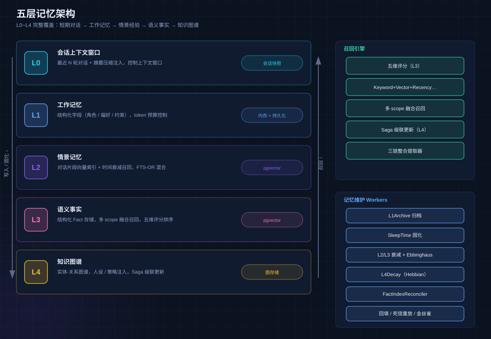
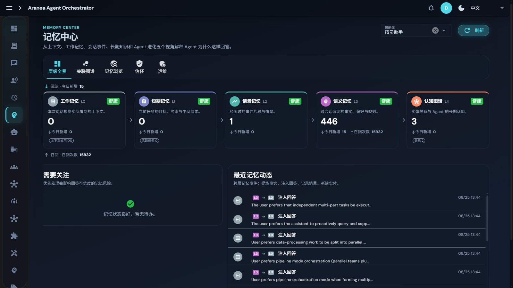
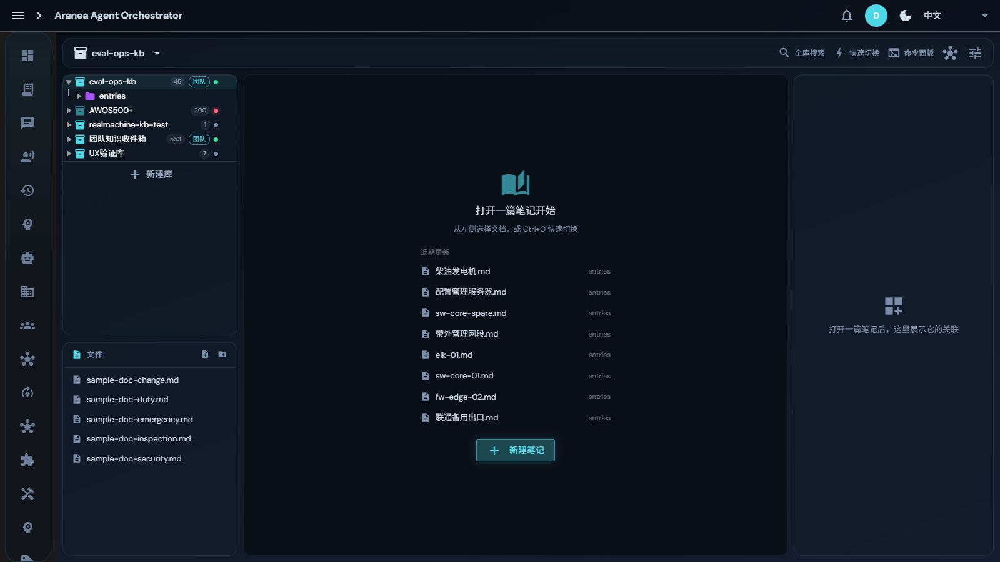

# Aranea-Agents

> **一人通过精灵控制 N 家公司，自己当发号施令的总裁，助力做你想做不敢做的事。**


---

## 一、为什么做 Aranea

今天的大模型已经很聪明，但把"聪明"变成"生产力"之间还隔着一道鸿沟：

- **Agent 是"金鱼脑"**——跨会话即遗忘，无法积累经验和知识，每次都从零开始；
- **单 Agent 有天花板**——真实业务需要多角色协作，但编排手段匮乏、过程是黑盒；
- **能力创建即固化**——Agent 上线后不会从运行经验中学习，越用越"笨"；
- **成本与安全失控**——Token 花了多少、花在哪，没人算得清；高危操作无人把关；
- **一人难成军**——个人想把 AI 组织成"公司"来运营一份业务，没有这样的工具。

Aranea-Agents 就是为解决这些问题而生的**企业级多智能体编排平台**：以 Kratos v2 为传输壳层、trpc-agent-go 为运行时内核，把 AI 组织成**模拟现实公司的组织架构**——分行业、分公司、分部门、分岗位，专人专事。你只需像总裁一样发号施令，精灵（Spirit）自动完成任务规划、人员分配、团队编排、执行与复盘。

---

## 二、独特之处

### 2.1 特殊场景应用：一人 N 家虚拟公司

不是通用聊天框，而是**可运营的业务组织**。内置金融、自媒体、软件开发三大行业体系（公司→部门→岗位三级编制，162 个预置专项 Agent 定义：金融 41 + 自媒体 39 + 软件开发 82，另附 24 支预置团队（金融 10 + 自媒体 6 + 软件开发 8）），每个岗位上的专项 Agent 自带使命、工具画像、MCP 门禁与技能。你可以同时运营多家"虚拟公司"，让它们按各自业务特点协作运转。


### 2.2 自主优化：五层记忆 × 运行数据学习

业界最完整的 **L0~L4 五层记忆架构**（会话窗口→工作记忆→情景向量→语义事实→知识图谱），配合 LearningLoop 学习闭环（观察→模式→提案→验证→注册），Agent 能从每一次真实运行中积累经验——记住你的偏好、复盘失败的原因、沉淀成功的模式。





### 2.3 指明方向后自动进化，人工审批把关

这是 Aranea 最核心的差异化能力：**你指明业务方向，系统自己变强，但每一步都经你批准。**

- **技能进化**：自动检测高频工具调用模式 → 生成 SKILL 提案 → 相同模式去重 / 相似功能 AI 炼化合并 → **人工审批**后注册生效；
- **Agent 进化**：采集工具成功率、检索质量、负面反馈 → 自动生成 Persona/Prompt 优化建议 → **人工审批**后应用；
- **编排进化**：记录每次 Spirit 编排的拓扑与 DQ 评分，下次同类任务自动推荐更优拓扑；
- **三重护栏**：变更限速 + 最低数据点 + 质量下降自动回滚，进化永不失控。


### 2.4 更多差异化

| 能力 | 说明 |
|------|------|
| **三层编排引擎** | Team 六模式 + Graph 图编排 + Spirit 动态编排，Graph 即 Team 统一底层 |
| **全链路可观测** | Trace + Flow Log + 根因分析 + 自动自愈 + TimeTravel 回溯 |
| **精细成本管控** | 六维定价 × 微美元精度 × 三级配额 × 预算告警，每分钱算得清 |
| **14 通道接入** | 飞书/钉钉/企微/Slack/Discord 等一键接入，一次创建全平台可用 |
| **A2A 联邦协议** | 基于 Google A2A 标准的跨组织 Agent 互操作，打破孤岛 |
| **五重安全防护** | confirmation_guard + permission_guard + sensitive_data_mask + output_policy + cost_guard |
| **全功能 CLI** | Claude Code 式 REPL，26 命令域 130+ 子命令，WebSocket 实时流 |

---

## 三、系统架构


**技术栈**：Go + Kratos v2（HTTP/gRPC/WebSocket）| trpc-agent-go（Agent 运行时内核）| Vue 3 + Quasar + Pinia + TypeScript | PostgreSQL（Ent ORM + pgvector）| Wire（编译期 DI）

**Spirit 精灵动态编排**——平台的"大脑"：


你下达一句指令，三阶段管线自动完成：① TaskPlanner 任务规划（评估→路由→记忆召回→分解→确认）→ ② AgentAllocator 人员分配（花名册匹配→冲突检测）→ ③ TaskOrchestrator 编排执行（DAG 构建→并行执行→检查点→综合→学习）。


---

## 四、业务模块总览

45+ 业务模块，按核心域划分：

| 域 | 模块 | 核心功能 |
|----|------|----------|
| **编排** | Spirit / Team / Graph | 动态编排三阶段管线；六种编排模式；可视化 DAG + TimeTravel |
| **记忆** | 五层记忆 L0~L4 | 多 scope 融合召回、Saga 级联更新、12 个后台维护 Worker、可视化记忆中心 |
| **进化** | 技能进化 / Agent 进化 / 评估 | 自动发现去重融合、人工审批、护栏机制、LLM Judge + PromptIter |
| **组织** | 公司 / 部门 / 岗位 | 三级编制、专项 Agent 工具画像、行业模板、生态市场 |
| **可观测** | Trace / Flow Log / 自愈 | 链路追踪、根因分析、自动修复（置信度 0.7+）、告警、诊断包 |
| **成本** | 用量 / 配额 / 定价 | 六维定价、微美元精度、三级配额、预算告警、低效模型洞察 |
| **接入** | Channel / A2A / MCP | 13 种 IM 平台、A2A 联邦、MCP 服务器管理与健康监控 |
| **安全** | 插件 / 钩子 / 护栏 | 9 个内置插件（+框架常驻插件）、五重防护、事件驱动 Webhook |
| **模型** | Provider / 模型目录 | models.dev 同步、12+ Provider、六维定价、能力标记 |
| **知识** | 知识库 / 技能 | 文档管理、向量检索、渐进式技能加载 |
| **工具** | CLI / 定时任务 / 沙箱 | 130+ 子命令 REPL、Cron 调度、Docker 隔离代码执行 |

各模块的**功能原理、设计方案与界面配置详解**见 [用户手册](doc/manual/README.md)。

### 界面一览

| Agent 工作区 | Team 编排 | Graph 工作流 |
|:---:|:---:|:---:|
|  |  |  |

| 用量明细 | MCP 服务器 | 知识库 |
|:---:|:---:|:---:|
|  |  |  |

---

## 五、部署

### 方式 A：Docker 一键部署（推荐）

唯一依赖是 Docker。一条命令拉起全栈（后端 + PostgreSQL/pgvector + Redis）：

```bash
# Windows PowerShell
powershell -ExecutionPolicy Bypass -File docker/dev-up.ps1

# 或通用方式
docker compose up -d
```

服务端口：HTTP `8810` / gRPC `9910` / WebSocket `8812`。健康检查：`curl http://localhost:8810/healthz`。

> 📌 **Web 界面**：Docker 编排仅含后端与中间件，**不含前端**。获取界面：
>
> - 开发/试用：源码 `cd web && pnpm dev`（访问 `http://localhost:9301`，自动代理 API/WS）；
> - 生产自用：`cd web && pnpm build` 后用任意静态服务器托管 `dist/spa`，并将 HTTP API 反代到 8810、WS 反代到 8812；
> - 桌面用户：直接用下方的 Windows 安装包（自带全栈 + 桌面应用）。

### 方式 B：Windows 桌面安装包（零命令行）

下载安装包双击即用。**Launcher 自动完成全部部署**：环境预检 → 探测系统 PostgreSQL/Redis（无则启动内置实例）→ 启动后端 → 打开桌面应用。首次运行弹出配置向导，支持注册开机自启（Windows 服务 / 登录计划任务）。

```text
AraneaLauncher flags:
  (默认)               启动全栈 + 桌面应用（首跑配置向导）
  -check               仅做环境检查并输出报告
  -setup               交互式配置向导（PG/Redis/自启动）
  -headless            仅启动后端栈（自启动场景）
  -install-autostart   注册开机自启
```

### 方式 C：源码开发

**环境要求**：Go 1.26+ · Node.js 20+ · pnpm · PostgreSQL（必需，启用 pgvector 扩展）

```bash
make all                     # 一键初始化（proto + wire + ent + 构建）

# 启动后端（开发免登录模式；必须带 -tags pgvector）
$env:DEPLOY_ENV="dev"; $env:KRATOS_HTTP_AUTH_DISABLED="1"
go run -tags pgvector ./cmd/admin -conf ./configs/config.yaml

# 启动前端
cd web && pnpm install && pnpm dev   # http://localhost:9301
```

> ⚠️ 免登录模式自动种子账号 `dev` / `dev`；真实登录模式全新库首启为 `admin` / `changeme`。
> ⚠️ 缺失 `-tags pgvector` 时向量存储静默降级，记忆中心 L2/L3 语义召回不可用。

---

## 六、如何使用

### 6.1 三条上手路径

**路径 1：直接对话精灵（30 秒）** — 打开 Web → 聊天页 → 对精灵助手说"帮我做一份新能源汽车行业调研"，Spirit 自动规划、组队、执行、交付。

**路径 2：组建你的公司（10 分钟）** — 组织架构页新增公司 → 从行业模板批量生成部门与岗位 → 岗位上自动就位专项 Agent → 对精灵下达业务指令。

**路径 3：编排确定性流程** — Team 页选择六种模式之一组建固定团队，或 Graph 页拖拽节点构建可视化工作流（支持条件路由、人工审批节点、状态回溯）。

### 6.2 CLI 全功能管理

```bash
make cli                                        # 构建 aranea CLI
./bin/aranea login --base-url http://localhost:8810 --user dev --password dev
./bin/aranea agent ls                           # Agent 管理
./bin/aranea chat --agent __spirit__            # 交互式对话精灵
./bin/aranea team run <team_id> --content "..." # 触发团队编排
./bin/aranea monitor events                     # 运行事件监控
```

CLI 覆盖 Agent / Team / Graph / Skill / MCP / Channel / Tool / Cron / Org / Memory / Knowledge / Pack / Monitor 等 26 个命令域、130+ 子命令，支持 text / json 两种输出格式，脚本友好。详见 [CLI 工具手册](doc/manual/14-cli.md)。

### 6.3 让系统越用越强

1. **日常使用**——记忆系统持续积累偏好与事实（记忆中心可视化查看）；
2. **定期审批**——进化建议页审批技能/Agent 优化提案（全部需人工批准）；
3. **指明方向**——通过评估系统标注 badcase、反馈评分，驱动 LearningLoop 定向优化；
4. **观察复盘**——Trace + 用量事件 + 进化面板，每一步有据可查。

---

## 七、测试与质量保证

- **后端**：`go test ./...` 单元测试 + `-tags=integration` 集成测试 + 真实 PG 迁移路径测试 + race detector；
- **前端**：Vitest 单元测试 + Playwright E2E + TypeScript strict；
- **Lint**：golangci-lint + ESLint + Stylelint + `make archlint` 架构守护（依赖方向/接口窄化/认知复杂度）；
- **CI**：GitHub Actions 自动化测试 + CodeQL 安全扫描 + 架构 Fitness Function。

---

## Agent Memory Challenge 2026（评测入口）

本仓库参加首届 Agent 记忆挑战赛（[Agent Memory Leaderboard](https://agentmemories.ai/competition/)）学术方法榜。参评实现为独立评测入口 `cmd/memoryeval/`（**不影响主程序**），将平台 Add/Search 契约桥接到 L3 浅分类事实 + L2 session 时间线。

```bash
docker compose -f docker-compose.eval.yml build
EVAL_MEMORY_TOKEN=<memory-system-key> docker compose -f docker-compose.eval.yml up -d
curl http://localhost:8910/healthz
```

端点契约：`POST /v1/memory/add`（写入）、`POST /v1/memory/search`（检索证据）、`GET /healthz`。鉴权 `Authorization: Bearer <EVAL_MEMORY_TOKEN>`，`user_id` 为唯一检索隔离边界。方法披露见 [docs/scenarios/agent-memory-challenge/](./docs/scenarios/agent-memory-challenge/README.md)。

---

## 文档导航

- **[用户手册](doc/manual/README.md)**——分模块的功能原理、设计方案与界面配置详解
- [开发文档](docs/development/) · [架构决策](docs/development/65-module-cross-reference-full.md) · [组织不变量](docs/development/org-invariants.md)
- [AGENTS.md](./AGENTS.md)——仓库协作规约

## License

See [LICENSE](./LICENSE).

*Aranea-Agents — 一人通过精灵控制 N 家公司，自己当发号施令的总裁。*
