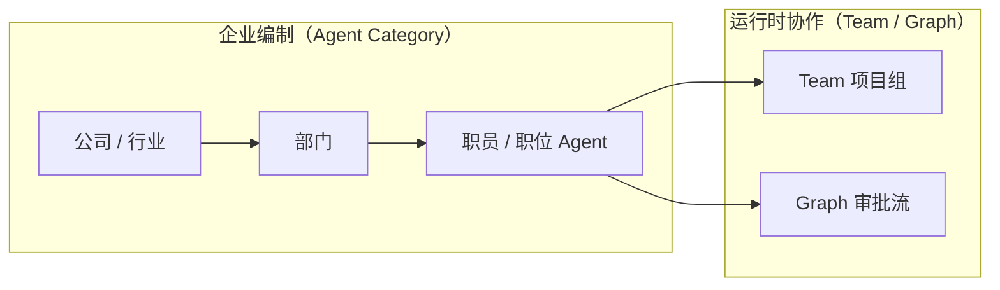
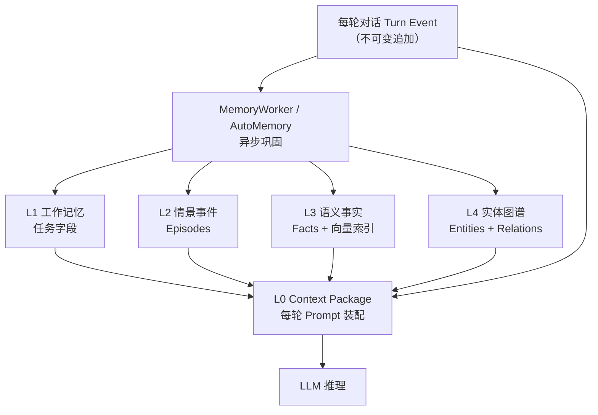
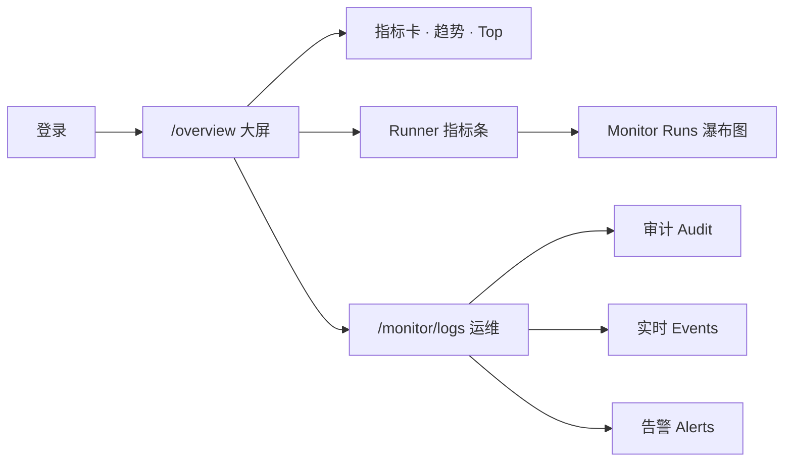
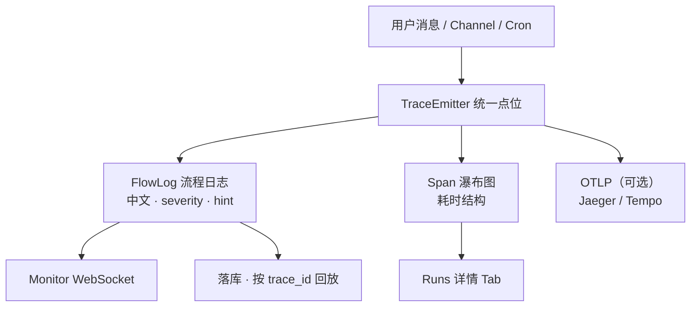
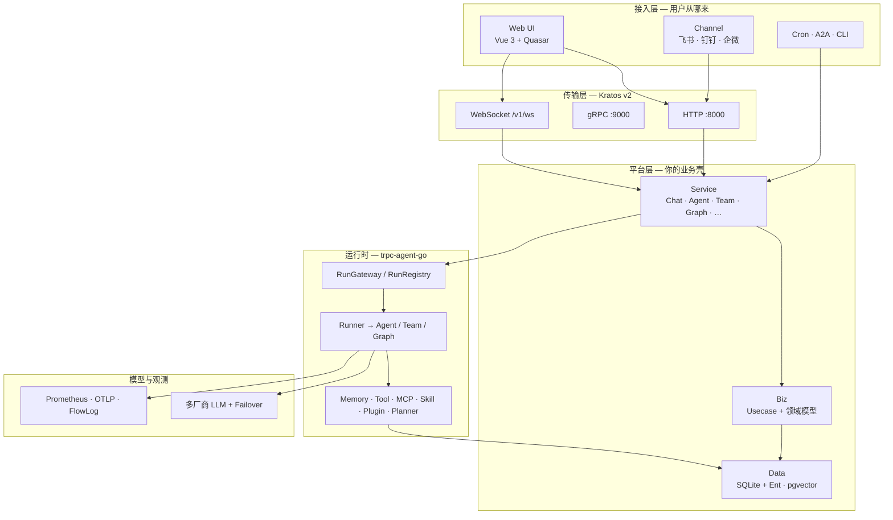
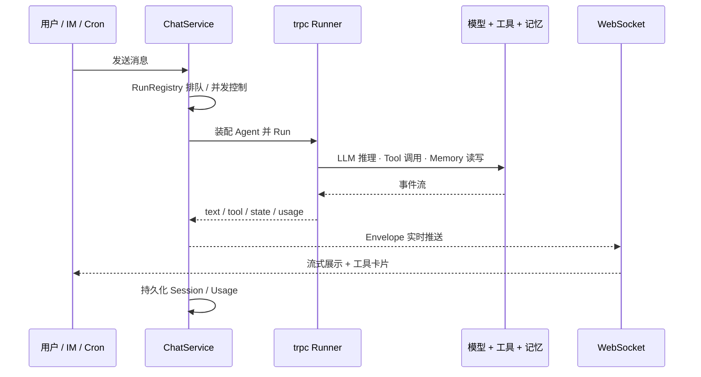

# Aranea-Agents

> **企业级 AI Agent 编排平台** — 可视化搭建、多通道触达、可观测、可扩展

**Aranea-Agents** 不是「套一层 Chat API」的 Demo，而是一套 **可自托管、可二次开发** 的 Agent 平台：从 Web 管理台到飞书 / 钉钉 / 企微 IM，从单 Agent 对话到 Team / Graph 多智能体编排，从工具 / MCP / Skill 挂载到五层记忆与全链路监控，**一条主链路跑通**。

```
  Web UI ──┐
  飞书/钉钉 ──┼──▶ 统一 RunGateway ──▶ trpc-agent-go Runner ──▶ 模型 / 工具 / 记忆
  Cron/A2A ──┘         │                        │
                       └──── WebSocket 实时推送 ◀┘
```

| | |
|---|---|
| **适合谁** | 想自建 Agent 平台的技术团队 · 需要 IM 接入的企业 · 做多 Agent 编排的开发者 |
| **开箱即用** | 管理后台 + Chat + Agent CRUD + Team/Graph + Channel + **`/overview` 大屏** + **FlowLog 跟踪** |
| **深度可定制** | Go 分层架构 · Proto 契约 · 本地 vendored `trpc-agent-go` · 40+ 模块文档 |

---

## 为什么选择 Aranea

### 给用户 / 业务方

| 亮点 | 说明 |
|------|------|
| **一个平台，多种触达** | Web 聊天、飞书 / 钉钉 / 企微 Channel、定时 Cron、A2A 互联 — 共用同一套 Session 与 Run 生命周期 |
| **三种编排，由简入繁** | **Agent** 单智能体 · **Team** 五种协作模式（主控 / 顺序 / 并行 / 群智 / 评审闭环）· **Graph** 确定性工作流（条件分支、HITL、检查点） |
| **看得见的运行过程** | **`/overview` 运营大屏** + WebSocket 流式输出、工具卡片、Reasoning；Monitor **流程日志**逐步跟踪 + Runs 瀑布图 |
| **记忆不丢、上下文可控** | **五层神经记忆**（非单层向量库）— L1 任务板 + L3 可纠正事实 + L4 实体级联；Memory Center 可视化治理 |
| **模型随意换** | OpenAI / Anthropic / Gemini / Ollama / 混元 / Bedrock 等，Failover / Hedge 高可用 |

### 给开发者

| 亮点 | 说明 |
|------|------|
| **架构边界清晰** | Kratos 管传输，`trpc-agent-go` 管运行时；`biz` 层零框架依赖 — 改业务不怕牵一发动全身 |
| **不是黑盒 SDK** | `pkg/trpc-agent-go` 源码在仓内，可对齐 [OpenClaw](https://github.com/trpc-group/trpc-agent-go/tree/main/openclaw) 参考实现，按需扩展 Runner / Plugin / Graph |
| **Proto 即契约** | `api/kratos/*.proto` 生成 Go HTTP/gRPC + 前端 TS 类型，前后端同一份 API 真相 |
| **扩展点齐全** | Tools · MCP Broker · Skill · Plugin/Callback · CodeExecutor · Knowledge RAG · Evaluation · Artifact |
| **可观测、可排障** | **`/overview` Token/成本大屏** + FlowLog 中文流程日志 + Runs 瀑布图 + 告警 Webhook — 业务与研发各看各的视图 |
| **文档即生产力** | 为 AI 编码入口，模块需求 / 设计 / 开发计划齐全，适合人机协作迭代 |

---

## Aranea 特色功能

> 区别于「单 Bot + 文件记忆 + IM 转发」的通用 OpenClaw 装配，Aranea 面向 **企业组织、长期记忆与可观测运维** 做了产品级设计。

### 企业职级 Agent：公司 → 部门 → 职员

Aranea 用 **三层业务分类树** 管理 Agent 编制，像搭公司架构一样搭 AI 团队 — 每个 Agent 绑定一个 **职员（职位）** 节点，行业与部门由树结构自动推导。

```
IT 行业（公司）
├── 游戏开发部（部门）
│   ├── UE5 场景设计师（职员 Agent）
│   └── 游戏策划（职员 Agent）
└── 系统开发部（部门）
    ├── Golang 后端高级工程师（职员 Agent）
    └── DevOps 工程师（职员 Agent）
```

| 层级 | 产品语义 | 你能做什么 |
|------|----------|------------|
| **公司** | 行业（Industry） | 按业务线划分 Agent 池，预置 + 自建并存 |
| **部门** | 部门（Department） | 同一行业下按职能分组，列表筛选、批量管理 |
| **职员** | 职位（Position） | 每个 Agent 的「岗位画像」— 创建时级联选择，绑定 `category_position_id` |

**与 Team 编排组合**：职员 Agent 是「编制」，Team 是「项目组」— 主控分派像部门经理协调各岗位，顺序 / 并行 / 评审闭环像跨部门流水线。内置 Team 模板（顺序链、专家组、生成-评审、主控分派）可直接套用。



---

### 内置工具生态 — 开箱即用，不是空壳

平台启动时自动种子 **30+ 内置工具**，按风险分级、支持 Agent 级覆盖与确认门控，并可与 MCP / Skill 混挂 — 无需从零写 Tool 注册代码。

| 类别 | 代表工具 | 典型用途 |
|------|----------|----------|
| **Web 研究** | `web_research` · `web_fetch` · `google_search` · `arxiv_search` · `wikipedia_search` | 联网检索、论文、百科 |
| **文件工作区** | `read_file` · `save_file` · `search_content` · `diff_edit` · `patch_file` | 读写在库、片段级编辑（Cursor 式） |
| **记忆** | `memory_search` · `memory_get` · `working_memory.*` | 长期 recall + L1 结构化任务板读写 |
| **Skill** | `skill_search` · `use_skill` | 技能包发现与运行时挂载 |
| **多模态** | `read_image` · `read_document` | 图片 / PDF / Office 理解 |
| **协作** | `call_agent` · `kanban` · `knowledge_search` · `await_user_reply` | A2A 互调、Graph 看板、RAG、HITL 暂停 |
| **系统** | `datetime` · `todo_write` | 时间上下文、待办追踪 |
| **高权限（默认关）** | `shell_exec` · `send_email` · `claude_code` | 需显式启用 + 确认门控 |

工具目录在管理台可视化配置：启用 / 禁用、参数 Schema、Agent 覆盖、`requires_confirmation` 策略。
---

### 五层神经记忆系统 — Aranea 的核心差异

多数 Agent 框架只有「聊天记录 + 向量库」。Aranea 设计了 **L0–L4 五层记忆 + Memory Center 治理面**，把「上下文、任务、事件、知识、进化」分开管理，并支持 **冲突检测、级联更新、用户纠正与回滚**。

#### 用户视角：Agent 记得什么？

| 层 | 用户名称 | Agent 用它做什么 |
|----|----------|------------------|
| **L0** | 上下文窗口 | 本轮发给模型的材料 — 消息、摘要、压缩快照、Token 预算 |
| **L1** | 工作记忆 | 当前任务的「状态板」— 结构化字段（目标、进度、中间结论），Agent 可 `working_memory.write` |
| **L2** | 会话事件 | 这次对话的关键片段 — 时间线、Episode、重要性标记 |
| **L3** | 知识记忆 | 长期事实与偏好 — 可搜索、可反驳、可版本化；支持向量 + 关键词混合检索 |
| **L4** | 图谱与进化 | 实体关系网（人 / 项目 / 地点）+ Agent 自我进化提议 — **属性变更可级联关联记忆** |

#### 架构核心：Ledger → Views → Policy



- **Ledger（账本）**：消息、工具调用、记忆变更动作 — 全程可审计、可溯源  
- **Views（视图）**：L1–L4 表 + pgvector 可选索引 — 从 Ledger 派生，可重建  
- **Policy（策略）**：何时读 / 写 / 遗忘 / 级联 — 显式记录为 ADD / UPDATE / DELETE 动作，不是 prompt 黑箱  

#### 为什么这很重要？（级联记忆示例）

> 用户：「我原来在北京工作，通勤走 13 号线；现在调到纽约了。」

普通 RAG 可能仍检索到「13 号线」旧事实。Aranea L4 将 **人 → 工作地点** 建模为带时序的实体关系；地点变更触发 **级联提议**，关联的交通、天气、日程类 L3 事实进入待审核队列，用户确认后批量更新 — Agent 不会用旧地点答新问题了。

Memory Center 管理台回答四个问题：**Agent 现在看见什么？正在记什么任务？会话发生了什么？长期知道什么？** — 每条注入 Prompt 的记忆都可追溯来源与分数。

---

### 大屏监控 — 登录即见的运营大盘

Aranea 把 **用量 / 成本 / 成功率** 做成独立 Dashboard（`/overview`），登录后默认首页 — 适合投屏、晨会、管理层一眼看全局，而不是埋在日志文件里。

| 能力 | 说明 |
|------|------|
| **核心指标卡** | 今日调用次数、Token 消耗、估算费用、成功率 — 支持日期区间切换 |
| **ECharts 趋势** | 调用量 / Token / 费用 / 成功率按天折线；成功率堆叠柱 |
| **Top 排行** | 最贵模型、最活跃 Agent、异常调用 — 快速定位热点 |
| **Runner 指标条** | 窗口内成功率 / 错误率 — 点击下钻 **Runs 瀑布图** 排障 |
| **运维快捷入口** | 从大盘一键跳转 Monitor：Runs · Events · Alerts · Logs |
| **告警出站** | 错误率超阈触发规则 → Webhook / Channel 通知 + 冷却防刷 |

**典型视图**：登录 → `/overview` 看今日 Token 与成功率 → 异常下钻 Runs 瀑布图 → Logs「流程日志」定位卡在哪一步（如 LLM 超时、Tool 失败、Channel 出站异常）。



---

### 全链路日志跟踪 — 知道「卡在哪一步」

多数 Agent 项目只有 stderr 或 Jaeger Span，业务同学看不懂。Aranea 用 **FlowLogger v2** 做「业务语义层」日志，与 OTel Trace、Runs 瀑布图 **同源 trace_id**，Monitor 三分流各司其职：

| Monitor 模块 | 回答什么问题 | 特点 |
|--------------|--------------|------|
| **Audit 审计** | 谁改了什么配置？ | 管理操作留痕，支持筛选 / 详情 |
| **Events 实时事件** | Team / Agent 现在正在发生什么？ | WebSocket 推送 `team_run_*`、告警等 |
| **Runs（Traces）** | 这一轮对话花了多久、用了多少 Token？ | 单次运行列表 + **瀑布图** + Span 导出 |
| **Logs → 流程日志** | **这次对话卡在哪一步？** | 中文步骤 + **红/黄/绿 severity** + 排障 hint |
| **Logs → 进程日志** | Gateway / 插件底层是否正常？ | 进程 stderr，与业务流程分离 |

#### 流程日志：人类可读 + AI 可解析

一次用户请求从进入到结束，关键步骤经 **TraceEmitter** 统一打点，实时推到 Monitor「流程日志」Tab：



- **severity 五级**：`ok / info / warn / error / critical` — 前端映射红 / 黄 / 绿，一眼识别异常  
- **业务中文文案**：如「正在调用语言模型」「工具执行完成」，而非 `chat.llm_call.start`  
- **按链路聚合**：同一 `trace_id` / `run_id` 下 Chat、Team、Channel、Tool 步骤串成时间线  
- **与 Chat 联动**：从 Runs 详情可「打开会话」深链，从 Session 可反查 FlowLog  
- **Channel / Team 同源**：飞书入站、Team 多成员、Graph 节点执行共用同一套 `trace_id`，Monitor 按 Session 订阅即可看到全链路

**流程日志示例（同一轮对话）**：

```
✓ 收到用户消息
✓ 装配 Agent 与工具
→ 正在调用语言模型 …
✓ 工具 web_research 执行完成
✓ 本轮回复已发送
```

---

### 与通用 OpenClaw 装配的差异（一览）

| 维度 | 典型 OpenClaw 装配 | Aranea |
|------|-------------------|--------|
| **Agent 组织** | 扁平 Agent 列表 | **公司 → 部门 → 职员** 三层编制 + Team 项目组 |
| **记忆** | 文件 / 单层向量 | **L0–L4 五层** + Memory Center + 级联治理 |
| **工具** | 按需手写注册 | **30+ 内置工具** 种子 + 目录治理 + MCP/Skill 混挂 |
| **接入** | 常见单 IM | Web + **飞书 / 钉钉 / 企微** + Cron + A2A |
| **工程** | 单体 app.go | **Kratos 分层** + Proto 契约 + Vue 企业后台 |
| **观测** | 日志为主 | **`/overview` 大屏** + FlowLog 流程跟踪 + Runs 瀑布图 + Audit/Events 三分流 |

---

## 系统架构

### 分层总览



### 一次对话怎么跑（主链路）



### 代码分层（双框架分工）

Kratos 负责「怎么连进来」，trpc-agent-go 负责「怎么跑 Agent」— 互不越界。

```
api/**/*.proto          ← 唯一对外契约
        ↓
internal/service        ← proto ↔ biz + Runner 装配（唯一运行时桥点）
        ↓
internal/biz            ← 领域规则（禁止 import trpc-agent-go）
        ↓
internal/data           ← Ent ORM + SQLite
        ↓
internal/agent · team · graph · tools …  →  pkg/trpc-agent-go
```
---

## 核心能力一览

| 能力域 | 你能做什么 |
|--------|------------|
| **Agent** | **公司→部门→职员** 三级编制 · 可视化创建 / 配置 · 提示词 · 文件注入 · 进化扫描 |
| **Team** | 多 Agent 协作编排 · 运行测试 · 成员轨迹 · `team_summary` 结构化汇总 |
| **Graph** | 可视化工作流 · LLM/Tool 节点 · 检查点 · HITL 人工介入 · 时间旅行 |
| **Chat** | 流式对话 · 多模态附件 · 工具卡片 · Reasoning · Run 状态 · 待用户回复 |
| **Channel** | IM Webhook 入站 → Agent/Team 路由 → 卡片/文本出站 · 与 Web Session 同步 |
| **Tools & MCP** | 工具目录 · Agent 覆盖 · 确认门控 · MCP Server/Broker · OAuth |
| **Skill & Plugin** | Skill 包导入 · 运行时挂载 · 9 内置 Plugin · Callback 链 |
| **Memory** | **L0–L4 五层神经记忆** · Memory Center · 工作记忆工具 · L4 级联 — 见 [§五层记忆](#五层神经记忆系统--aranea-的核心差异) |
| **Knowledge** | 文档摄取 · 分块 · Embedding · RAG 检索工具 |
| **Monitor** | **`/overview` 用量大屏** · Audit / Events / Alerts · **FlowLog 流程日志** · Runs 瀑布图 · 告警 Webhook |
| **Evaluation & A2A** | LLM-as-Judge 评测 · Agent 互联 · 联邦 Gateway |

---

## 适用场景

- **企业内部 AI 助手** — 飞书 / 钉钉接入 + 权限可控的自托管后台
- **多 Agent 工作流** — 调研 → 撰写 → 评审的 Team 流水线，或 Graph 确定性审批流
- **Agent 平台底座** — 基于 Proto + Biz 分层二次开发，而非 fork 一个脚本仓库
- **可观测的 LLM 应用** — `/overview` 投屏大盘 + FlowLog 逐步追踪 + Runs 瀑布图 + Prometheus `/metrics`
- **运维与成本管控** — Token/费用趋势、Top 模型排行、错误率告警 Webhook，出问题从大屏下钻到步骤级日志

---

## 技术栈

| 层级 | 选型 |
|------|------|
| 后端 | Go + **Kratos v2**（HTTP / gRPC / WebSocket · Wire DI） |
| Agent 运行时 | **trpc-agent-go**（Runner / Team / Graph / Memory / Tool / Event / …） |
| 前端 | Vue 3 + Quasar + Pinia + TypeScript |
| 存储 | SQLite（Ent ORM）· PostgreSQL + pgvector（可选） |
| 观测 | Prometheus + OTLP + FlowLog / Runs 投影 |

---

## 快速开始

### 环境要求

- Go 1.25+ · Node.js 20+ · SQLite 3+
- PostgreSQL 14+（可选，向量存储）
- [protoc](https://grpc.io/docs/protoc-installation/)（`make all` 时需要）

### 一键初始化

```bash
make all
```

### 启动后端

```bash
# 开发模式 A：免登录（最快）
# Windows PowerShell:
$env:DEPLOY_ENV="dev"
$env:KRATOS_HTTP_AUTH_DISABLED="1"
go run ./cmd/admin -conf ./configs/config.yaml

# Linux / macOS:
# DEPLOY_ENV=dev KRATOS_HTTP_AUTH_DISABLED=1 go run ./cmd/admin -conf ./configs/config.yaml
```

```bash
# 开发模式 B：真实 Cookie 登录（与生产一致）
# $env:DEPLOY_ENV="dev"
# $env:KRATOS_AUTH_SECRET="local-dev-only-change-me-32chars-minimum"
# go run ./cmd/admin -conf ./configs
```

本地账号：**`dev` / `dev`** · 健康检查：`curl http://localhost:8000/healthz`

WebSocket 走 HTTP 同端口 `ws://localhost:8000/v1/ws`（前端 dev 代理为 `ws://localhost:9001/v1/ws`）。

### 启动前端

```bash
cd web && npm install && npm run dev
# 浏览器打开 http://localhost:9001（:9000 为 gRPC，勿混用）
```
---
## License

See [LICENSE](./LICENSE).


