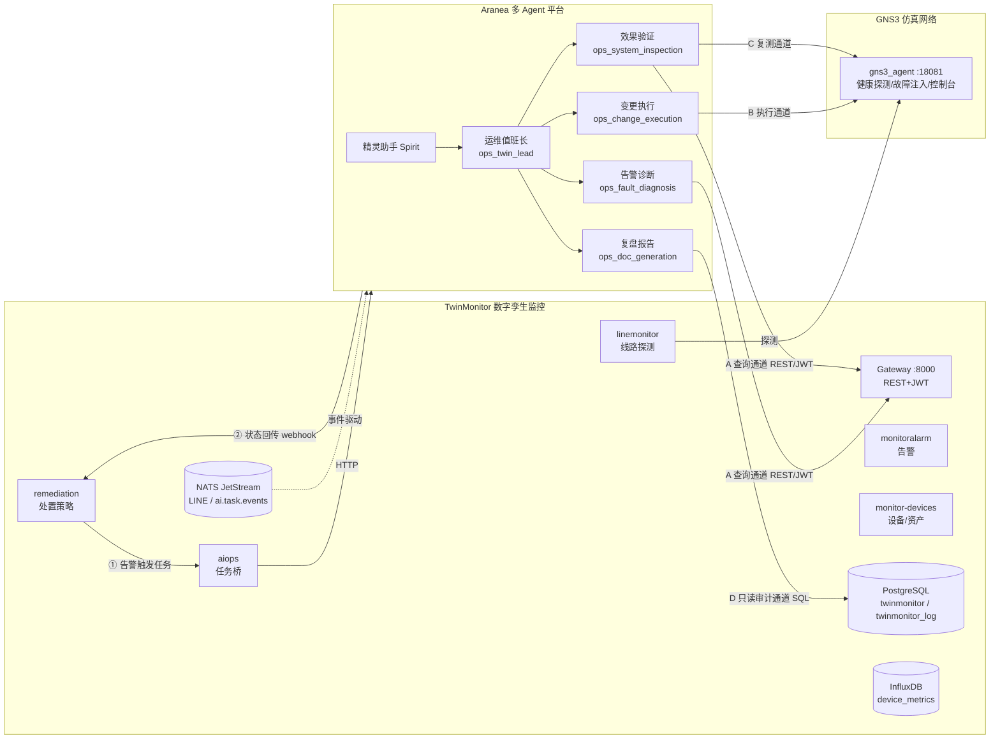
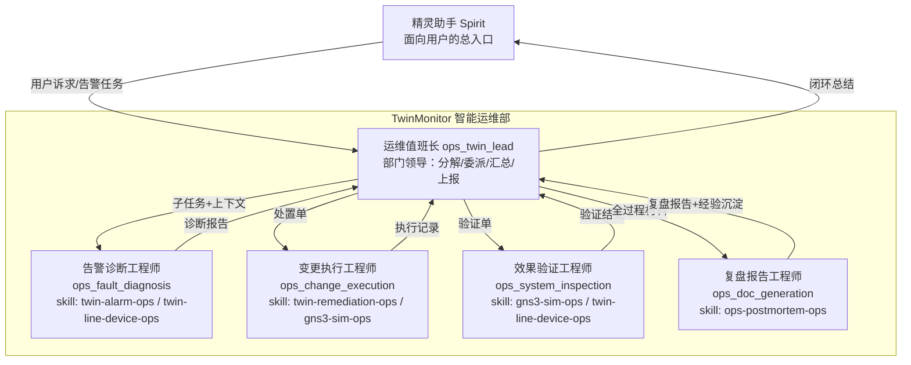

# Aranea × TwinMonitor 深度集成与「智能运维数字部门」方案

> 日期：2026-08-14（v1.1 修订：2026-08-15，覆盖性评审后工具集 12→17，见 §三文末评审记录）
> 定位：比赛提交材料 —— 系统级集成方案 + 多 Agent 组织设计 + 端到端运维闭环实证
> 关联：本方案落地 P1（故障处置闭环）并直接支撑评分维度 D1（场景价值 25%）、D2（多 Agent 协同 25%）、D3（Skill 工程 25%）、D4（工程落地与审计 20%）

---

## 一、方案概述

### 1.1 一句话定位

**让 Aranea 多 Agent 平台成为 TwinMonitor 数字孪生监控系统的「智能运维部门」**：告警产生后，由虚拟运维部门的专职数字员工自动完成「诊断 → 处置 → 验证 → 复盘 → 经验沉淀」全流程，部门领导 Agent 负责任务分解与汇总，最终向精灵助手（Spirit）汇报。

### 1.2 为什么这个场景能打动评委

| 评分维度 | 本方案的支撑点 |
|---------|---------------|
| D1 场景价值与行业可复制性 | 「监控系统自运维」是每家中大型企业都有的真实痛点；TwinMonitor 是真实在运的数字孪生监控产品，非玩具 Demo；方案可复制到任意 ITOM/NOC 场景 |
| D2 多 Agent 协同与自主闭环 | 部门制组织（领导 + 4 专职 Agent），职责矩阵清晰；告警驱动的全自动闭环，含人工审批门禁 |
| D3 Skill 工程体系 | 5 本运维手册沉淀为 Skill（渐进加载、职责边界、失败处理、复用价值齐全） |
| D4 工程落地与安全审计 | 四通道集成架构全部实跑；工具白名单 + 审批 + 回滚 + 全链路审计 |

### 1.3 与现有集成的关系

已有基础（P1 已落地）：TwinMonitor remediation 服务可在告警达阈时**自动触发** Aranea 图执行（经 aiops 服务 `POST /api/v1/monitor/aiops/tasks`），并经 NATS `ai.task.events` 回收执行状态。

**本方案补齐的是反向通道与组织能力**：Aranea 侧 Agent 此前**无法访问 TwinMonitor 的任何数据**（实测：88 个内置工具无监控类、4 个 MCP server 全部 error、agent 因找不到监控工具而空转撞限）。本方案通过「四通道集成 + 工具体系 + Skill 手册 + 部门组织」将其打通。

---

## 二、四通道集成架构

### 2.1 架构总览

### 2.2 通道清单

| 通道 | 方向 | 协议 | 用途 | 安全控制 |
|------|------|------|------|---------|
| **A. API 主通道** | Aranea → TwinMonitor Gateway | REST + JWT | 告警/设备/线路/事件/处置记录查询；告警确认 | 服务账号 JWT（最小权限）、只读优先、写操作需审批 |
| **B. 事件通道（已有）** | TwinMonitor → Aranea | HTTP + NATS JetStream | 告警触发图执行；执行状态回传 | NATS 账号隔离、webhook 签名校验 |
| **C. 仿真执行通道** | Aranea → gns3_agent | HTTP（host:18081） | 设备健康探测、故障注入/恢复、控制台命令 | 命令白名单 + 全量审计 jsonl + 高危动作审批 |
| **D. 只读审计通道（可选扩展）** | Aranea → TwinMonitor PG/InfluxDB | SQL 只读账号 | 深度诊断取证、复盘报表、指标趋势 | PG 只读角色（SELECT-only）、禁写 DDL/DML |

> 设计原则：**API 优先、事件驱动**。Agent 全部 17 个工具均走 A/C 通道（REST，有鉴权、有审计）；D 通道为复盘/深度取证场景的可选扩展，当前版本未以工具形式开放，账号层面锁死只读。

### 2.3 TwinMonitor 数据资产 → Aranea 访问映射

| 数据资产 | 位置 | Aranea 访问方式 | 消费 Agent |
|---------|------|----------------|-----------|
| 告警事件 alarm_events | PG `twinmonitor_log` / monitoralarm API | 工具 `twin_alarm_query` / `twin_alarm_get`（A） | 诊断、值班长 |
| 告警确认/状态流转 | monitoralarm API | 工具 `twin_alarm_ack`（A，写） | 诊断（审批后） |
| 告警规则（触发条件/阈值） | monitoralarm API `ap-alarm-rules` | 工具 `twin_alarm_rule_get`（A，只读） | 诊断 |
| 线路实时状态 | linemonitor API（ListLines 需 `status=-1`） | 工具 `twin_line_status`（A） | 诊断、验证 |
| 线路主动探测 | linemonitor API `lines/{id}/probe-test` | 工具 `twin_line_probe`（A，写） | 验证 |
| 线路事件 line_events | PG `twinmonitor_log` / linemonitor API | 工具 `twin_line_events`（A） | 诊断、复盘 |
| 设备/资产搜索 | monitor-devices API（PagingRequest keyword） | 工具 `twin_device_search`（A） | 诊断、值班长 |
| 设备/资产详情 | monitor-devices API | 工具 `twin_device_get`（A） | 诊断 |
| 设备指标 | InfluxDB `device_metrics` | 工具 `twin_device_metrics`（A 经 monitorquery 聚合） | 诊断、验证 |
| 采集层状态/失败记录 | collector-snmp-ssh API | 工具 `twin_collector_status`（A，只读） | 诊断 |
| 巡检任务/记录 | opstools API（inspection） | 工具 `twin_inspection_query`（A，只读） | 验证、复盘 |
| 处置策略与执行记录 | remediation API | 工具 `twin_remediation_status`（A） | 值班长、复盘 |
| 仿真设备健康/控制台 | gns3_agent HTTP | 工具 `gns3_health_check` / `gns3_exec`（C） | 验证、执行 |
| 故障注入/恢复 | gns3_agent HTTP | 工具 `gns3_fault_inject` / `gns3_fault_clear`（C，高危） | 执行（审批） |
| 服务日志 | 服务 stdout/文件 | D 通道只读 + Loki 可选扩展 | 复盘 |
| 事件流 | NATS `LINE` stream / `ai.task.events` | 平台级订阅（非 Agent 工具） | 系统层 |

---

## 三、工具体系设计（Aranea 业务层自定义工具）

> 全部实现于 `internal/tools/`，经工具注册中心注册、授权到具体 Agent（白名单最小授权）。**不修改 trpc 框架**（FW-R1 红线）。

| # | 工具 key | 用途 | 输入 | 输出 | 风险级 | 授权岗位 |
|---|---------|------|------|------|--------|---------|
| 1 | `twin_alarm_query` | 按级别/状态/来源/时间窗查询告警 | level/status/source/since/limit | 告警摘要列表 | 低 | 值班长、诊断、复盘 |
| 2 | `twin_alarm_get` | 单条告警详情（含关联设备/线路） | alarm_id | 告警全量字段 | 低 | 诊断 |
| 3 | `twin_alarm_ack` | 告警确认（标记处理中） | alarm_id、comment | 确认结果 | 中 | 诊断（需审批） |
| 4 | `twin_line_status` | 线路实时探测状态 | line_id 或 target | 状态/最近探测结果 | 低 | 诊断、验证 |
| 5 | `twin_line_events` | 线路中断/恢复事件历史 | line_id、since | 事件列表 | 低 | 诊断、复盘 |
| 6 | `twin_device_get` | 设备/资产详情 | device_id 或 asset_no | 设备画像 | 低 | 诊断 |
| 7 | `twin_device_metrics` | 设备指标趋势（alive/时延/丢包） | device_id、window | 指标序列 | 低 | 诊断、验证 |
| 8 | `twin_remediation_status` | 处置执行单状态查询 | execution_id | 状态/日志摘要 | 低 | 值班长、复盘 |
| 9 | `gns3_health_check` | 仿真设备健康探测（healthz） | device | ok/detail | 低 | 验证 |
| 10 | `gns3_exec` | 仿真设备控制台命令执行 | device、cmd | 命令输出 | 中 | 执行、验证（白名单：ping/show/ip 只读类默认放行） |
| 11 | `gns3_fault_inject` | 端口故障注入（演练控制面） | port | 结果 | **高** | 执行（**必须审批**） |
| 12 | `gns3_fault_clear` | 端口故障恢复 | port | 结果 | **高** | 执行（**必须审批**） |
| 13 | `twin_device_search` | 设备/资产关键字搜索（诊断入手第一步） | keyword/status/page | 设备摘要列表 | 低 | 诊断、值班长 |
| 14 | `twin_alarm_rule_get` | 告警规则详情（触发条件/阈值/级别，诊断上下文） | rule_id | 规则全量字段 | 低 | 诊断 |
| 15 | `twin_collector_status` | 采集层状态（在线/连续失败/失败记录），区分设备故障 vs 采集故障 | device_id | 采集状态+失败摘要 | 低 | 诊断 |
| 16 | `twin_line_probe` | 主动触发一次线路探测（验证加速，不等探测周期） | line_id | 本次探测结果 | 中 | 验证 |
| 17 | `twin_inspection_query` | 巡检任务/记录/统计查询（岗位名实对齐） | keyword/status/task_id | 巡检记录列表 | 低 | 验证、复盘 |

**失败处理约定**（写入每本 Skill 手册）：目标不可达/5xx → 工具返回结构化 error 而非异常，Agent 须将其作为诊断证据记录；连续 2 次同类失败 → 停止重试并上报值班长。

### 3.1 岗位工具白名单（effective tool keys，最小授权落地）

> 落地方式：`tools` 表 17 行种子（category=twinops）+ 各 Agent `agent_runtime_settings.tools_enabled` 白名单；高危工具 `requires_confirmation=true` 触发 HITL 审批门禁。

| 岗位 Agent | 授权工具（twinops 域） |
|-----------|----------------------|
| `ops_twin_lead` 值班长 | `twin_alarm_query`、`twin_device_search`、`twin_remediation_status` |
| `ops_fault_diagnosis` 诊断 | `twin_alarm_query`、`twin_alarm_get`、`twin_alarm_ack`（审批）、`twin_alarm_rule_get`、`twin_line_status`、`twin_line_events`、`twin_device_get`、`twin_device_search`、`twin_device_metrics`、`twin_collector_status` |
| `ops_change_execution` 执行 | `gns3_exec`、`gns3_fault_inject`（审批）、`gns3_fault_clear`（审批）、`twin_remediation_status` |
| `ops_system_inspection` 验证 | `gns3_health_check`、`gns3_exec`、`twin_line_status`、`twin_line_probe`、`twin_device_metrics`、`twin_inspection_query` |
| `ops_doc_generation` 复盘 | `twin_alarm_query`、`twin_line_events`、`twin_remediation_status`、`twin_inspection_query` |

> 说明：① 值班长只持有态势感知类只读工具，符合「只汇总不代劳」职责；② `gns3_exec` 服务端命令白名单（ping/show/ip 查询/traceroute/arp/cat/echo/curl 只读类）由 gns3_agent 强制；③ 高危工具仅执行岗持有且必须人工审批，双保险。

### 覆盖性评审记录（v1.1，2026-08-15）

评审方法：将 TwinMonitor 17 个微服务的全部业务域逐一映射到「诊断→处置→验证→复盘」四环节，检查每个环节 Agent 是否拿得到所需数据。

| 缺口 | 后果 | 处置 |
|------|------|------|
| GAP-A 设备无法按关键字搜索（只有按 id 查询） | 诊断第一步即卡壳 | 新增 `twin_device_search` |
| GAP-B 无告警规则上下文 | 无法解释告警触发原因/阈值语义 | 新增 `twin_alarm_rule_get` |
| GAP-C 无采集层状态 | 设备类告警无法区分「设备故障 vs 采集故障」，根因误判 | 新增 `twin_collector_status` |
| GAP-D 验证只能等 30s 探测周期 | 闭环演示被拖慢 | 新增 `twin_line_probe` 主动探测 |
| GAP-E 巡检岗位无巡检工具 | 岗位名实不符 | 新增 `twin_inspection_query` |

**评审后明确不开放给 Agent 的能力**：① remediation 执行单写操作（approve/reject/retry/cancel/rollback/verify）——属人审操作域，Aranea 侧状态回传已走通道B webhook，Agent 持有将造成权责越界；② 告警规则 CRUD——只读即可满足诊断；③ 告警 escalate/recover/close——恢复由探测自动触发，升级/关闭是人工决策。

**P2 扩展候选**（不阻塞闭环，后续按需启用）：`twin_notice_records`（通知发送记录）、`twin_analysis_insights`（analysis 服务 AI 预测/洞察）、`twin_topology_impact`（拓扑影响面）、`twin_report_generate`（原生报表）、`twin_config_backup`（变更前配置备份 SOP）。

---

## 四、Skill 手册体系（5 本运维手册 → Skill）

> 每本手册既是人可读的运维 SOP，也是 Agent 的 Skill（渐进加载：元信息常驻、正文按需加载、脚本/命令白名单随附）。对齐比赛 H3 的 Skill 清单八要素。

| Skill | 手册 | 核心内容 | 调用条件 | 依赖工具 | 复用价值 |
|-------|------|---------|---------|---------|---------|
| `twin-alarm-ops` | 《TwinMonitor 告警运维手册》 | 告警生命周期、分级标准、根因分析套路（线路类/设备类/指标类）、确认与静默规约 | 收到告警处置任务时 | #1-3、#14 | 任何监控告警场景通用 |
| `twin-line-device-ops` | 《线路与设备运维手册》 | 线路状态机（outage/recovered）、设备画像解读、指标基线对比法、采集层排障 | 需要定位故障范围时 | #4-7、#13、#15 | ITOM 通用 |
| `twin-remediation-ops` | 《故障处置执行手册》 | 处置动作分级（只读/低风险/高危）、**审批门禁与回滚步骤**、执行记录登记 | 进入处置环节时 | #8、#10-12 | 变更管理通用 |
| `gns3-sim-ops` | 《GNS3 仿真演练操作手册》 | 仿真拓扑、故障注入剧本、控制台命令白名单、审计规约 | 演练/验证环境操作时 | #9-12 | 演练体系通用 |
| `ops-postmortem-ops` | 《运维复盘与经验沉淀手册》 | 复盘报告结构（时间线/根因/处置/改进项）、经验规则提取、知识库沉淀格式 | 闭环收尾时 | #1、#5、#8、#17 | 复盘体系通用 |

**Skill 与协同流程关系**：值班长分解任务时按 Skill 边界指派；专业 Agent 加载对应 Skill 后获得该领域的 SOP 与工具用法；复盘 Agent 将本次闭环的新经验**回写 Skill**（经验沉淀闭环，对应比赛要求 §8「经验沉淀为可复用能力」）。

---

## 五、「TwinMonitor 智能运维部」组织设计

### 5.1 组织结构（映射 Aranea 原生组织/岗位体系）

### 5.2 职责矩阵（RACI）

| 环节 | 值班长 | 诊断 | 执行 | 验证 | 复盘 |
|------|--------|------|------|------|------|
| 任务分解与指派 | **R** | C | C | C | C |
| 告警取证与根因 | A | **R** | I | I | I |
| 处置执行（含审批申请） | A | C | **R** | I | I |
| 高危动作审批 | **R**（人工升级） | I | C | I | I |
| 修复效果复测 | A | I | C | **R** | I |
| 复盘报告与经验沉淀 | A | C | C | C | **R** |
| 向精灵助手汇报 | **R** | I | I | I | I |

### 5.3 值班长的工作协议

1. **接收**：来自精灵助手的用户诉求，或 remediation 自动派发的告警任务（含告警 ID、级别、来源、探测目标）。
2. **分解**：按 SOP 拆为诊断 → 处置 → 验证 → 复盘子任务，**每个子任务附带上游完整产出**（避免信息衰减）。
3. **委派**：按职责矩阵派给专职 Agent；高危动作（故障注入/恢复、生产变更）先挂起并申请人工审批。
4. **汇总**：串联四环产出，形成闭环总结（根因/动作/验证结论/改进项）上报精灵助手。
5. **只汇总不代劳**：值班长不直接执行诊断/处置操作，保持职责单一。

### 5.4 两种触发模式

| 模式 | 入口 | 适用 |
|------|------|------|
| 事件驱动（无人值守） | TwinMonitor 告警 → remediation 策略（auto）→ aiops → Aranea 图执行 | 生产闭环演示主路径 |
| 人机协同（值班模式） | 用户向精灵助手描述问题 → 精灵派给值班长 → 部门协同 | 演示互动、复杂疑难场景 |

---

## 六、端到端闭环流程（实证剧本）

以 GNS3 仿真网「SW1 端口 down → PC1 健康检查 503」为例：

| 阶段 | 动作 | 系统证据 |
|------|------|---------|
| 0 故障注入 | 演练控制面调 `gns3_fault_inject` | gns3 审计 jsonl |
| 1 告警产生 | linemonitor 探测连续 2×503 → `line_events(outage)` → NATS → monitoralarm 聚合为 `alarm_events(critical)` | TwinMonitor 告警台 |
| 2 自动触发 | remediation 策略匹配（source=linemonitor、level≥critical）→ aiops 派发 Aranea 图执行 | remediation 执行单 |
| 3 诊断 | 诊断 Agent：`twin_alarm_get` 取证 → `twin_line_events`/`twin_device_metrics` 定位 SW1 端口 | 图节点产出 + 工具审计 |
| 4 处置 | 执行 Agent：申请审批 → `gns3_fault_clear` 恢复端口 → `gns3_exec` 复核 | 审批记录 + 执行日志 |
| 5 验证 | 验证 Agent：`gns3_health_check` + `twin_line_status` 复测连续通过 → line_events(recovered) | 验证结论 + 恢复事件 |
| 6 复盘 | 复盘 Agent：汇总时间线/根因/动作/验证 → 结构化报告 → 经验规则回写 Skill/知识库 | 复盘报告 + 知识条目 |
| 7 汇报 | 值班长汇总上报精灵助手；remediation 执行单经 webhook 置为 completed | 会话归档 + 执行单终态 |

---

## 七、安全、审批与审计设计（对齐 H4）

| 机制 | 设计 |
|------|------|
| 工具白名单 | 工具按岗位最小授权（`tool_grants`）；高危工具（fault_inject/clear）仅执行岗持有 |
| 命令白名单 | `gns3_exec` 默认只放行只读命令（ping/show/ip addr 等），写命令逐条审批 |
| 审批门禁 | 高危动作触发 HITL 审批（Aranea 图 HITL 节点 / 确认守卫），审批留痕 |
| 回滚预案 | 每个处置动作在《故障处置执行手册》中登记逆操作；fault_inject↔fault_clear 互为回滚 |
| 审计链 | 工具调用审计（tool_invocations）+ gns3 审计 jsonl + 图执行 steps + remediation 执行单，四账合一可追溯 |
| 数据面权限 | A 通道服务账号最小权限；D 通道 PG 只读角色；密钥不进 prompt、不落日志 |

---

## 八、与比赛评分标准映射

| 要求/维度 | 本方案落点 |
|-----------|-----------|
| H1 ≥3 职能 Agent | 值班长 + 4 专职 Agent，职责矩阵（§5.2） |
| H2 AgentTeams 协同基点 | 部门制组织 + 任务分解/上下文传递/状态追踪（§5） |
| H3 Skill 必选 | 5 本手册 Skill 化，八要素齐全（§四） |
| H4 审批/回滚/审计 | §七 全表 |
| R1 MCP/等价集成 | 四通道集成契约（§二）+ 自定义工具体系（§三） |
| R2 可观测 | Trace（图执行 steps）+ Log（审计 jsonl）+ Metrics（设备指标） |
| R3 RAG/上下文 | 复盘经验回写知识库/Skill，形成学习闭环 |
| D1 场景价值 | 监控系统自运维，真实产品联动，行业可复制 |
| D2 协同闭环 | 告警驱动全自动闭环 + 人机协同双模式（§5.4） |
| D4 工程落地 | 全部组件实跑可演示（§六证据链） |

---

## 九、实施路线图

| 阶段 | 内容 | 状态 |
|------|------|------|
| P0 | GNS3 仿真环境 + 故障注入剧本 | ✅ 已完成 |
| P1 | 告警自动触发 Aranea 图执行（remediation→aiops→graph）+ 状态回传 | ✅ 已完成 |
| P1.5 | **本方案**：四通道工具体系 + Skill 手册 + 部门组织 + 提示词防呆 | 🚧 本次实施 |
| P2 | 端到端闭环实跑取证（§六证据链全绿） | ⏳ 依赖 P1.5 |
| P3 | 学习曲线验证（复盘经验回写 → 二次故障处置提速/提质对比） | ⏳ 依赖 P2 |

**P1.5 工作分解**：
1. 17 个自定义工具实现与注册（`internal/tools/twinops/`）
2. 工具授权（4 岗位）+ 高危工具审批配置
3. 5 本 Skill 手册撰写与注册
4. 部门组织搭建（岗位/值班长 Agent 配置、提示词含防呆条款）
5. incident-response 图与部门协同绑定复跑
