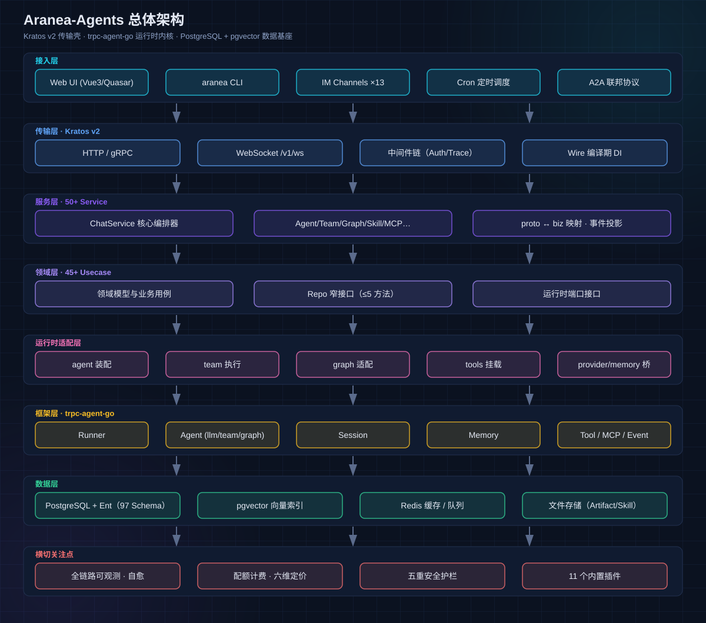

# 02 总体架构

## 功能

Aranea-Agents 是企业级多智能体编排平台，提供 Agent 创建、编排、执行、监控的全生命周期管理。本章说明系统的整体分层、数据流与设计原则。

## 原理：七层架构



| 层 | 职责 | 关键组件 |
|----|------|----------|
| **接入层** | 用户/系统触达平台的所有入口 | Web UI（Vue3/Quasar）、aranea CLI、13 种 IM Channel、Cron 定时调度、A2A 联邦协议 |
| **传输层** | 协议与横切中间件 | Kratos v2：HTTP :8810 / gRPC :9910 / WebSocket :8812；Auth/Trace 中间件链；Wire 编译期 DI |
| **服务层** | 50+ Service，proto ↔ biz 映射与事件投影 | ChatService（核心编排器）、AgentService、TeamService、GraphService、SkillService、MCPService 等 |
| **领域层** | 45+ Usecase，纯业务规则 | 领域模型与业务用例；Repo 窄接口（≤5 方法）便于 mock；不依赖框架运行时 |
| **运行时适配层** | 把领域对象装配为 trpc-agent-go 运行时 | agent 装配（prompt/记忆/工具注入）、team 执行、graph 适配、tools 挂载、provider/memory 桥接 |
| **框架层** | Agent 运行时内核（vendored） | trpc-agent-go：Runner / Agent(llm·team·graph) / Session / Memory / Tool / MCP / Event |
| **数据层** | 持久化与索引 | PostgreSQL + Ent ORM（97 Schema）、pgvector 向量索引、Redis 缓存/队列、文件存储（Artifact/Skill） |

**横切关注点**（贯穿各层）：全链路可观测与自愈、配额计费（六维定价）、五重安全护栏、11 个内置插件。

## 关键数据流

### 对话请求流

```text
用户 → Web/CLI/IM → WS /v1/ws → ChatService
  → ChatUsecase（会话/租户/配额校验）
  → agent 装配（IDENTITY + L0~L4 记忆 + 工具画像 + 技能清单）
  → trpc-agent-go Runner 执行（ReAct 循环：LLM ↔ Tool）
  → 事件流回传（thinking / tool / reply / usage）
  → 记忆沉淀（L2 情景 + L3 事实提取）+ 用量记账
```

### Spirit 编排流

```text
指令 → TaskPlanner（规划）→ AgentAllocator（分配）→ TaskOrchestrator（编排）
  → Team 六模式执行 → 综合引擎 → 交付 + 学习记录（DQ 评分）
```

详见 [03 Spirit 精灵动态编排](03-spirit.md)。

## 设计原则

1. **领域层纯净**：`internal/biz` 不 import 框架运行时与传输层，依赖方向由 `make archlint` 强制守护；
2. **框架源码不可改**：`pkg/trpc-agent-go` 是上游 vendored 副本（go.mod replace），发现框架 bug 走例外流程，不擅改；
3. **Repo 窄接口**：每个 Repo 接口 ≤5 个方法，biz 层可完整 mock 测试；
4. **No-Timeout 原则**：WS turn 不设写死超时，长任务靠心跳与显式取消；
5. **Graph 即 Team**：Team 编排定义统一编译为 Graph 执行，单一底层引擎；
6. **一切异步化**：记忆沉淀、进化检测、用量聚合均走后台 Worker，不阻塞对话链路。

## 技术栈与规模

| 维度 | 数据 |
|------|------|
| 后端 | Go 1.26+ / Kratos v2 / Ent / Wire；50+ Service、45+ Usecase、95+ Repo、97 Ent Schema |
| 前端 | Vue 3 + Quasar + Pinia + TypeScript；35 Store、45+ 页面、45 种 Envelope 事件 |
| 存储 | PostgreSQL（主）+ pgvector（向量）+ Redis（缓存/队列）+ 文件系统（Skill/Artifact） |
| 运行时 | trpc-agent-go（vendored，禁止擅改） |
| 桌面 | Tauri（web/src-tauri）+ AraneaLauncher（Windows 便携部署） |

## 深入阅读

- [系统架构总览](../../docs/development/0-system-diagram.md)
- [模块交叉引用全表](../../docs/development/65-module-cross-reference-full.md)
- [AGENTS.md](../../AGENTS.md)（仓库协作规约）
