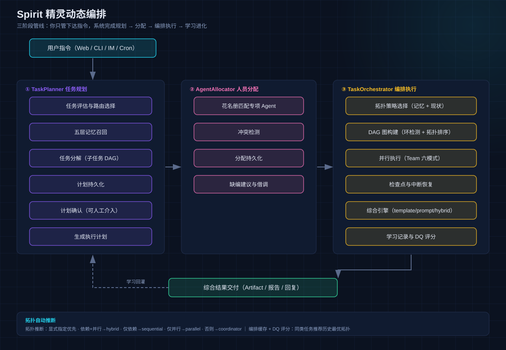
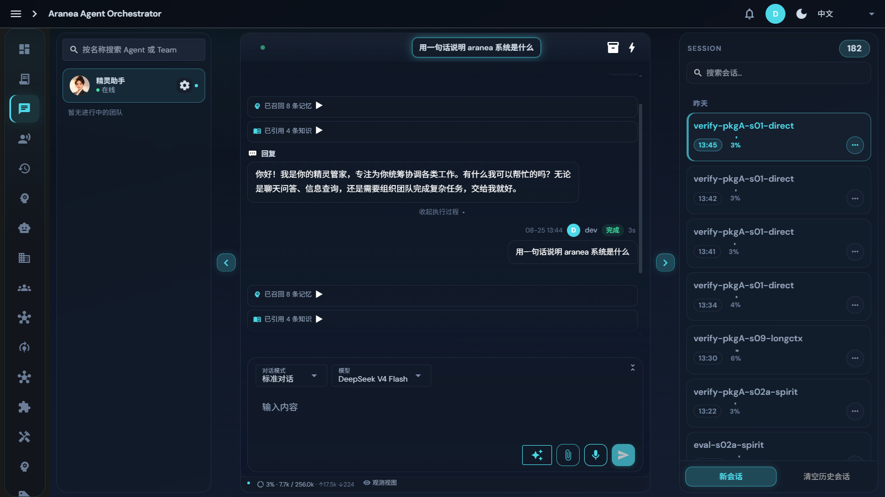

# 03 Spirit 精灵动态编排

## 功能

Spirit 是 Aranea-Agents 的核心创新——**你只管下达指令，系统自动完成规划、分配、编排、执行、综合与学习**。它把"一人当总裁"落到技术实现：开放式任务进来，一支临时组建的专业团队把活干完交付。

## 原理：三阶段管线

### ① TaskPlanner 任务规划

| 步骤 | 说明 |
|------|------|
| 任务评估与路由 | 判断任务复杂度：简单问答直接单 Agent 回复，复杂任务进入编排 |
| 五层记忆召回 | 召回 L0~L4 相关记忆，让规划带着历史经验 |
| 任务分解 | 拆成子任务 DAG（有向无环图） |
| 计划持久化 | 计划落库，可断点续行 |
| 计划确认 | **可人工介入**：确认/调整后再执行 |

### ② AgentAllocator 人员分配

- **花名册匹配**：从组织架构的编制表匹配专项 Agent——专人专事，不在任务路径上现造通用工人；
- **冲突检测**：检测 Agent 占用冲突；
- **缺编建议**：缺人时给出补编/借调建议；部门主管只做门禁/借调/剧本授权，不当业务 Lead。

### ③ TaskOrchestrator 编排执行

- **拓扑策略选择**：结合编排缓存（历史 DQ 评分）与现状选择执行拓扑；
- **DAG 图构建**：环检测 + 拓扑排序 + 就绪节点计算；
- **并行执行**：底层走 Team 六模式引擎（见 [04 Team 与 Graph](04-team-graph.md)）；
- **检查点与中断恢复**：长任务可中断、可恢复；
- **综合引擎**：template / prompt / hybrid 三种策略自动选择，把多成员产出汇总成交付物；
- **学习记录**：记录本次编排拓扑与 DQ 评分，回灌编排缓存——**下次同类任务自动推荐更优拓扑**。

### 拓扑自动推断规则

`InferTopologyFromTeam`（[spirit_task_dag.go](../../internal/biz/spirit_task_dag.go)）按团队定义推断执行拓扑，显式指定 `topology` 时优先：

| 条件 | 推断拓扑 |
|------|----------|
| 显式指定 `topology` 字段 | 直接使用指定值 |
| 有依赖（`depends_on` 非空）+ 并行配置（`max_concurrent_teams > 1`） | hybrid |
| 仅有依赖（`depends_on` 非空） | sequential |
| 仅有并行配置（`max_concurrent_teams > 1`） | parallel |
| 以上都不是 | coordinator |

推断结果再结合编排缓存的历史 DQ 评分择优调整（学习记录回灌，见上）。

## 设计要点

- **生产建团唯一路径**：PlanExecutor + RealTeamOrchestrator（ADR-2 已删除旧死路径）；
- **Token 双闸防爆**：成员级轮数闸（max_tool_iterations/max_llm_calls）+ run 级累计预算闸（默认 150 万 input tokens 触发 Cancel）——两层缺一不可；
- **循环守卫**：同一工具连续同参数调用 2 次后，第 3 次起拦截（按节点隔离计数，参数签名经归一化哈希）；
- **组织架构约束**：编排只调用编制表上的专项，遵循[组织不变量](../../docs/development/org-invariants.md)。

## 界面配置

**入口**：聊天页选择精灵助手（`__spirit__`）直接对话即触发动态编排。

使用要点：

1. **下达指令时说清目标与约束**（如「调研 + 输出 2000 字报告 + 今天内」），Planner 会把它拆成可执行 DAG；
2. **计划确认环节可介入**：展开「执行过程」查看规划，必要时打断调整；
3. **执行中可观察**：每个子任务的执行者、工具调用、产出实时可见；
4. **交付物**：以 Artifact / 报告 / 回复形式呈现，可在会话中回溯。

## 深入阅读

- [78 组织感知编排](../../docs/development/78-org-aware-orchestration.md)
- [65 模块交叉引用 · team 章节](../../docs/development/65-module-cross-reference-full.md)
