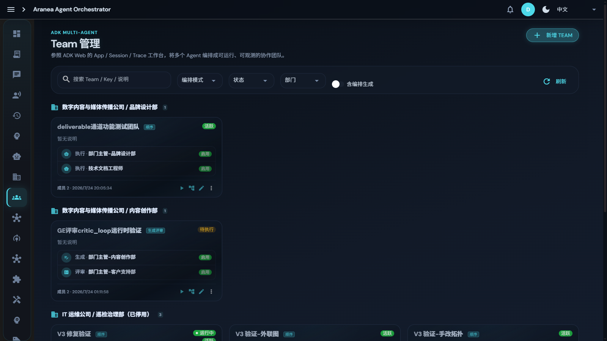
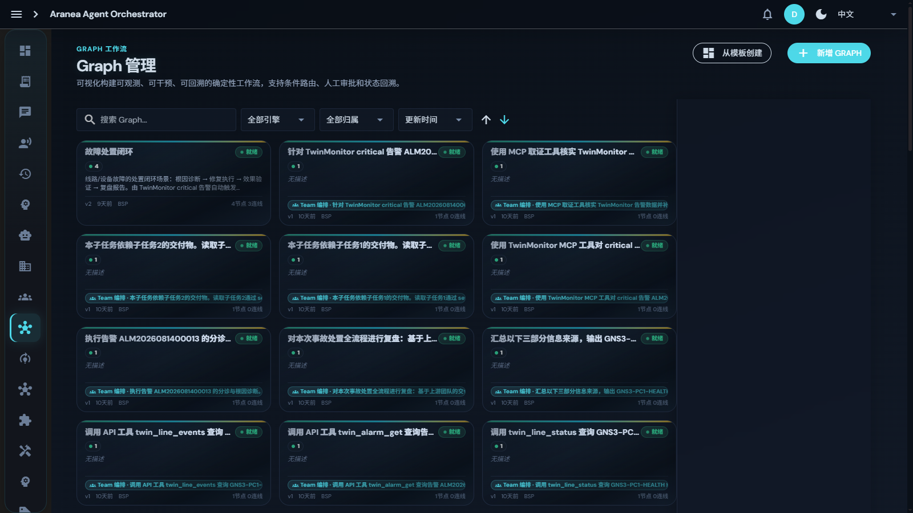

# 04 Team 与 Graph 编排

## 功能

除 Spirit 动态编排外，平台提供两种**确定性编排**能力：

- **Team**：把多个 Agent 编成固定团队，六种协作模式；
- **Graph**：可视化拖拽构建 DAG 工作流，支持条件分支、人工审批节点、状态回溯。

**Graph 即 Team**：Team 编排定义统一编译为 Graph 执行，单一底层引擎。

## 原理

### 4.1 Team 六种编排模式

| 模式 | 原理 | 适用场景 |
|------|------|----------|
| **Sequential** | 顺序执行，前一步输出作为后一步输入 | 流水线式任务（如：调研→写作→审校） |
| **Parallel** | 并行执行 + Synthesizer 汇总 | 独立子任务并行（如：多维度分析） |
| **Coordinator** | 协调者分派 Worker，统一调度 | 需要中央决策的复杂任务 |
| **CriticLoop** | Generator + Critic 生成-批评循环 | 需要反复打磨的产出（文案、方案） |
| **Swarm** | 成员间 `transfer_to_agent` 自由流转 | 开放式协作，路径不可预知 |
| **Adaptive** | 运行时动态选择最优策略 | 不确定哪种模式最优时 |

### 4.2 Graph 图编排

- **节点类型**：agent / llm / tool / task / review / subgraph（子图嵌套）；
- **条件边**：按上游输出决定走向，支持复杂分支逻辑；
- **状态字段 + Reducer**：default / append / cover / merge 四种聚合策略；
- **Checkpoint + TimeTravel**：任意检查点的状态快照可回溯；
- **中断恢复**：InterruptBefore/After + ResumeExecution，**review 节点即人工审批关卡**；
- **失败策略 + 熔断器**：Skip / RetryThenBlock / FailFast + CircuitBreakerPolicy；
- **GC 自动回收**：30 分钟无活动的执行自动标记失败，防止悬挂。

### 4.3 Token 双闸（安全边界）

| 闸 | 粒度 | 机制 |
|----|------|------|
| 成员级轮数闸 | 单成员内部 | `max_tool_iterations` / `max_llm_calls` 按 Agent 配置（默认 50/52） |
| Run 级预算闸 | 多成员合计 | 累计 input tokens 超预算（默认 150 万）单次触发 RunRegistry.Cancel |

成员级闸拦单成员内部爆炸，Run 级闸拦多成员合计超支——两层缺一不可。

## 设计要点

- **统一引擎**：Team 定义 → 编译为 Graph → Runner 执行，避免两套执行语义漂移；
- **幂等与恢复**：检查点落库，进程重启后可从最近检查点续行；
- **可观测**：每个节点的输入/输出/耗时/Token 全量入 Trace（见 [08 可观测性](08-observability.md)）。

## 界面配置

### Team 管理页

左侧导航 **Team**：

- 团队按「公司 / 部门」分组归属展示；
- 每个团队卡片显示编排模式标签（顺序/并行/生成评审…）、成员列表与启用状态；
- **新增 TEAM**：选模式 → 从花名册挑成员 → 设 Synthesizer（并行模式）→ 保存；
- 卡片上直接**运行**、编辑、查看运行历史。

### Graph 管理页

左侧导航 **Graph**：

- **新增 GRAPH**：进入拖拽画布，从节点面板拖入 agent/llm/tool/review 节点，连线并配置条件边；
- **从模板创建**：预置工作流模板一键实例化；自己的 Graph 也可存为模板复用；
- 卡片显示节点/连线数与归属（含 Team 编排自动生成的 Graph）。

### 人工审批节点

在 Graph 中放置 **review 节点**：执行到该节点自动中断，审批人在界面上查看上下文后选择通过/驳回，流程 Resume 继续——这是「自动执行 + 人工把关」在工作流层面的落地。

## 深入阅读

- [65 模块交叉引用 · graph / team 章节](../../docs/development/65-module-cross-reference-full.md)
- [23 工具开发计划](../../docs/development/23-tools.development.md)
