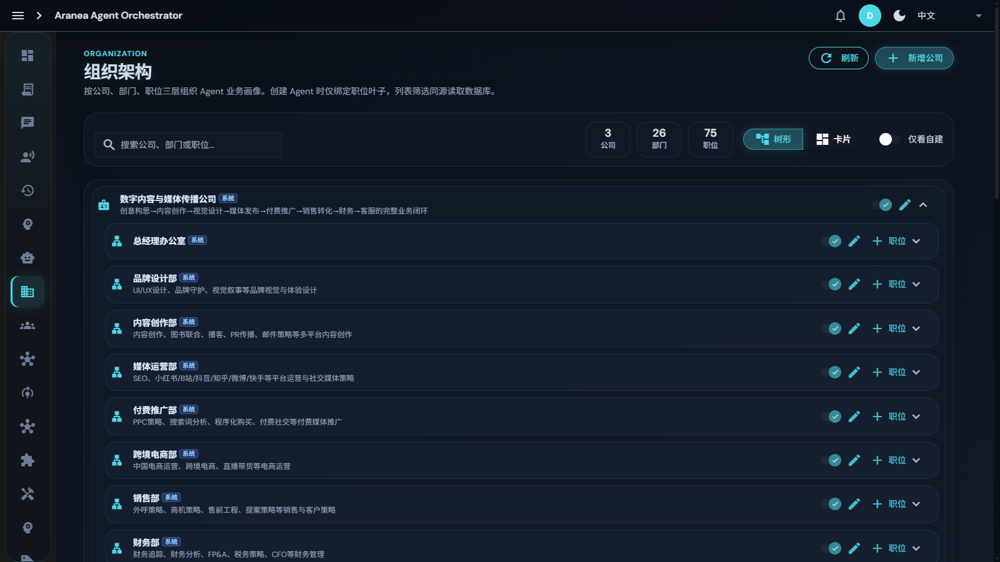
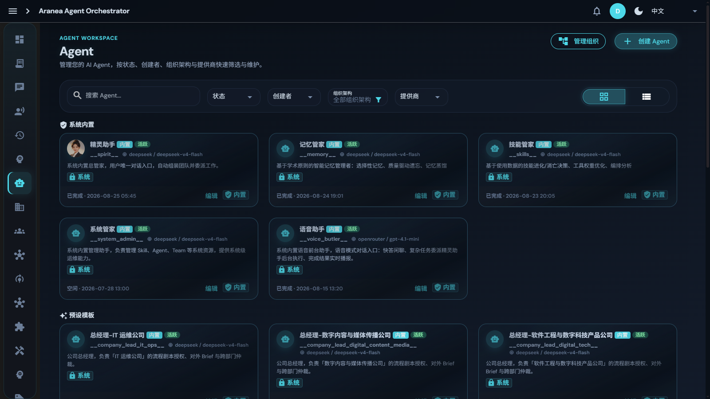

# 06 组织架构

## 功能

把 AI 组织成**模拟现实公司的三级编制**：公司（Company）→ 部门（Department）→ 岗位（Position）。Agent 挂在岗位上，不是挂在"行业分类"上。这是"一人通过精灵控制 N 家公司"的组织基础。

## 原理

### 三级编制与角色

| 层级 | 说明 |
|------|------|
| **公司** | 一个 workspace 默认一棵公司树；换公司换 workspace，实现一人多公司隔离 |
| **部门** | 研发、运营、设计……每部门一名主管（`dept_lead`） |
| **岗位** | 后端、文案、视觉……每个岗位上的人是专家，工具和身份按岗配置 |

**治理角色**：

- **总经理**（`company_lead`）：每公司一名，挂「总经理」岗，编制区可见；负责流程剧本授权、对外 Brief 与跨部门仲裁；
- **部门主管**（`dept_lead`）：管编制与交接，做门禁/借调/剧本授权——**不替员工拆用户原话，不当业务 Lead**；
- **专项 Agent**：挂在岗位上的业务执行者，自带使命、`domain_path`、工具画像（ToolsProfile/Allow/Deny）、MCP 门禁、技能——**不继承精灵工具箱**。

### 职责构建与祖先链

- **BuildResponsibility**：根据岗位 + 部门描述生成 L1 工作记忆注入内容——Agent 一上岗就知道自己的职责边界；
- **祖先链**：从岗位向上追溯部门、公司，注入组织上下文；
- **岗位 Prompt 模板**：按岗预置，支持变体（general / technical / management）。

### 编排用法

花名册按专题绑人：Spirit / Team / Graph 编排时从编制表匹配专项；缺人就补编，**不在任务路径上现造通用工人**。

## 设计要点

- **组织不变量**：三级编制、lead 角色、专项独立性等约束见 [org-invariants](../../docs/development/org-invariants.md)，属架构锁；
- **行业模板**：内置金融（41 个专项 Agent、10 支预置团队，定义于 `internal/scenario/finance/agents.yaml`）、自媒体（39 Agent、6 支预置团队，见 `internal/scenario/selfmedia`）、软件开发（82 Agent、8 支预置团队，见 `internal/scenario/softwaredev`）三大行业；通过 scenario 目录添加新行业无需改代码；
- **生态市场**（开发中）：公司/部门/岗位/Agent/Team/Graph/Skill/MCP 全品类模板市场，最佳实践可发布/安装/评分（certified 认证）；
- **软删级联**：删除组织时级联软删 runtime_settings / prompt_files / sessions / tool_overrides / 无会话 tool_invocations。

## 界面配置

左侧导航 **组织架构**：

- 顶部统计：公司 / 部门 / 职位总数；支持**树形 / 卡片**两种视图切换、「仅看自建」过滤；
- **新增公司**：选择行业模板可批量生成部门与岗位；
- 每个公司/部门卡片可展开职位列表，点击 **+ 职位** 添加岗位；
- 岗位创建后，对应专项 Agent 自动出现在 **Agent** 页（带组织架构标签），可再细化其工具画像与技能。

**Agent 页联动**：

- 按「组织架构」维度筛选 Agent；
- 系统内置区（精灵助手/记忆管家/技能管家/系统管家/语音助手）+ 预设模板区（各公司总经理）+ 岗位专项区。

## 深入阅读

- [67 组织重设计](../../docs/development/67-organization-redesign.md)
- [78 组织感知编排](../../docs/development/78-org-aware-orchestration.md)
- [组织不变量](../../docs/development/org-invariants.md)
