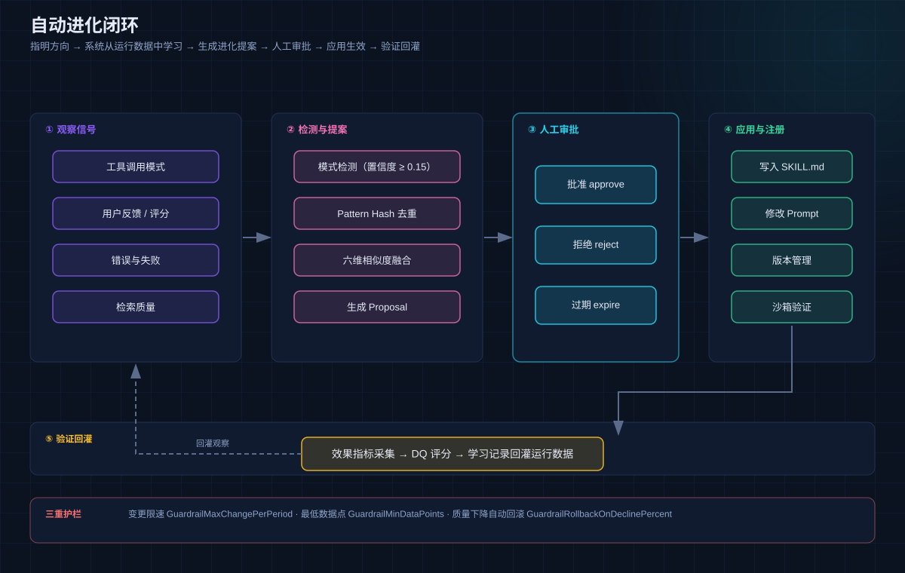
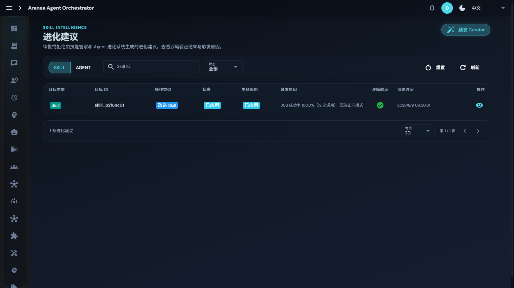

# 07 自动进化系统

## 功能

Aranea 最核心的差异化能力：**你指明业务方向，系统从运行数据中自主学习变强，但每一步进化都经人工审批才生效。** 覆盖三条进化线：

- **技能进化**：从工具调用模式中自动发现新技能，相似技能智能融合；
- **Agent 进化**：从运行指标自动生成 Persona/Prompt 优化建议；
- **编排进化**：记录编排拓扑与 DQ 评分，同类任务推荐更优拓扑（见 [03 Spirit](03-spirit.md)）。

## 原理：自动进化闭环



### ① 观察信号

四类观察进入 LearningLoop：工具调用模式（tool_call）、用户反馈/评分（feedback）、错误与失败（error）、检索质量（retrieval）。

### ② 检测与提案

- **模式检测**：过滤 `Confidence >= 0.15` 的工具调用模式；`EvolutionOrchestratorWorker` 统一驱动，遍历所有开启进化开关的 active Agent；
- **相同技能去重**：基于 Pattern Hash 的确定性去重——同一 Agent 下相同行为模式只产生一次 Proposal；
- **相似功能融合**：六维相似度评估（Name / Description / Body / Trigger / Tool / 综合 SimilarityScore），`>= 0.2` 创建 ConflictGroup，LLM 推荐 keep_separate / suggest_refine / block_duplicate；**AI 炼化**（RefineConflictGroup）把相似 Skill 合并为新 Skill；
- **生成 Proposal**：进入审批状态机。

### ③ 人工审批（HITL 状态机）

```text
detected pattern → pending → approved → registered
                          → rejected（终态）
                          → expired（终态）
```

- `ApproveProposal` / `RejectProposal` 只允许 pending 状态转换；
- `RegisterApproved` 通过 FileSystemSkillRegistrar 将 SKILL.md 写入 Agent 的 Skill 目录；
- **安全措施**：注册时拒绝包含 `..` 或 `/\` 的 Skill 名称，防止路径穿越。

### ④ 应用与注册

- 技能类：写入 SKILL.md + 版本管理（major.minor.patch）+ 沙箱验证；
- Agent 类：persona 写入 IDENTITY.md 的 `## Persona` 段，prompt 写入 AGENTS_CORE.md；
- 合并冲突组支持 5 种人工决策：直接导入 / 批准高风险 / 拒绝 / AI 合并 / 跳过；**任何一步失败自动回滚**（DB 行 + 磁盘目录）。

### ⑤ 验证回灌

效果指标采集 → DQ 评分 → 学习记录回灌运行数据，闭环持续转动。

### 三重护栏（进化不失控）

| 护栏 | 作用 |
|------|------|
| `GuardrailMaxChangePerPeriod` | 限制变更速率 |
| `GuardrailMinDataPoints` | 最低数据点要求，数据不足不进化 |
| `GuardrailRollbackOnDeclinePercent` | 质量下降自动回滚 |

### 技能生命周期全景

```text
新生：自动检测 / 手动创建 / 导入融合
成长：渐进加载（L0 清单 → L1 Body → L2 Refs）+ 版本迭代 + 健康度分析
消亡：长期无调用 / 低成功率 → 消亡建议；人工停用；软删除
重生：版本回滚 / 重新发布 / 磁盘文件恢复（filesystem_missing 自动清除）
```

健康度按调用量与成功率五级评估（`skillHealthStatus`）：unused（统计窗口 0 调用 → 建议移除）/ healthy（成功率 ≥90%）/ degraded（≥70%，建议复查错误）/ unstable（≥50%，建议排查失败）/ critical（<50%，建议停用或重写）。

## 设计要点

- **ADR-3 迁移完成**：唯一 API 面 = SkillEvolutionSuggestionService（target_type/target_id 泛化），agent 建议审批后 ApplyApprovedSuggestion 自动注册 + CAS；
- **渐进式加载省 Token**：Skill 默认 progressive 模式，L0 仅注入 name+description 清单，Body/Refs 由 LLM 按需调用 `skill_load` / `skill_select_docs` 获取；加载内容注入 tool result 而非系统提示，利于 prompt caching；
- **意图路由**：`IntentRoutingEnabled` 默认开启，嵌入向量评分（权重 0.3）自动匹配最相关 Skill；
- **文件系统双向同步**：fsnotify 实时监听 + 定时对账；磁盘内容变更的已发布 Skill 自动回退 draft + 禁用，防止线上静默漂移。

## 界面配置

左侧导航 **技能 → 进化建议**：



- **SKILL / AGENT 双 Tab**：分别审批技能提案与 Agent 优化建议；
- 列表字段：目标类型 / 目标 ID / 操作类型 / 状态 / 生命周期 / 触发原因 / 沙箱验证 / 创建时间；
- 「触发原因」列说明提案依据（如「30d 成功率 100.0%（12 次调用），沉淀正向模式」）；
- **触发 Curator** 按钮可手动驱动一轮检测；
- 点击行尾眼睛图标查看提案详情，执行批准 / 拒绝。

相关页面：**技能**（Skill CRUD + 标签 + 健康度）、**经验报告**（运行指标）、**评估**（LLM Judge + PromptIter，见下）。

### 评估系统（质量闭环的另一条腿）

- **多维评分**：ExactMatch / ContainsMatch / LLMjudgeScore / ToolCallAccuracy / PassAtK / PassHatK；
- **趋势与对比**：GetAgentEvalTrend 质量趋势图、CompareEvalRuns 指标 Delta；
- **人工标注**：pass/fail + 评分 + 评论，与 LLM 评审双轨；
- **PromptIter 引擎**：训练集生成梯度 → 验证集验收 → 接受/拒绝补丁的多轮优化循环；
- **自动评估**：AgentEvalAutoConfig 支持每轮对话后自动触发。

## 深入阅读

- [65 模块交叉引用 · skill evolution 章节](../../docs/development/65-module-cross-reference-full.md)
- [23 工具开发计划 · Round 7](../../docs/development/23-tools.development.md)
