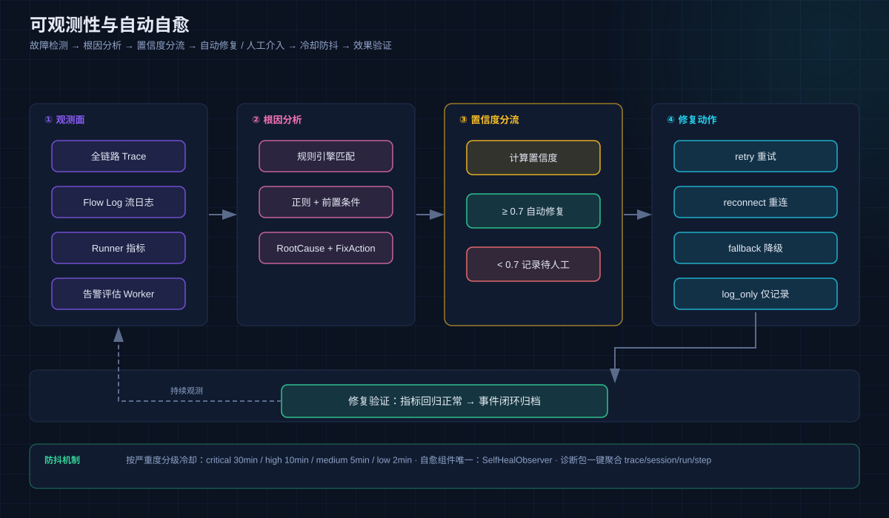

# 08 可观测性与自愈

## 功能

从故障检测到根因分析到自动修复的**完整闭环**：全链路 Trace + 多维流日志 + 规则化根因分析 + 置信度驱动的自动自愈 + 告警 + 诊断包，编排不再是黑盒。

## 原理：自愈闭环



### ① 观测面

| 信号 | 说明 |
|------|------|
| **全链路 Trace** | 每次 LLM 调用的完整 Trace + Span 瀑布图 |
| **Flow Log 流日志** | 按 trace_id / session_id / run_id / domain / severity 多维检索 |
| **Runner 指标** | error_rate、P50/P95/P99 延迟实时统计 |
| **审计日志** | 所有管理操作（action/resource/actor/IP/severity）完整留痕 |
| **告警评估** | AlertMetricRegistry + AlertEvalWorker 周期评估告警条件 |

### ② 根因分析引擎

基于规则匹配自动诊断失败原因：正则匹配 + 前置条件 → 输出 `RootCauseResult` + `FixAction`。规则可扩展。

### ③ 置信度分流

- **置信度 ≥ 0.7**：自动执行修复；
- **置信度 < 0.7**：仅记录，等待人工介入。

### ④ 修复动作

`retry`（重试）/ `reconnect`（重连）/ `fallback`（降级）/ `log_only`（仅记录）。

### 防抖与验证

- **冷却期 5 分钟**：同一问题在冷却期内不重复触发修复；
- 修复后验证指标回归正常 → 事件闭环归档；
- **自愈组件唯一**：SelfHealObserver（ADR-4，旧 SelfHealUsecase 已下线）。

### 诊断包

一键聚合 trace + session + run + step 信息，导出排障上下文。

### TimeTravel

Graph 执行可回溯任意检查点的状态快照（见 [04 Team 与 Graph](04-team-graph.md)），调试和审计无死角。

## 设计要点

- **观测不侵入业务**：事件总线（bus_v2 + envelope）异步投影，45 种 Envelope 事件；
- **告警去抖**：MCP 健康探测等场景带重连计数与告警去抖；
- **pprof 观测**（Docker dev）：独立端口 `:8813`，仅内网可达，缺省环境变量即关闭。

## 界面配置

### 运维监控（概览页内嵌）

概览页「运维监控」下拉 + **查看告警** / **查看明细**直达：


- 模型端点健康（活跃/降级/总计）、Runner 运行（成功率/错误率/窗口运行数）；
- 今日模型调用趋势图；Agent 状态环（启用/停用）。

### 用量事件明细页

左侧导航 **用量事件**：按时间查看 `model_token_usage_events` 原始记录，支持范围/Provider/模型/Agent/Team/来源/状态七维过滤，可导出 CSV：


### CLI 观测

```bash
./bin/aranea monitor dashboard   # 运行监控大盘
./bin/aranea monitor flow-log    # 流日志检索
./bin/aranea monitor trace       # Trace 查看
./bin/aranea monitor heal        # 自愈事件
```

## 深入阅读

- [65 模块交叉引用 · monitor 章节](../../docs/development/65-module-cross-reference-full.md)
