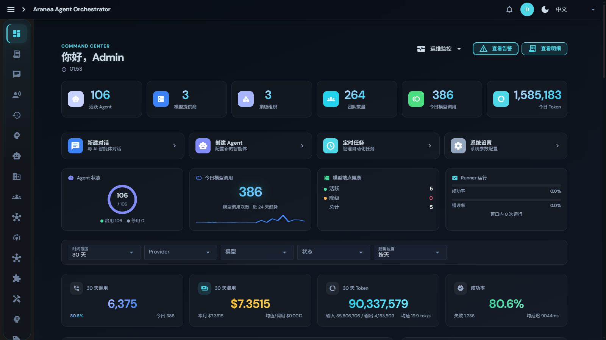
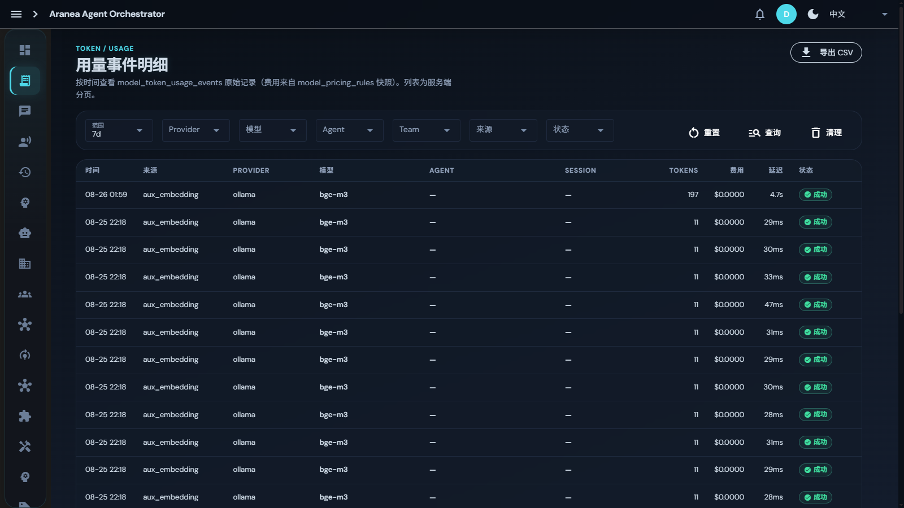

# 09 成本管控

## 功能

Token 消费全透明：**六维定价 × 微美元精度 × 三级配额 × 预算告警 × 低效模型洞察**——每分钱都算得清，成本永不失控。

## 原理

### 六维定价

每个模型按六个维度分别定价（MicroPricing 内部精确计算 + CostUSDPer1M 对外展示双轨）：

| 维度 | 说明 |
|------|------|
| Input | 输入 token |
| Output | 输出 token |
| CacheRead | 缓存读取 |
| CacheWrite | 缓存写入 |
| Reasoning | 推理 token |
| Embedding | 嵌入 token |

**定价优先级**：manual（100）> model-inspect（50）> models.dev-sync（10）——低优先级来源永远不能覆盖手动设置。

### 记账链路

```text
每次 LLM 调用 → input/output/cached/reasoning/embedding tokens 全量记录
  → model_token_usage_events（费用来自 model_pricing_rules 快照）
  → 实时统计 + 多维拆解（Provider / Model / Agent × 时间）
```

费用按**快照价**记账：即使后续调价，历史账单也不变。

### 三级配额与预算告警

- **配额层级**：global → agent → team 三级月度消费上限；
- **预算告警**：按消费比例阈值触发，60 分钟冷却防抖；
- **成本守卫插件**：cost_guard 按 scope 限流（见 [11 安全与插件](11-security.md)）；
- **Token 双闸**：成员级轮数闸 + run 级累计预算闸（见 [04 Team 与 Graph](04-team-graph.md)）。

### 模型洞察

自动标记低效模型：`low_tps` / `high_failure` / `high_cost`，推荐替换——帮你发现并换掉不划算的模型。

## 设计要点

- **微美元精度**：内部以 micro-USD 计算，杜绝浮点误差累积；
- **配额仪表盘**：configured_count / total_cap / total_spent / max_utilization_ratio 一屏看清；
- **统计口径**：今日/昨日/本月/自定义时间范围；调用次数、费用、Token、成功率四指标并行。

## 界面配置

### 概览页成本区



- 30 天调用 / 30 天费用 / 30 天 Token / 成功率四卡片；
- 消耗趋势图支持 Token / 调用次数 / 费用 / 成功率四指标 × 时间粒度切换；
- 顶部过滤：时间范围 / Provider / 模型 / 状态。

### 用量事件明细页



按时间逐笔查看原始用量记录（时间 / 来源 / Provider / 模型 / Agent / Session / Tokens / 费用 / 延迟 / 状态），七维过滤 + CSV 导出——审计与对账的原始依据。

### 配额管理

在 **系统设置 → 配额** 配置三级配额与告警阈值；配额仪表盘实时显示利用率。

## 深入阅读

- [65 模块交叉引用 · usage 章节](../../docs/development/65-module-cross-reference-full.md)
- [12 模型与定价](12-models.md)
