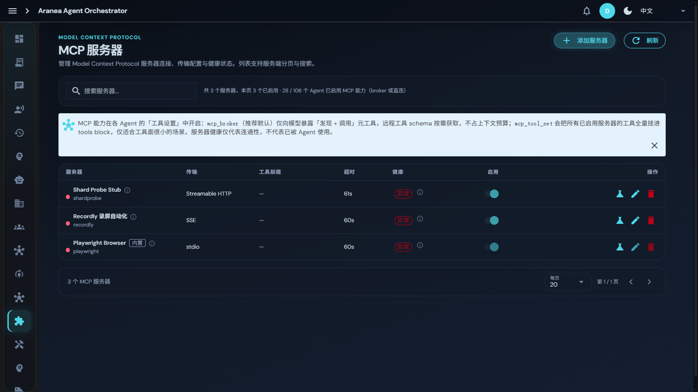

# 10 外部接入

## 功能

Agent 一次创建、全平台可用：13 种 IM Channel 统一接入 + A2A 跨组织联邦 + MCP 工具生态。

## 10.1 多 Channel（13 种 IM 平台）

### 原理

| 平台 | 接入方式 |
|------|----------|
| 飞书 / Lark | WebSocket 长连接 |
| 钉钉 | Webhook / Stream |
| 企业微信（智能机器人） | Webhook |
| 企业微信（自建应用） | API |
| 微信公众号 | API |
| Slack | WebSocket |
| Telegram | Long Polling |
| Discord | WebSocket |
| LINE | Webhook |
| Microsoft Teams | API |
| Mattermost | WebSocket |
| QQ / 个人 QQ | OneBot 协议 |

**统一抽象**：所有平台实现统一 Channel 接口，Agent 无需关心底层差异；新增平台无需改 Agent 代码。

### 关键机制

- **消息路由**：IM 消息自动路由到对应 Agent；
- **IM 渲染**：Agent 输出自动渲染为各平台卡片/消息格式；
- **凭证加密**：API 密钥加密存储 + masked preview；
- **连通性测试**：实时验证通道连通性；
- **入站去重**：防止消息重复处理。

### 界面配置

左侧导航 **Channel**：新增通道 → 选平台 → 填凭证（加密存储）→ 连通性测试 → 绑定 Agent。通道卡片显示在线状态与消息量。

## 10.2 A2A 联邦协议

### 原理

基于 **Google A2A 标准**的跨组织 Agent 互操作：

- **AgentCard**：发布/更新 Agent 能力卡片（Capabilities + InputSchema + OutputSchema）；
- **能力发现**：Discover 聚合本地 + 远程 Agent 卡片，按 capability 过滤；
- **调用管理**：StartInvocation / FinishInvocation 记录跨 Agent 调用生命周期；
- **远程注册**：RegisterRemoteAgent 自动发现远程 AgentCard 并持久化；
- **网关发现**：GatewayDiscover 聚合本地端点 + 远程注册表，带健康检查；
- **A2A Proxy**：远程 Agent 包装为本地 Agent 使用；
- **完整审计**：所有跨组织调用可追溯。

### 界面配置

左侧导航 **A2A**：管理本地 AgentCard 发布、浏览发现的远程 Agent、查看跨组织调用审计。

## 10.3 MCP 服务器

### 原理

**MCP（Model Context Protocol）**是工具调用开放标准。平台支持：

- **MCP Server CRUD**：Streamable HTTP / SSE / stdio 三种传输；
- **连通性探测**：MCPProber.Evaluate 验证可达性；
- **健康监控**：自动探测 + 告警去抖 + 重连计数；
- **凭证加密**：CredentialCrypto 加密存储，支持用户级独立凭证；
- **版本哈希缓存**：MCPVersionHash 含 server_key + ID + ConfigJSON，配置变更正确触发缓存更新。

### 两种挂载模式

| 模式 | 说明 | 适用 |
|------|------|------|
| `mcp_broker`（推荐默认） | 仅向模型暴露「发现 + 调用」元工具，远程工具 schema 按需获取，**不占上下文预算** | 工具面大的场景 |
| `mcp_tool_set` | 把所有已启用服务器的工具全量挂进 tools block | 工具面很小的场景 |

### 界面配置

左侧导航 **MCP 服务器**：

- 列表显示传输类型 / 工具前缀 / 超时 / 健康状态 / 启用开关；
- 顶部统计已启用 Agent 数（broker 或直连）；
- **添加服务器**：填端点与凭证 → 连通性测试 → 保存；
- Agent 侧在「工具设置」中开启 MCP 能力并选择挂载模式。

> 注意：服务器健康仅代表连通性，不代表已被 Agent 使用。

## 深入阅读

- [65 模块交叉引用 · channel / a2a / mcp 章节](../../docs/development/65-module-cross-reference-full.md)
