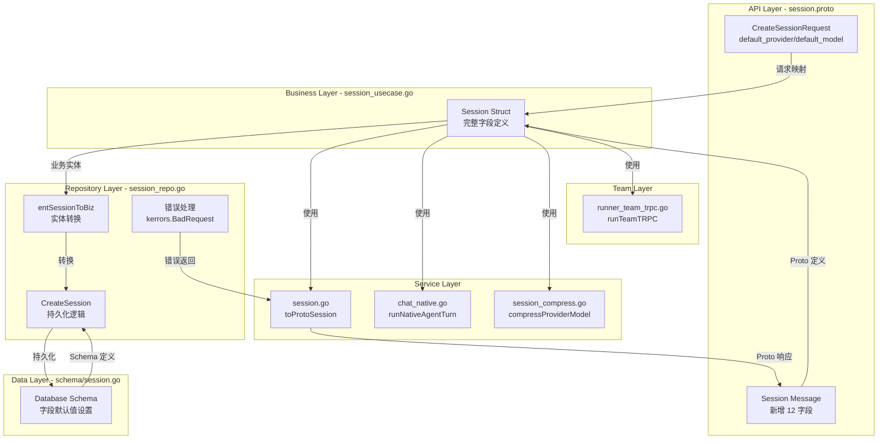

## 1. 高层摘要 (TL;DR)

*   **影响范围：** 🔴 **高** - 涉及 Session 核心数据结构的全面重构，影响数据库 Schema、Proto 定义、业务逻辑层、数据访问层及多个服务模块
*   **关键变更：**
    *   新增 **12 个字段**（workspace_id, user_id, tags_json, visibility, avg_latency_ms, error_count 等）
    *   重命名 **2 个字段**（`provider/model` → `default_provider/default_model`），并新增 `last_provider/last_model` 支持动态切换
    *   新增 **元数据支持**（metadata_json, runner_snapshot_json）用于存储扩展状态
    *   统一错误处理机制，使用 Kratos 框架的错误类型

---

## 2. 可视化概览 (代码与逻辑映射)



---

## 3. 详细变更分析

### 📊 数据库 Schema 变更 (internal/data/ent/schema/session.go)

#### 新增字段

| 字段名 | 类型 | 默认值 | 说明 |
|--------|------|--------|------|
| `workspace_id` | String | `""` | 工作空间标识 |
| `user_id` | String | `""` | 用户标识 |
| `tags_json` | Text | `"[]"` | 标签 JSON 数组 |
| `default_provider` | String | `""` | 默认 LLM 提供商 |
| `default_model` | String | `""` | 默认模型名称 |
| `default_context_window_tokens` | Int | `0` | 默认上下文窗口大小 |
| `last_provider` | String | `""` | 最后使用的提供商 |
| `last_model` | String | `""` | 最后使用的模型 |
| `last_context_window_tokens` | Int | `0` | 最后上下文窗口大小 |
| `visibility` | String | `"private"` | 会话可见性 |
| `avg_latency_ms` | Float | `0` | 平均延迟（毫秒） |
| `error_count` | Int | `0` | 错误计数 |
| `first_message_at` | String | `""` | 首条消息时间 |
| `last_run_at` | String | `""` | 最后运行时间 |
| `metadata_json` | Text | `"{}"` | 元数据 JSON |

#### 字段重命名

| 原字段名 | 新字段名 | 变更原因 |
|----------|----------|----------|
| `provider` | `default_provider` | 支持会话级别的默认配置 |
| `model` | `default_model` | 支持会话级别的默认配置 |

#### 字段重新排序

将 `context_*` 相关字段移至统计字段之后，提升字段逻辑分组清晰度。

---

### 🔄 业务实体层变更 (internal/biz/session_usecase.go)

**Session 结构体完整更新**，同步新增所有字段，字段顺序与 Proto 定义保持一致。

---

### 🗄️ 数据访问层变更 (internal/data/session_repo.go)

#### 1. 实体转换函数更新

`entSessionToBiz()` 函数完整映射所有新字段：

```go
return biz.Session{
    // ... 新增字段映射
    WorkspaceID:                e.WorkspaceID,
    UserID:                     e.UserID,
    TagsJSON:                   e.TagsJSON,
    DefaultProvider:            e.DefaultProvider,
    DefaultModel:               e.DefaultModel,
    LastProvider:               e.LastProvider,
    LastModel:                  e.LastModel,
    Visibility:                 e.Visibility,
    AvgLatencyMs:               e.AvgLatencyMs,
    ErrorCount:                 e.ErrorCount,
    FirstMessageAt:             e.FirstMessageAt,
    LastRunAt:                  e.LastRunAt,
    MetadataJSON:               e.MetadataJSON,
    // ...
}
```

#### 2. 创建方法更新

`CreateSession()` 方法新增所有字段的 Set 调用。

#### 3. 错误处理改进

| 方法 | 原错误处理 | 新错误处理 |
|------|-----------|-----------|
| `UpdateSessionContextFromLLMUsage` | `errors.New("session id is required")` | `kerrors.BadRequest("SESSION", "session id is required")` |
| `UpdateSessionContextAfterCompression` | `errors.New("session id is required")` | `kerrors.BadRequest("SESSION", "session id is required")` |
| `AppendChatTurn` | `errors.New("session id is required")` | `kerrors.BadRequest("SESSION", "session id is required")` |
| `AppendChatMessage` | `errors.New("session id is required")` | `kerrors.BadRequest("SESSION", "session id is required")` |

---

### 🌐 服务层变更

#### 1. Session 服务 (internal/service/session.go)

**Proto 转换函数 `toProtoSession()` 更新：**

```go
func toProtoSession(s biz.Session) *v1.Session {
    return &v1.Session{
        // 新增字段映射
        WorkspaceId:             s.WorkspaceID,
        UserId:                  s.UserID,
        TagsJson:                s.TagsJSON,
        DefaultProvider:         s.DefaultProvider,
        DefaultModel:            s.DefaultModel,
        LastProvider:            s.LastProvider,
        LastModel:               s.LastModel,
        Visibility:              s.Visibility,
        AvgLatencyMs:            s.AvgLatencyMs,
        ErrorCount:              int32(s.ErrorCount),
        FirstMessageAt:          s.FirstMessageAt,
        LastRunAt:               s.LastRunAt,
        RunnerSnapshotJson:      s.RunnerSnapshotJSON,
        MetadataJson:            s.MetadataJSON,
    }
}
```

**创建会话方法更新：**

```go
in := biz.Session{
    // 字段重命名
    DefaultProvider: req.GetDefaultProvider(),  // 原: Provider
    DefaultModel:    req.GetDefaultModel(),     // 原: Model
}
```

#### 2. Chat Native 服务 (internal/service/chat_native.go)

**Provider/Model 选择逻辑更新：**

```go
// 原代码
prov = strutil.FirstNonEmpty(prov, sess.Provider, ag.Provider)
mod = strutil.FirstNonEmpty(mod, sess.Model, ag.Model)

// 新代码
prov = strutil.FirstNonEmpty(prov, sess.DefaultProvider, ag.Provider)
mod = strutil.FirstNonEmpty(mod, sess.DefaultModel, ag.Model)
```

#### 3. Session Compress 服务 (internal/service/session_compress.go)

**压缩逻辑更新：**

```go
// 原代码
return strutil.FirstNonEmpty(sess.Provider, ag.Provider), 
       strutil.FirstNonEmpty(sess.Model, ag.Model)

// 新代码
return strutil.FirstNonEmpty(sess.DefaultProvider, ag.Provider), 
       strutil.FirstNonEmpty(sess.DefaultModel, ag.Model)
```

---

### 👥 Team 层变更 (internal/team/runner_team_trpc.go)

**TRPC Runner 逻辑更新：**

```go
// 原代码
prov0 := strutil.FirstNonEmpty(provOpt, sess.Provider, firstAg.Provider)
mod0 := strutil.FirstNonEmpty(modOpt, sess.Model, firstAg.Model)
ModelName: strutil.FirstNonEmpty(modOpt, sess.Model, firstAg.Model)

// 新代码
prov0 := strutil.FirstNonEmpty(provOpt, sess.DefaultProvider, firstAg.Provider)
mod0 := strutil.FirstNonEmpty(modOpt, sess.DefaultModel, firstAg.Model)
ModelName: strutil.FirstNonEmpty(modOpt, sess.DefaultModel, firstAg.Model)
```

---

## 4. 影响与风险评估

### ⚠️ 破坏性变更

1.  **Proto API 变更：**
    *   `CreateSessionRequest` 的 `provider` 和 `model` 字段已重命名为 `default_provider` 和 `default_model`
    *   客户端需要同步更新字段名称

2.  **数据库 Schema 变更：**
    *   需要执行数据库迁移，新增 12 个字段
    *   现有数据的 `provider` 和 `model` 字段需要迁移到 `default_provider` 和 `default_model`

### 🧪 测试建议

1.  **数据库迁移测试：**
    *   验证现有数据迁移到新字段的正确性
    *   检查默认值设置是否符合预期

2.  **API 兼容性测试：**
    *   验证使用新字段名 `default_provider/default_model` 的创建请求
    *   验证 Session 响应包含所有新增字段

3.  **业务逻辑测试：**
    *   验证 Chat Native、Session Compress、Team Runner 等模块正确使用新字段
    *   验证 Provider/Model 优先级逻辑（请求参数 > Session 默认值 > Agent 配置）

4.  **错误处理测试：**
    *   验证 Session ID 为空时返回正确的 Kratos BadRequest 错误

### ✅ 改进点

1.  **字段语义更清晰：** `default_provider/default_model` 明确表示会话级别的默认配置
2.  **支持动态切换：** 新增 `last_provider/last_model` 可以追踪实际使用的模型
3.  **扩展性增强：** `metadata_json` 和 `tags_json` 支持灵活的扩展数据存储
4.  **监控能力提升：** `avg_latency_ms` 和 `error_count` 支持会话级别的性能监控