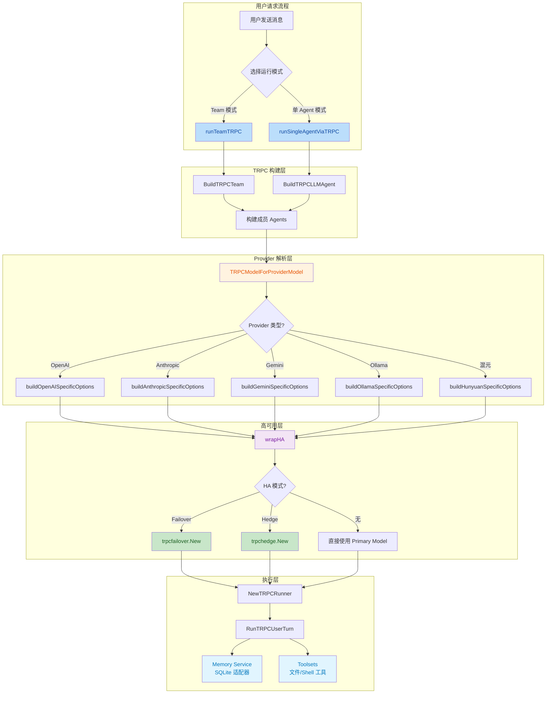
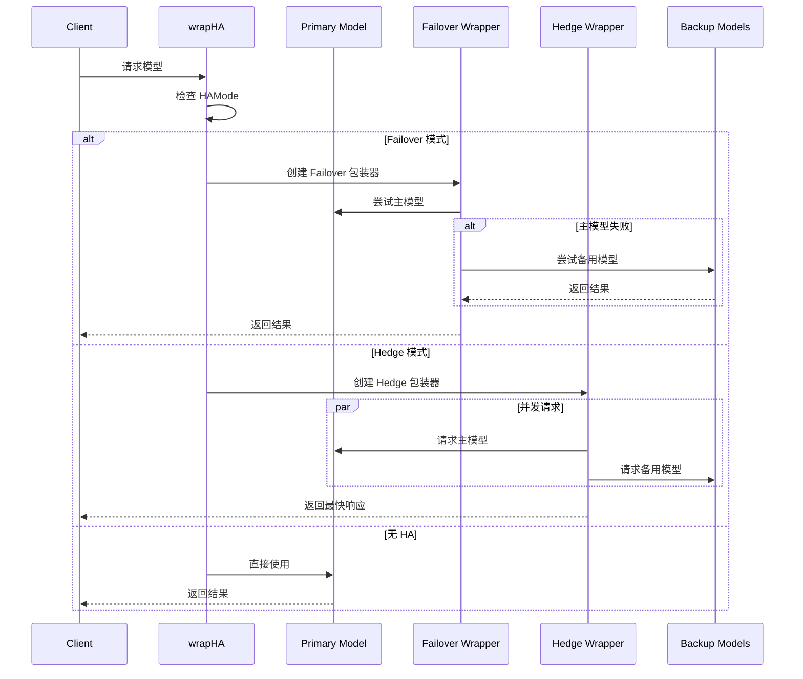

## 1. 高层摘要 (TL;DR)

*   **影响**: 🔴 **高** - 这是一次重大的架构迁移，将整个项目从 Google ADK 框架完全迁移到 TRPC Agent 框架，同时大幅扩展了 LLM Provider 支持
*   **关键变更**:
    *   🔄 核心框架从 Google ADK 迁移到 TRPC Agent (v1.9.1)
    *   🌐 新增对 Anthropic、Gemini、Ollama、混元等多个 Provider 的原生支持
    *   🛡️ 引入高可用（HA）机制：Failover（故障转移）和 Hedge（请求对冲）
    *   🔧 新增工具集系统，支持文件系统操作和 Shell 执行
    *   💾 重构内存服务，实现 SQLite 持久化适配器

---

## 2. 可视化概览 (代码与逻辑图)



---

## 3. 详细变更分析

### 📦 3.1 依赖管理

| 包名 | 旧版本 | 新版本 | 说明 |
|------|--------|--------|------|
| `trpc.group/trpc-go/trpc-agent-go` | v0.0.0 | v1.9.1 | 核心框架升级 |
| `trpc-agent-go/model/anthropic` | - | v1.9.0 | 新增 Anthropic 支持 |
| `trpc-agent-go/model/gemini` | - | v1.9.0 | 新增 Gemini 支持 |
| `trpc-agent-go/model/ollama` | - | v1.9.0 | 新增 Ollama 支持 |
| `trpc-agent-go/model/provider` | - | v1.9.0 | 新增通用 Provider |
| `github.com/anthropics/anthropic-sdk-go` | - | v1.37.0 | Anthropic 官方 SDK |
| `github.com/ollama/ollama` | - | v0.16.3 | Ollama 客户端 |
| `github.com/tidwall/gjson` | v1.14.4 | v1.18.0 | JSON 解析库升级 |

### 🏗️ 3.2 核心架构迁移

#### **删除的 ADK 相关文件**
- ❌ `internal/agent/adk_runner.go` - ADK Runner 构造器
- ❌ `internal/agent/adk_llm.go` - ADK LLM 模型解析
- ❌ `internal/agent/adk_memory.go` - ADK 内存服务
- ❌ `internal/provider/openai/llm.go` - OpenAI ADK 实现 (358 行)

#### **新增的 TRPC 相关文件**
- ✅ `internal/agent/trpc_build.go` - TRPC Agent 构建器
- ✅ `internal/agent/trpc_runtime.go` - TRPC 运行时
- ✅ `internal/agent/user_ctx.go` - 用户上下文管理
- ✅ `internal/team/runner_team_trpc.go` - TRPC Team 运行器 (369 行)
- ✅ `internal/team/trpc_build.go` - TRPC Team 构建器
- ✅ `internal/tools/trpc/toolsets.go` - 工具集构建
- ✅ `internal/memory/trpc/sqlite_adapter.go` - SQLite 内存适配器 (226 行)

#### **关键代码变更**

**Team 运行切换** (Source: `internal/team/runner.go`)
```go
// 旧代码
return r.runTeamADK(ctx, sess, req, teamRow, def, mode, stream)

// 新代码
return r.runTeamTRPC(ctx, sess, req, teamRow, def, mode, stream)
```

**TRPC Runner 增强内存支持** (Source: `internal/agent/trpc_runtime.go`)
```go
type TRPCRunnerDeps struct {
    AppName        string
    SessionService trpcsession.Service
    MemoryService  trpcmemory.Service  // 新增
}
```

### 🌐 3.3 多 Provider 支持

#### **Provider 类型映射** (Source: `internal/provider/trpc_llm.go`)

| Provider 类型 | 映射值 | 支持的特定配置 |
|--------------|--------|----------------|
| OpenAI | `openai` | `OptimizeForCache`, `ReasoningBackfill`, `ShowToolCallDelta` |
| Anthropic | `anthropic` | `CacheSystemPrompt`, `CacheTools`, `CacheMessages` |
| Gemini | `gemini` | `MaxInputTokens`, 自定义 `ClientConfig` |
| Ollama | `ollama` | `KeepAlive`, `MaxInputTokens` |
| 混元 | `hunyuan` | `SecretID`, `SecretKey`, `ContextWindow` |
| DeepSeek/Qwen | `openai` + `variant` | 通过 Variant 字段区分 |

#### **高可用机制**



**HA 配置参数**:
- `HAMode`: `"failover"` | `"hedge"` | `""`
- `HACandidates`: 备用模型列表
- `HAHedgeDelayMs`: Hedge 模式下的延迟（毫秒）

### 🛠️ 3.4 工具集系统

**新增文件**: `internal/tools/trpc/toolsets.go`

| 工具类型 | 功能 | 配置选项 |
|---------|------|---------|
| 文件系统 | `read_file`, `list_files`, `write_file`, `edit_file` | `FilesystemDir` (基础目录) |
| Shell 执行 | `shell_exec` | 无额外配置 |

**集成方式** (Source: `internal/agent/trpc_build.go`):
```go
if ts, err := buildToolsetsForAgent(ag, deps); err == nil && ts != nil {
    if len(ts.ToolSets) > 0 {
        opts = append(opts, trpcllmagent.WithToolSets(ts.ToolSets))
    }
    if len(ts.Tools) > 0 {
        opts = append(opts, trpcllmagent.WithTools(ts.Tools))
    }
}
```

### 💾 3.5 内存服务重构

**新增**: `internal/memory/trpc/sqlite_adapter.go`

实现了 `trpcmemory.Service` 接口，提供以下功能：

| 方法 | 功能 | 持久化 |
|------|------|--------|
| `AddMemory` | 添加记忆 | ✅ SQLite |
| `UpdateMemory` | 更新记忆 | ✅ SQLite |
| `DeleteMemory` | 删除记忆 | ❌ 仅缓存 |
| `ClearMemories` | 清空记忆 | ❌ 仅缓存 |
| `SearchMemories` | 搜索记忆 | ✅ SQLite + 缓存 |
| `ReadMemories` | 读取记忆 | ❌ 仅缓存 |
| `Tools` | 返回记忆工具 | - |

**数据结构映射**:
```
TRPC Memory Entry → SQLite ADKEventEntity
- ID → ID
- AppName → ScopeID
- UserID → UserID
- Memory → Description
- Topics → MetadataJSON
- CreatedAt → CreatedAtRFC3339
```

### 🎨 3.6 前端配置更新

#### **Provider 类型扩展** (Source: `web/src/config/chatOptions.ts`)

| 新增 Provider | 说明 |
|--------------|------|
| Gemini | Google Gemini 原生支持 |
| Ollama | 本地模型运行 |
| 混元 | 腾讯云混元 |
| HuggingFace | HuggingFace Inference API |
| Bedrock | AWS Bedrock |

#### **Provider 预设重构** (Source: `web/src/config/providerPresets.ts`)

**新增类型定义**:
```typescript
export type AuthType = "api_key" | "secret_id_key" | "aws_config" | "none";
export type ProviderType = "openai" | "anthropic" | "gemini" | "ollama" | "hunyuan" | "huggingface" | "bedrock";
export type OpenAIVariant = "openai" | "deepseek" | "qwen" | "hunyuan";
```

**Provider 配置标准化**:

| Provider | ProviderType | Variant | AuthType |
|----------|--------------|---------|----------|
| OpenAI | `openai` | `openai` | `api_key` |
| DeepSeek | `openai` | `deepseek` | `api_key` |
| 通义千问 | `openai` | `qwen` | `api_key` |
| 混元 | `hunyuan` | - | `secret_id_key` |
| Ollama | `ollama` | - | `none` |
| Bedrock | `bedrock` | - | `aws_config` |

### 🧹 3.7 清理工作

**删除的文档**:
- ❌ `docs/plan.md` - 旧的开发计划
- ❌ `docs/guides/plan.md` - 旧的指南计划

---

## 4. 影响与风险评估

### ⚠️ 4.1 破坏性变更

1.  **API 兼容性**: 完全移除了 Google ADK 依赖，所有基于 ADK 的自定义实现需要重写
2.  **配置格式**: Provider 配置结构变化，需要迁移现有配置
3.  **内存服务**: 内存接口变更，需要适配新的 `trpcmemory.Service`

### 🧪 4.2 测试建议

#### **必须测试的场景**:

1.  **多 Provider 切换**
    - [ ] 验证 OpenAI、Anthropic、Gemini、Ollama、混元等 Provider 的基本调用
    - [ ] 测试 Variant 配置（DeepSeek、Qwen 等）

2.  **高可用机制**
    - [ ] 测试 Failover 模式：主模型失败时自动切换到备用模型
    - [ ] 测试 Hedge 模式：并发请求并返回最快响应
    - [ ] 测试无 HA 模式：直接使用主模型

3.  **Team 运行**
    - [ ] 验证 Team 模式下的多 Agent 协作
    - [ ] 测试 Swarm 模式
    - [ ] 测试 Coordinator 模式

4.  **工具集功能**
    - [ ] 测试文件系统工具（读、写、列表、编辑）
    - [ ] 测试 Shell 执行工具
    - [ ] 验证工具权限控制

5.  **内存服务**
    - [ ] 测试记忆的添加、更新、搜索
    - [ ] 验证 SQLite 持久化
    - [ ] 测试记忆工具的自动注册

6.  **前端配置**
    - [ ] 验证新 Provider 在 UI 中的显示
    - [ ] 测试不同 AuthType 的表单验证
    - [ ] 验证预设模型的加载

#### **性能测试**:

- [ ] 对比 ADK 和 TRPC 框架的响应时间
- [ ] 测试 Hedge 模式下的延迟和资源消耗
- [ ] 验证 SQLite 内存服务的查询性能

### 📝 4.3 迁移检查清单

- [ ] 更新所有依赖到新版本
- [ ] 迁移现有 Provider 配置到新格式
- [ ] 重新实现基于 ADK 的自定义代码
- [ ] 更新前端配置文件
- [ ] 测试所有现有功能
- [ ] 更新文档和 API 说明

---

## 5. 总结

这次变更是一次**全面的架构升级**，从 Google ADK 迁移到 TRPC Agent 框架，不仅提升了框架的稳定性和性能，还大幅扩展了 LLM Provider 的支持范围。新增的高可用机制（Failover/Hedge）显著提升了系统的可靠性，工具集系统的引入为 Agent 提供了更强的执行能力。

**主要收益**:
- 🚀 更好的框架支持和维护性
- 🌐 更多的 Provider 选择
- 🛡️ 更高的系统可用性
- 🔧 更强的工具集成能力
- 💾 更可靠的内存持久化

**需要注意**:
- 配置迁移工作量较大
- 需要充分测试 HA 机制
- 前端 UI 需要适配新的 Provider 类型