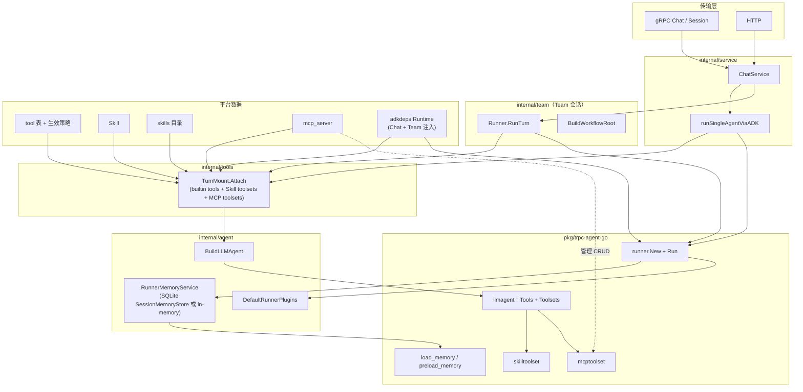

# Agent 现阶段实现：Skill、Tools、MCP、记忆

本文基于当前仓库代码，说明 **单 Agent 聊天**（`ChatService.runSingleAgentViaADK`）与 **原生 Team 工作流**（`internal/team.Runner`）在运行时的装配方式；并标出 **已实现 / 预留 / 未接入 Runner** 的边界。更一般的传输与分层约定见 [`AGENT_RUNTIME_BOUNDARY.md`](AGENT_RUNTIME_BOUNDARY.md)。

---

## 总览框图

下列框图描述一次对话 turn 内，从 Kratos 服务到框架 `runner.Run`（tRPC-Agent-Go）的数据与控制流。

**读图要点**

- **Skills** 通过 `Toolsets`（不是单独 `Tools` 切片的第一类路径）挂载到 `llmagent`，来源是启用且已发布的 Skill + 运行时策略与用户 query 收窄。
- **Tools（平台生效列表）** 映射为原生 `tool.Tool`（工作区文件、框架内置、`shell_exec`、可选 `spawn_subagent`），进入 `llmagent.Config.Tools`。
- **MCP**：生效工具中包含 **`mcp_tool_set`**（`biz.ToolKeyMCPToolSet`）时，`TurnMount` 经 `biz.AgentMCPTooling.EffectiveServersForAgent` 拉取启用中的 `mcp_server` 行，并由 `internal/tools/mcpmount` 解析 `config_json` → `mcptoolset`。该 key **不经过** `ADKToolsFromEnabled`（仅以 toolset 挂载）。agent 级 allow/deny 服务器列表仍可后续扩展到独立 JSON（当前为「平台启用则暴露」）。
- **Runner 的记忆服务**：默认 `RunnerMemoryService` — `SessionMemoryStore` 已由 wire 注入 `adkdeps.Runtime` 时走 **SQLite** `SessionSQLiteMemoryService`，否则 **in-memory**；`load_memory` / `preload_memory` 与所选后端一致。

---

## 1. Skill 如何加载

| 环节 | 位置 | 行为 |
|------|------|------|
| 列举候选 | `biz.SkillUsecase` | `ListEnabledPublishedSkillCandidates` 等提供 slug、标签、taxonomy 等路由元数据。 |
| 运行时策略 | `ag.Settings.SkillRuntimeJSON` | `biz.ParseSkillRuntimePolicy` → allow/deny、标签、intent 路由开关、`MaxSkillsInToolset` 等（见 `internal/biz/skill_runtime.go`、`internal/tools/skillruntime/resolve.go`）。 |
| 按需收窄（Layer B） | `skillrouter` | 用户首轮 `content` 作 query：意图路径检测、关键词与 taxonomy 打分，截取前 N 个 skill。 |
| 物理根路径 | `internal/pkg/skillstorage` | `SKILL_ROOT` / `SKILL_STORAGE_ROOT` 优先；否则结合系统设置的 `RootDirectory`，或操作系统默认目录（如 `%AppData%\Aranea\skills`）。 |
| 子树 FS | `skillruntime.NewEnabledSkillsRootFS` | 仅在根下暴露允许的 `{slug}/` 目录，防路径穿越。 |
| 框架装配 | `skilltoolset.New` | `NewSkillToolsetFromFS` 将只读 FS 交给 Skill 源码读取（见 `internal/tools/skillruntime/toolset.go`）。 |

**调用点**

- 单 Agent / Team：**`tools.TurnMount.Attach`**（`internal/tools/turn_mount.go`）；Team `BuildWorkflowRoot` / `buildLLMChain` 对**每个成员**分别调用挂载。每个成员使用**自己的** `SkillRuntimeJSON`、**自己的**生效工具集（含 MCP：`EffectiveServersForAgent(ctx, memberAgentID)`）。用户首轮 `content` 作为 **Skill 路由 query** 在成员之间**共享**（收窄候选 skill 列表），与 MCP 选路无关。

**补充**

- `internal/tools/catalog/assemble.go` 中的 `SkillsFS` 是另一种装配入口（显式传入 `io/fs`），供非「平台启用 skill 列表」场景使用；当前主聊天路径走的是 `AppendEnabledPublishedSkillToolsets`，未使用该 `Options.SkillsFS` 分支。

---

## 2. Tools 如何使用

| 步骤 | 位置 | 说明 |
|------|------|------|
| 真相源 | `AgentUsecase.GetEffectiveTools` | 返回 profile、是否启用工具、每条 `tool_key` 的 allow、deny 列表等。 |
| 映射为框架 Tool | `internal/tools/tools.go` | `ToolsFromAgentEffective` → `registry.ApplyEffectiveAliases` → `registry.ADKToolsFromEnabled`。 |
| 单 Agent / Team 成员 | `ADKToolsForAgentPolicy` | 在生效工具基础上，若 `SubagentsEnabled` 则追加 **`spawn_subagent`**（以及系统提示里的 `transfer_to_agent`/`spawn_subagent` 说明，见 `internal/agent/prompt.go` `RuntimeCapabilityCue`）。 |

**具体工具族**

- **工作区文件**：`read_file`、`list_files`、`write_file`、`edit_file`（沙箱根由 env `ARANEA_WORKSPACE_ROOT` / `WORKSPACE_ROOT` 等约束，prompt 中也有说明）。
- **框架内置顺序**：`exit_loop`、`web_search`、`web_fetch`、`load_artifacts`、`load_memory`、`preload_memory`（顺序见 `internal/tools/registry/keys.go` `ADKBuiltinOrder`）。
- **宿主**：`shell_exec`（与别名字段 `shell` 去重，只挂载一个）。
- **子 Agent**：`spawn_subagent`（策略开启时）。

`BuildLLMAgent`（`internal/agent/adk_build.go`）将 `deps.Tools` 与 `deps.Toolsets` 分别传给 `llmagent.Config`，由框架统一暴露给模型。

---

## 3. MCP 相关：平台能力 vs 运行时

| 层次 | 已实现 | 说明 |
|------|--------|------|
| 数据与 API | 是 | `mcp_server` 表（Ent）、`MCPServerService` gRPC/HTTP、增删改查与 `mcpprobe` 连通性测试（`internal/biz/mcp_server.go`、`internal/mcpprobe`）。 |
| MCP 客户端 | 是（库） | MCP toolset API（随 **`pkg/trpc-agent-go`/go.mod** 提供的 `tool`/`mcptoolset`），将远端 MCP 工具转为 `tool.Toolset`。 |
| 统一装配器 | 部分 | `internal/tools/catalog/assemble.go`：若传入 `Options.MCP` 则可 `mcptoolset.New`（与本机聊天路径的 `mcpmount` 并列存在）。 |
| 聊天 / Team Runner | **是** | `tools.TurnMount` + `biz.AgentMCPTooling` + `internal/tools/mcpmount`；Wire 通过 `adkdeps.NewRuntime` 注入 `AgentMCPTooling`。生效工具需启用 **`mcp_tool_set`**（`biz.ToolKeyMCPToolSet`）。 |

**小结**：运行时路径已接入 MCP；需在 Agent 生效工具里打开 **`mcp_tool_set`**。在 **`agent_runtime_settings.tools_allow_json` / `tools_deny_json`** 中可使用前缀 **`mcp:<server_key>`**（与平台 `mcp_server.key` 对应）限制挂载的服务器列表；未配置任何 `mcp:` 项时仍为「所有已启用且 active 的平台服务器」。stdio 传输在 `TurnMount.Attach` 使用请求 `context` 构建子进程，便于在上层取消时结束 MCP 子进程。

---

## 4. Agent「记忆」：加载方式与并联模块

运行时里「记忆」在代码中拆成几条**互不自动打通**的线，需分开理解。

### 4.1 Runner 的 `MemoryService`

- **实现**：`internal/agent/adk_memory.go` — `RunnerMemoryService(store)`：有 `sessionmemory.Store` → `SessionSQLiteMemoryService`，否则 **`memory.InMemoryService()`**。
- **接入**：`adk_turn.go`、`team/runner.go` 通过 **`adkdeps.Runtime.SessionMemory`**（Wire 注入 `NewSessionMemoryStore`）。
- **与工具的关系**：`load_memory` / `preload_memory` 使用 Runner 挂载的 **`MemoryService`**；SQLite 路径下可查 `memory_entities`（仍需生产路径写入实体；见 4.2 `AddSessionToMemory`）。

### 4.2 SQLite 会话记忆链（观测 / 会话装配用）

- **数据**：`internal/data/sessionmemory` + `memory_chain.sql`（L0 装配快照、L1–L4、entities 等）。
- **对外 API**：`internal/service/memory.go`（`memory/v1` gRPC）对外查询 L0/L1/…**不是**会话 Runner Memory 的一环。
- **桥接**：`internal/agent/adk_memory_sqlite.go` 的 `SessionSQLiteMemoryService`，在 **注入 Store** 时起效；**`AddSessionToMemory` 仍为 no-op**，与 L0 写入链路的对齐仍可完善。

### 4.3 Postgres pgvector「Agent 向量记忆」（业务另一条线）

- **模型**：`internal/biz/memory.go`（`Remember` / `Search`）、`internal/data/memory.go` 等对 `agent_memory` 的读写。
- **用途**：独立于 Runner Memory 配置的「长期语义记忆」业务能力；是否暴露给某个 HTTP/RPC 或未来工具需看上层调用——**不在**本节 Chat Runner 默认路径内自动挂载。

### 4.4 会话侧统计

- `biz.SessionUsecase` / session 行上存在 **MCP 调用计数** 等字段（与工具/MCP 产品统计相关），与 `MemoryService` 不是同一概念。

---

## 5. 其它横切逻辑（Runner 级）

- **插件**：`internal/agent/adk_plugins.go` `DefaultRunnerPlugins` —— 默认注册 `retryandreflect`；`ARANEA_ADK_LOGGING_PLUGIN=1` 时可选日志插件。
- **会话持久化**：`internal/agent/adksvc` `BizSessionService` 对接业务 Session，读写框架 `session` 快照（Runner `AutoCreateSession: false`，由会话已存在为前提）。
- **上下文注入 prompt**：`RuntimeCapabilityCue` 将有效工具列表、子 Agent 开关、沙箱说明等写入系统提示末尾。

---

## 6. 设计原则下的待完善项（Kratos × tRPC-Agent-Go）

本节从**程序设计**出发，对照本仓已写的 **Kratos 传输/分层** 与 **tRPC-Agent-Go 执行模型**（Runner、`llmagent`、`memory.Service`、`tool`/`toolset`），归纳**功能缺口**与**可优化方向**；见下文 **§6.4** 的分阶段落实顺序与验收边界。实现时仍须遵守 [`AGENT_RUNTIME_BOUNDARY.md`](AGENT_RUNTIME_BOUNDARY.md)（server 不碰框架运行时、biz 不 import `pkg/trpc-agent-go`、装配与 prompt 在 service + `internal/agent`/`internal/tools`）。

### 6.1 与 Kratos 分层、桥接方式相关

| 方向 | 现状与问题 | 建议 |
|------|------------|------|
| **服务层「唯一桥点」的一致性** | `runSingleAgentViaADK` 与 `team.Runner` 各自 `runner.New`、`BuilderDeps` 填充，逻辑相似但**分叉维护**；日后接 MCP、切换 `MemoryService` 时容易漏改一侧。 | 在 **不突破边界** 的前提下，抽出面向本产品的 **Runner 装配助手**（例如仅位于 `internal/service` 或小组件包，入参为 biz 侧 DTO + 已解析的 `tool.Tool`/`tool.Toolset`），**禁止**下沉到 `internal/server`；保持「Kratos Service 译请求 → 框架 Run」仍发生在一处调用链上。 |
| **Usecase 真相源的对称性** | 工具有 `GetEffectiveTools`；MCP 仅有平台级 `MCPServer` CRUD / 探测，**缺「某 Agent / 某会话允许哪些 MCP」** 的领域表达时，运行时只能硬编码或临时查全表。 | 在 **biz** 增加与工具策略同构的 **effective MCP 策略**（或由 agent / team 绑定 `server_key` + enable），由 **service** 在 turn 前解析为 `[]mcptoolset.Config`（或中间 DTO），符合「biz 存策略、service  orchestrate、不 import 框架运行时类型」。 |
| **横切与上下文** | Kratos middleware 不能 import 框架运行时，但请求级 `trace id` / `user id` 已进入 context（如 `UserIDFromCtx`）；长 turn 中 LLM、子进程 MCP、shell 的 span **是否同一 trace** 取决于现状埋点。 | 明确 **OTel / log 字段**从 gRPC 流入 `runner.Run` 的约定；工具与 MCP 客户端在 `internal/tools` 内打子 span，便于与 Kratos AccessLog 对齐（不复制 middleware 进 `pkg/trpc-agent-go`）。 |
| **超时、取消与资源** | 上层 `context` 取消时，流式 `Run` 会停，但 **stdio MCP 子进程**、长连接 HTTP MCP 的收尾是否及时，影响进程与句柄占用。 | 在 service 层设定与 **LLM 超时**一致的 deadline 策略；为 MCP toolset 定义 **turn 级或连接级**生命周期（与 `mcptoolset` 的连接刷新行为文档对齐），避免与 Kratos 进程长期共存时泄漏。 |
| **配置来源统一** | Skill 根路径已混用 env、系统设置、OS 默认；MCP 未来将混用 DB 行 + 环境占位。 | 在 **conf 或单一模块**中写下**优先级表**与是否支持热更新（避免同一部署上行为不可预期），仍由 **data/biz** 读配置、**service** 消费。 |

### 6.2 与 tRPC-Agent-Go 运行时模型相关

| 方向 | 现状与问题 | 建议 |
|------|------------|------|
| **`MemoryService` 可插拔** | 全域使用 `InMemoryService`，与 SQLite / pgvector **语义割裂**；`SessionSQLiteMemoryService` 已实现却未注入 Runner，`AddSessionToMemory` 仍为 no-op，**不满足**「一次 Run 内 load_memory 可见会话累积记忆」的产品预期（若产品有该预期）。 | 通过 **wire** 注入 `memory.Service`：**默认**可先保持 in-memory；当存在 `sessionmemory.Store` 时选用 **SQLite 适配器**或 **组合式**（例如 in-process 热数据 + SQLite 检索）；`AddSessionToMemory` 与 **adksvc 会话快照/装配流水线**对齐，避免在框架 plugin 内直接写库（遵守边界文档第 3 条，可事件驱动异步写）。 |
| **`Tool` vs `Toolset` 职责** | Skill、MCP 都以 Toolset 形态扩展，好事；但平台 `mcp_tool_set` 未进入 `ADKToolsFromEnabled`，**模型侧的「可调能力」与运营配置脱节**。 | 保持 **builtin/tool 映射在 `internal/tools/registry`**；MCP **只走 Toolset**，由 effective 策略在 service 组装进 `deps.Toolsets`，与 `skillruntime` 并列，呼应「动态工具列表」的形态。 |
| **Team 与 Skill 路由** | Team 仅用 **首位成员** 的 `SkillRuntimeJSON` + 用户 query 生成共享 `Toolsets`，其余成员共用同一 Skill 挂载。 | 产品上若需要「成员 A 挂载写作 skill、成员 B 挂载检索 skill」，应在 **builder** 层按成员拆分或复制 `Toolsets`（仍为 `internal/team`，不违反分层）；或在团队定义中显式 **skill_profile**，避免隐含规则难测。 |
| **记忆工具的业务含义** | `load_memory` / `preload_memory` 走框架默认语义，但若底层仍是空/in-memory，**能力名实不符**。 | 要么 **默认关闭**这两项直至后端就绪并在 `RuntimeCapabilityCue` 中如实描述，要么 **Composite `SearchMemory`** 聚合 SQLite entities +（可选）pgvector，避免模型「以为有记忆库」实则进程内为空。 |
| **插件与上下文压缩** | 已有 `retryandreflect`；若未来引入 context guard / compaction 类插件，需与 **多 toolset、大 MCP schema** 的 token 行为一致（常见痛点）。 | 插件只通过框架扩展点工作；**写回业务库**经 broker/async，与现有八条清单一致。 |

### 6.3 功能与工程上的优化清单（可排期）

1. **闭环 MCP**：`MCPServer`（enabled + config_json）→（可选 agent 绑定）→ `mcptoolset.New` → `BuilderDeps.Toolsets`；与 session 的 `MCPCallCount` 统计打通校验。
2. **闭环会话记忆**：`SessionSQLiteMemoryService` + 实现 `AddSessionToMemory` / 与 L0–L4 写入路径一致；grpc `memory/v1` 继续作为观测面，或与 Run 共用同一底层。
3. **向量记忆与 Runner**：为 `biz.MemoryUsecase` 增加 **显式工具或统一 SearchMemory 后端**，避免 Postgres 能力与对话路径永远平行。
4. **装配收口**：评估是否让 **`internal/tools/catalog.Options.Build`**（或薄封装）成为 chat/team **唯一** skill+MCP+builtin 装配入口，减少 `Append*` 与手写 `deps` 分叉。
5. **回归与熔断**：对「生效工具 + skill 子集 +（未来）MCP」做录制/契约测试；对 MCP `TestMCPServer` 与 runtime 报错路径统一用户可见文案（仍由 **service** 映射 Kratos 错误）。

### 6.4 分层落实计划（推荐顺序）

以下计划将 §6.1–§6.3 的条目**排成可交付阶段**：先定**真相源与边界**，再收敛**tools 装配**，最后接 **Runner 横切**与观测。每一阶段都满足：**Kratos** 侧「传输轻、service 桥、biz/data 不碰 `pkg/trpc-agent-go`」；**tRPC-Agent-Go** 侧「`llmagent` 只吃 `Tools`/`Toolsets`，`MemoryService` 可替换，`pkg/trpc-agent-go` 不掺业务」。

| 阶段 | 目标（逻辑更清晰之处） | 主要改动面 | 验收要点 |
|------|------------------------|------------|----------|
| **P0 基线** | 配置与能力描述**可预期**：Skill 根、MCP 将来源、记忆后端在文档与 `RuntimeCapabilityCue` 中与真实行为一致。 | `conf` / 单一「解析优先级」小模块；`internal/agent/prompt.go` 与本文档。 | 未接线的能力不在提示中宣称「已持久化」；env / 系统设置优先级有**一张表**。 |
| **P1 领域策略** | 与 `GetEffectiveTools` **对称**：在 **biz** 定义「某 Agent（或会话）可用的 MCP 集合」及 deny/allow，真相源可查可测；**不写**框架运行时类型。 | `internal/biz` + `internal/data`（如需 agent↔mcp 关联表或 JSON 字段）。 | Usecase 单测：**输入 agent id → 稳定 DTO**（如 `server_key` 列表 + 是否启用），无 `pkg/trpc-agent-go` / 私有框架 import。 |
| **P2 运行时装配收口** | **唯一装配入口**：在 `internal/tools` 把「builtin `tool.Tool` + skill `toolset` + MCP `toolset`」合成一步，避免 Chat 与 Team 各写半截。 | `internal/tools/catalog` 或新开 `internal/tools/assemble_turn.go` 等；只吃 **context + biz DTO**，产出 `[]tool.Tool` / `[]tool.Toolset`。 | `registry`/`skillruntime`/（未来）`mcptoolset` **只在此聚合**被 Chat/Team 调用；`catalog.Options.Build` 可演进为 facade。 |
| **P3 桥接复用（Kratos service）** | **一条路径 `runner.New`**：`runSingleAgentViaADK` 与 `team.Runner` 共用「装配 `runner.Config` + `BuilderDeps` 填充协议」，消灭分叉遗漏（MCP、Memory、插件）。 | `internal/service`（推荐）小包：如 `adkrun.Prepare(...)` —— **仅 orchestrate**，具体 tool 构造仍委派 `internal/tools` 与 `internal/agent`。 | 新能力默认**改一处生效两处**；`internal/server` 仍无任何框架运行时 import。 |
| **P4 MemoryService 注入** | `runner.Config.MemoryService` 由 **wire** 注入：无 store → in-memory；有 `sessionmemory.Store` → `SessionSQLiteMemoryService` 或 **组合实现**（检索合并多后端时仍在 `internal/agent` 用小对象组合，不塞进 plugin）。 | `cmd/admin`/wire，`internal/agent/adk_memory*.go`，必要时 **`AddSessionToMemory`** 与现有会话写入链路对齐（异步/event 皆可）。 | `load_memory` 行为与**实际数据源**一致；插件**不直连** DB 写会话记忆（遵守边界文档）。 |
| **P5 Team 语义显式化** | Skill/MCP **按产品设计**挂载：要么文档化「全队共享首位成员 Skill 策略」，要么在 `team/builder.go` **按成员**克隆/重写 `Toolsets`（仍在 `internal/team`）。 | `internal/team/builder.go` + 可选团队定义 JSON。 | 团队成员技能差异可被配置表达，且无跨层逆行 import。 |
| **P6 横切与质量** | 与 Kratos 对齐的 **trace/deadline**；MCP 子进程/连接在 **context 取消**时的收尾策略文档 + 实现核对；契约测试覆盖「有效工具 + skills + MCP」。 | `internal/tools`（MCP 调用 span）、`internal/service`（deadline 传递）、测试与错误码映射。 | 取消请求不泄漏子进程；用户可见错误经 **Kratos errors** 由 service 统一映射。 |

**依赖关系（简图）**：`P0` 可与任意时刻并行；**P1 → P2**（策略 DTO 稳定后再总装）；**P2 + P3** 可紧耦合迭代；**P4** 依赖 P3 的 `runner` 构造集中化（否则又要两处改）；**P5** 可在 P2 之后独立做；**P6** 贯穿并在 P2 后加强 MCP 部分。

**刻意不做的事（防违背原则）**：不在 `internal/biz` 引入 `mcptoolset.Config`；不在 `internal/server` 建 Runner；不把运营 JSON 解析散落在多个 service 方法里而不经 `internal/tools` 聚合。

---

## 7. 文件索引（便于跳转）

| 主题 | 主要文件 |
|------|-----------|
| 构建 llmagent | `internal/agent/adk_build.go` |
| 单 Agent turn | `internal/service/adk_turn.go` |
| Team turn | `internal/team/runner.go`, `internal/team/runner_team_adk.go`, `internal/team/runner_helpers.go`, `internal/team/builder.go` |
| 工具映射 | `internal/tools/adk.go`, `internal/tools/registry/adk_enabled.go`, `internal/tools/registry/adk_builtin.go` |
| Skill toolset | `internal/tools/skillruntime/toolset.go`, `resolve.go`, `fs.go` |
| Turn 装配（tools + skill + MCP） | `internal/tools/turn_mount.go` |
| MCP config → mcptoolset | `internal/tools/mcpmount/*.go` |
| biz MCP 生效（无 ADK） | `internal/biz/agent_mcp_effective.go` |
| Wire 运行时依赖束 | `internal/adkdeps/deps.go`，`cmd/admin/wire.go`（`NewRuntime`、`NewAgentMCPTooling`） |
| Runner + Memory（Runtime 束） | `internal/agent/adk_runner.go`, `internal/agent/adk_runner_runtime.go`；Biz Session：`internal/agent/adksvc/session_service.go`（`NewBizSessionForUsecase`） |
| Runner 内存 | `internal/agent/adk_memory.go`, `internal/agent/adk_memory_sqlite.go` |
| 平台 MCP | `internal/service/mcp_server.go`, `internal/data/mcp_server.go` |

---

*文档随实现演进。**MCP（mcp_tool_set）**、**TurnMount**、**RunnerMemoryService（SQLite）**、`mcp:<server_key>` 筛选与 Runner 装配助手（`adk_runner_runtime`、`NewBizSessionForUsecase`）已接线；未完成项见 §6「待完善」（观测/trace 等）。有重大变更时请同步 [`AGENT_RUNTIME_BOUNDARY.md`](AGENT_RUNTIME_BOUNDARY.md)。*
