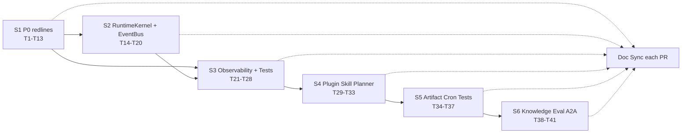
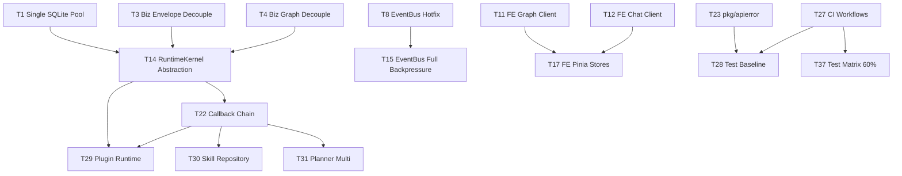

# Aranea-Agents 实施方案总览

> **⚠️ 本文档自 2026-05-17 起停止维护**。S1–S6 / T1–T41 / 6 个 Sprint 节奏 已不再作为执行依据；新的 5 个里程碑（M0–M5）与可执行 Top-20 工作清单见 [`docs/guides/execution-plan.md`](execution-plan.md) §4 / §5。仅保留作历史参考。
>
> ---
>
> 版本：v1.0（2026-05-17，已冻结）
> 上游依据：[docs/guides/master-plan.md](master-plan.md)（同步废弃）
> 本文（原）定位：把 master-plan §6 优先级 + §8 落地分类，转写为可逐 PR 执行的 6 个 Sprint，附风险地图、角色分工、度量阈值。
> 配套：每个 Sprint 详细任务清单见 `docs/guides/sprints/`（同步废弃）；周度勾选见 [docs/guides/task-tracker.md](task-tracker.md)（同步废弃）。

---

## 1. 实施目标与原则

### 1.1 实施目标

- **结清红线**：S1 内全部消除 `AI-DEVELOPMENT-SPECIFICATION.md` 红线违反（V-1~V-5）。
- **修复正确性 Bug**：S1 内修复 B-1（Memory cache）、B-4（executions GC）、B-5（builder race）、B-8（EventBus 关键事件丢弃）、B-11（ctx 丢失）。
- **建立架构骨架**：S2 完成 `internal/runtime` 抽象 + EventBus 背压 + Agent 构建缓存。
- **业务可观测 + 测试基线**：S3 建立 CI、metrics、错误模型、Workspace 中间件，覆盖率门槛 30%。
- **能力补全**：S4 接入 Plugin/Skill/Planner/Memory tool；S5 落地 Artifact / Cron 重试 / 测试矩阵 60% 门槛。
- **长期能力**：S6 开放 Knowledge / Evaluation / A2A / CodeExecutor 沙箱。

### 1.2 实施原则

1. **每 PR 最小可合并**：单 PR 任务量 ≤ 1 人日；commit message 必须形如 `[S{n}-T{m}] <topic>`。
2. **Feature freeze 节奏**：Sprint 最后 2 天禁止合并新 feature PR，仅允许 fix + 文档。
3. **每 PR smoke 必过**：`make smoke`（启动 + chat + tool + memory + graph）；S3 起强制 CI。
4. **文档同步**：任何改变行为/接口的 PR 必须同时改 `docs/changelog/YYYY-MM-DD-*.md` + 相关 guide + task-tracker 状态。
5. **回滚优先**：所有重构 PR 必须可单独 revert；新功能 PR 必须可通过 config flag 关闭。
6. **红线零容忍**：S1 完成后，`make runtime-boundary` 失败 = block CI。

---

## 2. 跨 Sprint 依赖图

### 2.1 主线依赖



### 2.2 关键任务依赖（跨 Sprint）



### 2.3 并行机会

- S1 内：T1（后端单连接池）/ T11+T12（前端客户端）/ T13（文档同步）可三人并行。
- S2 内：T14（runtime 抽象）依赖 S1 全合并；T15/T16/T17/T18 可并行。
- S4 内：T29/T30/T31/T32 完全并行，T33 依赖 T32。
- S6 内：T38/T39/T40/T41 完全并行，按人手分配。

---

## 3. 风险地图（按 Sprint 落地 master-plan §10）

| 风险 | 主要 Sprint | 缓解动作 | 监控指标 |
|------|-------------|----------|----------|
| SQLite 单写者瓶颈 | S1 / S2 | T1 单连接池；T15 EventBus 背压减少写竞争；生产推荐 Postgres | smoke 内写延迟 P99 < 200ms |
| trpc-agent-go 上游 API 变更 | S2 / S4 | T14 RuntimeKernel 收敛适配点；锁定 go.mod；为每个适配子包加版本兼容测试 | CI 中 `go test ./internal/*/trpc/...` 通过率 |
| 重构期业务回归 | S1 / S2 / S3 | Sprint 最后 2 天 feature freeze；每 PR smoke；S3 起 CI 阈值 | 回滚 PR 数量 ≤ 1 per Sprint |
| 前端代码生成不稳 | S1 | T11 修 `make api`；S3 T27 CI 检查 `pnpm build` | `pnpm build` 成功率 100% |
| Memory 切换后兼容 | S1 / S4 | T5 删除 cache 即兼容；T33 EnqueueAutoMemoryJob 走新表；保留旧行读路径 | 历史 memory 行可读 |
| 文档与代码脱钩 | 全程 | 每 PR 必须改 changelog；task-tracker 周更；S3 起 CI 检查 changelog diff | task-tracker 状态与 PR 1:1 一致 |

---

## 4. 角色分工建议

> 建议至少 1 名 Tech Lead + 2 名 Backend + 1 名 Frontend + 1 名 QA（可兼任）。

| 角色 | S1 任务 | S2 任务 | S3 任务 | S4 任务 | S5 任务 | S6 任务 |
|------|---------|---------|---------|---------|---------|---------|
| Tech Lead | T3/T4（biz 去框架，定调）、T13（文档） | T14（架构定义） | T23（错误模型） | T29（Plugin 设计） | T36（Settings 拆分） | T40（A2A 协议设计） |
| Backend A | T1（连接池）、T6（Graph race）、T7（GC） | T15（EventBus） | T21（RunStatus）、T22（Callback） | T30（Skill）、T31（Planner） | T34（Artifact） | T38（Knowledge） |
| Backend B | T2（WS）、T5（Memory）、T9（recover）、T10（ctx） | T16（Agent 缓存）、T19+T20（清理） | T24（Workspace）、T25（Metrics） | T32（Memory tools）、T33（AutoMemory） | T35（Cron 重试） | T39（Eval）、T41（CodeExec 沙箱） |
| Frontend | T11（graph 客户端）、T12（chat 客户端） | T17（17 个 store）、T18（axios 升级） | T28 前端测试 | — | T37 前端测试 + e2e | — |
| QA / 兼任 | T8（EventBus 紧急测试） | — | T26（lint 工具）、T27（CI）、T28（测试基线） | 协助各 PR 验收 | T37（测试矩阵 60%） | 验收各 P3 模块 |

---

## 5. 度量指标（每 Sprint 验收阈值）

| 指标 | S1 | S2 | S3 | S4 | S5 | S6 |
|------|----|----|----|----|----|----|
| 红线违反数（`make runtime-boundary` + grep） | 0 | 0 | 0 | 0 | 0 | 0 |
| `go vet ./...` 通过 | ✅ | ✅ | ✅ | ✅ | ✅ | ✅ |
| `make lint`（含 boundary）通过 | 仅手动 | 仅手动 | CI 强制 | CI 强制 | CI 强制 | CI 强制 |
| `go test ./...` 通过率 | 100% | 100% | 100% | 100% | 100% | 100% |
| Go line coverage | — | — | ≥30% | ≥45% | ≥60% | ≥60% |
| `pnpm build` 成功 | ✅ | ✅ | ✅ | ✅ | ✅ | ✅ |
| Frontend vitest 通过率 | — | — | ≥80% | ≥80% | ≥90% | ≥90% |
| `make smoke` 通过 | ✅（手动） | ✅ | ✅（CI） | ✅（CI） | ✅（CI） | ✅（CI） |
| docs/changelog 当 Sprint 篇数 | ≥ 8 | ≥ 5 | ≥ 6 | ≥ 5 | ≥ 4 | 按需 |
| task-tracker 状态滞后 PR | 0 | 0 | 0 | 0 | 0 | 0 |

---

## 6. Sprint 索引与状态

| Sprint | 时窗（建议） | 主线 | 任务编号 | 文档 | 状态 |
|--------|---------------|------|----------|------|------|
| S1 | 第 1~2 周 | P0 红线 + 数据正确性 | T1~T13（13 任务 / 8 PR） | [sprints/S1-p0-redlines.md](sprints/S1-p0-redlines.md) | 待启动 |
| S2 | 第 3~4 周 | P1 架构债 | T14~T20（7 任务 / 5 PR） | [sprints/S2-architecture-debt.md](sprints/S2-architecture-debt.md) | 待启动 |
| S3 | 第 5~6 周 | P1 业务可观测 + 测试基线 | T21~T28（8 任务 / 6 PR） | [sprints/S3-observability.md](sprints/S3-observability.md) | 待启动 |
| S4 | 第 7~8 周 | P2 功能补全（一） | T29~T33（5 任务 / 5 PR） | [sprints/S4-plugin-skill-planner.md](sprints/S4-plugin-skill-planner.md) | 待启动 |
| S5 | 第 9~10 周 | P2 功能补全（二） + 测试矩阵 | T34~T37（4 任务 / 4 PR） | [sprints/S5-artifact-cron-tests.md](sprints/S5-artifact-cron-tests.md) | 待启动 |
| S6 | 第 11+ 周 | P3 长期能力（开放窗口） | T38~T41（4 任务 / 4~8 PR） | [sprints/S6-knowledge-eval-a2a.md](sprints/S6-knowledge-eval-a2a.md) | 待启动 |

---

## 7. PR 命名 / Commit / 变更纪律

### 7.1 PR 标题

```
[S{n}-T{m}] <module>: <action>
```

例：`[S1-T1] data: introduce RawDB() and reuse pool for trpc adapters`

### 7.2 Commit message 模板

```
[S{n}-T{m}] <subject>

What:
- bullet1
- bullet2

Why:
- 链接 master-plan / sprint 文档锚点（例：master-plan §2.6 V-4）

How verified:
- make lint
- make runtime-boundary
- go test ./internal/...
- make smoke
```

### 7.3 必带 footer

```
Doc: docs/changelog/2026-XX-XX-<topic>.md
Tracker: docs/guides/task-tracker.md (T{m} -> done)
```

### 7.4 review 规则

- 红线相关 PR（T1/T2/T3/T4）：必须 Tech Lead approve。
- 跨层抽象 PR（T14/T22/T23）：必须 ≥ 2 名 reviewer。
- 前端 PR（T11/T12/T17/T18）：必须 Frontend + 1 名 Backend。
- 文档 PR（T13 + 各 Sprint 收尾）：任意成员 approve。

---

## 8. 工作流（每个任务标准节奏）

```mermaid
flowchart LR
    pick[Pick task from tracker] --> branch[git checkout -b feat/SnTm-x]
    branch --> code[Implement minimum diff]
    code --> local[make lint + go test + smoke local]
    local --> pr[Open PR with template]
    pr --> review[Review + CI green]
    review --> merge[Squash merge to main]
    merge --> tracker[Update task-tracker]
    tracker --> changelog[Append changelog entry]
    changelog --> done[Mark done in Sprint doc]
```



每天站会同步 task-tracker 表的状态变化；每周末 Tech Lead 在 `docs/changelog/YYYY-MM-DD-weekly.md` 写 1 段 Sprint 进展。

---

## 9. 不在路线图内的事项（明确边界）

- ADK 残留清理：已经在审计后无业务 import，仅有 D-7 / D-8 文档 / 文件命名残留，由 T13 + T19 处理；不再单列 Sprint。
- pkg/trpc-agent-go 上游 fork 改动：禁止；任何能力缺失走 internal adapter 实现，必要时向上游提 PR 但不阻塞本路线图。
- 多租户 SSO / OAuth：超出当前范围，单独立项。
- Mobile / Desktop 客户端：超出当前范围。
- 国际化（i18n）完整实现：S3 仅引入错误码 locale 接口，UI i18n 单独立项。

---

## 10. 变更记录（本文档）

| 日期 | 版本 | 作者 | 摘要 |
|------|------|------|------|
| 2026-05-17 | v1.0 | 项目组 | 首版：6 Sprint / 41 任务 / 32 PR / 度量指标 / 角色分工 |
