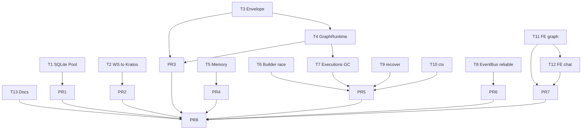

# S1 — P0 红线 + 数据正确性

> **⚠️ 本文档自 2026-05-17 起停止维护**。S1 范围已与代码现实交叉验证后转入 [`../execution-plan.md`](../execution-plan.md) §1.1 / §1.3；剩余未闭合项见 §3 EP-RT-01..08。仅保留作历史参考。
>
> ---
>
> 时窗：第 1~2 周 | 任务：T1~T13（13 任务） | PR：8 | 依据：[master-plan §6.2](../master-plan.md) [§8.1](../master-plan.md)

---

## 1. Sprint 目标与范围

清零 `AI-DEVELOPMENT-SPECIFICATION.md` 红线违反（V-1~V-5），修复影响数据正确性的高危 Bug（B-1/B-4/B-5/B-8/B-9/B-10/B-11），让前端可正常构建（M-13/M-14），并同步过期文档（D-1~D-9）。Sprint 末尾 `make runtime-boundary` 必须零违反，前端 `pnpm build` 必须通过。

**范围内**：单 SQLite 连接池、WS 接入 Kratos、biz 去 trpc-agent-go 依赖、Memory cache 修复、Graph 并发安全 + GC、EventBus 关键事件可靠投递、panic recover、ctx 修复、前端 graph/chat 客户端、文档同步。
**范围外**：RuntimeKernel 抽象（S2）、EventBus 完整背压（S2）、Agent 构建缓存（S2）、Plugin/Skill/Planner 接入（S4）。

---

## 2. 任务清单

### T1 — 单 SQLite 连接池（红线 10 / V-4）

- **动作**：
  - 在 [internal/data/data.go](../../../internal/data/data.go) 暴露 `func (d *Data) RawDB() *sql.DB`（基于 Ent driver 拿到底层 `*sql.DB`）。
  - 改造 [internal/session/trpc/sqlite.go](../../../internal/session/trpc/sqlite.go) `NewSQLiteSessionService` 签名为 `New(db *sql.DB, opts ...) (...)`，删除 `sql.Open("sqlite3", dsn)`。
  - 改造 [internal/graph/trpc/checkpoint.go](../../../internal/graph/trpc/checkpoint.go) `NewSQLiteCheckpointSaver` 同上。
  - 更新 wire：`data.NewTRPCSessionService`、`data.NewGraphCheckpointSaver` 改为接收 `*Data.RawDB()` 注入。
  - DDL 迁移（建表 SQL）保留在 trpc 适配包内，但传入的 `*sql.DB` 共用 Ent 连接。
- **依赖**：无。
- **预计 PR**：1（PR1）。
- **工时**：1.0 人日。
- **验收**：`grep -rn "sql.Open" internal/ | grep -v data/data.go` 输出空；smoke 通过；并发 chat 写 session 无 `database is locked` 错误。

### T2 — WS 接入 Kratos（红线 6 / 12 / V-2 / V-5）

- **动作**：
  - 删除 [internal/server/ws.go](../../../internal/server/ws.go) 中 `s.srv = &http.Server{...}` 字段与 `mux.HandleFunc(...)` 调用。
  - 改造为提供 `func (s *WSServer) RegisterTo(httpSrv *khttp.Server)` 或导出 `Handler() http.Handler`，由 [internal/server/http.go](../../../internal/server/http.go) 注册 `/v1/ws`。
  - [configs/config.yaml](../../../configs/config.yaml) 删除 `server.ws.addr`，新增 `server.ws.path: /v1/ws` 与 `server.ws.enable`。
  - 保留 ping/pong；接入 Kratos middleware（logging / tracing / recovery）。
- **依赖**：无（与 T1 并行）。
- **预计 PR**：1（PR2）。
- **工时**：1.0 人日。
- **验收**：进程仅监听 8000/9000；`websocat ws://localhost:8000/v1/ws?...` 可订阅事件；Kratos access log 出现 WS 请求。

### T3 — biz 去框架（envelope，红线 2 / V-1）

- **动作**：
  - 删除 [internal/biz/envelope.go](../../../internal/biz/envelope.go)；新建 `internal/biz/domain_event.go`，定义 `biz.DomainEvent{Type, Author, SessionID, RunID, Payload any, At time.Time}` 等纯业务字段。
  - 新建 `internal/event/projection/projection.go`，提供 `FromTRPC(e *event.Event) biz.DomainEvent` 与 `ToEnvelope(de biz.DomainEvent) event.Envelope` 双向投影。
  - 改造 ChatService 与 Team Runner 在 publish 前调用 `projection.ToEnvelope`，订阅端按需调 `FromTRPC`。
- **依赖**：无（独立可做）。
- **预计 PR**：与 T4 合并为 PR3。
- **工时**：1.5 人日。
- **验收**：`go list -deps aranea-agents/internal/biz/... | rg trpc-agent-go` 空输出。

### T4 — biz 去框架（graph，红线 2 / 8 / V-1 / V-3）

- **动作**：
  - 在 [internal/biz/graph.go](../../../internal/biz/graph.go) 抽 `type GraphRuntime interface { Build(def Definition) (RuntimeHandle, error); Run(...); Pause(...); Resume(...); }` 等业务语义接口。
  - 把 trpc-agent-go import 全部下沉到新文件 `internal/graph/trpc/runtime.go`，实现 `GraphRuntime`。
  - 删除 [internal/biz/biz.go](../../../internal/biz/biz.go) 中 `import "aranea-agents/internal/graph/trpc"`；改为 wire 在 data/service 层注入实现。
  - `runtimeExec` 结构体不再持有 `*graphagent.GraphAgent`，改为持有 `GraphRuntime.RuntimeHandle`（抽象 ID + 状态）。
- **依赖**：T3 合并后；与 T3 同 PR。
- **预计 PR**：PR3（与 T3）。
- **工时**：2.0 人日。
- **验收**：`go list -deps aranea-agents/internal/biz/... | rg "trpc-agent-go|internal/.*/trpc"` 空输出；现有 graph 接口回归通过。

### T5 — Memory cache 修复（B-1）

- **动作**：
  - 删除 [internal/memory/trpc/sqlite_adapter.go](../../../internal/memory/trpc/sqlite_adapter.go) 内 `s.cache` 字段与相关初始化。
  - `ReadMemories` 改为 `store.List(ctx, appName, userID)`；`SearchMemories` 改为 `store.Search(ctx, ..., query, topK)`。
  - `AddMemory/UpdateMemory/DeleteMemory` 落到 store，对应 sessionmemory schema。
  - 同步检查 [internal/service/trpc_turn.go](../../../internal/service/trpc_turn.go) 调用点，确保参数语义没变。
- **依赖**：无。
- **预计 PR**：PR4。
- **工时**：1.0 人日。
- **验收**：手测：发起两个 turn，前一 turn 写入的 memory 在后一 turn `ReadMemories` 可见。

### T6 — Graph builder race 修复（B-5）

- **动作**：
  - [internal/graph/trpc/builder.go](../../../internal/graph/trpc/builder.go) `BuildStateGraphWithRegistry` 改为：函数内 `local := append([]NodeCfg(nil), cfg.Nodes...)`，再对 `local` 做 `Func` 解析；禁止修改入参。
  - 增加单测 `builder_test.go`：并发 100 次 build 同一 GraphDefinition，断言每次得到独立 Graph 实例。
- **依赖**：无。
- **预计 PR**：与 T7/T9/T10 同 PR5。
- **工时**：0.5 人日。
- **验收**：`go test -race ./internal/graph/...` 通过。

### T7 — Graph executions GC + 恢复（B-4）

- **动作**：
  - [internal/biz/graph.go](../../../internal/biz/graph.go) 进程内 `executions` map：加 `expireAt time.Time` 字段 + 后台 goroutine 每 60s 清理超过 `runIdleTTL`（默认 30 分钟）的 entry。
  - `ResumeExecution`：先查 map，没有则通过 `GraphRuntime.LoadCheckpoint(runID)`（T4 引入的接口）从 checkpoint 重建 RuntimeHandle。
  - 暴露 metrics：`graph_active_executions`、`graph_resume_from_checkpoint_total`（S3 接 metrics 端点）。
- **依赖**：T4。
- **预计 PR**：PR5。
- **工时**：1.0 人日。
- **验收**：压测：1000 个 run 创建 / 进程内存稳定；进程 kill 后重启 + ResumeExecution 可成功（手测）。

### T8 — EventBus 关键事件可靠投递（B-8 紧急修复）

- **动作**：
  - 不改 `Publish` 主流程；在 [internal/event/bus.go](../../../internal/event/bus.go) 加 `func reliableTypes() map[EnvelopeType]struct{}` 包含 `tool_result / error / runner_completion / graph_node_end / team_run_finished / team_run_failed`。
  - 派发时若该事件类型属于 reliableTypes，订阅者 buffer 满则**阻塞最多 100ms**（带退避）再投递；超时仍记 log 并计入 `event_bus_drop_total` 指标。
  - 非关键事件保持原 FIFO 覆盖式丢弃。
  - 单测：模拟订阅者阻塞，验证关键事件不丢、非关键事件被丢。
- **依赖**：无。
- **预计 PR**：PR6。
- **工时**：0.8 人日。
- **验收**：单测 `bus_reliable_test.go` 通过；smoke 中 tool_result 不再被高频 text_delta 顶掉。

### T9 — panic recover（B-9 / B-10）

- **动作**：
  - [internal/service/trpc_turn.go](../../../internal/service/trpc_turn.go) `recordToolInvocationAsync` 的 `go func()` 顶部加：
    ```go
    defer func() { if r := recover(); r != nil { log.Errorw("panic", "where", "recordToolInvocationAsync", "err", r, "stack", debug.Stack()) } }()
    ```
  - [internal/biz/graph.go](../../../internal/biz/graph.go) `consumeEvents` 同上。
  - 提取公共 helper `pkg/safego/Go(ctx, name, fn)` 统一 recover 模式（保持轻量，不引入新依赖）。
- **依赖**：无。
- **预计 PR**：PR5。
- **工时**：0.5 人日。
- **验收**：单测：人为 `panic` 验证 recover；进程不退出。

### T10 — ctx 修复（B-11）

- **动作**：
  - [internal/agent/trpc_build.go](../../../internal/agent/trpc_build.go) `loadEffectiveToolKeys` 签名加 `ctx context.Context`，调用点改用 turn ctx 而非 `context.Background()`。
  - 全文件 grep 同类 `context.Background()` 误用，按需修正。
- **依赖**：无。
- **预计 PR**：PR5。
- **工时**：0.3 人日。
- **验收**：单测：取消 ctx 后 `loadEffectiveToolKeys` 立即返回 `ctx.Err()`。

### T11 — 前端 graph 客户端生成（M-13）

- **动作**：
  - 排查 [Makefile](../../../Makefile) `api` 目标中 `protoc-gen-typescript-http` 是否覆盖 `api/kratos/graph/v1/graph.proto`：当前 `API_PROTO_FILES` 取自 `scripts/list-proto-files.ps1 api`，需打印验证；如缺失，修脚本。
  - 运行 `make api`，确认 `web/src/services/kratos/graph/v1/index.ts` 已生成。
  - [web/src/services/index.ts](../../../web/src/services/index.ts) import 路径正确无 404。
- **依赖**：无。
- **预计 PR**：PR7（与 T12 合并）。
- **工时**：0.5 人日。
- **验收**：`pnpm build` 通过；网络面板能看到 graph RPC 请求。

### T12 — 前端 chat 用生成客户端（M-14）

- **动作**：
  - 改 [web/src/features/chat/api.ts](../../../web/src/features/chat/api.ts) 用 `createChatService()`（从 `web/src/services/kratos/chat/v1/index.ts` 导出）替代 `kratosApi.post("/v1/chat/messages", ...)`。
  - [web/src/services/index.ts](../../../web/src/services/index.ts) 显式 `export { createChatService }`；保留 axiosHandler 处理拦截 / 401 / 错误码。
  - 同步：其它 features 中明显的直调（如有 P0 影响）一并替换（统计 ≤ 3 处时一并处理，更多则放 S2 T17）。
- **依赖**：T11（共享 services barrel）。
- **预计 PR**：PR7。
- **工时**：0.5 人日。
- **验收**：chat 流程功能正常；`grep -rn "kratosApi.post" web/src/features/chat` 空输出。

### T13 — 文档同步（D-1~D-9）

- **动作**：
  - [docs/guides/plan.md](../plan.md)：刷新 §3.2（MCP 已迁 trpc）、§3.3（Session 已用 SQLite）、M3/M4/M6 状态表。
  - [docs/README.md](../../README.md) §13：把"SSE"全部替换为 WebSocket，删除 `server/sse.go` 引用。
  - [docs/guides/AI-DEVELOPMENT-SPECIFICATION.md](../AI-DEVELOPMENT-SPECIFICATION.md) §3.6：删除 `internal/agent/adksvc.BizSessionService` 引用，改为指向 `internal/session/trpc`。
  - 新增 `docs/changelog/2026-MM-DD-S1-Hardening.md`：列 S1 PR1~PR8 摘要。
- **依赖**：T1~T12 全部合并后。
- **预计 PR**：PR8。
- **工时**：0.5 人日。
- **验收**：grep `SSE\|sse.go\|adksvc` 在 docs/ 下空输出（除 changelog 历史描述）。

---

## 3. PR 切分建议

| PR | 任务 | Reviewer | Commit 标题 |
|----|------|----------|-------------|
| PR1 | T1 | Tech Lead + Backend | `[S1-T1] data: introduce RawDB() and reuse pool for trpc adapters` |
| PR2 | T2 | Tech Lead + Backend | `[S1-T2] server: mount WebSocket through Kratos HTTP server` |
| PR3 | T3 + T4 | Tech Lead × 2 | `[S1-T3+T4] biz: decouple from trpc-agent-go via DomainEvent and GraphRuntime` |
| PR4 | T5 | Backend × 2 | `[S1-T5] memory: drop in-memory cache, route reads to store` |
| PR5 | T6 + T7 + T9 + T10 | Backend + Tech Lead | `[S1-T6+T7+T9+T10] graph/agent: race-safe builder, executions GC, recover, ctx fix` |
| PR6 | T8 | Backend + QA | `[S1-T8] event: reliable delivery for critical envelope types` |
| PR7 | T11 + T12 | Frontend + Backend | `[S1-T11+T12] web: generate graph client and switch chat to typed client` |
| PR8 | T13 | Tech Lead | `[S1-T13] docs: sync plan/README/spec with current code state` |

每 PR commit message footer 必须含：
```
Doc: docs/changelog/2026-MM-DD-S1-Hardening.md
Tracker: docs/guides/task-tracker.md (T{m} -> done)
```

CI 必过项（S1 阶段 CI 尚未派发，本地必跑）：
- `make api` 干净（git diff 为空）
- `make wire-admin` 干净
- `make runtime-boundary` 退出 0
- `go test ./...` 全绿
- `go test -race ./internal/graph/... ./internal/event/...`
- `pnpm -C web build` 成功

---

## 4. 依赖关系图



并行机会：PR1 / PR2 / PR4 / PR6 / PR7 可同时开工；PR3 内部 T3→T4 串行；PR5 内部并行。

---

## 5. 验收点（Sprint 收尾 checklist）

代码：
- [ ] `grep -rn "sql.Open(" internal/ pkg/` 仅 `internal/data/data.go` 命中
- [ ] `grep -rn "http.HandleFunc\|mux.HandleFunc" internal/server/` 空输出
- [ ] `go list -deps aranea-agents/internal/biz/... | rg "trpc-agent-go|internal/.*/trpc"` 空输出
- [ ] `go vet ./...` 通过
- [ ] `go test -race ./...` 通过
- [ ] `make runtime-boundary` 通过

运行：
- [ ] `make smoke`：启动 → chat（含 tool）→ memory 写读 → graph 创建运行 → ws 订阅事件，全程 0 error log
- [ ] 进程仅监听 8000（HTTP）+ 9000（gRPC），无 :8002
- [ ] 并发 50 个 session 写入 1 分钟，无 `database is locked`

前端：
- [ ] `pnpm -C web build` 通过
- [ ] 浏览器 chat 流程正常（含流式、tool 调用、memory）
- [ ] DevTools Network 显示 graph 请求走生成客户端路径

文档：
- [ ] `docs/changelog/2026-MM-DD-S1-Hardening.md` 已合并
- [ ] [docs/guides/plan.md](../plan.md) §3 状态表已更新
- [ ] [docs/guides/task-tracker.md](../task-tracker.md) T1~T13 全部 `done`
- [ ] [docs/README.md](../../README.md) 与 [AI-DEVELOPMENT-SPECIFICATION.md](../AI-DEVELOPMENT-SPECIFICATION.md) 无 SSE / adksvc 残留

---

## 6. 回滚策略

| PR | 回滚方式 | 风险点 | 缓解 |
|----|----------|--------|------|
| PR1 | git revert；旧 trpc 适配器自带 `sql.Open` fallback（保留 1 个 Sprint） | DSN 解析差异 | 保留 `NewSQLiteSessionServiceFromDSN` 作为 deprecated alias，标 `// Deprecated: use New(db)`，下个 Sprint 删除 |
| PR2 | git revert；恢复 :8002 监听 | 现网 WS 客户端连接地址需更新 | 在 release notes 注明端口变更；保留过渡 1 周双监听（feature flag `server.ws.legacy_addr`） |
| PR3 | git revert | biz 接口签名变更影响 service 层 | 一次合并；revert 时同时 revert 依赖 PR |
| PR4 | git revert | Memory 读写语义变更 | 历史 cache 数据为内存态，revert 不影响持久化数据 |
| PR5 | 子任务可单独 revert（T6/T7/T9/T10 独立 commit） | T7 GC TTL 太短可能误删活跃 run | TTL 配置化 `graph.run_idle_ttl`，初始 30 分钟 |
| PR6 | git revert；恢复 lossy 全量丢弃 | 阻塞 100ms 可能引入延迟 | metrics `event_bus_block_ms` 持续观察；超阈值回退 |
| PR7 | git revert | 前端 build 失败 | revert 后退回 `kratosApi.post` 临时方案 |
| PR8 | git revert | 仅文档 | 无 |

紧急熔断：所有可疑 PR 上线后 24 小时内若 smoke 失败率 > 5% 或出现 P0 incident，立即 revert 并在 changelog 标记 `reverted`。

---

## 7. 时间表（建议）

| 天 | 内容 |
|----|------|
| D1 | T1 + T2 + T11 + T13 起草并行启动；T3/T4 设计评审 |
| D2 | PR1 / PR2 进入 review；T3/T4 实现 |
| D3 | PR3 / PR4 进入 review；T5 完成；T6/T7/T9/T10 启动 |
| D4 | PR1/PR2 合并；T7 完成；T8 启动 |
| D5 | PR5 review；PR3/PR4 合并；T11/T12 完成 |
| D6 | PR6 review；PR7 review；smoke baseline |
| D7 | PR5/PR6 合并 |
| D8 | PR7 合并；T13 起草 |
| D9 | PR8 review；Sprint 验收 dry run |
| D10 | PR8 合并；Sprint 演示 + retro；S2 启动准备 |
