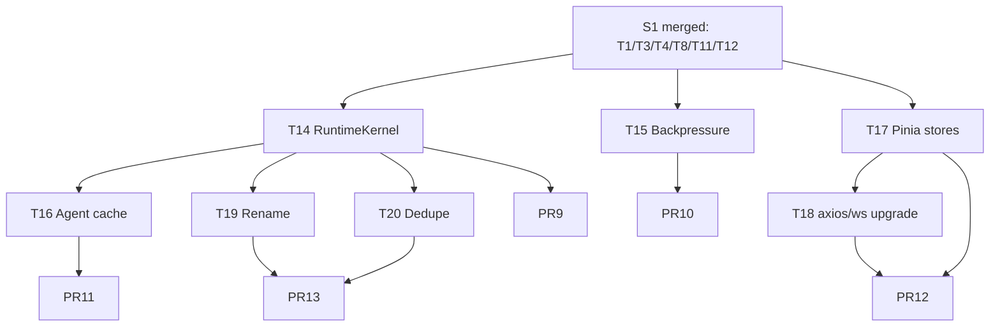

# S2 — P1 架构债

> **⚠️ 本文档自 2026-05-17 起停止维护**。RuntimeKernel / EventBus 背压 / Agent 构建缓存 等内容已落到 [`../execution-plan.md`](../execution-plan.md) §1.1 / §3.2（EP-RT-06）和 M1 里程碑。仅保留作历史参考。
>
> ---
>
> 时窗：第 3~4 周 | 任务：T14~T20（7 任务） | PR：5 | 依据：[master-plan §6.3](../master-plan.md) [§5](../master-plan.md)

---

## 1. Sprint 目标与范围

在 S1 把红线清零的基础上，建立稳定的架构骨架：抽出 `internal/runtime` 内核接口，把 `runtimedeps` 上帝对象拆开；EventBus 引入完整背压策略；Agent 构建引入缓存；前端补齐 17 个业务域 Pinia store；执行命名 / 冗余清理。

**范围内**：RuntimeKernel 抽象、EventBus 背压、Agent 构建缓存、前端 store + axios 升级、文件重命名、冗余删除。
**范围外**：业务可观测（S3）、Plugin / Skill / Planner / Memory tools（S4）、Artifact / Cron（S5）。

---

## 2. 任务清单

### T14 — `internal/runtime` 抽象（取代 runtimedeps）

- **动作**：
  - 新建 `internal/runtime/kernel.go`，定义 `RuntimeKernel` 接口：
    ```go
    type RuntimeKernel interface {
        BuildAgent(ctx, AgentSpec) (AgentHandle, error)
        BuildRunner(ctx, RunnerSpec) (RunnerHandle, error)
        Persistence() PersistenceSet
        Pipeline() EventPipeline
        Catalog() Catalog
    }
    ```
  - `internal/runtime/persistence.go`：`PersistenceSet { Session SessionPersistence; Memory MemoryPersistence; Checkpoint CheckpointPersistence }`。
  - `internal/runtime/pipeline.go`：`EventPipeline { Bus; Projection }`（封装 `internal/event/bus` + `internal/event/projection`）。
  - `internal/runtime/catalog.go`：只读视图 `Agents() / Teams() / Tools() / Skills()`，封装 biz 仓储查询结果。
  - 实现包 `internal/runtime/impl/`，把 [internal/runtimedeps/deps.go](../../../internal/runtimedeps/deps.go) 中 14 个字段按四象限分配到上述四个聚合。
  - 改 [internal/service/chat.go](../../../internal/service/chat.go)、[internal/service/team.go](../../../internal/service/team.go)、[internal/team/runner_team_trpc.go](../../../internal/team/runner_team_trpc.go)、[internal/service/trpc_turn.go](../../../internal/service/trpc_turn.go) 仅依赖 `RuntimeKernel` 接口。
  - wire 拓扑：`internal/data` 提供 `RuntimeKernel` 实现；service 注入 interface。
  - 保留 `internal/runtimedeps` 一个 Sprint，作 deprecated alias：`type TurnDeps = runtime.TurnDeps`，文件顶部 `// Deprecated: use internal/runtime`。
- **依赖**：S1 全合并（T1/T3/T4）。
- **预计 PR**：1（PR9，大 PR；可拆 PR9a「接口定义 + impl」+ PR9b「迁移调用点」）。
- **工时**：5.0 人日。
- **验收**：
  - `go list -deps aranea-agents/internal/service/... | rg trpc-agent-go` 仍为空，但路径全经 `internal/runtime`。
  - `internal/runtimedeps` 在新代码中 0 引用（除 deprecated alias）。

### T15 — EventBus 完整背压

- **动作**：
  - 扩展 [internal/event/bus.go](../../../internal/event/bus.go)：
    ```go
    type SubscribeOption struct {
        Buffer     int
        Reliable   bool
        DropPolicy DropPolicy // DropOldest | DropNewest | BlockUpTo(time.Duration)
        Selector   func(EnvelopeType) bool
    }
    ```
  - 删除 S1 引入的 `reliableTypes` 硬编码（由 T8 临时方案过渡到正式 API）。
  - WSServer 订阅时显式声明 `Reliable: true, DropPolicy: DropOldest` 等；ChatService 订阅 tool_result/error 用 `BlockUpTo(200ms)`。
  - metrics：`event_bus_publish_total{type=...}`、`event_bus_drop_total{type=...,reason=...}`、`event_bus_block_ms`。
  - 单测：覆盖三种 DropPolicy + reliable + selector。
- **依赖**：T8 合并（S1）。
- **预计 PR**：1（PR10）。
- **工时**：1.5 人日。
- **验收**：单测 `bus_backpressure_test.go` 通过；metrics 可在 `/debug/vars` 或 S3 接入 metrics endpoint 后可查。

### T16 — Agent 构建缓存（Q-1）

- **动作**：
  - 新建 `internal/agent/cache.go`，提供 `BuildCache` LRU（默认 cap=128，TTL=10 分钟，`hashicorp/golang-lru/v2/expirable` 或自实现）。
  - Key = `sha256(agent_id + tools_signature + skills_signature + plugins_signature + model + system_prompt)`；value = `*llmagent.LLMAgent`。
  - 在 [internal/agent/trpc_build.go](../../../internal/agent/trpc_build.go) `BuildTRPCLLMAgent` 顶部加 `if v, ok := cache.Get(key); ok { return v }`。
  - 失效：agent / tool / skill / plugin 任一更新事件触发 `cache.Invalidate(agentID)`；接入 `internal/biz/agent.go` 的更新钩子。
  - metrics：`agent_build_cache_hit_total`、`agent_build_cache_miss_total`。
- **依赖**：T14。
- **预计 PR**：1（PR11）。
- **工时**：1.5 人日。
- **验收**：bench `BenchmarkBuildTRPCLLMAgent`：cache hit ≥ 100x 速度提升；100 并发 turn cache 命中率 ≥ 95%。

### T17 — 前端 Pinia store 补齐（M-15）

- **动作**：为 17 个业务域新建 `web/src/stores/<域>.ts`，每个 store 暴露 `state`/`getters`/`actions`；actions 调用 features/<域>/api.ts；composables 仅消费 store。
  - 待补：admin / channels / chat / cron / graph / heartbeat / mcp / memory / monitor / platform / plugins / session / skills / system-settings / teams / tools / usage。
  - 已存在的 `agents` / `avatar` 保留作模板。
  - 同步：features/<域>/components 与 pages 中直调 api 的位置改为 `useXxxStore()`。
- **依赖**：T11 + T12（S1）。
- **预计 PR**：1（PR12；按需可拆为前端子 PR 但建议保持 1 个大 PR 一次性 review）。
- **工时**：4.0 人日。
- **验收**：`grep -rn "from '@/services'" web/src/features` 内调用都经 store；`grep -rn "kratosApi" web/src/features` 仅在 store 内出现（或全部消除）。

### T18 — 前端 axios 与 WS 处理升级（F-4）

- **动作**：
  - [web/src/services/axiosHandler.ts](../../../web/src/services/axiosHandler.ts)：根据 Kratos 错误结构（code/message/metadata）映射到 Quasar `Notify`；401 触发登录跳转；429 退避重试。
  - 新建 `web/src/services/wsClient.ts`：统一 `/v1/ws` 连接、订阅、重连（指数退避，max 30s）；features/chat 改用此 client。
  - composable `useWS(channel)`：自动 mount/unmount、订阅过滤、错误展示。
- **依赖**：T17（共享 store 类型）；T2（S1 WS path 变更）。
- **预计 PR**：与 T17 合并到 PR12。
- **工时**：1.5 人日。
- **验收**：手测：断网 10s 自动重连；接口 429 时弹出退避提示。

### T19 — 文件重命名（R-3 / R-5 / R-6）

- **动作**：
  - `git mv internal/biz/errros.go internal/biz/errors.go`
  - `git mv internal/data/agent_catalog_legacy.go internal/data/agent_catalog.go`
  - `git mv internal/data/sessionmemory/entity_adk.go internal/data/sessionmemory/entity.go`
  - 同步检查 import / wire 是否需要更新（包名不变则仅 git history 改动）。
  - 删除文件内 `legacy` / `_adk` 类型 / 函数后缀。
- **依赖**：S1 全部合并（避免与 PR3/PR5 冲突）。
- **预计 PR**：与 T20 合并到 PR13。
- **工时**：0.3 人日。
- **验收**：`grep -rn "errros\|_adk\|legacy" internal/` 仅命中无意义匹配。

### T20 — 冗余删除（R-1 / R-2 / R-9）

- **动作**：
  - 删除 [internal/tools/mcpmount/append.go](../../../internal/tools/mcpmount/append.go) 中 `AppendEffectiveMCPServerToolsets`（确认 grep 0 caller 后）。
  - 合并 `internal/agent/trpc_runtime.go:NewInMemoryTRPCSessionService` 与 `internal/session/trpc/sqlite.go:NewInMemorySessionService` → 仅保留后者；agent 包改为 import session/trpc。
  - 提取 `toolFilterForPrefix` 公共实现到 `internal/tools/registry/filter.go`，[internal/tools/toolset.go](../../../internal/tools/toolset.go) 与 [internal/tools/mcpmount/append.go](../../../internal/tools/mcpmount/append.go) 共用。
- **依赖**：T14（runtime 抽象后 agent 包变化范围更稳定）。
- **预计 PR**：PR13（与 T19）。
- **工时**：0.5 人日。
- **验收**：`go build ./...` 通过；`grep -rn "toolFilterForPrefix" internal/` 仅在 `registry/filter.go` 出现。

---

## 3. PR 切分建议

| PR | 任务 | Reviewer | 标题 |
|----|------|----------|------|
| PR9 | T14 | Tech Lead × 2 | `[S2-T14] runtime: introduce RuntimeKernel and migrate service layer` |
| PR10 | T15 | Tech Lead + Backend | `[S2-T15] event: per-subscriber backpressure with drop policies` |
| PR11 | T16 | Backend + Tech Lead | `[S2-T16] agent: cache trpc LLMAgent builds by config hash` |
| PR12 | T17 + T18 | Frontend × 2 + Backend | `[S2-T17+T18] web: pinia stores for 17 domains + axios/ws upgrade` |
| PR13 | T19 + T20 | Backend | `[S2-T19+T20] cleanup: rename legacy/_adk files and remove redundant helpers` |

每 PR 必须更新：
```
Doc: docs/changelog/2026-MM-DD-S2-Architecture.md
Tracker: docs/guides/task-tracker.md (T{m} -> done)
```

---

## 4. 依赖关系图



---

## 5. 验收点

代码：
- [ ] `go list -deps aranea-agents/internal/service/... | rg "internal/runtimedeps"` 空（或仅 deprecated alias 路径）
- [ ] `go list -deps aranea-agents/internal/biz/... | rg "trpc-agent-go|internal/.*/trpc"` 仍为空
- [ ] `go test -race ./internal/event/...` 包含背压用例
- [ ] `go vet ./... && make runtime-boundary` 通过

性能：
- [ ] `BenchmarkBuildTRPCLLMAgent` cache hit / miss 比例输出
- [ ] 100 并发 turn 下 agent 构建 P99 < 20ms（cache hit）

前端：
- [ ] `pnpm -C web build` 通过
- [ ] 19 个域均有 `web/src/stores/<x>.ts`
- [ ] DevTools Pinia 面板可观察所有域 store 状态

文档：
- [ ] `docs/changelog/2026-MM-DD-S2-Architecture.md` 合并
- [ ] [docs/guides/master-plan.md](../master-plan.md) §4 状态表对 M19 / M20 状态刷新（如需）
- [ ] task-tracker T14~T20 done

---

## 6. 回滚策略

| PR | 回滚方式 | 风险点 | 缓解 |
|----|----------|--------|------|
| PR9 | 整体 revert；保留 runtimedeps deprecated alias，service 切回直接依赖 | 大量调用点变更 | 拆 PR9a/PR9b；PR9a 先合并接口与 impl，PR9b 迁移调用 |
| PR10 | revert 至 S1 T8 临时方案 | 订阅者参数变更影响所有订阅点 | 提供 `SubscribeLegacy()` 兼容接口一个 Sprint |
| PR11 | revert；Build 无缓存路径仍可工作 | 缓存失效不当导致脏读 | 配置 `agent.build_cache.enable=false` 开关熔断 |
| PR12 | 子任务 revert：T17 / T18 独立 | 大量前端文件 | 按域 commit；每个 commit 可单独 revert |
| PR13 | revert；保留 deprecated 文件名 | 文件名变更影响 git blame | 用 `git mv` 保留历史 |

---

## 7. 时间表

| 天 | 内容 |
|----|------|
| D1 | T14 设计评审；T15/T16 启动 |
| D2 | PR9a 提交 review；T17 启动（前端） |
| D3 | T16 完成；PR10 提交 |
| D4 | PR9a 合并；PR9b 启动；T17 进展过半 |
| D5 | PR11 提交；T18 完成 |
| D6 | PR9b 合并；PR12 提交 |
| D7 | PR10 / PR11 合并 |
| D8 | PR12 review；T19/T20 启动 |
| D9 | PR12 合并；PR13 提交 |
| D10 | PR13 合并；retro；S3 启动准备 |
