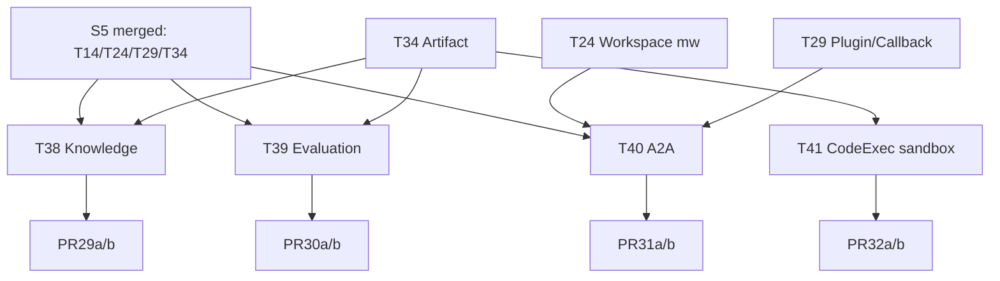

# S6 — P3 长期能力：Knowledge / Evaluation / A2A / CodeExecutor 沙箱

> **⚠️ 本文档自 2026-05-17 起停止维护**。四项均为"代码骨架存在 + 测试构造可用、但未端到端接入主链路"——Knowledge / A2A 工具未注册到 Agent 装配链、Evaluation Runner 在 wire 处传 `nil`、CodeExecutor Docker 未替换 skill 本地执行器。详见 [`../execution-plan.md`](../execution-plan.md) §1.3 EP-BIZ-02/03/04。仅保留作历史参考。
>
> ---
>
> 时窗：第 11+ 周（开放窗口） | 任务：T38~T41（4 任务） | PR：4~8 | 依据：[master-plan §6.5](../master-plan.md)

---

## 1. Sprint 目标与范围

补齐 master-plan 中的 P3 模块。本 Sprint 与 S1~S5 不同：4 个任务彼此独立，可由不同人完全并行，也可按业务优先级排队执行；不强制 2 周窗口，按团队节奏走"按需窗口"。

**范围内**：Knowledge（pgvector pipeline）、Evaluation（trpc evaluation runner 适配）、A2A（Agent-to-Agent 协议）、CodeExecutor 沙箱（docker / firecracker / wasm 任选其一）。
**范围外**：跨任务深度集成（如"Knowledge 喂给 Evaluation"等高阶组合），留作 S7+。

---

## 2. 任务清单

### T38 — Knowledge（M-7）

- **动作**：
  - 新建 proto：`api/kratos/knowledge/v1/knowledge.proto`
    - `Collection { id, name, embedding_model, dim, ... }`
    - `Document { id, collection_id, source, chunk_size, ... }`
    - `Chunk { id, doc_id, content, embedding(vector), metadata }`
    - RPC：CreateCollection / IngestDocument(stream) / Search / DeleteDocument / ListCollections
  - 新建 `internal/biz/knowledge.go`：`KnowledgeUsecase`（Ingest / Search / Manage）。
  - 新建 `internal/data/knowledge.go`：Postgres + pgvector schema（已配置 `vector_dim`），使用 `database/sql` + raw query（pgvector 操作）。
    - 表：`knowledge_collections`、`knowledge_documents`、`knowledge_chunks`（chunk content + embedding vector + metadata jsonb）。
    - 索引：`ivfflat` on embedding 列。
  - 新建 `internal/knowledge/`：
    - `chunker.go`：按 char / token / semantic 切分策略
    - `embedder.go`：调用现有 provider（OpenAI / Ollama / 等）embedding API
    - `retriever.go`：向量检索 + reranker（可选）
  - 新建 `internal/tools/knowledge/`：`knowledge_search(collection, query, top_k?)` 工具，注入 trpc Runner。
  - 前端：features/knowledge 新增（与 features/agents 同级），含集合管理、文档上传、检索测试。
  - metrics：`knowledge_ingest_documents_total`、`knowledge_search_duration_seconds`、`knowledge_search_recall_at_k`（可选）。
- **依赖**：T14（S2 RuntimeKernel）、T34（S5 Artifact 用于文档上传共用 storage）。
- **预计 PR**：2（PR29a 后端 + PR29b 前端）。
- **工时**：8.0 人日。
- **验收**：上传 1MB Markdown，索引完成后通过 search 命中相关 chunk；P99 < 300ms（10w 行规模）。

### T39 — Evaluation（M-11）

- **动作**：
  - 新建 `internal/evaluation/trpc/`：适配 `pkg/trpc-agent-go/evaluation` 接口（如 `Evaluator`、`Scorer`、`Dataset`）。
  - 新建 proto：`api/kratos/evaluation/v1/evaluation.proto`
    - `Dataset` / `EvalRun` / `EvalCase` / `Metric` 等
    - RPC：CreateDataset / UploadCases / RunEvaluation / GetReport / ListRuns
  - 新建 `internal/biz/evaluation.go`、`internal/data/evaluation.go`、`internal/service/evaluation.go`。
  - 评估指标支持（最小集）：
    - exact_match
    - contains_match
    - llm_as_judge（调用模型评分）
    - tool_call_accuracy（参数 / 调用顺序）
  - 评估 runner：以异步 job 形式运行，跑完写报告；接 cron / metrics。
  - 前端：features/evaluation 新增，含数据集管理、运行、报告查看（charts）。
- **依赖**：T14、T34（artifact 存储数据集 / 报告）。
- **预计 PR**：2（PR30a 后端 + PR30b 前端）。
- **工时**：8.0 人日。
- **验收**：100 条用例数据集，5 分钟内出报告；报告含各指标分数。

### T40 — A2A（Agent-to-Agent，M-9）

- **动作**：
  - 设计文档：`docs/guides/a2a-protocol.md`，含：
    - 消息格式（Header / Payload / Capability negotiation）
    - 鉴权（每个 agent 一份 API key + workspace 隔离）
    - 路由（同 workspace 直连 / 跨 workspace 走 gateway）
    - 限速 / 错误码
  - 新建 proto：`api/kratos/a2a/v1/a2a.proto`，RPC：Discover / Invoke / Notify / Subscribe（stream）。
  - 新建 `internal/biz/a2a.go`、`internal/data/a2a.go`、`internal/service/a2a.go`。
  - 新建 `internal/a2a/trpc/`：把 A2A 调用包装成一个 trpc tool，让 Agent 可直接 `call_agent(agent_id, payload)`。
  - 前端：features/agents 新增 "Available to A2A" 开关，配置可被调用的能力清单。
  - 安全：默认所有 agent 不开放 A2A，需显式启用 + token。
  - metrics：`a2a_invoke_total{caller,callee,status}`、`a2a_invoke_duration_seconds`。
- **依赖**：T24（S3 Workspace 中间件）、T29（S4 Plugin Callback 用于审计）。
- **预计 PR**：2（PR31a 协议 + 后端 / PR31b 前端 + UI）。
- **工时**：6.0 人日。
- **验收**：Agent A 通过 call_agent 调用 Agent B，跨 workspace 鉴权失败；同 workspace 成功；audit log 完整。

### T41 — CodeExecutor 沙箱（M-8）

- **动作**：
  - 扩展 `internal/agent/codeexecutor/`：
    - 保留现有 `local.go`（直接进程执行）
    - 新增 `docker.go`：Docker SDK 启动一次性容器，挂载只读 workspace；resource limits（CPU/Mem/Time）；artifact 通过 volume 输出。
    - 新增 `sandbox.go`（可选 Phase 2）：基于 firecracker 或 nsjail / bubblewrap 的轻量隔离。
  - 配置：`agent.codeexecutor.kind` = `local` | `docker`（默认 `local`）；`docker.image`、`docker.network` 等。
  - 接 trpc-agent-go 的 `code_executor` 接口；改 [internal/agent/trpc_build.go](../../../internal/agent/trpc_build.go) 按 kind 注入。
  - 安全：默认禁止网络访问；只读挂载；输出走 artifact 服务（T34）。
  - metrics：`codeexec_runs_total{kind,status}`、`codeexec_duration_seconds`、`codeexec_oom_total`。
  - 前端：features/agents 设置面板新增 CodeExecutor 选择器 + 配置。
- **依赖**：T34（S5 Artifact 用于输出文件回传）。
- **预计 PR**：2（PR32a docker + PR32b 沙箱可选）。
- **工时**：5.0 人日。
- **验收**：模型生成 Python 脚本 → docker 容器执行 → stdout + artifact 回流；超时 / OOM 触发对应 metrics。

---

## 3. PR 切分建议

| PR | 任务 | Reviewer | 标题 |
|----|------|----------|------|
| PR29a | T38 后端 | Tech Lead + Backend | `[S6-T38] knowledge: pgvector pipeline + chunker + retriever + tool` |
| PR29b | T38 前端 | Frontend + Backend | `[S6-T38] web: knowledge management UI` |
| PR30a | T39 后端 | Tech Lead + Backend | `[S6-T39] evaluation: runner + metrics + async report` |
| PR30b | T39 前端 | Frontend + Backend | `[S6-T39] web: evaluation dataset + report UI` |
| PR31a | T40 协议 + 后端 | Tech Lead × 2 + Backend | `[S6-T40] a2a: protocol + service + tool + audit` |
| PR31b | T40 前端 | Frontend + Backend | `[S6-T40] web: a2a capability config UI` |
| PR32a | T41 docker | Backend + QA | `[S6-T41] codeexec: docker backend with resource limits` |
| PR32b | T41 沙箱 | Backend × 2 + QA | `[S6-T41] codeexec: sandboxed backend (firecracker/nsjail)` |

每 PR commit footer：
```
Doc: docs/changelog/2026-MM-DD-S6-Knowledge-Eval-A2A.md
Tracker: docs/guides/task-tracker.md (T{m} -> done)
```

---

## 4. 依赖关系图



4 任务两两完全独立，理论可全并行；建议按业务优先级排队：默认顺序 T38 → T41 → T39 → T40（Knowledge 价值最高，A2A 安全成本最高）。

---

## 5. 验收点

代码：
- [ ] CI 全绿；覆盖率保持 ≥ 60%
- [ ] `make runtime-boundary` 通过
- [ ] 4 个新模块的 metrics 在 Grafana 面板可见

功能：
- [ ] Knowledge：上传 → 索引 → 检索全链路通过；模型可调用 knowledge_search 工具
- [ ] Evaluation：100 条数据集跑完 < 5 分钟；报告含 4 类指标
- [ ] A2A：跨 workspace 默认拒绝；同 workspace 启用后 call_agent 工具可调
- [ ] CodeExecutor docker：脚本执行隔离；超时 / OOM 正确处理

文档：
- [ ] `docs/changelog/2026-MM-DD-S6-Knowledge-Eval-A2A.md` 合并
- [ ] `docs/guides/knowledge.md`、`docs/guides/evaluation.md`、`docs/guides/a2a-protocol.md`、`docs/guides/codeexecutor.md` 各一份
- [ ] master-plan §4 状态表 M-7 / M-8 / M-9 / M-11 ✅
- [ ] task-tracker T38~T41 done

---

## 6. 回滚策略

| PR | 回滚方式 | 风险点 | 缓解 |
|----|----------|--------|------|
| PR29a/b | revert；保留 proto 作 deprecated | pgvector 索引重建耗时 | 用 ivfflat lists 较小值起步；提供"知识库重建"管理脚本 |
| PR30a/b | revert | 评估 runner 长时间运行 | 默认异步 job + 最大并发数 |
| PR31a/b | revert；默认所有 A2A disabled | 横向调用扩散风险 | 严格 token + workspace + 全局 rate limit |
| PR32a | revert；回退 local | docker 依赖 host 配置 | docker 不可用时自动降级 local 并告警 |
| PR32b | revert；保留 docker | 沙箱兼容性 | 仅 Linux 启用；其他平台跳过 |

---

## 7. 时间表（建议按任务并发分配）

由于 S6 是开放窗口，时间表按 owner 分配，不强制 2 周节奏：

| Owner | 任务 | 预期周数 |
|-------|------|----------|
| Backend A + Tech Lead | T38（Knowledge） | 3 周 |
| Backend B + QA | T39（Evaluation） | 3 周 |
| Tech Lead + Backend A | T40（A2A） | 2 周（含安全评审） |
| Backend B + QA | T41（CodeExecutor sandbox） | 2 周 |
| Frontend | T38/T39/T40 UI 并行接入 | 3 周（分布） |

每个任务在合并主分支后，做一次 dry-run 演示 + retro，再启动下一任务。

---

## 8. 后续展望（S7+ 候选议题，不在本 Sprint 内）

- Knowledge × Evaluation：用知识库作为评估数据源，自动生成测试用例。
- A2A × Plugin：让插件能跨 agent 调用，形成多 agent 协作能力。
- CodeExecutor × Knowledge：在容器内挂载知识库 read-only 数据卷，作"代码 + 文档"协作分析。
- 多模态（图片 / 音频 / 视频）输入输出统一。
- 国际化 i18n 全面落地。
- 桌面客户端 / IDE 插件。
