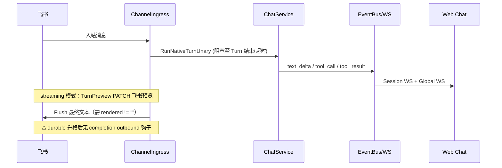
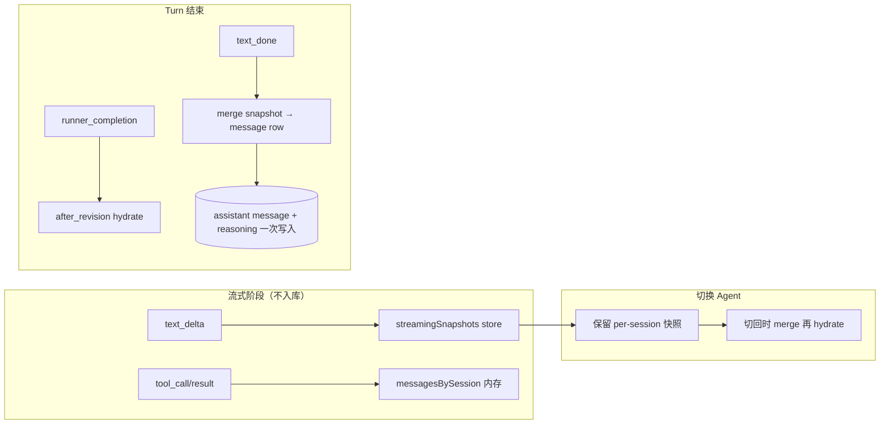

# M55 · 卡 Turn / 飞书无回复 / 工具假死 — 排查与优化

> **日期**：2026-05-23 · **模块**：Chat × Channel × Web Sync  
> **触发**：飞书入站 Turn 在 Web 侧表现为「思考中… + 工具正在执行」，飞书未收到最终回复；切换 Agent 后思考内容丢失。  
> **关联 Review**：[2026-05-23-M55-Run-Lifecycle-Review.md](../review/2026-05-23-M55-Run-Lifecycle-Review.md)

---

## 1. 现象摘要

| 现象 | 用户侧表现 |
|------|------------|
| **A. 卡 Turn** | Assistant 气泡停在「思考过程 …」，正文无输出；输入区仍像「生成中」 |
| **B. 工具假死** | `ChatExecutionCard` 部分工具显示「正在执行」，同轮其它工具已 ✓（如 6 工具中 2 个卡住） |
| **C. 飞书无最终回复** | Web 已有部分输出（思考/工具），飞书仅收到 ACK/排队/超时提示，无完整答案 |
| **D. 切换 Agent 丢思考** | 流式 reasoning 在切 Agent 后消失，直到新一轮 reasoning 才再出现 |
| **E. 卡片 200340** | 飞书「后台继续」按钮报错 `code: 200340`（配置问题，见 §5） |

---

## 2. 根因分析

### 2.1 链路总览



### 2.2 飞书无回复（C）

**并非单一 bug，而是多条路径叠加：**

| # | 根因 | 代码锚点 | 说明 |
|---|------|----------|------|
| C1 | **同步 Turn 未结束** | `channel_ingress_execute.go` | `RunNativeTurnUnary` 阻塞；工具 hang / LLM 等待 → Channel 层不会 `deliverUnaryReply` |
| C2 | **Streaming 最终 Flush 条件** | `channel_ingress_stream.go` L79–93 | `rendered == ""` 时不 Flush；仅 reasoning、无 deliverable 正文时飞书可能只有 preview PATCH |
| C3 | **Durable 升格后缺出站** | `session_run_escalation_notifier.go` | `NotifyDurableEscalated` 文案承诺「完成后通知」，**无** Run `completed` → `EnqueueOutbound` 订阅 |
| C4 | **Turn 超时** | `channel_ingress_errors.go` | 超时走 `deliverTurnErrorReply`（「建议 /async」），**不是**最终答案 |
| C5 | **排队路径** | `sendInboundQueuedAck` | 仅发「已排队」，答案等前序 Run 完成；若前序 Run 卡死则永远无回复 |
| C6 | **出站 Worker 失败** | `channel_delivery_worker.go` | 需查 Monitor 投递记录；与 UI 卡死可独立发生 |

### 2.3 Web 卡 Turn + 工具假死（A + B）

**后端：**

| # | 根因 | 代码锚点 |
|---|------|----------|
| B1 | Turn 仍在跑（工具未返回） | `turnStreamConsumer.pendingToolCalls` 未清空 |
| B2 | **`FinalizeStuckToolActivities` 只落库、不发 WS** | `activity_publish.go` + `stream_consumer.go` `finalize()` | DB activity 可能变 `failed`，**前端 WS 仍收不到 `tool_result`** |
| B3 | 并行 `file_read_file` 等长 IO | 工具层 timeout / workspace 路径 | 需结合 FlowLog + `tool_invocations` 确认是真 hang 还是丢事件 |

**前端：**

| # | 根因 | 代码锚点 |
|---|------|----------|
| B4 | **`runner_completion` 仅在 Session WS handler 收尾** | `streamHandlers.ts` L204–217 | `finalizeOrphanToolMessages` 不在 global inbound 路径 |
| B5 | **`useChatInboundSync` Turn 完成只 hydrate** | `useChatInboundSync.ts` L239–249 | 无 orphan tool 补丁；若 Session WS 断连则工具永假死 |
| B6 | **`mergeSessionMessages` 保留本地 `tool_running`** | `mergeSessionMessages.ts` L22–26, L42–45 | hydrate 后 server 若无对应终态行，本地 running 行**永久合并** |
| B7 | 流式行 `ws-stream-*` 在 `text_done` 前一直 `streaming` | `streamHandlers.ts` | 无 `runner_completion` → 思考区显示 `…` 且 sending 不结束 |

**与截图一致的最可能路径：**

1. 收到部分 `tool_call`，2 个 `tool_result` 到达 → 前 2 个工具 ✓  
2. 后 2 个工具 result 未到达（真 hang **或** WS 丢包 **或** 后端未 emit）  
3. `runner_completion` 未到达 Web（Turn 未结束 **或** WS 断连）  
4. `mergeSessionMessages` 保留 `tool_running` 行 → UI 永久「正在执行」  
5. Channel 同步 Turn 阻塞 → 飞书无最终 Flush  

### 2.4 思考内容数据流（D）— 是否应放 Store 缓存？

**现状：**

```text
text_delta.reasoning → WS → patchStreamingMessage → options_json.reasoning_markdown（内存行）
text_done            → 同上 + 后端 MergeReasoningIntoAssistantOptionsJSON 落库
切换 Agent           → clearSessionMessages + loadMessages → 未落库的 reasoning 丢失
ReAct planner        → messagePlannerPresentation 刻意 reasoning="" 
```

**结论（产品 + 架构）：**

| 阶段 | 推荐层 | 策略 |
|------|--------|------|
| **流式进行中** | 前端 **Pinia `streamingSnapshots[sessionId]`** | 存 `{ reasoning, partialText, streamRowId, updatedAt }`；**不写 DB** |
| **Turn 正常结束** | `text_done` / `runner_completion` | 一次性 merge 进 message row；后端 **仅 terminal 写** `reasoning_markdown`（已有 `MergeReasoningIntoAssistantOptionsJSON`），**禁止 delta 级入库** |
| **切换 Agent / Session** | Store 快照 | 切走不清快照；切回 merge 后再 hydrate server（server 权威覆盖） |
| **ReAct 模式** | 同上 + 展示策略 | 缓存仍保留；UI 是否展示由 `planner_kind` 决定（与 CC-C-UX-01 一致） |
| **可选降级** | 后端配置 | `persist_reasoning: summary_only \| full \| none` — 长 reasoning 只存摘要或仅存前端（省 DB / 回放体积） |

**不建议：** 每个 `text_delta` 写 SQLite — IO 高、与「思考过程」 ephemeral 语义不符。

### 2.5 飞书卡片 200340（E）

飞书官方：**200340 = 卡片回调 URL 未配置或无效**。  
需订阅 **`card.action.trigger`** 并**发布应用版本**；WS 长连接模式仍需控制台订阅，非纯 JSON 问题。  
运维清单见 [17-channel-development.md §12](../需求/17-channel-development.md#12-im-preview--e2e-验收清单lt-0107)。

### 2.6 Header 铃铛 / 入站不聚焦（前序问题）

| 项 | 现状 |
|----|------|
| `MainLayout.vue` 铃铛 | 占位，无 handler |
| `useChatInboundSync` | Turn 完成才 toast；**无** auto-select session（CC-B-06 仅部分交付） |
| 非当前 session 的 delta | L217 `if (!isCurrent && !entityMatch) return` 丢弃 |

---

## 3. 优化方案（任务 ID）

### P0 — 稳定性 / 出站闭环

| ID | 任务 | 说明 |
|----|------|------|
| **CC-FIX-TOOL-01** | 后端 `finalize()` 补发 `tool_result` WS | `FinalizeStuckToolActivities` 后 `eventBus.Publish(tool_result failed)` |
| **CC-FIX-TOOL-02** | `useChatInboundSync` Turn 完成时 `finalizeOrphanToolMessages` | 与 `streamHandlers` 对齐 |
| **CC-FIX-TOOL-03** | `mergeSessionMessages` 在 terminal run 时丢弃 stale `tool_running` | 依赖 `run_status` 或 hydrate 后 server revision |
| **CC-FIX-CHANNEL-01** | **Durable Run `completed` → Channel outbound** | 订阅 `session_run` terminal / `runner_completion` + `source=channel` meta |
| **CC-FEISHU-OPS-01** | 飞书 `card.action.trigger` 配置 + 发布 checklist | 解决 200340 |

### P1 — Web 体验

| ID | 任务 | 说明 |
|----|------|------|
| **CC-B-06b** | Channel 入站 `run_status=running` 自动 focus session | 可配置 `channel_auto_focus` |
| **CC-WEB-NOTIFY-01~03** | Header 铃铛通知中心 + 跳转 `/chat?session=` | 替代仅 bottom toast |
| **CC-WEB-REASONING-01** | `streamingSnapshots` Pinia 模块 | Agent 切换不丢 in-flight reasoning |
| **CC-FEISHU-02** | 升格卡片增加「取消执行」 | callback `action=cancel` → `CancelRun` |
| **CC-FIX-CHANNEL-02** | Preview Flush：仅 reasoning 时发摘要或「生成中」heartbeat | 避免飞书完全无感知 |

### P2 — 产品与文案

| ID | 任务 | 说明 |
|----|------|------|
| **CC-UX-01** | 排队 ACK 与 `/async` 超时提示互斥 | 同 run 不叠两条灰气泡 |
| **CC-UX-02** | 软/硬预算场景不发 `/async`，统一 `/background` + 卡片 | 与 CC-R-02 一致 |
| **CC-WEB-REASONING-02** | 后端 `persist_reasoning` 策略（optional） | summary_only / none |
| **CC-C-UX-03** | 同轮多 ToolStrip 合并 | 减少「6 工具 · 121ms」与单卡状态不一致 |

---

## 4. 思考内容数据流（目标态）



---

## 5. 排查手册（On-call）

1. **Session ID** — Web 顶栏诊断行 / 飞书 session metadata  
2. **Run 是否仍 active** — `GET run-status` 或 Monitor FlowLog `channel.turn.execute`  
3. **工具真 hang vs 丢事件** — `tool_invocations` / FlowLog `chat.activity.finalize_stuck`  
4. **飞书出站** — `channel_delivery` 表 phase=`streamed|queued|error`  
5. **是否 durable 升格** — `session_runs.phase=durable` 且无 CC-FIX-CHANNEL-01 → 预期无最终 IM  
6. **WS** — Session WS 是否 connected；global hub 是否收到 `runner_completion`  
7. **卡片 200340** — 飞书控制台 `card.action.trigger` + 应用版本发布  

---

## 6. 验证（修复后）

```bash
# 后端
go test ./internal/agent/ -run 'FinalizeStuck|Activity' -count=1
go test ./internal/service/ -run 'TurnPreview|ChannelTurn' -count=1

# 前端
cd web && pnpm test -- envelopeToolCall mergeSessionMessages
```

**手工 E2E（M55-RUN-05 扩展）：**

| 步骤 | 预期 |
|------|------|
| 飞书发长任务 → Web 打开同 Agent | 铃铛通知；可选 auto-focus；工具状态与 WS 一致 |
| 模拟 tool 无 result 结束 Turn | 工具变 failed/cancelled，非永久 running |
| Durable 升格完成 | 飞书收到最终文本（CC-FIX-CHANNEL-01） |
| 切 Agent 再切回 | 进行中 reasoning 从 snapshot 恢复 |
| 卡片「后台继续」 | 无 200340；可选「取消执行」 |

---

## 7. 文档同步

| 文档 | 变更 |
|------|------|
| [55-chat-channel-cursor-development.md](../需求/55-chat-channel-cursor-development.md) | CC-B-06 诚实化；新增 §Phase R-UX backlog |
| [17 channel.md](../需求/17%20channel.md) | §8.8 卡 Turn / 无回复排查 |
| [M55-Run-Lifecycle-Optimization-Plan.md](./2026-05-23-M55-Run-Lifecycle-Optimization-Plan.md) | 引用本文 P0 项 |
