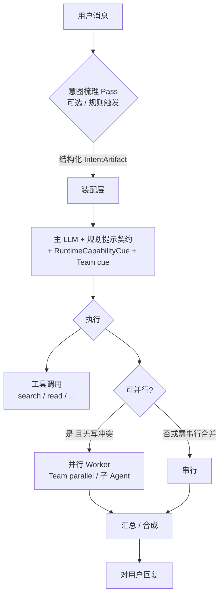

# Agent 编排总体设计：意图梳理 → 规划执行 → 并行委派（与检索层协同）

> **文档地位**：在「单轮聊天 / Team 多成员」之上，描述**工程化编排**：先用一次轻量 LLM 梳理用户真实意图，再将**精炼意图 + 规划契约**注入主执行链路；在可证明无冲突时**并行**发起子任务。  
> **与基座文档关系**：本文负责 **「想什么、谁干、能否并行」**；[**`agent-repo-retrieval-context-engineering.md`**](./agent-repo-retrieval-context-engineering.md)负责 **「用什么眼睛看代码、怎样少 token」**（`workspace_search`、符号、RAG 等）。两者必须**同时**落地，否则会出现「流程很工整但仍在盲扫目录」或「搜得快但任务理解错」。

**对齐**：[多 Agent 规格 `docs/需求/11 multi-agent.md`](../需求/11%20multi-agent.md)、[`docs/需求/team.md`](../需求/team.md)、[`docs/AGENT_RUNTIME_BOUNDARY.md`](../AGENT_RUNTIME_BOUNDARY.md)、[`internal/team/definition.go`](../../internal/team/definition.go)。

---

## 1. 目标（用户可见）

| 能力 | 说明 |
|------|------|
| **意图一致** | 减少「用户说 A、模型做 B」；把含糊指令变成可执行的**单句目标 + 成功判据** |
| **计划可见（可选）** | 执行 Agent 按**可验证步骤**推进（先搜后读再改、关键节点跑测试），而非随机试工具 |
| **并行加速** | 多路**只读取证**、多包**独立**调研时可并行，缩短 wall-clock |
| **与检索协同** | 梳理阶段产出 **字面关键词 / 路径提示**，直接喂给 [`workspace_search` 类工具](agent-repo-retrieval-context-engineering.md)（见 §5） |

---

## 2. 总体架构

**原则**：

1. **意图梳理**是**增加信息、不替代用户原文**：下游仍应能对照用户原句；梳理结果标注为「系统推导的目标」。  
2. **规划**默认采用**提示词契约**（见 §4），必要时再引入「先只输出 JSON 计划再执行」的双阶段（二期）。  
3. **并行**只启用经**规则引擎**认可的拓扑（见 §6），默认保守。

---

## 3. 模块 A：意图梳理（LLM 预处理 Pass）

### 3.1 目的与触发

- **目的**：将口语、多轮指代、省略主语的长句，折叠为 **refined_goal**（精炼目标）、**success_criteria**（可验证完成条件）、**constraints**（语言/禁止项/环境）。  
- **触发策略（推荐可配置）**：  
  - **always**：每轮用户消息都跑（成本↑、一致性最好）；  
  - **heuristic**：消息长度、多问号、缺乏动词宾语、「这个/那里」指代多时触发；  
  - **off**：仅依赖主模型（兼容旧行为）。

### 3.2 输入 / 输出契约（建议 JSON Schema）

**输入（服务端拼装）**：

- `latest_user_text`（必填）  
- `recent_turns`：最近 K 轮 user 摘要（可选，防超长）  
- `session_summary`：若已有 L0/L1 压缩摘要则附上（见 [`session-context-compression.md`](./session-context-compression.md)）  
- `locale`：界面语言 / 用户偏好  

**输出 `IntentArtifact`（示例字段）**：

| 字段 | 类型 | 说明 |
|------|------|------|
| `refined_goal` | string | 一句无歧义任务陈述 |
| `intent_kind` | enum | `code_change` \| `explain` \| `debug` \| `doc` \| `research` \| `other` |
| `success_criteria` | string[] | 可判定「完成」的检查项（如「相关包 go test 通过」） |
| `ambiguities` | string[] | 仍需向用户确认的点；**非空时可**走澄清分支 |
| `search_hints` | string[] | 建议的 **字面** 检索词或符号片段（供 `workspace_search`） |
| `risk_flags` | string[] | 如 `touches_auth`、`migrations`、`prod_config` |
| `parallel_candidates` | object | 见 §6.1，可为空 |

**模型**：建议可配置「小模型」独立走 provider，与主对话模型分离以控 latency/cost。

### 3.3 在本仓库的落点（实现指引）

| 环节 | 建议位置 | 说明 |
|------|----------|------|
| **调用时机** | Team：`internal/team/runner_team_adk.go` 在 `genai.NewContentFromText(content, …)` **之前**；单 Agent 会话在对应 `SendMessage`/Runner 入口同样处理 | 当前 Team 流程在拼 `msg` 前插入一步「意图 Pass」最理想 |
| **持久化** | `biz.ChatMessage` 扩展 metadata，或 `team_run` / `session` 侧 JSON | 便于审计与调试「模型当时理解的意图」 |
| **失败降级** | 超时或 JSON 坏损 → **跳过**意图层，仅用原文继续 | 不得阻塞用户主路径 |

---

## 4. 模块 B：规划与执行（提示词契约）

将 `IntentArtifact` **注入主执行上下文**（二选一或组合）：

1. **User 包装块**（实现简单）：在送入 ADK 的 `Content` 中，将用户消息扩展为：  
   `Original user message:\n...\n\n---\nDerived intent (do not ignore; align your plan to this):\n{JSON}`  
2. **System 增补**（更干净）：在 `BuildLLMAgent` 已组好的 system instruction 后追加一节 **`## Derived intent (system)`**（仅本 turn 有效），由 Runner 传入 deps 或动态拼接。

**规划契约（建议写入 system 或 Runtime cue）**：

- 先列出 **3～7 条步骤**，每条带 **可验证动作**（例如：「用 workspace_search 搜 `search_hints[0]`」「读 `internal/...` 某文件 Lxx-Lyy」）。  
- **禁止**从仓库根无关键词大面积 `list_files`。  
- 与 [**检索手册**](agent-repo-retrieval-context-engineering.md) **§1.5.2** 一致：关键结论前安排 **测试/构建** 守门（若工具与 policy 允许）。

**二期增强（可选）**：第一轮强制只输出 JSON `ExecutionPlan`，第二轮再允许 `function_call`——需改 ADK 会话策略，工作量较大，可作为独立里程碑。

---

## 5. 与「检索与上下文工程」的显式协同

| 检索层能力 | 编排层职责 |
|------------|------------|
| [`workspace_search` / `rg`](agent-repo-retrieval-context-engineering.md) | **意图 Pass** 的 `search_hints` 应偏向**字面**（标识符、错误片段、包名） |
| `list_files` 预算 | **规划契约**要求：仅在 `path_prefix` 已收窄时列目录 |
| **P1-SYM** 符号工具 | **Intent** 中 `intent_kind=code_change` 时，计划里优先「符号定位」再读文件 |
| **P2-RAG** | **Intent** 中 `intent_kind=research|doc` 时，先 `memory_search` / 项目向量再搜代码 |

避免出现「编排很漂亮但检索仍是 O(n) 瞎走」：两边需在 **同一 PR 或同一发布列车**上可控开关。

---

## 6. 模块 C：可并行时的多 Agent 委派

### 6.1 何谓「可拆分并行」

**允许并行（示例）**：

- 多组 **只读** `workspace_search` / `read_file`，且 **文件路径集合预估不交叠**，或交叠仅为读同一只读文件；  
- 多个子目录的 **独立 `go test ./pkg/...`**（只读 + 短写临时产物由沙箱规则定义）；  
- Team 定义里 **不同成员负责不同子问题**（如一个查前端、一个查后端），且无共享写同一文件。

**禁止或必须串行（示例）**：

- 多个 Writer 同时 `edit_file` / `write_file` **同一文件**；  
- 同一资源的迁移类操作未加锁；  
- `shell_exec` 高危与任意文件写交错（依 policy）。

### 6.2 实现路径（与本仓库现状对齐）

| 机制 | 现状 | 设计建议 |
|------|------|----------|
| **Team `mode`** | `internal/team/definition.go`：`Mode`、`MaxConcurrency` | `parallel` 模式下，`internal/team/builder.go` 已用 `parallelagent` + `chunkParallelWorkers` 分批并行成员（见实现） |
| **子 Agent** | `agent.BuildLLMAgent` + `SubagentsEnabled`、`spawn_subagent` / `transfer`（见 `prompt.go`） | 适合「临时分叉」；与 Team 并行二选一或组合 |
| **自动委派** | **尚未统一调度器** | 新增轻量 **Planner**（可同一小模型）：消费 `IntentArtifact`，输出 `parallel_candidates`: `{ "workers": [ { "agent_role", "task", "tool_budget" } ] }`，由 Runner 校验后调用 **已有** Team 并行拓扑 |

### 6.3 并行时的上下文与合成

- **黑板 / working_memory**：并行分支写入 `visibility=shared` 字段，记录已搜索路径，避免重复扫荡（与检索手册 **P3-TEAM**、[`team.md`](../需求/team.md) 一致）。  
- **合成**：保持现有 **Synthesizer** 成员或 `streamAuthor` 单出口汇总，避免用户看到多段打架回复。

---

## 7. 时序、成本与延迟

| 项 | 说明 |
|----|------|
| **额外 LLM 调用** | 意图 Pass 增加 1 次 RTT + token；建议小模型 + 超时（如 5～15s） |
| **并行** | 降低 wall-clock，但提高峰值 CPU / 并发工具配额；需 `MaxConcurrency` 与 [`AGENT_RUNTIME_BOUNDARY`](../AGENT_RUNTIME_BOUNDARY.md) 一致 |
| **失败策略** | 意图失败 → 原文执行；并行校验失败 → 回退串行 |

---

## 8. 观测与评测

| 指标 | 含义 |
|------|------|
| **意图对齐率** | 抽样：人判「refined_goal 是否覆盖用户要的事」 |
| **计划可执行率** | 计划中步骤是否被工具日志验证 |
| **并行有效率** | 并行回合中重复工具调用数是否下降 |
| **与检索共用** | `search_hints` 是否降低首轮无效 `list_files` 次数 |

---

## 9. 分阶段落地（建议）

| 阶段 | 内容 |
|------|------|
| **E1** | 意图 Pass（可开关）+ 将 `IntentArtifact` 注入 user/system；**不启自动并行** |
| **E2** | 规划契约硬化 + 日志落库；与 **P0-WS** 同迭代验证 |
| **E3** | `parallel_candidates` 校验器 + Team `parallel` 模板化；限制只读并行 |
| **E4** | 双阶段「仅计划 JSON」可选；与 Runner policy 深度集成 |

---

## 10. 风险与非目标

- **不保证**任意任务自动并行：默认 **保守规则**，宁串行勿竞态写。  
- **不替代**用户确认：高风险意图（`risk_flags`）可触发 UI 确认（产品项）。  
- **总体设计与 Cursor 全链路**仍差「IDE 宿主上下文」一节——若需对齐，须另做 **客户端注入协议**（当前文档范围外）。

---

## 11. 代码级检查清单（PR 自检）

- [ ] 意图 Pass 失败时主链路仍可用  
- [ ] `IntentArtifact` 可审计（消息或 run 元数据）  
- [ ] 注入内容明确区分 **用户原文** vs **系统推导**  
- [ ] 并行路径下文件写冲突已排除或加锁  
- [ ] 与 [**检索手册 P0-WS**](agent-repo-retrieval-context-engineering.md) 联调：`search_hints` 真进工具参数  
- [ ] 更新 [`internal/agent/prompt.go`](../../internal/agent/prompt.go) / Team cue 不与 Subagents 指令冲突  

**版本**：以 Git 为准；检索层与编排层文档应交叉维护。
