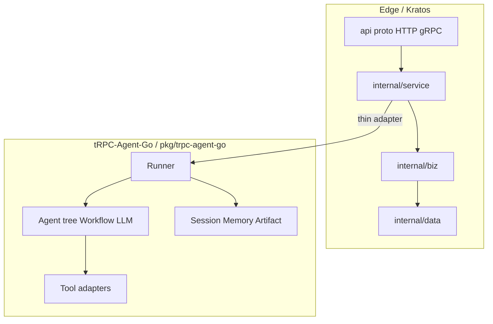

# Aranea 平台架构与 Agent 编排（统一稿）

> **文档地位**：本文为评审实现、迁移与编排时以**本文为唯一真理源**。  
> **产品 KPI / 路线图**：[`docs/需求/产品需求总览.md`](../需求/产品需求总览.md)。**proto / Wire / Ent 流程**：[`docs/guides/AI-全栈新功能开发规范.md`](../guides/AI-全栈新功能开发规范.md)。**框架 API**：[`pkg/trpc-agent-go`](../../pkg/trpc-agent-go)。**tRPC-Agent-Go import 红线**：`.cursor/rules/trpc-agent-framework-first.mdc`。

---

## 总目录（按篇跳转）

| 篇 | 内容 |
|----|------|
| **第一篇** | [编排速查](#第一篇-编排速查)（Kratos、tRPC-Agent-Go、`pkg/trpc-agent-go`、MCP/A2A、建设顺序、红线、网关在本项目中的落点） |
| **第二篇** | [LLM Gateway（凝练）](#第二篇-llm-gateway-设计参考凝练) |
| **第三篇** | [平台目标态架构全文](#第三篇-平台架构与目标态实现全文)（限界上下文、Kernel、Capability 执行链、迁移映射与附录） |

**专题设计**：[会话上下文压缩](./session-context-compression.md)（长会话 LLM 摘要、`session_summaries` 与 L0 装配对齐）。

---

# 第一篇 编排速查

## 第一篇 · 硬约束 · AI 自检

| # | 检查项 | 若不满足 |
|---|--------|-----------|
| 1 | Agent **编排语义**（Runner、会话、Agent 树、Tool、事件流）是否落在 **`pkg/trpc-agent-go`** + **薄 `adkruntime` 适配**，而非在 `biz` 重写运行时？ | 停 |
| 2 | 新 **HTTP/API** 是否走 **`api/**/*.proto`** → `internal/service` → `internal/biz` → `internal/data`？ | 禁止未入库 proto 的私有业务路由 |
| 3 | **`pkg/trpc-agent-go`** / 其底层运行时模块（import 路径以 **`go.mod`** 为准）**内部导入**是否**仅**出现在 **`internal/conversation/adapters/adkruntime/**`**（与第三篇一章 §6 / §12 一致）？ | 停 |
| 4 | 跨模块协作是否经 **`kernel/contracts`**，而非 Context 互 import `domain`？ | 停 |
| 5 | Capability 执行是否 **`application → executor → middleware → backends`**，**不**绕过 executor？ | 停 |
| 6 | LLM **路由 / 熔断 / 配额 / 降级**是否有明确归属（见下节「网关三层 → 本项目落点」），而非散落在各 handler？ | 逐项勾 |

**服务与编排硬性约定**：

- **服务基座**：新对外能力以 **Kratos** 为准（`api/**/*.proto`、`internal/service` → `biz` → `data`），见 [**迁移主线**](../migration/pkg-backend-to-kratos.md) 与全栈规范。
- **Agent 编排**：以 **`pkg/trpc-agent-go` 为框架真相源**；**不以** `pkg/backend` 或旧手写编排为范本（见 `.cursor/rules/trpc-agent-framework-first.mdc`）。
- **集成**：业务经**薄适配**调用 tRPC-Agent-Go **公开 API**，避免在业务包复制框架内部逻辑。

---

## 第一篇 · 目标形态映射（专栏 → 工程）

| 专栏 / 业界要点 | 在本仓库中的落点 |
|-----------------|-------------------|
| **Agent = LLM + 规划 + 记忆 + 工具** | **tRPC Agent**：`model` + `memory`/`session` + `tool`；复杂规划用 **Workflow** 或显式 **Plan-and-Execute**。 |
| **单 Agent → 多 Agent** | **tRPC Agent**：`SubAgents`、树与转移；跨进程协作 **A2A**（`pkg/trpc-agent-go/server/adka2a` 等），Kratos 仅会话/任务管理面。 |
| **MCP** | **工具 / 上下文资源**接入面 → **tRPC Agent Tool**；社区 MCP Server 独立适配；Kratos 管配置、鉴权边界。已有统一工具网关时允许直连网关 API。 |
| **A2A** | **多实例 / 多角色**协议 → **tRPC-Agent-Go A2A**；Kratos 映射注册、启停、观测。 |
| **ReAct / Plan-and-Execute** | 工具循环 **ReAct**；长链路、人审 **先规划再执行**；设计上必须写 **终止条件**。 |
| **Human-in-the-loop** | 暂停/恢复/人工提交在 **`biz`** 与表中表达；可与框架 **`EndInvocation`**/会话衔接；禁止仅进程内「假暂停」。 |
| **可观测** | Kratos 中间件 + **tRPC-Agent-Go 事件流**；运行关联 `trace_id`、会话、Agent、工具、错误。 |

---

## 第一篇 · Kratos 与 tRPC Agent 分层（示意）



- **Kratos**：鉴权、限流、审计、持久化契约、与前端的 HTTP/JSON、gRPC。**不**承载第二套 Planner/事件循环。  
- **`pkg/trpc-agent-go`**：**Invocation** 内编排语义。  
- **适配层**：`proto`/`biz` ↔ `Runner.Run`，事件迭代 → SSE/任务状态。

---

## 第一篇 · 多 Agent 拓扑（默认）

1. **Host / Supervisor**：意图分类与任务分发，子 Agent 为专家。  
2. **专家**：**单一职责**，可独立发布与回滚。  
3. **工具 / 外部世界**：Tool；标准生态 **MCP**；跨服务 **A2A**。  

**tRPC Agent：** **根 + `SubAgents`** 或 **Workflow Agent**；动态选题时用根 LLM Agent + `SubAgents` 描述。

---

## 第一篇 · 思考框架（须写明终止条件）

| 模式 | 适用 | 要点 |
|------|------|------|
| **CoT / 慢思考** | 复杂推理、可接受延迟 | 模型侧或提示词；**不**替代工具反馈。 |
| **ReAct** | 工具密集 | **LLM → Tool → Observation** 至结束；超时/重试在 Kratos/biz 策略化。 |
| **Plan-and-Execute** | 长任务、解释性、HITL | **计划可口持久化于 biz/表**；每步内可 ReAct；失败可局部重规划。 |

---

## 第一篇 · MCP / A2A / FC

- **Function calling**：**tRPC Agent `model`** 抽象，业务不绑死单一厂商 JSON。  
- **MCP**：配置驱动连接，Kratos 管密钥与网络策略；无成熟基建时不强行依赖 MCP。  
- **A2A**：独立部署专家、跨团队复用 → **tRPC-Agent-Go A2A**；管理面 RPC 仍在 Kratos。

---

## 第一篇 · LLM Gateway 三层 → 本项目落点

| Gateway 逻辑层 | 通用职责 | **Aranea 建议落点** |
|----------------|----------|---------------------|
| **接入** | 归一协议、鉴权、限流、配额 | **Kratos HTTP 中间件 + Identity/Capability**；入口构造 `RuntimeContext`。 |
| **决策** | 路由、健康、熔断、降级 | **`Capability.Provider` / ModelProfile** + **Operations**（开关、告警）；可为独立路由服务演进。 |
| **出口** | 厂商适配、流式统一、计费日志 | **`adkruntime`/model_bridge** + Provider 适配器；结构化日志与 span。 |

路由策略：**能力 / 成本（级联）/ 延迟（P95+RTT）/ 语义（可选）**；降级：**有限重试 + 指数退避 → 跨厂商 → 降级规格 → 缓存/保底**；熔断阈值对 LLM **放宽**以防误杀长尾。负载均衡：**优先按令牌量与队列深度加权**，慎用纯轮询。语义缓存：**强时效或个人化场景禁用或极短 TTL**。

---

## 第一篇 · 新能力建设顺序 · 红线

**顺序**：① `proto` ② `biz/data`（可恢复状态入表）③ **tRPC Agent / Agent / Tool**④ `service` 适配 ⑤ trace/指标 ⑥ HITL 的 RPC 与状态机。

**一票否决**：在 `biz` 重写运行时；私自 HTTP 路由；把 `pkg/backend` 编排习惯套入新链路；在非 `adkruntime` import **框架实现包**绕过约定；跨 Context **直引 domain**；**绕过 executor** 调 backend。

---

## 第一篇 · 延伸参考

- 概念稿：[`docs/reference/zhihu-ai-agent-development-guide.md`](../reference/zhihu-ai-agent-development-guide.md)  
- **`docs`** 分区索引：[`README.md`](../README.md)

---

# 第二篇 LLM Gateway 设计参考（凝练）

> **来源**：原「设计需求」讲义。**产品路线与实践**：[`docs/需求/产品需求总览.md`](../需求/产品需求总览.md) §6。  
> **与 Aranea**：与 **第一篇「网关三层 → 本项目落点」** 对齐；本节归纳 **通用生产级网关** 设计要领，兼容当前 Provider 内嵌与未来独立网关。

## 1. 解决的问题

收口全部模型调用，避免：**多厂商协议分裂**、**密钥与路由散落各微服务**、**无统一容错与配额**、**成本与 SLA 不可见**。核心价值：**统一管控、可配置路由、多层降级、可观测与成本归因**。

## 2. 三层架构

| 层 | 职责 |
|----|------|
| **接入** | 协议/参数归一、鉴权、限流与配额 → 产出 **内部标准请求**。 |
| **决策** | 路由引擎、实例健康与延迟视图、负载均衡、**降级编排**；策略应 **动态可配**。 |
| **出口** | 厂商请求/响应转换、**SSE 流式**归一、结构化日志与指标。 |

## 3. 路由（多策略组合）

1. **按能力**：任务类型或标签 → 匹配模型族（推理 / 代码 / 长上下文 / 轻量等）。  
2. **按成本**：级联——小模型先答，**质量闸门**不过关再上大模型。  
3. **按延迟**：滑动窗口 **P95**；综合 **推理时延 + 网络 RTT**；实时路径显式标记。  
4. **语义路由（可选）**：嵌入 + 阈值 → 任务类型；纳入 **误判与隐私**、运维成本评审。

## 4. 容错：四层降级 + 熔断

1. **同模型**：有限次重试 + **指数退避**；只对可重试错误（超时、429 等），参数/鉴权类立即失败。  
2. **跨厂商**：降级链预置 + **出口层** 协议转换，对上游尽量无感。  
3. **跨等级**：降级轻量或小上下文（需产品预先接受体验下限）。  
4. **兜底**：语义缓存、固定话术、人工接管。  

**熔断**：LLM **长尾延迟常态**，阈值应显著 **宽于** 通用 RPC；结合 **错误率 / 慢请求占比** 开合，避免误杀。

## 5. 负载均衡（LLM 特化）

不宜简单轮询：按 **并发、队列深度、预估 token 吞吐** 加权；多区域时在 **地缘就近** 与 **实例空闲度** 间折衷。

## 6. 统一协议面

对外以 **主流开放对话 API** 为事实标准可显著降改造成本。须统一：**SSE 事件形态**、**工具 / 函数调用 JSON**、**token 计数口径**、**厂商错误码映射为网关错误码**，以及厂商专有能力的受限扩展出口。

## 7. 语义缓存与可观测

- **缓存**：适用于稳态、弱时效问答；强时效资讯、强个性化、合规敏感场景应 **禁用或短 TTL**。  
- **可观测**：每请求 **trace**、路由决策、降级层级、目标模型 / 厂商、token 与成本；监控成功率、延迟分位、路由命中与降级占比，反哺调参。

## 8. 开源落地选型（概要）

轻量统一面 + 基础降级统计；专攻级联成本的「路由插件」；企业级一体化（语义缓存 + 熔断 + 权限 + 多厂商适配，私有化常用）。

## 9. 一句话

**LLM Gateway = 接入归一 + 可配置决策（路由 · 健康 · 均衡 · 降级）+ 出口适配与流式**。相对传统 API 网关，侧重 **token 级均衡、长尾下的熔断策略、级联成本路由与全链路可观测**。

---

# 第三篇 平台架构与目标态实现全文

> **架构指导（请作为本项目约定记忆）**  
> **`docs/design/platform-architecture.md` 第三篇** 为 **Aranea Agents** **平台目标态实现设计**（原 `platform-architecture.md` 全文）：模块划分、分层、路由与跨模块协作原则以本篇为准。实现、重构与代码评审应优先对照本文；`docs/需求/` 下各专题需求（tools、skills、memory 等）在本原则内细化延伸；若有冲突以**本文架构原则**优先，并回写专题文档以消除矛盾。**产品目标与非功能 KPI**见 `docs/需求/产品需求总览.md`。  
> **Go module path**：文中示例 import 路径与当前仓库一致，使用 `arenea/backend/...`（历史命名）。若日后全仓库统一改为 `aranea/backend/...`，应同步替换示例与 `go.mod`。

> **AI 速查（动手前先读这八条）**  
> 1. **目标态目录**：所有新代码落到「二、§3」的目标 Context 下，**禁止**在 `internal/{repository,runtime,transport,service,tools,domain,middleware}` 等旧路径新增文件。  
> 2. **Context 边界**：跨 Context 协作只走 `kernel/contracts/`；`<context>/domain` 与 `<context>/application` 不允许 import 其它 Context（一章 §8 编译期红线）。  
> 3. **框架运行时隔离**：**`pkg/trpc-agent-go`** 及其底层依赖（具体 import 以根 **`go.mod`** 为准）仅出现在 `internal/conversation/adapters/adkruntime/**`。  
> 4. **SQL 归属**：表前缀必须等于 Context 名（`identity_*` / `catalog_*` / `capability_*` / `conversation_*` / `memory_*` / `operations_*`），SQL 仅在 `<context>/adapters/sqlite/**` 出现（三章 §2）。  
> 5. **迁移粒度**：按一章 §12.1.1 映射表，**一行 = 一个 PR**；五步流程见 §12.1.2，违反红线立即停手。  
> 6. **Kernel 准入**：把接口提到 `kernel/contracts/` 必须满足「≥3 Context 实现/消费 + 已稳定 ≥2 个 PR 周期」（一章 §5、§9）。  
> 7. **能力执行链**：Capability 的运行时调用必须经 `application → executor → middleware → backends`，**禁止**跳过 executor（四章 §4、§13）。  
> 8. **冲突即停**：若任务与本文 §2 设计原则、§5 Kernel 边界、§8 依赖红线冲突，先在本文档登记例外或修正本文，再写代码。

---
# 一、主体架构设计

> 本章是 Aranea 的**目标架构（Target Architecture）**：以「**限界上下文 + 端口与适配器（Ports & Adapters）+ tRPC-Agent-Go（`pkg/trpc-agent-go`）内嵌运行时**」重新立项设计，与当前 `internal/` 目录的实现并不一一对应。后续章节（路由、数据库、模块功能）在本章框架下展开；与现有实现的差异及迁移路径见 §12。

---

## 1. 系统定位

Aranea 是一个**以 Agent 为中心的多智能体编排平台**：用户在 Web/CLI 中创建 Agent、装配能力（Tool/Skill/MCP）、配置记忆（L0~L4）与提供商，然后通过统一会话与 Agent 进行多轮、多模态、可流式的协作；后台基于自演化机制持续优化 Agent 行为。

平台本身**不实现**：模型推理、向量检索引擎、对象存储、IM 协议——这些经端口接入外部依赖。

执行底座是 **tRPC-Agent-Go**（[`pkg/trpc-agent-go`](../../pkg/trpc-agent-go)；对外模块路径以根 **`go.mod`** 为准）：Aranea 把框架的 `agent / runner / session / memory / artifact / tool / plugin / model` 当作**内嵌引擎**用，但**不让框架类型穿透到业务代码**。

---

## 2. 设计原则

下面 9 条是后续所有设计的**判定基准**。任何新模块、PR、专题文档若与之冲突，必须在本章登记例外或修正本章。

1. **限界上下文（Bounded Context）**：按业务概念切分，而不是按技术层切分。系统由若干高内聚、低耦合的 Context 组成；Context 内部允许丰富，Context 之间只能通过**端口、命令、事件、查询**协作。
2. **端口与适配器（Hexagonal）**：每个 Context 对外只暴露**端口（Port）**，所有实现细节是**适配器（Adapter）**——HTTP、CLI、SQLite、tRPC-Agent-Go、LLM SDK、向量库等都是"被适配"的，不是"内嵌"的。
3. **接口清晰（四要素显式）**：模块边界（哪个 Context）、调用协议（命令/查询/事件签名）、数据格式（领域类型 + JSON schema）、依赖方向（谁依赖谁），四者必须**写进 `ports/` 包并在文档中固化**。
4. **不变与变化分离**：协议、领域类型、事件信封、能力契约属于**不变层**；后端实现、运行时、SDK、UI 属于**变化层**。两者在目录、包名、变更流程上必须区分。
5. **单一职责**：一个包只解决一类技术问题；一个 Context 只解决一类业务问题。功能跨包靠**组合**，禁止"上下文穿透"（不要为了图省事把别的 Context 的类型直接拉进来）。
6. **共享内核（Shared Kernel）最小化**：内核只放**所有 Context 都依赖**且**长期稳定**的内容（ID、时间、错误、事件信封、运行上下文、Module 接口）。绝不放业务策略与领域逻辑。
7. **依赖方向单向收敛**：`adapter → context → kernel`、`runtime adapter → context.port`，**绝不反向**。同层 Context 之间只能依赖对方在 `kernel` 中暴露的端口，不能直接 import 对方包。
8. **可观测优先**：tracing、结构化事件、SSE、审计、用量从 Day 1 起即作为**架构约束**而非补丁，由内核统一定义信封，由 **tRPC-Agent-Go Plugin** / 运行时 middleware 注入。
9. **可裁剪部署**：通过 launcher 装配不同 Context 子集（console、web、full、headless agent），**业务代码不感知 launcher**。

---

## 3. 顶层架构（Hexagonal）

Aranea 整体是一个**六边形架构**：业务 Context 在内圈，端口（Ports）在边界上，外圈由各类 Adapter 接入；**tRPC-Agent-Go** 是 Conversation Context 的内嵌引擎，本身也通过端口被业务调用。

```text
                    ┌─────────────── DRIVING ADAPTERS ───────────────┐
                    │  REST API · SSE · CLI · Cron · A2A · Webhook   │
                    └───────────────────────┬───────────────────────┘
                                            │ 命令 / 查询
                                            ▼
   ┌────────────────────────────── BUSINESS CONTEXTS ──────────────────────────────┐
   │                                                                              │
   │   Identity   │  Catalog   │ Capability │ Conversation │  Memory  │ Operations │
   │   ───────    │  ───────   │  ───────   │  ──────────  │  ──────  │  ───────── │
   │   user       │  agent     │  tool      │  session     │  L0..L4  │  cron      │
   │   team       │  evolution │  skill     │  message     │  recall  │  monitor   │
   │   workspace  │  prompt    │  mcp/plugin│  channel     │  decay   │  audit     │
   │   role       │            │  hook      │  team-run    │          │  budget    │
   │                                                                              │
   │   每个 Context 对内：domain · application · ports · 内部组件                    │
   │   每个 Context 对外：仅 ports（命令/查询/事件/能力契约）                          │
   └──────────────────────────────────┬──────────────────────────────────────────┘
                                      │
                ┌─────────────────────┴─────────────────────┐
                │                                           │
                ▼                                           ▼
   ┌────────────── KERNEL（共享内核·稳定层） ──────┐  ┌──────────── DRIVEN ADAPTERS ─────────────┐
   │ ids · clock · errs · event · runctx ·          │  │ 基础设施 ：SQLite · Postgres · pgvector ·  │
   │ contracts · module · telemetry · pkg           │  │            FS · S3 · HTTP                  │
   └────────────────────────────────────────────────┘  │ 外部 SDK ：LLM provider · MCP 客户端       │
                                                       │ 内嵌引擎：adkruntime（Conversation 私有，  │
                                                       │           唯一允许 import 框架底层模块；路径以 go.mod 为准） │
                                                       └────────────────────────────────────────────┘
```

阅读约定：

- **Driving**：把请求"驱动进来"的入口（REST/CLI/Cron/A2A）。
- **Driven**：被业务"驱动出去"的依赖（DB/LLM/FS/外部 HTTP）。
- **tRPC-Agent-Go** 在 Aranea 中是 **Driven Adapter 的一种特殊形态**——一个内嵌引擎：业务 Context 通过 `ConversationRuntime` 端口请求"运行 Agent 一轮对话"，由 `adkruntime` 适配实现该端口并调用框架 **`Runner`**。
- **adkruntime 的归属是 Conversation Context 私有**：Catalog / Capability / Memory / Operations / Identity **不**直接依赖它，跨 Context 触发会话执行只能经 `kernel/contracts.ConversationRuntime`。
- **Kernel** 是六边形的中心，所有 Context 都可以依赖它，但**它不依赖任何 Context**。

---

## 4. 限界上下文（Bounded Contexts）

Aranea 的现有功能（agents、sessions、tools、skills、L0~L4 memory、provider、avatar、cron、agent-evolution、channel、multi-agent、mcp、plugin/hook、ecosystem、token、monitor、cli、frontend BFF）按业务语义重组为 **6 个限界上下文**：

| Context        | 业务范围                                                                 | 核心聚合                                       | 主要文件来源（旧 → 重新归位）                                                |
| -------------- | ------------------------------------------------------------------------ | ---------------------------------------------- | ------------------------------------------------------------------------------ |
| **Identity**   | 用户、团队、工作区、角色、租户、API Key、配额                            | `User`、`Team`、`Workspace`、`Role`            | team / token 中的身份与配额部分                                                |
| **Catalog**    | Agent 编目与生命周期：定义、配置、模板、提示文件、演化、头像             | `Agent`、`AgentVersion`、`Avatar`、`Evolution` | agents、agent_evolution、avatar、agent-title、agent-type、agent-setting        |
| **Capability** | 可被 Agent 装配的能力：Tool、Skill、MCP、Plugin/Hook、Provider/Model     | `Tool`、`Skill`、`MCPServer`、`Plugin`、`Provider` | tools、skills、mcp、plugin/hook、provider                                     |
| **Conversation** | 一次会话从开始到结束的全链路：会话、消息、通道、流式、多 Agent 协作    | `Session`、`Message`、`Channel`、`TeamRun`     | sessions、chat、channel、multi-agent、team_runtime、runtime                    |
| **Memory**     | L0~L4 五层记忆体系，独立可演进                                           | `L0Snapshot`、`L1Slot`、`L2Episode`、`L3Fact`、`L4Node` | memory_l0..l4、memory-L*-* 文档                                            |
| **Operations** | 一切"非用户实时路径"：调度、监控、审计、用量与成本、生态适配            | `Job`、`Schedule`、`AuditLog`、`UsageEvent`、`CostLedger` | cron、monitor、token（用量部分）、ecosystem、hook（运行期）              |

每个 Context 对内由 4 个子层组成（DDD 风格，详见「四、模块功能设计」）：

```text
<context>/
├── domain/        # 实体、值对象、聚合、领域事件
├── application/   # 用例（Command/Query handler）、事务边界
├── ports/         # 对外端口（input port = 用例接口；output port = 依赖接口）
├── adapters/      # 输入适配器（HTTP/CLI/Cron）+ 输出适配器（SQL/HTTP/框架运行时 等）
└── module.go      # Context Shell：装配 + 注册 + 生命周期
```

Context 之间**不允许**互相 import `domain` 或 `adapters`；只能通过对方在 `kernel/contracts/` 中暴露的端口协作。

---

## 5. 共享内核（Kernel）

Kernel 是六边形的中心，**最小、稳定、无业务语义**。建议位置：

```text
internal/kernel/
├── ids/             # ULID/UUID 生成与解析
├── clock/           # 时间抽象、可注入 fake clock
├── errs/            # 错误码常量、Domain Error、Wrap/Is 工具
├── event/           # 事件信封定义 + Bus 接口
├── runctx/          # RuntimeContext：tenant/user/session/agent/trace/budget
├── contracts/       # 跨 Context 端口集合（见下）
├── module/          # Module 接口、装配协议
├── telemetry/       # tracer/meter/instrumentation 名约定
└── pkg/             # 中性工具：jsonutil、httpx、validate 等
```

`kernel/contracts/` 定义**跨上下文端口**，例如：

```go
// kernel/contracts/catalog.go
type AgentReader interface {
    GetAgentByID(ctx context.Context, id AgentID) (AgentSnapshot, error)
}

// kernel/contracts/capability.go
type ToolResolver interface {
    ResolveForAgent(ctx context.Context, agent AgentID) ([]ToolDescriptor, error)
}

// kernel/contracts/memory.go
type MemoryAssembler interface {
    AssembleForTurn(ctx context.Context, in TurnInput) (MemoryView, error)
}

// kernel/contracts/conversation.go
type ConversationRuntime interface {
    Run(ctx context.Context, req TurnRequest) (<-chan event.Envelope, error)
}
```

**硬约束**：

- Kernel **不 import** 任何 `internal/<context>` 包（编译期防回环）。
- Kernel 只允许依赖 `context`、`time`、`encoding/json`、OpenTelemetry API、`google/uuid` 等中性库，**不依赖 `pkg/trpc-agent-go`、SQLite、chi**。
- Kernel 中不放策略与算法，只放接口与稳定数据类型。
- 提升进入 Kernel 的门槛：**≥3 个 Context 已实现或将要实现该端口；接口经过 ≥2 次 PR 周期未变更**。

### 5.1 事件 Bus 最小契约

`kernel/event.Bus` 是异步协作（§7.1 Event）的统一通道。所有 Context 的事件订阅与发布**必须**经它，禁止 Context 之间用裸 channel 互通。

| 项               | 约束                                                                                  |
| ---------------- | ------------------------------------------------------------------------------------- |
| **接口**         | `Publish(ctx, env Envelope) error` + `Subscribe(typeGlob, h Handler) Cancel`           |
| **订阅注册时机** | 在 `Module.Start` 内一次性注册；`Shutdown` 反向 Cancel；禁止运行期动态增删订阅          |
| **投递语义**     | 默认 at-least-once；handler 必须**幂等**（按 `Envelope.ID` 去重）                       |
| **失败重试**     | 内置指数退避；超过阈值进入 `operations_event_dead_letter` 死信表，由 Operations 复盘     |
| **顺序保证**     | 单一 `subject.id` 内有序；跨 subject 不保证                                             |
| **类型命名**     | `<context>.<aggregate>.<verb>`，例如 `conversation.turn.completed`、`capability.tool.executed` |

实现策略：

- **单进程**：`kernel/event/memory_bus.go`（缓冲通道 + worker pool），launcher 默认装配。
- **多进程**：实现 `kernel/event/nats_bus.go` 等 adapter，**接口不变**；切换由 `app.Container` 决定。

### 5.2 可观测最小契约

| 维度        | 约定                                                                              |
| ----------- | --------------------------------------------------------------------------------- |
| Tracer Name | 与包路径一致：`arenea/backend/internal/<context>` 或 `<context>/<subsystem>`        |
| Span Name   | `<context>.<verb>` 或 `<context>.<aggregate>.<verb>`                              |
| 必填属性    | `tenant.id` `user.id` `session.id` `agent.id` `trace.id`（来自 `runctx`）          |
| 错误标记    | error 返回时 `span.SetStatus(codes.Error)` + `span.SetAttributes("error.code", …)` |
| Metric 命名 | `aranea.<context>.<metric>` 全小写蛇形；直方图必带 `_seconds` / `_bytes` 等单位后缀 |
| Log 字段    | 结构化；必带 `tenant_id` `trace_id`；**禁止**打印密钥与原始 prompt 全文              |

属性键集中在 `kernel/telemetry/names.go` 定义为常量；Context **禁止**在自家代码中硬编码字符串属性键。

### 5.3 RuntimeContext 注入路径

`kernel/runctx.RuntimeContext` 由 driving adapter 创建，沿调用链传递；**框架** callback 进入业务前由 `adkruntime/plugins` 重建同一份 RuntimeContext。

```text
HTTP / CLI / Cron driving adapter
   │ 中间件解析 token / API Key → 构造 RuntimeContext（tenant/user/agent/trace/budget）
   │ ctx = runctx.With(parent, rc)
   ▼
<context>.application.Service.Method(ctx, …)        # ctx 已带 RuntimeContext
   ▼
<context>.ports.Output（contracts.*Reader/Writer/Resolver/Runtime）
   ▼
conversation.adapters.adkruntime.Runner.Run(ctx, …)
   │ framework plugin Before*：从 ctx 重建 RuntimeContext，再回调
   ▼
capability.application.ExecuteTool(ctx, …)          # 同一份 RuntimeContext
```

强制条款：

- 所有跨包公共函数**首参**必须是 `context.Context`；从 `runctx.From(ctx)` 取 RuntimeContext，**禁止**通过结构体字段透传。
- 派生子 ctx（带超时 / 带值）必须基于父 ctx；**不允许** `context.Background()` 覆盖上游 ctx。
- **框架** callback 进入业务之前由 `adkruntime/plugins` 重建 ctx；丢失 RuntimeContext 视为 P0 缺陷。
- HTTP 中间件构造 RuntimeContext 失败（无身份 / token 过期）→ 直接 401，不允许继续下游。

---

## 6. 与 tRPC-Agent-Go 的关系（运行时层）

**tRPC-Agent-Go（`pkg/trpc-agent-go`）**是 Aranea 的主要**会话执行引擎**实现选型，但**仅服务于 Conversation Context**，不是全局基础设施。它在六边形里的位置如下：

```text
Conversation.application
        │  command/query: RunTurn
        ▼
Conversation.ports.ConversationRuntime（输出端口，定义在 Conversation 内）
        │
        ▼
adapters/adkruntime/                          ← **唯一**直接依赖框架底层模块的位置（路径以根 go.mod / `pkg/trpc-agent-go` 为准）
   ├── runner.go        实现 ConversationRuntime
   ├── agent_builder.go 把 Catalog/Capability/Memory 的视图组装成框架 Agent 树
   ├── tool_bridge.go   Capability.ToolDescriptor → 框架 Tool
   ├── skill_bridge.go  Capability.SkillDescriptor → 框架 Skill toolset
   ├── memory_bridge.go Memory.View → 框架 Memory Service
   ├── model_bridge.go  Provider.ModelProfile → 框架 Model
   └── plugins/         审计/脱敏/用量/成本以框架 Plugin 形式注入
```

**对应关系（Aranea ↔ tRPC-Agent-Go）**：下表 **`framework.*`** 表示 **`pkg/trpc-agent-go`** 对外暴露的包与类型命名空间；与本仓库 **`go.mod` 实际 module path**不一致时以实现代码为准。

| Aranea 概念                            | tRPC-Agent-Go（概念映射）                                  | 适配责任                                                        |
| -------------------------------------- | ---------------------------------------------------------- | --------------------------------------------------------------- |
| `Conversation.Session`                 | session 抽象（Runner 输入/持久化视图）                       | 自家持久化为主，必要时实现框架 `session.Service` 提供给 Runner |
| `Conversation.RunTurn` 命令            | **`Runner.Run(...)`**                                    | `adkruntime` 把 TurnRequest → Runner 输入                        |
| `Catalog.Agent` 定义                   | Agent 树（llm/workflow/remote 等）                          | agent_builder 按 Agent 类型选择具体实现                          |
| `Capability.Tool/Skill/MCP`            | `tool` / skill toolset / MCP toolset                       | 桥接器持有"原生 backend"，转出框架 Tool，回调再回到自家执行链     |
| `Memory.View`（L0~L4 已聚合）          | memory 抽象                                                | memory_bridge：Search/Add 路由到 L2/L3/L4                      |
| `Capability.Plugin/Hook`、Operations 审计 | Plugin                                                    | 审计/脱敏/用量/成本/超时统一以框架 Plugin 注入                  |
| `Capability.Provider/Model`            | `model` / LLM 驱动                                         | model_bridge 把 ModelProfile 转为具体实现                        |
| `Conversation.Event` 流                | 会话事件流                                                 | `adkruntime` 订阅框架事件 → 转换为 Aranea `event.Envelope`        |

**集成约束**：

- **`adkruntime/` 是 Aranea 中唯一允许直接 import 框架底层实现（含 `pkg/trpc-agent-go` 及 `go.mod` 声明的传递依赖）的包目录**。其他业务 Context（Catalog/Capability/Memory/Identity/Operations）**禁止**直接 import 框架运行时。
- **框架**触发的回调（before_tool/after_tool/before_model_request/…）在 `adkruntime` 内**重建 RuntimeContext**，再回调到对应 Context 的 application 用例（例如 `Capability.ExecuteTool`），不是直接触发 backend。
- **`pkg/trpc-agent-go` 版本与 replace 路径**在根 **`go.mod`** 显式声明；升级框架 = 修改 `adkruntime` + 升级 `go.mod`，**不应改业务 Context**。
- 未来若需替换为多运行时方案，只新增一个 `adapters/<other>runtime/`，业务 Context 完全不感知。

---

## 7. 接口与数据契约

### 7.1 三种跨 Context 协作方式

```text
Command      （状态变更）   A.application ──► B.ports.<Action>     同步、强一致
Query        （只读检索）   A.application ──► B.ports.<Reader>     同步、可缓存
Event        （事实通告）   A.publish ──► event.Bus ──► B.handler  异步、最终一致
```

判定规则：

- 修改 B 内部状态 → **Command**（B 暴露动词式接口）。
- 仅读取 B 数据 → **Query**（B 暴露 Reader 接口）。
- "我做了什么" → **Event**（A 发布，B 自愿订阅；A 不知道 B 是谁）。

### 7.2 数据格式契约（Kernel 强制）

- **标识符**：所有持久实体使用 ULID（`01JABC...`，时间可排序）；外部友好 key/slug 使用 `^[a-z][a-z0-9_]{0,63}$`。
- **时间**：API 与事件统一 `time.Time` + `RFC3339Nano UTC`；DB 存原生 timestamp 或 ISO8601 字符串，不允许混存"本地时间"。
- **JSON Schema**：所有 Tool/Skill/Capability 的 input/output schema 由 typed Go struct 通过 `kernel/pkg/schemagen` 统一生成，禁止手写。
- **错误响应**：

  ```json
  {
    "error": {
      "code": "CONVERSATION_TURN_BUDGET_EXCEEDED",
      "message": "agent 'researcher' exceeded per-turn tool budget",
      "details": { "budget": 8, "used": 8 },
      "retryable": false
    }
  }
  ```

- **事件信封**（`kernel/event/envelope.go`）：

  ```json
  {
    "id": "01JABC...",
    "type": "capability.tool.executed",
    "context": "capability",
    "version": "1",
    "occurred_at": "2026-04-27T10:00:00Z",
    "actor": { "tenant_id": "...", "user_id": "...", "agent_id": "..." },
    "subject": { "kind": "tool", "id": "read_file" },
    "trace_id": "...",
    "session_id": "...",
    "payload": { "...": "..." }
  }
  ```

- **SSE 帧**：`event: <type>\ndata: <json envelope>\n\n`，前端按 `context + type` 路由。
- **分页**：列表统一 `?limit=&cursor=`；返回 `{ "items": [...], "next_cursor": "..." }`，禁止使用 offset 持久化游标。

### 7.3 错误码 → HTTP 状态映射

`kernel/errs.Code` 是稳定枚举；HTTP 状态由 `kernel/pkg/httpx.MapErr` 统一翻译，业务 handler **禁止**直接写 `http.StatusXxx`。

| 错误码族              | HTTP | 触发场景示例                                  |
| --------------------- | ---- | --------------------------------------------- |
| `*_INVALID_INPUT`     | 400  | 参数校验失败、JSON 解析失败                   |
| `*_UNAUTHENTICATED`   | 401  | 缺失 token / API Key 失效                     |
| `*_FORBIDDEN`         | 403  | 权限不足、跨租户访问被拒                      |
| `*_NOT_FOUND`         | 404  | 资源不存在 / 软删除后访问                     |
| `*_CONFLICT`          | 409  | 唯一约束冲突、状态机非法跳转                  |
| `*_PRECONDITION`      | 412  | If-Match / 乐观锁版本不一致                   |
| `*_PAYLOAD_TOO_LARGE` | 413  | 单次请求体或附件超限                          |
| `*_BUDGET_EXCEEDED`   | 429  | turn budget / token quota 超限                |
| `*_RATE_LIMITED`      | 429  | 限流命中                                      |
| `*_DEPENDENCY_FAILED` | 502  | 下游 LLM / MCP / 外部 HTTP 失败              |
| `*_TIMEOUT`           | 504  | 上游 ctx 超时                                 |
| 其它                  | 500  | 兜底；响应必含 `trace_id`，详细栈仅入日志    |

约束：

- 错误码命名采用 `<CONTEXT>_<DOMAIN>_<REASON>` 大写蛇形，例如 `CONVERSATION_TURN_BUDGET_EXCEEDED`。
- 错误响应（§7.2 JSON 结构）必含 `trace_id`，便于通过 `kernel/telemetry` 反查。
- 内部错误（5xx）禁止把堆栈或 SQL 原文返回客户端；只允许在结构化日志中保留。
- 同一错误**只在最靠近用户的层级翻译一次**：domain 抛 `errs.Error`，application 用 `%w` 包装上下文，adapter 调 `httpx.MapErr` 写出 HTTP 响应。

---

## 8. 依赖方向（编译期约束）

```text
                  ┌───────────────────────────┐
                  │           Kernel          │   ← 不依赖任何 Context
                  └───────────────────────────┘
                              ▲
                              │（每个 Context 单向依赖 kernel）
        ┌──────────┬──────────┼──────────┬──────────┬──────────┐
        ▼          ▼          ▼          ▼          ▼          ▼
   Identity    Catalog   Capability Conversation  Memory   Operations
        ▲          ▲          ▲          ▲          ▲          ▲
        │          │          │          │          │          │
        └──────────┴──── 通过 kernel/contracts 端口互相协作 ────┘
                              ▲
                              │
                  ┌───────────────────────────┐
                  │   Adapters（Driving + Driven）  │
                  │   HTTP/CLI/Cron · SQL · adkruntime · LLM SDK · FS  │
                  └───────────────────────────┘
                              ▲
                              │
                  ┌───────────────────────────┐
                  │       External world      │
                  └───────────────────────────┘
```

**编译期红线**（CI 静态检查必须守住）：

1. `kernel/**` 不允许出现 `import "arenea/backend/internal/<context>/..."`。
2. `<context>/domain` 不允许 import 任何 adapter、任何外部 SDK、任何其它 Context 包。
3. `<context>/application` 只允许 import 本 Context 的 `domain`、`ports`，加 `kernel/**`。
4. 跨 Context import 仅允许出现在 `<context>/adapters/**`，且 import 的目标必须是 **`kernel/contracts`** 中的接口（不是对方的 domain/application）。
5. **`pkg/trpc-agent-go`** / 框架底层依赖只允许出现在 `adapters/adkruntime/**`（具体 import 路径以 `go.mod` 为准）。
6. `chi`、`net/http` 路由相关只允许出现在 `<context>/adapters/http/**` 与 `cmd/**`。
7. `database/sql`、`modernc.org/sqlite` 只允许出现在 `<context>/adapters/sqlite/**` 与 `kernel/pkg/db/**`。

工具建议：在 CI 加入 `gomodguard` 或自定义 `go list -deps` 校验。

---

## 9. 不变与变化的分离

| 类别                        | 类型     | 位置                                  | 变更约束                                       |
| --------------------------- | -------- | ------------------------------------- | ---------------------------------------------- |
| `kernel/event/Envelope`     | 不变     | `kernel/event/`                       | 仅新增字段；删除字段需弃用周期 + 双发           |
| `kernel/contracts/*` 端口   | 不变     | `kernel/contracts/`                   | 破坏性变更需所有实现方同步迁移                  |
| `kernel/runctx.RuntimeContext` | 不变 | `kernel/runctx/`                      | 字段只增不删；含义不可重定义                    |
| 错误码命名规则              | 不变     | `kernel/errs/`                        | 旧码保留 ≥1 个发布周期                          |
| HTTP 协议骨架（`/api/v1/*`）| 不变     | `<context>/adapters/http/` 公共部分   | 破坏性变更走 `/api/v2`                          |
| `<context>/domain` 实体     | 半稳定   | 各 Context 内部                       | 通过 application 暴露视图，禁止外泄结构        |
| `<context>/ports` 输出端口  | 半稳定   | 各 Context 内部                       | 跨次要版本兼容，必要时双轨                      |
| 数据库 schema               | 半稳定   | 各 adapter 的 `migrations/`           | 仅向前迁移；破坏性需旁路表 + 双写               |
| Adapter 实现                | 易变     | `<context>/adapters/**`               | 自由替换，前提是端口契约不变                    |
| tRPC-Agent-Go 集成        | 易变     | `adapters/adkruntime/**`              | 升级框架不应改业务 Context                     |
| 前端 / UI                   | 易变     | `frontend/**`                         | 与 API 协议解耦，可独立发版                     |

判定"是否提升为不变"的统一标准：**接口被 ≥3 个 Context 实现/消费 + 回滚成本高 + 已稳定 ≥2 个 PR 周期**。

---

## 10. 跨 Context 协作的具体场景

下面 4 个场景定义了 Aranea 大部分核心交互，作为后续模块设计的参考样板。

### 10.1 一次普通对话（同步路径）

```text
HTTP POST /api/v1/conversations/{id}/turns
   │
   ▼
Conversation.adapters.http
   │ command: RunTurn(turnReq)
   ▼
Conversation.application.RunTurnHandler
   ├─► Catalog.AgentReader.GetAgentByID         (kernel/contracts)
   ├─► Capability.ToolResolver.ResolveForAgent  (kernel/contracts)
   ├─► Capability.SkillResolver.ResolveForAgent (kernel/contracts)
   ├─► Memory.MemoryAssembler.AssembleForTurn   (kernel/contracts)
   └─► Conversation.ports.ConversationRuntime.Run
            │
            ▼
       adapters.adkruntime
            ├─► agent_builder：装配框架 Agent 树 + plugins
            ├─► Runner.Run(ctx, …)
            └─► 订阅框架事件 ► 转 Envelope ► event.Bus + SSE
                     │
        ┌────────────┴────────────────┐
        ▼                             ▼
  Memory.handler.OnTurnEvent     Operations.handler.OnTurnEvent
   （写 L2 episode、L0 snapshot） （计费、审计、监控）
```

要点：

- 所有上下文都通过 `kernel/contracts/` 协作；Conversation 不知道 Capability 用 SQLite 存 Tool。
- Memory 不在 Conversation 的同步路径上写 L2，而是订阅事件异步写入。
- Operations 完全旁路监听，可独立开关。

### 10.2 工具调用（同步嵌入式）

```text
Runner ─► before_tool plugin ─► 回到 Capability.application.ExecuteTool
                                                 │
                                                 ▼
                                Capability.ports.ToolExecutor （chain: validate/budget/audit/exec）
                                                 │
                                                 ▼
                                       adapters/<tool-backend>
```

**框架**永不直接执行 Aranea 的 tool backend；中转点是 **Capability.application.ExecuteTool**，由 plugin 把框架的 tool 调用桥接回业务用例。

### 10.3 后台演化（事件驱动）

```text
event.Bus ── conversation.turn.completed ──► Catalog.handler.AgentEvolutionScanner
                                                  │
                                                  ▼
                                          analyze ─► propose ─► persist
                                                  │
                                                  ▼
                                event.Bus ── catalog.agent.evolution.proposed
                                                  │
                              ┌───────────────────┴────────────────────┐
                              ▼                                        ▼
                         frontend SSE                         Operations.audit
```

### 10.4 调度任务（Driving = Cron）

```text
Operations.adapters.cron ─► command: RunJob(memory_consolidation)
                              │
                              ▼
                  Memory.application.ConsolidateL2toL3
                              │
                              ▼
                 Memory.adapters.{sqlite, vectorstore, llm}
```

Cron 是 driving adapter，与 HTTP 平级；同一 application 用例既能被 HTTP 触发也能被 Cron 触发。

---

## 11. 部署与运行模式

入口由 `cmd/aranea/launcher/` 提供四种装配，**业务 Context 不感知 launcher**：

| Launcher  | 启用 Driving               | 启用 Driven                    | 启用 Context                                 | 典型用途                  |
| --------- | -------------------------- | ------------------------------ | -------------------------------------------- | ------------------------- |
| `console` | CLI                        | SQLite                         | Identity / Catalog / Capability              | 本地脚本、CI、批操作      |
| `web`     | HTTP / SSE                 | SQLite + provider SDK + adkruntime | 全部                                         | 单机部署、Web 端用户       |
| `full`    | HTTP / SSE + CLI + Cron    | SQLite + provider SDK + adkruntime + FS | 全部                                         | 开发与单机生产默认         |
| `agent`   | A2A / Webhook              | provider SDK + adkruntime      | Identity / Catalog / Capability / Conversation | 无人值守 Agent（headless） |

**装配协议**：每个 Context 提供 `module.Module` 实现：

```go
type Module interface {
    Name() string
    Version() string
    RegisterPorts(reg *contracts.Registry)   // 把本 Context 的 output port 注册到 kernel
    ResolvePorts(reg *contracts.Registry)    // 从 kernel 拿到本 Context 需要的端口
    RegisterDriving(driving DrivingRegistry) // HTTP/CLI/Cron 子路由
    Start(ctx context.Context) error
    Shutdown(ctx context.Context) error
}
```

Launcher 流程严格固定：

```text
LoadConfig → BuildKernel(clock/event-bus/db/telemetry)
           → InstantiateModules(配置中启用的 Context)
           → 阶段 1：所有 Module.RegisterPorts
           → 阶段 2：所有 Module.ResolvePorts（此时端口已就绪，避免循环依赖）
           → 阶段 3：所有 Module.RegisterDriving（绑定 HTTP/CLI/Cron）
           → 阶段 4：Start（启动后台任务）
           → 等待信号
           → 反向 Shutdown
```

配置加载：环境变量 > 配置文件 > 默认值；密钥仅来自环境变量或外部 secret manager。

### 11.1 CLI 子命令归位

当前 `cmd/internal/{agent,tool,skill,session,mcp,monitor,plugin,cron,login,...}/` 是基于 `apiclient` 调 HTTP 的 BFF 风格 CLI 子命令；它们**不属于业务 Context**，归入 `cmd/aranea/cli/`：

```text
cmd/aranea/
├── main.go                      # 入口（§11）
├── launcher/                    # 服务端装配（console/web/full/agent）
└── cli/                         # 客户端子命令（旧 cmd/internal/* 的目标位置）
    ├── root.go                  # cobra root
    ├── apiclient/client.go      # HTTP / SSE 客户端
    ├── output/output.go         # 表格 / JSON / YAML 渲染
    ├── completion/completion.go # 补全
    ├── login/login.go           # 鉴权
    ├── config/config.go         # CLI 配置（与服务端 cfg 不同）
    └── cmd/                     # 一个 Context = 一个文件
        ├── agent_cmd.go         # 旧 cmd/internal/agent/agent.go
        ├── tool_cmd.go
        ├── skill_cmd.go
        ├── session_cmd.go
        ├── mcp_cmd.go
        ├── plugin_cmd.go
        ├── cron_cmd.go
        └── monitor_cmd.go
```

约束：

- CLI 子命令**只调 HTTP API**，不直接 import 任何 `internal/<context>/...`；CLI 进程与服务端进程独立。
- CLI 命名与 Context 一一对应；新增 Context 时配套新增一个 `<context>_cmd.go`。
- `launcher/` 与 `cli/` 共用 `cmd/aranea/` 顶层但 import 树**互不依赖**——CLI 二进制不应链接服务端代码。
- `console` launcher（CLI-only 装配）走的是「服务端管理脚本」路径，与 `cli/` 是两件事：前者直连 application，后者只调 HTTP。

---


## 13. 章节导航

本章是**总纲**，定义 Context 划分、Kernel 范围、端口契约、依赖方向、**tRPC-Agent-Go（`pkg/trpc-agent-go`）**集成边界。后续章节展开实施细节：

- **二、路由设计**：Driving HTTP Adapter 的统一装配（Module 接口、显式聚合、OpenAPI、生命周期）。
- **三、数据库设计**：Driven SQL Adapter 的统一约束（连接池、表前缀按 Context、Repository、迁移、事务边界）。
- **四、模块功能设计**：专论 **Capability Context** 内「可运行能力」执行子系统（registry/executor/middleware/backends/adkbridge/schema/telemetry）；其它 Context 以一章 §5 四子层为主。

新增专题文档（`aranea/docs/<NN> <topic>.md`）必须在开头声明：（a）所属 Context；（b）涉及的 Kernel 端口；（c）若与本章 §2~§9 偏离，给出理由与还债计划。

---

# 二、路由设计

本章描述 **Driving HTTP Adapter** 的统一装配：每个**限界上下文（Context）**实现「一、主体架构设计」§11 的 **`module.Module` 四阶段协议**。HTTP 只是 `RegisterDriving` 阶段挂载的一种 driving 形态；CLI、Cron、A2A 等同理扩展 `DrivingRegistry`，本章以 chi + `/api/v1` 为主。

核心目标：Context 内部自治路由与中间件；launcher/app 只负责**端口注册顺序**、**显式模块列表**、**OpenAPI 聚合**与**生命周期**，保持可预测、可测试、可条件编译。

---

## 1. 设计原则

1. **统一 Module 协议**：所有 Context 实现同一套 `module.Module`（四阶段），launcher 只依赖该抽象（见 §2）。
2. **Context 内聚**：HTTP 子路由、子中间件、handler、service、storage 留在各 Context 的 `adapters/http` 与 `application` 内，不泄漏到全局。
3. **显式装配**：Context 列表在 `app/modules.go`（或等价处）显式写出；禁止 `init()` 自动注册。
4. **launcher 极简**：加载配置 → 构建 `kernel/contracts.Registry` → 实例化 Module → **阶段 1~4**（见 §6）→ 监听信号 → 反向 `Shutdown`。
5. **文档随 Context 交付**：每个 Context 在 `RegisterDriving` 中登记自己的 OpenAPI 片段，由边缘层聚合（见 §2 `OpenAPISpec`）。
6. **生命周期可控**：`Start` / `Shutdown` 成对；HTTP Server 关闭后再 `Shutdown` Module 列表。

---
