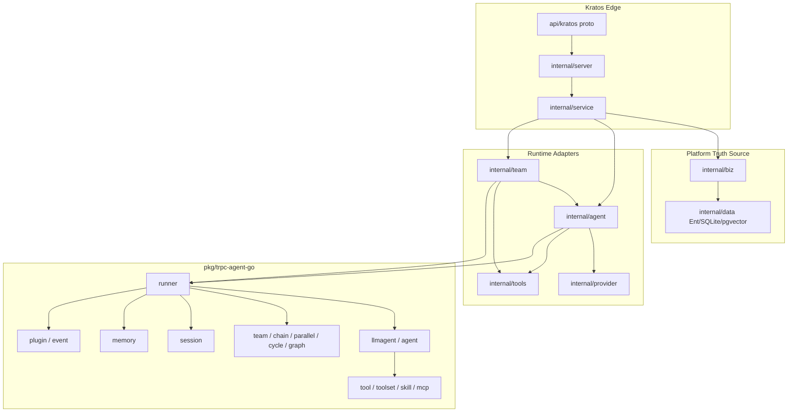

# tRPC-Agent-Go 标准化实施计划

> 文档地位：本文把 `pkg/trpc-agent-go` 作为 Agent 业务运行时标准，落地到 Aranea 当前 Kratos 工程中。后续涉及单 Agent、Team 多 Agent、Memory、Skills、Tools、MCP、Channel、Cron、Plugin、Telemetry 的实现、迁移和评审，均应对照本文与 [`AGENT_RUNTIME_BOUNDARY.md`](../AGENT_RUNTIME_BOUNDARY.md)。

---

## 1. 目标

Aranea 的工程边界保持不变：

- **Kratos**：负责 Web / gRPC / SSE 通信、鉴权与中间件、配置管理、业务数据持久化、前端 API 契约。
- **`internal/biz` + `internal/data`**：负责平台领域真相源，包括 Agent、Team、Session、Tool、Skill、MCP、Channel、Cron、Memory 等配置与状态。
- **`pkg/trpc-agent-go`**：负责 Agent 业务执行语义，包括 Runner、Agent、Session、Memory、Tool、ToolSet、Plugin、事件流、多 Agent 编排。
- **`internal/service` / `internal/team` / `internal/agent` / `internal/tools` / `internal/provider`**：作为薄适配层，把 Kratos 请求、biz DTO、平台配置转换为 tRPC-Agent-Go 的运行时对象，并把事件流投影回业务消息、SSE 与监控。

目标不是在业务层重写第二套 Planner、Tool Loop 或 Session 引擎，而是把平台配置和持久化能力稳定接到 tRPC-Agent-Go 的公开 API 上。

---

## 2. 当前现状与差距

当前仓库已经具备 Kratos 管理面和较完整的平台数据模型：

| 模块 | 当前落点 |
|------|----------|
| API 契约 | `api/kratos/**` |
| HTTP / gRPC / SSE | `internal/server` |
| 用例门面 | `internal/service` |
| 领域真相源 | `internal/biz` |
| Ent / SQLite / pgvector | `internal/data` |
| 单 Agent turn | `internal/service/adk_turn.go` |
| Team turn | `internal/team/runner_team_adk.go`, `internal/team/builder.go` |
| 工具 / Skill / MCP 装配 | `internal/tools/turn_mount.go` |
| 会话快照与记忆桥 | `internal/agent/adksvc`, `internal/agent/adk_memory*.go` |

主要差距：

1. **运行时 import 未统一**：文档约定 `pkg/trpc-agent-go` 优先，但当前 `internal/agent`、`internal/tools`、`internal/team`、`internal/provider` 仍大量使用 `google.golang.org/adk` 类型。
2. **Chat 与 Team 装配仍有重复**：单 Agent 与 Team 分别构造 Runner、BuilderDeps、TurnMount、事件投影，新增横切能力容易漏接。
3. **Memory 语义未完全闭环**：SQLite L0-L4、Runner Memory、Postgres pgvector 是三条并联能力，仍需统一到模型可见的持久化记忆能力。
4. **Cron 仍经 HTTP 回打聊天入口**：`internal/cronrunner` 通过 HTTP POST 分发，应收敛为直接调用统一运行时桥。
5. **Channel 运行时边界未标准化**：Channel 管理面已在 Kratos，入站消息应统一进入同一 Agent / Team runtime。

---

## 3. 强制规则

实现和评审时必须遵守 `.cursor/rules/trpc-agent-framework-first.mdc` 与运行时边界文档：

| 规则 | 要求 |
|------|------|
| 框架真相源 | Agent Runner、Session、LLM、Tool、ToolSet、事件流、多 Agent 编排先查 `pkg/trpc-agent-go`，禁止从 `pkg/backend` 或历史实现复制运行时逻辑。 |
| Server 禁止运行时 | `internal/server` 只注册 Kratos 路由、中间件、SSE，禁止构造 Runner、Agent、Tool。 |
| Biz 禁止运行时 | `internal/biz` 只表达配置、策略、DTO 和用例，不 import tRPC-Agent-Go 类型。 |
| Service 是桥点 | `internal/service` 把 RPC / HTTP 请求翻译为运行时调用，把事件流投影为 unary / SSE / 消息持久化。 |
| 领域适配拆包 | `internal/agent` 负责 Agent / Runner / Session / Memory 适配；`internal/provider` 负责模型；`internal/tools` 负责 Tool / ToolSet；`internal/team` 负责 Team 工作流。 |
| Tool 装配收口 | Service 不直接散装底层工具，必须经 `internal/tools` 的统一装配入口。 |
| Plugin 不直写库 | 框架 Plugin 可发事件、打点、附加上下文，不直接写 Ent / SQL；业务写库仍在 service / biz / repository。 |
| 不新起运行时 HTTP | A2A、AG-UI、Gateway 等如需暴露，应挂到 Kratos HTTP Server，不能绕开主进程另起独立监听。 |

---

## 4. 目标架构

核心原则：

- **Kratos 管配置和状态，tRPC-Agent-Go 管执行语义**。
- **业务表是真相源，运行时对象是每轮装配结果**。
- **Chat、Team、Channel、Cron 都进入同一运行时桥**。
- **Tool、Skill、MCP 以 Tool / ToolSet 形态统一暴露给 LLMAgent**。
- **Memory 以 tRPC-Agent-Go `memory.Service` 为模型可见接口，底层可组合 SQLite L0-L4 与 pgvector**。

---

## 5. Agent 业务模块升级映射

每个业务模块升级时，都应先判断它属于“平台真相源”还是“运行时执行语义”。平台真相源留在 Kratos / biz / data；运行时执行语义迁到 tRPC-Agent-Go 公开 API。

| 业务模块 | 平台真相源 | tRPC 执行落点 | 升级要求 | 验收口径 |
|----------|------------|---------------|----------|----------|
| Agent Catalog | `agents`, `agent_runtime_settings`, `agent_prompt_files` | `llmagent` / `agent.Agent` | Agent 表只保存身份、模型、prompt、运行策略；每轮由 `internal/agent` 构造运行时 Agent。 | 修改 Agent 配置后下一轮生效，无需重启专用 runtime。 |
| Single Agent Chat | `sessions`, `messages`, `usage`, `tool_invocation` | `runner.Run` + event stream | `internal/service` 只做请求翻译、事件投影、持久化；Tool / Memory / Plugin 交给 Runner。 | unary / SSE 行为一致，消息和 usage 落库兼容。 |
| Team / Multi-Agent | `teams.definition_json`, `team_run`, `team_run_step` | `team` / `chainagent` / `parallelagent` / `cycleagent` / `graphagent` | Team 定义映射到 tRPC 多 Agent 拓扑；成员按自身 Agent 策略装配能力。 | sequential / parallel / coordinator / critic_loop 均能按定义产生步骤和最终回复。 |
| Tools | `platform_tool`, Agent effective tools | `tool.Tool` | 工具元数据、启用策略在 biz；调用实现和 schema 由 `internal/tools` 适配成 Tool。 | 新增工具只注册一次，Chat / Team / Cron / Channel 共用。 |
| Skills | `platform_skill`, `skill_version`, Skill FS | Skill ToolSet | Skill 发布、版本、路由策略在平台；运行时通过 ToolSet 按需加载、选择 docs、执行脚本。 | Agent 只看到允许的 Skill，按 query 收窄后仍能调用。 |
| MCP | `mcp_server`, Agent `mcp:<server_key>` allow / deny | MCP ToolSet | Kratos 管 server 配置、密钥、启停、探测；运行时按 turn 挂载 ToolSet 并随 context 取消。 | 未启用 `mcp_tool_set` 不暴露 MCP；allow / deny 可控。 |
| Memory | SQLite L0-L4、Postgres pgvector、session summary | `memory.Service` + memory tools | 模型可见记忆统一经 tRPC MemoryService；底层可组合 sessionmemory 和 pgvector。 | `memory_load/search` 读到真实持久化记忆，后端缺失可降级。 |
| Provider / Model | `llm_provider_model`, pricing rules | `model.Model` | Provider 适配负责把平台配置转换成 tRPC Model；业务代码不绑定厂商协议。 | OpenAI-compatible、DeepSeek、Gemini 等经同一 registry 解析。 |
| Channel | `platform_channel`, credential, delivery | 统一 Chat / Team runtime bridge | Webhook 只做验签、解析、会话映射；实际回复进入同一 Runner 路径。 | 渠道消息与 Web Chat 具备一致工具、记忆、Team 能力。 |
| Cron | `cron_task`, `cron_task_run` | 统一 Chat / Team runtime bridge | Cron 不通过 HTTP 回打本进程；直接创建会话并调用运行时桥。 | 定时任务的输出、错误、usage 与普通会话一致。 |
| Plugin / Telemetry | monitor log、usage、trace id | `plugin` / event callbacks | Plugin 不直写库，使用事件或 service 投影；trace 从 Kratos context 贯穿到 Runner。 | 能从一次请求追踪到模型、工具、MCP、Team 成员事件。 |

模块升级顺序建议：先升级 **Agent / Provider / Runner** 基线，再升级 **Tools / Skills / MCP**，随后升级 **Memory / Team**，最后收敛 **Channel / Cron / Telemetry**。任何模块迁移中发现需要跨层访问运行时类型，应优先新增薄适配，而不是放宽 `biz` 或 `server` 依赖规则。

---

## 6. 阶段实施计划

### P0：运行时标准与导入边界

目标：确认 `pkg/trpc-agent-go` 是唯一 Agent 运行时标准，建立迁移红线。

主要工作：

- 在根 `go.mod` 中以当前仓库方式固定 `pkg/trpc-agent-go` 依赖或 replace 策略。
- 梳理 `google.golang.org/adk` 到 `trpc.group/trpc-go/trpc-agent-go` 的类型迁移表。
- 增加静态检查或 CI 脚本，禁止 `internal/server`、`internal/biz` import 运行时包。
- 标注当前允许的过渡 import 清单，避免迁移期间误判。

验收标准：

- 新增 Agent 运行时代码默认使用 tRPC-Agent-Go 类型。
- `internal/server`、`internal/biz` 仍保持运行时零 import。
- 文档中有清晰的“过渡期允许项”和“最终禁止项”。

### P1：运行时适配层

目标：先建薄适配，不直接大范围替换业务逻辑。

主要工作：

- 在 `internal/agent` 建立 TRPC Runner 构造入口：SessionService、MemoryService、ArtifactService、Plugins、UserID、RequestID。
- 在 `internal/provider` 提供 TRPC `model.Model` 适配，复用平台 `llm_provider_model` 配置。
- 在 `internal/agent` 建立事件投影工具，把 TRPC `event.Event` 映射到聊天消息、SSE delta、tool.call、tool.result、usage。
- 保留 Kratos service 方法签名与前端协议不变。

验收标准：

- 单元测试可用假 Agent / 假 Model 跑通 Runner。
- 事件投影不依赖 HTTP 层。
- 适配层之外不直接散落 Runner 构造逻辑。

### P2：单 Agent Chat 迁移

目标：把单 Agent 对话主路径切到 tRPC-Agent-Go Runner。

主要工作：

- 迁移 `BuildLLMAgent` 为 TRPC `llmagent.New(...)`。
- 迁移 `runSingleAgentViaADK` 的 Runner 调用、事件循环、usage 统计、SSE 投影。
- 保留 Intent Pass、`OptionsJSON`、用户消息与助手消息持久化逻辑。
- 将 `adk_snapshot_json` 的兼容策略明确：继续兼容旧字段，或新增 TRPC snapshot 字段后做迁移。

验收标准：

- 普通 chat unary / SSE 均可用。
- 工具调用事件可显示并落统计。
- 会话上下文、token usage、压缩触发逻辑保持兼容。

### P3：Tools / Skills / MCP 装配收口

目标：让所有模型可见能力通过统一 Tool / ToolSet 装配入口进入 LLMAgent。

主要工作：

- 迁移 `internal/tools` 输出 TRPC `tool.Tool` / `tool.ToolSet`。
- 将 builtin tools、workspace tools、shell、web_fetch、web_search、memory tools、subagent tool 统一注册。
- 将 Skill 运行时迁移为 TRPC Skill ToolSet，保持按 Agent `skill_runtime_json` 和用户 query 收窄。
- 将 MCP 运行时迁移为 TRPC MCP ToolSet，保持 `mcp_tool_set` 和 `mcp:<server_key>` allow / deny 策略。
- Chat 与 Team 均只调用统一 `TurnMount` 或后继 facade。

验收标准：

- 新增工具只需在 `internal/tools` 注册一次，Chat / Team 同时生效。
- `internal/service` 不直接构造底层工具。
- Skill / MCP 的 enable、allow、deny、status、deleted_at 策略有用例覆盖。

### P4：Memory 闭环

目标：模型可见记忆与平台持久化记忆一致。

主要工作：

- 实现 TRPC `memory.Service` 的平台适配，底层读取 SQLite sessionmemory 与可选 pgvector。
- 明确 L0-L4 的职责：L0 上下文装配、L1 working、L2 episodic、L3 semantic facts、L4 persistent identity / graph。
- 将 `memory_load` / `memory_search` 等工具挂到真实持久化后端。
- 设计会话结束或 turn 完成后的异步记忆写入，不在 Plugin 中直连写库。

验收标准：

- 模型调用 memory tool 时可读到真实持久化数据。
- Memory API 仍可作为观测面查询 L0-L4。
- pgvector 不可用时系统可降级到 SQLite / 空结果，而不是运行时崩溃。

### P5：Team 多 Agent 迁移

目标：Team 模块统一使用 tRPC-Agent-Go 多 Agent 能力。

主要工作：

- 将 `definition_json` 的 `sequential` 映射到 chain / sequential workflow。
- 将 `parallel` 映射到 parallel agent，并保留 synthesizer 语义。
- 将 `coordinator` / `adaptive` 映射到 TRPC Team coordinator 或 Graph。
- 将 `critic_loop` 映射到 cycle / graph，显式保留最大迭代与终止条件。
- 每个成员按自己的 Agent 配置装配 Tools、Skills、MCP、Memory。

验收标准：

- 现有 Team API、SSE、`team_run`、`team_run_step` 行为兼容。
- 成员级 Skill / MCP 策略不会被首位成员覆盖。
- 并行模式遵守 `max_concurrency` 与写冲突约束。

### P6：Channel 与 Cron 收敛

目标：所有非 Web 入口也进入同一运行时桥。

主要工作：

- Channel 入站消息解析后创建 / 复用 Session，并调用统一 Chat / Team runtime。
- Cron Runner 不再通过 HTTP POST 回打本服务，改为调用 service 或运行时桥。
- Channel / Cron 的消息来源、触发器、外部平台 message id 写入消息 metadata。

验收标准：

- Web Chat、Channel Webhook、Cron 触发的 Agent turn 使用同一 Runner 装配路径。
- Cron 失败、Channel 投递失败均有业务表记录与可观察错误。
- 不再依赖 `LEGACY_REST_ORIGIN` 完成内部调度。

### P7：观测、治理与资源生命周期

目标：生产可诊断、可取消、可计费。

主要工作：

- 将 Kratos trace id / user id / session id / run id 注入 Runner context。
- Tool / Skill / MCP / Model 调用生成统一 monitor log 和 usage 记录。
- MCP stdio 子进程、ToolSet、临时 workspace 按 turn 生命周期关闭。
- 统一超时、取消、重试、错误码映射。
- 加入针对有效工具、Skill 子集、MCP server allow / deny、Team 并发的契约测试。

验收标准：

- 一个请求可从 HTTP 入口追到模型、工具、MCP、Team 成员事件。
- 客户端断开或超时不会泄漏 MCP 子进程 / ToolSet 资源。
- 用户可见错误由 service 映射为 Kratos errors。

### P8：清理旧运行时与命名

目标：移除 ADK 形态残留，完成 tRPC-Agent-Go 标准化。

主要工作：

- 删除或隔离 `google.golang.org/adk` import。
- 将 `adk_*` 文件和字段按兼容策略改名，保留数据库字段迁移说明。
- 更新 `.cursor/rules`、`docs/AGENT_RUNTIME_BOUNDARY.md`、`docs/AGENT_SKILLS_TOOLS_MCP_MEMORY.md` 中过渡描述。
- 为禁止 import 增加 CI 检查。

验收标准：

- `internal/**` 的 Agent 执行链只依赖 tRPC-Agent-Go 公开 API。
- 历史字段有迁移说明或兼容适配。
- 文档、规则、代码 import 三者一致。

---

## 7. 交付顺序

推荐拆分为以下 PR / 迭代：

| 迭代 | 内容 |
|------|------|
| I1 | P0 + P1：标准、适配层、假模型跑通 Runner。 |
| I2 | P2：单 Agent Chat 切 TRPC，SSE 与消息持久化兼容。 |
| I3 | P3：Tools / Skills / MCP 统一装配。 |
| I4 | P4：MemoryService 平台适配，memory tools 可读真实数据。 |
| I5 | P5：Team 顺序 / 并行 / 循环 / coordinator 切 TRPC。 |
| I6 | P6：Channel / Cron 收敛到统一 runtime。 |
| I7 | P7 + P8：观测、资源生命周期、旧 import 清理、CI 红线。 |

依赖关系：

- P0 是所有阶段前置。
- P1 是 P2 / P5 的前置。
- P3 应在 P2 后尽快完成，否则 Chat / Team 会再次分叉。
- P4 依赖 P1 的 Runner 构造集中化。
- P6 依赖 P2 / P5 的统一运行时入口。
- P7 贯穿全程，但最终验收应在 P3 之后加强。

---

## 8. PR 自检清单

每个涉及 Agent runtime 的 PR 必须检查：

- [ ] 是否通过 `make runtime-boundary` 或 `scripts/check-runtime-boundary.ps1`。
- [ ] 是否先查 `pkg/trpc-agent-go` 公开 API，而不是复制旧 runtime 逻辑。
- [ ] 是否没有在 `internal/server` 新增 Runner / Agent / Tool import。
- [ ] 是否没有在 `internal/biz` 新增 tRPC-Agent-Go import。
- [ ] 是否经 `internal/tools` 装配工具，而不是在 service 中散装工具。
- [ ] 是否保持 Kratos API / proto / 前端协议兼容，或明确写出迁移影响。
- [ ] 是否有取消、超时、资源关闭策略。
- [ ] 是否有 usage、monitor log、SSE 或持久化事件的投影说明。
- [ ] 是否补充或更新相关文档与测试。

---

## 9. 文件索引

| 主题 | 文件 |
|------|------|
| 运行时边界 | [`docs/AGENT_RUNTIME_BOUNDARY.md`](../AGENT_RUNTIME_BOUNDARY.md) |
| Skill / Tool / MCP / Memory 当前装配 | [`docs/AGENT_SKILLS_TOOLS_MCP_MEMORY.md`](../AGENT_SKILLS_TOOLS_MCP_MEMORY.md) |
| 平台架构总纲 | [`docs/design/platform-architecture.md`](./platform-architecture.md) |
| Agent 编排总体设计 | [`docs/design/agent-orchestration-total-design.md`](./agent-orchestration-total-design.md) |
| 单 Agent turn | [`internal/service/adk_turn.go`](../../internal/service/adk_turn.go) |
| Team turn | [`internal/team/runner_team_adk.go`](../../internal/team/runner_team_adk.go) |
| Team workflow builder | [`internal/team/builder.go`](../../internal/team/builder.go) |
| 工具装配 | [`internal/tools/turn_mount.go`](../../internal/tools/turn_mount.go) |
| tRPC-Agent-Go 框架 | [`pkg/trpc-agent-go`](../../pkg/trpc-agent-go) |
