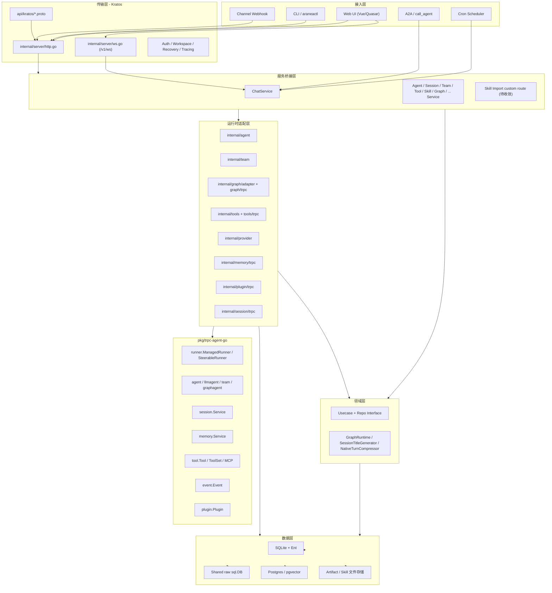
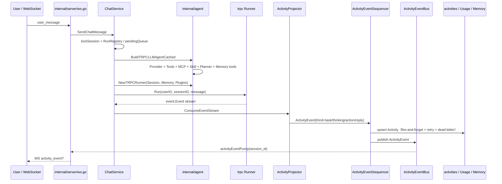
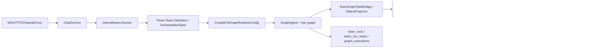
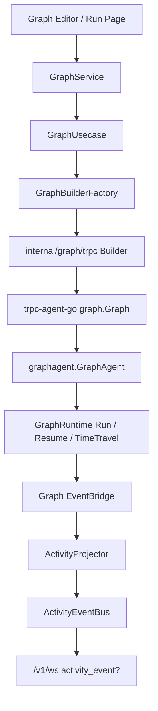
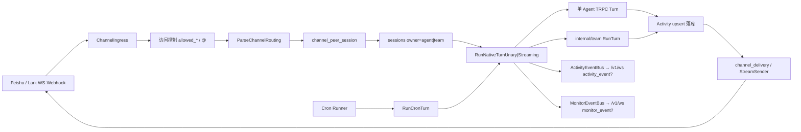
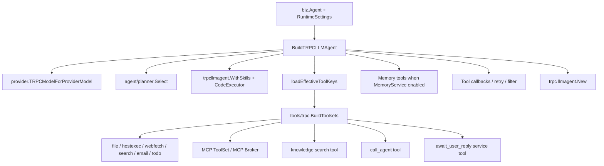
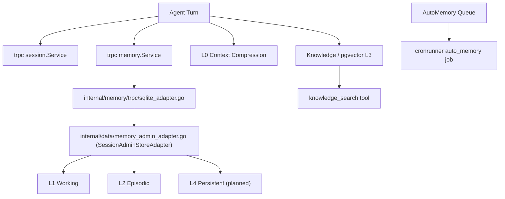
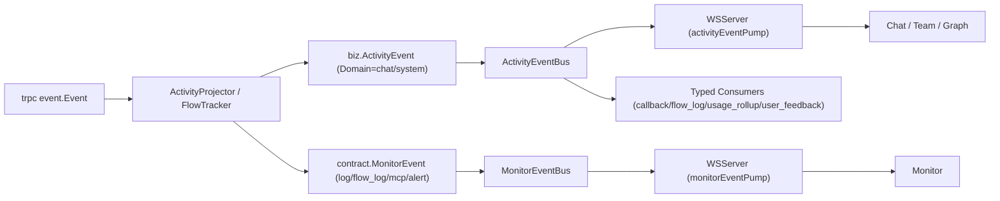

# Aranea-Agents 系统架构总览

> 本文档是当前项目的系统级"真理库"。AI 在实现任何模块前，应先阅读 `docs/development/README.md`，再阅读本文确认模块位置、依赖方向和运行时边界，最后读取对应模块的需求、设计与开发计划。
>
> **更新时间**：2026-06-17  
> **基线**：Kratos v2 负责传输与 DI，`pkg/trpc-agent-go` 负责 Agent 运行时。OpenClaw 只作为产品化装配参考，不复制其单体 `app.go`、HTML Admin 或渠道栈。
>
> **文档性质**：设计文档（架构设计、代码分层、模块关系、序列图）。开发进度、任务清单、状态标记见 [0-system.development.md](./0-system.development.md)。

## 一、系统定位

Aranea-Agents 是基于 `trpc-agent-go` 的企业级多 Agent 编排平台。它提供 Agent / Team / Graph 三类编排、WS 实时事件、Session、五层记忆、知识库、工具 / MCP / Skill / Plugin、Cron、Channel、Monitor、Evaluation、Artifact 与 A2A 能力。

当前系统已经形成可运行主链路：Web / Channel / Cron 进入 `ChatService`，由 `internal/agent` 和 `internal/team` 装配 `trpc-agent-go` Runner，运行事件投影到 `internal/event`，再通过 `/v1/ws` 推送给前端。

## 二、分层架构图

## 三、依赖方向红线

| 边界 | 允许 | 禁止 | 当前健康度 |
|------|------|------|------------|
| `internal/server` | 注册 proto service、WS、少量基础设施路由 | 直接调用 Runner / Agent / LLM | 基本健康；`service/skill_import_http.go` 仍绕过 proto service |
| `internal/service` | proto ↔ biz 映射；组装 `trpc-agent-go` 运行时；投影事件 | 直接承载大量业务状态机 | 中等；运行控制已抽 `internal/runtime.RunRegistry`，待 RunnerManager 统一入口 |
| `internal/biz` | 领域模型、Usecase、Repo 接口、运行时端口接口 | import `pkg/trpc-agent-go`、import `internal/agent/team/trpc` | 健康；未发现 trpc 直接导入 |
| `internal/data` | Repo 实现、Ent / SQL / pgvector | 过多运行时框架绑定 | 中等；`data.go` 绑定 trpc session / graph checkpoint |
| `internal/agent/team/graph/tools/provider/*/trpc` | 框架适配、Builder、Runner、ToolSet、Plugin、Memory bridge | 复制 `pkg/trpc-agent-go` 内部实现 | 健康 |
| `web/src` | `pages -> features/stores -> services` | 领域类型散落到 components；store/API 双轨长期并存 | 中等；需统一 feature 模板 |

## 四、模块职责矩阵

> 模块当前完整度与开发状态见 [0-system.development.md](./0-system.development.md)。

| 域 | 模块 | 主要职责 | 代码锚点 |
|----|------|----------|----------|
| 核心运行 | Chat(1) | 对话入口、WS 上行、Runner 调用、待执行队列、用量 | `internal/service/chat.go`、`internal/service/chat_orchestrator_turn.go` |
| 核心运行 | Runner(40) | ManagedRunner / SteerableRunner 对齐、运行控制 | `internal/agent/trpc_runtime.go`、`internal/runtime/run_registry.go`、`internal/runtime/runner_manager.go` |
| 核心运行 | Session(10) | 会话、消息、标题、压缩、trpc session 适配 | `internal/biz/session/usecase.go`、`internal/session/trpc` |
| 核心运行 | Provider(9) | 模型目录、厂商配置、HA、Inspect | `internal/provider`、`internal/biz/llm_provider_model.go` |
| 编排 | Agent(2-8) | 创建、列表、分类、设置、文件、进化、标题、头像 | `internal/biz/agent_*`、`web/src/pages/AgentSettingsPage.vue` |
| 编排 | Team(11) | 多 Agent 编排、五种模式、运行轨迹 | `internal/team`、`internal/service/team.go` |
| 编排 | Graph(36) | 确定性工作流、Checkpoint、HITL、Task | `internal/graph`、`internal/service/graph.go` |
| 能力 | Tools(23) | 工具目录、Agent 绑定、运行时挂载 | `internal/tools`、`internal/tools/trpc` |
| 能力 | MCP(19) | 外部 MCP Server、Broker、健康探活 | `internal/mcp/*`、`agent/tool_assembly`、`tools/toolset` |
| 能力 | Skill(20) | Skill 包、导入、运行时工具、CodeExecutor | `internal/skill`、`internal/service/skill_import.go`、`internal/service/skill_import_http.go` |
| 能力 | Plugin(22) / Callback(28) | Runner 横切插件、Agent/Tool/Model 回调 | `internal/plugin/trpc`、`internal/agent/callbacks` |
| 记忆知识 | Memory(12-16) | L0-L4、trpc MemoryService、MemoryWorker | `internal/data/memory_admin_adapter.go`（SessionAdminStoreAdapter）、`internal/memory/trpc`、`internal/runtime/memory_set.go`（MemorySet） |
| 记忆知识 | Knowledge(37) | 文档摄取、chunk、embedding、检索工具 | `internal/knowledge`、`internal/biz/knowledge.go` |
| 文件 | Artifact(27) | 产物存储、版本、Runner 注入 | `internal/artifact/trpc`、`internal/data/artifactfs` |
| 自动化 | Cron(21) | 定时触发 Agent / Team | `internal/cronrunner`、`internal/service/cron.go` |
| 接入 | Channel(17) | 外部 IM 接入、Webhook、投递 | `internal/channel`、`internal/service/channel_ingress.go` |
| 观测 | Event(34) | ActivityEvent、MonitorEvent、ActivityEventBus、MonitorEventBus、WS 2 pump | `internal/event`、`internal/server/ws.go` |
| 观测 | Monitor(18) / Telemetry(24) / Token(29) | Audit、Events、Logs、Usage、metrics、OTLP | `internal/metrics`、`internal/telemetry`、`internal/biz/usage.go` |
| 互通 | A2A(26) | 对外 A2A、call_agent、远程互通 | `internal/a2a`、`api/kratos/a2a` |
| 评测 | Evaluation(33) | EvalSet、Runner、LLM Judge、结果 | `internal/evaluation` |
| 平台 | Ecosystem(30) | 市场、模板、扩展发现 | `web/src/pages/EcosystemPage.vue` |
| 媒体 | MediaProvider(38) | 文生图/文生视频/图生视频；独立 Provider 体系（非 LLM），支持 Qwen / ComfyUI 本地 | `internal/provider/media`、`internal/tools/media` |
| 观测 | Observation View(39) | Chat UI 内 ComfyUI 风格成员节点实时观测画布；Vue Flow DAG + 节点级媒体预览 | `web/src/components/chat/observe`、`web/src/stores/chat/nodeOutputStore.ts` |

## 五、核心运行链路

### 5.1 单 Agent 对话

> **ADR-02 + ADR-03 后**：trpc `event.Event` 经 `ActivityProjector` 投影为 `biz.ActivityEvent`（Domain=chat），由 `ActivityEventSequencer` 并行异步持久化到 `activities` 表 + 同步 publish 到 `ActivityEventBus`；WS 通过 `activityEventPump` 推送 `activity_event?` 给前端。Envelope/EventBuffer/ChatMessage 已删除。

### 5.2 Team 对话

> **M53 Phase 7**：Team Run 默认经 `CompileToGraphRuntimeConfig` → `GraphAgent` 执行；Native `BuildTRPCTeam` 仅 `ARANEA_TEAM_NATIVE=1` 应急。详见 [53-team-graph-orchestration-development.md](./53-team-graph-orchestration-development.md)。

### 5.3 Graph 工作流

### 5.4 Channel 与 Cron 入口

Channel 将外部 IM（飞书 WS/Webhook 等）标准化为入站事件，经 **路由** 选定 **Agent 或 Team**，通过 `channel_peer_session` 绑定 **Session**，再与 Web Chat 共用 `ChatService.RunNativeTurn*`。出站仅回发助手文本（或流式 PATCH）；实时 ActivityEvent 走 ActivityEventBus，监控事件（log/flow_log）走 MonitorEventBus，供 Web/Monitor 按 `session_id` 订阅。详见 [17-channel-agent-team-integration.md](./17-channel-agent-team-integration.md)。

## 六、工具挂载链

## 七、记忆系统关系

需要统一的概念：`trpc-agent-go/memory.Service` 是 Runner 层跨会话记忆接口；Aranea L0-L4 是产品级记忆模型。后续开发应明确由 Aranea L0-L4 提供框架 MemoryService 适配，而不是长期双轨。记忆运行时端口聚合在 `internal/runtime/memory_set.go`（`MemorySet`）。

## 八、WebSocket 与事件架构

> **统一总线架构（ADR-03 Phase 5 已完成，2026-06-27）**：legacy Envelope Bus / SessionBus / MonitorBus 已全部删除。当前为 2 bus 架构：`ActivityEventBus`（传输 `biz.ActivityEvent`，承载 chat + system 事件）+ `MonitorEventBus`（传输 `contract.MonitorEvent`，承载监控事件）。详见 ADR-03。

当前实时传输主通道是 `/v1/ws`。独立 Chat SSE `/v1/chat/messages/stream` 与独立 SSE 端口已经从主链路移除；文档中仍出现的 SSE 表述应改为“历史兼容概念”或“外部协议 SSE（如 A2A/MCP）”，不得写作当前 Chat/Team 主通道。

## 九、架构健康度诊断

> 本节描述架构层面的问题与康复方向，作为架构评估。具体优先级、任务排期与开发状态见 [0-system.development.md](./0-system.development.md)。

| 编号 | 问题 | 影响 | 康复方向 |
|------|------|------|----------|
| AH-01 | 系统级总览、执行计划曾为空 | AI 缺少真理库，容易读错旧需求 | 本文 + `0-system.development.md` + `execution-plan.md` 作为总基线 |
| AH-02 | `ChatService` 曾承载 Gateway 状态机 | 并发、取消、排队逻辑难复用 | `RunRegistry` + `RunnerManager` + `ChatUsecase`；Chat/Team/Cron/Channel 共用 `RunGateway`；出站 Webhook；`PendingMessageQueue` 仍在 Service |
| AH-03 | `service/agent` 直连 `SessionAdminStore` | 记忆读写双路径，schema 变化风险高 | 下沉到 `biz.MemoryUsecase` 或定义 infra 端口 |
| AH-04 | `internal/data` 绑定 trpc session / graph checkpoint | Data 层测试和替换存储受运行时影响 | 将框架 adapter provider 上移到 `internal/runtime` / Wire |
| AH-05 | `service/skill_import_http.go` 绕过 proto service | 鉴权、观测、API 契约分叉 | 扩展 `skill.proto`，迁入 `SkillService` |
| AH-06 | `biz` 与 `provider` 形成双向依赖 | LLM inspect 与模型目录边界不稳 | 抽 `internal/llminspect` 或 biz 端口接口 |
| AH-07 | Runner 生命周期 | Artifact/Ingestor 已挂；GetRunStatus 对齐 ManagedRunner | `setRunStatus` / `StopGeneration` 与 `ChatUsecase.SetRunStatus` 双路径；ManagedRunner Cancel 未统一写 registry 终态 |
| AH-08 | 前端 store/API/mapper 三套风格并存 | UI 迭代易重复、测试不能覆盖真实 mapper | 统一 feature 模板、抽 `mappers.ts`、删除空转 store |
| AH-09 | Knowledge / Evaluation / Artifact / A2A / **Gateway Webhook** 有 API 无管理页 | 模块闭环不完整 | 按模块补路由、页面和导航，或文档降级为 API-only（Gateway Webhook CRUD 当前 API-only） |
| AH-10 | Monitor/Message/Team 旧 SSE 口径残留 + Envelope 通用信封残留 | AI 可能实现错误传输链路（误用 Envelope/EventBus/EventProjector/EventBuffer） | ✅ ADR-02 + ADR-03 已完成：legacy Envelope/SessionBus/MonitorBus 全部删除；统一为 `ActivityEvent`（chat+system）+ `MonitorEvent`（log/flow_log/mcp/alert）双类型；2 bus/2 pump 架构（`ActivityEventBus` + `MonitorEventBus`）；`EventProjector` → `ActivityProjector`；`EventBuffer` replay 由 `ListActivities` RPC 替代；`messages`/`event_store`/`event_wal` 表已 DROP；详见 ADR-03 |

## 十、AI 开发读取顺序

1. `docs/README.md`
2. 本文档
3. `docs/development/0-system.development.md`
4. `docs/guides/execution-plan.md`
5. 目标模块的 `需求/*.md`、`*.design.md`、`*-development.md`
6. 框架相关任务先读 `docs/guides/trpc-agent-go-framework.md` 与 `pkg/trpc-agent-go` 对应包；Channel/Gateway 对照 OpenClaw 时只读 `pkg/trpc-agent-go/openclaw` 作为参考

## 十一、当前真理库摘要

- `pkg/trpc-agent-go` 是 Runner / Agent / Session / Memory / Tool / Event / Plugin / Team / Graph / A2A / Evaluation 的框架真相源。
- `internal/service` 是传输到运行时的桥点；`internal/biz` 不 import `trpc-agent-go`。
- `/v1/ws` 是 Chat / Team / Graph / Monitor 的实时主通道。
- Agent / Team 主运行链路已可用；Graph 核心已可用；Tools/MCP/Skill/Plugin 基础已可用。
- 最大架构债不是"缺少模块"，而是横切状态机、记忆双轨、Data 运行时耦合、前端模式分裂和旧文档口径漂移。

## 十二、目标架构：乐高式模块模型

每个模块都应被定义为一个可组合"积木"，包含五个面：

| 面 | 必须回答的问题 | 产物 |
|----|----------------|------|
| Contract | 对外承诺是什么？ | `api/kratos/*.proto`、前端 `types.ts` |
| Domain | 领域规则在哪里？ | `internal/biz/*Usecase`、Repo 接口 |
| Runtime | 是否需要接入 `trpc-agent-go`？ | `internal/<domain>/trpc` 或 `internal/agent/team/tools` |
| Persistence | 状态在哪里？ | `internal/data`、Ent schema、文件/向量存储 |
| UI/Operate | 用户如何配置、运行、观测？ | `web/src/features/<domain>`、page、store、monitor |

AI 新增或优化模块时，必须先填这五个面。缺任一面则只能标为 API-only、runtime-only 或 UI-mock，不能标为"完成"。

## 十三、架构原则

所有模块设计必须遵循以下原则：

1. **框架真相源**：`pkg/trpc-agent-go` 是 Agent 运行时的唯一真相源，先查框架 API 后再实现
2. **四层分层**：Server → Service → Biz → Data，跨层只允许向内依赖
3. **端口-适配器**：biz 层定义接口，data 层实现，框架依赖收口在 agent/tools 层
4. **Agent 运行时铁律 A1-A6**：所有 Agent 必须实现 agent.Agent 接口、事件发射走 EmitEvent、工具构建走 NewFunctionTool 等
5. **Wire DI**：每层一个 ProviderSet，禁止手动编辑 wire_gen.go
6. **safego**：所有 goroutine 必须走 `pkg/safego.Go`
7. **日志**：统一使用 `pkg/loggateway.Logger`，禁止 `log/slog`；`event.SysLog*` 已废弃
