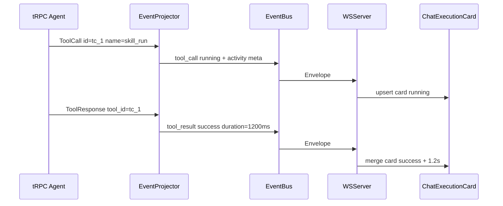
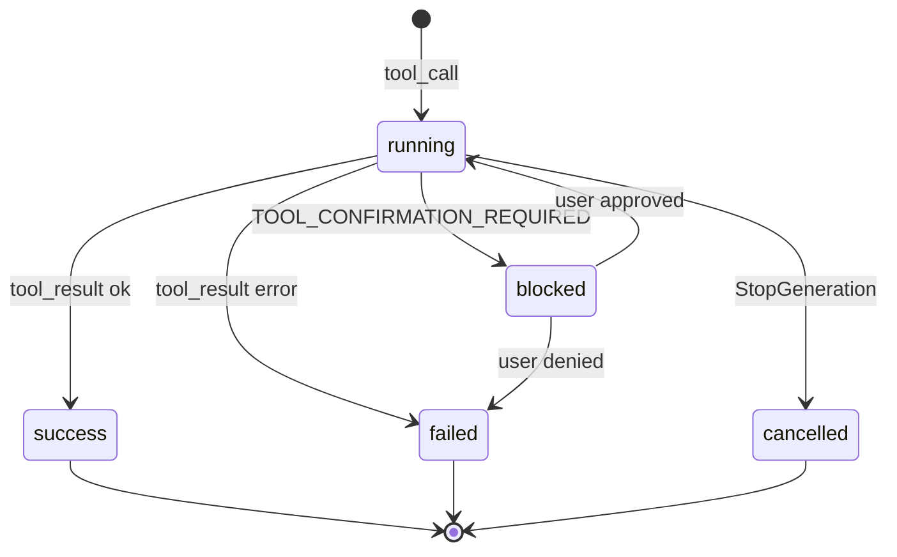

# Chat 执行过程卡片 — 技术设计

> **版本**：2026-05-20  
> **对应需求**：[1 chat-execution-trace.md](./1%20chat-execution-trace.md)  
> **遵循**：[AI-DEVELOPMENT-SPECIFICATION.md](../guides/AI-DEVELOPMENT-SPECIFICATION.md) · [AGENT_RUNTIME_BOUNDARY.md](../AGENT_RUNTIME_BOUNDARY.md) · [frontend-guide.md](../guides/frontend-guide.md) · `aranea-frontend-guide` SKILL §6
> **关联**：[1 chat.design.md](./1%20chat.design.md) · [52-flow-logger.design.md](./52-flow-logger.design.md) · [23 tools.design.md](./23%20tools.design.md)

---

## 1. 设计原则

1. **复用 WS Envelope 主通道**：不新增 HTTP 轮询；实时与回放均走 `/v1/ws` + EventBuffer（与 [1 chat.design.md §5.5](./1%20chat.design.md) 一致）。
2. **框架边界不变**：`internal/biz` 不 import `pkg/trpc-agent-go`；投影在 `internal/agent/event_projector.go`，组装在 `internal/service/trpc_turn.go`。
3. **与 Monitor 分流**：`flow_log` → Monitor；`tool_call` / `tool_result`（增强元数据）→ Chat。`TraceEmitter.ObserveFrameworkEvent` 继续写 Span 供 Usage / Traces，**不**把 FlowLog 正文塞进 Chat。
4. **一张调用一张卡片**：以 `tool_call_id`（框架 ToolCall.ID）为 upsert 键；`tool_call` 创建 running 态，`tool_result` 合并完成态。
5. **默认折叠、按需展开**：UI 层约束；协议层携带完整 `arguments_json` / `result_json`。
6. **向后兼容**：在现有 `EnvelopeToolCall` 上**扩展 optional 字段**；旧客户端忽略新字段仍可显示名称 + 状态。

---

## 2. 现状与差距

| 能力 | 现状 | 差距 |
|------|------|------|
| WS 事件 | `tool_call` / `tool_result` 已投影 | `tool_result` 缺少稳定 `id/name` 时 upsert 失败；无 `activity_kind` / 展示名 |
| 前端 | `ChatToolCallCard.vue` + `upsertToolMessage` | 参数区 **默认展开**（`details open`）；Skill/MCP 无专用图标与摘要 |
| 持久化 | `options_json.tool_event` 写入 Message | 无独立 `message_kind`；历史加载依赖 markdown 旁路 |
| Skill / MCP | 走统一 ToolCall 名 | 需映射 `display_label`、`icon_key`、摘要行 |
| Team | `author` 在 Envelope | 卡片未统一展示成员 |
| Monitor | FlowLog 完整 | 与 Chat 用户视图需隔离（已违反时会 toast flow 错误） |

本设计在**不新增 EnvelopeType** 的前提下，完成 v2 元数据扩展 + 前端卡片规范化（P0）；可选 P1 引入 `activity` 别名类型见 §5.3。

---

## 3. 架构总览

```text
trpc-agent-go Runner
  → framework Event (ToolCall / ToolResponse)
       │
       ▼
internal/agent/event_projector.go
  ├─ projectChatCompletionChunk → tool_call Envelope (status=calling→running)
  ├─ buildToolResultEnvelope    → tool_result Envelope (id/name/duration/status)
  └─ enrichActivityMeta()       ← 新增：kind/label/icon/summary/脱敏
       │
       ▼
internal/event.EventBus → internal/server/ws.go → 前端 WS
       │
       ├─ useChatWorkspace: upsertToolMessage(tool_call|tool_result)
       └─ ChatMessagePanel: ChatExecutionCard (默认折叠)

并行（不进入 Chat UI）：
internal/event/trace_emitter.go → flow_log (monitor) + spans → usage.metadata_json
```



---

## 4. 数据模型

### 4.1 ActivityKind 枚举

| `activity_kind` | 判定规则（优先级从高到低） |
|-----------------|---------------------------|
| `skill` | `name` ∈ `skill_load`,`skill_run`,`skill_search`,`use_skill` 或前缀 `skill_` |
| `mcp` | `name` ∈ `mcp_call`,`mcp_list_tools`,`mcp_list_servers`,`mcp_inspect_tools` 或 MCP ToolSet 前缀 `mcp:` |
| `subagent` | `transfer_to_agent`,`spawn_subagent`,`call_agent` |
| `memory` | `load_memory`,`preload_memory`,`memory_*`,`working_memory.*` |
| `knowledge` | `knowledge_search` |
| `session` | `await_user_reply` |
| `tool` | 默认 |

实现位置：`internal/agent/activity_meta.go`（新建，纯函数，可单测）。

### 4.2 EnvelopeToolCall v2 扩展字段

在 [`internal/event/envelope.go`](../../internal/event/envelope.go) 的 `EnvelopeToolCall` 增加 **optional JSON 字段**（向后兼容）：

```go
type EnvelopeToolCall struct {
    ID            string `json:"id"`
    Name          string `json:"name"`
    ArgumentsJSON string `json:"arguments_json"`
    ResultJSON    string `json:"result_json,omitempty"`
    Status        string `json:"status"`
    DurationMS    int64  `json:"duration_ms,omitempty"`
    IsLongRunning bool   `json:"is_long_running,omitempty"`

    // --- v2 Chat execution trace ---
    ActivityKind  string `json:"activity_kind,omitempty"`  // skill|mcp|tool|...
    DisplayLabel  string `json:"display_label,omitempty"`  // 卡片标题
    IconKey       string `json:"icon_key,omitempty"`       // Quasar icon name
    Summary       string `json:"summary,omitempty"`        // 折叠态副标题
    StartedAt     string `json:"started_at,omitempty"`     // RFC3339
    FinishedAt    string `json:"finished_at,omitempty"`
    ErrorCode     string `json:"error_code,omitempty"`
    AgentKey      string `json:"agent_key,omitempty"`      // Team 成员
    AgentName     string `json:"agent_name,omitempty"`
    RunID         string `json:"run_id,omitempty"`
    TraceID       string `json:"trace_id,omitempty"`
}
```

`tool_call` 与 `tool_result` **均携带相同 `id`**；result 侧填充 `duration_ms`、`finished_at`、`result_json`。

### 4.3 前端 ToolUseEvent v2

扩展 [`web/src/features/chat/types.ts`](../../web/src/features/chat/types.ts) 中 `ToolUseEvent`：

```typescript
export type ActivityKind = "tool" | "skill" | "mcp" | "subagent" | "memory" | "knowledge" | "session";

export type ToolUseEvent = {
  // ...现有字段...
  activity_kind?: ActivityKind;
  display_label?: string;
  icon_key?: string;
  summary?: string;
  started_at?: string;
  finished_at?: string;
  error_code?: string;
  run_id?: string;
  trace_id?: string;
  /** UI-only: 用户是否展开详情，不持久化到后端 */
  expanded?: boolean;
};
```

映射函数：[`envelopeToolCall.ts`](../../web/src/features/chat/envelopeToolCall.ts) 的 `envelopeToToolEvent` 读取 v2 字段。

### 4.4 持久化（messages 表）

**策略**：沿用 `messages` 行 + `options_json` 嵌入结构化事件（与现网 `tool_event` 一致），不新增表。

| 字段 | 值 |
|------|-----|
| `role` | `assistant` |
| `status` | `tool_running` / `tool_success` / `tool_failed` |
| `content_markdown` | 简短 fallback 文本（供搜索 / 纯文本客户端） |
| `options_json` | `{ "schema": "chat.activity/v1", "tool_event": { ...ToolUseEvent } }` |
| `latency_ms` | 完成后写入 `duration_ms` |

**稳定主键**：`message.id = "act-" + tool_call_id`（取代当前 `tool-{agent}-{name}` 组合，避免同名工具重复）。

**落库时机**（Service 层，非 biz）：

1. `tool_result` 投影后、WS 发布前：异步写入或随 turn 结束批量写入（与 assistant 消息同一事务，见 [1 chat.design.md §5.7](./1%20chat.design.md)）。
2. `running` 态可选择**仅 WS 不落库**，刷新后只见已完成卡片（P0 可接受）；P1 增加 `tool_running` 行软删除或 turn 结束清理。

---

## 5. Envelope 协议

### 5.1 事件类型（不变）

| type | 触发 | status |
|------|------|--------|
| `tool_call` | LLM 发起 function call | `calling` → 前端归一化为 `running` |
| `tool_result` | 工具返回 | `success` / `failed` |

### 5.2 Metadata 双写（可选）

`Envelope.Metadata` 冗余常用字段便于过滤 / 日志：

```json
{
  "activity_kind": "skill",
  "display_label": "skill_run",
  "run_id": "run_...",
  "trace_id": "tr_..."
}
```

### 5.3 备选：EnvelopeType `activity`（P2，非 P0）

若未来 tool_call/tool_result 语义过载，可新增：

- `activity_start` / `activity_update` / `activity_end`

P0 **不采用**，避免前后端与 EventBuffer 大规模迁移。

---

## 6. 展示映射

### 6.1 图标（Quasar `icon`）

| activity_kind | icon | 备注 |
|---------------|------|------|
| `tool` | `build` | 通用工具 |
| `skill` | `auto_awesome` | Skill |
| `mcp` | `hub` | MCP |
| `subagent` | `group` | 子 Agent |
| `memory` | `psychology` | 记忆 |
| `knowledge` | `menu_book` | 知识库 |
| `session` | `forum` | 等待用户 |

按 `name` 细化（可选覆盖）：

| name | icon |
|------|------|
| `read_file` / `save_file` | `description` |
| `exec_command` / `workspace_exec` | `terminal` |
| `skill_run` | `play_circle` |
| `skill_load` | `download` |

### 6.2 DisplayLabel 解析

```
1. tools 表 display_name（ToolUC.GetTool，按 catalog key 或 runtime alias 反查）
2. stepTitleRegistry 风格内置 map（skill_run →「运行 Skill」）
3. runtime name 原样
```

实现：`internal/agent/activity_label.go` + 注入 `ToolUC` / 内存 registry。

### 6.3 Summary 一行摘要

| kind | 规则 |
|------|------|
| file tools | `` `path` `` from arguments.path |
| shell | command 前 80 字符 |
| skill | arguments.skill / skill_name |
| mcp | `server_key` + `/` + `tool_name` |
| knowledge | collection_id + query 前 40 字符 |

---

## 7. 后端实现要点

### 7.1 EventProjector

文件：[`internal/agent/event_projector.go`](../../internal/agent/event_projector.go)

| 函数 | 变更 |
|------|------|
| `projectChatCompletionChunk` | `tool_call` 填充 `StartedAt`、`ActivityKind`、`DisplayLabel`、`Summary`；`Status=calling` |
| `buildToolResultEnvelope` | 必须带 `ToolID`、`ToolName`、`DurationMS`；失败读 `Response.Error` |
| `enrichActivityMeta`（新） | 集中 kind/label/icon/summary + 脱敏 |

**脱敏**：复用 [`internal/service/tool.go`](../../internal/service/tool.go) 或 `biz` 层既有 `sanitize` 规则；对 `arguments_json` / `result_json` 中 key 名含 `password|secret|token|api_key` 的值替换为 `***`。

### 7.2 与 TraceEmitter 协作

- `ObserveFrameworkEvent` 已记录 `tool.call` span；扩展 attrs：`tool_name`、`activity_kind`、`status`。
- **禁止** `LogError(chat.usage_record|system.agent.tool_build)` 推 Chat error toast（见 Monitor 分流约定）。

### 7.3 依赖注入

`EventProjector` 增加可选 `ActivityMetaResolver` 接口（由 `service` 注入 `ToolUC` + `AgentUC`）：

```go
type ActivityMetaResolver interface {
    Resolve(ctx context.Context, agentID, toolName string, argsJSON []byte) ActivityPresentation
}
```

避免 `agent` 包 import `data`。

### 7.4 Team 路径

- Envelope.`Author` = 成员 agent_key；`AgentName` 由 `ActivityMetaResolver` 查 agents 表。
- Team 成员气泡与执行卡片**并存**：卡片插在成员子流或统一 session 时间线（与现 `member_delta` 顺序约定：工具卡片紧随该成员 turn 内顺序）。

---

## 8. 前端实现要点

> 遵循 [frontend-guide.md](../guides/frontend-guide.md)：**展示组件不直连 API**；状态由 `useChatWorkspace` + `upsertToolMessage` 维护。

### 8.1 组件结构

```
web/src/components/chat/
├── ChatMessagePanel.vue          ← 消息列表；识别 tool_* status
├── ChatExecutionCard.vue         ← 重命名自 ChatToolCallCard（或别名导出）
└── ChatExecutionCardDetails.vue  ← 参数/结果分区（可选拆分）

web/src/features/chat/
├── envelopeToolCall.ts           ← upsert + v2 映射
├── activityPresentation.ts       ← icon/label/summary 前端 fallback
└── types.ts                      ← ToolUseEvent v2
```

### 8.2 折叠交互

- 使用 **Quasar `q-expansion-item`** 或 native `<details>` **不带 `open` 属性**（默认折叠）。
- `expanded` 状态仅存组件本地 `ref` 或 session 级 Map（**不**写回后端）。
- Header 整行可点击；`:aria-expanded` 绑定。

### 8.3 视觉（UX.md）

| Token | 用途 |
|-------|------|
| `--glass-surface` / `--glass-border` | 卡片背景与边 |
| `--color-success` / `--color-danger` / `--color-warning` | 状态 badge |
| `chat-tool-card--running` | 左边框 accent 动画（现有 class 延续） |

禁止硬编码青紫霓虹；日夜模式跟随 `body.body--dark`。

### 8.4 消息流插入规则

[`useChatWorkspace.ts`](../../web/src/features/chat/composables/useChatWorkspace.ts)：

```typescript
chatStream.onType("tool_call", (env) => { upsertToolMessage(..., "before"); });
chatStream.onType("tool_result", (env) => { upsertToolMessage(..., "after"); });
```

`upsertToolMessage` 改用 **`act-${tc.id}`**  message id；phase `after` 合并 result / duration / status。

### 8.5 历史加载

`GET /v1/sessions/{id}/messages` 返回的 `options_json.schema === "chat.activity/v1"` 时，**直接渲染 `ChatExecutionCard`**，不再解析 markdown 主文案。

---

## 9. 状态机



| 转换 | WS 事件 |
|------|---------|
| → running | `tool_call` |
| → success/failed | `tool_result` |
| → blocked | `tool_result` status=blocked 或 `error` type=tool_confirmation |
| → cancelled | `run_status` cancelled + 卡片强制 failed/cancelled |

---

## 10. 安全与合规

| 项 | 措施 |
|----|------|
| 参数脱敏 | 后端投影前扫描 JSON key；前端二次 mask 仅 display |
| 大 payload | `result_json` WS 上限 256KB；超出截断 + `truncated: true` |
| MCP 凭据 | 永不进入 `summary`；详情默认折叠 |
| 审计 | 完整 arguments 仍可通过 Monitor Traces / tool_invocations 表排查（见 [23 tools.design.md](./23%20tools.design.md)） |

---

## 11. 实施分期

| 阶段 | 内容 | 文件触点 |
|------|------|----------|
| **P0** | EnvelopeToolCall v2 + Projector 填 id/name/duration/kind/label | `envelope.go`, `event_projector.go`, `activity_meta.go` |
| **P0** | 前端默认折叠卡片 + stable upsert id | `ChatExecutionCard.vue`, `envelopeToolCall.ts` |
| **P0** | 脱敏 + summary | `activity_meta.go` |
| **P1** | messages 持久化 schema `chat.activity/v1` + 历史还原 | `activity_persist.go`, `session_repo.go` | ✅ |
| **P1** | catalog display_name 查表 | `ActivityMetaResolver` + ToolUC | ✅ |
| **P1** | Team 成员标识 | `envelope` author + UI | ✅ |
| **P2** | running 态落库 / 取消态 | session messages | ✅ running upsert + StopGeneration 取消落库 |
| **P2** | `activity_*` Envelope 类型评估 | 仅当 tool_call 过载时 |

---

## 12. 测试计划

| 层 | 用例 |
|----|------|
| Go 单测 | `ClassifyActivityKind`、`BuildSummary`、脱敏、`buildToolResultEnvelope` 带 ToolID |
| Go 集成 | 模拟 tool_call → tool_result WS 序列，EventBuffer 回放 idempotent |
| 前端 vitest | `envelopeToToolEvent` v2 字段、`upsertToolMessage` 同 id 合并 |
| E2E | 发消息 → 见 running 卡片 → 完成见耗时；默认折叠；展开见 JSON |

---

## 13. 文档与索引更新（实现后）

| 文档 | 动作 |
|------|------|
| [1 chat.md](./1%20chat.md) | §验收 增加执行卡片条目 |
| [1 chat.design.md](./1%20chat.design.md) | §5.5 补充 EnvelopeToolCall v2；§前端 替换 ChatToolCallCard 说明 |
| [1-chat-development.md](./1-chat-development.md) | 新增迭代任务与勾选 |
| [frontend-pages.md](./frontend-pages.md) | Chat 页能力描述 |
| [52-flow-logger.design.md §5.1](./52-flow-logger.design.md) | 可选注册 `chat.activity.project` 步骤（非必须） |

---

## 14. 与现有 ChatToolCallCard 的差异摘要

| 项 | 现有 | 目标 |
|----|------|------|
| 默认折叠 | 参数 `details open` | 全部默认折叠 |
| 覆盖范围 | 通用 tool | + Skill / MCP 图标与摘要 |
| upsert 键 | 易冲突 | `act-{tool_call_id}` |
| 持久化 schema | 隐式 `tool_event` | 明示 `chat.activity/v1` |
| 执行中文案 | 英文 status 原样 | i18n「正在执行」 |

本设计 **不修改** `pkg/trpc-agent-go`；所有增强均在 Aranea 投影层与前端完成，符合 [AGENT_RUNTIME_BOUNDARY.md](../AGENT_RUNTIME_BOUNDARY.md)。
