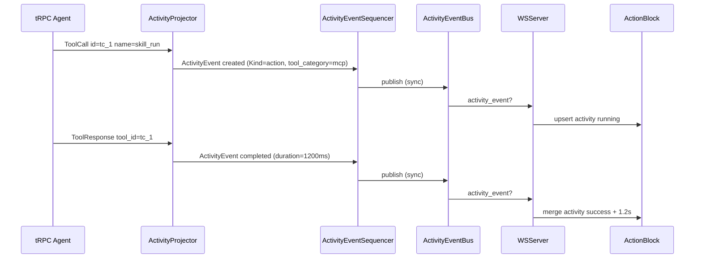
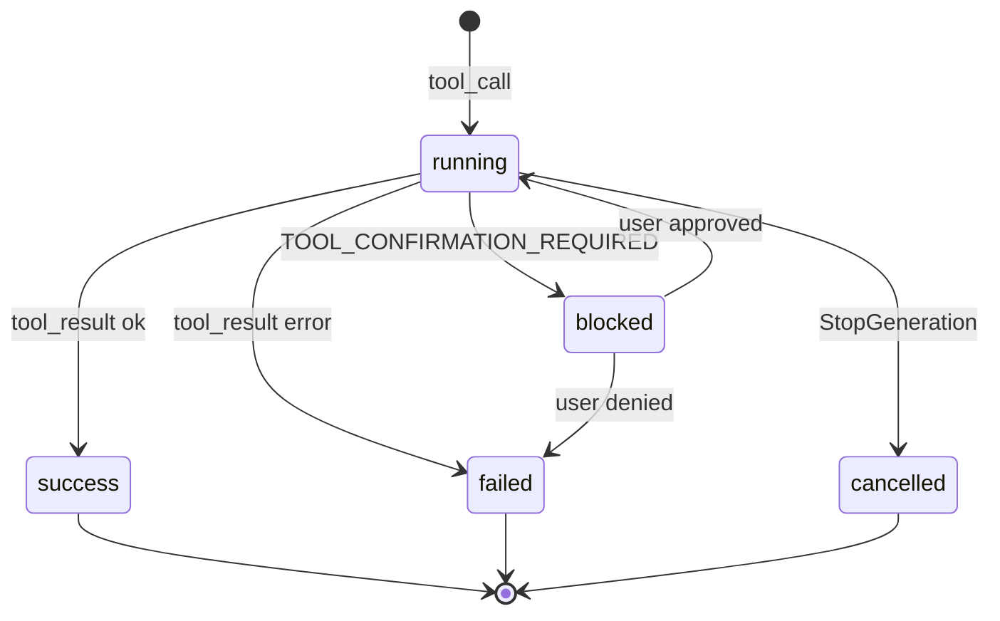

# Chat 对话模块 — 实现设计文档

> 对应需求：`1 chat.md`
> 遵循规范：`AI-DEVELOPMENT-SPECIFICATION.md`
>
> **文档边界**：本文档包含架构设计、代码分层、Proto/API 契约、数据模型、接口定义、技术选型、状态机、序列图、前端组件设计、UX 规范。用户故事、功能需求清单、验收标准见 [1-chat.md](./1-chat.md)；开发进度、任务清单、技术债务见 [1-chat.development.md](./1-chat.development.md)。

---

## 一、模块概述

Chat 是用户与 Agent/Team 交互的核心入口，负责 HTTP/WS 发起对话、WebSocket + EventBus 实时事件、上下文管理、用量记录、停止生成、人工等待回复与待执行队列。当前主链路已端到端可用；本设计文档记录现有实现架构并标注仍需完善的成员级事件、工具事件、附件与可恢复状态。

> **2026-05-17 现状对齐**：独立 SSE `/v1/chat/messages/stream` 路由已从当前代码移除，`internal/server/register_chat.go` 只注册 proto HTTP 服务；实时流由 `internal/server/ws.go` 的 `/v1/ws` 承载。

---

## 二、代码分层（遵循 AI-DEVELOPMENT-SPECIFICATION.md）

```
api/kratos/chat/v1/chat.proto        ← 对话 API 契约（发送、选项、停止、待执行、RunStatus、AwaitUserReply、Enqueue、Feedback、Confirm、Jobs）
        ↓
internal/server/ws.go                 ← WebSocket 实时通道（订阅、回放、取消、user_message 上行）
internal/server/ws_message_handler.go ← WS 上行消息分发（user_message/enqueue_message/cancel/ping/subscribe/unsubscribe/enable_log）
internal/server/ws_event.go           ← WS 事件订阅、回放、connected 握手
internal/server/ws_io_pump.go         ← WS read/write/event pump goroutines
internal/server/ws_priority.go        ← WS 三优先级发送队列 + 背压
internal/server/ws_codec.go           ← WS 协议类型（wsUpstream/wsDownstream）
internal/server/ws_conn.go            ← WS 连接生命周期 + connStore
internal/server/ws_conn_manager.go    ← WS 连接数限制与移除
        ↓
internal/service/chat.go              ← ChatService 薄传输桥（委托 ChatOrchestrator）
internal/service/chat_orchestrator.go ← ChatOrchestrator 编排核心
internal/service/chat_orchestrator_turn.go          ← Turn 编排
internal/service/chat_orchestrator_turn_phases.go   ← Turn 阶段实现
internal/service/chat_orchestrator_turn_dispatch.go ← Turn 分发
internal/service/chat_orchestrator_turn_api.go      ← Turn API
internal/service/chat_orchestrator_turn_metrics.go  ← Turn 指标
internal/service/chat_orchestrator_context_admission.go ← 上下文 admission
internal/service/chat_orchestrator_session_run.go   ← Session run 生命周期
internal/service/chat_orch_session_run_lifecycle.go ← Session run 生命周期细节
internal/service/chat_orch_run_status.go            ← RunStatus 管理
internal/service/chat_orch_pending_queue.go         ← Pending Queue 编排
internal/service/chat_orch_await.go                 ← AwaitUserReply 编排
internal/service/chat_orch_agent_build.go           ← Agent 构建
internal/service/chat_run_gateway.go                ← Biz 适配器 + publishMessageQueuedToBus
internal/service/chat_native.go                      ← 原生对话入口（HTTP unary + WS 上行复用）+ hydratedAgent
internal/service/chat_enqueue.go                     ← EnqueueUserMessage RPC
internal/service/chat_await_route.go                 ← AwaitUserReply 路由
internal/service/chat_await_resume.go                ← AwaitUserReply 恢复
internal/service/chat_durable_resume.go              ← Durable resume
internal/service/chat_attachments.go                 ← 附件处理
internal/service/chat_activity.go                    ← Activity 确认
internal/service/chat_confirm.go                     ← ConfirmActivity RPC
internal/service/chat_feedback.go                    ← SubmitMessageFeedback RPC
internal/service/chat_jobs.go                        ← 后台任务 RPC
internal/service/chat_event_publisher.go             ← Chat 事件发布
internal/service/chat_turn_admission.go              ← Turn admission（CHAT_TURN_BUSY）
internal/service/chat_turn_metrics.go                ← Chat turn 指标
internal/service/chat_usage_ingress.go               ← 用量记录
internal/service/chat_wire.go                        ← Wire 注入
internal/service/chat_session_run_cancel.go          ← Session run 取消
internal/service/turn_outcome.go                     ← ErrTurnMessageQueued / CHAT_TURN_BUSY
        ↓
internal/agent/trpc_build.go              ← Agent 构建（BuildTRPCLLMAgent）
internal/agent/trpc_build_router.go       ← Agent 构建路由
internal/agent/trpc_runtime.go            ← Runner 构建（NewTRPCRunner + RunTRPCUserTurn）
internal/agent/activity_projector.go      ← Activity 投影（唯一投影器：trpc event → ActivityEvent）
internal/agent/activity_event_sequencer.go ← ActivityEvent 序列化（并行异步持久化 + WS 推送 + dead-letter）
internal/agent/tool_category.go           ← 工具类型识别（ToolCategorizer：注册表 + 前缀兜底）
internal/agent/activity_meta.go           ← ActivityKind 分类
internal/agent/activity_meta_resolver.go  ← ActivityMetaResolver 接口
internal/agent/choice_stream.go           ← 流式 delta
internal/agent/stream_consumer.go         ← turn 消费
internal/agent/options.go                 ← options_json 构建
internal/agent/intent/                    ← 意图识别与消息增强
        ↓
internal/event/activity_event.go          ← ActivityEvent 类型定义（Event/Activity/Domain）
internal/event/activityevent/bus.go       ← ActivityEventBus（传输 biz.ActivityEvent，chat+system 事件）
internal/event/contract/monitor_event.go  ← MonitorEvent 类型 + MonitorBus 接口（log/flow_log/mcp/alert）
internal/event/contract/envelope_types.go ← 活类型提取（EnvelopeError/EnvelopeTokenUsage + 5 个 ErrorCode 常量）
        ↓
internal/team/runner.go                   ← Team Runner（Coordinator / Swarm）
internal/team/trpc_build.go               ← Team 构建（BuildTRPCTeam）
        ↓
internal/runtime/deps.go                  ← 运行时依赖注入 DTO（TurnDeps / Runtime）
internal/runtime/run_registry.go          ← RunRegistry（active run / cancel / run status）
internal/runtime/pending_queue.go         ← PendingMessageQueue FIFO
internal/biz/chat_usecase.go              ← Follow-up Queue 编排（EnqueueUserMessage / Pending CRUD）
internal/biz/activity.go                  ← Activity 模型 + ActivityKind(10) + ActivityEventType(7) + ToolCategory(10)
internal/biz/llm_context_builder.go       ← LLM 上下文构建（从 Activity 表，替代原 Message 查询）
internal/biz/session/usecase.go           ← Session Usecase（含标题自动生成 + Session 树深度校验）
internal/biz/session/title.go             ← SessionTitleGenerator 接口
internal/biz/session/                     ← Session 子包（status / turns / state / timeline / summary 等）
```

> **架构变更说明（ADR-02 + ADR-03）**：
> - **删除**：`event_projector.go`（已废弃）、`activity_publish.go`（Legacy 工具卡片持久化）、`activity_persist.go`（`ChatMessageFromToolActivity` 转换）、`internal/event/contract/envelope.go`（活类型提取到 `envelope_types.go`）、`internal/event/buffer.go`（WS replay Buffer 死代码）、`internal/event/bus.go`（SessionBus 死代码）、`internal/biz/event_persist_handler.go`、`internal/biz/event_store.go`、`internal/event/wal.go`、`internal/data/message_repo.go`、`messages` 表（DROP）、`event_store` 表（DROP）
> - **统一总线**：legacy 3 bus（SessionBus/MonitorBus/ActivityBus）→ 2 bus（ActivityEventBus + MonitorEventBus）；WSServer 3 pump → 2 pump
> - **持久化策略**：WBPF → 并行异步（persist fire-and-forget + publish 同步 + dead-letter 环形缓冲 512 + API backfill）

---

## 三、请求流转

```
前端 GET /v1/ws?session_id=... 建立 WebSocket
  → 上行 user_message / enqueue_message / cancel / ping / subscribe / unsubscribe / enable_log
    → WSServer.handleUserMessage() / handleEnqueueMessage()
      → ChatService.SendChatMessage() / EnqueueUserMessage()
        → ChatOrchestrator.nativeSendChatMessage() → runNativeAgentTurn()
          → session.owner_type == "team"?
            → team.Runner.RunTurn() → BuildTRPCTeam → trpc Runner → ActivityProjector → ActivityEventBus
          → session.owner_type == "agent"?
            → runSingleAgentViaTRPC()
              → BuildTRPCLLMAgentCached() → NewTRPCRunner() → RunTRPCUserTurn()
              → ActivityProjector → ActivityEventSequencer（并行：persist fire-and-forget + publish 同步）→ ActivityEventBus → WS 下行 ActivityEvent

后台/非流式入口：
POST /v1/chat/messages
  → ChatService.SendChatMessage()
  → 同一 runNativeAgentTurn() 主链路

Channel 入口（飞书/Lark webhook 等）：
POST /v1/channel/{channel_type}/webhook
  → ChannelIngress.HandleWebhook()
    → ChatService.RunNativeTurnUnary()
      → 同一 runNativeAgentTurn() 主链路

Cron 入口：
Cron Scheduler
  → ChatService.RunCronTurn()
    → 同一 runNativeAgentTurn() 主链路
```

---

## 四、Proto 层

### 4.1 API 端点

| 方法 | 路径 | 协议 | 说明 |
|------|------|------|------|
| POST | `/v1/chat/messages` | unary | 非流式对话 |
| GET | `/v1/ws?session_id=...` | WebSocket | 实时事件主通道；支持订阅、回放、取消、user_message 上行 |
| GET | `/v1/chat/options` | unary | 获取对话选项 |
| POST | `/v1/chat/stop` | unary | 停止生成 |
| GET | `/v1/chat/pending` | unary | 获取待执行消息列表 |
| POST | `/v1/chat/pending/cancel` | unary | 取消待执行消息 |
| POST | `/v1/chat/pending/update` | unary | 编辑待执行消息 |
| POST | `/v1/chat/pending/interrupt-and-send` | unary | 中断并发送待执行消息 |
| GET | `/v1/chat/run-status` | unary | 查询当前/最近一次 Run 状态 |
| POST | `/v1/chat/await-reply` | unary | 提交人工等待回复 |
| POST | `/v1/chat/enqueue` | unary | 显式入队（WS `enqueue_message` 等价） |
| GET | `/v1/chat/jobs` | unary | 列出后台任务（按 session/agent/status 过滤） |
| POST | `/v1/chat/jobs/{id}/cancel` | unary | 取消后台任务 |
| POST | `/v1/chat/messages/{message_id}/feedback` | unary | 提交 👍/👎 反馈 |
| POST | `/v1/chat/activities/{activity_id}/confirm` | unary | 提交工具确认（approved=true 恢复，approved=false 取消） |

### 4.2 主要 Proto 定义

文件：`api/kratos/chat/v1/chat.proto`

```protobuf
syntax = "proto3";

package kratos.chat.v1;

import "google/api/annotations.proto";
import "google/api/field_behavior.proto";
import "google/protobuf/struct.proto";

option go_package = "aranea-agents/api/kratos/chat/v1;v1";

message SendChatMessageRequest {
  string session_id = 1 [(google.api.field_behavior) = REQUIRED];
  optional string agent_key = 2;
  optional string team_id = 3;
  string content = 4 [(google.api.field_behavior) = REQUIRED];
  SendMessageOptions options = 5;
}

message SendMessageOptions {
  optional string dialog_mode = 1;
  optional string provider = 2;
  optional string model = 3;
  repeated AttachmentRef attachments = 4;
  // knowledge_bases limits knowledge_search to these collection IDs for this turn.
  repeated string knowledge_bases = 5;
}

message AttachmentRef {
  string id = 1;
}

message SendChatMessageResponse {
  google.protobuf.Struct user_message = 1;
  google.protobuf.Struct agent_message = 2;
}

message GetChatOptionsRequest {
  string type = 1;
}

message ChatOption {
  string type = 1;
  string key = 2;
  string label = 3;
  bool enabled = 4;
  int32 sort_order = 5;
  string metadata_json = 6;
}

message GetChatOptionsResponse {
  repeated ChatOption items = 1;
}

message StopGenerationRequest {
  string session_id = 1 [(google.api.field_behavior) = REQUIRED];
}

message StopGenerationResponse {
  bool stopped = 1;
}

message GetPendingMessagesRequest {
  string session_id = 1 [(google.api.field_behavior) = REQUIRED];
}

message PendingMessage {
  string id = 1;
  string content = 2;
  string status = 3;
  string created_at = 4;
}

message GetPendingMessagesResponse {
  repeated PendingMessage items = 1;
}

message CancelPendingMessageRequest {
  string session_id = 1 [(google.api.field_behavior) = REQUIRED];
  string pending_id = 2 [(google.api.field_behavior) = REQUIRED];
}

message CancelPendingMessageResponse {
  bool cancelled = 1;
}

message UpdatePendingMessageRequest {
  string session_id = 1 [(google.api.field_behavior) = REQUIRED];
  string pending_id = 2 [(google.api.field_behavior) = REQUIRED];
  string content = 3 [(google.api.field_behavior) = REQUIRED];
}

message UpdatePendingMessageResponse {
  bool updated = 1;
}

message InterruptAndSendMessageRequest {
  string session_id = 1 [(google.api.field_behavior) = REQUIRED];
  string pending_id = 2 [(google.api.field_behavior) = REQUIRED];
}

message InterruptAndSendMessageResponse {
  bool sent = 1;
}

// RunStatus represents the lifecycle state of an agent run within a session.
message RunStatus {
  string run_id = 1;
  // status is one of: idle | pending | running | awaiting_user | completed | failed | cancelled | sync.
  string status = 2;
  string error_message = 3;
  string updated_at = 4;
  string invocation_id = 5;
  string agent_name = 6;
  string started_at = 7;
  string last_event_at = 8;
  int32 event_count = 9;
  // await_kind distinguishes awaiting_user reasons: "" | "reply" | "tool_confirm".
  string await_kind = 10;
  string await_tool_key = 11;
  string await_tool_call_id = 12;
}

message GetRunStatusRequest {
  string session_id = 1 [(google.api.field_behavior) = REQUIRED];
}

message AwaitUserReplyRequest {
  string session_id = 1 [(google.api.field_behavior) = REQUIRED];
  optional string run_id = 2;
  string reply = 3 [(google.api.field_behavior) = REQUIRED];
}

message AwaitUserReplyResponse {
  bool accepted = 1;
}

message EnqueueUserMessageRequest {
  string session_id = 1 [(google.api.field_behavior) = REQUIRED];
  string content = 2 [(google.api.field_behavior) = REQUIRED];
}

message EnqueueUserMessageResponse {
  bool accepted = 1;
  bool queued = 2;
  string pending_id = 3;
}

message ListChatBackgroundJobsRequest {
  optional string session_id = 1;
  optional string agent_id = 2;
  optional string status = 3;
  optional int32 limit = 4;
}

message ChatBackgroundJob {
  string id = 1;
  string source = 2;
  string session_id = 3;
  string agent_id = 4;
  string status = 5;
  string target_type = 6;
  string target_id = 7;
  string created_at = 8;
  string updated_at = 9;
  optional string summary = 10;
  optional string error_message = 11;
  string channel_id = 12;
  optional string graph_id = 13;
  optional string turn_id = 14;
  optional string session_run_id = 15;
  optional string phase = 16;
}

message ListChatBackgroundJobsResponse {
  repeated ChatBackgroundJob items = 1;
}

message CancelChatBackgroundJobRequest {
  string id = 1 [(google.api.field_behavior) = REQUIRED];
  string source = 2;
}

message CancelChatBackgroundJobResponse {
  bool cancelled = 1;
}

message SubmitMessageFeedbackRequest {
  string message_id = 1 [(google.api.field_behavior) = REQUIRED];
  string session_id = 2 [(google.api.field_behavior) = REQUIRED];
  string rating = 3 [(google.api.field_behavior) = REQUIRED];
  optional string comment = 4;
}

message SubmitMessageFeedbackResponse {
  bool accepted = 1;
}

message ConfirmActivityRequest {
  string session_id = 1 [(google.api.field_behavior) = REQUIRED];
  string activity_id = 2 [(google.api.field_behavior) = REQUIRED];
  bool approved = 3 [(google.api.field_behavior) = REQUIRED];
}

message ConfirmActivityResponse {
  bool accepted = 1;
  string status = 2;
}

service ChatService {
  rpc SendChatMessage(SendChatMessageRequest) returns (SendChatMessageResponse) {
    option (google.api.http) = { post: "/v1/chat/messages" body: "*" };
  }
  rpc GetChatOptions(GetChatOptionsRequest) returns (GetChatOptionsResponse) {
    option (google.api.http) = {get: "/v1/chat/options"};
  }
  rpc StopGeneration(StopGenerationRequest) returns (StopGenerationResponse) {
    option (google.api.http) = { post: "/v1/chat/stop" body: "*" };
  }
  rpc GetPendingMessages(GetPendingMessagesRequest) returns (GetPendingMessagesResponse) {
    option (google.api.http) = { get: "/v1/chat/pending" };
  }
  rpc CancelPendingMessage(CancelPendingMessageRequest) returns (CancelPendingMessageResponse) {
    option (google.api.http) = { post: "/v1/chat/pending/cancel" body: "*" };
  }
  rpc UpdatePendingMessage(UpdatePendingMessageRequest) returns (UpdatePendingMessageResponse) {
    option (google.api.http) = { post: "/v1/chat/pending/update" body: "*" };
  }
  rpc InterruptAndSendMessage(InterruptAndSendMessageRequest) returns (InterruptAndSendMessageResponse) {
    option (google.api.http) = { post: "/v1/chat/pending/interrupt-and-send" body: "*" };
  }
  rpc GetRunStatus(GetRunStatusRequest) returns (RunStatus) {
    option (google.api.http) = {get: "/v1/chat/run-status"};
  }
  rpc AwaitUserReply(AwaitUserReplyRequest) returns (AwaitUserReplyResponse) {
    option (google.api.http) = { post: "/v1/chat/await-reply" body: "*" };
  }
  rpc EnqueueUserMessage(EnqueueUserMessageRequest) returns (EnqueueUserMessageResponse) {
    option (google.api.http) = { post: "/v1/chat/enqueue" body: "*" };
  }
  rpc ListChatBackgroundJobs(ListChatBackgroundJobsRequest) returns (ListChatBackgroundJobsResponse) {
    option (google.api.http) = {get: "/v1/chat/jobs"};
  }
  rpc CancelChatBackgroundJob(CancelChatBackgroundJobRequest) returns (CancelChatBackgroundJobResponse) {
    option (google.api.http) = { post: "/v1/chat/jobs/{id}/cancel" body: "*" };
  }
  rpc SubmitMessageFeedback(SubmitMessageFeedbackRequest) returns (SubmitMessageFeedbackResponse) {
    option (google.api.http) = { post: "/v1/chat/messages/{message_id}/feedback" body: "*" };
  }
  rpc ConfirmActivity(ConfirmActivityRequest) returns (ConfirmActivityResponse) {
    option (google.api.http) = { post: "/v1/chat/activities/{activity_id}/confirm" body: "*" };
  }
}
```

### 4.3 WebSocket 实时端点（非 Proto 定义，HTTP Server 层注册）

实时对话事件通过 WebSocket + EventBus 下发，不在 Proto 中定义：

```
GET /v1/ws?session_id=...  →  WSServer.handleWS()
```

客户端可在 WS 上行发送 `user_message` / `enqueue_message` / `cancel` / `ping` / `subscribe` / `unsubscribe` / `enable_log`，服务端复用 `ChatService.SendChatMessage` 与 `ChatService.CancelRun`，下行统一为 `ActivityEvent`（chat + system 事件）与 `MonitorEvent`（监控事件）。

### 4.4 消息字段说明

| 消息 | 字段 | 类型 | 必填 | 说明 |
|------|------|------|------|------|
| `SendChatMessageRequest` | `session_id` | string | ✅ | 目标会话 ID |
| | `agent_key` | string | ❌ | Agent 标识（可选覆盖） |
| | `team_id` | string | ❌ | Team ID（可选覆盖） |
| | `content` | string | ✅ | 用户消息内容 |
| | `options` | SendMessageOptions | ❌ | 对话选项 |
| `SendMessageOptions` | `dialog_mode` | string | ❌ | 对话模式：default/plan/code |
| | `provider` | string | ❌ | 模型提供商覆盖 |
| | `model` | string | ❌ | 模型名覆盖 |
| | `attachments` | AttachmentRef[] | ❌ | 附件引用列表 |
| | `knowledge_bases` | string[] | ❌ | 本轮限定的知识库 collection ID（`knowledge_search` 白名单） |
| `StopGenerationRequest` | `session_id` | string | ✅ | 要停止的会话 ID |
| `GetPendingMessagesRequest` | `session_id` | string | ✅ | 要查询的会话 ID |
| `CancelPendingMessageRequest` | `session_id` | string | ✅ | 会话 ID |
| | `pending_id` | string | ✅ | 待执行消息 ID |
| `UpdatePendingMessageRequest` | `session_id` | string | ✅ | 会话 ID |
| | `pending_id` | string | ✅ | 待执行消息 ID |
| | `content` | string | ✅ | 新消息内容 |
| `EnqueueUserMessageRequest` | `session_id` | string | ✅ | 会话 ID |
| | `content` | string | ✅ | 入队内容 |
| `EnqueueUserMessageResponse` | `accepted` | bool | — | 是否被接受（steer 或 pending） |
| | `queued` | bool | — | 是否降级到 pending queue |
| | `pending_id` | string | — | 入队后的 pending ID |
| `SubmitMessageFeedbackRequest` | `message_id` / `session_id` / `rating` | — | 👍/👎 反馈（positive \| negative） |
| `ConfirmActivityRequest` | `session_id` / `activity_id` / `approved` | — | 工具确认（true 恢复 / false 取消） |

---

## 五、WebSocket 协议

### 5.1 上行消息类型

| 上行 type | 说明 |
|-----------|------|
| `user_message` | 发送用户消息，触发 ChatService.SendChatMessage |
| `enqueue_message` | 发送用户消息，若当前有 run 则入队 pendingQueue |
| `cancel` | 取消当前 run（等同于 HTTP StopGeneration） |
| `ping` | 心跳探测，服务端回复 `pong` |
| `subscribe` | 订阅指定 session/team 的 EventBus 事件 |
| `unsubscribe` | 取消订阅 |
| `enable_log` | 开启运行日志推送（monitor channel） |

### 5.2 下行消息类型

> **架构变更（ADR-03）**：legacy Envelope `type` 已全部删除。下行统一为 `activity_event`（chat+system 事件）+ `monitor_event`（监控事件）。legacy `replay_start`/`replay_end`/`data_channel` 已删除，WS 重连改用 `ListActivities` RPC 补全（详见 §8.18）。

| 下行 type | Bus | 说明 |
|-----------|-----|------|
| `connected` | system | WS 连接建立成功，携带 session_id 和连接元信息 |
| `pong` | system | 心跳回复 |
| `server_shutdown` | system | 服务端即将关闭通知 |
| `activity_event` | ActivityEventBus | 7 种业务语义事件（见 §8.5），Domain=chat 持久化、Domain=system 仅推送 |
| `monitor_event` | MonitorEventBus | 监控事件（log/flow_log/mcp.*/alert.notify/monitor.*），需客户端通过 `enable_log` 上行开启订阅 |

> **删除的下行类型**：`replay_start`/`replay_end`（WS replay 路径已删除，改用 `ListActivities` RPC）、`data_channel`（握手逻辑已删除）、`text_delta`/`text_done`/`tool_call`/`tool_result`/`state_delta`/`runner_completion`/`error`/`intent_pass`/`transfer`/`team_run_*`/`member_*`/`run_status`（全部合并到 `activity_event`，由 `Activity.kind` + `event` + `status` + `meta` 表达）。

### 5.3 下行 ActivityEvent 结构

```json
{
  "event": "streaming",
  "activity": {
    "id": "act_xxx",
    "kind": "team_stage",
    "status": "running",
    "session_id": "sess_team_xxx",
    "spirit_session_id": "sess_spirit_xxx",
    "team_id": "team_xxx",
    "stage": "assembled",
    "meta": { "members": [...], "task_summary": "..." },
    "timestamp": "2026-06-25T10:00:00Z",
    "seq": 12345
  },
  "domain": "chat"
}
```

> **字段说明**：
> - `event`：7 种 ActivityEventType（`created`/`streaming`/`updated`/`completed`/`failed`/`cancelled`/`child_created`）
> - `activity`：完整 Activity 快照（含 `kind`/`status`/`session_id`/`spirit_session_id`/`team_id`/`stage`/`tool_*`/`agent_*`/`meta` 等字段，详见 §8.5）
> - `domain`：`chat`（持久化到 Activity 表，前端加入时间线渲染）/ `system`（仅推送 WS，不持久化，前端作为通知处理）

> **MonitorEvent 结构**（独立通道，不走 ActivityEvent）：
> ```json
> { "id": "...", "type": "log|flow_log|mcp.*|alert.notify|monitor.*", "timestamp": "...", "level": "info", "message": "...", "session_id": "...", "source": "...", "metadata": {...} }
> ```

---

## 六、Biz 层

### 6.1 领域模型

Chat 模块无独立 Biz 模型，依赖以下已有模型：

| 模型 | 包 | 用途 |
|------|-----|------|
| `biz.Agent` | `internal/biz` | Agent 配置查询 |
| `biz.Session` | `internal/biz` | 会话上下文 |
| `biz.Team` | `internal/biz` | Team 编排 |
| `biz.ChatMessage` | `internal/biz` | 对话消息 |
| `biz.TokenUsageEvent` | `internal/biz` | 用量记录事件 |
| `biz.SessionSummary` | `internal/biz` | 会话摘要 |

### 6.2 依赖的 Usecase/Repo 接口

```go
type AgentRepository interface {
    GetAgentByID(ctx context.Context, id string) (Agent, error)
    GetAgentByKey(ctx context.Context, key string) (Agent, error)
}

type SessionUsecase struct {
    repo           SessionRepository
    agents         AgentRepository
    teams          TeamRepository
    titleGenerator SessionTitleGenerator
}

func (uc *SessionUsecase) Get(ctx context.Context, id string) (Session, error)
func (uc *SessionUsecase) UpdateContextFromLLMUsage(ctx context.Context, id string, usage LLMUsage) error
func (uc *SessionUsecase) AppendChatTurn(ctx context.Context, sessionID string, user, assistant ChatMessage) error
func (uc *SessionUsecase) AppendChatMessage(ctx context.Context, sessionID string, msg ChatMessage, bumpModelCall bool) error

type TeamRepository interface {
    GetTeamByID(ctx context.Context, id string) (Team, error)
}

type UsageUsecase struct { ... }
func (uc *UsageUsecase) RecordTokenUsageEvent(ctx context.Context, event TokenUsageEvent) (TokenUsageEvent, error)

type LlmProviderModelUsecase struct { ... }
func (uc *LlmProviderModelUsecase) ModelForProviderModel(ctx context.Context, provider, model string) (model.LLM, error)

type SkillUsecase struct { ... }
func (uc *SkillUsecase) EffectiveSkills(ctx context.Context, agentID string) ([]Skill, error)

type SystemSettingRepo interface {
    Get(ctx context.Context, key string) (string, error)
}
```

### 6.3 Broker 接口

```go
type TeamRunEventBroker struct {
    mu    sync.RWMutex
    chans map[string]chan *TeamRunEvent
}

func (b *TeamRunEventBroker) Subscribe(id string) <-chan *TeamRunEvent
func (b *TeamRunEventBroker) Unsubscribe(id string)
func (b *TeamRunEventBroker) Publish(event *TeamRunEvent)

type MonitorLogBroker struct {
    mu    sync.RWMutex
    chans map[string]chan *MonitorLog
}

func (b *MonitorLogBroker) Subscribe(id string) <-chan *MonitorLog
func (b *MonitorLogBroker) Unsubscribe(id string)
func (b *MonitorLogBroker) Publish(log *MonitorLog)
```

### 6.4 NativeTurnCompressor 接口

```go
type NativeTurnCompressor interface {
    AfterNativeTurn(ctx context.Context, sessionID, agentID string) error
}
```

### 6.5 SessionTitleGenerator 接口

```go
type SessionTitleGenerator interface {
    Generate(ctx context.Context, userMessage string) (string, error)
}
```

两个实现：
- `noopSessionTitleGenerator`：空实现，不生成标题
- `LLMSessionTitleGenerator`（`internal/service/session_title_llm.go`）：使用轻量 LLM 模型生成标题

---

## 七、Data 层

Chat 模块无独立 Data 层，通过以下已有表间接使用：

### 7.1 用量记录表

```
model_token_usage_events
├── id                TEXT (UUID)
├── session_id        TEXT
├── agent_key         TEXT
├── team_id           TEXT
├── message_id        TEXT
├── model_api_id      TEXT
├── model_display_name TEXT
├── input_tokens      INTEGER
├── output_tokens     INTEGER
├── total_tokens      INTEGER
├── latency_ms        INTEGER
├── tokens_per_second REAL
├── status            TEXT
├── stream_enabled    BOOLEAN
├── usage_kind        TEXT
├── provider_code     TEXT
├── prompt_mode       TEXT
├── error_message     TEXT
├── error_code        TEXT
├── metadata_json     TEXT
├── created_at        TEXT
```

### 7.2 工具调用记录表

```
tool_invocations
├── id               TEXT (UUID)
├── session_id       TEXT
├── agent_id         TEXT
├── tool_key         TEXT
├── status           TEXT
├── input_preview    TEXT
├── output_preview   TEXT
├── duration_ms      INTEGER
├── created_at       TEXT
```

---

## 八、Service 层

### 8.1 文件结构

```
internal/service/
├── chat.go                          ← ChatService 薄传输桥（委托 ChatOrchestrator）
├── chat_orchestrator.go             ← ChatOrchestrator 编排核心
├── chat_orchestrator_turn.go        ← Turn 编排
├── chat_orchestrator_turn_phases.go ← Turn 阶段实现
├── chat_orchestrator_turn_dispatch.go ← Turn 分发
├── chat_orchestrator_turn_api.go    ← Turn API
├── chat_orchestrator_turn_metrics.go ← Turn 指标
├── chat_orchestrator_context_admission.go ← 上下文 admission
├── chat_orchestrator_session_run.go ← Session run 生命周期
├── chat_orch_session_run_lifecycle.go ← Session run 生命周期细节
├── chat_orch_run_status.go          ← RunStatus 管理
├── chat_orch_pending_queue.go       ← Pending Queue 编排
├── chat_orch_await.go               ← AwaitUserReply 编排
├── chat_orch_agent_build.go         ← Agent 构建
├── chat_run_gateway.go              ← Biz 适配器 + publishMessageQueuedToBus
├── chat_native.go                   ← 原生对话入口（admission + team/agent 路由）
├── chat_enqueue.go                  ← EnqueueUserMessage RPC
├── chat_await_route.go              ← AwaitUserReply 路由
├── chat_await_resume.go             ← AwaitUserReply 恢复
├── chat_durable_resume.go           ← Durable resume
├── chat_attachments.go              ← 附件处理
├── chat_activity.go                 ← Activity 确认
├── chat_confirm.go                  ← ConfirmActivity RPC
├── chat_feedback.go                 ← SubmitMessageFeedback RPC
├── chat_jobs.go                     ← 后台任务 RPC
├── chat_event_publisher.go          ← Chat 事件发布
├── chat_turn_admission.go           ← Turn admission（CHAT_TURN_BUSY）
├── chat_turn_metrics.go             ← Chat turn 指标
├── chat_usage_ingress.go            ← 用量记录
├── chat_wire.go                     ← Wire 注入
├── chat_session_run_cancel.go       ← Session run 取消
├── turn_outcome.go                  ← ErrTurnMessageQueued / CHAT_TURN_BUSY
└── session_title_llm.go             ← LLM 标题生成
```

### 8.2 ChatService 结构体

```go
// ChatService is the thin transport bridge between proto/HTTP/WS and the
// ChatOrchestrator. It only handles request validation, proto mapping, and
// delegates all orchestration work to ChatOrchestrator.
type ChatService struct {
    chatv1.UnimplementedChatServiceServer

    orch         *ChatOrchestrator
    turnPipeline *TurnPipeline
    lg           loggateway.Logger
}

func NewChatService(deps ChatOrchestratorDeps) *ChatService
```

`ChatService` 仅做协议桥接，所有编排逻辑下沉到 `ChatOrchestrator`。`PendingMessageQueue` 由 `internal/runtime/pending_queue.go` 提供，`RunRegistry` 由 `internal/runtime/run_registry.go` 提供，均通过 `ChatOrchestrator` 持有。

#### Follow-up Queue（对话阶段连续发送）

详见 [35 gateway.design.md §3.6](./35%20gateway.design.md#36-follow-up-queue对话阶段连续发送) 与 [1 chat.md §2.3](./1%20chat.md#23-待执行队列follow-up-queue)。

**入队**：`chat_native` 检测 `HasActive` → `chatUC.EnqueueUserMessage` → Steerable 或 Pending → `PublishMessageQueued`（`run_status` + `hint: message_queued`）。

**出队**：turn defer → `processPendingQueue`（迭代式循环，T1.3）→ `chatUC.DequeuePendingMessage` → 新 turn（同一 goroutine 内串行处理，避免递归 goroutine 链）。

**废弃**：`ChatService.publishMessageQueued` — 使用 `ChatUsecase` + `publishMessageQueuedToBus`。

### 8.3 RPC 方法实现

#### SendChatMessage（unary，非流式）

```
1. 检查 session_id 和 content 必填
2. 调 nativeSendChatMessage → runNativeAgentTurn
3. 返回 user_message + agent_message
4. 记录用度
5. 如果是 team 请求，触发 TeamRunEventBroker hint
```

#### GetChatOptions

```
1. 调 nativeGetChatOptions:
   - type="" 或 "dialog_mode" → 返回硬编码的 dialog_mode 选项
   - type="provider" → 从 LLM Catalog 动态获取可用 Provider 列表
   - type="model" → 从 LLM Catalog 动态获取可用 Model 列表
```

#### StopGeneration

```
1. 检查 session_id 必填
2. 调用 ChatOrchestrator.CancelRun(sessionID)
3. 返回 stopped 状态
```

当前 `RunRegistry` 由单 Agent **`StoreCancelable` → `StoreRunner`** 与 Team **`StoreCancelable`** 共同登记；`lockSession` per-session 互斥锁保护 admission。Turn 启动中且无 `ActiveRunner` 时返回 **`CHAT_TURN_BUSY`**；运行中追加消息经 `EnqueueUserMessage` 成功返回 **`ErrTurnMessageQueued`**（steer 或 Pending FIFO）。Team / 单 Agent turn 完成后 defer `Finish` 并调用 `processPendingQueue`（加锁；仍 active 则重新入队；defer 中检查 `inPendingLoop(ctx)` 抑制递归触发，T1.3）。

#### GetPendingMessages

```
1. 检查 session_id 必填
2. 从 pendingQueue 加载 []pendingEntry
3. 转换为 proto PendingMessage 列表
```

#### CancelPendingMessage

```
1. 检查 session_id 和 pending_id 必填
2. 调用 removePending(sessionID, entryID)
3. 返回 cancelled 状态
```

#### UpdatePendingMessage

```
1. 检查 session_id、pending_id 和 content 必填
2. 调用 updatePending(sessionID, entryID, newContent)
3. updatePending 使用 CAS 循环更新 pendingQueue 中的条目内容
4. 返回 updated 状态
```

### 8.4 WebSocket 实时对话（/v1/ws）

Chat proto HTTP 路由在 `internal/server/register_chat.go` 中注册；实时通道由 `internal/server/ws.go` 单独注册：

```go
func RegisterChatIngress(srv *kratoshttp.Server, chat *service.ChatService) {
    chatv1.RegisterChatServiceHTTPServer(srv, chat)
}

func (s *WSServer) RegisterOnKratos(srv *kratoshttp.Server) {
    srv.HandleFunc("/v1/ws", s.handleWS)
}
```

**请求流转**：

```
GET /v1/ws?session_id=...
  → WSServer.handleWS()
    → 订阅 EventBus（session scoped，可靠订阅）
    → 支持 last_event_id 回放 EventBuffer
    → 上行 user_message / enqueue_message
      → ChatService.SendChatMessage() / EnqueueUserMessage()
        → ChatOrchestrator.nativeSendChatMessage() → runNativeAgentTurn()
    → 下行 ActivityEventBus ActivityEvent
      → wsDownstream{direction, channel, activity_event?, monitor_event?}

Channel 入口（飞书/Lark webhook 等）：
POST /v1/channel/{channel_type}/webhook
  → ChannelIngress.HandleWebhook()
    → ChatService.RunNativeTurnUnary()
      → 同一 runNativeAgentTurn() 主链路

Cron 入口：
Cron Scheduler
  → ChatService.RunCronTurn()
    → 同一 runNativeAgentTurn() 主链路
```

### 8.5 WebSocket ActivityEvent 事件协议

> **架构变更（ADR-02 + ADR-03）**：原 Envelope 通用信封已删除。WS 下行通道现为 `activity_event?` + `monitor_event?` 双类型协议（`wsDownstream.envelope?` 字段已删除）。所有 chat + system 业务事件统一通过 `ActivityEvent` 传输；monitor 事件（log/flow_log/mcp/alert）通过 `MonitorEvent` 传输。详见 ADR-03 D1/D2/D5。

#### 8.5.1 ActivityEvent 完整结构

```go
// internal/event/activity_event.go
type ActivityEvent struct {
    Event    ActivityEventType // 事件类型（7 种，见 8.5.2）
    Activity Activity          // Activity 快照（唯一真相源）
    Domain   ActivityDomain    // chat | system，决定持久化策略
}

type ActivityDomain string

const (
    ActivityDomainChat   ActivityDomain = "chat"   // 持久化到 Activity 表，前端加入时间线渲染
    ActivityDomainSystem ActivityDomain = "system" // 仅推送 WS，不持久化（toast/notification）
)

// internal/biz/activity.go
type Activity struct {
    ID              string            // Activity 唯一 ID（稳定 upsert 键）
    SessionID       string            // 目标 Session
    TurnID          string            // 所属 turn
    RunID           string            // 所属 run
    ParentID        string            // 父 Activity ID（子 session 关联）
    Kind            ActivityKind      // Activity 种类（10 种，见 8.5.3）
    AuthorAgentKey  string            // Team 成员 Agent 标识（单 Agent 为空）
    Title           string            // 卡片/气泡标题
    Content         string            // 文本/reasoning/结果内容
    Reasoning       string            // 思维链内容
    ToolCall        *ToolCallSnapshot // 工具调用快照（仅 Kind=action）
    ToolCategory    ToolCategory      // 工具类别（10 种，见 8.5.4，仅 Kind=action）
    Status          ActivityStatus    // created|streaming|completed|failed|cancelled
    PendingID       string            // 关联的待执行消息 ID（待执行失败时填充）
    MemberAgentKey  string            // Team 成员 Agent 标识（与 AuthorAgentKey 在 team 路径冗余）
    StartedAt       time.Time
    CompletedAt     *time.Time
    DurationMS      int64
    Metadata        map[string]any    // 通用元数据（trace_id/usage/intent 等）
    CreatedAt       time.Time
    UpdatedAt       time.Time
}

type ToolCallSnapshot struct {
    ID            string // 工具调用 ID
    Name          string // 工具名称
    ArgumentsJSON string // 调用参数 JSON
    ResultJSON    string // 返回结果 JSON
    Status        string // 调用状态
    DurationMS    int64  // 执行耗时
    IsLongRunning bool   // 是否为长时运行工具
}
```

#### 8.5.2 ActivityEventType（7 种）

| 事件类型 | 触发时机 | 持久化 | 前端处理 |
|---------|---------|--------|---------|
| `created` | Activity 首次创建（task 创建/thinking 开始/action 开始） | chat=是 / system=否 | 时间线插入新条目 |
| `streaming` | 文本/reasoning 增量片段到达 | chat=是（合并到 Activity.Content） / system=否 | 实时更新气泡内容 |
| `updated` | Activity 字段更新（参数补全/元数据更新/状态扩展） | chat=是 / system=否 | 原地更新卡片 |
| `completed` | Activity 完成（tool 成功/reply 结束/thinking 结束） | chat=是（设置 CompletedAt + DurationMS） / system=否 | 卡片态从「正在执行」→ 耗时 |
| `failed` | Activity 失败（tool 失败/run 失败/turn 失败） | chat=是 / system=否 | 卡片红色边框 + 错误摘要 |
| `cancelled` | Activity 被用户取消（StopGeneration） | chat=是 / system=否 | 卡片灰色 + 「已取消」 |
| `child_created` | 子 Session 被创建（subagent spawn / team dispatch） | chat=是 / system=否 | Session 树侧栏追加节点 |

> **失败语义（ADR-02 D3）**：原 `ActivityKindError` 已删除。失败统一通过 `task.failed` 表达——任务 Activity 进入 `failed` 状态，错误摘要写入 `Content`，错误码写入 `Metadata.error_code`，`PendingID` 填充关联的待执行消息 ID。

#### 8.5.3 ActivityKind（10 种，无 error kind）

| Kind | 含义 | 前端组件 | 典型来源 |
|------|------|---------|---------|
| `task` | 用户消息/任务 | `UserMessageBubble` | WS `user_message` 上行后投影 |
| `thinking` | LLM 推理过程 | `ThinkingBlock` | trpc-agent-go `reasoning_delta` |
| `action` | 工具调用 | `ActionBlock`（按 `tool_category` 细分） | trpc-agent-go `tool_call` / `tool_result` |
| `reply` | LLM 最终回复 | `ReplyBlock` | trpc-agent-go `text_delta` / `text_done` |
| `plan` | Plan 模式计划 | `PlanBlock` | BuiltinPlanner 输出 |
| `confirm` | 工具待确认 | `ConfirmBlock` | risk_level ≥ threshold 的 tool_call |
| `notice` | 系统通知 | `NoticeBlock` | `await_user_reply` / 队列满 / 运行结束 |
| `session` | 子 Session 创建 | `SessionStageBlock` | `subagent_spawn` / Team dispatch |
| `team_stage` | Team 阶段 | `TeamStageBlock` | Coordinator/Swarm 阶段切换 |
| `graph_stage` | Graph 阶段 | `GraphStageBlock` | Graph 节点开始/结束 |

> **设计原则（ADR-02 D4）**：原 `ActivityKindError`、`ActivityKindMember` 等 legacy kind 已清理。失败通过状态机表达（`failed` 事件 + `Status=failed`），不引入独立 kind；Team 成员通过 `AuthorAgentKey` / `MemberAgentKey` 字段标识，不通过 kind 区分。

#### 8.5.4 ToolCategory（10 种）

> 详见 §12.4 工具类别设计。仅 `Kind=action` 的 Activity 携带 `ToolCategory` 字段。

| Category | 匹配工具前缀 | ActionBlock 子组件 |
|----------|-------------|-------------------|
| `shell` | `exec_command`/`shell_*` | ShellActionBlock |
| `browser` | `browser_*`/`playwright_*` | BrowserActionBlock |
| `file_read` | `read_file`/`read_*` | FileReadActionBlock |
| `file_write` | `save_file`/`write_*`/`edit_*` | FileWriteActionBlock |
| `file_search` | `search_files`/`grep`/`find_*` | FileSearchActionBlock |
| `web_search` | `web_search`/`knowledge_search` | WebSearchActionBlock |
| `mcp` | `mcp_*` | McpActionBlock |
| `code` | `code_*`/`execute_code` | CodeActionBlock |
| `todo` | `todo_write`/`todo_read` | TodoActionBlock |
| `other` | 兜底 | GenericActionBlock |

#### 8.5.5 EnvelopeType → ActivityKind 映射（迁移参考）

> 完整映射见 Chat 模块重构方案 §3.3（已归档）。

| Legacy EnvelopeType | 新 ActivityKind | 新 ActivityEventType |
|---------------------|----------------|---------------------|
| `text_delta` | `reply` | `streaming` |
| `text_done` | `reply` | `completed` |
| `reasoning_delta` | `thinking` | `streaming` |
| `tool_call` | `action` | `created` |
| `tool_result` | `action` | `completed` / `failed` |
| `error` | `task` | `failed`（含 `PendingID`） |
| `runner_completion` | `task` | `completed` |
| `member_message_start` | `reply`（带 `MemberAgentKey`） | `created` |
| `member_delta` | `reply` | `streaming` |
| `member_message_done` | `reply` | `completed` |
| `intent_pass` | `notice` | `updated` |
| `transfer` | `team_stage` | `updated` |

#### 8.5.6 pending_id 字段约定

待执行消息执行失败时，Activity 的 `PendingID` 字段应填充关联的待执行消息 ID。当前 `processPendingQueue` 中统一使用 `activity.PendingID = entry.ID`。原 Envelope 的 metadata 双写已移除——`PendingID` 是唯一来源。

#### 8.5.7 Domain 字段语义（ADR-03 D1）

| Domain | 持久化 | WS 推送 | 前端处理 |
|--------|--------|---------|---------|
| `chat` | ActivityEventSequencer 写入 `activities` 表 | ActivityEventBus → activityEventPump | 加入时间线渲染（ActivityStream） |
| `system` | **跳过持久化**（`publishTask.persist=false`） | ActivityEventBus → activityEventPump | 作为通知处理（toast/notification，不进时间线） |

**publisher 责任**：调用 `ActivityProjector.EmitSystemEvent` 时必须明确 Domain=system；常规 chat 工作单元使用 Domain=chat。错误声明会导致 system 事件被持久化（DB 膨胀）或 chat 事件被丢弃（前端缺失）。

### 8.6 runNativeAgentTurn 核心流程

```
1. 校验 session_id 和 content
2. 检查 activeRuns → 如果正在运行则入队 pendingQueue 并返回
3. 查询 Session
4. 判断 owner_type:
   - "team" → teamsNative.RunTurn()
   - "agent" → runSingleAgentViaTRPC()
5. 对于 agent 路径:
   a. hydratedAgent() 获取完整 Agent 配置
   b. 解析 dialogMode/provider/model（优先级：请求 > Session > Agent）
   c. runSingleAgentViaTRPC()
```

注意：
- 步骤 2 的 `activeRuns` 检查由 `RunRegistry` 维护，`lockSession` per-session 互斥锁保护 Load/Store 原子性。Team 路径通过 `teamRunGuard` 接入 `activeRuns`，与单 Agent 的 stop/pending 行为一致。
- Team turn 完成后通过 defer 调用 `processPendingQueue`（迭代式循环，T1.3），内部按 `OwnerType` 路由到 `teamsNative.RunTurn` 或 `runSingleAgentViaTRPC`。defer 中检查 `inPendingLoop(ctx)` 标志，避免在 pending 循环内重复触发。

### 8.7 runSingleAgentViaTRPC 核心流程

> **No-Timeout（T1.1）**：`turnCtx, turnCancel := context.WithCancel(ctx)` — 仅 cancel，无 `WithTimeout`。原 24h `longTaskHardDeadline` 已移除，任务持续运行直到完成或用户取消。

```
1. 校验 agent_key 匹配
2. 构建 TRPCBuilderDeps
3. BuildTRPCLLMAgentCached() → root Agent
4. 构建 TRPCRunnerDeps（SessionService + MemoryService）
5. NewTRPCRunner() → runner
6. activeRuns.Store(sessionID, runner)
7. defer: activeRuns.Delete + runner.Close + processPendingQueue（inPendingLoop 抑制递归）
8. 构建 UserOptionsJSON
9. 运行意图识别 intent.Run()
   - 成功时：MergeIntoUserOptionsJSON 合并到 options_json
   - 成功时：WrapUserMessage 嵌入 artifact 到用户消息
   - ActivityEventBus Publish intent_pass ActivityEvent（单 Agent 和 Team 均发送）
10. 构造 userMsg → AppendChatMessage
11. RunTRPCUserTurn() → events channel（使用 RoundTripForSession 注入 llm_retry 回调，T1.2）
12. 遍历事件流:
    - ActivityProjector.ProjectAndPublish → ActivityEventBus ActivityEvent
    - Response.Choices → 累积 reply/reasoning
    - ToolCalls → 投影为 tool_call / tool_result ActivityEvent
    - Usage → 记录 promptTok/completionTok
    - ctx.Err() != nil 时退出循环（仅用户取消；无超时）
13. 构造 assistantMsg
14. 持久化消息（AppendChatMessage）
15. recordSessionTurn() 写入 session_turns 表
16. patchSessionContextUsage
17. setRunStatus(completed)
```

### 8.8 WS 连接与取消

```
1. WSServer 限制每个 session 最多 5 条连接（maxSessionConns=5）
2. readPump/writePump 使用心跳与写超时维护连接
3. 客户端上行 cancel → ChatService.CancelRun(sessionID)
4. StopGeneration RPC 与 WS cancel 共用 RunRegistry / pendingCancels
5. last_event_id + EventBuffer 支持断线后的事件回放
6. 全局监控连接（globalMode，sessionId="*"）可订阅所有 Session 事件流
```

### 8.9 processPendingQueue 错误处理

> **No-Timeout 原则（Sprint 1 / T1.1, 2026-06-18）**：任务执行无任何时间上限，持续运行直到完成或用户取消。原 24h `longTaskHardDeadline`（`turnTimeout * 12`）已移除；单 Agent / Team / pending queue / resumeAwait 路径统一使用 `context.WithCancel`（不施加 `WithTimeout`）。`turnTimeout()`（默认 10min）仅作为 sync-cap 通知阈值，不作为硬截止。

```
1. dequeuePending 取出待执行消息
2. 迭代式循环（while loop + 深度计数器，替代原 goroutine 递归）：
   a. 加锁 admission 检查（HasActive → 重新入队并退出）
   b. context.WithCancel(loopCtx)（无超时；用户取消经 StoreCancelable 传播）
   c. 调用 runSingleAgentViaTRPC / teamsNative.RunTurn 执行
   d. 执行失败时：发布 failed ActivityEvent（含 pending_id）
   e. defer 中检查 inPendingLoop(ctx) 标志，避免递归 defer 重复触发
3. WS 前端收到 error 后显示通知
```

**关键设计**：
- **迭代式替代递归**（T1.3）：原 `processPendingQueue` 在 turn defer 中递归启动新 goroutine，深度无界。改为 `for {}` 循环 + `depth` 计数器（上限保护），同一 goroutine 内串行处理 pending 队列，避免 goroutine 链爆炸。
- **inPendingLoop context flag**（T1.3）：循环内通过 `contextWithPendingLoop(ctx)` 注入标志，turn defer 中的 `processPendingQueue` 调用检查 `inPendingLoop(ctx)` 抑制递归触发。
- **pending queue 持久化**（T1.4）：`PendingMessageQueue` 支持 snapshot 持久化（`NewPendingMessageQueueWithDirAndLogger`），进程重启后从磁盘恢复未消费的 pending 消息。

> **pending_id 约定**：待执行消息执行失败时，`error.pending_id` 应填充关联的待执行消息 ID。当前 `processPendingQueue` 中统一使用 `env.Error.PendingID = entry.ID`，metadata 双写已移除。

### 8.10 pendingQueue 容量控制与持久化

```
- maxPendingPerSession = 32
- enqueuePending 检查队列长度，超出时返回空 ID
- runNativeAgentTurn 中检测空 ID，返回 BadRequest 错误
- 持久化（T1.4）：PendingMessageQueue 支持 snapshot 到 dataDir，进程重启后恢复
```

### 8.11 上下文管理

- **上下文用量追踪**：每次 turn 后通过 `UpdateSessionContextFromLLMUsage` 更新 `context_used_tokens` / `context_used_ratio`（`prompt_tokens / context_window`）
- **Context Window 解析**：`llmcontext.ResolveWindow`（provider model `context_window_k` → session default → agent → 128000）；ChatOrchestrator 在 turn 结束与 `runner_completion` 投影时使用
- **L0 压缩**：当 `context_used_ratio` 超过阈值（默认 0.6）时，`SessionCompressor.AfterNativeTurn()` 异步触发摘要压缩；完成后 WS 推送带新 ratio 的 `system.session.compress` 通知
- **实时 UI**：`context_usage`（ReAct 子步）与 `runner_completion.usage`（含 `context_prompt_tokens`、`max_tokens`、`turn_total_tokens`）及压缩 notice 经 `sessionContextPatch` 乐观更新 Composer；Composer 副行合并展示 ctx/in/out/Σ/费用（与 Usage 大盘口径一致）
- **记忆服务**：通过 `runtimedeps.Runtime.SessionMemory` 注入 SQLite 适配器，由 trpc Runner 自动管理 L0-L4

### 8.12 用量记录

- 每次对话后通过 `recordTurnUsage()`（`chat_orchestrator_turn` defer）写入 `model_token_usage_events`；`recordChatIngressUsage` 仅 `CHAT_RECORD_USAGE_INGRESS=1` 时备用
- 支持流式/非流式两种记录路径
- 可通过 `CHAT_RECORD_USAGE_INGRESS=0` 禁用（用于双写过渡期）
- 记录字段包含：session_id、agent_key、team_id、model_api_id、input/output_tokens、latency_ms、tokens_per_second、stream_enabled、usage_kind、provider_code、prompt_mode

#### 8.12.1 SessionTurn 持久化

- 单 Agent turn 完成后，`recordSessionTurn()` 写入 `session_turns` 表，记录 turn 索引、角色、模型、token 用量和耗时
- Team turn 完成后，`recordTeamSessionTurn()` 写入 `session_turns` 表，与单 Agent 行为一致

#### 8.12.2 Team Run 持久化

- Team turn 执行时，`CreateTeamRun()` 写入 `team_runs` 表，记录 team_id、session_id、状态和起止时间
- Team turn 中每个成员 Agent 执行步骤通过 `CreateTeamRunStep()` 写入 `team_run_steps` 表
- Team 定义可配置 `intent_anchor_agent_id`（指定意图识别使用的成员 Agent）和 `TurnDeadlineDuration`（turn 超时时间）

#### 8.12.3 可观测性

- Chat turn 耗时通过 `arametrics.ChatTurnDuration` Prometheus 指标记录
- 意图识别超时为 45 秒
- Context Window 默认值：当 Agent 配置的 `context_window` ≤ 0 时，默认使用 128000 tokens

### 8.13 停止生成与运行中追加消息

- **`internal/runtime.RunRegistry`** 跟踪每 session 的 active run（`trpcrunner.Runner` 或 Team `context.CancelFunc` 或占位符）、pending 处理 cancel、run status
- `runSingleAgentViaTRPC`：`RunRegistry.StoreRunner`；defer `Finish` + `runner.Close` + `processPendingQueue`
- `RunTRPCUserTurn` 使用 `trpcagent.WithRequestID(sessionID)`，与 `ManagedRunner.Cancel(sessionID)` 对齐
- **停止**：HTTP `StopGeneration` 或 WS `cancel` → `RunRegistry.Cancel`（含 pending 后台 turn 的 cancel）
- **运行中追加（Follow-up Queue）**：HTTP `POST /v1/chat/enqueue`、`EnqueueUserMessage` RPC，或 WS `user_message` / `enqueue_message`；`SendChatMessage` 在 active run 时自动入队而非拒绝
- **Team cancel**：`RunRegistry.StoreCancelable` 登记 Team turn，与单 Agent 停止行为一致
- **连接管理**：`WSServer` 负责心跳、连接数限制、断线回放和 EventBus 订阅

#### 8.13.1 EventBuffer 回放

- WS 连接断线重连时，客户端携带 `last_event_id` 请求回放
- `EventBuffer` 为 ring buffer，容量 200 条/Session，基于事件 ID 匹配回放起始位置
- 回放期间依次发送 `replay_start` → 事件序列 → `replay_end` 控制消息
- **清理策略**：TTL 30min 自动过期 + 5min eviction ticker + `Close()` 优雅停止；`lastAcc` 追踪最后访问时间

#### 8.13.2 EventBus 订阅与背压

- `EventBus.Subscribe()` 支持 `SubscribeOptions`：SessionID / TeamID / Channel / FilterKey / EventTypes / LevelFilter
- `FilterKey` 采用前缀匹配规则（`MatchFilterKey`）
- 当订阅者消费速度落后时，EventBus 丢弃非关键事件；关键事件类型（不丢弃）包括：`tool_result`、`error`、`runner_completion`、`graph_node_end`、`team_run_finished`、`team_run_failed`
- WS 全局监控连接（`globalMode`，sessionId=`*`）可订阅所有 Session 的事件流

#### 8.13.3 Agent Settings Variables 注入

- Agent 配置中的 `variables_json` 字段存储自定义变量
- `runSingleAgentViaTRPC` 执行时通过 `ParseVariablesJSON` → `MergeRuntimeState` 将变量注入 Runner State
- 变量可在 System Prompt 中通过占位符引用

### 8.14 RunStatus 与 AwaitUserReply

- `GetRunStatus` 返回 `idle | pending | running | awaiting_user | completed | failed | cancelled | sync`
- `runStatuses sync.Map` 记录当前/最近一次 run 状态、run_id、错误信息和更新时间
- `makeAwaitReplyFunc` 注入 service await-reply tool，工具阻塞时将状态置为 `awaiting_user`
- `AwaitUserReply` 向 `awaitChans` 投递人工回复，恢复正在等待的 run
- 单 Agent 和 Team 路径均通过 `makeAwaitReplyFunc` 注入 AwaitHook；Team Runner 通过 `SetAwaitHookProvider` 注入，`runCtx` 注入 `serviceawaitreply.WithReplyFunc`
- 前端：`useEnvelopeStream` / `useChatStreamManager` / `useChatRunStatus` 消费 WS；`useChatWorkspace` 轮询 `GetRunStatus` 并在 `awaiting_user` 时展示提交回复横幅（`ChatMessagePanel` + `AwaitUserReply` RPC）
- 当前状态通过 `state_json` 持久化；`awaitChans` 仍为进程内结构，服务重启后 awaiting_user 状态可通过 `PendingAwaitUserReplyRoute` 恢复；`resumeInFlight` 防双 turn

### 8.15 Session 标题自动生成

- 首次对话时，`maybeAutoTitleFromUserMessage` 触发标题生成
- 先用截取方式快速设置标题（用户消息前 22 字符，即时反馈）
- 异步调用 `LLMSessionTitleGenerator` 生成高质量标题（15s 超时，失败静默）
- `LLMSessionTitleGenerator` 优先选择轻量模型（mini/flash/lite/small）

### 8.16 L0 上下文压缩

```go
type SessionCompressor struct {
    Sessions    *biz.SessionUsecase
    Agents      biz.AgentRepository
    Compress    compress.Compressor
    RT          *runtimedeps.Runtime
    MonitorLogs *biz.MonitorLogBroker
    inFlight    sync.Map  // sessionID → bool（防重入）
}

func (c *SessionCompressor) AfterNativeTurn(ctx, sessionID, ag) {
    // 1. 异步执行，inFlight 防重入
    // 2. 查询 Session，检查 context_used_ratio 是否超过阈值（默认 0.6）
    // 3. 100% 使用率时立即压缩，否则检查距上次压缩是否超过 10 分钟
    // 4. 获取消息列表，计算需要压缩的范围
    // 5. 调用 Compress.Compress() 生成摘要
    // 6. 插入 SessionSummary 记录
    // 7. 合并所有摘要，更新 Session Runner Snapshot
}
```

### 8.17 Session 标题自动生成实现

```go
func (uc *SessionUsecase) maybeAutoTitleFromUserMessage(ctx, sessionID, content) error {
    // 1. 查询 Session，检查标题是否为默认占位符
    // 2. 先用截取方式快速设置标题（即时反馈）
    // 3. 异步调用 generateTitleAsync
}

func (uc *SessionUsecase) generateTitleAsync(sessionID, content) {
    // 1. 15s 超时
    // 2. 调用 titleGenerator.Generate()
    // 3. 成功则更新标题
}

type LLMSessionTitleGenerator struct {
    catalog *biz.LlmProviderModelUsecase
    rt      *provider.RoundTrip
}

func (g *LLMSessionTitleGenerator) Generate(ctx, userMessage) (string, error) {
    // 1. 从 catalog 选择轻量模型（mini/flash/lite/small）
    // 2. 构造请求：system prompt + user message
    // 3. 调用 LLM，流式读取响应
    // 4. 截取前 50 字符作为标题
}
```

### 8.18 统一总线架构（ActivityEventBus + MonitorEventBus）

> **架构变更（ADR-03 D5）**：原 3 bus（SessionBus/MonitorBus/ActivityBus）→ 2 bus（ActivityEventBus + MonitorEventBus）。WSServer 从 3 pump 简化为 2 pump。`internal/event/buffer.go`（WS replay Buffer 死代码）、`internal/event/bus.go`（SessionBus 死代码）已删除。

```go
// internal/event/activityevent/bus.go
type ActivityEventBus interface {
    Publish(ctx context.Context, event biz.ActivityEvent)
    Subscribe(opts ActivitySubscribeOptions) (<-chan biz.ActivityEvent, func())
    DropCount() uint64
}

type ActivitySubscribeOptions struct {
    SessionID   string
    MemberAgent string
    Domain      ActivityDomain // chat | system | "" (both)
}

// internal/event/contract/monitor_event.go
type MonitorBus interface {
    Publish(ctx context.Context, event MonitorEvent)
    Subscribe(opts MonitorSubscribeOptions) (<-chan MonitorEvent, func())
    DropCount() uint64
}

type MonitorEvent struct {
    ID        string
    Type      MonitorEventType // log/flow_log/mcp.*/alert.notify/monitor.*
    Timestamp time.Time
    Level     string
    Message   string
    SessionID string
    Source    string
    Metadata  map[string]any
}
```

**WSServer 双 pump 架构**：

```go
type WSServer struct {
    monitorBus  contract.MonitorBus   // 监控事件
    activityBus biz.ActivityEventBus   // 所有 chat + system 事件
    // 删除 eventBus event.Bus（SessionBus 不再存在）
}
```

- `monitorEventPump` goroutine：订阅 `MonitorBus`，转发 `monitor_event?` 到 WS 下行
- `activityEventPump` goroutine：订阅 `ActivityEventBus`，转发 `activity_event?` 到 WS 下行
- `wsDownstream` 协议字段：`activity_event?` + `monitor_event?`（`envelope?` 字段已删除）

**背压策略**：
- ActivityEventBus：订阅者消费落后时丢弃非关键事件（保留 `completed`/`failed`/`cancelled`/`child_created`）
- MonitorBus：高频事件（100+/sec）独立 channel，不与业务事件竞争

**全局监控**：WS 连接 `globalMode`（sessionId=`*`）可订阅所有 Session 的 ActivityEvent 流（MonitorEvent 仅在显式订阅时下发）。

### 8.19 重连策略：ListActivities RPC（替代 EventBuffer 回放）

> **架构变更（ADR-03 Phase 5 Blocker A）**：原 `EventBuffer` ring buffer（容量 200/TTL 30min）+ `replay_start`/`replay_end` 协议已删除。WS 重连不再走服务端 buffer 回放，改用 `ListActivities` RPC 拉取历史 Activity。

**重连流程**：

```
1. WS 断线检测（心跳失败/写超时）
2. 前端记录最后已渲染的 Activity.updated_at（或最大 ID）
3. WS 重连成功 → connected 握手
4. 前端并行调用：
   a. GET /v1/sessions/{session_id}/activities?since={last_activity_updated_at}&limit=200
      → ListActivities RPC 返回增量 Activity 列表
   b. GET /v1/chat/run-status → 校准 RunStatus
5. 前端按 updated_at 排序合并到 activitiesBySession Map（upsert by ID）
6. 顶栏显示「正在同步历史 Activity…」→ 同步完成隐藏
```

**ListActivities RPC 契约**：

```protobuf
message ListActivitiesRequest {
  string session_id = 1;
  optional string since_updated_at = 2;  // ISO 8601，返回 updated_at > 此值的 Activity
  optional int32 limit = 3;              // 默认 200，上限 500
  optional string kind_filter = 4;       // 按 ActivityKind 过滤
}

message ListActivitiesResponse {
  repeated Activity items = 1;
  bool has_more = 2;
  string next_page_token = 3;
}
```

**优势**：
- 服务端无状态（无需维护 ring buffer + TTL + eviction ticker）
- 前端可按需分页拉取（避免一次性返回大量历史事件）
- Activity 表是唯一真相源，重连后状态与持久化一致
- 简化 WSServer（删除 replay 协议分支）

### 8.20 并行异步持久化（ActivityEventSequencer）

> **架构变更（ADR-02 D1）**：原 WBPF（Write-Before-Publish-Flush）持久化策略改为并行异步：persist fire-and-forget + publish 同步。`internal/event/activity_persist.go`（`ChatMessageFromToolActivity` 转换）已删除。

**ActivityEventSequencer 核心流程**（`internal/agent/activity_event_sequencer.go`）：

```go
func (s *ActivityEventSequencer) Emit(ctx context.Context, ev biz.ActivityEvent) {
    // 1. 持久化：fire-and-forget（非阻塞）
    if ev.Domain == biz.ActivityDomainChat {
        select {
        case s.persistChan <- persistTask{event: ev}:
        default:
            // 缓冲区满 → 降级到 API backfill（前端重连时 ListActivities 补全）
        }
    }
    // 2. 发布：同步（阻塞，确保 WS 实时性）
    s.activityBus.Publish(ctx, ev)
}
```

**单 worker 串行消费**：

```go
// 单 goroutine 消费 persistChan，确保同一 Activity 的 start→done 顺序
func (s *ActivityEventSequencer) persistWorker() {
    for task := range s.persistChan {
        s.persistWithRetry(s.ctx, task.event)
    }
}
```

**关键设计**：
- **FIFO 保证**：单 worker + buffered channel（默认 1024）确保同一 Session 的 Activity 按发射顺序持久化
- **持久化与推送解耦**：publish 同步（前端实时性），persist 异步（DB 写入不阻塞 UI）
- **Domain=system 跳过持久化**：`EmitSystemEvent` 传 `persist=false`，仅 publish 到 WS

### 8.21 重试 + 死信（ADR-02 D2）

**重试预算**：

| 参数 | 值 |
|------|-----|
| 最大重试次数 | 5 |
| 退避基数 | 100ms |
| 退避策略 | 指数退避（100/200/400/800/1600ms） |
| 总预算 | 3100ms |
| 中断机制 | `select` on `done` channel（Close() 时立即退出，不阻塞） |

```go
func (s *ActivityEventSequencer) persistWithRetry(ctx context.Context, ev biz.ActivityEvent) {
    backoff := 100 * time.Millisecond
    for attempt := 0; attempt < 5; attempt++ {
        err := s.activityRepo.Upsert(ctx, ev.Activity)
        if err == nil {
            return // 成功
        }
        select {
        case <-ctx.Done():
            return // 服务关闭
        case <-s.done:
            return // Close() 触发
        case <-time.After(backoff):
            backoff *= 2
        }
    }
    // 5 次重试失败 → 推入死信缓冲
    s.pushDeadLetter(ev)
}

func (s *ActivityEventSequencer) pushDeadLetter(ev biz.ActivityEvent) {
    s.deadLetterMu.Lock()
    defer s.deadLetterMu.Unlock()
    // activityID 去重：同一 Activity 已在死信缓冲则跳过
    if _, exists := s.deadLetterIDs[ev.Activity.ID]; exists {
        return
    }
    s.deadLetterIDs[ev.Activity.ID] = struct{}{}
    s.deadLetterBuffer = append(s.deadLetterBuffer, ev)
    // FIFO 驱逐：超过 512 容量时移除最旧条目
    if len(s.deadLetterBuffer) > 512 {
        evicted := s.deadLetterBuffer[0]
        delete(s.deadLetterIDs, evicted.Activity.ID)
        s.deadLetterBuffer = s.deadLetterBuffer[1:]
    }
}
```

**死信环形缓冲**：

| 参数 | 值 |
|------|-----|
| 容量 | 512 条 |
| 驱逐策略 | FIFO（最旧条目优先驱逐） |
| 去重 | activityID（同一 Activity 不重复入队） |
| 暴露 | `/v1/admin/dead-letter/activities`（管理员排查） |

**API backfill 兜底**：死信缓冲的 Activity 最终通过前端 `ListActivities` RPC 重连时补全——Activity 表是唯一真相源，即使持久化失败，前端重连后仍能从 DB 拉到最新状态（若 DB 写入最终成功）或通过 `updated_at` 检测到缺失（若 DB 写入彻底失败，前端显示「同步中」并降级）。

### 8.22 OnError 语义（ADR-02 D3）

> **架构变更（ADR-02 D3）**：原 `ActivityKindError` 已删除。失败统一通过 `task.failed` 表达。

**根任务存在时**：

```go
func (p *ActivityProjector) OnError(ctx context.Context, runID string, err error) {
    // 根任务 Activity 状态转换为 failed
    p.sequencer.Emit(ctx, biz.ActivityEvent{
        Event: biz.ActivityEventFailed,
        Activity: biz.Activity{
            ID:        rootActivityID,
            SessionID: sessionID,
            Kind:      biz.ActivityKindTask,
            Status:    biz.ActivityStatusFailed,
            Content:   err.Error(),
            Metadata:  map[string]any{"error_code": classifyError(err)},
            PendingID: pendingID, // 待执行消息失败时填充
        },
        Domain: biz.ActivityDomainChat,
    })
}
```

**根任务不存在时**（孤儿错误）：

```go
// 创建最小 failed Activity
p.sequencer.Emit(ctx, biz.ActivityEvent{
    Event: biz.ActivityEventFailed,
    Activity: biz.Activity{
        ID:        uuid.NewString(),
        SessionID: sessionID,
        Kind:      biz.ActivityKindTask,
        Status:    biz.ActivityStatusFailed,
        Content:   err.Error(),
    },
    Domain: biz.ActivityDomainChat,
})
```

**关键约束**：
- 终态保护：已 `completed`/`failed`/`cancelled` 的 Activity 不再接受状态转换
- `PendingID` 唯一来源：待执行消息失败时 `activity.PendingID = entry.ID`，原 metadata 双写已移除

### 8.23 Close() 三阶段关闭

```go
func (s *ActivityEventSequencer) Close() error {
    // 阶段 1：关闭消费者（停止接收新 Activity）
    close(s.persistChan)
    // 阶段 2：worker 排空剩余任务（persistWithRetry 内 select on done 立即退出）
    s.cancel()
    // 阶段 3：等待 worker 退出
    s.wg.Wait()
    return nil
}
```

**关键约束**：
- `persistWithRetry` 使用 `select` on `done` channel（非 `time.Sleep`），确保 Close() 不阻塞
- 死信缓冲在 Close() 时不刷新到 DB（依赖前端 ListActivities backfill）

### 8.24 Channel/Cron 入口

#### 8.24.1 Channel Ingress

```
POST /v1/channel/{channel_type}/webhook
  → ChannelIngress.HandleWebhook()
    → 解析 channel_type（lark/feishu/slack 等）
    → 验证签名
    → 转换为 SendChatMessageRequest
    → ChatService.RunNativeTurnUnary()
      → 同一 runNativeAgentTurn() 主链路
```

- Channel webhook 为并发入口，多个 webhook 可能同时触发同一 Session 的对话
- **并发保护**：`lockSession` per-session 互斥锁 + `runPlaceholder` 原子占位，确保 `RunNativeTurnUnary` 受 activeRuns/pendingQueue 保护

#### 8.24.2 Cron Turn

```
Cron Scheduler
  → ChatService.RunCronTurn()
    → 构造 SendChatMessageRequest（content 为 cron 触发内容）
    → 同一 runNativeAgentTurn() 主链路
```

- Cron turn 与手动对话共用 `runNativeAgentTurn`，受相同的 activeRuns/pendingQueue 保护

### 8.25 Team Run 持久化

```
team_runs
├── id               TEXT (UUID)
├── team_id          TEXT
├── session_id       TEXT
├── status           TEXT (running/completed/failed)
├── started_at       TEXT
├── completed_at     TEXT
├── error_message    TEXT
├── created_at       TEXT

team_run_steps
├── id               TEXT (UUID)
├── team_run_id      TEXT
├── agent_id         TEXT
├── agent_key        TEXT
├── step_type        TEXT
├── status           TEXT
├── input_preview    TEXT
├── output_preview   TEXT
├── duration_ms      INTEGER
├── created_at       TEXT
```

- Team turn 执行时 `CreateTeamRun()` 写入 `team_runs` 表
- Team turn 中每个成员 Agent 执行步骤通过 `CreateTeamRunStep()` 写入 `team_run_steps` 表
- Team 定义可配置 `intent_anchor_agent_id`（指定意图识别使用的成员 Agent）和 `TurnDeadlineDuration`（turn 超时时间）

### 8.26 SessionTurn 持久化

```
session_turns
├── id               TEXT (UUID)
├── session_id       TEXT
├── turn_index       INTEGER
├── role             TEXT (user/assistant/tool)
├── model_name       TEXT
├── input_tokens     INTEGER
├── output_tokens    INTEGER
├── latency_ms       INTEGER
├── created_at       TEXT
```

- 单 Agent turn 完成后，`recordSessionTurn()` 写入 `session_turns` 表
- Team turn 完成后，`recordTeamSessionTurn()` 写入 `session_turns` 表，与单 Agent 行为一致

### 8.27 Agent Settings Variables 注入

```go
func ParseVariablesJSON(variablesJSON string) (map[string]interface{}, error)
func MergeRuntimeState(state map[string]interface{}, variables map[string]interface{}) map[string]interface{}
```

- Agent 配置中的 `variables_json` 字段存储自定义变量
- `runSingleAgentViaTRPC` 执行时通过 `ParseVariablesJSON` → `MergeRuntimeState` 将变量注入 Runner State
- 变量可在 System Prompt 中通过占位符引用（如 `{{variable_name}}`）

### 8.28 可观测性

- Chat turn 耗时通过 `arametrics.ChatTurnDuration` Prometheus 指标记录
- 意图识别超时为 45 秒
- Context Window 默认值：当 Agent 配置的 `context_window` ≤ 0 时，默认使用 128000 tokens

---

## 九、运行时层

### 9.1 Agent 构建

```go
type TRPCBuilderDeps struct {
    Catalog    *biz.LlmProviderModelUsecase
    AgentUC    *biz.AgentUsecase
    Agents     biz.AgentRepository
    RT         *provider.RoundTrip
    SkillUC    *biz.SkillUsecase
    MCPTooling interface{}
    ToolUC     *biz.ToolUsecase
    Sys        biz.SystemSettingRepo
    Provider   string
    Model      string
    DialogMode string
}

func BuildTRPCLLMAgent(ctx, ag biz.Agent, deps TRPCBuilderDeps) (trpcagent.Agent, error) {
    // 1. 获取 LLM 模型
    // 2. 构建 System Prompt（含占位符变量替换）
    // 3. 挂载工具（Builtin + Skill + MCP）
    // 4. 构建 Agent
}
```

### 9.2 Runner 构建

```go
type TRPCRunnerDeps struct {
    AppName        string
    SessionService trpcsession.Service
    MemoryService  trpcmemory.Service
}

func NewTRPCRunner(root trpcagent.Agent, deps TRPCRunnerDeps, opts ...trpcrunner.Option) (trpcrunner.Runner, error) {
    // 注入 SessionService 和 MemoryService（可选）
    // 返回 trpcrunner.NewRunner(appName, root, opts...)
}

func RunTRPCUserTurn(ctx, r trpcrunner.Runner, userID, sessionID, content string, opts ...trpcagent.RunOption) (<-chan *trpcevent.Event, error) {
    // 执行一轮用户对话
}
```

### 9.3 Team 编排

```go
type Runner struct {
    teams    biz.TeamRepository
    sessions *biz.SessionUsecase
    agents   biz.AgentRepository
    agentsUC *biz.AgentUsecase
    tools    biz.ToolRepo
    llm      *biz.LlmProviderModelUsecase
    broker   *biz.TeamRunEventBroker
    skills   *biz.SkillUsecase
    sys      biz.SystemSettingRepo
    rt       *runtimedeps.Runtime
    compress biz.NativeTurnCompressor
    logs     *biz.MonitorLogBroker
}

func (r *Runner) RunTurn(ctx, sess biz.Session, req *chatv1.SendChatMessageRequest, emitter agent.StreamEmitter) (biz.ChatMessage, biz.ChatMessage, error) {
    // 1. 查询 Team 成员 Agent 列表
    // 2. 构建 Team Root Agent（Coordinator 或 Swarm）
    // 3. 构建 Runner
    // 4. 执行
    // 5. ActivityProjector 投影事件流 → ActivityEventBus ActivityEvent
}
```

---

## 十、Wire 注入

### 10.1 ProviderSet

```go
var ProviderSet = wire.NewSet(
    NewChatService,
    provideChatServiceDeps,
    NewSessionCompressor,
    NewLLMSessionTitleGenerator,
    // ... 其他 Service
)
```

### 10.2 provideChatServiceDeps

```go
func provideChatServiceDeps(
    broker *biz.TeamRunEventBroker,
    teams biz.TeamRepository,
    teamsNative *team.Runner,
    usage *biz.UsageUsecase,
    sessions *biz.SessionUsecase,
    agents biz.AgentRepository,
    agentsUC *biz.AgentUsecase,
    toolsCatalog biz.ToolRepo,
    toolUC *biz.ToolUsecase,
    llmCatalog *biz.LlmProviderModelUsecase,
    skillUC *biz.SkillUsecase,
    sys biz.SystemSettingRepo,
    rt *runtimedeps.Runtime,
    compress biz.NativeTurnCompressor,
    monitorLogs *biz.MonitorLogBroker,
) service.ChatServiceDeps { ... }
```

---

## 十一、Web 前端设计

### 11.1 文件结构

```
web/src/
├── services/index.ts              ← createChatService 导出
├── features/chat/
│   ├── api.ts                     ← Chat API 调用封装（sendMessage/stop/listOptions/getPending/cancelPending/updatePending/getRunStatus/awaitUserReply/enqueue/listJobs/cancelJob/submitFeedback/confirmActivity/listActivities）
│   ├── types.ts                   ← TypeScript 类型定义（ActivityEvent/MonitorEvent/Activity/ActivityKind/ActivityEventType/ToolCategory 本地类型，已解耦 Envelope import）
│   ├── activityPresentation.ts    ← activity_kind → icon/label/summary 前端 fallback
│   ├── activityTypes.ts           ← Activity 类型
│   ├── activityMessageAdapter.ts  ← Activity 消息适配器
│   ├── activityTimelineTypes.ts   ← Activity 时间线类型
│   ├── executionProgress.ts       ← 执行进度
│   ├── executionCardHelpers.ts    ← 执行卡片辅助函数
│   ├── toolEventMarkdown.ts       ← 工具事件 Markdown 渲染 + toolEventToMessage 共享转换函数
│   ├── errorCodeHints.ts          ← 错误码 → 用户可读提示映射
│   ├── chatMessageMarkdown.ts     ← Chat 消息 Markdown
│   ├── sessionContextPatch.ts     ← Session 上下文补丁
│   ├── contextBreakdown.ts        ← 上下文分解
│   ├── composerUsageMetrics.ts    ← Composer 用量指标
│   ├── messageSourceMeta.ts       ← 消息来源元数据
│   ├── messageAttachments.ts      ← 消息附件
│   ├── messageOrigin.ts           ← 消息来源
│   ├── messageStoreBatch.ts       ← 消息 Store 批处理
│   ├── mergeSessionMessages.ts    ← 合并 Session 消息
│   ├── parseMessageOptions.ts     ← 解析消息选项
│   ├── modelCapabilities.ts       ← 模型能力
│   ├── todoPresentation.ts        ← Todo 展示
│   ├── diffEditHelpers.ts         ← diff 编辑辅助
│   ├── awaitConstants.ts          ← Await 常量
│   ├── chatFocusCoordinator.ts    ← Chat 焦点协调
│   ├── useChatScrollTitle.ts      ← Chat 滚动标题
│   ├── useTaskDeadLetters.ts      ← Task 死信
│   ├── useChatBackgroundJobs.ts   ← Chat 后台任务
│   ├── jobFormatters.ts           ← Job 格式化
│   ├── inboundSyncRouting.ts      ← 入站同步路由
│   ├── channelInboundSession.ts   ← Channel 入站 Session
│   ├── channelInboundSessionRefresh.ts ← Channel 入站 Session 刷新
│   ├── channelFocusLoad.ts        ← Channel 焦点加载
│   ├── channelSessionMeta.ts      ← Channel Session 元数据
│   ├── channelWsCursor.ts         ← Channel WS 游标
│   ├── agentPlannerSettings.ts    ← Agent Planner 设置
│   ├── agentTreeTypes.ts          ← Agent 树类型
│   ├── agentTreeUtils.ts          ← Agent 树工具
│   ├── a2uiParse.ts               ← A2UI 解析
│   ├── a2uiBind.ts                ← A2UI 绑定
│   ├── a2uiChildren.ts            ← A2UI 子组件
│   ├── a2uiSurfaceState.ts        ← A2UI Surface 状态
│   ├── a2uiUserAction.ts          ← A2UI 用户动作
│   ├── a2uiUserActionDisplay.ts   ← A2UI 用户动作展示
│   └── composables/
│       ├── useChatWorkspace.ts    ← 对话工作区 composable（状态管理 + 交互逻辑；拆分后聚焦编排）
│       ├── useChatSender.ts       ← 发送策略模式（Agent/Team 统一发送路径 + enqueue_message；T1.5: 移除超时失败标记；T1.7: HTTP fallback loadMessages 失败隔离）
│       ├── useChatStreamManager.ts ← WS 事件流管理（单 Agent + Team 统一；T1.6: onActivityEvent 实时 AF 接入）
│       ├── useChatRunStatus.ts    ← RunStatus 轮询 + AwaitUserReply 回复提交
│       ├── useFollowUpQueue.ts    ← Follow-up Queue 状态管理（pending 列表 + WS 刷新）
│       ├── useAwaitReply.ts       ← AwaitUserReply 交互（提交回复 + 横幅状态）
│       ├── useChatDialogs.ts      ← dialog 状态聚合 composable
│       ├── useChatComposerActions.ts ← composer action 方法 composable
│       ├── useChatProviderOptions.ts ← Provider/Model 选项加载（Store 调用）
│       ├── useChatEntityNav.ts    ← Chat 实体导航
│       ├── useChatEntityCollapse.ts ← Chat 实体折叠
│       ├── useChatDeleteFlow.ts   ← Chat 删除流程
│       ├── useChatInboundSync.ts  ← Chat 入站同步
│       ├── useChatAttachments.ts  ← Chat 附件
│       ├── useChatTraceAndArtifacts.ts ← Chat 追踪与 Artifact
│       ├── useChatSettingsDialog.ts ← Chat 设置弹框
│       ├── useChatEventInspector.ts ← Chat 事件检查器
│       ├── useChatMessageScroll.ts ← Chat 消息滚动
│       ├── useActivityTimeline.ts ← Activity 时间线（activitiesBySession Map + ensureActivitiesLoaded 缓存 + sortedActivities）
│       ├── useSystemEventNotification.ts ← Domain=system 事件通知处理（toast/notification，不进时间线）
│       ├── useCollapseState.ts    ← 折叠状态持久化（T8.4：toggle 持久化 / setCollapsed 不持久化）
│       ├── useTodoBoard.ts        ← Todo 看板
│       ├── useStatusPulse.ts      ← 状态脉冲
│       ├── useContextualLoadingMessage.ts ← 上下文加载消息
│       ├── useContextBreakdown.ts ← 上下文分解
│       ├── useReasoningSidebar.ts ← Reasoning 侧栏
│       ├── useChatSidebarOrder.ts ← Chat 侧栏顺序
│       ├── useEventFilter.ts      ← 事件过滤
│       ├── chatWorkspaceUtils.ts  ← Chat 工作区工具
│       └── todoColumnFingerprint.ts ← Todo 列指纹
├── components/chat/
│   ├── ChatWorkspaceShell.vue     ← 工作区外壳（标题 + 三栏布局容器）
│   ├── ChatEntitySidebar.vue      ← 左侧 Agent/Team 列表
│   ├── ChatEntityGroup.vue        ← Agent/Team 分组
│   ├── ChatEntityItem.vue         ← Agent/Team 条目
│   ├── ChatSessionSidebar.vue     ← 右侧 Session 历史
│   ├── SessionTreeSidebar.vue     ← Session 父子树侧栏（递归渲染 SessionTreeNode，展示 spirit/team/agent/standalone 层级）
│   ├── SessionTreeNode.vue        ← Session 树节点（递归组件：session_type 图标 + depth badge + execution_stage + progress_pct）
│   ├── ChatMessagePanel.vue       ← 中间对话内容 + 输入区域（Container: approved）
│   ├── ChatMessageList.vue        ← 消息列表（直接渲染 ActivityStream，无 ConversationTurn 中间层）
│   ├── ActivityStream.vue         ← Activity 统一渲染器（递归组件：按 activity.kind 分发 Block；按 activityTree.children 嵌套缩进渲染子 Activity）
│   ├── ChatReasoningPeek.vue      ← Reasoning 折叠展示（live tail + 展开）
│   ├── ChatReasoningDrawer.vue    ← Reasoning 抽屉
│   ├── ChatExecutionCard.vue      ← 执行过程卡片（原 ChatToolCallCard；默认折叠 + v2 元数据）
│   ├── ChatEnqueueMessage.vue     ← 待执行消息条目
│   ├── ChatPendingQueue.vue       ← 待执行队列
│   ├── ChatRunnerStatus.vue       ← 运行状态指示
│   ├── ChatComposer.vue           ← 输入框组件（emit 事件，不直接调 API/Store）
│   ├── ChatBackgroundJobsPanel.vue ← 后台任务面板（emit 事件，不直接调 API）
│   ├── ChatMessageAttachments.vue ← 附件展示（emit 事件，不直接调 Store）
│   ├── ChatSideToggle.vue         ← 侧栏折叠按钮
│   ├── ChatSettingsDialog.vue     ← Agent/Team 设置弹框
│   ├── ChatDeleteDialog.vue       ← 删除确认弹框
│   ├── SessionTimelineDialog.vue  ← Session 历史追踪弹框
│   ├── ChatMentionPopup.vue       ← @ 引用弹窗
│   ├── ChatDiffViewer.vue         ← Diff 查看器
│   ├── ChatHeaderUsagePanel.vue   ← 头部用量面板
│   ├── ChatHeaderPromptBar.vue    ← 头部 Prompt 栏
│   ├── ChatContextBreakdownPopover.vue ← 上下文分解弹窗
│   ├── ChatSectionHeader.vue      ← 区段标题
│   ├── ChatSessionArtifactsPanel.vue ← Session Artifact 面板
│   ├── ChatSkillHintBar.vue       ← Skill 提示栏
│   ├── ChatSkillCatalogStrip.vue  ← Skill Catalog 条
│   ├── ChatTeamMemberStrip.vue    ← Team 成员条
│   ├── ChatA2UIPreview.vue        ← A2UI 预览
│   ├── ChatA2UISurface.vue        ← A2UI Surface
│   ├── EventStream.vue            ← 事件流
│   ├── EventFilterBar.vue         ← 事件过滤栏
│   ├── SessionEventInspectorPanel.vue ← Session 事件检查器面板
│   ├── BranchTree.vue             ← 分支树
│   ├── BranchTreeNode.vue         ← 分支树节点
│   ├── StateDeltaIndicator.vue    ← State Delta 指示器
│   ├── TransferBadge.vue          ← 转交徽章
│   ├── UiConfigToggle.vue         ← UI 配置切换
│   ├── CodeBlock.vue              ← 代码块
│   ├── UserMessageBubble.vue      ← 用户消息气泡（Kind=task）
│   ├── ThinkingBlock.vue          ← 思考块（Kind=thinking）
│   ├── ReplyBlock.vue             ← 回复块（Kind=reply）
│   ├── PlanBlock.vue              ← 计划块（Kind=plan）
│   ├── ConfirmBlock.vue           ← 确认块（Kind=confirm）
│   ├── NoticeBlock.vue            ← 通知块（Kind=notice）
│   ├── ActionBlock.vue            ← 动作块（Kind=action，按 tool_category 细分到子组件）
│   ├── SessionStageBlock.vue      ← Session 阶段块（Kind=session，子 Session 创建）
│   ├── TeamStageBlock.vue         ← Team 阶段块（Kind=team_stage，Coordinator/Swarm 阶段切换）
│   ├── GraphStageBlock.vue        ← Graph 阶段块（Kind=graph_stage，Graph 节点开始/结束）
│   ├── AgentWorkPanel.vue         ← Agent 工作面板
│   ├── TeamProgressSection.vue    ← Team 进度区段
│   ├── DelegateActivity.vue       ← 委托 Activity
│   ├── DagSection.vue             ← DAG 区段
│   ├── TaskBoardSection.vue       ← 任务看板区段
│   ├── TodoBoardTabs.vue          ← Todo 看板标签
│   ├── TodoColumn.vue             ← Todo 列
│   ├── TodoKanbanBoard.vue        ← Todo 看板
│   ├── TodoCard.vue               ← Todo 卡片
│   ├── TodoInlineList.vue         ← Todo 内联列表
│   └── A2UIComponentNode.vue      ← A2UI 组件节点
├── config/chatOptions.ts          ← 对话模式/模型配置
├── stores/chat/
│   ├── index.ts                   ← Chat Store re-export（facade 已移除）
│   ├── messageStore.ts            ← 消息 Store（sessionId 必传，无 sessionStore 硬依赖）
│   ├── runtimeStore.ts            ← 运行时 Store（含 submitFeedback/cancelBackgroundJob/listChatOptions）
│   ├── sessionStore.ts            ← Session Store
│   └── conversationStore.ts       ← 对话 Store
├── stores/app.ts                  ← 全局状态（含 Agent/Session 选择）
```

### 11.1.1 前端事件流架构（Activity-First）

> **架构变更（ADR-03 D6）**：原 EnvelopeDispatcher + streamHandlers + envelopeToolCall 三层分发已删除。前端零推理消费 ActivityEvent——后端投影为 Activity 语义单元，前端按 `activity.kind` 直接渲染对应 Block 组件。

```
WsTransport（WS 连接管理：连接/重连/心跳/断线后通过 ListActivities RPC 拉取增量）
  ↓ wsDownstream 双类型流
useChatStreamManager（统一管理单 Agent + Team 事件流）
  ├─ activity_event? → useActivityTimeline（activitiesBySession Map + sortedActivities + ensureActivitiesLoaded 缓存）
  │   ↓ 按 activity.kind 分发
  │   ActivityStream.vue（递归统一渲染器，prop: activityTree: ActivityTreeNode[]）
  │     ├─ task         → UserMessageBubble
  │     ├─ thinking     → ThinkingBlock
  │     ├─ action       → ActionBlock（按 tool_category 细分子组件）
  │     ├─ reply        → ReplyBlock
  │     ├─ plan         → PlanBlock（叶节点：不再渲染子 Activity）
  │     ├─ confirm      → ConfirmBlock
  │     ├─ notice       → NoticeBlock
  │     ├─ session      → SessionStageBlock（可点击进入子 Session：emit enter-session）
  │     ├─ team_stage   → TeamStageBlock（emit expand-member 带 teamId）
  │     ├─ graph_stage  → GraphStageBlock
  │     └─ ⤷ node.children 非空 → 递归渲染 <ActivityStream :activity-tree="children">（缩进 + 左边线）
  └─ monitor_event? → useSystemEventNotification（toast/notification，不进时间线）
useChatRunStatus（RunStatus 轮询 + isAwaiting + submitReply）
  ↓ 状态聚合
useChatWorkspace（对话工作区：Activity 列表/pending/发送/停止/上下文比）
  ↓ 渲染
ChatMessagePanel（ActivityStream + 待执行列表 + 输入框）
```

**关键设计**：
- **零推理消费**：前端不再从 Envelope 字段推断渲染类型，直接按 `activity.kind` 路由到 Block 组件
- **递归嵌套渲染（Phase A）**：`ActivityStream` 为 `defineOptions({ name: 'ActivityStream' })` 递归组件；prop 为 `activityTree: ActivityTreeNode[]`；node.children 非空时递归渲染自身到 `.event-stream__children`（缩进 14px + 左边线 2px）。子 Activity 由树层级统一渲染，Block 组件不感知 children（如 `PlanBlock` 为叶节点）
- **stable upsert + 乱序合并**：`activitiesBySession` Map 以 `activity.id` 为键；`created` 分支采用 merge（`{ ...snapshot, ...existing }`），保留 `streaming` 先到时累积的 content/reasoning，避免 WS 乱序丢数据
- **缓存优化**：`ensureActivitiesLoaded(sessionId)` 命中缓存时跳过 ListActivities RPC；失败时降级为空列表 + 重试
- **Domain 分流**：`Domain=chat` 进入 ActivityStream 时间线；`Domain=system` 进入 useSystemEventNotification（toast/通知栏，不进时间线）
- **后端 ParentActivityID 完整性**：`ActivityProjector` 创建 plan/graph 等 child Activity 时必须设置 `ParentActivityID: p.rootActivityID`，保证前端按 `parentActivityId` 构建的树结构与设计意图一致
- **重连恢复**：WS 断线重连后，前端记录最后 `updated_at`，调用 `ListActivities?since={updated_at}` 拉取增量 Activity 合并到 Map

### 11.2 页面布局

```
┌──────────┬─────────────────────────────────┬──────────┐
│ Agent/   │        ChatWorkspaceShell        │ Session  │
│ Team     │  ┌───────────────────────────┐  │ 历史     │
│ 列表     │  │  Session 标题 + 上下文比   │  │ 列表     │
│          │  ├───────────────────────────┤  │          │
│ 120px    │  │                           │  │ 120px    │
│          │  │   对话内容区域             │  │          │
│          │  │   (q-chat-message)        │  │          │
│          │  │                           │  │          │
│          │  │   待执行消息列表           │  │          │
│          │  ├───────────────────────────┤  │          │
│          │  │  附件区域                  │  │          │
│          │  │  输入框 (autogrow)         │  │          │
│          │  │  [模式][Provider][上下文]  │  │          │
│          │  │              [文件][发送]  │  │          │
│          │  └───────────────────────────┘  │          │
└──────────┴─────────────────────────────────┴──────────┘
```

### 11.3 TypeScript 类型定义

```typescript
export type Message = {
  id: string;
  session_id: string;
  parent_message_id: string;
  turn_index: number;
  role: string;
  content_markdown: string;
  model_name: string;
  token_in: number;
  token_out: number;
  latency_ms: number;
  status: string;
  attachments_count: number;
  options_json: string;
  error_message: string;
  created_at: string;
};

export type ChatOption = {
  type: string;
  key: string;
  label: string;
  enabled: boolean;
  sort_order: number;
  metadata_json: string;
};

export type SendMessageOptions = {
  dialog_mode?: string;
  provider?: string;
  model?: string;
  attachments?: Array<{ id: string }>;
  knowledge_bases?: string[];
};

export type SendMessageResult = {
  user_message: Message;
  agent_message: Message;
};

export type IntentPassResult = {
  outcome: string;
  duration_ms: number;
  session_id?: string;
  agent_id?: string;
  intent_kind?: string;
  refined_goal_len?: number;
  search_hints_count?: number;
};

export type ToolUseEvent = {
  id: string;
  phase: "before" | "after" | string;
  status: "running" | "success" | "error" | "failed" | "blocked" | string;
  agent_id: string;
  agent_key: string;
  agent_name: string;
  agent_icon: string;
  tool_name: string;
  tool_label: string;
  arguments?: Record<string, unknown>;
  result?: Record<string, unknown>;
  error?: string;
  occurred_at: string;
  duration_ms?: number;
  message_hint?: string;
};
```

> **⚠️ 废弃提示**：历史 `SendMessageStreamCallbacks` 类型来自 SSE API，当前 Chat 页面主路径使用 `useEnvelopeStream` / `useChatStreamManager` 消费 WS Envelope。该类型仅作为向后兼容保留，后续应删除或迁移残留 SSE callback 类型，避免误导新开发者。

### 11.4 API 调用

```typescript
export async function sendMessage(payload: {...}): Promise<SendMessageResult>
export async function listChatOptions(type?: string): Promise<ChatOption[]>
export async function stopGeneration(sessionId: string): Promise<boolean>
export async function getPendingMessages(sessionId: string): Promise<PendingMessage[]>
export async function cancelPendingMessage(sessionId: string, pendingId: string): Promise<boolean>
export async function updatePendingMessage(sessionId: string, pendingId: string, content: string): Promise<boolean>
export async function interruptAndSendMessage(sessionId: string, pendingId: string): Promise<boolean>
export async function getRunStatus(sessionId: string): Promise<RunStatus>
export async function awaitUserReply(sessionId: string, reply: string, runId?: string): Promise<boolean>
export async function enqueueUserMessage(sessionId: string, content: string): Promise<EnqueueUserMessageResponse>
export async function listChatBackgroundJobs(filter?: {...}): Promise<ChatBackgroundJob[]>
export async function cancelChatBackgroundJob(id: string, source?: string): Promise<boolean>
export async function submitMessageFeedback(messageId: string, sessionId: string, rating: string, comment?: string): Promise<boolean>
export async function confirmActivity(sessionId: string, activityId: string, approved: boolean): Promise<ConfirmActivityResponse>
```

> **⚠️ 废弃提示**：历史 `sendMessageStream()` 函数基于 SSE 实现，当前 Chat 页面主路径使用 WS `useEnvelopeStream` 消费实时事件。该函数不应在新代码中使用。

### 11.5 组件设计

#### ChatEntitySidebar

| Prop | 类型 | 说明 |
|------|------|------|
| `open` | `boolean` | 是否展开 |
| `search` | `string` | 搜索关键词 |
| `agents` | `Agent[]` | Agent 列表 |
| `teams` | `TeamRow[]` | Team 列表 |
| `categoryTree` | `PlatformResourceTreeNode[]` | 分类树 |
| `selectedKind` | `ChatEntityKind` | 选中类型 |
| `selectedAgentId` | `string \| null` | 选中 Agent ID |
| `selectedTeamId` | `string \| null` | 选中 Team ID |
| `isDark` | `boolean` | 暗黑模式 |

| Emit | 载荷 | 说明 |
|------|------|------|
| `select-agent` | `Agent` | 选中 Agent |
| `select-team` | `TeamRow` | 选中 Team |
| `settings` | `kind, id` | 打开设置 |
| `delete` | `kind, id` | 删除 |

#### ChatSessionSidebar

| Prop | 类型 | 说明 |
|------|------|------|
| `open` | `boolean` | 是否展开 |
| `sessions` | `SessionView[]` | Session 列表 |
| `selectedSessionId` | `string \| null` | 选中 Session ID |
| `favoriteIds` | `string[]` | 收藏 ID 列表 |
| `isDark` | `boolean` | 暗黑模式 |

| Emit | 载荷 | 说明 |
|------|------|------|
| `select` | `string` | 选中 Session |
| `new-session` | — | 新建 Session |
| `rename` | `{id, title}` | 重命名 |
| `delete` | `kind, id` | 删除 |
| `trace` | `string` | 历史追踪 |
| `toggle-favorite` | `string` | 切换收藏 |

#### ChatMessagePanel

| Prop | 类型 | 说明 |
|------|------|------|
| `messages` | `Message[]` | 消息列表 |
| `pendingMessages` | `PendingMessage[]` | 待执行消息 |
| `sessionTitle` | `string` | Session 标题 |
| `contextRatio` | `number` | 上下文使用比例 |
| `isDark` | `boolean` | 暗黑模式 |
| `sending` | `boolean` | 是否正在发送 |
| `dialogMode` | `string` | 对话模式 |
| `modelProvider` | `string` | 当前 Provider/Model |
| `attachments` | `ChatAttachment[]` | 附件列表 |

| Emit | 载荷 | 说明 |
|------|------|------|
| `send` | `{content, attachments}` | 发送消息 |
| `stop` | — | 停止生成 |
| `cancel-pending` | `pendingId` | 取消待执行消息 |
| `update-pending` | `pendingId, content` | 编辑待执行消息 |
| `update:modelValue` | `string` | 输入框内容 |
| `update:dialogMode` | `string` | 切换对话模式 |
| `update:modelProvider` | `string` | 切换模型 |
| `remove-attachment` | `string` | 移除附件 |
| `download-artifact` | `meta` | 下载附件 |
| `cancel-job` | `{id, source}` | 取消后台任务 |
| `paste-unsupported` | — | 粘贴不支持提示 |
| `retry` | `messageId` | 重试失败消息 |
| `dismiss-failed` | `messageId` | 忽略失败消息 |
| `regenerate` | `messageId` | 重新生成 |

### 11.6 UX 规范

- 玻璃材质：`background: var(--glass-surface); backdrop-filter: blur(var(--glass-blur-default))`
- 日间主操作色：`var(--color-accent)` = `#E9A23B`
- 夜间霓虹强调：`var(--color-neon-cyan)` = `#00E5FF`
- 输入框圆角：12-16px
- 消息气泡圆角：16-20px
- 暗黑模式可读性：聊天记录正文、代码块、工具结果、时间戳等文本必须保证对比度
- 上下文进度颜色阈值：`<0.6` 绿 / `0.6-0.8` 黄 / `>0.8` 红
- 成功色 fallback：`#4CAF7C`（不使用 `#4caf50`）

---

## 十二、Activity-First 架构设计（ADR-02 + ADR-03 综合）

> **来源**：本节整合 Chat 模块重构方案 §2/§3/§4/§5/§7/§8/§9/§10、ADR-02 D1-D4、ADR-03 D1-D6 的设计内容（源文档已归档，设计要点已内联于此）。

### 12.1 AF 架构总览

**核心原则**：后端将运行时事件投影为 Activity 语义单元；前端零推理消费。

```text
trpc-agent-go Runner
  → framework Event（text_delta/tool_call/tool_result/reasoning_delta/...）
       │
       ▼
internal/agent/activity_projector.go（唯一投影器）
  ├─ projectChatCompletionChunk → ActivityEvent（Kind=reply/thinking，Event=streaming/completed）
  ├─ projectToolCall            → ActivityEvent（Kind=action，Event=created）
  ├─ projectToolResult          → ActivityEvent（Kind=action，Event=completed/failed）
  ├─ projectMemberMessage       → ActivityEvent（Kind=reply，带 MemberAgentKey）
  ├─ projectSessionSpawn        → ActivityEvent（Kind=session，Event=child_created）
  ├─ projectTeamStage           → ActivityEvent（Kind=team_stage）
  ├─ projectGraphStage          → ActivityEvent（Kind=graph_stage）
  └─ enrichActivityMeta()       ← kind/label/icon/summary/脱敏/tool_category
       │
       ▼
internal/agent/activity_event_sequencer.go
  ├─ persist：fire-and-forget（persistChan + 单 worker + retry + dead-letter）→ Activity 表
  └─ publish：同步 → ActivityEventBus → WSServer.activityEventPump → WS 下行 activity_event?
       │
       ▼
前端 useChatStreamManager → useActivityTimeline → ActivityStream.vue（按 kind 分发 Block）
```

**唯一真相源**：`activities` 表。`messages`/`event_store`/`event_wal` 表已 DROP。LLM 上下文构建从 `activities` 表查询（`internal/biz/llm_context_builder.go`），替代原 `messages` 表查询。

### 12.2 Session 父子树数据模型

> **来源**：Chat 模块重构方案 §4（已归档，设计内容已并入本文档）。

#### 12.2.1 SessionType 枚举

| SessionType | 含义 | 创建场景 |
|-------------|------|---------|
| `spirit` | Spirit 主会话 | 用户主动创建的顶层对话 |
| `team` | Team 会话 | Team Run 启动 |
| `agent` | 子 Agent 会话 | `subagent_spawn` / `transfer_to_agent` |
| `standalone` | 独立会话 | 单 Agent 直接对话 |

#### 12.2.2 Session 表新增字段

| 字段 | 类型 | 说明 |
|------|------|------|
| `parent_session_id` | TEXT | 父 Session ID（顶层为空） |
| `root_session_id` | TEXT | 根 Session ID（= 自身或顶层祖先） |
| `agent_depth` | INTEGER | Agent 嵌套深度（顶层=0，每层 +1） |
| `session_type` | TEXT | spirit/team/agent/standalone |
| `member_agent_key` | TEXT | Team 成员 Agent 标识 |
| `execution_stage` | TEXT | 执行阶段（planning/executing/reviewing/completed） |
| `completed_steps` | INTEGER | 已完成步骤数 |
| `total_steps` | INTEGER | 总步骤数 |
| `progress_pct` | REAL | 进度百分比（0.0-100.0） |

#### 12.2.3 深度控制

```go
func validateDepth(parent *Session, cfg DepthConfig) error {
    depth := parent.AgentDepth + 1
    if depth > cfg.SubagentsMaxGenerationDepth {
        return ErrMaxGenerationDepthExceeded
    }
    if depth > cfg.MaxSessionDepth {
        return ErrMaxSessionDepthExceeded
    }
    return nil
}
```

- `subagents_max_generation_depth`：Agent 嵌套深度上限（默认 3）
- `max_session_depth`：Session 树深度上限（默认 5）

#### 12.2.4 GetSessionTree RPC

```protobuf
message GetSessionTreeRequest {
  string root_session_id = 1;
}

message GetSessionTreeResponse {
  SessionTreeNode root = 1;
}

message SessionTreeNode {
  Session session = 1;
  repeated SessionTreeNode children = 2;
}
```

**实现**：单次查询 `WHERE root_session_id = ?` 获取所有节点，内存中构建树（任意深度）。无递归 SQL，无 N+1 查询。

### 12.3 并行异步持久化（processTask 重设计）

> **来源**：Chat 模块重构方案 §5 + ADR-02 D1（已归档，设计内容已并入本文档）。

**原 WBPF 策略问题**：Write-Before-Publish-Flush 在 DB 写入慢时阻塞 UI 实时性；失败时回滚已推送的事件导致前端状态不一致。

**新策略（并行异步）**：

| 阶段 | 操作 | 阻塞性 |
|------|------|--------|
| 1. 投影 | ActivityProjector 将 framework event 转为 ActivityEvent | 同步（快） |
| 2. 持久化 | ActivityEventSequencer.Emit → persistChan（fire-and-forget） | 非阻塞 |
| 3. 发布 | ActivityEventSequencer.Emit → activityBus.Publish（同步） | 阻塞（确保实时性） |
| 4. 重试 | persistWorker 单 goroutine 消费 persistChan，5 次指数退避 | 异步 |
| 5. 死信 | 重试失败 → deadLetterBuffer（512 FIFO + activityID 去重） | 异步 |
| 6. 兜底 | 前端重连时 ListActivities RPC backfill | 按需 |

详见 §8.20（并行异步持久化）+ §8.21（重试+死信）+ §8.22（OnError 语义）+ §8.23（Close 三阶段）。

### 12.4 工具类别设计（ToolCategorizer）

> **来源**：Chat 模块重构方案 §8（已归档，设计内容已并入本文档）。

#### 12.4.1 ToolCategorizer 实现

```go
// internal/agent/tool_category.go
type ToolCategorizer struct {
    registry map[string]ToolCategory // 精确匹配注册表
    prefixes []prefixEntry           // 前缀兜底（按长度排序）
}

func (c *ToolCategorizer) Categorize(toolName string) ToolCategory {
    // 1. 精确匹配
    if cat, ok := c.registry[toolName]; ok {
        return cat
    }
    // 2. 前缀兜底（最长匹配优先）
    for _, entry := range c.prefixes {
        if strings.HasPrefix(toolName, entry.prefix) {
            return entry.category
        }
    }
    return ToolCategoryOther
}
```

#### 12.4.2 10 种 ToolCategory

| Category | 精确匹配 | 前缀兜底 | ActionBlock 子组件 |
|----------|---------|---------|-------------------|
| `shell` | `exec_command` | `shell_` | ShellActionBlock |
| `browser` | — | `browser_`/`playwright_` | BrowserActionBlock |
| `file_read` | `read_file` | `read_` | FileReadActionBlock |
| `file_write` | `save_file`/`write_file` | `write_`/`edit_` | FileWriteActionBlock |
| `file_search` | `search_files`/`grep`/`find_files` | `find_` | FileSearchActionBlock |
| `web_search` | `web_search`/`knowledge_search` | — | WebSearchActionBlock |
| `mcp` | `mcp_call`/`mcp_list_tools` | `mcp_` | McpActionBlock |
| `code` | `execute_code` | `code_` | CodeActionBlock |
| `todo` | `todo_write`/`todo_read` | — | TodoActionBlock |
| `other` | — | —（兜底） | GenericActionBlock |

#### 12.4.3 ActionBlock 组件设计

`ActionBlock.vue` 作为容器，按 `activity.tool_category` 动态渲染子组件：

```vue
<template>
  <component :is="subComponent" :activity="activity" />
</template>

<script setup>
const props = defineProps<{ activity: Activity }>()
const subComponent = computed(() => {
  switch (props.activity.tool_category) {
    case 'shell': return ShellActionBlock
    case 'browser': return BrowserActionBlock
    case 'file_read': return FileReadActionBlock
    // ... 10 种
    default: return GenericActionBlock
  }
})
</script>
```

**子组件差异化**：
- `ShellActionBlock`：突出 stdout/stderr 分区 + 退出码
- `BrowserActionBlock`：截图预览 + URL 链接
- `FileReadActionBlock`：行号 + 语法高亮 + 行数摘要
- `FileWriteActionBlock`：diff 视图 + 变更行数
- `FileSearchActionBlock`：匹配结果列表 + 文件路径
- `WebSearchActionBlock`：来源链接 + 摘要
- `McpActionBlock`：server_key + tool 名
- `CodeActionBlock`：执行结果 + 语言标识
- `TodoActionBlock`：Todo 列表变更（增删改）
- `GenericActionBlock`：通用 JSON 参数/结果展示

### 12.5 ActivityStream 组件设计

> **来源**：Chat 模块重构方案 §7（已归档，设计内容已并入本文档）。

#### 12.5.1 组件职责

`ActivityStream.vue` 是统一的 Activity 渲染器，按 `activity.kind` 分发到对应 Block 组件。**禁止**在 ActivityStream 之外的地方处理 Activity 渲染（已删除 ConversationTurn 中间层 + placeholder 机制）。

#### 12.5.2 Props

```typescript
interface ActivityStreamProps {
  sessionId: string
  // activitiesBySession Map 由 useActivityTimeline 提供
  // ActivityStream 直接消费排序后的 sortedActivities
}
```

#### 12.5.3 分发逻辑

```vue
<template>
  <div class="activity-stream">
    <template v-for="activity in sortedActivities" :key="activity.id">
      <component :is="blockComponent(activity.kind)" :activity="activity" />
    </template>
  </div>
</template>

<script setup>
function blockComponent(kind: ActivityKind) {
  switch (kind) {
    case 'task': return UserMessageBubble
    case 'thinking': return ThinkingBlock
    case 'action': return ActionBlock
    case 'reply': return ReplyBlock
    case 'plan': return PlanBlock
    case 'confirm': return ConfirmBlock
    case 'notice': return NoticeBlock
    case 'session': return SessionStageBlock
    case 'team_stage': return TeamStageBlock
    case 'graph_stage': return GraphStageBlock
    default: return NoticeBlock // 兜底
  }
}
</script>
```

#### 12.5.4 stable upsert 机制

- `useActivityTimeline` 维护 `activitiesBySession: Map<string, Map<string, Activity>>`（外层 sessionId → 内层 activityId → Activity）
- 收到 `ActivityEvent` 时，按 `activity.id` upsert 到内层 Map
- `sortedActivities` computed 按 `created_at` 排序输出
- 同一 Activity 的 `created`→`streaming`→`completed` 事件原地更新，不产生重复 DOM

### 12.6 SessionTreeSidebar / SessionTreeNode 递归设计

> **来源**：Chat 模块重构方案 §10（已归档，设计内容已并入本文档）。

#### 12.6.1 SessionTreeSidebar

```vue
<template>
  <div class="session-tree-sidebar">
    <SessionTreeNode
      v-for="node in tree.children"
      :key="node.session.id"
      :node="node"
      :depth="0"
      :selected-id="selectedSessionId"
      @select="onSelect"
    />
  </div>
</template>
```

- 数据来源：`GetSessionTree` RPC（root_session_id 为当前顶层 Session）
- 折叠态：仅显示 root + 一级子节点
- 展开态：递归渲染所有子节点

#### 12.6.2 SessionTreeNode（递归组件）

```vue
<template>
  <div class="session-tree-node" :style="{ paddingLeft: depth * 16 + 'px' }">
    <div class="node-header" @click="$emit('select', node.session.id)">
      <q-icon :name="sessionTypeIcon(node.session.session_type)" />
      <span class="node-title">{{ node.session.title }}</span>
      <q-badge v-if="node.session.agent_depth > 0" color="primary">
        L{{ node.session.agent_depth }}
      </q-badge>
      <q-badge v-if="node.session.execution_stage" color="info">
        {{ stageLabel(node.session.execution_stage) }}
      </q-badge>
      <q-circular-progress
        v-if="node.session.total_steps > 0"
        :value="node.session.progress_pct"
        size="20px"
      />
    </div>
    <SessionTreeNode
      v-for="child in node.children"
      :key="child.session.id"
      :node="child"
      :depth="depth + 1"
      :selected-id="selectedId"
      @select="$emit('select', $event)"
    />
  </div>
</template>
```

#### 12.6.3 session_type 图标映射

| SessionType | 图标 | 颜色 |
|-------------|------|------|
| `spirit` | `auto_awesome` | accent |
| `team` | `groups` | primary |
| `agent` | `smart_toy` | secondary |
| `standalone` | `chat` | muted |

### 12.7 子 Session Activity 懒加载缓存

> **来源**：Chat 模块重构方案 §9.1.3（已归档，设计内容已并入本文档）。

**问题**：Session 树展开时，每个子 Session 的 Activity 列表需独立加载，N 个子 Session 触发 N 次 ListActivities RPC。

**优化（useActivityTimeline.ensureActivitiesLoaded）**：

```typescript
const loadedSessions = new Set<string>()

async function ensureActivitiesLoaded(sessionId: string) {
  if (loadedSessions.has(sessionId)) {
    return // 缓存命中，跳过 RPC
  }
  try {
    const activities = await api.listActivities(sessionId)
    activitiesBySession.set(sessionId, new Map(activities.map(a => [a.id, a])))
    loadedSessions.add(sessionId)
  } catch (e) {
    // 失败降级：空列表，不加入 loadedSessions，下次重试
    console.warn('Failed to load activities for session', sessionId, e)
  }
}
```

**缓存失效**：Session 切换时不清空缓存（保留已加载的子 Session Activity，便于来回切换）；仅在显式刷新时清空 `loadedSessions`。

---

## 子模块：Chat 执行过程卡片 — 技术设计

> **版本**：2026-05-20（v2 元数据扩展设计；已被 §十二 Activity-First 架构设计取代）
> **对应需求**：[1 chat-execution-trace.md](./1%20chat-execution-trace.md)
> **遵循**：[AI-DEVELOPMENT-SPECIFICATION.md](../guides/AI-DEVELOPMENT-SPECIFICATION.md) · [AGENT_RUNTIME_BOUNDARY.md](../AGENT_RUNTIME_BOUNDARY.md) · [frontend-guide.md](../guides/frontend-guide.md) · `aranea-frontend-guide` SKILL §6
> **关联**：[1 chat.design.md](./1%20chat.design.md) · [52-flow-logger.design.md](./52-flow-logger.design.md) · [23 tools.design.md](./23%20tools.design.md)
>
> **架构变更说明（ADR-02 + ADR-03）**：本子模块记录的 EnvelopeToolCall v2 扩展设计已实现并随后被 Activity-First 架构取代。`EnvelopeToolCall`、`event_projector.go`、`EventBus` Envelope 流已删除。当前实现见 §十二（AF 架构设计）+ §8.5（ActivityEvent 协议）+ §8.20-§8.23（持久化/重试/OnError/Close）。下方内容保留作为历史设计参考，**不再反映当前实现**。

---

## 1. 设计原则

1. **复用 WS 主通道**：不新增 HTTP 轮询；实时走 `/v1/ws` + ActivityEvent；回放走 `ListActivities` RPC（与 [1 chat.design.md §8.5](#85-websocket-activityevent-事件协议) 一致）。
2. **框架边界不变**：`internal/biz` 不 import `pkg/trpc-agent-go`；投影在 `internal/agent/activity_projector.go`，组装在 `internal/service/chat_orchestrator_turn*.go`。
3. **与 Monitor 分流**：`flow_log` → MonitorEvent/MonitorBus；`tool_call` / `tool_result`（增强元数据）→ ActivityEvent/ActivityEventBus。`TraceEmitter.ObserveFrameworkEvent` 继续写 Span 供 Usage / Traces，**不**把 FlowLog 正文塞进 Chat。
4. **一张调用一张卡片**：以 `activity.id` 为 upsert 键；`tool_call` 创建 running 态（ActivityEvent=created），`tool_result` 合并完成态（ActivityEvent=completed/failed）。
5. **默认折叠、按需展开**：UI 层约束；Activity 携带完整 `tool_call.arguments_json` / `tool_call.result_json`。
6. **工具类别细分**：`Activity.tool_category`（10 种，见 §12.4）驱动 ActionBlock 子组件选择。

---

## 2. 现状与差距

| 能力 | 现状（AF 架构后） | 历史（v2 设计前） |
|------|------|------|
| WS 事件 | `ActivityEvent`（Kind=action）投影 | `tool_call` / `tool_result` Envelope |
| 前端 | `ActivityStream.vue` + `ActionBlock`（按 tool_category 细分） | `ChatExecutionCard.vue` + `upsertToolMessage` |
| 持久化 | `activities` 表（唯一真相源） | `options_json.tool_event` 写入 Message |
| Skill / MCP | `ToolCategory=mcp` + `McpActionBlock` | 走统一 ToolCall 名 |
| Team | `Activity.member_agent_key` | `author` 在 Envelope |
| Monitor | `MonitorEvent` 独立 bus | FlowLog 与 Chat 混杂 |

---

## 3. 架构总览

```text
trpc-agent-go Runner
  → framework Event (ToolCall / ToolResponse)
       │
       ▼
internal/agent/activity_projector.go（唯一投影器）
  ├─ projectToolCall    → ActivityEvent（Kind=action，Event=created，Status=streaming）
  ├─ projectToolResult  → ActivityEvent（Kind=action，Event=completed/failed，含 duration/status）
  └─ enrichActivityMeta() ← kind/label/icon/summary/脱敏/tool_category
       │
       ▼
internal/agent/activity_event_sequencer.go
  ├─ persist：fire-and-forget → activities 表
  └─ publish：同步 → ActivityEventBus → WSServer.activityEventPump → 前端 WS activity_event?
       │
       ├─ useActivityTimeline: upsertActivity(activity)
       └─ ActivityStream.vue → ActionBlock（按 tool_category 细分子组件）

并行（不进入 Chat UI）：
internal/event/trace_emitter.go → MonitorEvent (monitor_bus) + spans → usage.metadata_json
```



---

## 4. 数据模型

### 4.1 ActivityKind 枚举

| `activity_kind` | 判定规则（优先级从高到低） |
|-----------------|---------------------------|
| `skill` | `name` ∈ `skill_load`,`skill_run`,`skill_search`,`use_skill` 或前缀 `skill_` |
| `mcp` | `name` ∈ `mcp_call`,`mcp_list_tools`,`mcp_list_servers`,`mcp_inspect_tools` 或 MCP ToolSet 前缀 `mcp:` |
| `subagent` | `transfer_to_agent`,`spawn_subagent`,`call_agent` |
| `memory` | `load_memory`,`preload_memory`,`memory_*`,`working_memory.*` |
| `knowledge` | `knowledge_search` |
| `session` | `await_user_reply` |
| `tool` | 默认 |

实现位置：`internal/agent/activity_meta.go`（纯函数，可单测）。

### 4.2 EnvelopeToolCall v2 扩展字段

在 [`internal/event/envelope.go`](../../internal/event/envelope.go) 的 `EnvelopeToolCall` 增加 **optional JSON 字段**（向后兼容）：

```go
type EnvelopeToolCall struct {
    ID            string `json:"id"`
    Name          string `json:"name"`
    ArgumentsJSON string `json:"arguments_json"`
    ResultJSON    string `json:"result_json,omitempty"`
    Status        string `json:"status"`
    DurationMS    int64  `json:"duration_ms,omitempty"`
    IsLongRunning bool   `json:"is_long_running,omitempty"`

    // --- v2 Chat execution trace ---
    ActivityKind  string `json:"activity_kind,omitempty"`  // skill|mcp|tool|...
    DisplayLabel  string `json:"display_label,omitempty"`  // 卡片标题
    IconKey       string `json:"icon_key,omitempty"`       // Quasar icon name
    Summary       string `json:"summary,omitempty"`        // 折叠态副标题
    StartedAt     string `json:"started_at,omitempty"`     // RFC3339
    FinishedAt    string `json:"finished_at,omitempty"`
    ErrorCode     string `json:"error_code,omitempty"`
    AgentKey      string `json:"agent_key,omitempty"`      // Team 成员
    AgentName     string `json:"agent_name,omitempty"`
    RunID         string `json:"run_id,omitempty"`
    TraceID       string `json:"trace_id,omitempty"`
}
```

`tool_call` 与 `tool_result` **均携带相同 `id`**；result 侧填充 `duration_ms`、`finished_at`、`result_json`。

### 4.3 前端 ToolUseEvent v2

扩展 [`web/src/features/chat/types.ts`](../../web/src/features/chat/types.ts) 中 `ToolUseEvent`：

```typescript
export type ActivityKind = "tool" | "skill" | "mcp" | "subagent" | "memory" | "knowledge" | "session";

export type ToolUseEvent = {
  // ...现有字段...
  activity_kind?: ActivityKind;
  display_label?: string;
  icon_key?: string;
  summary?: string;
  started_at?: string;
  finished_at?: string;
  error_code?: string;
  run_id?: string;
  trace_id?: string;
  /** UI-only: 用户是否展开详情，不持久化到后端 */
  expanded?: boolean;
};
```

映射函数：[`envelopeToolCall.ts`](../../web/src/features/chat/envelopeToolCall.ts) 的 `envelopeToToolEvent` 读取 v2 字段。

### 4.4 持久化（messages 表）

**策略**：沿用 `messages` 行 + `options_json` 嵌入结构化事件（与现网 `tool_event` 一致），不新增表。

| 字段 | 值 |
|------|-----|
| `role` | `assistant` |
| `status` | `tool_running` / `tool_success` / `tool_failed` |
| `content_markdown` | 简短 fallback 文本（供搜索 / 纯文本客户端） |
| `options_json` | `{ "schema": "chat.activity/v1", "tool_event": { ...ToolUseEvent } }` |
| `latency_ms` | 完成后写入 `duration_ms` |

**稳定主键**：`message.id = "act-" + tool_call_id`（取代当前 `tool-{agent}-{name}` 组合，避免同名工具重复）。

**落库时机**（Service 层，非 biz）：

1. `tool_result` 投影后、WS 发布前：异步写入或随 turn 结束批量写入（与 assistant 消息同一事务，见 [1 chat.design.md §8.7](#87-runsingleagentviatrpc-核心流程)）。
2. `running` 态可选择**仅 WS 不落库**，刷新后只见已完成卡片（P0 可接受）；P1 增加 `tool_running` 行软删除或 turn 结束清理。

---

## 5. Envelope 协议

### 5.1 事件类型（不变）

| type | 触发 | status |
|------|------|--------|
| `tool_call` | LLM 发起 function call | `calling` → 前端归一化为 `running` |
| `tool_result` | 工具返回 | `success` / `failed` |

### 5.2 Metadata 双写（可选）

`Envelope.Metadata` 冗余常用字段便于过滤 / 日志：

```json
{
  "activity_kind": "skill",
  "display_label": "skill_run",
  "run_id": "run_...",
  "trace_id": "tr_..."
}
```

### 5.3 备选：EnvelopeType `activity`（P2，非 P0）

若未来 tool_call/tool_result 语义过载，可新增：

- `activity_start` / `activity_update` / `activity_end`

P0 **不采用**，避免前后端与 EventBuffer 大规模迁移。

---

## 6. 展示映射

### 6.1 图标（Quasar `icon`）

| activity_kind | icon | 备注 |
|---------------|------|------|
| `tool` | `build` | 通用工具 |
| `skill` | `auto_awesome` | Skill |
| `mcp` | `hub` | MCP |
| `subagent` | `group` | 子 Agent |
| `memory` | `psychology` | 记忆 |
| `knowledge` | `menu_book` | 知识库 |
| `session` | `forum` | 等待用户 |

按 `name` 细化（可选覆盖）：

| name | icon |
|------|------|
| `read_file` / `save_file` | `description` |
| `exec_command` / `workspace_exec` | `terminal` |
| `skill_run` | `play_circle` |
| `skill_load` | `download` |

### 6.2 DisplayLabel 解析

```
1. tools 表 display_name（ToolUC.GetTool，按 catalog key 或 runtime alias 反查）
2. stepTitleRegistry 风格内置 map（skill_run →「运行 Skill」）
3. runtime name 原样
```

实现：`internal/agent/activity_meta_resolver.go` + 注入 `ToolUC` / 内存 registry。

### 6.3 Summary 一行摘要

| kind | 规则 |
|------|------|
| file tools | `` `path` `` from arguments.path |
| shell | command 前 80 字符 |
| skill | arguments.skill / skill_name |
| mcp | `server_key` + `/` + `tool_name` |
| knowledge | collection_id + query 前 40 字符 |

---

## 7. 后端实现要点

### 7.1 EventProjector

文件：[`internal/agent/event_projector.go`](../../internal/agent/event_projector.go)

| 函数 | 变更 |
|------|------|
| `projectChatCompletionChunk` | `tool_call` 填充 `StartedAt`、`ActivityKind`、`DisplayLabel`、`Summary`；`Status=calling` |
| `buildToolResultEnvelope` | 必须带 `ToolID`、`ToolName`、`DurationMS`；失败读 `Response.Error` |
| `enrichActivityMeta`（新） | 集中 kind/label/icon/summary + 脱敏 |

**脱敏**：复用 [`internal/service/tool.go`](../../internal/service/tool.go) 或 `biz` 层既有 `sanitize` 规则；对 `arguments_json` / `result_json` 中 key 名含 `password|secret|token|api_key` 的值替换为 `***`。

### 7.2 与 TraceEmitter 协作

- `ObserveFrameworkEvent` 已记录 `tool.call` span；扩展 attrs：`tool_name`、`activity_kind`、`status`。
- **禁止** `LogError(chat.usage_record|system.agent.tool_build)` 推 Chat error toast（见 Monitor 分流约定）。

### 7.3 依赖注入

`EventProjector` 增加可选 `ActivityMetaResolver` 接口（由 `service` 注入 `ToolUC` + `AgentUC`）：

```go
type ActivityMetaResolver interface {
    Resolve(ctx context.Context, agentID, toolName string, argsJSON []byte) ActivityPresentation
}
```

避免 `agent` 包 import `data`。

### 7.4 Team 路径

- Envelope.`Author` = 成员 agent_key；`AgentName` 由 `ActivityMetaResolver` 查 agents 表。
- Team 成员气泡与执行卡片**并存**：卡片插在成员子流或统一 session 时间线（与现 `member_delta` 顺序约定：工具卡片紧随该成员 turn 内顺序）。

---

## 8. 前端实现要点

> 遵循 [frontend-guide.md](../guides/frontend-guide.md)：**展示组件不直连 API**；状态由 `useChatWorkspace` + `upsertToolMessage` 维护。

### 8.1 组件结构

```
web/src/components/chat/
├── ChatMessagePanel.vue          ← 消息列表；识别 tool_* status
├── ChatExecutionCard.vue         ← 重命名自 ChatToolCallCard（或别名导出）
└── ChatExecutionCardDetails.vue  ← 参数/结果分区（可选拆分）

web/src/features/chat/
├── envelopeToolCall.ts           ← upsert + v2 映射
├── activityPresentation.ts       ← icon/label/summary 前端 fallback
└── types.ts                      ← ToolUseEvent v2
```

### 8.2 折叠交互

- 使用 **Quasar `q-expansion-item`** 或 native `<details>` **不带 `open` 属性**（默认折叠）。
- `expanded` 状态仅存组件本地 `ref` 或 session 级 Map（**不**写回后端）。
- Header 整行可点击；`:aria-expanded` 绑定。

### 8.3 视觉（UX.md）

| Token | 用途 |
|-------|------|
| `--glass-surface` / `--glass-border` | 卡片背景与边 |
| `--color-success` / `--color-danger` / `--color-warning` | 状态 badge |
| `chat-tool-card--running` | 左边框 accent 动画（现有 class 延续） |

禁止硬编码青紫霓虹；日夜模式跟随 `body.body--dark`。

### 8.4 消息流插入规则

[`useChatWorkspace.ts`](../../web/src/features/chat/composables/useChatWorkspace.ts)：

```typescript
chatStream.onType("tool_call", (env) => { upsertToolMessage(..., "before"); });
chatStream.onType("tool_result", (env) => { upsertToolMessage(..., "after"); });
```

`upsertToolMessage` 改用 **`act-${tc.id}`**  message id；phase `after` 合并 result / duration / status。

### 8.5 历史加载

`GET /v1/sessions/{id}/messages` 返回的 `options_json.schema === "chat.activity/v1"` 时，**直接渲染 `ChatExecutionCard`**，不再解析 markdown 主文案。

---

## 9. 状态机



| 转换 | WS 事件 |
|------|---------|
| → running | `tool_call` |
| → success/failed | `tool_result` |
| → blocked | `tool_result` status=blocked 或 `error` type=tool_confirmation |
| → cancelled | `run_status` cancelled + 卡片强制 failed/cancelled |

---

## 10. 安全与合规

| 项 | 措施 |
|----|------|
| 参数脱敏 | 后端投影前扫描 JSON key；前端二次 mask 仅 display |
| 大 payload | `result_json` WS 上限 256KB；超出截断 + `truncated: true` |
| MCP 凭据 | 永不进入 `summary`；详情默认折叠 |
| 审计 | 完整 arguments 仍可通过 Monitor Traces / tool_invocations 表排查（见 [23 tools.design.md](./23%20tools.design.md)） |

---

## 11. 实施分期

| 阶段 | 内容 | 文件触点 | 状态 |
|------|------|----------|------|
| **P0** | EnvelopeToolCall v2 + Projector 填 id/name/duration/kind/label | `envelope.go`, `event_projector.go`, `activity_meta.go` | ✅ |
| **P0** | 前端默认折叠卡片 + stable upsert id | `ChatExecutionCard.vue`, `envelopeToolCall.ts` | ✅ |
| **P0** | 脱敏 + summary | `activity_meta.go` | ✅ |
| **P1** | messages 持久化 schema `chat.activity/v1` + 历史还原 | `activity_persist.go`, `session_repo.go` | ✅ |
| **P1** | catalog display_name 查表 | `ActivityMetaResolver` + ToolUC | ✅ |
| **P1** | Team 成员标识 | `envelope` author + UI | ✅ |
| **P2** | running 态落库 / 取消态 | session messages | ✅ running upsert + StopGeneration 取消落库 |
| **P2** | `activity_*` Envelope 类型评估 | 仅当 tool_call 过载时 | 📋 暂不需要 |

---

## 12. 测试计划

| 层 | 用例 |
|----|------|
| Go 单测 | `ClassifyActivityKind`、`BuildSummary`、脱敏、`buildToolResultEnvelope` 带 ToolID |
| Go 集成 | 模拟 tool_call → tool_result WS 序列，EventBuffer 回放 idempotent |
| 前端 vitest | `envelopeToToolEvent` v2 字段、`upsertToolMessage` 同 id 合并 |
| E2E | 发消息 → 见 running 卡片 → 完成见耗时；默认折叠；展开见 JSON |

---

## 13. 文档与索引更新（实现后）

| 文档 | 动作 |
|------|------|
| [1 chat.md](./1%20chat.md) | §验收 增加执行卡片条目 |
| [1 chat.design.md](./1%20chat.design.md) | §8.5 补充 EnvelopeToolCall v2；§前端 替换 ChatToolCallCard 说明 |
| [1-chat-development.md](./1-chat-development.md) | 新增迭代任务与勾选 |
| [frontend-pages.md](./frontend-pages.md) | Chat 页能力描述 |
| [52-flow-logger.design.md §5.1](./52-flow-logger.design.md) | 可选注册 `chat.activity.project` 步骤（非必须） |

---

## 14. 与现有 ChatToolCallCard 的差异摘要

| 项 | 现有 | 目标 |
|----|------|------|
| 默认折叠 | 参数 `details open` | 全部默认折叠 |
| 覆盖范围 | 通用 tool | + Skill / MCP 图标与摘要 |
| upsert 键 | 易冲突 | `act-{tool_call_id}` |
| 持久化 schema | 隐式 `tool_event` | 明示 `chat.activity/v1` |
| 执行中文案 | 英文 status 原样 | i18n「正在执行」 |

本设计 **不修改** `pkg/trpc-agent-go`；所有增强均在 Aranea 投影层与前端完成，符合 [AGENT_RUNTIME_BOUNDARY.md](../AGENT_RUNTIME_BOUNDARY.md)。
