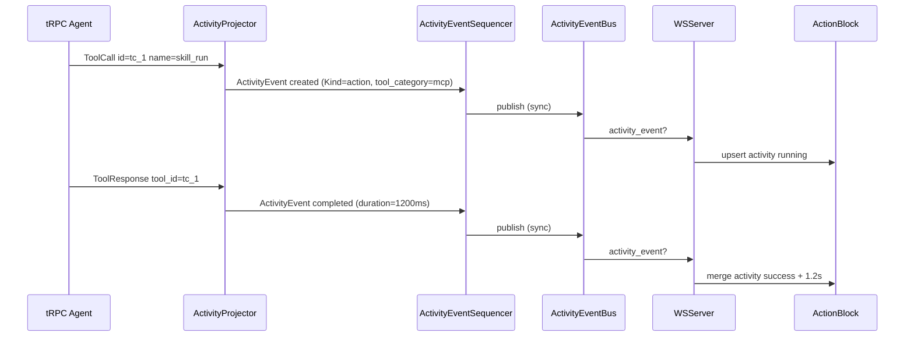
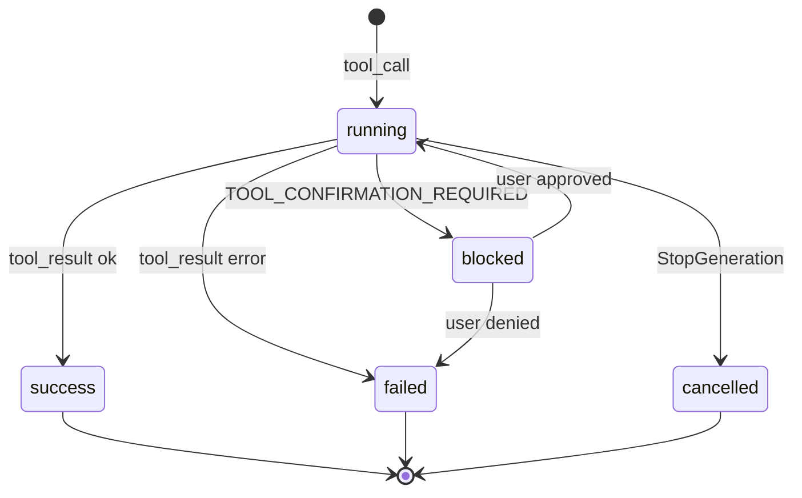
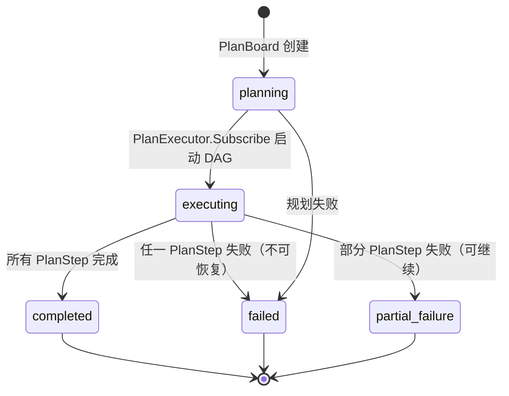

# Chat 对话模块 — 实现设计文档

> 对应需求：`1 chat.md`
> 遵循规范：`AI-DEVELOPMENT-SPECIFICATION.md`
>
> **文档边界**：本文档包含架构设计、代码分层、Proto/API 契约、数据模型、接口定义、技术选型、状态机、序列图、前端组件设计、UX 规范。用户故事、功能需求清单、验收标准见 [1-chat.md](./1-chat.md)；开发进度、任务清单、技术债务见 [1-chat.development.md](./1-chat.development.md)。

---

## 一、模块概述

Chat 是用户与 Agent/Team 交互的核心入口，负责 HTTP/WS 发起对话、WebSocket + EventBus 实时事件、上下文管理、用量记录、停止生成、人工等待回复与待执行队列。当前主链路已端到端可用；本设计文档记录现有实现架构并标注仍需完善的成员级事件、工具事件、附件与可恢复状态。

> **2026-05-17 现状对齐**：独立 SSE `/v1/chat/messages/stream` 路由已从当前代码移除，`internal/server/register_chat.go` 只注册 proto HTTP 服务；实时流由 `internal/server/ws.go` 的 `/v1/ws` 承载。

---

## 二、代码分层（遵循 AI-DEVELOPMENT-SPECIFICATION.md）

```
api/kratos/chat/v1/chat.proto        ← 对话 API 契约（发送、选项、停止、待执行、RunStatus、AwaitUserReply、Enqueue、Feedback、Confirm、Jobs）
        ↓
internal/server/ws.go                 ← WebSocket 实时通道（订阅、回放、取消、user_message 上行）
internal/server/ws_message_handler.go ← WS 上行消息分发（user_message/enqueue_message/cancel/ping/subscribe/unsubscribe/enable_log）
internal/server/ws_event.go           ← WS 事件订阅、回放、connected 握手
internal/server/ws_io_pump.go         ← WS read/write/event pump goroutines
internal/server/ws_priority.go        ← WS 三优先级发送队列 + 背压
internal/server/ws_codec.go           ← WS 协议类型（wsUpstream/wsDownstream）
internal/server/ws_conn.go            ← WS 连接生命周期 + connStore
internal/server/ws_conn_manager.go    ← WS 连接数限制与移除
        ↓
internal/service/chat.go              ← ChatService 薄传输桥（委托 ChatOrchestrator）
internal/service/chat_orchestrator.go ← ChatOrchestrator 编排核心
internal/service/chat_orchestrator_turn.go          ← Turn 编排
internal/service/chat_orchestrator_turn_pipeline.go ← Turn 管线（用户输入超限落地 gate）
internal/service/chat_orchestrator_turn_phases.go   ← Turn 阶段实现
internal/service/chat_orchestrator_turn_dispatch.go ← Turn 分发
internal/service/chat_orchestrator_turn_api.go      ← Turn API
internal/service/chat_orchestrator_turn_metrics.go  ← Turn 指标
internal/service/chat_orchestrator_context_admission.go ← 上下文 admission
internal/service/chat_orchestrator_session_run.go   ← Session run 生命周期
internal/service/chat_orch_session_run_lifecycle.go ← Session run 生命周期细节
internal/service/chat_orch_run_status.go            ← RunStatus 管理
internal/service/chat_orch_pending_queue.go         ← Pending Queue 编排
internal/service/chat_orch_await.go                 ← AwaitUserReply 编排
internal/service/chat_orch_agent_build.go           ← Agent 构建
internal/service/chat_runtime_tooling.go            ← RuntimeTooling 按域分组（AS-COG-01）
internal/service/chat_run_gateway.go                ← Biz 适配器 + publishMessageQueuedToBus
internal/service/chat_native.go                      ← 原生对话入口（HTTP unary + WS 上行复用）+ hydratedAgent
internal/service/chat_enqueue.go                     ← EnqueueUserMessage RPC
internal/service/chat_await_route.go                 ← AwaitUserReply 路由
internal/service/chat_await_resume.go                ← AwaitUserReply 恢复
internal/service/chat_durable_resume.go              ← Durable resume
internal/service/chat_attachments.go                 ← 附件处理
internal/service/chat_activity.go                    ← Activity 确认
internal/service/chat_confirm.go                     ← ConfirmActivity RPC
internal/service/chat_feedback.go                    ← SubmitMessageFeedback RPC
internal/service/chat_jobs.go                        ← 后台任务 RPC
internal/service/chat_event_publisher.go             ← Chat 事件发布
internal/service/chat_turn_admission.go              ← Turn admission（CHAT_TURN_BUSY）
internal/service/chat_turn_metrics.go                ← Chat turn 指标
internal/service/chat_usage_ingress.go               ← 用量记录
internal/service/chat_wire.go                        ← Wire 注入
internal/service/chat_session_run_cancel.go          ← Session run 取消
internal/service/turn_outcome.go                     ← ErrTurnMessageQueued / CHAT_TURN_BUSY
        ↓
internal/agent/trpc_build.go              ← Agent 构建（BuildTRPCLLMAgent）
internal/agent/trpc_build_router.go       ← Agent 构建路由
internal/agent/trpc_runtime.go            ← Runner 构建（NewTRPCRunner + RunTRPCUserTurn）
internal/agent/v2/projector.go            ← **唯一**投影器：trpc event → Task/Turn/Step…
internal/agent/v2/sequencer.go            ← FIFO 发布（streaming 仅 WS；终态 WBPF + outbox + dead-letter）
internal/agent/stream_consumer.go         ← turn 消费
internal/agent/choice_stream.go           ← 流式 delta
internal/agent/options.go                 ← options_json 构建
internal/agent/intent/                    ← 意图识别与消息增强
        ↓
internal/biz/event.go                     ← v2 Event 接口 + EventKind
internal/biz/event_system.go              ← system.notice / system.run_status（ActivityBridge 已退役）
internal/event/contract/monitor_event.go  ← MonitorEvent + MonitorBus（与聊天分离）
internal/server/ws_v2_subscriber.go       ← EventBus → WS type=v2_event
        ↓
internal/team/runner.go                   ← Team Runner（Coordinator / Swarm）
internal/team/trpc_build.go               ← Team 构建（BuildTRPCTeam）
        ↓
internal/runtime/deps.go                  ← 运行时依赖注入 DTO（TurnDeps / Runtime）
internal/runtime/run_registry.go          ← RunRegistry（active run / cancel / run status）
internal/runtime/pending_queue.go         ← PendingMessageQueue FIFO
internal/biz/chat_usecase.go              ← Follow-up Queue 编排（EnqueueUserMessage / Pending CRUD）
internal/biz/activity.go                  ← Activity 模型 + ActivityKind(10) + ActivityEventType(7) + ToolCategory(10)
internal/biz/llm_context_builder.go       ← LLM 上下文构建（从 Activity 表，替代原 Message 查询）
internal/biz/session/usecase.go           ← Session Usecase（含标题自动生成 + Session 树深度校验）
internal/biz/session/title.go             ← SessionTitleGenerator 接口
internal/biz/session/                     ← Session 子包（status / turns / state / timeline / summary 等）
```

> **架构变更说明（ADR-02 + ADR-03）**：
> - **删除**：`event_projector.go`（已废弃）、`activity_publish.go`（Legacy 工具卡片持久化）、`activity_persist.go`（`ChatMessageFromToolActivity` 转换）、`internal/event/contract/envelope.go`（活类型提取到 `envelope_types.go`）、`internal/event/buffer.go`（WS replay Buffer 死代码）、`internal/event/bus.go`（SessionBus 死代码）、`internal/biz/event_persist_handler.go`、`internal/biz/event_store.go`、`internal/event/wal.go`、`internal/data/message_repo.go`、`messages` 表（DROP）、`event_store` 表（DROP）
> - **统一总线**：legacy 3 bus（SessionBus/MonitorBus/ActivityBus）→ 2 bus（ActivityEventBus + MonitorEventBus）；WSServer 3 pump → 2 pump
> - **持久化策略**：WBPF → 并行异步（persist fire-and-forget + publish 同步 + dead-letter 环形缓冲 512 + API backfill）

---

## 三、请求流转

> **2026-07-16**：聊天主链路为 **v2-only**。WS 下行业务事件为 `v2_event`（Task/Turn/Step/Team/Graph/system.*）；`activity_event` / `ActivityBridgeEvent` 生产路径已退役。监控仍走独立 `monitor_event`。

```
前端 GET /v1/ws?session_id=... 建立 WebSocket
  → 上行 user_message / enqueue_message / cancel / ping / subscribe / unsubscribe / enable_log
    → WSServer.handleUserMessage() / handleEnqueueMessage()
      → ChatService.SendChatMessage() / EnqueueUserMessage()
        → ChatOrchestrator → runNativeAgentTurn()
          → session.owner_type == "team"?
            → team.Runner.RunTurn() → BuildTRPCTeam → trpc Runner
              → agent/v2.ActivityProjector → Sequencer → EventBus → WS 下行 v2_event
          → session.owner_type == "agent"?
            → runSingleAgentViaTRPC()
              → BuildTRPCLLMAgentCached() → NewTRPCRunner() → RunTRPCUserTurn()
              → agent/v2.ActivityProjector → Sequencer
                  （step.streaming：仅 WS，16ms batch，flush 时分配会话级单调 DeltaSeq（SeqAssigner 共享计数空间）供前端按 (StepID, DeltaField) 去重重发/乱序增量；终态：WBPF + outbox）
                → EventBus → WSV2Subscriber → WS 下行 type=v2_event

后台/非流式入口：
POST /v1/chat/messages
  → ChatService.SendChatMessage()
  → 同一 runNativeAgentTurn() 主链路

Channel / Cron：
  → ChatService.RunNativeTurnUnary() / RunCronTurn()
  → 同一 runNativeAgentTurn() 主链路

前端渲染：
  v2_event → useChatEventRouter → activityV2Store → SessionPanelV2
  重连 hydrate：GET /v2/sessions/.../{tasks,turns,steps,...}（非 ListActivities 时间线）
```

---

## 四、Proto 层

### 4.1 API 端点

| 方法 | 路径 | 协议 | 说明 |
|------|------|------|------|
| POST | `/v1/chat/messages` | unary | 非流式对话 |
| GET | `/v1/ws?session_id=...` | WebSocket | 实时事件主通道；支持订阅、回放、取消、user_message 上行 |
| GET | `/v1/chat/options` | unary | 获取对话选项 |
| POST | `/v1/chat/stop` | unary | 停止生成 |
| GET | `/v1/chat/pending` | unary | 获取待执行消息列表 |
| POST | `/v1/chat/pending/cancel` | unary | 取消待执行消息 |
| POST | `/v1/chat/pending/update` | unary | 编辑待执行消息 |
| POST | `/v1/chat/pending/interrupt-and-send` | unary | 中断并发送待执行消息 |
| GET | `/v1/chat/run-status` | unary | 查询当前/最近一次 Run 状态 |
| POST | `/v1/chat/await-reply` | unary | 提交人工等待回复 |
| POST | `/v1/chat/enqueue` | unary | 显式入队（WS `enqueue_message` 等价） |
| GET | `/v1/chat/jobs` | unary | 列出后台任务（按 session/agent/status 过滤） |
| POST | `/v1/chat/jobs/{id}/cancel` | unary | 取消后台任务 |
| POST | `/v1/chat/messages/{message_id}/feedback` | unary | 提交 👍/👎 反馈 |
| POST | `/v1/chat/activities/{activity_id}/confirm` | unary | 提交工具确认（approved=true 恢复，approved=false 取消） |
| POST | `/v1/chat/messages/submit` | unary | WS 连接时的 fire-and-ack 命令通道提交（SubmitChatMessage） |
| POST | `/v1/chat/sessions/{session_id}/retry` | unary | 重试上次失败/中断的 Turn（RetrySession） |
| POST | `/v1/chat/sessions/{session_id}/pause` | unary | 暂停运行中的会话（PauseSession） |
| POST | `/v1/chat/sessions/{session_id}/resume` | unary | 恢复已暂停的会话（ResumeSession） |
| POST | `/v1/chat/plans/{plan_id}/confirm` | unary | 确认执行计划（ConfirmPlan） |
| GET | `/v1/chat/plans` | unary | 列出执行计划（ListPlans） |
| GET | `/v1/chat/plans/{plan_id}` | unary | 获取执行计划详情（GetPlan） |

### 4.2 主要 Proto 定义

文件：`api/kratos/chat/v1/chat.proto`

```protobuf
syntax = "proto3";

package kratos.chat.v1;

import "google/api/annotations.proto";
import "google/api/field_behavior.proto";
import "google/protobuf/struct.proto";

option go_package = "aranea-agents/api/kratos/chat/v1;v1";

message SendChatMessageRequest {
  string session_id = 1 [(google.api.field_behavior) = REQUIRED];
  optional string agent_key = 2;
  optional string team_id = 3;
  string content = 4 [(google.api.field_behavior) = REQUIRED];
  SendMessageOptions options = 5;
}

message SendMessageOptions {
  optional string dialog_mode = 1;
  optional string provider = 2;
  optional string model = 3;
  repeated AttachmentRef attachments = 4;
  // knowledge_bases limits knowledge_search to these collection IDs for this turn.
  repeated string knowledge_bases = 5;
}

message AttachmentRef {
  string id = 1;
}

message SendChatMessageResponse {
  google.protobuf.Struct user_message = 1;
  google.protobuf.Struct agent_message = 2;
}

message GetChatOptionsRequest {
  string type = 1;
}

message ChatOption {
  string type = 1;
  string key = 2;
  string label = 3;
  bool enabled = 4;
  int32 sort_order = 5;
  string metadata_json = 6;
}

message GetChatOptionsResponse {
  repeated ChatOption items = 1;
}

message StopGenerationRequest {
  string session_id = 1 [(google.api.field_behavior) = REQUIRED];
}

message StopGenerationResponse {
  bool stopped = 1;
}

message GetPendingMessagesRequest {
  string session_id = 1 [(google.api.field_behavior) = REQUIRED];
}

message PendingMessage {
  string id = 1;
  string content = 2;
  string status = 3;
  string created_at = 4;
}

message GetPendingMessagesResponse {
  repeated PendingMessage items = 1;
}

message CancelPendingMessageRequest {
  string session_id = 1 [(google.api.field_behavior) = REQUIRED];
  string pending_id = 2 [(google.api.field_behavior) = REQUIRED];
}

message CancelPendingMessageResponse {
  bool cancelled = 1;
}

message UpdatePendingMessageRequest {
  string session_id = 1 [(google.api.field_behavior) = REQUIRED];
  string pending_id = 2 [(google.api.field_behavior) = REQUIRED];
  string content = 3 [(google.api.field_behavior) = REQUIRED];
}

message UpdatePendingMessageResponse {
  bool updated = 1;
}

message InterruptAndSendMessageRequest {
  string session_id = 1 [(google.api.field_behavior) = REQUIRED];
  string pending_id = 2 [(google.api.field_behavior) = REQUIRED];
}

message InterruptAndSendMessageResponse {
  bool sent = 1;
}

// RunStatus represents the lifecycle state of an agent run within a session.
message RunStatus {
  string run_id = 1;
  // status is one of: idle | pending | running | awaiting_user | completed | failed | cancelled | sync.
  string status = 2;
  string error_message = 3;
  string updated_at = 4;
  string invocation_id = 5;
  string agent_name = 6;
  string started_at = 7;
  string last_event_at = 8;
  int32 event_count = 9;
  // await_kind distinguishes awaiting_user reasons: "" | "reply" | "tool_confirm".
  string await_kind = 10;
  string await_tool_key = 11;
  string await_tool_call_id = 12;
}

message GetRunStatusRequest {
  string session_id = 1 [(google.api.field_behavior) = REQUIRED];
}

message AwaitUserReplyRequest {
  string session_id = 1 [(google.api.field_behavior) = REQUIRED];
  optional string run_id = 2;
  string reply = 3 [(google.api.field_behavior) = REQUIRED];
}

message AwaitUserReplyResponse {
  bool accepted = 1;
}

message EnqueueUserMessageRequest {
  string session_id = 1 [(google.api.field_behavior) = REQUIRED];
  string content = 2 [(google.api.field_behavior) = REQUIRED];
}

message EnqueueUserMessageResponse {
  bool accepted = 1;
  bool queued = 2;
  string pending_id = 3;
}

message ListChatBackgroundJobsRequest {
  optional string session_id = 1;
  optional string agent_id = 2;
  optional string status = 3;
  optional int32 limit = 4;
}

message ChatBackgroundJob {
  string id = 1;
  string source = 2;
  string session_id = 3;
  string agent_id = 4;
  string status = 5;
  string target_type = 6;
  string target_id = 7;
  string created_at = 8;
  string updated_at = 9;
  optional string summary = 10;
  optional string error_message = 11;
  string channel_id = 12;
  optional string graph_id = 13;
  optional string turn_id = 14;
  optional string session_run_id = 15;
  optional string phase = 16;
}

message ListChatBackgroundJobsResponse {
  repeated ChatBackgroundJob items = 1;
}

message CancelChatBackgroundJobRequest {
  string id = 1 [(google.api.field_behavior) = REQUIRED];
  string source = 2;
}

message CancelChatBackgroundJobResponse {
  bool cancelled = 1;
}

message SubmitMessageFeedbackRequest {
  string message_id = 1 [(google.api.field_behavior) = REQUIRED];
  string session_id = 2 [(google.api.field_behavior) = REQUIRED];
  string rating = 3 [(google.api.field_behavior) = REQUIRED];
  optional string comment = 4;
  // context_json：可选上下文快照 {"task_id","input","output"}，使评估页
  // 「负反馈待审查」列表自包含（任务删除后仍可一键转用例）；宽容解析。
  optional string context_json = 5;
}

message SubmitMessageFeedbackResponse {
  bool accepted = 1;
}

message ConfirmActivityRequest {
  string session_id = 1 [(google.api.field_behavior) = REQUIRED];
  string activity_id = 2 [(google.api.field_behavior) = REQUIRED];
  bool approved = 3 [(google.api.field_behavior) = REQUIRED];
}

message ConfirmActivityResponse {
  bool accepted = 1;
  string status = 2;
}

service ChatService {
  rpc SendChatMessage(SendChatMessageRequest) returns (SendChatMessageResponse) {
    option (google.api.http) = { post: "/v1/chat/messages" body: "*" };
  }
  rpc GetChatOptions(GetChatOptionsRequest) returns (GetChatOptionsResponse) {
    option (google.api.http) = {get: "/v1/chat/options"};
  }
  rpc StopGeneration(StopGenerationRequest) returns (StopGenerationResponse) {
    option (google.api.http) = { post: "/v1/chat/stop" body: "*" };
  }
  rpc GetPendingMessages(GetPendingMessagesRequest) returns (GetPendingMessagesResponse) {
    option (google.api.http) = { get: "/v1/chat/pending" };
  }
  rpc CancelPendingMessage(CancelPendingMessageRequest) returns (CancelPendingMessageResponse) {
    option (google.api.http) = { post: "/v1/chat/pending/cancel" body: "*" };
  }
  rpc UpdatePendingMessage(UpdatePendingMessageRequest) returns (UpdatePendingMessageResponse) {
    option (google.api.http) = { post: "/v1/chat/pending/update" body: "*" };
  }
  rpc InterruptAndSendMessage(InterruptAndSendMessageRequest) returns (InterruptAndSendMessageResponse) {
    option (google.api.http) = { post: "/v1/chat/pending/interrupt-and-send" body: "*" };
  }
  rpc GetRunStatus(GetRunStatusRequest) returns (RunStatus) {
    option (google.api.http) = {get: "/v1/chat/run-status"};
  }
  rpc AwaitUserReply(AwaitUserReplyRequest) returns (AwaitUserReplyResponse) {
    option (google.api.http) = { post: "/v1/chat/await-reply" body: "*" };
  }
  rpc EnqueueUserMessage(EnqueueUserMessageRequest) returns (EnqueueUserMessageResponse) {
    option (google.api.http) = { post: "/v1/chat/enqueue" body: "*" };
  }
  rpc ListChatBackgroundJobs(ListChatBackgroundJobsRequest) returns (ListChatBackgroundJobsResponse) {
    option (google.api.http) = {get: "/v1/chat/jobs"};
  }
  rpc CancelChatBackgroundJob(CancelChatBackgroundJobRequest) returns (CancelChatBackgroundJobResponse) {
    option (google.api.http) = { post: "/v1/chat/jobs/{id}/cancel" body: "*" };
  }
  rpc SubmitMessageFeedback(SubmitMessageFeedbackRequest) returns (SubmitMessageFeedbackResponse) {
    option (google.api.http) = { post: "/v1/chat/messages/{message_id}/feedback" body: "*" };
  }
  rpc ConfirmActivity(ConfirmActivityRequest) returns (ConfirmActivityResponse) {
    option (google.api.http) = { post: "/v1/chat/activities/{activity_id}/confirm" body: "*" };
  }
}
```

### 4.3 WebSocket 实时端点（非 Proto 定义，HTTP Server 层注册）

实时对话事件通过 WebSocket + EventBus 下发，不在 Proto 中定义：

```
GET /v1/ws?session_id=...  →  WSServer.handleWS()
```

客户端可在 WS 上行发送 `user_message` / `enqueue_message` / `cancel` / `ping` / `subscribe` / `unsubscribe` / `enable_log`，服务端复用 `ChatService.SendChatMessage` 与 `ChatService.CancelRun`，下行统一为 `ActivityEvent`（chat + system 事件）与 `MonitorEvent`（监控事件）。

### 4.4 消息字段说明

| 消息 | 字段 | 类型 | 必填 | 说明 |
|------|------|------|------|------|
| `SendChatMessageRequest` | `session_id` | string | ✅ | 目标会话 ID |
| | `agent_key` | string | ❌ | Agent 标识（可选覆盖） |
| | `team_id` | string | ❌ | Team ID（可选覆盖） |
| | `content` | string | ✅ | 用户消息内容 |
| | `options` | SendMessageOptions | ❌ | 对话选项 |
| `SendMessageOptions` | `dialog_mode` | string | ❌ | 对话模式：default/plan/code |
| | `provider` | string | ❌ | 模型提供商覆盖 |
| | `model` | string | ❌ | 模型名覆盖 |
| | `attachments` | AttachmentRef[] | ❌ | 附件引用列表 |
| | `knowledge_bases` | string[] | ❌ | 本轮限定的知识库 collection ID（`knowledge_search` 白名单） |
| `StopGenerationRequest` | `session_id` | string | ✅ | 要停止的会话 ID |
| `GetPendingMessagesRequest` | `session_id` | string | ✅ | 要查询的会话 ID |
| `CancelPendingMessageRequest` | `session_id` | string | ✅ | 会话 ID |
| | `pending_id` | string | ✅ | 待执行消息 ID |
| `UpdatePendingMessageRequest` | `session_id` | string | ✅ | 会话 ID |
| | `pending_id` | string | ✅ | 待执行消息 ID |
| | `content` | string | ✅ | 新消息内容 |
| `EnqueueUserMessageRequest` | `session_id` | string | ✅ | 会话 ID |
| | `content` | string | ✅ | 入队内容 |
| `EnqueueUserMessageResponse` | `accepted` | bool | — | 是否被接受（steer 或 pending） |
| | `queued` | bool | — | 是否降级到 pending queue |
| | `pending_id` | string | — | 入队后的 pending ID |
| `SubmitMessageFeedbackRequest` | `message_id` / `session_id` / `rating` / `comment?` / `context_json?` | — | 👍/👎 反馈（positive \| negative）；context_json 为上下文快照（评估域负反馈审查，见 [33-evaluation.design.md §6.9](./33-evaluation.design.md)） |
| `ConfirmActivityRequest` | `session_id` / `activity_id` / `approved` | — | 工具确认（true 恢复 / false 取消） |

---

## 五、WebSocket 协议

### 5.1 上行消息类型

| 上行 type | 说明 |
|-----------|------|
| `user_message` | 发送用户消息，触发 ChatService.SendChatMessage |
| `enqueue_message` | 发送用户消息，若当前有 run 则入队 pendingQueue |
| `cancel` | 取消当前 run（等同于 HTTP StopGeneration） |
| `resume_task` | 续跑 interrupted 任务（L3，payload `{task_id}`），触发 ChatService.ResumeInterruptedTask（见 B.10.16） |
| `ping` | 心跳探测，服务端回复 `pong` |
| `subscribe` | 订阅指定 session/team 的 EventBus 事件 |
| `unsubscribe` | 取消订阅 |
| `enable_log` | 开启运行日志推送（monitor channel） |

### 5.2 下行消息类型

> **架构变更（ADR-03）**：legacy Envelope `type` 已全部删除。下行统一为 `activity_event`（chat+system 事件）+ `monitor_event`（监控事件）。legacy `replay_start`/`replay_end`/`data_channel` 已删除，WS 重连改用 `ListActivities` RPC 补全（详见 §8.18）。

| 下行 type | Bus | 说明 |
|-----------|-----|------|
| `connected` | system | WS 连接建立成功，携带 session_id 和连接元信息 |
| `pong` | system | 心跳回复 |
| `server_shutdown` | system | 服务端即将关闭通知 |
| `activity_event` | ActivityEventBus | 7 种业务语义事件（见 §8.5），Domain=chat 持久化、Domain=system 仅推送 |
| `monitor_event` | MonitorEventBus | 监控事件（log/flow_log/mcp.*/alert.notify/monitor.*），需客户端通过 `enable_log` 上行开启订阅 |

> **删除的下行类型**：`replay_start`/`replay_end`（WS replay 路径已删除，改用 `ListActivities` RPC）、`data_channel`（握手逻辑已删除）、`text_delta`/`text_done`/`tool_call`/`tool_result`/`state_delta`/`runner_completion`/`error`/`intent_pass`/`transfer`/`team_run_*`/`member_*`/`run_status`（全部合并到 `activity_event`，由 `Activity.kind` + `event` + `status` + `meta` 表达）。

### 5.3 下行 ActivityEvent 结构

```json
{
  "event": "streaming",
  "activity": {
    "id": "act_xxx",
    "kind": "team_stage",
    "status": "running",
    "session_id": "sess_team_xxx",
    "spirit_session_id": "sess_spirit_xxx",
    "team_id": "team_xxx",
    "stage": "assembled",
    "meta": { "members": [...], "task_summary": "..." },
    "timestamp": "2026-06-25T10:00:00Z",
    "seq": 12345
  },
  "domain": "chat"
}
```

> **字段说明**：
> - `event`：7 种 ActivityEventType（`created`/`streaming`/`updated`/`completed`/`failed`/`cancelled`/`child_created`）
> - `activity`：完整 Activity 快照（含 `kind`/`status`/`session_id`/`spirit_session_id`/`team_id`/`stage`/`tool_*`/`agent_*`/`meta` 等字段，详见 §8.5）
> - `domain`：`chat`（持久化到 Activity 表，前端加入时间线渲染）/ `system`（仅推送 WS，不持久化，前端作为通知处理）

> **MonitorEvent 结构**（独立通道，不走 ActivityEvent）：
> ```json
> { "id": "...", "type": "log|flow_log|mcp.*|alert.notify|monitor.*", "timestamp": "...", "level": "info", "message": "...", "session_id": "...", "source": "...", "metadata": {...} }
> ```

### 5.4 WebSocket 通信协议设计（2026-06-30 新增）

> **设计目标**：将发送消息、取消运行、订阅事件全部收敛到一条 WebSocket 连接上，替代 SSE + REST 混合架构。所有消息（请求/响应/事件）通过统一的 `{ type, seq, data, timestamp }` 信封传输。

#### 5.4.1 通用信封

```typescript
interface WsMessage {
  type: string;              // 消息类型
  seq: number;               // 消息序号（用于重连续传）
  data: any;                 // 载荷
  timestamp: number;         // 服务端时间戳
}
```

#### 5.4.2 Client → Server 消息

| type | 说明 | data 字段 |
|------|------|----------|
| `send` | 发送用户消息，触发对话 | `{ sessionId, message, parentActivityId?, mode, config? }` |
| `cancel` | 取消当前运行 | `{ runId }` |
| `ping` | 心跳探测 | `{}` |
| `subscribe` | 重连后订阅续传 | `{ runId, lastSeq }` |

**send 消息详细结构**：

```typescript
interface SendMessage {
  type: 'send';
  seq: number;
  data: {
    sessionId: string;
    message: string;
    parentActivityId?: string;
    mode: 'simple' | 'sub_agent' | 'team';
    config?: {
      subAgents?: { count: number; agentKeys: string[] };
      teams?: { count: number; teamKeys: string[]; graphDefinitionId?: string };
    };
  };
}
```

#### 5.4.3 Server → Client 消息

| type | 说明 | data 字段 |
|------|------|----------|
| `ack` | 确认收到 send，返回 runId | `{ runId, rootActivityId }` |
| `created` | 创建 Activity | `{ runId, activity, afterId? }` |
| `delta` | 流式文本增量 | `{ runId, activityId, delta, kind }` |
| `updated` | 更新 Activity 非流式字段 | `{ runId, activityId, patch }` |
| `status` | 状态变更 | `{ runId, activityId, status }` |
| `completed` | Activity 完成 | `{ runId, activityId, kind, summary? }` |
| `run_finished` | 运行结束 | `{ runId, status, error? }` |
| `error` | 错误 | `{ runId?, code, message, retryable }` |
| `pong` | 心跳响应 | `{}` |

#### 5.4.4 完整交互时序

```
Client                              Server
  │                                    │
  │── connect ────────────────────────│  ws 握手
  │                                    │
  │── { type: "send", ... } ──────────│  发送消息
  │<── { type: "ack", runId, rootId }─│  确认收到
  │                                    │
  │<── { type: "created", thinking }──│  创建 thinking activity
  │<── { type: "delta", "我需要..." }──│  流式 thinking 文本
  │<── { type: "status", completed }──│  thinking 完成
  │                                    │
  │<── { type: "created", action }────│  创建 action activity
  │<── { type: "updated", ... }───────│  工具执行结果
  │<── { type: "status", completed }──│  action 完成
  │                                    │
  │<── { type: "created", reply }─────│  创建 reply activity
  │<── { type: "delta", "根据..." }───│  流式 reply 文本
  │<── { type: "status", completed }──│  reply 完成
  │                                    │
  │<── ... 重复 thinking→action→reply  │
  │                                    │
  │<── { type: "created", conclusion }│  创建 conclusion
  │<── { type: "delta", "最终..." }───│  流式 conclusion 文本
  │<── { type: "completed", ... }─────│  conclusion 完成
  │<── { type: "run_finished" }───────│  运行结束
  │                                    │
  │── { type: "ping" } ───────────────│  心跳
  │<── { type: "pong" } ──────────────│
```

#### 5.4.5 取消流程

```
  │── { type: "send", ... } ──────────│
  │<── { type: "ack", runId } ────────│
  │<── { type: "created", ... } ──────│
  │<── { type: "delta", ... } ────────│
  │                                    │
  │── { type: "cancel", { runId } } ──│  用户取消
  │<── { type: "status", cancelled }──│  当前 activity 标记取消
  │<── { type: "run_finished", cancelled }│
```

#### 5.4.6 断线重连

```
  │── { type: "send", ... } ──────────│
  │<── { type: "ack", runId } ────────│
  │<── ... seq=1-50 的 events ────────│
  │                                    │
  │──── X 断开连接 X ─────────────────│
  │                                    │
  │── connect ────────────────────────│  重新连接
  │── { type: "subscribe", runId, lastSeq: 50 }│
  │<── { type: "created", seq=51 } ───│  从 seq 51 开始续传
  │<── { type: "delta",   seq=52 } ───│
  │<── ... ───────────────────────────│
```

#### 5.4.7 SSE vs WebSocket 对比

| 维度 | SSE | WebSocket |
|------|-----|-----------|
| 方向 | 单向（server → client） | 双向 |
| 协议 | HTTP/1.1 或 HTTP/2 | ws:// 独立协议 |
| 发送消息 | 需要额外 REST API | 同一连接 |
| 取消运行 | 需要额外 REST API | 同一连接 |
| 断线重连 | 浏览器原生 `EventSource` | 需手动实现 |
| 续传 | 有 `Last-Event-ID` 机制 | 需自定义 seq 方案 |
| 二进制 | 不支持 | 支持 |
| 代理/防火墙 | HTTP 友好 | 部分代理需配置 |
| 实现复杂度 | 低 | 中 |

> **当前实现**：当前使用 `/v1/ws` 下行 `activity_event` + `monitor_event` 双类型协议，上行 `user_message` / `cancel` / `enqueue_message` 控制消息。本节描述的 `{ type, seq, data }` 统一信封协议为未来演进方向，当前 `activity_event` 协议与 `created`/`delta`/`updated`/`status`/`completed` 语义等价，可通过逐步迁移实现平滑过渡。

---

## 六、Biz 层

### 6.1 领域模型

Chat 模块无独立 Biz 模型，依赖以下已有模型：

| 模型 | 包 | 用途 |
|------|-----|------|
| `biz.Agent` | `internal/biz` | Agent 配置查询 |
| `biz.Session` | `internal/biz` | 会话上下文 |
| `biz.Team` | `internal/biz` | Team 编排 |
| `biz.ChatMessage` | `internal/biz` | 对话消息 |
| `biz.TokenUsageEvent` | `internal/biz` | 用量记录事件 |
| `biz.SessionSummary` | `internal/biz` | 会话摘要 |

### 6.2 依赖的 Usecase/Repo 接口

```go
type AgentRepository interface {
    GetAgentByID(ctx context.Context, id string) (Agent, error)
    GetAgentByKey(ctx context.Context, key string) (Agent, error)
}

type SessionUsecase struct {
    repo           SessionRepository
    agents         AgentRepository
    teams          TeamRepository
    titleGenerator SessionTitleGenerator
}

func (uc *SessionUsecase) Get(ctx context.Context, id string) (Session, error)
func (uc *SessionUsecase) UpdateContextFromLLMUsage(ctx context.Context, id string, usage LLMUsage) error
func (uc *SessionUsecase) AppendChatTurn(ctx context.Context, sessionID string, user, assistant ChatMessage) error
func (uc *SessionUsecase) AppendChatMessage(ctx context.Context, sessionID string, msg ChatMessage, bumpModelCall bool) error

type TeamRepository interface {
    GetTeamByID(ctx context.Context, id string) (Team, error)
}

type UsageUsecase struct { ... }
func (uc *UsageUsecase) RecordTokenUsageEvent(ctx context.Context, event TokenUsageEvent) (TokenUsageEvent, error)

type LlmProviderModelUsecase struct { ... }
func (uc *LlmProviderModelUsecase) ModelForProviderModel(ctx context.Context, provider, model string) (model.LLM, error)

type SkillUsecase struct { ... }
func (uc *SkillUsecase) EffectiveSkills(ctx context.Context, agentID string) ([]Skill, error)

type SystemSettingRepo interface {
    Get(ctx context.Context, key string) (string, error)
}
```

### 6.3 Broker 接口

```go
type TeamRunEventBroker struct {
    mu    sync.RWMutex
    chans map[string]chan *TeamRunEvent
}

func (b *TeamRunEventBroker) Subscribe(id string) <-chan *TeamRunEvent
func (b *TeamRunEventBroker) Unsubscribe(id string)
func (b *TeamRunEventBroker) Publish(event *TeamRunEvent)

type MonitorLogBroker struct {
    mu    sync.RWMutex
    chans map[string]chan *MonitorLog
}

func (b *MonitorLogBroker) Subscribe(id string) <-chan *MonitorLog
func (b *MonitorLogBroker) Unsubscribe(id string)
func (b *MonitorLogBroker) Publish(log *MonitorLog)
```

### 6.4 NativeTurnCompressor 接口

```go
type NativeTurnCompressor interface {
    AfterNativeTurn(ctx context.Context, sessionID, agentID string) error
}
```

### 6.5 SessionTitleGenerator 接口

```go
type SessionTitleGenerator interface {
    Generate(ctx context.Context, userMessage string) (string, error)
}
```

两个实现：
- `noopSessionTitleGenerator`：空实现，不生成标题
- `LLMSessionTitleGenerator`（`internal/service/session_title_llm.go`）：使用轻量 LLM 模型生成标题

---

## 七、Data 层

Chat 模块无独立 Data 层，通过以下已有表间接使用：

### 7.1 用量记录表

```
model_token_usage_events
├── id                TEXT (UUID)
├── session_id        TEXT
├── agent_key         TEXT
├── team_id           TEXT
├── message_id        TEXT
├── model_api_id      TEXT
├── model_display_name TEXT
├── input_tokens      INTEGER
├── output_tokens     INTEGER
├── total_tokens      INTEGER
├── latency_ms        INTEGER
├── tokens_per_second REAL
├── status            TEXT
├── stream_enabled    BOOLEAN
├── usage_kind        TEXT
├── provider_code     TEXT
├── prompt_mode       TEXT
├── error_message     TEXT
├── error_code        TEXT
├── metadata_json     TEXT
├── created_at        TEXT
```

### 7.2 工具调用记录表

```
tool_invocations
├── id               TEXT (UUID)
├── session_id       TEXT
├── agent_id         TEXT
├── tool_key         TEXT
├── status           TEXT
├── input_preview    TEXT
├── output_preview   TEXT
├── duration_ms      INTEGER
├── created_at       TEXT
```

---

## 八、Service 层

### 8.1 文件结构

```
internal/service/
├── chat.go                          ← ChatService 薄传输桥（委托 ChatOrchestrator）
├── chat_orchestrator.go             ← ChatOrchestrator 编排核心
├── chat_orchestrator_turn.go        ← Turn 编排
├── chat_orchestrator_turn_pipeline.go ← Turn 管线（用户输入超限落地 gate）
├── chat_orchestrator_turn_phases.go ← Turn 阶段实现
├── chat_orchestrator_turn_dispatch.go ← Turn 分发
├── chat_orchestrator_turn_api.go    ← Turn API
├── chat_orchestrator_turn_metrics.go ← Turn 指标
├── chat_orchestrator_context_admission.go ← 上下文 admission
├── chat_orchestrator_session_run.go ← Session run 生命周期
├── chat_orch_session_run_lifecycle.go ← Session run 生命周期细节
├── chat_orch_run_status.go          ← RunStatus 管理
├── chat_orch_pending_queue.go       ← Pending Queue 编排
├── chat_orch_await.go               ← AwaitUserReply 编排
├── chat_orch_agent_build.go         ← Agent 构建
├── chat_runtime_tooling.go          ← RuntimeTooling 按域分组（Knowledge/Skill/Plugin/Bridges/Sharing/Extensions）
├── chat_run_gateway.go              ← Biz 适配器 + publishMessageQueuedToBus
├── chat_native.go                   ← 原生对话入口（admission + team/agent 路由）
├── chat_enqueue.go                  ← EnqueueUserMessage RPC
├── chat_await_route.go              ← AwaitUserReply 路由
├── chat_await_resume.go             ← AwaitUserReply 恢复
├── chat_durable_resume.go           ← Durable resume
├── chat_attachments.go              ← 附件处理
├── chat_activity.go                 ← Activity 确认
├── chat_confirm.go                  ← ConfirmActivity RPC
├── chat_feedback.go                 ← SubmitMessageFeedback RPC
├── chat_jobs.go                     ← 后台任务 RPC
├── chat_event_publisher.go          ← Chat 事件发布
├── chat_turn_admission.go           ← Turn admission（CHAT_TURN_BUSY）
├── chat_turn_metrics.go             ← Chat turn 指标
├── chat_usage_ingress.go            ← 用量记录
├── chat_wire.go                     ← Wire 注入
├── chat_session_run_cancel.go       ← Session run 取消
├── turn_outcome.go                  ← ErrTurnMessageQueued / CHAT_TURN_BUSY
└── session_title_llm.go             ← LLM 标题生成
```

### 8.2 ChatService 结构体

```go
// ChatService is the thin transport bridge between proto/HTTP/WS and the
// ChatOrchestrator. It only handles request validation, proto mapping, and
// delegates all orchestration work to ChatOrchestrator.
type ChatService struct {
    chatv1.UnimplementedChatServiceServer

    orch         *ChatOrchestrator
    turnPipeline *TurnPipeline
    lg           loggateway.Logger
}

func NewChatService(deps ChatOrchestratorDeps) *ChatService
```

`ChatService` 仅做协议桥接，所有编排逻辑下沉到 `ChatOrchestrator`。`PendingMessageQueue` 由 `internal/runtime/pending_queue.go` 提供，`RunRegistry` 由 `internal/runtime/run_registry.go` 提供，均通过 `ChatOrchestrator` 持有。

#### RuntimeTooling 按域分组（AS-COG-01，P0-5b，2026-08-14）

`RuntimeTooling` 是 turn 构建注入的薄分组（6 字段 = 分组数），不再平铺 24 个依赖。`ChatOrchestrator` 仍只持有 `core.RT`（一个 `RuntimeTooling`），不把 24 字段摊到 Orchestrator 上。各分组按真实共注入 / 共 nil-check 聚类，字段均独立 optional（nil = 跳过装配，行为不变）：

| 分组 | 字段数 | 聚类依据 |
|------|--------|----------|
| `KnowledgeTools` | 5 | turn 上下文注入 Retriever/Router/Federated/Evaluator；`Usecase` 进入 `TRPCMemoryKnowledgeDeps` |
| `SkillRuntime` | 3 | 一起装入 `TRPCSkillDeps`（DBRepo + Health 排名 + CodeExecFactory）；`healthProvider()` 归一化 typed-nil |
| `PluginRuntime` | 2 | `Manager` 优先、`RT` 回退，三处 runner plugin 加载同构 |
| `ToolBridges` | 4 | nil 即剪枝的 ToolSet：kanban / computer_use / coding_* / client_open_* |
| `WorkspaceSharing` | 3 | M71 CustomToolFunc：memberfs + deptmail + sessionaccess |
| `TurnExtensions` | 6 | 非 ToolSet 的 turn 附加：Org / ToolResultGate / Outbound / SubAgent + Wire 持有的 DebugRecorder / ParallelToolExecutor |

构造入口：`cmd/admin/wire.go` `provideRuntimeTooling`。调用点走 `rt.Knowledge.Retriever` 这类路径，不再 24 平铺。`OutboundRouter` / `SubAgentService` 仍同时存在于 `ChatInfraDeps`（既有双持有，本轮不收敛）。

#### Follow-up Queue（对话阶段连续发送）

详见 [35 gateway.design.md §3.6](./35%20gateway.design.md#36-follow-up-queue对话阶段连续发送) 与 [1 chat.md §2.3](./1%20chat.md#23-待执行队列follow-up-queue)。

**入队**：`chat_native` 检测 `HasActive` → `chatUC.EnqueueUserMessage` → Steerable 或 Pending → `PublishMessageQueued`（`run_status` + `hint: message_queued`）。

**出队**：turn defer → `processPendingQueue`（迭代式循环，T1.3）→ `chatUC.DequeuePendingMessage` → 新 turn（同一 goroutine 内串行处理，避免递归 goroutine 链）。

**废弃**：`ChatService.publishMessageQueued` — 使用 `ChatUsecase` + `publishMessageQueuedToBus`。

### 8.3 RPC 方法实现

#### SendChatMessage（unary，非流式）

```
1. 检查 session_id 和 content 必填
2. 调 nativeSendChatMessage → runNativeAgentTurn
3. 返回 user_message + agent_message
4. 记录用度
5. 如果是 team 请求，触发 TeamRunEventBroker hint
```

#### GetChatOptions

```
1. 调 nativeGetChatOptions:
   - type="" 或 "dialog_mode" → 返回硬编码的 dialog_mode 选项
   - type="provider" → 从 LLM Catalog 动态获取可用 Provider 列表
   - type="model" → 从 LLM Catalog 动态获取可用 Model 列表
```

#### StopGeneration

```
1. 检查 session_id 必填
2. 调用 ChatOrchestrator.CancelRun(sessionID)
3. 返回 stopped 状态
```

当前 `RunRegistry` 由单 Agent **`StoreCancelable` → `StoreRunner`** 与 Team **`StoreCancelable`** 共同登记；`lockSession` per-session 互斥锁保护 admission。Turn 启动中且无 `ActiveRunner` 时返回 **`CHAT_TURN_BUSY`**；运行中追加消息经 `EnqueueUserMessage` 成功返回 **`ErrTurnMessageQueued`**（steer 或 Pending FIFO）。Team / 单 Agent turn 完成后 defer `Finish` 并调用 `processPendingQueue`（加锁；仍 active 则重新入队；defer 中检查 `inPendingLoop(ctx)` 抑制递归触发，T1.3）。

#### GetPendingMessages

```
1. 检查 session_id 必填
2. 从 pendingQueue 加载 []pendingEntry
3. 转换为 proto PendingMessage 列表
```

#### CancelPendingMessage

```
1. 检查 session_id 和 pending_id 必填
2. 调用 removePending(sessionID, entryID)
3. 返回 cancelled 状态
```

#### UpdatePendingMessage

```
1. 检查 session_id、pending_id 和 content 必填
2. 调用 updatePending(sessionID, entryID, newContent)
3. updatePending 使用 CAS 循环更新 pendingQueue 中的条目内容
4. 返回 updated 状态
```

### 8.4 WebSocket 实时对话（/v1/ws）

Chat proto HTTP 路由在 `internal/server/register_chat.go` 中注册；实时通道由 `internal/server/ws.go` 单独注册：

```go
func RegisterChatIngress(srv *kratoshttp.Server, chat *service.ChatService) {
    chatv1.RegisterChatServiceHTTPServer(srv, chat)
}

func (s *WSServer) RegisterOnKratos(srv *kratoshttp.Server) {
    srv.HandleFunc("/v1/ws", s.handleWS)
}
```

**请求流转**：

```
GET /v1/ws?session_id=...
  → WSServer.handleWS()
    → 订阅 EventBus（session scoped，可靠订阅）
    → 支持 last_event_id 回放 EventBuffer
    → 上行 user_message / enqueue_message
      → ChatService.SendChatMessage() / EnqueueUserMessage()
        → ChatOrchestrator.nativeSendChatMessage() → runNativeAgentTurn()
    → 下行 ActivityEventBus ActivityEvent
      → wsDownstream{direction, channel, activity_event?, monitor_event?}

Channel 入口（飞书/Lark webhook 等）：
POST /v1/channel/{channel_type}/webhook
  → ChannelIngress.HandleWebhook()
    → ChatService.RunNativeTurnUnary()
      → 同一 runNativeAgentTurn() 主链路

Cron 入口：
Cron Scheduler
  → ChatService.RunCronTurn()
    → 同一 runNativeAgentTurn() 主链路
```

### 8.5 WebSocket ActivityEvent 事件协议

> **架构变更（ADR-02 + ADR-03）**：原 Envelope 通用信封已删除。WS 下行通道现为 `activity_event?` + `monitor_event?` 双类型协议（`wsDownstream.envelope?` 字段已删除）。所有 chat + system 业务事件统一通过 `ActivityEvent` 传输；monitor 事件（log/flow_log/mcp/alert）通过 `MonitorEvent` 传输。详见 ADR-03 D1/D2/D5。

#### 8.5.1 ActivityEvent 完整结构

```go
// internal/event/activity_event.go
type ActivityEvent struct {
    Event    ActivityEventType // 事件类型（7 种，见 8.5.2）
    Activity Activity          // Activity 快照（唯一真相源）
    Domain   ActivityDomain    // chat | system，决定持久化策略
}

type ActivityDomain string

const (
    ActivityDomainChat   ActivityDomain = "chat"   // 持久化到 Activity 表，前端加入时间线渲染
    ActivityDomainSystem ActivityDomain = "system" // 仅推送 WS，不持久化（toast/notification）
)

// internal/biz/activity.go
type Activity struct {
    ID              string            // Activity 唯一 ID（稳定 upsert 键）
    SessionID       string            // 目标 Session
    TurnID          string            // 所属 turn
    RunID           string            // 所属 run
    ParentID        string            // 父 Activity ID（子 session 关联）
    Kind            ActivityKind      // Activity 种类（10 种，见 8.5.3）
    AuthorAgentKey  string            // Team 成员 Agent 标识（单 Agent 为空）
    Title           string            // 卡片/气泡标题
    Content         string            // 文本/reasoning/结果内容
    Reasoning       string            // 思维链内容
    ToolCall        *ToolCallSnapshot // 工具调用快照（仅 Kind=action）
    ToolCategory    ToolCategory      // 工具类别（10 种，见 8.5.4，仅 Kind=action）
    Status          ActivityStatus    // created|streaming|completed|failed|cancelled
    PendingID       string            // 关联的待执行消息 ID（待执行失败时填充）
    MemberAgentKey  string            // Team 成员 Agent 标识（与 AuthorAgentKey 在 team 路径冗余）
    StartedAt       time.Time
    CompletedAt     *time.Time
    DurationMS      int64
    Metadata        map[string]any    // 通用元数据（trace_id/usage/intent 等）
    CreatedAt       time.Time
    UpdatedAt       time.Time
}

type ToolCallSnapshot struct {
    ID            string // 工具调用 ID
    Name          string // 工具名称
    ArgumentsJSON string // 调用参数 JSON
    ResultJSON    string // 返回结果 JSON
    Status        string // 调用状态
    DurationMS    int64  // 执行耗时
    IsLongRunning bool   // 是否为长时运行工具
}
```

#### 8.5.2 ActivityEventType（7 种）

| 事件类型 | 触发时机 | 持久化 | 前端处理 |
|---------|---------|--------|---------|
| `created` | Activity 首次创建（task 创建/thinking 开始/action 开始） | chat=是 / system=否 | 时间线插入新条目 |
| `streaming` | 文本/reasoning 增量片段到达 | chat=是（合并到 Activity.Content） / system=否 | 实时更新气泡内容 |
| `updated` | Activity 字段更新（参数补全/元数据更新/状态扩展） | chat=是 / system=否 | 原地更新卡片 |
| `completed` | Activity 完成（tool 成功/reply 结束/thinking 结束） | chat=是（设置 CompletedAt + DurationMS） / system=否 | 卡片态从「正在执行」→ 耗时 |
| `failed` | Activity 失败（tool 失败/run 失败/turn 失败） | chat=是 / system=否 | 卡片红色边框 + 错误摘要 |
| `cancelled` | Activity 被用户取消（StopGeneration） | chat=是 / system=否 | 卡片灰色 + 「已取消」 |
| `child_created` | 子 Session 被创建（subagent spawn / team dispatch） | chat=是 / system=否 | Session 树侧栏追加节点 |

> **失败语义（ADR-02 D3）**：原 `ActivityKindError` 已删除。失败统一通过 `task.failed` 表达——任务 Activity 进入 `failed` 状态，错误摘要写入 `Metadata.error_message`，错误码写入 `Metadata.error_code`，`PendingID` 填充关联的待执行消息 ID。`Content` 字段保留用户输入文本（由 `OnTurnStart` 写入），前端 `UserMessageBubble` 据此渲染用户消息；仅在无根任务的孤儿错误场景下 `Content` 才被设为错误消息。前端 `task.failed` 渲染为 `UserMessageBubble`（用户输入）+ `ErrorBlock`（真实错误）两个组件，避免用户消息被红色错误框替代。

#### 8.5.3 ActivityKind（10 种，无 error kind）

| Kind | 含义 | 前端组件 | 典型来源 |
|------|------|---------|---------|
| `task` | 用户消息/任务 | `UserMessageBubble`（`task.failed` 额外渲染 `ErrorBlock`，错误消息取自 `meta.error_message`） | WS `user_message` 上行后投影 |
| `thinking` | LLM 推理过程 | `ThinkingBlock` | trpc-agent-go `reasoning_delta` |
| `action` | 工具调用 | `ActionBlock`（按 `tool_category` 细分） | trpc-agent-go `tool_call` / `tool_result` |
| `reply` | LLM 最终回复 | `ReplyBlock` | trpc-agent-go `text_delta` / `text_done` |
| `plan` | Plan 模式计划 | `PlanBlock` | BuiltinPlanner 输出 |
| `confirm` | 工具待确认 | `ConfirmBlock` | risk_level ≥ threshold 的 tool_call |
| `notice` | 系统通知 | `NoticeBlock` | `await_user_reply` / 队列满 / 运行结束 |
| `session` | 子 Session 创建 | `SessionStageBlock` | `subagent_spawn` / Team dispatch |
| `team_stage` | Team 阶段 | `TeamStageBlock` | Coordinator/Swarm 阶段切换 |
| `graph_stage` | Graph 阶段 | `GraphStageBlock` | Graph 节点开始/结束 |

> **设计原则（ADR-02 D4）**：原 `ActivityKindError`、`ActivityKindMember` 等 legacy kind 已清理。失败通过状态机表达（`failed` 事件 + `Status=failed`），不引入独立 kind；Team 成员通过 `AuthorAgentKey` / `MemberAgentKey` 字段标识，不通过 kind 区分。

#### 8.5.4 ToolCategory（10 种）

> 详见 §12.4 工具类别设计。仅 `Kind=action` 的 Activity 携带 `ToolCategory` 字段。

| Category | 匹配工具前缀 | ActionBlock 子组件 |
|----------|-------------|-------------------|
| `shell` | `exec_command`/`shell_*` | ShellActionBlock |
| `browser` | `browser_*`/`playwright_*` | BrowserActionBlock |
| `file_read` | `read_file`/`read_*` | FileReadActionBlock |
| `file_write` | `save_file`/`write_*`/`edit_*` | FileWriteActionBlock |
| `file_search` | `search_files`/`grep`/`find_*` | FileSearchActionBlock |
| `web_search` | `web_search`/`knowledge_search` | WebSearchActionBlock |
| `mcp` | `mcp_*` | McpActionBlock |
| `code` | `code_*`/`execute_code` | CodeActionBlock |
| `todo` | `todo_write`/`todo_read` | TodoActionBlock |
| `other` | 兜底 | GenericActionBlock |

#### 8.5.5 EnvelopeType → ActivityKind 映射（迁移参考）

> 完整映射见 Chat 模块重构方案 §3.3（已归档）。

| Legacy EnvelopeType | 新 ActivityKind | 新 ActivityEventType |
|---------------------|----------------|---------------------|
| `text_delta` | `reply` | `streaming` |
| `text_done` | `reply` | `completed` |
| `reasoning_delta` | `thinking` | `streaming` |
| `tool_call` | `action` | `created` |
| `tool_result` | `action` | `completed` / `failed` |
| `error` | `task` | `failed`（含 `PendingID`） |
| `runner_completion` | `task` | `completed` |
| `member_message_start` | `reply`（带 `MemberAgentKey`） | `created` |
| `member_delta` | `reply` | `streaming` |
| `member_message_done` | `reply` | `completed` |
| `intent_pass` | `notice` | `updated` |
| `transfer` | `team_stage` | `updated` |

#### 8.5.6 pending_id 字段约定

待执行消息执行失败时，Activity 的 `PendingID` 字段应填充关联的待执行消息 ID。当前 `processPendingQueue` 中统一使用 `activity.PendingID = entry.ID`。原 Envelope 的 metadata 双写已移除——`PendingID` 是唯一来源。

#### 8.5.7 Domain 字段语义（ADR-03 D1）

| Domain | 持久化 | WS 推送 | 前端处理 |
|--------|--------|---------|---------|
| `chat` | ActivityEventSequencer 写入 `activities` 表 | ActivityEventBus → activityEventPump | 加入时间线渲染（ActivityStream） |
| `system` | **跳过持久化**（`publishTask.persist=false`） | ActivityEventBus → activityEventPump | 作为通知处理（toast/notification，不进时间线） |

**publisher 责任**：调用 `ActivityProjector.EmitSystemEvent` 时必须明确 Domain=system；常规 chat 工作单元使用 Domain=chat。错误声明会导致 system 事件被持久化（DB 膨胀）或 chat 事件被丢弃（前端缺失）。

### 8.6 runNativeAgentTurn 核心流程

```
1. 校验 session_id 和 content
2. 检查 activeRuns → 如果正在运行则入队 pendingQueue 并返回
3. 查询 Session
4. 判断 owner_type:
   - "team" → teamsNative.RunTurn()
   - "agent" → runSingleAgentViaTRPC()
5. 对于 agent 路径:
   a. hydratedAgent() 获取完整 Agent 配置
   b. 解析 dialogMode/provider/model（优先级：请求 > Session > Agent）
   c. runSingleAgentViaTRPC()
```

注意：
- 步骤 2 的 `activeRuns` 检查由 `RunRegistry` 维护，`lockSession` per-session 互斥锁保护 Load/Store 原子性。Team 路径通过 `teamRunGuard` 接入 `activeRuns`，与单 Agent 的 stop/pending 行为一致。
- Team turn 完成后通过 defer 调用 `processPendingQueue`（迭代式循环，T1.3），内部按 `OwnerType` 路由到 `teamsNative.RunTurn` 或 `runSingleAgentViaTRPC`。defer 中检查 `inPendingLoop(ctx)` 标志，避免在 pending 循环内重复触发。

### 8.7 runSingleAgentViaTRPC 核心流程

> **No-Timeout（T1.1）**：`turnCtx, turnCancel := context.WithCancel(ctx)` — 仅 cancel，无 `WithTimeout`。原 24h `longTaskHardDeadline` 已移除，任务持续运行直到完成或用户取消。

```
1. 校验 agent_key 匹配
2. 构建 TRPCBuilderDeps
3. BuildTRPCLLMAgentCached() → root Agent
4. 构建 TRPCRunnerDeps（SessionService + MemoryService）
5. NewTRPCRunner() → runner
6. activeRuns.Store(sessionID, runner)
7. defer: activeRuns.Delete + runner.Close + processPendingQueue（inPendingLoop 抑制递归）
8. 构建 UserOptionsJSON
9. 运行意图识别 intent.Run()
   - 成功时：MergeIntoUserOptionsJSON 合并到 options_json
   - 成功时：WrapUserMessage 嵌入 artifact 到用户消息
   - ActivityEventBus Publish intent_pass ActivityEvent（单 Agent 和 Team 均发送）
10. 构造 userMsg → AppendChatMessage
11. RunTRPCUserTurn() → events channel（使用 RoundTripForSession 注入 llm_retry 回调，T1.2）
12. 遍历事件流:
    - ActivityProjector.ProjectAndPublish → ActivityEventBus ActivityEvent
    - Response.Choices → 累积 reply/reasoning
    - ToolCalls → 投影为 tool_call / tool_result ActivityEvent
    - Usage → 记录 promptTok/completionTok
    - ctx.Err() != nil 时退出循环（仅用户取消；无超时）
13. 构造 assistantMsg
14. 持久化消息（AppendChatMessage）
15. recordSessionTurn() 写入 session_turns 表
16. patchSessionContextUsage
17. setRunStatus(completed)
```

> **llm_retry / llm_billing / llm_stall 前端展示（2026-08-19）**：供应商故障走副作用路由，不进 Activity 树：
> - 网络/429：`llm_retry` → `llmRetryStore.noteRetry` → `LlmRetryBanner` 重连横幅（spinner，流恢复后 `clearTransient`）
> - 欠费/余额不足：`llm_billing` → `noteAlert('billing')` 错误横幅（无 spinner，可关闭）；`turn.failed` **不**清除
> - 鉴权失败：`llm_auth` → `noteAlert('auth')`
> - 首包静默：流消费 `select` 在 30s 内无有意义 chunk 则 `AbortOnStall` 取消 LLM HTTP，发布 `llm_stall`；`runner_completion` 不算首包
> - 清除时机：`turn.started` 全清；`step.streaming` / 成功终态 / `turn.failed` 只清 retry/rate_limit
> - 后端：`provider.ClassifyFailure`（402 / Insufficient Balance / 欠费）；`ClassifyRetry` 对欠费 `RetryFatal`，避免无限重连
> - 渠道 IM：`ChannelTurnErrBilling` / `ChannelTurnErrAuth` 直接回复欠费/鉴权文案

### 8.8 WS 连接与取消

```
1. WSServer 限制每个 session 最多 5 条连接（maxSessionConns=5）
2. readPump/writePump 使用心跳与写超时维护连接
3. 客户端上行 cancel → ChatService.CancelRun(sessionID)
4. StopGeneration RPC 与 WS cancel 共用 RunRegistry / pendingCancels
5. last_event_id + EventBuffer 支持断线后的事件回放
6. 全局监控连接（globalMode，sessionId="*"）可订阅所有 Session 事件流
```

### 8.9 processPendingQueue 错误处理

> **No-Timeout 原则（Sprint 1 / T1.1, 2026-06-18）**：任务执行无任何时间上限，持续运行直到完成或用户取消。原 24h `longTaskHardDeadline`（`turnTimeout * 12`）已移除；单 Agent / Team / pending queue / resumeAwait 路径统一使用 `context.WithCancel`（不施加 `WithTimeout`）。`turnTimeout()`（默认 10min）仅作为 sync-cap 通知阈值，不作为硬截止。

```
1. dequeuePending 取出待执行消息
2. 迭代式循环（while loop + 深度计数器，替代原 goroutine 递归）：
   a. 加锁 admission 检查（HasActive → 重新入队并退出）
   b. context.WithCancel(loopCtx)（无超时；用户取消经 StoreCancelable 传播）
   c. 调用 runSingleAgentViaTRPC / teamsNative.RunTurn 执行
   d. 执行失败时：发布 failed ActivityEvent（含 pending_id）
   e. defer 中检查 inPendingLoop(ctx) 标志，避免递归 defer 重复触发
3. WS 前端收到 error 后显示通知
```

**关键设计**：
- **迭代式替代递归**（T1.3）：原 `processPendingQueue` 在 turn defer 中递归启动新 goroutine，深度无界。改为 `for {}` 循环 + `depth` 计数器（上限保护），同一 goroutine 内串行处理 pending 队列，避免 goroutine 链爆炸。
- **inPendingLoop context flag**（T1.3）：循环内通过 `contextWithPendingLoop(ctx)` 注入标志，turn defer 中的 `processPendingQueue` 调用检查 `inPendingLoop(ctx)` 抑制递归触发。
- **pending queue 持久化**（T1.4）：`PendingMessageQueue` 支持 snapshot 持久化（`NewPendingMessageQueueWithDirAndLogger`），进程重启后从磁盘恢复未消费的 pending 消息。

> **pending_id 约定**：待执行消息执行失败时，`error.pending_id` 应填充关联的待执行消息 ID。当前 `processPendingQueue` 中统一使用 `env.Error.PendingID = entry.ID`，metadata 双写已移除。

### 8.10 pendingQueue 容量控制与持久化

```
- maxPendingPerSession = 32
- enqueuePending 检查队列长度，超出时返回空 ID
- runNativeAgentTurn 中检测空 ID，返回 BadRequest 错误
- 持久化（T1.4）：PendingMessageQueue 支持 snapshot 到 dataDir，进程重启后恢复
```

### 8.11 上下文管理

- **上下文用量追踪**：每次 turn 后通过 `UpdateSessionContextFromLLMUsage` 更新 `context_used_tokens` / `context_used_ratio`（`prompt_tokens / context_window`）
- **Context Window 解析**：`llmcontext.ResolveWindow` 返回产品 chat context 预算 **256K**（`DefaultWindowTokens`）。Provider catalog 的 `context_window_k`、session/agent 窗口只是厂商或本地元数据，**不得**作为压缩阈值或 UI 分母；ChatOrchestrator 在 turn 结束与 `runner_completion` 投影时写入该 256K 分母
- **L0 压缩**：当 `context_used_ratio` 超过阈值（默认 0.6）时，`SessionCompressor.AfterNativeTurn()` 异步触发摘要压缩；完成后 WS 推送带新 ratio 的 `system.session.compress` 通知
- **实时 UI**：`context_usage`（ReAct 子步）与 `runner_completion.usage`（含 `context_prompt_tokens`、`max_tokens`、`turn_total_tokens`）及压缩 notice 经 `sessionContextPatch` 乐观更新 Composer；Composer 副行合并展示 ctx/in/out/Σ/费用（与 Usage 大盘口径一致）
- **记忆服务**：通过 `runtimedeps.Runtime.SessionMemory` 注入 SQLite 适配器，由 trpc Runner 自动管理 L0-L4

### 8.12 用量记录

- 每次对话后通过 `recordTurnUsage()`（`chat_orchestrator_turn` defer）写入 `model_token_usage_events`；`recordChatIngressUsage` 仅 `CHAT_RECORD_USAGE_INGRESS=1` 时备用
- 支持流式/非流式两种记录路径
- 可通过 `CHAT_RECORD_USAGE_INGRESS=0` 禁用（用于双写过渡期）
- 记录字段包含：session_id、agent_key、team_id、model_api_id、input/output_tokens、latency_ms、tokens_per_second、stream_enabled、usage_kind、provider_code、prompt_mode

#### 8.12.1 SessionTurn 持久化

- 单 Agent turn 完成后，`recordSessionTurn()` 写入 `session_turns` 表，记录 turn 索引、角色、模型、token 用量和耗时
- Team turn 完成后，`recordTeamSessionTurn()` 写入 `session_turns` 表，与单 Agent 行为一致

#### 8.12.2 Team Run 持久化

- Team turn 执行时，`CreateTeamRun()` 写入 `team_runs` 表，记录 team_id、session_id、状态和起止时间
- Team turn 中每个成员 Agent 执行步骤通过 `CreateTeamRunStep()` 写入 `team_run_steps` 表
- Team 定义可配置 `intent_anchor_agent_id`（指定意图识别使用的成员 Agent）和 `TurnDeadlineDuration`（turn 超时时间）

#### 8.12.3 可观测性

- Chat turn 耗时通过 `arametrics.ChatTurnDuration` Prometheus 指标记录
- 意图识别超时为 45 秒
- Context Window：chat / 压缩 / 左下角用量一律使用产品标准 **256K**（`llmcontext.DefaultWindowTokens`），与 Provider 宣称窗口无关；最大支持 256K

### 8.13 停止生成与运行中追加消息

- **`internal/runtime.RunRegistry`** 跟踪每 session 的 active run（`trpcrunner.Runner` 或 Team `context.CancelFunc` 或占位符）、pending 处理 cancel、run status
- `runSingleAgentViaTRPC`：`RunRegistry.StoreRunner`；defer `Finish` + `runner.Close` + `processPendingQueue`
- `RunTRPCUserTurn` 使用 `trpcagent.WithRequestID(sessionID)`，与 `ManagedRunner.Cancel(sessionID)` 对齐
- **停止**：HTTP `StopGeneration` 或 WS `cancel` → `RunRegistry.Cancel`（含 pending 后台 turn 的 cancel）
- **运行中追加（Follow-up Queue）**：HTTP `POST /v1/chat/enqueue`、`EnqueueUserMessage` RPC，或 WS `user_message` / `enqueue_message`；`SendChatMessage` 在 active run 时自动入队而非拒绝
- **Team cancel**：`RunRegistry.StoreCancelable` 登记 Team turn，与单 Agent 停止行为一致
- **连接管理**：`WSServer` 负责心跳、连接数限制、断线回放和 EventBus 订阅

#### 8.13.1 EventBuffer 回放

- WS 连接断线重连时，客户端携带 `last_event_id` 请求回放
- `EventBuffer` 为 ring buffer，容量 200 条/Session，基于事件 ID 匹配回放起始位置
- 回放期间依次发送 `replay_start` → 事件序列 → `replay_end` 控制消息
- **清理策略**：TTL 30min 自动过期 + 5min eviction ticker + `Close()` 优雅停止；`lastAcc` 追踪最后访问时间

#### 8.13.2 EventBus 订阅与背压

- `EventBus.Subscribe()` 支持 `SubscribeOptions`：SessionID / TeamID / Channel / FilterKey / EventTypes / LevelFilter
- `FilterKey` 采用前缀匹配规则（`MatchFilterKey`）
- 当订阅者消费速度落后时，EventBus 丢弃非关键事件；关键事件类型（不丢弃）包括：`tool_result`、`error`、`runner_completion`、`graph_node_end`、`team_run_finished`、`team_run_failed`
- WS 全局监控连接（`globalMode`，sessionId=`*`）可订阅所有 Session 的事件流

#### 8.13.3 Agent Settings Variables 注入

- Agent 配置中的 `variables_json` 字段存储自定义变量
- `runSingleAgentViaTRPC` 执行时通过 `ParseVariablesJSON` → `MergeRuntimeState` 将变量注入 Runner State
- 变量可在 System Prompt 中通过占位符引用

### 8.14 RunStatus 与 AwaitUserReply

- `GetRunStatus` 返回 `idle | pending | running | awaiting_user | completed | failed | cancelled | sync`
- `runStatuses sync.Map` 记录当前/最近一次 run 状态、run_id、错误信息和更新时间
- `makeAwaitReplyFunc` 注入 service await-reply tool，工具阻塞时将状态置为 `awaiting_user`
- `AwaitUserReply` 向 `awaitChans` 投递人工回复，恢复正在等待的 run
- 单 Agent 和 Team 路径均通过 `makeAwaitReplyFunc` 注入 AwaitHook；Team Runner 通过 `SetAwaitHookProvider` 注入，`runCtx` 注入 `serviceawaitreply.WithReplyFunc`
- 前端：`createChatStream` / `useChatStreamManager` / `useChatRunStatus` 消费 `v2_event`；`useChatWorkspace` 轮询 `GetRunStatus` 并在 `awaiting_user` 时展示提交回复横幅（`ChatMessagePanel` + `AwaitUserReply` RPC）
- 当前状态通过 `state_json` 持久化；`awaitChans` 仍为进程内结构，服务重启后 awaiting_user 状态可通过 `PendingAwaitUserReplyRoute` 恢复；`resumeInFlight` 防双 turn

### 8.15 Session 标题自动生成

- 首次对话时，`maybeAutoTitleFromUserMessage` 触发标题生成
- 先用截取方式快速设置标题（用户消息前 22 字符，即时反馈）
- 异步调用 `LLMSessionTitleGenerator` 生成高质量标题（15s 超时，失败静默）
- `LLMSessionTitleGenerator` 优先选择轻量模型（mini/flash/lite/small）

### 8.16 L0 上下文压缩

```go
type SessionCompressor struct {
    Sessions    *biz.SessionUsecase
    Agents      biz.AgentRepository
    Compress    compress.Compressor
    RT          *runtimedeps.Runtime
    MonitorLogs *biz.MonitorLogBroker
    inFlight    sync.Map  // sessionID → bool（防重入）
}

func (c *SessionCompressor) AfterNativeTurn(ctx, sessionID, ag) {
    // 1. 异步执行，inFlight 防重入
    // 2. 查询 Session，检查 context_used_ratio 是否超过阈值（默认 0.6）
    // 3. 100% 使用率时立即压缩，否则检查距上次压缩是否超过 10 分钟
    // 4. 获取消息列表，计算需要压缩的范围
    // 5. 调用 Compress.Compress() 生成摘要
    // 6. 插入 SessionSummary 记录
    // 7. 合并所有摘要，更新 Session Runner Snapshot
}
```

### 8.17 Session 标题自动生成实现

```go
func (uc *SessionUsecase) maybeAutoTitleFromUserMessage(ctx, sessionID, content) error {
    // 1. 查询 Session，检查标题是否为默认占位符
    // 2. 先用截取方式快速设置标题（即时反馈）
    // 3. 异步调用 generateTitleAsync
}

func (uc *SessionUsecase) generateTitleAsync(sessionID, content) {
    // 1. 15s 超时
    // 2. 调用 titleGenerator.Generate()
    // 3. 成功则更新标题
}

type LLMSessionTitleGenerator struct {
    catalog *biz.LlmProviderModelUsecase
    rt      *provider.RoundTrip
}

func (g *LLMSessionTitleGenerator) Generate(ctx, userMessage) (string, error) {
    // 1. 从 catalog 选择轻量模型（mini/flash/lite/small）
    // 2. 构造请求：system prompt + user message
    // 3. 调用 LLM，流式读取响应
    // 4. 截取前 50 字符作为标题
}
```

### 8.18 统一总线架构（ActivityEventBus + MonitorEventBus）

> **架构变更（ADR-03 D5）**：原 3 bus（SessionBus/MonitorBus/ActivityBus）→ 2 bus（ActivityEventBus + MonitorEventBus）。WSServer 从 3 pump 简化为 2 pump。`internal/event/buffer.go`（WS replay Buffer 死代码）、`internal/event/bus.go`（SessionBus 死代码）已删除。

```go
// internal/event/activityevent/bus.go
type ActivityEventBus interface {
    Publish(ctx context.Context, event biz.ActivityEvent)
    Subscribe(opts ActivitySubscribeOptions) (<-chan biz.ActivityEvent, func())
    DropCount() uint64
}

type ActivitySubscribeOptions struct {
    SessionID   string
    MemberAgent string
    Domain      ActivityDomain // chat | system | "" (both)
}

// internal/event/contract/monitor_event.go
type MonitorBus interface {
    Publish(ctx context.Context, event MonitorEvent)
    Subscribe(opts MonitorSubscribeOptions) (<-chan MonitorEvent, func())
    DropCount() uint64
}

type MonitorEvent struct {
    ID        string
    Type      MonitorEventType // log/flow_log/mcp.*/alert.notify/monitor.*
    Timestamp time.Time
    Level     string
    Message   string
    SessionID string
    Source    string
    Metadata  map[string]any
}
```

**WSServer 双 pump 架构**：

```go
type WSServer struct {
    monitorBus  contract.MonitorBus   // 监控事件
    activityBus biz.ActivityEventBus   // 所有 chat + system 事件
    // 删除 eventBus event.Bus（SessionBus 不再存在）
}
```

- `monitorEventPump` goroutine：订阅 `MonitorBus`，转发 `monitor_event?` 到 WS 下行
- `activityEventPump` goroutine：订阅 `ActivityEventBus`，转发 `activity_event?` 到 WS 下行
- `wsDownstream` 协议字段：`activity_event?` + `monitor_event?`（`envelope?` 字段已删除）

**背压策略**：
- ActivityEventBus：订阅者消费落后时丢弃非关键事件（保留 `completed`/`failed`/`cancelled`/`child_created`）
- MonitorBus：高频事件（100+/sec）独立 channel，不与业务事件竞争

**全局监控**：WS 连接 `globalMode`（sessionId=`*`）可订阅所有 Session 的 ActivityEvent 流（MonitorEvent 仅在显式订阅时下发）。

### 8.19 重连策略：ListActivities RPC（替代 EventBuffer 回放）

> **架构变更（ADR-03 Phase 5 Blocker A）**：原 `EventBuffer` ring buffer（容量 200/TTL 30min）+ `replay_start`/`replay_end` 协议已删除。WS 重连不再走服务端 buffer 回放，改用 `ListActivities` RPC 拉取历史 Activity。

**重连流程**：

```
1. WS 断线检测（心跳失败/写超时）
2. 前端记录最后已渲染的 Activity.updated_at（或最大 ID）
3. WS 重连成功 → connected 握手
4. 前端并行调用：
   a. GET /v1/sessions/{session_id}/activities?since={last_activity_updated_at}&limit=200
      → ListActivities RPC 返回增量 Activity 列表
   b. GET /v1/chat/run-status → 校准 RunStatus
5. 前端按 updated_at 排序合并到 activitiesBySession Map（upsert by ID）
6. 顶栏显示「正在同步历史 Activity…」→ 同步完成隐藏
```

**ListActivities RPC 契约**：

```protobuf
message ListActivitiesRequest {
  string session_id = 1;
  optional string since_updated_at = 2;  // ISO 8601，返回 updated_at > 此值的 Activity
  optional int32 limit = 3;              // 默认 200，上限 500
  optional string kind_filter = 4;       // 按 ActivityKind 过滤
}

message ListActivitiesResponse {
  repeated Activity items = 1;
  bool has_more = 2;
  string next_page_token = 3;
}
```

**优势**：
- 服务端无状态（无需维护 ring buffer + TTL + eviction ticker）
- 前端可按需分页拉取（避免一次性返回大量历史事件）
- Activity 表是唯一真相源，重连后状态与持久化一致
- 简化 WSServer（删除 replay 协议分支）

### 8.20 并行异步持久化（ActivityEventSequencer）

> **架构变更（ADR-02 D1）**：原 WBPF（Write-Before-Publish-Flush）持久化策略改为并行异步：persist fire-and-forget + publish 同步。`internal/event/activity_persist.go`（`ChatMessageFromToolActivity` 转换）已删除。

**ActivityEventSequencer 核心流程**（`internal/agent/activity_event_sequencer.go`）：

```go
func (s *ActivityEventSequencer) Emit(ctx context.Context, ev biz.ActivityEvent) {
    // 1. 持久化：fire-and-forget（非阻塞）
    if ev.Domain == biz.ActivityDomainChat {
        select {
        case s.persistChan <- persistTask{event: ev}:
        default:
            // 缓冲区满 → 降级到 API backfill（前端重连时 ListActivities 补全）
        }
    }
    // 2. 发布：同步（阻塞，确保 WS 实时性）
    s.activityBus.Publish(ctx, ev)
}
```

**单 worker 串行消费**：

```go
// 单 goroutine 消费 persistChan，确保同一 Activity 的 start→done 顺序
func (s *ActivityEventSequencer) persistWorker() {
    for task := range s.persistChan {
        s.persistWithRetry(s.ctx, task.event)
    }
}
```

**关键设计**：
- **FIFO 保证**：单 worker + buffered channel（默认 1024）确保同一 Session 的 Activity 按发射顺序持久化
- **持久化与推送解耦**：publish 同步（前端实时性），persist 异步（DB 写入不阻塞 UI）
- **Domain=system 跳过持久化**：`EmitSystemEvent` 传 `persist=false`，仅 publish 到 WS

#### 8.20.1 Activity publish 顺序保证（2026-06-27 更新，ADR-06）

> **架构变更（ADR-06）**：v1 per-activity channel + 多 consumer goroutine 架构改为**单 publish worker + 全局 FIFO 队列**。根因：v1 跨 activity publish 顺序由 goroutine 调度决定，导致 reply 偶尔跑到 thinking 前面（seq 错位）。

`internal/agent/activity_event_sequencer.go` v2 关键不变量：

- **`Activity.Seq` 在 `OnXxx` 入口处（`p.mu` 内）立即分配**：`a.Seq = atomic.AddInt64(&p.seq, 1)`（见 `internal/agent/activity_projector.go:469` 等 12 处入口），删除 `activitySeq` 的 lazy 分配
- **单 publish worker goroutine 串行调用** `eventBus.Publish` → WS subscriber FIFO → 前端按到达顺序处理
- **全局 `publishQueue`（buffer 256）** 替代 per-activity `channels map[string]chan publishTask`
- **保留 persist worker**：DB I/O 仍独立 goroutine，避免阻塞 publish
- **保留 16ms 批合并**（`defaultDeltaBatchInterval = 16 * time.Millisecond`）在 publish worker 内做
- **保留 dead-letter**：persist 失败入 ring buffer 512

**顺序保证**：
- `seq 顺序 = projector 业务顺序 = publish 顺序 = UI 顺序`
- 单 activity 内部 FIFO：On* 入口在 `p.mu` 下串行 + publishQueue FIFO → 同 activity 事件按入队顺序处理
- 跨 activity 顺序：单 worker 串行 publish → bus subscriber FIFO → 前端按到达顺序处理

**I/O offload 保留**：publish/persist 仍异步，OnTextDelta 不阻塞（B-04 防御保留）。前端事件频率被 16ms 批合并封顶到 ≤60fps。

历史决策：v1 架构用 per-activity channel + 多 consumer goroutine，引入了跨 activity 顺序的 goroutine 调度竞争（reply 偶尔跑到 thinking 前面）。v2 取消 per-activity channel，改为单 worker，根治该问题。

### 8.21 重试 + 死信（ADR-02 D2）

**重试预算**：

| 参数 | 值 |
|------|-----|
| 最大重试次数 | 5 |
| 退避基数 | 100ms |
| 退避策略 | 指数退避（100/200/400/800/1600ms） |
| 总预算 | 3100ms |
| 中断机制 | `select` on `done` channel（Close() 时立即退出，不阻塞） |

```go
func (s *ActivityEventSequencer) persistWithRetry(ctx context.Context, ev biz.ActivityEvent) {
    backoff := 100 * time.Millisecond
    for attempt := 0; attempt < 5; attempt++ {
        err := s.activityRepo.Upsert(ctx, ev.Activity)
        if err == nil {
            return // 成功
        }
        select {
        case <-ctx.Done():
            return // 服务关闭
        case <-s.done:
            return // Close() 触发
        case <-time.After(backoff):
            backoff *= 2
        }
    }
    // 5 次重试失败 → 推入死信缓冲
    s.pushDeadLetter(ev)
}

func (s *ActivityEventSequencer) pushDeadLetter(ev biz.ActivityEvent) {
    s.deadLetterMu.Lock()
    defer s.deadLetterMu.Unlock()
    // activityID 去重：同一 Activity 已在死信缓冲则跳过
    if _, exists := s.deadLetterIDs[ev.Activity.ID]; exists {
        return
    }
    s.deadLetterIDs[ev.Activity.ID] = struct{}{}
    s.deadLetterBuffer = append(s.deadLetterBuffer, ev)
    // FIFO 驱逐：超过 512 容量时移除最旧条目
    if len(s.deadLetterBuffer) > 512 {
        evicted := s.deadLetterBuffer[0]
        delete(s.deadLetterIDs, evicted.Activity.ID)
        s.deadLetterBuffer = s.deadLetterBuffer[1:]
    }
}
```

**死信环形缓冲**：

| 参数 | 值 |
|------|-----|
| 容量 | 512 条 |
| 驱逐策略 | FIFO（最旧条目优先驱逐） |
| 去重 | activityID（同一 Activity 不重复入队） |
| 暴露 | `/v1/admin/dead-letter/activities`（管理员排查） |

**API backfill 兜底**：死信缓冲的 Activity 最终通过前端 `ListActivities` RPC 重连时补全——Activity 表是唯一真相源，即使持久化失败，前端重连后仍能从 DB 拉到最新状态（若 DB 写入最终成功）或通过 `updated_at` 检测到缺失（若 DB 写入彻底失败，前端显示「同步中」并降级）。

### 8.22 OnError 语义（ADR-02 D3）

> **架构变更（ADR-02 D3）**：原 `ActivityKindError` 已删除。失败统一通过 `task.failed` 表达。

**根任务存在时**：

```go
func (p *ActivityProjector) OnError(ctx context.Context, runID string, err error) {
    // 根任务 Activity 状态转换为 failed
    p.sequencer.Emit(ctx, biz.ActivityEvent{
        Event: biz.ActivityEventFailed,
        Activity: biz.Activity{
            ID:        rootActivityID,
            SessionID: sessionID,
            Kind:      biz.ActivityKindTask,
            Status:    biz.ActivityStatusFailed,
            Content:   err.Error(),
            Metadata:  map[string]any{"error_code": classifyError(err)},
            PendingID: pendingID, // 待执行消息失败时填充
        },
        Domain: biz.ActivityDomainChat,
    })
}
```

**根任务不存在时**（孤儿错误）：

```go
// 创建最小 failed Activity
p.sequencer.Emit(ctx, biz.ActivityEvent{
    Event: biz.ActivityEventFailed,
    Activity: biz.Activity{
        ID:        uuid.NewString(),
        SessionID: sessionID,
        Kind:      biz.ActivityKindTask,
        Status:    biz.ActivityStatusFailed,
        Content:   err.Error(),
    },
    Domain: biz.ActivityDomainChat,
})
```

**关键约束**：
- 终态保护：已 `completed`/`failed`/`cancelled` 的 Activity 不再接受状态转换
- `PendingID` 唯一来源：待执行消息失败时 `activity.PendingID = entry.ID`，原 metadata 双写已移除

### 8.23 Close() 三阶段关闭

```go
func (s *ActivityEventSequencer) Close() error {
    // 阶段 1：关闭消费者（停止接收新 Activity）
    close(s.persistChan)
    // 阶段 2：worker 排空剩余任务（persistWithRetry 内 select on done 立即退出）
    s.cancel()
    // 阶段 3：等待 worker 退出
    s.wg.Wait()
    return nil
}
```

**关键约束**：
- `persistWithRetry` 使用 `select` on `done` channel（非 `time.Sleep`），确保 Close() 不阻塞
- 死信缓冲在 Close() 时不刷新到 DB（依赖前端 ListActivities backfill）

### 8.24 Channel/Cron 入口

#### 8.24.1 Channel Ingress

```
POST /v1/channel/{channel_type}/webhook
  → ChannelIngress.HandleWebhook()
    → 解析 channel_type（lark/feishu/slack 等）
    → 验证签名
    → 转换为 SendChatMessageRequest
    → ChatService.RunNativeTurnUnary()
      → 同一 runNativeAgentTurn() 主链路
```

- Channel webhook 为并发入口，多个 webhook 可能同时触发同一 Session 的对话
- **并发保护**：`lockSession` per-session 互斥锁 + `runPlaceholder` 原子占位，确保 `RunNativeTurnUnary` 受 activeRuns/pendingQueue 保护

#### 8.24.2 Cron Turn

```
Cron Scheduler
  → ChatService.RunCronTurn()
    → 构造 SendChatMessageRequest（content 为 cron 触发内容）
    → 同一 runNativeAgentTurn() 主链路
```

- Cron turn 与手动对话共用 `runNativeAgentTurn`，受相同的 activeRuns/pendingQueue 保护

### 8.25 Team Run 持久化

```
team_runs
├── id               TEXT (UUID)
├── team_id          TEXT
├── session_id       TEXT
├── status           TEXT (running/completed/failed)
├── started_at       TEXT
├── completed_at     TEXT
├── error_message    TEXT
├── created_at       TEXT

team_run_steps
├── id               TEXT (UUID)
├── team_run_id      TEXT
├── agent_id         TEXT
├── agent_key        TEXT
├── step_type        TEXT
├── status           TEXT
├── input_preview    TEXT
├── output_preview   TEXT
├── duration_ms      INTEGER
├── created_at       TEXT
```

- Team turn 执行时 `CreateTeamRun()` 写入 `team_runs` 表
- Team turn 中每个成员 Agent 执行步骤通过 `CreateTeamRunStep()` 写入 `team_run_steps` 表
- Team 定义可配置 `intent_anchor_agent_id`（指定意图识别使用的成员 Agent）和 `TurnDeadlineDuration`（turn 超时时间）

### 8.26 SessionTurn 持久化

```
session_turns
├── id               TEXT (UUID)
├── session_id       TEXT
├── turn_index       INTEGER
├── role             TEXT (user/assistant/tool)
├── model_name       TEXT
├── input_tokens     INTEGER
├── output_tokens    INTEGER
├── latency_ms       INTEGER
├── created_at       TEXT
```

- 单 Agent turn 完成后，`recordSessionTurn()` 写入 `session_turns` 表
- Team turn 完成后，`recordTeamSessionTurn()` 写入 `session_turns` 表，与单 Agent 行为一致

### 8.27 Agent Settings Variables 注入

```go
func ParseVariablesJSON(variablesJSON string) (map[string]interface{}, error)
func MergeRuntimeState(state map[string]interface{}, variables map[string]interface{}) map[string]interface{}
```

- Agent 配置中的 `variables_json` 字段存储自定义变量
- `runSingleAgentViaTRPC` 执行时通过 `ParseVariablesJSON` → `MergeRuntimeState` 将变量注入 Runner State
- 变量可在 System Prompt 中通过占位符引用（如 `{{variable_name}}`）

### 8.28 可观测性

- Chat turn 耗时通过 `arametrics.ChatTurnDuration` Prometheus 指标记录
- 意图识别超时为 45 秒
- Context Window：chat / 压缩 / 左下角用量一律使用产品标准 **256K**（`llmcontext.DefaultWindowTokens`），与 Provider 宣称窗口无关；最大支持 256K

---

## 九、运行时层

### 9.1 Agent 构建

```go
type TRPCBuilderDeps struct {
    Catalog    *biz.LlmProviderModelUsecase
    AgentUC    *biz.AgentUsecase
    Agents     biz.AgentRepository
    RT         *provider.RoundTrip
    SkillUC    *biz.SkillUsecase
    MCPTooling interface{}
    ToolUC     *biz.ToolUsecase
    Sys        biz.SystemSettingRepo
    Provider   string
    Model      string
    DialogMode string
}

func BuildTRPCLLMAgent(ctx, ag biz.Agent, deps TRPCBuilderDeps) (trpcagent.Agent, error) {
    // 1. 获取 LLM 模型
    // 2. 构建 System Prompt（含占位符变量替换）
    // 3. 挂载工具（Builtin + Skill + MCP）
    // 4. 构建 Agent
}
```

### 9.2 Runner 构建

```go
type TRPCRunnerDeps struct {
    AppName        string
    SessionService trpcsession.Service
    MemoryService  trpcmemory.Service
}

func NewTRPCRunner(root trpcagent.Agent, deps TRPCRunnerDeps, opts ...trpcrunner.Option) (trpcrunner.Runner, error) {
    // 注入 SessionService 和 MemoryService（可选）
    // 返回 trpcrunner.NewRunner(appName, root, opts...)
}

func RunTRPCUserTurn(ctx, r trpcrunner.Runner, userID, sessionID, content string, opts ...trpcagent.RunOption) (<-chan *trpcevent.Event, error) {
    // 执行一轮用户对话
}
```

### 9.3 Team 编排

```go
type Runner struct {
    teams    biz.TeamRepository
    sessions *biz.SessionUsecase
    agents   biz.AgentRepository
    agentsUC *biz.AgentUsecase
    tools    biz.ToolRepo
    llm      *biz.LlmProviderModelUsecase
    broker   *biz.TeamRunEventBroker
    skills   *biz.SkillUsecase
    sys      biz.SystemSettingRepo
    rt       *runtimedeps.Runtime
    compress biz.NativeTurnCompressor
    logs     *biz.MonitorLogBroker
}

func (r *Runner) RunTurn(ctx, sess biz.Session, req *chatv1.SendChatMessageRequest, emitter agent.StreamEmitter) (biz.ChatMessage, biz.ChatMessage, error) {
    // 1. 查询 Team 成员 Agent 列表
    // 2. 构建 Team Root Agent（Coordinator 或 Swarm）
    // 3. 构建 Runner
    // 4. 执行
    // 5. ActivityProjector 投影事件流 → ActivityEventBus ActivityEvent
}
```

---

## 十、Wire 注入

### 10.1 ProviderSet

```go
var ProviderSet = wire.NewSet(
    NewChatService,
    provideChatServiceDeps,
    NewSessionCompressor,
    NewLLMSessionTitleGenerator,
    // ... 其他 Service
)
```

### 10.2 provideChatServiceDeps

```go
func provideChatServiceDeps(
    broker *biz.TeamRunEventBroker,
    teams biz.TeamRepository,
    teamsNative *team.Runner,
    usage *biz.UsageUsecase,
    sessions *biz.SessionUsecase,
    agents biz.AgentRepository,
    agentsUC *biz.AgentUsecase,
    toolsCatalog biz.ToolRepo,
    toolUC *biz.ToolUsecase,
    llmCatalog *biz.LlmProviderModelUsecase,
    skillUC *biz.SkillUsecase,
    sys biz.SystemSettingRepo,
    rt *runtimedeps.Runtime,
    compress biz.NativeTurnCompressor,
    monitorLogs *biz.MonitorLogBroker,
) service.ChatServiceDeps { ... }
```

---

## 十一、Web 前端设计

### 11.1 文件结构

```
web/src/
├── services/index.ts              ← createChatService 导出
├── features/chat/
│   ├── api.ts                     ← Chat API 调用封装（sendMessage/stop/listOptions/getPending/cancelPending/updatePending/getRunStatus/awaitUserReply/enqueue/listJobs/cancelJob/submitFeedback/confirmActivity/listActivities）
│   ├── types.ts                   ← TypeScript 类型定义（ActivityEvent/MonitorEvent/Activity/ActivityKind/ActivityEventType/ToolCategory 本地类型，已解耦 Envelope import）
│   ├── activityPresentation.ts    ← activity_kind → icon/label/summary 前端 fallback
│   ├── activityTypes.ts           ← Activity 类型
│   ├── activityMessageAdapter.ts  ← Activity 消息适配器
│   ├── activityTimelineTypes.ts   ← Activity 时间线类型
│   ├── executionProgress.ts       ← 执行进度
│   ├── executionCardHelpers.ts    ← 执行卡片辅助函数
│   ├── toolEventMarkdown.ts       ← 工具事件 Markdown 渲染 + toolEventToMessage 共享转换函数
│   ├── errorCodeHints.ts          ← 错误码 → 用户可读提示映射
│   ├── chatMessageMarkdown.ts     ← Chat 消息 Markdown（全量渲染 + 流式分段渲染 renderChatMarkdownParts）
│   ├── vSegmentedMarkdown.ts      ← v-segmented-markdown 指令（DOM 分段渲染：冻结段不回改，仅尾部重渲染）
│   ├── sessionContextPatch.ts     ← Session 上下文补丁
│   ├── contextBreakdown.ts        ← 上下文分解
│   ├── composerUsageMetrics.ts    ← Composer 用量指标
│   ├── messageSourceMeta.ts       ← 消息来源元数据
│   ├── messageAttachments.ts      ← 消息附件
│   ├── messageOrigin.ts           ← 消息来源
│   ├── messageStoreBatch.ts       ← 消息 Store 批处理
│   ├── mergeSessionMessages.ts    ← 合并 Session 消息
│   ├── parseMessageOptions.ts     ← 解析消息选项
│   ├── modelCapabilities.ts       ← 模型能力
│   ├── todoPresentation.ts        ← Todo 展示
│   ├── diffEditHelpers.ts         ← diff 编辑辅助
│   ├── awaitConstants.ts          ← Await 常量
│   ├── chatFocusCoordinator.ts    ← Chat 焦点协调
│   ├── useChatScrollTitle.ts      ← Chat 滚动标题
│   ├── useTaskDeadLetters.ts      ← Task 死信
│   ├── useChatBackgroundJobs.ts   ← Chat 后台任务
│   ├── jobFormatters.ts           ← Job 格式化
│   ├── inboundSyncRouting.ts      ← 入站同步路由
│   ├── channelInboundSession.ts   ← Channel 入站 Session
│   ├── channelInboundSessionRefresh.ts ← Channel 入站 Session 刷新
│   ├── channelFocusLoad.ts        ← Channel 焦点加载
│   ├── channelSessionMeta.ts      ← Channel Session 元数据
│   ├── channelWsCursor.ts         ← Channel WS 游标
│   ├── agentPlannerSettings.ts    ← Agent Planner 设置
│   ├── agentTreeTypes.ts          ← Agent 树类型
│   ├── agentTreeUtils.ts          ← Agent 树工具
│   ├── a2uiParse.ts               ← A2UI 解析
│   ├── a2uiBind.ts                ← A2UI 绑定
│   ├── a2uiChildren.ts            ← A2UI 子组件
│   ├── a2uiSurfaceState.ts        ← A2UI Surface 状态
│   ├── a2uiUserAction.ts          ← A2UI 用户动作
│   ├── a2uiUserActionDisplay.ts   ← A2UI 用户动作展示
│   └── composables/
│       ├── useChatWorkspace.ts    ← 对话工作区 composable（状态管理 + 交互逻辑；拆分后聚焦编排）
│       ├── useChatSender.ts       ← 发送策略模式（Agent/Team 统一发送路径 + enqueue_message；T1.5: 移除超时失败标记；T1.7: HTTP fallback loadMessages 失败隔离）
│       ├── useChatStreamManager.ts ← WS 事件流管理（单 Agent + Team 统一；T1.6: onActivityEvent 实时 AF 接入）
│       ├── useChatRunStatus.ts    ← RunStatus 轮询 + AwaitUserReply 回复提交
│       ├── useFollowUpQueue.ts    ← Follow-up Queue 状态管理（pending 列表 + WS 刷新）
│       ├── useAwaitReply.ts       ← AwaitUserReply 交互（提交回复 + 横幅状态）
│       ├── useChatDialogs.ts      ← dialog 状态聚合 composable
│       ├── useChatComposerActions.ts ← composer action 方法 composable
│       ├── useChatProviderOptions.ts ← Provider/Model 选项加载（Store 调用）
│       ├── useChatEntityNav.ts    ← Chat 实体导航
│       ├── useChatEntityCollapse.ts ← Chat 实体折叠
│       ├── useChatDeleteFlow.ts   ← Chat 删除流程
│       ├── useChatInboundSync.ts  ← Chat 入站同步
│       ├── useChatAttachments.ts  ← Chat 附件
│       ├── useChatTraceAndArtifacts.ts ← Chat 追踪与 Artifact
│       ├── useChatSettingsDialog.ts ← Chat 设置弹框
│       ├── useChatEventInspector.ts ← Chat 事件检查器
│       ├── useChatMessageScroll.ts ← Chat 消息滚动
│       ├── useActivityTimeline.ts ← Activity 时间线（activitiesBySession Map + ensureActivitiesLoaded 缓存 + sortedActivities）
│       ├── useSystemEventNotification.ts ← Domain=system 事件通知处理（toast/notification，不进时间线）
│       ├── useCollapseState.ts    ← 折叠状态持久化（T8.4：toggle 持久化 / setCollapsed 不持久化）
│       ├── useTodoBoard.ts        ← Todo 看板
│       ├── useStatusPulse.ts      ← 状态脉冲
│       ├── useContextualLoadingMessage.ts ← 上下文加载消息
│       ├── useContextBreakdown.ts ← 上下文分解
│       ├── useReasoningSidebar.ts ← Reasoning 侧栏
│       ├── useChatSidebarOrder.ts ← Chat 侧栏顺序
│       ├── useEventFilter.ts      ← 事件过滤
│       ├── chatWorkspaceUtils.ts  ← Chat 工作区工具
│       └── todoColumnFingerprint.ts ← Todo 列指纹
├── components/chat/
│   ├── ChatWorkspaceShell.vue     ← 工作区外壳（标题 + 三栏布局容器）
│   ├── ChatEntitySidebar.vue      ← 左侧 Agent/Team 列表
│   ├── ChatEntityGroup.vue        ← Agent/Team 分组
│   ├── ChatEntityItem.vue         ← Agent/Team 条目
│   ├── ChatSessionSidebar.vue     ← 右侧 Session 历史
│   ├── SessionTreeSidebar.vue     ← Session 父子树侧栏（递归渲染 SessionTreeNode，展示 spirit/team/agent/standalone 层级）
│   ├── SessionTreeNode.vue        ← Session 树节点（递归组件：session_type 图标 + depth badge + execution_stage + progress_pct）
│   ├── ChatMessagePanel.vue       ← 中间对话内容 + 输入区域（Container: approved）
│   ├── ChatMessageList.vue        ← 消息列表（直接渲染 ActivityStream，无 ConversationTurn 中间层）
│   ├── ActivityStream.vue         ← Activity 统一渲染器（递归组件：按 activity.kind 分发 Block；按 activityTree.children 嵌套缩进渲染子 Activity）
│   ├── ChatReasoningPeek.vue      ← Reasoning 折叠展示（live tail + 展开）
│   ├── ChatReasoningDrawer.vue    ← Reasoning 抽屉
│   ├── ChatExecutionCard.vue      ← 执行过程卡片（原 ChatToolCallCard；默认折叠 + v2 元数据）
│   ├── ChatEnqueueMessage.vue     ← 待执行消息条目
│   ├── ChatPendingQueue.vue       ← 待执行队列
│   ├── ChatRunnerStatus.vue       ← 运行状态指示
│   ├── ChatComposer.vue           ← 输入框组件（emit 事件，不直接调 API/Store）
│   ├── ChatBackgroundJobsPanel.vue ← 后台任务面板（emit 事件，不直接调 API）
│   ├── ChatMessageAttachments.vue ← 附件展示（emit 事件，不直接调 Store）
│   ├── ChatSideToggle.vue         ← 侧栏折叠按钮
│   ├── ChatSettingsDialog.vue     ← Agent/Team 设置弹框
│   ├── ChatDeleteDialog.vue       ← 删除确认弹框
│   ├── SessionTimelineDialog.vue  ← Session 历史追踪弹框
│   ├── ChatMentionPopup.vue       ← @ 引用弹窗
│   ├── ChatDiffViewer.vue         ← Diff 查看器
│   ├── ChatHeaderUsagePanel.vue   ← 头部用量面板
│   ├── ChatHeaderPromptBar.vue    ← 头部 Prompt 栏
│   ├── ChatContextBreakdownPopover.vue ← 上下文分解弹窗
│   ├── ChatSectionHeader.vue      ← 区段标题
│   ├── ChatSkillHintBar.vue       ← Skill 提示栏
│   ├── ChatSkillCatalogStrip.vue  ← Skill Catalog 条
│   ├── ChatTeamMemberStrip.vue    ← Team 成员条
│   ├── ChatA2UIPreview.vue        ← A2UI 预览
│   ├── ChatA2UISurface.vue        ← A2UI Surface
│   ├── EventStream.vue            ← 事件流
│   ├── EventFilterBar.vue         ← 事件过滤栏
│   ├── SessionEventInspectorPanel.vue ← Session 事件检查器面板
│   ├── BranchTree.vue             ← 分支树
│   ├── BranchTreeNode.vue         ← 分支树节点
│   ├── StateDeltaIndicator.vue    ← State Delta 指示器
│   ├── TransferBadge.vue          ← 转交徽章
│   ├── UiConfigToggle.vue         ← UI 配置切换
│   ├── CodeBlock.vue              ← 代码块
│   ├── UserMessageBubble.vue      ← 用户消息气泡（Kind=task）
│   ├── ThinkingBlock.vue          ← 思考块（Kind=thinking）
│   ├── ReplyBlock.vue             ← 回复块（Kind=reply）
│   ├── PlanBlock.vue              ← 计划块（Kind=plan）
│   ├── ConfirmBlock.vue           ← 确认块（Kind=confirm）
│   ├── NoticeBlock.vue            ← 通知块（Kind=notice）
│   ├── ActionBlock.vue            ← 动作块（Kind=action，按 tool_category 细分到子组件）
│   ├── SessionStageBlock.vue      ← Session 阶段块（Kind=session，子 Session 创建）
│   ├── TeamStageBlock.vue         ← Team 阶段块（Kind=team_stage，Coordinator/Swarm 阶段切换）
│   ├── GraphStageBlock.vue        ← Graph 阶段块（Kind=graph_stage，Graph 节点开始/结束）
│   ├── AgentWorkPanel.vue         ← Agent 工作面板
│   ├── TeamProgressSection.vue    ← Team 进度区段
│   ├── DelegateActivity.vue       ← 委托 Activity
│   ├── DagSection.vue             ← DAG 区段
│   ├── TaskBoardSection.vue       ← 任务看板区段
│   ├── TodoBoardTabs.vue          ← Todo 看板标签
│   ├── TodoColumn.vue             ← Todo 列
│   ├── TodoKanbanBoard.vue        ← Todo 看板
│   ├── TodoCard.vue               ← Todo 卡片
│   ├── TodoInlineList.vue         ← Todo 内联列表
│   └── A2UIComponentNode.vue      ← A2UI 组件节点
├── config/chatOptions.ts          ← 对话模式/模型配置
├── stores/chat/
│   ├── index.ts                   ← Chat Store re-export（facade 已移除）
│   ├── messageStore.ts            ← 消息 Store（sessionId 必传，无 sessionStore 硬依赖）
│   ├── runtimeStore.ts            ← 运行时 Store（含 submitFeedback/cancelBackgroundJob/listChatOptions）
│   ├── sessionStore.ts            ← Session Store
│   └── conversationStore.ts       ← 对话 Store
├── stores/app.ts                  ← 全局状态（含 Agent/Session 选择）
```

### 11.1.1 前端事件流架构（Activity-First）

> **架构变更（ADR-03 D6）**：原 EnvelopeDispatcher + streamHandlers + envelopeToolCall 三层分发已删除。前端零推理消费 ActivityEvent——后端投影为 Activity 语义单元，前端按 `activity.kind` 直接渲染对应 Block 组件。

```
WsTransport（WS 连接管理：连接/重连/心跳/断线后通过 ListActivities RPC 拉取增量）
  ↓ wsDownstream 双类型流
useChatStreamManager（统一管理单 Agent + Team 事件流）
  ├─ activity_event? → useActivityTimeline（activitiesBySession Map + sortedActivities + ensureActivitiesLoaded 缓存）
  │   ↓ 按 activity.kind 分发
  │   ActivityStream.vue（递归统一渲染器，prop: activityTree: ActivityTreeNode[]）
  │     ├─ task         → UserMessageBubble
  │     ├─ thinking     → ThinkingBlock
  │     ├─ action       → ActionBlock（按 tool_category 细分子组件）
  │     ├─ reply        → ReplyBlock
  │     ├─ plan         → PlanBlock（叶节点：不再渲染子 Activity）
  │     ├─ confirm      → ConfirmBlock
  │     ├─ notice       → NoticeBlock
  │     ├─ session      → SessionStageBlock（可点击进入子 Session：emit enter-session）
  │     ├─ team_stage   → TeamStageBlock（emit expand-member 带 teamId）
  │     ├─ graph_stage  → GraphStageBlock
  │     └─ ⤷ node.children 非空 → 递归渲染 <ActivityStream :activity-tree="children">（缩进 + 左边线）
  └─ monitor_event? → useSystemEventNotification（toast/notification，不进时间线）
useChatRunStatus（RunStatus 轮询 + isAwaiting + submitReply）
  ↓ 状态聚合
useChatWorkspace（对话工作区：Activity 列表/pending/发送/停止/上下文比）
  ↓ 渲染
ChatMessagePanel（ActivityStream + 待执行列表 + 输入框）
```

**关键设计**：
- **零推理消费**：前端不再从 Envelope 字段推断渲染类型，直接按 `activity.kind` 路由到 Block 组件
- **递归嵌套渲染（Phase A）**：`ActivityStream` 为 `defineOptions({ name: 'ActivityStream' })` 递归组件；prop 为 `activityTree: ActivityTreeNode[]`；node.children 非空时递归渲染自身到 `.event-stream__children`（缩进 14px + 左边线 2px）。子 Activity 由树层级统一渲染，Block 组件不感知 children（如 `PlanBlock` 为叶节点）
- **stable upsert + 乱序合并**：`activitiesBySession` Map 以 `activity.id` 为键；`created` 分支采用 merge（`{ ...snapshot, ...existing }`），保留 `streaming` 先到时累积的 content/reasoning，避免 WS 乱序丢数据
- **缓存优化**：`ensureActivitiesLoaded(sessionId)` 命中缓存时跳过 ListActivities RPC；失败时降级为空列表 + 重试
- **Domain 分流**：`Domain=chat` 进入 ActivityStream 时间线；`Domain=system` 进入 useSystemEventNotification（toast/通知栏，不进时间线）
- **后端 ParentActivityID 完整性**：`ActivityProjector` 创建 plan/graph 等 child Activity 时必须设置 `ParentActivityID: p.rootActivityID`，保证前端按 `parentActivityId` 构建的树结构与设计意图一致
- **重连恢复**：WS 断线重连后，前端记录最后 `updated_at`，调用 `ListActivities?since={updated_at}` 拉取增量 Activity 合并到 Map

#### 11.1.2 MD 渲染策略（2026-07-20 更新：流式增量渲染）

> **历史决策（ADR-06）**：流式与完成态统一走完整 markdown-it + DOMPurify 解析路径，删除 `renderStreamingChatMarkdown` 简化（escape-only）路径。
>
> **本次演进（2026-07-20，借鉴 xai-grok-markdown）**：在统一解析路径之上引入**块级冻结 + DOM 分段渲染 + 代码高亮 memo**，流式期间只重渲染未确认尾部，已冻结前缀的 DOM 节点永不触碰。

前端 `web/src/features/chat/chatMessageMarkdown.ts` 提供两级接口：

| 接口 | 用途 | 语义 |
|------|------|------|
| `renderChatMarkdownForMessage(id, content, streaming)` | 字符串级全量渲染 | 400 条 LRU（`markdownCache`）；`streaming` 仅 API 兼容 |
| `renderChatMarkdownParts(id, content, streaming)` | 分段渲染（流式增量） | 返回 `{ frozenHtml, tailHtml, frozenSegments, frozenEpoch }`；`streaming=false` 为 finish() 兜底——走 LRU 全量渲染并销毁该消息的增量状态 |

**块级冻结规则**（`computeFrozenPrefixEnd`）：仅当顶层块在 depth=0 处闭合（块后有空行且下一块已开始）才产生冻结边界；以下情况禁用/回退冻结——
- 含链接引用定义（`[x]: y`）→ 整体返回 0（后向引用可回溯改变已渲染前缀）
- 列表项后空行（松散列表风险）、缩进代码后空行（空行会被吸收进代码块）→ 该边界不冻结
- fence 未闭合时其前已确认边界仍有效；fence 内空行不产生边界
- EOF 处空行不冻结（块仍可能生长）
- 输入非 append-only（消息重写/切换）→ 整体失效，`frozenEpoch +1`，`frozenSegments` 整体替换

**DOM 分段渲染**（`web/src/features/chat/vSegmentedMarkdown.ts` 指令）：`ReplyBlock`/`ThinkingBlock`/`ChatReasoningDrawer` 使用 `v-segmented-markdown`，将 `frozenSegments` 逐段固定为独立 DOM 子树（追加式、不回改），仅 `tailHtml` 所在尾部容器随 delta 重渲染；`frozenEpoch` 作为 key 前缀保证整体失效后旧 DOM 不复用。

**代码高亮 memo**（`web/src/features/chat/lib/detectCodeLanguage.ts`）：`highlight(code, lang)` 与 `detectLanguage(code)` 双 LRU 缓存（各 100 条）；高亮缓存上限 32KB 代码（超出不缓存），语言探测以前 500 字符为 sample key——流式增长期间 sample 稳定后持续命中，导出 `codeHighlightStats`/`resetCodeHighlightStats`/`clearCodeHighlightCaches` 供测试。

**性能验证**：
- 后端 16ms 批合并（`internal/agent/activity_event_sequencer.go:defaultDeltaBatchInterval = 16 * time.Millisecond`）将前端事件频率封顶到 ≤60fps
- 冻结前缀零重渲染；尾部增量渲染 + LRU 缓存（markdown 400 条 / 高亮 100 条）
- 不变量：`frozenHtml + tailHtml === renderChatMarkdownForMessage(id, content, true)`，由流式等价性安全网测试保障（`chatMessageMarkdown.spec.ts`：枚举全部码点二分切分 / 逐字符 / 变长 chunk / 4 段组合 / CRLF / 代理对切分 / finish 兜底逐字节一致）

### 11.2 页面布局

```
┌──────────┬─────────────────────────────────┬──────────┐
│ Agent/   │        ChatWorkspaceShell        │ Session  │
│ Team     │  ┌───────────────────────────┐  │ 历史     │
│ 列表     │  │  Session 标题 + 上下文比   │  │ 列表     │
│          │  ├───────────────────────────┤  │          │
│ 120px    │  │                           │  │ 120px    │
│          │  │   对话内容区域             │  │          │
│          │  │   (q-chat-message)        │  │          │
│          │  │                           │  │          │
│          │  │   待执行消息列表           │  │          │
│          │  ├───────────────────────────┤  │          │
│          │  │  附件区域                  │  │          │
│          │  │  输入框 (autogrow)         │  │          │
│          │  │  [模式][Provider][上下文]  │  │          │
│          │  │              [文件][发送]  │  │          │
│          │  └───────────────────────────┘  │          │
└──────────┴─────────────────────────────────┴──────────┘
```

### 11.3 TypeScript 类型定义

```typescript
export type Message = {
  id: string;
  session_id: string;
  parent_message_id: string;
  turn_index: number;
  role: string;
  content_markdown: string;
  model_name: string;
  token_in: number;
  token_out: number;
  latency_ms: number;
  status: string;
  attachments_count: number;
  options_json: string;
  error_message: string;
  created_at: string;
};

export type ChatOption = {
  type: string;
  key: string;
  label: string;
  enabled: boolean;
  sort_order: number;
  metadata_json: string;
};

export type SendMessageOptions = {
  dialog_mode?: string;
  provider?: string;
  model?: string;
  attachments?: Array<{ id: string }>;
  knowledge_bases?: string[];
};

export type SendMessageResult = {
  user_message: Message;
  agent_message: Message;
};

export type IntentPassResult = {
  outcome: string;
  duration_ms: number;
  session_id?: string;
  agent_id?: string;
  intent_kind?: string;
  refined_goal_len?: number;
  search_hints_count?: number;
};

export type ToolUseEvent = {
  id: string;
  phase: "before" | "after" | string;
  status: "running" | "success" | "error" | "failed" | "blocked" | string;
  agent_id: string;
  agent_key: string;
  agent_name: string;
  agent_icon: string;
  tool_name: string;
  tool_label: string;
  arguments?: Record<string, unknown>;
  result?: Record<string, unknown>;
  error?: string;
  occurred_at: string;
  duration_ms?: number;
  message_hint?: string;
};
```

> **⚠️ 废弃提示**：历史 `SendMessageStreamCallbacks` 类型来自 SSE API，当前 Chat 页面主路径使用 `createChatStream` / `useChatStreamManager` 消费 WS `v2_event`。该类型仅作为向后兼容保留，后续应删除或迁移残留 SSE callback 类型，避免误导新开发者。

### 11.4 API 调用

```typescript
export async function sendMessage(payload: {...}): Promise<SendMessageResult>
export async function listChatOptions(type?: string): Promise<ChatOption[]>
export async function stopGeneration(sessionId: string): Promise<boolean>
export async function getPendingMessages(sessionId: string): Promise<PendingMessage[]>
export async function cancelPendingMessage(sessionId: string, pendingId: string): Promise<boolean>
export async function updatePendingMessage(sessionId: string, pendingId: string, content: string): Promise<boolean>
export async function interruptAndSendMessage(sessionId: string, pendingId: string): Promise<boolean>
export async function getRunStatus(sessionId: string): Promise<RunStatus>
export async function awaitUserReply(sessionId: string, reply: string, runId?: string): Promise<boolean>
export async function enqueueUserMessage(sessionId: string, content: string): Promise<EnqueueUserMessageResponse>
export async function listChatBackgroundJobs(filter?: {...}): Promise<ChatBackgroundJob[]>
export async function cancelChatBackgroundJob(id: string, source?: string): Promise<boolean>
export async function submitMessageFeedback(messageId: string, sessionId: string, rating: string, comment?: string): Promise<boolean>
export async function confirmActivity(sessionId: string, activityId: string, approved: boolean): Promise<ConfirmActivityResponse>
```

> **⚠️ 废弃提示**：历史 `sendMessageStream()` 函数基于 SSE 实现，当前 Chat 页面主路径使用 WS `createChatStream` 消费 `v2_event`。该函数不应在新代码中使用。

### 11.5 组件设计

#### ChatEntitySidebar

| Prop | 类型 | 说明 |
|------|------|------|
| `open` | `boolean` | 是否展开 |
| `search` | `string` | 搜索关键词 |
| `agents` | `Agent[]` | Agent 列表 |
| `teams` | `TeamRow[]` | Team 列表 |
| `categoryTree` | `PlatformResourceTreeNode[]` | 分类树 |
| `selectedKind` | `ChatEntityKind` | 选中类型 |
| `selectedAgentId` | `string \| null` | 选中 Agent ID |
| `selectedTeamId` | `string \| null` | 选中 Team ID |
| `isDark` | `boolean` | 暗黑模式 |

| Emit | 载荷 | 说明 |
|------|------|------|
| `select-agent` | `Agent` | 选中 Agent |
| `select-team` | `TeamRow` | 选中 Team |
| `settings` | `kind, id` | 打开设置 |
| `delete` | `kind, id` | 删除 |

#### ChatSessionSidebar

| Prop | 类型 | 说明 |
|------|------|------|
| `open` | `boolean` | 是否展开 |
| `sessions` | `SessionView[]` | Session 列表 |
| `selectedSessionId` | `string \| null` | 选中 Session ID |
| `favoriteIds` | `string[]` | 收藏 ID 列表 |
| `isDark` | `boolean` | 暗黑模式 |

| Emit | 载荷 | 说明 |
|------|------|------|
| `select` | `string` | 选中 Session |
| `new-session` | — | 新建 Session |
| `rename` | `{id, title}` | 重命名 |
| `delete` | `kind, id` | 删除 |
| `trace` | `string` | 历史追踪 |
| `toggle-favorite` | `string` | 切换收藏 |

#### ChatMessagePanel

| Prop | 类型 | 说明 |
|------|------|------|
| `messages` | `Message[]` | 消息列表 |
| `pendingMessages` | `PendingMessage[]` | 待执行消息 |
| `sessionTitle` | `string` | Session 标题 |
| `contextRatio` | `number` | 上下文使用比例 |
| `isDark` | `boolean` | 暗黑模式 |
| `sending` | `boolean` | 是否正在发送 |
| `dialogMode` | `string` | 对话模式 |
| `modelProvider` | `string` | 当前 Provider/Model |
| `attachments` | `ChatAttachment[]` | 附件列表 |

| Emit | 载荷 | 说明 |
|------|------|------|
| `send` | `{content, attachments}` | 发送消息 |
| `stop` | — | 停止生成 |
| `cancel-pending` | `pendingId` | 取消待执行消息 |
| `update-pending` | `pendingId, content` | 编辑待执行消息 |
| `update:modelValue` | `string` | 输入框内容 |
| `update:dialogMode` | `string` | 切换对话模式 |
| `update:modelProvider` | `string` | 切换模型 |
| `remove-attachment` | `string` | 移除附件 |
| `download-artifact` | `meta` | 下载附件 |
| `cancel-job` | `{id, source}` | 取消后台任务 |
| `paste-unsupported` | — | 粘贴不支持提示 |
| `retry` | `messageId` | 重试失败消息 |
| `dismiss-failed` | `messageId` | 忽略失败消息 |
| `regenerate` | `messageId` | 重新生成 |

### 11.6 UX 规范

- 玻璃材质：`background: var(--glass-surface); backdrop-filter: blur(var(--glass-blur-default))`
- 日间主操作色：`var(--color-accent)` = `#E9A23B`
- 夜间霓虹强调：`var(--color-neon-cyan)` = `#00E5FF`
- 输入框圆角：12-16px
- 消息气泡圆角：16-20px
- 暗黑模式可读性：聊天记录正文、代码块、工具结果、时间戳等文本必须保证对比度
- 上下文进度颜色阈值：`<0.6` 绿 / `0.6-0.8` 黄 / `>0.8` 红
- 成功色 fallback：`#4CAF7C`（不使用 `#4caf50`）

---

## 十二、Activity-First 架构设计（ADR-02 + ADR-03 综合）

> **来源**：本节整合 Chat 模块重构方案 §2/§3/§4/§5/§7/§8/§9/§10、ADR-02 D1-D4、ADR-03 D1-D6 的设计内容（源文档已归档，设计要点已内联于此）。

### 12.1 AF 架构总览

**核心原则**：后端将运行时事件投影为 Activity 语义单元；前端零推理消费。

```text
trpc-agent-go Runner
  → framework Event（text_delta/tool_call/tool_result/reasoning_delta/...）
       │
       ▼
internal/agent/activity_projector.go（唯一投影器）
  ├─ projectChatCompletionChunk → ActivityEvent（Kind=reply/thinking，Event=streaming/completed）
  ├─ projectToolCall            → ActivityEvent（Kind=action，Event=created）
  ├─ projectToolResult          → ActivityEvent（Kind=action，Event=completed/failed）
  ├─ projectMemberMessage       → ActivityEvent（Kind=reply，带 MemberAgentKey）
  ├─ projectSessionSpawn        → ActivityEvent（Kind=session，Event=child_created）
  ├─ projectTeamStage           → ActivityEvent（Kind=team_stage）
  ├─ projectGraphStage          → ActivityEvent（Kind=graph_stage）
  └─ enrichActivityMeta()       ← kind/label/icon/summary/脱敏/tool_category
       │
       ▼
internal/agent/activity_event_sequencer.go
  ├─ persist：fire-and-forget（persistChan + 单 worker + retry + dead-letter）→ Activity 表
  └─ publish：同步 → ActivityEventBus → WSServer.activityEventPump → WS 下行 activity_event?
       │
       ▼
前端 useChatStreamManager → useActivityTimeline → ActivityStream.vue（按 kind 分发 Block）
```

**唯一真相源**：`activities` 表。`messages`/`event_store`/`event_wal` 表已 DROP。LLM 上下文构建从 `activities` 表查询（`internal/biz/llm_context_builder.go`），替代原 `messages` 表查询。

### 12.2 Session 父子树数据模型

> **来源**：Chat 模块重构方案 §4（已归档，设计内容已并入本文档）。

#### 12.2.1 SessionType 枚举

| SessionType | 含义 | 创建场景 |
|-------------|------|---------|
| `spirit` | Spirit 主会话 | 用户主动创建的顶层对话 |
| `team` | Team 会话 | Team Run 启动 |
| `agent` | 子 Agent 会话 | `subagent_spawn` / `transfer_to_agent` |
| `standalone` | 独立会话 | 单 Agent 直接对话 |

#### 12.2.2 Session 表新增字段

| 字段 | 类型 | 说明 |
|------|------|------|
| `parent_session_id` | TEXT | 父 Session ID（顶层为空） |
| `root_session_id` | TEXT | 根 Session ID（= 自身或顶层祖先） |
| `agent_depth` | INTEGER | Agent 嵌套深度（顶层=0，每层 +1） |
| `session_type` | TEXT | spirit/team/agent/standalone |
| `member_agent_key` | TEXT | Team 成员 Agent 标识 |
| `execution_stage` | TEXT | 执行阶段（planning/executing/reviewing/completed） |
| `completed_steps` | INTEGER | 已完成步骤数 |
| `total_steps` | INTEGER | 总步骤数 |
| `progress_pct` | REAL | 进度百分比（0.0-100.0） |

#### 12.2.3 深度控制

```go
func validateDepth(parent *Session, cfg DepthConfig) error {
    depth := parent.AgentDepth + 1
    if depth > cfg.SubagentsMaxGenerationDepth {
        return ErrMaxGenerationDepthExceeded
    }
    if depth > cfg.MaxSessionDepth {
        return ErrMaxSessionDepthExceeded
    }
    return nil
}
```

- `subagents_max_generation_depth`：Agent 嵌套深度上限（默认 3）
- `max_session_depth`：Session 树深度上限（默认 5）

#### 12.2.4 GetSessionTree RPC

```protobuf
message GetSessionTreeRequest {
  string root_session_id = 1;
}

message GetSessionTreeResponse {
  SessionTreeNode root = 1;
}

message SessionTreeNode {
  Session session = 1;
  repeated SessionTreeNode children = 2;
}
```

**实现**：单次查询 `WHERE root_session_id = ?` 获取所有节点，内存中构建树（任意深度）。无递归 SQL，无 N+1 查询。

### 12.3 并行异步持久化（processTask 重设计）

> **来源**：Chat 模块重构方案 §5 + ADR-02 D1（已归档，设计内容已并入本文档）。

**原 WBPF 策略问题**：Write-Before-Publish-Flush 在 DB 写入慢时阻塞 UI 实时性；失败时回滚已推送的事件导致前端状态不一致。

**新策略（并行异步）**：

| 阶段 | 操作 | 阻塞性 |
|------|------|--------|
| 1. 投影 | ActivityProjector 将 framework event 转为 ActivityEvent | 同步（快） |
| 2. 持久化 | ActivityEventSequencer.Emit → persistChan（fire-and-forget） | 非阻塞 |
| 3. 发布 | ActivityEventSequencer.Emit → activityBus.Publish（同步） | 阻塞（确保实时性） |
| 4. 重试 | persistWorker 单 goroutine 消费 persistChan，5 次指数退避 | 异步 |
| 5. 死信 | 重试失败 → deadLetterBuffer（512 FIFO + activityID 去重） | 异步 |
| 6. 兜底 | 前端重连时 ListActivities RPC backfill | 按需 |

详见 §8.20（并行异步持久化）+ §8.21（重试+死信）+ §8.22（OnError 语义）+ §8.23（Close 三阶段）。

### 12.4 工具类别设计（ToolCategorizer）

> **来源**：Chat 模块重构方案 §8（已归档，设计内容已并入本文档）。

#### 12.4.1 ToolCategorizer 实现

```go
// internal/agent/tool_category.go
type ToolCategorizer struct {
    registry map[string]ToolCategory // 精确匹配注册表
    prefixes []prefixEntry           // 前缀兜底（按长度排序）
}

func (c *ToolCategorizer) Categorize(toolName string) ToolCategory {
    // 1. 精确匹配
    if cat, ok := c.registry[toolName]; ok {
        return cat
    }
    // 2. 前缀兜底（最长匹配优先）
    for _, entry := range c.prefixes {
        if strings.HasPrefix(toolName, entry.prefix) {
            return entry.category
        }
    }
    return ToolCategoryOther
}
```

#### 12.4.2 10 种 ToolCategory

| Category | 精确匹配 | 前缀兜底 | ActionBlock 子组件 |
|----------|---------|---------|-------------------|
| `shell` | `exec_command` | `shell_` | ShellActionBlock |
| `browser` | — | `browser_`/`playwright_` | BrowserActionBlock |
| `file_read` | `read_file` | `read_` | FileReadActionBlock |
| `file_write` | `save_file`/`write_file` | `write_`/`edit_` | FileWriteActionBlock |
| `file_search` | `search_files`/`grep`/`find_files` | `find_` | FileSearchActionBlock |
| `web_search` | `web_search`/`knowledge_search` | — | WebSearchActionBlock |
| `mcp` | `mcp_call`/`mcp_list_tools` | `mcp_` | McpActionBlock |
| `code` | `execute_code` | `code_` | CodeActionBlock |
| `todo` | `todo_write`/`todo_read` | — | TodoActionBlock |
| `other` | — | —（兜底） | GenericActionBlock |

#### 12.4.3 ActionBlock 组件设计

`ActionBlock.vue` 作为容器，按 `activity.tool_category` 动态渲染子组件：

```vue
<template>
  <component :is="subComponent" :activity="activity" />
</template>

<script setup>
const props = defineProps<{ activity: Activity }>()
const subComponent = computed(() => {
  switch (props.activity.tool_category) {
    case 'shell': return ShellActionBlock
    case 'browser': return BrowserActionBlock
    case 'file_read': return FileReadActionBlock
    // ... 10 种
    default: return GenericActionBlock
  }
})
</script>
```

**子组件差异化**：
- `ShellActionBlock`：突出 stdout/stderr 分区 + 退出码
- `BrowserActionBlock`：截图预览 + URL 链接
- `FileReadActionBlock`：行号 + 语法高亮 + 行数摘要
- `FileWriteActionBlock`：diff 视图 + 变更行数
- `FileSearchActionBlock`：匹配结果列表 + 文件路径
- `WebSearchActionBlock`：来源链接 + 摘要
- `McpActionBlock`：server_key + tool 名
- `CodeActionBlock`：执行结果 + 语言标识
- `TodoActionBlock`：Todo 列表变更（增删改）
- `GenericActionBlock`：通用 JSON 参数/结果展示

### 12.5 ActivityStream 组件设计

> **来源**：Chat 模块重构方案 §7（已归档，设计内容已并入本文档）。

#### 12.5.1 组件职责

`ActivityStream.vue` 是统一的 Activity 渲染器，按 `activity.kind` 分发到对应 Block 组件。**禁止**在 ActivityStream 之外的地方处理 Activity 渲染（已删除 ConversationTurn 中间层 + placeholder 机制）。

#### 12.5.2 Props

```typescript
interface ActivityStreamProps {
  sessionId: string
  // activitiesBySession Map 由 useActivityTimeline 提供
  // ActivityStream 直接消费排序后的 sortedActivities
}
```

#### 12.5.3 分发逻辑

```vue
<template>
  <div class="activity-stream">
    <template v-for="activity in sortedActivities" :key="activity.id">
      <component :is="blockComponent(activity.kind)" :activity="activity" />
    </template>
  </div>
</template>

<script setup>
function blockComponent(kind: ActivityKind) {
  switch (kind) {
    case 'task': return UserMessageBubble
    case 'thinking': return ThinkingBlock
    case 'action': return ActionBlock
    case 'reply': return ReplyBlock
    case 'plan': return PlanBlock
    case 'confirm': return ConfirmBlock
    case 'notice': return NoticeBlock
    case 'session': return SessionStageBlock
    case 'team_stage': return TeamStageBlock
    case 'graph_stage': return GraphStageBlock
    default: return NoticeBlock // 兜底
  }
}
</script>
```

#### 12.5.4 stable upsert 机制

- `useActivityTimeline` 维护 `activitiesBySession: Map<string, Map<string, Activity>>`（外层 sessionId → 内层 activityId → Activity）
- 收到 `ActivityEvent` 时，按 `activity.id` upsert 到内层 Map
- `sortedActivities` computed 按 `created_at` 排序输出
- 同一 Activity 的 `created`→`streaming`→`completed` 事件原地更新，不产生重复 DOM

### 12.6 SessionTreeSidebar / SessionTreeNode 递归设计

> **来源**：Chat 模块重构方案 §10（已归档，设计内容已并入本文档）。

#### 12.6.1 SessionTreeSidebar

```vue
<template>
  <div class="session-tree-sidebar">
    <SessionTreeNode
      v-for="node in tree.children"
      :key="node.session.id"
      :node="node"
      :depth="0"
      :selected-id="selectedSessionId"
      @select="onSelect"
    />
  </div>
</template>
```

- 数据来源：`GetSessionTree` RPC（root_session_id 为当前顶层 Session）
- 折叠态：仅显示 root + 一级子节点
- 展开态：递归渲染所有子节点

#### 12.6.2 SessionTreeNode（递归组件）

```vue
<template>
  <div class="session-tree-node" :style="{ paddingLeft: depth * 16 + 'px' }">
    <div class="node-header" @click="$emit('select', node.session.id)">
      <q-icon :name="sessionTypeIcon(node.session.session_type)" />
      <span class="node-title">{{ node.session.title }}</span>
      <q-badge v-if="node.session.agent_depth > 0" color="primary">
        L{{ node.session.agent_depth }}
      </q-badge>
      <q-badge v-if="node.session.execution_stage" color="info">
        {{ stageLabel(node.session.execution_stage) }}
      </q-badge>
      <q-circular-progress
        v-if="node.session.total_steps > 0"
        :value="node.session.progress_pct"
        size="20px"
      />
    </div>
    <SessionTreeNode
      v-for="child in node.children"
      :key="child.session.id"
      :node="child"
      :depth="depth + 1"
      :selected-id="selectedId"
      @select="$emit('select', $event)"
    />
  </div>
</template>
```

#### 12.6.3 session_type 图标映射

| SessionType | 图标 | 颜色 |
|-------------|------|------|
| `spirit` | `auto_awesome` | accent |
| `team` | `groups` | primary |
| `agent` | `smart_toy` | secondary |
| `standalone` | `chat` | muted |

### 12.7 子 Session Activity 懒加载缓存

> **来源**：Chat 模块重构方案 §9.1.3（已归档，设计内容已并入本文档）。

**问题**：Session 树展开时，每个子 Session 的 Activity 列表需独立加载，N 个子 Session 触发 N 次 ListActivities RPC。

**优化（useActivityTimeline.ensureActivitiesLoaded）**：

```typescript
const loadedSessions = new Set<string>()

async function ensureActivitiesLoaded(sessionId: string) {
  if (loadedSessions.has(sessionId)) {
    return // 缓存命中，跳过 RPC
  }
  try {
    const activities = await api.listActivities(sessionId)
    activitiesBySession.set(sessionId, new Map(activities.map(a => [a.id, a])))
    loadedSessions.add(sessionId)
  } catch (e) {
    // 失败降级：空列表，不加入 loadedSessions，下次重试
    console.warn('Failed to load activities for session', sessionId, e)
  }
}
```

**缓存失效**：Session 切换时不清空缓存（保留已加载的子 Session Activity，便于来回切换）；仅在显式刷新时清空 `loadedSessions`。

### 12.8 v2 Step 模型与空 ReplyStep 过滤（2026-07-04 新增）

> **来源**：[docs/superpowers/specs/2026-07-02-llm-activity-ordering-design.md](../superpowers/specs/2026-07-02-llm-activity-ordering-design.md) + [docs/superpowers/specs/2026-07-04-empty-reply-step-cleanup-design.md](../superpowers/specs/2026-07-04-empty-reply-step-cleanup-design.md)

#### 12.8.1 Turn 内 Step 模型（多轮模式）

Turn 是最小对话单元，内含 0..N 个 Step（按 Seq 排序）：

```
Turn (turn_id, seq)
├── ThinkingStep? (seq, 可多轮，0..N)
├── ActionStep?   (seq, 可多轮，0..N)
├── ... (thinking/action 交替，按 Seq 排序)
├── ReplyStep?     (seq, is_final=true, 0..1 个)
├── NoticeStep?    (seq, 0..N)
├── ConfirmStep?   (seq, 0..N)
├── ErrorStep?     (seq, 0..1)
├── TeamStage?     ← turn 内触发 team 执行
│   └── TeamRun → MemberSession → Turn（递归）
└── (并行其他 TeamStage)
```

**实际 LLM 业务模式**：`thinking → action → thinking → action → ... → reply`。turn 内可有 0..N 个 thinking/action step（多轮交替）和 0..1 个 final reply step（`is_final=true`）。

**实现位置**：`internal/agent/v2/projector.go` `ActivityProjector`（懒创建）：
- `thinkingStepID`/`replyStepID` 是单 string 字段，Done 时清空，下一次 delta 创建新 step
- 图示中的 `?` 表示 step 可选，并非每个 turn 都包含所有 kind

#### 12.8.2 ReplyStep 创建规则（防空 reply）

**问题**：LLM 框架常发 `\n`、空格等引导空白作为 text delta → 创建空 ReplyStep → `handleTextDone` 仍走 completed 路径，留下空 ReplyBlock。

**修复**（[projector.go:788-862](../../internal/agent/v2/projector.go#L788-862)）：

| 函数 | 规则 |
|------|------|
| `handleTextDelta` | 第一次 delta 到达时，`strings.TrimSpace(delta) == ""` 则不创建 ReplyStep（直接 return）；一旦 step 创建，后续空白 delta 正常 stream |
| `handleTextDone` | 若 `replyStepID` 已存在但 `step.Content` 与 `finalContent` 均为空白，发布 `StepCompletedEvent`（status=cancelled, is_final=false），不进入 completed 路径 |

**事件选择**：复用 `NewStepCompletedEvent`（与 `EmitConfirmResult` denied 路径一致，参见 [projector_test.go:168-174](../../internal/agent/v2/projector_test.go#L168-174)）。语义：step 走完生命周期但被取消，不是失败。

#### 12.8.3 前端兜底过滤

**位置**：[TurnContainer.vue:29-41](../../web/src/components/chat/v2/TurnContainer.vue#L29-41) `visibleSteps`

```ts
const visibleSteps = computed(() =>
  store.getTurnSteps(props.turn.ID).filter((s) => {
    if (isSystemInternalNotice(s.Kind, s.NoticeType)) return false;
    // 过滤空 reply step：Status 非 running 且 Content 为空或纯空白
    if (s.Kind === 'reply' && s.Status !== 'running' && !s.Content?.trim()) {
      return false;
    }
    return true;
  }),
);
```

**注意**：`Status === 'running'` 的 reply step 仍显示（流式中），避免流式期间被隐藏导致用户看不到正在生成。

---

## 子模块：Chat 执行过程卡片 — 技术设计

> **版本**：2026-05-20（v2 元数据扩展设计；已被 §十二 Activity-First 架构设计取代）
> **对应需求**：[1 chat-execution-trace.md](./1%20chat-execution-trace.md)
> **遵循**：[AI-DEVELOPMENT-SPECIFICATION.md](../guides/AI-DEVELOPMENT-SPECIFICATION.md) · [AGENT_RUNTIME_BOUNDARY.md](../AGENT_RUNTIME_BOUNDARY.md) · [frontend-guide.md](../guides/frontend-guide.md) · `aranea-frontend-guide` SKILL §6
> **关联**：[1 chat.design.md](./1%20chat.design.md) · [52-flow-logger.design.md](./52-flow-logger.design.md) · [23 tools.design.md](./23%20tools.design.md)
>
> **架构变更说明（ADR-02 + ADR-03）**：本子模块记录的 EnvelopeToolCall v2 扩展设计已实现并随后被 Activity-First 架构取代。`EnvelopeToolCall`、`event_projector.go`、`EventBus` Envelope 流已删除。当前实现见 §十二（AF 架构设计）+ §8.5（ActivityEvent 协议）+ §8.20-§8.23（持久化/重试/OnError/Close）。下方内容保留作为历史设计参考，**不再反映当前实现**。

---

## 1. 设计原则

1. **复用 WS 主通道**：不新增 HTTP 轮询；实时走 `/v1/ws` + ActivityEvent；回放走 `ListActivities` RPC（与 [1 chat.design.md §8.5](#85-websocket-activityevent-事件协议) 一致）。
2. **框架边界不变**：`internal/biz` 不 import `pkg/trpc-agent-go`；投影在 `internal/agent/activity_projector.go`，组装在 `internal/service/chat_orchestrator_turn*.go`。
3. **与 Monitor 分流**：`flow_log` → MonitorEvent/MonitorBus；`tool_call` / `tool_result`（增强元数据）→ ActivityEvent/ActivityEventBus。`TraceEmitter.ObserveFrameworkEvent` 继续写 Span 供 Usage / Traces，**不**把 FlowLog 正文塞进 Chat。
4. **一张调用一张卡片**：以 `activity.id` 为 upsert 键；`tool_call` 创建 running 态（ActivityEvent=created），`tool_result` 合并完成态（ActivityEvent=completed/failed）。
5. **默认折叠、按需展开**：UI 层约束；Activity 携带完整 `tool_call.arguments_json` / `tool_call.result_json`。
6. **工具类别细分**：`Activity.tool_category`（10 种，见 §12.4）驱动 ActionBlock 子组件选择。

---

## 2. 现状与差距

| 能力 | 现状（AF 架构后） | 历史（v2 设计前） |
|------|------|------|
| WS 事件 | `ActivityEvent`（Kind=action）投影 | `tool_call` / `tool_result` Envelope |
| 前端 | `ActivityStream.vue` + `ActionBlock`（按 tool_category 细分） | `ChatExecutionCard.vue` + `upsertToolMessage` |
| 持久化 | `activities` 表（唯一真相源） | `options_json.tool_event` 写入 Message |
| Skill / MCP | `ToolCategory=mcp` + `McpActionBlock` | 走统一 ToolCall 名 |
| Team | `Activity.member_agent_key` | `author` 在 Envelope |
| Monitor | `MonitorEvent` 独立 bus | FlowLog 与 Chat 混杂 |

---

## 3. 架构总览

```text
trpc-agent-go Runner
  → framework Event (ToolCall / ToolResponse)
       │
       ▼
internal/agent/activity_projector.go（唯一投影器）
  ├─ projectToolCall    → ActivityEvent（Kind=action，Event=created，Status=streaming）
  ├─ projectToolResult  → ActivityEvent（Kind=action，Event=completed/failed，含 duration/status）
  └─ enrichActivityMeta() ← kind/label/icon/summary/脱敏/tool_category
       │
       ▼
internal/agent/activity_event_sequencer.go
  ├─ persist：fire-and-forget → activities 表
  └─ publish：同步 → ActivityEventBus → WSServer.activityEventPump → 前端 WS activity_event?
       │
       ├─ useActivityTimeline: upsertActivity(activity)
       └─ ActivityStream.vue → ActionBlock（按 tool_category 细分子组件）

并行（不进入 Chat UI）：
internal/event/trace_emitter.go → MonitorEvent (monitor_bus) + spans → usage.metadata_json
```



---

## 4. 数据模型

### 4.1 ActivityKind 枚举

| `activity_kind` | 判定规则（优先级从高到低） |
|-----------------|---------------------------|
| `skill` | `name` ∈ `skill_load`,`skill_run`,`skill_search`,`use_skill` 或前缀 `skill_` |
| `mcp` | `name` ∈ `mcp_call`,`mcp_list_tools`,`mcp_list_servers`,`mcp_inspect_tools` 或 MCP ToolSet 前缀 `mcp:` |
| `subagent` | `transfer_to_agent`,`spawn_subagent`,`call_agent` |
| `memory` | `load_memory`,`preload_memory`,`memory_*`,`working_memory.*` |
| `knowledge` | `knowledge_search` |
| `session` | `await_user_reply` |
| `tool` | 默认 |

实现位置：`internal/agent/activity_meta.go`（纯函数，可单测）。

### 4.2 EnvelopeToolCall v2 扩展字段

在 [`internal/event/envelope.go`](../../internal/event/envelope.go) 的 `EnvelopeToolCall` 增加 **optional JSON 字段**（向后兼容）：

```go
type EnvelopeToolCall struct {
    ID            string `json:"id"`
    Name          string `json:"name"`
    ArgumentsJSON string `json:"arguments_json"`
    ResultJSON    string `json:"result_json,omitempty"`
    Status        string `json:"status"`
    DurationMS    int64  `json:"duration_ms,omitempty"`
    IsLongRunning bool   `json:"is_long_running,omitempty"`

    // --- v2 Chat execution trace ---
    ActivityKind  string `json:"activity_kind,omitempty"`  // skill|mcp|tool|...
    DisplayLabel  string `json:"display_label,omitempty"`  // 卡片标题
    IconKey       string `json:"icon_key,omitempty"`       // Quasar icon name
    Summary       string `json:"summary,omitempty"`        // 折叠态副标题
    StartedAt     string `json:"started_at,omitempty"`     // RFC3339
    FinishedAt    string `json:"finished_at,omitempty"`
    ErrorCode     string `json:"error_code,omitempty"`
    AgentKey      string `json:"agent_key,omitempty"`      // Team 成员
    AgentName     string `json:"agent_name,omitempty"`
    RunID         string `json:"run_id,omitempty"`
    TraceID       string `json:"trace_id,omitempty"`
}
```

`tool_call` 与 `tool_result` **均携带相同 `id`**；result 侧填充 `duration_ms`、`finished_at`、`result_json`。

### 4.3 前端 ToolUseEvent v2

扩展 [`web/src/features/chat/types.ts`](../../web/src/features/chat/types.ts) 中 `ToolUseEvent`：

```typescript
export type ActivityKind = "tool" | "skill" | "mcp" | "subagent" | "memory" | "knowledge" | "session";

export type ToolUseEvent = {
  // ...现有字段...
  activity_kind?: ActivityKind;
  display_label?: string;
  icon_key?: string;
  summary?: string;
  started_at?: string;
  finished_at?: string;
  error_code?: string;
  run_id?: string;
  trace_id?: string;
  /** UI-only: 用户是否展开详情，不持久化到后端 */
  expanded?: boolean;
};
```

映射函数：[`envelopeToolCall.ts`](../../web/src/features/chat/envelopeToolCall.ts) 的 `envelopeToToolEvent` 读取 v2 字段。

### 4.4 持久化（messages 表）

**策略**：沿用 `messages` 行 + `options_json` 嵌入结构化事件（与现网 `tool_event` 一致），不新增表。

| 字段 | 值 |
|------|-----|
| `role` | `assistant` |
| `status` | `tool_running` / `tool_success` / `tool_failed` |
| `content_markdown` | 简短 fallback 文本（供搜索 / 纯文本客户端） |
| `options_json` | `{ "schema": "chat.activity/v1", "tool_event": { ...ToolUseEvent } }` |
| `latency_ms` | 完成后写入 `duration_ms` |

**稳定主键**：`message.id = "act-" + tool_call_id`（取代当前 `tool-{agent}-{name}` 组合，避免同名工具重复）。

**落库时机**（Service 层，非 biz）：

1. `tool_result` 投影后、WS 发布前：异步写入或随 turn 结束批量写入（与 assistant 消息同一事务，见 [1 chat.design.md §8.7](#87-runsingleagentviatrpc-核心流程)）。
2. `running` 态可选择**仅 WS 不落库**，刷新后只见已完成卡片（P0 可接受）；P1 增加 `tool_running` 行软删除或 turn 结束清理。

---

## 5. Envelope 协议

### 5.1 事件类型（不变）

| type | 触发 | status |
|------|------|--------|
| `tool_call` | LLM 发起 function call | `calling` → 前端归一化为 `running` |
| `tool_result` | 工具返回 | `success` / `failed` |

### 5.2 Metadata 双写（可选）

`Envelope.Metadata` 冗余常用字段便于过滤 / 日志：

```json
{
  "activity_kind": "skill",
  "display_label": "skill_run",
  "run_id": "run_...",
  "trace_id": "tr_..."
}
```

### 5.3 备选：EnvelopeType `activity`（P2，非 P0）

若未来 tool_call/tool_result 语义过载，可新增：

- `activity_start` / `activity_update` / `activity_end`

P0 **不采用**，避免前后端与 EventBuffer 大规模迁移。

---

## 6. 展示映射

### 6.1 图标（Quasar `icon`）

| activity_kind | icon | 备注 |
|---------------|------|------|
| `tool` | `build` | 通用工具 |
| `skill` | `auto_awesome` | Skill |
| `mcp` | `hub` | MCP |
| `subagent` | `group` | 子 Agent |
| `memory` | `psychology` | 记忆 |
| `knowledge` | `menu_book` | 知识库 |
| `session` | `forum` | 等待用户 |

按 `name` 细化（可选覆盖）：

| name | icon |
|------|------|
| `read_file` / `save_file` | `description` |
| `exec_command` / `workspace_exec` | `terminal` |
| `skill_run` | `play_circle` |
| `skill_load` | `download` |

### 6.2 DisplayLabel 解析

```
1. tools 表 display_name（ToolUC.GetTool，按 catalog key 或 runtime alias 反查）
2. stepTitleRegistry 风格内置 map（skill_run →「运行 Skill」）
3. runtime name 原样
```

实现：`internal/agent/activity_meta_resolver.go` + 注入 `ToolUC` / 内存 registry。

### 6.3 Summary 一行摘要

| kind | 规则 |
|------|------|
| file tools | `` `path` `` from arguments.path |
| shell | command 前 80 字符 |
| skill | arguments.skill / skill_name |
| mcp | `server_key` + `/` + `tool_name` |
| knowledge | collection_id + query 前 40 字符 |

---

## 7. 后端实现要点

### 7.1 EventProjector

文件：[`internal/agent/event_projector.go`](../../internal/agent/event_projector.go)

| 函数 | 变更 |
|------|------|
| `projectChatCompletionChunk` | `tool_call` 填充 `StartedAt`、`ActivityKind`、`DisplayLabel`、`Summary`；`Status=calling` |
| `buildToolResultEnvelope` | 必须带 `ToolID`、`ToolName`、`DurationMS`；失败读 `Response.Error` |
| `enrichActivityMeta`（新） | 集中 kind/label/icon/summary + 脱敏 |

**脱敏**：复用 [`internal/service/tool.go`](../../internal/service/tool.go) 或 `biz` 层既有 `sanitize` 规则；对 `arguments_json` / `result_json` 中 key 名含 `password|secret|token|api_key` 的值替换为 `***`。

### 7.2 与 TraceEmitter 协作

- `ObserveFrameworkEvent` 已记录 `tool.call` span；扩展 attrs：`tool_name`、`activity_kind`、`status`。
- **禁止** `LogError(chat.usage_record|system.agent.tool_build)` 推 Chat error toast（见 Monitor 分流约定）。

### 7.3 依赖注入

`EventProjector` 增加可选 `ActivityMetaResolver` 接口（由 `service` 注入 `ToolUC` + `AgentUC`）：

```go
type ActivityMetaResolver interface {
    Resolve(ctx context.Context, agentID, toolName string, argsJSON []byte) ActivityPresentation
}
```

避免 `agent` 包 import `data`。

### 7.4 Team 路径

- Envelope.`Author` = 成员 agent_key；`AgentName` 由 `ActivityMetaResolver` 查 agents 表。
- Team 成员气泡与执行卡片**并存**：卡片插在成员子流或统一 session 时间线（与现 `member_delta` 顺序约定：工具卡片紧随该成员 turn 内顺序）。

---

## 8. 前端实现要点

> 遵循 [frontend-guide.md](../guides/frontend-guide.md)：**展示组件不直连 API**；状态由 `useChatWorkspace` + `upsertToolMessage` 维护。

### 8.1 组件结构

```
web/src/components/chat/
├── ChatMessagePanel.vue          ← 消息列表；识别 tool_* status
├── ChatExecutionCard.vue         ← 重命名自 ChatToolCallCard（或别名导出）
└── ChatExecutionCardDetails.vue  ← 参数/结果分区（可选拆分）

web/src/features/chat/
├── envelopeToolCall.ts           ← upsert + v2 映射
├── activityPresentation.ts       ← icon/label/summary 前端 fallback
└── types.ts                      ← ToolUseEvent v2
```

### 8.2 折叠交互

- 使用 **Quasar `q-expansion-item`** 或 native `<details>` **不带 `open` 属性**（默认折叠）。
- `expanded` 状态仅存组件本地 `ref` 或 session 级 Map（**不**写回后端）。
- Header 整行可点击；`:aria-expanded` 绑定。

### 8.3 视觉（UX.md）

| Token | 用途 |
|-------|------|
| `--glass-surface` / `--glass-border` | 卡片背景与边 |
| `--color-success` / `--color-danger` / `--color-warning` | 状态 badge |
| `chat-tool-card--running` | 左边框 accent 动画（现有 class 延续） |

禁止硬编码青紫霓虹；日夜模式跟随 `body.body--dark`。

### 8.4 消息流插入规则

[`useChatWorkspace.ts`](../../web/src/features/chat/composables/useChatWorkspace.ts)：

```typescript
chatStream.onType("tool_call", (env) => { upsertToolMessage(..., "before"); });
chatStream.onType("tool_result", (env) => { upsertToolMessage(..., "after"); });
```

`upsertToolMessage` 改用 **`act-${tc.id}`**  message id；phase `after` 合并 result / duration / status。

### 8.5 历史加载

`GET /v1/sessions/{id}/messages` 返回的 `options_json.schema === "chat.activity/v1"` 时，**直接渲染 `ChatExecutionCard`**，不再解析 markdown 主文案。

---

## 9. 状态机



| 转换 | WS 事件 |
|------|---------|
| → running | `tool_call` |
| → success/failed | `tool_result` |
| → blocked | `tool_result` status=blocked 或 `error` type=tool_confirmation |
| → cancelled | `run_status` cancelled + 卡片强制 failed/cancelled |

---

## 10. 安全与合规

| 项 | 措施 |
|----|------|
| 参数脱敏 | 后端投影前扫描 JSON key；前端二次 mask 仅 display |
| 大 payload | `result_json` WS 上限 256KB；超出截断 + `truncated: true` |
| MCP 凭据 | 永不进入 `summary`；详情默认折叠 |
| 审计 | 完整 arguments 仍可通过 Monitor Traces / tool_invocations 表排查（见 [23 tools.design.md](./23%20tools.design.md)） |

---

## 11. 实施分期

| 阶段 | 内容 | 文件触点 | 状态 |
|------|------|----------|------|
| **P0** | EnvelopeToolCall v2 + Projector 填 id/name/duration/kind/label | `envelope.go`, `event_projector.go`, `activity_meta.go` | ✅ |
| **P0** | 前端默认折叠卡片 + stable upsert id | `ChatExecutionCard.vue`, `envelopeToolCall.ts` | ✅ |
| **P0** | 脱敏 + summary | `activity_meta.go` | ✅ |
| **P1** | messages 持久化 schema `chat.activity/v1` + 历史还原 | `activity_persist.go`, `session_repo.go` | ✅ |
| **P1** | catalog display_name 查表 | `ActivityMetaResolver` + ToolUC | ✅ |
| **P1** | Team 成员标识 | `envelope` author + UI | ✅ |
| **P2** | running 态落库 / 取消态 | session messages | ✅ running upsert + StopGeneration 取消落库 |
| **P2** | `activity_*` Envelope 类型评估 | 仅当 tool_call 过载时 | 📋 暂不需要 |

---

## 12. 测试计划

| 层 | 用例 |
|----|------|
| Go 单测 | `ClassifyActivityKind`、`BuildSummary`、脱敏、`buildToolResultEnvelope` 带 ToolID |
| Go 集成 | 模拟 tool_call → tool_result WS 序列，EventBuffer 回放 idempotent |
| 前端 vitest | `envelopeToToolEvent` v2 字段、`upsertToolMessage` 同 id 合并 |
| E2E | 发消息 → 见 running 卡片 → 完成见耗时；默认折叠；展开见 JSON |

---

## 13. 文档与索引更新（实现后）

| 文档 | 动作 |
|------|------|
| [1 chat.md](./1%20chat.md) | §验收 增加执行卡片条目 |
| [1 chat.design.md](./1%20chat.design.md) | §8.5 补充 EnvelopeToolCall v2；§前端 替换 ChatToolCallCard 说明 |
| [1-chat-development.md](./1-chat-development.md) | 新增迭代任务与勾选 |
| [frontend-pages.md](./frontend-pages.md) | Chat 页能力描述 |
| [52-flow-logger.design.md §5.1](./52-flow-logger.design.md) | 可选注册 `chat.activity.project` 步骤（非必须） |

---

## 14. 与现有 ChatToolCallCard 的差异摘要

| 项 | 现有 | 目标 |
|----|------|------|
| 默认折叠 | 参数 `details open` | 全部默认折叠 |
| 覆盖范围 | 通用 tool | + Skill / MCP 图标与摘要 |
| upsert 键 | 易冲突 | `act-{tool_call_id}` |
| 持久化 schema | 隐式 `tool_event` | 明示 `chat.activity/v1` |
| 执行中文案 | 英文 status 原样 | i18n「正在执行」 |

本设计 **不修改** `pkg/trpc-agent-go`；所有增强均在 Aranea 投影层与前端完成，符合 [AGENT_RUNTIME_BOUNDARY.md](../AGENT_RUNTIME_BOUNDARY.md)。

---

## 子模块：Team 团队历史显示设计

> **状态**：2026-06-28 新增 | **修正**：本节修正主文档中关于 Team 显示和排序的设计
> **需求**：详见 [1-chat.md §子模块：Team 团队历史显示需求](./1-chat.md)

### B.1 核心架构原则：Agent 统一性

**所有 agent 本质相同**：
- 精灵（父节点）和子 agent（包裹在 team 外衣下）都是 agent
- 会话输出内容和展现形式相同（thinking + action + reply）
- 后端交互逻辑相同（ActivityProjector 路径）
- 区别仅在于父子关系（`parentActivityId`）和深度（`agent_depth`）

**推论**：
- ActivityStream 递归渲染是正确方向
- Team 在 UI 上不作为独立层级，而是子 agent 的分组容器
- 父子关系通过 `parentActivityId` + `SpiritSessionID` 表达

### B.2 UI 层级（修正后）

```
Spirit (agent, depth=0)
├── thinking / action / reply（精灵自己的会话）
├── plan（任务计划面板，固定位置，支持折叠）
├── graph_stage（流程图，独立显示）
│
├── team-card（团队容器，depth=1）
│   ├── team 标签（头部+中部+尾部）
│   └── 团队成员（子 agent, depth=1）
│       ├── member 头部（avatar + name + status）
│       └── 展开后：
│           ├── thinking（折叠）
│           ├── action（折叠）
│           └── reply（展开）
│
└── agent-card（精灵直接调用子 agent，depth=1）
    ├── agent 标签（简化版：agent 名称 + 状态 + 时间）
    └── 展开后：
        ├── thinking（折叠）
        ├── action（折叠）
        └── reply（展开）
```

#### B.2.1 三种对话模式的渲染规则

> **需求**：详见 [1-chat.md §1.7 三种对话模式](./1-chat.md#17-三种对话模式)。本节为设计层面的组件映射与渲染规则。

UI 层级在不同对话场景下需呈现不同结构。三种模式共享同一套 Activity 数据模型，通过 `parentActivityId` 构建树，前端 `ActivityStream.vue` 递归渲染。

**模式 A — 简单对话（Simple）**（用户问、Spirit 直接答）：

```
Turn N
├── UserMessageBubble    ← Kind=task
├── ThinkingBlock        ← Kind=thinking（可折叠，空则不展示）
├── ActionBlock          ← Kind=action（可折叠，调用工具，可空）
├── ReplyBlock           ← Kind=reply（中间回复）
├── ThinkingBlock        ← 继续推理
├── ActionBlock          ← 进一步工具调用
├── ReplyBlock           ← 中间回复
└── ReplyBlock           ← Kind=reply，Meta.is_final=true（最终结论）
```

- 不显示 plan、graph_stage、team_stage、session
- 树深度：1 层（所有 Activity 平铺在 root 下）
- thinking → action → reply 交替循环

**模式 B — 子 Agent 委派（Sub-Agent）**（Spirit 调用 subagent_spawn）：

```
Turn N
├── UserMessageBubble    ← Kind=task
├── ThinkingBlock        ← Spirit 分析任务
├── ActionBlock          ← 调用分析工具
├── ReplyBlock           ← "我将拆解为以下步骤..."
├── PlanBlock            ← Kind=plan（任务计划面板，容器）
│   ├── task             ← "步骤1：收集数据"    [assignedTo: agent-1]
│   ├── task             ← "步骤2：分析数据"    [assignedTo: agent-2]
│   └── task             ← "步骤3：生成报告"    [assignedTo: agent-3]
├── AgentCard            ← Kind=session（子 Agent 1，容器）
│   ├── ThinkingBlock
│   ├── ActionBlock
│   └── ReplyBlock
├── AgentCard            ← Kind=session（子 Agent 2，容器）
│   ├── ThinkingBlock
│   ├── ActionBlock
│   └── ReplyBlock
├── AgentCard            ← Kind=session（子 Agent 3，容器）
│   ├── ThinkingBlock
│   └── ReplyBlock
├── ThinkingBlock        ← Spirit 收集结果
├── ActionBlock          ← 调用 merge 工具
├── ReplyBlock           ← 整合结果
└── ReplyBlock           ← Kind=reply，Meta.is_final=true（最终结论）
```

- 不显示 graph_stage、team_stage
- 树深度：2 层（root → session）
- PlanBlock 之下 fork 出 n 个 AgentCard（session）

**模式 C — Team 编排（Team）**（Spirit 组建 Team 协作）：

```
Turn N
├── UserMessageBubble    ← Kind=task
├── ThinkingBlock        ← Spirit 分析复杂任务
├── ActionBlock          ← 调用 orchestrate 工具
├── ReplyBlock           ← "我将编排 2 个团队协作..."
├── PlanBlock            ← Kind=plan（任务计划面板，容器）
│   ├── task             ← "阶段1：数据预处理"  [assignedTo: team-a]
│   └── task             ← "阶段2：模型训练"    [assignedTo: team-b]
├── GraphStageBlock      ← Kind=graph_stage（阶段1：数据预处理，容器）
│   └── TeamCard         ← Kind=team_stage（Team A，容器）
│       ├── ThinkingBlock（Team A 思考）
│       ├── ActionBlock（分发任务）
│       ├── AgentCard    ← 成员 1（Kind=session）
│       │   ├── ThinkingBlock
│       │   ├── ActionBlock
│       │   └── ReplyBlock
│       ├── AgentCard    ← 成员 2（Kind=session）
│       │   ├── ThinkingBlock
│       │   ├── ActionBlock
│       │   └── ReplyBlock
│       └── ReplyBlock   ← Team A 产出
├── GraphStageBlock      ← Kind=graph_stage（阶段2：模型训练，容器）
│   └── TeamCard         ← Kind=team_stage（Team B，容器）
│       ├── ThinkingBlock
│       ├── AgentCard    ← 成员 3
│       ├── AgentCard    ← 成员 4
│       ├── AgentCard    ← 成员 5
│       └── ReplyBlock   ← Team B 产出
├── ThinkingBlock        ← Spirit 收集所有 Team 结果
├── ActionBlock          ← 调用 synthesize 工具
├── ReplyBlock           ← 汇总结果
└── ReplyBlock           ← Kind=reply，Meta.is_final=true（最终结论）
```

- 完整呈现 UI 层级
- 树深度：3 层（root → graph_stage → team_stage → session）
- 比模式 B 多一层 graph_stage → team_stage 容器

**模式判定**：前端不预判模式，按收到的 Activity 事件动态渲染——收到什么 kind 就渲染什么 Block，未收到就不展示对应组件。即模式 A/B/C 由事件流自然形成，不需要前端分支判断。

#### B.2.2 Turn 之间的 UI 分隔规则

**Turn 边界**：一个 Turn 由用户发出 `task.created`（用户消息）开始，到 Spirit 发出最终回复 `reply.completed`（`is_final=true`）结束。

**视觉分隔**：

- Turn 之间使用细分隔线（`1px solid var(--q-color-grey-3)`）分隔，上下各 16px 间距
- 分隔线不显示文字标签（保持视觉简洁）
- Turn 内的组件之间使用 8px 间距（无分隔线）

**滚动锚点**（2026-07-22 状态制重构后落地）：

- 新 Task 创建时（用户发送消息），自动滚动到 TaskCard 的 UserMessage 顶部（`[data-task-id]`，`scrollIntoView({block:'start'})`），用户能立即看到自己的消息
- FOLLOWING 状态（用户位于距底 ≤80px）时，streaming / 团队执行新内容实时滚底跟随（50ms leading+trailing rAF 节流，内容签名为活动树末端 O(1) 签名）
- 用户滚离底部（UNFOLLOWED）后**永不**自动滚动，无定时器强拽；滚回底部即恢复跟随
- 跟随中容器内出现非空选区（用户复制文字）→ 暂停跟随，滚回底部恢复
- 实现：`web/src/features/chat/composables/useFollowScroll.ts` + `useChatMessageScroll.ts`

**历史加载时**：

- 加载多个 Turn 时，按 TurnID ASC 排序（与时间顺序一致）
- 每个 Turn 内按 B.3.3 排序规则组织
- 已完成 Turn 内的所有组件默认折叠（thinking/action 折叠、reply 展开），用户可展开查看详情

### B.3 数据模型

#### B.3.1 Activity 模型（核心字段）

```go
type Activity struct {
    ID                string    // 唯一标识
    SessionID         string    // 当前 session
    SpiritSessionID   string    // 根 spirit session（跨 session 聚合）
    ParentActivityID  string    // 父 activity（构建树）
    TurnID            string    // 所属 turn
    Kind              string    // activity 类型
    Status            string    // activity 状态
    Timestamp         time.Time // 事件产生时间（纳秒精度，用于排序）
    
    // 业务字段
    AgentKey          string    // 当前 agent 标识
    TeamID            string    // 所属 team ID（可空）
    Stage             string    // 阶段标识（team_stage/graph_stage 用）
    
    // 工具字段（kind=action）
    ToolName          string
    ToolCallID        string
    ToolArguments     json.RawMessage
    ToolResult        json.RawMessage
    
    // 内容字段
    Content           string    // 文本内容
    Meta              map[string]any  // 元数据（is_final, members, progress 等）
}
```

**关键约束**：
- **不使用全局 Seq**——用 `Timestamp` 排序（纳秒精度，单 publish worker 保证单调递增）
- **所有 direct-publish 事件必须填 `SpiritSessionID`**（修复 Team/Graph 事件当前未填的问题）

**与 trpc-agent-go Event 的关系**：

Activity 是 trpc-agent-go `*event.Event` 的投影结果（通过 [ActivityProjector](../../internal/agent/activity_projector.go) 转换）。trpc Event 通过 `Response.Choices[].Message/Delta` 的不同字段统一承载三阶段内容：

| 阶段 | trpc Event 字段 | trpc Object 类型 | 投影到 Activity |
|------|----------------|------------------|----------------|
| thinking | `Message.ReasoningContent` | `chat.completion.chunk` | `Kind=thinking`, `Content=ReasoningContent` |
| action（调用） | `Message.ToolCalls` / `ToolID` / `ToolName` | `chat.completion.chunk` | `Kind=action`, `ToolName/ToolCallID/ToolArguments` |
| action（结果） | `Message.Content`（role=tool） | `tool.response` | `Kind=action`, `ToolResult=Content` |
| reply | `Message.Content` | `chat.completion` / `chunk` | `Kind=reply`, `Content=Content` |
| Runner 结束 | `Object=runner.completion` | `runner.completion` | `reply.Status=completed` + `Meta.is_final=true` |

> **设计依据**：trpc-agent-go 不为思考/act/回复分别定义独立事件类型，而是统一在 `Event` 结构中通过字段区分。Activity 沿用同样的设计哲学——单一结构 + Kind 区分，避免类型爆炸。

#### B.3.2 ActivityKind 枚举（10 种）

| Kind | 用途 | 持久化 | UI 组件 | trpc Event Object 来源 |
|------|------|--------|---------|----------------------|
| `task` | 用户消息/turn 容器 | ✅ | UserMessageBubble | 业务层封装（非 trpc 投影） |
| `thinking` | 推理过程 | ✅ | ThinkingBlock（可折叠） | `chat.completion.chunk`（`Delta.ReasoningContent`） |
| `action` | 工具调用 | ✅ | ActionBlock（可折叠） | `chat.completion.chunk`（`Delta.ToolCalls`）+ `tool.response`（结果） |
| `reply` | 回复内容 | ✅ | ReplyBlock（始终展开） | `chat.completion` / `chat.completion.chunk`（`Message.Content`） |
| `plan` | 任务计划面板 | ✅ | PlanBlock（固定位置，支持折叠） | direct-publish（业务层发出） |
| `graph_stage` | Graph 流程图 | ✅ | GraphStageBlock | direct-publish（业务层发出） |
| `team_stage` | Team 阶段 | ✅ | TeamCard | direct-publish（业务层发出） |
| `session` | 子 session 创建 | ✅ | AgentCard（subagent_spawn） | `agent.transfer` / direct-publish |
| `notice` | 系统通知 | ✅ | NoticeBlock | `error` / direct-publish |
| `confirm` | 待确认 | ✅ | ConfirmBlock | 工具阻塞（`awaiting_user`） |

**事件来源分类**：
- **trpc 投影事件**（thinking/action/reply）：由 LLM 推理产生，经 Runner → ActivityProjector → Activity
- **direct-publish 事件**（plan/graph_stage/team_stage）：由业务层（Spirit/Team/Graph 编排器）直接发出
- **业务层封装事件**（task）：用户消息进入时由 ChatOrchestrator 封装

**移除**：
- ~~`sub_task_board`~~（Phase 3 已移除，改用 `parentActivityId` 递归）
- ~~`error`~~（统一通过 `task.failed` 表达）
- ~~`end`~~（统一通过 `team_stage.completed` / `reply.completed` 表达）
- ~~全局 `Seq` 字段~~（用 `Timestamp` 排序）

**trpc 终止信号分层**（投影规则）：

| trpc 终止信号 | 含义 | 投影到 Activity |
|--------------|------|----------------|
| `Response.IsFinalResponse()` | 单条 LLM 响应结束（如一段 thinking 完成） | `Activity.Status=completed`（单条） |
| `Event.IsRunnerCompletion()` | 整个 Runner 结束（turn 终止） | `reply.Status=completed` + `Meta.is_final=true`（turn 终态） |

> **设计依据**：trpc-agent-go 分层终止信号——单条响应结束 vs 整个 Runner 结束。Activity 投影保留这一分层，单条 thinking/action 完成只更新自身 Status，Runner 结束才标记 turn 终态。

#### B.3.3 排序规则（修正）

**核心原则**：用现有 `Timestamp` 字段排序，不增加任何新字段，不引入任何特殊规则。

**排序逻辑**（前端 + 后端一致）：

```
1. 按 TurnID 分组（每个 turn 独立）
2. 在 turn 内，按 ParentActivityID 构建树
3. 同一父节点下的子节点，纯粹按 Timestamp ASC 排序
```

**不引入特殊规则的理由**：
- task（用户消息）本身就是 turn 内最早产生的事件，Timestamp 自然最小，无需特殊规则即可排第一
- reply（最终回复）的产生时机由后端控制（在所有子任务完成后才发送），Timestamp 自然最大，无需特殊规则即可排最后
- 引入"必排第一/必排最后"的特殊规则属于补丁式设计，会破坏排序的一致性，应回归事件的自然顺序

**后端保证（基于 trpc-agent-go 框架机制）**：

| 保证项 | trpc-agent-go 机制 | 对应代码位置 |
|-------|------------------|-------------|
| 事件产生顺序由 LLM 推理逻辑决定 | LLM 推理时先输出 `ReasoningContent`（thinking），再输出 `ToolCalls`（action），工具执行后输出 `Content`（reply） | `pkg/trpc-agent-go/model/request.go` Message 结构 |
| 同一 session 内事件串行处理 | Runner 启动**单 goroutine `runEventLoop`** 顺序消费 `agentEventCh`，依次 emit 到 `processedEventCh` | `pkg/trpc-agent-go/runner/runner.go:1022-1048` |
| Timestamp 单调递增 | 单 goroutine 串行 emit + Channel FIFO，Timestamp 在事件产生时设置（不是发送时） | `pkg/trpc-agent-go/runner/runner.go:1186` `event.EmitEvent` |
| 终止事件必为最后一条 | `emitRunnerCompletion` 在 `runEventLoop` 末尾发出 `runner.completion` | `pkg/trpc-agent-go/runner/runner.go:2317-2439` |
| 持久化保留 Timestamp | ActivityProjector 投影时直接复用 trpc Event 的 Timestamp | `internal/agent/activity_projector.go` |
| 最终回复 Timestamp 是 turn 内最大值 | trpc Runner 在所有子任务完成后才发送 `runner.completion`，投影为 `reply.completed` + `is_final=true` | `internal/agent/activity_projector.go` |

> **设计依据**：trpc-agent-go 的事件机制天然支撑 Timestamp 排序——单 goroutine 串行化 + Channel FIFO + 事件产生时设置 Timestamp，三层保证确保同一 session 内 Timestamp 严格单调递增。Aranea 项目无需在 Activity 层引入额外排序字段或特殊规则。

**DB 查询**：

```sql
-- 替代原来的 ORDER BY seq ASC, timestamp ASC
SELECT * FROM activities 
WHERE spirit_session_id = ? 
ORDER BY turn_id ASC, parent_activity_id ASC, timestamp ASC;
```

**前端处理（对齐 trpc-agent-go demo 的 ID-based upsert 模式）**：
- WS 推送：按 Timestamp 排序插入到 ActivityTree（不依赖到达顺序）
- 历史加载：按 (TurnID, ParentActivityID, Timestamp) 排序
- 同一 Activity 的流式更新（如 thinking 流式分片）通过 `activity.id` upsert 累积内容，参考 trpc demo `useAguiChat.ts` 的 `upsertMessage(id, ...)` 模式

**为什么不需要全局 Seq**：
- 同一 session 内的事件是顺序产生的（trpc Runner 单 goroutine `runEventLoop` 保证）
- 不同 session 的事件通过 ParentActivityID 分到不同子树，互不干扰
- Timestamp 纳秒精度足够区分同一 session 内的事件
- 跨 session 聚合时，通过树形结构组织，不需要全局排序
- trpc-agent-go demo 本身不使用全局 Seq，而是依赖事件产生顺序 + ID-based upsert，Aranea 与框架保持一致

#### B.3.4 Session 树模型

```
Spirit Session (root, AgentDepth=0)
├── Team Session A (AgentDepth=1)
│   ├── SubAgent Session A.1 (AgentDepth=2)
│   └── SubAgent Session A.2 (AgentDepth=2)
└── Agent Session B (AgentDepth=1, subagent_spawn)
```

**字段**：
- `parent_session_id`：父 session ID
- `root_session_id`：根 spirit session ID
- `agent_depth`：当前深度
- `session_type`：spirit / team / agent / standalone
- `member_agent_key`：成员 agent 标识

**MaxDepth 配置**：
- 字段位置：`AgentRuntimeSetting.MaxSessionDepth`（agent 配置 → 协作能力 → 最大生成深度）
- 读取方式：从 agent 配置读取，每个 agent 可独立配置
- 默认值：2（Spirit → Team → Member）
- 超出限制：返回明确错误，不静默失败

#### B.3.5 Activity 投影规则（trpc Event → Activity 映射）

**投影器位置**：`internal/agent/activity_projector.go`（唯一投影器）

**投影原则**：
1. **字段复用**：Activity 直接复用 trpc Event 的 `ID` / `Timestamp` / `AgentKey`，不重新生成
2. **Kind 派生**：根据 trpc Event 的 `Object` 类型 + 字段内容派生 ActivityKind
3. **状态映射**：trpc Event 的流式状态（streaming/completed）映射到 Activity.Status
4. **累积更新**：同一 Activity 的流式分片通过 `activity.id` upsert 累积内容

**完整映射表**：

| trpc Event | 触发条件 | Activity Kind | Activity Status | 字段映射 |
|------------|---------|--------------|----------------|---------|
| `chat.completion.chunk`（流式） | `Delta.ReasoningContent != ""` | `thinking` | `streaming` → `completed` | `Content += Delta.ReasoningContent` |
| `chat.completion.chunk`（流式） | `Delta.ToolCalls != nil` | `action` | `streaming` → `completed` | `ToolCalls = Delta.ToolCalls` |
| `chat.completion.chunk`（流式） | `Delta.Content != ""`（role=assistant） | `reply` | `streaming` → `completed` | `Content += Delta.Content` |
| `chat.completion`（非流式） | `Message.ReasoningContent != ""` | `thinking` | `completed` | `Content = Message.ReasoningContent` |
| `chat.completion`（非流式） | `Message.ToolCalls != nil` | `action` | `completed` | `ToolCalls = Message.ToolCalls` |
| `chat.completion`（非流式） | `Message.Content != ""`（role=assistant） | `reply` | `completed` | `Content = Message.Content` |
| `tool.response` | 工具执行结果返回 | `action` | `completed` | `ToolResult = Message.Content`（role=tool） |
| `runner.completion` | Runner 结束 | `reply` | `completed` | `Meta.is_final = true` |
| `error` | 错误发生 | `task` | `failed` | `Meta.error_code = ...`（错误码） |
| `agent.transfer` | Agent 转移（subagent_spawn） | `session` | `created` | `Meta.child_session_id = ...` |

**direct-publish 事件**（不经 trpc 投影，由业务层直接发出）：

| 事件来源 | Activity Kind | 触发场景 |
|---------|--------------|---------|
| Spirit 编排器 | `plan` | 任务拆解完成，生成任务计划 |
| Spirit 编排器 | `graph_stage` | Team DAG 分配完成 |
| Spirit 编排器 | `team_stage` | Team 组建完成 |
| Team 编排器 | `team_stage` | Team 阶段切换（assembled/completed/failed） |
| Team 编排器 | `session` | Per-member step 生命周期（executing/completed）；携带 `AgentName` + `meta.child_session_id = run.SessionID`，前端 AgentCard 据此渲染成员名并支持 cancel/retry（共享 team session 语义，Phase T6.3+T6.4） |
| Graph 编排器 | `graph_stage` | Graph 节点状态更新 |
| ChatOrchestrator | `task` | 用户消息进入 |
| ChatOrchestrator | `notice` | 系统通知（队列满/运行结束等） |
| 工具阻塞 | `confirm` | `awaiting_user` 工具触发 |

**投影流程**：

```
[trpc LLM/Flow 产生 Event]
   │
   ▼
Runner.runEventLoop (单 goroutine 串行消费)
   │
   ▼
event.EmitEvent → processedEventCh
   │
   ▼
ActivityProjector.OnEvent(trpcEvent)
   │  ├─ 按 Object 类型 + 字段内容派生 Kind
   │  ├─ 复用 trpc Event 的 ID/Timestamp
   │  ├─ 流式分片 → 同 ID upsert 累积
   │  └─ 终止事件 → Status=completed + is_final=true
   │
   ▼
ActivityEvent (biz 层模型)
   │
   ▼
ActivityEventSequencer (单 publish worker)
   │  ├─ 异步持久化到 activities 表
   │  └─ 同步推送到 WS
   │
   ▼
前端 ActivityStream.vue 按 Kind 渲染
```

**与 trpc demo 投影的差异**：

| 维度 | trpc demo | Aranea 项目 |
|------|----------|------------|
| 投影器 | `translator.Translate` (单流依次输出 AG-UI SSE) | `ActivityProjector` (投影为 Activity 持久化 + WS 推送) |
| 协议 | AG-UI SSE 协议（`REASONING_*` / `TEXT_MESSAGE_*` / `TOOL_CALL_*`） | Activity 协议（`Kind=thinking/reply/action`） |
| 持久化 | 无（demo 不持久化） | 持久化到 `activities` 表（异步 UpsertActivity） |
| 历史恢复 | `MESSAGES_SNAPSHOT` 全量快照 | `ListActivities?since={timestamp}` 增量拉取 |
| 前端渲染 | `useAguiChat.ts` ID-based upsert | `useActivityTimeline.ts` ActivityTree + ID-based upsert |

> **设计依据**：trpc-agent-go demo 的 Translator 是无状态单流转换器，不持久化。Aranea 项目在 Translator 之上增加 ActivityProjector 层，将 trpc Event 投影为可持久化的 Activity 模型，同时保留 trpc 原始的事件顺序与 ID-based upsert 模式。

### B.4 UI 组件设计

#### B.4.1 team-card 布局

> **⚠️ 2026-07-16**：本节尾部按钮设计已被 [B.10.10](#b1010-teamruncard-三段式横向布局-231--membersessionpanel-输入栏2026-07-05-三轮修订) 取代——TeamRunCard 纯展示（无按钮）；失败重试仅在展开区 Error 行；agent 暂停/注入由 MemberSessionPanel 承担。下列 ASCII 图保留作历史对照。

```
┌──────────────────────────────────────────────────────────────────────┐
│ team-card 长条                                                        │
│ ┌─────────────┬──────────────────────────────┬────────────────────┐  │
│ │   头部 20%    │        中部 60%              │     尾部 20%        │  │
│ ├─────────────┼──────────────────────────────┼────────────────────┤  │
│ │  团队名称    │  ┌────────────────────────┐ │  ┌──────────────┐  │  │
│ │  任务名称    │  │ 成员头像+名称 (1/3)     │ │  │  [✕ 取消]     │  │  │
│ │  创建时间    │  │ [G1][G2][G3]           │ │  │  [↻ 重试]     │  │  │
│ │             │  └────────────────────────┘ │  │              │  │  │
│ │             │  ┌────────────────────────┐ │  │              │  │  │
│ │             │  │ 进度条│状态│耗时 (2/3)  │ │  │              │  │  │
│ │             │  │ [███░]│运行中│2m30s    │ │  │              │  │  │
│ │             │  │  3:1:1 比例            │ │  │              │  │  │
│ │             │  └────────────────────────┘ │  │              │  │  │
│ └─────────────┴──────────────────────────────┴────────────────────┘  │
│                                                                       │
│ ── 展开后 ────────────────────────────────────────────────────────── │
│ ┌─────────────────────────────────────────────────────────────────┐ │
│ │ [G1] 成员1（avatar + name + status）                            │ │
│ │   ├─ 🧠 thinking（折叠）                                       │ │
│ │   ├─ ⚡ action: file_read（折叠）                              │ │
│ │   └─ 💬 reply（展开）                                          │ │
│ │ [G2] 成员2（avatar + name + status）                          │ │
│ │   └─ ...                                                       │ │
│ └────────────────────────────────────────────────────────────────┘ │
└──────────────────────────────────────────────────────────────────────┘
```

**头部（20%）**：上中下三部分（1:1:1）—— 团队名称 / 任务名称 / 创建时间
**中部（60%）**：上下两部分（1:2）—— 成员头像+名称 / 进度条:状态:耗时（3:1:1）
**尾部（20%）**：暂停/恢复按钮 + 取消/重试按钮 + 对话框（横向展开+发送按钮）

**尾部按钮按状态切换**（详见 §B.5.3 状态机）：

| 状态 | 暂停/恢复 | 取消/重试 | 对话框 |
|------|----------|---------|--------|
| running | [⏸ 暂停]（触发 `POST /v1/team-runs/{id}/pause`） | [✕ 取消]（触发 `POST /v1/team-runs/{id}/cancel`） | ✅ 可用，触发 `POST /v1/teams/{id}/inject` |
| paused | [▶ 恢复]（触发 `POST /v1/team-runs/{id}/unpause`） | [✕ 取消]（同上） | ✅ 可用（输入到 paused team，等 unpause 后注入） |
| failed/interrupted | 隐藏 | [↻ 重试]（触发 `POST /v1/teams/{id}/retry`，保留原 plan） | ❌ 隐藏 |
| completed/cancelled | 隐藏 | 隐藏 | ❌ 隐藏 |

**业务语义说明**：
- **暂停**：用户主动暂停 running 中的 team 执行，team 进入 `paused` 状态（区别于 `awaiting_user` HITL 等待）。当前正在执行的成员 agent 完成当前 step 后停止，不消耗新 step。
- **恢复（unpause）**：从 `paused` 状态恢复执行，team 转回 `running`，继续执行剩余 step。注意：区别于 `ResumeTeamRunExecution`（用于 HITL graph 中断恢复，路径 `/v1/team-runs/{run_id}/resume`），用户主动暂停恢复使用 `/v1/team-runs/{id}/unpause`。
- **取消**：用户在执行过程中发现卡死或任务不符合预期，主动终止当前执行，重新输入指令纠正方向。取消后 team 进入 cancelled 终态，不可恢复。
- **重试**：任务执行中出现卡死、中断、工具执行失败等异常情况，用户通过点击重试按钮重新恢复任务执行。重试保留原 plan，重新启动 team。
- **注入**：用户在执行过程中向 team 补充信息（如修正任务方向、补充文件路径），消息会进入 team run 的待处理队列，在下个 step 边界注入到执行流。

**展开/折叠**（详见 B.4.5 统一规则）：
- 点击 team-card 头部或中部区域 → 展开/折叠成员列表
- 初始渲染时：始终默认折叠（含 running 与终态）
- 状态变化不改变用户已设置的展开/折叠状态（用户意图优先）

#### B.4.2 agent-card 布局（简化版）

> **2026-07-16 实现锚点**：`web/src/components/chat/v2/MemberSessionPanel.vue`（模式 C 挂在 `TeamRunCard`；模式 B orphan 挂在 `TaskCard`）。  
> pause/inject 必须传 `MemberSession.SessionID`（chat session），禁止传实体 `ID`。  
> Mode B 直播：`subagents_spawn` → `SubAgentService.ModeBStartedHook` → orphan `MemberSessionCreatedEvent`（空 TeamRunID/TaskID）→ 前端挂到 spirit 最新/running Task。  
> Mode B 历史：`ListOrphanMemberSessions`（`GET /v2/sessions/{id}/orphan_member_sessions`）→ `fetchSessionHistory` upsert → 同挂载规则。

```
┌──────────────────────────────────────────────────────────────────────┐
│ agent-card 简化版（MemberSessionPanel）                               │
│ ┌──────────────────────────────────────────────────────────────────┐ │
│ │  三段式头：avatar+名+status | 最新动作 | 时间                      │ │
│ └──────────────────────────────────────────────────────────────────┘ │
│ ── 展开后（max-height 300px）─────────────────────────────────────── │
│ ├─ thinking / action / reply / …                                   │ │
│ └─ 底栏（仅 running）：空→stop(pause) / 有字→send(enqueue)          │ │
└──────────────────────────────────────────────────────────────────────┘
```

**与 team-card 的区别**：
- 无团队信息（团队名称、成员列表）
- 无进度条（单个 agent，直接显示状态）
- 操作在卡片底栏（pause/inject），不在 team 面板

**尾部按钮按状态切换**（详见 §B.5.3 状态机）：

| 状态 | 暂停/恢复 | 取消/重试 | 对话框 |
|------|----------|---------|--------|
| running | [⏸ 暂停]（触发 `POST /v1/chat/sessions/{id}/pause`） | [✕ 取消]（触发 `POST /v1/chat/stop`） | ✅ 可用，触发 `POST /v1/chat/enqueue`（childSessionId） |
| paused | [▶ 恢复]（触发 `POST /v1/chat/sessions/{id}/resume`） | [✕ 取消]（同上） | ✅ 可用 |
| failed/interrupted | 隐藏 | [↻ 重试]（触发 `POST /v1/chat/sessions/{id}/retry`） | ❌ 隐藏 |
| completed/cancelled | 隐藏 | 隐藏 | ❌ 隐藏 |

#### B.4.3 任务计划面板（PlanBlock）

**作用**：
1. 为 agent 执行提供清晰的任务执行指导（在 session 记忆中保持任务方向）
2. 为用户提供进度可观测性

**作用范围**：每个 turn 独立一个任务计划面板

**固定语义**：
- 同一 turn 内，只产生一个任务计划面板
- 后续 plan 更新事件在原面板更新，不产生新面板
- 通过 `plan.id` 或 `parentActivityId` 关联到原面板

**折叠行为**：
- 支持折叠（用户可手动折叠/展开）
- 默认展开（任务进行中）
- 任务全部完成后，**初始渲染**自动折叠为摘要（显示"✅ N 项任务已完成"）；若用户在任务进行中或自动折叠后已手动展开，则保持展开（用户意图优先，详见 B.4.5）
- 折叠状态下，显示进度摘要（X/N 已完成）
- 展开后显示完整任务列表 + 状态 + 依赖关系

**状态更新机制（状态跟随执行者）**：
- 每个 plan item 对应一个 team 或 agent（即"执行者"）
- **Plan item 状态 = 对应 team/agent 的状态**（不引入独立状态机，避免双重状态同步问题）
- team_stage / agent 执行状态变化时，直接同步到对应 plan item
- WS 推送 `team_stage.updated` 事件携带 `team_id` + `status`
- 前端按 `team_id` 匹配 plan item，更新其状态显示

**Plan item 状态值**（与对应 team/agent 一致）：

| Plan item 状态 | 对应 team/agent 状态 | 视觉 |
|---------------|---------------------|------|
| pending | team/agent 未启动 | 灰色圆点 |
| running | team/agent 执行中 | 蓝色 pulse |
| completed | team/agent 已完成 | 绿色 ✓ |
| failed | team/agent 失败 | 红色 ✗ |
| interrupted | team/agent 中断 | 黄色 ⏸ |
| cancelled | team/agent 取消 | 灰色 ⊘ |

> **不引入独立状态机**：Plan item 状态完全跟随对应 team/agent 的状态转换，由 team/agent 的状态机决定。引入独立状态机会导致 plan item 状态与实际 team/agent 状态不一致的同步问题。

**PlanBoard 数据实体状态机**（2026-07-04 补充）：

PlanBoard 是 plan 的数据层实体（区别于 PlanBlock UI 组件），拥有独立状态机：



| 状态 | 含义 | 触发点 |
|------|------|--------|
| `planning` | PlanBoard 已创建，DAG 未启动 | `PlanExecutor.CreatePlanBoard` |
| `executing` | DAG 已启动，PlanStep 派发中 | `PlanExecutor.Subscribe` → `markPlanBoardExecuting` |
| `completed` | 所有 PlanStep 完成 | `dagRun.run` 完成 → `publishPlanBoardTerminal` |
| `failed` | 不可恢复失败 | `dagRun.run` 失败 → `publishPlanBoardTerminal` |
| `partial_failure` | 部分失败 | `dagRun.run` 部分失败 → `publishPlanBoardTerminal` |

> **显示规则**（2026-07-04 修复 C7）：所有状态的 PlanBoard 都应显示，包括 `planning` 状态。`TaskCard.vue` 的 `planBoards` computed 不应过滤掉 `planning` 状态的 PlanBoard，否则在 DAG 启动前整个执行计划面板会消失。

**计划变更处理**：
- 直接更新 plan 内容（替换原面板的 items 列表）
- 不引入 diff 标记（不显示"➕ 新增"/"⊘ 已移除"/"✏️ 已变更"）
- 理由：plan 变更通常发生在拆解任务过程中，diff 标记增加 UI 复杂度而无实质价值；用户关心的是当前最新的 plan，而非变更历史

#### B.4.4 Graph 流程图（GraphStageBlock）

**位置**：在 plan 之后独立显示（`TaskCard`：`PlanBoardCard → GraphStageBlock`；方案A 后 TeamStagePanel 已移除，见 B.10.23）

**时机**：`PublishV2Board` 发布 `graph_stage.created` 时创建 v2 `GraphStage`（与 `PlanBoard` 一对一）；`PlanExecutor` 在 step 调度中同步更新 `GraphNode` 状态并发布 terminal。

**与 v2 实体模型的关系**（权威设计见 `docs/superpowers/specs/2026-07-02-llm-activity-ordering-design.md` §3.2.2 / §3.7.5）：

| 维度 | 约定 |
|------|------|
| 数据来源 | `GraphStage` + `GraphNode`（独立表），非 v1 Activity 快照 |
| 节点含义 | 每个 `GraphNode` 对应一个 `PlanStep`（`GraphNode.ID = PlanStep.ID`） |
| 节点状态 | 由 `PlanStep.Status` 经 `MapPlanStepToGraphNodeStatus` 映射；**不是**直接复制 team 状态机 |
| Team 关联 | `GraphNode.TeamStageID` 在 dispatch 时回填；成员经 `useGraphNodeTeam` 解析（TeamStageID 优先、DagNodeID 兜底），点击成员行弹 MemberSessionDialog（B.10.23） |
| ~~单节点~~ | ~~节点数 ≤ 1 时前端不展示~~ **已废弃（2026-07-26 方案A）**：单节点也始终渲染，替代原 TeamStagePanel（B.10.23） |
| 始终展开 | GraphStageBlock 不折叠（B.4.5） |

**节点状态视觉**：

| 节点状态 | 来源 PlanStep | 视觉 |
|---------|---------------|------|
| pending | pending | 灰色 |
| running | running | 主题色 + pulse |
| completed | completed | 绿色 ✓ |
| failed | failed / partial_failure | 红色 ✗ |
| interrupted | skipped | 黄色 ⏸ |

> **已废弃（2026-07-16）**：旧方案「后端聚合 team 列表为 v1 `ActivityKindGraphStage` 快照、节点状态跟随 team、不引入独立节点表」。该路径与 v2 双写冲突，已在 `spirit_team` 停用；唯一真相源为 v2 `GraphStage`/`GraphNode`。

**与 team-card 的关系**：
- Graph 表达 PlanStep DAG 依赖与进度；team-card 列表按 Timestamp 表达创建顺序（B.4.4.1）
- 二者维度不同，不强制拓扑顺序与列表顺序一致
- Header 显示 `completed/total` 进度；容器终态优先使用后端 `GraphStage.Status`

#### B.4.4.1 多 team-card / agent-card 之间的排序

**场景**：当 Spirit 在一个 turn 内分派多个 team（如 Team DAG 上下游）或多个 agent（并行 subagent_spawn）时，UI 上会出现多个 team-card / agent-card。

**排序规则**：遵循 B.3.3 总原则——按 `Timestamp ASC` 排序。

**理由**：
- team-card / agent-card 的创建由 Spirit 发出 `team_stage.created` / `session.created`（subagent_spawn）事件
- 这些事件的产生顺序反映了 Spirit 的分派顺序（如先上游 Team，后下游 Team）
- 按 Timestamp ASC 排序天然呈现"先创建的在上"，符合用户对分派过程的认知
- 不引入"按活跃度排序"等特殊规则（活跃度排序是补丁式设计，且 running 状态的 card 在创建时就是 running，按 Timestamp 排序已能保证 running card 优先可见）

**特殊情形处理**：
- 同一 Timestamp（极少出现，单 publish worker 保证单调）→ 按 `team_id` / `agent_key` 字典序稳定排序
- 用户可手动折叠/展开任意 card，不影响排序

**与 Graph 节点的对应关系**：
- Graph 中节点的拓扑顺序（左→右、上→下）反映 DAG 依赖
- team-card 列表的顺序按 Timestamp（创建顺序）
- 二者表达不同维度：Graph 表达依赖关系，team-card 列表表达产生顺序，不强制一致

#### B.4.5 折叠规则（统一整理）

**核心原则**：折叠是 UI 优化手段（减少视觉占用），不改变数据结构或排序。

**默认展开/折叠规则**：

| 组件 | 默认状态 | 终态自动折叠 | 说明 |
|------|---------|--------------|------|
| PlanBlock | 展开 | ✅（全部完成后） | 任务进行中需可见 |
| GraphStageBlock | 展开 | ❌（保留） | 流程图始终可见 |
| team-card（进行中） | 展开 | — | running 默认展开；用户手动展开/折叠后状态变化不覆盖用户意图（`userToggled` 标志） |
| team-card（终态） | 折叠 | — | 终态默认折叠；用户未操作时由 status watcher 自动折叠 |
| agent-card（进行中） | 展开 | — | running 默认展开；展开时自动滚到底部并跟随（用户滚离底部后永不自动滚动，滚回底部即恢复，`useFollowScroll`）；标题栏中间显示最新动作图标+文本 |
| agent-card（终态） | 折叠 | ✅ | 终态自动折叠（用户未操作时，status watcher 触发）；用户操作过则保持用户意图 |
| thinking | 折叠 | ✅ | 推理过程默认折叠，减少噪音 |
| action | 折叠 | ✅ | 工具调用结果默认折叠 |
| reply | 展开 | ❌ | 回复内容始终展开 |
| UserMessageBubble | 展开 | ❌ | 用户消息始终可见 |

**手动折叠/折叠交互**：
- 用户点击组件 header → 切换折叠/展开状态
- 用户手动展开后，状态切换不应被自动折叠覆盖（即用户意图优先）
- 刷新页面或 WS 重连后，恢复默认状态（不持久化用户的折叠偏好，避免状态管理复杂度）

**子组件展开规则**：
- team-card 展开后，其下属的成员列表中每个成员的 thinking/action 默认折叠、reply 默认展开
- agent-card 同理
- 即"折叠规则按组件类型递归应用"，不因父组件展开状态而改变

**例外**：
- PlanBlock 的"自动折叠为摘要"行为仅发生在**初始渲染时**所有 plan item 已完成的情况；运行中变为全部完成不触发自动折叠（保持用户当前展开/折叠状态）
- 用户手动展开/折叠后，状态由用户掌控，不被状态变化自动覆盖

**agent-card 自动滚动模型**（2026-07-22 状态制重构，取代 2026-07-05 时间制模型）：
- 触发条件：`!collapsed && status === 'running'`（展开 + 运行中）
- 状态制跟随：与外层主聊天共用 `useFollowScroll`——FOLLOWING 中内容变化（新 step 或最后一步内容增长）实时滚底；用户滚离底部（>80px）转 UNFOLLOWED，**永不**自动滚动，滚回底部（≤80px）即恢复
- 选区保护：跟随中容器内出现非空选区 → 暂停跟随（保护复制）
- 展开 / agent 启动（enabled false→true）→ 滚底并进入 FOLLOWING；折叠 / 终态 → 停止跟随，不动滚动条
- 实现位置：`web/src/features/chat/composables/useFollowScroll.ts`（`useActivityAutoScroll.ts` 已删除）
- 与外层 `useChatMessageScroll` 的关系：后者是 `useFollowScroll` 的薄封装（末端签名 + 新 Task 锚点 + turn 定位高亮），两层共用同一状态机

**agent-card 标题栏最新动作**（2026-07-05 新增）：
- 三段式 header：左（avatar+name+status badge）| 中（最新动作 icon+text）| 右（时间）
- 最新动作 = `memberSteps` 最后一步，按 Kind 映射：
  - thinking → `psychology` + "思考中"
  - action → `build` + 工具名（shell/file_read/web_search 等）
  - reply → `chat` + "回复中"
  - notice → `info` + "通知"
  - confirm → `help` + "待确认"
  - error → `error` + "错误"
- running 状态的图标显示脉冲动画（`member-action-pulse` 1.5s 循环）

#### B.4.6 团队区域左边线状态样式体系（2026-07-22 新增）

> 取代三层边框盒套娃（TeamStagePanel[盒] → TeamRunCard[盒] → MemberSessionPanel[盒]）。学习 Cursor/Trae 的「左侧竖线 + 状态色 + 缩进」模式，**DOM 结构不变，仅改样式**。

**层级规则**：

| 元素 | 样式 |
|------|------|
| 精灵主流 steps（TurnContainer 直接子级） | 无左边线——无线 = 主流 |
| TeamStagePanel | 纯语义容器，无边框/背景（保留 `data-team-stage-id` 与 `activity-locate-highlight`） |
| TeamRunCard | 3px 左状态线 + `padding-left: 10px`；hover 出 `--glass-surface-hover` 微弱背景 |
| MemberSessionPanel | 3px 左状态线 + `margin-left: 14px`（挂在团队线之下形成视觉树） |

**状态色映射**（左边线与状态徽章同色呼应）：

| 状态 | 左边线 | 动画 |
|------|--------|------|
| running | `var(--color-accent)` | 1.6s 呼吸脉冲（承担原"新动态呼吸点"语义） |
| paused | `var(--color-warning)` | — |
| completed | `var(--color-success)` | — |
| failed | `var(--color-danger)` | — |
| cancelled / skipped | `var(--color-text-tertiary)` | — |
| pending（仅成员） | `var(--glass-border)` | — |

**背景策略**：容器背景全部去除；成员 ReplyBlock 气泡（`--glass-elevated`）在无色容器上自然浮出，"成员说了什么"不靠提级结构即可辨识。

**内外层级辨识**：有左边线 = 团队子执行树（内部）；无线 = 精灵主流（外部）。

### B.5 Team 任务栏交互设计

#### B.5.1 进度计算（简单实现）

**维度**：子任务完成数 X/N

**计算方式**：
- total = team 成员总数
- completed = 已完成成员数（status=completed）
- progress = completed / total * 100%

**后端字段**（team_stage.updated 事件携带）：
```json
{
  "kind": "team_stage",
  "stage": "executing",
  "meta": {
    "team_id": "team_xxx",
    "members": [
      {"agent_key": "g1", "status": "completed"},
      {"agent_key": "g2", "status": "running"},
      {"agent_key": "g3", "status": "pending"}
    ],
    "completed_count": 1,
    "total_count": 3,
    "progress_pct": 33
  }
}
```

#### B.5.2 取消/重试

**取消**：`POST /v1/teams/{id}/cancel` → Team 状态 → cancelled（终态，不可恢复）
- 适用场景：执行过程中发现卡死或任务不符合预期，用户主动终止，重新输入指令纠正方向
- 前端封装：`cancelSpiritTeam(teamId)`（已有，内部解析 runId）

**重试**：`POST /v1/teams/{id}/retry`（failed/interrupted 状态可用）→ 重新启动 team，保留原 plan
- 适用场景：任务执行中出现卡死、中断、工具执行失败等异常情况，用户通过重试恢复任务
- 前端封装：`retrySpiritTeam(teamId)`（已有）

**Agent 控制**：
- 取消：`POST /v1/chat/stop`（body: `{session_id: childSessionId}`）→ 停止 agent 子 session 的运行（终态 cancelled/interrupted）
  - 前端封装：`cancelAgentSession(childSessionId)` — 复用现有 StopGeneration RPC
- 重试：`POST /v1/chat/sessions/{session_id}/retry`（failed/interrupted 状态可用）→ 重新触发 agent 子 session 的上一轮执行
  - 前端封装：`retryAgentSession(childSessionId)` — 新增 RetrySession RPC
- 业务语义与 team 一致
- **实现依据**：AgentCard 持有 `childSessionId`（唯一标识子 agent 运行的 session），直接用作 cancel/retry 的目标。避免通过 agentKey + spirit_session_id 查找 session 的歧义（同一 agentKey 可在多 team 中运行）

#### B.5.3 暂停/恢复/注入（Pause/Resume/Inject）

> **状态**：2026-06-29 新增 | **目的**：补全 team-card / agent-card 尾部的"暂停/恢复 + 对话框注入"功能

##### B.5.3.1 概念区分

| 操作 | 语义 | 状态变化 | 是否可逆 |
|------|------|---------|---------|
| Cancel（取消） | 终止执行，丢弃当前 step 进度 | running/paused → cancelled | ❌ 不可恢复（终态） |
| Pause（暂停） | 主动暂停 running，等当前 step 完成后停止消耗新 step | running → paused | ✅ 可恢复 |
| Resume（恢复） | 从 paused 恢复执行 | paused → running | — |
| Inject（注入） | 向 running/paused 的 team/agent 补充用户消息 | 不改变状态 | — |

**与 `awaiting_user` 的区别**：
- `awaiting_user` 是 HITL 场景下 run 主动等待用户回复（如工具确认、人工回复 prompt），由 run 内部触发
- `paused` 是用户主动暂停 run 执行，由用户外部触发
- 两者互斥：`awaiting_user` 状态下不能 pause，`paused` 状态下 run 不会主动 await

##### B.5.3.2 状态机扩展

**RunStatus 新增 `paused`**：

```go
// internal/runtime/run_state_machine.go
const (
    RunStatusIdle         = "idle"
    RunStatusPending      = "pending"
    RunStatusRunning      = "running"
    RunStatusAwaitingUser = "awaiting_user"
    RunStatusPaused       = "paused"   // 新增
    RunStatusCompleted    = "completed"
    RunStatusFailed       = "failed"
    RunStatusCancelled    = "cancelled"
)
```

**RunStatusEvent 新增 `pause`**（`resume` 已有）：

```go
const (
    RunEventStart     RunStatusEvent = "start"
    RunEventRun       RunStatusEvent = "run"
    RunEventAwaitUser RunStatusEvent = "await_user"
    RunEventPause     RunStatusEvent = "pause"  // 新增
    RunEventComplete  RunStatusEvent = "complete"
    RunEventFail      RunStatusEvent = "fail"
    RunEventCancel    RunStatusEvent = "cancel"
    RunEventReset     RunStatusEvent = "reset"
    RunEventResume    RunStatusEvent = "resume"
)
```

**转换表新增**：

| from | event | to |
|------|-------|-----|
| running | pause | paused |
| paused | resume | running |
| paused | cancel | cancelled |
| paused | fail | failed |

##### B.5.3.3 ActivityStatus 新增 `paused`

```typescript
// web/src/features/chat/activityTypes.ts
export type ActivityStatus =
  | 'pending'
  | 'running'
  | 'tool_running'
  | 'tool_blocked'
  | 'completed'
  | 'failed'
  | 'partial_failure'
  | 'cancelled'
  | 'interrupted'
  | 'paused';  // 新增
```

##### B.5.3.4 API 设计

**Team**：

| 操作 | HTTP 端点 | RPC | 说明 |
|------|----------|-----|------|
| 暂停 | `POST /v1/team-runs/{id}/pause` | `PauseTeamRun`（新） | 转换 team run 状态 running → paused；当前正在执行的成员 agent 完成当前 step 后停止 |
| 恢复 | `POST /v1/team-runs/{id}/unpause` | `UnpauseTeamRun`（新） | 转换 team run 状态 paused → running；继续执行剩余 step（区别于 `ResumeTeamRunExecution` 用于 HITL graph 中断恢复，路径 `/v1/team-runs/{run_id}/resume`） |
| 注入 | `POST /v1/teams/{id}/inject` | `InjectTeamMessage`（新） | 向 team run 注入用户消息，进入待处理队列，在下个 step 边界注入到执行流 |

**Agent（chat session）**：

| 操作 | HTTP 端点 | RPC | 说明 |
|------|----------|-----|------|
| 暂停 | `POST /v1/chat/sessions/{id}/pause` | `PauseSession`（新） | 转换 session run 状态 running → paused |
| 恢复 | `POST /v1/chat/sessions/{id}/resume` | `ResumeSession`（新） | 转换 session run 状态 paused → running |
| 注入 | `POST /v1/chat/enqueue` | `EnqueueUserMessage`（已有） | 复用现有 RPC，body 携带 `session_id: childSessionId` |

##### B.5.3.5 后端实现要点

**TeamService 新增方法**：

```go
// internal/service/team_pause.go（新文件）
func (s *TeamService) PauseTeamRun(ctx context.Context, req *v1.PauseTeamRunRequest) (*v1.PauseTeamRunReply, error) {
    // 1. 解析 team run id → session id
    // 2. 调用 RunRegistry.Pause(sessionID)（新方法）
    //    - 检查当前 run 状态 == running
    //    - 设置 cancel ctx 的暂停标志（通过新 pausedCtx）
    //    - 当前 step 完成后停止
    // 3. 转换 RunStatus: running → paused（状态机校验）
    // 4. 发布 team_stage.updated 事件，status=paused
}

func (s *TeamService) UnpauseTeamRun(ctx context.Context, req *v1.UnpauseTeamRunRequest) (*v1.UnpauseTeamRunReply, error) {
    // 1. 解析 team run id → session id
    // 2. 转换 RunStatus: paused → running
    // 3. 重新触发 team runner 继续执行剩余 step
    // 4. 发布 team_stage.updated 事件，status=running
}

func (s *TeamService) InjectTeamMessage(ctx context.Context, req *v1.InjectTeamMessageRequest) (*v1.InjectTeamMessageReply, error) {
    // 1. 解析 team id → team session id
    // 2. 调用 ChatService.EnqueueUserMessage（复用）
    //    - 入队到 team session 的 pending queue
    // 3. 返回 enqueue 结果
}
```

**ChatService 新增方法**：

```go
// internal/service/chat_pause.go（新文件）
func (s *ChatService) PauseSession(ctx context.Context, req *v1.PauseSessionRequest) (*v1.PauseSessionReply, error)
func (s *ChatService) ResumeSession(ctx context.Context, req *v1.ResumeSessionRequest) (*v1.ResumeSessionReply, error)
```

**RunRegistry 新增方法**：

```go
// internal/runtime/run_registry.go
func (r *RunRegistry) Pause(sessionID string) error
func (r *RunRegistry) Resume(sessionID string) error
```

##### B.5.3.6 前端实现要点

**spiritService（services/index.ts）新增**：

```typescript
pauseTeamRun: (teamRunId: string) => kratosApi.post(`/v1/team-runs/${teamRunId}/pause`),
unpauseTeamRun: (teamRunId: string) => kratosApi.post(`/v1/team-runs/${teamRunId}/unpause`),
injectTeamMessage: (teamId: string, message: string) =>
  kratosApi.post(`/v1/teams/${teamId}/inject`, { message }),
pauseSession: (sessionId: string) => kratosApi.post(`/v1/chat/sessions/${sessionId}/pause`),
resumeSession: (sessionId: string) => kratosApi.post(`/v1/chat/sessions/${sessionId}/resume`),
```

**spirit/api.ts 新增封装**：

```typescript
export async function pauseSpiritTeam(teamId: string): Promise<void> {
  const runId = await resolveActiveRunId(teamId);
  return spiritService.pauseTeamRun(runId);
}
export async function unpauseSpiritTeam(teamId: string): Promise<void> {
  const runId = await resolveActiveRunId(teamId);
  return spiritService.unpauseTeamRun(runId);
}
export async function injectSpiritTeam(teamId: string, message: string): Promise<void> {
  return spiritService.injectTeamMessage(teamId, message);
}
export async function pauseAgentSession(childSessionId: string): Promise<void> {
  return spiritService.pauseSession(childSessionId);
}
export async function resumeAgentSession(childSessionId: string): Promise<void> {
  return spiritService.resumeSession(childSessionId);
}
// injectAgentSession 复用现有 enqueueUserMessage(childSessionId, message)
```

**spiritStore 新增 action**：

```typescript
// stores/spirit/index.ts
async function pauseTeam(teamId: string) { ... }
async function unpauseTeam(teamId: string) { ... }
async function injectTeam(teamId: string, message: string) { ... }
async function pauseAgent(sessionId: string) { ... }
async function resumeAgent(sessionId: string) { ... }
async function injectAgent(sessionId: string, message: string) { ... }
```

##### B.5.3.7 验收标准

- [ ] proto 新增 PauseTeamRun/UnpauseTeamRun/InjectTeamMessage/PauseSession/ResumeSession 5 个 RPC
- [ ] RunStateMachine 新增 paused 状态 + pause 事件 + 4 个转换
- [ ] ActivityStatus 新增 paused 值（前端 + 后端）
- [x] TeamService.PauseTeamRun/UnpauseTeamRun/InjectTeamMessage 实现
- [x] ChatService.PauseSession/ResumeSession 实现（同步 MemberSessionStatus + Meta.chat_session_id）
- [x] MemberSessionPanel 底栏：pause/inject 传 SessionID；失败回滚乐观状态
- [x] Mode B：SubAgentService ModeBStarted/FinishedHook → orphan MemberSession
- [x] Mode B 历史 hydrate：`ListOrphanMemberSessions` + `fetchSessionHistory` upsert
- [x] vitest：MemberSessionPanel SessionID emit；activityV2 orphan 查询 / hydrate

### B.6 WS 协议流

#### B.6.1 事件类型矩阵

| 阶段 | WS 事件 | Activity Kind | 事件来源 | 持久化 | UI 更新 |
|------|---------|--------------|---------|--------|---------|
| 用户消息 | `task.created` | task | 业务层封装 | ✅ | UserMessageBubble |
| Spirit 思考 | `thinking.streaming/done` | thinking | trpc 投影（`chat.completion.chunk` `Delta.ReasoningContent`） | ✅ | ThinkingBlock |
| Spirit 工具调用 | `action.streaming/done` | action | trpc 投影（`chat.completion.chunk` `Delta.ToolCalls` + `tool.response`） | ✅ | ActionBlock |
| Spirit 回复 | `reply.streaming/done` | reply | trpc 投影（`chat.completion.chunk` `Delta.Content`） | ✅ | ReplyBlock |
| 任务计划 | `plan.created/updated` | plan | direct-publish（Spirit 编排器） | ✅ | PlanBlock（固定面板，更新状态） |
| 计划变更 | `plan.updated` | plan | direct-publish（Spirit 编排器） | ✅ | 原面板更新（不产生新面板） |
| Graph 创建 | `graph_stage.created` | graph_stage | direct-publish（Spirit/Graph 编排器） | ✅ | GraphStageBlock |
| Graph 节点 | `graph_stage.updated` | graph_stage | direct-publish（Graph 编排器） | ✅ | 流程图节点状态更新 |
| Team 组建 | `team_stage.created` (stage=assembled) | team_stage | direct-publish（Spirit 编排器） | ✅ | TeamCard 出现 |
| Team 进度 | `team_stage.updated` | team_stage | direct-publish（Team 编排器） | ✅ | 进度条/状态更新 |
| 成员执行 | `thinking/action/reply` (member) | thinking/action/reply | trpc 投影（成员 agent 的 LLM 事件） | ✅ | 树形展开后显示 |
| Team 完成 | `team_stage.completed` | team_stage | direct-publish（Team 编排器） | ✅ | TeamCard 标记完成 |
| 子 agent 创建 | `session.created` (subagent_spawn) | session | trpc 投影（`agent.transfer`）/ direct-publish | ✅ | AgentCard 出现 |
| Runner 结束 | `reply.completed` (is_final=true) | reply | trpc 投影（`runner.completion`） | ✅ | ReplyBlock（Timestamp 自然落最后，详见 B.3.3） |

> **事件来源说明**：详见 B.3.5 Activity 投影规则。trpc 投影事件由 LLM 推理产生（thinking/action/reply），direct-publish 事件由业务层编排器发出（plan/graph_stage/team_stage）。两类事件都通过 ActivityEventSequencer 单 publish worker 串行化，确保 Timestamp 单调递增。

#### B.6.2 direct-publish 事件持久化

**路径**：
- Spirit 生成的事件 → Bus.Publish → 异步 UpsertActivity
- Team/Graph 生成的事件 → Bus.Publish → 异步 UpsertActivity（必须填 SpiritSessionID）

**Bus 层规范化**（保留现有逻辑）：
- `SessionID` 为空时，用 `SpiritSessionID` 兜底
- chat 域事件异步持久化（无重试，无 dead-letter）

### B.7 历史加载设计

#### B.7.1 加载策略

**只加载 spirit 根 session 实体树，子 session steps 按需懒加载**

**流程（v2）**：
1. 用户进入 spirit session
2. `fetchSessionHistory(spiritSessionID)`：Task → Turn/Step/TeamStage/Plan/Graph → TeamRun → MemberSession
3. 额外拉 Mode B orphan：`ListOrphanMemberSessions(spiritSessionID)`（`team_run_id = ''`）并 upsert
4. 前端按实体树渲染；orphan 经 `getTaskOrphanMemberSessions` 挂到最新/running Task
5. team-card / MemberSessionPanel 默认折叠规则不变；展开后用户意图优先

#### B.7.2 子 session 懒加载

**触发**：
- 用户展开 TeamRun 成员列表中的 MemberSessionPanel
- 或用户展开 Mode B orphan MemberSessionPanel

**流程**：
1. 前端 `expand` → `ensureMemberStepsLoaded(MemberSession.SessionID)`
2. 检查该 child session 的 steps 是否已加载（缓存）
3. 未加载 → `listStepsV2(sessionID)` 合并到 store
4. 渲染成员/子 agent 的 thinking/action/reply

#### B.7.3 后端修复要求

**direct-publish 事件必须填 `SpiritSessionID`**：

| 事件来源 | 当前状态 | 修复要求 |
|---------|---------|---------|
| Spirit (spirit_team.go) 生成 | SessionID 空 → Bus 兜底规范化 | ✅ 已正确 |
| **Team (runner_helpers.go) 生成** | **SessionID=team session ID, SpiritSessionID 空** | ❌ 必须修复 |
| **Graph (event_bridge.go) 生成** | **SessionID=graph session ID, SpiritSessionID 空** | ❌ 必须修复 |
| Projector agent 事件 | SessionID=worker session, SpiritSessionID 填充 | ✅ 已正确 |

**修复方式**：
- Team 事件生成时，从 `run.SpiritSessionID` 回填 `SpiritSessionID`
- Graph 事件生成时，从 `graph.SpiritSessionID` 回填 `SpiritSessionID`

### B.8 异常处理设计

#### B.8.1 Team 失败
- **触发**：Team 执行过程中发生错误，WS 推送 `team_stage.failed` 携带 `error_message`
- **UI 表现**：Team 任务栏状态 → ❌ 失败（红色）；显示错误信息（可展开查看详情）；显示"🔄 重试"按钮
- **处理策略**：手动重试（不自动重试，避免无限循环）；由用户决定重试/跳过/取消

#### B.8.2 Member 失败
- **触发**：成员执行过程中发生错误，WS 推送 `action.failed` 或 `reply.failed`
- **UI 表现**：成员子任务面板标记失败节点
- **处理策略**：Team 自治决策（跳过该成员/重新分配/标记 team 失败）；不自动重试 member

#### B.8.3 阻塞（Blocked）状态精确定义

> **设计原则**：基于后端状态机准确判定，非纯时间推断。前端基于现有 Activity 事件 + Session/Run 状态即可判定 4 种阻塞类型。

**阻塞类型与判定条件**：

| 类型 | 判定条件（状态组合） | UI 表现 |
|------|---------------------|---------|
| 工具阻塞 | `Activity(kind=action, status=tool_running)` + 无 ToolResult 事件 | 黄色 ⚠ + "工具阻塞 · 等待 {tool_name} 返回" |
| LLM 阻塞 | `Activity(kind=thinking/reply, status=running)` + `meta.streaming === false` | 黄色 ⚠ + "LLM 阻塞 · 等待模型响应" |
| 确认阻塞 | `Session(status=awaiting_confirmation)` + `Activity(kind=confirm, status=tool_blocked)` | 黄色 ⚠ + "等待用户确认" |
| HITL 阻塞 | `TeamRun(status=waiting_human)` + `Activity(kind=confirm, status=tool_blocked)` | 黄色 ⚠ + "等待人工介入" |

**关键发现**：图依赖死锁在当前架构下不存在（Fatal 错误终止图，Recoverable 错误转换为替换结果，节点不会卡在 waiting 状态）。

**前端判定逻辑**（`useBlockedStatus` composable）：
- 输入：`ActivityTreeNode[]`（当前 session 的活动树）+ `Session.status` + `TeamRun.status`
- 输出：`{ blocked: boolean, type: BlockedType, message: string, activityId: string, agentKey: string \| null }`
- 判定规则：
  1. 遍历活动树，优先匹配工具阻塞与确认阻塞（确定性更高），再匹配 LLM 阻塞；
  2. LLM 阻塞必须满足 `meta.streaming === false`，避免正常流式生成被误判为阻塞；
  3. 子活动未携带 `agentKey` 时，从父节点继承 `agentKey`，确保左侧 Agent 卡片能精确高亮到对应成员。

**后端兜底机制**（已实现，无需改动）：
- `OnStuckTools`（`activity_projector.go:1463-1497`）：turn 结束时标记所有 `ToolRunning` 为 `Failed`
- `OnTurnEnd`（`activity_projector.go:1575-1640`）：强制完成所有 `Running` 活动
- LLM 超时（`timeout_policy.go`）：30-120min 按 TaskType 动态超时

---

### B.9 UI 树形重构设计（2026-07-01 新增）

> **目标**：消除"盒中盒中盒"的深框嵌套感，改用树形缩进 + 连接线表达层级；左侧面板改为精灵下方 Agent 卡片列表。

#### B.9.1 左侧面板：Agent 卡片列表

**布局变更**：
- 面板宽度：`280px → 330px`（+50px）
- CSS 变量：`--chat-side-left-width` 在 `_css-vars-light.sass` 和 `_css-vars-dark.sass` 中更新

**结构**：
```
ChatEntitySidebar（330px）
├── SpiritEntry（精灵入口，顶部固定）
└── Agent 卡片列表（所有 Agent 按创建顺序排列，不分组折叠）
    ├── AgentCard-Left（执行中：青色左边框 + CSS 转圈动画 + 暂停/取消按钮）
    ├── AgentCard-Left（阻塞：黄色左边框 + 黄色发光 + ⚠ + 恢复/取消按钮）
    ├── AgentCard-Left（已完成：绿色标签 + ✓ + 透明度降低）
    └── AgentCard-Left（空闲/待开始：灰色低调）
```

**每张卡片包含**：
- Agent 头像（`ResolvedAvatarImg` 或 Material icon；优先使用成员 `avatarUrl`，后端未下发时从用户 `Agent[]` 库按 `agentKey` 补充）
- Agent 显示名称（不展示 `agentKey`、`__memory__` 等原始标识）
- 所属团队名
- 状态动画：执行中=CSS spinner，阻塞=黄色脉冲，已完成=绿色标签
- 生命周期按钮：执行中显示暂停/取消，阻塞显示恢复/取消
- 常驻设置按钮（⚙），点击按 `agentKey` 查找 `agentId` 后打开 Agent 设置弹窗
- 点击卡片 → 中间面板滚动到该 Agent 活动 + 高亮闪烁；多成员团队场景下父级 `TeamCard` 也会自动展开

**数据来源**：
- 从 `spiritTeams` 的 `members` 中提取所有 Agent
- 按 `created_at` 排序，不分组、不折叠
- 已完成 Agent 也显示在列表中（绿色标签 + 透明度降低）
- 头像兜底：当 `SpiritMember.avatarUrl` 为空时，通过 `props.agents` 查找同 `agentKey` 的 `Agent.icon`

#### B.9.2 中间活动流：树形缩进 + 连接线

**去除深框嵌套**：
- `GraphStageBlock`：移除 `border + background + border-radius`，改为纯文字标题 + 左侧连接线
- `TeamCard`：移除 `border + background + border-radius`，改为行式布局 + 左侧连接线
- `AgentCard`：移除 `border + background + border-radius`，改为行式布局 + 左侧连接线

**统一缩进规则**：
- 所有层级使用 `.event-stream__children` 模式：`margin-left: 14px + padding-left: 8px + border-left: 2px solid var(--glass-border)`
- 状态颜色通过左侧连接线颜色表达：running=青色，completed=绿色，failed=红色，blocked=黄色

**行式布局**：
- 每个层级节点为一行（非卡片），hover 高亮
- 点击行可展开/折叠子节点
- 子节点通过左侧连接线表达从属关系

**状态动画**：
- 执行中：CSS `spin` 动画（0.8s linear infinite）
- 阻塞：CSS `stuck-pulse` 动画（2s infinite，box-shadow 黄色发光）
- 已完成：绿色标签 `✓`
- 高亮定位：`highlight` 动画（1s ease-in-out 3 次，黄色背景闪烁）

#### B.9.3 点击 Agent 卡片定位交互

**流程**：
1. 用户点击左侧 Agent 卡片
2. `AgentSidebarCard` 通过 `useScrollToActivity().locate(agentKey, teamSessionId, teamId)` 发布定位命令
3. `ChatMessageList` 监听模块级 `locateCommand`，设置 `autoExpandFor = agentKey` 触发父级卡片展开
4. 等待 `nextTick()` 后，通过 `data-agent-key` 或 `data-team-id` 属性查找目标 DOM 元素
5. 中间面板自动滚动到该节点（`scrollIntoView({ behavior: 'smooth', block: 'center' })`）
6. 为目标节点添加 `.activity-locate-highlight` 类，触发黄色高亮闪烁 3 次（`box-shadow` 脉冲动画，持续 3 秒）
7. 3 秒后清除 `autoExpandFor` 与高亮 class

**实现**：
- 使用模块级 ref 单例 `useScrollToActivity.ts` 共享定位命令（替代 EventBus / provide-inject，减少跨组件耦合）
- `ChatEntitySidebar` 点击卡片时调用 `locate()`，`ChatMessageList` 中 `watch(locateCommand)` 消费
- `ActivityStream.vue` 将 `autoExpandFor` prop 透传给 `TeamCard` / `AgentCard`，组件内部 `watch(autoExpand)` 调用 `toggleExpand()` 自动展开
- **多成员 TeamCard 展开**：`TeamCard` 的 `autoExpand` 条件判断 `autoExpandFor` 是否等于 `teamId` 或任意成员的 `agentKey`，确保点击左侧任意成员都能展开父级团队卡片
- 目标 DOM 元素通过 Vue attribute fallthrough 的 `:data-agent-key` / `:data-team-id` 属性定位，并对 agentKey 做 `CSS.escape` 转义避免选择器解析失败

---

### B.10 v2 实体生命周期与状态级联设计（2026-07-04 新增）

> **背景**：system-push 模式（方案 B）下，Spirit turn #1 完成时 team 仍在执行，但 `ActivityProjector.OnTurnEnd` 立即发射 `task.completed`，导致 Task 状态与 Team 实际进度不一致。同时存在 v2 实体刷新后数据丢失、Cancelled TeamRun 事件语义错误、PlanStep 双写冗余等问题。

#### B.10.1 Task 延迟关闭设计（P5/D1）

**核心机制**：`ProjectorFactory` 跟踪 task 是否已派发 team，`OnTurnEnd` 据此决定是否延迟 `task.completed`。

**组件协作**：

```
PlanExecutor.dispatchStep
  └─ Orchestrate 成功 → marker.MarkTeamDispatched(taskID)
                              ↓
                          ProjectorFactory.teamDispatched[taskID] = true

Spirit turn #1 完成 → ActivityProjector.OnTurnEnd
  └─ root turn (meta.ParentTaskID == "")
      └─ factory.HasTeamDispatch(meta.TaskID) == true
          └─ 跳过 task.completed（Task 保持 Running）
              ↓
          [team 异步执行]
              ↓
          checkAllTeamsCompleted → 触发 synthesis turn #2
              ↓
synthesis turn 完成 → ActivityProjector.OnTurnEnd
  └─ continuation turn (meta.ParentTaskID != "")
      └─ 发射 task.completed（parent task）
          └─ factory.ClearTeamDispatch(taskID)
```

**关键接口**：

| 接口/字段 | 位置 | 职责 |
|-----------|------|------|
| `TeamDispatchMarker` | `plan_executor.go` | `MarkTeamDispatched(taskID)` 接口 |
| `ProjectorFactory.teamDispatched` | `internal/agent/v2/projector.go` | `sync.Map` 跟踪 taskID → bool |
| `ProjectorFactory.MarkTeamDispatched/HasTeamDispatch/ClearTeamDispatch` | 同上 | 标记/查询/清除 |
| `ActivityProjector.factory` | 同上 | `OnTurnEnd` 通过此引用查询 |
| `PlanExecutor.SetTeamDispatchMarker` | `plan_executor.go` | 后置构造注入 |

**注入路径**：`ProvideChatService`（`chat_wire.go`）后置注入：
1. `graphProj.SetSeq(pf.Seq())` — 为 GraphOrchestrationProjector 注入 seq
2. `planExec.SetTeamDispatchMarker(pf)` — 为 PlanExecutor 注入 ProjectorFactory 作为 marker

**不变量**：
- `MarkTeamDispatched` 必须在 `Orchestrate` 成功返回后调用（确保 team 真实派发）
- `ClearTeamDispatch` 必须在 synthesis turn `task.completed` 发射后调用（避免标记泄漏）
- `teamDispatched` 使用 `sync.Map`（并发安全：PlanExecutor goroutine 写，Projector goroutine 读）

#### B.10.2 ActivityBridgeEvent 持久化设计（P-FIX1）

**问题**：`graph_task_status.go:PublishGraphTaskStatus` 通过 `eventBus.Publish` 发射 `ActivityBridgeEvent`，绕过 seq，导致刷新后数据丢失。

**方案**：`GraphOrchestrationProjector` 注入 `seq runtime.EventPublisher`（通过 `SetSeq` 后置注入，避免 wire 循环）。`PublishGraphTaskStatus` 优先 `seq.Publish`（持久化 + WS），seq 为 nil 时 fallback 到 `eventBus.Publish`（仅 WS，兼容启动早期未注入场景）。

#### B.10.3 Cancelled TeamRun 事件语义（P-FIX4）

**问题**：Cancelled TeamRun 使用 `NewTeamRunStartedEvent` 作为占位，语义错误（Started 表示开始而非取消）。

**方案**：改用 `NewTeamRunFailedEvent`。EventRouter 路由两个事件到同一 `UpsertTeamRun`，`persistTeamRun` 使用 `tr.Status` 字段（而非事件类型）决定状态，故语义修正不影响持久化逻辑。

#### B.10.4 PlanStep 单写路径（P-FIX6）

**问题**：`dispatchStep`/`handleCompletion`/`failStep`/`cascadeSkip` 4 处同时调用 `repos.UpsertPlanStep`（同步）和 `seq.Publish`（异步 → EventRouter → `UpsertPlanStep`），双写冗余。

**方案**：移除直接 `repos.UpsertPlanStep` 调用，统一由 `seq.Publish` → EventRouter → 异步 `UpsertPlanStep` 单路径持久化。Repo 层 `VersionLT` 守卫使第二次写入无效（idempotent），故原双写纯冗余。

**测试影响**：`fakeSeq` 需模拟 EventRouter 路由行为（将 `PlanStepStartedEvent` 等路由到 `repos.UpsertPlanStep`），否则测试中 fake repo 无状态更新。见 `plan_executor_test.go:fakeSeq.Publish`。

#### B.10.5 GraphStage 创建路径（P-FIX5）

**问题**：`PublishV2Board` 已发射 `GraphStageCreatedEvent`，`initGraphStage` 若再 `seq.Publish` 会导致前端收到两次 created。

**方案**：`initGraphStage` **只做同步 `UpsertGraphStage`/`UpsertGraphNode`**（crash recovery fallback，保证 `newDagRun` 立即可见），**禁止**再 Publish。created 事件唯一来源为 `PublishV2Board`。

**2026-07-16 复核**：代码已对齐——`initGraphStage` 不再 Publish；`spirit_team` v1 team-based graph_stage 快照已停用。

#### B.10.6 msID 一致性诊断（P-FIX3）

**问题**：`publishV2TeamRunCompletion` 派生 msID 时使用 DB MemberAgentKey，可能与创建时 `agentKeys` 不一致，导致 msID 不匹配。

**方案**：在派生 msID 时记录 Info 日志（msID + agentKey + member_session_db_id），便于运行时诊断。msID 派生公式保持不变：`uuid.NewSHA1(NameSpaceDNS, "aranea.member_session.v2:"+teamRunID+":"+agentKey)`。

#### B.10.7 HandleTeamTurnResult 入口校验（P-FIX2）

**问题**：`HandleTeamTurnResult` 入口未校验 `RootTaskActivityID`，为空时 v2 TeamRun/MemberSession 无法关联到根 Task。

**方案**：入口增加 Warn 日志（不阻断流程，仅告警），便于排查 pending queue 未注入 `RootTaskActivityID` 的问题。

#### B.10.8 双重执行止血与 PlanStep.AgentKeys 传递（2026-07-05 新增）

> **背景**：运行时日志显示同一 Plan 下两个编排器（`TaskOrchestratorImpl.orchestrateDAG` Path A 与 `PlanExecutor` + `RealTeamOrchestrator` Path B）同时为同一 PlanStep 创建 team，且 Path B 的 `RealTeamOrchestrator.resolveAgentKeys` 查 DB 取 active agent 前 3 个，导致所有 team 拿到同一批 agent，与 LLM 分配意图不符。

**根因**：
1. **Path A 与 Path B 双重执行**：`plan_and_execute` Phase 3 调用 `TaskOrchestratorImpl.Orchestrate`（Path A，AutoStart=true，并行不尊重 DAG），同时 `PlanExecutor` 订阅 `PlanBoardCreatedEvent` 触发 `RealTeamOrchestrator.Orchestrate`（Path B，AutoStart=false，严格 DAG）。Path A 不调用 `MarkTeamDispatched`，破坏 system-push 模式的 Task 延迟关闭机制。
2. **PlanBoardCreatedEvent 发布过早**：`publishV2PlanBoard` 在 `Plan()` Phase 1 内调用，此时 Phase 2（Allocate）尚未执行，`allocPlan` 不存在，`PlanStep.AgentKeys` 为空。
3. **PlanStep 无 AgentKeys 字段**：`biz.PlanStep` struct 不携带 agent 分配信息，`RealTeamOrchestrator` 无法获取 LLM 分配结果，退回查 DB。

**修复方案**（5 步）：

| Step | 改动 | 文件 |
|------|------|------|
| Step 1 | 禁用 Path A team 创建：`executeOrchestratePhase` 不再调用 `deps.orchestrator.Orchestrate`，返回 placeholder handle | `internal/tools/spirit_tools.go` |
| Step 2 | PlanStep 携带 AgentKeys：增加 `AgentKeys []string` 字段 + Ent Schema `agent_keys` JSON 列 + DDL 迁移 20261003 | `internal/biz/plan_step.go` + `internal/data/ent/schema/plan_step_v2.go` + `internal/data/plan_step_v2_repo.go` + `internal/data/sql/migrations/20261003_plan_step_agent_keys.sql` + `internal/data/ddl_migration_registry.go` |
| Step 3 | `publishV2PlanBoard` 移到 Phase 2 之后：从 `publishPlanCreated` 移除调用，新增 `PublishV2Board(ctx, plan, allocPlan, chatSessionID)` 公开方法，从 `allocPlan.Allocations` 填充 `PlanStep.AgentKeys` | `internal/biz/task_planner.go`（接口）+ `internal/agent/task_planner_impl.go` + `internal/tools/spirit_tools.go` |
| Step 4 | `RealTeamOrchestrator` 优先使用 `step.AgentKeys`，fallback 到 `resolveAgentKeys(ctx)` | `internal/service/team_orchestrator_real.go` |
| Step 5 | `TaskOrchestratorImpl.Orchestrate` 标记 Deprecated（team 创建迁移到 PlanExecutor + RealTeamOrchestrator） | `internal/agent/task_orchestrator_impl.go` |

**数据流**（修复后）：

```
plan_and_execute Phase 1: Plan()
  └─ publishPlanCreated → v1 spirit_plan_created（仅 v1 Activity）

plan_and_execute Phase 2: Allocate()
  └─ allocPlan = allocator.Allocate(taskPlan)

plan_and_execute Phase 2 之后:
  └─ planner.PublishV2Board(ctx, taskPlan, allocPlan, "")
      └─ PlanStep.AgentKeys ← allocPlan.Allocations[].AssignedKey
      └─ seq.Publish(PlanBoardCreatedEvent)  ← 携带 AgentKeys

PlanExecutor.StartSubscription 接收 PlanBoardCreatedEvent
  └─ newDagRun(board)  ← board.Steps[].AgentKeys 已填充
  └─ dispatchStep(ctx, step)
      └─ RealTeamOrchestrator.Orchestrate(ctx, step, ts)
          └─ agentKeys = step.AgentKeys（主路径）
          └─ fallback: resolveAgentKeys(ctx)（仅 step.AgentKeys 为空时）
          └─ AssembleTeam(agentKeys)  ← 使用 LLM 分配的 agent

PlanExecutor.Stop（`ChatService.Close` / kratos AfterStop）取消订阅 ctx 与在途 DAG lease；V2Bus 不关闭 channel，订阅循环必须走 `ctx.Done()`。
```

**关键接口变更**：

| 接口/字段 | 变更 | 位置 |
|-----------|------|------|
| `biz.TaskPlannerPort.PublishV2Board` | 新增方法 | `internal/biz/task_planner.go` |
| `biz.PlanStep.AgentKeys` | 新增字段 | `internal/biz/plan_step.go` |
| `ent PlanStepV2.agent_keys` | 新增 JSON 列 | `internal/data/ent/schema/plan_step_v2.go` |
| `RealTeamOrchestrator.Orchestrate` | 优先 `step.AgentKeys` | `internal/service/team_orchestrator_real.go` |
| `TaskOrchestratorImpl.Orchestrate` | 标记 Deprecated | `internal/agent/task_orchestrator_impl.go` |

**不变量**：
- `PublishV2Board` 必须在 Phase 2（Allocate）之后调用，确保 `allocPlan` 存在
- `PlanStep.AgentKeys` 为空时（如 direct strategy），`RealTeamOrchestrator` fallback 到 `resolveAgentKeys(ctx)` 查 DB
- `PlanBoardCreatedEvent` 携带的 `PlanBoard.Steps[].AgentKeys` 必须与 `allocPlan.Allocations` 一致（匹配规则：`alloc.SubTaskID == SubTask.ID == PlanStep.ID`）
- `TaskOrchestratorImpl.Orchestrate` 不再被 `plan_and_execute` 调用，但 `CheckProgress`/`Cancel`/`RecoverAllInterrupted` 仍被使用，struct 保留
- **P1-10（2026-08-15）**：`RecoverAllInterrupted` 从 `task_plans` / `allocation_plans` 装回 Phase 1/2 规划；`plan_and_execute` 经 `RecoveredPlanConsumer` 续跑原计划。分解中途空 SubTasks 的 draft **不恢复**（见 [70.design.md §3.5.1](./70-orchestration-longtask-memory.design.md)）

**回滚方案**：恢复 `executeOrchestratePhase` 调用 `deps.orchestrator.Orchestrate`，移除 `PublishV2Board` 调用，恢复 `publishPlanCreated` 内部调用 `publishV2PlanBoard`。`PlanStep.AgentKeys` 字段可保留（向后兼容）。

#### B.10.9 PlanStep.ID 重写 / GraphNode 字段填充 / GraphStage terminal 持久化（2026-07-05 新增）

> **背景**：B.10.8 修复后运行时验证发现三个数据完整性问题：
> 1. `plan_steps_v2` 表插入失败（UNIQUE 约束冲突），LLM 生成的 `st_1/st_2/...` ID 跨 session 冲突
> 2. `graph_nodes_v2.label` 和 `dag_node_id` 字段被空字符串覆盖（initGraphStage 写入正确值后被 updateGraphNode 的 Update 分支覆盖）
> 3. `graph_stages_v2.status` 永远停留在 `running`，terminal 事件已发布但未持久化（与 `publishPlanBoardTerminal` 行为不一致）

**三个独立修复**：

| 编号 | 问题 | 根因 | 修复 |
|------|------|------|------|
| FIX-1 | PlanStep.ID 跨 session 冲突 | LLM prompt 指定生成 `st_<n>` 格式 ID，全局 UNIQUE 字段在第二次 session 插入时冲突 | `parseDecompositionOutput` 中将 LLM 返回的 ID 重写为 `st_<uuid>`，同步重写 `DependsOn` 中的引用 |
| FIX-2 | GraphNode Label/DagNodeID 被覆盖 | `updateGraphNode` 只设置 `ID/GraphStageID/Status`，未填充 `Label/DagNodeID/DependsOn`；`UpsertGraphNode` 的 Update 分支会 `SetLabel("")/SetDagNodeID("")` 覆盖 initGraphStage 写入的正确值 | `updateGraphNode` 加锁从 `stepsByID[stepID]` 读取 `step.Label/step.ID/step.DependsOn` 填充到 `gn` |
| FIX-3 | GraphStage terminal 状态未持久化 | `publishGraphStageTerminal` 只调用 `seq.Publish` 发布事件，未调用 `UpsertGraphStage` 持久化（与 `publishPlanBoardTerminal` 不一致） | 在 `seq.Publish` 前加 `r.pe.repos.UpsertGraphStage(ctx, gs)`，失败时记录 Warn 日志但不阻断 |

**FIX-1 数据流**（ID 重写）：

```
LLM 输出 JSON: [{id: "st_1", name: "数据工程团队", depends_on: []}, {id: "st_2", depends_on: ["st_1"]}, ...]
                                          ↓
parseDecompositionOutput 重写:
  idRemap = {"st_1": "st_<uuid-A>", "st_2": "st_<uuid-B>", ...}
  SubTask.ID = idRemap[rt.ID]
  SubTask.DependsOn = [idRemap[depID] for depID in rt.DependsOn]
                                          ↓
PlanStep.ID = "st_<uuid-A>"  ← 全局唯一，无冲突
PlanStep.DependsOn = ["st_<uuid-A>"]  ← 引用保持一致
```

**FIX-2 字段填充对比**：

| 调用点 | Label | DagNodeID | DependsOn |
|--------|-------|-----------|-----------|
| `initGraphStage`（创建） | ✅ `step.Label` | ✅ `step.ID` | ✅ `step.DependsOn` |
| `updateGraphNode`（修复前） | ❌ 空字符串 | ❌ 空字符串 | ❌ nil |
| `updateGraphNode`（修复后） | ✅ `step.Label`（从 stepsByID 读取） | ✅ `step.ID` | ✅ `step.DependsOn` |

**FIX-3 持久化时序对比**：

| 函数 | 修复前 | 修复后 |
|------|--------|--------|
| `publishPlanBoardTerminal` | ✅ `UpsertPlanBoard` → `seq.Publish` | 不变 |
| `publishGraphStageTerminal` | ❌ 仅 `seq.Publish` | ✅ `UpsertGraphStage` → `seq.Publish` |

**VersionLT 守卫机制**：
- `initGraphStage` 创建 GraphStage 时 `Version=1`
- `publishGraphStageTerminal` 更新时 `Version=3`
- `UpsertGraphStage` 使用 `Where(graphstagev2.VersionLT(gs.Version))` 守卫
- Version=3 的写入通过守卫盖过 Version=1 的旧记录，确保 status 正确更新为 terminal 状态

**改动文件清单**：

| 文件 | 改动 |
|------|------|
| `internal/agent/task_planner_impl.go` | `parseDecompositionOutput` 增加 ID 重写逻辑（`idRemap` + `DependsOn` 重写） |
| `internal/service/plan_executor.go` | `updateGraphNode` 加锁从 `stepsByID` 读取 `Label/DagNodeID/DependsOn` 填充 `gn` |
| `internal/service/plan_executor.go` | `publishGraphStageTerminal` 在 `seq.Publish` 前加 `UpsertGraphStage` 持久化调用 |

**不变量**：
- `PlanStep.ID` 必须为 `st_<uuid>` 格式，全局唯一（不再使用 LLM 生成的 `st_<n>` 格式）
- `PlanStep.DependsOn` 中的 ID 引用必须与重写后的 `PlanStep.ID` 一致（通过 `idRemap` 保证）
- `updateGraphNode` 必须填充 `Label/DagNodeID/DependsOn`，不能仅设置 `Status`
- `updateGraphNode` 在 `teamStageID` 为空时必须回退 `step.MappedTeamStageID`；Repo Update 不得用空串擦除已有 `TeamStageID`
- `publishGraphStageTerminal` 必须先 `UpsertGraphStage` 再 `seq.Publish`，与 `publishPlanBoardTerminal` 行为对齐
- `UpsertGraphStage` 的 VersionLT 守卫确保 terminal 状态（`current.Version+1`）能盖过 init 写入

**运行时验证证据**（2026-07-05 14:37）：
- `plan_steps_v2` 表 3 条记录均为 `st_<uuid>` 格式 ID，无 UNIQUE 冲突 ✅
- `graph_nodes_v2` 表 `label` 字段正确显示团队名称（如 `数据工程团队`），未被空字符串覆盖 ✅
- `graph_stages_v2` 表 `status = completed`，`completed_at` 有值，terminal 状态正确持久化 ✅

**回滚方案**：
- FIX-1：移除 `parseDecompositionOutput` 中的 `idRemap` 重写逻辑，恢复使用 LLM 返回的原始 ID（会导致跨 session UNIQUE 冲突，不建议回滚）
- FIX-2：移除 `updateGraphNode` 中对 `stepsByID` 的读取，恢复仅设置 `Status`（会导致 Label/DagNodeID 被空字符串覆盖，不建议回滚）
- FIX-3：移除 `publishGraphStageTerminal` 中的 `UpsertGraphStage` 调用（会导致 graph_stages_v2.status 永远为 running，不建议回滚）

#### B.10.10 GraphStage 单真相源与 TeamStageID 保留（2026-07-16）

> **背景**：审查发现 (1) `initGraphStage` 注释称已移除 Publish 但仍发 created；(2) 终态 `updateGraphNode(..., "")` 擦除 `TeamStageID`；(3) `spirit_team` v1 team 快照与 v2 GraphStage 双写；(4) B.4.4 仍描述旧「节点=team、无独立表」模型。

| 编号 | 问题 | 修复 |
|------|------|------|
| GS-1 | 终态更新清空 `TeamStageID` | `updateGraphNode` 回退 `MappedTeamStageID`；Repo Update 仅非空时 `SetTeamStageID`；前端 upsert 合并保留字段 |
| GS-2 | `initGraphStage` 重复 created | 移除 Publish，仅同步 Upsert（对齐 B.10.5） |
| GS-3 | v1 graph_stage 快照双真相源 | 删除快照实现与 DI `bus`；`ActivityKindGraphStage` 仅保留给工作流 Graph |
| GS-4 | 文档/UI 缺口 | 重写 B.4.4；单节点隐藏 Graph；header `n/N`；终态优先后端 Status |
| GS-5 | v1 GraphStageBlock 死代码 | 删除 `web/src/components/chat/GraphStageBlock.vue` |

**不变量（新增）**：
- Chat Graph 块唯一真相源：`PublishV2Board`（created）+ `PlanExecutor`（node/terminal）
- `GraphNode.TeamStageID` 一经回填，后续 status-only 更新不得清空
- 前端 `nodes.length <= 1` 时不渲染 `GraphStageBlock`
**编码验证说明**（2026-07-05 调查结论）：曾怀疑 `plan_steps_v2.label` 存在 UTF-8 编码异常（psql 终端显示 `鏁版嵁宸ョ▼鍥㈤槦`）。经 hex 验证，数据库实际存储的字节是完全正确的 UTF-8（`e695b0 e68dae e5b7a5 e7a88b e59ba2 e9989f` = `数据工程团队`）。乱码根因是 PowerShell 5 默认用 GBK 解码 psql 输出的 UTF-8 字节流（终端显示问题，非数据问题）。前端通过 API 获取并显示的 label 完全正确（Playwright 验证 `plan-step-item__label` textContent = `数据工程团队`）。后端代码、LLM 返回、JSON 解析、PostgreSQL 写入全链路编码正确，无需修复。

#### B.10.10 TeamRunCard 三段式横向布局 2:3:1 + MemberSessionPanel 输入栏（2026-07-05 三轮修订）

> **背景**：原 TeamRunCard 为垂直堆叠布局（头部 + 中部成员列表 + 尾部操作），与设计稿 §4.2 要求的三段式横向布局不符。本节记录 2026-07-05 的三轮修订：
> - **初版**：头部 20% + 中部 60% + 尾部 20%（1:3:1），尾部含注入对话框 + 操作按钮，中部含状态徽章 + 耗时。
> - **二轮修订**：头部 33% + 中部 50% + 尾部 17%（**2:3:1**），尾部仅显示状态徽章（大、居中）+ 耗时（右下角），操作按钮全部移除，影响 agent 的操作统一由 TeamRunCard 展开区底部输入栏承担（事件 `cancel-team`/`inject-team`，携带 `teamId`）。
> - **三轮修订**（当前）：**输入栏从 TeamRunCard 下沉到 MemberSessionPanel**。TeamRunCard 展开区**纯展示**——仅渲染成员列表（`MemberSessionPanel`），无任何操作按钮与输入框；影响 agent 的操作（暂停/注入）改由每个 `MemberSessionPanel` 底部输入栏承担，事件改为 `pause-agent`/`inject-agent`，携带 **`sessionId`**（agent 级别，非 team 级别）。TeamStagePanel 的 `team-stage-header`（团队 UUID 行）已移除，团队名/状态/成员均由 TeamRunCard 承载，避免重复。

**布局结构**（三轮修订版）：

```
┌──────────────────────────────────────────────────────────────────────┐
│ team-run-bar（横向 flex 2:3:1，整条可点击展开/折叠；纯展示，无按钮）      │
│ ┌──────────────────┬────────────────────────────┬──────────────────┐  │
│ │    头部 ~33%      │        中部 ~50%            │   尾部 ~17%      │  │
│ ├──────────────────┼────────────────────────────┼──────────────────┤  │
│ │ 👥  团队:数据团队  │  ┌──────────────────────┐  │                  │  │
│ │     任务:数据处理  │  │ 成员 chips (1/3)      │  │   ┌──────────┐  │  │
│ │     创建:10:30    │  │ [G1][G2][G3]          │  │   │  已完成  │  │  │
│ │                  │  └──────────────────────┘  │   │  (大徽章) │  │  │
│ │                  │  ┌──────────────────────┐  │   └──────────┘  │  │
│ │                  │  │ 进度条 (2/3)          │  │          ⏱ 2m30s│  │
│ │                  │  │ [████████░░] 2/3      │  │     (右下角)    │  │
│ │                  │  └──────────────────────┘  │                  │  │
│ └──────────────────┴────────────────────────────┴──────────────────┘  │
│                                                                       │
│ ── 展开后（点击 team-run-bar）—— 纯展示，无任何按钮/输入框 ────────── │
│                                                                       │
│ ┌─────────────────────────────────────────────────────────────────┐ │
│ │ [G1] MemberSessionPanel                                         │ │
│ │   ├─ avatar + agentName + statusBadge + 创建时间                  │ │
│ │   ├─ 活动列表（max-height 300px，超出滚动）                       │ │
│ │   │    thinking（折叠）/ action（折叠）/ reply（展开）             │ │
│ │   └─ 底部输入栏（仅 running + 非系统 agent 显示）                 │ │
│ │        ┌────────────────────────────────────┐ [⏹/➤]              │ │
│ │        │ 发送补充消息…                          │ 空+running → ⏹ 暂停 │ │
│ │        └────────────────────────────────────┘ 有文字   → ➤ 注入   │ │
│ │ [G2] MemberSessionPanel（同上）                                  │ │
│ │ [G3] MemberSessionPanel（同上）                                  │ │
│ └─────────────────────────────────────────────────────────────────┘ │
└──────────────────────────────────────────────────────────────────────┘
```

**字段来源映射**：

| 区域 | 字段 | 数据来源 | fallback |
|------|------|---------|----------|
| 头部 - 团队名 | `displayTitle` | `TeamStage.TeamName`（通过 `TeamStageID` 反查 store） | `PlanStep.Label` → `DagNodeID` → `TeamRun.ID` |
| 头部 - 任务名 | `taskName` | `PlanStep.Description`（通过 `DagNodeID` 反查 store） | `PlanStep.Label` → `TeamStage.TeamID` → `DagNodeID` → `'-'` |
| 头部 - 创建时间 | `formattedTime` | `TeamRun.StartedAt`（HH:MM 格式） | `'-'` |
| 中部 - 成员 chips | `memberChips` | `store.getTeamRunMemberSessions(TeamRun.ID)` 映射为 `{agentKey, agentName, avatarURL, status}` | 空数组 → 显示 `noMembers` |
| 中部 - 进度 | `progress` | `{completed, total, pct}` 从 `memberSessions.Status === 'completed'` 计算 | `total=0` → `pct=0` |
| 尾部 - 状态徽章 | `statusLabel` | `TeamRun.Status` 映射到 i18n key | 原始 Status 字符串 |
| 尾部 - 耗时 | `duration` | `CompletedAt - StartedAt` 或 `now - StartedAt`（running 状态每秒刷新） | `'-'` |

**展开/折叠行为**（设计稿 §4.6）：

| TeamRun.Status | 初始状态 | 用户操作 |
|---------------|---------|---------|
| `running` | 默认展开 | 可手动折叠/展开 |
| `completed` | 默认折叠 | 可手动展开 |
| `failed` | 默认折叠 | 可手动展开 |
| `cancelled` | 默认折叠 | 可手动展开 |

**MemberSessionPanel 底部输入栏交互**（三轮修订核心）：

| 输入框状态 | MemberSession.Status | 按钮形态 | 点击行为 |
|-----------|---------------------|---------|---------|
| 空 | `running` | ⏹ 方框形态（stop 图标，negative 色） | `emit('pause-agent', sessionId)` → `spiritStore.pauseAgent` → `POST /v1/chat/sessions/{id}/pause` |
| 有文字 | `running` | ➤ 发送形态（send 图标，primary 色） | `emit('inject-agent', { sessionId, message })` → `spiritStore.injectAgent` → `POST /v1/chat/enqueue` |
| 任意 | 非 running | 输入栏隐藏 | — |

> **设计理由（三轮修订）**：
> 1. **职责清晰**：team 面板是团队维度的展示单元（含多个 agent），不应承担单个 agent 的操作。原二轮修订将输入栏放在 TeamRunCard 底部，操作的是整个 team（`cancelSpiritTeam`/`injectSpiritTeam`，参数为 `teamId`），但用户实际需要的是「针对某个具体 agent 暂停/注入」，导致语义错配。
> 2. **agent 级别操作**：输入栏下沉到 `MemberSessionPanel` 后，每个 agent 卡片都有独立的输入栏，操作直接以 `sessionId` 为参数调用 agent 级别 API（`/v1/chat/sessions/{id}/pause` 与 `/v1/chat/enqueue`），无需经过 team 维度的 run_id 解析。
> 3. **team 面板零按钮**：用户明确要求「team 面板中的按钮全部去掉，尾部显示 team 的状态和耗时」。TeamRunCard 退化为纯展示组件，仅承担信息呈现（团队名/任务/进度/状态/耗时），不再 emit 任何操作事件。
> 4. **停止/发送双功能按钮**借鉴 ChatComposer 的 send/stop 模式：输入为空 + agent running 时按钮为方框形态（stop），点击暂停 agent；输入有文字时变为发送形态（send），点击注入消息到 agent session。
> 5. **300px 高度限制**：MemberSessionPanel 活动列表（thinking/action/reply steps）最大高度 300px，超出显示滚动条。避免单个 agent 活动过多撑开整个 team 展开区，保持团队视图紧凑。

**事件链路**（三轮修订，从 MemberSessionPanel 出发）：

```
MemberSessionPanel (@pause-agent / @inject-agent，携带 sessionId)
  → TeamRunCard
    → TeamStagePanel
      → TurnContainer / TaskCard
        → TurnList / TaskCard
          → TaskList
            → SessionPanel
              → ChatMessageList (@pause-agent / @inject-agent)
                → ChatMessagePanel
                  → ChatPage (@pause-agent="spiritStore.pauseAgent" / @inject-agent="spiritStore.injectAgent")
```

> **API 对照**：
> - 暂停 agent：`POST /v1/chat/sessions/{sessionId}/pause` — 后端在 `chat.proto` `PauseSession` RPC 中实现，标记 session 为 paused 状态
> - 注入消息：`POST /v1/chat/enqueue` — 后端在 `chat.proto` `EnqueueUserMessage` RPC 中实现，body 为 `{ session_id, content }`，将用户消息入队到指定 agent session 的待处理队列

**MemberSessionPanel 活动列表样式**（三轮修订新增）：
- 容器：`max-height: 300px; overflow-y: auto;`
- 滚动条：自定义细滚动条（4px 宽，hover 时 6px），轨道半透明，滑块 `var(--color-icon-muted)`
- 活动项渲染规则：
  - `thinking`：默认折叠（不区分进行中/完成，减少噪音）
  - `action`：默认折叠（不区分进行中/完成，减少噪音）
  - `reply`：始终展开

**进度条样式**：
- 容器：`flex: 1`（占满中部下 2/3），高度 14px，圆角 7px
- 填充：`linear-gradient(90deg, blue, green)`，宽度 = `progress.pct%`
- 文本：居中显示 `completed/total`（如 `2/3`）

**成员 chip 状态色**：

| MemberSession.Status | 背景色 | 边框色 | 文字色 |
|---------------------|--------|--------|--------|
| `completed` | `rgba(76, 175, 80, 0.12)` | `rgba(76, 175, 80, 0.3)` | `#4caf50` |
| `running` | `rgba(33, 150, 243, 0.12)` | `rgba(33, 150, 243, 0.3)` | `#2196f3` |
| `failed` | `rgba(244, 67, 54, 0.12)` | `rgba(244, 67, 54, 0.3)` | `#f44336` |
| `pending` | `rgba(158, 158, 158, 0.12)` | `rgba(158, 158, 158, 0.3)` | `color-text-tertiary` |
| `skipped` | 同 pending | 同 pending | 同 pending |

**耗时实时刷新机制**：
- `running` 状态：`onMounted` 启动 `setInterval(1000)` 更新 `now.value`，触发 `duration` computed 重算
- 终态：`onUnmounted` 清理 timer，`duration` 使用 `CompletedAt` 计算固定值
- 格式化规则：`<60s` → `Ns`；`<60m` → `MmSs`；`≥60m` → `HhMm`

**TeamStagePanel 简化**（三轮修订）：

| 项 | 初版 | 二轮修订 | 三轮修订 |
|----|------|---------|---------|
| `team-stage-header` | 显示 groups 图标 + 团队名 + 状态徽章 + 成员 chips | **已移除**（团队名/状态/成员均由 TeamRunCard 承载，避免重复） | 同二轮（已移除） |
| 容器 | 保留 | 保留（`data-team-stage-id` + `activity-locate-highlight` 仍需用于 GraphNode 点击高亮） | 同二轮 |
| 事件转发 | — | `cancel-team`/`inject-team`（teamId） | **改为** `pause-agent`/`inject-agent`（sessionId） |

**GraphStageBlock 动态宽度**（三轮修订同步优化）：

> **背景**：原 GraphStageBlock 固定 600px 宽度，对于线性链（每层 1 个节点）造成大量水平空白。优化为根据最宽层动态计算 SVG 宽度。

- 共享 composable `usePlanDAGLayout` 的返回类型从 `Map<string, NodePosition>` 改为 `{ positions: Map<string, NodePosition>; computedWidth: number }`
- `computedWidth = Math.min(opts.width, maxLayerWidth + padX * 2)`，其中 `maxLayerWidth` 为最宽层的节点宽度 + 间距总和
- 线性链（1 节点/层）：`computedWidth = nodeWidth + 2 * padX`（默认 `120 + 40 = 160px`）
- 并行层（N 节点/层）：`computedWidth = N * nodeWidth + (N-1) * gapX + 2 * padX`
- `padX` 默认 20，可通过 `DAGLayoutOptions.padX` 自定义
- 消费方：`GraphStageBlock.vue`（`maxWidth=600`，`width=computedWidth`）、`PlanDAG.vue`（`svgMaxWidth=props.width||600`，`svgWidth=computedWidth`）

**改动文件清单**（三轮修订）：

| 文件 | 改动 |
|------|------|
| `web/src/components/chat/v2/MemberSessionPanel.vue` | **完全重写**：移除 5 个操作按钮（pause/resume/cancel/retry/inject）；移除 `.member-actions` 与 `.member-inject-input` 样式；新增底部输入栏（q-input + 双功能按钮）；活动列表 `.member-activities` 加 `max-height: 300px; overflow-y: auto` + 自定义滚动条；emit 改为 `pause-agent`/`inject-agent`（携带 `sessionId`）；输入栏仅在 `canInject`（`!isSystemAgent && status === 'running'`）时显示 |
| `web/src/components/chat/v2/TeamRunCard.vue` | 移除二轮修订新增的底部输入栏及相关 `inputText`/`submitInput`/`teamId`/`canInject`；移除 `cancel-team`/`inject-team` emit；新增 `pause-agent`/`inject-agent` emit 并从 MemberSessionPanel 转发；移除 `.team-run-input-bar` 样式 |
| `web/src/components/chat/v2/TeamStagePanel.vue` | emit 从 `cancel-team`/`inject-team` 改为 `pause-agent`/`inject-agent`；模板 `@pause-agent`/`@inject-agent` 转发到 TeamRunCard |
| `web/src/components/chat/v2/TurnContainer.vue` | emit 与模板从 `cancel-team`/`inject-team` 改为 `pause-agent`/`inject-agent` |
| `web/src/components/chat/v2/TurnList.vue` | 同上 |
| `web/src/components/chat/v2/TaskCard.vue` | 同上（prePlanTurns / orphanTeamStages / postPlanTurns 三处） |
| `web/src/components/chat/v2/TaskList.vue` | 同上 |
| `web/src/components/chat/v2/SessionPanel.vue` | 同上 |
| `web/src/components/chat/ChatMessageList.vue` | `SessionPanelV2` 监听器从 `@cancel-team`/`@inject-team` 改为 `@pause-agent`/`@inject-agent` 并向上转发 |
| `web/src/components/chat/v2/GraphStageBlock.vue` | `width` 常量（600）改名为 `maxWidth`；新增 `layoutResult` computed；`width` 改为 computed 从 `layoutResult.computedWidth` 取值 |
| `web/src/components/chat/v2/PlanDAG.vue` | prop `width` 派生的 computed 改名 `svgMaxWidth`；新增 `svgWidth` computed 从 `layoutResult.computedWidth` 取值；模板 `:width="svgWidth"` |
| `web/src/features/chat/composables/usePlanDAGLayout.ts` | `DAGLayoutOptions` 新增 `padX?: number`（默认 20）；返回类型改为 `{ positions: Map<string, NodePosition>; computedWidth: number }`；新增 `maxLayerWidth` 计算与 `computedWidth` 推导 |
| `web/src/features/chat/composables/__tests__/usePlanDAGLayout.spec.ts` | 现有 2 个测试解构 `{ positions }`；新增 2 个测试覆盖线性链（160px）与并行层（320px）的 `computedWidth` |
| `web/src/features/spirit/api.ts` | 新增 `injectAgentSession(sessionId, message)` 调用 `spiritService.enqueueUserMessage` |
| `web/src/services/index.ts` | spirit service 新增 `enqueueUserMessage(sessionId, content)` 方法，POST `/v1/chat/enqueue` |
| `web/src/stores/spirit/index.ts` | 新增 `pauseAgent(sessionId)` / `injectAgent(sessionId, message)` store actions，含 Notify 反馈 |

**不变量**：
- TeamRunCard 顶部 `team-run-bar` 必须为横向三段式 flex（**2:3:1 = 33%:50%:17%**），不可退化为垂直堆叠
- 头部必须垂直 1:1:1 显示团队名/任务名/创建时间，团队名加粗，头部含 groups 图标
- 中部必须垂直 1:2 显示成员 chips + 进度条（进度条占满中部下 2/3，无状态/耗时）
- 尾部必须显示状态徽章（大、居中）+ 耗时（右下角），不可包含操作按钮
- 进度条填充宽度必须等于 `progress.pct%`，文本显示 `completed/total`
- running 状态必须默认展开，其他状态默认折叠
- **TeamRunCard 展开区禁止渲染任何按钮或输入框**——纯展示 MemberSessionPanel 列表
- **MemberSessionPanel 底部输入栏仅在 `!isSystemAgent && status === 'running'` 时显示**
- MemberSessionPanel 活动列表 `.member-activities` 必须有 `max-height: 300px; overflow-y: auto`
- 输入框为空 + running 时按钮为方框形态（stop 图标），有文字时为发送形态（send 图标）
- `displayTitle` 必须优先使用 `TeamStage.TeamName`，不可显示原始 UUID
- `taskName` 必须优先使用 `PlanStep.Description`，与 `displayTitle` 数据源区分
- TeamStagePanel 不得渲染 `team-stage-header`（团队名/状态/成员由 TeamRunCard 承载）
- `pause-agent`/`inject-agent` 事件必须从 MemberSessionPanel 经完整链路转发到 ChatPage（携带 `sessionId`，非 `teamId`）
- `usePlanDAGLayout` 必须返回 `{ positions, computedWidth }`，消费方使用 `computedWidth` 设置 SVG `width`

**回滚方案**：恢复二轮修订（输入栏回到 TeamRunCard 底部，事件改回 `cancel-team`/`inject-team` 携带 `teamId`，调 `spiritStore.cancelTeam`/`injectTeam`）。注意：二轮修订的输入栏操作的是整个 team，与「针对单个 agent 暂停/注入」的语义不符，不建议回滚。布局调整不影响后端数据流，回滚不会导致数据丢失。

#### B.10.11 GraphNode 点击跳转与 TeamStagePanel 高亮（2026-07-05 新增）

> **背景**：设计稿 §3.7.5 中 GraphStageBlock 内的 GraphNode 已有 `@select` emit 但仅改变节点边框（stroke-width 1.5→2.5），点击后无跳转/定位行为。用户点击 GraphNode 期望滚动到对应 TeamStagePanel 并高亮，以建立 GraphNode 与 TeamStage 的视觉关联。

**关联关系**（GraphNode → TeamStage）：

```
GraphNode.TeamStageID  ──(后端回填后)──→  TeamStage.ID     （直接路径，当前后端未回填，为空字符串）
GraphNode.DagNodeID    ──(===)──→  TeamStage.DagNodeID    （fallback 路径，=== PlanStep.ID）
```

**跨组件通信**：模块级单例 ref 模式（参照 `useScrollToActivity.ts`）

```
GraphStageBlock.vue
  └─ onSelectNode(nodeId)
       ├─ node.TeamStageID 为空 → fallback: 遍历 store.teamStages 匹配 DagNodeID
       └─ locate(teamStageId) → 设置 locateTeamStageCommand.value = { teamStageId }
                                      │
                ┌─────────────────────┴─────────────────────┐
                ▼                                           ▼
  ChatMessageList.vue                            TeamStagePanel.vue
  └─ watch(() => locateTeamStageCommand.value)   └─ watch(() => locateTeamStageCommand.value)
       ├─ querySelector([data-team-stage-id])         ├─ cmd.teamStageId === props.teamStage.ID?
       └─ el.scrollIntoView({ block: 'center' })      ├─ isHighlighted.value = true
                                                      └─ 3s 后自动清除
```

**关键设计决策**：

| 决策 | 选择 | 理由 |
|------|------|------|
| 跨组件通信方式 | 模块级单例 ref | 避免 props/emit 跨多层穿透（GraphStageBlock → TaskCard → ActivityStream → TurnContainer → TeamStagePanel） |
| watch 监听对象 | `() => locateTeamStageCommand.value`（getter 返回对象） | 每次 `locate()` 创建新对象引用，确保重复点击同一节点时 watch 仍触发（返回字符串则相同值不触发） |
| highlight class 管理 | Vue 响应式 `:class` 绑定 | 直接 DOM `classList.add` 会被 Vue 重新渲染清除；响应式绑定由 Vue 持久管理 |
| 高亮时长 | 3 秒 | 与 `useScrollToActivity`（agent 定位）保持一致，复用 `activity-locate-highlight` 黄色闪烁动画 |
| DagNodeID fallback | 前端实现 | 后端 GraphNode.TeamStageID 当前为空字符串（已知 bug），前端通过 DagNodeID 匹配补偿；后端补全后自动走直接路径 |

**改动文件清单**：

| 文件 | 改动 |
|------|------|
| `web/src/features/chat/composables/useLocateTeamStage.ts` | 新建：模块级单例 ref composable，提供 `locate(teamStageId)` 和 `locateTeamStageCommand` |
| `web/src/components/chat/v2/GraphStageBlock.vue` | 新增 `onSelectNode` 方法：selectedId 设置 + DagNodeID fallback 查找 TeamStage + `locate()` 调用 |
| `web/src/components/chat/ChatMessageList.vue` | 新增 watch `() => locateTeamStageCommand.value` → `querySelector` + `scrollIntoView({ block: 'center' })` |
| `web/src/components/chat/v2/TeamStagePanel.vue` | 新增 `isHighlighted` ref + watch → `:class="{ 'activity-locate-highlight': isHighlighted }"` 响应式绑定 + 3s 自动清除 |

**不变量**：
- GraphNode 点击必须触发 `onSelectNode`，设置 `selectedId` 并调用 `locate(teamStageId)`
- `locate()` 必须创建新对象 `{ teamStageId }`（确保重复点击同节点时 watch 触发）
- watch 必须监听 `() => locateTeamStageCommand.value`（对象引用），不可监听 `() => locateTeamStageCommand.value?.teamStageId`（字符串，相同值不触发）
- TeamStagePanel 的 highlight class 必须通过 `:class` 响应式绑定管理，不可通过 `classList.add` 直接操作 DOM
- 高亮 3 秒后必须自动清除（`setTimeout` + `isHighlighted.value = false`）
- `onUnmounted` 必须清理 `highlightTimer`，防止内存泄漏
- 后端补全 `GraphNode.TeamStageID` 后，前端自动走直接路径（无需修改）

**已知后端 bug**（前端已 fallback 补偿）：
- `GraphNode.TeamStageID` 为空字符串 — 后端未回填。前端通过 `GraphNode.DagNodeID === TeamStage.DagNodeID` 匹配补偿
- 后端补全后，前端 `onSelectNode` 中 `node.TeamStageID` 非空时直接使用，无需走 fallback

**回滚方案**：删除 `useLocateTeamStage.ts`，移除 GraphStageBlock/ChatMessageList/TeamStagePanel 中的 watch 和 highlight 逻辑。回滚不影响后端数据流，仅丢失点击跳转交互。

---

### B.10.12 GraphNode hover 高亮上下游依赖路径（2026-07-05 新增）

**需求来源**：`docs/superpowers/specs/2026-07-02-llm-activity-ordering-design.md` §3.7.4 第 1152 行「hover 节点 → 高亮所有上下游依赖路径」

**关联关系图**：

```
GraphNode (SVG <g>)
  ├── hover 事件 → GraphStageBlock.onHoverNode(nodeId)
  │   └── hoveredNodeId ref 更新
  │       └── highlightedNodeIds computed 重算
  │           ├── 上游：递归遍历 node.DependsOn
  │           └── 下游：反向查找所有 DependsOn 包含 currentId 的节点
  │               └── 返回 Set<string>（包含自身 + 所有上下游）
  ├── isHighlighted prop ← highlightedNodeIds.has(node.ID)
  └── isDimmed prop ← hoveredNodeId !== null && !highlightedNodeIds.has(node.ID)

graph-edge (SVG <line>)
  ├── graph-edge--highlighted ← highlightedEdgeKeys.has(`${from}-${to}`)
  └── graph-edge--dimmed ← hoveredNodeId !== null && !highlightedEdgeKeys.has(...)
```

**跨组件通信流程**：

```
用户 hover GraphNode
  → GraphNode.vue: @mouseenter="$emit('hover', node.ID)"
  → GraphStageBlock.vue: onHoverNode(nodeId) → hoveredNodeId.value = nodeId
  → computed highlightedNodeIds 重算（上游递归 + 下游反向查找）
  → computed highlightedEdgeKeys 重算（两端节点都在路径上）
  → 模板重新渲染：
      ├── GraphNode: isHighlighted/isDimmed props 更新
      │   ├── isHighlighted=true → stroke-width=2.5（vs 默认 1.5）
      │   └── isDimmed=true → opacity=0.3
      └── graph-edge: class 添加 --highlighted 或 --dimmed
          ├── --highlighted → stroke=var(--q-primary), stroke-width=3
          └── --dimmed → opacity=0.2

用户 mouseleave
  → GraphNode.vue: @mouseleave="$emit('hover', null)"
  → hoveredNodeId.value = null
  → highlightedNodeIds 返回空 Set
  → 所有节点/边恢复默认样式
```

**关键设计决策**：

| 决策 | 选择 | 理由 |
|------|------|------|
| hover 事件监听位置 | `<g>` 元素 | Vue `@mouseenter`/`@mouseleave` 直接绑定，覆盖 rect+text 子元素 |
| 依赖路径算法 | 上游递归 + 下游反向查找 | 上游通过 `node.DependsOn` 直接遍历；下游需扫描所有节点找 `DependsOn.includes(currentId)` |
| 路径节点集合数据结构 | `Set<string>` | O(1) 查询性能，避免重复 |
| 边高亮判定 | 两端节点都在 `highlightedNodeIds` 中 | 确保只高亮路径上的边，非路径边 dimmed |
| dimmed 实现 | CSS opacity | 简单有效，无需改变节点颜色 |
| mouseleave 触发 | hover 到 SVG 外部 | `@mouseleave` on `<g>` 自动触发 |

**改动文件清单**：

| 文件 | 改动 |
|------|------|
| `web/src/components/chat/v2/GraphNode.vue` | 添加 `isHighlighted`/`isDimmed` props、`hover` emit、`@mouseenter`/`@mouseleave` 事件、CSS 高亮/暗化样式 |
| `web/src/components/chat/v2/GraphStageBlock.vue` | 添加 `hoveredNodeId` ref、`onHoverNode` handler、`highlightedNodeIds`/`highlightedEdgeKeys` computed、模板传递 props、边的高亮/暗化 class、CSS 样式 |
| `internal/service/session_v2.go` | **后端修复**：`ListGraphNodes` 派生 `DependsOn`（从 PlanStep 关联数据），新增 `buildGraphNodeDependsOnMap` 方法 |

**后端 bug 修复（关键）**：

**问题**：`GraphNode.DependsOn` 是 in-memory 字段（设计为不持久化到 `graph_nodes_v2` 表），但 `ListGraphNodes` RPC 直接返回 Repo 数据，未从 PlanStep 派生 `DependsOn`，导致前端拿到的所有节点 `dependsOn` 都是空数组 `[]`，edges 无法渲染。

**根因**：
- `internal/biz/graph_stage.go` 注释明确：「DependsOn 取自 PlanStep.DependsOn（派生，不持久化）」
- `internal/data/graph_node_v2_repo.go` 注释明确：「DependsOn intentionally left nil — in-memory only, derived from PlanStep」
- 但 service 层 `ListGraphNodes` 直接调用 `graphNodeReader.ListGraphNodesByStage`，**未做派生**

**修复**：在 `SessionV2Service.ListGraphNodes` 中新增 `buildGraphNodeDependsOnMap` 方法：
1. 通过 `graphStageID` 调用 `graphStageReader.GetGraphStage` 获取 `PlanBoardID`
2. 通过 `PlanBoardID` 调用 `planStepReader.ListPlanStepsByPlan` 获取所有 PlanStep
3. 构建 `PlanStep.ID → PlanStep.DependsOn` 的 map
4. 遍历 GraphNodes，用 `gn.DagNodeID == PlanStep.ID` 关联，填充 `DependsOn`
5. 派生失败不阻断主流程（静默降级，前端有 fallback）

**不变量**：
- `hoveredNodeId === null` 时，所有节点/边恢复默认样式（无 highlighted/dimmed class）
- `highlightedNodeIds` 始终包含 `hoveredNodeId` 自身
- `highlightedEdgeKeys` 仅包含两端节点都在 `highlightedNodeIds` 中的边
- 依赖路径算法支持任意 DAG 结构（分支、菱形依赖等），递归终止条件为 `result.has(depId)` 防止循环

**运行时验证证据**（2026-07-05）：

测试数据：3 节点线性链（数据工程→算法→可视化）

| 测试场景 | 预期 | 实际 |
|---------|------|------|
| Hover 第一个节点（数据工程团队） | 所有 3 节点 + 2 边高亮（线性链，下游+自身） | ✅ 所有 class 为 `--highlighted` |
| Hover 中间节点（算法团队） | 所有 3 节点 + 2 边高亮（上游+自身+下游） | ✅ 所有 class 为 `--highlighted` |
| Mouseleave（hover 到 body） | 所有 class 清除 | ✅ 所有 class 恢复 `graph-node`/`graph-edge` |

**已知限制**：
- 当前测试数据为线性链，未验证分支图的 dimmed 效果（非路径节点暗化）。代码逻辑已实现，分支图场景下会自动 dimmed 非路径节点
- 后端 `GraphNode.TeamStageID` 仍为空（已知 bug，前端有 fallback）

**回滚方案**：
- 前端：移除 GraphNode.vue 的 `isHighlighted`/`isDimmed` props 和 hover 事件；移除 GraphStageBlock.vue 的 `hoveredNodeId`/`highlightedNodeIds`/`highlightedEdgeKeys` computed 和 CSS。回滚不影响数据流，仅丢失 hover 交互
- 后端：移除 `ListGraphNodes` 中的 `buildGraphNodeDependsOnMap` 调用。回滚后 edges 不再渲染（DependsOn 为空）

---

### B.10.13 MemberSession steps 精确匹配（2026-07-05 新增）

**需求来源**：P1 #7 — 跨团队污染风险（同一 agent 参与多个 TeamStage 时，steps 被错误归到当前 MemberSession）

**问题分析**：

**前端问题**：`getMemberSessionSteps` 通过 `AuthorAgentKey + TaskID` 间接匹配，过于宽泛。同一 agent 若参与多个 TeamStage（DAG 多节点），所有 step 会被错误归到当前 MemberSession。

**后端根因**：`Turn.TeamStageID` 被错误填为 `TeamID`（team 的 ID），而非 `TeamStage.ID`。

**测试数据证据**：
| 字段 | 期望值 | 实际值 |
|------|--------|--------|
| Turn.TeamID | `27d6c3fd` (team.ID) | `27d6c3fd` ✅ |
| Turn.TeamStageID | `5ff82ee8` (TeamStage.ID) | `27d6c3fd` ❌ |
| TeamStage.ID | `5ff82ee8` | `5ff82ee8` ✅ |
| TeamStage.TeamID | `27d6c3fd` | `27d6c3fd` ✅ |

**Bug 位置**：`internal/agent/stream_consumer.go:83`
```go
// 旧代码（BUG）：
TeamStageID: m.TeamID, // team member turns are identified by non-empty TeamID
```

**根因**：v1 `ProjectMeta`（`internal/agent/project_meta.go`）没有 `TeamStageID` 字段，只有 `TeamID`。v1→v2 转换时被迫"借用" TeamID 填充 TeamStageID。

**修复方案**（两步）：

**Step 1: 后端修复 Turn.TeamStageID**

1. 在 v1 `ProjectMeta`（`internal/agent/project_meta.go`）添加 `TeamStageID string` 字段
2. 在 `buildTeamProjectMeta`（`internal/team/runner_team_trpc_phases.go:286-329`）中通过 `agent.NewTeamStageActivityID(teamRow.ID)` 计算并填入
3. 在 `V2ProjectMetaFromV1`（`internal/agent/stream_consumer.go:76-94`）改为 `TeamStageID: m.TeamStageID`

**Step 2: 前端精确匹配**

修改 `getMemberSessionSteps`（`web/src/stores/chat/activityV2Store.ts`）：
1. 精确匹配：找到所有 `Turn.TeamStageID === MemberSession.TeamStageID && Turn.AgentKey === MemberSession.AgentKey` 的 Turn，收集 Turn ID 集合，过滤 `Step.TurnID 在集合中 && Step.AuthorAgentKey === MemberSession.AgentKey`
2. Fallback（旧数据兼容）：精确匹配结果为空时，回退到 `AuthorAgentKey + TaskID` 匹配

**数据流图**：

```
修复前（BUG）：
  buildTeamProjectMeta → ProjectMeta{TeamID: teamRow.ID}  // 无 TeamStageID 字段
    → V2ProjectMetaFromV1 → v2.ProjectMeta{TeamStageID: m.TeamID}  // 错误：借 TeamID 填充
      → newTurn → biz.Turn{TeamStageID: teamID, TeamID: teamID}  // 两者相同，错误
        → 前端 getMemberSessionSteps 无法通过 TeamStageID 区分 TeamStage

修复后：
  buildTeamProjectMeta → ProjectMeta{
      TeamID: teamRow.ID,
      TeamStageID: NewTeamStageActivityID(teamRow.ID),  // 新增：派生 TeamStage.ID
    }
    → V2ProjectMetaFromV1 → v2.ProjectMeta{TeamStageID: m.TeamStageID}  // 正确透传
      → newTurn → biz.Turn{TeamStageID: teamStageID, TeamID: teamID}  // 两者不同，正确
        → 前端 getMemberSessionSteps 通过 Turn.TeamStageID 精确匹配 MemberSession.TeamStageID
```

**关键设计决策**：

| 决策 | 选择 | 理由 |
|------|------|------|
| TeamStageID 派生方式 | `NewTeamStageActivityID(teamRow.ID)` | 与 `service/spirit_team.go` 的 `publishV2TeamRunAndMemberSessions` 中创建 TeamStage 时使用的 ID 一致 |
| v1 ProjectMeta 字段添加位置 | `TeamID` 之后 | 语义相邻，便于维护 |
| 前端匹配策略 | 精确匹配 + Fallback | 精确匹配优先（新数据），Fallback 兼容旧数据（Turn.TeamStageID 未修复时） |
| Fallback 触发条件 | 精确匹配结果为空 | 避免在精确匹配可用时误用 Fallback |
| 前端匹配字段 | `Turn.TeamStageID + Turn.AgentKey` | TeamStageID 定位 TeamStage，AgentKey 定位 member（同一 TeamStage 可能有多个 member） |

**改动文件清单**：

| 文件 | 改动 |
|------|------|
| `internal/agent/project_meta.go` | v1 `ProjectMeta` 添加 `TeamStageID string` 字段 |
| `internal/team/runner_team_trpc_phases.go` | `buildTeamProjectMeta` 填入 `TeamStageID: NewTeamStageActivityID(teamRow.ID)` |
| `internal/agent/stream_consumer.go` | `V2ProjectMetaFromV1` 改为 `TeamStageID: m.TeamStageID`（不再借用 TeamID） |
| `web/src/stores/chat/activityV2Store.ts` | `getMemberSessionSteps` 改为精确匹配 + Fallback |

**不变量**：
- 修复后 `Turn.TeamStageID === TeamStage.ID`（两者都通过 `NewTeamStageActivityID(teamRow.ID)` 派生）
- `Turn.TeamID !== Turn.TeamStageID`（前者是 team 表的 ID，后者是 team_stage 的派生 ID）
- Spirit root turns 的 `TeamStageID` 和 `TeamID` 都为空（无 team 归属）
- 前端 Fallback 仅在精确匹配结果为空时触发，避免误用

> **2026-08-05 修订（S-3 run 隔离 + S-5 根任务注入）**：`NewTeamStageActivityID` 签名已变更为 `(teamID, rootTaskID)`——同一团队每轮 turn 生成独立 `team_stages_v2` 行（此前每轮碰撞同一行导致 FSM 转换失败、状态冻结），下游 `NewTeamRunV2ID`/`NewMemberSessionActivityID` 自动继承 run 隔离。`rootTaskID` 在 chat/团队入口注入 ctx（`chat_orchestrator_turn.go:444`、`team_turn_hooks.go:59`），turn 链路所有调用点经 `agent.RootTaskActivityIDFromCtx(ctx)` 获取；graph resume/finalize 等外来 ctx 路径由 coordinator session 捕获值（`sess.rootTaskID`）供给。**无 turn ctx 且无从捕获的路径**（用户 cancel/pause/resume、ListSpiritTeams 侧栏读取）无法重放 ID 公式，统一经 `TeamStageV2Reader.GetLatestTeamStageByTeam`（按 seq desc 取团队最新行）定位当前轮 stage，团队从未产生 stage 时降级 legacy `teamID`-only 公式。上文 1-arg 公式引用为历史记录，以本修订为准。

**运行时验证**（需清空数据库重新测试）：
- 旧数据的 `Turn.TeamStageID` 仍是错误的 `TeamID` 值，前端会走 Fallback 路径（行为与修复前一致）
- 清空数据库重新发起任务后，新数据的 `Turn.TeamStageID` 正确，前端走精确匹配路径
- 验证点：同一 agent 参与多个 TeamStage 时，每个 MemberSession 只显示对应 TeamStage 的 steps

**已知限制**：
- 修复前的旧数据 `Turn.TeamStageID` 仍是错误值，需清空数据库重新测试才能验证精确匹配
- 如果 `Turn.TeamStageID` 修复后仍为空（极端情况），前端会走 Fallback，不会报错

**回滚方案**：
- 后端：移除 `ProjectMeta.TeamStageID` 字段，`buildTeamProjectMeta` 不再填入，`V2ProjectMetaFromV1` 改回 `TeamStageID: m.TeamID`。回滚后 `Turn.TeamStageID` 重新变为错误的 `TeamID` 值
- 前端：`getMemberSessionSteps` 改回 `AuthorAgentKey + TaskID` 匹配。回滚后存在跨团队污染风险，但单 TeamStage 场景下行为正确

### B.10.14 编排实时反馈与 Agent 创建确认（2026-07-18 新增）

**需求来源**：US-ORCH-01 / US-ORCH-02 — 编排三阶段耗时 6-60s+ 但期间无细粒度反馈；AgentFactory 自动创建 Agent 无用户审批。

#### 现状分析

编排链路（`plan_and_execute` 工具内串行同步执行，Spirit LLM 阻塞等待工具返回）：

| 阶段 | 实现 | LLM 调用 | 期间用户可见 |
|------|------|---------|-------------|
| Plan | `taskPlannerImpl.Plan` → 记忆查询（本地）+ 复杂度评估（本地）+ `decomposeTaskStream`（LLM 流式；idle 45s 停滞守卫 + 瞬时故障有界重试。**流式路径不再套 60s 子超时**，外层由 `PlanAndExecuteTimeout=3min` 收口；同步 `decomposeTask` 回退仍用 60s） | 1 次（含重试） | 思考流实时可见（reasoning 增量发布为 thinking step）+ draft TaskPlan 分解前落库 + 5s 心跳进度（含 `elapsed_seconds`，工具卡片与 loading 条同步） |
| Allocate | `agentAllocatorImpl.Allocate` → 每 subtask 串行走 4 层匹配 | 0~2×N 次 | 仅笼统 loading |
| Factory | `agentFactoryImpl.EnsureAgent` → LLM 生成定义 → 直接落库 | 1 次/创建 | 无感知、无审批 |
| Orchestrate | `PlanExecutor` → `RealTeamOrchestrator.Orchestrate` → `AssembleTeam` | 0 | team_stage 事件 |

**缺口**：~~plan 分解中无细粒度进度~~（2026-08-08 已闭环：P1 思考流实时可见 + P2 draft 计划落库与展示同时 + 5s 心跳 + P3 idle 守卫/无限重试）；逐 subtask 匹配中（冷启动 3-10s/个）、创建 Agent 中（3-8s）均无细粒度进度；Agent 创建无用户确认。

#### 设计一：编排细粒度进度事件（P0）

**事件通道**：复用现有 `SystemNoticeEvent` → v2 EventBus → WS → 前端 `useContextualLoadingMessage`（与 `orchestration_started` 同路径，WS-only 不持久化）。

**事件契约**：

| noticeType | meta.phase | meta 其他字段 | 触发点 | 前端文案 |
|-----------|-----------|--------------|--------|---------|
| `orchestration_progress` | `decomposing` | `elapsed_seconds`（分解期间每 5s 心跳重发，2026-08-08 起） | `Plan()` decomposeTask 前 + 分解期间心跳 | 正在分解任务…（心跳带已耗时） |
| `orchestration_progress` | `decomposed` | `sub_task_count` | `Plan()` decomposeTask 后 | 任务分解完成，共 N 个子任务 |
| `orchestration_progress` | `decompose_retry` | `attempt`（即将开始的尝试序号）, `reason` | `decomposeTaskStream` 瞬时故障重试前（P3，2026-08-08 起） | 分解遇到网络波动，正在重试… |
| `orchestration_progress` | `decompose_failed` | `reason`（`error`/`empty`） | `Plan()` 分解报错或产出 0 子任务时（显式降级 direct） | 任务分解未完成，已切换为直接回答… |
| `orchestration_progress` | `reused` | `team_count` | `plan_and_execute` 发现本会话已有编排（阶段非 idle，且非换标的新任务），跳过 LLM 分解 | 本会话已有 N 个相关团队，正在复用其结果… |
| `orchestration_progress` | `allocating` | `index`, `total`, `sub_task` | `Allocate()` 每 subtask 匹配完成 | 正在匹配 Agent…（i/N） |
| `orchestration_progress` | `allocated` | `total` | `Allocate()` 完成 | Agent 分配完成 |
| `orchestration_progress` | `creating_agent` | `agent_name` | `EnsureAgent()` LLM 生成前 | 正在创建新 Agent "X"… |
| `orchestration_progress` | `agent_created` | `agent_name`, `agent_key` | `EnsureAgent()` 落库后 | Agent "X" 创建完成 |

**前端映射**：`useContextualLoadingMessage` 新增 `kind=notice && stage=orchestration_progress` 分支，按 `meta.phase` 查 `ORCHESTRATION_LOADING_MAP` 新增条目（消息模板含 `{index}`/`{total}`/`{agentName}` 占位符）。loading 消息替换式更新，不累积。

**发布位置**：

| 组件 | 注入 | 发布点 |
|------|------|--------|
| `taskPlannerImpl` | 新增 `eventBus biz.EventBus`（v2）注入（现有 `bus` 为 v1 ActivityEventBus） | `Plan()` decomposeTask 前后 |
| `agentAllocatorImpl` | 已有 `bus biz.EventBus`（v2） | `Allocate()` 循环内 + 完成时 |
| `agentFactoryImpl` | 已有 `bus biz.EventBus`（v2） | `EnsureAgent()` 生成前 + 落库后 |

sessionID 获取：planner 从 `input.SpiritSessionID`；allocator 从 `taskPlan.SpiritSessionID`；factory 从 `TaskProfile.SpiritSessionID`（新增字段，allocator 调用点填充）。

**nil-safety**：所有组件的 bus 为 nil 时跳过发布（现有模式一致）。

#### 设计一补充：会话编排阶段驱动 Turn 路由（2026-08-22）

T3 事故根因是「DECISION 必须先 plan_and_execute」+ 预规划门控对 moderate/complex **一律 ForcePlanning**，与 system-push 总结、deferred 收口工具冲突。主路径改为系统在 Spirit LLM 之前解析会话阶段：

| 阶段 | 判定 | Turn 行为 |
|------|------|----------|
| Idle | 无未删除团队 | 维持 QuickAssess + ForcePlanning + `plan_and_execute` |
| Orchestrating | 存在 pending/running | **不** ForcePlanning；brief 要求等待；本轮 Activate `cancel_orchestration` |
| Ready | 团队均终态（含 failed/cancelled/archived） | **默认用已有结果回答**；Activate `get_team_deliverable` + `synthesize_results`；用户重复同一句 = 回放，不是新 DAG |
| Interrupted | 仅 interrupted、无 running/pending | 不重新分解；brief 提示等待恢复 |

**新任务**才允许非 Idle 再规划：用户说「重新组建 / 另起 / 换标的」，或 Intent `refined_goal` / 当前问句相对上一份 `TaskPlan.UserMessage` 的实体明显偏移。

**实现**：

- `biz.ResolveSpiritSessionPhase` + `FormatOrchestrationBrief`（≤1k 字）
- `chat_orchestrator_turn.go` 在门控前写入 `WithSpiritTurnOrchestration`；`ShouldForcePlanning` 抑制 Ready/Orchestrating 的强制规划
- BeforeAgent `Activate` 阶段工具并 `toolsnapshot.InvalidateFromContext`（不改 BUILD 缓存 key，闲聊前缀仍 4 常驻）
- BeforeModel 注入 orchestration brief
- `plan_and_execute` 复用短路降为保险丝：阶段非 Idle 且非换标的则 `reuse_existing`，4-gram 只用于「新实体 vs 当前 DAG」

代码锚点：`internal/biz/spirit_session_phase.go`、`internal/agent/orchestration_phase_hooks.go`、`internal/service/chat_orchestrator_turn_preplanning.go`。

#### 设计二：Agent 创建用户确认（P1）

**实现路径（2026-07-18 评审修订）**：复用 `tool_confirmation.go` 已验证的上下文确认模式——`plan_and_execute` 工具 ctx 已携带 `serviceawaitreply.ReplyFunc`（`chat_orchestrator_turn_phases.go:381`）与 `biz.ActivityEmitter`（`:235`），与工具确认门禁完全同构。**无需新建 service 层 confirmer、无需 Wire 改动、无需 Proto 改动**。

**时序**：

```
allocator.matchSubTask Layer 0-3 全部失败
  → factory.EnsureAgent(ctx, profile)            // ctx 来自 plan_and_execute 工具调用
    → LLM 生成 Agent 定义（displayName/description/prompt）
    → fn := serviceawaitreply.ReplyFuncFromContext(ctx)
      → fn == nil → 直接创建（CLI/测试/无确认能力上下文，兼容旧行为）
    → emitter.EmitConfirmRequest(ctx, {ToolName:"agent_factory", ToolArguments:提案JSON, Content:提案摘要})
      → confirm Step（Kind=confirm, Status=tool_blocked）持久化 + WS 推送确认卡片
    → reply, err := fn(confirmCtx)               // 5min 超时（复用 defaultToolConfirmationTimeout）
      → MakeAwaitReplyFunc 内部：注册 await channel + session → awaiting_confirmation
        + 阻塞等待 ConfirmActivity RPC + defer 恢复 Running
    → emitter.EmitConfirmResult(ctx, id, approved)
    ← 批准 → 继续 CreateAgent 落库
    ← 拒绝/超时 → 返回错误 → allocator fallback（首个可用 agent / Spirit）
  → 编排继续
```

**ConfirmActivity 复用**：现有 `ChatService.ConfirmActivity`（chat_confirm.go）校验 `Kind=confirm + Status=tool_blocked`、更新状态并经 `TrySendAwaitChannel` 恢复——`MakeAwaitReplyFunc` 注册的正是同一 channel，**整条确认链路零改动复用**。前端 `ConfirmBlock.vue` 对 confirm Step 通用渲染（Content + ToolName + args JSON），无需前端改动。

**串行保证**：P2 并行化后 Layer 0-3 并发执行，但 factory 创建（含确认）在 Allocate 的串行收尾阶段逐个执行，避免多确认卡片并发。

**nil-safety**：`ReplyFuncFromContext` 返回 nil 时跳过确认直接创建（向后兼容 + 测试便利）。

#### 设计三：Allocate 并行化（P2）

**两阶段重构**（2026-07-18 评审修订：原 Phase C 不存在——AllocationPlan 经 `repo.Create` 单次持久化，无逐条 record 创建）：

```
Phase A（并行，errgroup）：
  每 subtask → matchSubTask（Layer 0 performance → 1 exact → 2 semantic → 3 llmColdStart）
  命中 → 写入 allocations[i]（预分配按索引写，无竞争）
  未命中（error）→ 收集到 pendingFactory[]（索引 + subTask）

Phase B（串行）：
  遍历 pendingFactory → factory.EnsureAgent（含用户确认）→ 写入 allocations[i]
  factory 不可用/失败 → fallbackAllocation 写入 allocations[i]

收尾（串行）：
  DAG 模式 selectAdditionalMembers（依赖全部 primary allocation + capabilities）
  repo.Create 单次持久化（不变）+ publishAllocationCreated（不变）
```

**并发安全**：
- `allocations []TaskAllocation` 预分配后按索引写入，无竞争
- `matchSubTask` 只读（perfRepo 查询 / capabilities 读 / embedder 调用 / LLM cold start），无共享写
- `factory.EnsureAgent` 在 Phase B 串行执行（含用户确认，必须串行）
- `selectAdditionalMembers` 在 Phase A+B 之后统一执行（依赖完整 allocations + capabilities）
- 进度事件 `allocating` 携带 `index`（原子计数完成数）+ `total`，前端替换式渲染

**失败语义**：Phase A 中单个 subtask 匹配失败（非"未命中"而是错误）不中断其他 subtask，降级到 factory 路径；与现有"尽力而为"语义一致。

#### 关键设计决策

| 决策 | 选择 | 理由 |
|------|------|------|
| 进度事件通道 | `SystemNoticeEvent`（WS-only） | 与 `orchestration_started` 一致；进度为瞬态，无需持久化 |
| 进度事件粒度 | 每 subtask 一条 allocating | 前端替换式 loading 不累积；N 通常 ≤10 |
| 确认机制复用 | ctx 携带 `ReplyFunc` + `ActivityEmitter`（tool_confirmation 模式） | 与工具确认门禁同构；零新接口/零 Wire/零 Proto 变更；确认链路已生产验证 |
| 确认时机 | factory 生成定义后、落库前 | 用户看到完整提案再决定 |
| ReplyFunc 为 nil | 直接创建（旧行为） | 向后兼容 + 测试便利 |
| 并行化范围 | Layer 0-3 并行，factory 串行 | LLM 调用是主要耗时；确认必须串行 |
| Agent capability embedding 缓存 | 本轮不做 | 需失效机制，记录为后续优化 |
| 团队库复用（P3） | 本轮不做 | 独立大特性，需 ADR 单独设计 |

#### 改动文件清单

| 文件 | 改动 |
|------|------|
| `internal/biz/agent_factory.go` | `TaskProfile` 新增 `SpiritSessionID` 字段（进度事件路由） |
| `internal/agent/task_planner_impl.go` | `Plan()` decomposeTask 前后发 decomposing/decomposed 事件（新增 v2 `biz.EventBus` 注入） |
| `internal/agent/agent_allocator_impl.go` | `Allocate()` 两阶段重构（Phase A 并行匹配 + Phase B 串行 factory）+ allocating/allocated 事件 |
| `internal/agent/agent_factory.go` | creating_agent/agent_created 进度事件 + 上下文确认流程（复用 tool_confirmation 模式） |
| `cmd/admin/wire.go` + `wire_gen.go` | `provideTaskPlanner` 新增 v2 EventBus 参数 |
| `web/src/features/spirit/observabilityConstants.ts` | 新增 `ORCHESTRATION_PROGRESS_MAP`（6 条 phase 进度映射） |
| `web/src/features/chat/composables/useContextualLoadingMessage.ts` | 新增 `orchestration_progress` 分支（按 meta.phase + index/total/agentName 渲染） |

---

### B.10.15 团队间交付物结构化传递（P1 形式契约 / P2 产物引用化 / Graph StateFields）落地设计（2026-07-21 评审版）

> **背景**：P0 阶段已打通 DAG 团队间交付物主链路（`RecordTeamCompletion` → `WriteDeliverablesToSession` → `teams.deliverables_output_json` → `InjectUpstreamDeliverables` → 下游 taskDesc 前缀）。遗留三项非阻断改进：P1 形式契约由 Planner schema 填充、P2 产物引用化、Graph StateFields 注入。本节基于全链路代码评审（Spirit→Planner→Allocator→PlanExecutor→RealTeamOrchestrator→Team 执行→成果提取→落库→下游注入→Synthesis）给出评审修订后的可落地方案。

#### B.10.15.1 全链路断点定位（评审结论）

**当前生产主路径**：

```
plan_and_execute
  → Phase1 TaskPlanner.Plan (decomposeTask → buildDecompositionPrompt → parseDecompositionOutput → SubTask)
  → Phase2 Allocator.Allocate
  → PublishV2Board (SubTask → PlanStep，PlanBoardCreatedEvent)
  → PlanExecutor.dagRun → RealTeamOrchestrator.Orchestrate(step)
      → AssembleTeam(SpiritTeamParams{DagNodeID, DependsOn})        ← 断点 P1-c：契约不透传
      → InjectUpstreamDeliverables → turnContent = 前缀 + taskDesc
  → Team 执行（GraphAgent 编译路径）
  → HandleTeamTurnResult → RecordTeamCompletion
      → WriteDeliverablesToSession → ExtractTeamOutput（SpiritStepReader 精确读团队主会话 reply step）
      → summary = TruncateRunes(content, 500)                       ← 断点 P2：全文仅存于 steps_v2，缓存只有摘要
      → DeliverablesOutput[dagNodeID] = summary（纯文本）            ← 断点 P2：无引用、无结构化信封
  → scheduleDependentTeams → 下游 Orchestrate（循环）
  → 全部完成 → SynthesisUsecase.SynthesizeResults
```

**三个遗留项的精确断点**：

| 项 | 断点 | 证据 |
|----|------|------|
| P1 形式契约 | ① `buildDecompositionPrompt` 未要求 LLM 输出 `deliverables`/`input_contract`；② `parseDecompositionOutput` 的 rawTasks 无契约字段；③ `biz.SubTask` 无契约字段；④ `biz.PlanStep` 无契约字段；⑤ `SpiritTeamParams` 无契约字段 → `AssembleTeam` 创建 Team 时 `Deliverables`/`InputContract` 永远为空；⑥ `ValidateDeliverableContracts` 已实现但**全代码库无调用点** | `task_planner_impl.go:861-890`；`task_plan.go:87-95`；`plan_step.go:7-27`；`spirit_team_usecase.go:91-105,363-376`；`spirit_team_usecase.go:1492`（仅定义） |
| P2 产物引用化 | `ExtractTeamOutput` 读到的 `st.Content` 截断前是**全文**（steps_v2 表 reply step 完整持久化），但 `WriteDeliverablesToSession` 只写 500 字符摘要；`DeliverablesOutput` 值为 `map[dagNodeID]string`，无引用、无尺寸元数据；下游无任何工具可按需取全文 | `spirit_team_usecase.go:946-958,1705` |
| Graph StateFields | 团队内 state 通道完整但**双开关均未启用**（工具注册 `EnabledByDefault: false` + `Definition.EnableStateDeliverable` 默认 false）；团队完成后 graph final state → `DeliverablesOutput` 的桥接不存在；`ReducerCover` 为 map 级覆盖（latest writer wins，顺序交接语义）【2026-07-28 更新：Reducer 已切换为 Merge 顶层 key 级合并，桥接已实现（B.10.15.4 ✅）】 | `toolset.go:378-386`；`graph_runtime_config.go:80-105`；`tools/deliverable/tool.go` |

**评审修订要点**（相对原方案）：

1. **P2 不新建 blob 表**。交付物全文已在 `steps_v2` 表的 reply step 中持久化（`ExtractTeamOutput` 主数据源），新建 `deliverable_blobs` 表会引入数据冗余 + 双写一致性 + 生命周期管理三重负担。复用 steps_v2 引用即可实现"信封+引用"模型，零冗余、随 session 树级联清理。原考虑的 `tool_result_blobs` 基建（`ToolResultBlobReader/Writer`）语义专用（ToolName/TurnNumber 字段），不适用于团队交付物，放弃复用。
2. **P1 契约生成保留 LLM 输出但加确定性兜底**。LLM 自由生成契约名的可靠性风险（上下游 name 匹配依赖 LLM 一致性）通过两点化解：prompt 强约束"下游 input_contract.name 必须引用上游 deliverables.name"；LLM 未输出契约但存在 DAG 依赖时，从 subtask 确定性派生兜底契约（`{step_id}_output`，document/markdown），保证注入提示可引用、验证器有事可验。
3. **Graph StateFields 与 P1/P2 解耦**。state 通道作用域明确限定为**团队内成员间**交付（Cover reducer = 顺序交接语义【2026-07-28 起为 Merge reducer 顶层 key 级合并】），不试图替代团队间通道；团队间桥接（state → DeliverablesOutput）作为独立可选项，且**以"团队完成后 graph final state 可读性"技术验证为前置**，验证不通过则降级为 prompt 引导（最后写入成员将 deliverable 摘要写入 reply）。

#### B.10.15.2 P1 形式契约由 Planner schema 填充

**目标**：`Team.Deliverables`/`Team.InputContract`（DB 列已存在）从"永远为空"变为由 Planner 产出并在建队时填充；`ValidateDeliverableContracts` 接入调用点，advisory 验证结果对用户可见。

**契约数据流**（修复后）：

```
decomposeTask
  → buildDecompositionPrompt 新增契约规则：
      "每个 subtask 可输出 deliverables（产出契约数组）与 input_contract（输入契约数组）；
       契约元素: {name, type, format, description}，type ∈ document/code/data，format ∈ markdown/json/zip；
       若 subtask B depends_on subtask A，则 B.input_contract 中应声明对 A.deliverables 的引用（name 一致）"
  → parseDecompositionOutput 解析 deliverables/input_contract（缺失/非法 → nil，不阻断，与现有容错一致）
  → 兜底派生：subtask 有 DependsOn 但 LLM 未输出 input_contract 时，为每个上游派生 {name: "<上游step_id>_output", type: "document", format: "markdown"}
  → SubTask.Deliverables / SubTask.InputContract（新增字段）
  → PublishV2Board → PlanStep.Deliverables / PlanStep.InputContract（新增字段，持久化到 plan_steps_v2 新增 JSON 列，crash recovery 需要）
  → RealTeamOrchestrator.Orchestrate → SpiritTeamParams.Deliverables / InputContract（新增字段）
  → AssembleTeam → Team.Deliverables / Team.InputContract（DeliverableContractsToJSON 序列化落库）
  → dagRun 启动时（validateDAG 之后、dispatch 之前）→ ValidatePlanStepContracts(board.Steps)
      → warnings 非空 → 记 Info 日志 + 发 SystemNoticeEvent（contract_mismatch，WS-only 不持久化）→ 前端 PlanBlock 展示黄色提示
```

> **实施修订（2026-07-22）**：验证调用点从原设计的「dagRun 全部团队组建完成后 → `ValidateDeliverableContracts(spiritSessionID)`」调整为「dagRun 启动时基于 `board.Steps` 的 `ValidatePlanStepContracts(steps)`」。根因：团队是**惰性组建**的（dispatch 时才 `AssembleTeam`），不存在"全部组建完成"的统一时点；而 PlanStep 契约在 `PublishV2Board` 时已持久化，启动时即可全量校验，无需读 teams 表。校验数据源从 teams 表改为 board.Steps，语义等价（同一契约的两份落库），且更早暴露不匹配。

**契约在注入文本中的体现**：`InjectUpstreamDeliverables` 前缀升级为包含契约声明，让下游 agent 明确知道该期待什么、实际收到什么：

```
--- 上游交付物 ---
## 上游团队: 调研团队
契约: research_report (document/markdown) — 调研结论报告
<摘要文本>
[全文较大，可通过 read_upstream_deliverable(team_id="...") 获取]   ← P2 落地后启用
--- 请基于以上上游交付物执行任务 ---
```

**关键设计决策**：

| 决策 | 选择 | 理由 |
|------|------|------|
| 契约来源 | LLM 输出 + 确定性兜底 | 与 depends_on 同机制；兜底保证 DAG 场景必有契约可验 |
| 契约缺失处理 | 降级为空，不阻断规划 | 与 `parseDecompositionOutput` 现有容错一致；契约是 advisory |
| 验证级别 | advisory（warnings，不阻断派发） | 与 `DeliverableContractValidator.ValidateContractMatch` 返回 warnings 的既有语义一致；blocking 属 P3 之后的策略演进 |
| 验证调用点 | dagRun 启动时基于 `board.Steps` 一次性校验（`ValidatePlanStepContracts`） | 团队惰性组建，无"全部组建完成"时点；PlanStep 契约在 PublishV2Board 时已持久化，启动时即可全量校验（2026-07-22 实施修订） |
| PlanStep 契约持久化 | 持久化（新增 JSON 列 + DDL 迁移） | crash recovery 从 DB 重建 dagRun 时契约不丢失；与 `agent_keys` 列同模式 |
| 与 VerificationGate 的关系 | 互不替代 | 形式契约验证 = schema 匹配（确定性、零成本）；VerificationGate = 部门主管 LLM 语义审批（有成本、按 graph 配置）；两者层级不同 |

#### B.10.15.3 P2 产物引用化（复用 steps_v2 引用）

**目标**：解决"大交付物撑爆下游上下文 / 摘要截断丢信息 / 下游无法按需取全文"。

**信封结构升级**：`DeliverablesOutput` 值从 `map[dagNodeID]string` 升级为 `map[dagNodeID]DeliverableRef`：

```go
// DeliverableRef 是落库的交付物信封（teams.deliverables_output_json 的值）。
// 全文不落新表——引用 steps_v2 中已有的 reply step（零冗余，随 session 树级联清理）。
type DeliverableRef struct {
    Summary       string `json:"summary"`                  // ≤500 字符摘要（现状行为保留）
    KeyFindings   string `json:"key_findings,omitempty"`   // 要点列表（extractKeyFindings 已产出，当前被丢弃）
    TeamID        string `json:"team_id"`                  // 产出团队
    TeamSessionID string `json:"team_session_id"`          // 团队主会话（读取全文的入口）
    SizeChars     int    `json:"size_chars"`               // 全文长度（截断前）
    Truncated     bool   `json:"truncated"`                // 摘要是否截断
}
```

**向后兼容读取**：`readDeliverableOutput` 反序列化时先尝试 `DeliverableRef` object，失败再尝试 legacy string（视为 `{Summary: s}`），新旧数据混存不报错。

**新增工具 `read_upstream_deliverable`**（下游团队成员按需取全文）：

| 属性 | 值 |
|------|-----|
| 注册 | `toolset.go` 新增注册项，`Category: "team"`，`Tags: ["team","deliverable","retrieval"]`，`EnabledByDefault: true`（只读、低风险；默认关闭则 P2 能力落空） |
| 输入 | `{team_id: string, max_chars?: int}` |
| 行为 | 按 team_id 定位团队主会话（SessionType=team）→ `SpiritStepReader.ListStepsBySessionID` 取最后一条 completed reply step → 返回全文 |
| 护栏 | `max_chars` 默认 50000、上限 200000；超限返回头部 + `...[truncated, total=N chars]` |
| 实现位置 | `internal/tools/deliverable/upstream_reader.go`（与 set/get_deliverable 同包，共享"deliverable"工具族语义） |
| 依赖注入 | 构造时注入 `SpiritStepReader` + session 查询（与 `SpiritTeamUsecase.ExtractTeamOutput` 相同的数据源路径） |

**注入文本升级**：仅当 `Truncated=true` 时在注入前缀中附加取全文指引（见 B.10.15.2 格式），避免全量注入撑爆下游上下文——**摘要先行、全文按需**。

**关键设计决策**：

| 决策 | 选择 | 理由 |
|------|------|------|
| 全文存储 | 复用 steps_v2 reply step，不新建表 | 全文已持久化；零冗余；随 session 树删除级联清理；无双写一致性问题 |
| 信封兼容性 | object 优先、string 兜底的双模读取 | 旧数据（纯 string）无需迁移 |
| KeyFindings 入信封 | 是 | `extractKeyFindings` 已产出但当前被 `WriteDeliverablesToSession` 丢弃（`_`），入信封零成本提升下游信息密度 |
| 二进制/文件产物 | 不进 prompt；信封指针 + inbox / M27 | 体积通道与结论通道分离；文本全文仍走 `read_upstream_deliverable`。规范见 [M78 §十一](./78-org-aware-orchestration.design.md) |

#### B.10.15.4 Graph StateFields 桥接（团队内 → 团队间）

**作用域澄清**（评审修订核心）：

| 通道 | 作用域 | 机制 | 现状 |
|------|--------|------|------|
| `deliverable` graph state | **团队内**成员间交接（顺序 + topic 并行） | `set_deliverable`（StateDelta → MergeReducer，顶层 key 级合并）→ `get_deliverable` → `ack_deliverable`（交付确认） | 完整实现，双开关未启用 |
| `teams.deliverables_output_json` | **团队间**（DAG 上下游） | `WriteDeliverablesToSession` → `InjectUpstreamDeliverables` | P0 已打通（文本摘要） |

两者**不统一为一个抽象**——团队内交接是"流水线半成品"（覆盖语义），团队间交付是"终态快照"（落库信封），语义不同。桥接只做一件事：**团队完成时，若启用了 state 通道，优先从 graph final state 提取结构化 deliverable 充实落库信封**。

**桥接设计**（条件启用，三步）：

1. **前置技术验证（阻断性）**：确认团队执行完成后 graph final state 的可读位置。候选：TeamRunResult / runner completion 事件携带的 state snapshot / SessionService state 读取。**若验证不通过**，桥接降级为 prompt 引导——团队 definition prompt 中要求"最后一名成员将 deliverable 核心结论写入最终 reply"，落库链路（P0/P2）不变。
2. **桥接函数**（✅ 已实施，见 B.10.15.10）：`RecordTeamCompletion` → `WriteDeliverablesToSession` 中，若 `Team.DefinitionJSON` 的 `enable_state_deliverable=true` 且 final state 可读 → 读 `state["deliverable"]`（map）→ `summary` 优先取 `deliverable["summary"]`（string），缺失回退 reply step 提取；`deliverable` map 的其余 key 序列化入 `DeliverableRef` 扩展字段（`StructuredJSON string`，信封可选字段）。
3. **灰度启用**：双开关默认关闭（`toolset.go` deliverable 注册 `EnabledByDefault: false` + `Definition.EnableStateDeliverable` 默认 false）保持不变；P1/P2 落地稳定后，由 Planner 对 DAG 团队的 definition 选择性开启（或管理后台按团队配置）。~~观察 Cover reducer 在多成员并行写场景的实际行为后再评估是否扩大~~（2026-07-28 起 Reducer 已切换为 Merge，parallel 经 distinct topic 写是安全的）。

**多成员写冲突语义**（2026-07-28 更新）：`ReducerMerge` 为**顶层 key 级合并**——不同 topic（含 `ack/<topic>` 确认键）的并行写在同一 superstep 共存，同名 key 仍是后写者覆盖。topic 命名空间（C3）使多主题交付物并存；`ack_deliverable` 确认记录写 `ack/<topic>` 顶层键，桥接（`marshalNonReservedStateKeys`）将其排除在团队间信封之外。顺序交接语义不变（同 key 后写覆盖）。**唯一残留约束**：parallel 模式下成员必须经 distinct topic 写；无 topic 的整 map 写在同一 superstep 仍 last-writer-wins——`CompileToCompiledTeam` 对该组合输出 advisory Warn（`parallelDeliverableAdvisory`）。成员级交付契约（MDC，`deliverable_contract`）治理 topic 写：`required_keys`/`schema_json` 写时强制（LLM 可纠错）、`required` 完成时 advisory Warn。

**前置技术验证结论（2026-07-22 ✅ 通过）**：

验证问题：团队完成后 biz 层能否读到 graph final state 中的 `deliverable`？

**结论：可行。** 完整证据链：

| 步骤 | 机制 | 关键代码 |
|------|------|----------|
| ① state 写入 | `set_deliverable.StateDelta()` 返回 `{deliverable: data}` → flow 层合并到 graph state（CoverReducer【2026-07-28 起为 MergeReducer】） | `internal/tools/deliverable/tool.go:104-123` |
| ② 完成序列化 | graph completion event 通过 `serializeFinalState()` 序列化所有非内部 state key → `"deliverable"` 不在 `isInternalStateKey`/`isUnsafeStateKey` 排除列表 | `pkg/trpc-agent-go/graph/events.go:1652-1682`、`keys.go:87-123` |
| ③ runner 持久化 | `handleEventPersistence` → `shouldPersistEvent`（StateDelta 非空 → true）→ `graphCompletionSessionStateDelta` 仅过滤 messages/user_input/last_response 等 → `"deliverable"` 保留 | `pkg/trpc-agent-go/runner/runner.go:2024-2061, 2441-2476` |
| ④ session 合并 | `AppendEvent` → `UpdateUserSession` → `ApplyEventStateDelta` 将 StateDelta 合并到 `sess.State["deliverable"]` 并持久化 | `pkg/trpc-agent-go/session/session.go:530-551` |
| ⑤ biz 读取 | `session.Runtime.Service().GetSession(ctx, key)` 可读取 session state；key 需用团队 manager agent ID 作为 AppName（非 DefaultAppName） | `internal/session/runtime.go:36-53` |

**会话定位**：团队 trpc session key = `{AppName: 团队 manager agent ID, UserID: 上下文用户 ID, SessionID: 团队主会话 ID}`。AppName 来自 `TurnRunnerSpec.AppName = ar.agent.ID`（`runner_team_trpc.go:107`），与 `session.Runtime.Get()` 默认使用的 `DefaultAppName` 不同，需手动构造 key。

**时序保证**：runner 完成 → completion event StateDelta 已持久化 → `RecordTeamCompletion` → `WriteDeliverablesToSession`。桥接读取在 `WriteDeliverablesToSession` 时执行，时序安全。

#### B.10.15.5 改动文件清单

**P1 形式契约**：

| 文件 | 改动 |
|------|------|
| `internal/biz/task_plan.go` | `SubTask` 新增 `Deliverables []DeliverableContract` / `InputContract []DeliverableContract` |
| `internal/agent/task_planner_impl.go` | `buildDecompositionPrompt` 新增契约输出规则；`parseDecompositionOutput` 解析契约字段 + 兜底派生 |
| `internal/biz/plan_step.go` | `PlanStep` 新增 `Deliverables` / `InputContract` 字段 |
| `internal/data/ent/schema/plan_step_v2.go` + `internal/data/plan_step_v2_repo.go` + DDL 迁移 | 新增 `deliverables` / `input_contract` 两列（JSON TEXT，与 `agent_keys` 同模式） |
| `internal/agent/task_planner_impl.go` `PublishV2Board` | SubTask → PlanStep 契约透传 |
| `internal/biz/spirit_team_usecase.go` | `SpiritTeamParams` 新增契约字段；`AssembleTeam` 落库 `Team.Deliverables`/`InputContract` |
| `internal/service/team_orchestrator_real.go` | `Orchestrate` 透传契约到 `SpiritTeamParams` |
| `internal/biz/deliverable_contract.go` + `internal/service/plan_executor.go` | 新增 `ValidatePlanStepContracts(steps)`；dagRun 启动时（validateDAG 后、dispatch 前）基于 `board.Steps` 校验，warnings 发 `SystemNoticeEvent`（contract_mismatch） |
| `internal/biz/spirit_team_usecase.go` `InjectUpstreamDeliverables` | 注入前缀包含契约声明（name/type/format） |

**P2 产物引用化**：

| 文件 | 改动 |
|------|------|
| `internal/biz/team_types.go`（或新 `deliverable_ref.go`） | 新增 `DeliverableRef` 结构 |
| `internal/biz/spirit_team_usecase.go` | `WriteDeliverablesToSession` 写 `DeliverableRef`（含 KeyFindings/SizeChars/Truncated/TeamSessionID）；`readDeliverableOutput` 双模兼容读取；`InjectUpstreamDeliverables` 截断时附加取全文指引 |
| `internal/tools/deliverable/upstream_reader.go` | 新增 `read_upstream_deliverable` 工具 |
| `internal/tools/toolset.go` | 注册新工具（EnabledByDefault: true） |
| `cmd/admin/wire.go` | 工具依赖（SpiritStepReader + session 查询）注入 |

**Graph StateFields 桥接**：

| 文件 | 改动 |
|------|------|
| `internal/biz/spirit_team_usecase.go` `RecordTeamCompletion` | 条件桥接：enable_state_deliverable 团队从 final state 读 deliverable 充实信封 |
| （前置）技术验证 | 确认 graph final state 团队完成后可读位置；不可读则降级 prompt 引导（仅文档约束，零代码） |

**测试**：

| 文件 | 覆盖点 |
|------|--------|
| `internal/agent/task_planner_impl_test.go` | 契约解析（正常/缺失/非法 JSON）+ 兜底派生 |
| `internal/biz/spirit_team_deliverable_test.go` | `DeliverableRef` 写入/双模读取/截断指引注入 |
| `internal/tools/deliverable/upstream_reader_test.go` | 工具全文读取/护栏截断/team 主会话识别 |
| `internal/service/plan_executor_test.go` | 契约透传链路 + ValidateDeliverableContracts 调用点 |

#### B.10.15.6 不变量

- 契约解析失败/缺失**不得**阻断规划与建队（advisory 语义贯穿始终）
- `DeliverableRef` 读取必须双模兼容（object 优先，legacy string 兜底），旧数据零迁移
- `read_upstream_deliverable` 必须走 `SpiritStepReader` 精确 session 语义（与 `ExtractTeamOutput` 主数据源一致），禁止读全树
- `DeliverablesOutput` 中只存信封（摘要+引用），**禁止**存全文（全文唯一真相源 = steps_v2 reply step）
- ~~`EnableStateDeliverable` 不得对 parallel 模式团队开启（Cover reducer 丢并发写产物）~~（2026-07-28 起 Reducer 切换为 Merge：parallel 可开启，但成员必须经 distinct topic 写；无 topic 整 map 写仍 last-writer-wins，`parallelDeliverableAdvisory` 输出 Warn）
- state 桥接必须以前置技术验证通过为前提；未通过时落库链路行为与 P2 完全一致
- 注入前缀的总长度需有护栏（建议单上游摘要 ≤500 字符 + 契约行 ≤200 字符），防止多上游场景前缀本身撑爆下游首条消息

#### B.10.15.7 待商定问题（2026-07-21 用户已决策）

| # | 问题 | 选项 | 决策 |
|---|------|------|------|
| Q1 | 契约验证级别 | A. advisory（warnings 日志+前端提示，不阻断）；B. blocking（严重不匹配阻断下游派发） | **已定：A**——与 `ValidateContractMatch` 既有 warnings 语义一致；blocking 待契约数据积累后再评估 |
| Q2 | `read_upstream_deliverable` 工具启用方式 | A. 默认开启（EnabledByDefault: true）；B. 开关控制（默认关闭，随团队配置启用） | **已定：A**——只读低风险；默认关闭则下游无法主动取全文，P2 能力落空 |
| Q3 | Graph StateFields 桥接前置验证不通过时的降级 | A. prompt 引导（最后成员将 deliverable 写入 reply，零代码）；B. 本轮放弃桥接，仅保留 P1/P2 | **已定：A**——prompt 引导零成本且与现有落库链路兼容 |
| Q4 | PlanStep 契约字段持久化 | A. 持久化（plan_steps_v2 加 2 个 JSON 列 + DDL 迁移）；B. 仅事件载体（in-memory，不落库） | **已定：A**——crash recovery 从 DB 重建 dagRun 需要契约；与 `agent_keys` 列同模式，成本一致 |
| Q5 | 实施顺序 | A. P1 → P2 → Graph 桥接（依次落地、各自验证）；B. P1+P2 合并一个迭代，Graph 桥接独立后续 | **已定：A**——R5 小步快跑：P1 改链路最多（6 断点），独立迭代便于定位回归；P2 依赖 P1 的契约名注入文本格式 |

#### B.10.15.8 P1 实施记录与验证结果（2026-07-22 ✅ 已落地）

**实施状态**：P1 形式契约全链路已实施完成，全量验证通过。P2 产物引用化已按 Q5 顺序接续落地（见 B.10.15.9）；Graph StateFields 桥接已落地（见 B.10.15.10）。

**实际改动文件**（与设计清单 B.10.15.5 对齐，含实施期偏差说明）：

| 文件 | 实际改动 |
|------|----------|
| `internal/biz/task_plan.go` | `SubTask` 新增 `Deliverables` / `InputContract []DeliverableContract` |
| `internal/biz/plan_step.go` | `PlanStep` 新增 `Deliverables` / `InputContract` 字段 |
| `internal/agent/task_planner_impl.go` | `buildDecompositionPrompt` 契约输出规则；`parseDecompositionOutput` 契约解析 + 兜底派生；`PublishV2Board` SubTask → PlanStep 透传 |
| `internal/data/ent/schema/plan_step_v2.go` + `internal/data/plan_step_v2_repo.go` | 新增 `deliverables` / `input_contract` 两列读写 |
| `internal/data/sql/migrations/20261013_plan_step_contracts.sql` | DDL 迁移（已注册进 `ddl_migration_registry.go`） |
| `internal/biz/spirit_team_usecase.go` | `SpiritTeamParams` 契约字段；`AssembleTeam` 落库；`contractDeclarationLines()` 渲染契约声明；`InjectUpstreamDeliverables` 前缀含契约行 |
| `internal/service/team_orchestrator_real.go` | `Orchestrate` 透传 `step.Deliverables` / `step.InputContract` 到 `SpiritTeamParams` |
| `internal/biz/deliverable_contract.go` | 新增 `ValidatePlanStepContracts(steps []PlanStep) []string`（基于 PlanStep 的启动时校验，替代原设计的 teams 表校验入口） |
| `internal/service/plan_executor.go` | `dagRun.run()` 在 `validateDAG()` 之后、dispatch 之前调用校验；warnings 发 `SystemNoticeEvent`（contract_mismatch） |

**测试覆盖**：

| 测试 | 覆盖点 |
|------|--------|
| `internal/biz/deliverable_contract_test.go` | `ValidatePlanStepContracts` 7 例：无依赖/匹配/上游缺产出/type+format 不匹配/上游无 deliverables/多上游聚合/无 InputContract 跳过 |
| `internal/agent/task_planner_impl_test.go` | 契约解析（正常/缺失/非法）+ 兜底派生 |
| `internal/biz/spirit_team_usecase_test.go` | `TestAssembleTeam_PersistsDeliverableContracts`：契约序列化落库 + 反序列化 round-trip |
| `internal/service/plan_executor_test.go` | `TestDagRun_ContractMismatch_PublishesSystemNotice`（不匹配发事件）+ 匹配契约不发事件 |

**验证证据（2026-07-22）**：`go build ./...` exit 0；`go test` 全绿——`internal/service` 3.4s、`internal/biz` 8.1s、`internal/agent` 14.3s、`internal/data` 及子包 21.3s，无 FAIL。

**实施期修复的关联问题**（merge 回归与既有缺陷，随本轮一并修复）：

- `memSpiritTeamRepo.UpdateTeamWhereStatus` stub 不持久化状态 → 实现真实 CAS 逻辑；`TestTransitionStatus_*` 预期对齐状态机规则（pending→failed 为 B-01 合法转换、running→pending 为 B-02 返工合法转换）
- `step_v2_repo_test`：`ListStepsBySession` 已改精确语义，树语义验证迁移到 `ListStepsBySpiritSession`
- `trpc_memory_facts_test`：`enabledSettingsLoader` 补 `L3Enabled: true`，解除 L3 事实写入阻断
- `task_planner_impl_test.go` 中文乱码批量修复
- 知识库 `EnsureDefaultCollection` 增加 workspace 参数盖章，修复懒创建默认库被 `assertCollectionMutateAccess` 视为共享只读导致的首次入库 404

#### B.10.15.9 P2 实施记录与验证结果（2026-07-22 ✅ 已落地）

**实施状态**：P2 产物引用化全链路已按 TDD 实施完成，全量验证通过。Graph StateFields 桥接为下一阶段（以阻断性前置技术验证开始）。

**实际改动文件**（与设计清单 B.10.15.5 对齐，含实施期偏差说明）：

| 文件 | 实际改动 |
|------|----------|
| `internal/biz/team_types.go` | 新增 `DeliverableRef` 信封结构（Summary/KeyFindings/TeamID/TeamSessionID/SizeChars/Truncated）+ `ParseDeliverableRefs` 双模解析（object 优先、legacy string 兜底，混存不报错） |
| `internal/biz/spirit_team_usecase.go` | `ExtractTeamOutput` 重构出 `extractTeamFullOutput`（返回全文 + 主会话 ID，Write/Read 两处复用同一数据源路径）；`WriteDeliverablesToSession` 写 `DeliverableRef`（KeyFindings 入信封，既有 legacy 条目保留，坏缓存重建）；`InjectUpstreamDeliverables` 在 `Truncated=true` 时附加 `read_upstream_deliverable(team_id="...")` 取全文指引；新增 `ReadUpstreamDeliverable`（`DefaultUpstreamDeliverableMaxChars=50000`、`MaxUpstreamDeliverableChars=200000`，越界 clamp 到默认值） |
| `internal/biz/spirit_team_usecase.go` `SpiritTeamController` | 接口新增 `ReadUpstreamDeliverable` 方法（service 层编排依赖契约扩展，测试 stub 同步实现） |
| `internal/tools/deliverable/upstream_reader.go` | 新增 `read_upstream_deliverable` 工具（输入 `team_id` + 可选 `max_chars`；输出 `content/size_chars/truncated/team_id/session_id`）；`UpstreamDeliverableReader` 窄接口由 `*biz.SpiritTeamUsecase` 满足 |
| `internal/service/cli_admin_tools.go` | **偏差**：未走 `toolset.go` Registry 注册 + `cmd/admin/wire.go` 注入，改为 `deliverableReaderTools()` 经 `CustomToolFunc` 依赖注入装配（参照 `memory.NewCompactTool()` 先例）；对全部 agent 默认装配（只读低风险），效果等同 Q2 决策的"默认开启" |
| `internal/service/chat_orchestrator.go` | `CustomToolFunc` 追加 `o.deliverableReaderTools()...` |
| `internal/tools/decorator.go` | **设计外新增**：`builtinResultBudgetOverrides["read_upstream_deliverable"] = {MaxBytes: 620KB, Mode: "tail"}`——默认 10KB 结果预算会截断工具返回的全文；工具自限 200000 runes（≈600KB CJK 上限），覆盖值仅作防御、正常永不触发 |

**测试覆盖**：

| 测试 | 覆盖点 |
|------|--------|
| `internal/biz/spirit_team_deliverable_test.go` | `ParseDeliverableRefs` 4 例（P2 信封/legacy string/混存/空+损坏）；`WriteDeliverablesToSession` 7 例（落库/信封元数据/短内容不截断/legacy 保留/坏缓存重建/无 DagNode NoOp/无 assistant 消息 NoOp）；`readDeliverableRef` 双模 5 子例（envelope/legacy/missing key/corrupt/no dag node）；`InjectUpstreamDeliverables` 7 例（持久化读取/无依赖为空/fallback 提取/截断附指引/未截断或 legacy 不附/fallback 长内容附/短内容不附）；`ReadUpstreamDeliverable` 6 例（全文/按 max_chars 截断/越界 clamp/团队未终态报错/无内容报错/空 team_id 报错） |
| `internal/tools/deliverable/upstream_reader_test.go` | 工具 8 例：Declaration schema、happy path、max_chars 封顶、缺 team_id、非法 JSON、reader 错误透传、nil reader、输出 JSON 形状 |

**验证证据（2026-07-22）**：`go build ./...` exit 0；`go test -count=1` 全绿——`internal/service` 3.9s、`internal/biz`（含 Deliverable 专项 29 例全 PASS）、`internal/agent` 16.3s、`internal/data` 20.9s、`internal/tools`（含 deliverable 包 8 例），无 FAIL。

**实施期修复的关联问题**（验证期发现的构建阻塞，随本轮一并修复）：

- `SessionRunUsecase.ListByPhase` 透传方法缺失——L2 崩溃保护的 `chat_durable_escalate_all.go` 调用该方法但 Usecase 未暴露（repo 层已存在），补 6 行透传
- `NewSessionStatusGuard` 新增 `SessionRunDurableEscalator` 参数后 `wire_gen.go` 未重新生成（L2 工作流遗漏），重跑 `wire gen` 恢复构建

**下一阶段**：~~Graph StateFields 桥接（B.10.15.4）——前置技术验证 ✅ 通过（见 B.10.15.4 验证结论），可进入桥接函数实施阶段。~~ Graph StateFields 桥接已落地（2026-07-22，见 B.10.15.10）。B.10.15 三阶段（P1 形式契约 / P2 产物引用化 / Graph StateFields 桥接）全部完成。

#### B.10.15.10 Graph StateFields 桥接实施记录与验证结果（2026-07-22 ✅ 已落地）

**实施状态**：Graph StateFields 桥接已按 TDD 实施完成，全量验证通过。B.10.15 三阶段（P1 形式契约 / P2 产物引用化 / Graph StateFields 桥接）全部落地；灰度启用策略不变（双开关默认关闭，见 B.10.15.4 第 3 步）。

**实施要点**（对齐 B.10.15.4 桥接设计第 2 步）：

- `DeliverableRef` 新增 `StructuredJSON string` 信封可选字段（`json:"structured_json,omitempty"`）——承载 graph final-state `deliverable` map 中除 `summary` 外的其余 key（序列化为 JSON object）；state 通道未启用或无额外 key 时为空，legacy 读取方（双模解析）天然忽略该字段
- 桥接读取点落在 `WriteDeliverablesToSession` 的信封构造处（由 `RecordTeamCompletion` 唯一调用，时序与设计验证结论一致：runner 完成 → completion StateDelta 已持久化 → 读 state 安全）
- `enable_state_deliverable=true` 且 state 可读时：信封 summary 优先取 `deliverable["summary"]`（非空 string），缺失/为空回退 reply step 提取；其余 key 经 `marshalNonSummaryStateKeys` 序列化入 `StructuredJSON`；`SizeChars`/`Truncated`/`KeyFindings` 均基于最终 summary 源计算
- 锚点解析 `stateDeliverableProbe.anchorAgentID()` 精确镜像 runner 侧锚点决策（`resolveAnchorAndAttachments`）：`intent_anchor_agent_id` **是成员**时优先；意图锚点不在成员列表时与 runner 一致回退首成员 agent ID——该 ID 即团队 run 持久化 graph state 的 AppName（`biz` 不依赖 `internal/team`，直接探测 DefinitionJSON 相关字段）
- 桥接为 best-effort：通道禁用 / 锚点不可解析 / reader 未装配 / state 读取失败均静默回退 reply 提取路径，不阻塞交付物落库（读取失败记 Warn）

**实际改动文件**：

| 文件 | 实际改动 |
|------|----------|
| `internal/biz/team_types.go` | `DeliverableRef` 新增 `StructuredJSON` 字段 |
| `internal/biz/spirit_team_usecase.go` | 新增 `SpiritGraphDeliverableReader` 窄接口（`ReadGraphDeliverable(ctx, appName, userID, sessionID)`，Stability:evolving）+ `WithGraphDeliverableReader` 构造选项；`stateDeliverableProbe` + `anchorAgentID()` 锚点解析；`readGraphStateDeliverable` best-effort 读取；`marshalNonSummaryStateKeys`；`WriteDeliverablesToSession` 整合桥接（summary 源切换 + StructuredJSON 填充） |
| `internal/service/spirit_team_graph_deliverable.go` | 新增适配器：trpc session service → `biz.SpiritGraphDeliverableReader`；手动构造 session key（AppName=锚点 agent ID，非 DefaultAppName）；nil runtime 降级为 state 缺失（v1-only 部署回退 reply 提取） |
| `cmd/admin/wire.go` / `wire_gen.go` | `provideSpiritTeamUsecase` 注入 `sessionRT`，经 `WithGraphDeliverableReader(service.NewGraphDeliverableReader(sessionRT))` 装配；重跑 wire gen |
| `internal/biz/spirit_team_deliverable_test.go` | 桥接测试 5 例（`graphDeliverableReaderStub` 记录调用坐标） |

**测试覆盖**（`internal/biz/spirit_team_deliverable_test.go`）：

| 测试 | 覆盖点 |
|------|--------|
| `..._GraphStateBridge_EnrichesEnvelope` | state 含 summary：信封 summary 取自 graph state（非 reply step）；`StructuredJSON` 携带其余 key 且排除 summary；`SizeChars`/`Truncated` 基于 state summary；session key 坐标 = {appName: `intent_anchor_agent_id`, sessionID: 团队主会话, userID: ctx 用户} |
| `..._GraphStateBridge_AnchorFallsBackToFirstMember` | 未设 `intent_anchor_agent_id` 时锚点回退首成员 agent ID |
| `..._GraphStateBridge_IntentAnchorNotInMembers_FallsBackToFirstMember` | 意图锚点**不在成员列表**时与 runner 一致回退首成员（镜像精确性回归） |
| `..._GraphStateBridge_NoSummaryKey_KeepsReplySummary` | state 无 summary key：summary 保留 reply 提取源，`StructuredJSON` 仍填充其余 key |
| `..._GraphStateBridge_StateUnreadable_FallsBack` | state 读取失败：整体回退 reply 提取，无 `StructuredJSON`，落库不阻塞 |
| `..._GraphStateDisabled_NoStateRead` | 通道未启用：reader 零调用，信封保持 P2 reply 提取形状 |

**验证证据（2026-07-22）**：`go build ./...` exit 0；`go test -count=1`——`internal/biz` ok（8.1s，含桥接 5 例全 PASS）、`internal/service`（仅既有网络依赖用例 `TestModelCatalogService_SyncModelCatalog_*` 2 例失败，git stash 验证与本次改动无关）、`internal/data` ok（20.8s）、`internal/team` ok、`internal/agent/v2` ok、`internal/agent`（仅既有网络依赖用例 `TestModelRegistrySyncAgent_Run_EventsFlow` 失败，同上）。

**审查修订与功能性测试（2026-07-22 二轮 ✅）**：

- 审查（aranea-review 全维度）发现 1 个 🟡：`stateDeliverableProbe.anchorAgentID()` 对"意图锚点不在成员列表"的场景未镜像 runner 的回退决策（runner warn 并取首成员，probe 直接用无效锚点）→ 此类团队桥接静默失效。已按 TDD 修复（先红 `..._IntentAnchorNotInMembers_FallsBackToFirstMember` 后绿），并修正 `..._EnrichesEnvelope` fixture 中"意图锚点非成员"的错误镜像（改为真实成员）
- 功能性测试（`internal/service/spirit_team_graph_deliverable_test.go`，真实 trpc in-memory session service，8 例全 PASS）：适配器接缝契约——deliverable state 正常解码（F1）、deliverable key 缺失 → (nil,nil)（F2）、**session 不存在 → (nil,nil) 不报错**（F3，inmemory 语义，保证锚点失配时回退静默无误导 warn）、state JSON 损坏 → error 触发 warn 回退（F4）、nil runtime 降级（F5）、空坐标 CheckSessionKey 拒绝（F6）、**AppName 隔离**（F7，锚点坐标契约：错 AppName 读不到 state）、UserID 隔离（F8）
- 回归验证：`go build ./...` exit 0；`internal/biz` ok（11.0s，桥接 6 例）、`internal/service` ok（6.6s，含适配器 8 例）、`internal/data` ok（20.9s）、`internal/team` ok、`internal/agent/v2` ok；`internal/agent` 仅既有网络依赖 1 例失败（同上）

**实施期修复的关联问题**（验证期发现的构建/测试阻塞，随本轮一并修复）：

- L2/L3 崩溃恢复在途工作遗留：`biz.V2RecoveryRepo.FailOrphanedInFlight` 已升级为三返回值（新增 `[]InterruptedTaskRef`，供启动守卫按会话发布可续跑任务通知），但 `internal/service/session_status_guard_test.go` 的 `stubV2RecoveryRepo` 未同步签名 → 构建失败；已补齐三返回值 stub
- L3 终态事件改路由（`task.completed`/`task.failed` 走 `CompleteTaskTerminal`，version 自 DB +1）后，`internal/agent/v2/integration_test.go` 两处断言仍只扫 `UpsertTask` 收集面 → `TestEndToEnd_CancelledTurnMarksCancelledStatus`、`TestEndToEnd_V2Pipeline` 失败；已适配为合并扫描 `rs.tasks` + `rs.terminal`（终态面）

#### B.10.15.11 read_upstream_deliverable 运行时契约校验（Phase B，2026-07-23 ✅ 已落地）

**背景**：P1 形式契约在 dagRun 启动时做 advisory 校验（`ValidatePlanStepContracts`，仅警告不阻断）；P2 产物引用化让下游团队经 `read_upstream_deliverable` 按需取上游全文。但工具调用本身此前无契约把关——agent 传错 `team_id` 或上下游契约漂移时，表现为静默读到错误内容，难以诊断。本阶段（Graph Engineering 评审 Phase B）补上运行时工具调用级校验。

**设计**：`ReadUpstreamDeliverable` 在（昂贵的）全文提取**之前**，将 reader 团队声明的 `InputContract` 与上游团队声明的 `Deliverables` 做 name/type/format 匹配；不匹配即返回结构化 `*ContractMismatchError`，错误文案为 LLM-actionable 提示（指明双方团队与每条不匹配项），引导 agent 自动纠正（确认 team_id / 契约协商）后重试。任一侧未声明契约时跳过校验——legacy 无契约团队保持 advisory 语义，不被硬阻断。

**实施要点**：

- `biz.ContractMismatch{Kind: missing|type_mismatch|format_mismatch, Expected, Actual}` + `ValidateContractMatchDetailed`（与 advisory `ValidateContractMatch` 同匹配语义的结构化版本）
- `biz.ContractMismatchError{ReaderTeamID, UpstreamTeamID, Mismatches}`：`Error()` 逐条渲染不匹配项并给出纠正指引；调用方经 `errors.As` 判定
- `SpiritTeamUsecase.ReadUpstreamDeliverable` 签名新增 `readerSessionID`：经主会话解析 reader 团队 → `validateUpstreamContract` 在全文提取前校验；reader 侧不可解析（如 CLI 调用）时跳过
- 工具层 `readerSessionIDFromCtx` 从 trpc invocation context 提取调用方 session ID；非 agent run 场景为空 → biz 层跳过校验

**实际改动文件**：

| 文件 | 实际改动 |
|------|----------|
| `internal/biz/deliverable_contract.go` | `ContractMismatch` / `ContractMismatchError` / `ValidateContractMatchDetailed` |
| `internal/biz/spirit_team_usecase.go` | `ReadUpstreamDeliverable` 新增 `readerSessionID` + `validateUpstreamContract`（提取前校验） |
| `internal/tools/deliverable/upstream_reader.go` | `UpstreamDeliverableReader` 接口签名同步；`readerSessionIDFromCtx` |
| `internal/biz/spirit_team_deliverable_test.go` | Phase B 测试：契约匹配放行 / type+format+missing 三类不匹配聚合为单个结构化错误 / 无契约跳过 |

**验证证据（2026-07-23）**：`go build ./...` exit 0；`internal/biz` ok（含 `TestReadUpstreamDeliverable_ContractMismatch_StructuredError` 等 Phase B 用例全 PASS）。

### B.10.16 崩溃恢复与中断任务续跑（L2/L3）落地记录（2026-07-22 ✅ 已落地）

**背景**：进程突然关闭导致在途任务终止，用户重开软件后需要能继续对话/续跑任务。方案经用户确认为 L2+L3 全做；L3 续跑语义为「带完整执行轨迹重跑」（已完成的 step 不跳过，轨迹注入 prompt 供 agent 参考）。

**三层机制**：

| 层 | 机制 | 入口 |
|----|------|------|
| L1 孤态恢复 | 启动时 `V2RecoveryRepo.FailOrphanedInFlight` 把 in-flight v2 实体终态化：task → `interrupted`（可续跑，新增 `TaskStatusInterrupted`），其余实体（turn/step/team_stage/team_run/member_session）→ `failed`；返回 `[]InterruptedTaskRef` | `internal/data/v2_recovery_repo.go` |
| L2 关机保护 | 优雅退出时 `EscalateAllActiveToDurable` 把活跃 interactive run 批量升级为 durable（写 checkpoint + 标记自动恢复），由 `SessionRunDurableWorker` 启动后自动续跑 | `internal/service/chat_durable_escalate_all.go`；接线于 `session_status_guard.go` |
| L3 显式续跑 | 用户在任务卡片点「继续执行」→ WS 上行 `resume_task` → `ChatService.ResumeInterruptedTask`（预检 → CAS `interrupted→running` → `BuildTaskResumeTrace` 组装轨迹 → 异步 `RunNativeTurn(ParentTaskID=taskID)` 重跑） | `internal/service/chat_task_resume.go` |

**关键契约**：

- CAS 防双击/并发复活：`TaskV2Repo.ResumeInterruptedTask` 原子 transition，`!ok` 视为冲突（409）而非错误
- 终态事件路由：`task.completed`/`task.failed` 走 `CompleteTaskTerminal`（version 自 DB +1，忽略事件 version）——解决续跑 CAS 推高 version 后 synthesis `OnTurnEnd` 硬编码 `Version=2` 被 `UpsertTask` 的 `VersionLT` guard 拒绝、task 永远 running 的问题；已终态任务幂等不覆盖，`interrupted` 可覆盖（恢复占位态，非真终态）
- 启动通知：`SessionStatusGuard` 按 session 发布 `task_interrupted` 系统 notice（仅对存在可续跑任务的 session）
- 轨迹注入：`InterruptedResumeUserContent(task.UserMessage, trace)` 把原消息 + 紧凑执行轨迹拼为 content；`ListStepsByTask` 失败降级为空轨迹（plain rerun）不阻塞续跑
- **P1-10 规划恢复（2026-08-15）**：启动 `RecoverAllInterrupted` 把可恢复 `TaskPlan`（及已有 `AllocationPlan`）装入 orchestrator；L3 续跑再次调用 `plan_and_execute` 时按 spirit session + 原 user message 消费该 plan，不再重新 LLM 分解。不覆盖：分解中途空 SubTasks draft、已终态 plan、无 plan 行的 handle（skip + `reason=` 日志，不返回“已恢复”空 plan）

**前端入口（L3-F4，2026-07-22 ✅）**：

- `v2Types.ts`：`TaskStatus` 联合类型新增 `'interrupted'`
- `TaskCard.vue`：`task.Status === 'interrupted'` 时渲染中断提示条（warning 色边框 + ⏸ 图标 + 「任务已中断（服务重启导致）」+「继续执行」按钮），点击 emit `resume-task`
- 事件冒泡链：`TaskCard → TaskList → SessionPanel → ChatMessageList → ChatMessagePanel → ChatPage`，页面绑定 `@resume-task="session.resumeTask"`
- `useChatWorkspace.resumeTask`：在任务所属 session 的 chat stream 上发送 WS 上行 `{type:'resume_task', channel:'chat', payload:{task_id}}`；无乐观本地更新——后端 CAS 后发布 `task.updated(running)` 驱动 UI 迁移，失败经 `ws_error` notice 回显
- i18n：`chat.v2.taskInterrupted` / `resumeTask` / `resumeTaskSent`（zh-CN + en-US）

**验证证据（2026-07-22）**：后端 `go build ./...` exit 0；`go test`——`internal/service`（`TestResumeInterruptedTask_*` 全 PASS）、`internal/data`（Recovery/Resume/Terminal 用例 ok）、`internal/server` ok、`internal/biz` ok、`internal/agent/v2` ok；既有网络依赖（models.dev 不可达，各 ~5s 超时）失败 3 例与本次改动无关：`internal/service` 的 `TestModelCatalogService_SyncModelCatalog_Success`/`_DryRunPath`、`internal/agent` 的 `TestModelRegistrySyncAgent_Run_EventsFlow`（git stash 已验证为预存问题）。前端 `pnpm lint` 0 errors、`pnpm test` 102 文件 651 用例全 PASS、`pnpm build` 成功。

**已知噪声（预存，非本次引入）**：`TestSessionRunDurableWorker_skipsUnclaimedDuplicate` 用裸 `&ChatService{}`（无 `lg`）构造，durable worker 后台 goroutine 调 `ExecuteTurn` 入口日志触发 nil logger panic，由 safego 恢复，不影响断言与生产路径（生产经 Wire 注入 `lg`）。

---

### B.10.17 任务执行总结（LLM 总结回复）落地设计（2026-07-22 初版；2026-07-24 重构）

> **需求**：[1-chat.md §子模块：任务执行总结](./1-chat.md)
> **演进**：2026-07-22 初版为「执行报告卡片」——`SynthesisOutput` 扩展 Overview/Deliverables/Degraded，报告以 `StepCreatedEvent`（notice/synthesis_completed，Content=ExecutionReportEnvelope JSON）持久化，前端 `ExecutionReportCard` 四板块渲染。2026-07-24 与用户确认重构：**总结不需要专门 UI**，改为系统向精灵会话注入内部总结触发消息，精灵以普通 reply step 输出 Markdown 总结。报告卡片全链路（信封/组件/i18n/专项测试）已移除。

#### B.10.17.1 总体架构与数据流

```
全部团队终态（HandleTeamTurnResult / 后台 poller → checkAllTeamsCompleted）
        │  ① 取消守卫：存在 cancelled 团队 → 跳过总结触发（用户主动中断不出总结）
        │  ② dagRun 门控（2026-07-27）：HasActiveRunForSession → 波次中点跳过
        │     （lazy 建团下后续 PlanStep 尚无团队记录，「teams 全终态」≠「编排终点」）
        │  ③ CAS 防重：synthesisTriggered.LoadOrStore(spiritSessionID)
        │  ④ ParentTaskID = resolveLatestUserTaskID（最近用户 Task，保证时间线附着）
        ▼
TeamStarter → turnGateway.ExecuteTurn(TurnInput{
        SessionID: spiritSessionID, Content: synthesisSummaryTrigger, ParentTaskID })
        │  ⑤ system-push：触发消息不渲染为用户气泡（system_push source）
        ▼
精灵普通 turn → LLM 读取会话中各团队执行结果（graph state / deliverables 上下文）
        │  ⑥ 按触发消息中的四节结构输出 Markdown 总结
        ▼
reply step（普通回复，steps 表持久化 + WS 推送）
        │  ⑦ 前端零专门组件：ChatMessageBlock 渲染 Markdown
        ▼
刷新/重连：v2 REST hydrate 恢复（与其他 reply 无差别）

DAG 编排的唯一触发点（2026-07-27）：
dagRun 终态（publishPlanBoardTerminal / publishGraphStageTerminal 之后）
        │  ① 释放 board lease（running.Delete，必须先删再通知，否则门控拦住自己）
        ▼
completionNotifier.NotifyAllTeamsCompleted(sessionID) → 汇入上方 checkAllTeamsCompleted
```

**触发失败兜底**：`ExecuteTurn` 返回错误时，`publishAllTeamsCompletedFallbackNotice` 发布直发 notice（Kind=notice，Status=completed，Version=1，StartedAt=now，挂 ParentTaskID），内容「所有团队已完成」——保证用户至少有终态反馈。

**关键设计决策**：

| 决策 | 选择 | 理由 |
|------|------|------|
| 总结形态 | 精灵 LLM 普通 reply（Markdown），无专门 UI | 2026-07-24 用户确认：单独卡片 UI 增重会话；LLM 按格式输出即可；reply step 天然持久化/还原，前端零推理 |
| 触发方式 | `turnGateway.ExecuteTurn` 注入 system-push 触发消息 | 复用成熟 turn 管线（admission/锁/事件流/持久化）；精灵会话内已有全部团队结果上下文，LLM 直接可读 |
| 触发点 | ~~保留 `checkAllTeamsCompleted`~~ **2026-07-27 修正：DAG 编排唯一触发点上移到 dagRun 终态**（`releaseLeaseAndNotifyCompletion` → `NotifyAllTeamsCompleted`）；team 回调/poller 路径保留但加 dagRun 门控 | 原假设「每个 PlanStep 都会 AssembleTeam」忽略了 lazy 建团的时序：波次中点后续 step 尚无团队记录，`CheckAllTeamsCompleted` 误判全完成 → 每个波次触发一次总结（生产事故：会话 d78029b9 总结 ×3，total_teams 3→4→5）。门控 + 终态唯一触发后，每轮编排恰好一份总结且覆盖全部团队产出 |
| 简单问答排除 | 天然满足：无团队 → `CheckAllTeamsCompleted` 返回空 → 不触发 | 零代码 |
| 中断守卫 | `AllTeamsCompletedResult.CancelledTeams > 0` 时跳过 | 用户主动中断不出总结（2026-07-22 引入，重构后保留） |
| 附着点 | `ParentTaskID = resolveLatestUserTaskID` | 总结 reply 归入最近用户任务的时间线，与「continuation turn 继承父 Task ID」不变量一致 |
| 移除物 | `ExecutionReportCard.vue`、`executionReport.ts`、`chat.executionReport.*` i18n、`SynthesisOutput.Overview/Deliverables/Degraded`、`SynthesisEventPublisher` 端口、`synthesis_completed` NoticeType | R4 全局清理；无消费者即删除 |

#### B.10.17.2 触发消息契约（synthesisSummaryTrigger）

`internal/service/spirit_team.go` 包级常量，注入精灵会话的 system-push 消息全文：

```
所有团队已完成。请基于会话中各团队的执行结果，输出最终任务总结报告（Markdown 格式），严格按以下结构：
## 任务总结
（一段话概述用户目标与整体完成情况）
## 各团队结果
（逐团队列出：团队名称、承担任务、完成状态、核心结论；失败团队需说明失败原因）
## 综合结论
（跨团队的核心发现、结论对比与最终答案）
## 建议与后续行动
（如无建议可省略本节）
```

- 结构约束写在触发消息里（prompt-level contract），LLM 自由填充内容——格式校验交给 prompt，不建结构化信封
- 精灵上下文来源：团队 reply / deliverables（graph state 共享 + `read_upstream_deliverable` 产物），无需额外数据装配

#### B.10.17.3 错误处理与边界

| 场景 | 行为 |
|------|------|
| 存在 cancelled 团队 | 跳过总结触发（不发布任何总结/兜底通知） |
| dagRun 活跃中 team 全部终态（波次中点，2026-07-27） | 门控跳过（`spirit.synthesis_skip_dagrun_active` 日志）；不占用 CAS 守卫名额，最终总结由 dagRun 终态唯一触发 |
| dagRun 终态时 notifier 未注入（v1 部署/completionNotifier=nil） | 跳过通知；v1 路径本就走 team 回调触发（无 dagRun → 门控常开），行为不变 |
| `ExecuteTurn` 失败（会话锁/admission 拒绝等） | 记 warn 日志 + 发布兜底 notice「所有团队已完成」；主流程终态事件不受影响 |
| 总结 turn 执行中 LLM 失败 | 走普通 turn 失败路径（failed reply step），用户可见失败态，可手动重试 |
| TaskID 解析失败 | `resolveLatestUserTaskID` 回退 ctx RootTaskActivityID；仍失败则空，step 退化为 session 级 |
| 同一 session 并发触发 | `synthesisTriggered` CAS 仅放行一次；session 重建时 `synthesisTriggered.Delete` 复位 |
| LLM 未按四节结构输出 | 不强制校验——prompt-level 契约，偏差可接受（避免结构化解析失败导致总结整体丢失） |

#### B.10.17.4 测试策略

| 层 | 用例 |
|----|------|
| service | `spirit_team_synthesis_turn_test.go`：触发注入（ParentTaskID=最近用户任务、Content=触发常量）；cancelled 守卫；CAS 防重；ExecuteTurn 失败 → 兜底 notice；TaskID 解析回退 |
| 前端 | `StepBlocks.spec.ts`：synthesis reply（AuthorAgentKey=`spirit-synthesis`）渲染「任务总结」徽章；普通 reply 不渲染（B.10.17.5） |

#### B.10.17.5 总结回复显著化（2026-07-27：synthesis 标记链路 + 前端徽章）

> **需求**：总结回复虽是普通 reply，但视觉上与普通对话回复无区分，用户难以在时间线中识别「全部任务的最终总结」。

**标记链路**（backend → frontend）：

```
TeamStarter.NotifyAllTeamsCompleted
  → turnGateway.ExecuteTurn(ctx, TurnInput{ ..., Synthesis: true })   // service/spirit_team.go
  → TurnIntent → 执行链路 → v2 ProjectMeta.Synthesis                   // agent/v2
  → newStep(): stepAuthorAgentKey(meta, kind)                          // agent/v2/project_meta.go
       kind == Reply  → AuthorAgentKey = biz.SynthesisAuthorAgentKey ("spirit-synthesis")
       其余 kind      → 保持原 meta.AgentKey（thinking/action 归属不变）
  → ws_v2_wire / session_v2 → 前端 Step.AuthorAgentKey
  → ReplyBlock: isSynthesis = (AuthorAgentKey === 'spirit-synthesis') → 「任务总结」徽章
```

| 维度 | 约定 |
|------|------|
| 标记常量 | `biz.SynthesisAuthorAgentKey = "spirit-synthesis"`（biz/step.go）；前端 `SYNTHESIS_AUTHOR_KEY` 字面量对齐（ReplyBlock.vue） |
| 覆盖范围 | 仅 synthesis turn 的 **reply step**（总结报告本体）；thinking/action 等过程 step 保持原 agent key（执行归属、成员匹配、action 去重链路不受影响） |
| 消费方安全 | AuthorAgentKey 全部既有消费方（member 归属匹配 / mediaOutput sync / observeGraph nodeKey / blockedStatus / projector action 去重）对未知 key 表现为「不匹配」，无错误副作用 |
| 前端徽章 | `ReplyBlock.vue` `.reply-block__synthesis-badge`：accent 底色胶囊（`chat.v2.synthesisBadge` i18n），普通 reply 不渲染 |

### B.10.18 需求澄清提问（Clarification Gate）

> **需求**：[1-chat.md §1.10](./1-chat.md#110-需求澄清提问clarification)（US-CLARIFY-01）
> **定位**：在 turn 的 Intent Pass 之后、PrePlanning/执行规划之前插入**澄清门**——LLM 判定存在阻塞性歧义时，发布澄清卡片 Step 并挂起 turn，待用户作答后在**同一 turn** 携带澄清上下文续跑。

#### B.10.18.1 总体架构与数据流

```
用户消息 → ChatOrchestrator.RunTurn
   → DirectReply / QuickAssess=simple：跳过 Intent Pass，ctx 打 WithThinkingDisabled
     （per-request 关思考；BUILD 缓存不含入口，不能烘进 GenerationConfig）
   → 否则 Intent Pass（LLM 意图识别，输出 intent.Artifact）
        │  ① Artifact 新增 Clarifications[]（结构化问题集）
        │     + RiskFlags 含 "needs_clarification"
        ▼
ClarificationGate（service，新组件）
        │  ② 判定：clarification_enabled && len(Clarifications)>0
        │     && RiskFlags 含 needs_clarification
        │  ③ 不触发 → 透传，走原 PrePlanning 流程
        ▼ 触发
publishClarifyStep
        │  ④ UpsertTask 幂等建任务（Task 先于 Run 存在）
        │  ⑤ StepCreatedEvent：Kind=clarify，Status=awaiting_input，
        │     Content=澄清问题 JSON 信封，TaskID 附着，TurnID 空（orphan step）
        │  ⑥ seq.Publish（persist + WS）
        │  ⑦ Session → awaiting_confirmation（reason=clarification）
        ▼
turn 挂起（RunTurn 返回空回复，不报错）
        │
用户提交澄清（POST /v1/chat/clarifications/{step_id} 或输入框自由回复）
        │  ⑧ 版本守卫：Step.Status 必须仍为 awaiting_input，否则 409
        │  ⑨ Step.Status → completed，Content 信封回写 answers
        │  ⑩ Session → running；同一 turn 续跑：
        │     澄清问答以「用户视角消息」注入 LLM 上下文，进入 PrePlanning
```

**关键设计决策**：

| 决策 | 选择 | 理由 |
|------|------|------|
| 插入位置 | Intent Pass 之后、PrePlanning 之前 | 澄清依赖意图识别产物；避免已规划再澄清造成浪费 |
| Step 归属 | Task 级 orphan step（TurnID 空） | Run 未开始前需持久化；复用 TaskCard orphan step 渲染通道 |
| 会话状态 | 复用 `awaiting_confirmation` + 新 reason `clarification` | 不新增状态机状态；前端已有等待态展示 |
| 未作答问题 | 提交时允许留空，LLM 按 recommended 执行 | 用户明确「可以什么都不输入」 |
| 自由输入替代 | 等待期间输入框直接发消息视为自由回答 | 与 AwaitUserReply 体验一致 |
| 幂等 | Step 版本守卫（awaiting_input→completed CAS） | 防重复提交/双击 |
| 恢复 | clarify step 持久化；重启后 hydration 恢复 awaiting 态 | 与崩溃恢复体系一致 |

#### B.10.18.2 数据契约（biz / intent 扩展）

```go
// internal/agent/intent/pass.go —— Intent Artifact 扩展
type ClarificationQuestion struct {
    Question    string   `json:"question"`
    Mode        string   `json:"mode"`        // single | multi
    Options     []string `json:"options"`
    Recommended []string `json:"recommended"` // 推荐项（须为 Options 子集）
}

type Artifact struct {
    // ... 现有字段 ...
    Clarifications []ClarificationQuestion `json:"clarifications,omitempty"`
    RiskFlags      []string                `json:"risk_flags,omitempty"` // 含 "needs_clarification"
}
```

```go
// internal/biz/step.go —— 新枚举
const StepKindClarify StepKind = "clarify"
const StepStatusAwaitingInput StepStatus = "awaiting_input"
```

```go
// sessstatus —— 新等待原因
const StatusReasonClarification = "clarification"
```

**Step.Content JSON 信封**：

```json
{
  "version": 1,
  "kind": "clarification",
  "questions": [
    { "question": "...", "mode": "single", "options": ["..."], "recommended": ["..."] }
  ],
  "answers": null,
  "original_input": "触发澄清的原始用户输入（重启后惰性重建续跑用）"
}
```

提交后回写 `answers`；自由回复路径回写 `free_text`：

```json
{ "answers": [ { "selected": ["..."], "other": "..." } ], "free_text": "等待态下输入框直发的消息全文" }
```

#### B.10.18.3 提交端点与续跑

| 项 | 契约 |
|----|------|
| 端点 | `POST /v1/chat/clarifications/{step_id}`，body：`{ "answers": [{ "selected": [...], "other": "..." }] }`（answers 可为空数组 = 全部按推荐执行） |
| 守卫 | Step.Kind==clarify 且 Status==awaiting_input，否则 `CodeConflict`；CAS 更新防并发 |
| 续跑 | 更新 Step → Session 回 running → 同 turn 继续 PrePlanning；注入消息格式：每问一行「Q: … / A: …（未答：按推荐 …）」；续跑输入解析见 `resolveResumeInput`（进程内 cache 优先，缺失时从信封 `original_input` + Step.AuthorAgentKey 惰性重建）。cache 缺失且信封无 `original_input` 时 `FAILED_PRECONDITION`，step 不收口 |
| 自由回复 | 等待态下用户直发消息视为自由回答（已实现）：`Execute` → `runNativeAgentTurnBody`（Sessions.Get 之后）调 `resolveClarificationFreeTextHint`；判据为进程内 cache **或** 会话 `awaiting_confirmation(reason=clarification)` + 持久化 `clarify` Step 仍 `awaiting_input`；命中则按推荐填充空作答、回写 `free_text`、完成 step、恢复 running，输入重写为「澄清上下文 + 原始需求」（cache 命中保留完整 TurnInput；重建路径用信封 `original_input` + Step.AuthorAgentKey）；非等待态/处理失败原样透传 |

#### B.10.18.4 前端设计

**组件**：新建 `web/src/components/chat/v2/ClarifyBlock.vue`，在 `TaskCard.vue` orphan step 区注册渲染（`step.Kind === 'clarify'`）。

**交互**：
- 标题栏：标题「提问」带图标（等待=`help_outline` / 完成=`check`），按状态配色——等待态 accent 淡底 + 呼吸阴影，完成态成功绿淡底；右侧 chevron 指示折叠态
- 等待态可点击标题栏人工折叠（折叠时显示「待作答」chip）；提交完成后自动折叠为只读摘要，点击标题栏展开核对已记录的作答（已选/其他/按推荐）
- 分页卡片：每页一问，`上一页 / 下一页`，最后一页为 `完成`；无跳过按钮；完成后按钮区不再渲染
- 单选用 radio、多选用 checkbox；推荐项高亮（`推荐` chip）
- 每页附「其他」输入框
- 任何页可留空；提交后卡片变只读摘要（已答/按推荐标记）
- 提交事件 `submit-clarification` → 调 POST 端点
- hydration：WS 重连后从 v2 REST steps 恢复卡片与作答态

**i18n**：`chat.clarify.*`（zh-CN / en-US）：标题「提问 / Question」、pending「待作答」、prev/next/finish/other/recommended/asRecommended/noPreference 等。

#### B.10.18.5 错误处理与边界

| 场景 | 行为 |
|------|------|
| LLM 输出非法 JSON / 字段缺失 | 澄清门判定不触发（fail-open），走原流程并记 warn |
| Clarifications 非空但无 needs_clarification 标志 | 不触发（标志为准，防过度打扰） |
| 重复提交 | CAS 守卫返回 409，前端提示「已提交」 |
| 提交时 Session 已非等待态 | 409，不续跑 |
| clarification_enabled=false | 门直接透传 |
| 重启恢复 | clarify step awaiting_input 持久化 → 前端 hydration 重新渲染可作答卡片；提交时 step CAS 仍有效，续跑输入由 `resolveResumeInput` 从信封 `original_input` 惰性重建（进程内 `clarificationPendingCache` 仅热路径，重启/其他副本即失）。自由回复同样从会话状态 + 信封重建，不再降级为新 turn。缺 `original_input`：SubmitClarification 返回 `FAILED_PRECONDITION` 且不收口 step；自由回复透传为普通消息 |
| 问题数上限 | 超过 5 问截断（防 LLM 过度生成），记 warn |

#### B.10.18.6 测试策略

| 层 | 用例 |
|----|------|
| biz | StepKind/StepStatus 枚举序列化；信封 marshal/unmarshal 往返 |
| intent | prompt 含澄清输出契约；Artifact 解析（合法/非法/缺字段）；needs_clarification 触发与静默 |
| service | 门判定矩阵（enabled×flags×questions）；publishClarifyStep 字段契约（orphan/TaskID/Version=1/StartedAt）；提交端点 CAS（成功/重复/非等待态）；自由回复等价路径；续跑注入文本格式 |
| data | 重启后 awaiting_input clarify step 恢复为会话等待态 |
| 前端 | ClarifyBlock 分页导航/单多选/推荐高亮/other 输入/留空提交/只读摘要；TaskCard 注册渲染；hydration 恢复 |
| 契约 | `check-envelope-contract.ts` 通过 |

#### B.10.18.7 抗过度澄清增强（As-built，2026-08-09）

> **需求**：[1-chat.md §1.10](./1-chat.md#110-需求澄清提问clarification)（US-CLARIFY-02）
> **动机**：澄清门上线后提问触发过频——追问指代未结合上文、低风险歧义也挂起等答。增强两条路径：假设式前进（auto_default）+ 历史消歧。

**① 假设式前进（auto_default）**：澄清门判定新增分支，同时满足时**不挂起** turn：

1. 全部澄清问题均携带推荐默认（`ClarificationAllRecommended`）
2. Artifact 无高风险标记（`HasHighRiskFlag`：`touches_auth` / `migrations` / `sensitive_data` / `compliance` / `destructive` / `irreversible`；`needs_clarification` 本身不算高风险）

行为（`autoResolveClarification`）：信封按推荐填充答案（`ApplyRecommendedAnswers`）并置 `resolution=auto_default`，clarify step 直接以 **completed** 落库（审计透明，前端 ClarifyBlock 只读摘要可见）；不迁移会话状态、不登记 pendingClarification；澄清问答上下文注入 `ResolvedInput.Content`，Artifact 经 `CloneWithoutClarification` 剥离澄清残留后注入（防下游 LLM 依据 `needs_clarification` 重问）。命中高风险标记或任一问题缺推荐 → 回退 US-CLARIFY-01 挂起路径。

**② Intent Pass 历史消歧**：chat 路径 intent pass 注入近期对话——`ChatOrchestrator.recentIntentHistory` 经 `TurnDeps.MsgHistory`（`biz.SessionRecentMessageLister` 窄接口，`SessionUsecase` 实现）加载最近 `MaxIntentHistoryMessages=6` 条 user/assistant 消息（过滤其他角色/空内容、剔除与当前输入同文条目、单条截断 200 runes），`buildUserMessageContent` 以 "Recent conversation" 段前置（先旧后新）；两个 system prompt 新增规则：先用历史解析指代/省略再判歧义、对话中已确定的事实禁止重问、推荐默认可被系统自主执行。加载失败降级为无历史（不阻断 turn）。Team 成员 turn 不注入（content 为 leader 合成指令，无指代需求）。

| 层 | 锚点 |
|----|------|
| intent | `internal/agent/intent/history.go`（HistoryMessage / MaxIntentHistoryMessages / buildUserMessageContent）；`pass.go`（RunForAgent/Run 增 history 参 + prompt 规则） |
| biz | `step.go`（ClarificationResolution / ApplyRecommendedAnswers / ClarificationAllRecommended）；`session_turn_manager.go`（SessionRecentMessageLister） |
| runtime | `deps.go`（TurnDeps.MsgHistory） |
| service | `chat_clarify_gate.go`（autoResolveClarification + recentIntentHistory）；`chat_orchestrator_turn.go`（AutoResolved 分支 + 意图产物延后到门后注入）；`chat_orchestrator_turn_phases.go`（runIntentPass 返回 Artifact） |
| team | `runner_team_turn.go`（history 传 nil） |
| wire | `cmd/admin/wire.go`（两处 TurnDeps 接 MsgHistory: sessions） |

### B.10.19 长会话历史懒加载落地设计（2026-07-23）

> **需求**：[1-chat.md §子模块：长会话历史懒加载](./1-chat.md#子模块长会话历史懒加载lazy-hydration)（LH.1-LH.4）
> **定位**：消除长会话打开时的全量水合卡顿——用户指令全量即时渲染，执行过程仅自动水合最后一轮 + 非终态 task，历史轮次折叠为 meta-bar 卡片按需水合（滚入视口 500ms / 点击），默认停在消息底部。

#### B.10.19.1 后端：ListStepsV2 分页契约（唯一协议改动）

```protobuf
message ListStepsV2Request {
  string session_id = 1 [(google.api.field_behavior) = REQUIRED];
  string turn_id = 2;
  string task_id = 3;
  int32 limit = 4;        // 0 = 不分页（遗留语义，全量）；>0 仅对 session 级查询生效
  int64 before_seq = 5;   // 0 = 最新窗口；>0 = 取 seq < before_seq 的上一页（向更早翻页）
}
message ListStepsV2Response {
  repeated StepV2 steps = 1;  // 始终按 seq 升序返回
  bool has_more = 2;          // limit>0 时有效：是否还有更早的 steps
}
```

- **语义**：`limit=0` 保持遗留全量（向后兼容）；`limit>0 && before_seq=0` 返回最新 limit 条；`before_seq>0` 返回 cursor 之前一页。负数 `limit`/`before_seq` 由 service 校验返回 `CodeBadRequest`；limit 服务端上限钳制 500（`listStepsMaxLimit`）。
- **Repo**：`StepV2Reader.ListStepsBySessionPaged(ctx, sessionID, StepListOptions{Limit, BeforeSeq})`；查询计划 `WHERE session_id=? [AND seq<?] ORDER BY seq DESC LIMIT n+1` → `hasMore = len>n` → 截断后反转为 ASC；`Limit<=0` 降级遗留全量（started_at asc）。错误统一 `entErrToBizErr`（DB-R5）。
- **索引**：DDL 迁移 20261109 `idx_steps_v2_session_seq ON steps_v2 (session_id, seq)`（幂等）。
- tasks / turns / team_stages / plan / graph 等 RPC **不改**（task 轻量全量；其余本就 per-task 拉取，天然适配懒加载）。

#### B.10.19.2 Store 分阶段水合（`activityV2Store`）

**新增 state**：

```typescript
hydratedTaskIds: Ref<Set<string>>                     // 已水合 task；跨 WS 重连保留，仅 clearAll/clearSession 重置
taskHydration: Ref<Map<string, 'loading' | 'error'>>  // 瞬态水合中/失败
```

**`fetchSessionHistory(sessionId)` 三阶段**：

```
Phase 1: listTasksV2(sessionId) + listStepsV2(sessionId, { limit: 100 })  // 最近窗口，覆盖 spirit 级散 steps
Phase 2: autoHydrate = 最后一个 task
       + 状态 ∈ {pending, running, interrupted} 的 task（非终态；interrupted 保证「继续执行」直接可见）
       + hydratedTaskIds 中已有的本会话 task（重连保持展开）
Phase 3: autoHydrate 集合逐 task 调 hydrateTask(taskId)（fire-and-forget 并行）
```

**`hydrateTask(taskId)`**（幂等：已水合/水合中直接返回）：`taskHydration.set(taskId,'loading')` → 并行拉取 turns / steps(taskId 全量） / team_stages / plan_boards / plan_steps / graph_stages → team_stages 下钻 team_runs/member_sessions，graph_stages 下钻 graph_nodes → 全部 upsert（与 WS 事件同路径，天然去重合并）→ 成功 `hydratedTaskIds.add` 并清瞬态；失败 `taskHydration.set(taskId,'error')`。

**WS 兼容**：事件 handler 无条件 upsert，与是否水合无关；`task.created` 事件即把新 task 加入 `hydratedTaskIds`（活跃任务默认展开）。

#### B.10.19.3 Composable `useLazyTaskHydration`

为 TaskList 提供懒加载编排（无网络请求，请求走 store action）：

- **IntersectionObserver**：root = 消息滚动容器（`ChatMessageList` 经 `provide(CHAT_SCROLL_EL_KEY)` 注入），threshold 0.4；折叠卡入视口启动 500ms dwell 定时器 → `hydrateTask`；离开视口取消（快速滑过不触发）；`syncCards` 增量 observe/unobserve；卸载全量 disconnect。
- **手动触发**：`expandTask(taskId)` 立即水合；`toggleCollapse(taskId)` 管理手动折叠态（仅 UI 态，不清 store 数据、不移出 `hydratedTaskIds`——再展开零请求）。
- **滚动锚定**：水合渲染后（nextTick），若卡片原位置在视口上方，按高度差补偿 scrollTop，视口不跳动。
- **初始定位**：`fetchSessionHistory` 完成 + 已水合卡渲染后 scrollToBottom（instant）。

#### B.10.19.4 TaskCard 四态（展示层，props/emits，不碰 store）

新增 props `hydrated: boolean` / `hydrationState?: 'loading' | 'error'` / `collapsed: boolean`；emits `hydrate` / `toggle-collapse`。

| 态 | 渲染 |
|----|------|
| 折叠态（`!hydrated`） | 现有用户面板原样 + 下方 `task-meta-bar`（状态徽章 + ⏱耗时，`color-mix` 状态色，日夜 token；**不含步数/错误摘要**）；整卡 `cursor:pointer`，hover 玻璃提亮 + 边框向 accent 过渡；点击 emit `hydrate`（复制/重新生成按钮 `@click.stop` 不冒泡） |
| 水合中 | 用户面板 + 3 条 shimmer 骨架（thinking/action/reply，宽 62%/38%/81%） |
| 失败态 | meta-bar 显示「加载失败，点击重试」（danger 色），点击重新 emit `hydrate` |
| 水合态 | 现状完整渲染 + 底部「收起执行过程 ▴」文字按钮 emit `toggle-collapse` |

`TaskList.vue` 接入 composable，向 TaskCard 传三态 props 并转发事件；经 `useActivityQueries` 门面访问 `isTaskHydrated`/`taskHydrationState`/`hydrateTask`（组件不直接 import store，过 `check-frontend-layer.mjs`）。

#### B.10.19.5 数据流（红线 #1/#2 合规）

```
v2Api.ts（limit/beforeSeq 透传）
  → activityV2Store.fetchSessionHistory / hydrateTask（唯一发请求处）
    → useLazyTaskHydration（observer + dwell + 锚定，调 store action）
      → TaskList → TaskCard（props: task/hydrated/hydrationState/collapsed；emits: hydrate/toggle-collapse）
```

#### B.10.19.6 边界与错误处理

| 场景 | 处理 |
|------|------|
| WS 重连 | `hydratedTaskIds` 不清空，已展开卡保持展开；数据 upsert 刷新 |
| 会话中新建 task | task.created → 加入 `hydratedTaskIds` → 默认展开 |
| interrupted task | 非终态 → 自动水合 → 「继续执行」直接可见 |
| 无 step 的 task（纯澄清） | 折叠卡正常显示徽章；水合后渲染澄清卡 |
| 水合失败 | meta-bar「加载失败，点击重试」；单 task 失败不影响其他 |
| 单 task 超大（数千 steps） | 协议分页已就位；UI 级「加载更多」YAGNI |
| spirit 级无归属 steps | Phase 1 limit=100 窗口覆盖；窗口不够再议（YAGNI） |
| Phase 1 失败 | 沿用现有 `hydrationErrors` 机制，UI 顶部错误条 + 重试 |

### B.10.20 Agent 间认知传递增强（C1-C5，2026-07-24 评审版）

> **定位**：在既有 P0-P2 交付物链路（B.10.15）与 L0-L4 记忆体系之上，回答「A Agent 的中间认知如何无损传递给 B Agent」。五项增强全部基于现行代码评审后设计，互不依赖、可独立灰度。
> **评审结论**：C1/C2/C4/C5 按本设计直接落地；C3 修正原方案（原 `deliverable/<topic>` 独立 StateField 不可行——graph state schema 只声明单一 `deliverable` 字段且 topic 是运行期动态值，无法预声明），改为 **map 内命名空间**。

#### B.10.20.1 现状基线（评审确认）

| 机制 | 现状 | 缺口 |
|------|------|------|
| 团队内 Graph State 共享 | `set_deliverable`/`get_deliverable`/`ack_deliverable` 单 key（`deliverable`，MergeReducer 顶层 key 级合并，2026-07-28 由 Cover 切换），`EnableStateDeliverable` 默认关 | ~~单 key 顺序交接会互相覆盖，无多主题并存~~（已由 C3 topic 命名空间 + MergeReducer 解决：不同 topic 并行写共存） |
| 团队间 DAG 交付物 | P2 `DeliverableRef` 信封（summary/key_findings/size/truncated/structured_json）+ `read_upstream_deliverable` 全文按需读取 | 只有结论，没有「为什么是这个结论」的认知过程 |
| 契约校验 | name/type/format 三元组匹配（`ValidateContractMatchDetailed`）+ 运行时 `ContractMismatchError` | 无内容级结构校验（JSON Schema） |
| 血缘追踪 | 无 | 下游无法知道交付物由哪些上游派生 |
| L3 记忆 scope | `agent_defaults.go` 默认 `["agent","user","team","workspace"]`；`L3ScopeTargets` 支持 team scope | `team_id` 从未注入团队运行上下文 → team scope 实际解析为空，静默无效 |

#### B.10.20.2 C1 认知信封（Cognition Envelope）

**目标**：`DeliverableRef` 承载决策理由、被否决方案、假设与开放问题，下游团队注入前缀即可感知上游认知过程。

**数据模型**（`internal/biz/team_types.go`）：

```go
// DeliverableCognition 是可选的认知过程记录（omitempty，向后兼容）。
// 实现采用命名类型（DeliverableDecision/DeliverableRejection），便于工具
// 入参直接复用同一类型做 JSON 解码。
type DeliverableDecision struct {
    Choice     string  `json:"choice"`
    Rationale  string  `json:"rationale"`
    Confidence float64 `json:"confidence,omitempty"`
}
type DeliverableRejection struct {
    Option string `json:"option"`
    Reason string `json:"reason"`
}
type DeliverableCognition struct {
    Decisions     []DeliverableDecision  `json:"decisions,omitempty"`
    Rejected      []DeliverableRejection `json:"rejected,omitempty"`
    Assumptions   []string               `json:"assumptions,omitempty"`
    OpenQuestions []string               `json:"open_questions,omitempty"`
}

type DeliverableRef struct {
    // ... 现有字段 ...
    Cognition *DeliverableCognition `json:"cognition,omitempty"`
}
```

**数据流**：

```
成员 Agent → set_deliverable(data, note, cognition?)        ← 工具新增可选 cognition 入参
  → StateDelta 写入 graph state deliverable map 保留键 "cognition"
  → WriteDeliverablesToSession 桥接：从 state map 提取 "cognition" → ref.Cognition
    （与 "summary" 同列为保留键；均不再落入 StructuredJSON，避免重复）
  → InjectUpstreamDeliverables：cognition 非空时在注入前缀渲染摘要
```

**保留键约定**：deliverable map 中 `summary`（既有）、`cognition`（新增）为系统保留键；业务 data 若自带同名键会被覆盖，工具 Description 中明示。

**注入前缀渲染**（紧凑截断，每项 ≤200 字符）：

```
## 上游团队: 调研团队
契约: ...
<summary>
[上游决策] 选择 A 方案（理由: …，置信度 0.8）；否决 B 方案（原因: …）
[上游假设] 数据源 Q3 已封板
[上游遗留问题] 样本偏差未校正
```

#### B.10.20.3 C2 契约内容级 Schema 校验

**目标**：name/type/format 之外，下游可用 JSON Schema 对上游交付物**内容**做结构校验，失配时返回 LLM 可行动的结构化错误。

**契约扩展**（`internal/biz/deliverable_contract.go`）：

```go
type DeliverableContract struct {
    Name        string `json:"name"`
    Type        string `json:"type"`
    Format      string `json:"format"`
    Description string `json:"description"`
    SchemaJSON  string `json:"schema_json,omitempty"` // C2 新增：可选 JSON Schema
}
```

- 新 mismatch kind：`ContractMismatchSchema = "schema_mismatch"`。
- 校验点：`ReadUpstreamDeliverable` —— 现有 name/type/format 校验仍在全文提取**前**快速失败；schema 校验在全文提取**后**进行（需要内容），仅对 `format=="json"` 且下游条目带 `schema_json` 的契约执行，复用 `internal/biz/shared.ValidateDocumentAgainstSchema`（gojsonschema 已在依赖中）。失配并入 `ContractMismatchError.Mismatches`（LLM-actionable，可自动修正重试）。
- 未声明 schema / format 非 json / 内容不是合法 JSON → 跳过（advisory，不阻断遗留团队）。

#### B.10.20.4 C3 团队共享黑板（topic 命名空间，修正设计）

**目标**：团队内多主题并存共享，避免单 key 顺序覆盖丢失中间产物。

**修正后设计**（map 内命名空间，不新增 StateField）：

```
set_deliverable(data, note, topic?)
  topic 为空 → 遗留语义：StateDelta 写回 data 各顶层 key（MergeReducer 下同 key 覆盖、他 key 保留）
  topic 非空 → Call 内经 invocation 读当前 deliverable map → 合并 map[topic]=data
             → 输出合并后的完整 map → StateDelta 写回（MergeReducer 顶层 key 合并）
get_deliverable(key?, topic?)
  topic 非空 → 先取 map[topic] 子对象，再按 key 过滤
```

> Reducer 注记（2026-07-28）：`deliverable` StateField 的 Reducer 已由 Cover 切换为 Merge（`internal/team/graph_runtime_config.go` `ensureDeliverableStateField`）。上述「读-改-写后整体写回」的 Call 内合并逻辑保持不变，但框架侧合并粒度从整 map 覆盖变为顶层 key 级合并，并行 topic 写不再互相丢失。

**约束与边界**：
- 读-改-写合并对 sequential/coordinator 顺序交接安全；~~parallel 并发写不同 topic 仍有竞态（last-writer-wins）~~（已由 MergeReducer 解决：不同 topic 顶层 key 独立合并，并行安全；`ack/<topic>` 确认键同理）。**残留约束**：parallel 同 superstep 的**无 topic 整 map 写**仍 last-writer-wins——`parallelDeliverableAdvisory` 输出 Warn，成员应一律经 distinct topic 写。
- topic 子对象作为非 summary 键自然落入 `StructuredJSON` 桥接，下游信封可见。
- topic 名校验：非空时须匹配 `^[a-z0-9][a-z0-9_-]{0,63}$`，禁止与保留键 `summary`/`cognition` 同名。

#### B.10.20.5 C4 血缘链（derived_from）

**目标**：交付物信封记录派生来源，下游与排障可回溯血缘。

```go
type DeliverableRef struct {
    // ... 现有字段 ...
    DerivedFrom []string `json:"derived_from,omitempty"` // 上游 dag_node_id 列表
}
```

`WriteDeliverablesToSession` 直接以 `t.DependsOn`（既有字段）填充；无依赖时为空（omitempty）。零迁移、零新查询。

#### B.10.20.6 C5 团队 scope L3 记忆默认可达

**目标**：团队成员运行时默认能召回 team scope 的 L3 事实（现状是配置了却静默无效）。

**机制链**（评审已逐环验证）：

```
runner_team_trpc.go runOpts
  + trpcagent.MergeRuntimeState({"team_id": teamRow.ID})          ← 根 invocation 注入
  → GraphAgent.Run 合并 RuntimeState 入 graph initialState         ← builder.go:438
  → executor buildAgentInvocationWithStateScopeAndInputKey
      runOptions.RuntimeState = runtime                            ← state_graph.go:3763
  → 成员 invocation.RunOptions.RuntimeState["team_id"] 可见
  → memoryRuntimeContext：session state 无 "team_id" 时
      回退读 inv.RunOptions.RuntimeState["team_id"]                ← memory_inject.go
  → L3ScopeTargets 解析出 {team, teamID} → 融合召回
```

**改动点**：
1. `agent_memory_runtime_policy.go`：`L3RecallScopes` 空值回退 `["agent"]` → `["agent","team"]`（无 TeamID 时 `appendScope` 跳过，对非团队场景零影响）。
2. `runner_team_trpc.go`：runOpts 追加 `MergeRuntimeState({"team_id": teamRow.ID})`。
3. `memory_inject.go`：`memoryRuntimeContext` 增加 RuntimeState 回退读取（string 断言，空值跳过）。

**限制**：native（非 graph）团队路径成员共享 manager runner，RuntimeState 跨 handoff 传播依赖框架行为，C5 保证 graph runtime 路径（团队默认路径）有效；native 路径退化为 agent scope（现状，无回归）。

#### B.10.20.7 改动文件清单

| 文件 | 改动 |
|------|------|
| `internal/biz/team_types.go` | `DeliverableCognition` 类型 + `DeliverableRef.Cognition`/`DerivedFrom` 字段 |
| `internal/tools/deliverable/tool.go` | set 工具 `cognition`/`topic` 入参 + topic 合并逻辑；get 工具 `topic` 入参 |
| `internal/biz/spirit_team_usecase.go` | 桥接提取 cognition（排除出 StructuredJSON）+ 注入前缀渲染 + `DerivedFrom` 填充 + schema 内容校验 |
| `internal/biz/deliverable_contract.go` | `SchemaJSON` 字段 + `ContractMismatchSchema` kind + mismatch 渲染 |
| `internal/biz/agent_memory_runtime_policy.go` | 默认 scopes `["agent","team"]` |
| `internal/team/runner_team_trpc.go` | runOpts 注入 team_id RuntimeState |
| `internal/agent/memory_inject.go` | `memoryRuntimeContext` RuntimeState 回退 |
| 测试 | tool_test.go / spirit_team_deliverable_test.go / deliverable_contract 相关测试 / agent_memory_runtime_policy_test.go / memory_inject 测试 |

#### B.10.20.8 不变量

1. `DeliverableRef` 新字段全部 omitempty —— 遗留 envelope 与 legacy plain-string 解析不变（`ParseDeliverableRefs` 双模式语义保持）。
2. `set_deliverable` 无 topic 时语义保持兼容（StateDelta 写回 data 各顶层 key；2026-07-28 起框架侧为 Merge 顶层 key 级合并——同 key 覆盖、他 key 保留，不再整 map 覆盖）。
3. 保留键 `summary`/`cognition` 不进入 `StructuredJSON`。
4. C2 未声明 schema 的契约条目行为与现状完全一致（advisory）。
5. C5 对无团队上下文（TeamID 为空）的会话零行为变化。
6. 所有新日志走 `loggateway.Logger` 结构化字段，无字符串拼接。

#### B.10.20.9 成员级交付契约（MDC）+ 交付确认（ack_deliverable）+ MergeReducer（2026-07-28 实施 ✅）

**定位**：C2（内容级校验）与 C3（topic 命名空间）在**团队内**的落地补全，外加并行写安全性修复。三项互不依赖、同源同测。

**① MergeReducer（并行安全修复）**：`deliverable` StateField Reducer 由 Cover 切换为 Merge（`internal/team/graph_runtime_config.go` `ensureDeliverableStateField`）。不同 topic（含 `ack/<topic>` 键）的并行写在同一 superstep 共存；同 key 仍后写者覆盖（顺序交接语义不变）。parallel + deliverable 组合编译期输出 advisory Warn（`parallelDeliverableAdvisory`），约束：成员必须经 distinct topic 写，无 topic 整 map 写仍 last-writer-wins。

**② 成员级交付契约（MDC，`deliverable_contract`）**：Definition JSON 可选字段，topic 作用域条目 `{topic, description?, required?, required_keys?, schema_json?}`。

- **写时强制**：`set_deliverable` 带 topic 且命中条目 → 校验 `required_keys` + `schema_json`（复用 C2 `shared.ValidateDocumentAgainstSchema`），违规返回 `MemberContractViolationError`（中文、列全违规、LLM 可纠错重试）
- **完成时 advisory**：`WriteDeliverablesToSession` 检查 `required: true` topic 是否出现在最终 deliverable map，缺失记 Warn（覆盖「生产方从未调用工具」旁路，不阻断）
- **装配**：仅 team 编译路径（`deliverableToolsForDef` → `ToolsWithContract`）；graph adapter 通用路径无契约。`MergeOrchestrationSpecIntoDefinition` map-merge 保留该未知 key，CRUD 往返不丢失
- **空 entries 归一化**：`ParseDefinition` 将空契约归一化为 nil（等价无契约）

**③ ack_deliverable（交付确认）**：成员经 `get_deliverable` 审阅后正式接受/拒绝某 topic 交付物。

- 输入 `{topic, status: accepted|rejected, comment?}`；写 `deliverable["ack/<topic>"] = {status, by, comment, at}`（顶层 key，并行 ack 互不覆盖）
- advisory 信号，不阻断运行；coordinator/synthesizer 经 `get_deliverable(key="ack/<topic>")` 读取决定是否返工
- 桥接排除：`marshalNonReservedStateKeys` 排除 `ack/` 前缀键，确认记录不泄漏进团队间 `DeliverableRef.StructuredJSON`（biz 侧 `deliverableAckKeyPrefix` 复制常量 + pin 测试，因 biz 不能 import internal/tools）
- `StateDelta` 从序列化结果确定性重建（无 ctx 依赖、无包级 stash，并发安全）

**改动文件**（本次新增/修改）：

| 文件 | 改动 |
|------|------|
| `internal/biz/member_deliverable_contract.go`（新） | MDC 类型 + `ValidateTopicData`/`RequiredTopicsMissing` + `MemberContractViolationError` |
| `internal/tools/deliverable/tool.go` | `SetDeliverableTool.contract` 字段 + 写时校验 + `ToolsWithContract` |
| `internal/tools/deliverable/ack.go`（新） | `AckDeliverableTool`（Call + StateDelta） |
| `internal/team/definition.go` | `Definition.DeliverableContract` 字段 + 空 entries 归一化 |
| `internal/team/trpc_build.go` | `deliverableToolsForDef`（契约注入）+ `parallelDeliverableAdvisory` |
| `internal/team/graph_compile.go` | 编译入口 advisory Warn 调用 |
| `internal/team/graph_runtime_config.go` | Reducer Cover → Merge |
| `internal/biz/spirit_team_usecase.go` | `marshalNonReservedStateKeys` 排除 `ack/` + 完成时 required topic Warn |
| 测试 | `member_deliverable_contract_test.go` / `ack_test.go` / `deliverable_contract_build_test.go` / `member_contract_bridge_test.go` / `graph_runtime_options_test.go`（MergeReducer 并行 union + 同 key 覆盖） |

#### B.10.20.10 测试策略

| 层 | 用例 |
|----|------|
| tools/deliverable | set：无 topic 兼容；topic 合并（空 map/已有其他 topic/覆盖同 topic）；cognition 落保留键；topic 名校验；get：topic 子对象读取、key 过滤、未命中 |
| biz | `WriteDeliverablesToSession`：cognition 提取 + StructuredJSON 排除保留键 + DerivedFrom 填充；`InjectUpstreamDeliverables`：cognition 摘要渲染（有/无/截断） |
| biz contract | SchemaJSON 解析；schema_mismatch 生成与错误文案；format 非 json 跳过；非法 JSON 内容跳过 |
| biz policy | 空 settings 回退 `["agent","team"]`；`L3ScopeTargets` 无 TeamID 时 team scope 跳过 |
| agent | `memoryRuntimeContext`：session state 优先 / RuntimeState 回退 / 均无则空 |
| team runner | runOpts 含 team_id RuntimeState（构造验证） |

### B.10.21 使命驱动的任务匹配与团队配方复用（2026-07-25 已实施）

> **需求**：[1-chat.md §子模块：使命驱动的任务匹配与团队配方复用](./1-chat.md)（MM.1-MM.4）
> **定位**：将编排匹配锚点从"单次任务文本"迁移到"使命（Mission）+ 领域路径（domain_path）+ 履历"，修复 Agent/Team 同类任务重复创建问题。评审修正记录：Factory key 根因、taxonomy 模块不存在（改约束词表）、planner 顺带分类（零额外 LLM 调用）、配方复用替代 Team 实体物理复用、embedding 不作硬依赖、YAGNI 裁剪（standing 转正/dedup 合并/声誉衰减留后续迭代）。
>
> **实施落地偏差（2026-07-25）**：① `BestRecipeForDomain` 不带 ctx（纯内存扫描）；② `TaskPlan.DomainPath` 为内存字段不持久化（由 SubTasks 重推导）；③ 新增 `RecordDomainRecipe` 而非改 `RecordCompletionWithAgents` 签名；④ Allocator/Factory profile 的 `Domain` 在 DomainPath 非空时取一级域（替代硬编码 "engineering"）；⑤ biz 层配方查询为纯字符串前缀匹配（归一化在 internal/agent，避免循环依赖）；⑥ DDL 迁移版本 20260726 已被占用，实际注册为 **20261110**（`sql/migrations/20261110_agent_mission_domain.sql`）；⑦ biz 无 `TopologyDAG` 常量，DAG 策略配方拓扑用 `TopologyHybrid`；⑧ `parseAgentDefinition` 增加兜底：LLM 未输出 `domain_path` 时回退 `TopLevelDomain(profile.DomainPath)`。

#### B.10.21.1 现状根因（评审确认）

| # | 根因 | 证据 |
|---|------|------|
| R1 | Factory key = 任务文本哈希，措辞差异即新 Agent | `agent_factory.go:270` `buildDynamicAgentKey = sha1(domain\|taskDescription\|caps\|tools\|model)` |
| R2 | findReusableTeam 是防重试机制，非能力复用 | `spirit_team_usecase.go:573`：同会话 + task_description 精确相等 + 未终态 |
| R3 | OrchestrationCache 事实上 write-only | `task_orchestrator_impl.go:1070` 写入 key = `ExtractTaskPattern(handle.ID)`（orchestration ID，唯一）；`task_planner_impl.go:463` 查询 key = UserMessage → 永不命中 |
| R4 | 中文创作类任务无匹配通道 | `agent_allocator_impl.go:1132` `extractCapabilityHints` 仅 12 个英文关键词 → 必滑向 factory |

#### B.10.21.2 数据模型

| 实体 | 变更 | 说明 |
|------|------|------|
| `agents` 表 | 新增 `mission_statement` TEXT DEFAULT `''`、`domain_path` VARCHAR(256) DEFAULT `''` | Ent schema + DDL 迁移（幂等）；`biz.Agent` 新增 `MissionStatement`/`DomainPath` 字段；repo 映射读写 |
| `biz.SubTask` | 新增 `DomainPath string` | planner LLM 输出，advisory（空不阻断） |
| `biz.AgentCapability` | 新增 `Mission string`、`DomainPath string` | `AgentCapabilityBuilder` 透出；Mission 为空时回退 `Description` |
| `biz.TaskProfile` | 新增 `DomainPath string`、`Mission string` | factory 输入；DomainPath 空走旧 key 行为（兼容） |
| `OrchestrationCacheEntry` | 新增 `DomainPath string \`json:"domain_path,omitempty"\`` | 旧 JSON 无此字段加载不报错 |
| `AgentPerformance.TaskType` | 语义扩展：新记录以 `domain:<domain_path>` 为 TaskType | 旧记录（strategy 值）自然淘汰，无迁移 |
| MatchLayer | 新增 `"domain_recipe"`、`"mission"` | 可解释性（US-MM-03） |

#### B.10.21.3 领域词表（Domain Lexicon）

- 位置：`internal/agent/domain_lexicon.go`（agent 包常量，planner/allocator/factory 三方共用）
- 形态：内置两级词表（一级域 ~10 个 + 常见二级），LLM 输出经 `NormalizeDomainPath(raw string) string` 归一校验：命中词表返回规范形；未命中尝试前缀归并（如 `创作/诗歌` → `创作/文学` 不存在时归 `创作`）；完全无法归类返回 `其他`
- 词表初始值：`软件/后端`、`软件/前端`、`软件/测试`、`软件/运维`、`数据/分析`、`创作/文学`、`创作/文案`、`设计/视觉`、`研究/调研`、`办公/文档`、`其他`
- 词表是**约束**而非封闭集：允许 LLM 输出词表外路径但归一化会归并到最近一级域，防止路径漂移导致匹配域碎片化

#### B.10.21.4 TaskPlanner 顺带输出 domain_path（零额外 LLM 调用）

- `buildDecompositionPrompt` 新增规则：每个 subtask 输出 `domain_path`（词表内），plan 级输出 `domain_path`（主导域）
- `parseDecompositionOutput` 解析 + `NormalizeDomainPath` 校验；非法 → 空字符串，不阻断（与契约解析同容错语义）
- whole-plan 路径（无 subtask）：`matchWholePlan` 使用 plan 级 `DomainPath`
- `queryMemory`（planner Step 0）**不改动**：recipe 命中点下移到 Allocator L0（拆解后才有 domain_path，时序天然匹配）

#### B.10.21.5 Allocator 匹配管线（重构 matchSubTask / matchWholePlan）

新管线（逐层，命中即返回）：

```
L0 domain_recipe（新增）：
   subtask.DomainPath 非空 → orchCache.BestRecipeForDomain(ctx, domainPath)
   （条目 DomainPath 前缀匹配 + DQScore ≥ 0.7 + AgentKeys 非空 + lead agent 仍存在）
   → AssignedKey = AgentKeys[0]，MatchLayer="domain_recipe"
   → DAG 模式：AgentKeys[1:] 直接作为 TeamMemberKeys（配方复用，替代 selectAdditionalMembers 随机补员）
L1 mission（新增）：
   同域候选收敛：capability.DomainPath 与 subtask.DomainPath 前缀匹配（任一方向）或双方归并后同一级域
   → score = similarity(task_text, mission_text) × 0.4 + perfSuccessRate(agentKey, "domain:"+domainPath) × 0.6
     · similarity：embedder 非 nil → cosine(embedding)；nil → TF-IDF（复用 computeSemanticScore 于 mission 文本）
     · 无 perf 记录时 successRate 取 0.5（与现有 exactMatch 默认一致）
   → bestScore > 0.3 命中，MatchLayer="mission"
L2 performance + exact（现有保留）：
   GetBestForTaskType（TaskType 传 "domain:"+domainPath 优先，回退 RequiredCapabilities[0]）→ exactMatch 阈值 0.5
L3 llmColdStart（现有保留）：prompt 中 capabilities 列表附带 mission/domain_path 字段
兜底：factory（B.10.21.6）→ fallbackAllocation（现有）
```

- L0/L1 要求 subtask.DomainPath 非空；为空时直接落入 L2（存量行为，兼容）
- 每条 allocation 的 MatchReason 记录 domain_path 与候选收敛数（US-MM-03 可解释性）

#### B.10.21.6 AgentFactory 出生登记与 key 修正

- `buildDynamicAgentKey`：profile.DomainPath 非空时 key = `"factory-" + sha1(domainPath|preferredModel)[:12]`；为空时保留旧行为（兼容兜底路径）
- 生成 prompt 新增输出字段 `mission_statement`（一句话使命）+ `domain_path`（词表约束）；`GeneratedAgentDefinition` 解析后经 `NormalizeDomainPath` 校验
- 落库：`agents.mission_statement` / `agents.domain_path` 写入（出生登记）
- 创建前复用检查（替代裸 key 幂等）：
  1. key 命中（同 domain_path 同模型）→ 直接复用（主路径，解决"写诗/写散文"重复创建）
  2. key 未命中且 embedder 非 nil → 同 domain_path agent 使命 cosine ≥ 0.85 → 复用该 agent
  3. 均未命中 → LLM 生成 + 确认门禁（现有）→ 落库
- factory 新增 embedder 依赖（nil 降级为仅 key 命中）

#### B.10.21.7 配方记录（学习闭环修复 R3）

- `learnFromOrchestration`：taskPattern 从 `ExtractTaskPattern(handle.ID)` 改为 `"domain:" + primaryDomainPath`（取 handle 对应 plan 首个非空 subtask.DomainPath；无 → 回退旧 key 行为）；`DomainPath` 字段同步写入 entry
- `OrchestrationCache` 新增 `BestRecipeForDomain(ctx, domainPath) (*OrchestrationCacheEntry, bool)`：遍历条目，DomainPath 前缀匹配 + DQ ≥ 0.7，取 DQ 最高者（内存 map，N 小，全扫可接受）
- `AgentPerformance` upsert：TaskType 从 `string(handle.Strategy)` 改为 `"domain:" + primaryDomainPath`（无域回退 strategy）；`GetBestForTaskType` 调用侧同步传 `"domain:"+domainPath` 优先
- 效果："写诗"完成 → 缓存 `{key:"domain:创作/文学", DQ:0.85, agent_keys:[factory-xxx]}`；下次"写散文"→ planner 输出 `创作/文学` → Allocator L0 命中 → 直接复用该 Agent，零 factory 调用

#### B.10.21.8 不变量

1. domain_path 为空/非法时，全管线行为与现状完全一致（advisory 贯穿，不阻断任何现有流程）
2. agents 新列默认空；存量 Agent 参与匹配时 Mission 回退 Description，不强制回填、不阻塞
3. embedder 为 nil 时管线完整可用：L0 前缀匹配 + L1 TF-IDF + L2/L3 不受影响
4. OrchestrationCache 旧 JSON（无 domain_path 条目）加载与查询不报错；旧 key 条目 30 天 TTL 自然淘汰
5. factory key 变更仅影响新创建 Agent；存量 `factory-*` Agent 继续可用
6. 复用仅复用配方（agent_keys），Team/Session 实体仍在当前会话新建，不跨会话物理复用
7. 所有新日志走 `loggateway.Logger` 结构化字段（StepID/AgentKey/Err），无字符串拼接

> **后续（M78，2026-08-22）**：在 L0 之前增加组织剪枝、排除 `dept_lead` 出业务匹配池、AssembleTeam 写入 `DepartmentID`。不改变上述 L0–L3 阈值与配方语义。详见 [78-org-aware-orchestration.design.md](./78-org-aware-orchestration.design.md)。

#### B.10.21.9 测试策略

| 层 | 用例 |
|----|------|
| agent（lexicon） | `NormalizeDomainPath`：词表命中/前缀归并/未知→其他/空输入/大小写与空白归一 |
| agent（planner） | `parseDecompositionOutput` 解析 domain_path（正常/缺失/非法→空）；prompt 含词表约束 |
| agent（allocator） | L0：recipe 命中（DQ≥0.7/域前缀/agent 存在）直接返回、DQ 不足跳过、agent 已删除跳过；L1：同域收敛 + 使命×履历排序、embedder nil 走 TF-IDF、无候选落 L2；DomainPath 空走旧管线（回归） |
| agent（factory） | 新 key 派生（domain 派生命名幂等）；同域相似 ≥0.85 复用；definition 解析 mission/domain_path；空 DomainPath 旧 key 兼容 |
| biz（cache） | `BestRecipeForDomain`：前缀匹配/DQ 排序/空 AgentKeys 跳过/TTL 过期；旧 JSON（无 domain_path）LoadFromJSON 兼容 |
| biz（learn） | `learnFromOrchestration`：taskPattern 为 domain 派生、DomainPath 写入 entry、无域回退 |
| data | agents 新列读写映射（repo round-trip）；DDL 迁移幂等 |

### B.10.22 团队交付物可靠性增强（2026-07-25 已实施）

> **背景**：19:29 对话暴露 Agent 间数据共享失败链——团队成员在信息不足时仅提问澄清却被标记为完成；下游团队在无真实交付物的情况下继续执行并幻觉产出；最终合成报告谎报成功。本节记录根因与根本性修复（Fix 1/2/2b/3/4/5/7）。
>
> **决策记录（用户确认）**：① 真实产出判定标准 = **只认 `set_deliverable`**（reply 文本不算产出）；② 上游无真实产出时 = **直接 fail 下游**，不再注入 reply 兜底；③ Fix 2b 交付协议强制化 = **协议注入 + 无条件 enable**（无协议注入则 Fix 2 会误伤正常团队）；④ `read_upstream_deliverable` 全文内容源 = **优先读 graph state（非截断），信封降级，reply 仅 legacy 兜底**；⑤ 历史 member_sessions 重复行 = **只修生成逻辑**，不做数据迁移。

#### B.10.22.1 现状根因（评审确认）

| # | 根因 | 证据 |
|---|------|------|
| G1 | 团队"完成"与"有产出"不挂钩：成员提问澄清（无交付物）也被标记 completed | 完成判定只看 turn 终态，不校验 graph state 是否有交付物 |
| G2 | 下游注入有 reply 兜底：上游无真实交付物时注入 reply 文本，下游拿着提问/客套话继续幻觉执行 | `WriteDeliverablesToSession` / `InjectUpstreamDeliverables` reply fallback |
| G3 | `set_deliverable` 工具存在但无 prompt 强制；`enable_state_deliverable` 仅多成员团队开启，单成员团队无交付通道 | `buildSpiritTeamDefinitionJSON` 条件开启 |
| G4 | 合成报告不感知失败：触发文本与兜底通知只报"全部完成"，失败团队状态与未解决疑问被吞掉 | `checkAllTeamsCompleted` 触发文本固定 |
| G5 | 需求存在阻塞性歧义时精灵直接组队；团队无法向用户提问，只能空转或编造产出 | DECISION.md 缺澄清优先规则（根因链起点） |
| G6 | member_sessions 重复行：ID 生成公式不统一 | `activity_context.go` ID 派生 |
| G7 | `read_upstream_deliverable` 读 reply：出现"注入摘要是交付物、全文读取是 reply"的不一致 | `extractTeamFullOutput` 读 steps_v2 |

#### B.10.22.2 Fix 1+2：真实产出闸门（service 层）

- `HasRealDeliverable`：仅认可通过 `set_deliverable` 写入 graph state 的结构化交付物；reply 文本不计入。
- `HandleTeamTurnResult` 交付物闸门：DAG 团队 turn 完成但无真实产出 → 团队状态翻转 **failed**，阻断 `ScheduleDependentTeams` 下游调度（直接 fail 下游，不做降级注入）。
- `WriteDeliverablesToSession` 移除 reply 兜底：无真实交付物即无信封（DeliverableRef）落库。
- `InjectUpstreamDeliverables` 删除 reply fallback：上游无信封 → 注入"上游未产出"的显式说明而非 reply 文本。
- 新增哨兵错误 `ErrNoRealDeliverable`（`spirit_team_usecase.go`）。

#### B.10.22.3 Fix 2b：交付协议强制化（协议注入 + 无条件 enable）

| 层 | 改动 | 锚点 |
|----|------|------|
| 定义层 | DAG 团队**无条件** `enable_state_deliverable: true`（不再限多成员） | `buildSpiritTeamDefinitionJSON` |
| 协议注入 | 新增 `DeliverableProtocolSuffix`：首轮输入追加交付协议（必须调 `set_deliverable`，声明交付物名称/格式） | `BuildTeamTurnInput`（biz）+ assembler 委托 |
| 编排链路 | 首轮输入统一走 `BuildTeamTurnInput` 构建 | orchestration 启动路径 |

> 三层缺一不可：只修定义层、工具配置层或工具映射层中的任何一层都无法让交付通道运行时可得（与 C1/C3 教训一致）。

#### B.10.22.4 Fix 3：收尾报告诚实化

- 新增 `TeamFailureBrief` 结构体 + `ListFailedTeamBriefs`（biz）：收集失败团队的状态/错误/未解决疑问。
- 新增 `BuildSynthesisSummaryTrigger`（biz）：动态生成合成触发文本——存在失败团队时如实列出，禁止"全部成功"的虚构结论。
- service 层接线：`checkAllTeamsCompleted` 使用动态触发文本；`publishAllTeamsCompletedFallbackNotice` 兜底通知同样诚实化。
- SynthesisEngine 模板/prompt 增加诚实性约束：必须反映失败团队状态与 open questions。

#### B.10.22.5 Fix 4：Planner 需求澄清优先（DECISION.md）

在 `internal/scenario/system/prompts/DECISION.md` mode 选择规则顶部新增第 1 条：

> **需求存在阻塞性歧义** → `mode=direct`，先向用户提问澄清，**禁止组队**。判定标准：缺少只有用户才能提供的关键信息（目标、范围、约束、验收标准），不澄清就会做错方向或大量返工。团队**无法向用户提问**——信息不足时组队，团队只能空转、互相提问或编造产出。

禁止条款同步新增"需求不明时组队"。该约束是组队决策咽喉点的唯一提示层防线（根因链起点 G5）。

**2026-08-24 决策补充（ADR）**：`__spirit__` 的 `clarification_enabled=false` 为刻意决策——精灵的澄清职责由 DECISION.md 规则承担（阻塞性歧义 → mode=direct 先问，禁止组队，有内容守卫测试锁定）。系统级 clarification pass 面向专项 agent 设计；精灵作为默认入口若叠加系统澄清通道，会出现"系统问一遍、DECISION 再问一遍"的双重澄清。实测（chat-e2e-20260823 A4）：模型按 DECISION 规则主动澄清后正确组队。若未来 DECISION 规则被证明不足以覆盖，再评估开启系统通道。

**2026-08-24 精灵系统配置治理第三批（ADR，用户裁定）**：

- **D8 seed 模型基线**：`SeedSpiritAgent` 的 seed 字面量由 `openrouter/gpt-4.1-mini` 改为 `deepseek/deepseek-v4-flash`，对齐 2026-08-23 治理基线（除 `__voice_butler__` 语音实时刻意保留 openrouter 外全员 deepseek）。ON CONFLICT 子句不回写 provider/model，存量库不受影响，此改动仅约束全新安装不再装出背离基线的精灵。
- **D9 语音管家快路径收敛**（`SeedSystemAgentRuntimeSettings` qVoice）：`subagents_enabled=false`（语音前台不直接编排子代理，复杂任务唯一通道 `delegate_to_spirit`，开启是死开关）、`clarification_enabled=false`（语音场景不弹澄清确认卡，与 intent_pass=false 同为快路径延迟考量）、`skill_load_mode='progressive'`（与 `__spirit__` 一致渐进加载，不预付全量技能提示词）。
- **D10 运维护栏**：初裁"保持零值"后前提变更——并行治理已在全库铺开分级护栏基线（`max_llm_calls`/`max_tool_iterations` 分 15/10、24/20、32/30、52/50、62/60 五档，97 agent 落 52/50 档），`__spirit__`/`__voice_butler__` 均落 52/50 最高档，与精灵编排枢纽定位相符，终裁**保持该基线值不回退**；`heartbeat_enabled` 保持 false（精灵是按需响应的对话入口而非常驻轮询体）。0 语义=不限/走框架默认。

#### B.10.22.6 Fix 5：member_sessions 重复行

- 统一 ID 生成公式（`internal/agent/activity_context.go`）。
- `member_session_v2_repo.go` 支持基于 ID 的幂等写入。
- 只修生成逻辑，历史重复行不做数据迁移（用户决策⑤）。

#### B.10.22.7 Fix 7：`read_upstream_deliverable` 内容源重排

内容源优先级（`resolveDeliverableFullContent`，biz）：

1. **graph state 重读**（`readGraphStateFullContent`）：未截断，与信封落库同源——全文承诺只有 state 重读能兑现（信封 Summary 按 MaxSummaryLen 截断）；reserved `summary` key + 非 reserved keys 序列化为 JSON。
2. **持久化 DeliverableRef 信封**（`readEnvelopeFullContent`）：graph session 不可读时降级；`StructuredJSON` 未截断，`Summary` 可能截断。
3. **legacy reply 提取**（`extractTeamFullOutput`）：仅用于非 DAG 团队与 Fix 1 闸门前的历史行（无信封可存在）。

`DeliverableRef` 注释同步更新：全文从 graph final state 重读，信封为降级 fallback，不再提及 steps_v2。

#### B.10.22.8 不变量

1. 真实产出的唯一判定源 = `set_deliverable` 写入的 graph state；reply 文本永不作为交付物注入或全文返回
2. DAG 团队无真实产出 → 状态 failed，下游不被调度（无静默降级）
3. DAG 团队定义必含 `enable_state_deliverable: true` + 首轮输入必含交付协议
4. 合成触发文本与兜底通知必须反映失败团队，禁止虚构"全部成功"
5. 需求存在阻塞性歧义时 mode=direct 先澄清，禁止组队（DECISION.md 内容守卫测试锁定）
6. 全文读取永不返回 reply 文本冒充交付物
7. 质量门修订必须有界（team+session ≤2 轮）；预算耗尽 / 判分 infra 异常 / 修订通道不可用 → fail-open 放行 + warn，不得卡死二元门会放行的交付物（防回归）
8. 成员中途异常（session interrupted / failed step）必须作为质量门 J4 规则输入——其任务范围可能未被交付物覆盖时打回修订并点名成员（G4 收敛语义）

#### B.10.22.9 测试策略

| 层 | 用例 |
|----|------|
| biz | `HasRealDeliverable` 判定；`WriteDeliverablesToSession` 无产出无信封；`InjectUpstreamDeliverables` 无信封注入显式说明（契约声明用例经 DeliverablesOutput 模拟信封修复）；`BuildTeamTurnInput` 协议注入 |
| biz（Fix 7） | `TestReadUpstreamDeliverable_PrefersGraphStateOverReply`：state 全文（600 字未截断 summary + 结构化 keys JSON）优先，reply 文本永不返回；`TestReadUpstreamDeliverable_GraphStateEmpty_FallsBackToEnvelope`：state 空降级信封（Summary + StructuredJSON），SessionID 取信封 |
| service | `HandleTeamTurnResult` 无真实产出翻转为 failed；诚实触发文本/兜底通知（capturingTurnGateway 补齐 TurnGateway 接口方法） |
| scenario | `TestDecisionPrompt_RequiresClarificationBeforeTeaming`：DECISION.md 必含「阻塞性歧义/禁止组队/需求不明时组队」 |

#### B.10.22.10 交付物质量门 verdict（P4-G3/G4，ADR-G，2026-08-14）

> 二元门判「有无」，质量门判「内容是否达标」（LLM-as-Judge 规则快路径 v1，LLM judge 为可选后续档）。详见 [ADR-G](../reports/2026-08-14-plan-decision-layer-deepening.md#batch-9-设计定稿adr-g2026-08-14)。

- **biz 判定** `SpiritTeamUsecase.EvaluateDeliverableQuality`（`team_quality_gate.go`）：非 DAG / 无 state 通道 / 空交付物直接 pass；自有交付物（graph state − 上游种子，排除 cognition/ack 保留键）规则判定——J2 充分性（有效文本 <80 runes）/ J3 占位拒答标记 / J4 成员异常（`MemberExecutionEvidence`：interrupted session 或 failed step，G4 Leader 中途纠偏在门侧的收敛落点）。verdict `pass / revise / fail`，infra 读错返回 error 由调用方 fail-open。
- **runner 集成** `qualityGateBlocks`（`runner_quality_gate.go`，`finalizeTeamRun` 二元门之后、success 转换之前）：revise/fail → 修订预算（team+session 内存计数，上限 `maxQualityRevisions=2`）内 followup 入队（P2-3 `ChatEnqueueKindFollowup` 路基，反馈随当前 turn 结束后作为新 turn 输入）+ run 标 failed；预算耗尽 / judge infra error / 未装配 enqueuer / 入队被拒 → fail-open 放行 + warn。
- **端口与装配**：`TeamGraphRunFinisherPort.SetQualityGate/SetRevisionEnqueuer`（setter 模式规避 wire 环）；orchestrator 装配经 `teamRunnerWireAdapter` 透传至 `team.Runner`。
- **FlowLog**：`team.quality_gate.revise`（warn，打回修订，字段 verdict/revision/rule_hits）/ `team.quality_gate.bypass`（warn，fail-open 放行，字段 reason=budget_exhausted/judge_error/no_enqueuer/enqueue_fail），均已登记 `stepTitleRegistry` + [52-flow-logger.design.md §5.1](./52-flow-logger.design.md)。
- **G4 框架边界**：框架 steer 为 invocation-scoped，graph executor 无 steer 通道，成员运行中 steer 注入不可行——中途纠偏评审点收敛到质量门（J4）；真·中途 steer 需框架级 graph executor steer 队列，另立 ADR。

### B.10.23 GraphStageBlock 方案A 重写（2026-07-26 已实施；2026-07-27 指针捕获修复）

> **背景**：原 Graph 流程图由 `PlanDAG`（SVG rect 节点）+ `TeamStagePanel`（team-card 折叠列表）+ `TeamRunCard`（成员面板）三层组成：SVG 节点信息稀薄（仅标题/状态）、成员执行内容藏在深层折叠卡片里、单节点时 Graph 不渲染导致同一阶段在有/无 DAG 间跳变。方案A 重写为「富卡片 DAG + 视口 + 成员弹框」的单组件方案。

#### B.10.23.1 架构总览

```
TaskCard
  └── GraphStageBlock（始终渲染，含单节点；替代原 PlanDAG + TeamStagePanel）
        ├── 视口（useGraphViewport）：按钮/滚轮缩放（0.4–2.0，步进 1.15）、左键拖拽平移、初始 zoomFit
        ├── 边层 SVG：cubic bezier（源右缘中点 → 目标左缘中点），running 虚线流动，hover 高亮上下游
        ├── GraphTeamNode × N（绝对定位卡片）
        │     ├── 头部：状态点（光晕）+ 标题 + 状态胶囊徽章（点击 → 选中）
        │     ├── 成员行 × N：状态点（running 波纹）+ 名称 + 状态/耗时（点击 → MemberSessionDialog）
        │     ├── 状态行（2026-07-27，固定一行占位）：错误摘要（failed 优先）/ 当前动作（running）
        │     └── 底部进度条（completed/total，running 渐变 + shimmer）
        └── MemberSessionDialog（成员行点击弹出，复用 MemberSessionPanel embedded 模式）
```

| 维度 | 约定 |
|------|------|
| 节点组件 | `GraphTeamNode.vue`（div 卡片，替代原 SVG rect `GraphNode.vue`，已删除） |
| 卡片尺寸 | 宽 `GTN_WIDTH=240`；高度 = 头 + 成员行×n + 状态行（`GTN_STATUS_ROW_H` 固定一行）+ 进度条，`graphTeamNodeHeight(n)` 纯函数（`graphTeamNodeUi.ts`，与样式同步） |
| 成员解析 | `useGraphNodeTeam`：GraphNode → TeamStage（TeamStageID 优先、DagNodeID 兜底）→ TeamRun → MemberSession；GraphTeamNode 渲染与 GraphStageBlock `heightOf` 布局共用，保证卡片内容高度 = DAG 布局高度 |
| 布局 | `usePlanDAGLayout` 横向 DAG（layer 为列、列内垂直居中），支持 per-node `heightOf` 变高节点 |
| 视口 | `useGraphViewport`：scale ∈ [0.4, 2.0]；`zoomAt` 以光标为锚；`zoomFit` 初始自适应（只缩不放） |
| 成员弹框 | `MemberSessionDialog.vue`（lg 尺寸，2026-07-27 由 md 加大）：`v-model:open` 纯展示，顶部任务指令块（成员任务输入，长内容自动折叠），内嵌 `MemberSessionPanel embedded`（始终展开、无折叠开关），操作事件（pause/inject/expand/confirm-step）原样透传 |
| 团队面板 | `TeamStagePanel.vue` / `TeamRunCard.vue` / `useLocateTeamStage.ts` 已删除；成员执行内容唯一入口 = Graph 富卡片成员行弹框 |
| 单节点 | 始终渲染（废弃 B.4.4「≤1 节点不展示」）；team 信息以富卡片呈现，UI 不再随节点数跳变 |

#### B.10.23.2 视口交互与点击抑制

| 交互 | 行为 |
|------|------|
| 滚轮 | 以光标为中心缩放（`onWheel` → `zoomAt`） |
| 按钮 | ＋/－/fit/reset，以视口中心为锚步进缩放 |
| 左键拖拽 | 位移超阈值（`GRAPH_VIEWPORT_PAN_THRESHOLD=3px`）判定为 pan，translate 跟随 |
| 拖拽后 click | `justPanned` 抑制一次（节点选中与成员弹框均不触发），下一轮 pointerdown 复位 |
| 成员行 click | `@click.stop` → `select-member` → GraphStageBlock 开弹框（`justPanned` 时不响应） |

**指针捕获延迟（2026-07-27 修复）**：`setPointerCapture` 从 `onPanStart` 移至 `handlePanMove` 中 `justPanned` 首次翻转为 true 时才调用。

> **根因**：pointerdown 即捕获会把后续 pointerup/click 重定向到视口元素，click 落在公共祖先上，导致成员行/节点头部的 `@click` 在真实浏览器中永不触发（弹框打不开）。单测环境 jsdom 不实现指针捕获重定向，故该 bug 只能在真实浏览器暴露。
>
> **语义**：纯点击（位移 <3px）不捕获指针，click 正常落到成员行；确认拖拽后才捕获，保证拖出视口边界仍能连续平移。

#### B.10.23.3 弹框内容渲染与实时性（2026-07-27 修复）

| 维度 | 约定 |
|------|------|
| Markdown 样式作用域 | `.chat-message-prose` 与 `.code-block` 系列样式为**全局作用域**（`app-global.sass`）。曾限定 `.chat-page` 前缀 / 嵌套于 `.chat-message-content`，q-dialog teleport 到 body 后脱离作用域导致弹框内排版全失（标题无字号、表格无边框、代码块无头栏） |
| 代码块交互 | 复制/折叠为事件委托（`useChatCodeCopy.handleMessagesClick`，按 `closest('.code-block*')` 匹配）。聊天容器绑定于 `@messages-click`；弹框 body 单独绑定同一处理函数（teleport 后不在聊天容器 DOM 内） |
| 弹框数据实时性 | `activeMember` 不存点击时快照：`GraphStageBlock` 仅存成员 ID，经 `useActivityQueries.memberSessions()` 实时查询。store 以新对象替换方式 upsert（`{ ...ex, ...ms }`），快照会导致 Status/`canInject` 过期——停止/输入栏显示错误、状态徽标不流转 |
| 输入栏可见性 | `MemberSessionPanel.canInject`：非系统 agent（`__` 前缀排除）且 Status ∈ {running, paused, completed, failed} 时显示——**终态成员也可补充内容再执行**（2026-07-27 与用户确认，取代原「终态不显示」约定）；cancelled/skipped 不显示 |

> **运行时验证（2026-07-27，localhost:9001 dev-spa）**：成员行真实鼠标 click 开弹框；回复 markdown 中 h1=19.2px/650、表格 th 1px 边框+12px/16px padding；`.code-block` CSSOM 规则生效（border-radius 12px、copy 按钮 flex/pointer）；completed 成员无输入栏；弹框可关闭；console 0 错误。

#### B.10.23.4 测试策略

| 文件 | 覆盖 |
|------|------|
| `GraphStageBlock.spec.ts` | 始终渲染（单节点）、成员行渲染、per-node 高度布局（heightOf）、缩放按钮/滚轮、拖拽平移 + click 抑制、**指针捕获延迟**（纯点击不 capture + 成员弹框可开；超阈值才 capture）、弹框事件透传 |
| `GraphStageBlock.entrance.spec.ts` | P0 级联入场动画（layer/order 错峰、live 窗口判定） |
| `GraphTeamNode.spec.ts` | 富卡片渲染（成员行/dot 色调/耗时格式化）、`select-member` emit；**2026-07-27 增强**：running dot ripple、状态行（running 动作 / failed 错误摘要 + title 全文 / 无 Error 兜底文案 / 错误时不渲染动作行）、`GTN_STATUS_ROW_H` 布局常量 |
| `MemberSessionDialog.spec.ts` | open v-model、embedded panel、事件透传 |
| `useGraphViewport.spec.ts` | 缩放范围/锚点、zoomFit、pan 阈值、justPanned 复位 |
| `usePlanDAGLayout.spec.ts` | 横向布局、变高节点 heightOf |
| 运行时验证 | 2026-07-27 真实浏览器（session `d78029b9…`）：5 节点 10 成员行渲染，JS 合成 click 与 Playwright 真实鼠标 click 均打开弹框（标题=成员名），拖拽平移正常 |

#### B.10.23.5 富卡片视觉/动效/状态感知增强（2026-07-27）

> **背景**：方案A 初版卡片信息层级扁平（成员行单调、无当前动作/错误感知、状态仅靠边框色）。按「视觉层次 / 动效 / 状态感知」三方向增强，全部复用 glass 主题变量（`color-mix` 状态色），无硬编码主题色。

| 方向 | 设计 |
|------|------|
| 视觉层次 | running/completed/failed 卡片 6–9% 状态色斜向渐变淡底（叠加 `--glass-elevated`）；头部状态文本胶囊化（9px / 圆角 999 / 13% 同色底）；状态点同色 `box-shadow` 光晕 |
| 动效 | 卡片 hover `translateY(-2px)` + 阴影加深；running 成员 dot 波纹扩散（`gtn-dot-ripple` 1.6s）；进度条 running shimmer 光泽扫过（1.8s）；成员行 hover `translateX(2px)` + running 行 7% accent 淡底；`prefers-reduced-motion` 全部降级（动画/位移关闭） |
| 状态感知 | `graphTeamNodeStatusText(members, latestStepOf, labels)` 纯函数（graphTeamNodeUi.ts）：failed 成员 `Error` 优先（空 Error 兜底 `statusFailed` 文案，`.gtn-error` 单行截断 + `title` 全文）；running/paused 成员最新 step（action→`build` 图标+工具名 / thinking→`psychology` / reply→`chat`，兜底 `bolt` + 状态文案，`.gtn-action` 图标脉冲）；`latestStepOf` 由组件注入 `useActivityQueries.getMemberSessionSteps` |
| 布局同步 | `graphTeamNodeHeight(n)` 增加 `GTN_STATUS_ROW_H`（= `GTN_ROW_H` 24px）固定一行：无内容时渲染空白占位，卡片高度不随状态内容抖动；DAG `heightOf` 与边中心点（height/2）自动跟随。间距账（2026-07-27 review 修复）：members→status-row = `.gtn-members` margin-bottom 10px（`GTN_PROGRESS_GAP`），status-row→progress = `.gtn-status-row` margin-bottom 6px（`GTN_ROW_GAP`）——两处间距均算入高度函数，漏算会导致卡片 `overflow:hidden` 裁掉进度条 |

**成员弹框配套（2026-07-27）**：

| 维度 | 约定 |
|------|------|
| 弹框尺寸 | `MemberSessionDialog` 由 md 加大为 lg（成员活动列表 + 底部输入栏同屏可操作） |
| 任务指令块 | 弹框顶部显示成员任务输入（`chat.v2.memberInstruction` i18n），长内容自动折叠；tasks 数据由 `ensureMemberStepsLoaded` 与 steps 一并加载 |
| 输入栏终态扩展 | `canInject` 由 {running, paused} 扩至 {running, paused, completed, failed}——终态成员可补充内容再执行（见 B.10.23.3）；系统 agent（`__` 前缀）仍排除 |

### B.10.24 用户输入超限治理（2026-07-27 已实施）

> **需求**：用户在输入框粘贴超大文本（整份日志/长文档）时不能无限制进入 LLM 上下文；也不应简单按字符硬切（信息丢失）。分级治理：阈值内原样 → 超阈值 blob 转存 + preview 注入 → 超硬上限拒绝并引导走附件通道。

| 层级 | 阈值 | 行为 |
|------|------|------|
| 正常 | ≤ 50,000 字符（`ToolResultSizeThreshold`） | 原样进入消息与上下文 |
| 超阈值 | 50,000 < n ≤ 200,000 | `ToolResultGate.CheckUserInput` 落地 blob（`ToolName=user_input`/`attachment_text`），消息体替换为 preview（头部 + 截断标记），LLM 经工具按需分段读取全文 |
| 硬上限 | > 200,000 字符（`UserInputHardLimitChars`） | 拒绝发送：前端 `USER_INPUT_HARD_LIMIT_CHARS`（useChatSender）拦截 + `$q.notify`（`chat.inputTooLong`）；后端两个执行点兜底（见下） |

| 维度 | 约定 |
|------|------|
| 前端 | `useChatSender.ts` 导出 `USER_INPUT_HARD_LIMIT_CHARS = 200000`；`ChatPage.vue` 发送前校验；`chat.inputTooLong` i18n（zh/en） |
| 后端 | `biz/tool_result_gate.go`：`UserInputHardLimitChars` + `CheckUserInput(ctx, sessionID, messageID, source, fullContent)`；source ∈ {`user_input`, `attachment_text`}（写入 blob.ToolName，与工具结果区分）；幂等（同 messageID 重复调用不重复落地） |
| 硬上限执行点 | ① 团队/附件路径 `agent/attachments.go BuildUserMessageFromArtifacts`（闸前拒绝，`apierror.BadRequest CHAT_INPUT`）；② chat 主链路 `service/chat_orchestrator_turn_pipeline.go gateTurnUserInput`（2026-07-27 review 修复：原仅 50k 转存，API/WS 绕过前端时 >200k 会被静默转存，现已对齐拒绝）；计数口径 `utf8.RuneCountInString`（前端 JS `.length` 对 astral 字符更严格，方向安全） |
| 测试 | `tool_result_gate_test.go`：阈值下原样 / 超阈值 blob+preview / source 透传 / 幂等；`attachments_test.go`：硬上限拒绝；`chat_orchestrator_turn_pipeline_test.go`：`gateTurnUserInput` 硬上限返回 `CodeBadRequest` |

### B.10.25 交付物信封 v2：长文交付范式与按 key 取载荷（2026-08-15 已实施）

> **需求**：① 交付物在接口/注入前缀被截断到 500 字符——根因是 `MaxSummaryLen=500` 的 `summary` 字段被同时当作「展示串」和「交付物本体」使用；② 长文交付场景（上游产出整篇文章，下游需根据文章**具体内容**二次创作/发表）要求「交代给对方的信息范式」固定格式与样例，且下游能确定性拿到全文而非依赖 LLM 自觉。

#### B.10.25.1 交付范式（固定格式）

**核心约定：`summary` 是指针，不是本体。** 本体放在 `structured_json` 的契约 topic 键下；`artifacts` 清单描述每个载荷，下游按清单决定内联读取还是工具取全文。

summary 三段式（协议块 L1 重写后注入给每个 DAG 团队成员）：

```
【结论】≤2 句交付结论。
【要点】3-5 条关键事实/数据。
【载荷】逐行列出 structured_json 中的键：key（格式，字数）。
（summary 整体超 500 字截断，截断时协议已告知下游可经工具取全文。）
```

文档类载荷 schema（长文场景固定约定）：`{"title": "...", "format": "markdown", "content": "<全文>"}`。

样例（上游「撰稿团队」→ 下游「发表团队」）：

```json
{
  "summary": "【结论】完成 3000 字产品发布文。【要点】① 主打 A 功能 ② 面向运维受众。【载荷】article（markdown，3120 字）",
  "structured_json": "{\"article\": {\"title\": \"XX 产品发布\", \"format\": \"markdown\", \"content\": \"# XX 产品发布\\n……（3120 字全文）\"}}"
}
```

下游注入前缀随之呈现三形态（`renderArtifactSections`）：

| 形态 | 条件 | 前缀表现 |
|------|------|----------|
| legacy | 无 artifacts（旧交付物） | 仅 summary 文本，行为不变 |
| 空载荷 | `size_chars == 0`（顶层空字符串载荷） | 如实标注「载荷内容为空（上游写入但无正文）」，**不给读取指令**（keyed 读取只会得到「内容为空」NotFound，避免死链指引） |
| 小载荷内联 | 载荷 ≤ 2000 字（`InlineUpstreamPayloadMaxChars`）且未超内联预算 | 全文直接内联进前缀（`### 交付物 article（markdown，全文 N 字）`） |
| 大载荷指针 | 载荷 > 2000 字，或内联预算耗尽 | 只给元信息 + 读取指令；**key 命中下游 InputContract → 「开始任务前必须先调用 read_upstream_deliverable(team_id, key) 获取全文」**（强制）；未命中 → 「需要全文时调用」（按需）；**载荷 > 50000 字（`DefaultUpstreamDeliverableMaxChars`）时指令自动附 `max_chars=载荷尺寸`（上限 200000）**，否则按默认预算调用会静默拿到截断内容 |

内联预算（2026-08-15 评审加固，防多 topic 撑爆下游首轮输入）：

| 预算 | 值 | 语义 |
|------|-----|------|
| `InlineUpstreamArtifactMaxCount` | 5 | 单上游团队至多内联 5 个载荷，超出降级指针 |
| `InlineUpstreamPayloadTotalMaxChars` | 8000 | 单上游团队内联字符总量上限，耗尽后剩余小载荷降级指针 |

#### B.10.25.2 数据模型与读取

| 项 | 约定 |
|------|------|
| `DeliverableArtifact` | `{key, type, format, title, size_chars}`；`DeliverableRef.Artifacts []DeliverableArtifact`（`team_types.go`） |
| artifacts 填充 | `buildDeliverableArtifacts`（`spirit_delivery.go`）：为**全部非保留 key**（含 string/标量）生成 artifact——doc-map 载荷按 `content` 计尺寸，string 按字符数，其余按 indented JSON 序列化计尺寸（`jsonValueRuneLen` 与内联渲染同口径，MarshalIndent）；仅 `aggregateTopicSummaries`（summary 聚合回退）跳过非 map 键以保持 legacy JSON dump 行为 |
| 按 key 读取 | `SpiritDelivery.ReadUpstreamDeliverableKey(ctx, readerSessionID, teamID, key, maxChars)`：graph state 优先、信封回退；保留 key（`summary`/`cognition`/`ack_*`）拒绝；NotFound 三分支如实报错——①key 存在但内容为空：「载荷存在但无正文」+ keyless 引导；②key 不存在：列出可用 key + keyless 引导；③无任何内容源：keyless 引导；`SpiritTeamUsecase` 委托 + `SpiritTeamController` 接口同步 |
| 工具 | `read_upstream_deliverable` 新增可选入参 `key`（`upstream_reader.go`）：带 key 走 `ReadUpstreamDeliverableKey` 单取载荷，不带 key 走全文；输出回显 `key`；`UpstreamDeliverableReader` 窄接口加方法（service 测试 stub 同步） |
| 兜底链 | `agent_summary_fallback.go buildFallbackDeliverableDelta`：工具上限硬停时兜底总结同样写 `format`+`content`，保证长文不经正常路径也有本体 |
| 综合报告 | `TeamDeliverableDigest.Artifacts []string` + `renderSynthesisDigests` 载荷行（每团队至多 `synthesisDigestMaxArtifacts` 行，逐行 80 字截断） |

#### B.10.25.3 不变量

- summary 永不承载本体：>500 字截断只是展示降级，本体完整性由 structured_json/artifacts + 工具读取保证
- 契约命中即强制：下游 InputContract 声明的 key 未读全文不得开工（前缀指令 + Phase B 运行时契约校验双重把关）
- 保留 key 命名空间：`summary`/`cognition`/`ack_` 前缀不可作为业务载荷 key（三处字面量镜像——tools/deliverable 私有常量 / biz / graph/adapter——由三包锚定测试钉住）
- 内联有界：单载荷 ≤2000 字 + 单团队 ≤5 个载荷 + 内联总量 ≤8000 字，溢出一律指针化
- 空载荷不指引：渲染侧如实标注，不把必败的 keyed 读取写进前缀
- 写入顺序约定：summary 先写、topic 载荷后写（不带 topic 的 `set_deliverable` 会整体覆盖节点本地 RuntimeState 视图；图状态经 MergeReducer 顶层合并不受影响）
- legacy 交付物（无 structured_json map）行为零变化

#### B.10.25.4 测试

- `spirit_team_deliverable_test.go`：artifacts 渲染三形态 / 契约命中强制指令 / `ReadUpstreamDeliverableKey`（文档载荷、未知 key 列可用、保留 key 拒绝、信封回退、空载荷如实报错、keyless 引导）/ 内联阈值 2000 恰边界（内联）与 2001（指针）/ 内联数量 cap 与总量预算溢出降级 / 空载荷不给读取指令
- `upstream_reader_test.go`：key 路由（不触达全文路径）、key 透传 trim、输出回显、keyed 错误透传
- `agent_summary_fallback_test.go`：兜底 content 写入 + 保留 summary key 跨包行为锚定（set_deliverable 必须拒绝以该 key 作 topic）
- `tool_test.go` / `member_contract_bridge_test.go`：保留 key 值锚定
- 回归：`internal/service` 41.5s / `internal/agent` 27.7s / `internal/tools/...` / `internal/graph/...` 全绿；`internal/biz` 仅 6 个既有 DB 环境用例失败（`aranea_test` 库密码认证失败，与本次改动无关）
