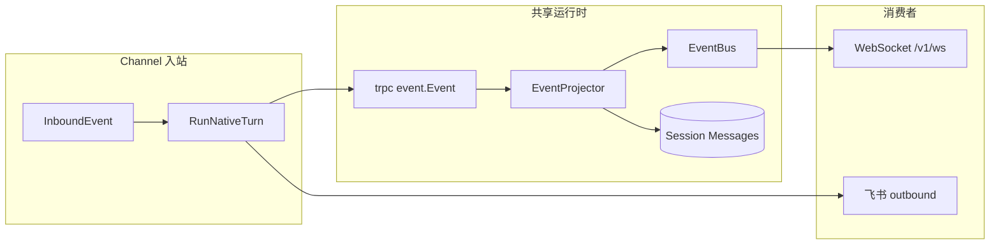
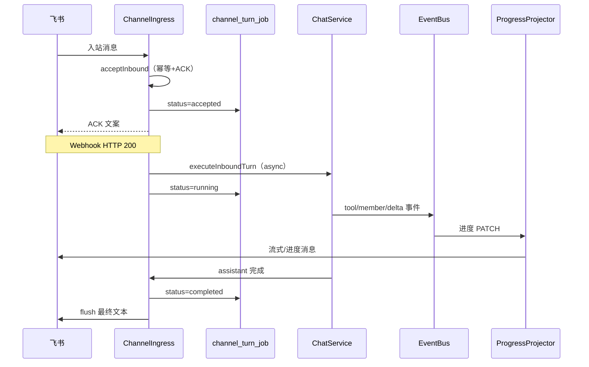

# Channel × Agent × Team × 会话消息 — 集成设计

> 对应业务说明：[17-channel-agent-team-integration.md](./17-channel-agent-team-integration.md)  
> **目标态架构（1 Turn + 2 Projections + 3 Anchors）**：[55-chat-channel-cursor-solution.md §1.5](../需求/55-chat-channel-cursor-solution.md#15-架构收敛模型1-turn--2-projections--3-anchors)  
> 遵循：[AI-DEVELOPMENT-SPECIFICATION.md](../guides/AI-DEVELOPMENT-SPECIFICATION.md) · [AGENT_RUNTIME_BOUNDARY.md](../AGENT_RUNTIME_BOUNDARY.md)  
> **运行时边界**：Channel 与 Chat 均在 `internal/service` 组装 `trpc-agent-go`；`internal/biz` 不 import 框架。

---

## 一、模块职责矩阵（实现视角）

| 层 | 包/锚点 | 职责 | 禁止 |
|----|---------|------|------|
| 接入 | `internal/channel/lark/*`、`channel_ingress*.go` | 验签、解析 `InboundEvent`、出站/流式 | 调用 LLM、解析 Agent 配置 |
| 路由 | `internal/biz/channel_routing.go` | `ParseChannelRouting`、`ResolveChannelTarget`、`PeerKeyForSession` | 创建 Runner |
| 会话绑定 | `channel_peer_session` + `channel_ingress_session.go` | peer → `session_id` 稳定映射 | 修改已存在 Session 的 owner |
| 运行时 | `ChatService.RunNativeTurn*`、`chat_native.go` | Agent Turn / Team Turn、落库、EventBus | — |
| 编排 | `internal/team` | Team 定义 → trpc Team Runner | — |
| 能力 | `internal/agent` + `internal/biz/agent_*` | `BuildTRPCLLMAgent`、工具/记忆装配 | — |
| 消息 | `internal/biz/session_usecase`、Event 投影 | `ChatMessage`、Envelope | Channel 专用消息表（无，复用 Session） |
| 实时 | `internal/event` + `/v1/ws` | Envelope 多路复用 | Channel 独立 Broker |

---

## 二、端到端数据流（飞书 WS）

```
larkws / webhook
  → port.InboundEvent { PeerID, Text, OutboundMeta, ... }
  → ChannelIngress.ProcessInbound
       ├ channel_ingress_access.go   (allowed_* / require_mention)
       ├ ParseChannelRouting
       ├ PeerKeyForSession(dm_scope, peer_id)
       ├ ensureChannelSession → sessions.Create(owner_type, agent_id|team_id)
       ├ prepareChannelChatRequest → SendChatMessageRequest{ session_id, content, team_id? }
       └ runChatTurn / runChatTurnStreaming
            → ChatService.RunNativeTurnUnary|Streaming
                 ├ owner_type=agent → runSingleAgentViaTRPC
                 └ owner_type=team  → teamsNative.RunTurn
  → assistant ContentMarkdown
  → enqueueOutboundReply | StreamSender.Update (streaming_enabled)
```

**关键代码锚点**：

```62:88:internal/service/channel_ingress_session.go
func (h *ChannelIngress) prepareChannelChatRequest(...) (*chatv1.SendChatMessageRequest, error) {
	// ParseChannelRouting → ensureChannelSession → SendChatMessageRequest
	// team 会话时设置 req.TeamId
}
```

```85:113:internal/biz/channel_routing.go
func ResolveChannelTarget(...) (ownerType, agentID, teamID string, err error) {
	// rules → default_team_id → default_agent_id (UUID 或 agent_key)
}
```

```218:251:internal/service/chat_native.go
	if strings.EqualFold(strings.TrimSpace(sess.OwnerType), "team") {
		// teamsNative.RunTurn — 与 Web Chat Team 会话同路径
	}
```

---

## 三、绑定模型

### 3.1 三张表语义

| 表 | 键 | 值 | 说明 |
|----|----|----|------|
| `channel` | `id` / `key` | `config_json`（含 routing、access、streaming） | 一个飞书应用实例 |
| `channel_peer_session` | `(channel_id, peer_key)` | `session_id` | IM 对端与会话 1:1（在 dm_scope 语义下） |
| `sessions` | `id` | `owner_type`, `agent_id`, `team_id` | 会话归属**创建时**写入 |

### 3.2 `dm_scope` 与 `peer_key`

| dm_scope | peer_key | 业务含义 |
|----------|----------|----------|
| `main` | `""` | 全 Channel 共用一个 Session（适合全群广播助手） |
| `per-channel-peer`（默认） | `peer_id` | 每个 IM 对端独立 Session（私聊用户 / 群 ID 各一会话） |
| `per-peer` | `peer_id` | MVP 与 per-channel-peer 相同 |

飞书 WS 入站：`PeerID` 多为 `open_id`；群场景 `OutboundMeta.chat_id` 用于群白名单与出站 recipient。

### 3.3 路由变更策略（现状 vs 建议）

| 策略 | 现状 | 建议（产品+实现） |
|------|------|-------------------|
| 修改 `default_agent_id` | 已存在 `channel_peer_session` **不变** | 文档明确；可选提供「重置 peer 绑定」运维操作 |
| 修改 `default_team_id` | 同上 | 同上 |
| 修改 `rules` | 仅影响**新 peer 模式**下未建绑定的入站 | 规则变更审计日志 |
| Agent 删除 | `ResolveChannelTarget` NotFound | Channel 保存时校验 + 列表展示引用 |

---

## 四、Team 与消息机制在 Channel 路径上的行为

### 4.1 Team Turn

- Channel 准备的 Session 若 `owner_type=team`，`runNativeAgentTurn` 走 `teamsNative.RunTurn`，与 Web Chat 选择 Team 一致。
- `team_runs` / `team_run_steps` 正常写入；`EventProjector` 仍会向 `EventBus` 发布 `member_delta` 等。
- **IM 出站**：`processInboundCore` 仅取 `assistantMsg.ContentMarkdown` 全文；**不**把成员条投影到飞书（除非后续做「卡片分段」产品）。

### 4.2 单 Agent Turn

- `sess.AgentID` 驱动 `hydratedAgent` → `BuildTRPCLLMAgent` → `runSingleAgentViaTRPC`。
- 工具调用、FlowLog 仍产生 Envelope；飞书用户默认只见文本（或流式 PATCH 的文本）。

### 4.3 与 [51 消息机制](./51%20消息机制.md) 的关系



- **真相源**：trpc `event.Event` → 投影 → Envelope + DB 消息。
- **Channel 额外约束**：出站适配器只消费**文本聚合结果**（流式时由 `OnReplyDelta` 推平台）。
- **可观测**：运维应用 `session_id`（来自 `channel_peer_session`）在 Monitor / Session 页订阅 WS，与 Web Chat 共用 Envelope 类型。

### 4.4 长任务路径

> **需求**：[17 channel.md §8](./17%20channel.md#8-长任务场景飞书-channel) · **设计**：[17 channel.design.md §十二](./17%20channel.design.md#十二长任务异步执行设计)

**现状问题**（2026-05-22）：

```
Webhook: processInboundHTTP 同步 ProcessInbound → 阻塞至 Turn 结束
Channel: runChatTurn → RunNativeTurnUnary → 最长 5min
入队:    hasActive → EnqueueUserMessage → reply="" → 无 IM 出站
Team:    teamsNative.RunTurn 数分钟 → 仅最终 ContentMarkdown 回飞书
```

**目标数据流（Phase E）**：



**与 Team / Chat 边界**：

| 层 | 长任务职责 |
|----|------------|
| `ChatService` | Session 锁、Turn 超时（可被 Channel ctx 覆盖）、pending queue |
| `teamsNative.RunTurn` | 成员编排、落库、`member_*` Envelope（不变） |
| `ChannelIngress` | ACK、Job、IM 投影；**不**解析 Team 图 |
| `ChannelProgressProjector` | 消费 Envelope → 飞书 PATCH；Web Chat UI 不变 |

**TurnOutcome 契约**（service 层，Web RPC 兼容）：

| Outcome | IM 动作 | Session 消息 |
|---------|---------|--------------|
| `completed` | flush 回复 | user + assistant 落库 |
| `queued` | `ack_on_queued` | 仅 user 入 pending |
| `failed` / `timeout` | 错误文案 | 按 Turn 错误策略 |

---

## 五、差距清单与实现建议

| ID | 项 | 状态 | 建议实现 |
|----|-----|------|----------|
| I-01 | 路由 UI：`dm_scope`、`rules` | 🟡 | `dm_scope` 下拉 ✅；`rules` 表 ⏳ |
| I-02 | 路由变更迁移 | ✅ | `UpdateChannel` 在 `RoutingTargetChanged` 时 `DeleteByChannelID` |
| I-03 | Agent 被 Channel 引用列表 | ✅ | `biz.ListChannelsReferencingAgent` + `AgentChannelRefsSection.vue` |
| I-08 | Web Chat 同步 Channel Turn | ✅ | `web/.../useChatInboundSync.ts` + `sessions.metadata_json.source=channel` |
| I-04 | Team 飞书卡片化中间步骤 | ❌ | 可选：`config_json.config.team_notify_mode=summary|steps` |
| I-05 | Channel Turn 与 WS 默认订阅 | 🟡 | 文档约定；可选在 Envelope 加 `source=channel` |
| I-06 | `ensureChannelSession` 忽略 routing 解析的 agent/team | 代码 smell | 创建 Session 时已用 `ResolveChannelTarget`；删除无用 `_ = ownerType` 或用于校验一致性 |
| I-07 | 并发入站 | 🟡 Session 锁 | 与 Web Chat 相同：`lockSession` + enqueue；飞书侧重试由平台保证 |
| I-09 | Webhook 同步阻塞 Turn | ❌ Phase E1 | `acceptInbound` + HTTP 200 后 async execute |
| I-10 | 入队无 IM 反馈 | ❌ Phase E1-4 | `TurnOutcome=queued` → `ack_on_queued` |
| I-11 | 长静默无进度 | ❌ Phase E4 | `ChannelProgressProjector` + `progress_mode` |
| I-12 | Turn Job 审计 | ❌ Phase E3 | `channel_turn_job` 表 |
| I-13 | Channel 级 Turn 超时 | ❌ Phase E2 | `turn_timeout_sec` / `first_byte_timeout_sec` |
| I-14 | 超长任务 async | ❌ Phase E6 | `execution_mode` → Graph/Cron |

---

## 六、推荐业务配置模板（飞书）

### 6.1 单 Agent 客服

```json
{
  "routing": {
    "default_agent_id": "customer-service",
    "dm_scope": "per-channel-peer"
  },
  "config": {
    "require_mention": true,
    "streaming_enabled": true
  }
}
```

### 6.2 Team 流水线（群聊）

```json
{
  "routing": {
    "default_team_id": "<team-uuid>",
    "dm_scope": "per-channel-peer"
  },
  "config": {
    "require_mention": true,
    "allowed_group_ids": ["oc_xxx"],
    "streaming_enabled": true,
    "turn_timeout_sec": 900,
    "progress_mode": "steps",
    "ack_message": "收到，Team 流水线已启动…"
  }
}
```

### 6.3 多群分流（规则）

```json
{
  "routing": {
    "default_agent_id": "main",
    "rules": [
      { "peer_pattern": "oc_sales_*", "team_id": "<sales-team-uuid>" },
      { "peer_pattern": "oc_support_*", "agent_id": "support-bot" }
    ]
  }
}
```

---

## 七、测试与验收映射

| 验收 ID | 测试建议 |
|---------|----------|
| CAT-01 | 集成：`ProcessInbound` + 同 peer 二次入站同 `session_id` |
| CAT-02 | `owner_type=team` + `team_runs` 计数 + 飞书 mock outbound |
| CAT-03 | 改 routing 后旧 peer session `agent_id` 不变 |
| CAT-04 | `channel_ingress_access_test.go` |
| CAT-05 | `streaming_enabled` + `stream_outbound` 假客户端 |
| LT-01 | mock 慢 Turn + ACK 时序断言 |
| LT-03 | active run + 第二条入站 → queued outbound |

---

## 八、文档修订记录

| 版本 | 日期 | 说明 |
|------|------|------|
| 1.0 | 2026-05-22 | 集成设计首版：数据流、绑定模型、Team/消息机制、差距表 |
| 1.1 | 2026-05-22 | §4.4 长任务路径；差距 I-09–I-14；Team 模板增长任务配置 |
