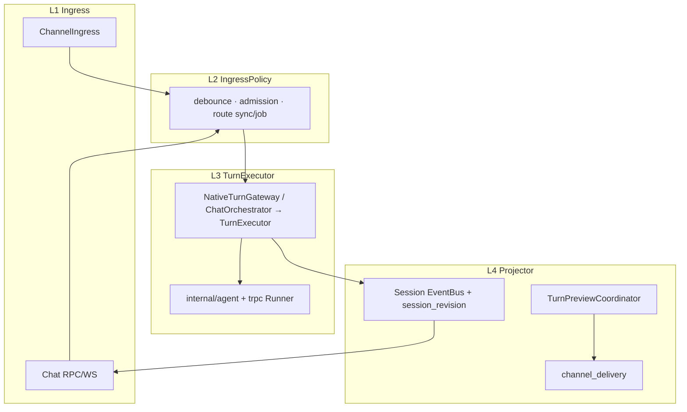

# Channel × Chat 外部参考借鉴手册（GoClaw + trpc OpenClaw）

> **版本**：2026-05-24 | **状态**：🟢 Phase G-a/b/c 任务卡已落地（CH-BOR-01–14）；参考手册正文不变  
> **模块**：M17 Channel · M55 Chat×Channel · M40 Runner  
> **上级索引**：[docs/README.md §5.2 Channel](../README.md#52-需求与设计) · [17-channel-development.md](./17-channel-development.md) · [55-chat-channel-cursor-solution.md](./55-chat-channel-cursor-solution.md)  
> **Review**：[2026-05-24-Channel-External-Reference-Playbook-Review.md](../review/2026-05-24-Channel-External-Reference-Playbook-Review.md)

---

## 1. 文档定位

本文整理 **GoClaw**（独立 Gateway 参考）与 **trpc-agent-go OpenClaw**（框架内 Channel/Gateway 参考）中，适合 Aranea 借鉴的工程模式。

**本文做三件事：**

1. **边界**：什么值得学、什么不要搬。
2. **对照**：外部能力与 Aranea 现有落点的映射表。
3. **落地**：带 ID 的任务卡（`CH-BOR-*`），供 AI / 人类按优先级执行。

**不变量（实施时不得破坏）：**

- `internal/biz` 不 import `pkg/trpc-agent-go`
- Channel 只依赖 `biz.NativeTurnGateway`，不直接 `runner.Run`
- Web 与 Channel **共用** `ChatOrchestrator` 一条 Turn 路径
- Web 增量同步靠 **`session_revision`（`sync` / `completed`）**，不靠 IM 事件 alone
- Runner 装配只在 `internal/service`；`internal/server` 只做传输

---

## 2. 外部参考架构速览

### 2.1 GoClaw（单进程 MessageBus 中枢）

```
IM Adapter → Inbound Bus → Scheduler（Lane + SessionQueue）→ Agent Loop → LLM
                ↑                                              ↓
           debounce/dedupe                          Outbound Bus + WS agent 事件
```

**强项**：调度策略、忙线 intent、入站 debounce、Run 级 IM 预览、Provider 错误分类、输出 sanitize。

**弱项（相对 Aranea）**：无 DB session、无 revision cursor、单 Bus 全耦合、string session key 作主键。

### 2.2 trpc OpenClaw（`pkg/trpc-agent-go/openclaw`）

```
Channel Plugin → gwclient → gateway.Server → runner.Run → event 流拼 reply → SendText
```

**核心包：**

| 包 | 职责 |
|----|------|
| `openclaw/channel` | 最小 Channel 接口（`ID` / `Run` / `TextSender`） |
| `openclaw/internal/gateway` | 入站 normalize、session ID 推导、per-session 串行、allowlist/mention |
| `openclaw/gwclient` | Channel 进程内调 Gateway，无 HTTP hop |
| `openclaw/app` | 可运行 wiring（demo，非生产网关） |

**Aranea 等价物**：`NativeTurnGateway` + `ChatOrchestrator`（能力更全：Ent session、EventBus、async delivery、L0–L4 Memory）。

### 2.3 Aranea 目标态（四层模型）

> **权威正文**：[0-module-decoupling-architecture.md §3.1](./0-module-decoupling-architecture.md#31-推荐目标架构channel--chat--agent)  
> 公式：**1 Turn 真相源 + 2 投影（Web / IM）+ 4 层（Ingress / Policy / Turn / Projector）**



**与本文 CH-BOR 的对应**：L2 ← CH-BOR-01–06；L3 ← Phase B2 TurnExecutor；L4 ← CH-BOR-07–09 + M55 revision/TurnBlock。

---

## 3. 借鉴边界

### 3.1 建议借鉴（模式 / 能力）

| 来源 | 借鉴什么 |
|------|----------|
| GoClaw | Session 队列三模式、忙线 intent、Ingress debounce/dedupe、Run 级 preview 注册、block/final 去重、Provider 错误 taxonomy、输出 sanitize、Lane 并发、mid-loop compaction |
| OpenClaw | Channel 最小接口契约、Gateway 入站 normalize、per-session lock、allowlist/mention、`local_key` 式路由 metadata |
| Aranea 已有 | `NativeTurnGateway`、`session_revision`、双 EventBus、async delivery、`TurnPreviewCoordinator` |

### 3.2 不建议照搬

| 做法 | 原因 |
|------|------|
| GoClaw 单 MessageBus 承载一切 | Session/Monitor 双 Bus 已解决 flow 淹没 chat |
| GoClaw 无 revision、全靠 WS 拉 history | Web 旁观 Channel 时 revision cursor 更可靠 |
| OpenClaw string session key 作主键 | 与 Ent DB session、peer binding 不兼容 |
| OpenClaw `app` 整包替换 `ChannelIngress` | 缺 Kratos、Turn Job、Memory、异步 IM 投递 |
| OpenClaw Gateway HTTP 同步 reply | Aranea async `channel_delivery` + 重试更适合生产 IM |
| OpenClaw Telegram/stdin 栈原样复制 | 平台 adapter 留在 `internal/channel/*`，接口对齐即可 |

---

## 4. 能力对照与 Aranea 落点

| # | 借鉴项 | 来源 | Aranea 落点 | 现状 | 优先级 |
|---|--------|------|-------------|------|--------|
| 1 | Session 队列三模式（queue / followup / interrupt） | GoClaw | `turn_admission.go` · `PendingMessageQueue` · `channel_config_helpers.go` | interrupt ✅；followup 合并 ❌ | **P0** |
| 2 | 忙线 Intent 分类（cancel / status / steer / new_task） | GoClaw | `channel_ingress_turn.go` · `HasActiveRun` 分支 | 规则版部分有 | **P0** |
| 3 | Ingress debounce + dedupe | GoClaw · OpenClaw | `channel_ingress_execute.go` 前层 · `lark/inbound_batch*.go` | 飞书 batch 局部有 | **P1** |
| 4 | Run 级 preview 注册（runID → chat/thread/message） | GoClaw | `channel_turn_preview.go` | EventBus 驱动，缺显式 registry | **P1** |
| 5 | Block reply 与 final outbound 去重 | GoClaw | preview + `channel_delivery_worker.go` | `FlushFinalText` 局部 | **P1** |
| 6 | Provider 错误 taxonomy → Channel 文案/策略 | GoClaw | `internal/provider` · `formatChannelTurnError` | 字符串匹配为主 | **P1** |
| 7 | 路由 metadata `local_key` 契约 | GoClaw · OpenClaw | `port.InboundEvent` · `OutboundMeta` · Channel 配置文档 | 散落特判 | **P2** |
| 8 | 上下文接近上限时自适应降并发 | GoClaw | admission · `patchSessionContextUsage` | 未联动 | **P2** |
| 9 | 输出 sanitize 管道 | GoClaw | agent stream → EventBus 投影前 | 未统一 | **P2** |
| 10 | Lane 全局并发（main / cron / team） | GoClaw | `internal/runtime` · `RunRegistry` | per-session 为主 | **P3** |
| 11 | Mid-loop compaction hook | GoClaw | `internal/compress` · durable/background turn | Memory 有，Turn 前 hook 未统一 | **P3** |
| 12 | OpenClaw per-session lock | OpenClaw | `RunRegistry` · `DecideTurnAdmission` | ✅ 已有 | 参考 |
| 13 | OpenClaw mention / allowlist | OpenClaw | `channel_ingress` gate · `allowed_user_ids` | ✅ 部分已有 | 参考 |
| 14 | OpenClaw Channel 接口形状 | OpenClaw | `internal/channel/surface.go` | ✅ 已对齐 | 参考 |

**代码锚点（Aranea）：**

- Turn 入口：`internal/biz/turn_input.go`（`NativeTurnGateway`）
- Orchestrator：`internal/service/chat_orchestrator_turn.go`
- Channel 执行：`internal/service/channel_ingress_*.go`
- Admission：`internal/service/turn_admission.go`
- Preview：`internal/service/channel_turn_preview.go`
- 平台 adapter：`internal/channel/lark/` 等

**代码锚点（外部，只读对照）：**

- GoClaw scheduler：`internal/scheduler/queue.go`（外部仓库）
- GoClaw intent：`internal/agent/intent_classify.go`
- OpenClaw gateway：`pkg/trpc-agent-go/openclaw/internal/gateway/`
- OpenClaw channel：`pkg/trpc-agent-go/openclaw/channel/channel.go`

---

## 5. 主题详解

### 5.1 调度与并发（GoClaw）

**Session 队列三模式**

| 模式 | 行为 |
|------|------|
| `queue` | 当前 turn 结束后按序处理 |
| `followup` | 合并为一条 follow-up，避免无限堆队 |
| `interrupt` | 取消当前 run，立即处理新消息 |

**还要补：** 群聊 session 并发上限（如 3）vs DM（1）；全局 Lane 防止 Cron/Team/Channel 争抢。

**忙线 Intent**

| Intent | 动作 |
|--------|------|
| `cancel` | `CancelRun` |
| `status` | 回进度，不 enqueue |
| `steer` | 注入 steer 上下文，不新开 turn |
| `new_task` | 正常 queue / interrupt |

实现建议：规则快路径（`/stop`、`?`、`/background`）+ 可选小模型；Web Chat 与 Channel 共用分类结果类型。

### 5.2 入站与路由（GoClaw + OpenClaw）

- **Debounce**：短窗口（如 800ms）合并连发，在 `executeInboundTurn` **之前**。
- **Dedupe**：平台 `message_id` 窗口去重（如 20min），与飞书 idempotency 上提为 Ingress 统一层。
- **Session ID**：OpenClaw 规则 `channel:dm:from` / `channel:thread:thread` 可 **文档化** 用于 debug；运行时仍以 DB session + peer binding 为准。
- **`local_key`**：thread_id、reply_in_thread 等只允许通过 `OutboundMeta` 透传，禁止 adapter 散落硬编码。

### 5.3 IM 预览与出站（GoClaw）

- **RegisterRun**：`runID ↔ previewMessageID ↔ local_key`，并发群聊不串线。
- **Block/final 去重**：intermediate block 已发 IM 时，finalize 不再重复全文；与 `FlushFinalText` 合并为统一策略表。

### 5.4 LLM 与 Agent 运行时

- **Provider 错误 taxonomy**：rate_limit / auth / context_overflow → retry / failover / compact / 用户文案。
- **Sanitize**：thinking tag、畸形 tool XML 在 stream → EventBus 前清洗。
- **Compaction**：durable/background turn 开始前 hook `internal/compress`，与 `/background` 产品路径一致。

---

## 6. 落地任务卡（CH-BOR-*）

> 任务卡写入 [17-channel-development.md §13](./17-channel-development.md#13-phase-g--外部参考借鉴ch-bor) 进度表；完成时在 changelog 记摘要，不在本文堆修复记录。

### Phase G-a — P0（约 1–2 周）

| ID | 优先级 | 内容 | 落点 | 验收 |
|----|--------|------|------|------|
| CH-BOR-01 | P0 | `followup` 队列模式：忙线时合并 pending 为一条 | `PendingMessageQueue` · ingress | 连发 3 条 → 仅 2 turn；第二条 content 为合并文本 |
| CH-BOR-02 | P0 | 群聊 / DM 并发上限配置化 | admission · channel config | 群聊 N=3 时第 4 条 busy/queue；DM N=1 |
| CH-BOR-03 | P0 | 忙线 intent 规则版：cancel / status / steer | `channel_ingress_turn.go` | `/stop` 取消；`?` 回 phase；steer 不新开 turn |
| CH-BOR-04 | P0 | intent 结果写入 FlowLog + metrics | `internal/metrics` | `aranea_channel_busy_intent_total{intent=...}` |

### Phase G-b — P1（约 1–2 周）

| ID | 优先级 | 内容 | 落点 | 验收 |
|----|--------|------|------|------|
| CH-BOR-05 | P1 | Ingress 统一 debounce（平台无关） | `channel_ingress_execute.go` | 800ms 内连发仅 1 turn |
| CH-BOR-06 | P1 | Ingress 统一 dedupe（message_id TTL） | ingress · idempotency store | 重复 message_id 忽略 |
| CH-BOR-07 | P1 | Run 级 preview registry | `channel_turn_preview.go` | 并发群聊 preview 不串 thread |
| CH-BOR-08 | P1 | Block/final outbound 去重规则 | preview · delivery | 已有 preview 时不 duplicate final |
| CH-BOR-09 | P1 | Provider 错误 taxonomy | `internal/provider` · ingress errors | rate_limit → 退避文案；overflow → /background 引导 |

### Phase G-c — P2/P3（按需）

| ID | 优先级 | 内容 | 落点 | 验收 |
|----|--------|------|------|------|
| CH-BOR-10 | P2 | `local_key` / `OutboundMeta` 契约文档 + 校验 | `port/` · 17 channel.design | 新平台 checklist | ✅ |
| CH-BOR-11 | P2 | context usage > 阈值 → admission 降并发 | admission · context patch | 超 60% 时 reject busy 或 force queue | ✅ |
| CH-BOR-12 | P2 | stream sanitize 管道 | agent / event 投影 | IM preview 无空 thinking 泄漏 | ✅ |
| CH-BOR-13 | P3 | Lane scheduler（main/cron/team） | `internal/runtime` | 压测下 Cron 不饿死 Channel | ✅ |
| CH-BOR-14 | P3 | durable turn 前 compaction hook | compress · orchestrator | 超长 turn checkpoint 前 compact | ✅ |

### 推荐迭代顺序

```
Phase G-a（P0）
  CH-BOR-03 → CH-BOR-01 → CH-BOR-02 → CH-BOR-04

Phase G-b（P1）
  CH-BOR-05/06 → CH-BOR-07 → CH-BOR-08 → CH-BOR-09

Phase G-c（P2/P3，与 M55 / Memory 排期对齐）
  CH-BOR-10 → CH-BOR-11 → CH-BOR-12 → CH-BOR-13/14
```

### 验证命令（实施后）

```bash
go test ./internal/service/ -run 'TurnAdmission|ChannelIngress|TurnPreview|FormatChannelTurn|DECO01|ContextPressure' -count=1
go test ./internal/channel/port/... ./internal/channel/preview/... -count=1
go test ./internal/runtime/... -count=1
make runtime-boundary
```

---

## 7. 与现有文档关系

| 文档 | 关系 |
|------|------|
| [17 channel.design.md](./17%20channel.design.md) | 架构真相源；`local_key` 契约应回写 §出站路由 |
| [17-channel-development.md §11 Phase F](./17-channel-development.md#11-phase-f--hermes-飞书借鉴p1p2) | Hermes **平台特化**借鉴；本文 **跨平台调度/网关**借鉴 |
| [17-channel-development.md §14 Phase DECO](./17-channel-development.md#14-phase-deco--四层架构解耦deco) | 四层解耦落地 **DECO-01–15**；CH-BOR 在 DECO-c/e 阶段衔接 |
| [55-chat-channel-cursor-solution.md](./55-chat-channel-cursor-solution.md) | M55 主方案；revision / TurnBlock / Job 面板优先于 G-b 部分项 |
| [0-system-development.md §2](./0-system-development.md#2-标杆架构对照) | OpenClaw 标杆；本文补充 GoClaw 对照 |
| [guides/trpc-agent-go-framework.md](../guides/trpc-agent-go-framework.md) | 核心 Runner 接口；OpenClaw 为子目录参考 |
| [0-module-decoupling-architecture.md §3.1](./0-module-decoupling-architecture.md#31-推荐目标架构channel--chat--agent) | **四层目标架构**权威正文；迁移 **[DECO-*](./17-channel-development.md#14-phase-deco--四层架构解耦deco)** |

---

## 8. 文档修订记录

| 版本 | 日期 | 说明 |
|------|------|------|
| 1.0 | 2026-05-24 | 初版：GoClaw + OpenClaw 借鉴整理、对照表、CH-BOR 任务卡 |
| 1.1 | 2026-05-24 | §2.3 对齐解耦文档 §3.1 四层目标架构 |
| 1.2 | 2026-05-24 | §7 链入 Phase DECO 任务板 |
