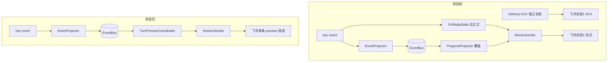
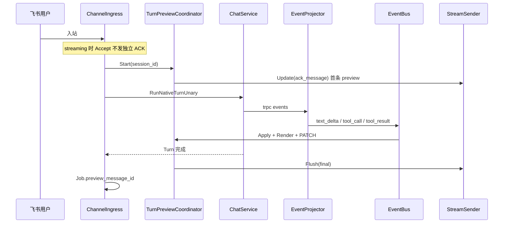
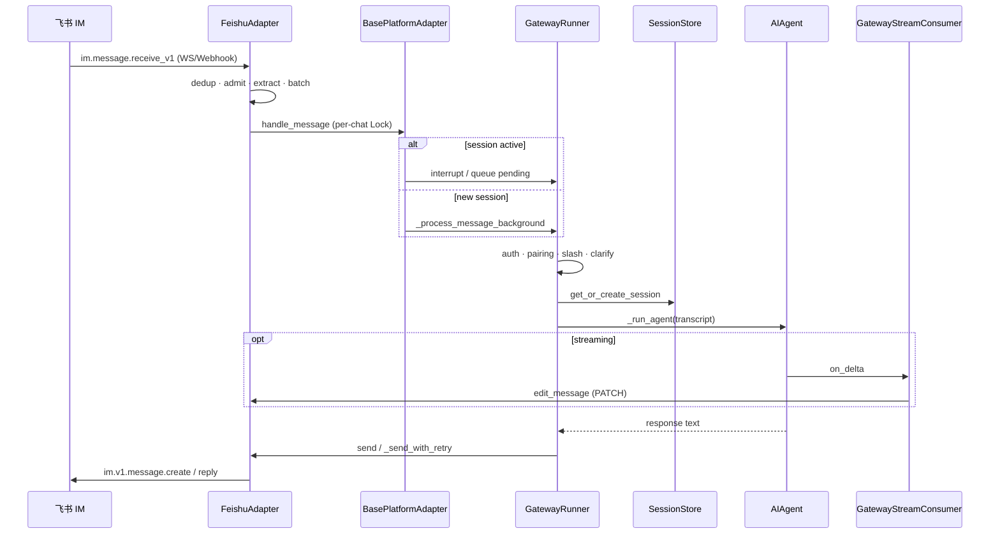
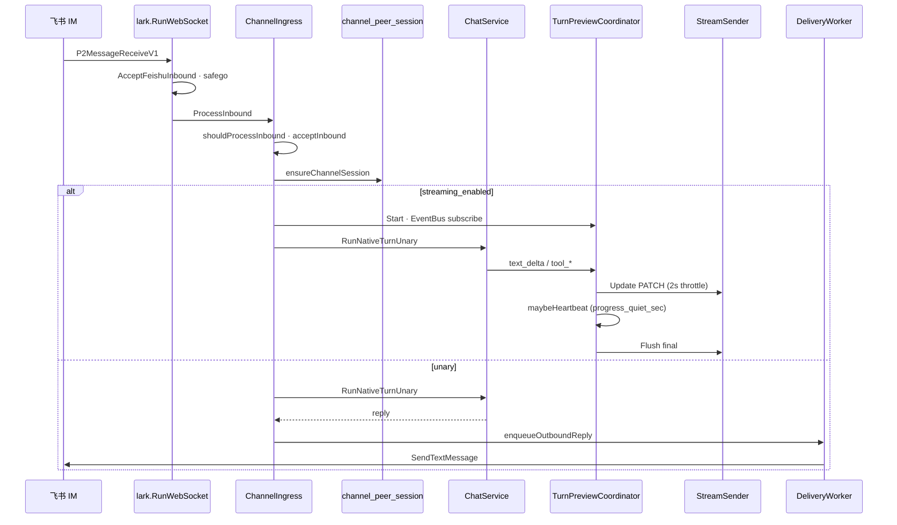

# Channel 渠道 — 实现设计文档

> 对应需求：[17 channel.md](./17%20channel.md)  
> **跨模块集成**：[17-channel-agent-team-integration.md](./17-channel-agent-team-integration.md) · [integration.design.md](./17-channel-agent-team-integration.design.md)  
> 遵循：[AI-DEVELOPMENT-SPECIFICATION.md](../guides/AI-DEVELOPMENT-SPECIFICATION.md)、[AGENT_RUNTIME_BOUNDARY.md](../guides/AGENT_RUNTIME_BOUNDARY.md)  
> 平台连接参考：[MuseBot](https://github.com/yincongcyincong/MuseBot) `robot/` + `http/`（MIT）；飞书 IM 行为对照 [Hermes Agent](https://github.com/NousResearch/hermes-agent) `gateway/platforms/feishu.py` — 见 **§十二**

> **文档边界**：本文档只描述架构设计、代码分层、Proto/API 契约、数据模型、接口定义、技术选型、状态机、序列图。用户故事、功能需求清单见 [17-channel.md](./17-channel.md)；开发进度、Phase 划分、任务清单、改动文件清单见 [17-channel.development.md](./17-channel.development.md)。

---

## 一、模块概述

Channel 在 **Kratos 传输层** 负责外部 IM 平台连接：凭据管理、入站标准化、路由到 Agent/Team、异步出站。

**设计原则**：

1. **只移植 MuseBot 的连接层**（SDK 初始化、收消息、发消息、验签）— 不移植 `Robot` 接口内的 LLM/`requestLLM`/`executeLLM`
2. **DB 多实例** — 每个 `channel` 行独立连接；非 MuseBot 全局 singleton
3. **双入站路径** — Webhook（✅）+ Runtime 长连接（✅ scaffold，见 `internal/channel/runtime/`）
4. **`internal/biz` 禁止 import trpc-agent-go** — Agent 调用仅在 `internal/service`

### 1.1 与 MuseBot / Aranea 架构差异

| 维度 | MuseBot | Aranea |
|------|---------|--------|
| 配置 | 全局 `conf.BaseConfInfo` + 环境变量 | DB `channel` + `channel_credential`（多实例、多 Agent） |
| 启动 | `StartRobot()` 按非空 token 启 goroutine | `ChannelRuntimeManager` 按 enabled 实例启连接 |
| 入站 | 平台文件内 `go RobotInfo.Exec()` | 统一 `ChannelIngress` / Runtime → `ChatService` |
| 出站 | `RobotInfo.SendMsg()` 巨型 type switch | `channel_delivery` worker + 平台 `SendText` |
| LLM | 耦合在 `Robot` 接口 | **禁止**；`internal/biz` 不触达 LLM |

> **实现状态**：开发进度、Phase 完成情况、红线合规性见 [17-channel.development.md §2 现状评估](./17-channel-development.md#2-现状评估) 与 [§17 Phase I-N](./17-channel-development.md#17-phase-i--代码审查优化go-oop--项目红线合规)。

---

## 二、架构与数据流

```
┌─────────────────────────────────────────────────────────────────┐
│ 入站 A：Webhook（已实现）                                          │
│   POST /webhooks/{channel_key}  →  ChannelIngress               │
└────────────────────────────┬────────────────────────────────────┘
                             │
┌────────────────────────────▼────────────────────────────────────┐
│ 入站 B：Runtime（已实现）                                         │
│   ChannelRuntime.Start → Manager.Reload(reconcile)               │
│     ├ feishu:   larkws.Client          [MuseBot lark.go]         │
│     ├ dingtalk: StreamClient           [MuseBot ding.go]        │
│     ├ slack:    socketmode.Client      [MuseBot slack.go]       │
│     ├ telegram: GetUpdatesChan         [MuseBot telegram.go]    │
│     ├ discord:  discordgo.Session      [MuseBot discord.go]     │
│     └ mattermost: gorilla/websocket    [自研]                    │
└────────────────────────────┬────────────────────────────────────┘
                             │  NormalizedInbound { channelID, peerID, text, meta }
                             ▼
┌─────────────────────────────────────────────────────────────────┐
│  internal/service/channel_consumer.go（规划，逻辑同 ingress）      │
│   ParseChannelRouting → ResolveChannelTarget                     │
│   channel_peer_session → Session                                 │
│   ChatService.RunNativeTurnUnary                                 │
│   enqueueOutboundReply                                           │
└────────────────────────────┬────────────────────────────────────┘
                             ▼
┌─────────────────────────────────────────────────────────────────┐
│  channel_delivery → ChannelDeliveryWorker → platform SendText    │
│  Phase 2: StreamSender（MsgChunk → edit message）                │
└─────────────────────────────────────────────────────────────────┘
```

---

## 三、Adapter 接口（`internal/channel/`）

MuseBot 的 `Robot` 接口混合了 LLM 与传输；Aranea **拆分为纯传输 port**：

```go
// internal/channel/port.go（规划）

type InboundEvent struct {
    ChannelID      string
    ChannelKey     string
    PlatformType   string
    PeerID         string
    PeerKey        string
    Text           string
    IdempotencyKey string
    Meta           map[string]string // thread_id, reply_target, session_webhook, ...
}

// Connector：长连接平台实现
type Connector interface {
    Identified
    Start(ctx context.Context, cfg RuntimeConfig) error
    Stop(ctx context.Context) error
}

// WebhookAdapter：HTTP 回调平台实现（当前）
type WebhookAdapter interface {
    Verify(ctx context.Context, r *http.Request, creds []biz.ChannelCredential) ([]byte, error)
    ParseInbound(raw []byte, ch biz.Channel) (InboundEvent, error)
}

// OutboundAdapter：出站
type OutboundAdapter interface {
    Identified
    SendText(ctx context.Context, ch biz.Channel, creds []biz.ChannelCredential, ev OutboundPayload) error
}

// StreamOutbound：可选，MuseBot StreamRobot.sendTextStream
type StreamOutbound interface {
    OutboundAdapter
    SendStream(ctx context.Context, ch biz.Channel, target string, chunks <-chan string) error
}
```

现有 `internal/channel/surface.go`（`Identified` / `Runner` / `OutboundText`）逐步收敛到上述 port。

### 3.1 OutboundMeta 契约（CH-BOR-10）

入站 adapter 将平台回复目标写入 `port.InboundEvent.OutboundMeta`；**禁止**在 ingress/service 层散落硬编码路由字段。

| Key | 用途 |
|-----|------|
| `recipient` | 出站 receive_id（飞书必填） |
| `receive_id_type` | open_id / chat_id / … |
| `chat_id` · `chat_type` | 群/DM 路由与白名单 |
| `thread_id` · `reply_in_thread` | 话题线程（F-06） |
| `inbound_message_id` | 幂等 / reaction 锚点 |
| `session_webhook` · `response_url` | 钉钉 / Slack 等 webhook 回复 |
| `x_*` | 平台扩展（校验放行） |

**代码**：`internal/channel/port/meta.go`

- `LocalKeyFromMeta(platform, meta)` — preview/run 路由键（`chat_id:thread_id` 或 `recipient` 回退）
- `ValidateOutboundMeta` — 入站契约告警（`channel_ingress_guard` SysLog）
- `NormalizeOutboundMeta` — 出站透传前 trim

**新平台 checklist**：adapter build 阶段填满必填 meta → 单测 `ValidateOutboundMeta` → 禁止在 `channel_ingress_*` 新增 platform 特判路由字段。

---

## 四、Proto / Biz / Data

### 4.1 Proto

`api/kratos/channel/v1/channel.proto` — CRUD、Catalog、Test、Credentials、Deliveries、TurnJobs。  
Webhook 路由在 `internal/server/http.go`，不进 Proto。

**API 端点表**（service `ChannelService`）：

| RPC | HTTP | 说明 |
|-----|------|------|
| `ListChannelTypes` | `GET /v1/channels/catalog` | 平台目录（bundled / receive_modes / schema） |
| `ListChannels` | `GET /v1/channels` | 实例列表 |
| `GetChannel` | `GET /v1/channels/{id}` | 实例详情 |
| `CreateChannel` | `POST /v1/channels` | 创建实例 |
| `UpdateChannel` | `PATCH /v1/channels/{id}` | 更新实例（含路由变更重置 peer 绑定） |
| `DeleteChannel` | `DELETE /v1/channels/{id}` | 删除实例 |
| `ToggleChannel` | `POST /v1/channels/{id}/toggle` | 启用/禁用 |
| `TestChannel` | `POST /v1/channels/{id}/test` | 测试连接 |
| `ListChannelCredentials` | `GET /v1/channels/{id}/credentials` | 凭据列表（masked） |
| `UpsertChannelCredentials` | `PUT /v1/channels/{channel_id}/credentials` | 凭据 upsert（原子操作） |
| `DeleteChannelCredential` | `DELETE /v1/channels/{channel_id}/credentials/{credential_key}` | 删除凭据 |
| `ListChannelDeliveries` | `GET /v1/channels/{id}/deliveries` | 出站投递记录 |
| `ListChannelTurnJobs` | `GET /v1/channels/{id}/turn-jobs` | Turn Job 列表（长任务审计） |

### 4.2 Biz

| 文件 | 职责 |
|------|------|
| `channel.go` | CRUD、Test commit；`ChannelUsecase` Facade（reader/writer/credentials/deliveries 注入） |
| `channel_catalog.go` | MuseBot 对齐的 13 平台目录 |
| `channel_routing.go` | `ParseChannelRouting`、`ResolveChannelTarget`、`PeerKeyForSession` |
| `channel_access.go` | `allowed_user_ids` / `allowed_group_ids` / `require_mention` 策略解析与判定 |
| `channel_rules.go` | 凭据校验、requiredCredentials |
| `channel_config_helpers.go` | `streaming_enabled` / `ChannelLongTaskConfig` / `ChannelTypeFromConfig` 等配置解析 |
| `channel_turn_job.go` | Turn Job 实体、Repo 接口、状态机、`ParseChannelLongTaskConfig` |
| `channel_turn_errors.go` | `ChannelTurnErrorKind` 类型 + 分类常量 + `FormatChannelTurnErrorMessage` |
| `channel_turn_outcome.go` | `TurnOutcome` 枚举（ok / queued / rejected / error） |
| `channel_delivery.go` | 出站 payload 序列化（`marshalOutboundPayload`）、delivery Repo 接口 |
| `channel_peer_session.go` | peer → session 绑定 |
| `channel_inbound_receipt.go` | 入站幂等 receipt |
| `channel_im_render.go` | `ChannelIMRenderPolicy` 配置解析、legacy `progress_mode` 映射 |
| `channel_web_origin.go` | `ResolveChannelWebOrigin`（web_app_origin / public_webhook_origin） |

### 4.3 Data

| 表 | Ent Schema | 说明 |
|----|------------|------|
| `channel` | `PlatformChannel` | 实例主表（`config_json` / `metadata_json` / `status` / `enabled`） |
| `channel_credential` | `PlatformChannelCredential` | `secret_ref`（enc:/env:）；`(channel_id, credential_key)` 唯一 |
| `channel_delivery` | `PlatformChannelDelivery` | 出站队列（含 `idempotency_key` 唯一索引） |
| `channel_peer_session` | `PlatformChannelPeerSession` | peer → session（`(channel_id, peer_key)` 唯一） |
| `channel_turn_job` | `ChannelTurnJob` | Turn Job 审计（`(channel_id, idempotency_key)` 唯一） |
| `channel_inbound_receipt` | `ChannelInboundReceipt` | 入站幂等（`(channel_id, idempotency_key)` 唯一） |
| `channel_runtime_lease` | `ChannelRuntimeLease` | Runtime 租约（`expires_at` 索引） |

**关键 Schema 字段**：

- `channel.config_json` — `Text` 默认 `"{}"`；存放 routing / access / streaming / long-task 配置
- `channel_credential.secret_ref` — `String` 默认 `""`；支持 `enc:` / `env:` 前缀
- `channel_turn_job.status` — `String` 默认 `"accepted"`；状态机见 §12.5
- `channel_peer_session.peer_key` — `String` 默认 `""` MaxLen 1024；空表示 `dm_scope=main`

---

## 五、Service 层

### 5.1 ChannelIngress（Webhook）

`internal/service/channel_ingress*.go` — 平台 switch → `internal/channel/{lark,dingtalk,wecom,slack,telegram,discord,wechat,onebot,qq,line,mattermost,teams}/webhook.go`

**入站访问控制**（`channel_ingress_access.go`，在 Agent Turn 之前）：

```
InboundEvent + channel.config_json
  → biz.ParseChannelAccessPolicy
  → inboundAccessContextFromEvent(ev)   // PeerID, chat_id, chat_type, mentioned
  → policy.Allows(ctx)
       ├ false → recordDelivery(access_denied) + enqueueOutboundReply(拒绝文案)
       └ true  → ResolveChannelTarget → ChatService
```

| 入站 meta 字段 | 用途 |
|----------------|------|
| `sender_open_id` / `sender_user_id` / `PeerID` | 匹配 `allowed_user_ids` |
| `chat_id` + `chat_type=group` | 匹配 `allowed_group_ids` |
| `mentioned` / `mentions` | 匹配 `require_mention` |

飞书 WS：`internal/channel/lark/parse_message.go` 写入 `sender_open_id`、`chat_type`、`mentioned`。Webhook 路径由 `channel_ingress.go` 补全 `chat_type`（`InferChatTypeFromChatID`）。

**入站门禁（2026-05-22 起）**：

- `lark.AcceptFeishuInbound`（`internal/channel/lark/inbound_gate.go`）：WS / Webhook 统一；仅 `sender_type=user`、必须有 `message_id`、群聊需 @
- `channel_inbound_receipt`（`internal/biz/channel_inbound_receipt.go`）：同一 `feishu:{message_id}` 只 Turn 一次
- `channel_ingress_guard.go`：`TryClaimInbound` 幂等守卫
- 审计：`channel.inbound.receive` · `channel.runtime.connector_start`

详见 [changelog/2026-05-22-Channel-Inbound-Root-Cause.md](../changelog/2026-05-22-Channel-Inbound-Root-Cause.md)。

### 5.2 ChannelRuntimeManager

```go
// internal/service/channel_runtime.go
type ChannelRuntimeManager struct {
    channels *biz.ChannelUsecase
    ingress  *ChannelIngress  // 复用 runChatTurn / enqueueOutboundReply
    runners  map[string]context.CancelFunc
}

func (m *ChannelRuntimeManager) Reload(ctx context.Context) error
func (m *ChannelRuntimeManager) startInstance(ctx context.Context, ch biz.Channel) error
```

启动逻辑参考 MuseBot `StartRobot()`：按 `config_json.type` + `receive_mode` 选择 Connector，**每个 DB 实例一个 goroutine**。

Wire：admin 进程启动时 `Reload()`；Toggle/Update 后触发单实例重启。

**Runtime 子系统**：

| 文件 | 职责 |
|------|------|
| `internal/channel/runtime/manager.go` | `RuntimeManager` + Connector 注册表 + `Reload` reconcile |
| `internal/channel/runtime/supervisor.go` | `runSupervised` 断线重连（指数退避 1s→5m）+ lease 续约 |
| `internal/channel/runtime/connection.go` | 连接状态（`connected_since` / `last_disconnect`） |
| `internal/channel/runtime/credentials.go` | `CredentialsRevision` fingerprint |
| `internal/channel/runtime/config.go` | `RuntimeConfig` + `defaultReceiveMode` |

### 5.3 出站

`channel_delivery_worker.go` — 按 type 分发；钉钉 Webhook 模式用 `session_webhook`（MuseBot 同）；Stream 模式用 OpenAPI（MuseBot `ding.go`）。

**出站路径**：

| 路径 | 文件 | 说明 |
|------|------|------|
| Unary | `channel_ingress_*.go` → `enqueueOutboundReply` → `channel_delivery` 表 → `ChannelDeliveryWorker` | 完整回复异步发送 |
| Stream | `processInboundStreaming` → `RunNativeTurnStreaming` → `trpc_turn.OnReplyDelta` → 平台 `StreamSender.Update` | edit-in-place PATCH |
| Tool Card | `TurnPreviewCoordinator` → `lark/interactive_card.go` | 工具终态 Card（`im_tool_card_mode=feishu_append`） |

**流式出站平台实现**：

| 平台 | 首条 | 增量 | 实现 |
|------|------|------|------|
| `telegram` | sendMessage | editMessageText（2s 节流） | `internal/channel/telegram/stream_outbound.go` |
| `feishu` | im.v1 messages POST | im.v1 messages PATCH | `internal/channel/lark/stream_outbound.go` |
| `slack` | chat.postMessage | chat.update（2s 节流） | `internal/channel/slack/stream_outbound.go` |
| `line` | push message | update message（2s 节流） | `internal/channel/line/stream_outbound.go` |
| `mattermost` | create post | patch post（2s 节流） | `internal/channel/mattermost/stream_outbound.go` |
| 其他 | — | unary 回退 | delivery 队列 |

流式回合不走 outbound delivery 队列；失败写入 `channel_delivery` audit（`status=streamed|error`）。

---

## 六、MuseBot 平台实现对照

| type | Aranea 包 | MuseBot 文件 | MuseBot 连接 | 目标 SDK |
|------|-----------|--------------|-------------|----------|
| `feishu` | `lark/` | `lark.go` | larkws | `larksuite/oapi-sdk-go/v3` |
| `dingtalk` | `dingtalk/` | `ding.go` | StreamClient | `open-dingtalk/dingtalk-stream-sdk-go` |
| `wecom` | `wecom/` | `comwechat.go` | HTTP `/com/wechat` | PowerWeChat work |
| `wecom-app` | `wecom/` | 同上 | 同上 | 同上 |
| `wechat` | `wechat/` | `wechat.go` | HTTP `/wechat` | PowerWeChat officialAccount |
| `slack` | `slack/` | `slack.go` | Socket Mode | `slack-go/slack` + socketmode |
| `telegram` | `telegram/` | `telegram.go` | Long polling | `go-telegram-bot-api/v5` |
| `discord` | `discord/` | `discord.go` | discordgo Open | `bwmarrin/discordgo` |
| `qq` | `qq/` | `qq.go` | webhook + botgo WS | `tencent-connect/botgo` |
| `personal_qq` | `onebot/` | `personalqq.go` | OneBot POST `/onebot` | 自定义 + OneBot HTTP |
| `line` | `line/` | — | — | `line-bot-sdk-go`（仅类型引用） |
| `mattermost` | `mattermost/` | — | — | `gorilla/websocket` + REST API v4 |
| `teams` | `teams/` | — | — | Bot Framework OAuth2 + REST API |

### 6.1 MuseBot HTTP 路由 → Aranea 映射

| MuseBot 路径 | 平台 | Aranea 建议 |
|--------------|------|-------------|
| `/wechat` | 微信公众号 | `/webhooks/{channel_key}` 或 `/channels/wechat/{key}` |
| `/com/wechat` | 企微 | 同上（已实现 wecom handler） |
| `/qq` | QQ 官方 | 专用路由 + botgo 事件 |
| `/onebot` | OneBot | `/webhooks/{channel_key}` + HMAC 验签 |

统一原则：**优先** `/webhooks/{channel_key}`；企微/微信 AES 回调可保留类型前缀便于调试。

### 6.2 从 MuseBot 迁移连接代码 Checklist

1. 阅读 MuseBot `robot/<platform>.go` 中 **Start* / handler / send* 函数**（跳过 `requestLLM`、`ExecCmd`）
2. 提取 SDK 初始化与消息 parse/send 到 `internal/channel/<platform>/`
3. 入站转为 `InboundEvent`，调用 `ChannelIngress.runChatTurn`（或 consumer 等价物）
4. 出站从 `OutboundPayload` 调 MuseBot 同款 API
5. 凭据字段映射到 `channel_credential`（见需求 §5）
6. 添加 `webhook_test.go` 或 integration test
7. catalog `bundled=true`，前端 schema 补字段

**许可证**：MuseBot MIT — 迁移时保留版权声明。

### 6.3 不应从 MuseBot 复制

- `Robot` / `RobotInfo` 整体接口与 LLM 耦合
- 全局变量（`TelegramBot`、`LarkBotClient` 等）— 改为实例级 DI
- `SendMsg()` 巨型 switch — 改为 registry `map[type]OutboundAdapter`
- `go RobotInfo.Exec()` 无界并发 — 使用 bounded worker pool
- MuseBot 内置 HTTP `:36060` 混布 — Webhook 挂 Kratos `internal/server`

> **平台扩展进度**：Phase C / Phase H 的任务板与完成状态见 [17-channel.development.md §4 路线图](./17-channel-development.md#4-路线图) 与 [§16 Phase H](./17-channel-development.md#16-phase-h--新平台扩展line--mattermost--teams)。

---

## 七、流式回复（Phase 2）

MuseBot 模式：

```go
type MsgChan struct {
    NormalMessageChan chan *MsgInfo  // { Content, PartContent, Finished }
    StrMessageChan    chan string    // QQ 专用
}
```

Aranea 映射：

- Agent 流式事件（已有 Envelope/SSE）→ `StreamOutbound.SendStream`
- 平台实现：Telegram `EditMessageText`、飞书卡片更新、Slack `UpdateMessage`
- 配置：`config_json.config.streaming_enabled`

---

## 八、Web 前端

```
web/src/features/channels/
web/src/components/channels/
web/src/domain/channel/        # S23 抽取的纯工具层（re-export stub 在 features）
web/src/pages/ChannelsPage.vue
web/src/stores/channels/
```

- `receive_mode` 下拉：选项来自 catalog `receive_modes`
- 非 bundled 平台：Catalog 展示「即将支持」
- 微信 `active_mode`、钉钉 Stream 凭据分区：Phase 2 schema 驱动
- `useChannelEditorForm.ts` — MuseBot 布局 + composable
- `ChannelTurnJobsPanel.vue` — 长任务 Job 面板（M55-JOB-01）
- `useChatInboundSync.ts` — Web Chat 同步 Channel 入站（DECO-01）

---

## 九、Wire 与运维

| 组件 | 说明 |
|------|------|
| `ChannelService` | gRPC/HTTP API |
| `ChannelIngress` | Webhook |
| `ChannelRuntimeManager` | 长连接 ✅ |
| `ChannelDeliveryWorker` | cron 5s |
| `ChannelHealthScanner` | 10min 健康扫描 |
| `TurnPreviewCoordinator` | IM Preview 投影（订阅 EventBus） |

| 环境变量 | 作用 |
|----------|------|
| `CHANNEL_DELIVERY_DISABLED=1` | 关闭出站 worker |
| `CHANNEL_HEALTH_DISABLED=1` | 关闭健康扫描 |
| `CHANNEL_RUNTIME_DISABLED=1` | 关闭长连接 Runtime |
| `CHANNEL_RUNTIME_RELOAD_INTERVAL` | 定期 Reload 间隔（默认 `2m`；`0`/`off` 关闭） |
| `ARANEA_CREDENTIAL_KEY` | 凭据加密 |

Webhook 默认：`/webhooks/{channel_key}`。

> **Runtime 运维细节**（重连策略、fingerprint、指标）：见 [17-channel.development.md §6 Runtime 运维](./17-channel-development.md#6-runtime-运维)。

---

## 十、测试策略

| 层级 | 内容 |
|------|------|
| `internal/channel/*/webhook_test.go` | 验签、parse |
| `internal/channel/*/connector_test.go` | mock SDK 入出站（规划） |
| `internal/biz/channel_*_test.go` | routing、config、access、turn_job 状态机 |
| `internal/service/channel_*_test.go` | ingress accept/execute、preview、delivery |
| `internal/channel/preview/*_test.go` | transcript、sanitize、split、tool_card |
| E2E | 各平台 sandbox 账号 |

---

## 十一、长任务异步执行设计

> **需求**：[17 channel.md §8](./17%20channel.md#8-长任务场景飞书-channel)  
> **开发计划**：[17-channel-development.md §10](./17-channel-development.md#10-长任务异步执行phase-e)  
> **跨模块 Turn**：[17-channel-agent-team-integration.design.md §4.4](./17-channel-agent-team-integration.design.md#44-长任务路径)

### 11.1 设计目标

| 目标 | 手段 |
|------|------|
| 飞书回调 SLA 与 Turn 解耦 | Ingress **Accept** 与 **Execute** 分两阶段 |
| 单一职责 | Ingress 受理；Worker 执行 Turn；Projector 进度；Delivery 出站 |
| 复用运行时 | `ChatService.RunNativeTurn*`；不新建 Channel 专用 LLM 路径 |
| biz 不触框架 | Job 状态、配置解析在 `internal/biz`；Runner 仅在 `internal/service` |

### 11.2 现状瓶颈（代码锚点）

| 瓶颈 | 位置 | 影响 |
|------|------|------|
| Webhook 同步阻塞 | `channel_ingress_http.go` → `ProcessInboundWebhook` | HTTP 等待 Turn 完成（最长 5min） |
| 入队无 IM 反馈 | `runNativeAgentTurn` 入队返回空 assistant → `enqueueOutboundReply` 跳过空 reply | 用户静默 |
| 全局 Turn 超时 | `trpc_turn.go` `defaultTurnTimeout = 5min` | Team/重工具易超时 |
| 首字节 30s | `trpc_turn.go` `firstByteTimeout` | 工具阶段无 text delta 即失败 |
| 流式仅 text delta | `processInboundStreaming` | 工具/Team 长静默无 PATCH |

WS 入站已异步（`lark/ws.go` `safego.Go` + `HandleWSInbound` `WithoutCancel`），Webhook 需对齐。

### 11.3 目标架构

```
InboundEvent
  → ChannelIngress.acceptInbound()     // 验签、幂等、访问控制、写 Job=accepted、发 ACK
  → HTTP 200 / WS handler return

ChannelTurnWorker / safego
  → ChannelIngress.executeInboundTurn()
       → prepareChannelChatRequest
       → RunNativeTurnStreaming | Unary（ctx 带 Channel 级 timeout）
       → ChannelProgressProjector（可选，订阅 EventBus）
       → StreamSender | enqueueOutboundReply
       → Job=completed|failed|timeout
```

**与 Web Chat 边界**：Turn、Session 锁、pending queue 仍在 `ChatService`；Channel 层只增加 **IM 投影**（ACK / 进度 / 最终文本）与 **Job 审计**。

### 11.4 包职责（SRP）

| 包 / 文件 | 职责 | 禁止 |
|-----------|------|------|
| `internal/biz/channel_turn_job.go` | Job 实体、Repo 接口、状态机、`ParseChannelLongTaskConfig` | import trpc-agent-go |
| `internal/biz/channel_config_helpers.go` | `streaming_enabled` 等已有 helper；扩展 timeout/ack/progress 解析 | Turn 执行 |
| `internal/data/channel_turn_job.go` | Ent schema + Repo 实现 | 业务规则 |
| `internal/service/channel_ingress_accept.go` | `acceptInbound`：幂等、ACK 出站、创建 Job | LLM |
| `internal/service/channel_ingress_execute.go` | `executeInboundTurn`：调 `RunNativeTurn*`、更新 Job | 平台 SDK |
| `internal/service/channel_ingress_http.go` | Webhook：Accept → 200 → async Execute | Turn 逻辑 |
| `internal/service/channel_turn_worker.go` | 扫 Job / 或仅 async goroutine 调度 | 验签 |
| `internal/service/channel_progress_projector.go` | 订阅 EventBus → StreamSender 进度 PATCH（已并入 TurnPreviewCoordinator） | 路由 / Session 创建 |
| `internal/service/trpc_turn.go` | 从 ctx 读取 Channel 注入的 timeout（可选值） | 飞书 API |
| `internal/channel/lark/stream_outbound.go` | 平台 PATCH（已有） | Agent Turn |

### 11.5 数据模型：`channel_turn_job`

| 列 | 类型 | 说明 |
|----|------|------|
| `id` | UUID PK | |
| `channel_id` | FK | |
| `session_id` | string | 绑定 Session |
| `peer_id` / `peer_key` | string | IM 对端 |
| `idempotency_key` | string UNIQUE(channel_id, key) | 与 receipt 对齐 |
| `status` | enum | accepted / running / completed / failed / timeout / cancelled |
| `preview_message_id` | string nullable | 飞书流式消息 ID |
| `error_message` | text nullable | |
| `started_at` / `finished_at` | timestamp | |

SQL 增量：`docs/sql/04_channel.sql`（或新编号文件）；Ent schema 与 migration 随 Phase E1。

**与现有表**：`channel_inbound_receipt` 保幂等；`channel_delivery` 保 unary 出站重试；Job 表保 **Turn 生命周期** 审计。

### 11.6 配置解析（biz）

扩展 `ChannelLongTaskConfig`（自 `config_json.config`）：

```go
type ChannelLongTaskConfig struct {
    AckMessage          string
    AckOnQueued         string
    TurnTimeoutSec      int  // 0 = 用 service 默认
    FirstByteTimeoutSec int
    ProgressMode        string // off | text | steps
    ProgressQuietSec    int
    HeartbeatMessage    string
    ExecutionMode       string // sync | async | auto (P2)
}
```

解析函数放 `internal/biz/channel_config_helpers.go`；Ingress 读取后注入 `context` 或 `SendChatMessageRequest` metadata（**不**写入 proto 对外字段，除非后续 Admin API 需要列表 Job）。

### 11.7 Accept 路径（P0）

**Webhook**（`channel_ingress_http.go`）：

1. `shouldProcessInbound` / `checkInboundAccess`（不变）  
2. `sendAckIfConfigured` → `StreamSender` 首条或 `enqueueOutboundReply`  
3. `w.WriteHeader(200)`  
4. `safego.Go` → `executeInboundTurn(context.WithoutCancel(...))`

**WebSocket**（`lark/ws_inbound.go`）：在现有 `HandleWSInbound` 内先 ACK 再 `ProcessInbound`；最终统一调用 `executeInboundTurn`。

**幂等**：Accept 阶段已 `TryClaimInbound`；Execute 阶段 Job `idempotency_key` 唯一；重复 Execute  no-op。

### 11.8 Execute 路径与 ChatService 集成

**Turn 结果分类**（`executeInboundTurn` 需识别）：

| `RunNativeTurn` 结果 | Channel 行为 |
|---------------------|--------------|
| 正常 assistant 文本 | 流式 flush 或 unary enqueue |
| `EnqueueUserMessage` queued | 出站 `ack_on_queued`；Job=`completed`（受理完成，非 Turn 完成） |
| `EnqueueUserMessage` 拒绝 | 出站拒绝文案；Job=`failed` |
| Turn 错误 / 超时 | `notifyFeishuInboundError` + Job 终态 |

**Channel 级 timeout**：在 `executeInboundTurn` 用 `context.WithTimeout` 包裹；**若 parent 已有更短 deadline 则尊重 parent**（与 `trpc_turn.go` 现有逻辑一致）。

**入队检测**：扩展 `runChatTurn` / `runChatTurnStreaming` 返回 `TurnOutcome`（`biz` 或 `service` 小 struct），避免通过「空 reply」猜测。

### 11.9 IM Preview 投影（TurnPreviewCoordinator，2026-05-23）

> **替代** 原 `ChannelProgressProjector` 与 `OnReplyDelta` 双轨 PATCH；进度语义并入 transcript。

#### 11.9.1 现状 vs 目标



#### 11.9.2 分层职责（SRP）

| 包 | 类型 | 职责 |
|----|------|------|
| `internal/biz` | `ChannelIMRenderPolicy` | 配置解析、legacy `progress_mode` 映射 |
| `internal/channel/preview` | `Transcript` / `RenderPlainText` | Envelope → 有序 segment → 纯文本 |
| `internal/service` | `TurnPreviewCoordinator` | 订阅 EventBus、节流 PATCH、心跳、写 `preview_message_id` |
| `internal/channel/lark` 等 | `StreamSender` | 平台 HTTP send/patch（无业务语义） |

**禁止**：在 `internal/agent` 或 `trpc_turn` 内嵌 IM 格式逻辑；Channel 仅订阅已投影的 Envelope。

#### 11.9.3 端到端序列



#### 11.9.4 Envelope → Transcript 映射

| Envelope | Segment |
|----------|---------|
| `text_delta` / `text_done` | `text` / `reasoning`（可配置展示） |
| `tool_call` / `tool_result` | `tool`（DisplayLabel / ActivityKind / Summary） |
| `member_*` | `member`（`im_team_mode`） |

#### 11.9.5 配置项（`config_json.config`）

| 字段 | 默认 | 说明 |
|------|------|------|
| `im_render_mode` | `reply_only` | `reply_only` \| `transcript` \| `transcript_with_reasoning` |
| `im_show_reasoning` | `false` | 思考链展示 |
| `im_tool_detail` | `label_summary` | `off` \| `label` \| `label_summary` |
| `im_team_mode` | `off` | `off` \| `inline` \| `steps` |
| `im_max_preview_chars` | `4000` | 渲染截断（尾部优先） |
| `im_tool_card_mode` | `off` | `off` \| `feishu_append`（工具**终态**时追加 Interactive Card） |
| `im_split_overflow` | `false` | Turn 结束超出平台上限时首条 PATCH + 分页 enqueue |
| `progress_mode` | — | **deprecated**；映射到 `im_render_mode` / `im_team_mode` |

`metadata.web_app_origin`：Web 管理端 origin，供 IM Card「Web 详情」深链；未配置时回退 `public_webhook_origin`（`biz.ResolveChannelWebOrigin`）。

`streaming_enabled=true` 且平台支持流式时，`ack_message` 由 Coordinator 写入首条 preview（`ChannelACKDeferredToPreview`）。

**飞书 Tool Card（`im_tool_card_mode=feishu_append`）— 单行模板**

| 元素 | 规则 |
|------|------|
| 布局 | 单行 `column_set`：左侧 lark_md 信息带 · 右侧 **Web 详情** 按钮 |
| 类型辨识 | MCP=📡 · Skill=⚡ · Agent=🤖 · 知识库=📚 · 记忆=🧠 · 工具=🔧（加粗类型标签） |
| 状态 | 完成 `<font color='green'>✓</font>` · 进行中 `<font color='orange'>🔄</font>`（**仅 preview PATCH**）· 失败 `<font color='red'>✕</font>` |
| Header | 成功=green / 进行中=orange / 失败=red；标题 `{emoji} {类型} · {label}` |
| Web 详情 | `{web_app_origin}/sessions/{session_id}?focus=tool&tool_id={id}`（回退 webhook origin） |
| 生命周期 | `tool_call` POST 进行中 Card → 同 `message_id` PATCH 终态；每工具 1 条 IM 消息 |
| Preview 文本 | 同策略下工具行与 Card 语义一致的单行压缩 |
| 心跳 | 静默期 PATCH `RenderPlainText(transcript) + "\n\n" + heartbeat`（与 EventBus 消费同 select 循环） |
| Card 异步 | Card HTTP 在 `safego` + `cardSerial` 队列，不阻塞 EventBus |

**Card 可观测性**：发送失败写 FlowLog `channel.tool.card`；指标 `aranea_channel_tool_card_total{platform,status}`。

#### 11.9.6 测试锚点

| 文件 | 覆盖 |
|------|------|
| `biz/channel_im_render_test.go` | Policy 解析、ACK defer |
| `biz/channel_web_origin_test.go` | `web_app_origin` 优先 |
| `channel/preview/transcript_test.go` | 顺序：正文→工具→正文 |
| `channel/lark/interactive_card_test.go` | Card HTTP 契约 |
| `service/channel_turn_preview_test.go` | Coordinator + 心跳保留 transcript |
| `service/channel_turn_preview_scenario_test.go` | ACK defer、overflow、终态 Card |
| `service/channel_ingress_accept_test.go` | streaming 时 ACK defer |

### 11.10 进度投影器（已合并，deprecated）

原 `ChannelProgressProjector` 已并入 `TurnPreviewCoordinator`。`progress_mode=text|steps` 仅作 legacy 映射，新配置请使用 `im_render_mode` / `im_team_mode`。

### 11.11 超长任务 async 模式（P2）

`execution_mode=async|auto` 时 Accept 路径：

1. 解析路由 → Agent/Team/Graph 触发器（`auto` 可经意图或命令前缀 `/async`）  
2. 创建 `GraphExecution` 或 `CronTask`（复用 `internal/biz` + 既有 service）  
3. IM 立即回复 `task_id` + Web Session 链接  
4. 订阅 `graph.execution.completed` / Cron 完成事件 → `enqueueOutboundReply`  

**影响域**：Channel Ingress、`GraphService`/`CronService` 触发 API、EventBus 消费者；**不在** Channel 内实现 Graph 节点逻辑。

### 11.12 影响域矩阵

| 变更 | 影响模块 | 风险 |
|------|----------|------|
| Webhook 异步 | 飞书/钉钉等 webhook 入站 | 低；WS 已异步 |
| ACK 文案 | 全平台 outbound | 低；可配置关闭 |
| TurnOutcome | `ChatService` 返回契约 | 中；需保持 Web Chat RPC 兼容（Web 忽略 queued outbound） |
| Channel timeout ctx | `trpc_turn` | 中；仅 Channel 注入 ctx 时生效 |
| channel_turn_job 表 | data/migration | 中 |
| ProgressProjector | event 订阅顺序 | 中；需防 goroutine 泄漏，Turn 结束 unregister |
| async → Graph | Graph/Cron/Event | 高；P2 独立迭代 |

### 11.13 指标与 FlowLog

| 指标 | 标签 |
|------|------|
| `aranea_channel_turn_job_total` | channel_id, status |
| `aranea_channel_turn_duration_seconds` | platform, owner_type |
| `aranea_channel_ack_total` | platform, result |

FlowLog 步骤（注册表追加）：

| step | 说明 |
|------|------|
| `channel.inbound.accept` | 受理 + ACK |
| `channel.turn.start` / `channel.turn.done` | Job 执行 |
| `channel.preview.patch` | IM preview PATCH（debug 级；原 channel.progress.patch） |

### 11.14 测试策略

| 层级 | 内容 |
|------|------|
| `biz/channel_config_helpers_test.go` | 长任务配置解析默认值 |
| `service/channel_ingress_accept_test.go` | Webhook 200 先于 Turn 完成 |
| `service/channel_ingress_execute_test.go` | queued / timeout / ACK |
| `service/channel_turn_preview_test.go` | Coordinator 节流 + transcript PATCH |
| `service/channel_ingress_accept_test.go` | streaming ACK defer |
| 集成 | mock StreamSender + fake ChatService 延迟 Turn |

---

## 十二、Hermes Agent 对照：消息流转与飞书特殊处理

> **外部参考**：[Hermes Agent v0.14](https://github.com/NousResearch/hermes-agent) — `gateway/run.py`、`gateway/platforms/feishu.py`、`gateway/session.py`  
> **Aranea 锚点**：`internal/service/channel_ingress*.go`、`internal/channel/lark/`、`TurnPreviewCoordinator`  
> **开发 backlog**：[17-channel-development.md §11 Phase F](./17-channel-development.md#11-phase-f--hermes-飞书借鉴p1p2)

### 12.1 产品形态差异（为何对照 Hermes）

| 维度 | Hermes | Aranea |
|------|--------|--------|
| 定位 | 单用户 Gateway + 多 Profile | 企业 Admin + DB 多 Channel 实例 |
| Agent 调用 | `AIAgent.run_conversation()` 单体 | `ChatService.RunNativeTurnUnary` + Kratos 分层 |
| 会话 | `SessionStore` + SQLite FTS5 | `channel_peer_session` + Session 实体 |
| 出站 | Adapter 直发 + 可选 `GatewayStreamConsumer` | `channel_delivery` worker + `StreamSender` PATCH |
| 配置 | 单文件 `config.yaml` + Env | `channel.config_json` + `channel_credential` |

Hermes 飞书适配器是 **生产级个人 Gateway 实现**，在文本分批、线程回复、Reaction 代替 typing、WS 重连参数等方面有可借鉴细节；Aranea 在 **IM Preview、Turn Job、Tool Card、长任务 async** 上已超越 Hermes 企业场景需求。

### 12.2 Hermes 端到端消息流转（Channel → Agent → 回复）



**Hermes 关键阶段（文件锚点）**

| 阶段 | 路径 | 要点 |
|------|------|------|
| 传输 | `gateway/platforms/feishu.py` | WS 默认（`lark-oapi`）；Webhook 可选 |
| 入站解析 | 同上 `_process_inbound_message` | text/image/audio/post/card；媒体下载 |
| 分批 | `_enqueue_text_batch` / `_flush_text_batch` | 0.6s debounce；≥4000 字等 2s 合并客户端拆条 |
| 串行 | `_handle_message_with_guards` | **每 chat_id 一把 asyncio.Lock** |
| 活跃会话 | `gateway/platforms/base.py` `handle_message` | interrupt / queue / bypass slash |
| Gateway | `gateway/run.py` `_handle_message` → `_handle_message_with_agent` | pairing、slash ACL、approval |
| 会话键 | `gateway/session.py` `build_session_key` | union_id 优先；thread 可选隔离 |
| 流式 | `gateway/stream_consumer.py` + `FeishuAdapter.edit_message` | 首条 create → 后续 update |
| 出站 | `FeishuAdapter.send` | 8000 字分片；markdown→post |

### 12.3 Aranea 端到端消息流转（对照）



**Aranea 关键阶段（文件锚点）**

| 阶段 | 路径 | 要点 |
|------|------|------|
| WS 连接 | `internal/channel/lark/ws.go` `RunWebSocket` | `larkws.NewClient`；card action 同连接 |
| 入站门控 | `lark/inbound_gate.go` `AcceptFeishuInbound` | **仅 text**；user；群 @ |
| 幂等 | `biz/channel_inbound_receipt.go` | `feishu:{message_id}` DB receipt |
| 受理 | `service/channel_ingress_accept.go` | ACK 策略；async/sync；长任务路由 |
| 执行 | `service/channel_ingress_execute.go` | Turn Job；timeout ctx |
| IM Preview | `service/channel_turn_preview.go` | Transcript + 心跳 + Tool Card |
| 流式 | `lark/stream_outbound.go` `StreamSender` | POST 首条 → PATCH；tenant token 缓存 |
| 重连 | `channel/runtime/supervisor.go` | 指数退避 1s→5m（**应用层**） |

### 12.4 飞书特殊处理对照

#### 12.4.1 连接层：WS 心跳 / 重连 / 单 App 锁

| 机制 | Hermes | Aranea | 建议 |
|------|--------|--------|------|
| WS Ping/Pong | `lark-oapi` SDK 内建；可配 `ws_ping_interval` / `ws_ping_timeout` | 依赖 `larkws.Client.Start`；**未暴露 ping 参数** | **F-01**：`RunWebSocket` 增加可选 config：`ws_ping_interval_sec`、`ws_reconnect_interval_sec`（对齐 Hermes 默认 120s） |
| 启动重连 | `_connect_with_retry` 3 次指数退避 | `runSupervised` 断线后无限重连 | Aranea 已覆盖；补充 **connected 时长** 指标 |
| 同 App 双连 | `acquire_scoped_lock("feishu-app-id")` 防两 Gateway 抢 WS | fingerprint reconcile 防双实例；**无跨进程 app_id 锁** | **F-02**：文档强调「一 app_id 仅一 enabled channel」；可选启动时检测冲突 |
| Webhook 限流 | 120 req/min/IP + 1MB body | 验签 + 200 快返；**无 IP 限流** | **F-03**：Kratos middleware 或 ingress 层 per-channel_key 限流 |
| WS/Webhook 双收 | 模式互斥（config） | WS 模式忽略 webhook IM 事件 | 一致；UI 需明确互斥说明 ✅ |

#### 12.4.2 入站：去重、分批、富媒体

| 机制 | Hermes | Aranea | 建议 |
|------|--------|--------|------|
| message_id 去重 | 持久化 JSON LRU 24h + 内存 | DB `channel_inbound_receipt` | Aranea 更可靠 ✅ |
| 客户端拆条合并 | 0.6s debounce；大段 +2s | **无** | **F-04**：`AcceptFeishuInbound` 后增加 per-peer 文本 debounce（500–800ms），合并连续 text 再 Turn |
| 富媒体 | image/audio/post/merge-forward 下载+STT | **仅 text**，其余丢弃 | **F-05** P2：post 转 plain；image 走 multimodal（对齐 Chat 附件） |
| 群 @ | adapter `_admit` + require_mention | `AcceptFeishuInbound` + `checkInboundAccess` | 双层合理 ✅ |
| Card 入站 | 按钮 → synthetic `/card` COMMAND | `card.action.trigger` → background/cancel | Aranea 卡片动作更贴近 M55 ✅ |

#### 12.4.3 会话隔离（Peer / Thread）

| 场景 | Hermes `build_session_key` | Aranea `PeerKeyForSession` |
|------|---------------------------|----------------------------|
| DM | `feishu:dm:{chat_id}` | `peer_key` = open_id / user_id |
| 群 per-user | `feishu:group:{chat_id}:{union_id}` | `dm_scope=per-channel-peer` |
| 群共享 | `feishu:group:{chat_id}` | `dm_scope=main`（单 session） |
| Topic 线程 | `{chat_id}:{thread_id}` 可选 | `OutboundMeta.thread_id` + `thread_sessions_per_user` | ✅ F-06 |

Hermes 优先 **union_id** 作用户隔离；Aranea 当前 PeerID 顺序为 open_id → user_id → chat_id，群聊场景建议文档化 **union_id** 字段采集（若 SDK 事件含 union_id）。

#### 12.4.4 出站：流式、分片、线程回复

| 机制 | Hermes | Aranea | 建议 |
|------|--------|--------|------|
| 流式 | `edit_message` 逐 token | `StreamSender` PATCH + 2s 节流 | 相当；Aranea 有 Transcript ✅ |
| 首条 ACK | 独立消息或 stream 首条 | Coordinator 首条 preview 含 ACK（`ChannelACKDeferredToPreview`） | Aranea 更优（单条演进）✅ |
| 静默心跳 | **无** preview 级心跳 | `TurnPreviewCoordinator.maybeHeartbeat` | Aranea 更优 ✅ |
| 长度分片 | 8000 字多段 **send** | `im_split_overflow` Turn 结束分页 enqueue | **F-07**：流式 PATCH 达 12000 rune 上限时 Hermes 式主动 split 新消息 |
| 线程回复 | `reply_in_thread` + `thread_id` receive | `ResolveReceiveTarget` chat_id 为主 | **F-06** 同上 |
| Markdown | post 类型；table→plain | `RenderPlainText` 纯文本 | **F-08** P2：Hermes 式 post 出站（保留粗体/链接） |

#### 12.4.5 「Processing」反馈（typing / reaction）

| 机制 | Hermes | Aranea |
|------|--------|--------|
| Typing API | **不支持**（no-op） | 无 |
| 处理中反馈 | message **Reaction** `Typing`；失败 `CrossMark` | preview ACK + 心跳文案 + Tool Card 🔄 |
| 配置 | `FEISHU_REACTIONS` env | 无 reaction |

**建议 F-09（P2）**：长 Turn 首字节前（`first_byte_timeout_sec` 内无 delta）对入站 `message_id` 添加飞书 emoji reaction（如 THUMBSUP/Typing 等价物），Turn 结束移除 — 补充「用户尚未看到 preview 前」的即时反馈。需评估 API 权限与频率。

#### 12.4.6 并发与中断

| 机制 | Hermes | Aranea |
|------|--------|--------|
| 同 session 新消息 | **interrupt** 默认：cancel + pending queue | `RunNativeTurnUnary` → queued + `ack_on_queued` |
| 模式 | interrupt / queue / steer 可配 | queued 为主；cancel via `/cancel` |
| per-chat 锁 | asyncio.Lock | Session `HasActiveRun` |

**建议 F-10（P2）**：Channel 配置 `busy_input_mode: queue | interrupt`（Hermes 对齐）；interrupt 时调用 `ChatService.StopGeneration` + 合并 pending 文本。

#### 12.4.7 Token 与凭据

| 机制 | Hermes | Aranea |
|------|--------|--------|
| tenant_access_token | `lark.Client` 内建刷新 | `StreamSender.tenantTokenLocked` 30s skew 缓存 |
| Webhook 验签 | verification_token + encrypt_key HMAC | `VerifyHTTPRequest` encrypt_key |
| 加密事件体 | Webhook 模式拒绝 encrypted payload | **未实现 AES 解密** |

**建议 F-11（P1）**：飞书开放平台「加密配置」开启时，Webhook 路径增加 `decrypt_event`（与 MuseBot/Hermes 一致），避免生产只能关加密。

### 12.5 能力矩阵：Hermes vs Aranea（飞书 Channel）

| 能力 | Hermes | Aranea | 优势方 |
|------|--------|--------|--------|
| IM Preview 单条演进 | 流式 edit 无 transcript | Transcript + Tool Card + 心跳 | Aranea |
| Turn Job 审计 | 无 | `channel_turn_job` + Admin API | Aranea |
| 长任务 async Graph | 无 | `execution_mode=async` | Aranea |
| 文本入站分批 | ✅ debounce | ❌ | Hermes |
| Reaction 处理中 | ✅ | ❌ | Hermes |
| 富媒体入站 | ✅ | ❌ text only | Hermes |
| Thread/话题隔离 | ✅ | ❌ | Hermes |
| 8000 字主动分片 | ✅ | 溢出配置可选 | Hermes |
| DM pairing | ✅ 8 位码 | allowlist | 各适用场景 |
| Exec approval 卡片 | ✅ 四键 | Tool confirm + escalate card | 各有侧重 |
| Webhook IP 限流 | ✅ | ❌ | Hermes |
| 同 app 跨进程锁 | ✅ | 部分 | Hermes |

### 12.6 建议优先级（摘要）

| ID | 优先级 | 建议 | 落点 |
|----|--------|------|------|
| F-01 | P1 | WS ping/reconnect 可配置 + 连接状态暴露 Admin | `lark/ws.go` · `ChannelsTable` chip |
| F-03 | P1 | Webhook 入站 rate limit | `channel_ingress_http.go` |
| F-04 | P1 | 飞书连续 text debounce 合并 | `lark/inbound_batch.go`（新） |
| F-06 | P1 | thread_id 会话隔离 + 线程回复 | `inbound_build.go` · routing config |
| F-07 | P1 | 流式 PATCH 达平台上限主动 split | `stream_outbound.go` · preview |
| F-11 | P1 | Webhook 加密事件体解密 | `lark/webhook.go` |
| F-02 | P2 | 同 app_id 多 channel 冲突检测 | `runtime/manager.go` |
| F-05 | P2 | post/图片入站 | `parse_message.go` · Chat 附件 |
| F-08 | P2 | post 类型出站 | `feishu_outbound.go` |
| F-09 | P2 | Reaction 处理中反馈 | `lark/reaction.go`（新） |
| F-10 | P2 | `busy_input_mode` interrupt | `channel_config_helpers.go` · ingress |

详细任务板见 [17-channel-development.md §11](./17-channel-development.md#11-phase-f--hermes-飞书借鉴p1p2)。

---

## 十三、文档修订记录

| 版本 | 日期 | 说明 |
|------|------|------|
| 1.0 | 2026-05-22 | §十二 长任务异步执行：Accept/Execute 分离、Job 模型、ProgressProjector、影响域 |
| 1.1 | 2026-05-24 | §十四 Hermes Agent 对照：消息流转、飞书 WS/心跳/分批/Reaction、借鉴项 F-01–F-11 |
| 1.2 | 2026-06-06 | §一 实现状态更新：13 平台全部 bundled ✅；§二 Runtime 补 mattermost；§六 平台矩阵 10→13 行，状态全部 ✅；§九 ChannelRuntimeManager ✅；§十一 优先级全部完成 |
| 1.3 | 2026-06-17 | 三件套内容边界重组：§一 当前实现状态表迁移至 `.development.md §2`；§十一 新增平台优先级迁移至 `.development.md §4/§16`；§一 增补「与 MuseBot/Aranea 架构差异」表（从 `.md` 迁入）；§四 增补 API 端点表与 Ent Schema 表；§五 增补入站门禁/幂等代码锚点（从 `.md` 迁入）；§五.3 增补流式出站平台实现表；子模块「Channel Agent Team 集成设计」移除（独立文档 `17-channel-agent-team-integration.design.md`）；章节编号统一（原 §十二 长任务 → §十一；原 §十四 Hermes → §十二） |
