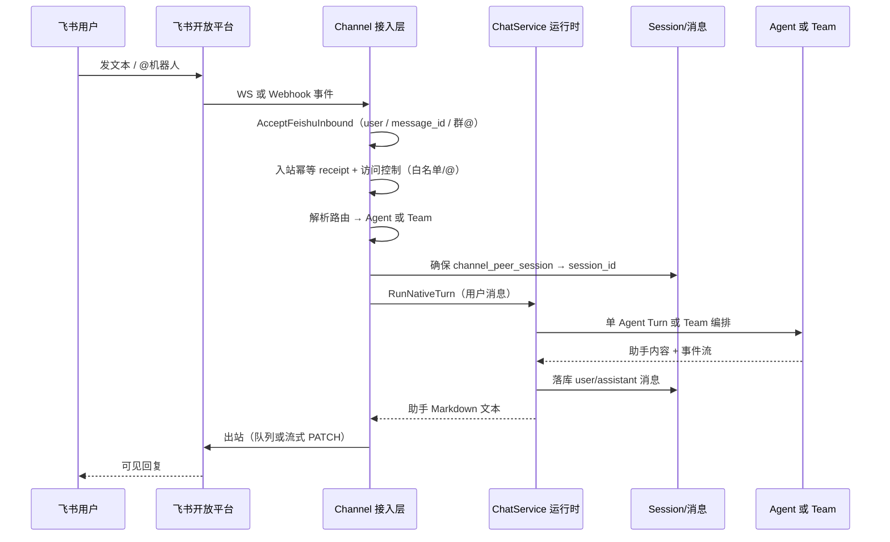

# Channel 渠道管理

本文档定义 Channel **对外平台连接** 的产品需求：多 IM/协作平台接入、凭据与连接模式配置、消息路由与投递验收。

**平台连接参考**：

- [MuseBot](https://github.com/yincongcyincong/MuseBot)（`robot/*.go` + `http/communicate.go`）— MIT；SDK 选型与连接模式  
- [Hermes Agent](https://github.com/NousResearch/hermes-agent)（`gateway/platforms/feishu.py` + `gateway/run.py`）— MIT；**飞书入站/outbound/流式/心跳/会话隔离** 等产品与连接层行为对照，见 [17 channel.design.md §十四](./17%20channel.design.md#十四hermes-agent-对照消息流转与飞书特殊处理)

Aranea **只借鉴连接层与 IM 体验模式**，Agent 运行时仍走 `internal/service.ChatService`，不在 Channel 层耦合 LLM。

与 **`2 agents-create.md`**（Agent 能力配置）、**`11 multi-agent.md`**（Team 编排）、**`10-session-development.md`**（会话）、**`51 消息机制.md`**（实时事件）、**`17-channel-agent-team-integration.md`**（跨模块业务主链）、**`frontend-pages.md`**（`/channels`）、**`docs/README.md`**（Kratos + trpc 分层）对齐。

> **跨模块说明**：Channel 不「拥有」Agent/Team，仅通过 `config_json.routing` 将 IM 对端映射到已存在的 Agent 或 Team，再经 `channel_peer_session` 绑定 Session。详见 [17-channel-agent-team-integration.md](./17-channel-agent-team-integration.md)。

---

## 1. 模块定位

| 项目 | 说明 |
|------|------|
| **用户目标** | 配置外部消息平台连接，将用户消息路由到 Agent/Team，异步回发回复 |
| **路由** | `/channels`（列表 + 编辑弹窗） |
| **非目标** | Channel 内编排 Agent；存完整消息明文；全局单例配置（MuseBot 式 flat conf） |

### 1.1 与 MuseBot / Aranea 架构差异

| 维度 | MuseBot | Aranea |
|------|---------|--------|
| 配置 | 全局 `conf.BaseConfInfo` + 环境变量 | DB `channel` + `channel_credential`（多实例、多 Agent） |
| 启动 | `StartRobot()` 按非空 token 启 goroutine | `ChannelRuntimeManager` 按 enabled 实例启连接 |
| 入站 | 平台文件内 `go RobotInfo.Exec()` | 统一 `ChannelIngress` / Runtime → `ChatService` |
| 出站 | `RobotInfo.SendMsg()` 巨型 type switch | `channel_delivery` worker + 平台 `SendText` |
| LLM | 耦合在 `Robot` 接口 | **禁止**；`internal/biz` 不触达 LLM |

Aranea 保留 MuseBot 验证过的 **SDK 与连接模式**，采用 Kratos 分层与 DB 多实例模型。

---

## 2. 支持的平台（Catalog）

Catalog 由 `ListChannelCatalog` 返回。

- **`bundled=true`**：本 binary 已实现 adapter，可创建并运行  
- **`bundled=false`**：规格已定义，连接能力待实现（参考 MuseBot 同平台文件）

| type | 标签 | MuseBot 参考 | 连接模式 | 状态 | 入站 | 出站 |
|------|------|-------------|----------|------|------|------|
| `feishu` | 飞书 / Lark | `robot/lark.go` | webhook · **websocket** | webhook ✅ | ✅ | ✅ |
| `dingtalk` | 钉钉 | `robot/ding.go` | webhook · **stream** | webhook ✅ | ✅ | ✅ |
| `wecom` | 企微智能机器人 | `robot/comwechat.go` | webhook | ✅ | ✅ | ✅ |
| `wecom-app` | 企微自建应用 | `robot/comwechat.go` | webhook | ✅ | ✅ | ✅ |
| `wechat` | 微信公众号 | `robot/wechat.go` | webhook（被动/客服） | ❌ | — | — |
| `slack` | Slack | `robot/slack.go` | event · **socket_mode** | event ✅ | ✅ | ✅ |
| `telegram` | Telegram | `robot/telegram.go` | webhook · **polling** | webhook ✅ | ✅ | ✅ |
| `discord` | Discord | `robot/discord.go` | **gateway** WebSocket | ❌ | — | — |
| `qq` | QQ 官方机器人 | `robot/qq.go` | webhook + WS 事件 | ❌ | — | — |
| `personal_qq` | QQ（OneBot） | `robot/personalqq.go` | OneBot HTTP 推送 | ❌ | — | — |

**MuseBot SDK 对照**（实现时优先采用）：

| 平台 | Go 依赖 |
|------|---------|
| 飞书/Lark | `larksuite/oapi-sdk-go/v3` + `larkws` |
| 钉钉 | `open-dingtalk/dingtalk-stream-sdk-go` |
| 企微 / 微信 | `ArtisanCloud/PowerWeChat/v3` |
| Slack | `slack-go/slack` + `socketmode` |
| Telegram | `go-telegram-bot-api/v5` |
| Discord | `bwmarrin/discordgo` |
| QQ 官方 | `tencent-connect/botgo` |

---

## 3. 连接模式说明

| 模式 | 适用平台 | 说明 | 公网要求 |
|------|----------|------|----------|
| `webhook` | 飞书、企微、微信、Slack Events、Telegram、QQ | Kratos HTTP 回调；路径 `/webhooks/{channel_key}` 或平台专用路径 | 需 HTTPS |
| `websocket` | 飞书 Lark WS | 长连接收事件；MuseBot `larkws.Client.Start` | 出站即可 |
| `stream` | 钉钉 Stream | `dingtalk-stream-sdk-go`；替代传统机器人 Webhook | 出站即可 |
| `socket_mode` | Slack | App Token + Bot Token；MuseBot Socket Mode | 出站即可 |
| `polling` | Telegram | `GetUpdatesChan`；无需 Webhook | 出站即可 |
| `gateway` | Discord | discordgo Gateway | 出站即可 |
| `onebot` | Personal QQ | 接收 OneBot POST；发送调 OneBot HTTP API | 视 NapCat 部署 |

`config_json.receive_mode` 取值：`webhook` | `websocket` | `stream` | `socket_mode` | `polling` | `gateway` | `onebot`。

---

## 4. 信息架构与 UI

### 4.1 页面（当前实现）

| 区域 | 组件 |
|------|------|
| 列表 | `ChannelsTable.vue` |
| 编辑 | `ChannelEditorDialog.vue` |
| 平台选择 | `ChannelCatalogPicker.vue`（`bundled` 可选，非 bundled 展示「即将支持」） |

### 4.2 编辑弹窗区块

1. 选择平台（新建）
2. 基础信息：`name`、`key`、`description`、`enabled`
3. **连接方式**：`receive_mode`（选项随 catalog `receive_modes`）
4. 凭据：按 `credential_schema`；留空不修改
5. 回调地址：webhook 类平台展示只读 URL + 复制
6. 路由：`routing.default_agent_id`（Team / rules / dm_scope UI 待补）

### 4.3 列表列

名称（Avatar）、平台、连接模式、外部 ID、启用、连接状态、最近更新、操作（编辑 / 删除 / 复制 Webhook）。

---

## 5. 各平台凭据与配置

字段写入 `config_json.config`（非敏感）与 `channel_credential`（敏感）。括号内为 MuseBot `conf.BaseConfInfo` 字段名。

### 5.1 飞书 / Lark（`feishu`）

| 字段 | 位置 | MuseBot 字段 |
|------|------|--------------|
| `app_id` | config | `lark_app_id` |
| `region` | config | — |
| `app_secret` | credential | `lark_app_secret` |
| `connection_mode` | config | webhook / websocket |
| `ws_ping_interval_sec` | config | （规划 F-01）larkws ping 间隔 |
| `ws_reconnect_interval_sec` | config | （规划 F-01）重连间隔，Hermes 默认 120s |
| `thread_sessions_per_user` | config | （规划 F-06）话题线程独立 session |
| `inbound_text_debounce_ms` | config | （规划 F-04）连续 text 合并，默认 600 |

### 5.2 钉钉（`dingtalk`）

| 字段 | 位置 | MuseBot 字段 |
|------|------|--------------|
| `client_id` | config | `ding_client_id` |
| `client_secret` | credential | `ding_client_secret` |
| `secret` | credential | 机器人加签（Webhook 模式） |

Stream 模式使用 `client_id` + `client_secret`；当前 Webhook 模式使用 `secret` 验签。

### 5.3 企微（`wecom` / `wecom-app`）

| 字段 | 位置 | MuseBot 字段 |
|------|------|--------------|
| `corp_id` | config | `com_wechat_corp_id` |
| `agent_id` | config | `com_wechat_agent_id` |
| `secret` | credential | `com_wechat_secret` |
| `token` | credential | `com_wechat_token` |
| `encoding_aes_key` | credential | `com_wechat_encoding_aes_key` |

### 5.4 微信公众号（`wechat`）

| 字段 | 位置 | MuseBot 字段 |
|------|------|--------------|
| `app_id` | config | `wechat_app_id` |
| `app_secret` | credential | `wechat_app_secret` |
| `token` | credential | `wechat_token` |
| `encoding_aes_key` | credential | `wechat_encoding_aes_key` |
| `active_mode` | config | `wechat_active`（被动回复 vs 客服 API） |

### 5.5 Slack（`slack`）

| 字段 | 位置 | MuseBot 字段 |
|------|------|--------------|
| `bot_token` | credential | `slack_bot_token` |
| `app_token` | credential | `slack_app_token`（Socket Mode） |
| `signing_secret` | credential | Events API 验签 |

### 5.6 Telegram（`telegram`）

| 字段 | 位置 | MuseBot 字段 |
|------|------|--------------|
| `bot_token` | credential | `telegram_bot_token` |

### 5.7 Discord（`discord`）

| 字段 | 位置 | MuseBot 字段 |
|------|------|--------------|
| `bot_token` | credential | `discord_bot_token` |

### 5.8 QQ 官方（`qq`）

| 字段 | 位置 | MuseBot 字段 |
|------|------|--------------|
| `app_id` | config | `qq_app_id` |
| `app_secret` | credential | `qq_app_secret` |

### 5.9 QQ OneBot（`personal_qq`）

| 字段 | 位置 | MuseBot 字段 |
|------|------|--------------|
| `receive_token` | credential | `qq_one_bot_receive_token` |
| `send_token` | credential | `qq_one_bot_send_token` |
| `onebot_base_url` | config | `qq_one_bot_http_server` |

---

## 6. 配置语义（`config_json`）

```json
{
  "type": "feishu",
  "receive_mode": "webhook",
  "webhook": { "path": "/webhooks/{channel_key}" },
  "routing": {
    "default_agent_id": "main",
    "default_team_id": "",
    "dm_scope": "per-channel-peer",
    "rules": []
  },
  "config": {
    "app_id": "cli_xxx",
    "require_mention": true,
    "allowed_user_ids": [],
    "allowed_group_ids": []
  }
}
```

**策略字段**（借鉴 MuseBot `allowed_user_ids` / 群 @ 规则，写入 `config`）：

| 字段 | 类型 | 默认 | 说明 |
|------|------|------|------|
| `require_mention` | bool | `false` | 群聊需 @ 机器人才进入 Agent；与飞书平台「群须 @ 才推送事件」叠加生效 |
| `allowed_user_ids` | string / JSON 数组 | 空 | 发送者白名单；**非空时**仅列出的用户可触发回复 |
| `allowed_group_ids` | string / JSON 数组 | 空 | 群聊白名单（`chat_id` / 会话 ID）；**非空时**仅列出的群可触发；**单聊不受此字段约束** |

**语义（Aranea，2026-05-22 起在 `ProcessInbound` 强制执行）**：

1. 各维度 **留空 = 该维度不限制**（与 MuseBot 一致）。
2. 多个维度 **同时配置时取交集（AND）**：例如既配了 `allowed_user_ids` 又配了 `allowed_group_ids`，则必须是「允许的用户 **且** 在允许的群内」。
3. 哨兵值 **`"0"`**（单独一项或数组首项）：该维度 **拒绝所有人/所有群**（MuseBot 兼容）。
4. 拒绝时：写入 `channel_delivery` 状态 `access_denied`，并向用户回复「暂无使用权限」类提示（不进入 Agent Turn）。

**如何填写 ID**

| 平台 | `allowed_user_ids` | `allowed_group_ids` |
|------|-------------------|---------------------|
| 飞书 / Lark | 发送者 `open_id`（`ou_xxx`）或 `user_id` | 群 `chat_id`（`oc_xxx`） |
| 钉钉 | `senderStaffId` / 用户 ID | `conversationId`（群会话 ID） |
| 企微 / Slack / Telegram 等 | 平台用户 ID（见各 adapter 入站 `PeerID` / meta） | 群/频道 ID（见入站 `OutboundMeta.chat_id` 或等价字段） |

**配置示例**

仅允许两名飞书用户私聊与 @ 群聊：

```json
"config": {
  "require_mention": true,
  "allowed_user_ids": ["ou_abc123", "ou_def456"]
}
```

仅允许指定飞书群（群内任意成员 @ 机器人即可，若同时配 `require_mention` 则仍须 @）：

```json
"config": {
  "allowed_group_ids": ["oc_group_chat_id_1", "oc_group_chat_id_2"]
}
```

临时关闭所有访问（维护模式）：

```json
"config": {
  "allowed_user_ids": "0"
}
```

UI 支持 **JSON 数组** 或 **英文逗号分隔** 字符串；保存后 **重启 Channel Runtime / 后端** 即可生效（配置来自 DB，无需改代码）。

**实现位置**：策略解析 `internal/biz/channel_access.go`；入站校验 `internal/service/channel_ingress_access.go`（在路由与 Agent Turn 之前）。

---

## 7. 运行时行为

### 7.1 双路径入站

**A. Webhook 路径（已实现；长任务 Phase E 将改为 Accept 后 200）**  
`POST /webhooks/{channel_key}` → 验签 → 解析 → 路由 → Session → Agent Turn → 异步入队出站

**B. 长连接路径（已实现）**  
`ChannelRuntimeManager` 按实例启动 goroutine（larkws / ding stream / socketmode / polling / discordgo）→ 标准化 `InboundEvent` → 同 A 后半段

**长任务（Phase E，规划）**  
Webhook 与 WS 统一 **Accept（ACK + 200）→ 异步 Execute Turn**；详见 [§8](./17%20channel.md#8-长任务场景飞书-channel)。

**入站统一门禁（2026-05-22）**  
飞书 WS / Webhook 先经 **`lark.AcceptFeishuInbound`**（同一规则：仅 `sender_type=user`、必须有 `message_id`、群聊需 @）→ `ChannelIngress.ProcessInbound` → **`channel_inbound_receipt`**（同一 `feishu:{message_id}` 只 Turn 一次）→ `checkInboundAccess` → Agent Turn。

**Hermes 对照（2026-05-24）**：Hermes 额外有 text debounce 合并、Reaction 处理中反馈、thread 会话隔离、Webhook IP 限流；Aranea 额外有 IM Preview 单条演进、Turn Job、Tool Card、preview 心跳。详见 [17 channel.design.md §十四](./17%20channel.design.md#十四hermes-agent-对照消息流转与飞书特殊处理)。

详见 [changelog/2026-05-22-Channel-Inbound-Root-Cause.md](../changelog/2026-05-22-Channel-Inbound-Root-Cause.md)。

### 7.2 出站与流式

- 默认：完整回复经 `channel_delivery` 异步发送  
- 流式（MVP ✅）：Telegram / 飞书 / Slack — `config.streaming_enabled`；长任务场景 **建议开启**（见 §8）  
- 长任务 ACK / 进度 / 排队提示：Phase E（见 [开发计划 §10](./17-channel-development.md#10-长任务异步执行phase-e)）

### 7.3 健康与运维

- `ChannelHealthScanner`（10min）  
- `CHANNEL_DELIVERY_DISABLED=1` / `CHANNEL_HEALTH_DISABLED=1`

---

## 8. 长任务场景（飞书 Channel）

> **技术设计**：[17 channel.design.md §十二](./17%20channel.design.md#十二长任务异步执行设计)  
> **开发计划**：[17-channel-development.md §10](./17-channel-development.md#10-长任务异步执行phase-e)  
> **跨模块**：[17-channel-agent-team-integration.md §3.4](./17-channel-agent-team-integration.md#34-长任务与-im-体验)

### 8.1 问题陈述

管理员通过飞书 Channel 向 Agent / Team 下发命令时，常见任务耗时远超 IM 平台回调 SLA（通常 3–5 秒）或单次 Turn 默认上限（5 分钟）。用户侧表现为：长时间无回复、Webhook 重试导致重复入站、并发消息静默、工具/Team 编排阶段「假死」、超时后仅收到笼统错误。

Channel **不负责** LLM 编排；本需求定义 **IM 侧体验与受理语义**，运行时仍经 `ChatService` 与 Web Chat 共用 Session / Turn 机制。

### 8.2 用户故事

| ID | 角色 | 故事 | 价值 |
|----|------|------|------|
| LT-U01 | 飞书用户 | 发送分析类指令后 **1–2 秒内** 收到「已受理」反馈 | 确认机器人在线，降低重复发送 |
| LT-U02 | 飞书用户 | 任务执行 **数分钟** 内能看到 **进度或流式文本** | 长生成/多工具/Team 流水线可感知 |
| LT-U03 | 飞书用户 | 当前任务未完成时再发消息，收到 **「已排队」** 提示 | 与 Web Chat 排队语义一致 |
| LT-U04 | 飞书用户 | 任务失败或超时，收到 **明确原因**（非空白） | 可重试或联系运维 |
| LT-U05 | 管理员 | 为客服/研报 Channel 配置 **更长 Turn 超时** 与 **流式/进度** 开关 | 按业务线差异化 SLA |
| LT-U06 | 运维 | 按 peer / session / job 追溯长任务状态 | 排障不依赖用户截图 |

### 8.3 产品能力（分阶段）

| 阶段 | 能力 | 说明 |
|------|------|------|
| **P0** | 入站快速 ACK | Webhook HTTP 在验签与幂等后立即 200；飞书侧即时文案 |
| **P0** | 流式默认推荐 | 长生成场景开启 `streaming_enabled`，IM 消息随输出 PATCH |
| **P0** | 入队可见反馈 | Session 有 active run 时，Channel 出站「已排队」文案 |
| **P1** | Channel 级超时 | `turn_timeout_sec` / `first_byte_timeout_sec` 覆盖全局默认 |
| **P1** | Turn Job 可追踪 | 每次入站 Turn 有 job 状态（accepted / running / completed / failed / timeout） |
| **P1** | 长静默进度 | 工具调用、Team 成员切换期间 PATCH 进度文案或心跳 |
| **P2** | 超长任务异步模式 | 预期 >15min 走 Graph / Cron，IM 立即返回 task_id |
| **P2** | 飞书取消 / 卡片 | 用户发「取消」或卡片按钮终止 Turn（可选） |

### 8.4 配置项（`config_json.config`，P0–P1）

| 字段 | 类型 | 默认 | 说明 |
|------|------|------|------|
| `streaming_enabled` | bool | `false` | 流式 PATCH（飞书/Telegram/Slack）；长任务 **建议 true** |
| `ack_message` | string | `收到，正在处理…` | 受理后立即出站；空则不发 ACK |
| `ack_on_queued` | string | 见设计文档 | active run 时入队提示；支持 `{{pending_id}}` |
| `turn_timeout_sec` | int | `300` | 覆盖 Channel Turn 上限（秒）；Team 流水线可设 900 |
| `first_byte_timeout_sec` | int | `30` | 首 token/首 delta 超时（秒）；重工具场景可设 120 |
| `progress_mode` | enum | `off` | `off` \| `text` \| `steps`（Team 成员摘要，P1） |
| `progress_quiet_sec` | int | `20` | 无输出时心跳间隔（秒）；0 关闭 |
| `heartbeat_message` | string | `仍在处理中…` | 心跳文案；可含 `{{elapsed}}` |
| `execution_mode` | enum | `sync` | `sync` \| `async` \| `auto`（P2，对接 Graph/Cron） |

配置写入 DB，保存后 **Runtime Reload** 生效；不要求改代码。

### 8.5 运行时行为（产品语义）

1. **受理与执行分离**：飞书回调 SLA 与 Agent Turn 耗时解耦；用户先见 ACK，再见进度/结果。  
2. **与 Web Chat 一致**：同一 `session_id` 下 Session 锁、pending queue、Run 状态与 Web 共用；Channel 额外负责 IM 出站投影。  
3. **幂等不变**：同一 `message_id` 仍只 Turn 一次；快速 200 不触发重复执行。  
4. **失败可观测**：拒绝、超时、流式 PATCH 失败均写入投递/Job 审计，运维可按 Session 反查。

### 8.6 推荐配置（飞书长任务）

单 Agent + 重工具：

```json
{
  "receive_mode": "websocket",
  "config": {
    "streaming_enabled": true,
    "ack_message": "收到，正在处理，请稍候…",
    "turn_timeout_sec": 600,
    "first_byte_timeout_sec": 120,
    "progress_mode": "text",
    "progress_quiet_sec": 20
  }
}
```

Team 流水线（群 @）：

```json
{
  "config": {
    "require_mention": true,
    "streaming_enabled": true,
    "turn_timeout_sec": 900,
    "progress_mode": "steps"
  }
}
```

### 8.7 验收标准

| ID | 场景 | 预期 |
|----|------|------|
| LT-01 | 单 Agent 生成约 2 分钟 | ≤2s ACK；流式 PATCH；最终完整回复 |
| LT-02 | Team 流水线约 5 分钟 | 进度文案；不因 30s 首字节默认超时失败 |
| LT-03 | 任务进行中再发一条 | 飞书收到「已排队」；队列满按 Web Chat 规则拒绝 |
| LT-04 | Webhook 模式 10 分钟任务 | HTTP ≤3s 返回 200；无重复 Turn |
| LT-05 | Channel 设 `turn_timeout_sec=900` | 5min 全局默认不提前 kill |
| LT-06 | Turn 超时或失败 | 飞书明确错误 + Job/投递可审计 |
| LT-07 | 运维 | Monitor / Session 可按 `session_id` 查看 Channel Turn 与 FlowLog |

### 8.8 卡 Turn / 飞书无回复（排查）

> 完整分析：[2026-05-23-M55-Stuck-Turn-Inbound-Sync-Analysis.md](../changelog/2026-05-23-M55-Stuck-Turn-Inbound-Sync-Analysis.md)

| 症状 | 常见根因 | 优先检查 |
|------|----------|----------|
| Web 工具永久「正在执行」 | WS 未收 `tool_result`；`mergeSessionMessages` 保留本地 running 行 | Session WS 连接；FlowLog `chat.activity.finalize_stuck` |
| Web 思考 `…` 无正文 | Turn 未结束或缺 `text_done` / `runner_completion` | `run-status`；FlowLog `channel.turn.execute` |
| 飞书无最终回复 | 同步 Turn 未返回；`rendered==""` 未 Flush；**durable 升格无 completion outbound** | `channel_delivery` 投递记录；`session_runs.phase` |
| 仅有「已排队」「建议 /async」 | 排队 ACK 与超时提示叠加 | 前序 Run 是否卡死；CC-UX-01 |
| 卡片 200340 | 未订阅 `card.action.trigger` 或未发布应用版本 | 飞书开发者后台 |

**修复任务**：CC-FIX-TOOL-01~03 · CC-FIX-CHANNEL-01 · CC-FEISHU-OPS-01（见 M55 Phase R-UX）。

---

## 9. 验收标准（基础能力）

| ID | 场景 | 预期 |
|----|------|------|
| CH-01 | bundled 平台可创建、测试连接 | 对应 live/结构测试通过 |
| CH-02 | Webhook 平台收发消息 | Agent 回复送达 |
| CH-03 | 复制 Webhook URL | 完整 HTTPS |
| CH-04 | 禁用 Channel | 入站拒绝 |
| CH-05 | 非 bundled 平台 | Catalog 展示「即将支持」，不可保存 |
| CH-06 | 飞书 Stream / WS 模式（Phase 2） | 无公网 IP 可收消息 |
| CH-07 | 钉钉 Stream 模式（Phase 2） | 替代 Webhook 机器人 |
| CH-08 | `allowed_user_ids` / `allowed_group_ids` | 非白名单用户/群收到拒绝提示，`access_denied` 投递记录，不触发 Agent |

---

## 10. 文档修订记录

| 版本 | 日期 | 说明 |
|------|------|------|
| 3.0 | 2026-05-22 | 以 MuseBot 平台连接能力为参考重写；移除 GoClaw/trpc channel 主导；扩展 Catalog 至 MuseBot 10 平台 |
| 3.1 | 2026-05-22 | §6 访问控制：`allowed_user_ids` / `allowed_group_ids` / `require_mention` 入站强制执行与用法说明 |
| 3.2 | 2026-05-22 | §8 长任务场景：用户故事、配置项、验收 LT-01–07；与 Phase E 开发计划对齐 |
| 3.3 | 2026-05-23 | §8.8 卡 Turn / 飞书无回复排查；链至 M55 Stuck-Turn 分析 |


---

## 子模块：Channel  Agent  Team  会话消息  业务集成说明

> **版本**：2026-05-22  
> **读者**：产品、运维、全栈开发  
> **关联**：[17 channel.md](./17%20channel.md) · [11 multi-agent.md](./11%20multi-agent.md) · [10 session.md](./10%20session.md) · [51 消息机制.md](./51%20消息机制.md) · [0 系统框图.md](./0%20系统框图.md)  
> **技术设计**：[17-channel-agent-team-integration.design.md](./17-channel-agent-team-integration.design.md)

---

## 1. 一句话关系

| 模块 | 业务角色（对用户意味着什么） |
|------|------------------------------|
| **Agent** | 可配置的「单个智能体能力包」：模型、提示词、工具、记忆策略；是**执行单元**，不是 IM 入口。 |
| **Team** | 可配置的「多智能体协作编排」：顺序/并行/主控/评审/Swarm；对外表现为**一个对话对象**（与单 Agent 类似）。 |
| **Session（会话）** | 某用户（或某 IM 对端）与**一个 Agent 或一个 Team** 的连续对话容器；承载历史消息与上下文。 |
| **聊天消息** | Session 内的用户/助手轮次记录；Web Chat 实时展示，Channel 侧主要消费**最终助手文本**回发 IM。 |
| **Channel（飞书等）** | 外部 IM 的**接入与投递层**：收消息、鉴权、路由到 Agent/Team、调运行时、把回复发回飞书；**不包含**编排与 LLM 逻辑。 |

**业务主链**：飞书用户发消息 → Channel 识别对端 → 按路由选定 Agent 或 Team → 绑定/创建 Session → 写入用户消息并运行 Turn → 助手回复落库 → 回发飞书（或流式更新消息）。

---

## 2. 为什么分成四个概念

### 2.1 Agent：能力资产，不是渠道入口

- 用户在 **Agent 管理** 中创建的是「可被调用的专家」：客服、写作、代码审查等。
- Agent **不直接绑定**飞书群/用户；同一 Agent 可被 Web Chat、Cron、A2A、多个 Channel 实例复用。
- 业务上：先沉淀 Agent 能力与治理（模型、工具、记忆），再在**渠道配置**里决定「哪条路进来找谁」。

### 2.2 Team：复杂任务的「统一门面」

- 当一条用户问题需要**多角色分工**（收集→分析→汇总、并行评审、主控分派）时，用 Team 而不是把多个 Agent 串在 Channel 路由里。
- 对飞书用户而言：仍是一个机器人、一段连续对话；Team 内部成员切换**不强制**暴露在 IM 里（当前 Channel 出站以**汇总文本**为主）。
- 业务上：**简单问答 → 路由到单 Agent**；**流程型/多专家 → 路由到 Team**。

### 2.3 Session：连续性契约

- 同一飞书用户（或群+用户维度）在**同一 Channel 实例**下应有稳定会话，才能记住上下文。
- `dm_scope` 决定「一人一会话 / 全渠道一会话 / 按 peer 分会话」等产品语义（见设计文档 §3.2）。
- Session 创建时固定 `owner_type=agent|team` 与 `agent_id`/`team_id`；**已绑定会话不因路由配置变更而自动改绑**（避免历史上下文张冠李戴）。

### 2.4 聊天消息：审计与体验的两条通路

| 通路 | 谁消费 | 业务目的 |
|------|--------|----------|
| **持久化消息**（`chat_messages` 等） | Session 历史、管理端检索、合规审计 | 真相源：这一轮说了什么 |
| **实时 Envelope**（`/v1/ws`） | Web Chat、Team 运行条、Monitor | 流式体验与运维可观测 |

Channel 路径走 `RunNativeTurnUnary` / 流式出站：IM 用户看到回复；Web 端若订阅该 `session_id` 仍可看到与 Chat 一致的落库与部分事件，但**不依赖**用户开着 Web 才能回复飞书。

---

## 3. 飞书场景下的业务流转

### 3.1 配置阶段（管理员）

1. 在 **Agent 管理** 创建/维护目标 Agent（或 **Team 管理** 创建 Team 并挂成员）。
2. 在 **渠道管理** `/channels` 创建飞书实例：`app_id`、凭据、`receive_mode=websocket`（推荐）、访问控制（白名单、`require_mention`）。
3. 在 Channel **路由** 区选择：
   - **单 Agent**：`routing.default_agent_id`（支持 UUID 或 `agent_key`，如 `main`）；
   - **Team**：`routing.default_team_id`；
   - （规划）按群/用户 `rules[]` 分流不同 Agent/Team。
4. 可选：`dm_scope` 控制私聊/群聊是否会话隔离。

### 3.2 运行阶段（终端用户）



### 3.3 与 Web Chat 的对比

| 维度 | Web Chat | 飞书 Channel |
|------|----------|--------------|
| 入口 | 用户选 Agent/Team 建会话 | 管理员在 Channel 配路由 |
| 实时 UI | WS `text_delta`、工具卡片、Team 成员条 | 平台消息更新或一次性文本 |
| 取消/插队 | WS `cancel` / `enqueue_message` | 当前以单轮为主；并发 Turn 走 Session 锁与排队策略 |
| 可观测 | 用户可见全过程 | 运维查 Session、投递记录、`channel_delivery` |

### 3.4 长任务与 IM 体验

飞书用户下发 **分析、研报、多 Agent Team 流水线** 等命令时，Turn 常超过 IM 回调 SLA 或默认 5 分钟上限。

| 用户期望 | 产品承诺（Phase E） |
|----------|---------------------|
| 发送后立刻有反馈 | `ack_message` 受理文案（≤2s） |
| 等待数分钟仍知进展 | `streaming_enabled` + `progress_mode` |
| 上一条未完成再发 | `ack_on_queued`（与 Web pending queue 一致） |
| 失败能看懂原因 | 明确错误 + Session/Job 可审计 |

**业务建议**：

| 场景 | 路由 | Channel 配置要点 |
|------|------|------------------|
| 快速 FAQ | 单 Agent | `streaming_enabled=true`；默认超时即可 |
| 多工具分析 | 单 Agent | `first_byte_timeout_sec=120`，`turn_timeout_sec=600` |
| Team 流水线 | Team | `progress_mode=steps`，`turn_timeout_sec=900` |
| 小时级批处理 | Graph/Cron（P2） | `execution_mode=async` |

完整规格见 [17 channel.md §8](./17%20channel.md#8-长任务场景飞书-channel)。

**M55 延伸**（Sync Turn 与 24h Job 分流、Web 同步）：[55-chat-channel-cursor-solution.md](./55-chat-channel-cursor-solution.md) · [55-chat-channel-cursor-development.md](./55-chat-channel-cursor-development.md)

---

## 4. 路由决策（业务规则）

优先级（与实现对齐，见 `biz.MatchRoute` + `ResolveChannelTarget`）：

1. **`routing.rules[]`**：按 `peer_pattern`（glob）匹配飞书 `peer_id`（如 `open_id`、群 `chat_id`），命中则使用该条的 `agent_id` 或 `team_id`。
2. **`default_team_id`**：若规则未命中且配置了默认 Team → 会话 `owner_type=team`。
3. **`default_agent_id`**：否则默认 Agent（必填其一，否则入站报错）。
4. **Team 优先于 Agent**：同一条 rule 若同时填了 team 与 agent，以 **team_id** 为准。

**产品建议**：

| 场景 | 推荐路由目标 |
|------|----------------|
| 单聊客服、FAQ | 单 Agent |
| 研报流水线、代码多维度审查 | Team（sequential / parallel） |
| 飞书多群不同业务线 | `rules` 按 `chat_id` 分流（待 UI 完善） |
| 仅允许高管私聊 | `allowed_user_ids` + 默认 Agent |

---

## 5. 用户故事与验收（跨模块）

| ID | 故事 | 验收要点 |
|----|------|----------|
| CAT-01 | 飞书私聊绑定客服 Agent | 首条消息后 Session 标题含 channel key；连续多轮上下文连贯 |
| CAT-02 | 飞书群 @ 机器人走 Team | `owner_type=team`；`team_runs` 有记录；飞书收到汇总回复 |
| CAT-03 | 改 Channel 默认 Agent | **新 peer** 走新 Agent；**老 peer** 仍用原 Session（行为须文档化） |
| CAT-04 | 非白名单用户 | 飞书收到拒绝文案；无 Session Turn；`access_denied` 投递 |
| CAT-05 | 流式开启 | 飞书侧消息随生成 PATCH；失败则 fail-fast 并记指标 |
| CAT-06 | 运维排障 | 能在 Session 列表按标题/filter 找到 `feishu:channel_key:peer` 会话并查看消息 |
| LT-01 | 飞书长任务 ACK + 流式 | ≤2s 受理；2min 生成有 PATCH；见 [17 channel.md §8.7](./17%20channel.md#87-验收标准) |
| LT-03 | 并发入站排队 | 飞书收到排队提示，非静默 |

---

## 6. 当前差距与产品路线图（摘要）

完整技术项见 [integration.design.md](./17-channel-agent-team-integration.design.md) §5。

| 优先级 | 差距 | 业务影响 |
|--------|------|----------|
| **P0** | Webhook 同步阻塞 Turn | 飞书重试、HTTP 长时间占用；见 Phase E1 |
| **P0** | 入队无 IM 反馈 | 长任务中再发消息用户无感知；见 Phase E1-4 |
| **P1** | 工具/Team 长静默 | 仅 text delta 流式，工具阶段「假死」；见 Phase E4 |
| **P1** | Turn Job 不可查 | 运维只能靠 Session 猜状态；见 Phase E3 |
| **P1** | Channel 级超时不可配 | Team 5min 易超时；见 Phase E2 |
| P1 | `rules` 前端未完整 | 多群分流可在高级 JSON 配置；`dm_scope` 已在路由区 ✅ |
| P1 | 路由变更与旧 Session | 保存 Channel 时清除 peer 绑定 ✅；旧 Session 行仍保留作审计 |
| P1 | 飞书有回复、Web Chat 空白 | 全局 WS 同步 + 打开渠道 Session 流式 Markdown ✅ |
| P2 | Channel Team 无 IM 侧成员过程展示 | 飞书只见汇总；Web Team Session 可见成员事件 → E4 `progress_mode=steps` |
| P2 | Channel 与 Monitor 联动弱 | 飞书问题需靠 Session/投递表反查 → E3 Job + FlowLog |
| P2 | 超长任务无 async 模式 | 小时级任务不应占 Turn；见 Phase E6 |
| P2 | Agent Channel 引用反查 | Agent 设置页「渠道引用」✅ |

---

## 7. 文档修订记录

| 版本 | 日期 | 说明 |
|------|------|------|
| 1.0 | 2026-05-22 | 首版：Channel / Agent / Team / Session / 消息五模块业务关系与飞书主链 |
| 1.1 | 2026-05-22 | §6 差距表对齐实现：Chat 同步、dm_scope、peer 重置、Agent 渠道引用 |
| 1.2 | 2026-05-22 | §3.4 长任务 IM 体验；§6 增 Phase E 差距项；验收 LT-01/03 |
