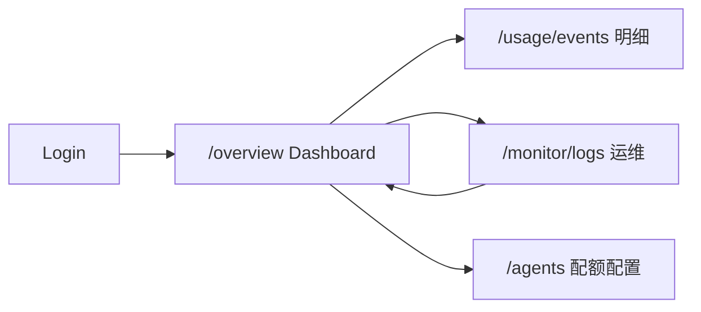

# 监控 Dashboard（概览页）

> **路由**：`/overview` · **页面**：`OverviewPage.vue`  
> **与 Monitor 运维页区分**：`/monitor/logs`（`MonitorPage`）负责审计、实时事件、Runs 排障、日志流；**本页**面向运营/管理员的 **用量与成本大盘**，默认登录后首页。

**关联文档**：[18 monitor.md](./18%20monitor.md)（运维监控）· [29 token.md](./29%20token.md)（用量口径）· [frontend-pages.md](./frontend-pages.md) §概览

---

## 0. 模块边界

| 概念 | 路由 | 回答的问题 |
|------|------|------------|
| **监控 Dashboard（本文）** | `/overview` | 今天花了多少 Token/钱？趋势如何？哪个模型/Agent 最贵？有无异常调用？ |
| **Monitor 运维页** | `/monitor/logs` | 谁在改配置？实时告警？单次运行卡在哪？进程日志？ |
| **用量明细** | `/usage/events` | 逐条 `model_token_usage_events` 对账与导出 |

**非目标**

- 不在概览页编辑 Agent/Provider/配额（跳转 Agent 设置「权限」Tab 或 `/models`）。
- 不把概览当作 Runs/Flow 排障入口（跳转 Monitor **Traces** 或 Chat）。
- 不替代 Grafana/Prometheus（`docs/observability/` 为 SRE 外链能力）。

---

## 1. 用户故事

| ID | 角色 | 故事 | 验收 |
|----|------|------|------|
| DASH-01 | 运营 | 登录后第一眼看到今日调用、Token、费用与成功率 | 默认进入 `/overview`；指标卡有数或可读空态 |
| DASH-02 | 运营 | 按时间/Provider/模型/状态筛选后，区间摘要与趋势一致 | 改筛选后 `range` 段与趋势点刷新 |
| DASH-03 | 运营 | 识别 Top 模型与 Top Agent 成本 | 两列排行表有 provider/model/agent 字段 |
| DASH-04 | 运营 | 发现失败/超时调用 | 「异常请求」列表可点开或跳转明细 |
| DASH-05 | 运营 | 从大盘进入逐条明细 | 「查看明细」→ `/usage/events` 且携带 `range` |
| DASH-06 | 财务 | 有 Agent 月配额时看到预算使用率 | 配置 `usage_quotas` 时出现「月预算使用率」卡 |
| DASH-07 | 运维 | 从大盘跳到 Monitor 排障 | ✅ Hero「运维监控」：Runs / Events / Alerts / Logs |
| DASH-08 | 运维 | 看到 Runner 窗口错误率 | ✅ `OverviewRunnerMetrics`；与用量 `range` 独立（有说明文案） |

---

## 2. 信息架构

### 2.1 页面结构（当前实现）

```
OverviewPage
├── OverviewPageHero          「查看明细」+ OverviewMonitorQuickLinks
├── OverviewRunnerMetrics     Runner 窗口指标（Store → 下钻 Monitor Traces）
├── 筛选条                     range / provider / model / status / 趋势粒度
├── UsageMetricCards          今日/本月/延迟/TPS/配额（可选）
├── UsageTrendChart           ECharts：Token/调用/费用/成功率
├── 区间摘要                   四指标列表
├── UsageBreakdownCharts      模型/Provider 费用占比（Top 样本）
├── Top 模型 | Top Agent       UsageTopModels / UsageTopAgents
├── 低性价比模型（有数据时）    UsageInefficientModels
└── 异常请求                   UsageAnomalyList
```

### 2.2 导航关系



侧栏：**主工作区 → 概览**（`menu.groupMain`）。

---

## 3. 功能规格

### 3.1 筛选

| 控件 | 字段 | 说明 |
|------|------|------|
| 时间范围 | `range` | `today` / `7d` / `30d` / `month` |
| Provider | `provider_code` | 模糊过滤 |
| 模型 | `model_api_id` | 模糊过滤 |
| 状态 | `status` | `success` / `failed` / `cancelled` / `timeout` |
| 趋势粒度 | `granularity` | `day`（默认）/ `hour`（二次请求 `ListUsageTrends`） |

### 3.2 指标卡（UsageMetricCards）

| 卡片 | 主指标 | 辅助 |
|------|--------|------|
| 月预算使用率（可选） | 活跃 Agent 最大利用率 % | 已用/总 cap USD |
| 今日调用 | `today.call_count` | 较昨日 Δ% |
| 今日 Token | `today.total_tokens` | in/out |
| 今日费用 | `today.total_cost_micro_usd` | 较昨日 Δ% |
| 本月费用 | `month.total_cost_micro_usd` | 本月调用次数 |
| 平均延迟 | `today.avg_latency_ms` | 今日成功率 |
| 平均 TPS | `today.avg_tokens_per_second` | 区间 TPS |

### 3.3 趋势与摘要

| 区块 | 规格 | 实现状态 |
|------|------|----------|
| 消耗趋势 | `UsageTrendChart`：metric 切换 Token / 调用 / 费用 / 成功率（成功+失败堆叠 %） | ✅ ECharts |
| 趋势粒度 | 按天（overview 内建）/ 按小时（`ListUsageTrends`） | ✅ |
| 区间摘要 | 筛选范围内总调用/Token/费用/成功率 | ✅ |

### 3.4 费用占比

| 图表 | 口径 | 状态 |
|------|------|------|
| 模型费用占比 | Top 5 模型（按 `top_models` 费用排序） | ✅ |
| Provider 费用占比 | 由 Top 模型行聚合（**非全量 Provider**，UI 已标注） | ✅ |

### 3.5 排行与异常

| 模块 | 字段 | 实现状态 |
|------|------|----------|
| Top 模型 | provider、model、调用、Token、费用、成功率 | ✅ |
| Top Agent | agent、调用、Token、费用、成功率 | ✅ |
| 低性价比模型 | 高费用低成功率模型提示 | ✅ |
| 异常请求 | 时间、Agent、Provider、状态、错误摘要 | ✅ |

### 3.6 统计口径（与 Token 模块一致）

概览、排行、配额已用额 **仅计可计费行**：`chat_turn` + `team_member`（**不含** `team_turn`）。  
明细页 `/usage/events` 展示全部 `usage_kind`。详见 [29 token.md §3.6](./29%20token.md)。

---

## 4. 数据契约（摘要）

| API | 用途 |
|-----|------|
| `GET /v1/usage/overview` | 指标卡、区间、Top、异常、低性价比、`quota_dashboard` |
| `GET /v1/usage/trends?granularity=hour` | 小时趋势（概览内二次请求） |
| `GET /v1/usage/events` | 明细页（非本页主数据） |
| `GET /v1/monitor/runner-metrics` | Runner 窗口指标（经 `useMonitorStore`） |

写入真相源：`trpc_turn` → `recordTurnUsage`（`usage_kind=chat_turn` 等）。

---

## 5. 与 Monitor Usage Tab 的关系

| 页面 | Usage 相关 UI |
|------|----------------|
| `/overview`（本文） | 完整用量大盘 + Runner 条 + 运维快捷入口 |
| `/monitor/logs` Usage Tab | `MonitorRunnerMetrics` + `MonitorUsageDashboardLink`（打开概览/明细） |

**产品原则（已实现）**

- 用量卡片/趋势/Top **仅在** `/overview` 维护；Monitor 不再嵌入 `UsageOverview`。
- Runner 指标两页共用 `RunnerMetricsPanel`（纯展示）+ `useRunnerMetrics`（Store）；时间范围：Runner 用滑动窗口，用量用 `range` 筛选。

---

## 6. 验收要点

- [x] 默认路由 `/` → `/overview`；页面可加载 overview API。
- [x] 筛选变更后指标、趋势、Top、异常一致刷新。
- [x] 「查看明细」跳转 `/usage/events` 并带 `range`。
- [x] 有配额时展示月预算使用率卡。
- [x] 统计口径不含 `team_turn`（与 29 token 一致）。
- [x] ECharts 多指标趋势 + 成功率堆叠。
- [x] 费用占比环图（Provider 样本口径已披露）。
- [x] Runner 指标条 + 跳转 Monitor Traces。
- [x] Monitor Usage Tab 与概览去重；请求经 Store/composable。
- [ ] 待办：Provider 全量占比 API；异常行深链；自动刷新（见开发计划 Phase 4）。

---

*文档版本：2026-05-21 — 与 [18-monitor-dashboard-development.md](./18-monitor-dashboard-development.md) 同步。*
