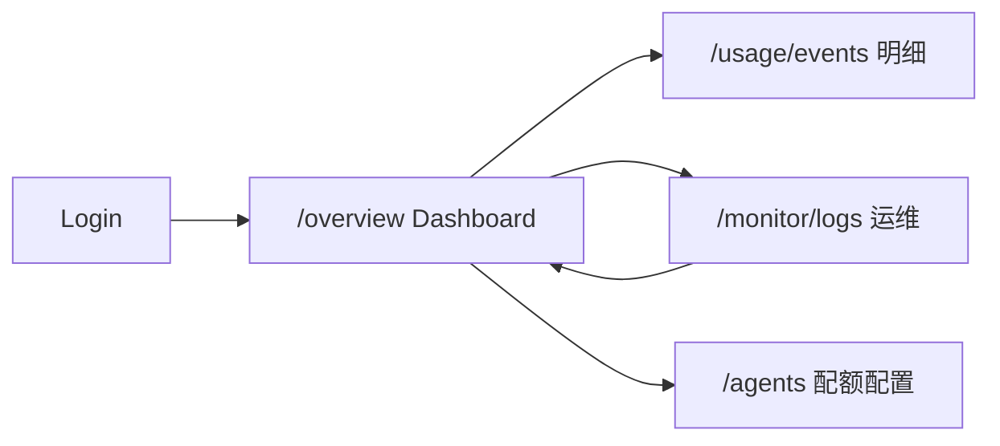

# 监控（Monitor）

本文档描述控制台 **监控** 相关页面的信息架构、控件与数据契约，与 **运行日志**、**审计**、**实时事件**、**LLM / 模型调用追踪** 对齐。**前端实现采用 Quasar Framework（Vue 3）**：路由 `vue-router`，布局 **`QLayout` / `QPageContainer` / `QPage`**，主题跟随控制台统一主题（`Quasar Dark Plugin` / `$q.dark`）。

> 2026-05-19 更新：监控实时事件口径统一为 WebSocket + EventBus。历史 `team-run-events` SSE / 独立 SSE Broker 已从当前主链路移除，后续不得作为新实现入口。

**术语区分**

| 概念 | 含义 |
|------|------|
| **业务 Channel** | **`17 channel.md`** 中的消息接入（飞书、微信等），在 Agent 高级设置中与 `channel_id` 绑定 |
| **传输 Channel（日志字段）** | 事件 JSON 中的 `channel`，如 `ws`（WebSocket），表示**会话传输方式**，与业务 Channel 表无直接外键关系 |

---

## 0. 需求明确性评审与实现边界

### 0.1 监控模块要回答的问题

| 用户问题 | 对应页面 / Tab | 数据来源 | 实现状态 |
|----------|----------------|----------|----------|
| 系统最近发生了哪些管理操作？ | 活动日志 Audit | `audit_logs` / `/api/v1/monitor/audit` | ✅ 已实现 |
| Team / Agent 运行时现在正在发生什么？ | 实时事件 Events | `/v1/ws`（`team_run_*`、`alert.fired` 等） | ✅ 基础已实现；Phase 1d 收窄 Chat `runner.completion` 列表展示 |
| 刚才那轮对话是否成功结束？耗时/Token 多少？ | **Runs（Traces Tab）** | `model_token_usage_events`（`recordTurnUsage`） | ✅ 已实现；Phase 1d 增强关联与跳转 |
| Runner 窗口内成功率/错误率？ | Usage → **Runner 指标** | `GET /v1/monitor/runner-metrics` | ✅ 已实现；点击下钻 Runs；Latency P50/P95/P99 |
| 哪些模型调用慢、失败、成本高？ | Usage 总览 + **Runs** | `model_token_usage_events` 聚合 + 单次运行列表 | ✅ 已实现 |
| 错误率超阈如何告警？ | **Alerts** 规则 | `monitor_alert_rules` + `alert.fired` + Webhook/Channel | ✅ 已实现；冷却持久化 + 评估批量化 |
| 某次对话为什么失败？ | **Runs 详情**（原 Trace 详情） | Summary + Flow（trace_id）+ Waterfall + Span | ✅ 已实现 |
| 某次对话/Team 执行卡在哪一步？ | Logs → **流程日志** | WS `flow_log`（`TraceEmitter`） | ✅ 已实现；文件落盘 + gzip |
| Gateway / 插件底层 stderr 是否正常？ | Logs → **进程日志** | WS `log` + `enable_log` | ✅ 已实现 |
| 能否自动诊断问题根因？ | **AI 诊断** | `GenerateDiagnosticBundle` + `RootCauseEngine` | ✅ 已实现 |

### 0.2 模块实现状态

| 模块 | 状态 | 说明 |
|------|------|------|
| Audit | ✅ 已实现 | 表格、刷新、分页（limit/offset）、事件类型/实体类型/操作者/关键字筛选、详情弹窗、扩展字段（actor/ip/user_agent/severity/metadata_json） |
| Alerts | ✅ 已实现 | `MonitorAlertRules`：规则 CRUD、`runner.error_rate`、Webhook/Channel 出站、`cooldown_minutes`；MON-OPT-02 冷却持久化 + firing 状态机；MON-OPT-03 评估批量化 + RingBuffer；MON-OPT-06 告警注册表 |
| Events | ✅ 已实现 | WS 实时流 + `alert.fired`；**方案 C**：已关联 Runs 的 Chat `runner.completion` 默认不出现在主列表 |
| Runs（路由 Tab 名 `traces`，列表标题 Runs） | ✅ 单次运行真相源 | `ListUsageEvents` 列表 + 详情（Flow/Waterfall/Span/JSONL 导出）；「打开会话」+ `usage_event_id` 深链；MON-OPT-05 Trace 写入回路 + 历史回填 |
| Usage | ✅ 已实现 | `MonitorRunnerMetrics` + `MonitorUsageDashboardLink`（完整大盘在 `/overview`）；Runner 下钻 Traces；Latency P50/P95/P99 |
| Logs | ✅ 已实现 | **二级 Tab**：流程日志（默认连接）+ 进程日志（`process_log_enabled`）；共享一条 WS；流程 Tab 可暂停/清除；进程 Tab 切离丢弃入站、切回恢复；LOG-01 文件落盘 + gzip + 30 天清理 |
| AI 诊断 | ✅ 已实现 | DIAG-01 诊断包 + DIAG-02 根因分析引擎（5 条内置规则 + 置信度评分） |
| 自检与自愈 | ✅ 已实现 | SelfCheck 周期性检查（5 min）+ SelfCheckRepairDispatcher（4 个修复器）+ SelfHealObserver（事件驱动修复）+ PredictiveHeal（预测性自愈）+ PatternMining（故障模式挖掘） |

### 0.3 非目标

- **用量/成本大盘**在独立概览 `/overview`，见 [18 monitor-dashboard.md](./18%20monitor-dashboard.md)（非本页）。
- 不在监控页修改 Agent、Channel、Provider 配置；只跳转到对应管理页。
- 不存储或展示完整用户隐私内容，日志与事件 payload 默认截断 / 脱敏。
- 不把事件 JSON 里的 `channel: "ws"` 当作业务 `channel.id` 使用。

---

## 1. 日志（Logs）

Monitor **Logs** 一级 Tab 内拆为 **两个二级 Tab**，分别服务不同排障场景（详见 [52-flow-logger.md](./52-flow-logger.md) §2）：

| 二级 Tab | 面向 | Envelope | 默认行为 |
|----------|------|----------|----------|
| **流程日志** | 业务用户 / 产品运维：「这次对话卡在哪？」 | `flow_log` | 进入 Tab 即连接 WS，**无需手动开启** |
| **进程日志** | 开发 / SRE：Gateway、插件 stderr | `log` | **`server.monitor.process_log_enabled`**（默认 `true`）；进入进程 Tab 自动恢复接收；无 UI 开关 |

> 实现状态：✅ 已实现。`LogStreamPanel.vue` + 共享 `useLogStreamHub`（一条 `session_id=*` WS，全局上限 3 连接）。

### 1.1 页面结构（Logs 一级 Tab）

| 区域 | 内容 |
|------|------|
| **二级 Tab** | **流程日志**（默认） \| **进程日志** |
| **流程 Tab 工具行** | 状态 Badge；**暂停/恢复**（仅停本 Tab 缓冲写入）；关键字；级别；**清除** |
| **进程 Tab 工具行** | 状态 Badge；关键字；级别；按 source 筛选；清除（**无**开启/暂停按钮；切换 Tab 自动恢复） |
| **主体** | 等宽深色控制台；流程行展示 `title` + `message` + severity 色条 |

### 1.2 行格式

**流程日志（flow_log）示例：**

```text
12:00:01 [INFO] 调用语言模型 — 模型已返回，开始处理输出流 (3240ms)
12:00:05 [ERROR] 对话超时 — Turn 超过 5 分钟
```

**进程日志（log）示例：**

```text
12:00:01 [WARN][hook] execute failed tool=search error=timeout
```

### 1.3 数据来源与行为

| 项 | 流程日志 | 进程日志 |
|------|----------|----------|
| 传输 | WS `flow_log`，channel=`monitor` | WS `log`；服务端 `process_log_enabled` + 客户端 `enable_log` |
| HTTP 快照 | 无（Phase 2 `ListFlowLogs` 规划） | `GET /v1/monitor/logs` 返回 `enabled`（镜像 config）+ hint |
| 过滤 | trace_id / step_id / title / 关键字 | source / 级别 / 关键字 |
| 缓冲 | 各 Tab 独立，最多 5,000 行 | 同左 |
| 暂停 | 不断 WS，仅停止追加本 Tab 缓冲 | 离开进程 Tab 时 **丢弃** 入站行（不缓冲）；切回 Tab 自动恢复 |

### 1.4 连接状态

| 状态 | UI | 说明 |
|------|-----|------|
| `connecting` | 橙色「连接中」 | WS 握手中 |
| `connected` | 绿色「已连接」 | 收到 WS `connected` 帧，等待数据 |
| `live` | 绿色「实时」 | 已收到至少一条对应类型日志 |
| `paused` | 灰色「已暂停」 | 用户暂停本 Tab |
| `error` | 红色「连接异常」 | WS 错误或 429（全局连接满） |

### 1.5 空态与异常态

| 场景 | 表现 |
|------|------|
| 流程 Tab 无数据 | 「已连接。发起一次对话后可看到流程日志。」 |
| 进程 Tab config 关闭 | 「进程日志已在 config.yaml 中关闭（server.monitor.process_log_enabled: false）。」 |
| 进程 Tab 已暂停（非当前 Tab） | 「已暂停接收（切换到本 Tab 后自动恢复）。」 |
| WS 429 | 提示「全局监控连接已达上限(3)，请关闭其他 Monitor/Chat 页签」 |
| 大量日志 | 各 Tab 缓冲最多 5,000 行 |

### 1.6 进程日志配置

| 项 | 说明 |
|----|------|
| 配置项 | `configs/config.yaml` → `server.monitor.process_log_enabled` |
| 默认值 | `true`（省略 `monitor` 块时同 true） |
| HTTP | `GET /v1/monitor/logs` 的 `enabled` 字段镜像该配置 |
| WS | globalMode（`session_id=*`）连接时，若 config 为 true 则自动 `logEnabled`；客户端 `enable_log(true)` 在 config 为 false 时被服务端忽略 |
| UI | 无「开启进程日志」按钮；进程 Tab 切离时暂停（丢弃入站），切回自动恢复 |

### 1.7 Quasar 映射

| 区域 | Quasar 组件 |
|------|-------------|
| 二级 Tab | `QTabs` + `QTabPanels`（嵌在 Logs 一级 Tab 内） |
| 状态 | `QBadge` |
| 工具行 | `QInput`、`QBtnToggle`、`QBtn` |
| 日志主体 | `QCard` + 等宽行列表（流程行带 severity class） |

---

## 2. 活动日志（Audit / Activity Log）

面向管理员：**配置与管理层面的审计**，非逐行运行时日志。

> 实现状态：✅ 已实现。通过 `AuditTable.vue` 组件 + `MonitorService.ListAuditLogs` API。
> 增强项：分页（limit/offset）、事件类型/实体类型/操作者/关键字筛选、扩展字段（actor/ip/user_agent/severity/metadata_json）、详情弹窗。

### 2.1 页面结构

| 区域 | 内容 |
|------|------|
| **标题** | 「活动日志」 |
| **副标题** | 说明为管理/配置变更的审计记录 |
| **右上** | **刷新** |
| **筛选** | 下拉 **事件类型**（如：create/delete/update/toggle/credentials）；下拉 **实体类型**（如：agent/team/channel/provider/config/session）；搜索框（事件/资源/详情） |
| **表格** | 见下表 |
| **底栏** | 总条数；每页条数；翻页 |

### 2.2 表格列

| 列 | 说明 |
|------|------|
| **事件** | 彩色标签，如 `create.agent`、`update.team`、`credentials.update.channels` |
| **实体** | 对象类型 + 实体 ID |
| **操作者** | 用户 ID 或 `system`；下方显示 IP |
| **Request ID** | 请求追踪 ID |
| **详情** | 变更详情 |
| **时间** | 本地化时间 |

### 2.3 数据与 API

| 方法 | 说明 |
|------|------|
| GET | `/api/v1/monitor/audit?limit=200&offset=0&action=&resource=&actor=&keyword=` |
| 字段 | `id`、`action`、`resource`、`resource_id`、`request_id`、`detail`、`created_at`、`actor`、`ip`、`user_agent`、`severity`、`metadata_json` |
| 响应 | `{ items: AuditLog[], total: number }` |

### 2.4 Audit 详情弹窗

点击行打开 `QDialog`，展示：

| 区块 | 内容 |
|------|------|
| 摘要 | `action`、`resource`、`resource_id`、时间 |
| 操作者 | `actor`、`ip` |
| 严重级别 | `severity`（带颜色 Badge） |
| Detail | `detail` 原文；若是 JSON 字符串则格式化展示 |
| 操作 | 复制 JSON |

---

## 3. 实时事件（Real-time Events）

展示 **Team 编排实时动态**、**告警触发** 及 **无 Runs 记录时的运行结束降级提示**；**不**作为 Chat 单次对话排障的主入口（见 §4 Runs）。

> 实现状态：✅ 已实现（`RealtimeEvents.vue` + `ListMonitorEvents` + WS + `runCorrelation.ts`）。
> **方案 C**（Phase 1d ✅）：Events 与 Runs 分工、correlation 落库、统一 Runs 详情；见 [18 monitor.design.md §九](./18%20monitor.design.md#九方案-cruns--events--runnercompletion) · [changelog](../changelog/2026-05-20-Monitor-Phase1d-PlanC.md)。

### 3.0 产品定位（方案 C：Runs 列表 + Events 实时流）

| Tab | 回答的问题 | 不应承担 |
|-----|------------|----------|
| **Runs（Traces）** | 单次运行：成败、Token、延迟、Provider/Model、Flow/Span | Team 实时步骤流、管理审计 |
| **Events** | Team WS（`team_run_*`）、`alert.fired`、**无 Usage 行时的** completion 降级 | Chat 完整排障详情（与 Runs 重复） |
| **Logs → 流程** | 卡在哪一步 | 聚合错误率 |
| **Usage** | 窗口内统计、Top 排行 | 单次运行逐步日志 |

**`runner.completion`（后端仍落库）**：用于 `runner.error_rate` 告警、`RunnerMetricsPanel` 计数、Memory Worker；Chat 主路径已有 `recordTurnUsage` → Runs 行，**Events 主列表默认隐藏** persisted `runner.completion`（有 `usage_event_id` / `trace_id` 关联时提示「在 Runs 中查看」）。

### 3.1 页面结构

| 区域 | 内容 |
|------|------|
| **标题** | 「实时事件」 |
| **右上** | **实时** 指示；**事件计数**；**暂停**；**清除** |
| **分类 Tab** | **全部** \| **任务** \| **消息** \| **Agent** \| **工具** \| **系统** |
| **列表** | 卡片流，每条含：时间、事件类型标签、摘要正文、元数据 |

### 3.2 事件分类映射

| 分类 | 匹配规则 |
|------|----------|
| 任务 | `run.*`、`team_run.*`（不含 `runner.completion`） |
| 消息 | `message.*`、`chat.*` |
| Agent | `agent.*`、`agent_link.*` |
| 工具 | `tool.*`、含 `step` 的 team 步骤 |
| 系统 | `system.*`、`runtime.*`、`alert.*`、`runner.completion`（仅降级卡片） |

### 3.3 列表过滤（`runner.completion`）

| 场景 | Events 列表行为 |
|------|-----------------|
| Chat 且 metadata 含 `usage_event_id` 或可对上 Runs 行 | **不展示** persisted `runner.completion`（避免与 Runs 重复） |
| Team/Cron/无 Usage 行的 completion | 展示降级卡片：「运行已结束（无用量记录）」+ 会话链接 |
| 有 `usage_event_id` 的降级场景 | 主操作：**在 Runs 中查看**（打开 Trace 详情） |
| WS `runner_completion` | 可与 persisted 去重；不单独做第二套详情弹窗 |

### 3.4 详情弹窗（Events 非 Runs 事件）

- **Team / 告警 / 降级 completion**：保留 JSON 详情 + 复制；completion 降级卡片可增加「在 Runs 中查看」。
- **Chat 完整排障**：不在 Events 建平行详情；统一使用 **§4 Runs 详情**（已有 Summary / Flow / Waterfall / Span）。

### 3.5 用户故事与验收（Phase 1d · 方案 C）

| ID | 用户故事 | 验收标准 |
|----|----------|----------|
| RUN-01 | 作为运维，Chat 结束后在 Runs 看到这次运行 | 发一条 Chat 后 Runs（Traces）列表出现一行，含 Agent/Token/延迟/status |
| RUN-02 | 作为运维，从 Runs 详情排障 | 详情含 Flow（trace_id 过滤）、Waterfall、Span；可 **打开会话** |
| RUN-03 | 作为运维，Events 不重复刷屏 | Events 主列表不出现与 Runs 重复的 Chat `runner.completion` |
| RUN-04 | 作为运维，告警与 Runner 指标仍准确 | `runner.error_rate`、`RunnerMetricsPanel` 仍基于 `monitor_events` 计数 |
| RUN-05 | 作为运维，无 Usage 时仍有信号 | 无 Runs 行时 Events 显示降级 completion + 会话链接 |
| RUN-06 | 数据质量 | 同一 `session_id`+`invocation_id` 不重复插入 completion；metadata 含 `trace_id` / `usage_event_id` |

### 3.6 实时连接状态

| 状态 | UI | 说明 |
|------|-----|------|
| connecting | 橙色「连接中」 | WS 握手中 |
| connected | 绿色「已连接」 | 已握手，尚无新事件 |
| live | 绿色「实时」 | 已收到 WS 运行时事件 |
| paused | 灰色「已暂停」 | 用户暂停 |
| error | 红色「连接异常」 | WS 失败或全局连接满（3） |

---

## 4. Runs（单次运行 · UI 标签 Traces）与 Usage 总览

**方案 C 真相源**：单次 Agent/Team **运行**以本 Tab 为主（数据源 `model_token_usage_events`，`trpc_turn` → `recordTurnUsage`）。与 Events 中 `runner.completion` 的关系为 **关联键 + 告警计数**，非平行详情页。

> 实现状态：✅ 已实现。
> - Usage Tab：Runner + 跳转概览；用量大盘见 `/overview`（[18 monitor-dashboard.md](./18%20monitor-dashboard.md)）
> - Runs 列表：`TraceList.vue` + `ListUsageEvents`（即 `/v1/usage/events`）
> - Phase 1d：Runner 指标下钻、详情「打开会话」、`runner.completion` metadata 关联

### 4.0 Runs 与 Events 分工（方案 C）

| 维度 | Runs（Traces） | Events |
|------|----------------|--------|
| 主数据 | `model_token_usage_events` | WS + `monitor_events`（告警、降级 completion） |
| Chat 排障 | ✅ 默认入口 | ❌ 不重复列表 |
| 详情壳 | `TraceList` 最大化对话框（Flow/Waterfall/Span） | 仅非 Runs 类事件 |
| `runner.completion` | 通过 `trace_id` / `usage_event_id` 关联 | 落库但不主显 |

**默认用户路径**：发起对话 → Monitor → **Traces（Runs）** → 打开行详情 → Flow / Waterfall。

### 4.0 Usage Tab（Runner + 跳转概览）

**Usage Tab** 自上而下：`MonitorRunnerMetrics` → `MonitorUsageDashboardLink`。

| 区域 | 内容 |
|------|------|
| **Runner 指标** | 滑动窗口（15 分～24 小时）；`useRunnerMetrics` → Store → `GET /v1/monitor/runner-metrics`；点击下钻 `?tab=traces` |
| **跳转** | 「打开概览」→ `/overview?range=`（与页面顶栏 `filters.range` 一致）；「查看明细」→ `/usage/events` |

完整用量/趋势/Top/占比见 [18 monitor-dashboard.md](./18%20monitor-dashboard.md)（`/overview`）。

### 4.1 Runs 列表（路由 Tab：`traces`）

| 区域 | 内容 |
|------|------|
| **标题** | 「Runs」（侧栏/路由 Tab 标签仍为 Traces） |
| **副标题** | 单次对话运行真相源（Token + Flow / Waterfall / Span） |
| **筛选** | 关键字搜索；数据来自 `listMonitorTraceEvents` → `UsageService.ListUsageEvents` |
| **表格列** | Agent/Provider/Model、令牌 in/out、延迟、成本、错误、时间、详情操作 |

### 4.2 Runs 详情弹窗（最大化对话框）

| 区块 | 内容 |
|------|------|
| **摘要** | Status、Agent、Provider/Model、Tokens、延迟、成本、`trace_id` / `run_id` |
| **操作** | **打开会话**（有 `session_id` 时）；Flow JSONL 导出；复制 JSON |
| **Flow** | `FlowTracePanel`：按 `trace_id` 过滤 WS `flow_log` 缓冲 |
| **Waterfall** | `TraceWaterfall.vue`：`metadata_json.spans` / `turn_spans` |
| **Span 树** | 嵌套 agent → llm_call（有 spans 时） |
| **错误** | 失败时展示 `error_message` |

### 4.3 数据与 API

| 方法 | 说明 |
|------|------|
| GET | `/api/v1/monitor/traces?limit=100&offset=0&agent_id=&provider=&model=&status=` |
| GET | `/api/v1/monitor/traces/:traceId` | 详情 + spans 树 |
| GET | `/api/v1/usage/events?agent_id=&provider=&model=&limit=` | 模型调用事件表 |
| GET | `/api/v1/monitor/runner-metrics?window_minutes=` | Runner 窗口指标（`MonitorService`） |

### 4.5 告警规则（Alerts Tab）

面向运维：配置 `runner.error_rate` 等规则，超阈后写入 `alert.fired` 事件并可选出站通知。

> 实现状态：✅ 已实现。`MonitorAlertRules.vue` + `ListMonitorAlertRules` / `PutMonitorAlertRules`。

| 区域 | 内容 |
|------|------|
| **规则行** | 名称、指标键（如 `runner.error_rate`）、阈值、窗口（分钟）、启用、严重级别 |
| **通知** | Webhook URL；通知 Channel（下拉，来自 Channel 列表） |
| **冷却** | `cooldown_minutes`（默认 60）；同规则冷却期内不重复出站 |
| **操作** | 刷新、保存 |

| API | 说明 |
|-----|------|
| GET | `/api/v1/monitor/alert-rules` |
| PUT | `/api/v1/monitor/alert-rules`（body: `items[]`） |

评估时机：`runner.completion` 落库后 `MonitorUsecase.EvaluateAlerts`；出站见 `internal/service/monitor_notify.go`（`alert.notify`）。

---

## 5. 路由与导航

### 5.1 当前路由

| 路径 | 页面 |
|------|------|
| `/monitor/logs` | `MonitorPage.vue`，内部 **6 Tab**：Usage / Alerts / Audit / Events / Traces / Logs |

Tab 与深链 query（刷新可保留）：

| Query | 说明 |
|-------|------|
| `tab` | `usage` \| `alerts` \| `audit` \| `events` \| `traces` \| `logs`（默认 `usage`） |
| `usage_event_id` | 打开 Runs（Traces）Tab 并高亮/打开对应 usage 行详情 |
| `session` | 由 `useMonitorRunNavigation` 跳转 Chat（`/chat?session=…`） |

### 5.2 后续可拆分路由

| 路径（建议） | 页面 |
|--------------|------|
| `/monitor/audit` | 活动日志 |
| `/monitor/events` | 实时事件 |
| `/monitor/usage` | Usage 总览 |
| `/monitor/traces` | 追踪 |
| `/monitor/logs` | 日志 |

---

## 6. 统一数据契约与前端状态

### 6.1 API 返回格式

| 类型 | 字段 |
|------|------|
| `PaginatedResult<T>` | `items: T[]`、`total: number` |
| `LoadState` | `idle` / `loading` / `success` / `empty` / `error` |
| `StreamState` | `connecting` / `connected` / `live` / `paused` / `error` |

### 6.2 前端模块

| 文件 | 职责 |
|------|------|
| `pages/MonitorPage.vue` | 页面壳、6 Tab；`tab` / `usage_event_id` query 同步 |
| `components/monitor/MonitorRunnerMetrics.vue` | 容器：`useRunnerMetrics` + `RunnerMetricsPanel` |
| `components/monitor/RunnerMetricsPanel.vue` | Runner 指标纯展示（props/emits） |
| `components/monitor/MonitorUsageDashboardLink.vue` | 跳转 `/overview`、`/usage/events` |
| `components/monitor/MonitorAlertRules.vue` | 告警规则编辑与保存 |
| `features/monitor/useRunnerMetrics.ts` | Runner 指标 composable（调 Store） |
| `components/monitor/AuditTable.vue` | 活动日志表格（筛选 + 分页） |
| `components/monitor/RealtimeEvents.vue` | WS 事件流 + 方案 C completion 过滤 |
| `components/monitor/TraceList.vue` | Runs 列表与详情（Flow/Waterfall/Span） |
| `components/monitor/TraceWaterfall.vue` | 详情瀑布图 |
| `components/monitor/FlowTracePanel.vue` | 详情流程 Tab（`flow_log` 过滤） |
| `components/monitor/FlowLogExportButton.vue` | Flow JSONL 导出 |
| `components/monitor/LogStreamPanel.vue` | Logs 二级 Tab 容器 + 共享 WS Hub |
| `components/monitor/FlowLogStream.vue` | 流程日志流 |
| `components/monitor/ProcessLogStream.vue` | 进程日志流 |
| `features/monitor/api.ts` | Monitor API（audit/events/traces/logs/alerts/runner-metrics） |
| `features/monitor/runCorrelation.ts` | 方案 C：completion 过滤与 Runs 关联 |
| `features/monitor/useMonitorRunNavigation.ts` | 会话 / Runs Tab / 详情深链 |
| `features/monitor/useLogStreamHub.ts` | 共享 Logs WS Hub |
| `features/monitor/types.ts` | 类型定义（含 AuditQuery/PaginatedResult/MonitorAlertRule） |
| `features/monitor/utils.ts` | 格式化工具 |
| `features/usage/api.ts` | Usage API |
| `features/usage/types.ts` | Usage 类型 |
| `stores/monitor/index.ts` | Pinia Store |

### 6.3 数据保留与脱敏

- JSON 详情默认折叠大字段，单字段超过 2,000 字符时显示「展开」。
- 密钥、Token、Authorization、Cookie、API Key 等字段统一用 `******` 脱敏。
- WS 前端缓冲默认最多 1,000 条事件；Logs 默认最多 5,000 行。

---

## 7. 验收要点

- [x] 页面进入 `/monitor/logs` 后能正常加载 Audit / Events / Traces / Usage 数据，失败时显示可读错误。
- [x] 活动日志：表格列与 API 字段一致；支持刷新、分页、事件类型/实体类型/操作者/关键字筛选、详情查看。
- [x] 实时事件：WS 连接状态清晰；支持暂停、恢复、清除、JSON 详情；分类 Tab。
- [x] Usage：Runner 指标 + 总览卡、Top 模型、Top Agent、最近异常能从 `/api/v1/usage/*` 与 `/api/v1/monitor/runner-metrics` 加载。
- [x] Alerts：规则可加载/保存；超阈产生 `alert.fired`；Webhook/Channel 出站（冷却生效）。
- [x] 方案 C（Phase 1d）：Runs 主排障；Events 不重复已关联 Chat `runner.completion`；Runs 详情可打开会话。
- [x] 追踪：列表与详情能展示 Token、耗时、状态、错误信息；存在 spans 时展示 Span 树。
- [x] 日志流：流程/进程二级 Tab 独立缓冲；流程默认连接；进程 `enable_log` 开关；级别/关键字过滤；连接状态含 `connected`。
- [x] 所有 JSON 详情支持复制，复制成功有 `Notify`。
- [x] 大量数据场景不明显卡顿：长列表使用分页、虚拟滚动或限制前端缓冲。
- [x] 敏感字段已脱敏，不展示明文密钥、Token、Cookie。

---

*文档版本：2026-06-06 — 对齐代码：6 Tab（含 Alerts）、Runner 指标、方案 C Phase 1d ✅、Logs 流程/进程二级 Tab、MON-OPT-01~06 ✅、LOG-01/TRACE-01/DIAG-01/02 ✅、Latency P50/P95/P99 ✅、LOG-03 P0/P1/P2 ✅、REDLINE ✅、QUALITY ✅、自检/自愈 ✅、LOOP-01 FR-01 ✅ FR-02 🟡 FR-03 ❌。实现差距见 [18-monitor-development.md](./18-monitor-development.md)。*


---

## 子模块：Monitor Dashboard

> **路由**：`/overview` · **页面**：`OverviewPage.vue`  
> **与 Monitor 运维页区分**：`/monitor/logs`（`MonitorPage`）负责审计、实时事件、Runs 排障、日志流；**本页**面向运营/管理员的 **用量与成本大盘**，默认登录后首页。

**关联文档**：[18 monitor.md](./18%20monitor.md)（运维监控）· [29 token.md](./29%20token.md)（用量口径）· [frontend-pages.md](./frontend-pages.md) §概览

---

## 0. 模块边界

| 概念 | 路由 | 回答的问题 |
|------|------|------------|
| **监控 Dashboard（本文）** | `/overview` | 今天花了多少 Token/钱？趋势如何？哪个模型/Agent 最贵？有无异常调用？ |
| **Monitor 运维页** | `/monitor/logs` | 谁在改配置？实时告警？单次运行卡在哪？进程日志？ |
| **用量明细** | `/usage/events` | 逐条 `model_token_usage_events` 对账与导出 |

**非目标**

- 不在概览页编辑 Agent/Provider/配额（跳转 Agent 设置「权限」Tab 或 `/models`）。
- 不把概览当作 Runs/Flow 排障入口（跳转 Monitor **Traces** 或 Chat）。
- 不替代 Grafana/Prometheus（`docs/observability/` 为 SRE 外链能力）。

---

## 1. 用户故事

| ID | 角色 | 故事 | 验收 |
|----|------|------|------|
| DASH-01 | 运营 | 登录后第一眼看到今日调用、Token、费用与成功率 | 默认进入 `/overview`；指标卡有数或可读空态 |
| DASH-02 | 运营 | 按时间/Provider/模型/状态筛选后，区间摘要与趋势一致 | 改筛选后 `range` 段与趋势点刷新 |
| DASH-03 | 运营 | 识别 Top 模型与 Top Agent 成本 | 两列排行表有 provider/model/agent 字段 |
| DASH-04 | 运营 | 发现失败/超时调用 | 「异常请求」列表可点开或跳转明细 |
| DASH-05 | 运营 | 从大盘进入逐条明细 | 「查看明细」→ `/usage/events` 且携带 `range` |
| DASH-06 | 财务 | 有 Agent 月配额时看到预算使用率 | 配置 `usage_quotas` 时出现「月预算使用率」卡 |
| DASH-07 | 运维 | 从大盘跳到 Monitor 排障 | ✅ Hero「运维监控」：Runs / Events / Alerts / Logs |
| DASH-08 | 运维 | 看到 Runner 窗口错误率 | ✅ `OverviewRunnerMetrics`；与用量 `range` 独立（有说明文案） |

---

## 2. 信息架构

### 2.1 页面结构（当前实现）

```
OverviewPage
├── OverviewPageHero          「查看明细」+ OverviewMonitorQuickLinks
├── OverviewRunnerMetrics     Runner 窗口指标（Store → 下钻 Monitor Traces）
├── 筛选条                     range / provider / model / status / 趋势粒度
├── UsageMetricCards          今日/本月/延迟/TPS/配额（可选）
├── UsageTrendChart           ECharts：Token/调用/费用/成功率
├── 区间摘要                   四指标列表
├── UsageBreakdownCharts      模型/Provider 费用占比（Top 样本）
├── Top 模型 | Top Agent       UsageTopModels / UsageTopAgents
├── 低性价比模型（有数据时）    UsageInefficientModels
└── 异常请求                   UsageAnomalyList
```

### 2.2 导航关系



侧栏：**主工作区 → 概览**（`menu.groupMain`）。

---

## 3. 功能规格

### 3.1 筛选

| 控件 | 字段 | 说明 |
|------|------|------|
| 时间范围 | `range` | `today` / `7d` / `30d` / `month` |
| Provider | `provider_code` | 模糊过滤 |
| 模型 | `model_api_id` | 模糊过滤 |
| 状态 | `status` | `success` / `failed` / `cancelled` / `timeout` |
| 趋势粒度 | `granularity` | `day`（默认）/ `hour`（二次请求 `ListUsageTrends`） |

### 3.2 指标卡（UsageMetricCards）

| 卡片 | 主指标 | 辅助 |
|------|--------|------|
| 月预算使用率（可选） | 活跃 Agent 最大利用率 % | 已用/总 cap USD |
| 今日调用 | `today.call_count` | 较昨日 Δ% |
| 今日 Token | `today.total_tokens` | in/out |
| 今日费用 | `today.total_cost_micro_usd` | 较昨日 Δ% |
| 本月费用 | `month.total_cost_micro_usd` | 本月调用次数 |
| 平均延迟 | `today.avg_latency_ms` | 今日成功率 |
| 平均 TPS | `today.avg_tokens_per_second` | 区间 TPS |

### 3.3 趋势与摘要

| 区块 | 规格 | 实现状态 |
|------|------|----------|
| 消耗趋势 | `UsageTrendChart`：metric 切换 Token / 调用 / 费用 / 成功率（成功+失败堆叠 %） | ✅ ECharts |
| 趋势粒度 | 按天（overview 内建）/ 按小时（`ListUsageTrends`） | ✅ |
| 区间摘要 | 筛选范围内总调用/Token/费用/成功率 | ✅ |

### 3.4 费用占比

| 图表 | 口径 | 状态 |
|------|------|------|
| 模型费用占比 | Top 5 模型（按 `top_models` 费用排序） | ✅ |
| Provider 费用占比 | 由 Top 模型行聚合（**非全量 Provider**，UI 已标注） | ✅ |

### 3.5 排行与异常

| 模块 | 字段 | 实现状态 |
|------|------|----------|
| Top 模型 | provider、model、调用、Token、费用、成功率 | ✅ |
| Top Agent | agent、调用、Token、费用、成功率 | ✅ |
| 低性价比模型 | 高费用低成功率模型提示 | ✅ |
| 异常请求 | 时间、Agent、Provider、状态、错误摘要 | ✅ |

### 3.6 统计口径（与 Token 模块一致）

概览、排行、配额已用额 **仅计可计费行**：`chat_turn` + `team_member`（**不含** `team_turn`）。  
明细页 `/usage/events` 展示全部 `usage_kind`。详见 [29 token.md §3.6](./29%20token.md)。

---

## 4. 数据契约（摘要）

| API | 用途 |
|-----|------|
| `GET /v1/usage/overview` | 指标卡、区间、Top、异常、低性价比、`quota_dashboard` |
| `GET /v1/usage/trends?granularity=hour` | 小时趋势（概览内二次请求） |
| `GET /v1/usage/events` | 明细页（非本页主数据） |
| `GET /v1/monitor/runner-metrics` | Runner 窗口指标（经 `useMonitorStore`） |

写入真相源：`trpc_turn` → `recordTurnUsage`（`usage_kind=chat_turn` 等）。

---

## 5. 与 Monitor Usage Tab 的关系

| 页面 | Usage 相关 UI |
|------|----------------|
| `/overview`（本文） | 完整用量大盘 + Runner 条 + 运维快捷入口 |
| `/monitor/logs` Usage Tab | `MonitorRunnerMetrics` + `MonitorUsageDashboardLink`（打开概览/明细） |

**产品原则（已实现）**

- 用量卡片/趋势/Top **仅在** `/overview` 维护；Monitor 不再嵌入 `UsageOverview`。
- Runner 指标两页共用 `RunnerMetricsPanel`（纯展示）+ `useRunnerMetrics`（Store）；时间范围：Runner 用滑动窗口，用量用 `range` 筛选。

---

## 6. 验收要点

- [x] 默认路由 `/` → `/overview`；页面可加载 overview API。
- [x] 筛选变更后指标、趋势、Top、异常一致刷新。
- [x] 「查看明细」跳转 `/usage/events` 并带 `range`。
- [x] 有配额时展示月预算使用率卡。
- [x] 统计口径不含 `team_turn`（与 29 token 一致）。
- [x] ECharts 多指标趋势 + 成功率堆叠。
- [x] 费用占比环图（Provider 样本口径已披露）。
- [x] Runner 指标条 + 跳转 Monitor Traces。
- [x] Monitor Usage Tab 与概览去重；请求经 Store/composable。
- [ ] 待办：Provider 全量占比 API；异常行深链；自动刷新（见开发计划 Phase 4）。

---

*文档版本：2026-05-21 — 与 [18-monitor-dashboard-development.md](./18-monitor-dashboard-development.md) 同步。*


---

## 子模块：Monitor Loop 01 需求

> **版本**：2026-06-06-v3 | **状态**：🟡 部分实施 | **优先级**：P2
> **关联**：[`18-monitor-development.md`](./18-monitor-development.md) · [`18-monitor-ai-closed-loop-2026-05-28.md`](./18-monitor-ai-closed-loop-2026-05-28.md)
> **设计**：[`18-monitor-loop-01-design.md`](./18-monitor-loop-01-design.md)

---

## 1. 需求原文

> "通过后台的 logs 日志，记录服务的所有运行状态，AI 可以根据日志运行的记录文件追踪到问题，定位问题，形成闭环。"

**用户澄清（2026-05-29）**：

> "通过 monitor 模块，在系统运行的各个节点上打上输出日志到前端的 Logs 监控界面，相当于系统的调试信息，通过这个信息，方便我开发这个系统时定位问题。不用在 fmt 去打日志输出信息了。"

**核心意图**：用 FlowLog/SysLog 替代 `fmt.Println`/`log.Printf`，让系统运行信息直接显示在 Monitor Logs 界面，方便开发时定位问题。

---

## 2. 需求拆解

### 2.1 核心诉求

| 子需求 | 含义 | 当前状态 |
|--------|------|----------|
| **系统各节点有调试日志** | 关键运行路径都有 FlowLog 输出 | 🟡 88 个 step_id 已注册，但仍有缺口（见 §4） |
| **调试日志显示在前端** | Monitor Logs 页面实时展示系统运行状态 | ✅ WS 推送 + FlowFileAppender 落盘 |
| **替代 fmt/log 调试** | 开发者不再需要 `fmt.Println`/`log.Printf` | 🟡 `log.Printf` 已清零；cronrunner 仍有 7 处 Kratos `log.Helper` |
| **AI 辅助分析** | AI 读取日志，分析问题，给出修复/优化建议 | ✅ DIAG-01 诊断包 + DIAG-02 根因引擎 + 自检/自愈体系 |

### 2.2 用户角色与场景

| 角色 | 场景 | 期望 |
|------|------|------|
| **系统开发者** | 开发时 Provider 调用超时，需要知道哪个 Provider、哪个模型、耗时多少 | 在 Monitor Logs 界面看到 `system.provider.ha_failover` 日志，含 provider/model/duration_ms |
| **系统开发者** | Agent 运行异常，需要追踪完整执行链路 | 在 Monitor Logs 界面按 trace_id 过滤，看到完整的 start→done/error 链 |
| **系统开发者** | 定时任务执行失败，需要知道哪个任务、失败原因 | 在 Monitor Logs 界面看到 `system.cron.*` 日志，含 error_message |
| **系统开发者** | 想了解系统当前运行状态，不想加 `fmt.Println` | 直接打开 Monitor Logs 页面，实时观察系统行为 |

---

## 3. 业务价值

### 3.1 解决的痛点

| 痛点 | 现状 | LOOP-01 后 |
|------|------|-----------|
| 开发调试靠 `fmt.Println` | 临时加日志 → 忘记删除 → 污染代码 | FlowLog 结构化输出，无需临时日志 |
| `log.Printf` 看不到 | 日志打到 stdout，需要 SSH 到服务器查看 | Monitor Logs 界面实时展示 |
| 关键路径无日志 | 部分模块（evolution、modelcatalog）无 FlowLog | 全路径覆盖，无盲区 |
| 日志无结构 | `log.Printf` 输出自由格式，难以过滤 | FlowLog 有 step_id/severity/trace_id，可精确过滤 |
| 双重日志 | cronrunner 同时写 FlowLog + Kratos log.Helper | 统一为 FlowLog，消除冗余 |

### 3.2 价值量化目标

| 指标 | 目标 | 当前 |
|------|------|------|
| 系统关键路径 FlowLog 覆盖率 | ≥ 95% | 🟡 88 个 step_id 已注册，22 个待补 |
| `log.Printf`/`log.Infof` 在 biz/service 层 | 0 处 | ✅ 已清零 |
| cronrunner Kratos `log.Helper` | 0 处 | 🟡 7 处残留 |
| step_id 注册率 | 100%（使用的 step_id 全部注册中文标题） | 🟡 LOOP-01 的 22 个 step_id 未注册 |
| 开发者使用 Monitor Logs 定位问题 | 替代 80% 的 `fmt.Println` 调试 | ✅ 基本达成 |

---

## 4. 当前缺口（扫描结果，2026-06-06 更新）

### 4.1 ~~P0 — 红线违规：biz 层使用 `log.Printf`~~ ✅ 已修复

`internal/biz/evolution.go` 的 4 处 `log.Printf` 已替换为 `event.SysLogWarn`。

### 4.2 ~~P0 — 红线违规：modelcatalog 使用 `log.Logger`~~ ✅ 已修复

`internal/modelcatalog/runner.go` 已随模块重构移除，5 处 `r.logger.Printf` 红线违规已不存在。

### 4.3 P1 — 冗余日志：cronrunner 7 处 Kratos `log.Helper` 残留

从原 29 处已清理至 7 处（5 个文件）：

| 文件 | 调用 | 应替换为 |
|------|------|----------|
| `monitor_alert_cooldown.go` | `w.log.Debugf(...)` | 可删除（调试日志，已有 FlowLog） |
| `memory_dead_letter_replayer.go` | `w.log.Warnf(...)` + `w.log.Infof(...)` | `event.SysLogWarn`/`SysLogInfo` |
| `provider_health.go` | `w.log.Warnf(...)` | `event.SysLogWarn` |
| `channel_health.go` | `w.log.Warnf(...)` | `event.SysLogWarn` |
| `evolution_scanner.go` | `w.log.Warnf(...)` | `event.SysLogWarn` |
| `channel_delivery.go` | `w.log.Warnf(...)` | `event.SysLogWarn` |

### 4.4 P2 — stepTitleRegistry 缺口：22 个已使用但未注册的 step_id

| step_id | 使用位置 | 建议中文标题 |
|---------|---------|------------|
| `system.evolution.metrics_fail` | evolution.go | 进化指标查询失败 |
| `system.model_catalog.resolve_fail` | modelcatalog/runner.go | 模型目录解析失败 |
| `system.model_catalog.sync_fail` | modelcatalog/runner.go | 模型目录同步失败 |
| `system.model_catalog.sync_ok` | modelcatalog/runner.go | 模型目录同步完成 |
| `memory.l4_decay` | memory_l4_decay.go | L4 图谱衰减 |
| `memory.l2_decay` | memory_l2_decay.go | L2 情景衰减 |
| `memory.l3_decay` | memory_l3_decay.go | L3 事实衰减 |
| `memory.index_reconcile` | memory_fact_index_reconciler.go | 记忆索引对账 |
| `memory.dead_letter_replay` | memory_dead_letter_replayer.go | 记忆死信重放 |
| `memory.data_migration` | memory_data_migration.go | 记忆数据迁移 |
| `memory.episode_backfill` | memory_episode_backfill.go | 情景嵌入回填 |
| `event_store.cleanup` | event_store_cleanup.go | 事件存储清理 |
| `flow_log.cleanup` | flow_log_cleanup.go | 流程日志清理 |
| `tool_audit.cleanup` | tool_audit_cleanup.go | 工具审计清理 |
| `channel.delivery` | channel_delivery.go | 渠道投递 |
| `channel.health` | channel_health.go | 渠道健康检查 |
| `provider.health` | provider_health.go | 模型供应商健康检查 |
| `evolution.scanner` | evolution_scanner.go | 进化扫描 |
| `monitor.alert_cooldown_cleanup` | monitor_alert_cooldown.go | 告警冷却清理 |
| `webresearch.proxy_parse` | tools/webresearch/http_client.go | 网络研究代理解析 |
| `knowledge_reflect.eval_fail` | tools/knowledge/tool.go | 知识反思评估失败 |
| `graph.event_bridge` | graph/trpc/event_bridge.go | 图事件桥接 |

---

## 5. 功能需求

### 5.1 ~~FR-01：消除 `log.Printf`/`log.Infof` 红线违规~~ ✅ 已完成

- `internal/biz/evolution.go` 的 4 处 `log.Printf` 已替换为 `event.SysLogWarn`
- `internal/modelcatalog/runner.go` 已随模块重构移除

### 5.2 FR-02：清理 cronrunner 双重日志（🟡 部分完成）

- 已清理 22 处（从 29 处降至 7 处）
- 剩余 5 个文件 7 处 `w.log.*` 调用需替换为 `event.SysLogWarn`/`SysLogInfo`
- 最终移除 cronrunner 中 `*log.Helper` 字段

### 5.3 FR-03：补全 stepTitleRegistry（❌ 未实施）

- 在 `internal/event/flow_log.go` 的 `stepTitleRegistry` 中注册 22 个缺失 step_id
- 确保前端 Monitor Logs 界面显示中文标题

### 5.4 FR-04（远期→✅ 已实现）：AI 辅助分析

- ✅ DIAG-01 诊断包：`DiagBundleGenerator` + `GenerateDiagnosticBundle` API
- ✅ DIAG-02 根因分析引擎：`RootCauseEngine` 5 条内置规则 + 置信度评分
- ✅ 自检体系：`SelfCheckScheduler` + `SelfCheckRepairDispatcher`（4 个修复器）
- ✅ 自愈体系：`SelfHealObserver`（事件驱动修复）+ `PredictiveHeal`（预测性自愈）
- ✅ 模式挖掘：`PatternMiningUsecase`（故障聚类 + 自动修复模板生成）

---

## 6. 验收标准

- [x] `internal/biz/` 中 0 处 `log.Printf`/`log.Infof`/`log.Warnf`/`log.Errorf`
- [x] `internal/modelcatalog/` 中 0 处 `log.Logger.Printf`（模块已移除）
- [ ] `internal/cronrunner/jobs/` 中 0 处 Kratos `log.Helper` 调用（剩余 7 处）
- [ ] 所有已使用的 step_id 在 `stepTitleRegistry` 中有中文标题（22 个待注册）
- [x] `go build ./internal/...` 通过
- [x] `go vet ./internal/...` 通过

---

## 7. 不在本需求范围

| 项 | 理由 |
|----|------|
| AI 自动分析日志 | 远期目标，前置条件是日志覆盖率达标 |
| AI 修改代码 | 远期目标，需独立设计安全审批机制 |
| 前端闭环 UI | 无闭环概念，本需求仅涉及日志覆盖 |
| `internal/data/data.go` 启动日志 | 启动阶段 FlowLog 未初始化，可接受 |
| `internal/cli/` CLI 日志 | CLI 工具不在服务器运行时路径上 |

---

## 8. 与已有功能的关系

| 已有功能 | 关系 |
|----------|------|
| LOG-03（P0/P1/P2 红线修复） | **延续**：LOOP-01 是 LOG-03 的扩展，覆盖更多模块 |
| FlowFileAppender（LOG-01） | **消费者**：FlowLog 输出后由 FlowFileAppender 落盘 |
| Monitor Logs 前端页面 | **展示层**：所有 FlowLog 通过 WS 推送到前端 |
| `stepTitleRegistry` | **注册层**：新增 step_id 需在此注册中文标题 |
