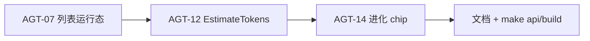

# Agent 模块 2–8 — 开发计划

> **版本**：2026-05-21 | **状态**：✅ 迭代 8–10 主项完成；🟡 AGT-15/16、批量/迁移待补  
> **需求/设计**：见各模块 `2 agents-create.md` … `8 agent-title.md` 及对应 `*.design.md`  
> **进度真相**：[execution-plan.md](../guides/execution-plan.md) · **系统待办**：[0-system-development.md](./0-system-development.md) §8.11  
> **模块索引**：[2 创建](./2-agents-create-development.md) · [3 列表](./3-agent-list-development.md) · [4 分类](./4-agent-type-development.md) · [5 设置](./5-agent-setting-development.md) · [6 文件](./6-agent-setting-file-development.md) · [7 进化](./7-agent-evolution-development.md) · [8 顶栏](./8-agent-title-development.md)  
> **迭代 10 详案**：[devlog/2026-05-21-Agent-Iteration10-Plan.md](../devlog/2026-05-21-Agent-Iteration10-Plan.md) · [changelog](../changelog/2026-05-21-Agent-Iteration10.md)

---

## 1. 目标

在 **不破坏分层红线**（`biz` 不 import `trpc-agent-go`；`server` 不调 Runner）前提下，补齐 Agent 全家桶 **P2 体验与可观测性**，并为 P3（复制、批量、Scanner）留出接口。

---

## 2. 待优化项清单

| ID | 模块 | 项 | 优先级 | 迭代 9 |
|----|------|-----|--------|--------|
| AGT-01 | 运行时 | BuilderDeps 分组 + FlowLog | P2 | ✅ 已完成 |
| AGT-02 | 5 设置 | config_json PATCH 合并 | P2 | ✅ 已完成 |
| AGT-03 | 2 创建 | agent_key 查重 | P3 | ✅ 已完成 |
| AGT-04 | 2 创建 | validate-model | P2 | ✅ 已完成 |
| AGT-05 | 5 设置 | ToolOverride | P2 | ✅ 已完成 |
| AGT-07 | 3 列表 | `last_run_status` / `last_run_at` | P2 | ✅ 迭代 9 |
| AGT-12 | 6 文件 | `EstimateTokens` 前端对接 | P2 | ✅ 迭代 9 |
| AGT-14 | 8 顶栏/列表 | 进化 chip + `pending_evolution_count` | P2 | ✅ 迭代 9 |
| AGT-06 | 2 创建 | 后端模板 API | P2 | ✅ 迭代 10 |
| AGT-08 | 5 设置 | `AgentSettingsPage` 拆分 | P2 | ✅ 迭代 10（页壳 ~488 行） |
| AGT-09 | 7 进化 | EvolutionScanner | P2 | ✅ 迭代 10 |
| AGT-11 | 6 文件 | AI 编辑（真实 LLM） | P2 | ✅ 迭代 10 |
| AGT-10 | 3 列表 | DuplicateAgent | P3 | ✅ 迭代 10 |
| AGT-13 | 4 分类 | 删除前 Agent 计数 | P2 | ✅ data 层已有 |
| AGT-15 | 8 顶栏 | GenerateAgentTitle | P3 | ⏳ |
| AGT-16 | 7 进化 | 指标趋势图 | P3 | ⏳ |
| — | 3 列表 | `created_by`、批量、迁移 | P2–P3 | ✅ `created_by`；⏳ 批量/迁移 |

---

## 3. 迭代 9 实施顺序（已完成 2026-05-21）

> 变更摘要：[changelog/2026-05-21-Agent-Iteration9.md](../changelog/2026-05-21-Agent-Iteration9.md)



### 3.1 AGT-07 — 列表运行态

| 层 | 变更 |
|----|------|
| proto | `Agent.last_run_status` / `last_run_at` / `pending_evolution_count` |
| data | `ListExtrasForAgents`：最新 session `state_json.runtime.status` + evolution pending 计数 |
| biz | `AgentUsecase.List` 合并 extras |
| web | `formatLastRunStatus`；卡片底栏展示运行态 |

**规则**：无 session → `idle`；有 `runtime.status` → 原样（终态由 `persistRunStatus` 保留，含 `failed`/`cancelled`）；仅有 `last_run_at` 无 status → `idle`。`ListExtrasForAgents` 为批量查询（非 per-agent N+1）。

### 3.2 AGT-12 — Token 估算

| 层 | 变更 |
|----|------|
| 已有 | `EstimateTokens` RPC |
| web | `estimateAgentTokens()`；`AgentFilesPanel` 侧栏用服务端估算 |

### 3.3 AGT-14 — 进化标签

| 层 | 变更 |
|----|------|
| 列表 | `isAgentEvolving(agent)` = `self_evolve && pending_evolution_count > 0` |
| 设置顶栏 | 同上，使用已加载的 suggestions |

---

## 4. 验证（规范要求）

```bash
make api
make build
go build ./internal/agent/ ./internal/biz/ ./internal/data/ ./internal/service/
cd web && pnpm lint && pnpm build
```

---

## 5. 迭代 10（已完成 2026-05-21）

详见 **[devlog/2026-05-21-Agent-Iteration10-Plan.md](../devlog/2026-05-21-Agent-Iteration10-Plan.md)** · [changelog](../changelog/2026-05-21-Agent-Iteration10.md)。审查加固见 changelog §审查修复。

**仍开放**：批量/迁移、设置页 &lt;300 行、Scanner TTL、进化趋势图（AGT-16）。

---

## 6. LIST-02 交付（2026-05-21）

| 项 | 说明 |
|----|------|
| 库表 | `agents.created_by` + 迁移/索引 `02_agent_created_by.sql` |
| API | `ListAgents.created_by`（`mine` / 用户 id）、`ListAgentCreators`、`ListAgentTemplates` 全字段 |
| 创建 | 服务端写入 `created_by`；模板 `applyTemplate`；Kratos `reason` → inline 错误 |
| 复制 | `Duplicate` 清空 `created_by` 后按当前用户创建 |
| 文档 | [changelog](../changelog/2026-05-21-Agent-CreatedBy-Templates-Errors.md) · `2/3-*-development.md` |
