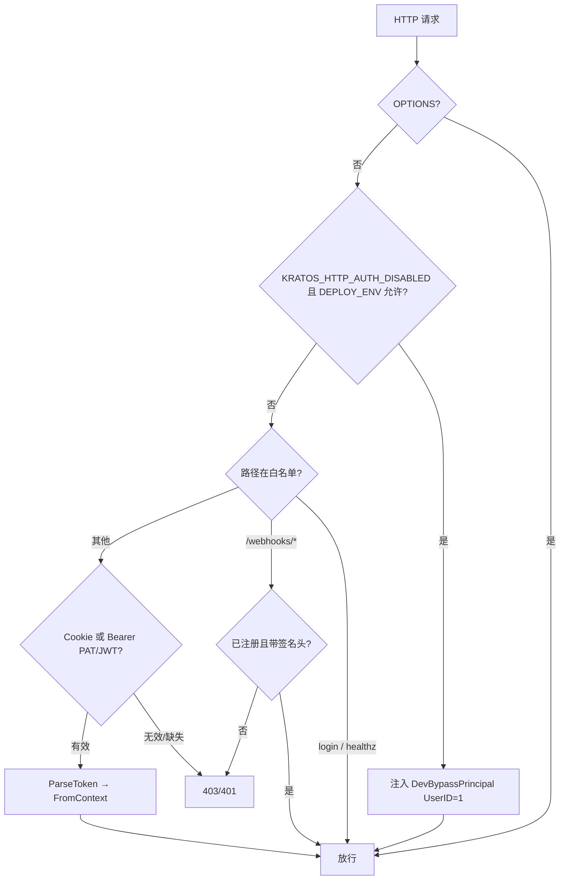
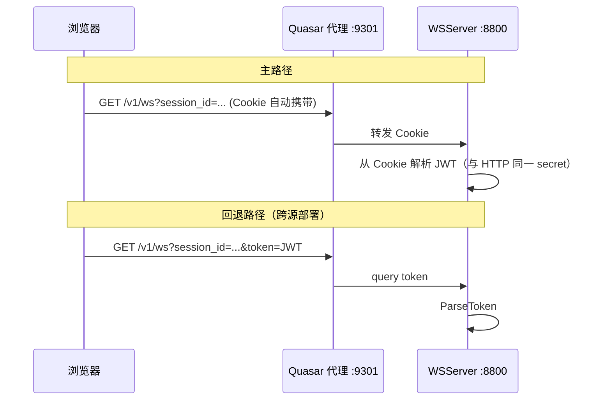
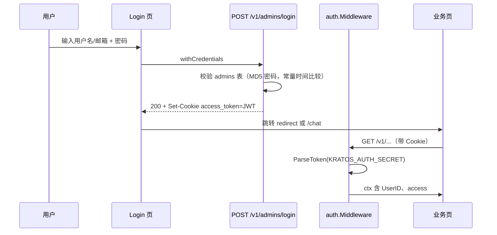
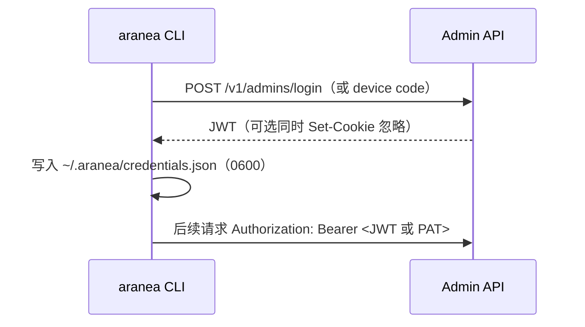

# Admin 认证 — 设计文档

> **版本**：2026-06-06
> **关联**：`pkg/auth`、`internal/service/admin.go`、`web/src/stores/auth.ts`
> **需求**：[admin-auth.md](./admin-auth.md) · **开发计划**：[admin-auth.development.md](./admin-auth.development.md)

---

## 一、设计目标与原则

### 1.1 要解决的技术问题

Aranea 管理端需要一套对人和对机器都清晰的认证方式：浏览器默认 HttpOnly Cookie + 同源代理；高级场景暴露 Token / API Key；外部 Webhook 各自签名；开发可用 bypass 但生产禁止。用户角色与期望见 [需求文档 · 用户角色与期望](./admin-auth.md#用户角色与期望)。

### 1.2 设计原则

1. **一种主路径，多种补充**：浏览器默认 HttpOnly Cookie + 同源代理；高级场景才暴露 Token / API Key。
2. **失败可理解**：区分「未登录」「会话过期」「后端未启动」「跨站 Cookie 丢失」。
3. **开发/生产显式分层**：开发可用 bypass；生产禁止 bypass，启动未配置 `KRATOS_AUTH_SECRET` 即失败。
4. **实时通道与 HTTP 一致**：WebSocket 自动继承会话，不要求用户手动复制 JWT。
5. **渐进增强**：先巩固 Cookie 会话；再 PAT；再 SSO/OIDC。

### 1.3 非目标（本阶段）

- 多租户 `workspace_id` 全库隔离（另文）
- 细粒度 RBAC（角色表 + 权限点）— 当前仅有 JWT 内 `access: admin`
- 面向公众的「用户注册」— 仅 Admin 账号体系

---

## 二、现状架构（As-Is）

### 2.1 模块职责与分层

```
┌─────────────────────────────────────────────────────────────┐
│  web：Login 页 → POST /v1/admins/login → Cookie access_token │
│       kratosApi.withCredentials + 路由守卫 ensureSession      │
│       WS：同源 Cookie 自动携带；跨源 buildWsUrl ?token= 回退   │
│       readAccessTokenCookie 已 deprecated（HttpOnly 不可读）   │
└───────────────────────────┬─────────────────────────────────┘
                            │ HTTP / WS
┌───────────────────────────▼─────────────────────────────────┐
│  pkg/auth                                                    │
│    Middleware()     — HTTP：Cookie JWT / Bearer / query token │
│    GRPCMiddleware() — gRPC：Bearer JWT（无 token 仅记日志）   │
│    features.go      — KRATOS_HTTP_AUTH_DISABLED + DEPLOY_ENV │
│    webhook.go       — /webhooks/* 注册路径 + 签名头粗检        │
│    cookie.go        — HttpOnly + SameSite=Lax + 可选 Secure   │
│    health.go        — /healthz 暴露 auth_mode 等诊断信息      │
│    request_token.go — 三级提取：Cookie > Bearer > query token │
└───────────────────────────┬─────────────────────────────────┘
                            │ auth.FromContext(ctx)
┌───────────────────────────▼─────────────────────────────────┐
│  internal/service/admin.go — Login / Logout / Current / CRUD  │
│  internal/biz + data       — admins 表，密码 MD5 存储（待升级） │
└─────────────────────────────────────────────────────────────┘
```

### 2.2 核心环境变量

| 变量 | 作用 | 用户可见影响 |
|------|------|----------------|
| `KRATOS_AUTH_SECRET` | JWT 签名密钥（≥32 字符推荐） | 未设置且非 dev/CI → **进程启动 panic** |
| `KRATOS_AUTH_COOKIE` | Cookie 名，默认 `access_token` | 与前端 `readAccessTokenCookie()` 需一致 |
| `KRATOS_AUTH_COOKIE_SECURE` | `1` 时 Cookie 增加 `Secure` | HTTPS 部署开启；本地 HTTP 保持关闭 |
| `KRATOS_HTTP_AUTH_DISABLED` | `1` 时跳过 HTTP JWT 校验 | 所有 HTTP 请求视为 UserID=1 admin |
| `DEPLOY_ENV` | `dev` / `production` 等 | 非 dev 时 **拒绝** auth bypass |
| `DATA__INITIAL_ADMIN__PASSWORD` | 覆盖 config 首启管理员密码 | 生产应通过 env 注入，勿用 `changeme` |

### 2.3 已知体验问题（驱动本设计）

| 现象 | 根因 |
|------|------|
| 已登录但 Chat/WS 401 | 页面在 `:9900`（gRPC）或跨 host，Cookie 未带上 |
| dev 下 HTTP 可用、WS 不行 | 曾要求 Cookie，bypass 未覆盖 WS |
| 心跳失败就跳登录 | `isAlive` 与真实 `/healthz` 脱节 |
| 脚本难以调用 API | 仅 Cookie 登录，无长期 Token |
| `KRATOS_AUTH_SECRET` 难理解 | 命名像「API 秘钥」，与 PAT / Webhook secret 混淆 |
| Cookie 非 HttpOnly | JS 可读 token，XSS 风险 |
| 密码 MD5 存储 | MD5 可快速碰撞 |

> 上述问题的修复进度见 [开发计划 · 现状评估](./admin-auth.development.md)。

---

## 三、目标架构（To-Be）

### 3.1 凭证类型一览

| 类型 | 持有者 | 传输方式 | 有效期 | 用途 |
|------|--------|----------|--------|------|
| **Session Cookie** | 浏览器 | `Set-Cookie` HttpOnly; SameSite=Lax; 可选 Secure | 7 天（当前硬编码于 service） | 管理 UI 主路径 |
| **Session JWT** | 浏览器 / WS | Cookie 或 `?token=` / `Authorization: Bearer` | 与 Cookie 一致 | WS、gRPC、可选 Header |
| **Personal Access Token (PAT)** | 人 / CI | `Authorization: Bearer arn_pat_…` | 可配置 30/90 天，可撤销 | CLI、脚本、集成 |
| **Webhook 签名** | 飞书/钉钉等 | 平台 Header + 渠道配置的 secret | — | `/webhooks/{channel_key}` |
| **Dev Bypass** | 仅本地 | 无凭证 | — | `DEPLOY_ENV=dev` + `KRATOS_HTTP_AUTH_DISABLED=1` |

**命名约定（对用户可见）**

- 控制台设置页：**「登录密码」** — 改的是 `admins` 表密码，不是 `KRATOS_AUTH_SECRET`。
- 部署文档：**「JWT 签名密钥」** — 仅运维配置 `KRATOS_AUTH_SECRET`，不在 UI 展示。
- 集成文档：**「访问令牌 / API 令牌」** — PAT，用户可在设置里创建/吊销。

### 3.2 分层鉴权决策（HTTP）



### 3.3 WebSocket 鉴权（与 HTTP 语义对齐）



`wsAuthenticate`（`internal/server/ws.go`）：bypass 模式注入 `DevBypassPrincipal`；否则 `TokenFromHTTPRequest` 取 Cookie/Bearer/query 后 `ParseTokenFromRequest` 校验。用户侧交互规则见 [需求文档 · WebSocket 体验](./admin-auth.md#websocket-体验)。

---

## 四、端到端流程

### 4.1 浏览器：首次登录



登录交互行为（按钮 loading、错误分类、冷启动校验等）见 [需求文档 · 交互规格](./admin-auth.md#交互规格用户视角)；前端组件与代码位置见 [§九 与代码映射](#九与代码映射)。

### 4.2 本地开发：推荐两种模式

**模式 A — 免登录（最快）**

```powershell
$env:DEPLOY_ENV="dev"
$env:KRATOS_HTTP_AUTH_DISABLED="1"
go run ./cmd/admin -conf ./configs
# 前端 http://localhost:9001
```

- HTTP / WS 均视为 admin(id=1)。
- 可选登录 `dev`/`dev`（种子账号），非必须。
- 启动日志打印：`AUTH BYPASS ACTIVE`（`WarnIfBypassEnabled`）。

**模式 B — 与生产一致的 Cookie 流程（推荐联调鉴权）**

```powershell
$env:DEPLOY_ENV="dev"
$env:KRATOS_AUTH_SECRET="local-dev-only-change-me-32chars-min"
# 不设置 KRATOS_HTTP_AUTH_DISABLED
```

- 浏览器走完整登录；验证 Cookie、WS、401 跳转。
- 避免「只在 bypass 下能跑通」的假象。

### 4.3 脚本 / CLI（PAT 目标）



**PAT 创建流程（目标）**

1. 用户已用 Cookie 登录管理台。
2. 设置 → **访问令牌** → 创建（名称、过期时间、只读/读写 scope）。
3. 仅展示一次 `arn_pat_xxxx`；库内存 hash。
4. CLI 配置：`ARANEA_TOKEN` 或 `credentials.json`。

### 4.4 Webhook（与 Admin 认证隔离）

- 路径：`POST /webhooks/{channel_key}`
- **不**使用 `KRATOS_AUTH_SECRET`。
- 中间件：路径已 `RegisterWebhookPath` + 非 bypass 时要求签名类 Header。
- Handler：用渠道配置中的 **app_secret** 做密码学验签（飞书/钉钉各自实现）。

---

## 五、API 与错误契约

### 5.1 Proto 契约

定义于 `api/kratos/admin/v1/admin.proto`，`service AdminService`：

| RPC | HTTP | 鉴权 | 说明 |
|-----|------|------|------|
| `Login` | `POST /v1/admins/login` | 白名单 | 校验凭据，Set-Cookie |
| `Logout` | `POST /v1/admins/logout` | 已认证 | 清 Cookie |
| `Current` | `GET /v1/admins/current` | 已认证 | 返回当前用户 |
| `ListAdmins` | `GET /v1/admins/list` | admin | 分页/过滤/排序 |
| `CreateAdmin` | `POST /v1/admins/create` | admin | 创建管理员 |
| `UpdateAdmin` | `PUT /v1/admins/update` | admin | FieldMask 更新 |
| `DeleteAdmin` | `DELETE /v1/admins/{id}` | admin | 删除管理员 |
| `GetAdmin` | `GET /v1/admins/{id}` | admin | 查询单个管理员 |

`Admin` 消息字段：`id`、`name`、`email`、`phone`、`avatar`、`access`、`password`、`create_time`、`update_time`。`LoginRequest` 为 `password` + `oneof identity { username; email }`。

> 注：`phone` 字段在 Proto 中定义但当前未持久化（Ent Schema 与 `convertAdmin` 均未涉及），属待清理差异。

### 5.2 HTTP 状态与文案

| 状态 | 场景 | 建议 `message`（中文） | 前端动作 |
|------|------|------------------------|----------|
| 401 | 无 Cookie / Token 无效 | 未登录或会话已失效 | 跳转登录 + redirect |
| 403 | 非 admin 调管理 API | 没有权限执行此操作 | Notify + 停留 |
| 403 | 未注册 webhook | （仅服务端日志） | — |
| 502/网络 | 后端未启动 | 无法连接服务，请确认 admin 是否在 :8000 运行 | dev：不踢登录；提示检查端口 |

### 5.3 登录接口契约

- **路径**：`POST /v1/admins/login`
- **体**：`username` 或 `email` + `password`
- **成功**：`Admin` JSON + `Set-Cookie`（7 天，HttpOnly + SameSite=Lax）
- **失败**：401/400 + Kratos error envelope；统一 `ErrInvalidCredentials` 防枚举

### 5.4 当前用户契约

- **路径**：`GET /v1/admins/current`（需已认证）
- **用途**：刷新 Pinia、校验 Cookie 是否仍有效

---

## 六、数据模型

### admins 表（`internal/data/ent/schema/admin.go`）

| 字段 | 类型 | 约束 |
|------|------|------|
| `id` | int64 | Unique, Immutable |
| `name` | string | Default "" |
| `email` | string | Default "" |
| `avatar` | string | Default "" |
| `access` | string | Default ""（`admin` / 其他） |
| `password` | string | Default ""（MD5 hex 存储，待升级 bcrypt） |
| `create_time` | time | Default now, Immutable |
| `update_time` | time | Default now, UpdateDefault now |

**索引**：`idx_admins_name`、`idx_admins_email`。

**访问层**：`internal/data/admin.go` 实现 `biz.AdminReader` / `biz.AdminWriter`（窄接口，`AdminRepo` 复合接口已 Deprecated）。

**种子账号**：`internal/data/bootstrap_dev_admin.go`（bypass 模式下确保 id=1 的 `dev`/`dev` 账号）、`internal/data/bootstrap_initial_admin.go`（首启管理员）。

> PAT 落地后将新增 `admin_access_tokens` 表（hash、name、expires、revoked_at），届时在此补充。

---

## 七、安全边界

| 项 | 要求 |
|----|------|
| `KRATOS_AUTH_SECRET` | 生产随机 ≥32 字节；仅运维持有；轮换时需接受全体用户重新登录 |
| Cookie | `HttpOnly; SameSite=Lax; Secure`（HTTPS 时通过 `KRATOS_AUTH_COOKIE_SECURE` 开启） |
| bypass | 仅 `DEPLOY_ENV=dev\|development\|test` 或 CI；`production` **必须 false** |
| 密码存储 | 现状 MD5（弱）；演进目标迁移 bcrypt/argon2，登录仍兼容一次升级 |
| 登录防枚举 | `ErrInvalidCredentials` 统一错误 + `subtle.ConstantTimeCompare` 常量时间比较 |
| gRPC | 现状无 token 仅记日志不拒绝；生产应内网 + 后续强制 Bearer 或 mTLS |
| PAT | 仅存 hash；支持吊销；审计「谁在何时创建」（演进目标） |

---

## 八、配置与部署清单

### 8.1 生产最小集

```bash
export DEPLOY_ENV=production
export KRATOS_AUTH_SECRET="<随机密钥>"
# 禁止 KRATOS_HTTP_AUTH_DISABLED
export DATA__INITIAL_ADMIN__PASSWORD="<强密码>"   # 覆盖 config.yaml changeme
export DATA__POSTGRES__SOURCE="<真实 DSN>"        # 覆盖示例 DSN
```

### 8.2 本地开发对照表

| 目标 | DEPLOY_ENV | KRATOS_HTTP_AUTH_DISABLED | KRATOS_AUTH_SECRET | 前端 URL |
|------|------------|---------------------------|--------------------|----------|
| 免登录 | dev | 1 | 可选 | http://localhost:9001 |
| 测真实登录 | dev | 未设置 | 必设 | http://localhost:9001 |
| 错误示范 | dev | 1 | — | http://localhost:9000 ❌ gRPC |

### 8.3 启动自检

`GET /healthz` 返回（`pkg/auth/health.go`）：

```json
{
  "auth_mode": "bypass | jwt",
  "cookie_name": "access_token",
  "ws_path": "/v1/ws",
  "deploy_env": "dev"
}
```

供前端开发面板或 README 一键核对。

---

## 九、与代码映射

| 设计点 | 代码位置 |
|--------|----------|
| Proto 契约 | `api/kratos/admin/v1/admin.proto` |
| HTTP 中间件 | `pkg/auth/middleware.go` |
| JWT 签发/解析 | `pkg/auth/token.go`、`pkg/auth/config.go` |
| Cookie 设置 | `pkg/auth/cookie.go`（HttpOnly + SameSite-Lax + 可选 Secure） |
| Token 三级提取 | `pkg/auth/request_token.go`（Cookie > Bearer > query） |
| 健康诊断 | `pkg/auth/health.go`（auth_mode / cookie_name / deploy_env） |
| Bypass | `pkg/auth/features.go` |
| Webhook 注册 | `pkg/auth/webhook.go`、`internal/server/http.go` |
| 登录/登出/CRUD | `internal/service/admin.go` |
| 业务层 | `internal/biz/admin.go`（`AdminReader`/`AdminWriter`/`AdminUsecase`） |
| 数据访问 | `internal/data/admin.go`、`internal/data/ent/schema/admin.go` |
| 种子账号 | `internal/data/bootstrap_dev_admin.go`、`internal/data/bootstrap_initial_admin.go` |
| WS 鉴权 | `internal/server/ws.go` `wsAuthenticate` |
| gRPC 鉴权 | `pkg/auth/grpc_middleware.go` |
| 前端会话 | `web/src/stores/auth.ts` |
| 登录页 | `web/src/pages/LoginPage.vue` |
| 登录错误分类 | `web/src/features/admin/loginErrors.ts` |
| WS URL 构建 | `web/src/config/runtime.ts` `buildWsUrl`（`readAccessTokenCookie` 已 deprecated） |

---

## 十、术语表

| 术语 | 含义 |
|------|------|
| **JWT 签名密钥** | `KRATOS_AUTH_SECRET`，服务端签发会话用，用户不接触 |
| **会话 Cookie** | 登录后浏览器保存的 `access_token`（JWT 字符串） |
| **访问令牌 (PAT)** | 用户主动创建的长期 API 凭证（演进目标） |
| **Webhook Secret** | 存在 Channel 配置，用于验证飞书/钉钉回调 |
| **Auth Bypass** | 开发用环境变量组合，跳过校验，等价于始终以 admin 身份访问 |

> 实施分期与任务状态见 [开发计划](./admin-auth.development.md)；用户验收标准见 [需求文档 · 验收标准](./admin-auth.md#验收标准)。
