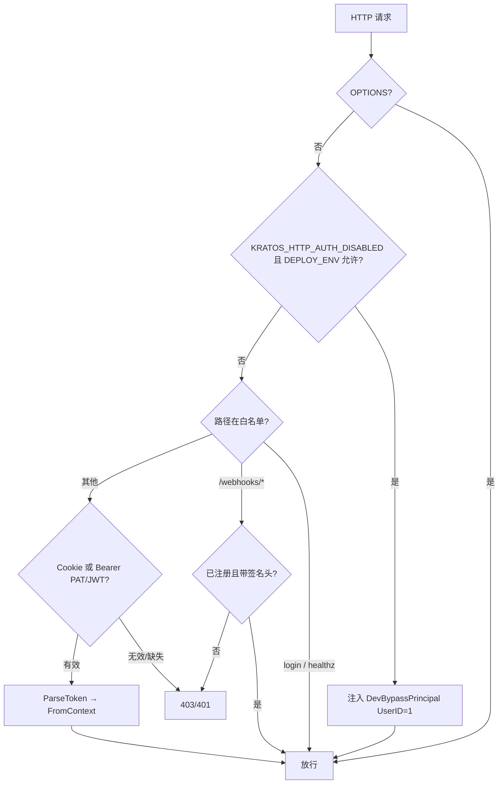
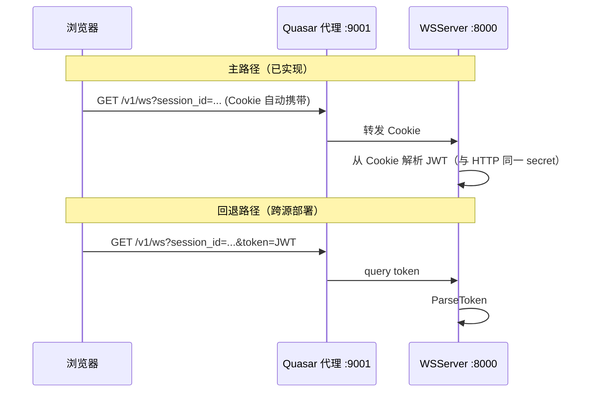
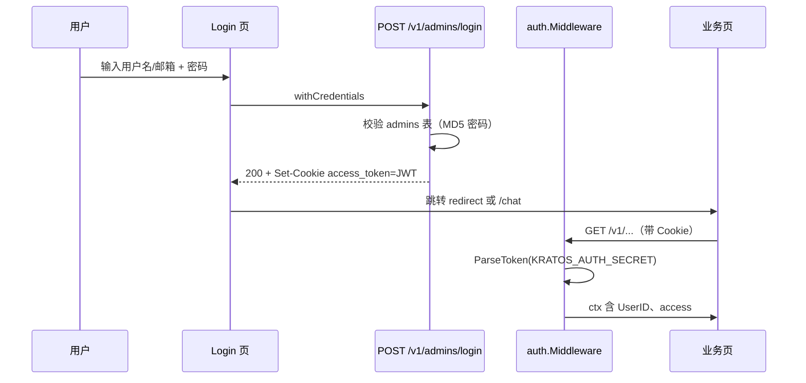
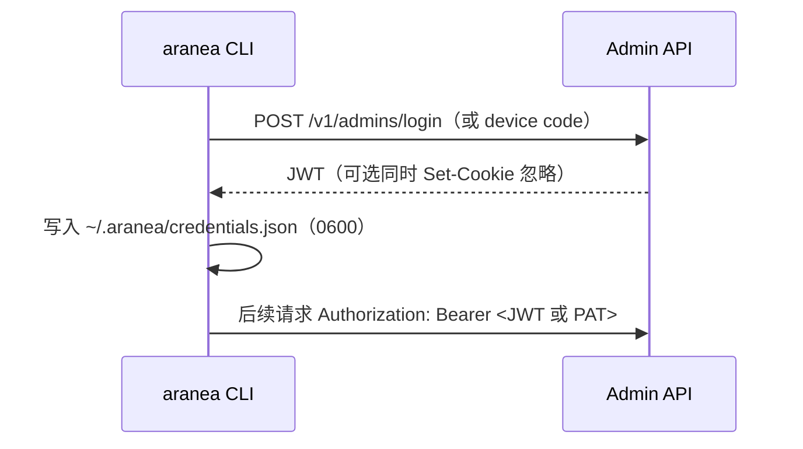

# Admin 认证 — 设计文档（用户友好度导向）

> **版本**：2026-06-06
> **状态**：Phase 0/1 已落地；Phase 2+ 为演进目标  
> **关联**：`pkg/auth`、`internal/service/admin.go`、`web/src/stores/auth.ts`  
> **开发计划**：[admin-auth-development.md](./admin-auth-development.md)  
> **规范**：[AI-DEVELOPMENT-SPECIFICATION.md](../guides/AI-DEVELOPMENT-SPECIFICATION.md)

---

## 一、目标与原则

### 1.1 要解决什么问题

Aranea 管理端需要一套**对人和对机器都清晰**的认证方式：

| 角色 | 期望 |
|------|------|
| **浏览器用户** | 登录一次即可用 Chat / 监控 / 配置；少碰环境变量；失败时有明确中文提示 |
| **本地开发者** | 一条命令启动；可选「免登录」但边界清楚，不误用于生产 |
| **脚本 / CLI** | 不依赖 Cookie；可用长期 Token 或 `login` 后持久化凭据 |
| **外部 Webhook** | 不走管理员账号；各 Channel 用自己的签名密钥 |
| **运维 / 安全** | 生产必须强密钥；dev bypass 不可在 `production` 生效；密钥不进仓库 |

### 1.2 设计原则（用户友好度）

1. **一种主路径，多种补充**：浏览器默认 **HttpOnly Cookie + 同源代理**；高级场景才暴露 Token / API Key。
2. **失败可理解**：区分「未登录」「会话过期」「后端未启动」「跨站 Cookie 丢失」，前端与 API 返回可操作的文案。
3. **开发/生产显式分层**：开发可用 bypass；生产禁止 bypass，且启动时未配置 `KRATOS_AUTH_SECRET` 即失败。
4. **实时通道与 HTTP 一致**：WebSocket 自动继承会话，不要求用户手动复制 JWT（除无 Cookie 的自动化客户端）。
5. **渐进增强**：先巩固 Cookie 会话；再 Personal Access Token（PAT）；再 SSO/OIDC（企业）。

### 1.3 非目标（本阶段）

- 多租户 `workspace_id` 全库隔离（另文）
- 细粒度 RBAC（角色表 + 权限点）— 当前仅有 JWT 内 `access: admin`
- 面向公众的「用户注册」— 仅 **Admin** 账号体系

---

## 二、现状（As-Is）

### 2.1 模块职责

```
┌─────────────────────────────────────────────────────────────┐
│  web：Login 页 → POST /v1/admins/login → Cookie access_token │
│       kratosApi.withCredentials + 路由守卫 ensureSession      │
│       WS：同源 Cookie 自动携带；跨源 buildWsUrl ?token= 回退   │
│       readAccessTokenCookie 已 deprecated（HttpOnly 不可读）   │
└───────────────────────────┬─────────────────────────────────┘
                            │ HTTP / WS
┌───────────────────────────▼─────────────────────────────────┐
│  pkg/auth                                                    │
│    Middleware()     — HTTP：Cookie JWT / Bearer / query token │
│    GRPCMiddleware() — gRPC：Bearer JWT（无 token 仅 warning） │
│    features.go      — KRATOS_HTTP_AUTH_DISABLED + DEPLOY_ENV │
│    webhook.go       — /webhooks/* 注册路径 + 签名头粗检        │
│    cookie.go        — HttpOnly + SameSite=Lax + 可选 Secure   │
│    health.go        — /healthz 暴露 auth_mode 等诊断信息      │
│    request_token.go — 三级提取：Cookie > Bearer > query token │
└───────────────────────────┬─────────────────────────────────┘
                            │ auth.FromContext(ctx)
┌───────────────────────────▼─────────────────────────────────┐
│  internal/service/admin.go — Login / Logout / Current / CRUD  │
│  internal/biz + data       — admins 表，密码 MD5 存储（待升级） │
└─────────────────────────────────────────────────────────────┘
```

### 2.2 核心环境变量

| 变量 | 作用 | 用户可见影响 |
|------|------|----------------|
| `KRATOS_AUTH_SECRET` | JWT 签名密钥（≥32 字符推荐） | 未设置且非 dev/CI → **进程启动 panic** |
| `KRATOS_AUTH_COOKIE` | Cookie 名，默认 `access_token` | 与前端 `readAccessTokenCookie()` 需一致 |
| `KRATOS_HTTP_AUTH_DISABLED` | `1` 时跳过 HTTP JWT 校验 | 所有 HTTP 请求视为 UserID=1 admin |
| `DEPLOY_ENV` | `dev` / `production` 等 | 非 dev 时 **拒绝** auth bypass |
| `DATA__INITIAL_ADMIN__PASSWORD` | 覆盖 config 首启管理员密码 | 生产应通过 env 注入，勿用 `changeme` |

### 2.3 已知体验问题（驱动本设计）

| 现象 | 根因 | 状态 |
|------|------|------|
| 已登录但 Chat/WS 401 | 页面在 `:9000`（gRPC）或跨 host，Cookie 未带上 | ✅ 已对齐：WS 同源 Cookie；跨源 `?token=` 回退 |
| dev 下 HTTP 可用、WS 不行 | 曾要求 Cookie，bypass 未覆盖 WS | ✅ 已对齐：bypass 覆盖 WS |
| 心跳失败就跳登录 | `isAlive` 与真实 `/healthz` 脱节 | ✅ 已修复：`checkBackendHealth` + `/healthz` auth_mode |
| 脚本难以调用 API | 仅 Cookie 登录 | ⏳ Phase 2：PAT + `Authorization: Bearer` |
| `KRATOS_AUTH_SECRET` 难理解 | 命名像「API 秘钥」 | ✅ 文档区分 JWT 签名密钥 / PAT / Webhook secret |
| Cookie 非 HttpOnly | JS 可读 token，XSS 风险 | ✅ 已修复：HttpOnly + SameSite=Lax |
| 密码 MD5 存储 | MD5 可快速碰撞 | ⏳ Phase 3：迁移 bcrypt |

---

## 三、目标架构（To-Be）

### 3.1 凭证类型一览

| 类型 | 持有者 | 传输方式 | 有效期 | 用途 | 状态 |
|------|--------|----------|--------|------|------|
| **Session Cookie** | 浏览器 | `Set-Cookie` HttpOnly; SameSite=Lax; 可选 Secure | 7 天（可配置） | 管理 UI 主路径 | ✅ |
| **Session JWT** | 浏览器 / WS | Cookie 或 `?token=` / `Authorization: Bearer` | 与 Cookie 一致 | WS、gRPC、可选 Header | ✅ |
| **Personal Access Token (PAT)** | 人 / CI | `Authorization: Bearer arn_pat_…` | 可配置 30/90 天，可撤销 | CLI、脚本、集成 | ⏳ Phase 2 |
| **Webhook 签名** | 飞书/钉钉等 | 平台 Header + 渠道配置的 secret | — | `/webhooks/{channel_key}` | ✅ |
| **Dev Bypass** | 仅本地 | 无凭证 | — | `DEPLOY_ENV=dev` + `KRATOS_HTTP_AUTH_DISABLED=1` | ✅ |

**命名约定（对用户可见）**

- 控制台设置页：**「登录密码」** — 改的是 `admins` 表密码，不是 `KRATOS_AUTH_SECRET`。
- 部署文档：**「JWT 签名密钥」** — 仅运维配置 `KRATOS_AUTH_SECRET`，不在 UI 展示。
- 集成文档：**「访问令牌 / API 令牌」** — PAT，用户可在设置里创建/吊销。

### 3.2 分层鉴权决策（HTTP）



### 3.3 WebSocket 鉴权（与 HTTP 语义对齐）



**用户友好规则**

- 浏览器：**优先 Cookie**，仅在 Cookie 无法携带时（极少数跨域部署）才依赖 `?token=`。
- 禁止要求用户「打开 DevTools 复制 token 才能聊天」。
- WS 401 时前端提示：**「会话已过期，请重新登录」**，而非「WebSocket 失败」。

---

## 四、端到端流程

### 4.1 浏览器：首次登录



**前端交互要求**

| 步骤 | 行为 | 状态 |
|------|------|------|
| 提交登录 | 按钮 loading；错误展示服务端 `message`（账号/密码错误 vs 网络错误） | ✅ |
| 登录成功 | 写入 Pinia `user`；跳转 `?redirect=` | ✅ |
| 冷启动 | `ensureSession()` → `GET /v1/admins/current`；静默失败则进登录页 | ✅ |
| 401 拦截 | 带 `redirect` 回登录；dev bypass 开启时登录页显示「进入系统（免登录）」 | ✅ |
| 登录错误分类 | `loginErrors.ts` 区分网络 / 凭据 / 服务端错误 | ✅ |

### 4.2 浏览器：会话保持与退出

| 事件 | 行为 |
|------|------|
| JWT 未过期 | 正常使用；可选：响应头或 `/current` 返回 `expires_at` 供前端展示 |
| JWT 过期 | API 401 → 登录页「登录已过期，请重新登录」 |
| 用户退出 | `POST /v1/admins/logout` + 清 Cookie + 清 Pinia |
| 多标签页 | 一端 logout 后，另一端下一次请求 401 后统一登出（可 Phase 2：`storage` 事件同步） |

### 4.3 本地开发：推荐两种模式

**模式 A — 免登录（最快）**

```powershell
$env:DEPLOY_ENV="dev"
$env:KRATOS_HTTP_AUTH_DISABLED="1"
go run ./cmd/admin -conf ./configs
# 前端 http://localhost:9001
```

- HTTP / WS 均视为 admin(id=1)。
- 可选登录 `dev`/`dev`（种子账号），非必须。
- 启动日志必须打印：`AUTH BYPASS ACTIVE`（已有 `WarnIfBypassEnabled`）。

**模式 B — 与生产一致的 Cookie 流程（推荐联调鉴权）**

```powershell
$env:DEPLOY_ENV="dev"
$env:KRATOS_AUTH_SECRET="local-dev-only-change-me-32chars-min"
# 不设置 KRATOS_HTTP_AUTH_DISABLED
```

- 浏览器走完整登录；验证 Cookie、WS、401 跳转。
- 避免「只在 bypass 下能跑通」的假象。

### 4.4 脚本 / CLI（Phase 2 目标）



**PAT 创建流程（目标）**

1. 用户已用 Cookie 登录管理台。
2. 设置 → **访问令牌** → 创建（名称、过期时间、只读/读写 scope）。
3. 仅展示一次 `arn_pat_xxxx`；库内存 hash。
4. CLI 配置：`ARANEA_TOKEN` 或 `credentials.json`。

### 4.5 Webhook（与 Admin 认证隔离）

- 路径：`POST /webhooks/{channel_key}`
- **不**使用 `KRATOS_AUTH_SECRET`。
- 中间件：路径已 `RegisterWebhookPath` + 非 bypass 时要求签名类 Header。
- Handler：用渠道配置中的 **app_secret** 做密码学验签（飞书/钉钉各自实现）。

---

## 五、API 与错误契约（用户可读）

### 5.1 HTTP 状态与文案

| 状态 | 场景 | 建议 `message`（中文） | 前端动作 |
|------|------|------------------------|----------|
| 401 | 无 Cookie / Token 无效 | 未登录或会话已失效 | 跳转登录 + redirect |
| 403 | 非 admin 调管理 API | 没有权限执行此操作 | Notify + 停留 |
| 403 | 未注册 webhook | （仅服务端日志） | — |
| 502/网络 | 后端未启动 | 无法连接服务，请确认 admin 是否在 :8000 运行 | dev：不踢登录；提示检查端口 |

### 5.2 登录接口

- **路径**：`POST /v1/admins/login`
- **体**：`username` 或 `email` + `password`（camelCase）
- **成功**：`Admin` JSON + `Set-Cookie`
- **失败**：401/400 + Kratos error envelope；前端禁止只显示「登录失败」

### 5.3 当前用户

- **路径**：`GET /v1/admins/current`（需已认证）
- **用途**：刷新 Pinia、校验 Cookie 是否仍有效

---

## 六、安全边界

| 项 | 要求 | 状态 |
|----|------|------|
| `KRATOS_AUTH_SECRET` | 生产随机 ≥32 字节；仅运维持有；轮换时需接受全体用户重新登录 | ✅ |
| Cookie | `HttpOnly; SameSite=Lax; Secure`（HTTPS 时通过 `KRATOS_AUTH_COOKIE_SECURE` 开启） | ✅ |
| bypass | 仅 `DEPLOY_ENV=dev\|development\|test` 或 CI；`production` **必须 false** | ✅ |
| 密码存储 | 现状 MD5（弱）；Phase 3 迁移 bcrypt/argon2，登录仍兼容一次升级 | ⏳ |
| gRPC | 现状无 token 仅 warning 不拒绝；生产应内网 + 后续强制 Bearer 或 mTLS | ⏳ |
| PAT | 仅存 hash；支持吊销；审计「谁在何时创建」 | ⏳ Phase 2 |

---

## 七、配置与部署清单

### 7.1 生产最小集

```bash
export DEPLOY_ENV=production
export KRATOS_AUTH_SECRET="<随机密钥>"
# 禁止 KRATOS_HTTP_AUTH_DISABLED
export DATA__INITIAL_ADMIN__PASSWORD="<强密码>"   # 覆盖 config.yaml changeme
export DATA__POSTGRES__SOURCE="<真实 DSN>"        # 覆盖示例 DSN
```

### 7.2 本地开发对照表

| 目标 | DEPLOY_ENV | KRATOS_HTTP_AUTH_DISABLED | KRATOS_AUTH_SECRET | 前端 URL |
|------|------------|---------------------------|--------------------|----------|
| 免登录 | dev | 1 | 可选 | http://localhost:9001 |
| 测真实登录 | dev | 未设置 | 必设 | http://localhost:9001 |
| 错误示范 | dev | 1 | — | http://localhost:9000 ❌ gRPC |

### 7.3 启动自检（Phase 1 建议实现）

启动后可选 `GET /healthz` 扩展或 admin 诊断接口返回：

```json
{
  "auth_mode": "bypass | jwt",
  "cookie_name": "access_token",
  "ws_path": "/v1/ws",
  "deploy_env": "dev"
}
```

供前端开发面板或 README 一键核对。

---

## 八、实施分期

### Phase 0 — 文档与体验修补（已完成）

- [x] 本文档
- [x] dev 发送前 `checkBackendHealth`；避免误跳登录
- [x] WS bypass 与 HTTP 对齐
- [x] README / 登录页脚注：端口 9001、两种 dev 模式说明
- [x] 登录失败区分网络 vs 凭据（解析 error envelope）

### Phase 1 — 浏览器会话加固（已完成）

- [x] Cookie 增加 `HttpOnly`（WS 改纯 Cookie 转发，`readAccessTokenCookie` 已 deprecated）
- [x] `SameSite=Lax` / `Secure` 按环境配置（`KRATOS_AUTH_COOKIE_SECURE`）
- [x] 统一 WS 鉴权：同源时仅 Cookie，无需 `?token=`；跨源回退 `?token=`
- [x] `/healthz` 暴露 `auth_mode`
- [x] 登录错误分类（`loginErrors.ts`）

### Phase 2 — Personal Access Token

- [ ] 表 `admin_access_tokens`（hash、name、expires、revoked_at）
- [ ] Proto：`CreateToken` / `ListTokens` / `RevokeToken`
- [ ] `auth.Middleware` 支持 `Bearer arn_pat_*` 与 Cookie JWT 并存
- [ ] CLI `aranea login` / `ARANEA_TOKEN` 文档

### Phase 3 — 企业能力

- [ ] 密码哈希升级（bcrypt）
- [ ] OAuth2/OIDC SSO（回调仍落 Session Cookie）
- [ ] RBAC：角色与权限点
- [ ] gRPC 生产强制认证

---

## 九、与代码映射

| 设计点 | 代码位置 |
|--------|----------|
| HTTP 中间件 | `pkg/auth/middleware.go` |
| JWT 签发/解析 | `pkg/auth/token.go`、`pkg/auth/config.go` |
| Cookie 设置 | `pkg/auth/cookie.go`（HttpOnly + SameSite-Lax + 可选 Secure） |
| Token 三级提取 | `pkg/auth/request_token.go`（Cookie > Bearer > query） |
| 健康诊断 | `pkg/auth/health.go`（auth_mode / cookie_name / deploy_env） |
| Bypass | `pkg/auth/features.go` |
| Webhook 注册 | `pkg/auth/webhook.go`、`internal/server/http.go` |
| 登录/登出/CRUD | `internal/service/admin.go` |
| WS 鉴权 | `internal/server/ws.go` `wsAuthenticate` |
| 前端会话 | `web/src/stores/auth.ts` |
| 登录错误分类 | `web/src/features/admin/loginErrors.ts` |
| WS URL 构建 | `web/src/config/runtime.ts` `buildWsUrl`（`readAccessTokenCookie` 已 deprecated） |
| dev 种子账号 | `internal/data/bootstrap_dev_admin.go` |
| 初始管理员 | `internal/data/bootstrap_initial_admin.go` |

---

## 十、验收标准

### Phase 0/1（已完成）

- [x] 新同事仅读 README + 本文，可在 10 分钟内完成「模式 A 免登录」或「模式 B 登录」并开始 Chat。
- [x] 浏览器在 `localhost:9001` 登录后，Chat WS 无需手动配置 token 即可收流。
- [x] 生产未配置 `KRATOS_AUTH_SECRET` 时进程拒绝启动；配置 bypass 在 `production` 无效。
- [x] 401/后端不可用时，用户看到的文案能区分「重新登录」与「检查后端是否启动」。
- [x] Webhook 与 Admin 凭证在文档中无混称「秘钥」。
- [x] Cookie 为 HttpOnly + SameSite-Lax；`readAccessTokenCookie` 已 deprecated。

### Phase 2（待实施）

- [ ] PAT CRUD：创建/列表/吊销，仅展示一次明文。
- [ ] `auth.Middleware` 支持 `Bearer arn_pat_*` 与 Cookie JWT 并存。
- [ ] CLI `aranea login` / `ARANEA_TOKEN` 文档。

### Phase 3（待实施）

- [ ] 密码哈希从 MD5 升级到 bcrypt（登录兼容一次迁移）。
- [ ] RBAC：角色与权限点。
- [ ] gRPC 生产强制认证。

---

## 十一、术语表

| 术语 | 含义 |
|------|------|
| **JWT 签名密钥** | `KRATOS_AUTH_SECRET`，服务端签发会话用，用户不接触 |
| **会话 Cookie** | 登录后浏览器保存的 `access_token`（JWT 字符串） |
| **访问令牌 (PAT)** | 用户主动创建的长期 API 凭证（Phase 2） |
| **Webhook Secret** | 存在 Channel 配置，用于验证飞书/钉钉回调 |
| **Auth Bypass** | 开发用环境变量组合，跳过校验，等价于始终以 admin 身份访问 |
