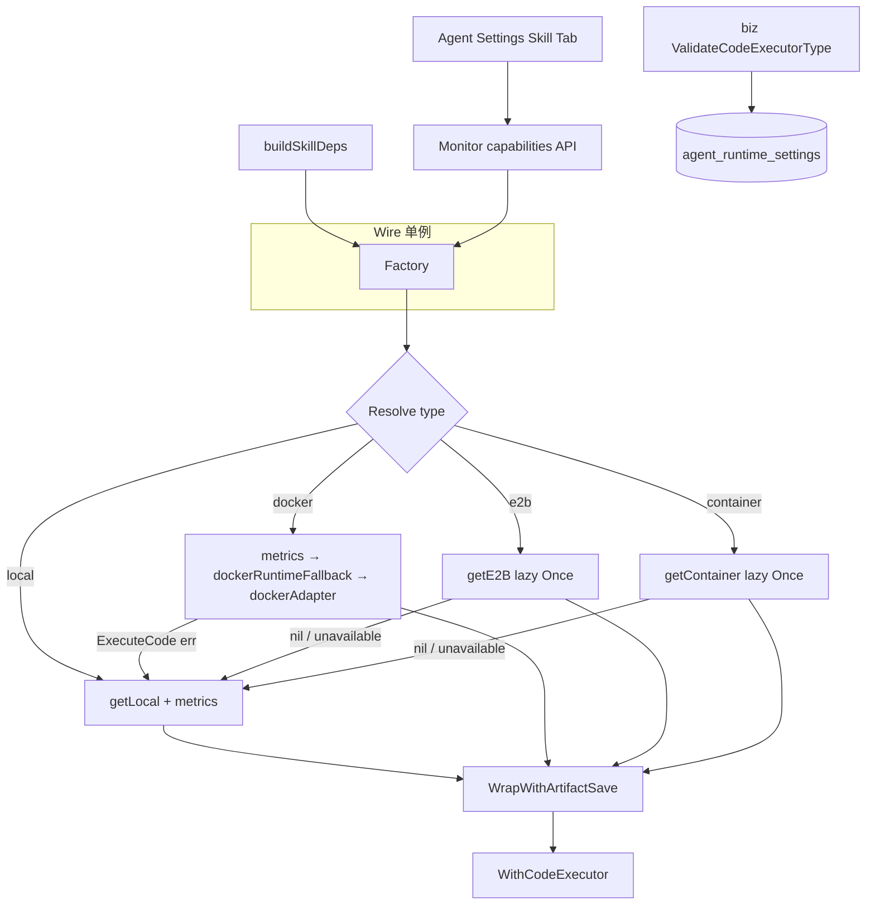

# CodeExecutor 代码执行模块 — 实现设计文档

> **对应需求**：[32-codeexecutor.md](./32-codeexecutor.md)
> **开发计划**：[32-codeexecutor.development.md](./32-codeexecutor.development.md)

---

## 一、模块概述

安全代码执行环境：本地子进程、Docker 容器、E2B 云端沙箱、Jupyter 内核。对标 `pkg/trpc-agent-go/codeexecutor` 包。

核心设计原则：

- 项目自定义 `Executor` 接口（`internal/agent/codeexecutor`）负责底层执行，通过适配层转换为框架 `codeexecutor.CodeExecutor` 接口
- 适配层位于 `internal/skill/trpc/executor.go`，将项目执行器适配为框架接口供 Skill 工具使用
- 框架 `codeexecutor` 包提供完整的 Workspace / Interactive / Artifact 生态，项目按需集成
- Agent 级别通过 `AgentRuntimeSettings.CodeExecutorType` 字段配置执行器类型
- Skill 装配门控：仅 `deps.SkillUC != nil` 时注入 `WithCodeExecutor`

> 进度状态与 Phase 划分见 [32-codeexecutor.development.md](./32-codeexecutor.development.md)。

---

## 二、架构方案

### 2.1 当前架构

```
Wire 单例
  provideCodeExecutorFactory() → *codeexecutor.Factory
    ├── ChatService / Team.Runner / MonitorService 共享
    └── TRPCBuilderDeps.CodeExecFactory

trpc_build.go（deps.SkillUC != nil 时）
  └── buildSkillDeps()
        ├── runtime.GetCodeExecutor().Type   // 领域视图
        └── skilltrpc.NewExecutorForAgent(ctx, factory, type, rootDir)
              └── factory.Resolve(ctx, type, workDir)
                    ├── local    → getLocal(workDir) → trpclocal + wrapMetrics
                    ├── docker   → wrapMetrics(dockerRuntimeFallback → dockerAdapter)
                    ├── e2b      → getE2B() lazy sync.Once → e2bexec.New (需 E2B_API_KEY)
                    └── container→ getContainer() lazy (build tag codeexec_container)
              └── WrapWithArtifactSave(exec)   // 产出物 → SaveArtifactHelper

回退链:
  1. Resolve probe: DockerAvailable / IsBackendAvailable → local + FlowLog
  2. 运行时: dockerRuntimeFallback.ExecuteCode err → local + ResetDockerProbe
  3. 生产: ARANEA_ENV=production 且 local → FlowLog（AllowLocalInProd 可关闭告警）

可观测 / 配置面:
  GET /v1/monitor/code-executor-capabilities  → Factory.Capabilities()
  biz.ValidateCodeExecutorType                → API 400
  配置优先级: Agent.CodeExecutorType > CODE_EXECUTOR_BACKEND > local
```

#### 架构图（Mermaid）



#### 双 Local 说明

| 实现 | 路径 | 用途 |
|------|------|------|
| 框架 `trpclocal.New()` | Skill 主路径（Factory.getLocal） | 与 LLMAgent CodeExecutor 契约一致 |
| 项目 `LocalExecutor` | `internal/agent/codeexecutor/executor.go` | 独立 `Executor` 接口；单测与 Docker 同级底层 |

### 2.2 规划架构

```
Factory.Resolve（扩展注册项，lazy 同 E2B/Container）
  ├── "jupyter"  → jupyter.New(...)     // 需 Jupyter 服务
  └── WorkspaceRegistry → Session 级工作区复用（框架 WorkspaceFS / InputSpec / OutputSpec）

Interactive 生态:
  InteractiveProgramRunner → 多轮交互式执行
  ProgramSession           → 状态保持 + 输入/输出/终止
```

与当前 **Factory** 的关系：规划阶段仅在 `Factory` 中增加 lazy 注册项；不再单独引入 `ExecutorRegistry` 类型。

### 2.3 双接口关系

项目存在两层执行器接口，各司其职：

| 接口 | 位置 | 职责 | 消费方 |
|------|------|------|--------|
| `Executor` | `internal/agent/codeexecutor` | 底层代码执行（语言→进程→结果） | Docker 适配器 |
| `codeexecutor.CodeExecutor` | `pkg/trpc-agent-go/codeexecutor` | 框架标准接口（CodeBlock→Output+Files） | Skill 工具、LLMAgent |

适配层 `dockerAdapter` 将项目 `Executor` 接口转换为框架 `CodeExecutor` 接口：

```
codeexecutor.CodeExecutor.ExecuteCode(input)
  → dockerAdapter.ExecuteCode()
    → 遍历 input.CodeBlocks
    → DockerExecutor.Run(ctx, block.Language, block.Code, timeout)
    → 拼接 stdout/stderr / [exit N] → CodeExecutionResult.Output
```

---

## 三、接口设计

### 3.1 项目 Executor 接口

```go
type Executor interface {
    Run(ctx context.Context, language, code string, timeout time.Duration) (Result, error)
}

type Result struct {
    Stdout      string
    Stderr      string
    ExitCode    int
    TimedOut    bool
    OOM         bool
    ArtifactDir string
}
```

### 3.2 框架 CodeExecutor 接口（pkg/trpc-agent-go）

```go
type CodeExecutor interface {
    ExecuteCode(context.Context, CodeExecutionInput) (CodeExecutionResult, error)
    CodeBlockDelimiter() CodeBlockDelimiter
}

type CodeExecutionInput struct {
    CodeBlocks  []CodeBlock
    ExecutionID string
}

type CodeExecutionResult struct {
    Output      string
    OutputFiles []File
}
```

### 3.3 框架 Workspace 生态接口

```go
type WorkspaceManager interface {
    CreateWorkspace(ctx context.Context, execID string, pol WorkspacePolicy) (Workspace, error)
    Cleanup(ctx context.Context, ws Workspace) error
}

type WorkspaceFS interface {
    PutFiles(ctx context.Context, ws Workspace, files []PutFile) error
    StageDirectory(ctx context.Context, ws Workspace, src, to string, opt StageOptions) error
    Collect(ctx context.Context, ws Workspace, patterns []string) ([]File, error)
    StageInputs(ctx context.Context, ws Workspace, specs []InputSpec) error
    CollectOutputs(ctx context.Context, ws Workspace, spec OutputSpec) (OutputManifest, error)
}

type ProgramRunner interface {
    RunProgram(ctx context.Context, ws Workspace, spec RunProgramSpec) (RunResult, error)
}

type Engine interface {
    Manager() WorkspaceManager
    FS() WorkspaceFS
    Runner() ProgramRunner
    Describe() Capabilities
}

type EngineProvider interface {
    Engine() Engine
}
```

### 3.4 框架 Interactive 接口

```go
type InteractiveProgramRunner interface {
    StartProgram(ctx context.Context, ws Workspace, spec InteractiveProgramSpec) (ProgramSession, error)
}

type ProgramSession interface {
    ID() string
    Poll(limit *int) ProgramPoll
    Log(offset *int, limit *int) ProgramLog
    Write(data string, newline bool) error
    Kill(grace time.Duration) error
    Close() error
}
```

### 3.5 框架 WorkspaceRegistry

```go
type WorkspaceRegistry struct { ... }

func NewWorkspaceRegistry() *WorkspaceRegistry

func (r *WorkspaceRegistry) Acquire(ctx context.Context, m WorkspaceManager, id string) (Workspace, error)
```

### 3.6 框架 Artifact 集成

```go
func WithArtifactService(ctx context.Context, svc artifact.Service) context.Context
func SaveArtifactHelper(ctx context.Context, filename string, data []byte, mime string) (int, error)
func LoadArtifactHelper(ctx context.Context, name string, version *int) ([]byte, string, int, error)
```

### 3.7 框架 Env 注入

```go
type RunEnvProvider func(ctx context.Context) map[string]string

func NewEnvInjectingCodeExecutor(exec CodeExecutor, provider RunEnvProvider) CodeExecutor
```

### 3.8 Monitor API 契约（Proto）

`api/kratos/monitor/v1/monitor.proto`：

```protobuf
message CodeExecutorCapability {
  string type = 1;
  bool available = 2;
  string reason = 3;
}

message GetCodeExecutorCapabilitiesResponse {
  repeated CodeExecutorCapability backends = 1;
}

service MonitorService {
  rpc GetCodeExecutorCapabilities(GetMonitorLogsRequest) returns (GetCodeExecutorCapabilitiesResponse) {
    option (google.api.http) = {get: "/v1/monitor/code-executor-capabilities"};
  }
}
```

### 3.9 Agent 配置 Proto 契约

`api/kratos/agent/v1/agent.proto`：

```protobuf
// code_executor_type selects Skill code execution backend: local | docker | e2b | container
string code_executor_type = 101;
```

---

## 四、适配层设计

### 4.1 Skill 适配层

`internal/skill/trpc/executor.go` + `artifact_executor.go`：

| 函数 | 返回 | 说明 |
|------|------|------|
| `NewExecutorForAgent(ctx, factory, agentType, workDir, lg)` | `codeexecutor.CodeExecutor` | Factory.Resolve + `WrapWithArtifactSave` |
| `NewLocalExecutor(factory, workDir)` | `codeexecutor.CodeExecutor` | 强制 local |
| `WrapWithArtifactSave(inner, lg)` | `codeexecutor.CodeExecutor` | 产出物持久化（`artifact_executor.go`） |

`dockerAdapter`（`internal/agent/codeexecutor/docker_adapter.go`）适配逻辑：

- `CodeBlockDelimiter()` → markdown 三反引号
- `ExecuteCode()` → 遍历 CodeBlocks → `DockerExecutor.Run()` → 拼接 stdout/stderr / `[exit N]` / timeout / OOM
- 输出目录 → `CollectOutputDirFiles` → `CodeExecutionResult.OutputFiles`

### 4.2 Factory

项目级 **Factory**（`internal/agent/codeexecutor/factory.go`）负责 backend 解析与 lazy 注册；与框架 **WorkspaceRegistry**（Session 工作区复用）职责分离。

| 类型 | 构造来源 | 注册方式 |
|------|----------|----------|
| `local` | `trpclocal.New()` | `getLocal(workDir)`，按 workDir 缓存 |
| `docker` | `dockerAdapter` → 项目 `DockerExecutor` | 单例 + `dockerRuntimeFallback` |
| `e2b` | `e2bexec.New(...)` | lazy `sync.Once`，需 `E2B_API_KEY` |
| `container` | `containerexec.New(...)` | lazy + build tag `codeexec_container` |
| `jupyter` | `jupyter.New(...)` | 规划中 |

核心 API：

```go
func NewFactory() *Factory                                    // Deprecated: 使用 NewFactoryWithLogger
func NewFactoryWithLogger(lg loggateway.Logger) *Factory      // Wire 单例（推荐）
func (f *Factory) Resolve(ctx, agentType, workDir string) codeexecutor.CodeExecutor
func (f *Factory) Capabilities() []Capability                   // Monitor / 前端
func (f *Factory) RegisteredTypes() []string                    // 可用 backend 列表
func (f *Factory) IsBackendAvailable(typ string) bool           // 探测可用性
```

装饰链：`Resolve` 出口经 `wrapMetrics`；Skill 路径最外层 `WrapWithArtifactSave`。

---

## 五、配置设计

### 5.1 Agent 级别配置

`AgentRuntimeSettings.CodeExecutorType`（`local` / `docker` / `e2b` / `container`）：

- biz：`ValidateCodeExecutorType` — 非法值 API 400
- 默认：`"local"`（`agent_defaults.go` + DB DEFAULT）
- Ent：`code_executor_type` 列；Ent auto migration 管理（无手动 SQL 迁移文件）
- 前端：Agent 设置 Skill Tab + Monitor capabilities 禁用不可用项

### 5.2 Docker 后端配置

| 配置项 | 默认值 | 说明 |
|--------|--------|------|
| `Image` | `python:3.11-slim` | 执行镜像 |
| `Network` | `none` | 网络模式 |
| `CPUs` | `0.5` | CPU 限制（`--cpus`） |
| `MemoryBytes` | `268435456` | 内存限制（256 MiB） |
| `TmpSize` | `128m` | /tmp tmpfs 大小 |
| `PullPolicy` | `missing` | 镜像拉取策略 |
| `WorkspaceMount` | `""` | 宿主工作区只读挂载路径 |

环境变量覆盖：

| 环境变量 | 说明 |
|----------|------|
| `CODE_EXECUTOR_BACKEND` | 全局执行器后端选择 |
| `CODE_EXECUTOR_DOCKER_IMAGE` | Docker 镜像覆盖 |
| `CODE_EXECUTOR_TIMEOUT` | 执行超时覆盖 |
| `CODE_EXECUTOR_ALLOW_LOCAL_IN_PROD` | 生产环境允许 local（`1`/`true`/`yes`） |

### 5.3 E2B 后端配置

| 配置项 | 环境变量 | 说明 |
|--------|----------|------|
| API Key | `E2B_API_KEY` | E2B API 密钥 |
| Domain | — | E2B 域名（默认 `e2b.app`） |
| Template | — | 沙箱模板（默认 `code-interpreter-v1`） |
| Sandbox Timeout | — | 沙箱生命周期 |
| Execution Timeout | — | 单次代码执行超时 |

### 5.4 Jupyter 后端配置（规划）

| 配置项 | 说明 |
|--------|------|
| IP | Jupyter 服务器地址 |
| Port | Jupyter 服务器端口 |
| Token | 认证令牌 |
| KernelName | 内核名称 |
| StartTimeout | 启动超时 |

### 5.5 Container 后端配置

| 配置项 | 默认值 | 说明 |
|--------|--------|------|
| Image | `python:3.9-slim` | Docker 镜像 |
| NetworkMode | `none` | 网络模式 |
| AutoRemove | `true` | 自动移除容器 |
| Privileged | `false` | 非特权模式 |

---

## 六、安全设计

### 6.1 Docker 后端安全控制

| 控制 | 实现方式 |
|------|----------|
| 无网络 | `--network none` |
| 只读根文件系统 | `--read-only` |
| 内存上限 | `--memory` + `--memory-swap`（相等 → 禁用 swap） |
| CPU 上限 | `--cpus=0.5` |
| 临时容器 | `--rm` — 运行后移除容器 |
| 超时 | `context.WithTimeout` + `--stop-timeout` |
| 临时文件系统 | `--tmpfs /tmp:size=128m` |

### 6.2 回退策略

双层回退机制：

| 层级 | 机制 | 说明 |
|------|------|------|
| 启动时 | `applyAvailabilityFallback()` | Docker daemon 不可用 → local + FlowLog；E2B/Container 不可用 → local |
| 运行时 | `dockerRuntimeFallback` | Docker 执行失败 → local + `ResetDockerProbe()` 清缓存 |
| 生产告警 | `warnLocalInProd()` | `ARANEA_ENV=production` 且使用 local → FlowLog 告警（`AllowLocalInProd` 可关闭） |
| 生产拒绝 | `applyAvailabilityFallback()` | `ARANEA_ENV=production` 且 Docker 不可用且未允许 local → `TypeDisabled` 拒绝执行 |

未来可扩展 `firecracker` 或 `nsjail` 轻量 VM 后端。

---

## 七、可观测性设计

### 7.1 Prometheus 指标

| 指标 | 标签 | 说明 |
|------|------|------|
| `aranea_codeexec_runs_total` | `kind`, `status` | 总执行次数（success/error/timeout/oom） |
| `aranea_codeexec_duration_seconds` | `kind` | 执行时长直方图 |
| `aranea_codeexec_oom_total` | `kind` | OOM kill 计数 |
| `aranea_codeexec_blocks_total` | `kind`, `status` | 代码块级计数 |

**覆盖范围**：`metricsExecutor` 装饰器包裹所有 Factory.Resolve 出口的执行器（`kind=local|docker|e2b|container`），Skill 全路径（含框架 `trpclocal`）均已覆盖。

**状态分类**：`classifyExecutionStatus()` 根据 exit code / timeout / OOM 归类为 `success` / `error` / `oom` / `timeout`。

### 7.2 框架 Engine 能力描述

`EngineProvider.Engine().Describe()` 返回 `Capabilities`：

| 字段 | 说明 |
|------|------|
| `Isolation` | 隔离级别描述 |
| `NetworkAllowed` | 是否允许网络 |
| `ReadOnlyMount` | 是否支持只读挂载 |
| `Streaming` | 是否支持流式输出 |
| `MaxDiskBytes` | 最大磁盘使用 |

---

## 八、数据模型

### 8.1 项目执行器类型

`internal/agent/codeexecutor/executor.go` 中的类型：

| 类型 | 用途 |
|------|------|
| `Result` | 执行结果（Stdout/Stderr/ExitCode/TimedOut/OOM/ArtifactDir） |
| `LocalConfig` | 本地执行器配置 |
| `DockerConfig` | Docker 执行器配置 |

`internal/agent/codeexecutor/config.go` 中的类型：

| 类型 | 用途 |
|------|------|
| `EnvConfig` | 环境变量配置（Backend/DockerImage/Timeout/E2BAPIKey/AllowLocalInProd） |
| `Capability` | 后端能力描述（Type/Available/Reason） |

### 8.2 AgentRuntimeSettings 扩展

`internal/biz/agent_types.go`：

- `CodeExecutorType` 字段（`string`）
- `GetCodeExecutor()` 领域视图方法，返回 `CodeExecutorCfg{Type: ...}`

`internal/biz/code_executor.go`：

- `ValidateCodeExecutorType(raw string) error` — 非法值返回 API 400
- `ValidCodeExecutorTypes() []string` — 允许值列表
- 常量：`CodeExecutorLocal` / `CodeExecutorDocker` / `CodeExecutorE2B` / `CodeExecutorContainer`

> 注：biz 层 `ValidCodeExecutorTypes` 与 `codeexecutor.ValidTypes` 枚举需手动同步（红线 R2：`internal/biz` 不 import `trpc-agent-go`）。

### 8.3 Ent Schema

`internal/data/ent/schema/agent_runtime_setting.go`：

```go
field.String("code_executor_type").Default("local"),
```

Ent auto migration 管理，无手动 SQL 迁移文件。

---

## 九、前端组件设计

### 9.1 AgentSettingsSkillsTab

`web/src/pages/agent-settings/AgentSettingsSkillsTab.vue`：

| 元素 | 说明 |
|------|------|
| 执行器类型选择器 | `q-select` 绑定 `config.code_executor_type`，选项来自 `codeExecutorOptions` |
| 选项禁用逻辑 | 根据 `codeExecutorCapabilities` 中对应后端的 `available` 字段禁用不可用项 |
| 回退提示 | `fallbackHint` 计算属性：选中后端不可用时显示 `q-banner` 提示 |

### 9.2 数据流

```
Monitor API (GET /v1/monitor/code-executor-capabilities)
  → CodeExecutorCapability[] (type/available/reason)
    → AgentSettingsSkillsTab props.codeExecutorCapabilities
      → capabilityByType (Map<type, Capability>)
        → codeExecutorOptions (禁用不可用项)
        → fallbackHint (选中项不可用时提示)
```

### 9.3 类型定义

`web/src/features/monitor/types.ts`：

```typescript
interface CodeExecutorCapability {
  type: string;
  available: boolean;
  reason?: string;
}
```

### 9.4 UX 规范

- 不可用后端选项显示但禁用，鼠标悬停显示不可用原因
- 选中后端不可用时显示黄色提示横幅
- 默认选中 `local` 后端
- 配置变更通过 Agent 设置保存流程持久化

---

## 十、涉及文件

> 文件状态与改动清单见 [32-codeexecutor.development.md](./32-codeexecutor.development.md) §8。
