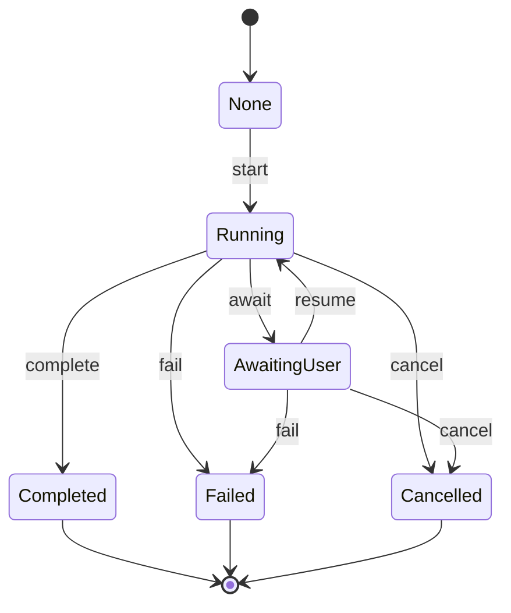

# Runner 运行器模块 — 实现设计文档

> 对应需求：[40-runner.md](./40-runner.md)
> 现状与差距：详见 [40-runner.development.md §2 现状评估](./40-runner.development.md#2-现状评估)

---

## 一、模块概述

Agent 运行器完善：AgentFactory、ArtifactService 注入、SessionIngestor、AwaitUserReplyRouting（框架层）、AgentLookup、RalphLoop、EnqueueUserMessage RPC、RunnerManager。对标 trpc-agent-go `runner` 包，将项目从当前 Service 层自管理的运行模式升级为框架层完整驱动的 ManagedRunner + SteerableRunner。

### 核心架构

```
用户消息 → ChatService.SendChatMessage
             ↓
         lockSession() → 会话级互斥
             ↓
         activeRuns 检查 → 运行中则入 pendingQueue
             ↓
         BuildTRPCLLMAgentCached → 构建/缓存 Agent
             ↓
         RunnerManager.NewTurnRunner → 装配 Runner（注入 Session/Memory/Plugins/Artifact/Ingestor/Routing/RalphLoop）
             ↓
         Runner.Run(userID, sessionID, message) → 框架层执行
             ↓
         ConsumeEventStream → 事件循环：持久化 + 转发 + 状态更新
             ↓
         sessionIngestor.IngestSession() → 会话完成后摄入外部记忆
             ↓
         processPendingQueue → 处理待执行队列
```

### trpc-agent-go runner 包结构

```
pkg/trpc-agent-go/runner/
├── runner.go              # Runner/ManagedRunner/SteerableRunner 接口和实现
├── agent_lookup.go        # Agent 查找（注册表 + 工厂回退）
├── await_user_reply.go    # AwaitUserReply 路由（会话状态驱动）
└── ralph_loop.go          # RalphLoop 迭代执行（带验证和完成承诺）
```

### Runner 接口层级

| 接口 | 方法 | 说明 |
|------|------|------|
| `Runner` | `Run` + `Close` | 基础运行器 |
| `ManagedRunner` | + `Cancel` + `RunStatus` | 可管理的运行器 |
| `SteerableRunner` | + `EnqueueUserMessage` | 可转向的运行器 |

---

## 二、Proto 层

无需独立 Proto 服务。通过 Chat Service 暴露 Runner 控制接口。

### 当前 Proto 状态

`api/kratos/chat/v1/chat.proto` 已有：

| RPC | 路由 | 状态 |
|-----|------|------|
| `StopGeneration` | POST `/v1/chat/stop` | ✅ 已有 |
| `GetRunStatus` | GET `/v1/chat/run-status` | ✅ 已有 |
| `AwaitUserReply` | POST `/v1/chat/await-reply` | ✅ 已有 |
| `EnqueueUserMessage` | POST `/v1/chat/enqueue` | ✅ 已有 |
| `GetPendingMessages` | GET `/v1/chat/pending` | ✅ 已有 |
| `CancelPendingMessage` | POST `/v1/chat/pending/cancel` | ✅ 已有 |
| `UpdatePendingMessage` | POST `/v1/chat/pending/update` | ✅ 已有 |
| `InterruptAndSendMessage` | POST `/v1/chat/pending/interrupt-and-send` | ✅ 已有 |

> 取消运行沿用 `StopGeneration`（HTTP）与 WS `cancel`，不设独立 `CancelRun` RPC。

### EnqueueUserMessage Proto 契约

```protobuf
// api/kratos/chat/v1/chat.proto

message EnqueueUserMessageRequest {
  string session_id = 1 [(google.api.field_behavior) = REQUIRED];
  string content = 2 [(google.api.field_behavior) = REQUIRED];
}

message EnqueueUserMessageResponse {
  // accepted is true when the message was accepted by either runner steering or the pending queue.
  bool accepted = 1;
  // queued is true when the message fell back to the service pending queue.
  bool queued = 2;
  string pending_id = 3;
}

service ChatService {
  rpc EnqueueUserMessage(EnqueueUserMessageRequest) returns (EnqueueUserMessageResponse) {
    option (google.api.http) = { post: "/v1/chat/enqueue" body: "*" };
  }
}
```

### GetRunStatus Proto 契约

`RunStatus` 消息已与 `ManagedRunner.RunStatus` 对齐，包含完整字段：

```protobuf
message RunStatus {
  // run_id is the unique identifier of the current or most-recent run.
  string run_id = 1;
  // status is one of: idle | pending | running | awaiting_user | completed | failed | cancelled | sync.
  string status = 2;
  // error_message is only set when status == failed.
  string error_message = 3;
  // updated_at is an RFC3339 timestamp of the last status transition.
  string updated_at = 4;
  // invocation_id is the framework invocation id when a run is active (ManagedRunner.RunStatus).
  string invocation_id = 5;
  // agent_name is the root agent name for the active invocation.
  string agent_name = 6;
  // started_at is RFC3339 when the framework run started.
  string started_at = 7;
  // last_event_at is RFC3339 of the last runner event for the invocation.
  string last_event_at = 8;
  // event_count is the number of events observed for the invocation.
  int32 event_count = 9;
  // await_kind distinguishes awaiting_user reasons: "" | "reply" | "tool_confirm".
  string await_kind = 10;
  // await_tool_key is set when await_kind == "tool_confirm".
  string await_tool_key = 11;
  // await_tool_call_id is set when await_kind == "tool_confirm".
  string await_tool_call_id = 12;
}
```

### AwaitUserReply Proto 契约

```protobuf
message AwaitUserReplyRequest {
  string session_id = 1 [(google.api.field_behavior) = REQUIRED];
  // run_id identifies which run to resume. If omitted, resumes the latest awaiting_user run.
  optional string run_id = 2;
  string reply = 3 [(google.api.field_behavior) = REQUIRED];
}

message AwaitUserReplyResponse {
  bool accepted = 1;
}
```

---

## 三、Biz 层

### 3.1 Run 状态机（AS-FSM-01）

Run 实体拥有 5 种状态（含 `None` 初始态为 6 种），按 AS-FSM-01 要求定义显式状态机。

**位置**：`internal/biz/run_state_machine.go`

```go
// Stability:stable
type RunState string

const (
    RunStateNone         RunState = ""
    RunStateRunning      RunState = "running"
    RunStateCompleted    RunState = "completed"
    RunStateFailed       RunState = "failed"
    RunStateCancelled    RunState = "cancelled"
    RunStateAwaitingUser RunState = "awaiting_user"
)

// Stability:stable
type RunEvent string

const (
    RunEventStart    RunEvent = "start"
    RunEventComplete RunEvent = "complete"
    RunEventFail     RunEvent = "fail"
    RunEventCancel   RunEvent = "cancel"
    RunEventAwait    RunEvent = "await"
    RunEventResume   RunEvent = "resume"
)
```

**状态转换图**：



**转换规则**（`runTransitionRules`）：

| From | Event | To |
|------|-------|-----|
| None | start | Running |
| Running | complete | Completed |
| Running | fail | Failed |
| Running | cancel | Cancelled |
| Running | await | AwaitingUser |
| AwaitingUser | resume | Running |
| AwaitingUser | cancel | Cancelled |
| AwaitingUser | fail | Failed |

**API**：

```go
// Stability:stable
type RunStateMachine struct {
    inner *shared.GenericStateMachine[RunState, RunEvent]
}

func NewRunStateMachine() *RunStateMachine
func (sm *RunStateMachine) Transition(from RunState, event RunEvent) (RunState, error)
func (sm *RunStateMachine) CanTransition(from, to RunState) bool
func (sm *RunStateMachine) ValidTargets(from RunState) []RunState

// 辅助函数
func ParseRunState(s string) RunState
func IsRunTerminal(state RunState) bool
```

### 3.2 RunStatusEntry（运行时状态快照）

运行时层的状态快照结构（`internal/runtime/run_registry.go`）：

```go
type RunStatusEntry struct {
    RunID     string
    Status    string // idle | pending | running | awaiting_user | completed | failed | cancelled
    ErrMsg    string
    UpdatedAt time.Time
}
```

### 3.3 FrameworkRunStatus（框架层状态）

框架层状态镜像结构（`internal/runtime/run_status.go`），与 `trpcrunner.ManagedRunner.RunStatus` 对齐：

```go
type FrameworkRunStatus struct {
    InvocationID string
    AgentName    string
    StartedAt    time.Time
    LastEventAt  time.Time
    EventCount   int
}

func FrameworkRunStatusFromRunner(runner trpcrunner.Runner, requestID string) (FrameworkRunStatus, bool)
```

### 3.4 RalphLoop 校验

`internal/biz/ralph_loop.go` 提供 RalphLoop 配置的校验与检测：

```go
func RalphLoopConfigured(s *AgentRuntimeSettings) bool
func ValidateRalphLoopSettings(s *AgentRuntimeSettings) error
```

### 3.5 运行控制入口

运行控制通过 `internal/runtime` 包实现，无需独立 `RunnerUsecase`：

```go
type RunRegistry struct{ ... }           // internal/runtime/run_registry.go
type RunnerManager struct{ ... }         // internal/runtime/runner_manager.go
type PendingMessageQueue struct{ ... }   // internal/runtime/pending_queue.go
type RunnerInstanceRegistry struct{ ... } // internal/runtime/runner_registry.go
```

---

## 四、运行时层

### 4.1 TRPCRunnerDeps

`TRPCRunnerDeps` 定义于 `internal/agent/trpc_runtime.go`：

```go
type TRPCRunnerDeps struct {
    AppName               string
    SessionService        trpcsession.Service
    MemoryService         trpcmemory.Service
    ArtifactService       trpcartifact.Service
    Ingestor              trpcsession.Ingestor
    AwaitUserReplyRouting bool
    RalphLoop             *trpcrunner.RalphLoopConfig
    LG                    loggateway.Logger
    Plugins               []trpcplugin.Plugin
}
```

### 4.2 NewTRPCRunner

`NewTRPCRunner` 已完整实现所有 option 注入（`internal/agent/trpc_runtime.go`）：

```go
func NewTRPCRunner(root trpcagent.Agent, deps TRPCRunnerDeps, opts ...trpcrunner.Option) (trpcrunner.ManagedRunner, error)
```

注入逻辑：
```go
if deps.SessionService != nil { opts = prepend(WithSessionService(...), opts...) }
if deps.MemoryService != nil  { opts = prepend(WithMemoryService(...), opts...) }
if len(deps.Plugins) > 0      { opts = append(opts, WithPlugins(deps.Plugins...)) }
if deps.ArtifactService != nil { opts = append(opts, WithArtifactService(deps.ArtifactService)) }
if deps.Ingestor != nil        { opts = append(opts, WithSessionIngestor(deps.Ingestor)) }
if deps.AwaitUserReplyRouting  { opts = append(opts, WithAwaitUserReplyRouting(true)) }
if deps.RalphLoop != nil       { opts = append(opts, WithRalphLoop(*deps.RalphLoop)) }
```

AgentFactory 通过 `RunnerManager.NewTurnRunner` 的 `TurnRunnerSpec.AgentFactoryKeys` 注入，不在 `TRPCRunnerDeps` 中。

### 4.3 AgentFactory 实现

`BizAgentFactoryOptions` 按 `agent_key` 注册工厂闭包（`internal/agent/factory.go`）：

```go
func BizAgentFactoryOptions(deps TRPCBuilderDeps, agentKeys ...string) []trpcrunner.Option
```

工厂闭包逻辑：`resolveBizAgentByKey` 从数据库解析 Agent → `BuildTRPCAgentCached` 构建/缓存。查找顺序：已注册实例 → AgentFactory → 未找到。

### 4.4 AgentLookup 实现

`BizAgentRegistryOptions` 注册预构建的 Agent 实例（`internal/agent/lookup.go`）：

```go
func BizAgentRegistryOptions(agents map[string]trpcagent.Agent) []trpcrunner.Option
```

每个条目经 `trpcrunner.WithAgent(name, ag)` 注册到 Runner 查找表，优先于工厂回退。

### 4.5 SessionIngestor 实现

`BizSessionIngestor` 实现于 `internal/agent/ingestor.go`，当前记录摄入元数据，为外部 backend 预留扩展点：

```go
type BizSessionIngestor struct {
    memory trpcmemory.Service
    lg     loggateway.Logger
}

// 返回 trpcsession.Ingestor 接口；memory 为 nil 时返回 nil
func NewBizSessionIngestor(memory trpcmemory.Service, lg loggateway.Logger) trpcsession.Ingestor

func (ing *BizSessionIngestor) IngestSession(
    ctx context.Context,
    sess *trpcsession.Session,
    opts ...trpcsession.IngestOption,
) error
```

`IngestSession` 当前仅做日志记录。摄入失败不阻塞主流程。外部 Mem0 等 backend 待扩展。

> 注意：auto-memory 提取不在此 hook 中，由 `Runner.graphCompletion → memoryService.EnqueueAutoMemoryJob → AutoMemoryQueue → AutoMemoryWorker` 独立路径处理。

### 4.6 AwaitUserReplyRouting（框架层）

当前项目通过 Service 层自行实现 AwaitUserReply（`serviceawaitreply.ServiceTool` + `ChatOrchestrator` await hook + `ChatService.AwaitUserReply` RPC），实现了 mid-turn 阻塞等待用户回复。

框架层的 `WithAwaitUserReplyRouting` 提供跨 turn 的路由能力：Agent 调用 `await_user_reply` 后在 Session 状态中记录路由，下一轮用户消息自动路由到该 Agent。

两层机制互补：
- **Service 层**（已实现）：mid-turn 阻塞，当前 turn 内等待用户回复
- **框架层**（已启用）：跨 turn 路由，下一轮用户消息自动路由到指定 Agent

启用方式：`RunnerManager.NewTurnRunner` 中 `TurnRunnerSpec.AwaitUserReplyRouting` 为 true 时（即 `AwaitHook != nil`），传入 `WithAwaitUserReplyRouting(true)`。

### 4.7 RalphLoop 配置

`RalphLoopConfig` 从 `AgentRuntimeSettings` 数据库配置映射（`internal/agent/ralph_loop.go`）：

```go
func ResolveRalphLoopTurn(s *biz.AgentRuntimeSettings) RalphLoopTurnResult
func RalphLoopConfigFromSettings(s *biz.AgentRuntimeSettings) (*trpcrunner.RalphLoopConfig, error)
```

`RalphLoopTurnResult`：
```go
type RalphLoopTurnResult struct {
    Config  *trpcrunner.RalphLoopConfig
    SkipErr error // set when settings are partially configured but invalid
}
```

映射规则：
- `RalphLoopMaxIterations > 0` 时启用（`<= 0` 时默认 5）
- `CompletionPromise` → `PromiseTagOpen`/`PromiseTagClose` 默认 `<promise>`/`</promise>`
- `VerifyCommand` → `VerifyCommand` + `VerifyWorkDir` + `VerifyTimeout`
- 无效配置：`RalphLoopTurnResult.SkipErr` 非空时跳过并记录 Warn

### 4.8 RunnerManager

`RunnerManager` 定义于 `internal/runtime/runner_manager.go`，统一 Runner 装配入口：

```go
type RunnerFactoryDeps struct {
    Persist PersistenceSet
}

type TurnRunnerSpec struct {
    Plugins               []trpcplugin.Plugin
    AwaitUserReplyRouting bool
    BuilderDeps           chatagent.TRPCBuilderDeps
    AgentFactoryKeys      []string
    LookupAgents          map[string]trpcagent.Agent
    RalphLoop             *trpcrunner.RalphLoopConfig
    ExtraOpts             []trpcrunner.Option
    RegistryKey           string  // 非空时支持长生命周期 Runner
}

type RunnerManager struct {
    factory  RunnerFactoryDeps
    registry *RunnerInstanceRegistry
    lg       loggateway.Logger
}

func NewRunnerManager(factory RunnerFactoryDeps, lg loggateway.Logger) *RunnerManager
func (m *RunnerManager) Registry() *RunnerInstanceRegistry
func (m *RunnerManager) NewTurnRunner(root trpcagent.Agent, spec TurnRunnerSpec) (trpcrunner.ManagedRunner, error)
func (m *RunnerManager) CloseRunner(key string) error
```

`NewTurnRunner` 逻辑：构建 `TRPCRunnerDeps` → 注册 `BizAgentRegistryOptions` → 注册 `BizAgentFactoryOptions` → `NewTRPCRunner` → `RegistryKey` 非空时存入 `RunnerInstanceRegistry`。每 turn 默认 `Close`；`RegistryKey` 非空时支持长生命周期实例。

### 4.9 RunRegistry

`RunRegistry` 定义于 `internal/runtime/run_registry.go`，基于 `sync.Map` 提供类型安全的并发访问。`activeRunMap` 内置 `sync.Mutex` 保护 `StoreRunner`/`StoreCancelable` 的 load-modify-store 原子性（T2.2 TOCTOU 修复）：

```go
type RunRegistry struct {
    activeRuns     activeRunMap     // sessionID → activeRun（含 mu mutex + updateOrStore）
    pendingCancels cancelMap        // sessionID → context.CancelFunc
    runStatuses    statusMap        // sessionID → *RunStatusEntry
    lg             loggateway.Logger
}

// activeRunMap 的 updateOrStore 方法在 mutex 保护下执行原子 load-modify-store，
// 消除 StoreRunner/StoreCancelable 的 TOCTOU 竞态。plain load/store/delete
// 仍使用 sync.Map 无锁访问（单操作本身并发安全）。
```

func NewRunRegistry() *RunRegistry
func (r *RunRegistry) WithLogger(lg loggateway.Logger) *RunRegistry

func (r *RunRegistry) HasActive(sessionID string) bool
func (r *RunRegistry) StorePlaceholder(sessionID string)
func (r *RunRegistry) StoreRunner(sessionID, runID string, runner trpcrunner.Runner)
func (r *RunRegistry) StoreCancelable(sessionID, runID string, cancel context.CancelFunc)
func (r *RunRegistry) Finish(sessionID string)
func (r *RunRegistry) Cancel(sessionID, reason string) (bool, string)
func (r *RunRegistry) EnqueueUserMessage(sessionID, content string) (bool, error)
func (r *RunRegistry) SetStatus(sessionID, runID, status, errMsg string)
func (r *RunRegistry) ActiveRunner(sessionID string) (trpcrunner.Runner, string, bool)
func (r *RunRegistry) GetStatus(sessionID string) (RunStatusEntry, bool)
func (r *RunRegistry) SetPendingCancel(sessionID string, cancel context.CancelFunc)
func (r *RunRegistry) ClearPendingCancel(sessionID string)
```

> trpc runner 的 `request_id` 即 `session_id`（见 chat/team turn 中 `trpcagent.WithRequestID`）。

### 4.10 RunnerInstanceRegistry

`RunnerInstanceRegistry` 定义于 `internal/runtime/runner_registry.go`，独立于 `RunRegistry`，用于跟踪可选的长生命周期 Runner：

```go
type RunnerInstanceRegistry struct {
    mu      sync.Mutex
    runners map[string]trpcrunner.Runner
}

func NewRunnerInstanceRegistry() *RunnerInstanceRegistry
func (r *RunnerInstanceRegistry) Register(key string, runner trpcrunner.Runner)
func (r *RunnerInstanceRegistry) Replace(key string, runner trpcrunner.Runner) (trpcrunner.Runner, bool)
func (r *RunnerInstanceRegistry) Get(key string) (trpcrunner.Runner, bool)
func (r *RunnerInstanceRegistry) Unregister(key string) (trpcrunner.Runner, bool)
```

---

## 五、Data 层

无需新增独立数据表。Runner 运行时状态通过 `RunRegistry` 内存管理。

### AgentRuntimeSettings Ent Schema — RalphLoop 字段

`internal/data/ent/schema/agent_runtime_setting.go` 新增 RalphLoop 字段：

```go
field.Int("ralph_loop_max_iterations").Default(0),
field.String("ralph_loop_completion_promise").Default(""),
field.String("ralph_loop_verify_command").Default(""),
field.Int("ralph_loop_verify_timeout_seconds").Default(0),
field.String("ralph_loop_promise_tag_open").Default(""),
field.String("ralph_loop_promise_tag_close").Default(""),
field.String("ralph_loop_verify_work_dir").Default(""),
```

**DDL 迁移**：`internal/data/sql/migrations/20260607_agent_runtime_patches.sql`（版本 20260607）。

**校验与接线**：
- 持久化校验：`biz.ValidateRalphLoopSettings`（Create/Update Agent 与 Planner 同级）。
- 运行时映射：`internal/agent.RalphLoopConfigFromSettings`；Turn 统一 `ResolveRalphLoopTurn`（Chat / Team / A2A）。
- **Team**：Ralph 取自 **第一个成员 Agent** 的 `agent_runtime_settings`（领队/编排 Agent 配置生效）。
- 无效配置：保存拒绝；历史脏数据 Turn 时 FlowLog Warn 并跳过 Ralph。

---

## 六、Service 层

### 6.1 ChatService 与 Biz 分工

| 组件 | 职责 |
|------|------|
| `runtime.RunRegistry` | 每 session active runner、cancel、steerable enqueue、服务层 status |
| `runtime.RunnerManager` | 统一 `NewTRPCRunner` 装配（Session/Memory/Artifact/Plugins/Factory/Routing） |
| `runtime.PendingMessageQueue` | FIFO 待执行队列（快照持久化、followup 合并） |
| `biz.ChatUsecase` | 会话锁、Enqueue 编排（steerable 失败则入队） |
| `ChatOrchestrator` | turn 执行（`runSingleAgentViaTRPC`）、`RunGateway`、pending 处理 |
| `ChatService` | RPC/WS 桥接、`setRunStatus`（含 webhook/await meta） |

`ChatService` 不再持有 `activeRuns`/`pendingQueue` sync.Map；运行控制经 `TurnDeps` 注入的 `RunRegistry` 与 `PendingMessageQueue`。`RunnerManager` 经 `TurnDeps.CoalesceRunnerManager()` 获取。

### 6.2 ChatService RPC 实现

已实现的 RPC 方法（`internal/service/chat.go`）：

```go
func (s *ChatService) StopGeneration(ctx context.Context, req *chatv1.StopGenerationRequest) (*chatv1.StopGenerationResponse, error)
    // → orch.CancelRun(sessionID)

func (s *ChatService) EnqueueUserMessage(ctx context.Context, req *chatv1.EnqueueUserMessageRequest) (*chatv1.EnqueueUserMessageResponse, error)
    // → orch.EnqueueUserMessage(sessionID, content) → steerable enqueue 或 pending 入队

func (s *ChatService) GetRunStatus(ctx context.Context, req *chatv1.GetRunStatusRequest) (*chatv1.RunStatus, error)
    // → RunRegistry.GetStatus + 运行中合并 ManagedRunner.RunStatus + awaiting_user 元数据

func (s *ChatService) AwaitUserReply(ctx context.Context, req *chatv1.AwaitUserReplyRequest) (*chatv1.AwaitUserReplyResponse, error)
    // → TrySendAwaitChannel；channel 已清理时尝试 resumeAwaitAfterRestart 恢复
```

取消运行沿用 `StopGeneration`（HTTP）与 WS `cancel`，不设独立 `CancelRun` RPC。

### 6.3 GetRunStatus 对齐

`GetRunStatus` 已实现双源合并（`internal/service/chat.go` + `internal/runtime/run_status.go`）：
1. 从 `RunRegistry.GetStatus` 读取服务层状态
2. 运行中时经 `FrameworkRunStatusFromRunner` 查询 `ManagedRunner.RunStatus` 获取框架层完整信息（invocation_id、agent_name、event_count 等）
3. `awaiting_user` 状态时合并 await 元数据（await_kind、await_tool_key、await_tool_call_id）

---

## 七、Wire 注入

Runner 相关组件的装配路径（`cmd/admin/wire.go`）：

```go
// RunnerManager 经 NewRunnerManagerFromPersist 构建，注入 TurnDeps.RunnerMgr
RunnerMgr: rt.NewRunnerManagerFromPersist(persist, lg)

// RunRegistry 经 ChatOrchestrator.coalesceRunRegistry 兜底创建（deps.Turn.Runs 为 nil 时）
// PendingMessageQueue 经 ChatOrchestrator.coalescePendingQueue 兜底创建

// ArtifactService 经 provideArtifactRuntimeService Provider 提供
func provideArtifactRuntimeService(uc *biz.ArtifactUsecase) trpcartifact.Service
```

`NewRunnerManagerFromPersist` 定义于 `internal/runtime/deps.go`：

```go
func NewRunnerManagerFromPersist(persist PersistenceSet, lg loggateway.Logger) *RunnerManager
```

`BizSessionIngestor` 在 `internal/agent/turn_helpers.go` 的 `NewRunnerDepsFromRuntimeWithLogger` 中内联创建（memory 非 nil 时），不经 Wire Provider。

---

## 八、Web 前端设计

Runner 为运行时基础设施，无独立前端页面。相关 UI 通过 Chat 页面暴露。

### 当前前端状态

| 组件/文件 | 状态 | 说明 |
|-----------|------|------|
| `web/src/features/chat/api.ts` | ✅ | 已有 `getRunStatus`、`stopGeneration`、`enqueueMessage`、`enqueueUserMessage`、`awaitUserReply` |
| `web/src/domain/types.ts` | ✅ | `RunStatus` 接口含完整字段（含 awaitKind/awaitToolKey/awaitToolCallId） |
| `web/src/composables/useRunStatus.ts` | ✅ | 已有轮询运行状态 + 提交回复 |
| `ChatRunnerStatus.vue` | ❌ | 未创建独立运行状态指示器组件 |
| `ChatEnqueueMessage.vue` | ❌ | 未创建运行中追加消息组件 |

### 8.1 Chat 页面集成

**运行状态指示器**：

| 元素 | 组件 | 说明 |
|------|------|------|
| 运行状态 | `QBadge` | 在聊天输入框旁显示当前运行状态 |
| 取消按钮 | `QBtn` | 运行中时显示取消按钮 |
| 追加消息 | `QInput` + `QBtn` | 运行中时允许用户追加消息 |

**文件结构**：

```
web/src/features/chat/
└── components/
    ├── ChatRunnerStatus.vue    ← 运行状态指示器（待创建）
    └── ChatEnqueueMessage.vue  ← 运行中追加消息（待创建）
```

### 8.2 ChatRunnerStatus.vue

| 区域 | 组件 | 说明 |
|------|------|------|
| 状态标签 | `QBadge` | `running` / `completed` / `cancelled` / `awaiting_user` |
| Agent 名称 | `QChip` | 当前运行的 Agent |
| 运行时长 | `span` | 从 startedAt 计算已运行时间 |
| 事件数 | `span` | 已处理的事件数量 |
| 取消按钮 | `QBtn` | 点击调用 StopGeneration API |

### 8.3 ChatEnqueueMessage.vue

| 区域 | 组件 | 说明 |
|------|------|------|
| 输入框 | `QInput` | 追加消息输入 |
| 发送按钮 | `QBtn` | 点击调用 EnqueueUserMessage API |
| 状态提示 | `QTooltip` | 消息将在工具调用边界后注入 |

### 8.4 API 接口

`web/src/features/chat/api.ts` 已实现：

```typescript
export async function stopGeneration(sessionId: string): Promise<boolean>
export async function enqueueUserMessage(sessionId: string, content: string): Promise<EnqueueUserMessageResult>
export async function enqueueMessage(sessionId: string, content: string): Promise<EnqueueUserMessageResult>
export async function getRunStatus(sessionId: string): Promise<RunStatus>
export async function awaitUserReply(sessionId: string, reply: string, runId?: string): Promise<boolean>
```

注意：前端使用 `stopGeneration` 而非 `cancelRun`；`enqueueUserMessage` 已废弃，委托给 `enqueueMessage`。

### 8.5 RunStatus 类型

`web/src/domain/types.ts` 已定义完整类型（`web/src/features/chat/types.ts` 重新导出）：

```typescript
export type RunStatusValue =
  | 'idle'
  | 'pending'
  | 'running'
  | 'awaiting_user'
  | 'sync'
  | 'durable'
  | 'completed'
  | 'failed'
  | 'cancelled';

export interface RunStatus {
  runId: string;
  status: RunStatusValue;
  errorMessage: string;
  updatedAt: string;
  invocationId?: string;
  agentName?: string;
  startedAt?: string;
  lastEventAt?: string;
  eventCount?: number;
  awaitKind?: string;
  awaitToolKey?: string;
  awaitToolCallId?: string;
}
```
