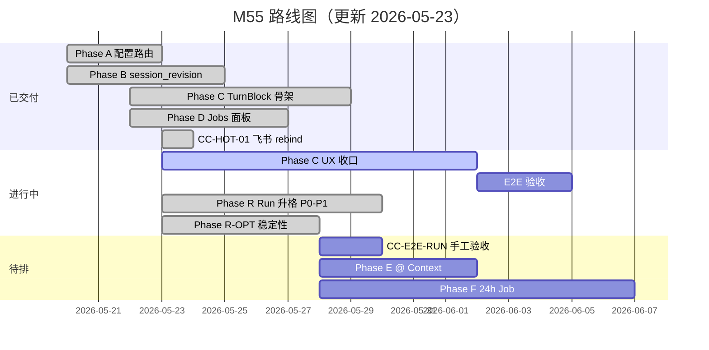

# M55 — Chat × Channel × Cursor 对标 — 开发计划

> **版本**：2026-05-29 | **状态**：🚧 Phase A–D 已交付；**Phase R**（Run 升格）已排期；**Phase C UX 收口 ✅ 已完成**；**Phase E Reasoning 侧栏 ✅ 已完成**
> **方案**：[55-chat-channel-cursor-solution.md](./55-chat-channel-cursor-solution.md)  
> **四层解耦（DECO）**：[17-channel-development.md §14](./17-channel-development.md#14-phase-deco--四层架构解耦deco)（DECO-11/12/13/14 · 衔接 CC-A/C）
> **蓝图**：[55-chat-channel-cursor-solution.md §9 附录](../需求/55-chat-channel-cursor-solution.md#9-附录企业级蓝图与-ai-落地指南)  
> **进度真相**：[execution-plan.md §迭代 CC](../guides/execution-plan.md) · **EP**：EP-CC-M55  
> **近期 changelog**：[M55 Phase A–D Review](../changelog/2026-05-23-M55-Phase-ABCD-Review-Fixes.md) · [飞书 Rebind + UX Backlog](../changelog/2026-05-23-M55-Feishu-Rebind-UX-Backlog.md) · [卡 Turn / 入站排查](../changelog/2026-05-23-M55-Stuck-Turn-Inbound-Sync-Analysis.md) · [**R-UX 格式化 / 思考 UX**](../changelog/2026-05-23-M55-Phase-R-UX-Channel-Format-Reasoning.md)

---

## 1. 模块定位

在 **不破坏现有架构红线** 前提下，完成三件事：

1. **长任务**：**目标态 §2.6** Interactive Run → 运行时升格 Durable；CC-A-02 关键词→Job 为**过渡**（§13.1）。
2. **Channel↔Web 同步**：`session_revision` + Channel 入站聚焦，Web 可靠镜像飞书会话。
3. **Cursor 式 Chat UX**：TurnBlock 分组、工具折叠、Background Job 面板。

**代码锚点**：

| 层 | 现有 | M55 扩展 |
|----|------|----------|
| biz | `channel_config_helpers.go` · `channel_peer_session.go` | 长任务路由、`UpdateSessionID` stale rebind |
| service | `channel_ingress*.go` · `trpc_turn.go` · `chat_jobs.go` | 路由、revision bump、Jobs 聚合 |
| event | `envelope.go` · `session_revision.go` | `session_revision` / `source` |
| web/chat | `TurnBlock.vue` · `groupMessagesByTurn.ts` | TurnBlock · 增量 sync · Jobs 面板 |

---

## 2. 现状评估（2026-05-23 更新）

| 项 | 状态 | 说明 |
|----|------|------|
| Channel Phase E（ACK/Job/IM Preview） | ✅ | [17-channel-development.md §10](./17-channel-development.md#10-长任务异步执行phase-e) |
| 长任务 preset + auto 关键词路由 | 🟡 过渡 | `ShouldRunAsync` 仅 `/async` · CC-R-05 |
| Run 两阶段升格（Interactive→Durable） | ✅ P0–P1 | Phase R · CC-R-01~05；稳定性见 §Phase R-OPT |
| `session_revision` 增量 sync | ✅ | API + WS + `useChatInboundSync` |
| Web TurnBlock + ToolStrip | ✅ | 默认开启；Team Session 仍走平铺 |
| Background Job 面板 | ✅ | `ChatBackgroundJobsPanel` + `GET /v1/chat/jobs` |
| 飞书 peer bind stale rebind | ✅ | CC-HOT-01 · [changelog](../changelog/2026-05-23-M55-Feishu-Rebind-UX-Backlog.md) |
| UserBubble 来源徽标（Tier 0 platform） | ✅ | CC-B-07 · `source_meta` → `q-chip` 渲染 |
| 思考/ReAct 互斥 UX | ✅ | CC-C-UX-01~03 · CC-WEB-REASONING-02~04 |
| 思考流式缓存（Store vs DB） | ✅ | CC-WEB-REASONING-01~04 · `ChatReasoningPeek` live tail |
| 飞书出站格式化（思考/正文） | ✅ | CC-CHANNEL-FMT-01~06 · [changelog](../changelog/2026-05-23-M55-Phase-R-UX-Channel-Format-Reasoning.md) |
| TurnBlock 思考/正文视觉分离 | ✅ | CC-C-UX-04 · `turn-block__response` 分区 |
| 圆环点击 Prompt 占比分解 | ✅ | CC-C-UX-05 · `ChatContextBreakdownPopover` + `useContextBreakdown` |
| 上下文压缩可视化通知 | ✅ | CC-C-UX-06 · toast + `onCompressNotice` |
| 流式脉动反馈增强 | ✅ | CC-C-UX-07 · reasoning spinner + text pulse |
| ChatComposer 上下文压力警告 | ✅ | CC-C-UX-08 · warning/critical 双级 banner |
| 消息反馈交互优化 | ✅ | CC-C-UX-09 · 实心图标切换 + tooltip |
| Prompt Preview API 接入 | ✅ | CC-E-02 · `AgentDetailStore.fetchPromptPreview` → `useContextBreakdown` |
| Reasoning 侧栏模式 | ✅ | CC-E-04 · `ChatReasoningDrawer` + `useReasoningSidebar` |
| 虚拟列表集成 | ✅ | CC-C-05 · `q-virtual-scroll` + `CHAT_VIRTUAL_SCROLL_THRESHOLD=40` |
| mapPreviewToReport 提取 | ✅ | 纯函数从 `useChatWorkspace` 提取到 `contextBreakdown.ts` |
| BREAKDOWN_COLORS 迁移 CSS 变量 | ✅ | `--chart-color-*` token 昼夜差异化 |
| ChatMessagePanel border-radius | ✅ | 内联 style 提取为 `var(--chat-bubble-radius)` |
| ChatMessagePanel script 瘦身 | ✅ | timeline 逻辑提取到 `useChatTimeline` composable |
| Session 顶栏 sync 诊断 | ✅ | CC-C-07 · WS 连接点 + tooltip 显示 rev 号 |
| completion 增量 hydrate | ✅ | CC-C-06 · `afterRevision` 增量加载 + 安全回退 |
| UserBubble 来源徽标 | ✅ | CC-B-07 · `source_meta` → `q-chip` 渲染 |
| ChatMessageList 子组件提取 | ✅ | 消息列表区域提取为独立组件，滚动 ref 透传 |
| _chat-message-panel.sass rgba token 化 | ✅ | 14 处语义 rgba 提取为 CSS 变量（含 9 新 token） |
| sessionCompletionReload 数据流合规 | ✅ | `getSession` 直接 API 调用迁移到 `sessionStore.fetchAndReconcileSession` |
| ChatMessageList 类型修正 | ✅ | `pendingMessages` prop 从 `ChatAttachment[]` 修正为 `PendingMessage[]` |
| PendingMessage 类型归一 | ✅ | 从 `api.ts` 迁入 `types.ts`，展示组件从 `types.ts` 引入 |
| --chat-indigo-shadow 重复定义清理 | ✅ | 移除旧值 `rgba(79,70,229,0.22)`，保留语义值 `rgba(99,102,241,0.30)` |
| fetchAndReconcileSession 错误处理 | ✅ | 空 catch 块改为 `error.value = e?.message ?? String(e)` |
| CC-E-02 Phase 2 前端架构 | ✅ | `EnvelopeUsage.prompt_breakdown` 类型 + `computeBreakdownFromServer` 精确数据优先 + `isPrecise` 标记 |
| CC-E-03 前端组件 | ✅ | `ChatDiffViewer.vue` inline diff + `diffEditHelpers.ts` + `ChatExecutionCard` 工具分流 |
| CC-E-01 前端 UI | ✅ | `ChatMentionPopup.vue` + `ContextRefItem`/`ContextRef` 类型 + `SendMessageOptions.context_refs` |
| CC-F-UI-01 Job 面板增强 | ✅ | `sessionRunStatus.ts` 枚举补全 + `jobFormatters.ts` + 耗时/阶段显示 |
| Diff 颜色 token 化 | ✅ | `--color-diff-removed`/`--color-diff-added` + bg 变量（昼夜差异化） |
| ChatBackgroundJobsPanel 数据流合规 | ✅ | `resolveDeadLetter` 改为 `emit('resolve-dead-letter')` + `ACTIVE_RUN_STATUSES` 统一 |
| Channel 入站 Session 列表同步 | ✅ | CC-WEB-SESSION-01 |
| M55 E2E 手工验收 | ⏳ | SYNC/UI/JOB ✅；Run 生命周期 M55-RUN 📋 |
| 卡 Turn / 飞书无回复 / 工具假死 | 🟡 | CC-FIX-TOOL/CHANNEL ✅；运维 CC-FEISHU-OPS-01 📋 |
| 24h Durable Job | 🚧 | CC-R-03 Worker 基础版；CC-F-01 deadline 待完善 |
| Run Review 优化项 | ✅ | CC-R-OPT-01~11（E2E 手工 ⏳）· [Review](../review/2026-05-23-M55-Run-Lifecycle-Review.md) |
| TurnExecutor 抽象 | 📋 | P-4 可维护性债 |

---

## 3. 路线图

---

## 4. 分阶段任务

### Phase A — 配置与路由（P0）— ✅ 已交付

| ID | 任务 | 状态 | 验收 |
|----|------|------|------|
| CC-A-01 | 飞书长任务 preset + 前端一键应用 | ✅ | `feishu_long_analysis` 等 |
| CC-A-02 | `execution_mode=auto` 关键词 → async | 🟡 过渡 | 单测覆盖；**非 P-1 根本解**（§13.1） |
| CC-A-03 | 超时错误文案区分 sync vs async | ✅ | `channel_ingress_errors.go` |
| CC-A-04 | 运维 Runbook | ⏳ | E2E 文档扩展 |

---

### Phase B — Session Sync 协议（P0）— ✅ 已交付（E2E ⏳）

| ID | 任务 | 状态 | 验收 |
|----|------|------|------|
| CC-B-01 | `sessions.session_revision` + bump | ✅ | Turn 完成 +1 |
| CC-B-02 | Envelope 携带 `session_revision` | ✅ | terminal=`completed`；mid-turn=`sync` |
| CC-B-03 | `ListSessionMessages?after_revision=` | ✅ | service 测试 |
| CC-B-04 | 选中 Session 强制 Session WS | ✅ | |
| CC-B-05 | revision debounced hydrate + replay 门控 | ✅ | `wsReplaying` |
| CC-B-06 | Envelope `source=channel` + 入站 focus | 🟡 | toast「查看」已有；**auto-focus / 铃铛通知未交付** → CC-B-06b · [分析](../changelog/2026-05-23-M55-Stuck-Turn-Inbound-Sync-Analysis.md) |
| CC-B-07 | UserBubble 来源徽标 + `platform` | ✅ | 已实现：`source_meta` → `q-chip` 渲染（飞书/钉钉/企微等） |

---

### Phase C — TurnBlock UI（P0）— 🚧 骨架 ✅ · UX 债 📋

| ID | 任务 | 状态 | 验收 |
|----|------|------|------|
| CC-C-01 | `TurnBlock` + `ToolStrip` | ✅ | 仍用 `ChatMessageRow` 子组件 |
| CC-C-02 | ToolStrip 默认折叠 | ✅ | |
| CC-C-03 | `groupMessagesByTurn` + 单测 | ✅ | 缺 feishu 115 条 fixture |
| CC-C-04 | 滚动锚定最后一轮正文 | ✅ | |
| CC-C-05 | 虚拟列表 benchmark | ✅ | `q-virtual-scroll` 已集成，阈值 `CHAT_VIRTUAL_SCROLL_THRESHOLD=40` |
| CC-C-06 | rAF 批处理 + completion 增量 | ✅ | `afterRevision` 增量加载 + 安全回退 |
| CC-C-07 | Session 顶栏 sync 诊断 | ✅ | WS 连接点 + tooltip 显示 rev 号 |
| **CC-C-UX-01** | 思考/ReAct 互斥；空 reasoning 不展示 | ✅ | 无空「思考过程」 |
| **CC-C-UX-02** | 流式「正在思考…」单行态 + spinner | ✅ | 首字节前 UX + CSS spinner |
| **CC-C-UX-03** | 双 ToolStrip 去重/合并 | ✅ | 单轮一条摘要 |
| **CC-C-UX-04** | `TurnAssistantBubble` 拆分 | ✅ | TurnBlock 思考/正文视觉分离 |
| **CC-C-UX-05** | 圆环点击展开 Prompt 占比分解 | ✅ | `ChatContextBreakdownPopover` + `useContextBreakdown` |
| **CC-C-UX-06** | 上下文压缩可视化通知 | ✅ | toast + `onCompressNotice` 回调 |
| **CC-C-UX-07** | 流式脉动反馈增强 | ✅ | reasoning spinner + text pulse |
| **CC-C-UX-08** | ChatComposer 上下文压力警告 | ✅ | warning/critical 双级 banner + 新会话按钮 |
| **CC-C-UX-09** | 消息反馈交互优化 | ✅ | 实心图标切换 + tooltip |

---

### Phase D — Background Job 面板（P1）— ✅ 已交付

| ID | 任务 | 状态 | 验收 |
|----|------|------|------|
| CC-D-01 | `GET /v1/chat/jobs` | ✅ | JOIN 无 N+1 |
| CC-D-02 | Web Jobs 侧栏 | ✅ | WS refresh |
| CC-D-03 | Graph execution 深链 | ✅ | |
| CC-D-04 | 飞书完成通知 Session 深链 | 🟡 | Eb 部分已有 |
| CC-D-05 | Job 与 TurnBlock 时间线联动 | 📋 | Artifact 行 |

---

### Phase E — Context & Apply（P2）— 🚧 部分启动

| ID | 任务 | 状态 | 说明 |
|----|------|------|------|
| CC-E-01 | Composer `@` 引用 | 🚧 | 前端 UI 组件已就绪：`ChatMentionPopup.vue` + `ContextRefItem`/`ContextRef` 类型 + `SendMessageOptions.context_refs` 字段；需后端 `SendMessageOptions` proto 新增 `context_refs` 字段 |
| CC-E-02 | 上下文清单抽屉 | 🚧 | Phase 1 ✅ + Phase 2 前端已就绪：`EnvelopeUsage.prompt_breakdown` 类型扩展 + `computeBreakdownFromServer` 精确数据优先 + `isPrecise` 标记；需后端 `context_usage` envelope 推送 `prompt_breakdown` 字段 |
| CC-E-03 | diff Apply 卡片 | 🚧 | 前端组件已就绪：`ChatDiffViewer.vue` inline diff + `diffEditHelpers.ts` 纯函数 + `ChatExecutionCard` 工具分流 + Apply/Reject emit；需后端 `EnvelopeToolCall` 结构化 diff 字段透传 |
| CC-E-04 | Reasoning 侧栏模式 | ✅ | `ChatReasoningDrawer` + `useReasoningSidebar`；侧栏模式时内联替换为可点击提示 |

---

### Phase F — 24h Durable Job（P2）— 🚧 前端部分就绪

> **评审（§13.5）**：CC-F-01 须与 **CC-R-03** 合并——Worker 续跑 Agent checkpoint，非仅 Graph watch。

| ID | 任务 | 状态 | 说明 |
|----|------|------|------|
| CC-F-01 | Worker deadline 24h | 📋 合并 CC-R-03 | 需后端 Worker 支持 |
| CC-F-02 | Graph / trpc checkpoint resume **Phase 1** | 🟡 | 会话快照 + 合成 prompt；真 invocation → **CC-F-02b** |
| CC-F-02b | trpc invocation 级 restore | 📋 | Phase F · 对接 trpc RunOption |
| CC-F-03 | IM 进度百分比 | 📋 | |
| CC-F-04 | 取消 / 重试 Job API | 📋 | |
| CC-F-05 | async 白名单 | 📋 | |
| CC-F-UI-01 | Job 面板增强 | ✅ | `sessionRunStatus.ts` 补全 interactive/escalating/durable 枚举 + `ACTIVE_RUN_STATUSES` 统一 + `jobFormatters.ts` 耗时/阶段格式化 + 面板显示运行耗时 |

---

### Phase R — Run 两阶段升格（P-1 根本解）— ✅ P0–P1 已落地

> 详设：[55-chat-channel-cursor-solution.md §2.6](../需求/55-chat-channel-cursor-solution.md#26-run-生命周期interactive--durable-升格p-1-根本解)

| ID | 任务 | 状态 | 验收 |
|----|------|------|------|
| **CC-R-01** | `session_runs` 实体 + budget watcher | ✅ | FlowLog `run.phase`；软预算→`escalating` |
| **CC-R-02** | 软预算 IM 确认 + auto_escalate | ✅ | Feishu 交互卡片 + `/background` 入站 |
| **CC-R-03** | Checkpoint + Durable Worker 续跑 Agent Turn | ✅ Phase 1 | `WithDurableResume` 会话快照续跑；Worker 幂等 → CC-R-OPT-01 |
| **CC-R-04** | Jobs 面板 + Envelope 统一 `run_id` | ✅ | Jobs 面板「跳转 TurnBlock」按钮 |
| **CC-R-05** | workflow_binding · keyword 降级为建议 | ✅ | `ShouldRunAsync` 仅 `/async`；`SuggestDurableRun` 仅日志/UX 提示 |

**代码锚点**：`internal/biz/session_run*.go` · `internal/data/session_run_*.go` · `chat_orchestrator_session_run.go` · `session_run_durable_worker.go`

---

### Phase R-OPT — Run Review 优化（P1–P2）— 📋 已排期

> **Review**：[2026-05-23-M55-Run-Lifecycle-Review.md](../review/2026-05-23-M55-Run-Lifecycle-Review.md)（76/100 · P1）  
> **Changelog**：[2026-05-23-M55-Run-Lifecycle-Optimization-Plan.md](../changelog/2026-05-23-M55-Run-Lifecycle-Optimization-Plan.md)

| ID | 任务 | 优先级 | 状态 | 验收 |
|----|------|--------|------|------|
| **CC-R-OPT-01** | Durable Worker claim 幂等 | P1 | ✅ | `resume_started_at`；并发 poll 不叠 resume |
| **CC-R-OPT-02** | 飞书卡片 callback ownership | P1 | ✅ | run.session_id 与 channel 解析 session 一致 |
| **CC-R-OPT-03** | 硬预算 checkpoint 先于 durable | P1 | ✅ | Worker 首次 scan 必能 GetCheckpoint |
| **CC-R-OPT-04** | CC-F-02 文档诚实化 | P1 | ✅ | Phase 1 vs CC-F-02b |
| CC-R-OPT-05 | 抽出 `runDurableResumeTurn` | P2 | ✅ | `chat_orchestrator_durable.go` |
| CC-R-OPT-06 | escalate FlowLog warn | P2 | ✅ | checkpoint/MarkPhase 失败可观测 |
| CC-R-OPT-07 | binding 丢失降级 | P2 | ✅ | 重启后 escalate payload 完整 |
| CC-R-OPT-08 | Jobs scan agent_id | P2 | ✅ | ListForJobs 过滤与字段一致 |
| **CC-E2E-RUN-01~04** | Run E2E 手工清单 | P2 | ⏳ | 单测 + [17-channel §M55-RUN](./17-channel-development.md) |
| **CC-R-OPT-10** | TurnBlock scroll 高亮 | P3 | ✅ | `turn-block--focused` |
| **CC-R-OPT-11** | IM 平台矩阵 | P3 | ✅ | 17-channel §M55-RUN |

**运维**：飞书应用须订阅 **`card.action.trigger`**（CC-R-02 卡片回调）。

---

### Phase R-UX — 卡 Turn / 入站同步 / 飞书格式化（P0–P1）— ✅ 已交付

> **分析**：[2026-05-23-M55-Stuck-Turn-Inbound-Sync-Analysis.md](../changelog/2026-05-23-M55-Stuck-Turn-Inbound-Sync-Analysis.md) · **续篇**：[格式化 / 思考 UX](../changelog/2026-05-23-M55-Phase-R-UX-Channel-Format-Reasoning.md)

| ID | 任务 | 优先级 | 状态 |
|----|------|--------|------|
| CC-FIX-TOOL-01 | 后端 finalize 补发 failed `tool_result` WS | P0 | ✅ |
| CC-FIX-TOOL-02 | inbound sync Turn 完成 `finalizeOrphanToolMessages` | P0 | ✅ |
| CC-FIX-TOOL-03 | merge 时丢弃 terminal run 的 stale `tool_running` | P0 | ✅ |
| CC-FIX-CHANNEL-01 | Durable Run completed → 飞书 outbound | P0 | ✅ |
| CC-FEISHU-OPS-01 | 飞书 `card.action.trigger` 运维清单 | P0 | 📋 运维 |
| CC-B-06b | Channel 入站 auto-focus session | P1 | ✅ |
| CC-WEB-NOTIFY-01~03 | Header 铃铛 + MainLayout 全局 WS 通知 | P1 | ✅ |
| CC-WEB-SESSION-01 | Channel 入站刷新 Agent Session 列表 | P1 | ✅ |
| CC-WEB-REASONING-01 | `streamingSnapshots` Store 缓存 | P1 | ✅ |
| CC-WEB-REASONING-02~04 | `ChatReasoningPeek` 思考/正文 · live tail 最后两行 | P1 | ✅ |
| CC-CHANNEL-FMT-01~06 | IM 格式化 · `【思考过程】`/`【正文】` · 飞书回复 Card | P1 | ✅ |
| CC-FEISHU-02 | 升格卡片 Card 2.0 +「取消执行」callback | P1 | ✅ |
| CC-UX-01~02 | 排队与 `/async` 文案去重 | P2 | ✅ |
| CC-FIX-CHANNEL-02 | Preview 仅 reasoning 时 heartbeat 文案 | P2 | ✅ |

### 续 — DECO-01 Holistic Fix（2026-05-24）

> Review：[2026-05-24-DECO-01-Channel-Sync-Holistic-Fix-Review.md](../review/2026-05-24-DECO-01-Channel-Sync-Holistic-Fix-Review.md) · Changelog：[Holistic Fix](../changelog/2026-05-24-DECO-01-Channel-Sync-Holistic-Fix.md)

| ID | 任务 | 优先级 | 状态 |
|----|------|--------|------|
| FIX-H-01~05 | 删 `channelLiveTurn` · cursor · 强制 hydrate · merge fallback | P0 | ✅ |
| DECO-R-P1-01 | Global hub 仅 channel stream；Web turn 不双 patch | P1 | 🚧 |
| DECO-R-P1-02 | turn complete hydrate dedupe（inbound vs runner_completion） | P1 | 🚧 |
| DECO-R-P2-01 | focus 不阻塞 envelope 链 | P2 | 🚧 |
| DECO-R-P2-02 | Team reload 与 Agent 对齐 | P2 | 🚧 |
| DECO-R-P2-03 | `useChatInboundSync` 集成测 | P2 | 📋 |

---

### 热修复 — Channel 入站（P0）— ✅

| ID | 任务 | 状态 | 说明 |
|----|------|------|------|
| CC-HOT-01 | Stale peer bind 自动 rebind | ✅ | `ensureChannelSession` 校验 + `UpdateSessionID` |
| CC-HOT-02 | 删 Session 时清理 peer bind | 📋 | 可选；读路径已自愈 |

---

### 横切 — TurnExecutor（P3）— 📋

| ID | 任务 | 状态 |
|----|------|------|
| CHAT-R2-03 | 抽 `TurnExecutor` | 📋 | Agent/Team 公共骨架 |

---

## 5. 优先级与排期（2026-05-23 · 对齐蓝图 §13.10）

| 优先级 | 阶段 | 理由 |
|--------|------|------|
| **P0** | **CC-R-01~03** | ✅ Run Interactive→Durable 已落地 |
| **P0** | CC-C-UX-01~03 | ✅ TurnBlock 思考/工具 UX 收口 |
| **P0** | **CC-FIX-TOOL-01~03 · CC-FIX-CHANNEL-01** | 卡 Turn / 工具假死 / 飞书无回复（见 Phase R-UX） |
| **P1** | CC-B-06b · CC-WEB-NOTIFY · CC-WEB-REASONING-01 | 入站 focus · 铃铛通知 · 思考 Store 缓存 |
| **P1** | CC-R-04 · CC-D-05 | ✅ Jobs↔Run 字段 + TurnBlock 跳转 |
| **P1** | **CC-R-OPT-01~03** | Run Review 稳定性（Worker claim · 卡片鉴权 · 预算时序） |
| **P2** | CC-E2E-RUN-01~04 | Run 生命周期手工 E2E（单测已覆盖 claim/escalate/durable） |
| **P2** | CC-F-02b · CC-F-01 · CHAT-R2-03 | invocation restore · 24h deadline · TurnExecutor |
| **P3** | E + CC-C-08 · CC-E-04 | Cursor polish |

---

## 6. 已解决问题索引

见 [changelog · 已解决问题](../changelog/2026-05-23-M55-Feishu-Rebind-UX-Backlog.md#已解决问题)（H-01 … H-08）。

---

## 7. 风险与依赖

| 风险 | 缓解 |
|------|------|
| TurnBlock 与 ReAct/reasoning 双轨 UI | CC-C-UX-01 互斥规则 |
| 失败重试产生多 TurnBlock | CC-C-UX-03 merge 或产品层合并展示 |
| `session_revision` 漂移 | bump 仅在 Turn 成功收口；单测 |
| 24h Worker | Phase F · 与 CC-R-OPT-01 claim 列合并预埋 |
| Worker 重复 resume | CC-R-OPT-01 · Review P1 |
| 卡片 callback 越权 | CC-R-OPT-02 · 对齐 Channel 访问控制 |
| CC-F-02 过度承诺 | CC-R-OPT-04 · CC-F-02b Phase F |

---

## 8. 相关文档

| 文档 | 更新时机 |
|------|----------|
| [55-chat-channel-cursor-solution.md §9 附录](../需求/55-chat-channel-cursor-solution.md#9-附录企业级蓝图与-ai-落地指南) | §12 后期优化 |
| [1-chat-development.md](./1-chat-development.md) | Phase 9 M55 状态 |
| [17-channel-development.md](./17-channel-development.md) | D7 peer rebind |
| [execution-plan.md](../guides/execution-plan.md) | 迭代 CC 任务板 |

---

## 9. 剩余工作（2026-05-29 更新）

> 所有前端可独立推进的架构/组件/类型工作已完成。以下为需后端配合的集成项和手工验收。

### 需后端配合（前端组件已就绪，等待后端 API/字段扩展）

| ID | 任务 | 前端就绪 | 后端依赖 |
|----|------|----------|----------|
| CC-E-02 Phase 2 | Prompt 占比精确推送 | ✅ `EnvelopeUsage.prompt_breakdown` + `computeBreakdownFromServer` + `isPrecise` | 后端 `context_usage` envelope 新增 `prompt_breakdown` 字段 |
| CC-E-01 | Composer @ 引用 | ✅ `ChatMentionPopup.vue` + `ContextRef` 类型 + `SendMessageOptions.context_refs` | 后端 `SendMessageOptions` proto 新增 `context_refs` 字段 + Turn 链路解析 |
| CC-E-03 | diff Apply/Reject | ✅ `ChatDiffViewer.vue` + `diffEditHelpers.ts` + `ChatExecutionCard` 分流 + emit | 后端 `EnvelopeToolCall` 新增结构化 diff 字段 + Apply/Reject API |
| CC-F-01 | Worker deadline 24h | 📋 | 后端 Worker 续跑 checkpoint |

### 手工验收

| ID | 任务 | 说明 |
|----|------|------|
| CC-E2E-RUN-01 | Agent 单轮正常完成 | 发送消息 → 流式输出 → runner_completion → 增量 hydrate |
| CC-E2E-RUN-02 | Agent 工具调用 | diff_edit/patch_file → ChatDiffViewer 渲染 → Apply/Reject 按钮 |
| CC-E2E-RUN-03 | Team 多成员协作 | 并行执行 → 成员 lane → completion 合并 |
| CC-E2E-RUN-04 | Durable Job 生命周期 | interactive → escalating → durable → resume → completed |

### 前端收尾（低优先级）

| ID | 任务 | 说明 |
|----|------|------|
| 🟡 CSS-01 | `.chat-message-content--dark` 6 处裸 rgba token 化 | P3 |
| 🟡 CSS-02 | `channelInboundSession.ts` 的 `getSession` 迁移 | 与 sessionCompletionReload 同模式 |
| 🟡 TECH-DEBT | `useChatBackgroundJobs`/`useTaskDeadLetters` composable 直接调 API | 应迁入 Store |
