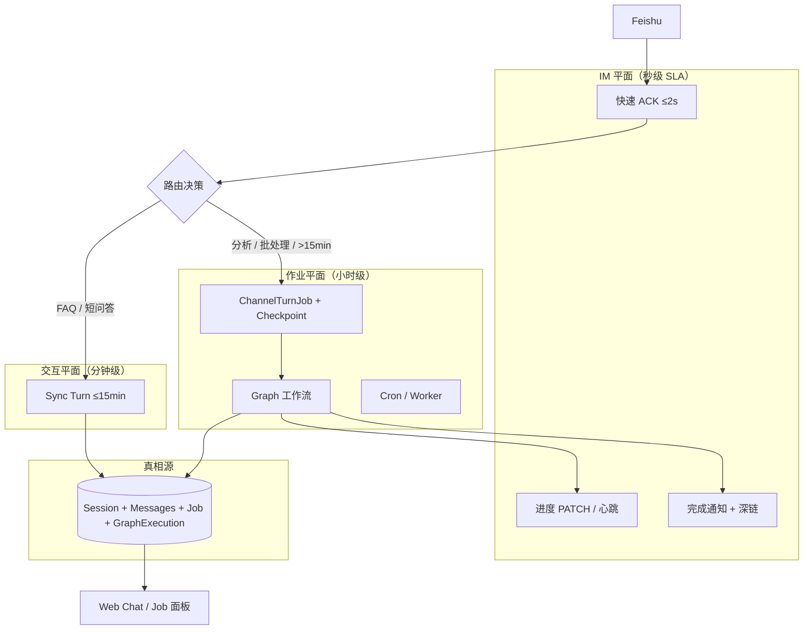
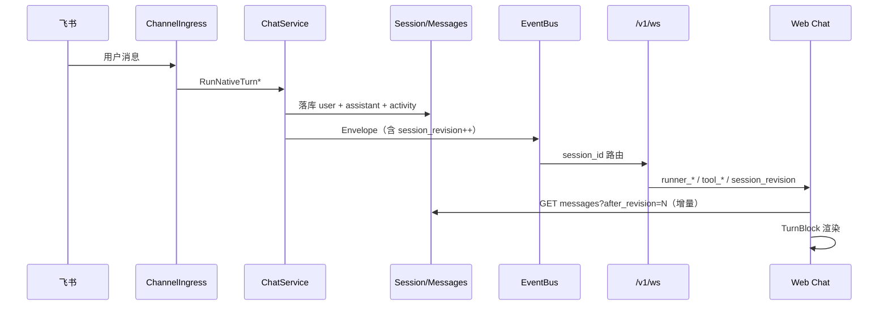

# M55 — Chat × Channel × Cursor 对标整体方案

> **版本**：2026-05-23  
> **读者**：产品、架构、全栈  
> **关联**：[55-chat-channel-cursor-development.md](./55-chat-channel-cursor-development.md) · [1 chat.md](./1%20chat.md) · [17 channel.md](./17%20channel.md) · [17-channel-agent-team-integration.md](./17-channel-agent-team-integration.md) · [51 消息机制.md](./51%20消息机制.md) · [0 系统框图.md](./0%20系统框图.md)  
> **背景**：飞书长任务 5 分钟超时失败；Channel 会话消息在 Web Chat 不可见或体验异常；需以 Cursor 为参照统一 Chat 产品形态。

---

## 1. 问题陈述

### 1.1 现象 A — 长任务 5 分钟失败

飞书用户下发「需 24 小时」的分析类指令后：

1. 收到 ACK：「收到，正在处理…」
2. 约 5 分钟后失败：`CHAT_AGENT` / `响应超时，请稍后重试 (5m0s)`
3. 出站：「任务执行失败，请稍后重试。」

**本质**：用户期望 **小时级批处理 Job**；系统执行的是 **分钟级同步 Turn**（默认 `DefaultTurnTimeout = 5m`）。

### 1.2 现象 B — Web 看不到飞书消息

飞书侧 Agent 正常回复；Web Chat 打开同一 Agent 的 `feishu:` Session 时：

- 工具卡片可见，但用户指令 / 助手正文「像不存在」
- 长会话（100+ 条）页面卡顿、滚动异常

**本质**：数据层多数已落库（Channel 与 Web 共用 Session）；失败主要在 **Web 观测平面**（Session 亲和、同步协议、Turn 呈现、性能）。

---

## 2. Cursor 对话界面 — 需求与设计解析

Cursor 不是「聊天 App」，而是 **IDE 内嵌 Agent 工作区**。以下维度是 Arenea 对标的权威参照。

### 2.1 双模式：Chat vs Composer / Agent

| 模式 | 用户目标 | UX 特征 |
|------|----------|---------|
| **Chat** | 解释、问答、小改动 | 侧边栏、短回复、低侵入 |
| **Composer / Agent** | 多步任务、改多文件 | 全宽、步骤清单、可后台 |

**设计原则**：**对话 Turn** 与 **后台 Job** 是两种产品壳，不应混在同一超时模型里。

### 2.2 上下文模型

- `@file` / `@folder` / `@codebase` / `@docs` 显式注入
- **Context 用量条**（token %）始终可见
- 用户清楚「本轮 Agent 能看见什么」

### 2.3 工具调用呈现

- 工具 = **可折叠块**，默认收起或单行摘要
- 主视觉 = **Assistant 自然语言 + diff / 产物**
- 终端 / log 在块内滚动，**不撑满时间线**

### 2.4 流式与响应性

- Token 增量渲染，禁止全量 replace
- 生成中 **Stop**；Stop 后保留已生成部分
- **Follow-up Queue**：运行中可继续输入，排队而非阻塞

### 2.5 长任务 / Background Agent

- 长任务 **脱离当前 Turn 超时**
- 独立 **Background 面板**：状态、日志、完成通知
- 用户可继续编辑，Agent 在后台跑

### 2.6 产物导向

- 代码变更 = **inline diff** + **Apply / Reject**
- Checkpoint 可回滚

### 2.7 布局信息层次（示意）

```
┌─────────────────────────────────────────┐
│ Context: @files  68% ctx    [Stop]      │  ← 状态栏
├─────────────────────────────────────────┤
│ [User] 请重构 auth 模块                  │
│ [Assistant] 好的，我将…                  │  ← 主对话
│   ▶ Ran terminal (3)  ▶ Read file (2)    │  ← 工具折叠条
│   ```diff … ```  [Apply]                │  ← 产物
├─────────────────────────────────────────┤
│ [输入框]  @  附件  模型  Enter发送        │
└─────────────────────────────────────────┘
```

---

## 3. Aranea 现状对照

| 维度 | Cursor | Aranea 现状 | 差距 |
|------|--------|-------------|------|
| 双壳 Chat/Job | Chat + Background Agent | 单一 Chat 时间线；Channel async 有 Job 表但 Web 无 Job 面板 | **高** |
| Turn 分组 | 一轮 = User→Tools→Assistant 容器 | user / assistant / tool activity **平铺独立行** | **高** |
| 工具默认折叠 | 折叠条 + 展开详情 | 工具独立 `ChatExecutionCard` 行，多工具淹没正文 | **高** |
| Context @ | @file 等 first-class | ctx % 有；无 @ 引用 UX | 中 |
| Follow-up Queue | 运行中连续发送 | ✅ `enqueue_message` 已对齐 | 低 |
| 长任务 | Background，无 Turn 超时 | Sync Turn 5m 默认；async Graph 看门 ~2h | **高** |
| Channel→Web | N/A（单客户端） | 共用 Session DB；Web **被动 pull + 可选 WS** | **高** |
| Apply diff | Apply 按钮 | 工具结果 JSON/MD，无 Apply | 中 |
| 虚拟列表 | 长会话流畅 | 阈值与 merge 策略曾导致卡顿 | 中（部分已优化） |

**代码锚点（现状）**：

| 能力 | 位置 |
|------|------|
| Turn 超时 5m | `internal/agent/choice_stream.go` · `internal/service/trpc_turn.go` |
| Channel 长任务配置 | `internal/biz/channel_config_helpers.go` · [17 channel.md §8](./17%20channel.md#8-长任务场景飞书-channel) |
| async Graph | `internal/service/channel_ingress_async.go` |
| IM Preview transcript | `internal/channel/preview/` · [17 channel.design.md §12.9](./17%20channel.design.md#129-im-preview-投影turnpreviewcoordinator2026-05-23) |
| Web 消息列表 | `web/src/components/chat/ChatMessagePanel.vue` · `ChatMessageRow.vue` |
| WS 同步 | `useChatInboundSync.ts` · `useChatStreamManager.ts` · `mergeSessionMessages.ts` |

---

## 4. 整体架构方案

> **解耦四层模型（Ingress / Policy / Turn / Projector）**：[0-module-decoupling-architecture.md §3.1](./0-module-decoupling-architecture.md#31-推荐目标架构channel--chat--agent)  
> 本节 §4.1–4.2 侧重 **执行平面**（Sync / Job）与 **Web 同步协议**；与四层模型正交组合使用。

### 4.1 双平面执行模型（解决长任务超时）



**路由规则（产品）**：

| 场景 | 执行模式 | Channel 配置 |
|------|----------|--------------|
| FAQ、单轮工具 | `sync` | 默认 `turn_timeout_sec` |
| 多工具分析（≤15min） | `sync` | `turn_timeout_sec: 600–900`，`streaming_enabled: true` |
| Team 流水线 | `sync` | `progress_mode=steps`，`im_render_mode=transcript` |
| 小时级 / 批处理 | `async` | `execution_mode=async` + `async_graph_id` |
| 24h 级 | **Durable Job**（Phase F） | 独立 Worker deadline + Checkpoint |

**Sync Turn 硬上限**：产品封顶 **15 分钟**；超过必须走 Job 平面（拒绝 silent 5m 失败）。

### 4.2 Channel ↔ Web 统一 Session Sync（解决飞书消息不可见）



**协议缺口（待 M55 实现）**：

| 机制 | 现状 | 目标 |
|------|------|------|
| `session_revision` | 无单调版本 | Turn 完成 +1；Web 增量拉取 |
| Channel 入站聚焦 | 无 | Envelope `source=channel` → 同 Agent 自动选中 Session |
| Turn 分组 | 平铺 message 行 | `TurnBlock`：User → Tools（折叠）→ Assistant |
| WS 连接策略 | Session + 全局 hub 重叠 | 选中 Session **必须** Session WS；hub 仅通知 |
| 完成同步 | 全量 replace 风险 | **增量 merge** + 虚拟列表 |

**运维验证（不改代码即可做）**：

1. Web 选中与渠道路由 **同一 Agent**
2. Session 标题以 **`feishu:`** 开头
3. `GET /v1/sessions/{id}/messages` 确认 `role=user` 存在
4. 若 API 有数据 UI 无 → **呈现/性能问题**，非 Channel 入站失败

### 4.3 Cursor 式 Chat UI — TurnBlock 模型

**目标结构**（一轮对话一个容器）：

```
TurnBlock #N
├── UserBubble          ← 飞书/Web 用户文本
├── ToolStrip (collapsed) ← 「▶ 3 tools · 12.4s」
│   └── ToolDetail[]    ← 展开后 ChatExecutionCard
├── AssistantBubble     ← 正文 + reasoning 折叠
└── Artifacts[]         ← diff / 文件 / 链接（Phase E）
```

与 Channel **IM Preview transcript**（正文→工具→正文）**顺序对齐**，消除「IM 有、Web 像没有」的认知分裂。

---

## 5. 根因 → 对策映射

### 5.1 长任务 5m 超时

| 根因 | 对策 | 阶段 |
|------|------|------|
| 24h 任务走 Sync Turn | 路由规则 → `async` / Durable Job | B / F |
| 默认 5m 未配置 | Channel `turn_timeout_sec` + 文档 preset | A |
| 无进度感知 | `streaming_enabled` + IM transcript + heartbeat | A（已有 Phase E） |
| async 看门 2h | Worker 级 deadline + Graph checkpoint 续跑 | F |

### 5.2 Web 看不到飞书消息

| 根因 | 对策 | 阶段 |
|------|------|------|
| 选错 Agent/Session | Session 列表 Channel 标记 + 深链 | B |
| 被动 pull、WS 未连 | `session_revision` + 选中 Session 强制 WS | B |
| 工具行淹没正文 | TurnBlock UI | C |
| 100+ 条卡顿 | 虚拟列表 + rAF batch + 增量 merge | C |
| 无双平面 Job 视图 | Background Job 面板 | D |

---

## 6. 与现有模块的关系

| 模块 | M55 依赖 / 扩展 |
|------|-----------------|
| **Channel Phase E** | ACK、Job 表、IM Preview、async Graph — **配置与路由策略补全** |
| **Message/WS 51** | 新增 `session_revision` Envelope；Channel 入站 meta |
| **Chat 1** | TurnBlock 组件、滚动锚点、Follow-up 已对齐 |
| **Graph 36** | 长任务 async 执行体；24h Checkpoint |
| **Session 10** | `session_revision` 字段或 derived |
| **Monitor 18** | Job 面板可复用 FlowLog / Runs |

**架构红线不变**（见 [docs/README.md](../README.md)）：

- `internal/biz` 不 import `trpc-agent-go`
- 实时主通道 `/v1/ws`
- Channel 与 Web 共用 Session 落库，Web 为观测端

---

## 7. 验收标准（系统级）

| ID | 场景 | 验收 |
|----|------|------|
| M55-LT-01 | 飞书下发 10min 内可完成的多工具任务 | 配置 `turn_timeout_sec=900` 后成功；IM transcript 可见进度 |
| M55-LT-02 | 飞书下发「全量分析」类指令 | 自动或配置走 `async`；ACK + Job ID；不触发 5m 超时 |
| M55-SYNC-01 | 飞书 Turn 进行中，Web 打开同 Session | 5s 内看到 user 消息 + running 状态 |
| M55-SYNC-02 | 飞书 Turn 完成，Web 已打开 | 增量出现 assistant 正文，无需手动刷新 |
| M55-UI-01 | 100+ 消息 Session | 滚动流畅；最后一轮 user/assistant 可见；工具默认折叠 |
| M55-UI-02 | Turn 内 20+ 工具调用 | ToolStrip 折叠；展开后卡片正常 |

---

## 8. 文档索引

| 文档 | 用途 |
|------|------|
| [55-chat-channel-cursor-development.md](./55-chat-channel-cursor-development.md) | 分阶段任务与排期 |
| [§9 附录：企业级蓝图](./55-chat-channel-cursor-solution.md#9-附录企业级蓝图与-ai-落地指南) | 架构收敛、Run 升格、AI 任务卡、设计评审 |
| [17-channel-development.md §14 DECO](./17-channel-development.md#14-phase-deco--四层架构解耦deco) | 四层解耦落地任务 DECO-01–15 |
| [17-channel-external-reference-playbook.md](./17-channel-external-reference-playbook.md) | GoClaw + OpenClaw 借鉴；CH-BOR 任务卡 |
| [execution-plan.md §迭代 CC](../guides/execution-plan.md) | 执行计划任务板 |
| [17 channel.md §8](./17%20channel.md#8-长任务场景飞书-channel) | Channel 长任务配置规格 |
| [17-channel-agent-team-integration.md](./17-channel-agent-team-integration.md) | Channel × Web 业务集成 |
| [1-chat-development.md](./1-chat-development.md) | Chat 模块差距（Cursor 对齐节） |
| [message-development.md](./message-development.md) | WS / session_revision 协议 |
---

## 9. 附录：企业级蓝图与 AI 落地指南

> 原 `需求/55-chat-channel-cursor-solution.md#9-附录企业级蓝图与-ai-落地指南` 已并入本文。开发任务与排期见 [55-chat-channel-cursor-development.md](./55-chat-channel-cursor-development.md)。

## 0. 本文是什么

本文不是新需求，而是 **把现有 Chat / Channel 两条主链路从 "可用基线" 推到 "企业产品级" 的实施蓝图**。它做三件事：

1. **诊断**：把分散在 review/changelog/`*-development.md` 中的痛点收敛为 5 类系统级问题。
2. **设计**：给出 **架构层 / 业务层 / UX 层** 的目标态，并定义清晰的契约（API/Envelope/状态机）。
3. **落地**：给 AI 编码代理一份 **可按 ID 执行** 的任务卡片清单（含代码锚点、验收、风险）。

**红线不变**：

- `internal/biz` 不 import `trpc-agent-go`
- `internal/server` 只做传输；运行时装配只在 `internal/service`
- 实时主通道 `/v1/ws`，SSE 仅用于外部协议（A2A/MCP）
- Channel 与 Web 共用同一 Session / Messages 真相源

---

## 1. 问题陈述（5 类核心症结）

| # | 症结 | 用户可感知 | 根因层 | 现状证据 |
|---|------|-----------|--------|---------|
| **P-1** | 长任务 5 分钟硬超时 | 飞书下发"全量分析"等小时级指令 → 5 分钟后失败 | 业务/架构 | `internal/agent/choice_stream.go:14` `DefaultTurnTimeout = 5m`；`channel_ingress_async.go:21` `asyncWatchTimeout = 2h` |
| **P-2** | Channel↔Web 双向"消息不可见" | 飞书已回复，Web 打开同 Session 工具卡可见但正文像不在 | 数据/协议 | `mergeSessionMessages` 全量 merge + 无 `session_revision` 增量协议 |
| **P-3** | Web 时间线"工具淹没正文" | 一轮里 10+ 个工具卡平铺，正文滚到屏幕外 | UX | `ChatMessagePanel.vue` 平铺渲染 `ChatMessageRow` + `ChatExecutionCard` 独立行 |
| **P-4** | 多入口路径分裂 | HTTP/WS/Channel/Cron 行为接近但仍有细枝末节差异 | 架构/SRP | `runNativeAgentTurn` admission 仍内联；Team/Agent turn 编排各自 ~300 行 |
| **P-5** | 后台任务无观测壳 | async Graph 仅 IM 出站 ACK；Web 看不到 Job 状态 / 进度 / 历史 | 产品/前端 | `ChannelTurnJob` 已有表 + List API；Web 无对应面板 |

> P-1 / P-2 是 **结构性缺口**；P-3 是 **体验崩坏**；P-4 是 **可维护性债**；P-5 是 **产品完整性缺口**。M55 必须把它们一并解决，单点修补会反复回归。

---

## 2. 目标态（企业产品级）

### 2.1 三平面执行模型（解决 P-1 / P-5）

```
┌──────────────────────────────────────────────────────────────────────┐
│ IM 平面（秒级 SLA）：ACK ≤2s / 心跳 / 进度 PATCH / 完成通知 + 深链      │
├──────────────────────────────────────────────────────────────────────┤
│ Turn 平面（分钟级，硬上限 15min）：sync Agent/Team turn               │
│   ↳ 超过 15min 必须自动改判走 Job，不允许 silent 超时                  │
├──────────────────────────────────────────────────────────────────────┤
│ Job 平面（小时～24h）：Graph / Cron / Durable Worker + Checkpoint     │
│   ↳ Channel 入口 ACK 返回 Job ID；Web 观测面板镜像状态                 │
└──────────────────────────────────────────────────────────────────────┘
         ↓ 三平面写入同一真相源 ↓
┌──────────────────────────────────────────────────────────────────────┐
│ Session + Messages + ChannelTurnJob + GraphExecution（含 revision）   │
└──────────────────────────────────────────────────────────────────────┘
         ↓ 投影到客户端 ↓
   WebSocket Envelope（含 session_revision、source、job_id）
   Feishu / Slack / Telegram Card（含 session 深链）
```

**入口判定（产品规则）**：

| 触发 | 判定 | 入口 |
|------|------|------|
| Web `SendChatMessage` | `Turn` | `trpc_turn.go` |
| WS `user_message` | `Turn`（默认） | 同上 |
| Channel webhook（默认） | `Turn`（≤15min） | `channel_ingress_execute.go` |
| Channel `execution_mode=async` 或关键词匹配 | `Job` | `channel_ingress_async.go` |
| Cron 触发 | `Turn` 或 `Job`（任务配置决定） | `RunCronTurn` / Graph |
| 用户/管理员强制 `/async` | `Job` | 同上 |

### 2.2 统一 Turn 执行抽象（解决 P-4）

抽象一个 **`TurnExecutor`**，让 `Agent.runSingleAgentViaTRPC` 与 `Team.RunTurn` 共享：

```
TurnExecutor.Run(ctx, TurnSpec) → TurnOutcome
  ├─ admission (busy / queued / accept)         ← 来自 RunRegistry + PendingMessageQueue
  ├─ build (Agent 或 Team Runner via cache)
  ├─ persist user message + bump revision
  ├─ stream via ConsumeEventStreamWithFirstByte
  │     → EventProjector → EventBus
  ├─ persist assistant + activity + usage + bump revision
  └─ defer: Finish + processPendingQueue + revision broadcast
```

- **Agent 与 Team 只差 `BuildRunner` 与 `PersistTurnRecord` 两个钩子**，其余流程公共。
- `TurnSpec` 携带 `Kind = "agent" | "team_member" | "team_root"`，让投影器统一发射 `member_*` / 常规 envelope。
- `TurnOutcome` 携带 `UserMsg / AssistantMsg / JobID（async）/ Revision`。

### 2.3 Session Revision 协议（解决 P-2）

**核心契约**：

- `sessions.session_revision`：每次 Turn 完成（含 user 入库 + assistant 入库 + activity 收口）+1，由 `ChatUsecase` / `TurnExecutor` 在事务收口处 bump。
- `Envelope.session_revision`：投影器在以下 envelope 必带：
  - `text_done` / `runner_completion` / `member_message_done` / `team_run_finished` / `tool_result(final)` / `run_status(completed|failed|cancelled)` / `graph_execution_done`（当与某 session 关联时）
- API 增量拉取：`GET /v1/sessions/{id}/messages?after_revision=N` 返回 `revision > N` 内入库的消息 + 当前最新 revision。

**前端使用**：

1. 选中 Session → 强制建立 Session WS 订阅。
2. 收到 `session_revision = R`，若 `R > local_revision`：debounced 200ms hydrate `after_revision=local_revision`。
3. 回放窗口（`replay_start/end`）期间累积 envelope，回放结束后再统一 merge。

**幂等保证**：

- 消息按 `id` upsert（已有）；增量返回的消息 = 已有 envelope 路径的兜底，不会重复展示。
- 入站幂等：Channel 已有 `IdempotencyKey`，无需变更。

### 2.4 TurnBlock UI（解决 P-3）

**目标 DOM 单位**：

```
TurnBlock[turn_id]
├── UserBubble          // role=user，含来源徽标（Web / 飞书 / Cron / A2A）
├── ToolStrip (collapsed by default)
│   ├── summary: "▶ 3 tools · 12.4s · 1 failure"
│   └── details: [ToolDetail × N]  // 展开 = 现有 ChatExecutionCard
├── AssistantBubble     // role=assistant，正文 + reasoning 折叠
└── ArtifactRow[]       // 后续 Phase E：diff / 文件 / signed URL
```

**分组规则**：

- 以 `turn_index`（已有，来自 biz.ChatMessage）为主键分组；同 `turn_index` 内按 `created_at`。
- `tool_*` / `activity` 类消息归到与其同 turn 的 Assistant 块中的 `ToolStrip`。
- Team 子成员消息：保留独立色条 lane（不并入主 TurnBlock 的 ToolStrip）；如果 Team 顶层有 Assistant 文本，那是顶层 TurnBlock；成员气泡作为 lane 渲染在主 TurnBlock 下半部。
- 兼容现有 `mergeSessionMessages.ts`：新增 `groupMessagesByTurn(messages)` 在其后做派生，不破坏 merge 主链。

**滚动锚定**：

- 默认锚到 **最后一个非 activity** 的 dialogue 行（已实现 `lastDialogueIndex` 雏形），TurnBlock 模式下锚到 **最后 Assistant 气泡的顶部**，避免被工具长结果挤到屏幕外。
- 虚拟列表阈值：`messages.length >= CHAT_VIRTUAL_SCROLL_THRESHOLD` 已存在；TurnBlock 切换后行高估算需重测，建议默认 `virtualRowSize=180` 配 `rowHeight: auto`。

### 2.5 Background Job 面板（解决 P-5）

```
/chat → 右侧抽屉 or 顶部 Tab 「后台任务」
  - 列表：channel_turn_job（按 session/agent 过滤）
  - 详情：状态 / async target / Graph execution 深链 / IM 通知预览
  - 操作：取消（→ chat.CancelRun 或 Graph cancel）/ 重试 / 复制 Session 深链
```

- 数据：复用 `biz.ChannelTurnJobUsecase.List*` + 新增 `GET /v1/chat/jobs?session_id=&agent_id=`（最少改动：在 Chat 服务里聚合，避免 Web 直接耦合 Channel API）。
- 实时：Job 状态变更走 `run_status` Envelope 或新增 `EnvelopeTypeJobStatus`（建议复用 `orchestration_agent_status` 或新增）。

---

## 3. 架构契约（提交前必须读）

### 3.1 分层与依赖方向

```
api/kratos/**.proto          ← 唯一对外契约（包含 GetSessionMessages 增加 after_revision）
internal/server              ← WS 帧路由、HTTP/gRPC 注册（薄）
internal/service             ← 装配 TurnExecutor、Channel ingress、Job 聚合
internal/biz                 ← Usecase / Repo 接口 / Session+Revision 计算
internal/data                ← Ent ORM 实现
internal/agent · team · graph · runtime  ← trpc-agent-go 运行时层
internal/event               ← Envelope + Bus + Buffer + replay
```

**红线检查（CI: `make runtime-boundary`）**：

- ✅ biz 没有 `import trpc.group/.../trpc-agent-go/`
- ✅ server 没有 `import internal/agent` 直接运行时
- ✅ service 只在装配点 import 框架，不下沉到 biz

### 3.2 数据模型增量

| 实体 | 字段 | 来源 | 用途 |
|------|------|------|------|
| `sessions` | `session_revision INTEGER NOT NULL DEFAULT 0` | 新增列（Ent schema + 迁移 `docs/sql/03_session.sql`） | 增量拉取游标 |
| `sessions` | `last_revision_at DATETIME` | 新增（可选） | 运维统计 |
| `chat_messages` | `turn_index` | 已有 | TurnBlock 分组主键 |
| `channel_turn_jobs` | 已有 | — | Background Job 面板数据源 |

**迁移策略**：

1. Ent schema 新增字段 → `make wire && make api`（schema 变更需 `ent generate`）。
2. 启动期一次性 backfill：`UPDATE sessions SET session_revision = (SELECT COUNT(DISTINCT turn_index) FROM chat_messages WHERE session_id = sessions.id)`。
3. 旧 client 无 `after_revision` 参数时退化为全量返回（保持兼容）。

### 3.3 Envelope 协议增量

新增公共字段（Envelope 顶层 or `Metadata`，建议顶层减少前端解析成本）：

```go
type Envelope struct {
    // ... 已有字段 ...
    SessionRevision int64  `json:"session_revision,omitempty"`  // Turn 收口时 +1 后的值
    Source          string `json:"source,omitempty"`            // web | channel | cron | a2a | api
    JobID           string `json:"job_id,omitempty"`            // 来自 ChannelTurnJob / Cron / Graph
    TurnID          string `json:"turn_id,omitempty"`           // = userMsg.id 或 invocation_id（TurnBlock 分组）
}
```

携带规则（投影器 / 服务层注入）：

- `text_delta / text_done / tool_call / tool_result / runner_completion`：必带 `TurnID`，`Source` 来自 ctx。
- `run_status` 进入 terminal 态（completed/failed/cancelled）：必带 `SessionRevision`（turn 收口 bump +1）。
- `run_status` **sync** 态：用户消息已入库、turn 未结束；必带当前 `SessionRevision`（bump +1）。Web **不得**当作 turn 完成；仅 debounced `after_revision` hydrate，保留 streaming 占位。
- 同一 turn 可能先后收到 `sync` 与 `completed` 两次 revision 事件（+2 累计），客户端以 `after_revision` 增量拉取即可。
- Channel 入站：在 `executeInboundTurn` 注入 ctx → `Source = "channel"`；async 路径注入 `JobID`。

### 3.4 API 增量

```proto
// api/kratos/chat/v1/chat.proto

message GetSessionMessagesRequest {
  string session_id = 1 [(google.api.field_behavior) = REQUIRED];
  optional int64 after_revision = 2;   // 仅返回 revision > after_revision 入库的消息
  optional int32 limit = 3;
}

message GetSessionMessagesResponse {
  repeated google.protobuf.Struct items = 1;
  int64 current_revision = 2;          // 当前 session 的最新 revision（用于客户端对齐）
}

// 新增：Chat 视角的 Job 列表（聚合自 channel_turn_jobs + 未来 cron/graph job）
message ListChatBackgroundJobsRequest {
  optional string session_id = 1;
  optional string agent_id = 2;
  optional string status = 3;          // running | queued | completed | failed | cancelled | timeout
  optional int32 limit = 4;
}

message ChatBackgroundJob {
  string id = 1;
  string source = 2;                   // channel | cron | manual
  string session_id = 3;
  string agent_id = 4;
  string status = 5;
  string target_type = 6;              // graph | team_graph | cron
  string target_id = 7;
  string created_at = 8;
  string updated_at = 9;
  optional string summary = 10;
  optional string error_message = 11;
}
```

---

## 4. 业务流程（端到端）

### 4.1 Channel 入站 + Web 实时镜像（P-2 核心）

```
飞书 → POST /webhooks/{key}
  ├─ ChannelIngress.acceptInbound（ACK ≤2s）
  ├─ ParseChannelLongTaskConfig → 路由判定
  │    ├─ async / 关键词 → dispatchAsyncInbound（Job 平面）
  │    └─ default → executeInboundTurn（Turn 平面）
  │
  ├─ executeInboundTurn
  │    ├─ prepareChannelChatRequest（Session 亲和 + ctx.Source="channel"）
  │    ├─ ChatService.RunNativeTurnUnary
  │    │    ↓
  │    ├─ TurnExecutor.Run
  │    │    ├─ admission（RunRegistry）
  │    │    ├─ user msg persist → Session.revision++
  │    │    ├─ stream → Envelope (含 session_revision, source, turn_id)
  │    │    │    ├─ EventBus → WS 推到所有订阅该 session 的 Web 客户端
  │    │    │    └─ TurnPreviewCoordinator → IM card edit-in-place
  │    │    └─ assistant msg + activity persist → Session.revision++
  │    └─ outbound delivery（飞书 unary 或流式 patch）
  │
  └─ Web 端（已选中该 Session）
       ├─ WS Envelope.session_revision=R 到达
       ├─ if R > local_revision → debounced hydrate GET messages?after_revision=local
       └─ TurnBlock 增量渲染
```

### 4.2 长任务（Job 平面）

```
飞书 → /webhooks/{key}（带"全量分析"或 /async）
  ├─ acceptInbound
  ├─ ChannelLongTaskConfig.ShouldRunAsync → true
  ├─ dispatchAsyncInbound
  │    ├─ CreateTurnJob（accepted）
  │    ├─ ResolveChannelAsyncGraphTarget → graph / team_graph / cron
  │    ├─ ExecuteGraph / TriggerCronTask（不阻塞 ACK）
  │    ├─ enqueueOutboundReply("后台任务已创建（Job: X）")
  │    └─ watchAsync*Completion goroutine（超过 asyncWatchTimeout=2h → 改用 Worker deadline，见 Phase F）
  │
  └─ Web 端
       ├─ Chat 侧栏「后台任务」列表实时刷新（订阅 channel:chat 或新 channel:jobs）
       ├─ 点击 Job → 详情面板（Graph 深链）
       └─ Job done → run_status + 飞书出站完成卡片
```

### 4.3 Web → 同账号触发，Channel 也能看到？（双向问题）

设计原则：**Web 是 Session 的主操作端**，Channel 出站只在 "由 Channel 入站触发的 Turn" 上执行（避免双向回声）。

- `executeInboundTurn` 注入 `ctx.Source="channel"`；
- Outbound delivery 在 service 层判断 `source != channel` 则跳过；
- 例外：管理员显式从 Web 触发"广播到 IM"是另一条 RPC（暂未规划，避免越权）。

---

## 5. UX 规范（企业级最低门槛）

### 5.1 视觉与可读性

- TurnBlock 容器使用 `.app-glass-dialog` 风格的卡片底（参考 `.cursor/rules/glass-dialog.mdc`），但更轻量：`background: var(--app-glass-soft, rgba(255,255,255,0.55))`，`border-radius: 14px`，`padding: 12px 14px`。
- ToolStrip 折叠条：单行 chip + 工具图标堆叠（最多 5 个，溢出 `+N`），悬停 tooltip 显示前 8 个工具名。
- 来源徽标（Source badge）：飞书/Slack/Telegram 用平台彩色 icon，Web 用 `outline_chat`；放在 UserBubble 右上角，2 字号小型 chip。

### 5.2 信息密度

| 元素 | 默认 | 展开 |
|------|------|------|
| ToolStrip | 折叠（单行） | 全卡片（保留现有 `ChatExecutionCard`） |
| Reasoning | 折叠 `<details>` | 文本（已有） |
| Assistant 正文 | 完全展开 | — |
| 错误 | 内联红色边框 + chip "重试" | 全栈展开 |
| 长结果（>500 字符）| 截断 + "展开" | 全文 + "复制" |

### 5.3 状态反馈（必须）

- 顶部状态栏：`{ N msgs · WS · rev=R · ctx=42% · running }`
- Background Job 数量徽标：右上角红点（运行中）/ 绿点（最近完成）。
- 飞书入站正在投影时：当前 TurnBlock 顶部出现 "来自飞书 · 进行中" 横条，5s 内消失。

### 5.4 A11y 与国际化

- 所有 chip / badge / button 有 `aria-label`；折叠/展开使用原生 `<details>` 或带 `aria-expanded`。
- i18n key：新增 `chat.turn.block.*` / `chat.job.*` 命名空间，中英双语。

---

## 6. AI 落地任务清单（按 ID 执行）

> 所有任务在 [`docs/需求/55-chat-channel-cursor-development.md`](./55-chat-channel-cursor-development.md) 已有 ID（CC-A-01 … CC-F-05）；下表给 **AI 编码代理可直接执行的卡片**（含代码锚点 + 验收 + 风险）。

### 6.1 Phase A · 配置与路由 preset（P0，~3 天）

#### CC-A-01：飞书长任务 preset + 一键应用

- **目标**：在 `web/src/features/channels/channelLongTaskPresets.ts` 增加 `feishu_long_analysis` 预设（`turn_timeout_sec=900, first_byte_timeout_sec=45, progress_mode=steps, im_render_mode=transcript, streaming_enabled=true`）。
- **代码锚点**：`channelLongTaskPresets.ts` · `ChannelEditorDialog.vue`。
- **验收**：编辑器面板新增「长任务预设」下拉，选中后字段自动填充；保存后 `ParseChannelLongTaskConfig` 读出一致值。
- **风险**：默认值不要写死前端，应通过 `GET /v1/channels/long-task-presets` 返回（biz 维护，避免双源）。

#### CC-A-02：execution_mode=auto + 关键词路由

- **目标**：扩展 `ChannelLongTaskConfig.ShouldRunAsync`：当 `execution_mode=auto`，匹配可配置关键词（`/async`、"分析"、"全量"、"研报"，可由 `system_settings.channel_async_keywords` 覆写）→ 路由 Job 平面。
- **代码锚点**：`internal/biz/channel_config_helpers.go:149-160` · `internal/biz/system_setting.go`。
- **验收**：单测覆盖："/async help"、"请做全量分析"、"今天天气"（不匹配）。
- **风险**：关键词写在 biz 不要 import service；解析 system_settings 在 biz 已有 `SystemSettingRepository`。

#### CC-A-03：sync 超时文案区分

- **目标**：`internal/service/channel_ingress_errors.go` 区分两类错误：
  - `TurnErrTimeoutSyncCap`（≤15min 仍超时） → 飞书出站："任务执行较慢，建议使用 `/async` 后台任务模式。"
  - `TurnErrTimeoutOverCap`（产品上限） → 同上 + 配置链接（如设置 webhook URL）。
- **代码锚点**：`channel_ingress_errors.go` · `deliverTurnErrorReply`。
- **验收**：FlowLog `chat.turn.timeout` 字段含 `reason=sync_cap`；IM 出站文案对应。

### 6.2 Phase B · session_revision 协议（P0，~1 周）

#### CC-B-01：DB schema + biz 增量

- **目标**：
  - `internal/data/ent/schema/session.go` 增加 `session_revision int64 default 0` 字段。
  - `internal/biz/session_usecase.go` 新增 `BumpSessionRevision(ctx, sessionID) (int64, error)`，使用 `UPDATE ... SET session_revision = session_revision + 1 RETURNING session_revision`（原子性）。
- **代码锚点**：现有 `SessionUsecase` · `internal/data/session.go`。
- **验收**：单测验证并发 100 次 bump，最终值 == 100，无丢失。
- **风险**：SQLite 不原生支持 `RETURNING`（≥3.35 支持）；fallback 用 `tx + SELECT FOR UPDATE`（SQLite 走 BEGIN IMMEDIATE）。

#### CC-B-02：Turn 收口处 bump + Envelope 注入

- **目标**：
  - `TurnExecutor`（或当前 `runSingleAgentViaTRPC` + Team 对应位置）的 defer 收口：persist assistant 之后 → `BumpSessionRevision` → 注入到最终 `runner_completion` / `team_run_finished` Envelope。
  - `EventProjector` 增加 `WithSessionRevision(int64)` 中间件，所有 terminal envelope 自动携带。
- **代码锚点**：`internal/service/trpc_turn.go` · `internal/team/runner_team_trpc.go` · `internal/agent/event_projector.go`。
- **验收**：WS 抓包可见 `runner_completion.session_revision = N+1`。
- **风险**：bump 必须在 assistant 持久化之后；如果 turn 失败则不 bump（avoid revision 漂移）。

#### CC-B-03：增量 API

- **目标**：在 `chat.proto` 增加 `GetSessionMessages.after_revision`；service 层实现 `WHERE session_id=? AND (revision_at_insert > N OR turn_index > derived(N))`。
- **代码锚点**：`internal/biz/chat_message_repo.go`（如不存在则在 `chat_usecase.go` 扩展）。
- **验收**：API 集成测试 `after_revision=0` == 全量；`after_revision=last` == 空数组 + `current_revision`。
- **风险**：旧消息未带 revision；用 `turn_index` 作为派生（启动时 backfill 已写）。

#### CC-B-04 / 05：Web 增量同步

- **目标**：
  - `web/src/features/chat/composables/useChatStreamManager.ts`：监听 envelope 的 `session_revision`，存入 `currentSessionRevision`。
  - `useChatWorkspace.ts` 选中 Session 时建立 WS（已有），并启动 `watch(currentSessionRevision)` debounced 200ms 调用 `ListSessionMessages?after_revision=local`。
- **代码锚点**：`useChatStreamManager.ts` · `useChatWorkspace.ts` · `mergeSessionMessages.ts`。
- **验收**：飞书侧发消息，Web 端（已选中同 Session）5s 内出现 user + assistant 消息，无需手动刷新。
- **风险**：避免回放窗口（`replay_start`）期间重复 hydrate；用 `isReplaying` 门控。

#### CC-B-06：Channel 入站 source 注入

- **目标**：`channel_ingress_execute.go` 在调用 `RunNativeTurnUnary` 前 `ctx = WithEnvelopeSource(ctx, "channel")` ；`EventProjector` 读取并写入 envelope。
- **代码锚点**：`channel_ingress_execute.go` · 新建 `internal/event/source.go`。
- **验收**：Web 收到的 envelope `source=channel`；前端在 UserBubble 显示飞书徽标。

### 6.3 Phase C · TurnBlock UI（P0，~1.5 周）

#### CC-C-01 / 02 / 03：TurnBlock + 分组

- **目标**：
  - 新建 `web/src/components/chat/TurnBlock.vue`（容器）+ `ToolStrip.vue`（折叠/展开） + `TurnUserBubble.vue` / `TurnAssistantBubble.vue`（迁移自 `ChatMessageRow.vue` 内的对应分支）。
  - 新建 `web/src/features/chat/groupMessagesByTurn.ts`：根据 `turn_index` + 消息角色把 `Message[]` 派生为 `TurnBlock[]`。
  - `ChatMessagePanel.vue` 引入特性开关 `useTurnBlock`（store 或 localStorage），逐步迁移；旧 `ChatMessageRow` 行渲染保留兼容路径。
- **代码锚点**：`web/src/components/chat/ChatMessagePanel.vue` · `web/src/features/chat/mergeSessionMessages.ts`。
- **验收**：
  - 单测：feishu 115 条 fixture 派生为正确轮数；工具消息归到对应轮的 ToolStrip。
  - 视觉验收：`/chat` 选中长 Session，工具默认折叠，正文清晰可见。
- **风险**：Team 子成员消息保留 lane（不强行塞 ToolStrip）；reasoning 折叠状态独立于 ToolStrip。

#### CC-C-04：滚动锚定最后一轮

- **目标**：`ChatMessagePanel.vue` 的 `lastDialogueIndex` 改为 `lastAssistantTurnIndex`；TurnBlock 模式锚到 TurnBlock 顶部，而非最后消息底部。
- **验收**：触发工具风暴（10+ tool_result），用户视线仍停在 Assistant 正文起始处。

#### CC-C-05：虚拟列表策略

- **目标**：TurnBlock 切换后行高浮动较大；启用 `q-virtual-scroll` 的 `virtual-scroll-item-size: auto`，并增大 `slice-size`。
- **风险**：动态行高在大量 TurnBlock 时滚动可能抖动；做一次手动 benchmark 验证 500 条消息流畅性。

#### CC-C-06：WS patch rAF 批处理

- **目标**：`useChatStreamManager.ts` 把 `tool_call` 增量合并到 `requestAnimationFrame` 内一次性 patch；禁止 `runner_completion` 全量 replace messages（用增量同步替代）。
- **验收**：Chrome Performance 录制无长帧（>100ms）。

### 6.4 Phase D · Background Job 面板（P1，~1 周）

#### CC-D-01：Chat 视角 Job API

- **目标**：`internal/service/chat_jobs.go` 聚合 `ChannelTurnJob` 与未来 cron job，暴露 `ListChatBackgroundJobs`。
- **代码锚点**：复用 `biz.ChannelTurnJobUsecase.List*`；avoid 引入新表。
- **验收**：API 按 session_id / agent_id / status 过滤。

#### CC-D-02 / 03：Web 面板

- **目标**：`web/src/components/chat/ChatBackgroundJobsPanel.vue`（右侧抽屉），列出 Job + 详情 + Graph 深链。
- **依赖**：使用 `web/src/features/channels/useChannelTurnJobsPanel.ts` 已有逻辑（如可复用）。
- **验收**：飞书下发 `/async`，Web 面板 3s 内显示新 Job；点击跳转 Graph Run 页。

### 6.5 Phase E · 上下文与 Apply（P2，~1 周）

#### CC-E-01：`@` Context UX

- **目标**：Composer 输入框 `@` 触发候选列表（agent files / knowledge / session 历史），仿 Cursor。
- **代码锚点**：`web/src/components/chat/ChatMessagePanel.vue` composer 区域 + 新建 `useMentionPicker.ts`。

#### CC-E-03：diff Apply 卡片

- **目标**：tools `structured_patch` 结果在 TurnBlock ArtifactRow 渲染为 diff + "Apply" 按钮，调用 [`23 tools-fragment-edit`](../需求/23%20tools-fragment-edit.md) 对应 API。

### 6.6 Phase F · 24h Durable Job（P2，~2 周）

#### CC-F-01：Worker deadline 取代 asyncWatch

- **目标**：移除 `asyncWatchTimeout = 2h` 的内存 goroutine；改为：
  - Job 入队时持久化 `deadline_at = now + 24h`；
  - 独立 `internal/runtime/job_worker.go` 周期扫描 → 续跑 Graph checkpoint / 超时标记。
- **依赖**：Graph checkpoint 已有；需暴露 `ResumeExecution(ctx, executionID)`。
- **验收**：进程重启后 Job 不丢；24h 超时正确标记 timeout。

#### CC-F-02 / 03 / 04：Checkpoint resume、IM 进度百分比、取消/重试 API

- 见 [`55-chat-channel-cursor-development.md` §Phase F](./55-chat-channel-cursor-development.md#phase-f--24h-durable-jobp2-2-周)。

### 6.7 横切：统一 TurnExecutor（P3，可跟随 Phase B/C 合并）

#### CHAT-R2-03（来自 Chat Flow Review）：抽 TurnExecutor

- **目标**：抽 `internal/service/turn_executor.go`，提取 `Agent.runSingleAgentViaTRPC` 与 `Team.RunTurn` 的公共骨架（admission/build/stream/persist/defer 五步）；Agent 与 Team 各自实现 `BuildRunner` + `PersistTurnRecord` hook。
- **验收**：
  - 单测：admission 并发 100 次 / 队列顺序 / 失败重试 / cancel；
  - `make runtime-boundary` 通过；
  - `runSingleAgentViaTRPC` 与 `runner_team_trpc.go` 总行数下降 ~30%。
- **风险**：先在小范围（agent）跑通，再迁 team；不要一次性大重构。

---

## 7. 验证矩阵（CI / 手工）

### 7.1 CI 必跑

```bash
# 后端
make wire && make wire-clean && make api && make build && make test && make lint && make runtime-boundary

# 前端
cd web && pnpm i && pnpm lint && pnpm test && pnpm build
```

### 7.2 集成测试新增

| 测试名 | 位置 | 验证 |
|--------|------|------|
| `TestSessionRevisionBumpsOnTurn` | `internal/service/turn_executor_test.go` | Turn 完成 +1，失败不变 |
| `TestGetSessionMessagesAfterRevision` | 同上 | 增量返回正确性 |
| `TestChannelToWebRevisionSync` | `internal/service/channel_ingress_*_test.go` | Channel 入站 → Web envelope.source=channel + revision++ |
| `TestTurnBlockGrouping` | `web/src/features/chat/__tests__/groupMessagesByTurn.spec.ts` | feishu 115 条 fixture |
| `TestBackgroundJobListing` | `internal/service/chat_jobs_test.go` | 按 session/agent 过滤 |

### 7.3 手工验收脚本（追加到 `./17-channel-development.md#12-im-preview--e2e-验收清单lt-0107`）

```
M55-LT-01: 飞书 → 配置 turn_timeout_sec=900 → 多工具任务 ✅ 在线完成
M55-LT-02: 飞书 → "请做全量分析" → ACK + Job + 完成通知（不触发 5m）
M55-SYNC-01: 飞书 Turn 中 → Web 打开同 Session → 5s 内 user/running 可见
M55-SYNC-02: 飞书 Turn 完成 → Web 已打开 → assistant 自动出现
M55-UI-01: 100+ 消息 Session → 滚动流畅，工具默认折叠
M55-UI-02: 20+ 工具调用 → ToolStrip 折叠 ↔ 展开正常
M55-JOB-01: /async 触发 → Web Background Jobs 面板 3s 内显示
```

### 7.4 性能基线

| 指标 | 目标 | 测试方法 |
|------|------|---------|
| Web 选中 Session 到首屏 | ≤500ms（cache hit）/ ≤1500ms（cold） | Chrome Performance |
| Channel 入站 ACK | ≤2s | Feishu Webhook 时序 |
| Turn 首字节（sync） | ≤30s（FirstByteTimeout） | FlowLog `chat.first_byte` |
| WS envelope → 渲染 | ≤50ms | Vue devtools timeline |
| 500 条消息列表滚动 | ≥55fps | DevTools FPS meter |

---

## 8. 风险与回滚

| 风险 | 严重度 | 缓解 |
|------|--------|------|
| `session_revision` 迁移漂移 | 高 | Backfill 在事务内；旧 API 保持兼容；前端 fallback 全量 |
| TurnBlock 重构破坏 Team UI | 中 | 特性开关；老路径保留至少 1 个 sprint |
| Worker deadline 替换 asyncWatch 时机 | 中 | Phase F 独立 sprint；先在测试租户跑 1 周 |
| Envelope 顶层字段膨胀 | 低 | 总字段 < 20；新增字段做 omitempty |
| 关键词路由误判 | 中 | 关键词可由 system_settings 覆写；FlowLog 记录路由决策 |

**回滚剧本**：

- 任一 Phase 出现 P0 回归 → 关掉特性开关（前端 localStorage / 后端 system_settings.feature_turn_block 等）→ 主链回到现状基线。
- DB 迁移不可回滚字段，使用 nullable + default 0 保证旧逻辑无副作用。

---

## 9. 文档同步清单（每 Phase 完成后）

| 文档 | 更新内容 |
|------|---------|
| [`../guides/execution-plan.md`](../guides/execution-plan.md) §迭代 CC | 任务 ID 状态：📋 → 🚧 → ✅ |
| [`docs/需求/55-chat-channel-cursor-development.md`](./55-chat-channel-cursor-development.md) | 同步阶段进度 |
| [`docs/需求/1-chat-development.md`](../需求/1-chat-development.md) | Phase C / B 启动时更新 |
| [`docs/需求/17-channel-development.md`](../需求/17-channel-development.md) | Phase A / F 启动时更新 |
| [`docs/需求/51a 后端消息机制.md`](../需求/51a%20后端消息机制.md) | Envelope 增量字段 |
| [`docs/需求/51b 前端消息机制.md`](../需求/51b%20前端消息机制.md) | 增量同步协议 |
| [`docs/changelog/`](../changelog/) | 每 Phase 一个 changelog 文件，命名 `YYYY-MM-DD-M55-Phase-X.md` |
| [`docs/review/`](../review/) | Phase 完成后做模块 Review，更新评分与风险 |

---

## 10. AI 编码代理执行守则

> 在执行 6.X 任务前 **必读**。

1. **优先 CodeGraph**：查符号、调用链、影响面用 `codegraph_*`，禁止用 grep 先扫符号。
2. **任务粒度**：一次 PR 一个 CC-X-XX 任务卡片；跨 Phase 不合并。
3. **测试先行**：每个任务带一个集成测试或单测；新增 Envelope 字段 → 必须有 round-trip 测试。
4. **wire 三步**：Schema 改 → `make wire && make wire-clean && make api`；缺 wire 不可提交。
5. **前端守则**：所有新 Vue 组件遵循 `.cursor/rules/glass-dialog.mdc` 与 `frontend-ux.mdc`；新增 CSS 用 `var(--*)`。
6. **不擅自重构**：CHAT-R2-03 TurnExecutor 抽象在 Phase C 完成后再做（避免与 UI 重构相互阻塞）。
7. **遇到不确定**：在 changelog 草稿里写下问题 + 候选方案，让架构师 review；不要直接重构核心红线。
8. **FlowLog 是真相**：每个新分支带 `event.NewFlowLogger`；不要用 slog。
9. **错误分类**：所有用户可感知错误必须经 `TurnError(code, msg)`，禁止裸 `errors.New` 透出到 IM 出站。
10. **架构红线 CI**：每次提交跑 `make runtime-boundary`；biz import trpc-agent-go 立即拒绝。

---

## 11. 速查卡（执行顺序，2026-05-23 更新）

```
已交付
  CC-A-*     长任务 preset + 关键词路由
  CC-B-*     session_revision + 增量 API + Web hydrate
  CC-C-01~04 TurnBlock + ToolStrip + 分组 + 锚定
  CC-D-*     Background Jobs 面板
  CC-HOT-01  飞书 stale peer bind rebind

当前（P0）
  CC-C-UX-01~03  思考/ReAct 互斥 · 空 reasoning · 双 ToolStrip
  CC-E2E-01      M55-SYNC/UI/JOB 手工验收

之后（P1 → P2）
  CC-B-07 · CC-C-05/06/07  来源徽标 · 虚拟列表 · completion 增量
  CHAT-R2-03 TurnExecutor 抽象
  CC-E-*     @ Context + Apply diff
  CC-F-*     24h Durable Job
```

---

## 12. 后期优化与已解决问题（2026-05-23 同步）

> 详表：[55-chat-channel-cursor-development.md §4–6](./55-chat-channel-cursor-development.md) · [changelog](../changelog/2026-05-23-M55-Feishu-Rebind-UX-Backlog.md)

### 12.1 已解决（本轮对话）

- **飞书 `session not found`**：`channel_peer_session` 指向已删 Session → `ensureChannelSession` 校验 + `UpdateSessionID` rebind（CC-HOT-01）
- **飞书三重错误 IM**：WS raw error + ACK + 友好失败 → Turn 失败不再向上抛错（LT-06 已投递）
- **M55 Review P0–P2**：Jobs N+1、UTF-8 summary、revision bump 统一、Jobs WS 刷新、i18n、SQL 迁移

### 12.2 后期优化（Cursor 对标缺口）

| 优先级 | ID 范围 | 主题 |
|--------|---------|------|
| **P0** | CC-C-UX-01~03 | 空思考壳、双 ToolStrip、ReAct/reasoning 互斥 |
| **P1** | CC-B-07 · CC-C-05/06/07 · CC-E2E-01 | 来源徽标、虚拟列表 benchmark、completion 增量、E2E |
| **P2** | CC-E-* · CC-F-* · CHAT-R2-03 | @ 上下文、Apply diff、24h Job、TurnExecutor |
| **P3** | CC-C-08 · CC-D-05 | Team TurnBlock、Job↔Turn 联动 |

**与 Cursor 差距（UX 视角 ~40–45%）**：思考链单块流式、@ 引用、Apply diff、Job 与对话流融合尚未达到 Cursor 层次。

---

> **执行守则一句话**：每个 PR 都要回答三个问题——
> 1. 这改变了哪一类问题（P-1…P-5）？  
> 2. 它符合 §3 架构契约的哪一条？  
> 3. 它带了 §7 验证矩阵里的哪一个测试？

如果 PR 描述里没有这三段答案，AI 编码代理应自我拒绝并补齐后再提交。
