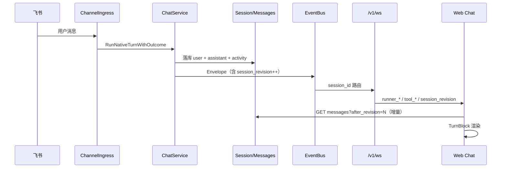

# M55 — Chat × Channel × Cursor 对标 — 设计文档

> **版本**：2026-06-17
> **读者**：架构、后端、前端
> **关联**：[55-chat-channel-cursor.md](./55-chat-channel-cursor.md)（需求）· [55-chat-channel-cursor.development.md](./55-chat-channel-cursor.development.md)（开发计划）· [1-chat.design.md](./1-chat.design.md) · [17-channel.design.md](./17-channel.design.md) · [51-message-mechanism.design.md](./51-message-mechanism.design.md)
> **背景**：飞书长任务 5 分钟超时失败；Channel 会话消息在 Web Chat 不可见或体验异常；需以 Cursor 为参照统一 Chat 产品形态。本文记录架构契约、数据模型、协议、UX 规范。

---

## 1. 架构总览

### 1.1 三平面执行模型（解决长任务超时 + 后台任务无观测壳）

```
┌──────────────────────────────────────────────────────────────────────┐
│ IM 平面（秒级 SLA）：ACK ≤2s / 心跳 / 进度 PATCH / 完成通知 + 深链      │
├──────────────────────────────────────────────────────────────────────┤
│ Turn 平面（分钟级，硬上限 15min）：sync Agent/Team turn               │
│   ↳ 超过 15min 必须自动改判走 Job，不允许 silent 超时                  │
├──────────────────────────────────────────────────────────────────────┤
│ Job 平面（小时～24h）：Graph / Cron / Durable Worker + Checkpoint     │
│   ↳ Channel 入口 ACK 返回 Job ID；Web 观测面板镜像状态                 │
└──────────────────────────────────────────────────────────────────────┘
         ↓ 三平面写入同一真相源 ↓
┌──────────────────────────────────────────────────────────────────────┐
│ Session + Messages + ChannelTurnJob + GraphExecution + SessionRun     │
│ （含 session_revision）                                                │
└──────────────────────────────────────────────────────────────────────┘
         ↓ 投影到客户端 ↓
   WebSocket Envelope（含 session_revision、source、job_id、turn_id）
   Feishu / Slack / Telegram Card（含 session 深链）
```

### 1.2 入口判定（产品规则）

| 触发 | 判定 | 入口 |
|------|------|------|
| Web `SendChatMessage` | `Turn` | `chat_orchestrator_turn.go` |
| WS `user_message` | `Turn`（默认） | 同上 |
| Channel webhook（默认） | `Turn`（≤15min） | `channel_ingress_turn.go` |
| Channel `execution_mode=async` 或 `/async` 前缀 | `Job` | `channel_ingress_async.go` |
| Cron 触发 | `Turn` 或 `Job`（任务配置决定） | `RunCronTurn` / Graph |
| 用户/管理员强制 `/async` `/background` | `Job` | 同上 |

### 1.3 Channel ↔ Web 统一 Session Sync（解决飞书消息不可见）



### 1.4 分层与依赖方向

```
api/kratos/**.proto          ← 唯一对外契约（ListSessionMessages 增加 after_revision）
internal/server              ← WS 帧路由、HTTP/gRPC 注册（薄）
internal/service             ← 装配 TurnExecutor、Channel ingress、Job 聚合
internal/biz                 ← Usecase / Repo 接口 / Session+Revision 计算
internal/data                ← Ent ORM 实现
internal/agent · team · graph · runtime  ← trpc-agent-go 运行时层
internal/event               ← Envelope + Bus + Buffer + replay
```

**红线检查（CI: `make runtime-boundary`）**：

- ✅ biz 没有 `import trpc.group/.../trpc-agent-go/`
- ✅ server 没有 `import internal/agent` 直接运行时
- ✅ service 只在装配点 import 框架，不下沉到 biz

---

## 2. 数据模型

### 2.1 实体增量

| 实体 | 字段 | 来源 | 用途 |
|------|------|------|------|
| `sessions` | `session_revision INTEGER NOT NULL DEFAULT 0` | Ent schema `internal/data/ent/schema/session.go:92` | 增量拉取游标 |
| `messages` | `turn_id` / `turn_number` / `seq_in_turn` | 已有 `internal/data/ent/schema/message.go:36-38` | TurnBlock 分组主键 |
| `channel_turn_job` | 已有 | `internal/data/ent/schema/channel_turn_job.go` | Background Job 面板数据源 |
| `session_runs` | 新增表（DDL） | `internal/data/session_run_schema.go` | Run 生命周期（interactive→durable） |

> **注**：原蓝图提到的 `last_revision_at` 字段未落地；`turn_index` 在代码中实际为 `turn_id` + `turn_number`（消息按 `turn_id` 分组，按 `turn_number` 排序）。

### 2.2 SessionRun 状态机

定义位置：`internal/biz/session_run_phase_machine.go`（显式状态机，符合 AS-FSM-01）。

```
[*] --> interactive
interactive --> durable     : user_escalate
interactive --> completed   : complete
interactive --> failed      : fail
interactive --> cancelled   : cancel
durable --> completed       : complete
durable --> failed          : fail
durable --> cancelled       : cancel
```

| Phase | 含义 |
|-------|------|
| `interactive` | 分钟级同步 Turn（默认） |
| `durable` | 小时级后台 Worker + Checkpoint 续跑 |
| `completed` / `failed` / `cancelled` | 终态 |

> 兼容：DB 中历史 `escalating` 记录映射为 `PhaseDurable`（`session_run_phase_machine.go:104-105`）。

### 2.3 session_runs 表结构（DDL，非 Ent）

```sql
CREATE TABLE IF NOT EXISTS session_runs (
  id TEXT PRIMARY KEY,
  session_id TEXT NOT NULL,
  turn_id TEXT NOT NULL DEFAULT '',
  runtime_run_id TEXT NOT NULL DEFAULT '',
  source TEXT NOT NULL DEFAULT '',
  phase TEXT NOT NULL DEFAULT 'interactive',
  soft_budget_sec INTEGER NOT NULL DEFAULT 180,
  hard_budget_sec INTEGER NOT NULL DEFAULT 900,
  checkpoint_id TEXT NOT NULL DEFAULT '',
  workflow_job_id TEXT NOT NULL DEFAULT '',
  agent_id TEXT NOT NULL DEFAULT '',
  error_message TEXT NOT NULL DEFAULT '',
  started_at TEXT NOT NULL DEFAULT '',
  phase_changed_at TEXT NOT NULL DEFAULT '',
  finished_at TEXT NOT NULL DEFAULT '',
  resume_started_at TEXT NOT NULL DEFAULT '',
  created_at TEXT NOT NULL DEFAULT '',
  updated_at TEXT NOT NULL DEFAULT ''
);
```

来源：`internal/data/session_run_schema.go`（`EnsureSessionRunSchema`）。

### 2.4 迁移策略

1. Ent schema 新增字段 → `make wire && make api`（schema 变更需 `ent generate`）。
2. 启动期一次性 backfill：`UPDATE sessions SET session_revision = (SELECT COUNT(DISTINCT turn_id) FROM messages WHERE session_id = sessions.id)`。
3. 旧 client 无 `after_revision` 参数时退化为全量返回（保持兼容）。
4. `session_runs` 通过 `EnsureSessionRunSchema` 启动期 `CREATE TABLE IF NOT EXISTS`。

---

## 3. Envelope 协议增量

### 3.1 新增公共字段

定义位置：`internal/event/contract/envelope.go:141-144`。

```go
type Envelope struct {
    // ... 已有字段 ...
    SessionRevision int64  `json:"session_revision,omitempty"`  // Turn 收口时 +1 后的值
    Source          string `json:"source,omitempty"`            // web | channel | cron | a2a | api
    JobID           string `json:"job_id,omitempty"`            // 来自 ChannelTurnJob / Cron / Graph
    TurnID          string `json:"turn_id,omitempty"`           // = userMsg.id 或 invocation_id（TurnBlock 分组）
}
```

### 3.2 携带规则（投影器 / 服务层注入）

- `text_delta / text_done / tool_call / tool_result / runner_completion`：必带 `TurnID`，`Source` 来自 ctx。
- `run_status` 进入 terminal 态（completed/failed/cancelled）：必带 `SessionRevision`（turn 收口 bump +1）。
- `run_status` **sync** 态：用户消息已入库、turn 未结束；必带当前 `SessionRevision`（bump +1）。Web **不得**当作 turn 完成；仅 debounced `after_revision` hydrate，保留 streaming 占位。
- 同一 turn 可能先后收到 `sync` 与 `completed` 两次 revision 事件（+2 累计），客户端以 `after_revision` 增量拉取即可。
- Channel 入站：在 `channel_ingress_turn.go:88` 调用 `event.WithChannelEnvelopeContext(ctx, platform, chRow.Key)` 注入 `Source = "channel"`；async 路径注入 `JobID`。

### 3.3 Source 注入 API

定义位置：`internal/event/source.go`。

| 函数 | 用途 |
|------|------|
| `WithEnvelopeSource(ctx, source)` | 标记 ctx，EventProjector 读取后写入 `envelope.source` |
| `WithEnvelopePlatform(ctx, platform)` | 标记 IM 平台（feishu/slack/...） |
| `WithEnvelopeChannelKey(ctx, channelKey)` | 标记 Channel Key |
| `WithChannelEnvelopeContext(ctx, platform, channelKey)` | 组合 helper：`Source="channel"` + platform + channelKey |
| `WithSessionRunID(ctx, runID)` | 标记 SessionRun ID（durable 路径） |
| `WithDurableResume(ctx, spec)` | 标记 durable resume 规格 |

### 3.4 Session Revision Bump API

定义位置：`internal/event/session_revision.go`。

| 函数 | 用途 |
|------|------|
| `BumpAndPublishSessionRevision(ctx, bumper, bus, sessionID, runID, turnID, source, lg)` | Turn 完成（status=completed）后 bump + 发布 |
| `BumpAndPublishSessionRevisionSync(ctx, bumper, bus, sessionID, runID, turnID, source, lg)` | User 消息入库（status=sync）后 bump + 发布 |
| `NotifySessionRevisionSync(ctx, sessions, bus, sessionID, runID, turnID, source)` | 不 bump，仅发布当前 revision（durable resume） |
| `PublishSessionRevisionEnvelope(bus, sessionID, runID, turnID, source, revision, status)` | 底层发布 `run_status` envelope |

Biz 层入口：`SessionUsecase.BumpSessionRevision` / `GetSessionRevision`（`internal/biz/session/messages.go:69-77`，Facade 委托到 `SessionMessageUsecase`）。

---

## 4. API 契约

### 4.1 ListSessionMessages 增量参数

定义位置：`api/kratos/session/v1/session.proto:272-283`。

```proto
message ListSessionMessagesRequest {
  string id = 1 [(google.api.field_behavior) = REQUIRED];
  int32 limit = 2;
  int32 offset = 3;
  optional int64 after_revision = 4;   // 仅返回 revision > after_revision 入库的消息
}

message ListSessionMessagesResponse {
  repeated ChatMessageRow items = 1;
  int32 total = 2;
  int64 current_revision = 3;          // 当前 session 的最新 revision（用于客户端对齐）
}
```

HTTP：`GET /v1/sessions/{id}/messages?after_revision=N`。

Biz 实现：`SessionUsecase.ListMessagesAfterRevision(ctx, sessionID, afterRevision)`（`internal/biz/session/messages.go:63-66`）。

### 4.2 Chat Background Jobs API

定义位置：`api/kratos/chat/v1/chat.proto:168-205`。

```proto
message ListChatBackgroundJobsRequest {
  optional string session_id = 1;
  optional string agent_id = 2;
  optional string status = 3;          // running | queued | completed | failed | cancelled | timeout
  optional int32 limit = 4;
}

message ChatBackgroundJob {
  string id = 1;
  string source = 2;                   // channel | cron | manual
  string session_id = 3;
  string agent_id = 4;
  string status = 5;
  string target_type = 6;              // graph | team_graph | cron | session_run
  string target_id = 7;
  string created_at = 8;
  string updated_at = 9;
  optional string summary = 10;
  optional string error_message = 11;
  string channel_id = 12;
  optional string graph_id = 13;
  optional string turn_id = 14;
  optional string session_run_id = 15;
  optional string phase = 16;
}

message CancelChatBackgroundJobRequest {
  string id = 1 [(google.api.field_behavior) = REQUIRED];
  string source = 2;
}

message CancelChatBackgroundJobResponse {
  bool cancelled = 1;
}
```

| RPC | HTTP | 实现位置 |
|-----|------|---------|
| `ListChatBackgroundJobs` | `GET /v1/chat/jobs` | `internal/service/chat_jobs.go:15` |
| `CancelChatBackgroundJob` | `POST /v1/chat/jobs/{id}/cancel` | `internal/service/chat_jobs.go:113` |

聚合策略：`ListChatBackgroundJobs` 同时聚合 `session_runs` + `channel_turn_job` 行（CC-D-01 · CC-R-04），JOIN 无 N+1。

---

## 5. 业务流程（端到端）

### 5.1 Channel 入站 + Web 实时镜像

```
飞书 → POST /webhooks/{key}
  ├─ ChannelIngress.acceptInbound（ACK ≤2s）
  ├─ ParseChannelLongTaskConfig → 路由判定
  │    ├─ async / /async 前缀 → dispatchAsyncInbound（Job 平面）
  │    └─ default → executeInboundTurn（Turn 平面）
  │
  ├─ executeInboundTurn
  │    ├─ prepareChannelChatRequest（Session 亲和 + ctx.Source="channel"）
  │    ├─ ChatOrchestrator.RunNativeTurnWithOutcome
  │    │    ↓ event.WithChannelEnvelopeContext(ctx, platform, chRow.Key)
  │    ├─ TurnPipeline
  │    │    ├─ admission（RunRegistry）
  │    │    ├─ user msg persist → Session.revision++（sync envelope）
  │    │    ├─ stream → Envelope (含 session_revision, source, turn_id)
  │    │    │    ├─ EventBus → WS 推到所有订阅该 session 的 Web 客户端
  │    │    │    └─ TurnPreviewCoordinator → IM card edit-in-place
  │    │    └─ assistant msg + activity persist → Session.revision++（completed envelope）
  │    └─ outbound delivery（飞书 unary 或流式 patch）
  │
  └─ Web 端（已选中该 Session）
       ├─ WS Envelope.session_revision=R 到达
       ├─ if R > local_revision → debounced hydrate GET messages?after_revision=local
       └─ TurnBlock 增量渲染
```

### 5.2 长任务（Job 平面 + Durable Worker）

```
飞书 → /webhooks/{key}（带 /async 或 /background）
  ├─ acceptInbound
  ├─ ChannelLongTaskConfig.ShouldRunAsync → true
  ├─ dispatchAsyncInbound
  │    ├─ CreateTurnJob（accepted）
  │    ├─ ResolveChannelAsyncGraphTarget → graph / team_graph / cron
  │    ├─ ExecuteGraph / TriggerCronTask（不阻塞 ACK）
  │    ├─ enqueueOutboundReply("后台任务已创建（Job: X）")
  │    └─ watchAsync*Completion goroutine（asyncWatchTimeout = ChannelAsyncJobWatchMax = 24h）
  │
  └─ Web 端
       ├─ Chat 侧栏「后台任务」列表实时刷新（订阅 channel:chat 或新 channel:jobs）
       ├─ 点击 Job → 详情面板（Graph 深链）
       └─ Job done → run_status + 飞书出站完成卡片
```

### 5.3 Run 两阶段升格（Interactive → Durable）

```
Web/Channel 触发 Turn
  ├─ BeginSessionRunLifecycle（phase=interactive, soft_budget=180s, hard_budget=900s）
  ├─ RunNativeTurnWithOutcome
  │    ├─ 软预算到 → IM 卡片「升级为后台任务？」+ /background 入站
  │    │    └─ 用户确认 → EscalateToDurableByUser
  │    │         ├─ CreateDurableCheckpoint（会话快照 + 合成 prompt）
  │    │         ├─ MarkPhase(durable)
  │    │         └─ Cancel 当前 runtime run
  │    └─ 硬预算到 → 自动 escalate（同上）
  │
  └─ SessionRunDurableWorker（周期 5s poll）
       ├─ ListDurablePending
       ├─ TryClaimDurableResume（resume_started_at 幂等）
       ├─ ResumeDurableSessionRun（WithDurableResume ctx）
       │    └─ 合成 prompt: "[系统] 请从上次中断处继续完成用户的任务…"
       └─ 完成 → Complete / Fail
```

### 5.4 Web → 同账号触发，Channel 也能看到？（双向问题）

设计原则：**Web 是 Session 的主操作端**，Channel 出站只在 "由 Channel 入站触发的 Turn" 上执行（避免双向回声）。

- `executeInboundTurn` 注入 `ctx.Source="channel"`；
- Outbound delivery 在 service 层判断 `source != channel` 则跳过；
- 例外：管理员显式从 Web 触发"广播到 IM"是另一条 RPC（暂未规划，避免越权）。

---

## 6. UX 规范

### 6.1 TurnBlock UI 模型

**目标 DOM 单位**（一轮对话一个容器）：

```
TurnBlock[turn_id]
├── UserBubble          // role=user，含来源徽标（Web / 飞书 / Cron / A2A）
├── ToolStrip (collapsed by default)
│   ├── summary: "▶ 3 tools · 12.4s · 1 failure"
│   └── details: [ToolDetail × N]  // 展开 = 现有 ChatExecutionCard
├── AssistantBubble     // role=assistant，正文 + reasoning 折叠
└── ArtifactRow[]       // diff / 文件 / signed URL（Phase E）
```

**分组规则**：

- 以 `turn_id`（来自 biz.ChatMessage）为主键分组；同 `turn_id` 内按 `created_at` / `seq_in_turn`。
- `tool_*` / `activity` 类消息归到与其同 turn 的 Assistant 块中的 `ToolStrip`。
- Team 子成员消息：保留独立色条 lane（不并入主 TurnBlock 的 ToolStrip）；如果 Team 顶层有 Assistant 文本，那是顶层 TurnBlock；成员气泡作为 lane 渲染在主 TurnBlock 下半部。
- 兼容现有 `mergeSessionMessages.ts`：`groupMessagesByTurn(messages)` 在其后做派生，不破坏 merge 主链。

**滚动锚定**：

- 默认锚到 **最后一个非 activity** 的 dialogue 行，TurnBlock 模式下锚到 **最后 Assistant 气泡的顶部**，避免被工具长结果挤到屏幕外。
- 虚拟列表阈值：`messages.length >= CHAT_VIRTUAL_SCROLL_THRESHOLD`（=40）；TurnBlock 切换后行高估算需重测，启用 `q-virtual-scroll` 的 `virtual-scroll-item-size: auto` + 增大 `slice-size`。

### 6.2 视觉与可读性

- TurnBlock 容器使用 `.app-glass-dialog` 风格的卡片底（参考 `.cursor/rules/glass-dialog.mdc`），但更轻量：`background: var(--app-glass-soft, rgba(255,255,255,0.55))`，`border-radius: 14px`，`padding: 12px 14px`。
- ToolStrip 折叠条：单行 chip + 工具图标堆叠（最多 5 个，溢出 `+N`），悬停 tooltip 显示前 8 个工具名。
- 来源徽标（Source badge）：飞书/Slack/Telegram 用平台彩色 icon，Web 用 `outline_chat`；放在 UserBubble 右上角，2 字号小型 chip。来源数据来自 `envelope.source_meta`。

### 6.3 信息密度

| 元素 | 默认 | 展开 |
|------|------|------|
| ToolStrip | 折叠（单行） | 全卡片（保留现有 `ChatExecutionCard`） |
| Reasoning | 折叠 `<details>` 或侧栏模式 | 文本（已有） |
| Assistant 正文 | 完全展开 | — |
| 错误 | 内联红色边框 + chip "重试" | 全栈展开 |
| 长结果（>500 字符）| 截断 + "展开" | 全文 + "复制" |

### 6.4 状态反馈（必须）

- 顶部状态栏：`{ N msgs · WS · rev=R · ctx=42% · running }`
- Background Job 数量徽标：右上角红点（运行中）/ 绿点（最近完成）。
- 飞书入站正在投影时：当前 TurnBlock 顶部出现 "来自飞书 · 进行中" 横条，5s 内消失。

### 6.5 Background Job 面板

```
/chat → 右侧抽屉 or 顶部 Tab 「后台任务」
  - 列表：channel_turn_job + session_runs（按 session/agent 过滤）
  - 详情：状态 / async target / Graph execution 深链 / IM 通知预览
  - 操作：取消（→ chat.CancelChatBackgroundJob 或 Graph cancel）/ 重试 / 复制 Session 深链
```

- 数据：复用 `biz.ChannelTurnJobUsecase.List*` + `SessionRunUsecase.ListForJobs` + `GET /v1/chat/jobs`（在 Chat 服务里聚合，避免 Web 直接耦合 Channel API）。
- 实时：Job 状态变更走 `run_status` Envelope（含 `session_run_id` / `phase`）。

### 6.6 A11y 与国际化

- 所有 chip / badge / button 有 `aria-label`；折叠/展开使用原生 `<details>` 或带 `aria-expanded`。
- i18n key：新增 `chat.turn.block.*` / `chat.job.*` 命名空间，中英双语。

### 6.7 Reasoning 侧栏模式

- `ChatReasoningDrawer` + `useReasoningSidebar`：侧栏模式时内联替换为可点击提示。
- `ChatReasoningPeek`：思考/正文 live tail 最后两行（流式缓存来自 `chatStreamingSnapshots` Store）。

### 6.8 上下文压力可视化

- 圆环点击展开 Prompt 占比分解：`ChatContextBreakdownPopover` + `useContextBreakdown`。
- 上下文压缩可视化通知：toast + `onCompressNotice` 回调。
- ChatComposer 上下文压力警告：warning/critical 双级 banner + 新会话按钮。

---

## 7. 模块关系

| 模块 | M55 依赖 / 扩展 |
|------|-----------------|
| **Channel Phase E** | ACK、Job 表、IM Preview、async Graph — **配置与路由策略补全** |
| **Message/WS 51** | 新增 `session_revision` Envelope；Channel 入站 meta |
| **Chat 1** | TurnBlock 组件、滚动锚点、Follow-up 已对齐 |
| **Graph 36** | 长任务 async 执行体；24h Checkpoint |
| **Session 10** | `session_revision` 字段 + `ListMessagesAfterRevision` |
| **Monitor 18** | Job 面板可复用 FlowLog / Runs |

**架构红线不变**（见 [docs/README.md](../README.md)）：

- `internal/biz` 不 import `trpc-agent-go`
- `internal/server` 只做传输；运行时装配只在 `internal/service`
- 实时主通道 `/v1/ws`，SSE 仅用于外部协议（A2A/MCP）
- Channel 与 Web 共用 Session 落库，Web 为观测端

---

## 8. 风险与回滚

| 风险 | 严重度 | 缓解 |
|------|--------|------|
| `session_revision` 迁移漂移 | 高 | Backfill 在事务内；旧 API 保持兼容；前端 fallback 全量 |
| TurnBlock 重构破坏 Team UI | 中 | 特性开关；老路径保留至少 1 个 sprint |
| Worker deadline 替换 asyncWatch 时机 | 中 | Phase F 独立 sprint；先在测试租户跑 1 周 |
| Envelope 顶层字段膨胀 | 低 | 总字段 < 20；新增字段做 omitempty |
| 关键词路由误判 | 中 | 关键词可由 system_settings 覆写；FlowLog 记录路由决策 |

**回滚剧本**：

- 任一 Phase 出现 P0 回归 → 关掉特性开关（前端 localStorage / 后端 system_settings.feature_turn_block 等）→ 主链回到现状基线。
- DB 迁移不可回滚字段，使用 nullable + default 0 保证旧逻辑无副作用。

---

## 9. 性能基线

| 指标 | 目标 | 测试方法 |
|------|------|---------|
| Web 选中 Session 到首屏 | ≤500ms（cache hit）/ ≤1500ms（cold） | Chrome Performance |
| Channel 入站 ACK | ≤2s | Feishu Webhook 时序 |
| Turn 首字节（sync） | ≤30s（FirstByteTimeout） | FlowLog `chat.first_byte` |
| WS envelope → 渲染 | ≤50ms | Vue devtools timeline |
| 500 条消息列表滚动 | ≥55fps | DevTools FPS meter |

---

## 10. 代码锚点速查

| 能力 | 位置 |
|------|------|
| Turn 超时默认 10m | `internal/agent/choice_stream.go:14` `DefaultTurnTimeout = 10 * time.Minute` |
| Channel 长任务配置 | `internal/biz/channel_config_helpers.go`（`ShouldRunAsync` L295、`SuggestDurableRun` L315） |
| async Graph watch | `internal/service/channel_ingress_async.go:21`（`asyncWatchTimeout = ChannelAsyncJobWatchMax = 24h`） |
| IM Preview transcript | `internal/channel/preview/` |
| Web 消息列表 | `web/src/components/chat/ChatMessagePanel.vue` · `ChatMessageList.vue` |
| WS 同步 | `web/src/features/chat/composables/useChatInboundSync.ts` · `useChatStreamManager.ts` · `web/src/features/chat/mergeSessionMessages.ts` |
| Envelope 契约 | `internal/event/contract/envelope.go:141-144` |
| Source 注入 | `internal/event/source.go` |
| Session Revision | `internal/event/session_revision.go` · `internal/biz/session/messages.go:69-77` |
| Chat Jobs API | `internal/service/chat_jobs.go` |
| SessionRun 状态机 | `internal/biz/session_run_phase_machine.go` |
| SessionRun Usecase | `internal/biz/session_run.go` · `internal/biz/session_run_checkpoint.go` |
| Durable Worker | `internal/service/session_run_durable_worker.go` |
| Durable Resume | `internal/service/chat_durable_resume.go`（`ResumeDurableSessionRun`） |
| Turn Pipeline | `internal/service/turn_pipeline.go` · `chat_orchestrator_turn.go`（`runSingleAgentViaTRPC` L236） |
| Channel 入站 Turn | `internal/service/channel_ingress_turn.go:88`（`WithChannelEnvelopeContext`） |
| Turn 错误分类 | `internal/service/turn_errors.go` · `channel_provider_errors.go`（`classifyChannelTurnError`） |
| Turn 错误 IM 投递 | `internal/service/channel_ingress_errors.go`（`deliverTurnErrorReply`） |
| Background Jobs 面板 | `web/src/components/chat/ChatBackgroundJobsPanel.vue` |
| Diff Viewer | `web/src/components/chat/ChatDiffViewer.vue` · `web/src/features/chat/diffEditHelpers.ts` |
| Mention Popup | `web/src/components/chat/ChatMentionPopup.vue` |
| Reasoning Drawer | `web/src/components/chat/ChatReasoningDrawer.vue` · `web/src/features/chat/composables/useReasoningSidebar.ts` |
| Context Breakdown | `web/src/components/chat/ChatContextBreakdownPopover.vue` · `web/src/features/chat/composables/useContextBreakdown.ts` |
| Job Formatters | `web/src/features/chat/sessionRunStatus.ts` · `jobFormatters.ts` |
| Channel Long Task Presets | `web/src/features/channels/channelLongTaskPresets.ts` · `ChannelEditorDialog.vue` |
