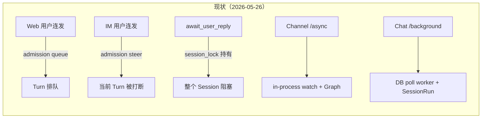
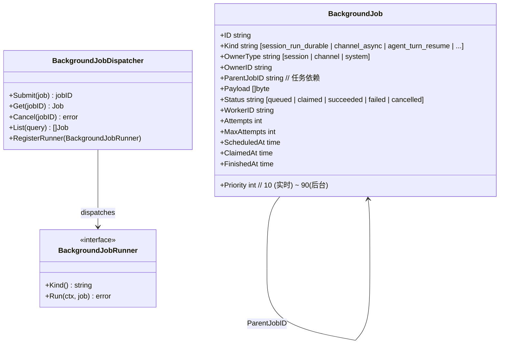
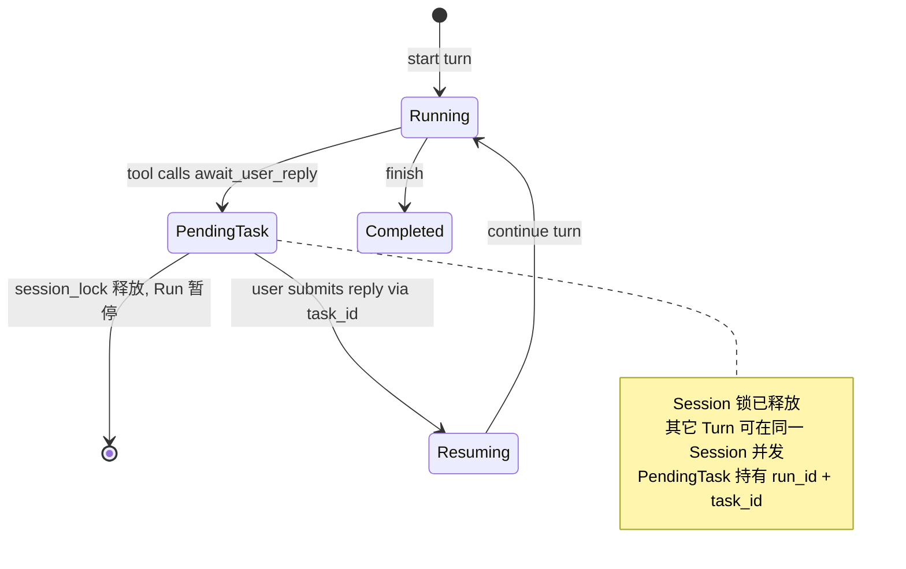
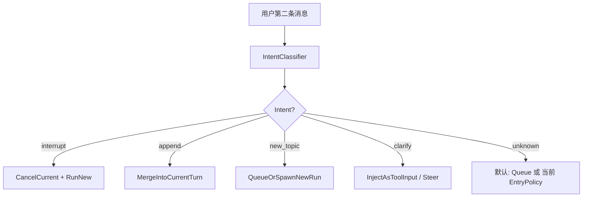
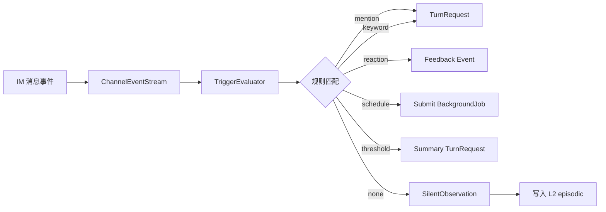
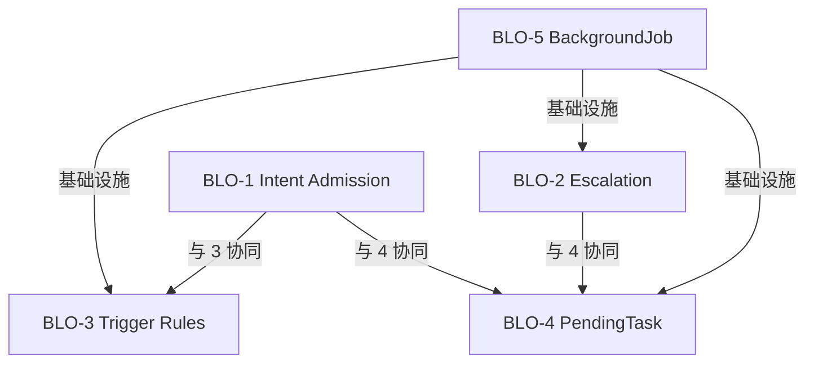

# M56 — 业务逻辑优化（BLO）设计文档

> **版本**：2026-06-17 · **状态**：📋 设计草案 · **EP**：EP-BLO-M56
> **需求**：[56-business-logic-optimization.md](./56-business-logic-optimization.md)
> **开发计划**：[56-business-logic-optimization.development.md](./56-business-logic-optimization.development.md)
> **红线**：依赖倒置不动 · `biz` 不 import `pkg/trpc-agent-go` · Runner 装配仍在 `service` + Wire

---

## 1. 主链路现状（2026-05-26 评估）



> **注**：原设计文档中提到的 `session_run_budget.go`（180s/900s 时间阈值升级 durable）已被移除。`internal/data/ent/schema/session_run.go` 中 `soft_budget_sec` / `hard_budget_sec` 字段标注 `// Deprecated: budget mechanism removed`。BLO-2 Multi-Signal Escalation 将在新基础上构建，不再依赖旧 budget watcher。

| 业务能力 | 现状 | 缺陷 |
|----------|------|------|
| 跨入口 admission 策略 | ❌ 入口分类硬编码 | Web 与 IM 行为不一致；intent 雏形在 `internal/agent/intent` 但未上提到 admission |
| Run 升级信号 | ⚠️ 仅用户主动声明 | 旧 budget watcher 已移除，仅保留 `EscalateToDurableByUser` 路径 |
| 群机器人触发模式 | ⚠️ 仅 `@mention` + `allowlist` | `internal/biz/channel_access.go` 二选一，无 schedule / keyword / reaction |
| HITL 占用 Session | ❌ 锁全程 | `internal/biz/session_lock.go` 持有期等于 turn 全程 |
| 异步任务统一抽象 | ❌ 双轨 | `internal/biz/channel_turn_job.go` + `session_run`（durable） |

### 1.1 已有可复用资产

| 资产 | 路径 | 复用方向 |
|------|------|----------|
| intent pass 基础设施 | `internal/agent/intent/` | 上提到 admission（BLO-1） |
| SessionRun phase 状态机 | `internal/biz/session_run_phase_machine.go` | 扩展升级信号（BLO-2） |
| Channel 异步 job 模型 | `internal/biz/channel_turn_job.go` | 迁移到 BackgroundJob（BLO-5） |
| Turn 窄端口 | `internal/biz/turn_gateway.go` | admission 接入点（BLO-1） |
| 进程内 Run 状态注册 | `internal/runtime/run_registry.go` | PendingTask 解耦（BLO-4） |
| Session 锁管理 | `internal/biz/session_lock.go` | HITL 释放改造（BLO-4） |
| Escalation 通知器 | `internal/service/session_run_escalation_notifier.go` | BLO-2 通知带理由 |
| Await 协调器 | `internal/service/chat_orch_await.go` | BLO-4 改造 `MakeAwaitReplyFunc` |
| BackgroundJob 基础类型 | `internal/biz/backgroundjob/{job.go,repo.go}` | BLO-5 已落地（见 §6.1） |
| BLO Feature Flags | `internal/conf/features_blo.go` | 全主题灰度开关 |

---

## 2. 总体设计（5 主题概览）

### 2.1 BLO-5（基础设施）—— **必须先做**



**端口（biz 层，已落地）**：

```go
// internal/biz/backgroundjob/job.go (已存在)
type BackgroundJob struct { /* 见上 */ }

// internal/biz/backgroundjob/repo.go (已存在)
type Repo interface {
    Create(ctx, CreateRequest) (*Job, error)
    Get(ctx, id string) (*Job, error)
    List(ctx, ListFilter) ([]*Job, error)
    TryClaim(ctx, workerID string, kinds []string) (*Job, error) // 原子认领
    MarkRunning(ctx, id, workerID string) error
    MarkSucceeded(ctx, id string) error
    MarkFailed(ctx, id, errMsg string) error
    Cancel(ctx, id string) error
    CancelByOwner(ctx, ownerType OwnerType, ownerID string) (int, error)
    DeleteTerminated(ctx, ListFilter) (int, error)
}
```

**仍需新增的端口**（Dispatcher / Runner）：

```go
// internal/runtime/backgroundjob/dispatcher.go (规划中)
type BackgroundJobRunner interface {
    Kind() string
    Run(ctx context.Context, job backgroundjob.Job) error
}

type BackgroundJobDispatcher interface {
    Submit(ctx context.Context, spec backgroundjob.CreateRequest) (string, error)
    Cancel(ctx context.Context, jobID, reason string) error
    Get(ctx context.Context, jobID string) (backgroundjob.Job, error)
    Subscribe(filter backgroundjob.ListFilter) <-chan JobEvent
}
```

**迁移策略**：
1. 引入新表 `background_jobs`（DB schema 见 §6.1，**已落地**）。
2. `channel_turn_job` 与 `session_run.durable` 改为 **写入新表的 view**；旧表保留只读以保证回滚。
3. 现有 `SessionRunDurableWorker` 改造为 `BackgroundJobWorker` 的一个 runner 注册。
4. Channel `/async` 旧 watch 改为 Submit 到 Dispatcher。

### 2.2 BLO-4 —— PendingTask 解耦 HITL



**新数据模型**：

```go
// internal/biz/session/pending_task.go (规划中)
type PendingTask struct {
    ID         string
    RunID      string   // 关联 Run
    SessionID  string
    Kind       string   // "await_user_reply" | "tool_confirm" | "approval"
    PromptText string
    OptionsJSON string  // 卡片选项 / 期望回复 schema
    CreatedAt  time.Time
    Deadline   time.Time
    Status     string   // pending | answered | timed_out | cancelled
    AnswerJSON string
}
```

**关键变化**：
- `await_user_reply` 不再阻塞 Run 的 goroutine；持久化 PendingTask 后 **Runner 释放 session_lock 退出**。
- 用户 IM 回复或 Web 按钮通过 `task_id` 路由到 `PendingTaskUsecase.Answer(task_id, payload)`。
- Answer 后通过 BLO-5 BackgroundJob 重新拉起 Run（`Kind=agent_turn_resume`）。
- IM 卡片渲染时把 `task_id` 写入卡片回调，前端按钮把 `task_id` 写入 `await_reply` 请求。

**改造锚点**：`internal/service/chat_orch_await.go:211` 的 `MakeAwaitReplyFunc` 当前实现是阻塞 select 等待 channel；BLO-4 改为持久化 PendingTask 后释放锁退出。

### 2.3 BLO-1 —— Intent-Aware Admission



**端口**：

```go
// internal/biz/turn_intent.go (规划中)
type TurnIntent string
const (
    TurnIntentInterrupt TurnIntent = "interrupt"
    TurnIntentAppend    TurnIntent = "append"
    TurnIntentNewTopic  TurnIntent = "new_topic"
    TurnIntentClarify   TurnIntent = "clarify"
    TurnIntentUnknown   TurnIntent = "unknown"
)

type TurnIntentClassifier interface {
    Classify(ctx context.Context, in IntentInput) (TurnIntent, float32, error)
}

type IntentInput struct {
    PrevTurnSummary string  // 当前正在跑的 Turn 摘要
    NewContent      string
    Locale          string
    SessionID       string
}
```

**实现**：
- 默认 v0：**关键词 + 模式匹配**（"等等" / "算了" / "停" / "对了" / "还有" / "再问个"）+ heuristic（短文本+中断词、问号、新主题词云）
- v1：**轻量 LLM 调用**（gpt-4o-mini / hunyuan-lite，可禁用）+ 缓存
- 入口侧：`admission_gate` 在策略评估前调用 classifier；intent 传入 ingress_policy 决策表

**改造锚点**：`internal/service/chat_orchestrator_turn.go:84` 的 `checkTurnAdmission` 与 `internal/service/ingress_policy.go` 决策表。

### 2.4 BLO-2 —— Multi-Signal Escalation

```go
// internal/biz/session_run_escalation.go (规划中)
type EscalationSignal struct {
    ElapsedSec    int
    ToolCallCount int
    TokensSoFar   int
    EnteredGraph  bool
    NestedAgents  int
    UserDeclared  bool
}

type EscalationDecision struct {
    TargetPhase string   // interactive | escalating | durable | abort
    Reason      string
    Confidence  float32
}

type EscalationPolicy interface {
    Decide(ctx context.Context, sess Session, run SessionRun, sig EscalationSignal) EscalationDecision
}
```

**默认 Policy**：

| 信号 | 阈值 | 决策 |
|------|------|------|
| `UserDeclared=true` | — | → `durable` 立即 |
| `EnteredGraph=true` | — | → `durable` |
| `ToolCallCount` | > 3 | → `escalating` |
| `ToolCallCount` | > 8 | → `durable` |
| `TokensSoFar` | > 50,000 | → `durable` |
| `NestedAgents` | > 1 | → `escalating`（提示用户） |
| `ElapsedSec` | > 180 | → `escalating` |
| `ElapsedSec` | > 900 | → `durable`（兜底） |
| 异常 token/sec | < 10 持续 60s | → `abort` 候选 |

**通知带理由**：升级通知（IM 卡片 / WS）附 `Reason` 字段，前端展示"为什么转后台"。复用现有 `internal/service/session_run_escalation_notifier.go` 的 `SessionRunEscalationNotifier` 接口扩展。

**改造锚点**：`internal/service/chat_orch_session_run_lifecycle.go` 的 `EscalateToDurableByUser` 与 `applyDurableTransition`。

### 2.5 BLO-3 —— Channel Trigger Rules



**数据模型**：

```go
// internal/biz/channel_trigger.go (规划中)
type ChannelTrigger struct {
    ID         string
    ChannelID  string
    Kind       string  // mention | keyword | reaction | schedule | threshold | silent
    ConfigJSON string  // 各 Kind 特定配置
    Enabled    bool
    Priority   int
    CreatedAt  time.Time
}

type ChannelObservation struct {  // 静默记录的事件
    ID         string
    ChannelID  string
    PeerKey    string
    MessageRef string
    Content    string
    Metadata   json.RawMessage
    CreatedAt  time.Time
    RetainUntil time.Time
}

type TriggerEvaluator interface {
    Evaluate(ctx context.Context, ev InboundEvent, channelCfg ChannelConfig) ([]TriggerOutcome, error)
}

type TriggerOutcome struct {
    Action     string  // "turn_request" | "silent_observe" | "submit_job" | "emit_feedback"
    TriggerID  string
    Payload    json.RawMessage
}
```

**默认规则集**：
1. `mention`：保留现有 `@bot` 行为（默认启用，回退保护）
2. `keyword`：群里包含「日报」「OKR」等关键词触发对应 Agent
3. `schedule`：Cron 表达式 + 触发模板（如"每日 18 点总结今日讨论"）
4. `reaction`：用户对 bot 回复加 👍/👎 → evaluation feedback
5. `threshold`：累计 N 条无 @bot 消息后触发"是否需要我总结"
6. `silent`：所有非触发消息写入 `channel_observation`，TTL 7 天，供 L2 记忆召回

**改造锚点**：`internal/service/channel_ingress_accept.go` 的 `acceptInbound` 之前增加 TriggerEvaluator 评估；`internal/biz/channel_access.go` 现有 `@mention` + `allowlist` 由 `kind=mention` 规则替代。

### 2.6 互相关系



**实施顺序**：BLO-5 → (BLO-4 || BLO-2) → BLO-1 → BLO-3

---

## 3. 兼容性与迁移

### 3.1 红线保持

| 红线 | 维持方式 |
|------|----------|
| `biz` 不 import `pkg/trpc-agent-go` | 所有新端口在 biz 定义；intent classifier / job runner 实现注入到 service |
| Runner 装配在 service + Wire | BackgroundJobDispatcher 在 `internal/runtime/backgroundjob/` 实现，service 装配 |
| 不改 OpenAPI 不向后兼容 | 新增字段全部 optional；旧字段语义不变 |

### 3.2 灰度策略

- 每个 BLO 主题有独立 feature flag（已落地于 `internal/conf/features_blo.go`）：
  - `BLO_UNIFIED_JOB_ENABLED`（BLO-5）
  - `BLO_PENDING_TASK_V2`（BLO-4）
  - `BLO_ESCALATION_V2`（BLO-2）
  - `BLO_INTENT_CLASSIFIER`（BLO-1）
  - `BLO_TRIGGER_RULES`（BLO-3）
- 默认 **关闭**，逐 sprint 灰度开启
- DB schema 用 additive migration：新表/新列，不删旧表
- 旧 `session_run` / `channel_turn_job` 在 BLO-5 启用后变为 view-only 读取

### 3.3 回滚

- 任意 BLO 主题关闭 feature flag 即回到现状路径
- DB 数据保留（双写期间）

---

## 4. 数据模型变更

### 4.1 BLO-5 新表 `background_jobs`（✅ 已落地）

实际 Ent Schema 见 `internal/data/ent/schema/background_job.go`。表名 `background_jobs`（注意复数），字段与原设计略有调整：

| 字段 | 类型 | 说明 |
|------|------|------|
| `id` | string(128) | 主键，Immutable |
| `kind` | string | runner kind，如 `session_run_durable` |
| `owner_type` | string | `session` / `channel` / `system` |
| `owner_id` | string | 持有实体 ID |
| `parent_job_id` | string | DAG 父任务 |
| `priority` | int | 默认 50，越低越紧急 |
| `status` | string | `queued` / `claimed` / `succeeded` / `failed` / `cancelled` |
| `payload` | bytes | JSON，默认 `{}` |
| `worker_id` | string | 认领的 worker |
| `attempts` / `max_attempts` | int | 重试计数 |
| `last_error` | text | 最近错误 |
| `scheduled_at` / `claimed_at` / `finished_at` | int64 | Unix 毫秒 |
| `created_at` / `updated_at` | string | 时间戳 |

**索引**（4 个）：
- `(status, priority, scheduled_at)` — 主认领查询
- `(owner_type, owner_id, status)` — 按持有者列表/批量取消
- `(parent_job_id, status)` — DAG 子任务查找
- `(status, finished_at)` — 终态清理

> **与原设计差异**：原设计表名 `background_job`（单数），实际为 `background_jobs`（复数，遵循 Ent 默认）；原设计 `deadline` / `result_json` / `visibility` / `error_code` / `error_message` 字段未实现，改为 `last_error` + `attempts`/`max_attempts` 重试模型；时间戳用 int64 毫秒而非 DATETIME。

### 4.2 BLO-4 新表 `pending_task`（📋 规划中）

```sql
CREATE TABLE pending_task (
    id            TEXT PRIMARY KEY,
    run_id        TEXT NOT NULL,
    session_id    TEXT NOT NULL,
    kind          TEXT NOT NULL,
    prompt_text   TEXT NOT NULL,
    options_json  TEXT,
    status        TEXT NOT NULL,
    answer_json   TEXT,
    deadline      DATETIME,
    created_at    DATETIME NOT NULL,
    answered_at   DATETIME,
    UNIQUE(run_id, kind)
);
CREATE INDEX idx_pending_task_session ON pending_task(session_id, status);
```

### 4.3 BLO-3 新表 `channel_trigger` / `channel_observation`（📋 规划中）

```sql
CREATE TABLE channel_trigger (
    id           TEXT PRIMARY KEY,
    channel_id   TEXT NOT NULL,
    kind         TEXT NOT NULL,
    config_json  TEXT NOT NULL,
    enabled      INTEGER NOT NULL DEFAULT 1,
    priority     INTEGER NOT NULL DEFAULT 50,
    created_at   DATETIME NOT NULL,
    updated_at   DATETIME NOT NULL
);
CREATE INDEX idx_channel_trigger_channel ON channel_trigger(channel_id, enabled);

CREATE TABLE channel_observation (
    id           TEXT PRIMARY KEY,
    channel_id   TEXT NOT NULL,
    peer_key     TEXT NOT NULL,
    message_ref  TEXT,
    content      TEXT,
    metadata     TEXT,
    created_at   DATETIME NOT NULL,
    retain_until DATETIME NOT NULL
);
CREATE INDEX idx_channel_obs_channel_time ON channel_observation(channel_id, created_at);
CREATE INDEX idx_channel_obs_retain ON channel_observation(retain_until);
```

### 4.4 BLO-2 字段补充 `session_runs`（📋 规划中）

```sql
ALTER TABLE session_run ADD COLUMN escalation_reason TEXT;
ALTER TABLE session_run ADD COLUMN escalation_signals_json TEXT;  -- 决策快照
```

> **注**：当前 `internal/data/ent/schema/session_run.go` 不含 `escalation_reason` / `escalation_signals_json` 字段；`soft_budget_sec` / `hard_budget_sec` 已标注 Deprecated。

---

## 5. API 与事件变更

### 5.1 Proto 新增（📋 规划中）

```proto
// api/kratos/chat/v1/chat.proto 增量
message PendingTask {
  string id = 1;
  string run_id = 2;
  string session_id = 3;
  string kind = 4;
  string prompt_text = 5;
  string options_json = 6;
  string deadline = 7;
  string status = 8;
}

message AnswerPendingTaskRequest {
  string task_id = 1;
  string answer_json = 2;
}

rpc ListPendingTasks(...) returns (...);
rpc AnswerPendingTask(...) returns (...);
```

```proto
// api/kratos/backgroundjob/v1/backgroundjob.proto (新)
service BackgroundJobService {
  rpc SubmitJob(SubmitJobRequest) returns (Job);
  rpc GetJob(GetJobRequest) returns (Job);
  rpc CancelJob(CancelJobRequest) returns (google.protobuf.Empty);
  rpc ListJobs(ListJobsRequest) returns (ListJobsResponse);
}

message Job {
  string id = 1;
  string kind = 2;
  string owner_type = 3;
  string owner_id = 4;
  string parent_job_id = 5;
  string status = 6;
  int32 priority = 7;
  string visibility = 8;
  string last_error = 9;
}
```

> **注**：`api/kratos/backgroundjob/v1/` 目录尚未创建。现有 chat.proto 已有 `AwaitUserReply` RPC（`internal/service/chat.go:336`），BLO-4 在其基础上扩展。

### 5.2 WS Envelope 新增（📋 规划中）

| 事件 | 用途 |
|------|------|
| `pending_task_created` | HITL 等待回复 |
| `pending_task_answered` | 用户回复完成，Run 重新拉起 |
| `escalation_decision` | 携带 reason 的升级通知 |
| `job_status_changed` | BackgroundJob 状态变更（统一替代 `channel_turn_job_changed`） |
| `intent_classified` | （可选 / debug）admission 时的 intent 标签 |

> **改造锚点**：`internal/event/envelope.go` 增加新事件类型。

---

## 6. 业务规则（实现侧）

### 6.1 BLO-1 Intent 规则

| Intent | 触发条件示例 | 默认动作 |
|--------|--------------|----------|
| interrupt | "停"/"算了"/"取消"/包含"错了" | CancelCurrent + RunNew |
| append | "还有"/"对了"/"再补充" + 短文本（< 50 char） | MergeIntoCurrentTurn（追加 user_extra） |
| new_topic | 新关键词 + 与前 turn 主题语义距离大 | QueueOrSpawnNewRun |
| clarify | 问号 + 主语指向当前回答（"你说的 X 是？"） | InjectAsToolInput |
| unknown | classifier 置信度 < 0.6 | 回退到原 ingress_policy |

### 6.2 BLO-2 升级规则

见 §2.4 默认 Policy 表。**用户主动 `/background` 立即升 durable** 是不可绕过的最高优先级。

### 6.3 BLO-3 群机器人语义

- 默认所有 Channel 创建时插入 `kind=mention` 规则（保护现有行为）
- `kind=silent` 规则启用后 **每条消息** 都写 `channel_observation`，**不**触发 Turn
- `kind=schedule` 规则的 cron 命中后通过 BLO-5 提交 BackgroundJob（不立即同步触发）
- `kind=reaction` 收到表情回复后写入 `evaluation_feedback`（接 M33 evaluation）

### 6.4 BLO-4 PendingTask 规则

- PendingTask 创建后 **session_lock 必须释放**
- 同一 Run 不允许并存多个相同 kind 的 PendingTask（UNIQUE 约束）
- PendingTask `Deadline` 超时后 Run 自动标记 `failed`，并向用户发送 IM 通知
- 用户回复时若 PendingTask 已超时 → 返回 410 Gone + 提示用户重新发起

### 6.5 BLO-5 BackgroundJob 规则

- `priority < 50` 视为实时（用户感知路径），由独立高优先级 worker 池处理
- `priority >= 50` 后台任务，统一池
- `ParentJobID` 形成 DAG，子 Job 在父 Job 完成且 `status=succeeded` 后才执行
- `Cancel(jobID)` 级联取消所有未启动的子 Job
- `attempts < max_attempts` 时失败可重试

---

## 7. 影响范围与风险

### 7.1 模块影响矩阵

| 模块 | BLO-1 | BLO-2 | BLO-3 | BLO-4 | BLO-5 |
|------|:-----:|:-----:|:-----:|:-----:|:-----:|
| `biz/chat_usecase.go` | ✏️ | ✏️ | | ✏️ | ✏️ |
| `biz/session_run.go` / `session_run_phase_machine.go` | | ✏️✏️ | | ✏️ | ✏️ |
| `biz/channel*.go` | ✏️ | | ✏️✏️ | | ✏️ |
| `biz/turn_*.go` | ✏️ | ✏️ | | ✏️ | ✏️ |
| `biz/backgroundjob/`（已存在） | | | | ✏️ | ✏️✏️ |
| `biz/session/pending_task.go`（新） | | | | ✏️✏️ | |
| `biz/channel_trigger.go`（新） | | | ✏️✏️ | | |
| `service/chat_orchestrator_turn.go` | ✏️ | ✏️ | | ✏️ | ✏️ |
| `service/chat_orch_await.go` | | | | ✏️✏️ | |
| `service/channel_ingress*.go` | ✏️ | | ✏️ | ✏️ | ✏️ |
| `service/session_run_durable_worker.go` | | ✏️ | | | ✏️✏️（替换） |
| `service/chat_orch_session_run_lifecycle.go` | | ✏️✏️ | | | ✏️ |
| `runtime/run_registry.go` | | | | ✏️ | |
| `runtime/backgroundjob/`（新） | | | | | ✏️✏️ |
| `web/src/components/chat/` + `web/src/features/chat/composables/` | ✏️（intent tag） | ✏️（reason 展示） | | ✏️✏️（pending task UI） | ✏️（jobs 面板） |
| Proto / OpenAPI | ✏️ | ✏️ | ✏️ | ✏️ | ✏️✏️ |
| DB schema | | ✏️ | ✏️✏️ | ✏️✏️ | ✅（已落地） |

（✏️ = 修改 · ✏️✏️ = 新增/重写 · ✅ = 已完成）

### 7.2 风险

| 风险 | 概率 | 影响 | 缓解 |
|------|------|------|------|
| BLO-5 双写期间数据不一致 | 中 | 高 | 写新表为主，旧表作为只读快照；2 sprint 后下线旧写 |
| BLO-1 classifier 误判 | 中 | 中 | 置信度 < 0.6 回退原策略；可一键关 flag |
| BLO-4 PendingTask 超时未通知 | 低 | 中 | 单独 sweeper + dead-letter |
| BLO-3 群消息存储合规 | 中 | 高 | `channel_observation` 默认 TTL 7 天；UI 提示用户群内有"静默观察"机器人 |
| BLO-2 业务规则引起回归 | 中 | 中 | 灰度 + 与现有 `EscalateToDurableByUser` 路径并行运行 30 天 |
| BLO-4 改造 `MakeAwaitReplyFunc` 引入 await 回归 | 中 | 高 | 保留旧阻塞路径作为 fallback；feature flag 控制 |

---

## 8. 参考

- 需求主文档：[56-business-logic-optimization.md](./56-business-logic-optimization.md)
- 开发计划：[56-business-logic-optimization.development.md](./56-business-logic-optimization.development.md)
- M55 Chat × Channel Cursor 对标：[55-chat-channel-cursor.md](./55-chat-channel-cursor.md)
- Channel 长任务设计：[17-channel.design.md](./17-channel.design.md)
- AI 编码规范：[../guides/AI-DEVELOPMENT-SPECIFICATION.md](../guides/AI-DEVELOPMENT-SPECIFICATION.md)
