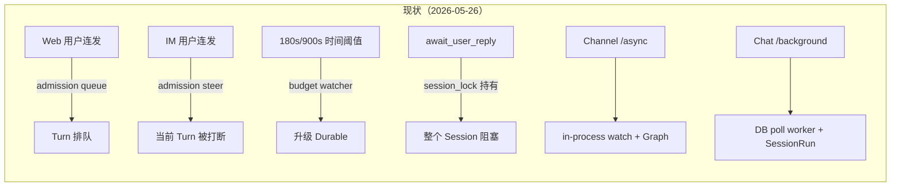
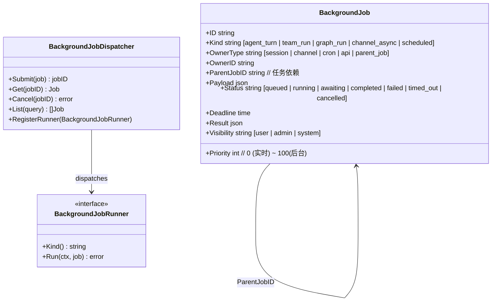
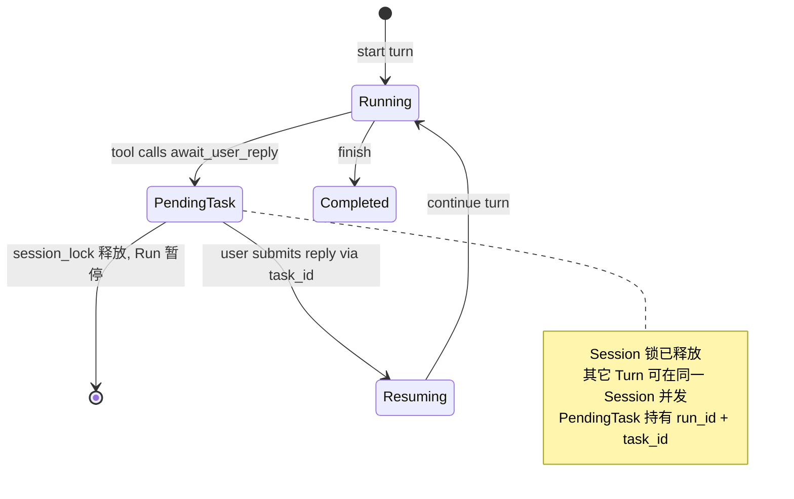
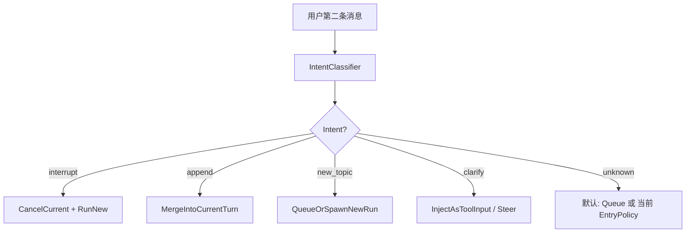
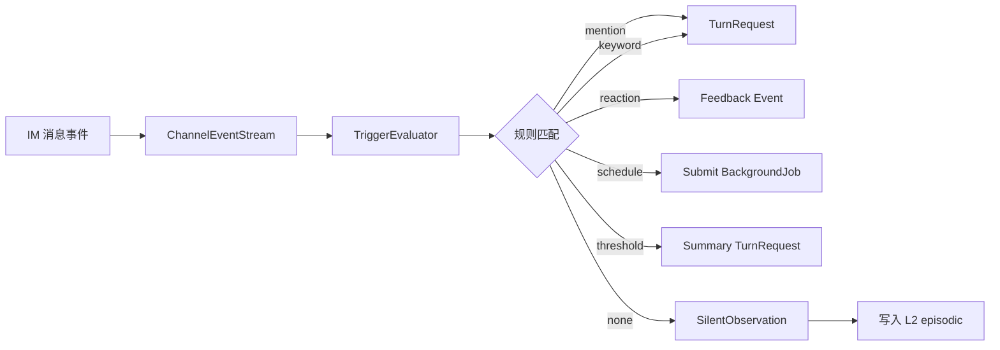
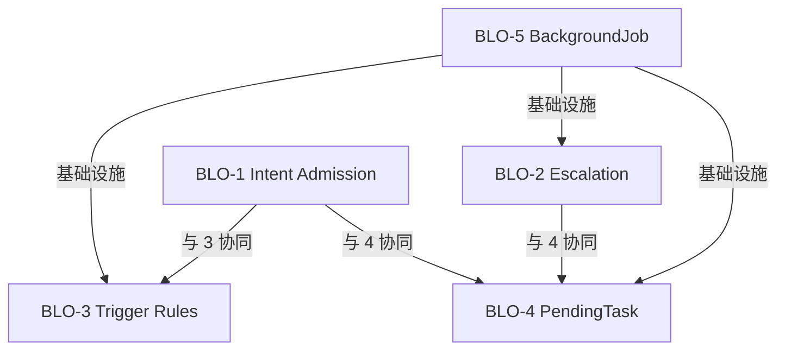
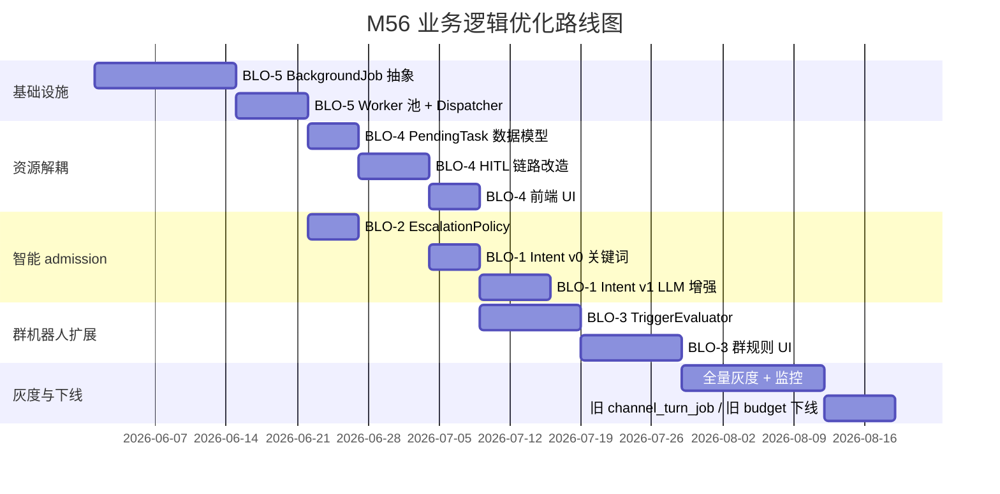

# M56 — 业务逻辑优化（Business Logic Optimization, BLO）

> **版本**：2026-05-26 · **状态**：📋 需求草案 · **优先级**：P0–P2
> **背景 Review**：[2026-05-26-Channel-Chat-AgentTeam-Flow-Review.md](../review/2026-05-26-Channel-Chat-AgentTeam-Flow-Review.md)
> **依赖**：M53 Team/Graph · M55 Chat × Channel Cursor 对标
> **影响范围**：`internal/biz/{chat,session,channel,turn,backgroundjob}` · `internal/service` · `internal/runtime` · `internal/team` · `web/src/features/chat`
> **红线**：依赖倒置不动 · `biz` 不 import `pkg/trpc-agent-go` · Runner 装配仍在 `service` + Wire

---

## 1. 模块定位

M56 不是一次代码重构，而是对 **Channel → Chat → Agent/Team** 主链路的 **5 个业务模型缺陷** 的纠偏：

| 主题 | 业务问题 | 期望业务价值 |
|------|----------|--------------|
| **BLO-1 Intent-Aware Admission** | 用户连发消息时，Web 排队 / Channel 中断，**跨端体验不一致** | 同一 Session 在不同入口下表现一致；为「打断 / 补充 / 新话题 / 澄清」四种语义提供差异化响应 |
| **BLO-2 Multi-Signal Escalation** | SessionRun 升级到 Durable **只看时间**，忽略 token、tool、graph 等真实复杂度信号 | 长任务用户主动声明 + 系统按复杂度自动升级；不再"短任务被冤枉" |
| **BLO-3 Channel Trigger Rules** | 群机器人 **只能"被 @"才工作**，无法实现日报 / 关键词 / Reaction / 静默观察 | 把 Channel 入口从"消息→Turn"升级为"事件流→触发器"，覆盖企业群机器人主流场景 |
| **BLO-4 Non-Blocking HITL (PendingTask)** | `await_user_reply` 状态下整个 Session 被锁，**用户不能在等待期间做别的事** | HITL 异步化为 PendingTask，Session 期间可继续处理无关 Turn |
| **BLO-5 Unified BackgroundJob** | 两套异步系统：Channel `/async` Graph + Chat SessionRun durable，**Jobs 表 / Worker / 面板三处分裂** | 统一 BackgroundJob 抽象，支持任务依赖、优先级调度、跨入口可见性 |

**核心定位**：M56 是 **Multi-Agent 平台从"会话工具"走向"任务平台"的转折点**。BLO-5 是基础设施，BLO-1/2/4 在其上做语义升级，BLO-3 在其上扩展产品形态。

---

## 2. 现状评估

### 2.1 主链路现状



| 业务能力 | 现状 | 缺陷 |
|----------|------|------|
| 跨入口 admission 策略 | ❌ 入口分类硬编码 | Web 与 IM 行为不一致；intent 雏形在 `internal/agent/intent` 但未上提到 admission |
| Run 升级信号 | ⚠️ 仅时间 | `session_run_budget.go` 单一维度 |
| 群机器人触发模式 | ⚠️ 仅 `@mention` + `allowlist` | `channel_access.go` 二选一，无 schedule / keyword / reaction |
| HITL 占用 Session | ❌ 锁全程 | `session_lock` 持有期等于 turn 全程 |
| 异步任务统一抽象 | ❌ 双轨 | `channel_turn_job` + `session_run`（durable） |

### 2.2 用户故事级痛点

| 角色 | 故事 | 痛点 |
|------|------|------|
| 飞书群用户 | "刚才那条算了，我想问 X" | 第二条直接打断 LLM，丢失推理 |
| Web 用户 | "我要 Agent 跑半小时深度研究" | 必须时间满 900s 才升 durable，期间网页关掉就丢 |
| 产品经理 | "群里每天 18 点出日报" | 现在只能挂 Cron，无法跨群灵活配置 |
| 运营 | "bot 问'要 A 还是 B'，我下班了想想看" | 期间用户在群里问别的，Session 全部被拒 |
| 运维 | "现在系统里跑了多少后台任务" | 要查 Chat Jobs + Channel Jobs 两处 |

### 2.3 已有可复用资产

- `internal/agent/intent`：intent pass 基础设施（已用于 turn 内分发）
- `biz/session_run.go`：phase 状态机（interactive/escalating/durable）
- `biz/channel_turn_job.go`：Channel 异步 job 模型
- `biz/turn_gateway.go`：窄端口已建立
- `internal/runtime/run_registry.go`：进程内 Run 状态注册
- `pkg/safego`：goroutine 包装

---

## 3. 目标与非目标

### 3.1 目标

1. **跨入口一致性**：BLO-1 让"用户连发"在 Web / Channel / API 表现一致。
2. **复杂度感知**：BLO-2 让 Run 升级反映"任务实际成本"而非"流逝时间"。
3. **群场景扩展**：BLO-3 让 Channel 从"被 @ 才说话"升级为"事件驱动的群智能体"。
4. **资源解锁**：BLO-4 让 HITL 不再独占 Session。
5. **任务统一**：BLO-5 让所有后台任务可见、可调度、可编排。

### 3.2 非目标

- ❌ **不**重写 trpc-agent-go 框架；所有改动在 `internal/biz` + `internal/service` + `internal/runtime`。
- ❌ **不**改造已交付的 Memory L0-L4 写入路径（与 M56 正交）。
- ❌ **不**重做前端 TurnBlock；前端仅适配新事件类型与 Job 视图。
- ❌ **不**引入新外部依赖（Redis / Kafka 等）；继续基于 SQLite/PG + 进程内 worker。

---

## 4. 总体设计（5 主题概览）

### 4.1 BLO-5（基础设施）—— **必须先做**



**端口（biz 层）**：

```go
// internal/biz/backgroundjob/job.go (新)
type BackgroundJob struct { /* 见上 */ }

type BackgroundJobRepo interface {
    Insert(ctx, BackgroundJob) error
    Update(ctx, BackgroundJob) error
    Get(ctx, id string) (BackgroundJob, error)
    List(ctx, query JobQuery) ([]BackgroundJob, error)
    TryClaim(ctx, kinds []string, limit int) ([]BackgroundJob, error) // 原子认领
}

type BackgroundJobRunner interface {
    Kind() string
    Run(ctx context.Context, job BackgroundJob) (result []byte, err error)
}

type BackgroundJobDispatcher interface {
    Submit(ctx context.Context, spec JobSpec) (string, error)
    Cancel(ctx context.Context, jobID, reason string) error
    Get(ctx context.Context, jobID string) (BackgroundJob, error)
    Subscribe(filter JobFilter) <-chan JobEvent
}
```

**迁移策略**：
1. 引入新表 `background_job`（DB schema 见 §6.1）。
2. `channel_turn_job` 与 `session_run.durable` 改为 **写入新表的 view**；旧表保留只读以保证回滚。
3. 现有 `SessionRunDurableWorker` 改造为 `BackgroundJobWorker` 的一个 runner 注册。
4. Channel `/async` 旧 watch 改为 Submit 到 Dispatcher。

### 4.2 BLO-4 —— PendingTask 解耦 HITL



**新数据模型**：

```go
// internal/biz/session/pending_task.go (新)
type PendingTask struct {
    ID         string
    RunID      string   // 关联 Run
    SessionID  string
    Kind       string   // "await_user_reply" | "tool_confirm" | "approval"
    PromptText string
    OptionsJSON string  // 卡片选项 / 期望回复 schema
    CreatedAt  time.Time
    Deadline   time.Time
    Status     string   // pending | answered | timed_out | cancelled
    AnswerJSON string
}
```

**关键变化**：
- `await_user_reply` 不再阻塞 Run 的 goroutine；持久化 PendingTask 后 **Runner 释放 session_lock 退出**。
- 用户 IM 回复或 Web 按钮通过 `task_id` 路由到 `PendingTaskUsecase.Answer(task_id, payload)`。
- Answer 后通过 BLO-5 BackgroundJob 重新拉起 Run（`Kind=agent_turn_resume`）。
- IM 卡片渲染时把 `task_id` 写入卡片回调，前端按钮把 `task_id` 写入 `await_reply` 请求。

### 4.3 BLO-1 —— Intent-Aware Admission



**端口**：

```go
// internal/biz/turn_intent.go (新)
type TurnIntent string
const (
    TurnIntentInterrupt TurnIntent = "interrupt"
    TurnIntentAppend    TurnIntent = "append"
    TurnIntentNewTopic  TurnIntent = "new_topic"
    TurnIntentClarify   TurnIntent = "clarify"
    TurnIntentUnknown   TurnIntent = "unknown"
)

type TurnIntentClassifier interface {
    Classify(ctx context.Context, in IntentInput) (TurnIntent, float32, error)
}

type IntentInput struct {
    PrevTurnSummary string  // 当前正在跑的 Turn 摘要
    NewContent      string
    Locale          string
    SessionID       string
}
```

**实现**：
- 默认 v0：**关键词 + 模式匹配**（"等等" / "算了" / "停" / "对了" / "还有" / "再问个"）+ heuristic（短文本+中断词、问号、新主题词云）
- v1：**轻量 LLM 调用**（gpt-4o-mini / hunyuan-lite，可禁用）+ 缓存
- 入口侧：`admission_gate` 在策略评估前调用 classifier；intent 传入 ingress_policy 决策表

### 4.4 BLO-2 —— Multi-Signal Escalation

```go
// internal/biz/session_run_escalation.go (新)
type EscalationSignal struct {
    ElapsedSec    int
    ToolCallCount int
    TokensSoFar   int
    EnteredGraph  bool
    NestedAgents  int
    UserDeclared  bool
}

type EscalationDecision struct {
    TargetPhase string   // interactive | escalating | durable | abort
    Reason      string
    Confidence  float32
}

type EscalationPolicy interface {
    Decide(ctx context.Context, sess Session, run SessionRun, sig EscalationSignal) EscalationDecision
}
```

**默认 Policy**：

| 信号 | 阈值 | 决策 |
|------|------|------|
| `UserDeclared=true` | — | → `durable` 立即 |
| `EnteredGraph=true` | — | → `durable` |
| `ToolCallCount` | > 3 | → `escalating` |
| `ToolCallCount` | > 8 | → `durable` |
| `TokensSoFar` | > 50,000 | → `durable` |
| `NestedAgents` | > 1 | → `escalating`（提示用户） |
| `ElapsedSec` | > 180 | → `escalating` |
| `ElapsedSec` | > 900 | → `durable`（兜底） |
| 异常 token/sec | < 10 持续 60s | → `abort` 候选 |

**通知带理由**：升级通知（IM 卡片 / WS）附 `Reason` 字段，前端展示"为什么转后台"。

### 4.5 BLO-3 —— Channel Trigger Rules



**数据模型**：

```go
// internal/biz/channel_trigger.go (新)
type ChannelTrigger struct {
    ID         string
    ChannelID  string
    Kind       string  // mention | keyword | reaction | schedule | threshold | silent
    ConfigJSON string  // 各 Kind 特定配置
    Enabled    bool
    Priority   int
    CreatedAt  time.Time
}

type ChannelObservation struct {  // 静默记录的事件
    ID         string
    ChannelID  string
    PeerKey    string
    MessageRef string
    Content    string
    Metadata   json.RawMessage
    CreatedAt  time.Time
    RetainUntil time.Time
}

type TriggerEvaluator interface {
    Evaluate(ctx context.Context, ev InboundEvent, channelCfg ChannelConfig) ([]TriggerOutcome, error)
}

type TriggerOutcome struct {
    Action     string  // "turn_request" | "silent_observe" | "submit_job" | "emit_feedback"
    TriggerID  string
    Payload    json.RawMessage
}
```

**默认规则集**：
1. `mention`：保留现有 `@bot` 行为（默认启用，回退保护）
2. `keyword`：群里包含「日报」「OKR」等关键词触发对应 Agent
3. `schedule`：Cron 表达式 + 触发模板（如"每日 18 点总结今日讨论"）
4. `reaction`：用户对 bot 回复加 👍/👎 → evaluation feedback
5. `threshold`：累计 N 条无 @bot 消息后触发"是否需要我总结"
6. `silent`：所有非触发消息写入 `channel_observation`，TTL 7 天，供 L2 记忆召回

### 4.6 互相关系



**实施顺序**：BLO-5 → (BLO-4 || BLO-2) → BLO-1 → BLO-3

---

## 5. 兼容性与迁移

### 5.1 红线保持

| 红线 | 维持方式 |
|------|----------|
| `biz` 不 import `pkg/trpc-agent-go` | 所有新端口在 biz 定义；intent classifier / job runner 实现注入到 service |
| Runner 装配在 service + Wire | BackgroundJobDispatcher 在 `internal/runtime/backgroundjob/` 实现，service 装配 |
| 不改 OpenAPI 不向后兼容 | 新增字段全部 optional；旧字段语义不变 |

### 5.2 灰度策略

- 每个 BLO 主题有独立 feature flag：`BLO_INTENT_ENABLED` / `BLO_ESCALATION_V2` / `BLO_TRIGGER_RULES` / `BLO_PENDING_TASK_V2` / `BLO_UNIFIED_JOB`
- 默认 **关闭**，逐 sprint 灰度开启
- DB schema 用 additive migration：新表/新列，不删旧表
- 旧 `session_run` / `channel_turn_job` 在 BLO-5 启用后变为 view-only 读取

### 5.3 回滚

- 任意 BLO 主题关闭 feature flag 即回到现状路径
- DB 数据保留（双写期间）

---

## 6. 数据模型变更

### 6.1 BLO-5 新表 `background_job`

```sql
CREATE TABLE background_job (
    id              TEXT PRIMARY KEY,
    kind            TEXT NOT NULL,
    owner_type      TEXT NOT NULL,
    owner_id        TEXT NOT NULL,
    parent_job_id   TEXT,
    payload_json    TEXT NOT NULL,
    status          TEXT NOT NULL,
    priority        INTEGER NOT NULL DEFAULT 50,
    deadline        DATETIME,
    result_json     TEXT,
    visibility      TEXT NOT NULL DEFAULT 'user',
    error_code      TEXT,
    error_message   TEXT,
    started_at      DATETIME,
    finished_at     DATETIME,
    created_at      DATETIME NOT NULL,
    updated_at      DATETIME NOT NULL
);
CREATE INDEX idx_bgjob_status_priority ON background_job(status, priority, created_at);
CREATE INDEX idx_bgjob_owner ON background_job(owner_type, owner_id);
CREATE INDEX idx_bgjob_parent ON background_job(parent_job_id);
```

### 6.2 BLO-4 新表 `pending_task`

```sql
CREATE TABLE pending_task (
    id            TEXT PRIMARY KEY,
    run_id        TEXT NOT NULL,
    session_id    TEXT NOT NULL,
    kind          TEXT NOT NULL,
    prompt_text   TEXT NOT NULL,
    options_json  TEXT,
    status        TEXT NOT NULL,
    answer_json   TEXT,
    deadline      DATETIME,
    created_at    DATETIME NOT NULL,
    answered_at   DATETIME,
    UNIQUE(run_id, kind)
);
CREATE INDEX idx_pending_task_session ON pending_task(session_id, status);
```

### 6.3 BLO-3 新表 `channel_trigger` / `channel_observation`

```sql
CREATE TABLE channel_trigger (
    id           TEXT PRIMARY KEY,
    channel_id   TEXT NOT NULL,
    kind         TEXT NOT NULL,
    config_json  TEXT NOT NULL,
    enabled      INTEGER NOT NULL DEFAULT 1,
    priority     INTEGER NOT NULL DEFAULT 50,
    created_at   DATETIME NOT NULL,
    updated_at   DATETIME NOT NULL
);
CREATE INDEX idx_channel_trigger_channel ON channel_trigger(channel_id, enabled);

CREATE TABLE channel_observation (
    id           TEXT PRIMARY KEY,
    channel_id   TEXT NOT NULL,
    peer_key     TEXT NOT NULL,
    message_ref  TEXT,
    content      TEXT,
    metadata     TEXT,
    created_at   DATETIME NOT NULL,
    retain_until DATETIME NOT NULL
);
CREATE INDEX idx_channel_obs_channel_time ON channel_observation(channel_id, created_at);
CREATE INDEX idx_channel_obs_retain ON channel_observation(retain_until);
```

### 6.4 BLO-2 字段补充 `session_run`

```sql
ALTER TABLE session_run ADD COLUMN escalation_reason TEXT;
ALTER TABLE session_run ADD COLUMN escalation_signals_json TEXT;  -- 决策快照
```

---

## 7. API 与事件变更

### 7.1 Proto 新增

```proto
// api/kratos/chat/v1/chat.proto 增量
message PendingTask {
  string id = 1;
  string run_id = 2;
  string session_id = 3;
  string kind = 4;
  string prompt_text = 5;
  string options_json = 6;
  string deadline = 7;
  string status = 8;
}

message AnswerPendingTaskRequest {
  string task_id = 1;
  string answer_json = 2;
}

rpc ListPendingTasks(...) returns (...);
rpc AnswerPendingTask(...) returns (...);
```

```proto
// api/kratos/backgroundjob/v1/backgroundjob.proto (新)
service BackgroundJobService {
  rpc SubmitJob(SubmitJobRequest) returns (Job);
  rpc GetJob(GetJobRequest) returns (Job);
  rpc CancelJob(CancelJobRequest) returns (google.protobuf.Empty);
  rpc ListJobs(ListJobsRequest) returns (ListJobsResponse);
}

message Job {
  string id = 1;
  string kind = 2;
  string owner_type = 3;
  string owner_id = 4;
  string parent_job_id = 5;
  string status = 6;
  int32 priority = 7;
  string deadline = 8;
  string visibility = 9;
  string result_json = 10;
  string error_code = 11;
  string error_message = 12;
}
```

### 7.2 WS Envelope 新增

| 事件 | 用途 |
|------|------|
| `pending_task_created` | HITL 等待回复 |
| `pending_task_answered` | 用户回复完成，Run 重新拉起 |
| `escalation_decision` | 携带 reason 的升级通知 |
| `job_status_changed` | BackgroundJob 状态变更（统一替代 `channel_turn_job_changed`） |
| `intent_classified` | （可选 / debug）admission 时的 intent 标签 |

---

## 8. 业务规则汇总

### 8.1 BLO-1 Intent 规则

| Intent | 触发条件示例 | 默认动作 |
|--------|--------------|----------|
| interrupt | "停"/"算了"/"取消"/包含"错了" | CancelCurrent + RunNew |
| append | "还有"/"对了"/"再补充" + 短文本（< 50 char） | MergeIntoCurrentTurn（追加 user_extra） |
| new_topic | 新关键词 + 与前 turn 主题语义距离大 | QueueOrSpawnNewRun |
| clarify | 问号 + 主语指向当前回答（"你说的 X 是？"） | InjectAsToolInput |
| unknown | classifier 置信度 < 0.6 | 回退到原 ingress_policy |

### 8.2 BLO-2 升级规则

见 §4.4 默认 Policy 表。**用户主动 `/background` 立即升 durable** 是不可绕过的最高优先级。

### 8.3 BLO-3 群机器人语义

- 默认所有 Channel 创建时插入 `kind=mention` 规则（保护现有行为）
- `kind=silent` 规则启用后 **每条消息** 都写 `channel_observation`，**不**触发 Turn
- `kind=schedule` 规则的 cron 命中后通过 BLO-5 提交 BackgroundJob（不立即同步触发）
- `kind=reaction` 收到表情回复后写入 `evaluation_feedback`（接 M33 evaluation）

### 8.4 BLO-4 PendingTask 规则

- PendingTask 创建后 **session_lock 必须释放**
- 同一 Run 不允许并存多个相同 kind 的 PendingTask（UNIQUE 约束）
- PendingTask `Deadline` 超时后 Run 自动标记 `failed`，并向用户发送 IM 通知
- 用户回复时若 PendingTask 已超时 → 返回 410 Gone + 提示用户重新发起

### 8.5 BLO-5 BackgroundJob 规则

- `priority < 50` 视为实时（用户感知路径），由独立高优先级 worker 池处理
- `priority >= 50` 后台任务，统一池
- `ParentJobID` 形成 DAG，子 Job 在父 Job 完成且 `status=completed` 后才执行
- `Cancel(jobID)` 级联取消所有未启动的子 Job

---

## 9. 影响范围与风险

### 9.1 模块影响矩阵

| 模块 | BLO-1 | BLO-2 | BLO-3 | BLO-4 | BLO-5 |
|------|:-----:|:-----:|:-----:|:-----:|:-----:|
| `biz/chat_usecase.go` | ✏️ | ✏️ | | ✏️ | ✏️ |
| `biz/session_run.go` | | ✏️✏️ | | ✏️ | ✏️ |
| `biz/channel*.go` | ✏️ | | ✏️✏️ | | ✏️ |
| `biz/turn_*.go` | ✏️ | ✏️ | | ✏️ | ✏️ |
| `biz/backgroundjob/`（新） | | | | ✏️ | ✏️✏️ |
| `biz/session/pending_task.go`（新） | | | | ✏️✏️ | |
| `biz/channel_trigger.go`（新） | | | ✏️✏️ | | |
| `service/chat_orchestrator*.go` | ✏️ | ✏️ | | ✏️ | ✏️ |
| `service/channel_ingress*.go` | ✏️ | | ✏️ | ✏️ | ✏️ |
| `service/session_run_durable_worker.go` | | ✏️ | | | ✏️✏️（替换） |
| `runtime/run_registry.go` | | | | ✏️ | |
| `runtime/backgroundjob/`（新） | | | | | ✏️✏️ |
| `web/features/chat/` | ✏️（intent tag） | ✏️（reason 展示） | | ✏️✏️（pending task UI） | ✏️（jobs 面板） |
| Proto / OpenAPI | ✏️ | ✏️ | ✏️ | ✏️ | ✏️✏️ |
| DB schema | | ✏️ | ✏️✏️ | ✏️✏️ | ✏️✏️ |

（✏️ = 修改 · ✏️✏️ = 新增/重写）

### 9.2 风险

| 风险 | 概率 | 影响 | 缓解 |
|------|------|------|------|
| BLO-5 双写期间数据不一致 | 中 | 高 | 写新表为主，旧表作为只读快照；2 sprint 后下线旧写 |
| BLO-1 classifier 误判 | 中 | 中 | 置信度 < 0.6 回退原策略；可一键关 flag |
| BLO-4 PendingTask 超时未通知 | 低 | 中 | 单独 sweeper + dead-letter |
| BLO-3 群消息存储合规 | 中 | 高 | `channel_observation` 默认 TTL 7 天；UI 提示用户群内有"静默观察"机器人 |
| BLO-2 业务规则引起回归 | 中 | 中 | 灰度 + 与现有 budget watcher 并行运行 30 天 |

---

## 10. 验收标准

### 10.1 业务级

| BLO | 验收 |
|-----|------|
| BLO-1 | 飞书群内连发 3 条 `"等等"/"对了 X"/"我再问 Y"` 分别得到 interrupt/append/new_topic 三种处理；Web 同样输入得到一致体验 |
| BLO-2 | 触发 `tool_calls > 8` 的任务自动升 durable 且 IM 卡片显示理由；用户 `/background` 立即升 durable |
| BLO-3 | 群里配置 cron `0 18 * * *`，到点自动发送日报；某条消息 reaction 后写入 evaluation |
| BLO-4 | `await_user_reply` 等待期间，同 Session 用户问"现在几点"得到正常回复 |
| BLO-5 | `GET /v1/background-jobs?owner_type=session` 与 `?owner_type=channel` 返回统一 schema；某 Job 取消后子 Job 自动取消 |

### 10.2 工程级

- 所有 BLO 主题灰度 flag 可单独开关；关闭后行为与现状一致
- `make ci` 全绿 · `make runtime-boundary` 红线检查通过
- 新增端到端测试：`go test ./internal/service/... -run 'BLO_'` 与 `go test ./internal/biz/backgroundjob/... -run 'Dispatcher|Repo'`
- Datadog 看板：BackgroundJob P95 / PendingTask 超时率 / Intent classifier 召回率 / Escalation 决策分布

---

## 11. 时间表（初稿）



总周期：**约 12 周**（3 个月，1 季度）。

---

## 12. 参考

- [代码 Review (2026-05-26)](../review/2026-05-26-Channel-Chat-AgentTeam-Flow-Review.md)
- [M55 Chat × Channel Cursor 对标](./55-chat-channel-cursor-solution.md)
- [Channel Phase E 长任务](./17-channel-development.md#10-长任务异步执行phase-e)
- [Run Lifecycle Review](../review/2026-05-23-M55-Run-Lifecycle-Review.md)
- [framework boundary](../../docs/AGENT_RUNTIME_BOUNDARY.md)

---

**附**：详细任务分解 / 任务 ID / 验收门禁见同目录 [56-business-logic-optimization-development.md](./56-business-logic-optimization-development.md)。
