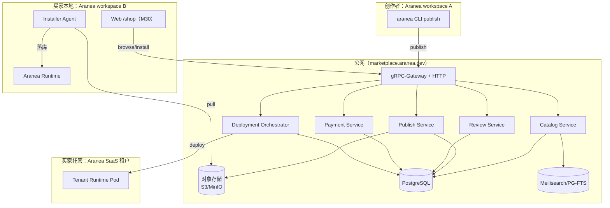
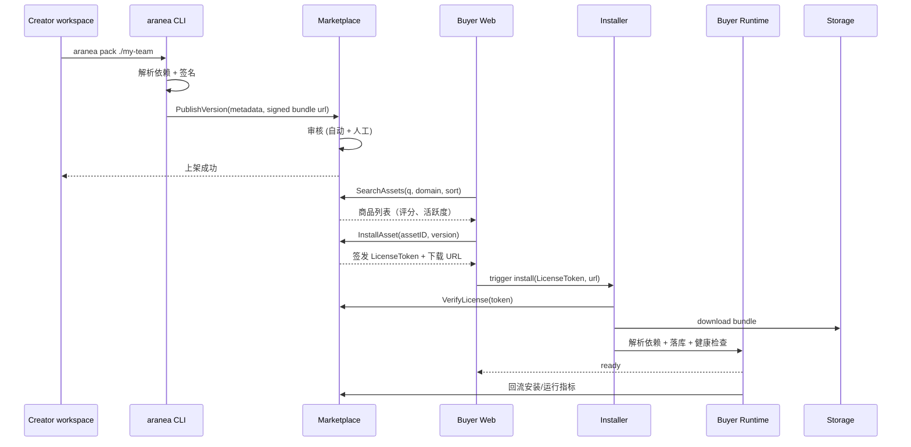
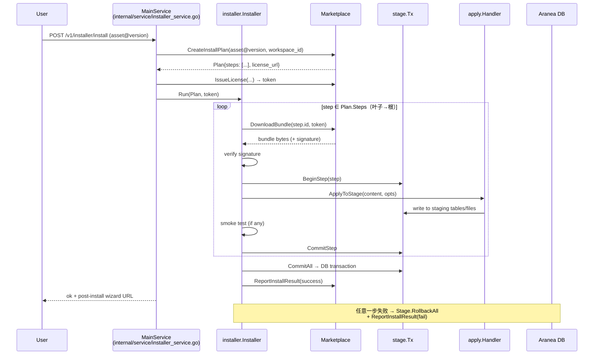
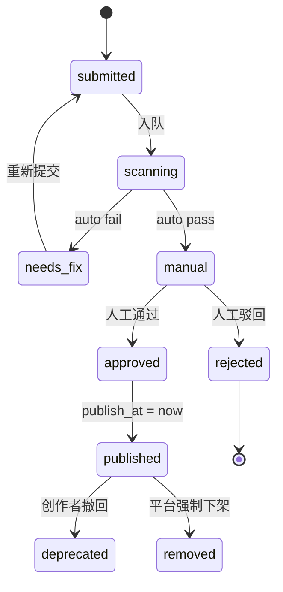

# M57 — 公网商城平台（Marketplace Platform）实现设计（SUPERSEDED）

> **⚠️ SUPERSEDED（归档 · 禁止开工）**
>
> **不要实现本模块。** 本文档是历史设计草案，不是待办。下列路径 **均不存在、禁止创建**：`api/marketplace/v1/*.proto`、`cmd/marketplace/`、`internal/marketplace/*`、`internal/installer/`、`pkg/aranea-asset/`、`web/marketplace/`、`web/src/features/marketplace/`。
>
> 站内资产发现与安装走 **Ecosystem (M30)**：[`30-ecosystem.md`](./30-ecosystem.md)。本设计与 M30 易混，禁止按本文新建独立商城服务。
>
> 权威说明：[`65-module-cross-reference-full.md`](./65-module-cross-reference-full.md) 编号表与 §1.40。同系列：[需求](./57-marketplace-platform.md) · [开发计划](./57-marketplace-platform.development.md)。文件保留以免断链。

> 对应需求：[57-marketplace-platform.md](./57-marketplace-platform.md)
> 遵循规范：[AI-DEVELOPMENT-SPECIFICATION.md](../guides/AI-DEVELOPMENT-SPECIFICATION.md) · [project_rules.md](../../.trae/rules/project_rules.md)
> 版本：2026-05-26 · 状态：📦 已归档 / SUPERSEDED（原「📋 设计草案」作废）

> **实现状态说明（归档）**：截至 2026-08-15，上列规划路径仍 **不存在**。现有 M30 Ecosystem（`api/kratos/ecosystem/v1/ecosystem.proto`、`internal/biz/ecosystem/`、`internal/data/ecosystem.go`、`internal/service/ecosystem.go`、`web/src/pages/EcosystemPage.vue`）是现网能力；**不要**把 M30 升级成 M57 公网商城。

---

## 一、模块全景与代码骨架

### 1.1 仓库分布（历史规划 · 下列路径均不存在 · 禁止创建）

| 位置 | 内容 |
|------|------|
| `api/marketplace/v1/*.proto` | 商城对外 gRPC + HTTP（gRPC-Gateway）schema |
| `cmd/marketplace/` | 商城独立服务 main + Wire |
| `internal/marketplace/{biz,service,server,data}` | 商城后端（Kratos 分层） |
| `internal/marketplace/orchestrator/` | 托管租户编排器（K8s/Nomad） |
| `pkg/aranea-asset/` | **Asset Schema 共享包**，主项目与商城均依赖 |
| `pkg/aranea-asset/manifest` | manifest.json 解析与校验 |
| `pkg/aranea-asset/pack` | 打包 / 解包 / 签名 / 校验 |
| `internal/installer/` | **买家侧** Installer 模块（在 Aranea 主项目） |
| `cmd/aranea` 新子命令 | `aranea pack`、`aranea publish`、`aranea install` |
| `web/marketplace/` | 公网商城 Web 客户端（独立构建产物） |
| `web/src/features/marketplace/` | 主项目内 `/shop` 客户端（M30 继承） |

> **现状对照**：现有 `cmd/aranea/main.go` 已注册 `cmdpkg.NewPackCmd()`（Pack 命令），但未注册 `publish` / `install` 子命令。现有 `internal/pkginstall/installer.go` 是另一用途的安装器（通过 HTTP API 安装 aranea 包），与本文档规划的 `internal/installer/`（商城客户端）不同。

### 1.2 依赖红线（CI 守护）

```
internal/marketplace/* ──┐
                          ├──► NOT import pkg/trpc-agent-go
cmd/marketplace ─────────┘

internal/installer/* ──► api/marketplace/v1 (gRPC client) + pkg/aranea-asset
                       └► NOT import internal/marketplace/* (商城内部包)

internal/biz/* (主项目) ──► NOT import internal/installer/* (installer 走 service 层)
```

新增 `make marketplace-boundary` 检查脚本（仿 `make runtime-boundary`）。

### 1.3 系统全景



### 1.4 数据流主路径



### 1.5 服务边界

| 服务 | 部署位置 | 技术栈 | 备注 |
|------|----------|--------|------|
| Marketplace Backend | 公网 SaaS | Go + Kratos v2 + Wire（与 Aranea 同栈） | 独立仓库或 monorepo `cmd/marketplace` |
| Web Marketplace | 公网 SaaS | Vue 3 + Quasar（复用前端栈）| `web/marketplace/` 独立构建 |
| Object Storage | 公网 SaaS | S3 兼容（MinIO 自建或云） | bundle 与截图 |
| Search | 公网 SaaS | Meilisearch（v1） / Elastic（v2） | 商品索引 |
| Payment Gateway | 第三方 | Stripe / 支付宝 / 微信 | webhook 回调 |
| **Installer SDK** | 买家侧 | Go 库 + CLI | 编入 Aranea 主项目 `internal/installer` |
| **Tenant Orchestrator** | 公网 SaaS | K8s Operator | 仅托管场景 |

### 1.6 与主项目的依赖关系（红线）

- 主项目 → 新增 `internal/installer/`，**只依赖商城对外的 gRPC schema**（`api/marketplace/v1/*.proto`），不依赖任何商城内部包
- 商城后端 → **不依赖** `pkg/trpc-agent-go`（商城不运行 Agent）
- `internal/biz`（主项目）不 import installer 业务包，installer 走 `service` + Wire
- Asset Schema 由商城定义，主项目通过 proto + 共享 schema 包 `pkg/aranea-asset` 引入

---

## 二、Asset Schema（MKT-1）

### 2.1 Manifest 顶层（`pkg/aranea-asset/manifest`）

```go
package manifest

type Manifest struct {
    SchemaVersion string         `json:"schema_version"` // "1"
    ID            string         `json:"id"`             // e.g. "team.codereview-pr"
    Version       string         `json:"version"`        // SemVer
    Type          AssetType      `json:"type"`
    Name          string         `json:"name"`
    Description   string         `json:"description"`
    Author        AuthorMeta     `json:"author"`
    Categories    []string       `json:"categories"`   // 三级分类路径 "研发/编程/代码审查"
    Tags          []TagPair      `json:"tags"`
    Compatibility string         `json:"compatibility"` // 如 "aranea>=1.5"
    Deps          []DepRef       `json:"deps"`
    Permissions   []Permission   `json:"permissions"`
    EntryPoint    EntryPoint     `json:"entry_point"`
    Signature     Signature      `json:"signature"`
    PriceModel    PriceModel     `json:"price_model"`
}

type AssetType string

const (
    AssetSkill          AssetType = "skill"
    AssetMCPServer      AssetType = "mcp_server"
    AssetTool           AssetType = "tool"
    AssetPlugin         AssetType = "plugin"
    AssetAgent          AssetType = "agent"
    AssetTeam           AssetType = "team"
    AssetChannel        AssetType = "channel_template"
    AssetKnowledgePack  AssetType = "knowledge_pack"
    AssetWorkflow       AssetType = "workflow"
    AssetCompanyBundle  AssetType = "company_bundle"
)

type DepRef struct {
    ID      string    `json:"id"`     // 如 "skill.diff-summarize"
    Range   string    `json:"range"`  // SemVer range "^1.0"
    Kind    AssetType `json:"kind"`
}

type Permission struct {
    Kind  string `json:"kind"`  // "model" | "tool" | "credential" | "network" | "fs"
    Value string `json:"value"`
    Note  string `json:"note,omitempty"`
}

type EntryPoint struct {
    // Type-specific：skill 指向 SKILL.md；team 指向 team.yaml；company_bundle 指向 company.yaml
    Path string `json:"path"`
}

type Signature struct {
    Algorithm string `json:"algorithm"` // "ed25519"
    PublicKey string `json:"public_key"`
    Value     string `json:"value"`     // base64
}
```

### 2.2 Bundle 物理布局

```
my-team-v1.4.2.aranea/         # zip + signature
├── manifest.json
├── manifest.sig                # detached ed25519 over manifest.json + content hash
├── README.md
├── CHANGELOG.md
├── LICENSE
├── icon.png
├── screenshots/*.png
├── deps.lock                   # 锁定的依赖快照
├── permissions.json            # 与 manifest 一致的展开版
├── content/                    # type 决定结构
│   ├── skill/SKILL.md          # skill
│   ├── mcp/mcp.json            # mcp_server
│   ├── tool/tool.yaml          # tool
│   ├── agent/agent.yaml + prompts/   # agent
│   ├── team/team.yaml + graph.yaml   # team
│   └── company/{agents,teams,skills,channels,knowledge,...}/  # company_bundle
└── tests/                      # 可选：smoke 测试
    └── smoke.sh
```

### 2.3 打包工具（`pkg/aranea-asset/pack`）

```go
type Packer struct {
    KeyStore signer.KeyStore
}

func (p *Packer) Pack(ctx context.Context, src string, opt PackOption) (Bundle, error)
func (p *Packer) Sign(ctx context.Context, b Bundle, keyID string) error
func (p *Packer) Verify(ctx context.Context, b Bundle) error
func (p *Packer) Unpack(ctx context.Context, b Bundle, dst string) error
```

CLI 暴露：

```
aranea pack ./my-team --out ./dist/
aranea pack verify ./dist/my-team-v1.4.2.aranea
aranea publish ./dist/my-team-v1.4.2.aranea
```

---

## 三、Proto 设计

> **现状对照（归档）**：现有 `api/kratos/ecosystem/v1/ecosystem.proto` 是 M30 现网实现。本节 `api/marketplace/v1/*.proto` **不存在、禁止创建**。

### 3.1 `api/marketplace/v1/catalog.proto`

```protobuf
service CatalogService {
  rpc SearchAssets(SearchAssetsRequest) returns (SearchAssetsResponse) {
    option (google.api.http) = { get: "/v1/marketplace/assets" };
  }
  rpc GetAsset(GetAssetRequest) returns (Asset) {
    option (google.api.http) = { get: "/v1/marketplace/assets/{id}" };
  }
  rpc GetAssetVersion(GetAssetVersionRequest) returns (AssetVersion) {
    option (google.api.http) = { get: "/v1/marketplace/assets/{id}/versions/{version}" };
  }
  rpc ListCategories(ListCategoriesRequest) returns (ListCategoriesResponse) {
    option (google.api.http) = { get: "/v1/marketplace/categories" };
  }
  rpc ListCreatorAssets(ListCreatorAssetsRequest) returns (ListCreatorAssetsResponse) {
    option (google.api.http) = { get: "/v1/marketplace/creators/{creator_id}/assets" };
  }
}
```

### 3.2 `api/marketplace/v1/publish.proto`

```protobuf
service PublishService {
  rpc CreateUploadURL(CreateUploadURLRequest) returns (CreateUploadURLResponse) {
    option (google.api.http) = { post: "/v1/marketplace/uploads", body: "*" };
  }
  rpc PublishVersion(PublishVersionRequest) returns (AssetVersion) {
    option (google.api.http) = { post: "/v1/marketplace/assets/{asset_id}/versions", body: "*" };
  }
  rpc DeprecateVersion(DeprecateVersionRequest) returns (google.protobuf.Empty);
  rpc GetReviewStatus(GetReviewStatusRequest) returns (ReviewStatus);
}
```

### 3.3 `api/marketplace/v1/install.proto`

```protobuf
service InstallService {
  rpc CreateInstallPlan(CreateInstallPlanRequest) returns (InstallPlan) {
    option (google.api.http) = { post: "/v1/marketplace/installs/plan", body: "*" };
  }
  rpc IssueLicense(IssueLicenseRequest) returns (License) {
    option (google.api.http) = { post: "/v1/marketplace/installs/license", body: "*" };
  }
  rpc DownloadBundle(DownloadBundleRequest) returns (DownloadBundleResponse);
  rpc ReportInstallResult(ReportInstallResultRequest) returns (google.protobuf.Empty);
  rpc ReportTelemetry(stream TelemetryEvent) returns (google.protobuf.Empty);
}
```

### 3.4 `api/marketplace/v1/social.proto`

```protobuf
service SocialService {
  rpc RateAsset(RateAssetRequest) returns (Rating);
  rpc ListRatings(ListRatingsRequest) returns (ListRatingsResponse);
  rpc PostReview(PostReviewRequest) returns (Review);
  rpc ListReviews(ListReviewsRequest) returns (ListReviewsResponse);
  rpc FlagContent(FlagContentRequest) returns (google.protobuf.Empty);
}
```

### 3.5 `api/marketplace/v1/payment.proto`

```protobuf
service PaymentService {
  rpc CreateOrder(CreateOrderRequest) returns (Order);
  rpc ConfirmOrder(ConfirmOrderRequest) returns (Order);  // 支付 webhook 校验回调
  rpc ListMyOrders(ListMyOrdersRequest) returns (ListMyOrdersResponse);
  rpc RequestRefund(RequestRefundRequest) returns (Refund);
}

service PayoutService {  // 创作者侧
  rpc ListPayouts(ListPayoutsRequest) returns (ListPayoutsResponse);
  rpc GetPayoutStatement(GetPayoutStatementRequest) returns (PayoutStatement);
}
```

### 3.6 `api/marketplace/v1/review.proto`（运营审核）

```protobuf
service ReviewerService {
  rpc ListPendingReviews(ListPendingReviewsRequest) returns (ListPendingReviewsResponse);
  rpc DecideReview(DecideReviewRequest) returns (ReviewDecision);
  rpc GetScanReport(GetScanReportRequest) returns (ScanReport);
}
```

---

## 四、Biz 层（商城后端 `internal/marketplace/biz`）

### 4.1 领域模型

```go
// internal/marketplace/biz/asset/asset.go
type Asset struct {
    ID         string
    Type       AssetType
    Name       string
    Slug       string
    AuthorID   string
    Categories []string  // 三级路径
    Tags       []TagPair
    DefaultPrice PriceModel
    Status     AssetStatus // "active" | "deprecated" | "removed"
    Stats      AssetStats
}

type AssetVersion struct {
    AssetID      string
    Version      string
    Manifest     manifest.Manifest
    BundleURL    string
    Signature    string
    ScanReport   ScanReportRef
    ReviewStatus ReviewStatus // "submitted" | "scanning" | "manual" | "approved" | "rejected"
    PublishedAt  *time.Time
}

type AssetStats struct {
    Rating       float64
    RatingCount  int64
    InstallCount int64
    Activity30d  float64
    Health7d     float64
}
```

### 4.2 Usecase 列表

| Usecase | 关键方法 |
|---------|----------|
| `CatalogUsecase` | `Search / Get / GetVersion / ListCategories / ListCreatorAssets` |
| `PublishUsecase` | `CreateUploadURL / PublishVersion / DeprecateVersion / GetReviewStatus` |
| `ReviewUsecase` | `RunAutoScan / EnqueueManual / Decide` |
| `InstallUsecase` | `CreateInstallPlan / IssueLicense / VerifyLicense / RecordInstallResult` |
| `SocialUsecase` | `Rate / Review / FlagContent / ComputeWeights` |
| `PaymentUsecase` | `CreateOrder / ConfirmOrder / RequestRefund / SettlePayout` |
| `TelemetryUsecase` | `IngestEvent / RollupDaily / RecomputeStats` |
| `OrchestratorUsecase` | `DeployToTenant / TerminateTenant / GetStatus`（仅托管场景） |

### 4.3 端口（Repo 接口，依赖倒置）

```go
type AssetRepo interface {
    Save(ctx, *Asset) error
    Get(ctx, id string) (*Asset, error)
    Search(ctx, SearchQuery) (SearchResult, error)
    UpdateStats(ctx, id string, stats AssetStats) error
}

type AssetVersionRepo interface { /* ... */ }
type ReviewRepo interface { /* ... */ }
type RatingRepo interface { /* ... */ }
type InstallRepo interface { /* ... */ }
type LicenseRepo interface { /* ... */ }
type OrderRepo interface { /* ... */ }
type TelemetryRepo interface { /* ... */ }

type ObjectStore interface {
    PutURL(ctx, key string, ttl time.Duration) (uploadURL string, finalURL string, err error)
    GetURL(ctx, key string, ttl time.Duration) (string, error)
    Stat(ctx, key string) (Meta, error)
}

type SearchIndex interface {
    UpsertAsset(ctx, *Asset) error
    Search(ctx, q string, filter Filter, sort Sort, page Page) (SearchResult, error)
    DeleteAsset(ctx, id string) error
}

type PaymentProvider interface {
    CreateCheckout(ctx, *Order) (CheckoutURL string, err error)
    ParseWebhook(ctx, headers, body []byte) (WebhookEvent, error)
    Refund(ctx, orderID string, amount int64) (RefundResult, error)
}
```

### 4.4 关键算法

#### Activity Score（30 天活跃度）

```go
// internal/marketplace/biz/social/activity.go
const (
    αInstall = 1.0
    βRunOK   = 0.5
    γActive  = 2.0
    δFail    = 1.5
)

func ComputeActivity30d(daily []TelemetryDaily) float64 {
    var score float64
    for _, d := range daily {
        score += αInstall*float64(d.InstallCount) +
                 βRunOK*math.Log1p(float64(d.RunSuccess)) +
                 γActive*float64(d.ActiveWorkspaces) -
                 δFail*math.Log1p(float64(d.RunFail))
    }
    if score < 0 { score = 0 }
    return score
}
```

#### 依赖解析（拓扑 + SemVer）

```go
// pkg/aranea-asset/resolve/resolver.go
type Resolver struct {
    Catalog CatalogClient // 远程查询商城
}

func (r *Resolver) Resolve(ctx, root manifest.Manifest) (Plan, error) {
    // 1. 广度遍历 deps → 收集所有需要的 (id, range)
    // 2. 为每个 id 调用 Catalog.GetVersions(id) → 候选集合
    // 3. 求满足所有 range 的最高版本（PubGrub 简化版）
    // 4. 拓扑排序 → 返回 InstallOrder
    // 5. 写入 deps.lock
}

type Plan struct {
    Steps []InstallStep   // 拓扑顺序：先叶子后根
    Lock  DepsLock
}
```

---

## 五、Data 层（PostgreSQL + Ent）

> **现状对照**：现有 M30 使用 SQLite + 原生 SQL（`internal/data/sql/ecosystem_product.sql`，表 `ecosystem_products` + `ecosystem_installs`），不在 Ent Schema 中。M57 商城后端强制 PG（多租户 + 全文检索 + 分区表）。

### 5.1 关键 Schema

`internal/marketplace/data/ent/schema/`：

| 文件 | 表 | 关键字段 / 索引 |
|------|------|-----------------|
| `mp_account.go` | mp_account | (email unique) (oauth_id unique) |
| `mp_workspace_binding.go` | mp_workspace_binding | (account_id, workspace_id unique) |
| `mp_asset.go` | mp_asset | (slug unique) (author_id) (status) |
| `mp_asset_version.go` | mp_asset_version | (asset_id, version unique) (review_status) (published_at) |
| `mp_category.go` | mp_category | (path unique) (level) |
| `mp_asset_category.go` | mp_asset_category | (asset_id, category_id) |
| `mp_tag.go` | mp_tag | (dim, value unique) |
| `mp_rating.go` | mp_rating | (asset_id, account_id unique) |
| `mp_review.go` | mp_review | (asset_id, parent_id) |
| `mp_install.go` | mp_install | (asset_id, workspace_id) (last_health_at) |
| `mp_telemetry_daily.go` | mp_telemetry_daily | (asset_id, day unique) |
| `mp_license.go` | mp_license | (asset_id, buyer_id) (expires_at) |
| `mp_order.go` | mp_order | (buyer_id, status) (created_at) |
| `mp_payout.go` | mp_payout | (creator_id, period unique) |
| `mp_report.go` | mp_report | (target_type, target_id) (status) |
| `mp_review_task.go` | mp_review_task | (asset_version_id) (reviewer_id, status) |
| `mp_scan_report.go` | mp_scan_report | (asset_version_id unique) |

> 主项目使用 SQLite/PG 二选一；**商城后端强制 PG**（多租户 + 全文检索 + 分区表）。

### 5.2 分区与归档

- `mp_telemetry_daily` 按月分区（24 个月滚动）
- `mp_install` 按季度分区
- `mp_review`、`mp_order` 长期保留，无分区

---

## 六、Service 层与服务装配

### 6.1 Service（薄壳）

`internal/marketplace/service/`：

- `catalog_service.go`、`publish_service.go`、`install_service.go`、`social_service.go`、`payment_service.go`、`reviewer_service.go`、`telemetry_service.go`

每个 Service：
- 入参：proto → biz Request
- 出参：biz Response → proto
- 仅做协议翻译，**不写业务**

### 6.2 Wire 装配（`cmd/marketplace/wire.go`）

```go
//go:build wireinject
package main

import (
    "github.com/google/wire"
    "aranea/internal/marketplace/biz"
    "aranea/internal/marketplace/data"
    "aranea/internal/marketplace/service"
    "aranea/internal/marketplace/server"
)

var ProviderSet = wire.NewSet(
    data.ProviderSet,
    biz.ProviderSet,
    service.ProviderSet,
    server.ProviderSet,
    newApp,
)
```

### 6.3 Server（`internal/marketplace/server/`）

- `grpc.go`：gRPC server + 中间件（auth / recovery / tracing / quota）
- `http.go`：gRPC-Gateway + REST，托管对象上传走预签名 URL（不经服务）
- `webhook.go`：支付回调入口（独立 path + IP 白名单）
- `cron.go`：每日活跃度滚动、每月对账与打款

---

## 七、买家侧 Installer（主项目 `internal/installer/`）

> **现状对照**：现有 `internal/pkginstall/installer.go` 是通过 HTTP API 安装 aranea 包的安装器（依赖顺序：MCP → Skills → Org → Agents → Teams → Graphs），与本文档规划的 `internal/installer/`（商城客户端，含签名校验、staging 事务、冒烟测试）不同。M57 上线后两者并存：`pkginstall` 用于组织导入，`installer` 用于商城资产安装。

### 7.1 模块结构

```
internal/installer/
├── installer.go           # 入口：Plan → 执行
├── client/
│   └── marketplace.go     # 调用 api/marketplace/v1 的 gRPC client
├── resolver/              # 依赖解析（v1 服务端解析，installer 仅校验）
├── unpack/                # 解包 + 签名校验
├── stage/                 # staging 区事务
├── apply/
│   ├── skill.go           # 落库 skill
│   ├── mcp.go
│   ├── tool.go
│   ├── agent.go
│   ├── team.go
│   ├── channel.go
│   ├── knowledge.go
│   └── company.go         # 整 workspace 应用
├── smoke/                 # 冒烟测试 runner
├── telemetry/             # 上报至商城（可关闭）
└── rollback/              # 失败回滚
```

### 7.2 安装时序（详细）



### 7.3 Stage（事务/回滚）实现要点

- **DB 层**：使用单一 SERIALIZABLE 事务 + savepoint per step；安装结束前不暴露给业务层
- **FS 层**：先写入 `<workspace>/.aranea/staging/<install_id>/`，commit 时 rename 到目标
- **Skill / Knowledge 文件落点**：原子 rename，写入临时目录再 fsync + rename
- **冲突策略**：默认拒绝；用户显式选择「overwrite / rename」

### 7.4 Service 层接入

`internal/service/installer_service.go`（新）：

```go
type InstallerService struct {
    pb.UnimplementedInstallerServer
    uc *biz.InstallerUsecase  // biz 端口
}
```

> **注意**：`biz/installer/usecase.go` 仅持有 installer 端口接口，**不** import `internal/installer` 实现；实现由 Wire 在 service 层注入。

### 7.5 主项目 Biz 端口（依赖倒置）

```go
// internal/biz/installer/installer.go
type Installer interface {
    Run(ctx context.Context, plan Plan, token License) (Result, error)
}

type Plan struct { /* 镜像 proto */ }
type Result struct { InstallID string; AppliedIDs []string; Errors []StepError }
```

实现 `internal/installer/installer.go` 在 service 层通过 Wire 绑定为该接口。

---

## 八、自动部署（MKT-6）— 托管租户编排

> 仅商城团队部署，独立组件 `internal/marketplace/orchestrator/`。

### 8.1 抽象

```go
type TenantOrchestrator interface {
    Provision(ctx, TenantSpec) (Tenant, error)
    Deploy(ctx, tenant TenantID, plan installer.Plan) (DeployRun, error)
    Status(ctx, runID string) (DeployRun, error)
    Terminate(ctx, TenantID) error
}
```

### 8.2 K8s 实现（v1）

- 每租户：独立 Namespace + StatefulSet（aranea runtime pod） + PVC + PG schema
- 部署：通过在 pod 内启动一次性 `aranea install`（容器 sidecar 模式）
- 模型 API 代理：商城统一代理（按 token 计费），租户侧透明
- 网络：Ingress + 自动域名 `<slug>.tenants.aranea.dev`

### 8.3 计费集成

- 托管费 + 模型用量按月对账
- 模型代理统计粒度：(tenant_id, asset_id, model, input_tokens, output_tokens)

---

## 九、审核流程（MKT-3）

### 9.1 状态机



### 9.2 自动扫描组件

| 扫描项 | 实现 |
|--------|------|
| 签名验证 | ed25519 |
| 病毒/敏感词扫描 | ClamAV + 文本敏感词词典 |
| 抄袭检测 | bundle 文本 chunk → MinHash → 与历史 fingerprint 索引比对，阈值 > 0.85 送人工 |
| 权限合理性 | 规则：声明 `credential:*` 必须在 manifest README 中说明；超出本类型常见权限范围（如 skill 申请 credential）→ 人工 |
| 依赖可达性 | 所有 deps 在商城存在且 state=published |
| Manifest schema | JSON Schema 校验 |

### 9.3 审核员后台

- `cmd/marketplace-admin/`（独立小型管理服务，复用 biz）
- 待审队列、扫描报告查看、批量操作、审计日志

---

## 十、社区与反作弊（MKT-4）

### 10.1 加权评分

```go
func RatingWeight(actor ActorContext) float64 {
    switch {
    case actor.IsCreatorSelf: return 0
    case actor.AccountAge < 7*24*time.Hour: return 0  // 7 天冷却
    case actor.IsPurchased:  return 1.0
    case actor.IsTrialUsed:  return 0.5
    default: return 0.1
    }
}
```

### 10.2 评论举报与折叠

- 评论 `score = 上踩 - 下踩 + 创作者回复 bonus`
- score < threshold 折叠
- 同一 IP/设备 24h 内 ≥ 5 个负面评分进入「待复核」队列

### 10.3 加密 / 隐私

- Telemetry 上报：仅 (asset_id, version, success_count, fail_count, code_buckets)，无 workspace 内容
- workspace_id 在商城侧 hash 化存储用于活跃度去重
- 创作者收入对账明细仅向本人开放

---

## 十一、前端设计

### 11.1 公网商城 Web（`web/marketplace/`）

| 页面 | 路由 | 说明 |
|------|------|------|
| 首页 | `/` | Hero + 榜单 + 推荐 |
| 分类浏览 | `/c/:level1/:level2?/:level3?` | 三级分类页 |
| 搜索 | `/search?q=...` | 全文检索 + 过滤 |
| 商品详情 | `/a/:slug` | 详情 + 评分 + 评论 + 安装入口 |
| 创作者主页 | `/u/:handle` | 作品集 + 关注 |
| 我的购买 | `/me/orders` | 订单 + 退款 |
| 我的安装 | `/me/installs` | 跨 workspace 已装资产 |
| 创作者中心 | `/studio` | 上架管理、收益、评论回复 |
| 审核台（内部） | `/admin/reviews` | 仅 reviewer |

### 11.2 主项目内 `/shop`（M30 → M57 客户端化）

> **现状对照（归档）**：现有 `web/src/pages/EcosystemPage.vue` 已挂载在 `/shop`（M30 现网）。**不要**把该页切换成 M57 公网商城客户端。

- 路由 `/shop` 保持，但 API 全部走 `api/marketplace/v1`
- 新增 `/shop/installs`（我的安装、健康度）
- 新增 `/shop/credentials`（凭据管理器，安装时统一注入）
- 「发布」按钮跳转公网创作者中心（OAuth 透传）

### 11.3 UI 规范

- 复用 `aranea-frontend-ux` skill（玻璃材质 + 昼夜主题）
- 商品卡片骨架：`QCard` + 评分 / 价格 / 标签 chip / 安装按钮
- 详情页：左侧 README + 右侧侧栏（评分分布、依赖图、权限说明）
- 依赖图：`vis-network` 或 `g6`，叶子先安装的有向图

---

## 十二、监控、可观测、SLO

| 项 | 工具 | SLO |
|----|------|-----|
| API 健康 | Datadog APM + Prometheus | 5xx < 0.1% |
| 安装成功率 | Telemetry 聚合 | ≥ 98% |
| 审核延迟 | DB 计时 | 人工 24h、自动 < 5min |
| 支付成功率 | Webhook 校验 | ≥ 99.5% |
| 搜索延迟 | Meilisearch + 业务侧 timer | P99 < 500ms |
| 凭据扫描覆盖 | Reviewer 后台 | 100% 上架前 |

Datadog 看板：
- **MKT-Catalog**：QPS / 搜索延迟 / 命中率
- **MKT-Publish**：日上架、审核延迟、驳回率
- **MKT-Install**：安装次数、成功率、失败码分布
- **MKT-Payment**：GMV、退款率、对账差异
- **MKT-Community**：评分分布、举报队列

---

## 十三、安全 & 合规

### 13.1 信任链

- 创作者 KYC（实名 + 银行账户）才可发付费 Asset
- ed25519 签名：商城颁发创作者公钥/私钥对（私钥本地保存，可轮换）
- bundle 内容哈希 + manifest 签名 + 商城再签名（双重）

### 13.2 沙箱

- v1 Skill / MCP / Tool / Agent / Team / Channel / Knowledge 默认允许，因为运行权限在买家侧 Aranea 已有边界
- Plugin（代码注入型）**v1 不公开**，仅企业市场或 OSS 白名单

### 13.3 法律

- 平台用户协议、创作者条款、退款政策、内容合规政策
- DMCA / 著作权投诉流程
- 跨境支付：v1 中国大陆与海外分两个独立 Stripe 实体 + 独立部署

---

## 十四、配置与环境变量

`configs/marketplace.yaml`：

```yaml
server:
  http: { addr: 0.0.0.0:8080 }
  grpc: { addr: 0.0.0.0:9090 }
data:
  database: { driver: postgres, source: ${MKT_PG_DSN} }
  redis: { addr: ${MKT_REDIS} }
  object_store:
    provider: s3
    bucket: aranea-mkt
    region: ap-east-1
    credentials_env: AWS_*
  search:
    provider: meilisearch
    url: http://localhost:7700
payment:
  providers:
    stripe: { secret_env: STRIPE_SECRET, webhook_env: STRIPE_WEBHOOK_SECRET }
    alipay: { app_id_env: ALIPAY_APP, key_env: ALIPAY_KEY }
    wechat: { mch_id_env: WX_MCH, key_env: WX_KEY }
review:
  auto_scan: { enabled: true, clamav_addr: localhost:3310 }
  manual_sla_hours: 24
features:
  hosted_tenant: false      # MKT-6 Phase B 才打开
  company_bundle: false     # MKT-8 才打开
```

主项目侧 `configs/config.yaml` 新增：

```yaml
installer:
  enabled: true
  marketplace:
    endpoint: https://marketplace.aranea.dev
    public_key: <ed25519 base64>
  staging:
    workdir: .aranea/staging
  telemetry:
    enabled: true
```

---

## 十五、测试策略

| 层级 | 内容 | 工具 |
|------|------|------|
| 单测 | manifest 解析、依赖解析、加权评分、Permission 校验 | go test |
| 集成 | Repo（PG）、ObjectStore（MinIO）、Search（Meilisearch） | testcontainers |
| E2E（创作者） | pack → publish → 自动扫描 → 上架 | bats + go test |
| E2E（买家） | search → install → smoke → telemetry 回流 | bats + go test |
| 负载 | 搜索 1k QPS、安装并发 100 | k6 |
| 安全 | bundle 注入 / 签名伪造 / 权限越权 | 黑盒脚本 |
| 灰度 | feature flag + workspace allowlist | 自有 |

---

## 十六、迁移 / 兼容

### 16.1 与 M30 的迁移

- M30 现有数据 `ecosystem_products` 等表 **保留**，作为本地预置内容（"workspace-local marketplace"）
- 引入新表 `mp_remote_install`，记录从公网 M57 安装的 Asset
- 同一 ID 命名空间区分：`local::xxx` vs `mkt::xxx`
- `/shop` 页面合并展示：tab「公网商城」（M57）+ tab「本地仓库」（M30）

### 16.2 schema 演进

- `manifest.schema_version` 严格 SemVer；商城后端兼容最近 2 个 major
- DB 迁移使用 Ent + golang-migrate，所有迁移可双向回滚

---

## 十七、与红线 / 规范的关系自检

| 规范 | 检查项 | 落点 |
|------|--------|------|
| 依赖倒置 | `internal/marketplace/biz` 仅依赖端口接口 | ✅ 端口在 biz，实现在 data |
| `biz` 不 import `pkg/trpc-agent-go` | 商城后端不运行 agent | ✅ |
| Runner 装配在 service + Wire | installer 装配在 `internal/service/installer_service.go` + Wire | ✅ |
| `internal/server` 不调用 agent 运行时 | installer 在 service 层 | ✅ |
| CodeGraph 优先 | 新增模块前在 codegraph 搜索复用点 | ✅ 实践 |
| 红线 CI | `make marketplace-boundary` 新增 | ✅ 待落 |

---

## 十八、开放问题（已归档 · 不再评审）

1. **联邦商城**：是否允许私有商城实例与官方实例互通？v2 再决定。
2. **AI 推荐**：v1 用规则（同分类 / 同 tag），v2 是否引入向量召回？
3. **创作者签名密钥托管**：用户自管 vs 平台托管（KMS）？默认平台托管，企业版可自管。
4. **Plugin 公开市场**：何时开放？依赖 wasm 沙箱方案成熟度。
5. **Company Bundle 的差分升级**：版本升级时如何对 buyer 已修改的工作区做 3-way merge？

---

## 十九、附录

### 19.1 命名与编号

- 主题前缀：`MKT-{主题}-{子模块}-{序号}`，例 `MKT-1-PROTO-03`
- 服务命名：`cmd/marketplace`、`internal/marketplace/{catalog,publish,review,payment,deploy,telemetry}`
- proto 路径：`api/marketplace/v1/*.proto`
- 客户端模块：`internal/installer/`（主项目）+ `pkg/aranea-asset/`（schema 共享）

### 19.2 Asset 包结构样例（团队类）

```
team-codereview-pr-1.4.2/
├── manifest.json
├── manifest.sig
├── README.md
├── CHANGELOG.md
├── LICENSE
├── icon.png
├── screenshots/
│   ├── home.png
│   └── review.png
├── deps.lock
├── permissions.json
├── content/
│   └── team/
│       ├── team.yaml
│       ├── graph.yaml
│       └── agents/
│           ├── reviewer.yaml
│           └── summarizer.yaml
└── tests/
    └── smoke.sh
```

### 19.3 安装日志样例

```
[install:abc123] resolving plan ... ok (3 steps)
[install:abc123] step 1/3 skill.diff-summarize@1.0.4
  download (12KB) ... ok
  verify signature ... ok
  apply to staging ... ok
  smoke test ... ok
[install:abc123] step 2/3 mcp_server.github-mcp@2.1.0
  ...
[install:abc123] step 3/3 team.codereview-pr@1.4.2
  ...
[install:abc123] commit all ... ok
[install:abc123] post-install wizard: /shop/wizard/abc123
```

### 19.4 红线 CI 脚本（雏形）

```bash
# scripts/marketplace-boundary.sh
set -euo pipefail
grep -rE 'pkg/trpc-agent-go' internal/marketplace/ && {
  echo "FAIL: internal/marketplace must not depend on pkg/trpc-agent-go"; exit 1; } || true
grep -rE 'internal/marketplace/' internal/installer/ && {
  echo "FAIL: internal/installer must only depend on api/marketplace/v1 + pkg/aranea-asset"; exit 1; } || true
grep -rE 'internal/installer/' internal/biz/ && {
  echo "FAIL: internal/biz must not import internal/installer"; exit 1; } || true
echo "OK: marketplace boundary"
```
