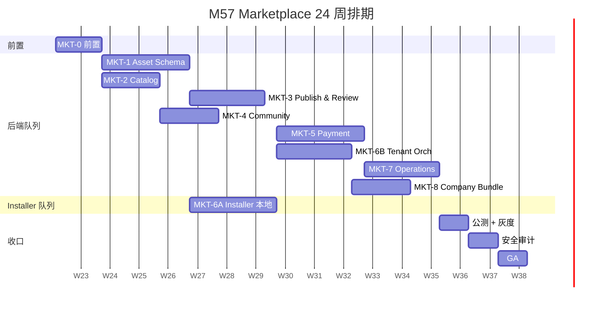

# M57 — 公网商城平台（Marketplace Platform）开发计划（SUPERSEDED）

> **⚠️ SUPERSEDED（归档 · 禁止开工）**
>
> **不要实现本模块。** 本文档是历史开发计划，下文全部任务 / Gate / 验收 checklist **已归档，不是待办**。禁止按本清单创建 `cmd/marketplace`、`internal/marketplace`、`web/src/features/marketplace` 或任何「规划代码锚点」。
>
> 站内资产发现与安装走 **Ecosystem (M30)**：[`30-ecosystem.md`](./30-ecosystem.md) · [`30-ecosystem.development.md`](./30-ecosystem.development.md)。本计划与 M30 易混。
>
> 权威说明：[`65-module-cross-reference-full.md`](./65-module-cross-reference-full.md) 编号表与 §1.40。同系列：[需求](./57-marketplace-platform.md) · [设计](./57-marketplace-platform.design.md)。文件保留以免断链。

> **版本**：2026-05-26 · **状态**：📦 已归档 / SUPERSEDED（原「📋 待启动」作废） · **EP**：—
> **需求**：[57-marketplace-platform.md](./57-marketplace-platform.md)
> **设计**：[57-marketplace-platform.design.md](./57-marketplace-platform.design.md)
> **总工时估算**：—（计划已归档，不再排期）
> **前置**：不适用

> **实现状态说明（归档）**：截至 2026-08-15，M57 **从未启动任何代码实现**。下列路径 **均不存在、禁止创建**：`api/marketplace/v1/*.proto`、`cmd/marketplace/`、`internal/marketplace/*`、`internal/installer/`、`pkg/aranea-asset/`、`web/marketplace/`、`web/src/features/marketplace/`。现有 M30 Ecosystem 是现网能力，不是本计划的开工入口。

---

## 0. 任务 ID 编码约定

```
MKT-{主题}-{子模块}-{序号}

MKT-1-SCHEMA-01    # MKT-1 Schema 第 1 项
MKT-6-INST-04      # MKT-6 Installer 第 4 项
MKT-5-PAY-02       # MKT-5 Payment 第 2 项
```

主题与执行顺序：

| 主题 | 名称 | 顺序 | 估时 |
|------|------|------|------|
| MKT-0 | 前置（Asset 规范冻结、骨架、CI） | **第 0 波** | 1.5 周 |
| MKT-1 | Asset Registry & Schema | 第 1 波 | 3 周 |
| MKT-2 | Catalog & Discovery | 第 1 波（并行） | 2 周 |
| MKT-3 | Publish & Review | 第 2 波 | 2.5 周 |
| MKT-4 | Rating / Review / Community | 第 2 波（并行） | 2 周 |
| MKT-6 Phase A | Installer（本地一键安装） | 第 2 波（并行，Installer 队列） | 3 周 |
| MKT-5 | Payment & License | 第 3 波 | 3 周 |
| MKT-6 Phase B | Tenant Orchestrator（托管部署） | 第 3 波（并行） | 2.5 周 |
| MKT-7 | Operations & Telemetry | 第 4 波 | 2.5 周 |
| MKT-8 | Company Bundle | 第 4 波（并行） | 2 周 |
| 收口 | 公测灰度 + 安全审计 + 文档 | 最后 | 3 周 |

---

## 1. 现状评估

### 1.1 站内 Ecosystem（M30）已具备

| 能力 | 现状 | 缺口 |
|------|------|------|
| 商品类型抽象 | ✅ Agent / Skill / Team 三类 | ⚠️ 缺 MCP / Tool / Plugin / Channel / Knowledge / Workflow / Company |
| 商品卡片字段 | ✅ 名称/作者/价格/评分/安装量 | ⚠️ 缺活跃度、运行成功率、版本兼容矩阵 |
| 安装动作 | ⚠️ 落点到本地 `agents/skills/teams` 表 | ❌ 跨实例 / 跨租户的 **远程部署** 缺失 |
| 发布动作 | ⚠️ 表单录入 → 草稿 | ❌ 缺打包工具、签名、审核流、版本管理、增量更新 |
| 评分 | ⚠️ 单维分数 | ❌ 缺评论、回复、活跃度衍生指标、举报 |
| 多租户 | ❌ 单一 workspace | ❌ 商城本身就是多租户服务 |
| 公网部署 | ❌ 仅作为本项目子页面 | ❌ 缺独立服务、独立域名、独立鉴权 |

### 1.2 本项目资产成熟度

| 资产 | 模块 | 可打包性 | 备注 |
|------|------|----------|------|
| **Skill** | `internal/skill` + [20-skill.md](./20-skill.md) | ✅ 已有 SKILL.md + 版本 | 已是文件型，最容易打包 |
| **MCP Server** | `internal/mcp` + [19-mcp.md](./19-mcp.md) | ✅ 连接配置 + 工具发现规则 | 关键是凭据隔离与代理 |
| **Tool** | `internal/tools` + [23-tools.md](./23-tools.md) | ✅ schema + 实现脚本 | 内置工具 vs 外部 API 工具 |
| **Plugin** | `internal/plugin` + [22-plugin.md](./22-plugin.md) | ⚠️ 当前是代码注入 | 需先做 wasm/script 沙箱 |
| **Agent** | `internal/agent` + [2-agents-create.md](./2-agents-create.md) / [5-agent-setting.md](./5-agent-setting.md) | ✅ 模板 + 配置 | 依赖项最复杂（模型/工具/skill） |
| **Team / Graph** | `internal/team` / `internal/graph` + [11-multi-agent.md](./11-multi-agent.md) / [36-graph-workflow.md](./36-graph-workflow.md) / [53-team-graph-orchestration.md](./53-team-graph-orchestration.md) | ✅ 编排定义 | 子 agent 依赖需递归解析 |
| **Channel** | `internal/channel` + [17-channel.md](./17-channel.md) | ✅ 模板化配置 | 凭据由买家配置 |
| **Knowledge Pack** | `internal/knowledge` + [37-knowledge.md](./37-knowledge.md) | ⚠️ 文件 + 索引 | 需要语料许可声明 |
| **Workflow** | 跨模块 | 📦 已归档 概念存在 | 需要正式 manifest |
| **Company Bundle** | 整 workspace 快照 | 📦 已归档 不存在 | M57 新概念 |

### 1.3 M30 现有代码锚点（前置基础）

| 层 | 路径 | 状态 |
|----|------|------|
| Proto | `api/kratos/ecosystem/v1/ecosystem.proto` | ✅ 5 RPC（List/Get/Publish/Install/Uninstall） |
| Biz | `internal/biz/ecosystem/ecosystem.go` · `internal/biz/ecosystem.go`（重导出） | ✅ Usecase + Repo 接口 |
| Data | `internal/data/ecosystem.go` | ✅ 原生 SQL 操作 `ecosystem_products` + `ecosystem_installs` |
| Service | `internal/service/ecosystem.go` | ✅ gRPC 服务实现 |
| DDL | `internal/data/sql/ecosystem_product.sql` | ✅ 2 表 + 2 索引 |
| 前端 | `web/src/pages/EcosystemPage.vue`（路由 `/shop`） · `web/src/features/ecosystem/` · `web/src/stores/ecosystem/` | ✅ 技术预览状态 |
| CLI | `cmd/aranea/main.go` 已注册 `cmdpkg.NewPackCmd()` | ✅ Pack 命令已存在 |
| 现有 Installer | `internal/pkginstall/installer.go` | ✅ HTTP API 安装器（非商城客户端，将并存） |

> M30 现状详见 [30-ecosystem.development.md](./30-ecosystem.development.md)。

### 1.4 M57 规划代码锚点（均不存在 · 禁止创建）

| 层 | 路径 | 状态 |
|----|------|------|
| Proto | `api/marketplace/v1/{catalog,publish,install,social,payment,review}.proto` | ❌ 不存在（禁止创建） |
| 商城后端 | `cmd/marketplace/` · `internal/marketplace/{biz,service,server,data}` | ❌ 不存在（禁止创建） |
| Asset Schema | `pkg/aranea-asset/{manifest,pack,resolve,signer}/` | ❌ 不存在（禁止创建） |
| 买家侧 Installer | `internal/installer/` · `internal/biz/installer/` · `internal/service/installer_service.go` | ❌ 不存在（禁止创建） |
| 托管编排 | `internal/marketplace/orchestrator/` | ❌ 不存在（禁止创建） |
| 公网 Web | `web/marketplace/` | ❌ 不存在（禁止创建） |
| 主项目客户端 | `web/src/features/marketplace/` | ❌ 不存在（禁止创建） |
| 配置 | `configs/marketplace.yaml` | ❌ 不存在（禁止创建） |
| 红线 CI | `scripts/marketplace-boundary.sh` | ❌ 不存在（禁止创建） |

### 1.5 当前状态（2026-08-15 归档）

| 项 | 状态 | 备注 |
|----|------|------|
| 需求 / 设计 / 本计划 | 📦 SUPERSEDED | 文首禁止开工；文件保留以免断链 |
| Asset Schema / Proto / DB | 📦 已归档 | 仅存在于设计文档；代码路径 **不存在** |
| Feature flag | ❌ 不存在 | `internal/conf/features_marketplace.go` **不存在**（禁止创建） |
| 红线 CI | ❌ 不存在 | `make marketplace-boundary` / `scripts/marketplace-boundary.sh` **不存在**（禁止创建） |
| 公网域名 / 证书 | 📦 已归档 | 非本仓库待办 |
| 第三方支付账号 | 📦 已归档 | 非本仓库待办 |

---

## 2. MKT-0 — 前置（1.5 周）

### MKT-0-DOC-01 — Asset 规范冻结评审
- **产出**：在 `pkg/aranea-asset/manifest/SCHEMA.md` 锁定 `manifest.json` v1
- **验收**：架构 + 安全 + 前端三方评审通过 · **工时**：1d
- **状态**：📦 已归档

### MKT-0-SKL-01 — 商城后端骨架
- **产出**：
  - `cmd/marketplace/{main.go,wire.go,wire_gen.go}`
  - `internal/marketplace/{biz,service,server,data}` 各目录 + `ProviderSet`
  - `configs/marketplace.yaml`
- **验收**：`go run ./cmd/marketplace` 起 8080/9090 监听 + healthz 返回 200 · **工时**：1d
- **状态**：📦 已归档

### MKT-0-SKL-02 — Installer 骨架
- **产出**：`internal/installer/` + `internal/biz/installer` 端口 + `internal/service/installer_service.go` Wire 绑定
- **验收**：`/v1/installer/ping` 返回 ok（mock plan） · **工时**：0.5d
- **状态**：📦 已归档

### MKT-0-DATA-01 — PG / MinIO / Meilisearch 本地开发栈
- **产出**：`docker-compose.marketplace.yml`（PG + MinIO + Meilisearch + ClamAV）
- **验收**：`make mkt-dev-up` 一键拉起 · **工时**：0.5d
- **状态**：📦 已归档

### MKT-0-CI-01 — 红线 CI
- **产出**：`scripts/marketplace-boundary.sh` + `make marketplace-boundary` 接入 `make ci`
- **flag 命名**：
  - `MKT_PUBLISH_ENABLED` / `MKT_PAYMENT_ENABLED` / `MKT_HOSTED_TENANT` / `MKT_COMPANY_BUNDLE`
- **验收**：CI 主流程跑通 · **工时**：0.5d
- **状态**：📦 已归档

### MKT-0-FE-01 — 前端骨架
- **产出**：`web/marketplace/` Vue + Vite 项目，路由 `/`、`/a/:slug`、`/me`、`/studio` 空壳
- **验收**：`pnpm dev` 三页可路由跳转 · **工时**：1d
- **状态**：📦 已归档

**Gate 0**：所有上述任务完成 + `make ci` 全绿。

---

## 3. MKT-1 — Asset Registry & Schema（3 周）

> 解锁：所有其它主题。

### Sprint M1-A：Manifest 与共享包（1 周）

| 任务 ID | 内容 | 文件 | 工时 | 状态 |
|---------|------|------|------|------|
| MKT-1-SCHEMA-01 | `pkg/aranea-asset/manifest/types.go` 完整结构 + JSON Schema | 新 | 1d | 📦 已归档 |
| MKT-1-SCHEMA-02 | Manifest 校验器（JSON Schema + 业务校验） | 同上 | 1d | 📦 已归档 |
| MKT-1-SCHEMA-03 | SemVer Range 解析（复用 `Masterminds/semver`） | `pkg/aranea-asset/version/` | 0.5d | 📦 已归档 |
| MKT-1-SCHEMA-04 | 类型 → 内容布局校验（10 类） | `pkg/aranea-asset/layout/` | 1.5d | 📦 已归档 |
| MKT-1-TEST-01 | 表驱动测试：10 类样例 bundle | `testdata/` + `_test.go` | 1d | 📦 已归档 |

### Sprint M1-B：打包、签名、CLI（1 周）

| 任务 ID | 内容 | 文件 | 工时 | 状态 |
|---------|------|------|------|------|
| MKT-1-PACK-01 | `pkg/aranea-asset/pack/packer.go` Pack/Unpack | 新 | 1d | 📦 已归档 |
| MKT-1-PACK-02 | Ed25519 签名 + 验签（detached `.sig`） | `pkg/aranea-asset/signer/` | 1d | 📦 已归档 |
| MKT-1-CLI-01 | `aranea pack` 子命令（cobra） | `cmd/aranea/pack.go` 新 | 1d | 📦 已归档 |
| MKT-1-CLI-02 | `aranea pack verify` 子命令 | 同上 | 0.5d | 📦 已归档 |
| MKT-1-TEST-02 | 端到端：pack → sign → verify → unpack | `pack_e2e_test.go` | 0.5d | 📦 已归档 |
| MKT-1-DOCS-01 | 创作者快速上手文档 | `docs/marketplace/creator-quickstart.md` | 1d | 📦 已归档 |

### Sprint M1-C：依赖解析与 `deps.lock`（1 周）

| 任务 ID | 内容 | 文件 | 工时 | 状态 |
|---------|------|------|------|------|
| MKT-1-RESV-01 | Resolver 接口 + 内存 mock catalog | `pkg/aranea-asset/resolve/` 新 | 1d | 📦 已归档 |
| MKT-1-RESV-02 | PubGrub 简化版（拓扑 + 冲突回溯） | 同上 | 2d | 📦 已归档 |
| MKT-1-RESV-03 | `deps.lock` 读写 + 完整性校验 | 同上 | 1d | 📦 已归档 |
| MKT-1-TEST-03 | 解析测试：菱形依赖、冲突、循环检测 | `resolve_test.go` | 1d | 📦 已归档 |

**Gate M1**：`go test ./pkg/aranea-asset/...` 全过；`aranea pack ./examples/skill-hello && aranea pack verify ...` 通过。

---

## 4. MKT-2 — Catalog & Discovery（2 周，与 M1 并行）

### Sprint M2-A：Proto / Biz / Data（1 周）

| 任务 ID | 内容 | 文件 | 工时 | 状态 |
|---------|------|------|------|------|
| MKT-2-PROTO-01 | `api/marketplace/v1/catalog.proto` + buf gen | 新 | 0.5d | 📦 已归档 |
| MKT-2-BIZ-01 | `biz/catalog/usecase.go` Search/Get/ListCategories | 新 | 1d | 📦 已归档 |
| MKT-2-DATA-01 | Ent schema：`mp_asset`、`mp_asset_version`、`mp_category`、`mp_tag` | 新 | 1d | 📦 已归档 |
| MKT-2-DATA-02 | 三级分类种子数据（migration） | `data/ent/migrate/seeds/categories.go` | 0.5d | 📦 已归档 |
| MKT-2-DATA-03 | Meilisearch 索引器：Asset Upsert/Delete | `internal/marketplace/data/searchidx/` | 1d | 📦 已归档 |
| MKT-2-SVC-01 | `service/catalog_service.go` | 新 | 1d | 📦 已归档 |

### Sprint M2-B：前端列表 / 详情 / 搜索（1 周）

| 任务 ID | 内容 | 文件 | 工时 | 状态 |
|---------|------|------|------|------|
| MKT-2-FE-01 | `web/marketplace` 首页 + Hero + 榜单骨架 | `pages/Home.vue` | 1d | 📦 已归档 |
| MKT-2-FE-02 | 分类树 + 列表页 + 搜索 | `pages/Browse.vue` | 1.5d | 📦 已归档 |
| MKT-2-FE-03 | 详情页（README 渲染 + 评分骨架） | `pages/AssetDetail.vue` | 1.5d | 📦 已归档 |
| MKT-2-FE-04 | 创作者主页 | `pages/CreatorProfile.vue` | 0.5d | 📦 已归档 |
| MKT-2-TEST-01 | 后端集成测试（含 Meilisearch testcontainer） | `catalog_integration_test.go` | 0.5d | 📦 已归档 |

**Gate M2**：插入 50 条 mock asset → 前端首页 / 分类 / 搜索 / 详情可浏览，无评分/无安装。

---

## 5. MKT-3 — Publish & Review（2.5 周）

### Sprint M3-A：上传与发布（1 周）

| 任务 ID | 内容 | 文件 | 工时 | 状态 |
|---------|------|------|------|------|
| MKT-3-PROTO-01 | `publish.proto`（CreateUploadURL/PublishVersion/Deprecate） | 新 | 0.5d | 📦 已归档 |
| MKT-3-OBJ-01 | ObjectStore 端口 + S3 实现（含 presigned PUT） | `data/objectstore/` | 1d | 📦 已归档 |
| MKT-3-BIZ-01 | `biz/publish/usecase.go` 发布主路径 | 新 | 1d | 📦 已归档 |
| MKT-3-DATA-01 | `mp_asset_version` 状态机 + 索引 | 同 schema | 0.5d | 📦 已归档 |
| MKT-3-SVC-01 | `service/publish_service.go` | 新 | 0.5d | 📦 已归档 |
| MKT-3-CLI-01 | `aranea publish` 子命令（含 OAuth token） | `cmd/aranea/publish.go` | 1.5d | 📦 已归档 |

### Sprint M3-B：自动扫描 + 人工审核（1 周）

| 任务 ID | 内容 | 文件 | 工时 | 状态 |
|---------|------|------|------|------|
| MKT-3-SCAN-01 | 签名校验 + JSON Schema 校验 + 权限合理性 | `biz/review/scan/` | 1d | 📦 已归档 |
| MKT-3-SCAN-02 | ClamAV 客户端 + 敏感词词典 | 同上 | 1d | 📦 已归档 |
| MKT-3-SCAN-03 | MinHash + 文本相似度（抄袭） | 同上 | 1.5d | 📦 已归档 |
| MKT-3-REV-01 | `ReviewUsecase` + `mp_review_task` 队列 | `biz/review/` | 1d | 📦 已归档 |
| MKT-3-ADM-01 | 审核后台页面：待审/扫描报告/决策 | `web/marketplace/pages/admin/Reviews.vue` | 1.5d | 📦 已归档 |

### Sprint M3-C：版本管理与下架（0.5 周）

| 任务 ID | 内容 | 文件 | 工时 | 状态 |
|---------|------|------|------|------|
| MKT-3-VER-01 | DeprecateVersion / RemoveVersion / 已购 90 天保留 | `biz/publish/` | 1d | 📦 已归档 |
| MKT-3-TEST-01 | E2E：CLI publish → 自动扫描通过 → 人工通过 → 上架 | `bats/` | 1.5d | 📦 已归档 |

**Gate M3**：`aranea publish examples/skill-hello-1.0.0.aranea` 成功 → 自动扫描通过 → 审核员后台批准 → 商城详情页可见。

---

## 6. MKT-4 — Rating / Review / Community（2 周，与 M3 并行）

### Sprint M4-A：评分 + 评论（1 周）

| 任务 ID | 内容 | 文件 | 工时 | 状态 |
|---------|------|------|------|------|
| MKT-4-PROTO-01 | `social.proto`（Rate/PostReview/FlagContent） | 新 | 0.5d | 📦 已归档 |
| MKT-4-BIZ-01 | `biz/social/rating.go` 加权计算 + 反作弊 | 新 | 1.5d | 📦 已归档 |
| MKT-4-BIZ-02 | `biz/social/review.go` 评论 / 回复 / 折叠 | 新 | 1d | 📦 已归档 |
| MKT-4-DATA-01 | `mp_rating` / `mp_review` / `mp_report` schema | 新 | 0.5d | 📦 已归档 |
| MKT-4-FE-01 | 详情页评分组件 + 评论树 + 举报 | `components/RatingPanel.vue`、`ReviewList.vue` | 1.5d | 📦 已归档 |

### Sprint M4-B：活跃度与健康度（1 周）

| 任务 ID | 内容 | 文件 | 工时 | 状态 |
|---------|------|------|------|------|
| MKT-4-TELM-01 | `mp_telemetry_daily` schema + 入库 | `biz/telemetry/` | 0.5d | 📦 已归档 |
| MKT-4-TELM-02 | 每日 rollup cron（活跃度、健康度） | `cmd/marketplace/cron.go` | 1d | 📦 已归档 |
| MKT-4-STATS-01 | AssetStats 更新与缓存 | `biz/catalog/` | 0.5d | 📦 已归档 |
| MKT-4-FE-02 | 详情页：评分分布柱状图、活跃度趋势 | `components/StatsPanel.vue` | 1.5d | 📦 已归档 |
| MKT-4-TEST-01 | 单测：加权评分 / 反作弊 / 活跃度计算 | `*_test.go` | 1.5d | 📦 已归档 |

**Gate M4**：在 mock 数据上活跃度排序与 7 天健康度均能在 1 分钟 cron 内刷新。

---

## 7. MKT-6 Phase A — Installer（本地一键安装，3 周，Installer 队列并行）

> 解锁：M5 之前买家可以「免费安装」流转。

### Sprint M6A-1：Plan 与 License（1 周）

| 任务 ID | 内容 | 文件 | 工时 | 状态 |
|---------|------|------|------|------|
| MKT-6-PROTO-01 | `install.proto` 全套 | 新 | 0.5d | 📦 已归档 |
| MKT-6-BIZ-01 | `biz/install/plan.go`（基于 resolver） | 新 | 1d | 📦 已归档 |
| MKT-6-BIZ-02 | License 签发与校验（JWT + ed25519） | `biz/install/license.go` | 1d | 📦 已归档 |
| MKT-6-DATA-01 | `mp_install` / `mp_license` schema | 新 | 0.5d | 📦 已归档 |
| MKT-6-SVC-01 | `service/install_service.go` | 新 | 1d | 📦 已归档 |
| MKT-6-TEST-01 | Plan 算法单测 + License 反伪造 | `*_test.go` | 1d | 📦 已归档 |

### Sprint M6A-2：Installer 核心（1 周）

| 任务 ID | 内容 | 文件 | 工时 | 状态 |
|---------|------|------|------|------|
| MKT-6-INST-01 | `internal/installer/client/marketplace.go` gRPC client | 新 | 0.5d | 📦 已归档 |
| MKT-6-INST-02 | `unpack/` 解包 + 签名校验 | 新 | 0.5d | 📦 已归档 |
| MKT-6-INST-03 | `stage/` 事务（DB + FS staging + 回滚） | 新 | 2d | 📦 已归档 |
| MKT-6-INST-04 | `apply/` 各类型 handler（skill/mcp/tool/agent/team/channel/knowledge） | 新 × 7 文件 | 2d | 📦 已归档 |
| MKT-6-INST-05 | `installer.go` 总入口 + 拓扑执行 + Reporter | 新 | 1d | 📦 已归档 |

### Sprint M6A-3：UI + smoke + 主项目接入（1 周）

| 任务 ID | 内容 | 文件 | 工时 | 状态 |
|---------|------|------|------|------|
| MKT-6-BIZ-PORT-01 | 主项目 `internal/biz/installer/installer.go` 端口 | 新 | 0.5d | 📦 已归档 |
| MKT-6-SVC-PORT-01 | 主项目 `internal/service/installer_service.go` Wire 绑定 | 新 | 1d | 📦 已归档 |
| MKT-6-WEB-01 | M30 `/shop` 详情页「安装」按钮 → 调用主项目 InstallerService | `web/src/features/marketplace` | 1d | 📦 已归档 |
| MKT-6-WEB-02 | `/shop/installs` 已安装列表 + 健康度 + 卸载 | 同上 | 1d | 📦 已归档 |
| MKT-6-CLI-01 | `aranea install <id@version>` CLI | `cmd/aranea/install.go` | 1d | 📦 已归档 |
| MKT-6-SMOKE-01 | smoke 测试 runner（运行 bundle 内 `tests/smoke.sh`） | `internal/installer/smoke/` | 0.5d | 📦 已归档 |
| MKT-6-TEST-02 | E2E：本地 marketplace（docker）→ install → smoke 通过 | `bats/install_e2e.sh` | 1d | 📦 已归档 |

**Gate M6A**：免费 skill / agent / team 三类 Asset 在本地一键安装成功率 100%，失败可回滚。

---

## 8. MKT-5 — Payment & License（3 周）

> 依赖：MKT-6 Phase A（已能基于 License 安装）。

### Sprint M5-A：订单与支付（1.5 周）

| 任务 ID | 内容 | 文件 | 工时 | 状态 |
|---------|------|------|------|------|
| MKT-5-PROTO-01 | `payment.proto` + `payout.proto` | 新 | 0.5d | 📦 已归档 |
| MKT-5-BIZ-01 | `biz/payment/order.go` CreateOrder / ConfirmOrder | 新 | 1d | 📦 已归档 |
| MKT-5-DATA-01 | `mp_order` / `mp_payout` / `mp_refund` schema | 新 | 0.5d | 📦 已归档 |
| MKT-5-PAY-01 | Stripe Provider（含 webhook 签名校验） | `data/payment/stripe.go` | 2d | 📦 已归档 |
| MKT-5-PAY-02 | Alipay Provider | `data/payment/alipay.go` | 1.5d | 📦 已归档 |
| MKT-5-PAY-03 | Wechat Pay Provider | `data/payment/wechat.go` | 1.5d | 📦 已归档 |
| MKT-5-SVC-01 | `service/payment_service.go` + webhook 路由 | 新 + `server/webhook.go` | 1d | 📦 已归档 |

### Sprint M5-B：License 与价格模型（0.5 周）

| 任务 ID | 内容 | 文件 | 工时 | 状态 |
|---------|------|------|------|------|
| MKT-5-LIC-01 | one_time / subscription / enterprise scope 在 License JWT 表达 | `biz/install/license.go` 扩展 | 1d | 📦 已归档 |
| MKT-5-LIC-02 | 续费 / 过期宽限期 30 天 | 同上 | 1d | 📦 已归档 |
| MKT-5-PRICE-01 | 详情页 / 结算页 / 我的订单 UI | `web/marketplace/pages/{Checkout,Orders}.vue` | 1.5d | 📦 已归档 |

### Sprint M5-C：分账与退款（1 周）

| 任务 ID | 内容 | 文件 | 工时 | 状态 |
|---------|------|------|------|------|
| MKT-5-POUT-01 | 月度结算 cron + payout 单生成 | `cmd/marketplace/cron.go` | 1d | 📦 已归档 |
| MKT-5-POUT-02 | Stripe Connect / 支付宝转账接入 | `data/payment/` | 2d | 📦 已归档 |
| MKT-5-REF-01 | 退款流程（7 天窗 + 按天比例） | `biz/payment/refund.go` | 1d | 📦 已归档 |
| MKT-5-FE-01 | 创作者中心：收益 / 结算单 / 提现申请 | `web/marketplace/pages/studio/Earnings.vue` | 1d | 📦 已归档 |
| MKT-5-TEST-01 | E2E：付费安装 → 支付 → 安装 → 退款 → 分账冲销 | `bats/payment_e2e.sh` | 1.5d | 📦 已归档 |

**Gate M5**：Stripe sandbox 跑通整个买断与退款链路；账面与 Stripe Dashboard 对账 0 差异。

---

## 9. MKT-6 Phase B — Tenant Orchestrator（托管部署，2.5 周，可与 M5 并行）

### Sprint M6B-1：K8s Operator 雏形（1 周）

| 任务 ID | 内容 | 文件 | 工时 | 状态 |
|---------|------|------|------|------|
| MKT-6-ORCH-01 | `TenantOrchestrator` 接口 + 内存 mock | `internal/marketplace/orchestrator/` | 0.5d | 📦 已归档 |
| MKT-6-ORCH-02 | K8s 实现（client-go，Namespace + StatefulSet + PVC） | 同上 | 2d | 📦 已归档 |
| MKT-6-ORCH-03 | Ingress + 自动域名（cert-manager） | 同上 + helm chart | 1d | 📦 已归档 |
| MKT-6-ORCH-04 | PG schema 切分 + 租户隔离迁移 | `data/migrations/tenant/` | 1d | 📦 已归档 |

### Sprint M6B-2：部署 + 模型代理 + 计费（1.5 周）

| 任务 ID | 内容 | 文件 | 工时 | 状态 |
|---------|------|------|------|------|
| MKT-6-ORCH-05 | 部署 Job（sidecar 触发 `aranea install`） | `orchestrator/deploy.go` | 1.5d | 📦 已归档 |
| MKT-6-MPRX-01 | 模型 API 代理（按 tenant + asset 计量） | `internal/marketplace/modelproxy/`（新） | 2d | 📦 已归档 |
| MKT-6-BILL-01 | 模型用量入库 + 月度账单 | `biz/billing/` | 1.5d | 📦 已归档 |
| MKT-6-FE-01 | 「托管部署」入口 + 控制台 | `web/marketplace/pages/Hosted.vue` | 1d | 📦 已归档 |
| MKT-6-TEST-01 | E2E：购买 → 一键托管部署 → 运行 → 计费对账 | `bats/hosted_e2e.sh` | 1.5d | 📦 已归档 |

**Gate M6B**：在 dev K8s 集群上 1 次点击 → 30s 内创建租户 + 部署 1 个 Team Bundle + 运行 demo 成功。

---

## 10. MKT-7 — Operations & Telemetry（2.5 周）

### Sprint M7-A：创作者中心 + 买家工作台（1.5 周）

| 任务 ID | 内容 | 文件 | 工时 | 状态 |
|---------|------|------|------|------|
| MKT-7-FE-01 | 创作者中心首页（KPI + 待办） | `studio/Dashboard.vue` | 1d | 📦 已归档 |
| MKT-7-FE-02 | 安装数 / 收入 / 评分 时序图 | `studio/Stats.vue` | 1.5d | 📦 已归档 |
| MKT-7-FE-03 | 评论回复 / 问题列表 | `studio/Inbox.vue` | 1d | 📦 已归档 |
| MKT-7-FE-04 | 买家工作台：已购 / 已装 / 健康度 / 升级提示 | `me/Installs.vue` | 1.5d | 📦 已归档 |
| MKT-7-BIZ-01 | 升级提示（新版本通知） | `biz/notify/` | 1d | 📦 已归档 |

### Sprint M7-B：内部运营 + Datadog（1 周）

| 任务 ID | 内容 | 文件 | 工时 | 状态 |
|---------|------|------|------|------|
| MKT-7-OPS-01 | 内部仪表盘（GMV / 漏斗 / 退款率） | `admin/Overview.vue` | 1.5d | 📦 已归档 |
| MKT-7-OPS-02 | 举报处理 / 违规下架 工具 | `admin/Reports.vue` | 1d | 📦 已归档 |
| MKT-7-DD-01 | Datadog dashboards × 5 | `docs/marketplace/datadog/` JSON | 1d | 📦 已归档 |
| MKT-7-DD-02 | Datadog monitors（成功率 / 审核 SLA / 支付） | 同上 | 0.5d | 📦 已归档 |
| MKT-7-TEST-01 | 端到端冒烟（多角色） | `bats/admin_e2e.sh` | 1d | 📦 已归档 |

**Gate M7**：5 张 Datadog 面板有数据；创作者中心三类 KPI 与 DB 数据对齐。

---

## 11. MKT-8 — Company Bundle（2 周，与 M7 并行）

### Sprint M8-A：嵌套 manifest 与 wizard（1 周）

| 任务 ID | 内容 | 文件 | 工时 | 状态 |
|---------|------|------|------|------|
| MKT-8-SCHEMA-01 | `company_bundle` 子类型 manifest 扩展 | `pkg/aranea-asset/manifest/company.go` | 1d | 📦 已归档 |
| MKT-8-PACK-01 | 嵌套打包：内嵌引用 vs 外部依赖 | `pkg/aranea-asset/pack/` | 1d | 📦 已归档 |
| MKT-8-INST-01 | Installer apply/company.go（递归 + 配置向导触发） | `internal/installer/apply/company.go` | 2d | 📦 已归档 |
| MKT-8-FE-01 | 安装后 wizard：模型 / Channel / 凭据填写 | `web/src/features/installer/Wizard.vue` | 2d | 📦 已归档 |

### Sprint M8-B：Diff 模式（1 周）

| 任务 ID | 内容 | 文件 | 工时 | 状态 |
|---------|------|------|------|------|
| MKT-8-DIFF-01 | 已存在 workspace 上叠加：冲突检测 | `internal/installer/apply/diff.go` | 2d | 📦 已归档 |
| MKT-8-DIFF-02 | 冲突解决 UI：跳过 / 覆盖 / 重命名 | `web/src/features/installer/Conflicts.vue` | 1.5d | 📦 已归档 |
| MKT-8-TEST-01 | E2E：发布跨境电商客服整包 → 新 workspace 安装 → 运行 | `bats/company_e2e.sh` | 1.5d | 📦 已归档 |

**Gate M8**：1 个真实 Company Bundle（≥5 个子资产）发布 + 安装 + Demo Run 全通过。

---

## 12. 收口（3 周）

### Sprint Closing-A：公测灰度（1 周）

- Closing-FF-01：feature flag 灰度方案（按 workspace allowlist） — 📦 已归档
- Closing-FF-02：第一批 5 名内部创作者上架 10 个免费 Asset — 📦 已归档
- Closing-MON-01：Datadog 告警阈值确认 — 📦 已归档
- Closing-DOC-01：[docs/marketplace/](../marketplace) 用户文档全套 — 📦 已归档

### Sprint Closing-B：安全审计（1 周）

- Closing-SEC-01：第三方渗透测试报告（签名/支付/越权） — 📦 已归档
- Closing-SEC-02：高危项修复 — 📦 已归档
- Closing-SEC-03：依赖 SBOM + supply chain 扫描 — 📦 已归档
- Closing-LEGAL-01：用户协议 / 创作者协议 / 隐私政策 法务过稿 — 📦 已归档

### Sprint Closing-C：正式公测（1 周）

- Closing-GA-01：去 feature flag，所有创作者开放（仍人工审 KYC） — 📦 已归档
- Closing-GA-02：M30 `/shop` 默认 tab 切换为「公网商城」 — 📦 已归档
- Closing-GA-03：发布会素材 + 创作者激励活动 — 📦 已归档

**Gate GA**：
- 10 个真实创作者上架 ≥30 个 Asset
- ≥100 个 workspace 完成至少 1 次安装
- 安装成功率 ≥98%
- P99 API < 200ms / 搜索 < 500ms
- 0 P0/P1 安全事件

---

## 13. 里程碑节奏（与 M56 协调）

| 季度 | 内容 |
|------|------|
| Q-now | M56 收口 + M57 设计评审 + Asset 规范冻结 |
| Q+1 上 | MKT-1 / MKT-2 / MKT-3（资产规范 + 目录 + 发布） |
| Q+1 下 | MKT-4 / MKT-6 Phase A（社区度量 + 本地一键安装） |
| Q+2 上 | MKT-5 / MKT-6 Phase B（支付 + 托管部署） |
| Q+2 下 | MKT-7 / MKT-8（运营 + Company Bundle） + 公测灰度 |

---

## 14. 任务依赖图



---

## 15. 并行队列建议

| 队列 | 主负责 | 工作 |
|------|--------|------|
| 后端 A | Backend Squad 1 | MKT-1 / 3 / 5 / 7 |
| 后端 B | Backend Squad 2 | MKT-2 / 4 / 6B / 8 |
| Installer | Platform Squad | MKT-6A、Wizard、Conflicts、Smoke |
| 前端 | Frontend Squad | `web/marketplace` 全套 + `/shop` 客户端化 |
| 运维 / 平台 | SRE | docker-compose / K8s / cert / Datadog / Stripe KYC |
| 安全 | Security | 签名 / 扫描 / 审计 / 渗透 |
| 内容 / 运营 | Ops | 三级类目种子、创作者激励、KYC 流程 |

---

## 16. 风险与缓解（开发期）

| 风险 | 概率 | 缓解 |
|------|------|------|
| Stripe / 支付宝 KYC 周期长 | 高 | MKT-0 立即并行启动，不阻塞代码 |
| 依赖解析复杂度被低估 | 中 | M1-C 留 1 周 buffer + 借鉴 PubGrub 论文 |
| K8s Operator 经验不足 | 中 | M6B 先用 helm + cron 简化版本；v2 才上 CRD |
| 抄袭检测误杀 | 中 | 高分送人工，给创作者申诉通道 |
| 安装回滚不彻底（FS 残留） | 中 | staging 区每步 fsck；测试覆盖断电场景 |
| 跨境合规 | 高 | 中国大陆与海外双部署，分两套支付通道 |
| 与 M56 BackgroundJob 集成耦合 | 低 | 商城后端不直接用 M56，自身重建轻量 dispatcher |

---

## 17. 验收 checklist（GA）

> **已归档**：以下 checkbox **不是**待办。禁止按本清单开工。

- 📦 已归档：`make ci` + `make marketplace-boundary` 全绿
- 📦 已归档：10 类 Asset 各有 ≥1 个 reference bundle 跑通完整链路
- 📦 已归档：安装成功率 ≥98%（最近 7 天）
- 📦 已归档：P99 API < 200ms / 搜索 < 500ms
- 📦 已归档：5 张 Datadog 面板有数据，4 个 monitor 已配置
- 📦 已归档：创作者 KYC 流程跑通至少 5 人
- 📦 已归档：第三方渗透报告高危项归零
- 📦 已归档：用户/创作者/隐私 协议法务过稿
- 📦 已归档：灾备：DB / ObjectStore 备份与恢复演练通过
- 📦 已归档：退款 + 分账 1 个月对账 0 差异
- 📦 已归档：`docs/marketplace/` 全套文档（创作者 / 买家 / 运维 / API）

---

## 18. 关联文档

- [57-marketplace-platform.md](./57-marketplace-platform.md) — 需求
- [57-marketplace-platform.design.md](./57-marketplace-platform.design.md) — 详细设计
- [30-ecosystem.md](./30-ecosystem.md) — 前身（站内）
- [30-ecosystem.development.md](./30-ecosystem.development.md) — M30 现状评估
- [56-business-logic-optimization.md](./56-business-logic-optimization.md) — 前置依赖（BackgroundJob）
- [20-skill.md](./20-skill.md) / [19-mcp.md](./19-mcp.md) / [23-tools.md](./23-tools.md) / [22-plugin.md](./22-plugin.md) — 资产规范
- [11-multi-agent.md](./11-multi-agent.md) / [53-team-graph-orchestration.md](./53-team-graph-orchestration.md) — Team / Graph 资产
- [17-channel.md](./17-channel.md) — Channel 资产
- [37-knowledge.md](./37-knowledge.md) — Knowledge 资产
- [AI-DEVELOPMENT-SPECIFICATION.md](../guides/AI-DEVELOPMENT-SPECIFICATION.md) — 编码规范
- [project_rules.md](../../.trae/rules/project_rules.md) — 项目规则与红线

---

## 19. 变更记录

| 日期 | 版本 | 变更 |
|------|------|------|
| 2026-05-26 | 0.1 | 初稿（MKT-0 ~ MKT-8 + 收口） |
| 2026-06-17 | 0.2 | 三件套内容边界整理：合并需求文档迁出的现状评估与里程碑；新增 M30 现有代码锚点与 M57 规划代码锚点对照；修复跨文档引用链接（空格→短横线） |
| 2026-08-15 | 0.3 | P1-15：SUPERSEDED 归档。禁止开工；规划路径改为「不存在」；任务/验收标记改为已归档。现网能力在 M30 Ecosystem |
