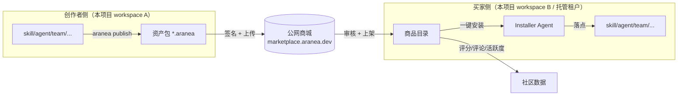
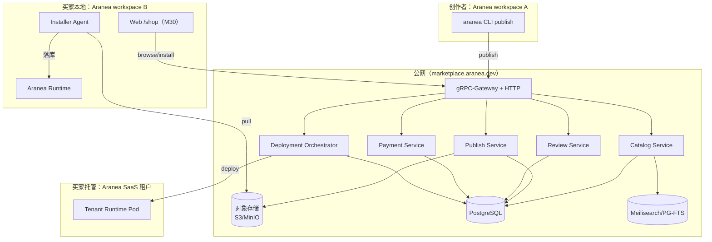
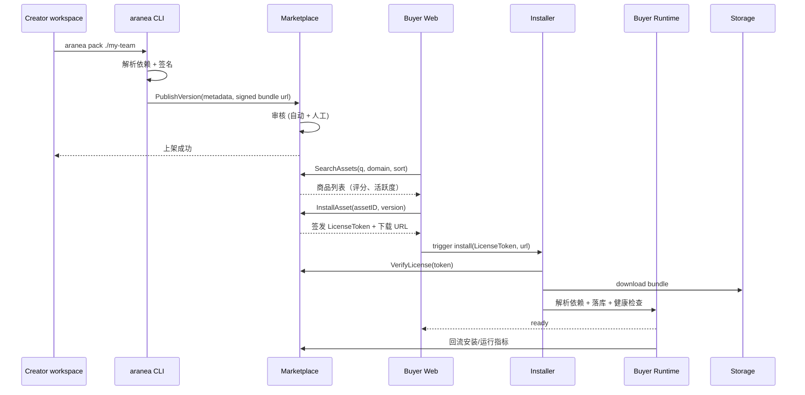
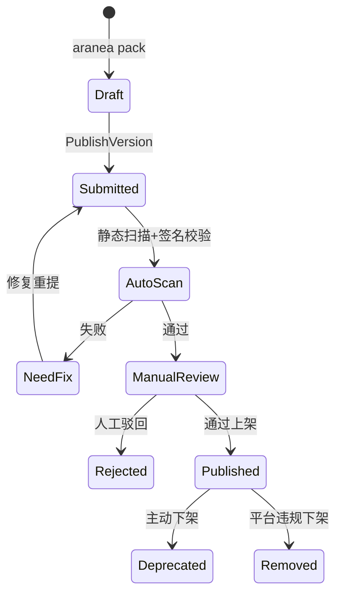
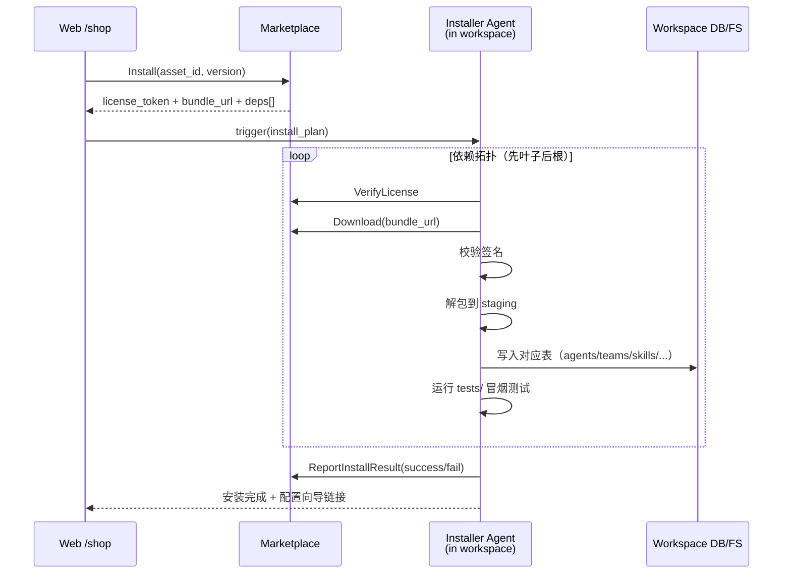
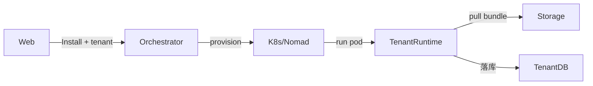

# M57 — 公网商城平台（Marketplace Platform, MKT）

> **版本**：2026-05-26 · **状态**：📋 需求草案 · **优先级**：P1（M56 之后启动）
> **背景**：[30 ecosystem.md](./30%20ecosystem.md)（站内安装与发现原型）· 本项目已有 `skill / mcp / tools / plugin / agent / team / graph / channel` 等可复用资产
> **关联**：M30 Ecosystem（升级为本平台的"客户端"）· M53 Team/Graph · M22 Plugin · M20 Skill · M19 MCP · M23 Tools
> **影响范围**：**新增独立服务** `cmd/marketplace` + `internal/marketplace/*`；本项目作为「安装目标」新增 `internal/installer` 客户端；Web 新增 `web/src/features/marketplace`
> **红线**：依赖倒置 · `internal/biz` 不 import `pkg/trpc-agent-go` · 商城后端与 Aranea 主项目通过 **gRPC + 公开 schema** 通信，不共享数据库

---

## 1. 模块定位

M30 Ecosystem 是「**单个 workspace 内的资产浏览与安装**」，所有商品都来自本地或人工预置；这次 M57 要把它推到 **公网多租户商城平台**，使所有用户在本项目上沉淀的 **skill / mcp / tool / plugin / agent / team / channel / knowledge / workflow / company-bundle** 都可以：

| 维度 | 描述 |
|------|------|
| **发布**（Sell） | 创作者把本地资产打包、签名、提交审核、上架到公网商城 |
| **发现**（Discover） | 买家在公网商城按领域 / 能力 / 评分 / 活跃度 / 价格搜索浏览 |
| **评估**（Evaluate） | 评分、评论、活跃度、试用沙箱、运行截图、Demo Run |
| **交易**（Transact） | 免费 / 一次买断 / 订阅 / 企业授权 / 创作者分账 |
| **安装**（Install） | 买家一键下载 → **系统自动部署** 到本地实例或托管租户 |
| **运营**（Operate） | 创作者中心、买家工作台、版本更新、问题反馈、退款 |
| **治理**（Govern） | 内容审核、安全扫描、抄袭检测、投诉处理、下架 |

**核心定位**：M57 是 Aranea 从「单租户 Agent 平台」走向「**Agent 资产生态网络**」的转折点。M30 退化为 **M57 的官方第一方客户端**（站内一键安装入口）。



---

## 2. 现状评估

### 2.1 站内 Ecosystem（M30）已具备

| 能力 | 现状 | 缺口 |
|------|------|------|
| 商品类型抽象 | ✅ Agent / Skill / Team 三类 | ⚠️ 缺 MCP / Tool / Plugin / Channel / Knowledge / Workflow / Company |
| 商品卡片字段 | ✅ 名称/作者/价格/评分/安装量 | ⚠️ 缺活跃度、运行成功率、版本兼容矩阵 |
| 安装动作 | ⚠️ 落点到本地 `agents/skills/teams` 表 | ❌ 跨实例 / 跨租户的 **远程部署** 缺失 |
| 发布动作 | ⚠️ 表单录入 → 草稿 | ❌ 缺打包工具、签名、审核流、版本管理、增量更新 |
| 评分 | ⚠️ 单维分数 | ❌ 缺评论、回复、活跃度衍生指标、举报 |
| 多租户 | ❌ 单一 workspace | ❌ 商城本身就是多租户服务 |
| 公网部署 | ❌ 仅作为本项目子页面 | ❌ 缺独立服务、独立域名、独立鉴权 |

### 2.2 本项目资产成熟度

| 资产 | 模块 | 可打包性 | 备注 |
|------|------|----------|------|
| **Skill** | `internal/skill` + `docs/需求/20*` | ✅ 已有 SKILL.md + 版本 | 已是文件型，最容易打包 |
| **MCP Server** | `internal/mcp` | ✅ 连接配置 + 工具发现规则 | 关键是凭据隔离与代理 |
| **Tool** | `internal/tools` + `docs/需求/23*` | ✅ schema + 实现脚本 | 内置工具 vs 外部 API 工具 |
| **Plugin** | `internal/plugin` + `docs/需求/22*` | ⚠️ 当前是代码注入 | 需先做 wasm/script 沙箱 |
| **Agent** | `internal/agent` + `docs/需求/2*/5*` | ✅ 模板 + 配置 | 依赖项最复杂（模型/工具/skill） |
| **Team / Graph** | `internal/team / internal/graph` + `docs/需求/11/36/53` | ✅ 编排定义 | 子 agent 依赖需递归解析 |
| **Channel** | `internal/channel` + `docs/需求/17*` | ✅ 模板化配置 | 凭据由买家配置 |
| **Knowledge Pack** | `internal/knowledge` + `docs/需求/37*` | ⚠️ 文件 + 索引 | 需要语料许可声明 |
| **Workflow** | 跨模块 | 📋 概念存在 | 需要正式 manifest |
| **Company Bundle** | 整 workspace 快照 | 📋 不存在 | M57 新概念 |

### 2.3 用户故事级痛点

| 角色 | 故事 | 痛点 |
|------|------|------|
| 独立创作者 | "我做了一个'PR Review' 的 Team 想分享给社区" | 没有发布渠道；没法变现 |
| 中小团队 | "我们要快速搭建一个客服机器人" | 从零做太慢；需要现成 Team + Knowledge + 飞书 Channel |
| 企业采购 | "我要批量采购 30 个开发场景下的 Skill" | 没有企业授权、没有统一计费 |
| 运维 | "买回来的 Team 怎么装？" | 当前要手动 import JSON、配模型、配工具 → 一键部署缺失 |
| 安全 | "买回来的 Plugin 会不会偷我密钥？" | 没有沙箱、签名、权限声明 |
| 创作者 | "我想知道我的 Skill 被装了多少次、卡在哪一步" | 没有创作者中心数据 |

---

## 3. 目标与非目标

### 3.1 目标

1. **统一资产抽象**：定义 `Asset` 顶层 schema，覆盖 10 类资产（含 Company Bundle）。
2. **公网商城后端**：新增独立服务 `cmd/marketplace`，提供发布 / 发现 / 评分 / 交易 / 部署 API。
3. **一键自动部署**：买家点击安装 → 客户端 Installer Agent 完成「拉取 → 校验 → 依赖解析 → 落库 → 健康检查」。
4. **领域细化**：建立 **三级目录树**（领域 → 子领域 → 场景），每个 Asset 强制至少 1 个三级分类。
5. **社区度量**：评分 + 评论 + 活跃度（安装数、运行成功率、最近 30 天活跃使用数）。
6. **创作者经济**：免费 / 一次买断 / 订阅 / 企业授权 + 抽佣 + 月度结算。
7. **可信安装**：每个版本必须签名 + 权限声明 + 静态扫描；买家可在沙箱试用。
8. **M30 客户端化**：原 `/shop` 页面成为 M57 的官方第一方 Web 客户端。

### 3.2 非目标

- ❌ **不**重写资产本身（skill/mcp/tool/...），它们的运行时仍在主项目。
- ❌ **不**为商城做独立 LLM；商城是「资产分发与治理」，运行还是发生在买家侧。
- ❌ **不**做通用 Plugin Runtime 沙箱（Plugin 类资产暂不开放公开市场，仅企业内部市场可用）。
- ❌ **不**做加密货币 / 区块链；交易先走第三方支付（Stripe / Wechat Pay / Alipay）。
- ❌ **不**做联邦商城互通（v1 单一官方实例，v2 再考虑联邦）。

---

## 4. 总体设计（MKT-1 ~ MKT-8 概览）

### 4.1 主题与执行顺序

| 主题 | 名称 | 解锁内容 | 估时 |
|------|------|----------|------|
| **MKT-1** | Asset Registry & Schema | 资产规范、打包工具、签名 | 3 周 |
| **MKT-2** | Catalog & Discovery | 搜索、分类树、排序、详情页 | 2 周 |
| **MKT-3** | Publish & Review | 发布流、审核流、版本管理 | 2.5 周 |
| **MKT-4** | Rating / Review / Community | 评分、评论、活跃度计算 | 2 周 |
| **MKT-5** | Payment & License | 支付、许可证、分账 | 3 周 |
| **MKT-6** | Auto-Deployment (Installer) | 客户端 Installer + 远程托管 | 4 周 |
| **MKT-7** | Operations & Telemetry | 创作者中心、运行回流、退款 | 2.5 周 |
| **MKT-8** | Company Bundle | 整 workspace 快照打包 | 2 周 |
| 收口 | 公测 + 灰度 + 安全审计 | — | 3 周 |

> **总估算**：~24 周 / 2 个 Quarter，建议双队列并行（后端 + 客户端 Installer）。

### 4.2 系统全景



### 4.3 数据流主路径



---

## 5. 资产分类与领域细化（MKT-1 核心）

### 5.1 资产类型（一级）

| 类型 ID | 中文名 | 包结构关键文件 | 安装落点 |
|---------|--------|----------------|----------|
| `skill` | 技能包 | `SKILL.md` + scripts | `internal/skill` |
| `mcp_server` | MCP 服务 | `mcp.json` + 连接器 | `internal/mcp` |
| `tool` | 工具 | `tool.yaml` + schema | `internal/tools` |
| `plugin` | 插件 | `plugin.yaml` + bundle | `internal/plugin`（v1 仅企业市场） |
| `agent` | Agent 模板 | `agent.yaml` + prompt files | `internal/agent` |
| `team` | Team/Graph 编排 | `team.yaml` + graph DSL | `internal/team` + `internal/graph` |
| `channel_template` | Channel 模板 | `channel.yaml` | `internal/channel` |
| `knowledge_pack` | 知识包 | `knowledge.yaml` + docs/ | `internal/knowledge` |
| `workflow` | 工作流 | `workflow.yaml`（跨 agent/team/tool） | 写入 `agents`/`teams`/`crons` |
| `company_bundle` | 公司整包 | `company.yaml` + 所有子资产 | 全 workspace 初始化 |

### 5.2 三级目录树（领域 → 子领域 → 场景）

> **强制**：每个 Asset 至少绑定 1 个三级类目；最多绑定 3 个。

| 一级领域 | 二级子领域 | 三级场景（举例） |
|----------|------------|------------------|
| **研发** | 编程 | 代码生成 / 代码审查 / 单测生成 / 性能分析 |
| | DevOps | CI 编排 / 容器编排 / 监控告警 / Runbook |
| | 数据工程 | ETL 编排 / 数据质量 / SQL 优化 |
| **办公** | 会议 | 纪要生成 / 待办抽取 / 多语翻译 |
| | 文档 | 文档撰写 / 摘要 / 翻译 / 校对 |
| | 协作 | 任务调度 / 周报生成 / 群机器人 |
| **客户** | 客服 | FAQ / 工单分流 / 多语客服 |
| | 销售 | 线索打分 / 销售助手 / CRM 集成 |
| | 营销 | 文案生成 / 选品分析 / A/B 推荐 |
| **行业** | 法律 | 合同审阅 / 案例检索 |
| | 医疗 | 病历摘要 / 用药咨询 |
| | 金融 | 财报分析 / 风控辅助 |
| | 教育 | 答疑助手 / 习题生成 |
| **内容** | 创意 | 故事生成 / 角色扮演 |
| | 多模态 | 图文生成 / 视频脚本 / 字幕 |
| | 翻译 | 多语翻译 / 本地化 |
| **其它** | 实验性 / 工具集合 / 节日活动 | — |

### 5.3 标签维度（多选）

| 标签维度 | 取值 |
|----------|------|
| `capability` | text-gen / rag / tool-use / long-task / multimodal / scheduled |
| `integration` | feishu / slack / dingtalk / wecom / email / webhook / notion / figma / github |
| `model_tier` | small / medium / large / 任意 |
| `language` | zh / en / ja / 多语 |
| `runtime` | local-only / cloud-only / hybrid |
| `license` | mit / apache-2.0 / aranea-commercial / 私有 |
| `compatibility` | aranea>=1.5 |

### 5.4 资产包（Bundle）结构

```
my-asset/
├── manifest.json         # 必需：类型、版本、签名、依赖、权限声明
├── README.md             # 商品描述、截图、Demo
├── CHANGELOG.md          # 版本日志
├── LICENSE
├── icon.png
├── screenshots/
├── deps.lock             # 解析后的依赖快照（含商城其它 Asset 的 ID@version）
├── permissions.json      # 需要的权限：模型/工具/外网/凭据/读写权限
├── content/              # 类型相关：skill/, mcp/, tool/, agent/, team/, ...
└── tests/                # 可选：自检脚本（部署后冒烟测试）
```

`manifest.json` 关键字段：

```json
{
  "id": "team.codereview-pr@1.4.2",
  "type": "team",
  "name": "PR Code Review Team",
  "categories": ["研发/编程/代码审查"],
  "tags": ["capability:tool-use", "integration:github"],
  "compatibility": "aranea>=1.5",
  "deps": [
    {"id": "skill.diff-summarize@^1.0", "kind": "skill"},
    {"id": "mcp_server.github-mcp@^2.0", "kind": "mcp_server"}
  ],
  "permissions": [
    "model:gpt-4o-mini",
    "tool:web_fetch",
    "credential:GITHUB_TOKEN"
  ],
  "signature": "ed25519:..."
}
```

---

## 6. 核心功能模块

### 6.1 MKT-2 Catalog & Discovery（发现）

| 入口 | 能力 |
|------|------|
| 关键词搜索 | Meilisearch / PG FTS，按名称/描述/作者/标签匹配 |
| 三级分类树 | 左侧目录树，按一/二/三级筛选 |
| 排序 | 热度 / 新上架 / 评分 / 安装数 / 活跃度 / 价格 |
| 过滤 | 类型、license、价格段、兼容性、language |
| 详情页 | 截图、README、CHANGELOG、权限声明、依赖图、评分分布、Demo Run |
| 创作者主页 | 作品集、累计评分、累计安装数、关注按钮 |
| 榜单 | 周榜 / 月榜 / 新人榜 / 行业榜 |
| 推荐 | 基于安装历史与浏览行为（v2 起，v1 用规则） |

### 6.2 MKT-3 Publish & Review（发布与审核）

**发布流程（创作者）**：



**审核检查项**：

| 维度 | 自动 | 人工 |
|------|------|------|
| 签名有效性 | ✅ | — |
| 静态扫描（已知漏洞、可疑 URL、敏感词） | ✅ | — |
| 抄袭检测（哈希 + 文本相似度） | ✅ | ⚠️ 高分送审 |
| 权限声明合理性 | ✅ 必填校验 | ✅ 是否过度 |
| 描述/截图质量 | ⚠️ 规则 | ✅ |
| 商业资质（付费 Asset） | ❌ | ✅ |

**版本管理**：

- SemVer：`major.minor.patch`
- 主版本变更必须新提交审核；patch 走快速通道
- 旧版本至少保留 90 天供已购买用户回滚
- `deprecated` 状态不再被发现，但已购可继续安装

### 6.3 MKT-4 Rating / Review / Community（社区度量）

| 指标 | 计算 |
|------|------|
| **评分** | 1-5 星，去除一周内重复，加权（已购买 1.0，试用 0.5） |
| **评论** | Markdown，支持创作者回复，支持举报 |
| **活跃度 Activity Score** | 30 天内 = α·安装数 + β·成功运行次数 + γ·活跃 workspace 数 - δ·失败率 |
| **健康度 Health** | 7 天内冒烟测试通过率 × 99 - 平均报错率 |
| **创作者信誉** | 累计 5★ 比例、申诉成功率、有效投诉数 |
| **关注 / 收藏** | workspace 维度 |

**反作弊**：

- 同 workspace 24h 内同 Asset 评分仅记最新
- IP / 设备指纹 + 评论文本聚类
- 新账号评分需经 7 天冷却期生效
- 创作者不可给自己 Asset 评分

### 6.4 MKT-5 Payment & License（支付与许可）

| 价格模型 | 说明 |
|----------|------|
| `free` | 免费下载，可选「打赏」 |
| `one_time` | 买断（永久使用该 major 版本系列） |
| `subscription` | 月付 / 年付，停付后宽限 30 天 |
| `enterprise` | 私下议价 + 离线 License Key |
| `tiered` | 按 workspace 数 / 调用次数分级 |

**许可证（License Token）**：

- JWT 形式，含 `asset_id / version / buyer_id / expires_at / scope`
- 安装时 Installer 提交给商城验证；商城下发临时下载 URL
- 离线运行使用嵌入的离线许可证（公钥校验），不强制联网

**分账**：

- 默认 平台 15% / 创作者 85%；企业渠道可单议
- 月度结算，T+15 打款（Stripe Connect / 支付宝 / 微信）
- 退款窗口：7 天，未启动安装则全额；已安装按使用天数比例

### 6.5 MKT-6 Auto-Deployment（自动部署）

**两种部署目标**：

#### A. 买家本地部署（Aranea workspace 已存在）



- **新增模块**：`internal/installer/`（在 Aranea 主项目）
- **CLI**：`aranea install <asset@version>` 等价命令
- **依赖解析**：参考 npm/cargo 的拓扑算法，失败任意一项整体回滚（事务 + staging 区）
- **冲突处理**：检测 ID 冲突时提示「跳过 / 覆盖 / 重命名」

#### B. 托管租户部署（买家无本地实例，Aranea SaaS 托管）



- **新增组件**：`cmd/marketplace/orchestrator/`（仅商城团队部署）
- 多租户隔离：每租户独立 PG schema + 独立对象存储 prefix + 独立模型 API 配额
- 计费：托管费 + 模型用量；与 Asset 价格分开

### 6.6 MKT-7 Operations & Telemetry（运营）

| 角色 | 工作台能力 |
|------|------------|
| **创作者** | 安装数曲线、收入、版本审核状态、评分明细、评论回复、问题列表 |
| **买家** | 已购 Asset、安装状态、健康度、更新提醒、退款入口 |
| **审核员** | 待审队列、自动扫描结果、相似度对比、批准/驳回 |
| **运营** | GMV、活跃创作者、活跃买家、漏斗、退款率、举报处理 |
| **安全** | 风险事件、可疑账号、违规下架记录 |

**Telemetry 回流**：

- 买家侧 Installer 在每次 Asset 运行成功/失败时上报匿名计数（可关闭）
- 商城聚合后产出活跃度 / 健康度
- 不收集任何业务数据（仅次数 + 错误码 + 版本）

### 6.7 MKT-8 Company Bundle（公司整包）

> 把整个 workspace（多 Agent + 多 Team + Skill + Channel + Knowledge + 配置）打成一个最高级别的资产。

| 应用场景 | 例子 |
|----------|------|
| 行业方案 | 「跨境电商客服整包」：飞书 Channel + 7 个 Agent + 3 个 Team + FAQ 知识 |
| SI 交付 | 系统集成商把项目交付物打包给最终客户 |
| 培训/教育 | 教学课程整包，含示例 Team + 测验 |
| 内部复制 | 总部 → 分公司 workspace 初始化 |

**特殊设计**：

- Manifest 嵌套展开其它 Asset 引用，可来自商城或随包内嵌
- 安装时进入「**Workspace 初始化向导**」：用户被引导逐步配置凭据、模型、Channel 绑定
- 支持「**Diff 模式**」：在已存在 workspace 上叠加安装，冲突走人工选择
- 价格通常更高，且常以 `enterprise` 模型出售

---

## 7. 架构选型与边界

### 7.1 服务边界

| 服务 | 部署位置 | 技术栈 | 备注 |
|------|----------|--------|------|
| Marketplace Backend | 公网 SaaS | Go + Kratos v2 + Wire（与 Aranea 同栈） | 独立仓库或 monorepo `cmd/marketplace` |
| Web Marketplace | 公网 SaaS | Vue 3 + Quasar（复用前端栈）| `web/marketplace/` 独立构建 |
| Object Storage | 公网 SaaS | S3 兼容（MinIO 自建或云） | bundle 与截图 |
| Search | 公网 SaaS | Meilisearch（v1） / Elastic（v2） | 商品索引 |
| Payment Gateway | 第三方 | Stripe / 支付宝 / 微信 | webhook 回调 |
| **Installer SDK** | 买家侧 | Go 库 + CLI | 编入 Aranea 主项目 `internal/installer` |
| **Tenant Orchestrator** | 公网 SaaS | K8s Operator | 仅托管场景 |

### 7.2 与主项目的依赖关系（红线）

- 主项目 → 新增 `internal/installer/`，**只依赖商城对外的 gRPC schema**（`api/marketplace/v1/*.proto`），不依赖任何商城内部包
- 商城后端 → **不依赖** `pkg/trpc-agent-go`（商城不运行 Agent）
- `internal/biz`（主项目）不 import installer 业务包，installer 走 `service` + Wire
- Asset Schema 由商城定义，主项目通过 proto + 共享 schema 包 `pkg/aranea-asset` 引入

### 7.3 多租户与鉴权

- 商城账户体系：邮箱 / OAuth（GitHub / 飞书 / 钉钉）
- workspace 绑定：一个商城账户可绑定多个 Aranea workspace，安装目标按 workspace 选
- API 鉴权：JWT + workspace_id scope
- 创作者实名：必须实名 + 银行/对公账户才可上架付费 Asset

---

## 8. 数据模型（关键表）

| 表 | 关键字段 |
|----|----------|
| `mp_account` | id, email, oauth, kyc_status, payout_account |
| `mp_workspace_binding` | account_id, workspace_id, role |
| `mp_asset` | id, type, name, slug, author_id, default_price_model, status, created_at |
| `mp_asset_version` | asset_id, version, manifest_json, bundle_url, signature, scan_report, review_status, published_at |
| `mp_asset_category` | asset_id, category_id, level（1/2/3） |
| `mp_asset_tag` | asset_id, dim, value |
| `mp_rating` | asset_id, version, account_id, score, weight, created_at |
| `mp_review` | asset_id, account_id, body_md, parent_id, status |
| `mp_install` | asset_id, version, account_id, workspace_id, license_id, installed_at, last_health |
| `mp_telemetry_daily` | asset_id, day, install_count, run_success, run_fail, active_workspaces |
| `mp_license` | id, asset_id, version, buyer_id, plan, expires_at, scope_json |
| `mp_order` | id, buyer_id, amount, currency, payment_provider, status |
| `mp_payout` | creator_id, period, gross, fee, net, status |
| `mp_report` | target_type, target_id, reporter_id, reason, status |
| `mp_review_task` | asset_version_id, reviewer_id, status, decided_at |

---

## 9. 度量与目标 KPI（MKT-7）

| 维度 | 指标 | 6 个月目标 |
|------|------|------------|
| 内容 | 上架 Asset 数 | ≥ 500 |
| 创作者 | 月活创作者 | ≥ 100 |
| 买家 | 月活买家 workspace | ≥ 5,000 |
| 交易 | 月 GMV | ≥ ¥100k（v1 起步阶段） |
| 质量 | 7 天内 1★ 评分占比 | ≤ 5% |
| 质量 | 已购 Asset 7 天健康度均值 | ≥ 95% |
| 安装 | 一键安装成功率 | ≥ 98% |
| 信任 | 安全事件（含投诉成立） | ≤ 1 / 月 |

---

## 10. 风险与对策

| 风险 | 描述 | 对策 |
|------|------|------|
| 内容安全 | 恶意 Plugin / Skill 窃取凭据 | v1 仅开放 skill/mcp/tool/agent/team/channel/knowledge；plugin 走企业市场；强制权限声明 + 沙箱 |
| 版权抄袭 | 创作者上传他人作品 | 哈希 + 文本相似度自动比对；DMCA 投诉通道 |
| 自动部署失败 | 依赖冲突 / 凭据缺失 | staging 区事务 + 一键回滚 + 配置向导 |
| 商业纠纷 | 退款争议 / 收款失败 | 7 天退款窗 + 三方仲裁条款 |
| 法律合规 | 跨境支付与数据出境 | 第一期仅中国大陆 + 国际两套独立部署 |
| 平台依赖 | 创作者绑死单一商城 | 提供 `aranea export` 反向迁移；Asset 包格式开源 |
| 监管 | 内容审查 | 接入第三方内容安全 API（图片 + 文本） |

---

## 11. 与 M30 的关系

| 项 | M30 Ecosystem | M57 Marketplace Platform |
|----|---------------|--------------------------|
| 形态 | 主项目内子页面 | 独立公网服务 |
| 商品来源 | 本地预置 / 手填 | 公网创作者 |
| 资产类型 | 3 类 | 10 类 |
| 评分 | 单分数 | 评分 + 评论 + 活跃度 |
| 部署 | 单 workspace | 多 workspace + 托管租户 |
| 交易 | ❌ | ✅ |
| 关系 | 升级为 M57 客户端 | M57 的官方第一方入口 |

**M30 在 M57 上线后的演进**：

- 保留 `/shop` 路由，但所有数据来自 M57 API
- 增加「我的购买」「我的安装」「凭据管理」等买家工作台
- 创作者入口跳转到 M57 创作者中心（公网）

---

## 12. 里程碑节奏（与 M56 协调）

| 季度 | 内容 |
|------|------|
| Q-now | M56 收口 + M57 设计评审 + Asset 规范冻结 |
| Q+1 上 | MKT-1 / MKT-2 / MKT-3（资产规范 + 目录 + 发布） |
| Q+1 下 | MKT-4 / MKT-6 Phase A（社区度量 + 本地一键安装） |
| Q+2 上 | MKT-5 / MKT-6 Phase B（支付 + 托管部署） |
| Q+2 下 | MKT-7 / MKT-8（运营 + Company Bundle） + 公测灰度 |

详细 sprint 拆分见 [57-marketplace-platform-development.md](./57-marketplace-platform-development.md)。

---

## 13. 验收标准（DoD）

- ✅ 10 类 Asset 均有 reference bundle 通过完整发布→审核→安装→运行链路
- ✅ 任意创作者可在 5 分钟内完成首个 Skill 上架
- ✅ 任意买家可在 30 秒内完成一键安装并通过冒烟测试
- ✅ 安装失败率 ≤ 2%，且失败时可自动回滚
- ✅ 商城后端 P99 < 200ms（搜索除外，< 500ms）
- ✅ 红线 CI：商城后端无 `pkg/trpc-agent-go` import；主项目 `internal/installer` 仅依赖 `api/marketplace/v1`
- ✅ 安全审计：签名、权限、沙箱、支付通道三方审计通过
- ✅ 完整 e2e 测试覆盖 publish / install / rating / refund 主路径

---

## 14. 附录

### 14.1 命名与编号

- 主题前缀：`MKT-{主题}-{子模块}-{序号}`，例 `MKT-1-PROTO-03`
- 服务命名：`cmd/marketplace`、`internal/marketplace/{catalog,publish,review,payment,deploy,telemetry}`
- proto 路径：`api/marketplace/v1/*.proto`
- 客户端模块：`internal/installer/`（主项目）+ `pkg/aranea-asset/`（schema 共享）

### 14.2 相关 Review

- [2026-05-26 Tools/Plugin/Skill/MCP 代码审查](../review/2026-05-26-Tools-Plugin-Skill-MCP-Code-Review.md)
- [2026-05-26 Team/Graph 代码审查](../review/2026-05-26-Team-Graph-Code-Review.md)
- [2026-05-26 Channel/Chat/AgentTeam Flow 审查](../review/2026-05-26-Channel-Chat-AgentTeam-Flow-Review.md)

### 14.3 关联需求

- [20 skill.md](./20%20skill.md) · [19 mcp.md](./19%20mcp.md) · [23 tools.md](./23%20tools.md)
- [22 plugin.md](./22%20plugin.md) · [11 multi-agent.md](./11%20multi-agent.md) · [36 graph-workflow.md](./36%20graph-workflow.md)
- [53 team-graph-orchestration.md](./53%20team-graph-orchestration.md) · [17 channel.md](./17%20channel.md)
- [30 ecosystem.md](./30%20ecosystem.md) — 本需求的前身与未来客户端
