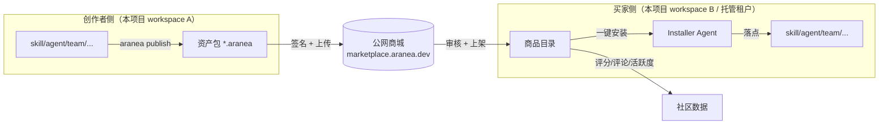

# M57 — 公网商城平台（Marketplace Platform, MKT）（SUPERSEDED）

> **⚠️ SUPERSEDED（归档 · 禁止开工）**
>
> **不要实现本模块。** 本文档是历史规划，不是待办。仓库中 **不存在** `cmd/marketplace`、`internal/marketplace`、`web/src/features/marketplace`；禁止按本文新建独立商城服务。
>
> 站内资产发现与安装走 **Ecosystem (M30)**：[`30-ecosystem.md`](./30-ecosystem.md)。本规划与 M30 易混，不要把 `/shop` 或 Ecosystem 当成「未完成的商城骨架」去补公网平台。
>
> 权威说明：[`65-module-cross-reference-full.md`](./65-module-cross-reference-full.md) 编号表与 §1.40。同系列：[设计](./57-marketplace-platform.design.md) · [开发计划](./57-marketplace-platform.development.md)。文件保留以免断链；下文验收清单已归档（非 ⏳/📋 待办）。

> **版本**：2026-05-26 · **状态**：📦 已归档 / SUPERSEDED（原「📋 需求草案」作废） · **优先级**：—（不再排期）
> **背景**：[30-ecosystem.md](./30-ecosystem.md)（站内安装与发现；**这才是现网能力**）· 本项目已有 `skill / mcp / tools / plugin / agent / team / graph / channel` 等可复用资产
> **关联**：M30 Ecosystem（现网；**不是**本规划的客户端骨架）· M53 Team/Graph · M22 Plugin · M20 Skill · M19 MCP · M23 Tools
> **影响范围**：下列路径均为历史规划、**均不存在、禁止创建**：`cmd/marketplace`、`internal/marketplace/*`、`internal/installer`、`web/src/features/marketplace`
> **红线**：依赖倒置 · `internal/biz` 不 import `pkg/trpc-agent-go` · （规划已归档，不再作为开工依据）

---

## 1. 模块定位

> **历史规划（已归档）**：下文描述的是当年拟建的公网商城，**不是**当前要做的事。现网能力是 M30 Ecosystem。

M30 Ecosystem 是「**单个 workspace 内的资产浏览与安装**」，所有商品都来自本地或人工预置；当年规划的 M57 拟把它推到 **公网多租户商城平台**（**未实现，已 SUPERSEDED**），使所有用户在本项目上沉淀的 **skill / mcp / tool / plugin / agent / team / channel / knowledge / workflow / company-bundle** 都可以：

| 维度 | 描述 |
|------|------|
| **发布**（Sell） | 创作者把本地资产打包、签名、提交审核、上架到公网商城 |
| **发现**（Discover） | 买家在公网商城按领域 / 能力 / 评分 / 活跃度 / 价格搜索浏览 |
| **评估**（Evaluate） | 评分、评论、活跃度、试用沙箱、运行截图、Demo Run |
| **交易**（Transact） | 免费 / 一次买断 / 订阅 / 企业授权 / 创作者分账 |
| **安装**（Install） | 买家一键下载 → **系统自动部署** 到本地实例或托管租户 |
| **运营**（Operate） | 创作者中心、买家工作台、版本更新、问题反馈、退款 |
| **治理**（Govern） | 内容审核、安全扫描、抄袭检测、投诉处理、下架 |

**核心定位（历史）**：当年拟将 M57 作为「Agent 资产生态网络」转折点，并把 M30 退化成 M57 客户端。**现状**：M57 未实现；M30 仍是现网 `/shop`。不要按该演进开工。

> 现状评估（含 M30 已具备能力、本项目资产成熟度、用户痛点）详见 [开发计划 §1 现状评估](./57-marketplace-platform.development.md#1-现状评估)。

---

## 2. 用户故事与痛点

### 2.1 用户角色

| 角色 | 描述 |
|------|------|
| 独立创作者 | 个人开发者，希望分享/变现自己沉淀的 Skill / Agent / Team |
| 中小团队 | 希望快速搭建场景化解决方案，复用现成资产 |
| 企业采购 | 批量采购多场景 Skill，需要企业授权与统一计费 |
| 运维 | 负责部署买回来的资产，关注安装便利性与回滚 |
| 安全 | 关注买回来的资产是否会窃取凭据/越权 |
| 平台审核员 | 负责内容审核、安全扫描、违规下架 |
| 平台运营 | 关注 GMV、活跃度、漏斗、退款率 |

### 2.2 用户故事级痛点

| 角色 | 故事 | 痛点 |
|------|------|------|
| 独立创作者 | "我做了一个'PR Review' 的 Team 想分享给社区" | 没有发布渠道；没法变现 |
| 中小团队 | "我们要快速搭建一个客服机器人" | 从零做太慢；需要现成 Team + Knowledge + 飞书 Channel |
| 企业采购 | "我要批量采购 30 个开发场景下的 Skill" | 没有企业授权、没有统一计费 |
| 运维 | "买回来的 Team 怎么装？" | 当前要手动 import JSON、配模型、配工具 → 一键部署缺失 |
| 安全 | "买回来的 Plugin 会不会偷我密钥？" | 没有沙箱、签名、权限声明 |
| 创作者 | "我想知道我的 Skill 被装了多少次、卡在哪一步" | 没有创作者中心数据 |

---

## 3. 目标与非目标

### 3.1 目标

1. **统一资产抽象**：定义 `Asset` 顶层 schema，覆盖 10 类资产（含 Company Bundle）。
2. **公网商城后端**：新增独立服务 `cmd/marketplace`，提供发布 / 发现 / 评分 / 交易 / 部署 API。
3. **一键自动部署**：买家点击安装 → 客户端 Installer Agent 完成「拉取 → 校验 → 依赖解析 → 落库 → 健康检查」。
4. **领域细化**：建立 **三级目录树**（领域 → 子领域 → 场景），每个 Asset 强制至少 1 个三级分类。
5. **社区度量**：评分 + 评论 + 活跃度（安装数、运行成功率、最近 30 天活跃使用数）。
6. **创作者经济**：免费 / 一次买断 / 订阅 / 企业授权 + 抽佣 + 月度结算。
7. **可信安装**：每个版本必须签名 + 权限声明 + 静态扫描；买家可在沙箱试用。
8. **M30 客户端化**：原 `/shop` 页面成为 M57 的官方第一方 Web 客户端。

### 3.2 非目标

- ❌ **不**重写资产本身（skill/mcp/tool/...），它们的运行时仍在主项目。
- ❌ **不**为商城做独立 LLM；商城是「资产分发与治理」，运行还是发生在买家侧。
- ❌ **不**做通用 Plugin Runtime 沙箱（Plugin 类资产暂不开放公开市场，仅企业内部市场可用）。
- ❌ **不**做加密货币 / 区块链；交易先走第三方支付（Stripe / Wechat Pay / Alipay）。
- ❌ **不**做联邦商城互通（v1 单一官方实例，v2 再考虑联邦）。

---

## 4. 资产分类与领域细化（MKT-1 核心）

### 4.1 资产类型（一级）

| 类型 ID | 中文名 | 安装落点 |
|---------|--------|----------|
| `skill` | 技能包 | `internal/skill` |
| `mcp_server` | MCP 服务 | `internal/mcp` |
| `tool` | 工具 | `internal/tools` |
| `plugin` | 插件 | `internal/plugin`（v1 仅企业市场） |
| `agent` | Agent 模板 | `internal/agent` |
| `team` | Team/Graph 编排 | `internal/team` + `internal/graph` |
| `channel_template` | Channel 模板 | `internal/channel` |
| `knowledge_pack` | 知识包 | `internal/knowledge` |
| `workflow` | 工作流 | 写入 `agents`/`teams`/`crons` |
| `company_bundle` | 公司整包 | 全 workspace 初始化 |

> 资产包（Bundle）结构、manifest.json 字段定义详见 [设计文档 §二 Asset Schema](./57-marketplace-platform.design.md#二asset-schemamkt-1)。

### 4.2 三级目录树（领域 → 子领域 → 场景）

> **强制**：每个 Asset 至少绑定 1 个三级类目；最多绑定 3 个。

| 一级领域 | 二级子领域 | 三级场景（举例） |
|----------|------------|------------------|
| **研发** | 编程 | 代码生成 / 代码审查 / 单测生成 / 性能分析 |
| | DevOps | CI 编排 / 容器编排 / 监控告警 / Runbook |
| | 数据工程 | ETL 编排 / 数据质量 / SQL 优化 |
| **办公** | 会议 | 纪要生成 / 待办抽取 / 多语翻译 |
| | 文档 | 文档撰写 / 摘要 / 翻译 / 校对 |
| | 协作 | 任务调度 / 周报生成 / 群机器人 |
| **客户** | 客服 | FAQ / 工单分流 / 多语客服 |
| | 销售 | 线索打分 / 销售助手 / CRM 集成 |
| | 营销 | 文案生成 / 选品分析 / A/B 推荐 |
| **行业** | 法律 | 合同审阅 / 案例检索 |
| | 医疗 | 病历摘要 / 用药咨询 |
| | 金融 | 财报分析 / 风控辅助 |
| | 教育 | 答疑助手 / 习题生成 |
| **内容** | 创意 | 故事生成 / 角色扮演 |
| | 多模态 | 图文生成 / 视频脚本 / 字幕 |
| | 翻译 | 多语翻译 / 本地化 |
| **其它** | 实验性 / 工具集合 / 节日活动 | — |

### 4.3 标签维度（多选）

| 标签维度 | 取值 |
|----------|------|
| `capability` | text-gen / rag / tool-use / long-task / multimodal / scheduled |
| `integration` | feishu / slack / dingtalk / wecom / email / webhook / notion / figma / github |
| `model_tier` | small / medium / large / 任意 |
| `language` | zh / en / ja / 多语 |
| `runtime` | local-only / cloud-only / hybrid |
| `license` | mit / apache-2.0 / aranea-commercial / 私有 |
| `compatibility` | aranea>=1.5 |

---

## 5. 核心功能需求

### 5.1 MKT-2 Catalog & Discovery（发现）

| 入口 | 能力 |
|------|------|
| 关键词搜索 | 按名称/描述/作者/标签匹配 |
| 三级分类树 | 左侧目录树，按一/二/三级筛选 |
| 排序 | 热度 / 新上架 / 评分 / 安装数 / 活跃度 / 价格 |
| 过滤 | 类型、license、价格段、兼容性、language |
| 详情页 | 截图、README、CHANGELOG、权限声明、依赖图、评分分布、Demo Run |
| 创作者主页 | 作品集、累计评分、累计安装数、关注按钮 |
| 榜单 | 周榜 / 月榜 / 新人榜 / 行业榜 |
| 推荐 | 基于安装历史与浏览行为（v2 起，v1 用规则） |

### 5.2 MKT-3 Publish & Review（发布与审核）

**发布流程（创作者）**：草稿 → 提交 → 自动扫描 → 人工审核 → 上架 / 驳回 / 修复重提。

**审核检查项**：

| 维度 | 自动 | 人工 |
|------|------|------|
| 签名有效性 | ✅ | — |
| 静态扫描（已知漏洞、可疑 URL、敏感词） | ✅ | — |
| 抄袭检测（哈希 + 文本相似度） | ✅ | ⚠️ 高分送审 |
| 权限声明合理性 | ✅ 必填校验 | ✅ 是否过度 |
| 描述/截图质量 | ⚠️ 规则 | ✅ |
| 商业资质（付费 Asset） | ❌ | ✅ |

**版本管理**：

- SemVer：`major.minor.patch`
- 主版本变更必须新提交审核；patch 走快速通道
- 旧版本至少保留 90 天供已购买用户回滚
- `deprecated` 状态不再被发现，但已购可继续安装

> 发布状态机、自动扫描组件实现详见 [设计文档 §九 审核流程](./57-marketplace-platform.design.md#九审核流程mkt-3)。

### 5.3 MKT-4 Rating / Review / Community（社区度量）

| 指标 | 计算 |
|------|------|
| **评分** | 1-5 星，去除一周内重复，加权（已购买 1.0，试用 0.5） |
| **评论** | Markdown，支持创作者回复，支持举报 |
| **活跃度 Activity Score** | 30 天内 = α·安装数 + β·成功运行次数 + γ·活跃 workspace 数 - δ·失败率 |
| **健康度 Health** | 7 天内冒烟测试通过率 × 99 - 平均报错率 |
| **创作者信誉** | 累计 5★ 比例、申诉成功率、有效投诉数 |
| **关注 / 收藏** | workspace 维度 |

**反作弊**：

- 同 workspace 24h 内同 Asset 评分仅记最新
- IP / 设备指纹 + 评论文本聚类
- 新账号评分需经 7 天冷却期生效
- 创作者不可给自己 Asset 评分

### 5.4 MKT-5 Payment & License（支付与许可）

| 价格模型 | 说明 |
|----------|------|
| `free` | 免费下载，可选「打赏」 |
| `one_time` | 买断（永久使用该 major 版本系列） |
| `subscription` | 月付 / 年付，停付后宽限 30 天 |
| `enterprise` | 私下议价 + 离线 License Key |
| `tiered` | 按 workspace 数 / 调用次数分级 |

**许可证（License Token）**：

- JWT 形式，含 `asset_id / version / buyer_id / expires_at / scope`
- 安装时 Installer 提交给商城验证；商城下发临时下载 URL
- 离线运行使用嵌入的离线许可证（公钥校验），不强制联网

**分账**：

- 默认 平台 15% / 创作者 85%；企业渠道可单议
- 月度结算，T+15 打款（Stripe Connect / 支付宝 / 微信）
- 退款窗口：7 天，未启动安装则全额；已安装按使用天数比例

### 5.5 MKT-6 Auto-Deployment（自动部署）

**两种部署目标**：

#### A. 买家本地部署（Aranea workspace 已存在）

- 买家在 Web 点击安装 → 商城签发 License + 下发 bundle URL → 客户端 Installer Agent 完成「拉取 → 校验签名 → 依赖解析 → 落库 → 冒烟测试」
- CLI 等价命令：`aranea install <asset@version>`
- 依赖解析：参考 npm/cargo 的拓扑算法，失败任意一项整体回滚（事务 + staging 区）
- 冲突处理：检测 ID 冲突时提示「跳过 / 覆盖 / 重命名」

#### B. 托管租户部署（买家无本地实例，Aranea SaaS 托管）

- 商城团队部署 K8s/Nomad 编排器，按租户独立 Namespace + PG schema + 对象存储 prefix + 模型 API 配额
- 计费：托管费 + 模型用量；与 Asset 价格分开

> 安装时序图、Stage 事务/回滚实现、Service 层接入详见 [设计文档 §七 买家侧 Installer](./57-marketplace-platform.design.md#七买家侧-installer主项目-internalinstaller) 与 [§八 自动部署](./57-marketplace-platform.design.md#八自动部署mkt-6托管租户编排)。

### 5.6 MKT-7 Operations & Telemetry（运营）

| 角色 | 工作台能力 |
|------|------------|
| **创作者** | 安装数曲线、收入、版本审核状态、评分明细、评论回复、问题列表 |
| **买家** | 已购 Asset、安装状态、健康度、更新提醒、退款入口 |
| **审核员** | 待审队列、自动扫描结果、相似度对比、批准/驳回 |
| **运营** | GMV、活跃创作者、活跃买家、漏斗、退款率、举报处理 |
| **安全** | 风险事件、可疑账号、违规下架记录 |

**Telemetry 回流**：

- 买家侧 Installer 在每次 Asset 运行成功/失败时上报匿名计数（可关闭）
- 商城聚合后产出活跃度 / 健康度
- 不收集任何业务数据（仅次数 + 错误码 + 版本）

### 5.7 MKT-8 Company Bundle（公司整包）

> 把整个 workspace（多 Agent + 多 Team + Skill + Channel + Knowledge + 配置）打成一个最高级别的资产。

| 应用场景 | 例子 |
|----------|------|
| 行业方案 | 「跨境电商客服整包」：飞书 Channel + 7 个 Agent + 3 个 Team + FAQ 知识 |
| SI 交付 | 系统集成商把项目交付物打包给最终客户 |
| 培训/教育 | 教学课程整包，含示例 Team + 测验 |
| 内部复制 | 总部 → 分公司 workspace 初始化 |

**特殊需求**：

- Manifest 嵌套展开其它 Asset 引用，可来自商城或随包内嵌
- 安装时进入「**Workspace 初始化向导**」：用户被引导逐步配置凭据、模型、Channel 绑定
- 支持「**Diff 模式**」：在已存在 workspace 上叠加安装，冲突走人工选择
- 价格通常更高，且常以 `enterprise` 模型出售

---

## 6. 非功能需求

### 6.1 多租户与鉴权

- 商城账户体系：邮箱 / OAuth（GitHub / 飞书 / 钉钉）
- workspace 绑定：一个商城账户可绑定多个 Aranea workspace，安装目标按 workspace 选
- API 鉴权：JWT + workspace_id scope
- 创作者实名：必须实名 + 银行/对公账户才可上架付费 Asset

### 6.2 安全 & 合规

- 创作者 KYC（实名 + 银行账户）才可发付费 Asset
- ed25519 签名：商城颁发创作者公钥/私钥对（私钥本地保存，可轮换）
- bundle 内容哈希 + manifest 签名 + 商城再签名（双重）
- v1 Skill / MCP / Tool / Agent / Team / Channel / Knowledge 默认允许，因为运行权限在买家侧 Aranea 已有边界
- Plugin（代码注入型）**v1 不公开**，仅企业市场或 OSS 白名单
- 平台用户协议、创作者条款、退款政策、内容合规政策
- DMCA / 著作权投诉流程
- 跨境支付：v1 中国大陆与海外分两个独立 Stripe 实体 + 独立部署

### 6.3 度量与目标 KPI（MKT-7）

| 维度 | 指标 | 6 个月目标 |
|------|------|------------|
| 内容 | 上架 Asset 数 | ≥ 500 |
| 创作者 | 月活创作者 | ≥ 100 |
| 买家 | 月活买家 workspace | ≥ 5,000 |
| 交易 | 月 GMV | ≥ ¥100k（v1 起步阶段） |
| 质量 | 7 天内 1★ 评分占比 | ≤ 5% |
| 质量 | 已购 Asset 7 天健康度均值 | ≥ 95% |
| 安装 | 一键安装成功率 | ≥ 98% |
| 信任 | 安全事件（含投诉成立） | ≤ 1 / 月 |

> 监控、可观测、SLO 详见 [设计文档 §十二 监控、可观测、SLO](./57-marketplace-platform.design.md#十二监控可观测slo)。

---

## 7. 风险与对策

| 风险 | 描述 | 对策 |
|------|------|------|
| 内容安全 | 恶意 Plugin / Skill 窃取凭据 | v1 仅开放 skill/mcp/tool/agent/team/channel/knowledge；plugin 走企业市场；强制权限声明 + 沙箱 |
| 版权抄袭 | 创作者上传他人作品 | 哈希 + 文本相似度自动比对；DMCA 投诉通道 |
| 自动部署失败 | 依赖冲突 / 凭据缺失 | staging 区事务 + 一键回滚 + 配置向导 |
| 商业纠纷 | 退款争议 / 收款失败 | 7 天退款窗 + 三方仲裁条款 |
| 法律合规 | 跨境支付与数据出境 | 第一期仅中国大陆 + 国际两套独立部署 |
| 平台依赖 | 创作者绑死单一商城 | 提供 `aranea export` 反向迁移；Asset 包格式开源 |
| 监管 | 内容审查 | 接入第三方内容安全 API（图片 + 文本） |

---

## 8. 与 M30 的关系

| 项 | M30 Ecosystem | M57 Marketplace Platform |
|----|---------------|--------------------------|
| 形态 | 主项目内子页面 | 独立公网服务 |
| 商品来源 | 本地预置 / 手填 | 公网创作者 |
| 资产类型 | 3 类 | 10 类 |
| 评分 | 单分数 | 评分 + 评论 + 活跃度 |
| 部署 | 单 workspace | 多 workspace + 托管租户 |
| 交易 | ❌ | ✅ |
| 关系 | 升级为 M57 客户端 | M57 的官方第一方入口 |

**M30 在 M57 上线后的演进（历史规划 · 已归档，禁止执行）**：

- 保留 `/shop` 路由，但所有数据来自 M57 API
- 增加「我的购买」「我的安装」「凭据管理」等买家工作台
- 创作者入口跳转到 M57 创作者中心（公网）

---

## 9. 验收标准（DoD）

> **已归档**：以下为历史规划目标，**不是**待实现 DoD。禁止按本清单开工。

- 📦 已归档：10 类 Asset 均有 reference bundle 通过完整发布→审核→安装→运行链路
- 📦 已归档：任意创作者可在 5 分钟内完成首个 Skill 上架
- 📦 已归档：任意买家可在 30 秒内完成一键安装并通过冒烟测试
- 📦 已归档：安装失败率 ≤ 2%，且失败时可自动回滚
- 📦 已归档：商城后端 P99 < 200ms（搜索除外，< 500ms）
- 📦 已归档：红线 CI：商城后端无 `pkg/trpc-agent-go` import；主项目 `internal/installer` 仅依赖 `api/marketplace/v1`
- 📦 已归档：安全审计：签名、权限、沙箱、支付通道三方审计通过
- 📦 已归档：完整 e2e 测试覆盖 publish / install / rating / refund 主路径

---

## 10. 附录

### 10.1 关联需求

- [30-ecosystem.md](./30-ecosystem.md) — 本需求的前身与未来客户端
- [20-skill.md](./20-skill.md) · [19-mcp.md](./19-mcp.md) · [23-tools.md](./23-tools.md)
- [22-plugin.md](./22-plugin.md) · [11-multi-agent.md](./11-multi-agent.md) · [36-graph-workflow.md](./36-graph-workflow.md)
- [53-team-graph-orchestration.md](./53-team-graph-orchestration.md) · [17-channel.md](./17-channel.md)
- [37-knowledge.md](./37-knowledge.md) — Knowledge 资产
- [56-business-logic-optimization.md](./56-business-logic-optimization.md) — 前置依赖（BackgroundJob）

> 命名与编号、服务边界、依赖红线、Proto 路径、配置等设计细节详见 [设计文档](./57-marketplace-platform.design.md)。
> 里程碑节奏、sprint 拆分、任务清单详见 [开发计划](./57-marketplace-platform.development.md)。
