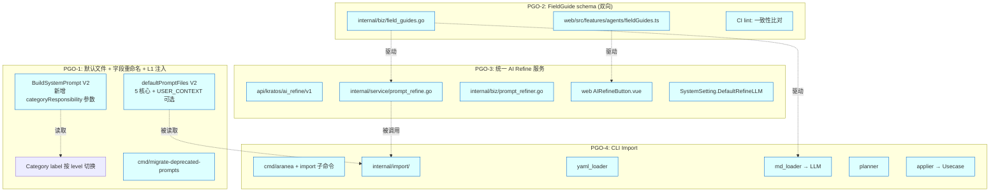
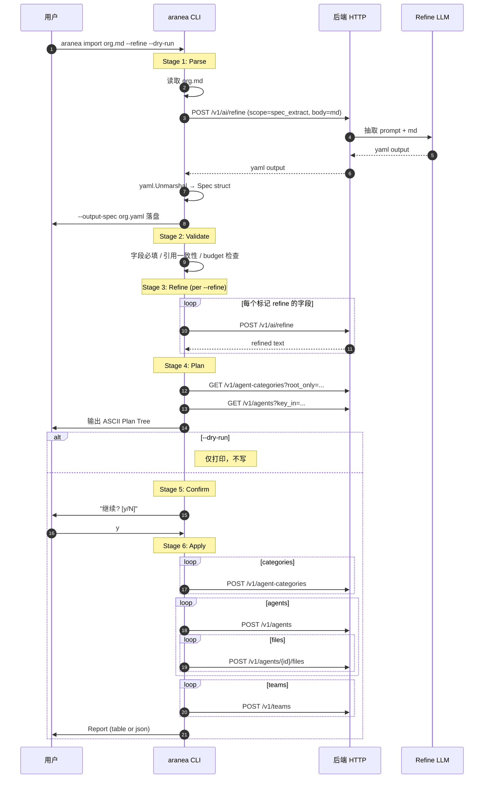

# M58 — Prompt 治理与组织自动化（PGO）设计文档

> **版本**：2026-05-27 · **状态**：📋 设计草案 · **依据需求**：[58 prompt-governance.md](./58%20prompt-governance.md)
> **作用**：把需求文档的"做什么"翻译为"怎么做"——含模块切分、接口签名、数据模型、状态机、时序图、与现网代码的对接点。AI 与人类工程师都应能依据本文档直接落地。
> **红线复述**：`internal/biz` 不 import `pkg/trpc-agent-go`；Runner 装配仅在 `internal/service`；`cmd/aranea/` 二进制不 import `internal/biz` `internal/agent` `internal/data` `internal/server` `pkg/trpc-agent-go`。

---

## 0. 总体架构图



---

## 1. PGO-1：文件裁减 + 字段重命名 + L1 注入

### 1.1 默认文件清单 V2

**改动文件**：`internal/biz/agent_settings_helpers.go`

```go
// 旧（9 文件，4 个无用 stub）
func defaultPromptFiles() []AgentPromptFile { ... 9 items ... }

// 新（5 核心，按 sort_order 注入；USER_CONTEXT.md 由"添加可选文件"动作单独创建）
func defaultPromptFiles() []AgentPromptFile {
    return []AgentPromptFile{
        {Name: "AGENTS_CORE.md",  Body: stubBody("AGENTS_CORE"),  SortOrder: 10},
        {Name: "AGENTS_TASK.md",  Body: stubBody("AGENTS_TASK"),  SortOrder: 20},
        {Name: "IDENTITY.md",     Body: stubBody("IDENTITY"),     SortOrder: 30}, // 含 ## Persona 段
        {Name: "CAPABILITIES.md", Body: stubBody("CAPABILITIES"), SortOrder: 40},
        {Name: "RULE.md",         Body: stubBody("RULE"),         SortOrder: 50},
    }
}

// 可选文件模板（前端"添加可选文件"动作弹窗使用）
var OptionalPromptFileTemplates = map[string]AgentPromptFile{
    "USER_CONTEXT.md": {Name: "USER_CONTEXT.md", Body: stubBody("USER_CONTEXT"), SortOrder: 60},
}
```

`stubBody` 引用 PGO-2 的 `FieldGuide.DefaultStub`（同一份 schema）。

### 1.2 FilesForMode V2

```go
// internal/biz/agent_settings_helpers.go
func FilesForMode(files []AgentPromptFile, mode string) []AgentPromptFile {
    switch strings.ToLower(strings.TrimSpace(mode)) {
    case "", "complete":
        return files
    case "none":
        return nil
    case "minimized":
        return filterByName(files, "AGENTS_CORE.md", "RULE.md")
    case "task":
        return filterByName(files,
            "AGENTS_CORE.md", "IDENTITY.md", "RULE.md",
            "AGENTS_TASK.md", "CAPABILITIES.md")
        // ← 移除 HEARTBEAT.md
    default:
        return filterByName(files, "AGENTS_CORE.md", "RULE.md")
    }
}
```

### 1.3 BuildSystemPrompt V2（新增 categoryResponsibility 参数）

**改动文件**：`internal/agent/prompt.go`

```go
// 旧
func BuildSystemPrompt(agent biz.Agent, files []biz.AgentPromptFile, mode string) string

// 新（向后兼容：传入空字符串相当于旧行为）
func BuildSystemPrompt(
    agent biz.Agent,
    files []biz.AgentPromptFile,
    mode string,
    categoryResponsibility string, // ← 新增；来自 PGO-1.4
) string {
    var b strings.Builder
    if cr := strings.TrimSpace(categoryResponsibility); cr != "" {
        b.WriteString(`<role_responsibility source="category">` + "\n")
        b.WriteString(cr)
        b.WriteString("\n</role_responsibility>\n\n")
    }
    if d := strings.TrimSpace(agent.AgentDescription); d != "" {
        b.WriteString(d)
        b.WriteString("\n\n")
    }
    filtered := biz.FilesForMode(files, mode)
    for _, f := range filtered {
        body := strings.TrimSpace(f.Body)
        if body == "" { continue }
        b.WriteString(fmt.Sprintf("<internal_config name=%q>\n", f.Name))
        b.WriteString(body)
        b.WriteString("\n</internal_config>\n\n")
    }
    return strings.TrimSpace(b.String())
}
```

**所有调用方**（仅 2 处）：
- `internal/agent/trpc_build.go` 第 76 行附近：新增加载 categoryResponsibility 的步骤（见 1.4）
- `internal/agent/prompt_preview.go` 第 30–50 行：同样需要新增

### 1.4 岗位职责注入策略

**新增方法**：`internal/biz/agent_category.go`

```go
type AgentCategoryUsecase interface {
    // 已有
    Create(ctx context.Context, n *AgentCategory) error
    // ... 其他已有方法

    // 新增
    BuildResponsibility(ctx context.Context, positionID int64, mode string) (string, error)
}

// 默认实现
func (uc *agentCategoryUsecase) BuildResponsibility(ctx context.Context, posID int64, mode string) (string, error) {
    if posID == 0 || !shouldInjectForMode(mode) {
        return "", nil
    }
    pos, err := uc.repo.Get(ctx, posID)
    if err != nil || pos == nil || pos.Level != 3 {
        return "", err
    }
    posDesc := truncate(strings.TrimSpace(pos.Description), budgetForMode(mode, "position"))

    if mode == "complete" && pos.ParentID != 0 {
        dept, _ := uc.repo.Get(ctx, pos.ParentID)
        if dept != nil && strings.TrimSpace(dept.Description) != "" {
            return posDesc + "\n\n部门职责：" + strings.TrimSpace(dept.Description), nil
        }
    }
    return posDesc, nil
}

func shouldInjectForMode(mode string) bool {
    switch strings.ToLower(mode) {
    case "minimized", "none":
        return false
    default:
        return true
    }
}

func budgetForMode(mode, scope string) int {
    // 与 FieldGuide budget 对齐；task 模式岗位职责截断到 300
    if mode == "task" && scope == "position" { return 300 }
    return 1000
}
```

**调用方**：`internal/agent/trpc_build.go`

```go
// 在调用 BuildSystemPrompt 前加载
var catResp string
if !ag.SkipCategoryResponsibility() && ag.CategoryPositionID != 0 {
    catResp, _ = d.AgentCategory.BuildResponsibility(ctx, ag.CategoryPositionID, ag.SystemPromptMode)
}
sys := BuildSystemPrompt(ag, files, ag.SystemPromptMode, catResp)
```

**Skip 机制**：复用 `agent.metadata_json` —— 不新增 ent 列。

```go
// internal/biz/agent_types.go
func (a Agent) SkipCategoryResponsibility() bool {
    if a.MetadataJSON == "" { return false }
    var m struct{ SkipCategoryResponsibility bool `json:"skip_category_responsibility"` }
    _ = json.Unmarshal([]byte(a.MetadataJSON), &m)
    return m.SkipCategoryResponsibility
}
```

### 1.5 分类管理 UI label 按 level 切换

**改动文件**：
- `web/src/pages/AgentCategoriesPage.vue`：description textarea label 根据 `node.level` 切换
- `web/src/components/agents/CategoryTreeNodeHeader.vue`：caption 同步
- `web/src/components/agents/AgentCategoryPositionCard.vue`：标题与展示统一

```ts
// web/src/features/platform/categoryLabels.ts （新增）
export function descriptionLabel(level: 1 | 2 | 3): string {
    switch (level) {
        case 1: return '行业说明';
        case 2: return '部门职责';
        case 3: return '岗位职责';
    }
}
export function descriptionPlaceholder(level: 1 | 2 | 3): string {
    return fieldGuides[`category.level${level}`].placeholder;
}
```

### 1.6 SOUL → IDENTITY 合并

**改动文件**：`internal/biz/evolution.go::ApplySuggestion`

```go
// 旧：suggestion.type==persona 写入 SOUL.md
// 新：写入 IDENTITY.md 的 `## Persona` 段（anchor 替换）
func applyPersonaSuggestion(files []*AgentPromptFile, persona string) {
    target := findOrCreate(files, "IDENTITY.md")
    target.Body = replaceOrAppendAnchor(target.Body, "## Persona", persona)
}

func replaceOrAppendAnchor(body, anchor, content string) string {
    // 1. 若 body 含 anchor 段（自该 anchor 起到下一个同级 anchor 或文件末），替换该段内容
    // 2. 否则在 body 末尾追加 "\n\n" + anchor + "\n" + content
}
```

### 1.7 一次性迁移：`cmd/migrate-deprecated-prompts/main.go`

```
功能：
1) 扫描所有 agent_prompt_files
2) 对每个 agent:
   a) 若 SOUL.md 非 stub：将内容追加到 IDENTITY.md 的 ## Persona 段；
      SOUL.md body 改为 deprecated marker "DEPRECATED 2026-05-27: see IDENTITY.md ## Persona"
   b) 若 USER.md / USER_PREDEFINED.md 非 stub：合并为 USER_CONTEXT.md（创建该文件）
   c) HEARTBEAT.md：内容（若非 stub）记录到 agent.metadata_json.heartbeat_legacy_body，文件改为 deprecated marker
3) 全程 dry-run by default；--apply 真写入；--prune-deprecated 在 30 天后用于清理 deprecated 标记文件

CLI:
go run ./cmd/migrate-deprecated-prompts/ --dsn=... --dry-run
go run ./cmd/migrate-deprecated-prompts/ --dsn=... --apply
go run ./cmd/migrate-deprecated-prompts/ --dsn=... --prune-deprecated --apply
```

---

## 2. PGO-2：FieldGuide schema（双向）

### 2.1 数据结构（Go）

**新增文件**：`internal/biz/field_guides.go`

```go
package biz

type FieldScope string

const (
    ScopeCategoryIndustry   FieldScope = "category.industry"   // level=1
    ScopeCategoryDepartment FieldScope = "category.department" // level=2
    ScopeCategoryPosition   FieldScope = "category.position"   // level=3
    ScopeAgentDescription   FieldScope = "agent.description"
    ScopeAgentFile          FieldScope = "agent.file"
)

type FieldGuide struct {
    Scope        FieldScope
    FileName     string       // 仅 ScopeAgentFile 用：AGENTS_CORE.md 等
    TitleZh      string       // UI 卡片标题
    Purpose      string       // 一句话用途
    ShouldWrite  []string     // "该写"列表
    ShouldAvoid  []string     // "不该写"列表
    Examples     []GuideExample
    Budget       GuideBudget
    Placeholder  string       // textarea placeholder
    DefaultStub  string       // 新建 Agent 时该文件 body 默认内容
}

type GuideExample struct {
    Industry string // "电商" / "医疗" / "教育" 等
    Body     string
}

type GuideBudget struct {
    Soft int // 软上限（黄色提示）
    Hard int // 硬上限（红色 / 不允许保存）
}

// 全局注册表（init 时注入）
var fieldGuideRegistry = map[FieldGuideKey]FieldGuide{}

type FieldGuideKey struct {
    Scope    FieldScope
    FileName string // 仅 ScopeAgentFile 用
}

func GetFieldGuide(scope FieldScope, fileName string) (FieldGuide, bool) {
    g, ok := fieldGuideRegistry[FieldGuideKey{scope, fileName}]
    return g, ok
}

func init() {
    register(FieldGuide{
        Scope: ScopeCategoryPosition,
        TitleZh: "岗位职责",
        Purpose: "这个岗位的核心职责清单、能/不能做的边界、典型工作流、KPI。",
        ShouldWrite: []string{
            "主要职责：3–5 条 bullet",
            "工作边界：能做什么 / 不能做什么各 2–3 条",
            "典型流程：1–3 个常见 workflow 标题",
            "关键 KPI：1–3 条可衡量指标",
        },
        ShouldAvoid: []string{
            "复制 Agent 的话术（请去 agent_description 或 IDENTITY.md）",
            "长流程 SOP（请去 AGENTS_TASK.md）",
            "跨行业通用知识（请去行业说明）",
        },
        Budget:      GuideBudget{Soft: 800, Hard: 1000},
        Placeholder: "示例：1) 处理售后退换货 ... 2) 不可承诺超出政策的赔付 ...",
        DefaultStub: "# 岗位职责\n（请描述本岗位的主要职责、边界、流程与 KPI）",
        Examples:    [...]GuideExample{},
    })
    // ... 其他 4 个 scope 的注册项见附录 A
}
```

### 2.2 数据结构（TS，镜像）

**新增文件**：`web/src/features/agents/fieldGuides.ts`

```ts
export type FieldScope =
  | 'category.industry' | 'category.department' | 'category.position'
  | 'agent.description' | 'agent.file';

export interface FieldGuide {
  scope: FieldScope;
  fileName?: string;
  titleZh: string;
  purpose: string;
  shouldWrite: string[];
  shouldAvoid: string[];
  examples: Array<{ industry: string; body: string }>;
  budget: { soft: number; hard: number };
  placeholder: string;
  defaultStub: string;
}

export const fieldGuides: Record<string, FieldGuide> = {
  // key = scope + ":" + fileName (or "" if not applicable)
  'category.industry:': { /* ... */ },
  'category.department:': { /* ... */ },
  'category.position:': { /* ... */ },
  'agent.description:': { /* ... */ },
  'agent.file:AGENTS_CORE.md': { /* ... */ },
  'agent.file:AGENTS_TASK.md': { /* ... */ },
  'agent.file:IDENTITY.md': { /* ... */ },
  'agent.file:CAPABILITIES.md': { /* ... */ },
  'agent.file:RULE.md': { /* ... */ },
  'agent.file:USER_CONTEXT.md': { /* ... */ },
};

export function getGuide(scope: FieldScope, fileName?: string): FieldGuide | undefined {
  return fieldGuides[`${scope}:${fileName ?? ''}`];
}
```

### 2.3 一致性 lint

**新增文件**：`cmd/araneactl/fieldguide-lint/main.go`

```
作用：在 CI 上比对 internal/biz/field_guides.go 与 web/src/features/agents/fieldGuides.ts 的 key/budget/scope。
机制：
  1. 后端 go run -tags=lint ./cmd/araneactl/fieldguide-lint dump > guide.go.json
  2. 前端 node scripts/dump-field-guides.mjs > guide.ts.json
  3. diff guide.go.json guide.ts.json --ignore-keys=examples.body  (内容文案前后端可独立优化)
  4. 不一致即 fail
Makefile target: make fieldguide-lint
集成到 make ci。
```

### 2.4 前端组件

**新增**：`web/src/components/agents/FieldGuide.vue`

```vue
<script setup lang="ts">
import { computed } from 'vue';
import { getGuide, type FieldScope } from '@/features/agents/fieldGuides';

const props = defineProps<{
  scope: FieldScope;
  fileName?: string;
  modelValue: string;
}>();

const guide = computed(() => getGuide(props.scope, props.fileName));
const chars = computed(() => props.modelValue.length);
const budgetClass = computed(() => {
  if (!guide.value) return '';
  if (chars.value > guide.value.budget.hard) return 'text-error';
  if (chars.value > guide.value.budget.soft) return 'text-warning';
  return 'text-positive';
});
</script>

<template>
  <q-expansion-item :label="guide?.titleZh + ' — 填写指南'" caption="点击展开" default-closed>
    <div class="q-pa-md text-body2">
      <p><strong>用途：</strong>{{ guide?.purpose }}</p>
      <p><strong>建议写：</strong></p>
      <ul><li v-for="i in guide?.shouldWrite" :key="i">{{ i }}</li></ul>
      <p><strong>不要写：</strong></p>
      <ul><li v-for="i in guide?.shouldAvoid" :key="i">{{ i }}</li></ul>
      <q-btn flat dense label="查看示例" @click="showExamples = true" />
    </div>
  </q-expansion-item>
  <div class="text-caption" :class="budgetClass">
    {{ chars }} / {{ guide?.budget.soft }} 字符（硬上限 {{ guide?.budget.hard }}）
  </div>
  <FieldGuideExamplesDialog v-model="showExamples" :guide="guide" />
</template>
```

挂载位置：分类管理页 description textarea 上方；Agent 描述 textarea 上方；文件 Tab 每个 Editor 顶部。

---

## 3. PGO-3：统一 AI Refine 服务

### 3.1 Proto 定义

**新增文件**：`api/kratos/ai_refine/v1/ai_refine.proto`

```proto
syntax = "proto3";
package api.kratos.ai_refine.v1;

import "google/api/annotations.proto";

option go_package = "aranea-agents/api/kratos/ai_refine/v1;v1";

service AIRefineService {
  rpc Refine(RefineRequest) returns (RefineResponse) {
    option (google.api.http) = {
      post: "/v1/ai/refine"
      body: "*"
    };
  }
}

enum RefineScope {
  REFINE_SCOPE_UNSPECIFIED       = 0;
  REFINE_SCOPE_CATEGORY_INDUSTRY = 1;
  REFINE_SCOPE_CATEGORY_DEPT     = 2;
  REFINE_SCOPE_CATEGORY_POSITION = 3;
  REFINE_SCOPE_AGENT_DESCRIPTION = 4;
  REFINE_SCOPE_AGENT_FILE        = 5;
}

message RefineRequest {
  RefineScope scope        = 1;
  string      resource_id  = 2; // category_id / agent_id / file_id（仅审计与选模型）
  string      file_name    = 3; // 仅 AGENT_FILE 用
  string      original_text = 4;
  string      user_hint    = 5; // 用户的"我想要..."自由指令
  string      target_mode  = 6; // complete/task/minimized（影响目标长度）
}

message RefineResponse {
  string refined  = 1;
  string diff     = 2; // unified diff
  int32  tokens_before = 3;
  int32  tokens_after  = 4;
  string provider = 5; // 实际使用的 provider
  string model    = 6; // 实际使用的 model
  string source   = 7; // "agent_model" / "system_default" / "catalog_first"
}
```

### 3.2 Service 层

**新增文件**：`internal/service/prompt_refine.go`

```go
package service

import (
    "context"
    pb "aranea-agents/api/kratos/ai_refine/v1"
    "aranea-agents/internal/biz"
)

type AIRefineService struct {
    pb.UnimplementedAIRefineServiceServer
    refiner   *biz.PromptRefiner   // PGO-3 核心
    rateLimit *RefineRateLimiter
}

func (s *AIRefineService) Refine(ctx context.Context, req *pb.RefineRequest) (*pb.RefineResponse, error) {
    if err := s.rateLimit.Allow(ctx); err != nil { return nil, err }

    biz.ValidateRefineInput(req)         // 字符数上限 5000；scope/resource_id 合规

    out, err := s.refiner.Refine(ctx, biz.RefineRequest{
        Scope:        biz.FieldScope(req.Scope),
        ResourceID:   req.ResourceId,
        FileName:     req.FileName,
        OriginalText: req.OriginalText,
        UserHint:     req.UserHint,
        TargetMode:   req.TargetMode,
    })
    if err != nil { return nil, err }

    return &pb.RefineResponse{
        Refined:      out.Refined,
        Diff:         out.Diff,
        TokensBefore: int32(out.TokensBefore),
        TokensAfter:  int32(out.TokensAfter),
        Provider:     out.Provider,
        Model:        out.Model,
        Source:       string(out.ModelSource),
    }, nil
}
```

### 3.3 biz 层（核心实现）

**新增文件**：`internal/biz/prompt_refiner.go`

```go
package biz

type PromptRefiner struct {
    agents       AgentRepository
    sysSettings  SystemSettingUsecase
    modelCatalog LlmProviderModelUsecase
    llm          LLMCaller // 见 §3.4：openai_compat 抽象
}

type RefineRequest struct {
    Scope        FieldScope
    ResourceID   string
    FileName     string
    OriginalText string
    UserHint     string
    TargetMode   string
}

type RefineResult struct {
    Refined      string
    Diff         string
    TokensBefore int
    TokensAfter  int
    Provider     string
    Model        string
    ModelSource  ModelSource // "agent_model" / "system_default" / "catalog_first"
}

type ModelSource string

const (
    ModelSourceAgent         ModelSource = "agent_model"
    ModelSourceSystemDefault ModelSource = "system_default"
    ModelSourceCatalogFirst  ModelSource = "catalog_first"
)

func (r *PromptRefiner) Refine(ctx context.Context, req RefineRequest) (*RefineResult, error) {
    guide, ok := GetFieldGuide(req.Scope, req.FileName)
    if !ok { return nil, ErrUnknownScope }

    provider, model, source, err := r.resolveModel(ctx, req)
    if err != nil { return nil, err }

    sys := buildRefineSystemPrompt(guide, req.TargetMode)
    user := buildRefineUserPrompt(req.OriginalText, req.UserHint, guide)

    out, err := r.llm.Chat(ctx, provider, model, sys, user)
    if err != nil { return nil, err }

    refined := strings.TrimSpace(out)
    if len(refined) > guide.Budget.Hard {
        refined = truncateOnLine(refined, guide.Budget.Hard)
    }

    return &RefineResult{
        Refined:      refined,
        Diff:         unifiedDiff(req.OriginalText, refined),
        TokensBefore: estimateTokens(req.OriginalText),
        TokensAfter:  estimateTokens(refined),
        Provider:     provider,
        Model:        model,
        ModelSource:  source,
    }, nil
}

func (r *PromptRefiner) resolveModel(ctx context.Context, req RefineRequest) (string, string, ModelSource, error) {
    // 1) Agent scope → 该 Agent 的 provider/model
    if req.Scope == ScopeAgentDescription || req.Scope == ScopeAgentFile {
        if id, _ := strconv.ParseInt(req.ResourceID, 10, 64); id > 0 {
            if ag, _ := r.agents.Get(ctx, id); ag != nil && ag.Provider != "" && ag.Model != "" {
                return ag.Provider, ag.Model, ModelSourceAgent, nil
            }
        }
    }
    // 2) System default
    if s, _ := r.sysSettings.Get(ctx); s != nil && s.DefaultRefine != nil {
        if s.DefaultRefine.Provider != "" && s.DefaultRefine.Model != "" {
            return s.DefaultRefine.Provider, s.DefaultRefine.Model, ModelSourceSystemDefault, nil
        }
    }
    // 3) Catalog first
    list, err := r.modelCatalog.List(ctx, ListOpts{Limit: 1, Enabled: true})
    if err != nil || len(list) == 0 { return "", "", "", ErrNoLLMAvailable }
    return list[0].Provider, list[0].Model, ModelSourceCatalogFirst, nil
}
```

### 3.4 裸 LLM 调用抽象

**新增文件**：`internal/biz/llm_caller.go`（接口在 biz）+ `internal/agent/llm_caller_impl.go`（实现在 agent）

```go
// internal/biz/llm_caller.go
package biz

type LLMCaller interface {
    // 单次 system+user → completion，无 session / no memory
    Chat(ctx context.Context, provider, model, systemPrompt, userPrompt string) (string, error)
}

// internal/agent/llm_caller_impl.go
package agent

type OpenAICompatLLMCaller struct{}

func (c *OpenAICompatLLMCaller) Chat(ctx context.Context, provider, model, sys, user string) (string, error) {
    return CallOpenAICompatChat(ctx, provider, model, sys, user)
}
```

依赖方向：`biz.PromptRefiner` 通过接口持有 `LLMCaller`，实现在 `agent` 包；wire 装配在 `internal/service/wire.go`。**不违反 biz → agent 禁止规则**（biz 只依赖接口）。

### 3.5 Refine prompt 模板

```go
func buildRefineSystemPrompt(g FieldGuide, mode string) string {
    var b strings.Builder
    b.WriteString("你是 Aranea 平台的 prompt 优化助手。\n\n")
    fmt.Fprintf(&b, "【当前优化对象】%s\n\n", g.TitleZh)
    fmt.Fprintf(&b, "【字段指南】%s\n", g.Purpose)
    b.WriteString("该写：\n")
    for _, x := range g.ShouldWrite { fmt.Fprintf(&b, "  - %s\n", x) }
    b.WriteString("不该写：\n")
    for _, x := range g.ShouldAvoid { fmt.Fprintf(&b, "  - %s\n", x) }
    fmt.Fprintf(&b, "\n【字符预算】soft=%d hard=%d\n", g.Budget.Soft, g.Budget.Hard)
    if mode == "task" { b.WriteString("【目标模式】task（请更精炼）\n") }
    b.WriteString("\n【输出要求】\n")
    b.WriteString("1) 严格遵守字段指南\n")
    b.WriteString("2) 字符数 ≤ hard 预算\n")
    b.WriteString("3) 保留原意，删除冗余\n")
    b.WriteString("4) 仅输出优化后正文，不解释、不带 markdown 元信息\n")
    return b.String()
}

func buildRefineUserPrompt(original, hint string, g FieldGuide) string {
    var b strings.Builder
    b.WriteString("【用户原文】\n")
    b.WriteString(original)
    b.WriteString("\n\n【用户附加要求】\n")
    if strings.TrimSpace(hint) == "" { b.WriteString("（无）") } else { b.WriteString(hint) }
    return b.String()
}
```

### 3.6 SystemSetting 扩展

**改动文件**：`api/kratos/system_setting/v1/system_setting.proto`

```proto
message DefaultLLMSettings {
  string provider    = 1;
  string model       = 2;
  float  temperature = 3; // 可选
}

message SystemSetting {
  // ... 已有字段
  DefaultLLMSettings default_refine = 100; // 新增（编号避开已用）
}
```

**改动文件**：`internal/biz/system_setting.go`：增加 `DefaultRefine *DefaultLLMSettings` 字段；CRUD 路径不变。

### 3.7 速率限制

**新增文件**：`internal/service/refine_rate_limiter.go`

```go
type RefineRateLimiter struct {
    // 每用户每分钟最多 10 次
    buckets sync.Map // user_id → *tokenBucket
    rate    int
    burst   int
}

func (l *RefineRateLimiter) Allow(ctx context.Context) error {
    uid := auth.UserIDFromContext(ctx) // 已有
    b := l.bucketFor(uid)
    if !b.Take() { return ErrRefineRateLimited }
    return nil
}
```

### 3.8 旧 endpoint 兼容

**改动文件**：`internal/service/agent.go::EditPromptFileByAI`

```go
// 内部转发到新服务
func (s *AgentService) EditPromptFileByAI(ctx context.Context, req *agentpb.EditPromptFileByAIRequest) (*agentpb.EditPromptFileByAIResponse, error) {
    // ... 解析 agent_id / file_id
    out, err := s.refineService.Refine(ctx, &refinepb.RefineRequest{
        Scope:        refinepb.RefineScope_REFINE_SCOPE_AGENT_FILE,
        ResourceId:   strconv.FormatInt(agentID, 10),
        FileName:     file.Name,
        OriginalText: req.OriginalText,
        UserHint:     req.Hint,
        TargetMode:   ag.SystemPromptMode,
    })
    if err != nil { return nil, err }
    return &agentpb.EditPromptFileByAIResponse{Refined: out.Refined, Diff: out.Diff}, nil
}
```

### 3.9 前端组件

**新增**：`web/src/components/agents/AIRefineButton.vue`

```vue
<script setup lang="ts">
import { ref } from 'vue';
import { refineAPI } from '@/api/aiRefine';
import type { FieldScope } from '@/features/agents/fieldGuides';

const props = defineProps<{
  scope: FieldScope;
  resourceId: string;
  fileName?: string;
  modelValue: string;
  targetMode?: string;
}>();

const emit = defineEmits<{ (e: 'update:modelValue', v: string): void }>();

const open = ref(false);
const hint = ref('');
const refined = ref('');
const loading = ref(false);
const tokensBefore = ref(0);
const tokensAfter = ref(0);

async function run() {
  loading.value = true;
  try {
    const r = await refineAPI.refine({
      scope: props.scope,
      resourceId: props.resourceId,
      fileName: props.fileName,
      originalText: props.modelValue,
      userHint: hint.value,
      targetMode: props.targetMode ?? 'complete',
    });
    refined.value = r.refined;
    tokensBefore.value = r.tokensBefore;
    tokensAfter.value = r.tokensAfter;
  } finally { loading.value = false; }
}

function apply() { emit('update:modelValue', refined.value); open.value = false; }
function append() { emit('update:modelValue', props.modelValue + '\n\n' + refined.value); open.value = false; }
</script>

<template>
  <q-btn icon="auto_fix_high" label="AI 优化" @click="open = true" />
  <q-dialog v-model="open" persistent>
    <q-card style="min-width: 700px">
      <q-card-section>
        <div class="text-h6">AI 优化建议</div>
        <q-input v-model="hint" label="附加要求（可选）" type="textarea" />
        <q-btn :loading="loading" label="生成 / 重新生成" @click="run" />
      </q-card-section>
      <q-card-section>
        <div class="row q-gutter-md">
          <q-input v-model="props.modelValue" label="原文" type="textarea" readonly class="col" />
          <q-input v-model="refined" label="AI 建议" type="textarea" class="col" />
        </div>
        <div class="text-caption">tokens: {{ tokensBefore }} → {{ tokensAfter }}</div>
      </q-card-section>
      <q-card-actions align="right">
        <q-btn flat label="取消" @click="open = false" />
        <q-btn flat label="追加" :disable="!refined" @click="append" />
        <q-btn color="primary" label="应用" :disable="!refined" @click="apply" />
      </q-card-actions>
    </q-card>
  </q-dialog>
</template>
```

---

## 4. PGO-4：CLI Import

### 4.1 总体时序



### 4.2 Spec Schema（YAML）

```yaml
version: 1
metadata:
  correlation_id: ""        # CLI 自动生成（uuid v7）；用户可指定以幂等去重
  source_file: "org.md"     # 来源（仅记录）
  generated_by: "cli@v0"    # 仅记录

spec:
  industries:
    - key: ecommerce
      name: 电商
      description: |
        以 B2C 电商平台为主营业务，客户多为个人消费者...
      departments:
        - key: customer_service
          name: 客服部
          description: |
            处理售前咨询、售后投诉、订单追踪...
          positions:
            - key: aftersales_cs
              name: 售后客服
              description: |   # 即"岗位职责"
                1) 主要职责: ...
                2) 工作边界: ...
                3) 典型流程: ...
                4) 关键 KPI: ...

  agents:
    - key: alice_aftersales
      display_name: Alice
      category_position: ecommerce/customer_service/aftersales_cs  # 路径引用
      provider: openai
      model: gpt-4o-mini
      agent_description: |
        Alice 是 X 公司的售后客服...

      # 可选；不写则用 PGO-1 V2 默认 5 文件
      files:
        IDENTITY.md: |
          ...
        AGENTS_TASK.md: |
          ...

      # 可选；列表中的字段会调用 /v1/ai/refine
      refine:
        - description           # 优化对应职位 description
        - agent_description
        - files.AGENTS_TASK
        - files.IDENTITY

      # 完整 settings 字段（与 AgentRuntimeSettings 同构）；可省略，省略部分用默认
      settings:
        system_prompt_mode: task
        tools_enabled: true
        # ... 其他字段省略

      metadata:
        skip_category_responsibility: false  # 写到 metadata_json

  teams:
    - key: cs_team_alpha
      name: 客服 Alpha 组
      description: 售后客服小队
      member_agents: [alice_aftersales, bob_aftersales]
      settings: {}
```

### 4.3 Markdown 抽取 prompt

LLM system prompt 在 `internal/import/md_loader.go` 中构建，注入完整的 5 个 scope FieldGuide（来自 `field_guides.go`）：

```
你是 Aranea 平台的 spec 抽取器。

【输入】用户用自然语言描述的「组织 + Agent」需求文档（markdown）。
【输出】严格 YAML，符合以下 JSON Schema（不含解释文字）：

{
  "version": 1,
  "spec": {
    "industries": [{ "key":"...", "name":"...", "description":"...",
      "departments": [{ "key":"...", "name":"...", "description":"...",
        "positions": [{ "key":"...", "name":"...", "description":"..." }] }] }],
    "agents": [...],
    "teams": [...]
  }
}

【规则】
1) 行业/部门/岗位三层必须完整；缺失时按上下文推断并标注 inferred:true
2) 每个 Agent 必须能映射到一个岗位；无法映射时 agent.errors[].reason 描述原因
3) key 规则：snake_case，全小写，不含中文
4) 字段超预算时截断：行业 ≤ 300、部门 ≤ 400、岗位 ≤ 1000、agent_description ≤ 500
5) 缺失模型/provider 时省略字段（让 CLI 用系统默认）
6) 输出仅 YAML，不带 ``` 包装

【字段指南】
{以下注入 5 个 FieldGuide 全文，由 internal/biz/field_guides.go 提供}

【用户输入】
{userMarkdown}
```

### 4.4 内部包结构

```
internal/import/
  schema/
    spec.go              # Spec / Industry / Department / Position / AgentSpec / TeamSpec
    yaml_loader.go       # spec.yaml → Spec struct
    md_loader.go         # spec.md → POST /v1/ai/refine (spec_extract scope) → yaml → Spec
  validator/
    validator.go         # 字段必填 / 引用一致性 / budget 检查
  refiner/
    batch.go             # 批量调 /v1/ai/refine
  planner/
    planner.go           # diff 当前 DB → Plan
    plan.go              # Plan ascii printer
  applier/
    applier.go           # Plan → POST /v1/agent-categories / agents / teams
    idempotency.go       # 按 key 幂等：skip / update
  report/
    table.go             # tabwriter 输出
    json.go              # json 输出
```

### 4.5 CLI 二进制结构（依赖白名单）

```
cmd/aranea/
  main.go                # cobra root + persistent flags
  cmd/
    import.go            # aranea import
    diff.go              # aranea diff (P2，stage D)
    version.go
  config/
    config.go            # ~/.aranea/config.toml 读写
  client/
    http.go              # net/http + pb json marshal
    apiref/              # 复用 api/kratos/*/v1 pb 类型
```

允许 import：
- `cmd/aranea/**`
- `internal/import/**`（pure Go，无 ent / no biz）
- `api/kratos/*/v1` 生成代码
- `pkg/safego`、纯三方库（cobra、yaml.v3、uuid 等）

**禁止** import：`internal/biz` `internal/agent` `internal/data` `internal/server` `pkg/trpc-agent-go`。

⚠️ 注意：`internal/import/` 是 **CLI 与 seed 共用** 的纯应用层包；它通过 HTTP API 与后端通讯，**不直连 DB**。`cmd/seed-stockx-org` 重构后也走 HTTP API（与 CLI 同链路），自然遵守同样的白名单。

CI lint（新增 lint rule）：

```bash
# cmd/araneactl/lint：新增规则 ImportNoBiz
- path: ^(cmd/aranea/|internal/import/)
  forbid_imports:
    - aranea-agents/internal/biz
    - aranea-agents/internal/agent
    - aranea-agents/internal/data
    - aranea-agents/internal/server
    - trpc.group/trpc-go/trpc-agent-go
```

### 4.6 关键命令实现

```go
// cmd/aranea/cmd/import.go
func newImportCmd(deps *cliDeps) *cobra.Command {
    var opts ImportOpts
    cmd := &cobra.Command{
        Use:   "import <spec.yaml | spec.md>",
        Short: "Import organization + agents + teams from spec file",
        RunE: func(cmd *cobra.Command, args []string) error {
            if len(args) != 1 { return errors.New("spec file required") }
            opts.File = args[0]
            return runImport(cmd.Context(), deps, opts)
        },
    }
    cmd.Flags().BoolVar(&opts.DryRun, "dry-run", false, "Only print plan, do not write")
    cmd.Flags().BoolVar(&opts.Refine, "refine", false, "Run /v1/ai/refine on marked fields")
    cmd.Flags().BoolVar(&opts.Update, "update", false, "Overwrite existing resources (default: skip)")
    cmd.Flags().BoolVar(&opts.Confirm, "confirm", false, "Skip interactive confirmation (for CI)")
    cmd.Flags().StringVar(&opts.OutputSpec, "output-spec", "", "Write parsed spec back to file")
    cmd.Flags().StringSliceVar(&opts.Partial, "partial", nil, "Only import: categories,agents,teams")
    return cmd
}

func runImport(ctx context.Context, d *cliDeps, opts ImportOpts) error {
    spec, err := schema.Load(ctx, d.httpClient, opts.File)
    if err != nil { return err }

    if opts.OutputSpec != "" {
        if err := schema.Save(opts.OutputSpec, spec); err != nil { return err }
    }

    if err := validator.Validate(spec); err != nil { return err }

    if opts.Refine {
        if err := refiner.RefineAll(ctx, d.httpClient, spec); err != nil { return err }
    }

    plan, err := planner.Build(ctx, d.httpClient, spec, opts)
    if err != nil { return err }
    plan.Print(os.Stdout)

    if opts.DryRun { return nil }

    if !opts.Confirm {
        if !confirmInteractive() { return errors.New("aborted") }
    } else {
        if err := guardRemoteConfirm(d.config); err != nil { return err }
    }

    return applier.Apply(ctx, d.httpClient, plan)
}

func guardRemoteConfirm(c *config.Config) error {
    if isRemoteURL(c.BaseURL) && os.Getenv("ARANEA_ALLOW_REMOTE_CONFIRM") != "1" {
        return errors.New("--confirm against remote base-url requires ARANEA_ALLOW_REMOTE_CONFIRM=1")
    }
    return nil
}
```

### 4.7 幂等策略

```go
// internal/import/applier/idempotency.go

// Lookup by key 顺序：
// 1) Category: 按 (parent_id, key) 去重；存在 → skip / update
// 2) Agent:   按 agent_key 去重；存在 → skip / update
// 3) Team:    按 team_key 去重；存在 → skip / update

// --update 时仍然按 key 找到行后 PATCH（不删除子行；files 走 ReplacePromptFiles 全量替换）。
```

### 4.8 审计

每次 import 通过 HTTP header 携带 `X-Correlation-Id: <uuid>` 与 `X-Source: cli_import`；后端 audit middleware（已存在）将其写入 `audit.json_payload.correlation_id`。

回查命令：

```bash
$ aranea audit list --correlation-id <id>     # P2，stage D
```

### 4.9 seed-stockx-org 重构

将 `cmd/seed-stockx-org/main.go` 改为：

```go
func main() {
    // 启动嵌入式 backend (cmd/admin) 或连接外部
    // 调用 internal/import via HTTP（与 CLI 同路径）
    spec := stockxSpec()  // 内嵌的 Spec 结构常量
    apply(ctx, httpClient, spec)
}
```

`agents_spec.go` / `teams_seed.go` 的硬编码数据迁移到 `cmd/seed-stockx-org/stockx_spec.yaml`；执行流走 `internal/import/`。

---

## 5. 与现网代码的对接点（一表清单）

| PGO 子项 | 改动文件 | 函数 / 区域 | 类型 |
|---------|---------|-------------|------|
| PGO-1 | `internal/biz/agent_settings_helpers.go` | `defaultPromptFiles` / `FilesForMode` | 修改 |
| PGO-1 | `internal/biz/agent_settings_helpers.go` | `composePromptPreview` | 同步更新文件列表 |
| PGO-1 | `internal/agent/prompt.go` | `BuildSystemPrompt` 签名 + 实现 | 修改 |
| PGO-1 | `internal/agent/trpc_build.go` | `BuildSystemPrompt` 调用点（~76 行） | 修改 |
| PGO-1 | `internal/agent/prompt_preview.go` | `BuildSystemPrompt` 调用点 | 修改 |
| PGO-1 | `internal/biz/agent_category.go` | 新增 `BuildResponsibility` 方法 | 新增 |
| PGO-1 | `internal/biz/agent_types.go` | `Agent.SkipCategoryResponsibility()` | 新增 |
| PGO-1 | `internal/biz/evolution.go` | `ApplySuggestion` persona 分支 | 修改 |
| PGO-1 | `internal/biz/evolution.go` | `replaceOrAppendAnchor` | 新增 |
| PGO-1 | `cmd/migrate-deprecated-prompts/main.go` | 全新 | 新增 |
| PGO-1 | `web/src/pages/AgentCategoriesPage.vue` | label 切换 | 修改 |
| PGO-1 | `web/src/components/agents/CategoryTreeNodeHeader.vue` | caption 同步 | 修改 |
| PGO-1 | `web/src/components/agents/AgentCategoryPositionCard.vue` | 标题统一 | 修改 |
| PGO-1 | `web/src/components/agents/agentUi.ts` | 文件硬编码列表（5+1） | 修改 |
| PGO-1 | `web/src/features/agents/useAgentPromptFiles.ts` | `heartbeatFile` 移除 | 修改 |
| PGO-2 | `internal/biz/field_guides.go` | 全新 | 新增 |
| PGO-2 | `web/src/features/agents/fieldGuides.ts` | 全新 | 新增 |
| PGO-2 | `web/src/components/agents/FieldGuide.vue` | 全新 | 新增 |
| PGO-2 | `web/src/components/agents/FieldGuideExamplesDialog.vue` | 全新 | 新增 |
| PGO-2 | `cmd/araneactl/fieldguide-lint/main.go` | 全新 | 新增 |
| PGO-2 | `Makefile` | 新增 target `fieldguide-lint` | 修改 |
| PGO-3 | `api/kratos/ai_refine/v1/ai_refine.proto` | 全新 | 新增 |
| PGO-3 | `internal/service/prompt_refine.go` | 全新 | 新增 |
| PGO-3 | `internal/biz/prompt_refiner.go` | 全新 | 新增 |
| PGO-3 | `internal/biz/llm_caller.go` | 接口定义 | 新增 |
| PGO-3 | `internal/agent/llm_caller_impl.go` | 实现 | 新增 |
| PGO-3 | `internal/service/refine_rate_limiter.go` | 全新 | 新增 |
| PGO-3 | `internal/service/agent.go::EditPromptFileByAI` | 改为转发 | 修改 |
| PGO-3 | `api/kratos/system_setting/v1/system_setting.proto` | 增加 `default_refine` 字段 | 修改 |
| PGO-3 | `internal/biz/system_setting.go` | 增加 `DefaultRefine` | 修改 |
| PGO-3 | `web/src/components/agents/AIRefineButton.vue` | 全新 | 新增 |
| PGO-3 | `web/src/api/aiRefine.ts` | 全新 | 新增 |
| PGO-3 | 5 个挂载点（分类页 / Agent 描述 / 文件 Tab） | 接入 button | 修改 |
| PGO-4 | `cmd/aranea/main.go` | cobra root | 新增 |
| PGO-4 | `cmd/aranea/cmd/import.go` | import 子命令 | 新增 |
| PGO-4 | `cmd/aranea/config/config.go` | toml 配置 | 新增 |
| PGO-4 | `cmd/aranea/client/http.go` | HTTP client | 新增 |
| PGO-4 | `internal/import/schema/{spec.go,yaml_loader.go,md_loader.go}` | 全新 | 新增 |
| PGO-4 | `internal/import/validator/validator.go` | 全新 | 新增 |
| PGO-4 | `internal/import/refiner/batch.go` | 全新 | 新增 |
| PGO-4 | `internal/import/planner/{planner.go,plan.go}` | 全新 | 新增 |
| PGO-4 | `internal/import/applier/{applier.go,idempotency.go}` | 全新 | 新增 |
| PGO-4 | `internal/import/report/{table.go,json.go}` | 全新 | 新增 |
| PGO-4 | `cmd/seed-stockx-org/` 重构 | 走 internal/import | 重构 |
| PGO-4 | `cmd/araneactl/lint/main.go` | 新增白名单规则 | 修改 |

---

## 6. 测试策略

### 6.1 单元测试

| 包 | 覆盖点 |
|----|--------|
| `internal/biz/agent_settings_helpers_test.go` | `defaultPromptFiles` 名单；`FilesForMode` 4 个 mode；`composePromptPreview` 输出 |
| `internal/biz/agent_category_test.go` | `BuildResponsibility` 4 个 mode × 有/无部门 |
| `internal/biz/evolution_test.go` | `replaceOrAppendAnchor` 三种情形 |
| `internal/agent/prompt_test.go` | `BuildSystemPrompt` 含 categoryResponsibility 顺序与去重 |
| `internal/biz/field_guides_test.go` | 注册项完整性（5 scope + 6 file）；budget 单调 |
| `internal/biz/prompt_refiner_test.go` | `resolveModel` fallback 链 |
| `internal/service/refine_rate_limiter_test.go` | 速率与突发 |
| `internal/import/schema_test.go` | yaml round-trip；MD loader（用 mock LLM） |
| `internal/import/validator_test.go` | 引用一致性 / budget 超限 / 必填缺失 |
| `internal/import/planner_test.go` | diff 命中 skip / update / create |
| `internal/import/applier_test.go` | 幂等：第二次 apply 0 写入 |

### 6.2 集成测试

| 场景 | 工具 |
|------|------|
| 5 scope refine happy path | `internal/service/ai_refine_integration_test.go`，docker-compose 起 fake LLM server |
| `aranea import seed.yaml --dry-run` | 起本地 cmd/admin + sqlite，比对 stdout 包含 plan tree |
| `aranea import seed.yaml --confirm` two-times idempotency | 同上，断言第二次 0 changed |
| `aranea import org.md --refine --output-spec out.yaml` | mock /v1/ai/refine，断言 out.yaml 可重新被 yaml loader 解析 |
| `seed-stockx-org` 重构前后行为 | golden file：DB row dump 比对 |
| `migrate-deprecated-prompts --apply` | 准备 3 个 agent fixture（含/不含 SOUL / 含已有 ## Persona），断言迁移后 5 files 数 + IDENTITY.md 内容含 persona |

### 6.3 CI lint

| Lint | 命令 |
|------|------|
| 字段指南一致性 | `make fieldguide-lint` |
| import 包白名单 | `make araneactl-lint`（扩展现有 lint） |
| Prompt files 名单同步 | 后端 `defaultPromptFiles()` 与前端 `agentUi.ts` 文件列表 unit 互检（CI 调用 go run + node script） |

---

## 7. 性能与成本

- Refine：单次调用 ≤ 3s（含 LLM）；按 token 上限 5000 字符，模型 4o-mini 单次 ≤ ¥0.05。
- Import：YAML 模式纯本地，单次 < 200ms（不含 HTTP 往返）；Markdown 模式额外 LLM ≤ 10s。
- Prompt 注入：`BuildResponsibility` 命中缓存（M4 现有 category cache 已含 list；本期新增 by-id `get_position` cache 5 分钟 TTL）后 ≤ 1ms。

---

## 8. 安全

- Refine：仅认证用户可调；速率限制 10/min/user；输入字符数 ≤ 5000；输出 ≤ FieldGuide.Budget.Hard 截断；审计 `source=ai_refine_button` 或 `source=cli_import_refine`。
- Import：CLI 走 PAT；远端环境 `--confirm` 需 `ARANEA_ALLOW_REMOTE_CONFIRM=1` 显式开启；所有 create/update 写入审计 + correlation_id。
- 字段指南：服务端最终校验（不止前端），超 hard 上限拒绝保存（HTTP 422）。

---

## 附录 A — FieldGuide 注册项（Go init() 完整草案）

包含 `register(...)` 11 项：5 scope + 6 file（含可选 USER_CONTEXT.md）。文案内容参见需求文档 §3 与本设计文档 §2.1，由 PGO-2 实施任务一并落地。

## 附录 B — 数据库迁移 SQL

PGO 本期**不新增 schema migration**。SystemSetting 的 `default_refine` 字段走 `metadata_json` / 同 `default_settings` 模式扩展（具体由 system_setting 模块决定，本期跟随其约定）。

## 附录 C — 配置文件模板

```toml
# ~/.aranea/config.toml
base_url = "http://127.0.0.1:8080"
token = ""           # 通过 aranea login 写入
output = "text"      # text / json
quiet = false

[refine]
default_target_mode = "complete"

[import]
allow_remote_confirm = false
default_partial = "categories,agents,teams"
```
