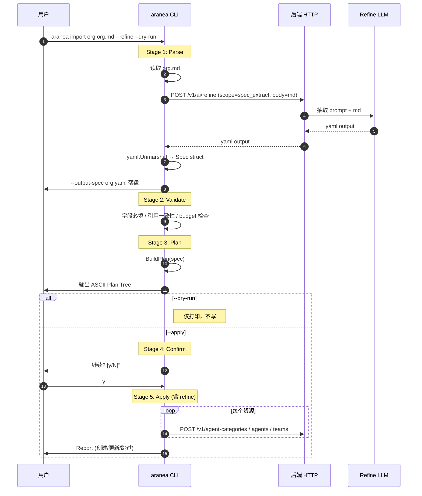

# M58 — Prompt 治理与组织自动化（PGO）设计文档

> **版本**：2026-06-17 · **状态**：📐 设计草案（与代码深度核对）· **依据需求**：[58 prompt-governance.md](./58-prompt-governance.md)
> **作用**：把需求文档的"做什么"翻译为"怎么做"——含模块切分、接口签名、数据模型、状态机、时序图、与现网代码的对接点。AI 与人类工程师都应能依据本文档直接落地。
> **红线复述**：`internal/biz` 不 import `pkg/trpc-agent-go`；Runner 装配仅在 `internal/service`；`cmd/aranea/` 二进制不 import `internal/biz` `internal/agent` `internal/data` `internal/server` `pkg/trpc-agent-go`。

> 任务清单与开发进度见 [58-prompt-governance.development.md](./58-prompt-governance.development.md)

---

## 0. 总体架构图

```mermaid
flowchart TB
  subgraph PGO1["PGO-1: 默认文件 + 字段重命名 + L1 注入"]
    DefaultsV2[defaultPromptFiles V2<br/>5 核心 + USER_CONTEXT 可选]
    BuildPromptV2[BuildSystemPrompt V2<br/>新增 categoryResponsibility 可变参数]
    CatLabel[Category label 按 level 切换]
  end

  subgraph PGO2["PGO-2: FieldGuide schema (双向)"]
    GuideGo[internal/biz/field_guides.go]
    GuideTs[web/src/features/agents/fieldGuides.ts]
    LintCI[cmd/araneactl/fieldguide-lint 一致性比对]
  end

  subgraph PGO3["PGO-3: 统一 AI Refine 服务"]
    RefineProto[api/kratos/ai_refine/v1]
    RefineSvc[internal/service/prompt_refine.go]
    RefineImpl[internal/biz/prompt_refiner.go]
    RefineBtn[web AIRefineButton.vue]
    SysSet[SystemSetting.DefaultRefineLLM]
  end

  subgraph PGO4["PGO-4: CLI Import"]
    AraneaBin[cmd/aranea/main.go]
    ImportCmd[internal/cli/cmd/import.go]
    OrgImportPkg[internal/orgimport/ (Deprecated)]
    PackPkg[internal/biz/pack/ (新导入系统)]
  end

  GuideGo -.驱动.-> RefineSvc
  GuideGo -.驱动.-> OrgImportPkg
  GuideTs -.驱动.-> RefineBtn
  RefineSvc -.被调用.-> OrgImportPkg
  DefaultsV2 -.被读取.-> OrgImportPkg
  BuildPromptV2 -.读取.-> CatLabel

  classDef new fill:#dff,stroke:#06c,stroke-width:1px
  class DefaultsV2,BuildPromptV2,CatLabel,GuideGo,GuideTs,LintCI,RefineProto,RefineSvc,RefineImpl,RefineBtn,SysSet,AraneaBin,ImportCmd,OrgImportPkg,PackPkg new
```

---

## 1. PGO-1：文件裁减 + 字段重命名 + L1 注入

### 1.1 默认文件清单 V2

**改动文件**：`internal/biz/agent_settings_helpers.go`

```go
// defaultPromptFiles 返回 V2 默认集（5 核心）当 PGO_DEFAULT_FILES_V2=on，
// 否则返回 legacy 9 文件集。PGO-1-BIZ-01。
// 注意：V2 默认为 on（见 pgoDefaultFilesV2()）。
func defaultPromptFiles() []AgentPromptFile {
    if pgoDefaultFilesV2() {
        return defaultPromptFilesV2()
    }
    return defaultPromptFilesLegacy()
}

// defaultPromptFilesV2 是 PGO-1 规范的 5 文件集。
// SOUL/USER/USER_PREDEFINED 已移除；HEARTBEAT 移至 Settings。
// USER_CONTEXT.md 通过 OptionalPromptFileTemplates 按需添加。
func defaultPromptFilesV2() []AgentPromptFile {
    return []AgentPromptFile{
        {Name: "AGENTS_CORE.md",  Body: stubBody("AGENTS_CORE"),  SortOrder: 10},
        {Name: "AGENTS_TASK.md",  Body: stubBody("AGENTS_TASK"),  SortOrder: 20},
        {Name: "IDENTITY.md",     Body: stubBody("IDENTITY"),     SortOrder: 30}, // 含 ## Persona 段
        {Name: "CAPABILITIES.md", Body: stubBody("CAPABILITIES"), SortOrder: 40},
        {Name: "RULE.md",         Body: stubBody("RULE"),         SortOrder: 50},
    }
}

// OptionalPromptFileTemplates 按需添加的可选文件模板。
// PGO-1-BIZ-01: USER_CONTEXT 替代 legacy USER + USER_PREDEFINED。
var OptionalPromptFileTemplates = map[string]AgentPromptFile{
    "USER_CONTEXT.md": {Name: "USER_CONTEXT.md", Body: stubBody("USER_CONTEXT"), SortOrder: 60},
}
```

`stubBody` 引用 PGO-2 的 `FieldGuide.DefaultStub`（同一份 schema）。

**Flag 实现**：`pgoDefaultFilesV2()` 通过环境变量 `PGO_DEFAULT_FILES_V2` 读取，**默认返回 true**（V2 是默认）。设置为 `0`/`false`/`no` 时回退到 legacy 9 文件集。

### 1.2 FilesForMode V2

```go
// internal/biz/agent_settings_helpers.go
// FilesForMode 按 system_prompt_mode 过滤 prompt 文件。PGO-1-BIZ-02。
// task mode 不再包含 HEARTBEAT.md（已移至 Settings）。
//   - complete / "": 全部文件
//   - task:        AGENTS_CORE, IDENTITY, RULE, AGENTS_TASK, CAPABILITIES
//   - minimized:   AGENTS_CORE, RULE
//   - none:        空
//   - unknown:     AGENTS_CORE, RULE（安全默认）
func FilesForMode(files []AgentPromptFile, mode string) []AgentPromptFile
```

### 1.3 BuildSystemPrompt V2（新增 categoryResponsibility 可变参数）

**改动文件**：`internal/agent/prompt.go`

```go
// 旧
func BuildSystemPrompt(agent biz.Agent, files []biz.AgentPromptFile, mode string) string

// 新（向后兼容：可变参数，传入空字符串相当于旧行为）
// PGO-1-AGENT-01
func BuildSystemPrompt(agent biz.Agent, files []biz.AgentPromptFile, mode string, categoryResponsibility ...string) string {
    var b strings.Builder
    if len(categoryResponsibility) > 0 {
        if cr := strings.TrimSpace(categoryResponsibility[0]); cr != "" {
            b.WriteString("<role_responsibility source=\"category\">\n")
            b.WriteString(cr)
            b.WriteString("\n</role_responsibility>\n\n")
        }
    }
    if d := strings.TrimSpace(agent.AgentDescription); d != "" {
        b.WriteString(d)
        b.WriteString("\n\n")
    }
    filtered := biz.FilesForMode(files, mode)
    for _, f := range filtered {
        body := strings.TrimSpace(f.Body)
        if body == "" { continue }
        b.WriteString(fmt.Sprintf("<internal_config name=%q>\n", f.Name))
        b.WriteString(body)
        b.WriteString("\n</internal_config>\n\n")
    }
    return strings.TrimSpace(b.String())
}
```

**所有调用方**（2 处）：
- `internal/agent/trpc_build.go:98`：`sys := BuildSystemPrompt(ag, files, ag.SystemPromptMode, catResp)`
- `internal/agent/prompt_preview.go:49`：`sys := BuildSystemPrompt(agPreview, files, mode, catResp)`

### 1.4 岗位职责注入策略

**实现位置**：`internal/biz/organization_position_prompt.go`（`PositionPromptUsecase.BuildResponsibility`）+ `internal/biz/organization.go`（`OrganizationUsecase.BuildResponsibility` 转发）

```go
// internal/biz/organization_position_prompt.go:199
// BuildResponsibility 构造岗位职责注入文本。PGO-1-BIZ-04。
// positionID 为空或 mode=minimized/none 时返回空字符串。
// task mode 截断到 300 字符；complete mode 追加部门职责。
func (u *PositionPromptUsecase) BuildResponsibility(ctx context.Context, positionID string, mode string) (string, error) {
    if strings.TrimSpace(positionID) == "" {
        return "", nil
    }
    switch strings.ToLower(strings.TrimSpace(mode)) {
    case "minimized", "none":
        return "", nil
    }
    pos, err := u.repo.GetOrgNode(ctx, positionID)
    if err != nil { return "", err }
    if pos.Level != "position" { return "", nil }
    posDesc := strings.TrimSpace(pos.Description)
    if posDesc == "" { return "", nil }

    switch strings.ToLower(strings.TrimSpace(mode)) {
    case "task":
        return truncateResponsibility(posDesc, 300), nil
    default:
        result := posDesc
        if strings.TrimSpace(pos.ParentID) != "" {
            dept, deptErr := u.repo.GetOrgNode(ctx, pos.ParentID)
            if deptErr == nil && strings.TrimSpace(dept.Description) != "" {
                result = posDesc + "\n\n部门职责：" + strings.TrimSpace(dept.Description)
            }
        }
        return result, nil
    }
}
```

**调用方**：`internal/agent/trpc_build.go:81-87`

```go
// shouldInjectCategoryResponsibility 受 PGO_CATEGORY_RESPONSIBILITY_INJECT 环境变量控制（默认 off）
var catResp string
if shouldInjectCategoryResponsibility(ag) && deps.Organization != nil {
    if resp, err := deps.Organization.BuildResponsibility(ctx, ag.PositionID, ag.SystemPromptMode); err != nil {
        lg.Warn("岗位职责注入失败", ...)
    } else {
        catResp = resp
    }
}
// 还会合并 BuildIndustryContext 的输出
sys := BuildSystemPrompt(ag, files, ag.SystemPromptMode, catResp)
```

**Skip 机制**：复用 `agent.metadata_json` —— 不新增 ent 列。

```go
// internal/biz/agent_types.go:136
// SkipCategoryResponsibility 当 metadata_json 含 {"skip_category_responsibility": true} 时返回 true。PGO-1-BIZ-05。
func (a Agent) SkipCategoryResponsibility() bool
```

**Flag 实现**：`internal/agent/trpc_build.go:395` 的 `shouldInjectCategoryResponsibility` 通过环境变量 `PGO_CATEGORY_RESPONSIBILITY_INJECT` 读取，**默认 off**（需显式设置为 `1`/`true`/`yes` 才开启）。

### 1.5 分类管理 UI label 按 level 切换

**改动文件**：
- `web/src/pages/OrganizationPage.vue`：description textarea label 根据 `node.level` 切换
- `web/src/components/agents/TaxonomyTreeNodeHeader.vue`：caption 同步
- `web/src/components/agents/TaxonomyPositionCard.vue`：标题与展示统一

```ts
// web/src/features/platform/taxonomyLabels.ts
// PGO-1-UI: Category description label & placeholder helpers.
// level 1 = industry, 2 = department, 3 = position
export function descriptionLabel(level: 1 | 2 | 3): string {
  return categoryDescriptionLabel(level); // 来自 fieldGuides.ts
}
export function descriptionPlaceholder(level: 1 | 2 | 3): string {
  return categoryDescriptionPlaceholder(level);
}
```

```ts
// web/src/features/agents/fieldGuides.ts:259
// level 1 → 'category.industry' → "行业说明"
// level 2 → 'category.department' → "部门职责"
// level 3 → 'category.position' → "岗位职责"
export function categoryDescriptionLabel(level: 1 | 2 | 3): string
export function categoryDescriptionPlaceholder(level: 1 | 2 | 3): string
```

### 1.6 SOUL → IDENTITY 合并

**改动文件**：`internal/biz/evolution.go::ApplySuggestion`（persona 分支）

```go
// PGO-1-BIZ-06: persona suggestion 写入 IDENTITY.md 的 ## Persona 段
// （anchor 替换），而非已废弃的 SOUL.md。对 legacy agent 仍回退到 SOUL.md。
// 实现位置：internal/biz/evolution.go:207-235
for i, f := range files {
    if f.Name == "IDENTITY.md" {
        files[i].Body = replaceOrAppendPersona(f.Body, s.Content)
        applied = true
        break
    }
}
if !applied {
    // 回退：legacy agent 仍写 SOUL.md
    for i, f := range files {
        if f.Name == "SOUL.md" { ... }
    }
}
// 若两者都不存在，追加新 IDENTITY.md
```

```go
// internal/biz/evolution.go:364
// replaceOrAppendPersona 将 personaContent 写入 body 的 "## Persona" 段。
// 若已存在则替换该段（到下一个同级 heading 或 EOF）；否则追加。PGO-1-BIZ-06。
func replaceOrAppendPersona(body, personaContent string) string
```

### 1.7 一次性迁移工具（规划中）

规划功能（`cmd/migrate-deprecated-prompts/` 目录待创建）：
1) 扫描所有 agent_prompt_files
2) 对每个 agent:
   a) 若 SOUL.md 非 stub：将内容追加到 IDENTITY.md 的 ## Persona 段；SOUL.md body 改为 deprecated marker
   b) 若 USER.md / USER_PREDEFINED.md 非 stub：合并为 USER_CONTEXT.md
   c) HEARTBEAT.md：内容记录到 agent.metadata_json.heartbeat_legacy_body，文件改为 deprecated marker
3) 全程 dry-run by default；--apply 真写入；--prune-deprecated 在 30 天后清理

---

## 2. PGO-2：FieldGuide schema（双向）

### 2.1 数据结构（Go）

**文件**：`internal/biz/field_guides.go`

```go
package biz

type FieldScope string

const (
    ScopeCategoryIndustry   FieldScope = "category.industry"   // level=1
    ScopeCategoryDepartment FieldScope = "category.department" // level=2
    ScopeCategoryPosition   FieldScope = "category.position"   // level=3
    ScopeAgentDescription   FieldScope = "agent.description"
    ScopeAgentFile          FieldScope = "agent.file"          // 用 FileName 区分文件
    ScopeSpecExtract        FieldScope = "spec_extract"        // PGO-4: markdown → YAML
)

type FieldGuide struct {
    Scope       FieldScope
    FileName    string // 仅 ScopeAgentFile 用
    TitleZh     string
    Purpose     string
    ShouldWrite []string
    ShouldAvoid []string
    Examples    []GuideExample
    Budget      GuideBudget
    Placeholder string
    DefaultStub string
}

type GuideExample struct {
    Industry string
    Body     string
}

type GuideBudget struct {
    Soft int // 软上限（黄色提示）
    Hard int // 硬上限（红色 / 不允许保存，0 = 无限制）
}

type FieldGuideKey struct {
    Scope    FieldScope
    FileName string
}

var (
    fieldGuideRegistry = map[FieldGuideKey]FieldGuide{}
    fieldGuideOrder    []FieldGuideKey // 插入顺序，稳定迭代
)

func register(g FieldGuide)
func GetFieldGuide(scope FieldScope, fileName string) (FieldGuide, bool)
func ListFieldGuides() []FieldGuide // 稳定顺序
func GetFieldGuidesForScope(scope FieldScope) []FieldGuide
```

**注册项**（共 11 项）：
- 3 个 category scope（industry/department/position）
- 1 个 agent.description
- 6 个 agent.file（AGENTS_CORE/AGENTS_TASK/IDENTITY/CAPABILITIES/RULE/USER_CONTEXT）
- 1 个 spec_extract（PGO-4 B-2，backend-only，TS 不镜像）

### 2.2 数据结构（TS，镜像）

**文件**：`web/src/features/agents/fieldGuides.ts`

```ts
export type FieldScope =
  | 'category.industry' | 'category.department' | 'category.position'
  | 'agent.description' | 'agent.file';
// 注意：spec_extract 是 backend-only，TS 不镜像

export interface FieldGuide {
  scope: FieldScope;
  fileName?: string;
  titleZh: string;
  purpose: string;
  shouldWrite: string[];
  shouldAvoid: string[];
  examples: Array<{ industry: string; body: string }>;
  budget: { soft: number; hard: number };
  placeholder: string;
  defaultStub: string;
}

export function getFieldGuide(scope: FieldScope, fileName?: string): FieldGuide | undefined
export function categoryDescriptionLabel(level: 1 | 2 | 3): string
export function categoryDescriptionPlaceholder(level: 1 | 2 | 3): string
```

### 2.3 一致性 lint

**文件**：`cmd/araneactl/fieldguide-lint/main.go`

```
作用：在 CI 上比对 internal/biz/field_guides.go 与 web/src/features/agents/fieldGuides.ts 的 scope。
机制：
  1. 提取 Go 文件中的 scope 字符串
  2. 提取 TS 文件中的 scope 字符串
  3. 过滤 backend-only scope（spec_extract）
  4. diff 两边 scope 集合，不一致即 fail
退出码：0 = 同步；1 = 漂移；2 = 工具错误
```

### 2.4 前端组件

**文件**：`web/src/components/agents/FieldGuideHint.vue`（注意：非 `FieldGuide.vue`）

```vue
<!-- 使用 q-popup-proxy 弹出指南卡，非折叠卡 -->
<template>
  <div v-if="guide" class="field-guide-hint">
    <q-icon name="help_outline" class="cursor-pointer">
      <q-popup-proxy>
        <q-card>
          <div class="text-subtitle2">{{ guide.titleZh }}</div>
          <div class="text-caption">{{ guide.purpose }}</div>
          <!-- shouldWrite / shouldAvoid / budget / examples -->
        </q-card>
      </q-popup-proxy>
    </q-icon>
  </div>
</template>

<script setup lang="ts">
import { computed } from 'vue';
import type { FieldScope } from '../../features/agents/fieldGuides';
import { getFieldGuide } from '../../features/agents/fieldGuides';

const props = defineProps<{ scope: FieldScope; fileName?: string }>();
const guide = computed(() => getFieldGuide(props.scope, props.fileName));
</script>
```

挂载位置：分类管理页 description textarea 旁；Agent 描述 textarea 旁；文件 Tab 每个 Editor 顶部。

> `FieldGuideExamplesDialog.vue` 待创建；当前示例展示集成在 `FieldGuideHint.vue` 的 popup 内。

---

## 3. PGO-3：统一 AI Refine 服务

### 3.1 Proto 定义

**文件**：`api/kratos/ai_refine/v1/ai_refine.proto`

```proto
syntax = "proto3";
package kratos.ai_refine.v1;

import "google/api/annotations.proto";

option go_package = "aranea-agents/api/kratos/ai_refine/v1;v1";

service AIRefineService {
  rpc Refine(RefineRequest) returns (RefineResponse) {
    option (google.api.http) = {
      post: "/v1/ai/refine"
      body: "*"
    };
  }
}

enum RefineScope {
  REFINE_SCOPE_UNSPECIFIED       = 0;
  REFINE_SCOPE_CATEGORY_INDUSTRY = 1; // category.industry
  REFINE_SCOPE_CATEGORY_DEPT     = 2; // category.department
  REFINE_SCOPE_CATEGORY_POSITION = 3; // category.position
  REFINE_SCOPE_AGENT_DESCRIPTION = 4; // agent.description
  REFINE_SCOPE_AGENT_FILE        = 5; // agent.file (用 file_name 指定)
  REFINE_SCOPE_SPEC_EXTRACT      = 6; // spec_extract: markdown → YAML (PGO-4)
}

message RefineRequest {
  RefineScope scope        = 1;
  string      resource_id  = 2; // category_id / agent_id（审计与选模型）
  string      file_name    = 3; // 仅 AGENT_FILE 用
  string      original_text = 4; // max 5000 chars (spec_extract: 30000)
  string      user_hint    = 5; // 用户的"我想要..."自由指令
  string      target_mode  = 6; // complete/task/minimized
}

message RefineResponse {
  string refined       = 1;
  string diff          = 2; // unified diff
  int32  tokens_before = 3;
  int32  tokens_after  = 4; // LLM 调用总 token (prompt + completion)
  string provider      = 5;
  string model         = 6;
  string source        = 7; // "agent_model" / "system_default" / "catalog_first"
}
```

### 3.2 Service 层

**文件**：`internal/service/prompt_refine.go`

```go
// AIRefineService 实现 AIRefineService proto 契约。PGO-3-SVC-01。
// /v1/ai/refine 端点通过生成的 RegisterAIRefineServiceHTTPServer 注册。
// 速率限制器在此层（需要 HTTP auth user ID）。
type AIRefineService struct {
    airefinev1.UnimplementedAIRefineServiceServer
    refiner   biz.Refiner   // biz.Refiner 策略接口
    rateLimit *refineRateLimiter
}

func NewAIRefineService(refiner biz.Refiner) *AIRefineService {
    return &AIRefineService{
        refiner: refiner,
        rateLimit: newRefineRateLimiter(
            20,            // 全局 QPS burst
            5*time.Minute, // per-user 窗口
            10,            // per-user 窗口内最大次数
        ),
    }
}

func (s *AIRefineService) Refine(ctx context.Context, req *airefinev1.RefineRequest) (*airefinev1.RefineResponse, error)
```

**速率限制器**：`refineRateLimiter` 类型定义在同一文件 `internal/service/prompt_refine.go:103`（非独立文件）。
- 全局：20 QPS burst
- per-user：5 分钟窗口内 10 次
- 错误码：`REFINE_RATE_LIMIT`（全局）/ `REFINE_RATE_LIMIT_USER`（per-user）

### 3.3 biz 层（核心实现）

**文件**：`internal/biz/prompt_refiner.go`

```go
// PromptRefiner 提供 AI 辅助 refine。PGO-3-BIZ-02。
type PromptRefiner struct {
    agents  AgentRepository
    sys     *SystemSettingUsecase
    catalog *LlmProviderModelUsecase
    llm     LLMCaller
}

type RefineRequest struct {
    Scope        FieldScope
    ResourceID   string
    FileName     string
    OriginalText string
    UserHint     string
    TargetMode   string
}

type RefineResult struct {
    Refined      string
    Diff         string
    TokensBefore int
    TokensAfter  int
    Provider     string
    Model        string
    ModelSource  ModelSource
}

type ModelSource string
const (
    ModelSourceAgent         ModelSource = "agent_model"
    ModelSourceSystemDefault ModelSource = "system_default"
    ModelSourceCatalogFirst  ModelSource = "catalog_first"
)

// Refine 主流程：
// 1. GetFieldGuide(scope, fileName) → guide
// 2. validateRefineInput(req, guide) → 5000 字符上限 (spec_extract: 30000)
// 3. resolveModel(ctx, req) → 3-tier fallback
// 4. spec_extract 分支用 buildSpecExtractSystemPrompt；否则 buildRefineSystemPrompt + buildRefineUserPrompt
// 5. r.llm.Call(ctx, LLMCallRequest{Provider, Model, System, User})
// 6. 截断到 guide.Budget.Hard
// 7. 返回 RefineResult（含 UnifiedDiffSimple）
func (r *PromptRefiner) Refine(ctx context.Context, req RefineRequest) (*RefineResult, error)

// resolveModel 3-tier fallback：
// 1) Agent scope → 该 Agent 的 provider/model
// 2) SystemSetting.DefaultRefineLLM
// 3) Catalog 第一个 enabled 的 model
func (r *PromptRefiner) resolveModel(ctx context.Context, req RefineRequest) (string, string, ModelSource, error)
```

**biz.Refiner 接口**：service 层通过 `biz.Refiner` 策略接口持有 refiner，允许 PromptIter 适配器替代 PromptRefiner。

### 3.4 裸 LLM 调用抽象

**接口文件**：`internal/biz/llm_caller.go`

```go
package biz

// LLMCallRequest 携带单次 completion 所需的一切。
// PromptRefiner.Refine 在 resolveLLM 选定后产生此 struct；
// 底层 caller 必须使用 Provider+Model，并自行查找 BaseURL+APIKey。
type LLMCallRequest struct {
    Provider string
    Model    string
    System   string
    User     string
}

// LLMCaller 是单轮 LLM completion 的最小接口。
// biz 禁止 import pkg/trpc-agent-go；此接口是边界。
// 实现：
//   - internal/agent.DynamicLLMCaller — 从 SystemSetting / Catalog 解析 BaseURL+APIKey（生产）
//   - internal/agent.OpenAICompatLLMCaller — 静态配置（测试 / 固定凭证）
type LLMCaller interface {
    Call(ctx context.Context, req LLMCallRequest) (text string, totalTokens int, err error)
}
```

**实现文件**：`internal/agent/llm_caller_impl.go`

```go
// OpenAICompatLLMCaller 使用 CallOpenAICompatChat + 静态 ProviderAPIConfig。主要用于测试。
type OpenAICompatLLMCaller struct { cfg ProviderAPIConfig; hc *http.Client }
func (c *OpenAICompatLLMCaller) Call(ctx context.Context, req biz.LLMCallRequest) (string, int, error)

// DynamicLLMCaller 在调用时解析 BaseURL + APIKey，给定 (Provider, Model) 决策。
// 凭证来自 SystemSetting.DefaultRefineLLM 或 model catalog。生产用。
type DynamicLLMCaller struct { catalog LLMCredentialResolver; sys LLMRefineConfigResolver; hc *http.Client }
func (c *DynamicLLMCaller) Call(ctx context.Context, req biz.LLMCallRequest) (string, int, error)
```

依赖方向：`biz.PromptRefiner` 通过接口持有 `LLMCaller`，实现在 `agent` 包；wire 装配在 `internal/service/wire.go`。**不违反 biz → agent 禁止规则**（biz 只依赖接口）。

### 3.5 Refine prompt 模板

```go
// internal/biz/prompt_refiner.go:169
// buildRefineSystemPrompt 构造字段优化的 system prompt。
// task mode 时 budget 截断到 400。
func buildRefineSystemPrompt(guide FieldGuide, mode string) string

// buildRefineUserPrompt 构造用户 prompt，含原文 + hint + 示例。
func buildRefineUserPrompt(original, userHint string, guide FieldGuide) string

// buildSpecExtractSystemPrompt 构造 markdown → YAML 抽取的 system prompt。PGO-4 B-2。
func buildSpecExtractSystemPrompt(_ FieldGuide) string
```

### 3.6 SystemSetting 扩展

**改动文件**：`internal/biz/system_setting.go`（**未改 proto**）

```go
// SystemSetting 是单例平台配置。
type SystemSetting struct {
    // ... 已有字段
    // DefaultRefineLLM 是 PromptRefiner 使用的平台级 LLM 配置。PGO-3。
    DefaultRefineLLM RefineLLMSetting
}

// RefineLLMSetting 平台默认 refine LLM 配置。
type RefineLLMSetting struct {
    Provider string
    Model    string
    BaseURL  string
    APIKey   string
}

type SystemSettingRepo interface {
    // ... 已有方法
    // PGO-3: 平台默认 refine LLM。
    GetRefineLLM(ctx context.Context) (RefineLLMSetting, error)
    UpdateRefineLLM(ctx context.Context, patch RefineLLMSetting, updateAPIKey bool) (RefineLLMSetting, error)
}
```

> ⚠️ **注意**：`api/kratos/system_setting/v1/system_setting.proto` 中**未新增** `default_refine` 字段。`DefaultRefineLLM` 仅在 Go 代码层扩展，通过 `SystemSettingRepo` 持久化。后续如需通过 HTTP API 暴露，需同步 proto。

### 3.7 旧 endpoint 兼容

**文件**：`internal/service/agent.go:821`（**未转发到 refine service**）

```go
// EditPromptFileByAI 实现 POST /v1/agents/{agent_id}/files/{file_id}/ai-edit。
// ⚠️ 当前仍使用 PromptFileAIEditor.Revise（旧路径），未转发到 AIRefineService。
// PGO-3-SVC-03 规划的转发未实施。
func (s *AgentService) EditPromptFileByAI(ctx context.Context, req *v1.EditPromptFileByAIRequest) (*v1.EditPromptFileByAIResponse, error) {
    // 使用 s.promptAI.Revise(ctx, a.Provider, a.Model, target.Name, target.Body, instruction)
    // 而非转发到 s.refineService.Refine(...)
}
```

> **注**：旧 endpoint 转发到 refine service 的改造（PGO-3-SVC-03）尚未落地，当前仍走 `PromptFileAIEditor.Revise`。状态跟踪见 [开发计划 §6](./58-prompt-governance.development.md#6-pgo-3--统一-ai-refine-服务--按钮15-周--)。

### 3.8 前端组件

**文件**：`web/src/components/agents/AIRefineButton.vue`

```vue
<!-- AIRefineButton 组件，支持 5 个 scope。PGO-3-WEB-01。 -->
<template>
  <q-btn :loading="loading" icon="auto_awesome" label="AI 优化" @click="handleRefine">
    <q-tooltip v-if="guide">{{ guide.titleZh }}：{{ guide.purpose }}</q-tooltip>
  </q-btn>
  <q-dialog v-model="showResult" persistent>
    <q-card>
      <!-- Token delta / Diff toggle / Result editor / Char budget / User hint -->
      <q-card-actions>
        <q-btn flat label="取消" />
        <q-btn flat label="追加" @click="append" />
        <q-btn color="primary" label="应用" @click="apply" />
      </q-card-actions>
    </q-card>
  </q-dialog>
</template>
```

**API client**：`web/src/features/agents/aiRefine.ts`（**非 `web/src/api/aiRefine.ts`**）

```ts
// 使用 kratos 生成的 client：web/src/services/kratos/ai_refine/v1/index.ts
import { createAIRefineService } from '../../services';

export interface RefineRequest {
  scope: FieldScope;
  resourceId?: string;
  fileName?: string;
  originalText: string;
  userHint?: string;
  targetMode?: string;
}

export async function refinePromptField(req: RefineRequest): Promise<RefineResponse>
```

挂载点：分类页（3 level）/ Agent 描述 / 文件 Tab editor 顶部。

---

## 4. PGO-4：CLI Import

### 4.1 总体时序



### 4.2 Spec Schema（YAML）

**实现**：`internal/orgimport/spec.go`（**Deprecated**，被 `internal/biz/pack/` 取代）

```yaml
version: 1
metadata:
  correlation_id: ""        # CLI 自动生成；用户可指定以幂等去重
  source_file: "org.md"     # 来源（仅记录）
  generated_by: "aranea-import"

spec:
  companies:                # 注意：是 companies，不是 industries
    - key: ecommerce
      name: 电商
      description: |
        以 B2C 电商平台为主营业务...
      departments:
        - key: customer_service
          name: 客服部
          description: |
            处理售前咨询、售后投诉...
          positions:
            - key: aftersales_cs
              name: 售后客服
              description: |   # 岗位职责
                1) 主要职责: ...

  agents:
    - key: alice_aftersales
      display_name: Alice
      category_position: ecommerce/customer_service/aftersales_cs  # 路径引用
      provider: openai
      model: gpt-4o-mini
      system_prompt_mode: task
      agent_description: |
        Alice 是 X 公司的售后客服...
      files:                  # 可选；不写则用 PGO-1 V2 默认 5 文件
        IDENTITY.md: |
          ...
      refine: false           # 是否对该 agent 调用 AI 优化

  teams:
    - key: cs_team_alpha
      name: 客服 Alpha 组
      members:
        - agent_key: alice_aftersales
          role: orchestrator
```

> ⚠️ **注意**：`orgimport.SpecBody` 使用 `companies` 字段（非 `industries`）。但 `prompt_refiner.go::buildSpecExtractSystemPrompt` 的 LLM 提示输出 `industries`。这是一个已知不一致，使用时需注意 YAML 字段名映射。

### 4.3 Markdown 抽取 prompt

LLM system prompt 在 `internal/biz/prompt_refiner.go:311` 的 `buildSpecExtractSystemPrompt` 中构建：

```
你是一名组织架构信息抽取助手。请将用户提供的 markdown 描述抽取为以下结构的 YAML：

version: 1
metadata:
  source_file: ""
  generated_by: "aranea-import"
spec:
  industries:        # ⚠️ 注意：LLM 输出 industries，但 orgimport.SpecBody 期望 companies
    - key: <kebab-case>
      name: <中文名>
      description: <行业说明>
      departments:
        - key: <kebab-case>
          ...
          positions:
            - key: <kebab-case>
              ...
  agents:
    - key: <kebab-case>
      ...
  teams: []

要求：
1. 只输出有效的 YAML，不要任何解释文字或 markdown 代码块包装；
2. 所有 key 使用 kebab-case，避免空格 / 中文；
3. 缺失字段输出空字符串 ""，不要省略字段；
4. 若 markdown 中无 agent / team 信息，输出空数组 [] 即可。
```

### 4.4 内部包结构

**当前实现**：`internal/orgimport/`（**Deprecated**）

```
internal/orgimport/
  spec.go              # Spec / OrganizationSpec / DepartmentSpec / PositionSpec / AgentSpec / TeamSpec
  loader.go            # LoadSpec: YAML 直接解析 / Markdown 调 /v1/ai/refine 抽取
  validator.go         # ValidateSpec: 字段必填 / 引用一致性 / budget
  planner.go           # BuildPlan: diff 当前资源 → Plan；FormatPlanTree: ASCII 输出
  applier.go           # Apply: Plan → POST /v1/agent-categories / agents / teams
  loader_test.go
  validator_test.go
```

> ⚠️ **Deprecated**：此包被 `internal/biz/pack/` 取代。新代码应使用 `pack.Importer`。此包保留供 CLI `aranea import org` 子命令使用。

**新导入系统**：`internal/biz/pack/`（未在原设计文档中规划）

```
internal/biz/pack/
  spec.go              # Pack / ManifestSpec / OrganizationPackSpec / AgentPackSpec / TeamPackSpec
  importer.go          # OrganizationImporterRepo / AgentImporterRepo / TeamImporterRepo 接口
  exporter.go          # Pack 导出
  mapper.go            # Pack ↔ Biz 模型映射
  validator.go         # Pack 校验
  reader.go / writer.go
  convert.go
```

### 4.5 CLI 二进制结构（依赖白名单）

**当前实现**：

```
cmd/aranea/
  main.go                # cobra root + persistent flags

internal/cli/            # CLI 实际实现位置（非 cmd/aranea/cmd/）
  cmd/
    import.go            # aranea import org 子命令
    agent.go / skill.go / tool.go / ...  # 其他子命令
  config/
    config.go            # ~/.aranea/config.toml 读写
  client/
    http.go              # net/http + pb json marshal
  output/                # 输出格式化
  repl/                  # 交互式 REPL
  ui/                    # TTY 检测 / 颜色 / 表格
```

允许 import：
- `internal/cli/**`
- `internal/orgimport/**`（pure Go，无 ent / no biz）
- `api/kratos/*/v1` 生成代码
- 纯三方库（cobra、yaml.v3、uuid 等）

**禁止** import：`internal/biz` `internal/agent` `internal/data` `internal/server` `pkg/trpc-agent-go`。

⚠️ 注意：`internal/orgimport/` 是 **CLI 与 seed 共用** 的纯应用层包；它通过 HTTP API 与后端通讯，**不直连 DB**。

### 4.6 关键命令实现

```go
// internal/cli/cmd/import.go:18
// NewImportCmd 创建 `aranea import` 命令组。PGO-4-CLI-01。
func NewImportCmd() *cobra.Command {
    c := &cobra.Command{
        Use:   "import",
        Short: "组织导入（行业/部门/岗位/Agent）",
    }
    c.AddCommand(importOrgCmd())
    return c
}

// importOrgCmd 实现 `aranea import org <spec-file>`。
// 支持的 flags：
//   --dry-run         仅打印计划（默认 true）
//   --apply           实际写入（覆盖 --dry-run）
//   --refine          对 description / agent_description 调用 AI 优化
//   --output-spec     保存提取的 YAML 规格到此路径
//   --output          输出格式: text | json
//   --timeout         每次 HTTP 调用超时（秒）
//   --correlation-id  审计追踪 ID
func importOrgCmd() *cobra.Command
```

> ⚠️ **注意**：实际实现的 flags 与原设计文档不同：
> - 现有：`--dry-run`、`--apply`、`--refine`、`--output-spec`、`--output`、`--timeout`、`--correlation-id`
> - 待新增：`--update`、`--confirm`、`--partial`（原设计文档规划）

### 4.7 幂等策略

```go
// internal/orgimport/applier.go
// 按 key 幂等：
// 1) Category: 按 (parent_id, key) 去重；存在 → skip
// 2) Agent:   按 agent_key 去重；存在 → skip
// 3) Team:    按 team_key 去重；存在 → skip
// 注意：当前实现仅支持 skip，不支持 --update 覆盖。
```

### 4.8 审计

每次 import 通过 HTTP header 携带 `X-Correlation-Id: <id>` 与 `X-Source: cli_import`；后端 audit middleware 将其写入审计日志。`--correlation-id` flag 允许用户指定，默认自动生成 `cli-import-<timestamp>`。

### 4.9 seed-stockx-org 重构（规划中）

> **注**：`cmd/seed-stockx-org/` 目录待创建。状态跟踪见 [开发计划 §7 Sprint 4D](./58-prompt-governance.development.md#sprint-4d重构-seed-stockx-org15-天-)。

规划：将硬编码的 seed 数据迁移到 `stockx_spec.yaml`，执行流走 `internal/orgimport/` 或 `internal/biz/pack/`。

---

## 5. 与现网代码的对接点（一表清单）

> 状态跟踪（✅/📋）见 [开发计划 §2 现状评估](./58-prompt-governance.development.md#2-现状评估2026-06-17)。本表仅列技术对接点。

| PGO 子项 | 改动文件 | 函数 / 区域 | 备注 |
|---------|---------|-------------|------|
| PGO-1 | `internal/biz/agent_settings_helpers.go` | `defaultPromptFiles` / `defaultPromptFilesV2` / `defaultPromptFilesLegacy` / `OptionalPromptFileTemplates` | V2 默认 on |
| PGO-1 | `internal/biz/agent_settings_helpers.go` | `FilesForMode`（task mode 移除 HEARTBEAT） | |
| PGO-1 | `internal/biz/agent_settings_helpers.go` | `composePromptPreview`（含 CategoryResponsibilityPreview） | |
| PGO-1 | `internal/biz/agent_settings_helpers.go` | `pgoDefaultFilesV2`（env flag，默认 on） | |
| PGO-1 | `internal/agent/prompt.go` | `BuildSystemPrompt`（可变参数 categoryResponsibility） | |
| PGO-1 | `internal/agent/trpc_build.go` | `BuildSystemPrompt` 调用点（~98 行）+ `shouldInjectCategoryResponsibility` | flag 默认 off |
| PGO-1 | `internal/agent/prompt_preview.go` | `BuildPreviewReport` 调用 `BuildSystemPrompt` | |
| PGO-1 | `internal/biz/organization_position_prompt.go` | `PositionPromptUsecase.BuildResponsibility` | |
| PGO-1 | `internal/biz/organization.go` | `OrganizationUsecase.BuildResponsibility`（转发） | |
| PGO-1 | `internal/biz/agent_types.go` | `Agent.SkipCategoryResponsibility()` | |
| PGO-1 | `internal/biz/evolution.go` | `ApplySuggestion` persona 分支（写 IDENTITY.md） | |
| PGO-1 | `internal/biz/evolution.go` | `replaceOrAppendPersona` | |
| PGO-1 | `cmd/migrate-deprecated-prompts/main.go` | 全新 | 目录待创建 |
| PGO-1 | `web/src/pages/OrganizationPage.vue` | label 切换 | |
| PGO-1 | `web/src/components/agents/TaxonomyTreeNodeHeader.vue` | caption 同步 | |
| PGO-1 | `web/src/components/agents/TaxonomyPositionCard.vue` | 标题统一 | |
| PGO-1 | `web/src/components/agents/agentUi.ts` | 文件硬编码列表（5+1） | |
| PGO-1 | `web/src/features/agents/useAgentPromptFiles.ts` | `heartbeatFile` 移除 / `addOptionalFile()` | |
| PGO-1 | `web/src/features/platform/taxonomyLabels.ts` | `descriptionLabel` / `descriptionPlaceholder` | |
| PGO-2 | `internal/biz/field_guides.go` | 11 项 register + `GetFieldGuide` / `ListFieldGuides` | |
| PGO-2 | `web/src/features/agents/fieldGuides.ts` | 镜像 schema + `categoryDescriptionLabel` | |
| PGO-2 | `web/src/components/agents/FieldGuideHint.vue` | popup 指南卡 | |
| PGO-2 | `web/src/components/agents/FieldGuideExamplesDialog.vue` | 全新 | 文件待创建 |
| PGO-2 | `cmd/araneactl/fieldguide-lint/main.go` | 一致性比对工具 | 过滤 backend-only `spec_extract` |
| PGO-3 | `api/kratos/ai_refine/v1/ai_refine.proto` | 全新（含 SPEC_EXTRACT） | |
| PGO-3 | `internal/service/prompt_refine.go` | `AIRefineService` + `refineRateLimiter` | 限流内联，非独立文件 |
| PGO-3 | `internal/biz/prompt_refiner.go` | `PromptRefiner.Refine` + `resolveModel` + `validateRefineInput` | 3-tier fallback |
| PGO-3 | `internal/biz/llm_caller.go` | `LLMCaller` 接口 + `LLMCallRequest` | |
| PGO-3 | `internal/agent/llm_caller_impl.go` | `OpenAICompatLLMCaller` + `DynamicLLMCaller` | |
| PGO-3 | `internal/biz/system_setting.go` | `DefaultRefineLLM` + `RefineLLMSetting` + `GetRefineLLM` / `UpdateRefineLLM` | |
| PGO-3 | `api/kratos/system_setting/v1/system_setting.proto` | 增加 `default_refine` 字段 | 字段待新增 |
| PGO-3 | `internal/service/agent.go::EditPromptFileByAI` | 改为转发到 refine service | 当前仍走 `PromptFileAIEditor.Revise` |
| PGO-3 | `web/src/components/agents/AIRefineButton.vue` | 全新 | |
| PGO-3 | `web/src/features/agents/aiRefine.ts` | API client | |
| PGO-4 | `cmd/aranea/main.go` | cobra root | |
| PGO-4 | `internal/cli/cmd/import.go` | `aranea import org` 子命令 | flags: `--dry-run`/`--apply`/`--refine`/`--output-spec`/`--output`/`--timeout`/`--correlation-id` |
| PGO-4 | `internal/cli/config/config.go` | toml 配置 | |
| PGO-4 | `internal/cli/client/http.go` | HTTP client | |
| PGO-4 | `internal/orgimport/` | spec / loader / validator / planner / applier | Deprecated，被 pack 取代 |
| PGO-4 | `internal/biz/pack/` | 新导入系统（取代 orgimport） | |
| PGO-4 | `cmd/seed-stockx-org/` 重构 | 走 orgimport / pack | 目录待创建 |
| PGO-4 | `cmd/araneactl/lint/main.go` | 白名单规则 | |

---

## 6. 性能与成本

- Refine：单次调用 ≤ 3s（含 LLM）；按 token 上限 5000 字符，模型 4o-mini 单次 ≤ ¥0.05。
- Import：YAML 模式纯本地，单次 < 200ms（不含 HTTP 往返）；Markdown 模式额外 LLM ≤ 10s。
- Prompt 注入：`BuildResponsibility` 命中缓存后 ≤ 1ms。

---

## 7. 安全

- Refine：仅认证用户可调；速率限制 10/min/user（5 分钟窗口）+ 全局 20 QPS burst；输入字符数 ≤ 5000（spec_extract ≤ 30000）；输出 ≤ FieldGuide.Budget.Hard 截断；审计 `source=ai_refine_button` 或 `source=cli_import_refine`。
- Import：CLI 走 PAT；远端环境 `--apply` 需显式环境变量开启；所有 create/update 写入审计 + correlation_id。
- 字段指南：服务端最终校验（不止前端），超 hard 上限拒绝保存（HTTP 422）。

---

## 附录 A — FieldGuide 注册项（Go init() 完整清单）

包含 `register(...)` 11 项：
- 3 个 category scope：`category.industry`（行业说明，soft 400 / hard 600）/ `category.department`（部门职责，soft 500 / hard 800）/ `category.position`（岗位职责，soft 800 / hard 1000）
- 1 个 `agent.description`（Agent 描述，soft 400 / hard 600）
- 6 个 `agent.file`：
  - `AGENTS_CORE.md`（soft 600 / hard 1200）
  - `AGENTS_TASK.md`（soft 800 / hard 1600）
  - `IDENTITY.md`（soft 500 / hard 800）
  - `CAPABILITIES.md`（soft 600 / hard 1000）
  - `RULE.md`（soft 500 / hard 800）
  - `USER_CONTEXT.md`（soft 400 / hard 600）
- 1 个 `spec_extract`（PGO-4，soft 8000 / hard 20000，backend-only）

文案内容见 `internal/biz/field_guides.go` init() 函数。

## 附录 B — 数据库迁移

PGO 本期**不新增 schema migration**。SystemSetting 的 `DefaultRefineLLM` 字段通过 `SystemSettingRepo` 持久化（Go 代码层扩展，未改 proto）。

## 附录 C — 配置文件模板

```toml
# ~/.aranea/config.toml
[backend]
base_url = "http://127.0.0.1:8080"
token = ""           # 通过 aranea login 写入

[ui]
output = "text"      # text / json
color = "auto"       # auto / always / never

# PGO 环境变量（cmd/aranea/main.go 读取）
# PGO_CLI_IMPORT_ENABLED=1          # 默认 on；CLI 进程内是否注册 import 子命令
# PGO_DEFAULT_FILES_V2=1            # 默认 on；新建 Agent 用 5 文件默认集
# PGO_CATEGORY_RESPONSIBILITY_INJECT=1  # 默认 off；岗位职责注入 system prompt
```
