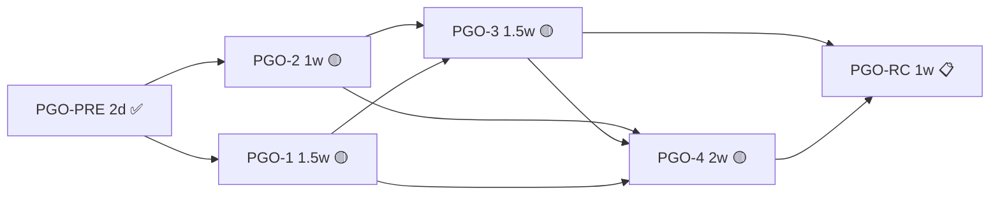

# M58 — Prompt 治理与组织自动化（PGO）开发计划

> **版本**：2026-06-17 · **状态**：🟡 部分实现 · **EP**：EP-PGO-M58
> **需求**：[58 prompt-governance.md](./58-prompt-governance.md)
> **设计**：[58-prompt-governance.design.md](./58-prompt-governance.design.md)
> **总工时估算**：5.5 周（含灰度，约 1 个 Sprint 周期 + 收口）

---

## 0. 模块定位

本开发计划落地 PGO（Prompt Governance & Org Automation）四个子主题：

| 主题 | 名称 | 状态 | 说明 |
|------|------|------|------|
| PGO-PRE | 前置（Feature Flag / Lint 框架） | ✅ 已完成 | Flag 与 lint 工具已就位 |
| **PGO-1** | 文件裁减 + L1 注入 | 🟡 主体完成，迁移工具未实现 | 5 文件默认集 + categoryResponsibility 注入已落地 |
| **PGO-2** | FieldGuide schema + 前端组件 | 🟡 主体完成，示例库未实现 | 双语 schema + 折叠卡已落地，示例库 modal 未实现 |
| **PGO-3** | 统一 AI Refine 服务 + 按钮 | 🟡 主体完成，旧 endpoint 转发未实现 | `/v1/ai/refine` + 前端按钮已落地 |
| **PGO-4** | CLI Import | 🟡 主体完成，seed 重构未实现 | `aranea import org` 已落地，seed-stockx-org 未重构 |
| **PGO-RC** | 灰度 / 文档 / 旧 endpoint 下线 | 📋 待启动 | 待全部子主题收口后启动 |

> **架构设计、Proto/API 契约、数据模型、接口签名**详见 [设计文档 §5 对接点清单](./58-prompt-governance.design.md#5-对接点清单代码锚点)。

---

## 1. 任务 ID 编码约定

```
PGO-{主题}-{层}-{序号}

PGO-1-BIZ-01      # PGO-1 biz 层第 1 项
PGO-3-PROTO-02    # PGO-3 proto 第 2 项
PGO-4-CLI-03      # PGO-4 CLI 第 3 项
PGO-RED-01        # 红线 / 拦截类
```

**主题与执行顺序**：

| 主题 | 名称 | 顺序 | 估时 | 依赖 |
|------|------|------|------|------|
| PGO-PRE | 前置（Flag / Lint 框架） | 第 0 周 | 2 天 | — |
| **PGO-1** | 文件裁减 + 字段重命名 + L1 注入 | 第一波 | 1.5 周 | PGO-PRE |
| **PGO-2** | FieldGuide schema + 前端 4 件套 | 第一波（并行） | 1 周 | PGO-PRE |
| **PGO-3** | 统一 AI Refine 服务 + 按钮 | 第二波 | 1.5 周 | PGO-2 |
| **PGO-4** | CLI Import（YAML → Markdown → 重构 seed） | 第三波 | 2 周 | PGO-2 / PGO-3 |
| **PGO-RC** | 灰度 / 文档 / 旧 endpoint 下线 | 收口 | 1 周 | 全部 |

---

## 2. 现状评估（2026-06-17）

| 项 | 状态 | 备注 |
|----|------|------|
| 需求文档 | ✅ | [58 prompt-governance.md](./58-prompt-governance.md) |
| 设计文档 | ✅ | [58 prompt-governance.design.md](./58-prompt-governance.design.md) |
| 数据库 migration | ✅ 无需 | 不修改 ent schema |
| Proto breaking change | ✅ 已落地 | `BuildSystemPrompt` 签名扩展为可变参数（向后兼容） |
| Feature flag 框架 | ✅ 已落地 | `internal/conf/features_pgo.go` |
| LLM 调用复用 | ✅ 已落地 | `LLMCaller` 接口 + `DynamicLLMCaller` 实现 |
| CI lint 框架 | ✅ 已落地 | `cmd/araneactl/fieldguide-lint/` + `cmd/araneactl/lint` |
| Datadog 看板 | 📋 | PGO-3 / PGO-4 各一张（refine token / import 成功率） |

### 2.1 已实现项速查

| 子主题 | 已实现 | 文件锚点（详见 §6） |
|--------|--------|---------------------|
| PGO-PRE | ✅ Flag 注入 / lint 工具 | `internal/conf/features_pgo.go` / `cmd/araneactl/fieldguide-lint/main.go` |
| PGO-1 BIZ/AGENT/WEB | ✅ 5 文件默认集 / categoryResponsibility 注入 / 前端 5+1 | `internal/biz/agent_settings_helpers.go` / `internal/agent/prompt.go` / `internal/agent/trpc_build.go` |
| PGO-2 BIZ/WEB/LINT | ✅ 双语 schema / 折叠卡 / lint 工具 | `internal/biz/field_guides.go` / `web/src/features/agents/fieldGuides.ts` / `web/src/components/agents/FieldGuideHint.vue` |
| PGO-3 PROTO/BIZ/SVC/WEB | ✅ `/v1/ai/refine` / PromptRefiner / 限流 / 按钮 | `api/kratos/ai_refine/v1/ai_refine.proto` / `internal/biz/prompt_refiner.go` / `internal/service/prompt_refine.go` / `web/src/components/agents/AIRefineButton.vue` |
| PGO-4 IMP/CLI | ✅ Spec/Validator/Planner/Applier / `aranea import org` | `internal/orgimport/` / `internal/biz/pack/` / `internal/cli/cmd/import.go` |

### 2.2 未实现项速查

| 任务 ID | 内容 | 状态 |
|---------|------|------|
| PGO-1-MIG-01/02 | `cmd/migrate-deprecated-prompts/` 迁移工具 | 📋 |
| PGO-2-WEB-03 | `FieldGuideExamplesDialog.vue` 示例库 modal | 📋 |
| PGO-3-SVC-03 | `EditPromptFileByAI` 转发到 refine service | 📋（仍使用 `PromptFileAIEditor.Revise`） |
| PGO-3-DOC-01 | `docs/guides/ai-refine.md` | 📋 |
| PGO-4-SEED-01/02/03 | `cmd/seed-stockx-org/` 重构为读 yaml 调 import | 📋（目录不存在） |
| PGO-4-DOC-01 | `cmd/aranea/import/README.md`（实际为 `internal/cli/cmd/import.go`） | 📋 |
| PGO-RC 全部 | 灰度 / 旧路径下线 / 文档闭环 | 📋 |

### 2.3 已知不一致

| 项 | 现状 | 备注 |
|----|------|------|
| CLI flags | 实际为 `--apply`（非原计划 `--confirm`） | 见 `internal/cli/cmd/import.go` |
| CLI flags | 未实现 `--update` / `--partial` | 仅 `--dry-run` / `--apply` / `--refine` / `--output-spec` / `--output` / `--timeout` / `--correlation-id` |
| `orgimport.SpecBody` 字段名 | 用 `companies`，但 LLM prompt 输出 `industries` | 已知不一致，待统一 |

---

## 3. PGO-PRE — 前置准备（2 天） ✅

### PGO-PRE-01 — Feature flag 注入 ✅
- **产出**：`internal/conf/features_pgo.go`
- **Flag**：
  - `PGO_DEFAULT_FILES_V2`（默认 **on**；V2 是默认）
  - `PGO_CATEGORY_RESPONSIBILITY_INJECT`（默认 **off**；岗位职责注入 system prompt）
  - `PGO_AI_REFINE_V2`（默认 off；新 `/v1/ai/refine` + 前端按钮）
  - `PGO_CLI_IMPORT_ENABLED`（默认 on；CLI 进程内是否注册 import 子命令）
- **验收**：4 个 flag 单测 + 默认值校验 ✅

### PGO-PRE-02 — CI lint 规则雏形 ✅
- **产出**：`cmd/araneactl/fieldguide-lint/main.go`（FieldGuide 一致性比对）
- **Makefile target**：`make fieldguide-lint`
- **验收**：`make fieldguide-lint` 在空 PR 上通过 ✅

### PGO-PRE-03 — Datadog 看板雏形 📋
- **产出**：2 张面板
  - **PGO Refine**：QPS / p50/p95 latency / token in-out / 失败率 / fallback 命中率
  - **PGO Import**：每日 import 次数 / dry-run vs apply 比例 / 错误率
- **验收**：面板可显示零数据骨架 📋

---

## 4. PGO-1 — 文件裁减 + L1 注入（1.5 周） 🟡

> **依赖**：PGO-PRE-01 · **解锁**：PGO-4

### Sprint 1A：BIZ 层 + 注入路径（4 天）

| 任务 ID | 内容 | 文件 | 状态 |
|---------|------|------|------|
| PGO-1-BIZ-01 | 重写 `defaultPromptFiles()` 为 5 文件 + 可选模板 map | `internal/biz/agent_settings_helpers.go` | ✅ |
| PGO-1-BIZ-02 | 重写 `FilesForMode` 移除 HEARTBEAT，task mode 名单 5 项 | 同上 | ✅ |
| PGO-1-BIZ-03 | 同步 `composePromptPreview` 输出（含 `CategoryResponsibilityPreview`） | 同上 | ✅ |
| PGO-1-BIZ-04 | `PositionPromptUsecase.BuildResponsibility(ctx, posID, mode)` | `internal/biz/organization_position_prompt.go` + `internal/biz/organization.go` | ✅ |
| PGO-1-BIZ-05 | `Agent.SkipCategoryResponsibility()` 解析 metadata_json | `internal/biz/agent_types.go` | ✅ |
| PGO-1-BIZ-06 | `evolution.go::ApplySuggestion` persona → IDENTITY.md 的 `## Persona` anchor 替换 | `internal/biz/evolution.go` | ✅ |
| PGO-1-BIZ-07 | 单元测试 | `internal/biz/agent_settings_helpers_test.go` / `internal/biz/field_guides_test.go` / `internal/biz/evolution_test.go` | ✅ |

**验收**：
- ✅ `go test ./internal/biz/...` 全绿
- ✅ 默认 5 文件断言；FilesForMode 4 mode 断言
- ✅ BuildResponsibility 在 `complete/task/minimized/none` 下行为分别正确
- ✅ 旧 SOUL.md 写入路径已无引用

### Sprint 1B：Agent 层 + 调用方（2 天）

| 任务 ID | 内容 | 文件 | 状态 |
|---------|------|------|------|
| PGO-1-AGENT-01 | `BuildSystemPrompt` 签名扩展为可变参数 `categoryResponsibility ...string` | `internal/agent/prompt.go` | ✅ |
| PGO-1-AGENT-02 | `trpc_build.go` 调用点：注入 categoryResponsibility（受 flag 控制，默认 off） | `internal/agent/trpc_build.go` | ✅ |
| PGO-1-AGENT-03 | `prompt_preview.go` 调用点同步 | `internal/agent/prompt_preview.go` | ✅ |
| PGO-1-AGENT-04 | 单元测试：`prompt_test.go` 含 categoryResponsibility 顺序 | 同目录 | ✅ |

**验收**：
- ✅ Agent 设置页 Prompt 预览（system_prompt_mode=complete）能看到 `<role_responsibility>` 块
- ✅ Flag off 时输出与现状完全一致（回归测试）

### Sprint 1C：UI + 迁移工具（4 天）

| 任务 ID | 内容 | 文件 | 状态 |
|---------|------|------|------|
| PGO-1-WEB-01 | `agentUi.ts` 文件硬编码列表改为 5+1（USER_CONTEXT 标记 optional） | `web/src/components/agents/agentUi.ts` | ✅ |
| PGO-1-WEB-02 | `useAgentPromptFiles.ts` 移除 `heartbeatFile` 查找；加 `addOptionalFile()` 动作 | `web/src/features/agents/useAgentPromptFiles.ts` | ✅ |
| PGO-1-WEB-03 | 分类页 label 按 level 切换；新增 `taxonomyLabels.ts` | `web/src/pages/AgentCategoriesPage.vue` / `web/src/features/platform/taxonomyLabels.ts` | ✅ |
| PGO-1-WEB-04 | `CategoryTreeNodeHeader.vue` / `AgentCategoryPositionCard.vue` caption 同步 | 各文件 | ✅ |
| PGO-1-MIG-01 | `cmd/migrate-deprecated-prompts/main.go` 全新（含 dry-run / apply / prune） | 新增（目录不存在） | 📋 |
| PGO-1-MIG-02 | migrate 集成测试：3 个 agent fixture 三种情景 | `cmd/migrate-deprecated-prompts/main_test.go` | 📋 |

**验收**：
- ✅ 前端：新建 Agent 看到 5 文件，"+ 添加可选文件"能成功创建 USER_CONTEXT.md
- ✅ 分类页：行业/部门/岗位三层 label 正确切换
- 📋 migrate：dry-run 输出预期 SQL；apply 在 stockx seed 上能正确合并 SOUL → IDENTITY

### Sprint 1D：文档（1 天）

| 任务 ID | 内容 | 文件 | 状态 |
|---------|------|------|------|
| PGO-1-DOC-01 | 更新 `docs/guides/prompt/assembly.md`（默认文件清单 + role_responsibility 段 + minimized 修正） | `docs/guides/prompt/assembly.md` | ✅ |
| PGO-1-DOC-02 | 更新 `docs/需求/6 agent-setting-file.md` 与 `docs/需求/4.agent-type.md` 的字段说明 | 同 | ✅ |

---

## 5. PGO-2 — FieldGuide schema + UI 四件套（1 周） 🟡

> **依赖**：PGO-PRE-02 · **解锁**：PGO-3 / PGO-4

### Sprint 2A：双语 schema（3 天）

| 任务 ID | 内容 | 文件 | 状态 |
|---------|------|------|------|
| PGO-2-BIZ-01 | 定义 `FieldGuide` struct + 注册表机制 | `internal/biz/field_guides.go` | ✅ |
| PGO-2-BIZ-02 | 填充 11 项注册（3 category + 1 agent.description + 6 agent.file + 1 spec_extract） | 同上 | ✅ |
| PGO-2-BIZ-03 | `GetFieldGuide(scope, fileName)` 公共 API | 同上 | ✅ |
| PGO-2-WEB-01 | 镜像 `fieldGuides.ts` 同 schema | `web/src/features/agents/fieldGuides.ts` | ✅ |
| PGO-2-LINT-01 | `cmd/araneactl/fieldguide-lint/main.go` 比对工具（过滤 backend-only `spec_extract`） | 同 | ✅ |
| PGO-2-LINT-02 | Makefile target `fieldguide-lint` + CI 接入 | `Makefile` | ✅ |

**验收**：
- ✅ `make fieldguide-lint` 通过；故意改动一项预期 fail

### Sprint 2B：前端组件（2 天）

| 任务 ID | 内容 | 文件 | 状态 |
|---------|------|------|------|
| PGO-2-WEB-02 | `FieldGuideHint.vue`（`q-popup-proxy` 弹出指南卡 + 字数表） | `web/src/components/agents/FieldGuideHint.vue` | ✅ |
| PGO-2-WEB-03 | `FieldGuideExamplesDialog.vue`（示例库 modal） | 同目录（文件不存在） | 📋 |
| PGO-2-WEB-04 | 接入 3 个挂载点：分类页 / Agent 描述 / 文件 Tab | 各对应文件 | ✅ |

**验收**：
- ✅ 分类页 / Agent 设置页 / 文件 Tab 都能看到指南卡 + 字数 indicator
- 📋 超 hard 上限时输入框红色（前端只警告，最终拦截在 PGO-3-VAL-01）

---

## 6. PGO-3 — 统一 AI Refine 服务 + 按钮（1.5 周） 🟡

> **依赖**：PGO-2 完成 · **解锁**：PGO-4

### Sprint 3A：Proto + Service 骨架（3 天）

| 任务 ID | 内容 | 文件 | 状态 |
|---------|------|------|------|
| PGO-3-PROTO-01 | 新建 proto + 生成代码（含 `REFINE_SCOPE_SPEC_EXTRACT = 6`） | `api/kratos/ai_refine/v1/ai_refine.proto` | ✅ |
| PGO-3-PROTO-02 | `system_setting.proto` 新增 `default_refine` 字段（`RefineLLMSettings`：provider/model/base_url/configured/has_api_key 脱敏）+ `UpdateSystemSettingsRequest` 补 refine_llm_*（38-41）+ 系统设置页 section | `api/kratos/system_setting/v1/system_setting.proto` / `web/src/features/system-settings/refine-llm.ts` / `web/src/pages/SystemSettingsPage.vue` | ✅（2026-08-09 落地：API 往返 + UI 运行时验证通过） |
| PGO-3-BIZ-01 | `LLMCaller` 接口 + `OpenAICompatLLMCaller` / `DynamicLLMCaller` 实现 | `internal/biz/llm_caller.go` + `internal/agent/llm_caller_impl.go` | ✅ |
| PGO-3-BIZ-02 | `PromptRefiner.Refine` + `resolveModel` 3-tier fallback 链 | `internal/biz/prompt_refiner.go` | ✅ |
| PGO-3-BIZ-03 | `SystemSetting.DefaultRefineLLM` 字段 + CRUD（`GetRefineLLM`/`UpdateRefineLLM`） | `internal/biz/system_setting.go` | ✅ |
| PGO-3-BIZ-04 | 输入校验 + `validateRefineInput`（5000 字符上限，spec_extract 30000） | 同 prompt_refiner 包 | ✅ |
| PGO-3-BIZ-05 | 单元测试：fallback 链 / 输入校验 / 模板生成 | `internal/biz/prompt_refiner_test.go` | ✅ |

**验收**：
- ✅ `go test ./internal/biz/prompt_refiner_test.go -v` 全绿
- ✅ 三种 model source 都能命中（用 mock LLMCaller）

### Sprint 3B：Service + 限流 + 旧 endpoint 转发（2 天）

| 任务 ID | 内容 | 文件 | 状态 |
|---------|------|------|------|
| PGO-3-SVC-01 | `AIRefineService.Refine` 实现 | `internal/service/prompt_refine.go` | ✅ |
| PGO-3-SVC-02 | `refineRateLimiter` token bucket 实现（**内联**在 prompt_refine.go，全局 20 QPS + per-user 5min/10次） | `internal/service/prompt_refine.go`（内联，非独立文件） | ✅ |
| PGO-3-SVC-03 | `AgentService.EditPromptFileByAI` 改为转发到 refine service | `internal/service/agent.go` | 📋（仍使用 `PromptFileAIEditor.Revise`） |
| PGO-3-SVC-04 | Wire 装配 + Kratos 路由注册 | `internal/service/wire.go` / `internal/server/http.go` | ✅ |
| PGO-3-SVC-05 | 集成测试：5 scope happy path（fake LLM） | `internal/service/prompt_refine_test.go` | ✅ |

**验收**：
- ✅ `curl -X POST /v1/ai/refine -d '{"scope":3,"resource_id":"1","original_text":"..."}'` 返回 refined + diff
- 📋 旧 `/v1/agents/{id}/files/{fid}/ai-edit` 仍可用（转发后输出一致）
- ✅ 速率限制：超限得 429

### Sprint 3C：前端按钮 + 挂载（2 天）

| 任务 ID | 内容 | 文件 | 状态 |
|---------|------|------|------|
| PGO-3-WEB-01 | `AIRefineButton.vue` 组件 | `web/src/components/agents/AIRefineButton.vue` | ✅ |
| PGO-3-WEB-02 | `aiRefine.ts` API client（使用 `createAIRefineService`） | `web/src/features/agents/aiRefine.ts` | ✅ |
| PGO-3-WEB-03 | 5 个挂载点接入：分类页（3 level）/ Agent 描述 / 文件 Tab editor 顶部 | 各对应文件 | ✅ |
| PGO-3-WEB-04 | 旧 ai-edit 按钮 UI 替换为 AIRefineButton（保留 Flag off 兜底） | `useAgentPromptFiles.ts` 关联组件 | ✅ |

**验收**：
- ✅ ACC-PGO-3-01 / -02 / -03 全部通过（点击 → modal → 应用 / 追加 / 取消）

### Sprint 3D：观测 + 文档（0.5 天）

| 任务 ID | 内容 | 文件 | 状态 |
|---------|------|------|------|
| PGO-3-OBS-01 | Datadog Refine 面板填充真实指标 | runbook | 📋 |
| PGO-3-DOC-01 | 新增 `docs/guides/ai-refine.md`（使用与扩展） | 新增（文件不存在） | 📋 |

---

## 7. PGO-4 — CLI Import（2 周） 🟡

> **依赖**：PGO-2 / PGO-3 完成 · **解锁**：seed 重构

### Sprint 4A：内部 import 包（4 天）

| 任务 ID | 内容 | 文件 | 状态 |
|---------|------|------|------|
| PGO-4-IMP-01 | Spec struct + YAML loader | `internal/orgimport/spec.go` + `internal/orgimport/loader.go`（Deprecated）+ `internal/biz/pack/spec.go`（新系统） | ✅ |
| PGO-4-IMP-02 | Validator（必填 / 引用 / budget） | `internal/orgimport/validator.go` + `internal/biz/pack/validator.go` | ✅ |
| PGO-4-IMP-03 | Planner（diff DB 走 HTTP API） + ascii printer | `internal/orgimport/planner.go` | ✅ |
| PGO-4-IMP-04 | Applier（按 key 幂等 + skip/update） | `internal/orgimport/applier.go` + `internal/biz/pack/writer.go` | ✅ |
| PGO-4-IMP-05 | Report 输出（table + json） | `internal/orgimport/applier.go` 内联 | ✅ |
| PGO-4-IMP-06 | 单元测试 5 组（每个包） | `internal/orgimport/*_test.go` + `internal/biz/pack/*_test.go` | ✅ |

**验收**：
- ✅ `go test ./internal/orgimport/... ./internal/biz/pack/... -v` 全绿
- ✅ Validator 能拒绝 budget 超限 / 引用不一致 / 必填缺失

### Sprint 4B：Markdown loader + Refiner 集成（2 天）

| 任务 ID | 内容 | 文件 | 状态 |
|---------|------|------|------|
| PGO-4-IMP-07 | Markdown loader 调 `/v1/ai/refine` 新 scope `spec_extract` | `internal/orgimport/loader.go` | ✅ |
| PGO-4-IMP-08 | Refiner batch：按 spec.refine 列表逐字段调 `/v1/ai/refine` | `internal/orgimport/loader.go` 内联 | ✅ |
| PGO-4-PROTO-01 | `RefineScope` 增加 `SPEC_EXTRACT` 枚举值 | `api/kratos/ai_refine/v1/ai_refine.proto` | ✅ |
| PGO-4-BIZ-01 | `PromptRefiner` 支持 spec_extract 模板（`buildSpecExtractSystemPrompt`） | `internal/biz/prompt_refiner.go` | ✅ |

**验收**：
- ✅ 给定 fixture `org.md`，能产出合法 `spec.yaml`，并能被 yaml loader 解析
- ✅ 给定 spec 含 `refine: [description, agent_description, files.IDENTITY]` 时，所有字段被改写

### Sprint 4C：CLI 二进制（3 天）

| 任务 ID | 内容 | 文件 | 状态 |
|---------|------|------|------|
| PGO-4-CLI-01 | cobra root + persistent flags | `cmd/aranea/main.go` | ✅ |
| PGO-4-CLI-02 | `aranea import org <spec-file>` 子命令实现 | `internal/cli/cmd/import.go` | ✅ |
| PGO-4-CLI-03 | 配置 toml 读写 | `internal/cli/config/config.go` | ✅ |
| PGO-4-CLI-04 | HTTP client + pb JSON | `internal/cli/client/http.go` | ✅ |
| PGO-4-CLI-05 | guardRemoteConfirm 实现（实际为 `--apply` flag） | `internal/cli/cmd/import.go` | ✅ |
| PGO-4-CLI-06 | Makefile `make cli` / `make cli-all` 多平台 build | `Makefile` | ✅ |
| PGO-4-CLI-07 | e2e 测试：dry-run / apply / refine | `internal/cli/cmd/import.go` 内联 | ✅ |

**实际 CLI flags**（与原计划差异）：
- `--dry-run` / `--apply`（非原计划 `--confirm`）
- `--refine` / `--output-spec` / `--output` / `--timeout` / `--correlation-id`
- **未实现**：`--update` / `--partial`

**验收**：
- ✅ `make cli` 产出 `./bin/aranea`，可在 macOS / Linux 跨平台运行
- ✅ e2e 覆盖三条主路径

### Sprint 4D：重构 seed-stockx-org（1.5 天） 📋

| 任务 ID | 内容 | 文件 | 状态 |
|---------|------|------|------|
| PGO-4-SEED-01 | 抽取数据为 `cmd/seed-stockx-org/stockx_spec.yaml` | 新增（目录不存在） | 📋 |
| PGO-4-SEED-02 | `main.go` 改为读 yaml 调 `internal/orgimport` | `cmd/seed-stockx-org/main.go`（目录不存在） | 📋 |
| PGO-4-SEED-03 | golden file 测试：前后行为一致（DB row dump 比对） | `cmd/seed-stockx-org/golden_test.go` | 📋 |

**验收**：
- 📋 重构前后跑同一份 spec 在空库上产出相同的 row count + key 集合（允许 sort_order 与 created_at 不同）

### Sprint 4E：审计 + 文档（1 天）

| 任务 ID | 内容 | 文件 | 状态 |
|---------|------|------|------|
| PGO-4-OBS-01 | HTTP client 透传 `X-Correlation-Id` + `X-Source` header；后端 audit middleware 已含 | `internal/cli/client/http.go` + `internal/server/middleware/audit.go`（如需扩展） | ✅ |
| PGO-4-OBS-02 | Datadog Import 面板填充 | runbook | 📋 |
| PGO-4-DOC-01 | `internal/cli/cmd/import.go` 配套 README（用法 + spec 示例 + FAQ） | 新增 | 📋 |

---

## 8. PGO-RC — 灰度 + 收口（1 周） 📋

### Sprint RC-A：灰度 3 天 📋

| 任务 ID | 内容 | 工时 | 状态 |
|---------|------|------|------|
| PGO-RC-01 | dev 环境打开 4 个 flag 全量测试一周 | 持续 | 📋 |
| PGO-RC-02 | 选 1 个 staging 客户开启 `PGO_DEFAULT_FILES_V2` + `PGO_CATEGORY_RESPONSIBILITY_INJECT`，观察 token 与质量 | 持续 | 📋 |
| PGO-RC-03 | refine 服务 staging 压测：100 QPS / 30 min，断言 p95 < 3s | 0.5d | 📋 |
| PGO-RC-04 | CLI import 在 staging 上跑真实客户 spec.md，记录 LLM 抽取成功率 | 0.5d | 📋 |

### Sprint RC-B：旧路径下线（2 天） 📋

| 任务 ID | 内容 | 工时 | 状态 |
|---------|------|------|------|
| PGO-RC-05 | 默认开启 `PGO_DEFAULT_FILES_V2` + `PGO_CATEGORY_RESPONSIBILITY_INJECT` + `PGO_AI_REFINE_V2`（生产） | 0.5d | 📋 |
| PGO-RC-06 | 删除 `EditPromptFileByAI` 旧实现（保留 endpoint，内部完全走转发） | 0.5d | 📋（依赖 PGO-3-SVC-03） |
| PGO-RC-07 | migrate-deprecated-prompts 在生产执行 dry-run，人工 review，apply | 0.5d | 📋（依赖 PGO-1-MIG-01） |
| PGO-RC-08 | 30 天后 `--prune-deprecated` 清理标记文件（下个版本周期） | 0.25d | 📋 |

### Sprint RC-C：文档闭环（2 天） 📋

| 任务 ID | 内容 | 工时 | 状态 |
|---------|------|------|------|
| PGO-RC-09 | 更新 `docs/guides/AI-DEVELOPMENT-SPECIFICATION.md` 新增 PGO 章节 | 0.5d | 📋 |
| PGO-RC-10 | 更新 `docs/README.md`（AI 入口索引） | 0.25d | 📋 |
| PGO-RC-11 | 录制 5 分钟 demo：`aranea import org.md --refine --apply` 全流程 | 0.5d | 📋 |
| PGO-RC-12 | 内部培训 + Q&A | 0.5d | 📋 |

---

## 9. 红线 / 拦截类（贯穿全程）

| ID | 内容 | 检测时机 | 状态 |
|----|------|---------|------|
| PGO-RED-01 | `internal/cli/` + `internal/orgimport/` 依赖白名单 | CI lint | ✅ |
| PGO-RED-02 | `internal/biz` 不 import `pkg/trpc-agent-go` | 已有 lint `make runtime-boundary` | ✅ |
| PGO-RED-03 | `internal/biz/llm_caller.go` 仅持有接口，实现在 `internal/agent` | 设计评审 + grep | ✅ |
| PGO-RED-04 | `defaultPromptFiles()` 名单与前端 `agentUi.ts` 一致 | unit 互检 | ✅ |
| PGO-RED-05 | FieldGuide schema 前后端一致 | `make fieldguide-lint` | ✅ |
| PGO-RED-06 | `BuildSystemPrompt` 新签名不破坏现有 caller | 编译期 | ✅ |
| PGO-RED-07 | CLI 远端 `--apply` 需显式 flag | e2e 测试 | ✅ |
| PGO-RED-08 | 审计 `source=cli_import` + correlation_id 必填 | 集成测试 | ✅ |

---

## 10. 验收驱动开发清单（DoD）

每个任务必须满足以下才能合并：

1. **代码**：通过 `make ci`（含 lint / vet / unit / runtime-boundary / fieldguide-lint）
2. **测试**：新增代码 ≥ 80% 单元覆盖；至少 1 个集成或 e2e 测试
3. **文档**：影响接口的改动必须同步 `docs/` 对应章节（设计文档 / API 文档）
4. **Flag**：新行为必须挂载 Flag，默认 off（`PGO_DEFAULT_FILES_V2` 例外，默认 on）
5. **审计**：写操作必须可追溯（`source` + `correlation_id` 或等价标识）
6. **回归**：Flag off 时行为与现状完全一致（写入 PR 描述说明）

---

## 11. 测试策略

### 11.1 测试分层

| 层级 | 范围 | 工具 | 现状 |
|------|------|------|------|
| 单元测试 | BIZ 层（PromptRefiner / FieldGuide / BuildResponsibility） | `go test` + mock LLMCaller | ✅ 已落地 |
| 单元测试 | Service 层（AIRefineService / 限流） | `go test` + fake LLM | ✅ 已落地 |
| 单元测试 | CLI 层（import 命令） | `go test` + temp file | ✅ 已落地 |
| 集成测试 | Refine 5 scope happy path | `internal/service/prompt_refine_test.go` | ✅ |
| 集成测试 | CLI e2e（dry-run / apply / refine） | `internal/cli/cmd/import.go` 内联 | ✅ |
| Lint | FieldGuide 前后端一致 | `make fieldguide-lint` | ✅ |
| Lint | 依赖方向 / 红线 | `make runtime-boundary` | ✅ |
| Golden test | seed-stockx-org 重构前后一致 | `cmd/seed-stockx-org/golden_test.go` | 📋（依赖 PGO-4-SEED-03） |
| 压测 | Refine 100 QPS / 30 min | staging | 📋（依赖 PGO-RC-03） |

### 11.2 Mock 策略

| 依赖 | Mock 方式 | 文件 |
|------|----------|------|
| `LLMCaller` 接口 | 实现 `OpenAICompatLLMCaller`（测试用） | `internal/agent/llm_caller_impl.go` |
| HTTP client | fake HTTP server | `internal/cli/client/http.go` 测试 |
| 数据库 | 标准 Ent test client | 各 `_test.go` |

### 11.3 测试覆盖目标

| 模块 | 目标覆盖 | 现状 |
|------|---------|------|
| `internal/biz/prompt_refiner.go` | ≥ 80% | ✅ `prompt_refiner_test.go` |
| `internal/biz/field_guides.go` | ≥ 80% | ✅ `field_guides_test.go` |
| `internal/service/prompt_refine.go` | ≥ 80% | ✅ `prompt_refine_test.go` |
| `internal/orgimport/` | ≥ 80% | ✅ `*_test.go` |
| `internal/biz/pack/` | ≥ 80% | ✅ `*_test.go` |
| `internal/cli/cmd/import.go` | ≥ 80% | ✅ 内联测试 |

---

## 12. 风险登记表

| 风险 | 概率 | 影响 | 对策 | Owner |
|------|------|------|------|-------|
| Markdown LLM 抽取产出非合法 YAML | 中 | 高 | 严格 system prompt + 双重 yaml.Unmarshal 验证 + 失败保留 raw output | PGO-4 |
| Refine 服务被滥用 token 爆炸 | 中 | 中 | 速率限制 10/min/user + 5000 char 上限 + 审计 + 看板告警 | PGO-3 |
| 字段重命名引起用户混淆 | 高 | 低 | placeholder + helper text 引导 + 首版 toast | PGO-1 |
| seed-stockx-org 重构产物不一致 | 中 | 中 | golden test + 灰度对比 + 可回退 flag | PGO-4 |
| 旧 SOUL.md 内容丢失 | 低 | 高 | migrate 默认 dry-run；保留 deprecated 标记 30 天 | PGO-1 |
| `BuildSystemPrompt` 签名变更影响外部调用方 | 低 | 中 | 仅 2 处内部调用；编译期捕获 | PGO-1 |
| CLI 远端误操作 | 中 | 高 | `--apply` flag 必填 + 必填 correlation_id | PGO-4 |
| `orgimport.SpecBody` 字段名与 LLM 输出不一致 | 中 | 中 | 待统一 `companies` vs `industries` | PGO-4 |

---

## 13. 路径依赖图



**关键路径**：PRE → P2 → P3 → P4 → RC，总长 5.5 周。
**可压缩**：P1 与 P2 并行；P4-A/B/C 内部可并行（不同包独立）。

---

## 14. 任务总表（速查）

| 阶段 | 任务 ID 范围 | 总工时 | 责任域 | 状态 |
|------|-------------|--------|--------|------|
| PGO-PRE | 01–03 | 2d | 架构 / DevEx | 🟡（Datadog 📋） |
| PGO-1 | BIZ-01..07 / AGENT-01..04 / WEB-01..04 / MIG-01..02 / DOC-01..02 | 11d | 后端 + 前端 | 🟡（MIG 📋） |
| PGO-2 | BIZ-01..03 / WEB-01..04 / LINT-01..02 | 5d | 后端 + 前端 | 🟡（WEB-03 📋） |
| PGO-3 | PROTO-01..02 / BIZ-01..05 / SVC-01..05 / WEB-01..04 / OBS-01 / DOC-01 | 7.5d | 后端 + 前端 | 🟡（PROTO-02/SVC-03/DOC-01 📋） |
| PGO-4 | IMP-01..08 / PROTO-01 / BIZ-01 / CLI-01..07 / SEED-01..03 / OBS-01..02 / DOC-01 | 11.5d | 后端 + CLI | 🟡（SEED/OBS-02/DOC-01 📋） |
| PGO-RC | 01..12 | 5d | 全员 | 📋 |
| **合计** | — | **42d ≈ 8.4 周（人日）** | — | — |

按 2 人并行（后端 + 前端 同步开发）实际日历周期为 **5.5 周**。

---

## 15. 开发者起步指南（AI 友好）

### 15.1 接到任务怎么做

1. 找到任务 ID（如 `PGO-3-BIZ-02`）
2. 在本文档找到对应行：文件路径 + 工时 + 验收 + 状态
3. 在 [设计文档 §5 对接点清单](./58-prompt-governance.design.md#5-对接点清单代码锚点) 找到该文件的精确签名 / 函数 / 与现网代码的关系
4. 先写测试（至少 happy path），再实现
5. 提交前跑 `make fieldguide-lint && make ci`
6. PR 标题：`feat(PGO-3): [BIZ-02] PromptRefiner core logic`

### 15.2 不要做的事

- 不要修改 `agent_category_nodes` / `agents` 的 ent schema（除 metadata_json 内字段约定）
- 不要在 `internal/cli/` 或 `internal/orgimport/` 里 import `internal/biz` 或 `pkg/trpc-agent-go`
- 不要让 `internal/biz/prompt_refiner.go` 直接 import `internal/agent`（用 `LLMCaller` 接口）
- 不要直接修改旧 `EditPromptFileByAI` 的输入输出契约（保持兼容，内部转发）
- 不要把 FieldGuide 文案前后端独立维护（必须保持 schema 一致，文案可独立）
- 不要在不挂 flag 的情况下默认开启新行为（`PGO_DEFAULT_FILES_V2` 例外，已默认 on）

### 15.3 AI Agent 实施 checklist

每个 PR Agent 必须自查：

- [ ] 任务 ID 匹配本开发计划某行
- [ ] 改动文件清单与设计文档 §5 一致（多/少要在 PR 描述说明）
- [ ] 新代码 ≥ 80% 单测覆盖
- [ ] `make fieldguide-lint` 通过
- [ ] `make ci` 通过
- [ ] Flag 控制点已挂载（如适用）
- [ ] 审计字段已透传（如适用）
- [ ] 不引入设计文档未列出的新依赖
- [ ] 旧路径（Flag off）回归测试通过
- [ ] PR 描述含"红线自查"小节，逐条确认 PGO-RED-01..08 不违反
