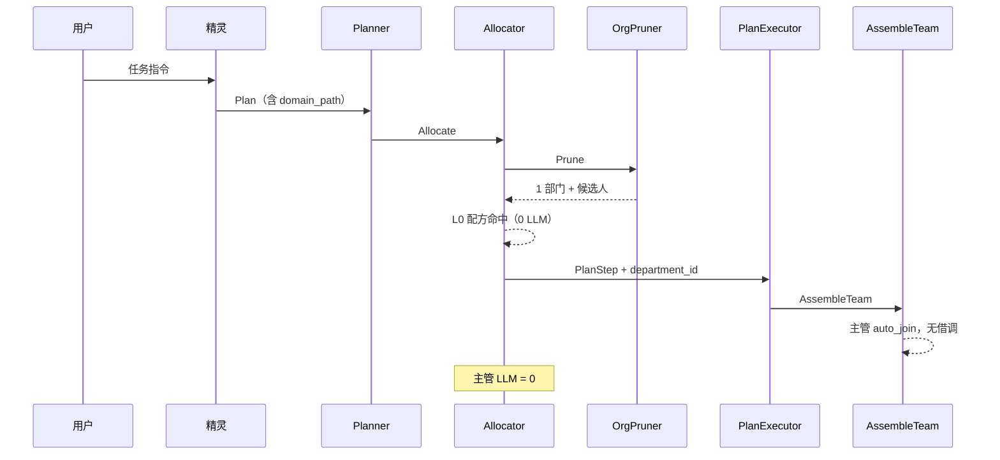
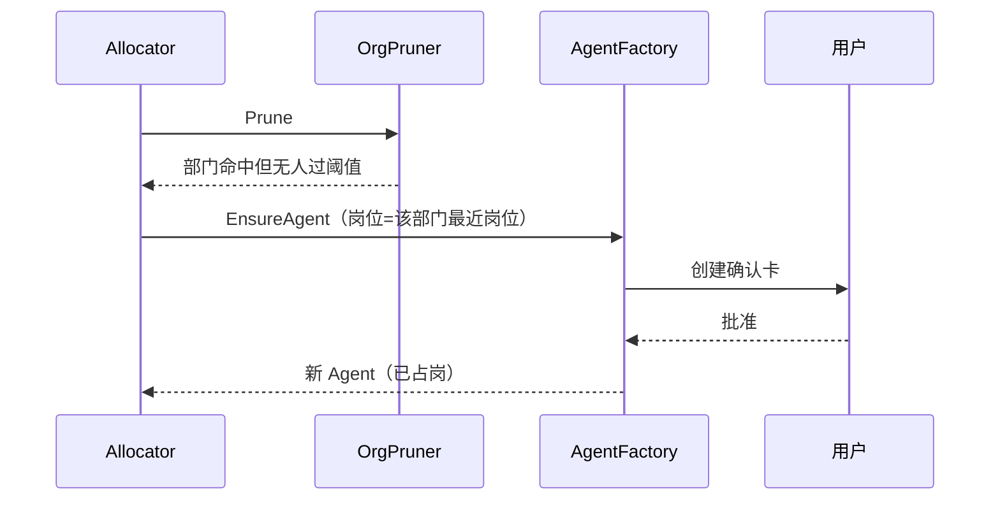
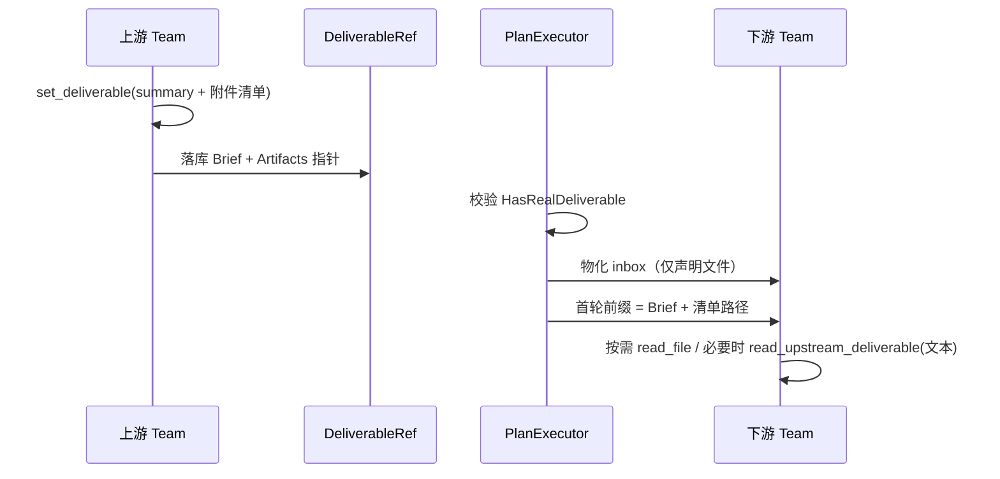

# M78: 组织感知编排（ORG-FAST）— 实现设计

> 对应需求：[78-org-aware-orchestration.md](./78-org-aware-orchestration.md)
> **ADR**：[2026-08-22-review-adr-org-aware-orchestration.md](../reports/2026-08-22-review-adr-org-aware-orchestration.md) · [重型组织链](../reports/2026-08-22-review-adr-org-heavy-chain.md) · [横切评审](../reports/2026-08-22-review-org-heavy-chain-crosscut.md)
> **开发计划**：[78-org-aware-orchestration.development.md](./78-org-aware-orchestration.development.md)

---

## 一、模块概述

### 1.1 设计定位

把 M67 的编制表接到编排热路径上：**组织负责缩小搜索空间，精灵只做粗路由与选流程剧本，Allocator 按花名册绑定已有专项；部门主管与总经理在重型档走三管道（不上全文）。Factory 不在热路径。跨团队交接拆成结论通道与体积通道。**

本模块不新建独立服务。它是 Allocator / AssembleTeam / 组织索引上的一条编排规则层。

### 1.2 对最初设想的评审结论

| 设想环节 | 是否保留 | 落地形态 |
|----------|----------|----------|
| 按任务类型找公司 | **弱化** | 当前 workspace 唯一公司树；「找公司」= 租户已选定，热路径 0 成本 |
| 找最合适的部门 | **保留且前置** | 确定性 Org-Prune（domain_path / 岗位职责），禁止用 LLM 扫全部部门当第一跳 |
| 交给部门领导 | **改职责** | 领导不在热路径分解用户原任务；只在缺人、借调、交付门禁时介入 |
| 领导再分解并派工 | **拆开** | 全局分解归 `TaskPlanner`；部门内补员/角色互补归 Allocator 规则；主管可建议不可覆盖 DAG |
| 没有合适公司则创造 | **分层** | 禁止创造公司/部门；允许创造 Agent（确认）与一次性 Team；配方写入缓存 |

**为什么不能按「主管串行派工」做：**

1. **已经有分解器。** `plan_and_execute` Phase 1 已把用户任务拆成 SubTask + `domain_path`。主管再拆一次 = 双分解，结果易冲突，墙钟成倍。
2. **已经有匹配器。** B.10.21 的 L0 配方 / L1 使命是「又快又准」的主路径；主管 LLM 选人是最慢、最不可复现的一层，只能当治理兜底。
3. **公司维度当前是空跳。** M67：单公司、根节点唯一。任务级「找公司」没有候选可比。
4. **创造公司会毁掉编制表。** 公司/部门是权限、审批、资源目录的锚点；一次任务长出新部门会使借调比例、主管、岗位全部失锚。
5. **HiClaw / AgentTeams 的启示**（[2026-08-14 编排升级方案](../reports/2026-08-14-plan-orchestration-upgrade.md)）：三层 Leader-Worker 里 **TeamLeader 可跳过**。高置信路径跳过主管，才既快又准。

### 1.3 分层与依赖

```
用户指令
  → ChatOrchestrator 预规划门控（简单/澄清 → light，不组队）
  → 分档（R9：先早判，Plan/剧本展开后可升级不可静默降级）
  → Spirit plan_and_execute
       轻：结束
       中：配方或 TaskPlanner.Plan → 花名册 → 建团
       重：已授权剧本展开（或配方指纹命中）→ 花名册
           无剧本 → 总经理补一次并沉淀；禁止对原话自由拆解
       Phase 2 AgentAllocator.Allocate
            Org-Prune + 花名册（dept_lead / company_lead 不可分配）
       Phase 3 PlanExecutor + RealTeamOrchestrator
            Assemble 新 Team（不复活旧行）+ DepartmentID
            重型另挂三管道（异步，不挡无依赖开工）
```

**红线：**

- `internal/biz` 不 import `pkg/trpc-agent-go`
- Org-Prune 禁止 LLM；L3 仍可 LLM，但输入必须是剪枝后的名单
- 任务路径禁止调用 OrganizationWriter 创建 company/department
- 生产建团仍只走 `PlanExecutor` + `RealTeamOrchestrator`
- `dept_lead` / `company_lead` 不得为业务 AssignedKey / Team Lead（显式 `agent_keys` 除外）
- 已授权重型剧本展开时总经理 LLM = 0；无依赖部门不等上行汇报

---

## 二、编排规则（规范正文）

### 2.1 总规则：先分流，再剪枝，再匹配，最后才治理/创造

```
R0  会话阶段
    idle            → 评估是否组队
    orchestrating   → 禁止新 DAG（除非用户明确新任务 force_new）
    ready           → 默认复用结果
    interrupted     → 续跑/询问，不新开

R1  复杂度与澄清（已有，必须保持）
    阻塞性歧义      → direct，先问，禁止组队
    简单            → direct，精灵自答
    多独立子任务    → parallel
    需协作/用户要团队 → dag

R2  公司
    使用当前 workspace 的 Organization 树
    不在任务热路径检索/创建公司
    用户要换业务主体 = 换 workspace（P3）

R3  部门（Org-Prune）
    用 SubTask.domain_path + 岗位职责/部门描述做确定性匹配
    一个部门覆盖 → 部门内组队
    多个部门、轻耦合 → 主部门 Team + 借调
    多个部门、有交付依赖 → 每部门一 Team，DAG 连接

R4  人（Allocator，在剪枝集上）
    L0 领域配方 DQ≥0.7     → 立即采用（最快最准）
    L1 同域使命×履历       → 阈值 0.3
    roster 专题花名册      → specialty → primary（+ backup）
    有 domain_path 时      → 不再 L2/L3 选人、不低分交差
    domain_path 空         → 仍可 L2/L3（兼容）
    仍失败                 → staffing（花名册内）或 fail-closed
    Factory                → 仅 allowFactoryCreate / 管理面

R5  部门主管
    默认不进入业务候选池
    自动加入本部门 Team（M67，依赖 department_id）
    仅在缺编建议 / 借调审批 / 交付门禁时调用 LLM
    禁止对用户原任务做全局二次分解

R6  创造
    Agent     → 热路径禁止；管理面 Factory + 用户确认 + 必须挂已有岗位
    Team      → 本次会话一次性实体（配方可跨次复用）
    公司/部门 → 禁止由本链路创建

R7  跨团队交接（双通道，见 §十一）
    Brief     → 结论信封进下游首轮上下文（摘要/要点/契约/认知）
    Bulk      → 文件/二进制只在信封列指针，dispatch 物化 inbox 或按制品 ID 拉取
    监管      → memberfs 只读抽查，不替代 Brief/Bulk
    无 Brief  → 禁止激活下游
    统一者    → 轻/中：协议 + 精灵对人汇总。重型：横向部门领导/总经理 Brief；上行例外；精灵仍对人汇总
    可观测    → allocating 带 specialty/agent/match_layer；collaborating 说明交接方式

R8  同类任务召回（配方回放，不是复活 Team）
    同会话非 idle 且目标未换 → reuse_existing（已有）
    新会话/idle + 任务模式缓存 DQ≥0.7 且带 AgentKeys 或 Specialties
        → 跳过分解 LLM
        → 有 Specialties 则按槽位重建多 SubTask，否则合成 1 个
        → AllocateExplicit(历史 keys) 或花名册绑定槽位
        → 仍 Assemble 新 Team + PlanExecutor（交付闸门、进度、inbox）
    禁止把 completed Team 行改回 running
    约束指纹不合 → 只复用专题槽或 force_new，不复用历史 keys
    force_new / 「重新组建」→ 完整 ORG-FAST

R9  分档（轻 / 中 / 重）
    轻：简单/澄清 → 不组队（R1）
    中：单部门或单专题可闭环 → 花名册 + 部门门禁；总经理 LLM = 0
    重：跨部门 DAG 或跨公司或复杂度=长任务 → 启用 R10–R13
    判定确定性，默认不额外 LLM（复杂度分沿用已有 DimensionScores）

R10 总经理与流程剧本
    每公司一名 company_lead（M67 对称 dept_lead）；启发式不可分配为 Team Lead
    剧本 = 本公司「这类活怎么过部门」：阶段、部门、依赖、交付物名
    已授权剧本命中 → 展开部门槽，0 次总经理 LLM
    无剧本 → 总经理可补一次并沉淀；禁止对用户原话全局自由拆解
    任务路径仍禁止创建公司/部门

R11 三管道（仅重型）
    上行：例外即时 + 阶段心跳；≤2KB；无源码/数据集
    横向-公司内：部门领导传 Brief/Bulk
    横向-跨公司：总经理传公司级 Brief（范围/接口/期限/机密级）；无 2+ 公司节点则休眠
    下行：目标/约束/放行；不重写部门内拆解
    无 Brief 下游不开工（与 R7 一致）

R12 仲裁
    部门争议 → 本公司总经理
    公司争议 → 精灵呈用户；禁止总经理循环互怼
    常规门禁超时自动通过（高风险除外）

R13 重型续跑
    checkpoint 记录 playbook_id、已授权阶段、已发 Brief ID
    旧 checkpoint 缺省字段不阻断恢复（对齐 M70）

R14 上下文预算（成员首轮前缀）
    Brief ≤2KB + 知识检索 ≤2KB + 记忆 ≤1KB/8 条 + 协议/工具概览 ≤1KB
    合计硬顶 6KB；超限先砍知识再砍记忆，不砍 Brief
    禁止把成员过程全文、源码、vault 整库注入任何领导/精灵窗

R15 记忆四槽隔离
    配方缓存 = 班底槽位（R8）；checkpoint = 续跑状态（R13）
    L1 = 该成员本任务工作记忆；L3 = 事后个人经验（异步，不横向倒给兄弟）
    知识写回 ≠ 记忆；禁止用 L3 当跨团队总线

R16 知识引用不复制
    剧本阶段可绑 collection_ids；开工检索+按需工具
    不把知识库正文写入 Brief；写回待审（沿用 KnowledgeWriteBack）
    员工只检索其部门/阶段允许的库

R17 工具/MCP 专项画像
    花名册条目带允许 toolset / MCP server；员工不继承精灵全家桶
    dept_lead：memberfs + deptmail + 门禁；company_lead：公司 Brief + 仲裁
    危险工具走既有 awaiting_user HITL；MCP 不健康只降级该工具

R18 确认五档
    造人 / 新剧本首次授权 / 高风险门 / 危险工具 / 剧本 confirm_before
    默认阶段交接只认 Brief 闸门，不弹确认
    禁止每人开工点一次

R19 可观测与干预
    用户：团队芯片 + 阶段心跳 + 例外（不刷成员 token 流）
    成员：既有 pause / inject / cancel（1-chat / team-run API）
    换人：剩余工作新开 Team，不改已完成行
    deptmail 不是横向管道；用户 inject 不是上行

R20 汇总与可选图
    终态汇总只吃 Brief 摘要 + 例外表 + 制品清单（沿用 synthesis trigger）
    有 cancelled 则跳过（已有）
    默认 PlanExecutor；阶段可挂已有 graph_template_id；禁止为组织链新引擎
```

### 2.2 借调 vs DAG 判定（确定性）

| 条件 | 选择 | 理由 |
|------|------|------|
| 剪枝后仅 1 个部门 | 单 Team，本部门成员 | 无跨部门成本 |
| 2+ 部门，且辅部门人数 ≤ max(1, 50% 编制) 且无「必须先交付再开工」依赖，**或**协作主要是共用同一批工作文件 | 单 Team + 借调 | 轻量协作；大量文件不必跨沙箱复制 |
| 2+ 部门且 SubTask 之间有 DependsOn / 交付契约，**且**交接物以结论为主（报告/规格/清单） | 每部门一 Team + DAG | 深度协作；走 Brief + 可选 Bulk 指针 |
| 用户显式要求 N 个团队 | 尊重用户，dag | DECISION.md 规则 5 |

Planner 已输出 SubTasks 与 DependsOn 时，以 **Plan 的 DAG 为权威**；本规则只用于「Plan 未拆部门、Allocator 发现成员跨部」时的纠偏（把跨部成员标进 `CrossDeptMemberIDs`，或拆 step——P1 只做标注借调，不重写 Plan）。

### 2.3 部门主管介入状态

> AS-FSM-01：主管在编排中的角色 > 3 种，显式化。

```
absent        高置信本部门命中，主管不出现在业务执行链（仍可自动入队作观察/门禁配置）
auto_join     Team.department_id 已设，主管作为成员加入但不做 Lead
borrow_gate   存在跨部门成员，走借调审批（超时自动通过）
staffing      剪枝集无人过阈值，主管可建议花名册内已有专项；超时 / UseFactory → fail-closed
quality_gate  跨部门交付 VerificationGate（已有）
```

禁止状态：`dispatch_planner`（主管当第二 Planner）。

### 2.4 任务分档状态（AS-FSM-01）

```
light     不组队；精灵自答
medium    组队但不启用总经理/上行；部门领导仅门禁
heavy     启用剧本展开 + 三管道 + 总经理对外
```

升级：跨部门 DAG / 跨公司 / 复杂度达长任务阈值 / 用户显式要求组织链。  
降级：禁止把已开工的 heavy 静默改回 medium（会丢汇报契约）；用户 `force_new` 除外。

### 2.5 总经理介入状态

```
absent           轻/中档，或剧本已预授权且无冲突
playbook_auth    对本公司某剧本一次签字（可早于具体任务）
playbook_fill    无剧本时补写一次并沉淀
conflict_arb     跨部门争议
interco_brief    向另一公司总经理发/收公司级 Brief（P3）
escalate_user    跨公司僵局，呈精灵/用户
```

禁止：`dispatch_planner`、`team_lead`（总经理当业务 Lead）。

### 2.6 流程剧本（Evolving）

存公司节点 `metadata_json.playbooks[]`（或等价配置，不新建根表亦可先做）。

```
Playbook
  id, name, authorized_by (company_lead key), authorized_at
  stages[]:
    id, department_key | domain_path, depends_on[],
    deliverable_names[], optional specialty,
    collection_ids[],           // 知识引用，可空=部门默认库
    confirm_before bool,        // 默认 false
    graph_template_id optional  // 挂已有 M53 模板，不新引擎
ConstraintFingerprint
  playbook_id + 规范化约束（期限档、合规标签等）的稳定哈希
```

精灵粗路由只输出 `playbook_id`（或「无匹配」）。展开后的 stages 变成 SubTasks / 部门槽，再走花名册。

---

## 三、与现状程序的对照

### 3.1 当前热路径（代码真相）

> Phase 0–2 已补齐主管排除、`DepartmentID`、花名册、Brief/Bulk、配方多槽回放。下表保留落地前断点，便于对照；**现状以 development 验收勾选为准**。Phase 4 在此之上叠加分档 / 剧本 / 三管道，尚未写代码。

```
PrePlanningGate.Evaluate
  → Spirit LLM 调 plan_and_execute
      executePlanPhase  → TaskPlanner.Plan
      executeAllocatePhase → AgentAllocator.Allocate
        BuildAll() 全量 active Agent（Limit 200），只剔除系统管家
        每 SubTask：L0 recipe → L1 mission → roster；有专题则闭集（无 L3/Factory/低分交差）
        DAG：selectAdditionalMembers = 能力池里「下一个非系统 Agent」（无部门、无角色互补）
      PlanBoard 事件 → PlanExecutor.dispatchStep
        RealTeamOrchestrator.Orchestrate
          SpiritTeamParams 不含 DepartmentID   ← 断点
          AssembleTeam 创建 Team
```

| 环节 | 现状 | 问题 |
|------|------|------|
| 找公司 | 无 | 符合单公司，但文档设想未写清，易被做成多跳 LLM |
| 找部门 | **无**。`AgentCapability` 无 Position/Department | 全库海选；跨部门乱配 |
| 部门主管 | 在候选池中；实测曾被选为 Lead（`__dept_lead_media_operations__`） | 准度事故；主管是守门人不是执行岗 |
| 建团挂部门 | `SpiritTeamParams.DepartmentID` 有字段，`RealTeamOrchestrator` **不赋值** | 主管自动加入、借调、审批全部跳过 |
| 补员 | `selectAdditionalMembers` 顺序抓人 | 团队「凑数」，无互补、无同部门 |
| 创造 Agent | Factory + 确认 + mission/domain_path | 缺强制占岗 |
| 创造组织 | 无（好） | 需测试锁死，防止后续「没公司就建公司」 |
| 复用 | L0 配方 + `reuse_existing` | MemoryHit 曾跳过分解且不产 SubTask，同类任务无法建团。R8 配方回放补齐 |
| 少量结论交接 | `DeliverableRef` 摘要 500 字 + KeyFindings/Cognition；`InjectUpstreamDeliverables`；无结论 fail-closed | **已可用**，应定为 Brief 通道并保持 |
| 中等长文 | `read_upstream_deliverable`（默认 50k、上限 200k 字符） | 只适合文本全文，不适合仓库/二进制 |
| 信封 Artifacts | 描述 graph state 的 payload **key** 与字符数 | **不是** M27 文件制品；大量文件仍靠「路径写进摘要」这种不可靠方式 |
| 大文件/二进制 | B.10.15.3 明确「本期不支持，远期 artifact」 | M78 收口：指针 + inbox/制品，禁止进 prompt |
| 跨 Agent 目录 | M71 memberfs 主管只读 | 监管通道；若误当传递通道会破坏「声明即交付」 |

### 3.2 目标热路径

```
PrePlanningGate
  → light：精灵自答，停
  → 早判 heavy（用户显式组织链 / 长任务分 / 2+ 公司且有跨公司信号）
  → 配方指纹命中：按槽回放，仍新开 Team
  → 重型 + 已授权剧本：展开部门槽（跳过 TaskPlanner；0 总经理 LLM）
  → 重型 + 无剧本：总经理 playbook_fill 一次并沉淀；超时 fail-closed / 呈用户，禁止默默用 TaskPlanner 当行业专家
  → 否则 TaskPlanner.Plan（中档主路径）
  → 晚升档：Plan/剧本出现跨部门 DependsOn → heavy（已开工禁止静默降回 medium）
Allocate
  → Org-Prune → 剔除 dept_lead / company_lead / 系统管家
  → L0 / L1 / 花名册；有 domain_path 则闭集
  → 缺编：staffing 或 fail-closed（热路径无 Factory）
AssembleTeam
  → 新 Team + DepartmentID；主管 auto_join
  → 无依赖并行开工；有依赖只等 Brief
  → 重型：三管道异步挂上（不上行不等待）
```

---

## 四、数据与索引设计

### 4.1 AgentCapability 扩展（内存 DTO，不改表亦可先做）

> 代码锚点：`internal/biz/agent_capability.go`、`internal/agent/agent_capability_builder.go`

现有字段：`AgentKey/DisplayName/Description/Roles/Domains/Tools/Skills/Mission/DomainPath/Capacity`。

新增（Evolving）：

| 字段 | 来源 | 用途 |
|------|------|------|
| `PositionID` / `PositionKey` | `agents.position_id` | 占岗 |
| `DepartmentID` | 岗位父节点 | 剪枝、补员、Team 归属 |
| `CompanyID` | 部门父节点（level=company） | 预留多公司；当前恒为树根 |
| `AgentVariant` | `agents.agent_variant` | 排除 `dept_lead` |
| `Assignable` | 计算 | `IsCatalogAgentAssignable` 且非 dept_lead |

`BuildAll` 一次 JOIN/批量祖先查询填好，避免 Allocate 热路径逐条查组织树。

### 4.2 部门域映射（配置，非 LLM）

> 代码锚点（新增）：`internal/agent/org_domain_map.go`（与 `domain_lexicon.go` 同包）

| 一级域（B.10.21 词表） | 默认部门匹配键 |
|------------------------|----------------|
| `软件` | 研发 / 工程 / 开发 |
| `数据` | 数据 / 分析 |
| `创作` | 内容 / 运营 / 媒体 |
| `设计` | 设计 |
| `研究` | 研究 / 咨询 |
| `办公` | 行政 / 综合 |
| `其他` | 不剪枝或落入「综合」 |

匹配算法：`NormalizeDomainPath` 取一级域 → 部门 `name`/`org_key`/`description` 含子串或预置 alias；多部门命中则全部进入剪枝集（后续由借调/DAG 规则处理）。映射表可被组织节点 `metadata_json`/`config_json` 覆盖。**空映射不阻断**（NFR-78-06）。

### 4.3 Allocation / PlanStep 透传

| 结构 | 新增 | 说明 |
|------|------|------|
| `biz.TaskAllocation` | `DepartmentID`, `CompanyID`, `CrossDeptMemberKeys` | 供 Orchestrate 写入 Team |
| `biz.PlanStep`（若尚无） | 从 allocation 拷贝 `DepartmentID` | dispatch 时带入 `SpiritTeamParams` |
| Team（已有） | `DepartmentID` **开始被生产路径填写** | 激活 M67 主管加入 |

不改 Ent 表亦可完成 P0/P1；组织节点不必新增列。若要将映射固化到部门，P2 可用 `organizations.metadata_json.domain_aliases`。

### 4.4 不新增的表

不新建「招标」「公司匹配」表。复用 `OrchestrationCache`（配方）、`AgentPerformance`（履历）、`organizations`（编制）。

---

## 五、接口设计

### 5.1 OrgPruner（Evolving）

```go
// Stability:evolving
// OrgPruner narrows catalog agents to an org subtree for one subtask.
type OrgPruner interface {
    Prune(ctx context.Context, in OrgPruneInput) (OrgPruneResult, error)
}

type OrgPruneInput struct {
    DomainPath   string
    TaskText     string
    Capabilities []biz.AgentCapability // already built for this Allocate
}

type OrgPruneResult struct {
    CompanyID     string
    DepartmentIDs []string // 1 = 部门内；N = 跨部门候选
    CandidateKeys []string
    Reason        string
    FallbackAll   bool // 无法剪枝时 true，调用方用全量可分配池
}
```

实现放 `internal/agent/org_pruner.go`，由 `agentAllocatorImpl` 持有。无组织树 / 全员无岗位 → `FallbackAll=true`，行为等于今天。

### 5.2 Allocate 伪代码

```
caps = BuildAll()  // 含部门字段
for each subtask:
    prune = pruner.Prune(subtask, caps)
    pool = filter(caps, prune.CandidateKeys)
    pool = reject dept_lead and !Assignable
    if pool empty && !prune.FallbackAll: pool = assignable(caps) // 回退并 Warn
    alloc = matchSubTask(subtask, pool)   // 现有 L0–L3
    alloc.DepartmentID = primaryDept(prune, alloc)
    if dag: alloc.TeamMemberKeys = pickComplementary(pool, alloc, sameDeptFirst)
    persist DepartmentID onto PlanStep
```

`llmColdStart` 的 prompt 只列出 `pool`，禁止再塞 200 人。

### 5.3 AssembleTeam

`internal/service/team_orchestrator_real.go` 填写：

```
params.DepartmentID = step.DepartmentID
// 若 step 空：从 AgentKeys 反查岗位父部门，多数票；仍空则留空（兼容）
params.CrossDeptMemberAgentIDs = members whose dept != DepartmentID
```

此后 `spirit_assembly.go` 已有的 `deptLeadMgr` 自动加入与借调无需改语义。

---

## 六、序列图

### 6.1 高置信本部门（最快）



### 6.2 缺编创造（准，允许一次确认）



主管 `staffing` 为 P2 可选项：Factory 之前问主管一次，超时则直接 Factory。

### 6.3 明确禁止的路径

```
用户任务 → LLM 选公司 → LLM 选部门 → 主管 LLM 再分解 → 主管 LLM 选人 → 无公司则 CreateCompany
```

该路径与 R2/R5/R6 冲突，代码评审发现即阻断。

---

## 七、前端

P0/P1 **不强制改 UI**。可选：编排进度文案增加「归属部门」（`orchestration_progress` payload 增 `department_name`）。团队卡片已能展示 `department_id` 则随 API 自动亮起。

不新增「选公司」向导。

---

## 八、测试策略

| 层 | 用例 |
|----|------|
| pruner | 一级域映射到部门；无组织树 FallbackAll；空 domain_path 不阻断 |
| allocator | dept_lead 永不作 AssignedKey（除非 explicit keys）；L3 prompt 候选数 ≤ 剪枝集；补员同部门优先 |
| orchestrator | AssembleTeam 收到 DepartmentID；跨部成员进入 CrossDeptMemberIDs |
| factory | 新 Agent 带 position_id；不调用创建 company/department |
| 回归 | domain_path 空 = 旧管线；B.10.21 L0/L1 单测仍绿 |
| 评测集（P1） | 固定 20 条中文任务：部门 Top-1、Lead 非主管、简单任务不组队 |
| delivery | 旧信封无 Kind 仍注入 Brief；超大 state 不进 StructuredJSON 全量 |
| inbox | 物化集合 = Artifacts 声明；前缀无文件正文；未声明路径不可读 |

---

## 九、与相邻模块边界

| 模块 | 本模块做什么 | 不做什么 |
|------|--------------|----------|
| M67 组织 | 消费编制表、激活 department_id 断点 | 不改组织 CRUD、不改删除级联 |
| M1 Chat / B.10.21 | 在匹配前剪枝、排除主管 | 不改使命/配方算法本身 |
| M11 / M53 Team×Graph | 把部门与借调填进 Team | 不改 Graph 运行时 |
| M70 长任务 | 续跑仍跳过重复 Plan/Allocate | 不改 checkpoint 格式（P1 若 PlanStep 增字段需兼容空值） |
| M71 资源共享 | 遵守「传递与监管分离」：memberfs 不承担正式交接 | 不改权限矩阵；不把监管工具发给员工 |
| M27 制品 | Bulk 通道优先挂团队会话制品 ID 进信封 | 不新建 blob 表；不把 10MB 上限改成无限 base64 |
| B.10.15 / B.10.22 | Brief 通道沿用信封与 `set_deliverable` 闸门 | 不把 reply 重新当产出；不把 `read_upstream_deliverable` 改成二进制 API |

---

## 十、公开面审查（AS 第二遍）

| 符号 | 导出？ | 理由 |
|------|--------|------|
| `OrgPruner` | 包内接口即可，Wire 注入 allocator | 无外部消费者则不导出 |
| `OrgPruneResult` | 可导出若测试/service 需要 | 否则放 agent 包未导出 |
| 组织创建 API | 不新增 | 任务路径禁用 |

零值：`DepartmentID==""` 必须仍能建团（兼容存量 Agent 无岗位）。

---

## 十一、跨团队交接：结论信封 vs 体积指针

> 对应需求 US-78-07/08/09。对齐 [B.10.15](./1-chat.design.md)（信封）、[B.10.22](./1-chat.design.md)（只认 set_deliverable）、[M71](./71-agent-resource-sharing.design.md)（传递与监管分离）、[M27](./27-artifact.design.md)（制品元数据）。

### 11.1 为什么必须拆两条通道

| | 少量结论 | 大量文件 |
|--|----------|----------|
| 下游模型要什么 | **必须看见**：结论、约束、开放问题 | **通常不必看见全文**：有清单 + 按需打开即可 |
| 灌进 prompt 的代价 | 几百到两千字，可接受 | 仓库/数据集/设计包会撑爆窗口、拖慢、让模型抓错重点 |
| 权威来源 | `set_deliverable` 的 summary / key_findings / cognition | 工作区文件或 M27 制品字节，信封只存指针 |
| 失败语义 | 无结论 = 无交付 = 下游 fail | 结论在但附件缺失 = 下游可开工但工具读文件失败（须在信封标 missing） |

把文件正文塞进 `DeliverableRef.StructuredJSON` 或 `read_upstream_deliverable`，等于用文本通道运体积，既慢又不准。B.10.15.3 已写下「二进制/文件本期不支持」——本模块把它从「远期」收成编排规则。

### 11.2 三种拓扑用哪条通道

```
同 Team（含借调）     大量中间文件走团队内 graph state + 同一工作区
                      仍必须 set_deliverable，供合成 / 若再接到 DAG
DAG 上下游            Brief 必注入；Bulk 仅声明清单并物化 inbox
parallel 无依赖       不互相传文件；最后由精灵合成 Brief
主管抽查              memberfs 只读（监管），不是下游开工输入
```

「一起改同一批源码」应优先借调进一队（R3），而不是 DAG 再复制整棵树。

### 11.3 Brief 通道（已有，定为规范）

| 项 | 规则 |
|----|------|
| 载体 | `DeliverableRef.Summary`（≤ `MaxSummaryLen`=500 字）+ `KeyFindings` + 可选 `Cognition` + 契约名 |
| 注入 | `InjectUpstreamDeliverables` → 下游首轮 User 前缀 |
| 中等长文 | 仅当 `Truncated` 或某 artifact `SizeChars` 超阈：指引调用 `read_upstream_deliverable(team_id, key)`（文本，默认 50k 字） |
| 闸门 | `HasRealDeliverable`；无信封不调度下游 |
| 审批 | VerificationGate / 主管看的是 Brief（及清单），不是把全部文件喂给主管 LLM |

禁止：用团队最终 reply 冒充 Brief；把整个 StructuredJSON 无上限拼进前缀。

### 11.4 Bulk 通道（本模块补齐）

**原则**：信封是目录，字节在制品库或工作区。

扩展 `DeliverableArtifact`（向后兼容，旧记录只有 `Key/SizeChars`，视为 `kind=state_key`）：

```go
type DeliverableArtifact struct {
    Key        string // 契约 topic / 逻辑名
    Kind       string // "state_key"（默认）| "artifact" | "workspace_rel"
    Type       string
    Format     string
    Title      string
    SizeChars  int    // 文本类
    SizeBytes  int64  // 文件类
    SHA256     string
    ArtifactID string // Kind=artifact → M27 制品（建议挂团队主会话）
    RelPath    string // Kind=workspace_rel → 相对编排 inbox 的路径
    MimeType   string
}
```

**物化时机**（PlanExecutor 激活下游、`StartTeamTurn` 之前）：

1. 读上游信封 Artifacts。
2. `kind=artifact`：校验下游 `DependsOn` 含该团队后，复制或硬链到下游工作区 `inbox/<upstream_team_id>/`（员工仍用现有 file 工具，不新学 API）。
3. `kind=workspace_rel`：仅允许上游**已声明**的相对路径；从编排 drop 区拷入下游 inbox。禁止「整个上游 agentKey 目录」。
4. 前缀只追加清单（标题、大小、相对路径），不追加文件正文。
5. 清单与磁盘集合必须一致（NFR-78-10）；缺文件记 Warn，不把未声明文件拷过去。

**不采用**：新建 `deliverable_blobs` 表（B.10.15 已否决）；让下游 `read_file("../../other-agent")` 逃逸沙箱；用 memberfs 给员工读上游。

**与 M27**：单文件 ≤10MB 且需要 UI 预览/下载的，登记为团队会话制品并写入 `ArtifactID`。更大或目录型数据只走工作区 RelPath。

### 11.5 生产者怎么声明

团队定义里的交付协议（已有 `DeliverableProtocolSuffix`）补充两条：

- 必须 `set_deliverable` 写 **summary**（Brief）。
- 大文件：写入后把路径/制品列入同一 topic 的附件字段（或独立 topic + `kind`）；禁止把数 MB 文本放进 `content` 指望下游整段注入。

Planner 契约 `type=document|code|data` 保持；`format=zip` / 目录型在契约上标 `bulk=true`，Allocator/组装不因此多一次 LLM。

### 11.6 序列：DAG 结论 + 附件



### 11.7 阈值（与代码对齐，可配置但默认钉死）

| 载荷 | 通道 | 默认 |
|------|------|------|
| 结论摘要 | Brief 前缀 | ≤ 500 字（`MaxSummaryLen`） |
| 要点 / 认知短文 | Brief 前缀 | 计入 NFR-78-09 合计 ≤ ~2KB |
| 单 topic 文本 500–50k 字 | 指针 + `read_upstream_deliverable` | 默认 50k，硬顶 200k 字 |
| 文件 / 二进制 / 目录 | Bulk 指针 + inbox | 不进 prompt |
| 单制品预览 | M27 | 10MB/件 |

---

## 十二、方案文档评审（2026-08-22 补）

首版 M78 只覆盖「找谁组队」，没覆盖「组上之后东西怎么交」。与相邻模块对照后：

| 评审项 | 结论 |
|--------|------|
| 组织剪枝 + 主管不当 Lead + 建团挂部门 | 仍成立，Phase 0/1 不变 |
| 「memberfs 自然可用」 | **错误**。memberfs 是监管；正式交接必须 Brief/Bulk。已改 §九 |
| 借调 vs DAG | 漏了「文件耦合」：共用工作树应借调。已改 R3 |
| B.10.15 信封 | Brief 已够用；Artifacts 名字易误解成文件，实为 state key。Bulk 须显式 `kind` |
| 再造一套共享盘 | 否决。inbox 物化 + M27 即可 |
| 主管审批读完全文文件 | 否决为默认。主管批 Brief；抽查走 memberfs |
| 与「又快又准」 | 文件不进窗 → 快；声明集合 = 可读集合 → 准 |

无新公开 RPC。`DeliverableArtifact` 字段新增为 Evolving、omitempty，旧信封可解析。

---

## 十三、重型组织链（2026-08-22 复审后）

> ADR：[2026-08-22-review-adr-org-heavy-chain.md](../reports/2026-08-22-review-adr-org-heavy-chain.md)

### 13.1 目标热路径（重型）

```
精灵粗路由 → playbook_id（或配方命中）
  → 已授权剧本展开部门槽（0 总经理 LLM）
  → 花名册绑人 → Assemble 新 Team（并行无依赖）
  → 横向 Brief（部门领导；跨公司总经理）
  → 上行仅例外/阶段心跳
  → 精灵对人汇总；跨公司僵局呈用户
```

轻/中不进入本路径。生产建团仍只走 `PlanExecutor` + `RealTeamOrchestrator`。

### 13.2 与 M67 的接口

| 新增 | 说明 | 稳定性 |
|------|------|--------|
| `agent_variant=company_lead` | 对称 `dept_lead`；`CompanyLeadAgentKeyPrefix` | Evolving |
| 公司节点 `company_lead_agent_id` | 幂等创建/挂接，同部门主管 | Evolving |
| `metadata_json.playbooks` | 流程剧本 + 授权记录 | Evolving |

`IsHeuristicAssignable` 必须同时排除 `dept_lead` 与 `company_lead`。

### 13.3 分档判定（确定性，禁止为分档再开 LLM）

| 时机 | 升为 heavy 的条件 | 否则 |
|------|-------------------|------|
| 门控后早判 | 用户显式「按组织链 / 走编制汇报」；或已有复杂度分为长任务；或树内 2+ 公司且任务含跨公司信号 | 先按中档走配方/Plan |
| Plan 或剧本展开后晚升 | 2+ 部门且步骤间有 `DependsOn` / 交付契约 | 保持中档 |
| 已开工 | **禁止**静默降回 medium（会丢汇报契约）；仅 `force_new` 可重开 | — |

轻档只来自既有 R1（简单/澄清）。跨公司通道无 2+ 公司节点时不因「跨公司」升档。

### 13.4 剧本展开 vs TaskPlanner

| 路径 | 谁产出 SubTask | 禁止 |
|------|----------------|------|
| 中档 | 配方槽位或 `TaskPlanner.Plan` | 叫醒总经理 |
| 重型 + 已授权剧本或指纹配方 | **剧本 stages / 配方槽** 展开为部门槽；Allocator 只绑花名册 | 再跑一遍 TaskPlanner 拆原话 |
| 重型 + 无剧本 | 总经理 `playbook_fill` 一次并沉淀，再按新剧本展开 | 用 TaskPlanner 冒充行业专家默默拆岗；总经理对原话自由拆解 |

生产调度仍只把展开结果交给 `PlanExecutor`。剧本是本公司「这类活怎么过部门」，不是第二套全局 Planner。

### 13.5 三管道

| 管道 | 谁传 | 载荷 | 触发 | 复用 |
|------|------|------|------|------|
| 上行 | 员工 → 部门领导 →（例外才到）总经理 → 精灵 | 例外即时；阶段心跳；单次 ≤2KB；无源码/数据集/过程闲聊 | 阻塞立刻；阶段结束或可配间隔 | `orchestration_progress` 增 `upward` / `heartbeat`，不新建 bus |
| 横向-公司内 | 部门领导 → 部门领导 | 既有 Brief/Bulk | 激活下游前；无 Brief 不开工 | R7 / §十一 |
| 横向-跨公司 | 总经理 → 总经理 | 公司级 Brief | 树内 2+ 公司节点（P3 / ORGFAST-31） | 见 §13.6 |
| 下行 | 总经理/部门领导 → 团队 | 目标、约束、放行/驳回 | 借调、质量门、剧本授权 | 既有 VerificationGate；不重写部门内拆解 |

无依赖部门**并行开工**，不等上行心跳。心跳是可观测，不是调度栅栏。

### 13.6 公司级 Brief（P3 实施，Phase 4 不写发送）

字段最少：`from_company_id`、`to_company_id`、`scope`、`interfaces`、`deadline`、`classification`、`brief_ref`。对方总经理只看到声明字段。树内公司节点 < 2 时不发送、不检索。

### 13.7 重型 checkpoint（对齐 M70）

在既有 session/orchestration checkpoint 上 **omitempty** 增补，缺省不阻断旧恢复：

| 字段 | 用途 |
|------|------|
| `gear` | light / medium / heavy |
| `playbook_id` | 本次展开的剧本 |
| `authorized_stage_ids` | 已授权、已开工阶段 |
| `issued_brief_ids` | 已发出的横向 Brief |
| `constraint_fingerprint` | 与配方指纹同一算法 |

禁止因缺这些字段而拒绝 `Recover`。

### 13.8 冲突与所有权

| 冲突 | 裁定 | 禁止 |
|------|------|------|
| 部门交付争议 | 本公司 `company_lead` | 部门领导改写对方部门 DAG |
| 公司接口/范围争议 | 精灵呈用户 | 两公司总经理循环互怼 |
| 缺专项 | 部门领导 staffing；超时 fail-closed | 热路径 Factory / 低分交差 |
| 已授权剧本与 TaskPlanner 同时可跑 | **剧本赢** | 双分解 |
| 配方 keys 与约束指纹不合 | 只复用专题槽或 `force_new` | 复用历史 keys |
| 已 completed Team | 新 `AssembleTeam` | 改回 running |

### 13.9 复审收口（两轮后不再摇摆）

1. 四层是**所有权**，不是每跳串行 LLM。
2. 只有重型走完整链；总经理 = 预授权剧本 + 对外口 + 仲裁。
3. 调度与汇报分离：并行开工；上行走例外。
4. 对人会话仍是精灵。
5. `company_lead` 本期只设计，代码在 Phase 4；跨公司发送在 P3。

---

## 十四、链路横切（2026-08-22 复审）

> 评审：[2026-08-22-review-org-heavy-chain-crosscut.md](../reports/2026-08-22-review-org-heavy-chain-crosscut.md)

组织链不接管执行内核。横切约束叠在 §十三 之上，全部 **复用已有模块**，不平行新建。

### 14.1 共享五层（互不冒充）

| 层 | 用途 | 模块 |
|----|------|------|
| Brief | 结论进下游窗 | 已有 `DeliverableRef` |
| Bulk / inbox | 声明文件落盘 | M27 + TeamInboxFS |
| 同团工作树 | 文件耦合重时借调 | R3 |
| memberfs / deptmail | 监管与主管异步 | M71；**不是**横向水管 |
| 知识库引用 | 制度/资料按库检索 | M13；阶段绑 `collection_ids` |

### 14.2 记忆四槽

| 槽 | 写 | 读 | 禁止 |
|----|----|----|------|
| 配方 | 成功编排 | 下次同类任务 | 当知识正文 |
| Checkpoint | 运行时 omitempty | Recover | 复活 completed Team |
| L1 | 成员 working_memory | 仅该成员会话 | 灌给总经理 |
| L3 | 终态后异步提取 | 该 Agent 以后的任务 | 兄弟团队互读 |

### 14.3 确认与干预

确认只走 R18 五档。干预只走已有 `PauseSession` / `PauseTeamRun` / `InjectTeamMessage` / `Cancel`。精灵主对话不订阅成员 token。换人 = 取消剩余阶段 + 花名册重绑 + 新 `AssembleTeam`。

### 14.4 编排图

PlanExecutor 仍是唯一前向调度者。剧本 `stages[].graph_template_id` 可选，命中则该阶段走已有 M53 Graph（HITL/checkpoint/重试）。未填则普通 Team Turn。禁止把整条组织链编译成第二套引擎。

### 14.5 最终汇总

`checkAllTeamsCompleted` → `synthesisSummaryTrigger`（已有）。输入契约收紧为：各队 Brief 摘要 + 例外/驳回表 + 制品清单。禁止考古成员会话全文。输出仍是精灵普通 Markdown reply，不复活 ExecutionReportCard。可选：通过后的知识写回待审。

